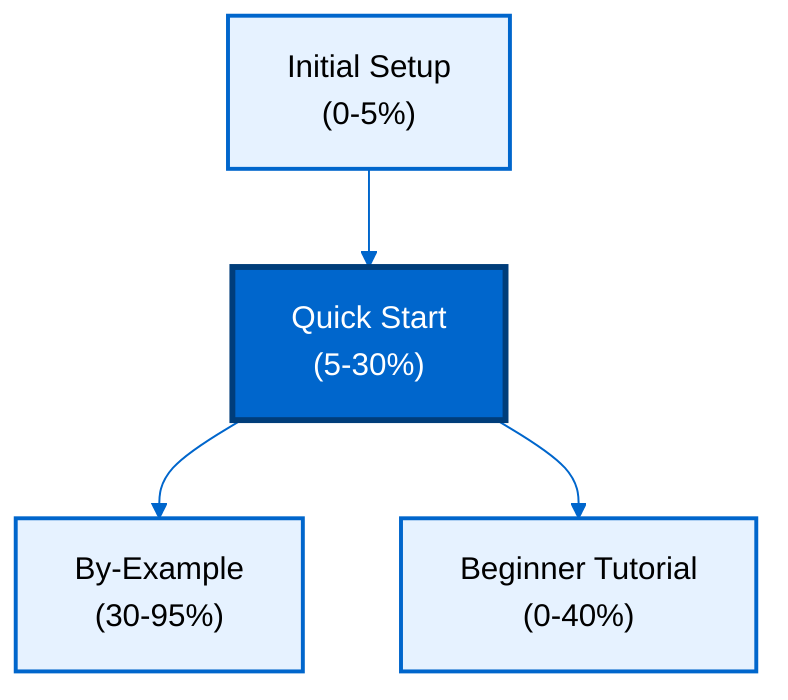

**Want to quickly build Java applications with databases?** This quick start introduces Spring Data JPA's core concepts through a working application. You'll learn entities, repositories, queries, relationships, and transactions - the essential 5-30% that powers productive Spring Data JPA development.

## Prerequisites

Before starting, complete [Initial Setup](/en/learn/software-engineering/data/tools/spring-data-jpa/initial-setup) to install Spring Boot with Spring Data JPA and verify your environment.

You should have:

- Java 17+ installed
- Spring Boot project with Spring Data JPA
- H2 or PostgreSQL database running
- Basic Java knowledge (classes, interfaces, annotations)
- Completed "Your First CRUD Operations" from Initial Setup

## What You'll Build

You'll create a **task management system** with:

- Users with roles and authentication
- Projects with team members
- Tasks with assignments and priorities
- Comments on tasks
- Queries with filtering and pagination
- Custom repository methods
- Specifications for dynamic queries

This covers 5-30% of Spring Data JPA features - enough to build real applications while understanding core concepts.

## Learning Path



## Learning Objectives

By the end of this quick start, you will:

1. **Define entities** with JPA annotations and relationships
2. **Create repositories** extending JpaRepository
3. **Query data** with derived query methods
4. **Write custom queries** with @Query and JPQL
5. **Manage relationships** (one-to-many, many-to-many)
6. **Use pagination** and sorting
7. **Execute transactions** with @Transactional
8. **Apply specifications** for dynamic queries

## Entity Definitions

Define JPA entities with annotations.

### User Entity

Create `src/main/java/com/example/taskmanager/entity/User.java`:

```java
package com.example.taskmanager.entity;

import jakarta.persistence.*;
import lombok.AllArgsConstructor;
import lombok.Data;
import lombok.NoArgsConstructor;

import java.time.LocalDateTime;
import java.util.HashSet;
import java.util.Set;

@Entity
@Table(name = "users")
@Data
@NoArgsConstructor
@AllArgsConstructor
public class User {

    @Id
    @GeneratedValue(strategy = GenerationType.IDENTITY)
    private Long id;

    @Column(nullable = false, unique = true, length = 50)
    private String username;

    @Column(nullable = false, unique = true, length = 100)
    private String email;

    @Column(nullable = false)
    private String passwordHash;

    @Enumerated(EnumType.STRING)
    @Column(nullable = false)
    private Role role = Role.USER;

    @Column
    private Boolean active = true;

    @Column(name = "created_at", updatable = false)
    private LocalDateTime createdAt;

    @Column(name = "updated_at")
    private LocalDateTime updatedAt;

    @OneToMany(mappedBy = "assignee")
    private Set<Task> assignedTasks = new HashSet<>();

    @ManyToMany(mappedBy = "members")
    private Set<Project> projects = new HashSet<>();

    @PrePersist
    protected void onCreate() {
        createdAt = LocalDateTime.now();
        updatedAt = LocalDateTime.now();
    }

    @PreUpdate
    protected void onUpdate() {
        updatedAt = LocalDateTime.now();
    }

    public enum Role {
        USER, ADMIN, MANAGER
    }
}
```

### Project Entity with Relationships

```java
package com.example.taskmanager.entity;

import jakarta.persistence.*;
import lombok.AllArgsConstructor;
import lombok.Data;
import lombok.NoArgsConstructor;

import java.time.LocalDate;
import java.time.LocalDateTime;
import java.util.HashSet;
import java.util.Set;

@Entity
@Table(name = "projects")
@Data
@NoArgsConstructor
@AllArgsConstructor
public class Project {

    @Id
    @GeneratedValue(strategy = GenerationType.IDENTITY)
    private Long id;

    @Column(nullable = false, length = 200)
    private String name;

    @Column(columnDefinition = "TEXT")
    private String description;

    @Column
    private LocalDate startDate;

    @Column
    private LocalDate endDate;

    @Enumerated(EnumType.STRING)
    @Column(nullable = false)
    private Status status = Status.ACTIVE;

    @Column(name = "created_at", updatable = false)
    private LocalDateTime createdAt;

    @ManyToMany
    @JoinTable(
        name = "project_members",
        joinColumns = @JoinColumn(name = "project_id"),
        inverseJoinColumns = @JoinColumn(name = "user_id")
    )
    private Set<User> members = new HashSet<>();

    @OneToMany(mappedBy = "project", cascade = CascadeType.ALL)
    private Set<Task> tasks = new HashSet<>();

    @PrePersist
    protected void onCreate() {
        createdAt = LocalDateTime.now();
    }

    public enum Status {
        ACTIVE, COMPLETED, ARCHIVED
    }
}
```

### Task Entity

```java
package com.example.taskmanager.entity;

import jakarta.persistence.*;
import lombok.AllArgsConstructor;
import lombok.Data;
import lombok.NoArgsConstructor;

import java.time.LocalDate;
import java.time.LocalDateTime;
import java.util.HashSet;
import java.util.Set;

@Entity
@Table(name = "tasks")
@Data
@NoArgsConstructor
@AllArgsConstructor
public class Task {

    @Id
    @GeneratedValue(strategy = GenerationType.IDENTITY)
    private Long id;

    @Column(nullable = false, length = 200)
    private String title;

    @Column(columnDefinition = "TEXT")
    private String description;

    @Enumerated(EnumType.STRING)
    @Column(nullable = false)
    private Status status = Status.TODO;

    @Enumerated(EnumType.STRING)
    @Column(nullable = false)
    private Priority priority = Priority.MEDIUM;

    @Column
    private LocalDate dueDate;

    @ManyToOne(fetch = FetchType.LAZY)
    @JoinColumn(name = "project_id", nullable = false)
    private Project project;

    @ManyToOne(fetch = FetchType.LAZY)
    @JoinColumn(name = "assignee_id")
    private User assignee;

    @OneToMany(mappedBy = "task", cascade = CascadeType.ALL)
    private Set<Comment> comments = new HashSet<>();

    @Column(name = "created_at", updatable = false)
    private LocalDateTime createdAt;

    @PrePersist
    protected void onCreate() {
        createdAt = LocalDateTime.now();
    }

    public enum Status {
        TODO, IN_PROGRESS, DONE
    }

    public enum Priority {
        LOW, MEDIUM, HIGH, URGENT
    }
}
```

## Repository Interfaces

Create repository interfaces for database operations.

### UserRepository

```java
package com.example.taskmanager.repository;

import com.example.taskmanager.entity.User;
import org.springframework.data.jpa.repository.JpaRepository;
import org.springframework.data.jpa.repository.Query;
import org.springframework.data.repository.query.Param;
import org.springframework.stereotype.Repository;

import java.util.List;
import java.util.Optional;

@Repository
public interface UserRepository extends JpaRepository<User, Long> {

    // Derived query methods
    Optional<User> findByUsername(String username);

    Optional<User> findByEmail(String email);

    List<User> findByRole(User.Role role);

    List<User> findByActiveTrue();

    boolean existsByUsername(String username);

    // Custom query with @Query
    @Query("SELECT u FROM User u WHERE LOWER(u.username) LIKE LOWER(CONCAT('%', :searchTerm, '%'))")
    List<User> searchByUsername(@Param("searchTerm") String searchTerm);

    // Count query
    @Query("SELECT COUNT(u) FROM User u WHERE u.active = true")
    long countActiveUsers();
}
```

### ProjectRepository

```java
package com.example.taskmanager.repository;

import com.example.taskmanager.entity.Project;
import org.springframework.data.domain.Page;
import org.springframework.data.domain.Pageable;
import org.springframework.data.jpa.repository.JpaRepository;
import org.springframework.data.jpa.repository.Query;
import org.springframework.data.repository.query.Param;
import org.springframework.stereotype.Repository;

import java.time.LocalDate;
import java.util.List;

@Repository
public interface ProjectRepository extends JpaRepository<Project, Long> {

    List<Project> findByStatus(Project.Status status);

    Page<Project> findByStatus(Project.Status status, Pageable pageable);

    @Query("SELECT p FROM Project p WHERE p.startDate <= :date AND (p.endDate IS NULL OR p.endDate >= :date)")
    List<Project> findActiveProjectsOnDate(@Param("date") LocalDate date);

    @Query("SELECT p FROM Project p JOIN p.members m WHERE m.id = :userId")
    List<Project> findByMemberId(@Param("userId") Long userId);

    @Query("SELECT p FROM Project p LEFT JOIN FETCH p.members WHERE p.id = :id")
    Optional<Project> findByIdWithMembers(@Param("id") Long id);
}
```

### TaskRepository

```java
package com.example.taskmanager.repository;

import com.example.taskmanager.entity.Task;
import org.springframework.data.domain.Page;
import org.springframework.data.domain.Pageable;
import org.springframework.data.jpa.repository.JpaRepository;
import org.springframework.data.jpa.repository.Query;
import org.springframework.data.repository.query.Param;
import org.springframework.stereotype.Repository;

import java.time.LocalDate;
import java.util.List;

@Repository
public interface TaskRepository extends JpaRepository<Task, Long> {

    List<Task> findByProjectId(Long projectId);

    List<Task> findByAssigneeId(Long userId);

    List<Task> findByStatus(Task.Status status);

    List<Task> findByPriority(Task.Priority priority);

    List<Task> findByDueDateBefore(LocalDate date);

    Page<Task> findByProjectId(Long projectId, Pageable pageable);

    @Query("SELECT t FROM Task t WHERE t.assignee.id = :userId AND t.status <> 'DONE'")
    List<Task> findIncompleteTasksByUserId(@Param("userId") Long userId);

    @Query("SELECT t FROM Task t WHERE t.project.id = :projectId AND t.dueDate BETWEEN :startDate AND :endDate")
    List<Task> findByProjectAndDateRange(
        @Param("projectId") Long projectId,
        @Param("startDate") LocalDate startDate,
        @Param("endDate") LocalDate endDate
    );

    @Query("SELECT COUNT(t) FROM Task t WHERE t.assignee.id = :userId AND t.status = :status")
    long countByAssigneeIdAndStatus(@Param("userId") Long userId, @Param("status") Task.Status status);
}
```

## Service Layer

Create service classes for business logic.

### UserService

```java
package com.example.taskmanager.service;

import com.example.taskmanager.entity.User;
import com.example.taskmanager.repository.UserRepository;
import lombok.RequiredArgsConstructor;
import org.springframework.stereotype.Service;
import org.springframework.transaction.annotation.Transactional;

import java.util.List;
import java.util.Optional;

@Service
@RequiredArgsConstructor
@Transactional(readOnly = true)
public class UserService {

    private final UserRepository userRepository;

    public List<User> findAll() {
        return userRepository.findAll();
    }

    public Optional<User> findById(Long id) {
        return userRepository.findById(id);
    }

    public Optional<User> findByUsername(String username) {
        return userRepository.findByUsername(username);
    }

    @Transactional
    public User create(User user) {
        if (userRepository.existsByUsername(user.getUsername())) {
            throw new IllegalArgumentException("Username already exists");
        }
        return userRepository.save(user);
    }

    @Transactional
    public User update(Long id, User updatedUser) {
        return userRepository.findById(id)
            .map(user -> {
                user.setEmail(updatedUser.getEmail());
                user.setRole(updatedUser.getRole());
                user.setActive(updatedUser.getActive());
                return userRepository.save(user);
            })
            .orElseThrow(() -> new IllegalArgumentException("User not found"));
    }

    @Transactional
    public void delete(Long id) {
        userRepository.deleteById(id);
    }

    public List<User> searchByUsername(String searchTerm) {
        return userRepository.searchByUsername(searchTerm);
    }
}
```

### ProjectService

```java
package com.example.taskmanager.service;

import com.example.taskmanager.entity.Project;
import com.example.taskmanager.entity.User;
import com.example.taskmanager.repository.ProjectRepository;
import com.example.taskmanager.repository.UserRepository;
import lombok.RequiredArgsConstructor;
import org.springframework.data.domain.Page;
import org.springframework.data.domain.Pageable;
import org.springframework.stereotype.Service;
import org.springframework.transaction.annotation.Transactional;

import java.util.List;

@Service
@RequiredArgsConstructor
@Transactional(readOnly = true)
public class ProjectService {

    private final ProjectRepository projectRepository;
    private final UserRepository userRepository;

    public Page<Project> findAll(Pageable pageable) {
        return projectRepository.findAll(pageable);
    }

    public List<Project> findByStatus(Project.Status status) {
        return projectRepository.findByStatus(status);
    }

    @Transactional
    public Project create(Project project) {
        return projectRepository.save(project);
    }

    @Transactional
    public Project addMember(Long projectId, Long userId) {
        Project project = projectRepository.findByIdWithMembers(projectId)
            .orElseThrow(() -> new IllegalArgumentException("Project not found"));

        User user = userRepository.findById(userId)
            .orElseThrow(() -> new IllegalArgumentException("User not found"));

        project.getMembers().add(user);
        return projectRepository.save(project);
    }

    @Transactional
    public Project removeMember(Long projectId, Long userId) {
        Project project = projectRepository.findByIdWithMembers(projectId)
            .orElseThrow(() -> new IllegalArgumentException("Project not found"));

        project.getMembers().removeIf(user -> user.getId().equals(userId));
        return projectRepository.save(project);
    }

    public List<Project> findByMemberId(Long userId) {
        return projectRepository.findByMemberId(userId);
    }
}
```

## Derived Query Methods

Spring Data JPA generates implementation from method names.

### Query Method Patterns

```java
// Equality
findByUsername(String username)
findByEmailAndActive(String email, Boolean active)

// Comparison
findByDueDateBefore(LocalDate date)
findByDueDateAfter(LocalDate date)
findByDueDateBetween(LocalDate start, LocalDate end)

// Like / Containing
findByTitleLike(String pattern)
findByTitleContaining(String substring)
findByTitleStartingWith(String prefix)

// Null checks
findByAssigneeIsNull()
findByAssigneeIsNotNull()

// Ordering
findByStatusOrderByDueDateAsc(Task.Status status)
findByProjectIdOrderByPriorityDescDueDateAsc(Long projectId)

// Limiting
findTop10ByOrderByCreatedAtDesc()
findFirst5ByStatus(Task.Status status)

// Boolean
findByActiveTrue()
findByActiveFalse()

// Existence
existsByUsername(String username)
existsByIdAndActive(Long id, Boolean active)

// Counting
countByStatus(Task.Status status)
countByAssigneeIdAndStatus(Long userId, Task.Status status)

// Deleting
deleteByStatus(Task.Status status)
```

## Custom Queries with @Query

Write JPQL or native SQL for complex queries.

### JPQL Queries

```java
@Query("SELECT t FROM Task t WHERE t.assignee.id = :userId AND t.status <> 'DONE'")
List<Task> findIncompleteTasksByUserId(@Param("userId") Long userId);

@Query("SELECT t FROM Task t JOIN FETCH t.assignee WHERE t.project.id = :projectId")
List<Task> findByProjectIdWithAssignee(@Param("projectId") Long projectId);

@Query("SELECT NEW com.example.taskmanager.dto.TaskSummary(t.id, t.title, t.status) " +
       "FROM Task t WHERE t.priority = :priority")
List<TaskSummary> findTaskSummariesByPriority(@Param("priority") Task.Priority priority);
```

### Native SQL Queries

```java
@Query(value = "SELECT * FROM tasks WHERE assignee_id = :userId ORDER BY priority DESC, due_date ASC",
       nativeQuery = true)
List<Task> findByAssigneeIdNative(@Param("userId") Long userId);

@Query(value = "SELECT u.username, COUNT(t.id) as task_count " +
               "FROM users u LEFT JOIN tasks t ON u.id = t.assignee_id " +
               "GROUP BY u.id, u.username " +
               "HAVING COUNT(t.id) > :minTasks",
       nativeQuery = true)
List<Object[]> findUsersWithMinTasks(@Param("minTasks") long minTasks);
```

## Pagination and Sorting

Use Pageable for efficient data retrieval.

### Repository Methods with Pagination

```java
public interface TaskRepository extends JpaRepository<Task, Long> {

    Page<Task> findByProjectId(Long projectId, Pageable pageable);

    Page<Task> findByStatus(Task.Status status, Pageable pageable);

    Page<Task> findByAssigneeId(Long userId, Pageable pageable);
}
```

### Service Usage

```java
@Service
@RequiredArgsConstructor
public class TaskService {

    private final TaskRepository taskRepository;

    public Page<Task> findByProject(Long projectId, int page, int size, String sortBy) {
        Pageable pageable = PageRequest.of(page, size, Sort.by(sortBy).ascending());
        return taskRepository.findByProjectId(projectId, pageable);
    }

    public Page<Task> findByStatusSorted(Task.Status status, int page, int size) {
        Pageable pageable = PageRequest.of(
            page,
            size,
            Sort.by("priority").descending()
                .and(Sort.by("dueDate").ascending())
        );
        return taskRepository.findByStatus(status, pageable);
    }
}
```

### Controller Endpoint

```java
@RestController
@RequestMapping("/api/tasks")
@RequiredArgsConstructor
public class TaskController {

    private final TaskService taskService;

    @GetMapping("/project/{projectId}")
    public ResponseEntity<Page<Task>> getProjectTasks(
        @PathVariable Long projectId,
        @RequestParam(defaultValue = "0") int page,
        @RequestParam(defaultValue = "20") int size,
        @RequestParam(defaultValue = "dueDate") String sortBy
    ) {
        Page<Task> tasks = taskService.findByProject(projectId, page, size, sortBy);
        return ResponseEntity.ok(tasks);
    }
}
```

## Transactions

Group operations atomically with @Transactional.

### Declarative Transactions

```java
@Service
@RequiredArgsConstructor
public class TaskService {

    private final TaskRepository taskRepository;
    private final UserRepository userRepository;

    @Transactional
    public Task assignTask(Long taskId, Long userId) {
        Task task = taskRepository.findById(taskId)
            .orElseThrow(() -> new IllegalArgumentException("Task not found"));

        User user = userRepository.findById(userId)
            .orElseThrow(() -> new IllegalArgumentException("User not found"));

        task.setAssignee(user);
        task.setStatus(Task.Status.IN_PROGRESS);

        return taskRepository.save(task);
    }

    @Transactional
    public void completeTask(Long taskId) {
        Task task = taskRepository.findById(taskId)
            .orElseThrow(() -> new IllegalArgumentException("Task not found"));

        if (task.getStatus() == Task.Status.DONE) {
            throw new IllegalStateException("Task already completed");
        }

        task.setStatus(Task.Status.DONE);
        taskRepository.save(task);
    }

    @Transactional(readOnly = true)
    public List<Task> findIncompleteTasksByUser(Long userId) {
        return taskRepository.findIncompleteTasksByUserId(userId);
    }
}
```

### Programmatic Transactions

```java
@Service
@RequiredArgsConstructor
public class ProjectService {

    private final TransactionTemplate transactionTemplate;
    private final ProjectRepository projectRepository;
    private final TaskRepository taskRepository;

    public Project createProjectWithTasks(Project project, List<Task> tasks) {
        return transactionTemplate.execute(status -> {
            Project savedProject = projectRepository.save(project);

            tasks.forEach(task -> {
                task.setProject(savedProject);
                taskRepository.save(task);
            });

            return savedProject;
        });
    }
}
```

## Specifications for Dynamic Queries

Build type-safe dynamic queries with JPA Criteria API.

### Entity Specification

```java
package com.example.taskmanager.specification;

import com.example.taskmanager.entity.Task;
import org.springframework.data.jpa.domain.Specification;

import java.time.LocalDate;

public class TaskSpecification {

    public static Specification<Task> hasStatus(Task.Status status) {
        return (root, query, cb) ->
            status == null ? null : cb.equal(root.get("status"), status);
    }

    public static Specification<Task> hasPriority(Task.Priority priority) {
        return (root, query, cb) ->
            priority == null ? null : cb.equal(root.get("priority"), priority);
    }

    public static Specification<Task> hasAssignee(Long userId) {
        return (root, query, cb) ->
            userId == null ? null : cb.equal(root.get("assignee").get("id"), userId);
    }

    public static Specification<Task> dueDateBefore(LocalDate date) {
        return (root, query, cb) ->
            date == null ? null : cb.lessThanOrEqual(root.get("dueDate"), date);
    }

    public static Specification<Task> titleContains(String keyword) {
        return (root, query, cb) ->
            keyword == null ? null : cb.like(cb.lower(root.get("title")),
                                             "%" + keyword.toLowerCase() + "%");
    }
}
```

### Repository with Specifications

```java
public interface TaskRepository extends JpaRepository<Task, Long>,
                                         JpaSpecificationExecutor<Task> {
    // Standard repository methods
}
```

### Service with Dynamic Queries

```java
@Service
@RequiredArgsConstructor
public class TaskService {

    private final TaskRepository taskRepository;

    public List<Task> searchTasks(Task.Status status,
                                   Task.Priority priority,
                                   Long userId,
                                   LocalDate dueBefore,
                                   String titleKeyword) {

        Specification<Task> spec = Specification.where(null);

        if (status != null) {
            spec = spec.and(TaskSpecification.hasStatus(status));
        }
        if (priority != null) {
            spec = spec.and(TaskSpecification.hasPriority(priority));
        }
        if (userId != null) {
            spec = spec.and(TaskSpecification.hasAssignee(userId));
        }
        if (dueBefore != null) {
            spec = spec.and(TaskSpecification.dueDateBefore(dueBefore));
        }
        if (titleKeyword != null) {
            spec = spec.and(TaskSpecification.titleContains(titleKeyword));
        }

        return taskRepository.findAll(spec);
    }
}
```

## Next Steps

You've learned Spring Data JPA's core concepts covering 5-30% of the framework. Continue learning:

1. **[By-Example Tutorial](/en/learn/software-engineering/data/tools/spring-data-jpa/by-example)** - Annotated examples covering 95% of Spring Data JPA (beginner, intermediate, advanced)
2. **Beginner Tutorial** (coming soon) - Narrative-driven comprehensive guide
3. **[Spring Data JPA Documentation](https://spring.io/projects/spring-data-jpa)** - Comprehensive reference

**What you've learned**:

- Entity definition with JPA annotations and relationships
- Repository interfaces with derived query methods
- Custom queries with @Query and JPQL
- Pagination and sorting for efficient data retrieval
- Transactions for data consistency
- Specifications for type-safe dynamic queries
- Service layer patterns
- Many-to-many and one-to-many relationships

**Topics to explore next**:

- Entity graphs for optimized fetching
- Auditing with @CreatedBy and @LastModifiedBy
- Projections and DTOs
- Named queries and named entity graphs
- Second-level cache configuration
- Query hints and optimization
- Batch operations

## Summary

This quick start covered essential Spring Data JPA concepts through a task management system:

**Entities**: Defined JPA entities with annotations, relationships, and lifecycle callbacks

**Repositories**: Created repository interfaces with derived query methods and custom @Query

**Services**: Implemented service layer with business logic and transaction management

**Queries**: Wrote JPQL and native SQL queries for complex data retrieval

**Pagination**: Applied Pageable for efficient data fetching with sorting

**Transactions**: Ensured data consistency with @Transactional

**Specifications**: Built type-safe dynamic queries with JPA Criteria API

**Relationships**: Managed one-to-many and many-to-many associations

You're now ready to build Java applications with databases using Spring Data JPA. Continue to By-Example for deeper mastery covering 95% of Spring Data JPA features.
