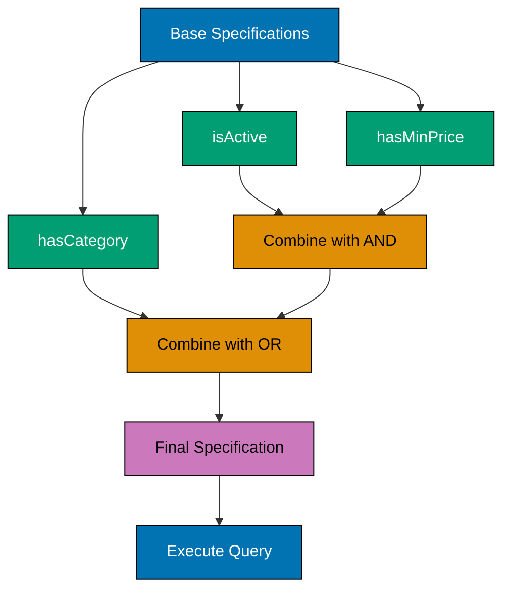
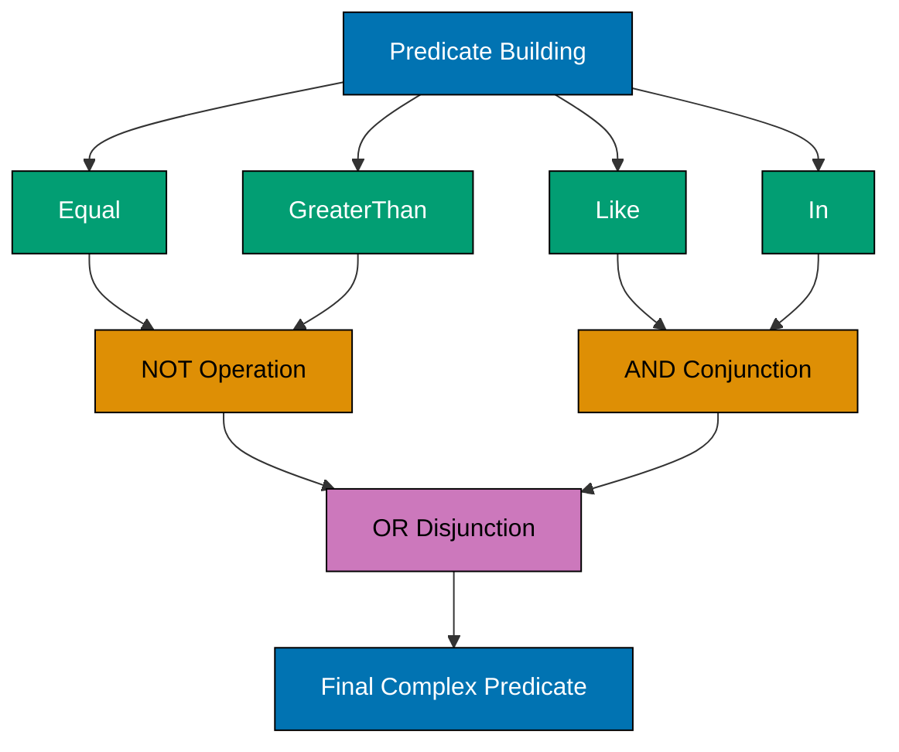
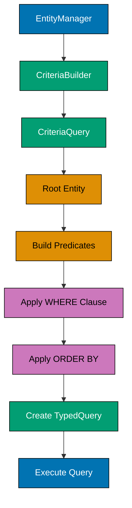
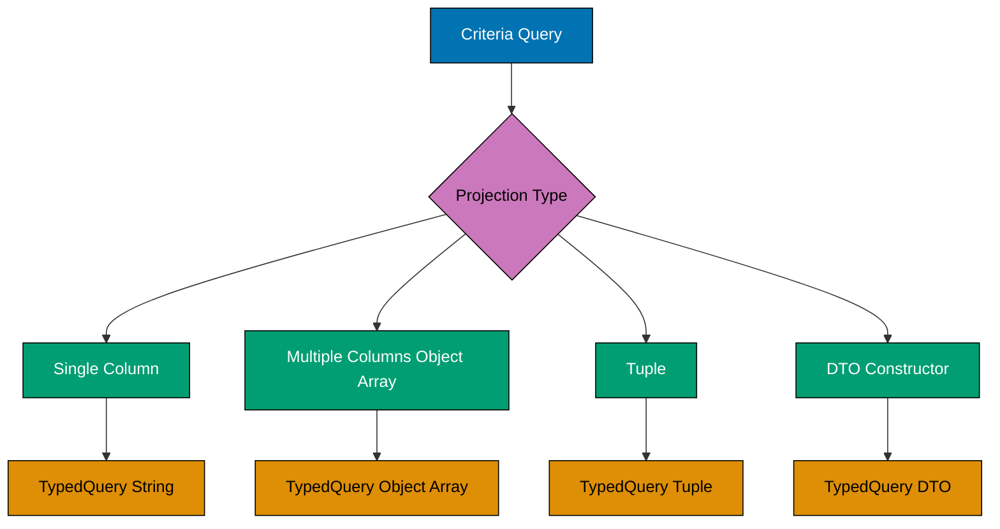
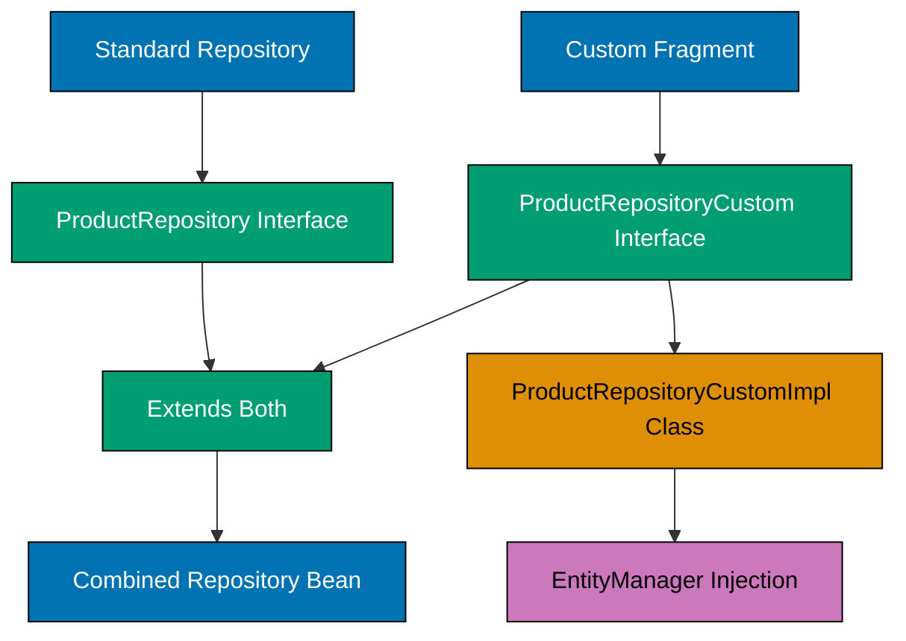
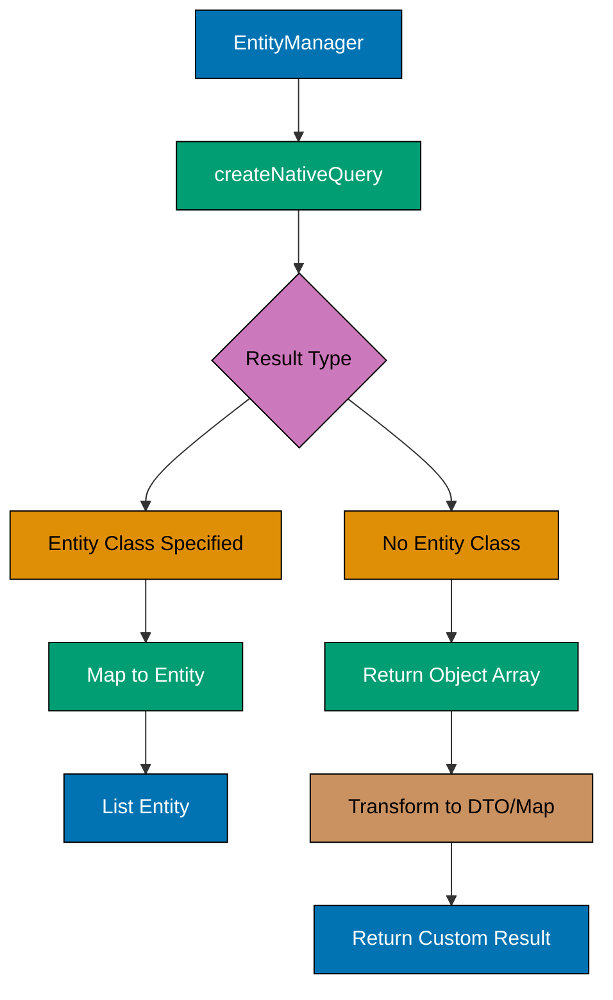
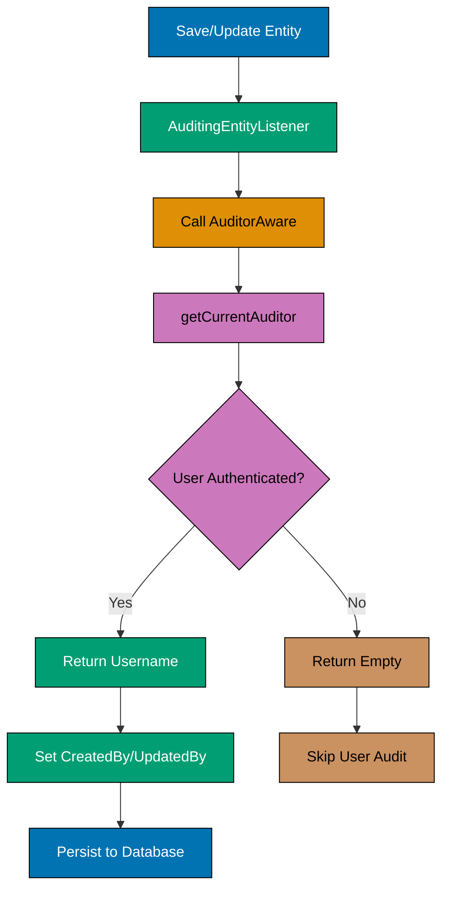
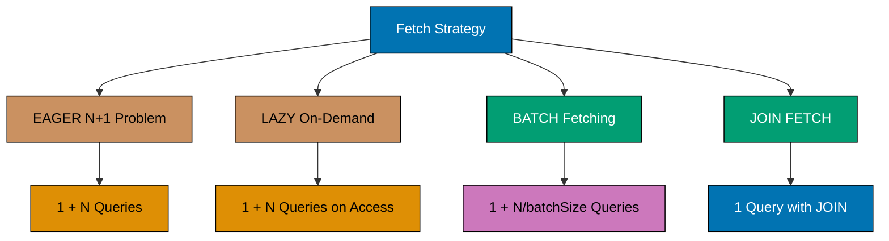

## Example 61: Basic Specification with Single Predicate

Specifications provide type-safe dynamic query building using the Criteria API.

```java
import org.springframework.data.jpa.domain.Specification;
import jakarta.persistence.criteria.CriteriaBuilder;
import jakarta.persistence.criteria.CriteriaQuery;
import jakarta.persistence.criteria.Predicate;
import jakarta.persistence.criteria.Root;

// => Entity
@Entity
public class Product {
    @Id @GeneratedValue
    private Long id;
    private String name;
    private BigDecimal price;
    private boolean active;
    // getters/setters
}

// => Specification for active products
public class ProductSpecifications {
    public static Specification<Product> isActive() {
        return (Root<Product> root, CriteriaQuery<?> query, CriteriaBuilder cb) -> {
            // => Root: represents Product entity in query
            // => CriteriaBuilder: creates predicates, expressions
            return cb.equal(root.get("active"), true);
            // => Same as: WHERE active = true
        };
    }
}

// => Repository with JpaSpecificationExecutor
public interface ProductRepository extends JpaRepository<Product, Long>,
                                           JpaSpecificationExecutor<Product> {
    // => JpaSpecificationExecutor adds findAll(Specification) methods
}

// => Usage in service
@Service
public class ProductService {
    @Autowired
    private ProductRepository productRepository;

    public List<Product> getActiveProducts() {
        // => Execute specification
        return productRepository.findAll(ProductSpecifications.isActive());
        // => Returns only products where active = true
    }
}
```

**Key Takeaway**: Specifications encapsulate reusable query logic using the Criteria API. Extend `JpaSpecificationExecutor` to enable specification-based queries.

## Example 62: Combining Specifications with AND/OR

Build complex queries by composing simple specifications using logical operators.



```java
public class ProductSpecifications {
    public static Specification<Product> isActive() {
        return (root, query, cb) -> cb.equal(root.get("active"), true);
    }

    public static Specification<Product> hasMinPrice(BigDecimal minPrice) {
        return (root, query, cb) ->
            cb.greaterThanOrEqualTo(root.get("price"), minPrice);
            // => WHERE price >= :minPrice
    }

    public static Specification<Product> hasCategory(String category) {
        return (root, query, cb) ->
            cb.equal(root.get("category"), category);
            // => WHERE category = :category
    }
}

@Service
public class ProductService {
    @Autowired
    private ProductRepository productRepository;

    public List<Product> searchProducts(BigDecimal minPrice, String category) {
        // => Combine specifications with AND
        Specification<Product> spec = Specification
            .where(ProductSpecifications.isActive())
            // => WHERE active = true
            .and(ProductSpecifications.hasMinPrice(minPrice))
            // => AND price >= :minPrice
            .and(ProductSpecifications.hasCategory(category));
            // => AND category = :category

        return productRepository.findAll(spec);
        // => Final query: WHERE active = true AND price >= :minPrice AND category = :category
    }

    public List<Product> searchFlexible(BigDecimal minPrice, String cat1, String cat2) {
        // => Complex combination: AND with OR
        Specification<Product> spec = Specification
            .where(ProductSpecifications.isActive())
            .and(ProductSpecifications.hasMinPrice(minPrice))
            .and(ProductSpecifications.hasCategory(cat1)
                .or(ProductSpecifications.hasCategory(cat2)));
                // => WHERE active = true AND price >= :minPrice
                //    AND (category = :cat1 OR category = :cat2)

        return productRepository.findAll(spec);
    }
}
```

**Key Takeaway**: Use `Specification.where().and().or()` to combine specifications. Each method returns a new specification, enabling fluent chaining for complex queries.

## Example 63: Dynamic Query Building with Null-Safe Specifications

Build queries dynamically based on optional filter parameters.

```java
@Service
public class ProductService {
    @Autowired
    private ProductRepository productRepository;

    public List<Product> searchWithFilters(
        String name,
        BigDecimal minPrice,
        BigDecimal maxPrice,
        String category
    ) {
        // => Start with null specification (no filtering)
        Specification<Product> spec = Specification.where(null);
        // => Specification.where(null) returns a pass-through specification

        // => Add filters conditionally
        if (name != null && !name.isEmpty()) {
            spec = spec.and(hasNameContaining(name));
            // => Only add if name parameter provided
        }

        if (minPrice != null) {
            spec = spec.and(hasMinPrice(minPrice));
            // => Only add if minPrice parameter provided
        }

        if (maxPrice != null) {
            spec = spec.and(hasMaxPrice(maxPrice));
            // => Only add if maxPrice parameter provided
        }

        if (category != null && !category.isEmpty()) {
            spec = spec.and(hasCategory(category));
            // => Only add if category parameter provided
        }

        // => Execute composed specification
        return productRepository.findAll(spec);
        // => Query adapts to provided parameters
        // => Example: If only name and minPrice provided:
        //    WHERE name LIKE :name AND price >= :minPrice
    }

    // => Helper specifications
    private static Specification<Product> hasNameContaining(String name) {
        return (root, query, cb) ->
            cb.like(cb.lower(root.get("name")), "%" + name.toLowerCase() + "%");
            // => Case-insensitive LIKE with wildcards
    }

    private static Specification<Product> hasMaxPrice(BigDecimal maxPrice) {
        return (root, query, cb) ->
            cb.lessThanOrEqualTo(root.get("price"), maxPrice);
            // => WHERE price <= :maxPrice
    }
}
```

**Key Takeaway**: Start with `Specification.where(null)` and conditionally add filters. This pattern creates flexible search methods that adapt to provided parameters.

## Example 64: Specifications with Joins

Navigate entity relationships in specifications using joins.

```java
// => Entities with relationship
@Entity
public class Order {
    @Id @GeneratedValue
    private Long id;
    private LocalDateTime orderDate;
    private String status;

    @ManyToOne
    @JoinColumn(name = "customer_id")
    private Customer customer;
    // => Order belongs to Customer

    @OneToMany(mappedBy = "order")
    private List<OrderItem> items = new ArrayList<>();
    // => Order has many OrderItems
}

@Entity
public class Customer {
    @Id @GeneratedValue
    private Long id;
    private String email;
    private String tier; // GOLD, SILVER, BRONZE
}

@Entity
public class OrderItem {
    @Id @GeneratedValue
    private Long id;
    private Integer quantity;

    @ManyToOne
    @JoinColumn(name = "order_id")
    private Order order;

    @ManyToOne
    @JoinColumn(name = "product_id")
    private Product product;
}

// => Specifications with joins
public class OrderSpecifications {
    public static Specification<Order> hasCustomerEmail(String email) {
        return (root, query, cb) -> {
            // => Join to Customer entity
            Join<Order, Customer> customerJoin = root.join("customer");
            // => Navigate from Order to Customer relationship

            return cb.equal(customerJoin.get("email"), email);
            // => WHERE customer.email = :email
            // => SQL: ... JOIN customer ON order.customer_id = customer.id
            //         WHERE customer.email = :email
        };
    }

    public static Specification<Order> hasCustomerTier(String tier) {
        return (root, query, cb) -> {
            Join<Order, Customer> customerJoin = root.join("customer");
            return cb.equal(customerJoin.get("tier"), tier);
            // => Filter by joined entity property
        };
    }

    public static Specification<Order> hasProductInItems(String productName) {
        return (root, query, cb) -> {
            // => Multiple joins: Order -> OrderItem -> Product
            Join<Order, OrderItem> itemsJoin = root.join("items");
            // => Join from Order to OrderItem

            Join<OrderItem, Product> productJoin = itemsJoin.join("product");
            // => Join from OrderItem to Product

            return cb.equal(productJoin.get("name"), productName);
            // => WHERE product.name = :productName
            // => SQL: ... JOIN order_item ON order.id = order_item.order_id
            //         JOIN product ON order_item.product_id = product.id
            //         WHERE product.name = :productName
        };
    }
}

@Service
public class OrderService {
    @Autowired
    private OrderRepository orderRepository;

    public List<Order> findGoldCustomerOrders() {
        // => Find all orders from GOLD tier customers
        return orderRepository.findAll(
            OrderSpecifications.hasCustomerTier("GOLD")
        );
        // => Automatically generates proper join SQL
    }

    public List<Order> findOrdersWithProduct(String productName, String customerEmail) {
        // => Combine multiple joins
        Specification<Order> spec = Specification
            .where(OrderSpecifications.hasProductInItems(productName))
            .and(OrderSpecifications.hasCustomerEmail(customerEmail));
            // => WHERE product.name = :productName AND customer.email = :customerEmail
            // => Multiple joins in single query

        return orderRepository.findAll(spec);
    }
}
```

**Key Takeaway**: Use `root.join("relationshipName")` to navigate entity relationships in specifications. Joins can be chained for multi-level navigation.

## Example 65: Specifications with NOT and Complex Predicates

Use negation and complex predicate logic in specifications.



```java
public class ProductSpecifications {
    public static Specification<Product> isNotActive() {
        return (root, query, cb) -> {
            // => Use NOT to negate predicate
            Predicate activePredicate = cb.equal(root.get("active"), true);
            return cb.not(activePredicate);
            // => WHERE NOT (active = true)
            // => Equivalent to: WHERE active = false
        };
    }

    public static Specification<Product> isNotInCategories(List<String> excludedCategories) {
        return (root, query, cb) -> {
            // => Negate IN clause
            Predicate inPredicate = root.get("category").in(excludedCategories);
            return cb.not(inPredicate);
            // => WHERE NOT (category IN (:categories))
            // => Equivalent to: WHERE category NOT IN (:categories)
        };
    }

    public static Specification<Product> hasComplexFilter(
        BigDecimal minPrice,
        BigDecimal maxPrice,
        List<String> excludedCategories
    ) {
        return (root, query, cb) -> {
            // => Build multiple predicates
            Predicate pricePredicate = cb.between(
                root.get("price"),
                minPrice,
                maxPrice
            );
            // => price BETWEEN :minPrice AND :maxPrice

            Predicate categoryPredicate = cb.not(
                root.get("category").in(excludedCategories)
            );
            // => category NOT IN (:excludedCategories)

            Predicate activePredicate = cb.equal(root.get("active"), true);
            // => active = true

            // => Combine with AND
            return cb.and(pricePredicate, categoryPredicate, activePredicate);
            // => WHERE (price BETWEEN :minPrice AND :maxPrice)
            //    AND (category NOT IN (:excludedCategories))
            //    AND (active = true)
        };
    }
}

// => Alternative: Using Specification composition with NOT
@Service
public class ProductService {
    public List<Product> findActiveProductsExcludingCategories(
        List<String> excludedCategories
    ) {
        // => Compose with Specification.not()
        Specification<Product> spec = Specification
            .where(ProductSpecifications.isActive())
            .and(Specification.not(
                ProductSpecifications.hasCategory(excludedCategories.get(0))
            ));
            // => WHERE active = true AND NOT (category = :category)

        return productRepository.findAll(spec);
    }

    public List<Product> findWithOrCondition(String cat1, String cat2, BigDecimal minPrice) {
        // => Complex OR with AND
        Specification<Product> spec = (root, query, cb) -> {
            Predicate category1 = cb.equal(root.get("category"), cat1);
            Predicate category2 = cb.equal(root.get("category"), cat2);
            Predicate categoryOr = cb.or(category1, category2);
            // => (category = :cat1 OR category = :cat2)

            Predicate pricePredicate = cb.greaterThanOrEqualTo(root.get("price"), minPrice);
            // => price >= :minPrice

            return cb.and(categoryOr, pricePredicate);
            // => WHERE (category = :cat1 OR category = :cat2) AND price >= :minPrice
        };

        return productRepository.findAll(spec);
    }
}
```

**Key Takeaway**: Use `cb.not()` for negation and `cb.and()/cb.or()` to combine predicates. Build complex logical expressions using multiple predicates with proper grouping.

## Example 66: Specifications with Sorting and Pagination

Combine specifications with sorting and pagination for efficient data retrieval.

```java
@Service
public class ProductService {
    @Autowired
    private ProductRepository productRepository;

    public Page<Product> searchProductsPaged(
        String category,
        BigDecimal minPrice,
        int page,
        int size,
        String sortBy,
        boolean ascending
    ) {
        // => Build specification
        Specification<Product> spec = Specification
            .where(ProductSpecifications.isActive());

        if (category != null) {
            spec = spec.and(ProductSpecifications.hasCategory(category));
        }

        if (minPrice != null) {
            spec = spec.and(ProductSpecifications.hasMinPrice(minPrice));
        }

        // => Create sort
        Sort sort = ascending
            ? Sort.by(sortBy).ascending()
            : Sort.by(sortBy).descending();
        // => Sort by specified field and direction

        // => Create pageable
        Pageable pageable = PageRequest.of(page, size, sort);
        // => page: 0-based index
        // => size: items per page
        // => sort: sorting criteria

        // => Execute with specification and pagination
        return productRepository.findAll(spec, pageable);
        // => Returns Page<Product> with:
        //    - content: List of products for current page
        //    - totalElements: total matching products
        //    - totalPages: total number of pages
        //    - number: current page number
        //    - size: page size
    }

    public List<Product> searchWithMultipleSort(String category) {
        // => Sort by multiple fields
        Sort sort = Sort.by(
            Sort.Order.desc("price"),    // Primary: price descending
            Sort.Order.asc("name")       // Secondary: name ascending
        );
        // => ORDER BY price DESC, name ASC

        Specification<Product> spec =
            ProductSpecifications.hasCategory(category);

        return productRepository.findAll(spec, sort);
        // => Returns sorted list without pagination
    }

    public Page<Product> searchWithDynamicSort(
        Specification<Product> spec,
        int page,
        int size,
        List<String> sortFields,
        List<String> directions
    ) {
        // => Build dynamic sort from lists
        List<Sort.Order> orders = new ArrayList<>();

        for (int i = 0; i < sortFields.size(); i++) {
            String field = sortFields.get(i);
            String direction = i < directions.size() ? directions.get(i) : "ASC";

            Sort.Order order = direction.equalsIgnoreCase("DESC")
                ? Sort.Order.desc(field)
                : Sort.Order.asc(field);

            orders.add(order);
        }

        Sort sort = Sort.by(orders);
        // => Dynamic multi-field sorting

        Pageable pageable = PageRequest.of(page, size, sort);
        return productRepository.findAll(spec, pageable);
    }
}

// => REST Controller usage
@RestController
@RequestMapping("/api/products")
public class ProductController {
    @Autowired
    private ProductService productService;

    @GetMapping("/search")
    public ResponseEntity<Page<Product>> searchProducts(
        @RequestParam(required = false) String category,
        @RequestParam(required = false) BigDecimal minPrice,
        @RequestParam(defaultValue = "0") int page,
        @RequestParam(defaultValue = "20") int size,
        @RequestParam(defaultValue = "name") String sortBy,
        @RequestParam(defaultValue = "true") boolean ascending
    ) {
        Page<Product> products = productService.searchProductsPaged(
            category, minPrice, page, size, sortBy, ascending
        );

        return ResponseEntity.ok(products);
        // => Returns JSON with pagination metadata:
        // {
        //   "content": [...],
        //   "totalElements": 150,
        //   "totalPages": 8,
        //   "number": 0,
        //   "size": 20,
        //   "sort": { "sorted": true, "unsorted": false }
        // }
    }
}
```

**Key Takeaway**: Use `findAll(Specification, Pageable)` to combine dynamic filtering with pagination and sorting. Create `Pageable` with `PageRequest.of(page, size, sort)`.

## Example 67: Specifications with Distinct and Group By

Use DISTINCT queries and aggregations in specifications.

```java
public class OrderSpecifications {
    public static Specification<Order> distinctCustomerOrders() {
        return (root, query, cb) -> {
            // => Mark query as distinct
            query.distinct(true);
            // => SELECT DISTINCT ... prevents duplicate rows

            return cb.conjunction(); // => No WHERE clause (all orders)
            // => cb.conjunction() creates always-true predicate
        };
    }

    public static Specification<Order> withDistinctCustomers(String status) {
        return (root, query, cb) -> {
            query.distinct(true);
            // => DISTINCT eliminates duplicate customers

            Join<Order, Customer> customerJoin = root.join("customer");
            // => Join to Customer

            return cb.equal(root.get("status"), status);
            // => SELECT DISTINCT customer.* FROM orders
            //    JOIN customer ... WHERE status = :status
        };
    }
}

// => Using query method for aggregations
public interface OrderRepository extends JpaRepository<Order, Long>,
                                         JpaSpecificationExecutor<Order> {
    // => COUNT query with specification
    long count(Specification<Order> spec);
    // => Returns count of matching orders

    // => For custom aggregations, use @Query or Criteria API
    @Query("SELECT o.status, COUNT(o) FROM Order o GROUP BY o.status")
    List<Object[]> countByStatus();
    // => Returns [[status1, count1], [status2, count2], ...]
}

@Service
public class OrderService {
    @Autowired
    private OrderRepository orderRepository;

    public long countActiveOrders() {
        // => Count with specification
        Specification<Order> spec = (root, query, cb) ->
            cb.equal(root.get("status"), "ACTIVE");

        return orderRepository.count(spec);
        // => SELECT COUNT(*) FROM orders WHERE status = 'ACTIVE'
    }

    public List<Order> findDistinctCustomerOrders(String status) {
        Specification<Order> spec =
            OrderSpecifications.withDistinctCustomers(status);

        return orderRepository.findAll(spec);
        // => DISTINCT prevents duplicate orders from joins
    }
}

// => Advanced: Custom aggregation with Criteria API
@Repository
public class CustomOrderRepository {
    @PersistenceContext
    private EntityManager entityManager;

    public List<Object[]> getOrderCountByCustomerTier() {
        CriteriaBuilder cb = entityManager.getCriteriaBuilder();
        // => Get CriteriaBuilder from EntityManager

        CriteriaQuery<Object[]> query = cb.createQuery(Object[].class);
        // => Query returns Object[] (multiple columns)

        Root<Order> root = query.from(Order.class);
        // => FROM Order

        Join<Order, Customer> customerJoin = root.join("customer");
        // => JOIN Customer

        query.multiselect(
            customerJoin.get("tier"),    // => SELECT customer.tier
            cb.count(root)                // => COUNT(*)
        );
        // => SELECT customer.tier, COUNT(*)

        query.groupBy(customerJoin.get("tier"));
        // => GROUP BY customer.tier

        return entityManager.createQuery(query).getResultList();
        // => Returns [[tier1, count1], [tier2, count2], ...]
    }

    public List<Object[]> getOrderSumByStatus(BigDecimal minTotal) {
        CriteriaBuilder cb = entityManager.getCriteriaBuilder();
        CriteriaQuery<Object[]> query = cb.createQuery(Object[].class);
        Root<Order> root = query.from(Order.class);

        query.multiselect(
            root.get("status"),
            cb.sum(root.get("totalAmount"))
        );
        // => SELECT status, SUM(total_amount)

        query.groupBy(root.get("status"));
        // => GROUP BY status

        query.having(
            cb.greaterThan(cb.sum(root.get("totalAmount")), minTotal)
        );
        // => HAVING SUM(total_amount) > :minTotal

        return entityManager.createQuery(query).getResultList();
    }
}
```

**Key Takeaway**: Use `query.distinct(true)` in specifications to eliminate duplicates. For aggregations with GROUP BY, use Criteria API directly with `EntityManager`.

## Example 68: Specifications with Case-Insensitive and Null Checks

Handle case-insensitive searches and null-safe filtering.

```java
public class ProductSpecifications {
    public static Specification<Product> hasNameIgnoreCase(String name) {
        return (root, query, cb) -> {
            // => Convert both sides to lowercase
            return cb.equal(
                cb.lower(root.get("name")),
                name.toLowerCase()
            );
            // => WHERE LOWER(name) = LOWER(:name)
            // => Case-insensitive exact match
        };
    }

    public static Specification<Product> nameContainsIgnoreCase(String keyword) {
        return (root, query, cb) -> {
            String pattern = "%" + keyword.toLowerCase() + "%";

            return cb.like(
                cb.lower(root.get("name")),
                pattern
            );
            // => WHERE LOWER(name) LIKE LOWER(:pattern)
            // => Case-insensitive partial match
        };
    }

    public static Specification<Product> hasNonNullDescription() {
        return (root, query, cb) -> {
            return cb.isNotNull(root.get("description"));
            // => WHERE description IS NOT NULL
        };
    }

    public static Specification<Product> hasNullOrEmptyDescription() {
        return (root, query, cb) -> {
            Predicate isNull = cb.isNull(root.get("description"));
            // => description IS NULL

            Predicate isEmpty = cb.equal(root.get("description"), "");
            // => description = ''

            return cb.or(isNull, isEmpty);
            // => WHERE description IS NULL OR description = ''
        };
    }

    public static Specification<Product> hasDescriptionOrDefault() {
        return (root, query, cb) -> {
            // => Use COALESCE for null handling
            Expression<String> descriptionOrDefault = cb.coalesce()
                .value(root.get("description"))
                .value("No description")
                .build();
            // => COALESCE(description, 'No description')

            return cb.equal(descriptionOrDefault, "No description");
            // => WHERE COALESCE(description, 'No description') = 'No description'
            // => Matches null or 'No description'
        };
    }
}

@Service
public class ProductService {
    public List<Product> searchByNameFuzzy(String keyword) {
        // => Case-insensitive search with null check
        Specification<Product> spec = (root, query, cb) -> {
            if (keyword == null || keyword.trim().isEmpty()) {
                return cb.conjunction(); // => Return all if no keyword
            }

            String pattern = "%" + keyword.trim().toLowerCase() + "%";

            return cb.like(
                cb.lower(root.get("name")),
                pattern
            );
        };

        return productRepository.findAll(spec);
    }

    public List<Product> findProductsWithDescription() {
        // => Find products with non-empty description
        Specification<Product> spec = (root, query, cb) -> {
            Predicate notNull = cb.isNotNull(root.get("description"));
            Predicate notEmpty = cb.notEqual(root.get("description"), "");

            return cb.and(notNull, notEmpty);
            // => WHERE description IS NOT NULL AND description != ''
        };

        return productRepository.findAll(spec);
    }
}
```

**Key Takeaway**: Use `cb.lower()` for case-insensitive comparisons, `cb.isNull()/isNotNull()` for null checks, and `cb.coalesce()` for null-safe defaults.

## Example 69: Basic Criteria API Query

Use Criteria API directly for full control over query construction.



```java
@Repository
public class ProductCriteriaRepository {
    @PersistenceContext
    private EntityManager entityManager;
    // => EntityManager provides access to Criteria API

    public List<Product> findActiveProducts() {
        // Step 1: Get CriteriaBuilder
        CriteriaBuilder cb = entityManager.getCriteriaBuilder();
        // => CriteriaBuilder: factory for creating query components

        // Step 2: Create CriteriaQuery
        CriteriaQuery<Product> query = cb.createQuery(Product.class);
        // => Defines return type (Product)

        // Step 3: Define Root
        Root<Product> root = query.from(Product.class);
        // => Root: starting point for query, represents Product table
        // => FROM Product

        // Step 4: Build predicates
        Predicate activePredicate = cb.equal(root.get("active"), true);
        // => WHERE active = true

        // Step 5: Apply WHERE clause
        query.where(activePredicate);
        // => Adds predicate to query

        // Step 6: Create and execute TypedQuery
        TypedQuery<Product> typedQuery = entityManager.createQuery(query);
        // => TypedQuery: executable query with type safety

        return typedQuery.getResultList();
        // => Returns List<Product>
    }

    public List<Product> findProductsByPriceRange(BigDecimal min, BigDecimal max) {
        CriteriaBuilder cb = entityManager.getCriteriaBuilder();
        CriteriaQuery<Product> query = cb.createQuery(Product.class);
        Root<Product> root = query.from(Product.class);

        // => Multiple predicates combined with AND
        Predicate minPredicate = cb.greaterThanOrEqualTo(root.get("price"), min);
        Predicate maxPredicate = cb.lessThanOrEqualTo(root.get("price"), max);
        Predicate combined = cb.and(minPredicate, maxPredicate);
        // => WHERE price >= :min AND price <= :max

        query.where(combined);

        return entityManager.createQuery(query).getResultList();
    }

    public List<Product> findProductsSorted(String sortField, boolean ascending) {
        CriteriaBuilder cb = entityManager.getCriteriaBuilder();
        CriteriaQuery<Product> query = cb.createQuery(Product.class);
        Root<Product> root = query.from(Product.class);

        // => Apply sorting
        if (ascending) {
            query.orderBy(cb.asc(root.get(sortField)));
            // => ORDER BY :sortField ASC
        } else {
            query.orderBy(cb.desc(root.get(sortField)));
            // => ORDER BY :sortField DESC
        }

        return entityManager.createQuery(query).getResultList();
    }
}
```

**Key Takeaway**: Criteria API provides programmatic query building: EntityManager → CriteriaBuilder → CriteriaQuery → Root → Predicates → TypedQuery → Results.

## Example 70: Criteria API with Joins and Path Expressions

Navigate relationships using Path and Join in Criteria API.

```java
@Repository
public class OrderCriteriaRepository {
    @PersistenceContext
    private EntityManager entityManager;

    public List<Order> findOrdersByCustomerEmail(String email) {
        CriteriaBuilder cb = entityManager.getCriteriaBuilder();
        CriteriaQuery<Order> query = cb.createQuery(Order.class);
        Root<Order> root = query.from(Order.class);

        // => Join to Customer
        Join<Order, Customer> customerJoin = root.join("customer");
        // => FROM Order o JOIN Customer c ON o.customer_id = c.id

        // => Use joined entity in predicate
        Predicate emailPredicate = cb.equal(customerJoin.get("email"), email);
        // => WHERE c.email = :email

        query.where(emailPredicate);

        return entityManager.createQuery(query).getResultList();
    }

    public List<Order> findOrdersWithProductCategory(String category) {
        CriteriaBuilder cb = entityManager.getCriteriaBuilder();
        CriteriaQuery<Order> query = cb.createQuery(Order.class);
        Root<Order> root = query.from(Order.class);

        // => Chain joins: Order -> OrderItem -> Product
        Join<Order, OrderItem> itemJoin = root.join("items");
        Join<OrderItem, Product> productJoin = itemJoin.join("product");
        // => FROM Order o
        //    JOIN OrderItem oi ON o.id = oi.order_id
        //    JOIN Product p ON oi.product_id = p.id

        Predicate categoryPredicate = cb.equal(
            productJoin.get("category"),
            category
        );
        // => WHERE p.category = :category

        query.where(categoryPredicate);
        query.distinct(true); // => Prevent duplicates from join

        return entityManager.createQuery(query).getResultList();
    }

    public List<Order> findOrdersByCustomerTierAndStatus(String tier, String status) {
        CriteriaBuilder cb = entityManager.getCriteriaBuilder();
        CriteriaQuery<Order> query = cb.createQuery(Order.class);
        Root<Order> root = query.from(Order.class);

        // => Join for customer tier
        Join<Order, Customer> customerJoin = root.join("customer");

        // => Multiple predicates: joined and root entity
        Predicate tierPredicate = cb.equal(customerJoin.get("tier"), tier);
        // => WHERE customer.tier = :tier

        Predicate statusPredicate = cb.equal(root.get("status"), status);
        // => AND order.status = :status

        query.where(cb.and(tierPredicate, statusPredicate));

        return entityManager.createQuery(query).getResultList();
    }

    public List<Order> findOrdersWithLeftJoin() {
        CriteriaBuilder cb = entityManager.getCriteriaBuilder();
        CriteriaQuery<Order> query = cb.createQuery(Order.class);
        Root<Order> root = query.from(Order.class);

        // => LEFT JOIN (includes orders without items)
        root.join("items", JoinType.LEFT);
        // => FROM Order o LEFT JOIN OrderItem oi ON o.id = oi.order_id
        // => Returns all orders, even those with no items

        return entityManager.createQuery(query).getResultList();
    }
}
```

**Key Takeaway**: Use `root.join("relationship")` for INNER JOIN, `root.join("relationship", JoinType.LEFT)` for LEFT JOIN. Chain joins to navigate multi-level relationships.

## Example 71: Criteria API with Subqueries

Build complex queries with subqueries using Criteria API.

```java
@Repository
public class ProductCriteriaRepository {
    @PersistenceContext
    private EntityManager entityManager;

    public List<Product> findProductsWithMinPrice() {
        CriteriaBuilder cb = entityManager.getCriteriaBuilder();
        CriteriaQuery<Product> query = cb.createQuery(Product.class);
        Root<Product> root = query.from(Product.class);

        // => Create subquery for minimum price
        Subquery<BigDecimal> subquery = query.subquery(BigDecimal.class);
        // => Subquery returns BigDecimal

        Root<Product> subRoot = subquery.from(Product.class);
        // => Subquery has its own Root

        subquery.select(cb.min(subRoot.get("price")));
        // => SELECT MIN(price) FROM Product

        // => Use subquery result in main query predicate
        Predicate pricePredicate = cb.equal(
            root.get("price"),
            subquery
        );
        // => WHERE price = (SELECT MIN(price) FROM Product)

        query.where(pricePredicate);

        return entityManager.createQuery(query).getResultList();
        // => Returns products with minimum price
    }

    public List<Product> findProductsAboveAveragePrice() {
        CriteriaBuilder cb = entityManager.getCriteriaBuilder();
        CriteriaQuery<Product> query = cb.createQuery(Product.class);
        Root<Product> root = query.from(Product.class);

        // => Subquery for average price
        Subquery<Double> avgSubquery = query.subquery(Double.class);
        Root<Product> avgRoot = avgSubquery.from(Product.class);
        avgSubquery.select(cb.avg(avgRoot.get("price")));
        // => SELECT AVG(price) FROM Product

        // => Compare with subquery result
        Predicate pricePredicate = cb.greaterThan(
            root.get("price"),
            avgSubquery
        );
        // => WHERE price > (SELECT AVG(price) FROM Product)

        query.where(pricePredicate);

        return entityManager.createQuery(query).getResultList();
    }

    public List<Order> findOrdersWithMultipleItems() {
        CriteriaBuilder cb = entityManager.getCriteriaBuilder();
        CriteriaQuery<Order> query = cb.createQuery(Order.class);
        Root<Order> root = query.from(Order.class);

        // => Correlated subquery: counts items for each order
        Subquery<Long> countSubquery = query.subquery(Long.class);
        Root<OrderItem> itemRoot = countSubquery.from(OrderItem.class);

        // => Correlate subquery with main query
        countSubquery.select(cb.count(itemRoot))
            .where(cb.equal(itemRoot.get("order"), root));
        // => SELECT COUNT(*) FROM OrderItem oi WHERE oi.order_id = o.id
        // => Correlated: subquery references main query's root

        // => Use correlated subquery in predicate
        Predicate countPredicate = cb.greaterThan(countSubquery, 1L);
        // => WHERE (SELECT COUNT(*) FROM OrderItem oi WHERE oi.order_id = o.id) > 1

        query.where(countPredicate);

        return entityManager.createQuery(query).getResultList();
        // => Returns orders with more than 1 item
    }
}
```

**Key Takeaway**: Create subqueries with `query.subquery(ReturnType.class)`. Correlated subqueries reference the main query's root using `cb.equal(subRoot.get("relation"), mainRoot)`.

## Example 72: Criteria API with Dynamic Predicates

Build queries dynamically based on runtime conditions.

```java
@Repository
public class ProductCriteriaRepository {
    @PersistenceContext
    private EntityManager entityManager;

    public List<Product> searchProducts(ProductSearchCriteria criteria) {
        CriteriaBuilder cb = entityManager.getCriteriaBuilder();
        CriteriaQuery<Product> query = cb.createQuery(Product.class);
        Root<Product> root = query.from(Product.class);

        // => Build predicates list dynamically
        List<Predicate> predicates = new ArrayList<>();

        // => Add predicates conditionally
        if (criteria.getName() != null && !criteria.getName().isEmpty()) {
            predicates.add(
                cb.like(
                    cb.lower(root.get("name")),
                    "%" + criteria.getName().toLowerCase() + "%"
                )
            );
            // => WHERE LOWER(name) LIKE :name
        }

        if (criteria.getMinPrice() != null) {
            predicates.add(
                cb.greaterThanOrEqualTo(root.get("price"), criteria.getMinPrice())
            );
            // => AND price >= :minPrice
        }

        if (criteria.getMaxPrice() != null) {
            predicates.add(
                cb.lessThanOrEqualTo(root.get("price"), criteria.getMaxPrice())
            );
            // => AND price <= :maxPrice
        }

        if (criteria.getCategories() != null && !criteria.getCategories().isEmpty()) {
            predicates.add(
                root.get("category").in(criteria.getCategories())
            );
            // => AND category IN (:categories)
        }

        if (criteria.getActive() != null) {
            predicates.add(
                cb.equal(root.get("active"), criteria.getActive())
            );
            // => AND active = :active
        }

        // => Combine all predicates with AND
        if (!predicates.isEmpty()) {
            query.where(cb.and(predicates.toArray(new Predicate[0])));
            // => WHERE predicate1 AND predicate2 AND ...
        }

        // => Dynamic sorting
        if (criteria.getSortBy() != null) {
            if (criteria.isAscending()) {
                query.orderBy(cb.asc(root.get(criteria.getSortBy())));
            } else {
                query.orderBy(cb.desc(root.get(criteria.getSortBy())));
            }
        }

        TypedQuery<Product> typedQuery = entityManager.createQuery(query);

        // => Dynamic pagination
        if (criteria.getPage() != null && criteria.getSize() != null) {
            typedQuery.setFirstResult(criteria.getPage() * criteria.getSize());
            // => OFFSET
            typedQuery.setMaxResults(criteria.getSize());
            // => LIMIT
        }

        return typedQuery.getResultList();
    }
}

// => Search criteria DTO
public class ProductSearchCriteria {
    private String name;
    private BigDecimal minPrice;
    private BigDecimal maxPrice;
    private List<String> categories;
    private Boolean active;
    private String sortBy;
    private boolean ascending = true;
    private Integer page;
    private Integer size;
    // getters/setters
}

@Service
public class ProductService {
    @Autowired
    private ProductCriteriaRepository criteriaRepository;

    public List<Product> flexibleSearch(Map<String, Object> filters) {
        // => Build criteria from request parameters
        ProductSearchCriteria criteria = new ProductSearchCriteria();

        if (filters.containsKey("name")) {
            criteria.setName((String) filters.get("name"));
        }

        if (filters.containsKey("minPrice")) {
            criteria.setMinPrice(new BigDecimal(filters.get("minPrice").toString()));
        }

        // ... set other criteria fields

        return criteriaRepository.searchProducts(criteria);
        // => Query adapts to provided filters
    }
}
```

**Key Takeaway**: Build predicates list conditionally, convert to array with `toArray(new Predicate[0])`, and apply with `cb.and()`. Use `TypedQuery.setFirstResult()/setMaxResults()` for pagination.

## Example 73: Criteria API with Projections and DTOs

Select specific columns and map results to DTOs using Criteria API.



```java
// => DTO for projection
public class ProductSummary {
    private String name;
    private BigDecimal price;
    private String category;

    // => Constructor matching query projection
    public ProductSummary(String name, BigDecimal price, String category) {
        this.name = name;
        this.price = price;
        this.category = category;
    }
    // getters/setters
}

@Repository
public class ProductCriteriaRepository {
    @PersistenceContext
    private EntityManager entityManager;

    public List<String> findAllProductNames() {
        CriteriaBuilder cb = entityManager.getCriteriaBuilder();
        CriteriaQuery<String> query = cb.createQuery(String.class);
        // => Return type: String (single column)

        Root<Product> root = query.from(Product.class);

        query.select(root.get("name"));
        // => SELECT name FROM Product

        return entityManager.createQuery(query).getResultList();
        // => Returns List<String>
    }

    public List<Object[]> findProductNameAndPrice() {
        CriteriaBuilder cb = entityManager.getCriteriaBuilder();
        CriteriaQuery<Object[]> query = cb.createQuery(Object[].class);
        // => Return type: Object[] (multiple columns)

        Root<Product> root = query.from(Product.class);

        query.multiselect(
            root.get("name"),
            root.get("price")
        );
        // => SELECT name, price FROM Product

        return entityManager.createQuery(query).getResultList();
        // => Returns List<Object[]>
        // => Each Object[] contains [name, price]
    }

    public List<Tuple> findProductDetailsAsTuple() {
        CriteriaBuilder cb = entityManager.getCriteriaBuilder();
        CriteriaQuery<Tuple> query = cb.createTupleQuery();
        // => Tuple: type-safe alternative to Object[]

        Root<Product> root = query.from(Product.class);

        query.multiselect(
            root.get("name").alias("productName"),    // => Named alias
            root.get("price").alias("productPrice"),
            root.get("category").alias("productCategory")
        );
        // => SELECT name AS productName, price AS productPrice, category AS productCategory

        List<Tuple> tuples = entityManager.createQuery(query).getResultList();

        // => Access Tuple values by alias
        for (Tuple tuple : tuples) {
            String name = tuple.get("productName", String.class);
            BigDecimal price = tuple.get("productPrice", BigDecimal.class);
            String category = tuple.get("productCategory", String.class);
            // => Type-safe extraction with aliases
        }

        return tuples;
    }

    public List<ProductSummary> findProductSummaries() {
        CriteriaBuilder cb = entityManager.getCriteriaBuilder();
        CriteriaQuery<ProductSummary> query = cb.createQuery(ProductSummary.class);
        // => Return type: DTO class

        Root<Product> root = query.from(Product.class);

        query.select(
            cb.construct(
                ProductSummary.class,
                root.get("name"),
                root.get("price"),
                root.get("category")
            )
        );
        // => SELECT new ProductSummary(name, price, category) FROM Product
        // => Calls ProductSummary constructor with selected columns

        return entityManager.createQuery(query).getResultList();
        // => Returns List<ProductSummary> with directly instantiated DTOs
    }

    public List<ProductSummary> findActiveProductSummaries(BigDecimal minPrice) {
        CriteriaBuilder cb = entityManager.getCriteriaBuilder();
        CriteriaQuery<ProductSummary> query = cb.createQuery(ProductSummary.class);
        Root<Product> root = query.from(Product.class);

        // => Constructor projection with predicates
        query.select(
            cb.construct(
                ProductSummary.class,
                root.get("name"),
                root.get("price"),
                root.get("category")
            )
        );

        // => Apply WHERE clause
        query.where(
            cb.and(
                cb.equal(root.get("active"), true),
                cb.greaterThanOrEqualTo(root.get("price"), minPrice)
            )
        );
        // => WHERE active = true AND price >= :minPrice

        return entityManager.createQuery(query).getResultList();
    }
}
```

**Key Takeaway**: Use `query.select()` for single columns, `query.multiselect()` for multiple columns, `CriteriaQuery<Tuple>` for named results, and `cb.construct()` for direct DTO instantiation.

## Example 74: Custom Repository Implementation

Extend Spring Data repositories with custom query methods using EntityManager.



```java
// Step 1: Define custom interface
public interface ProductRepositoryCustom {
    List<Product> findByComplexCriteria(String keyword, BigDecimal minPrice);
    void bulkUpdatePrices(String category, BigDecimal multiplier);
    // => Custom methods not supported by Spring Data
}

// Step 2: Implement custom interface
@Repository
public class ProductRepositoryCustomImpl implements ProductRepositoryCustom {
    // => Implementation class MUST follow naming: [RepositoryName]Impl
    // => Spring auto-detects and merges with main repository

    @PersistenceContext
    private EntityManager entityManager;
    // => Direct EntityManager access for custom queries

    @Override
    public List<Product> findByComplexCriteria(String keyword, BigDecimal minPrice) {
        // => Complex query using Criteria API or JPQL
        String jpql = "SELECT p FROM Product p WHERE " +
                     "(LOWER(p.name) LIKE LOWER(:keyword) OR " +
                     " LOWER(p.description) LIKE LOWER(:keyword)) AND " +
                     "p.price >= :minPrice";

        return entityManager.createQuery(jpql, Product.class)
            .setParameter("keyword", "%" + keyword + "%")
            .setParameter("minPrice", minPrice)
            .getResultList();
        // => Full control over query construction
    }

    @Override
    @Transactional
    public void bulkUpdatePrices(String category, BigDecimal multiplier) {
        // => Bulk update bypassing entity state
        String jpql = "UPDATE Product p SET p.price = p.price * :multiplier " +
                     "WHERE p.category = :category";

        int updatedCount = entityManager.createQuery(jpql)
            .setParameter("multiplier", multiplier)
            .setParameter("category", category)
            .executeUpdate();
        // => Returns number of updated rows
        // => More efficient than loading and saving entities

        System.out.println("Updated " + updatedCount + " products");
    }
}

// Step 3: Main repository extends both interfaces
public interface ProductRepository extends JpaRepository<Product, Long>,
                                           ProductRepositoryCustom {
    // => Standard Spring Data methods (findAll, save, etc.)
    // => Plus custom methods from ProductRepositoryCustom

    List<Product> findByCategory(String category);
    // => Derived query methods still work
}

// Step 4: Usage in service
@Service
public class ProductService {
    @Autowired
    private ProductRepository productRepository;
    // => Single repository with combined functionality

    public List<Product> searchProducts(String keyword, BigDecimal minPrice) {
        // => Call custom method seamlessly
        return productRepository.findByComplexCriteria(keyword, minPrice);
        // => No need to inject separate custom repository
    }

    public void applySeasonalDiscount(String category) {
        // => Use custom bulk update
        productRepository.bulkUpdatePrices(category, new BigDecimal("0.9"));
        // => 10% discount for category
    }

    public List<Product> getElectronics() {
        // => Standard Spring Data method
        return productRepository.findByCategory("Electronics");
    }
}
```

**Key Takeaway**: Create custom interface + implementation class with `Impl` suffix. Main repository extends both standard JpaRepository and custom interface for seamless method access.

## Example 75: Custom Repository with Batch Operations

Implement efficient batch processing in custom repositories.

```java
public interface ProductRepositoryCustom {
    void batchInsert(List<Product> products);
    void batchUpdate(List<Product> products);
}

@Repository
public class ProductRepositoryCustomImpl implements ProductRepositoryCustom {
    @PersistenceContext
    private EntityManager entityManager;

    @Override
    @Transactional
    public void batchInsert(List<Product> products) {
        // => Batch insert for better performance
        int batchSize = 50;
        // => Process in batches to avoid memory issues

        for (int i = 0; i < products.size(); i++) {
            entityManager.persist(products.get(i));
            // => Add to persistence context

            if (i > 0 && i % batchSize == 0) {
                // => Flush every batchSize entities
                entityManager.flush();
                // => Execute INSERT statements
                entityManager.clear();
                // => Clear persistence context to free memory
                // => Prevents OutOfMemoryError for large batches
            }
        }

        // => Flush remaining entities
        entityManager.flush();
        entityManager.clear();
    }

    @Override
    @Transactional
    public void batchUpdate(List<Product> products) {
        int batchSize = 50;

        for (int i = 0; i < products.size(); i++) {
            Product product = products.get(i);

            // => Merge for updates
            entityManager.merge(product);
            // => UPDATE existing entities

            if (i > 0 && i % batchSize == 0) {
                entityManager.flush();
                entityManager.clear();
            }
        }

        entityManager.flush();
        entityManager.clear();
    }

    @Transactional
    public void batchDeleteByIds(List<Long> ids) {
        // => Bulk delete using JPQL
        String jpql = "DELETE FROM Product p WHERE p.id IN :ids";

        // => Process in chunks to avoid parameter limits
        int chunkSize = 1000;
        for (int i = 0; i < ids.size(); i += chunkSize) {
            List<Long> chunk = ids.subList(
                i,
                Math.min(i + chunkSize, ids.size())
            );

            entityManager.createQuery(jpql)
                .setParameter("ids", chunk)
                .executeUpdate();
            // => Single DELETE statement per chunk
        }
    }
}

@Service
public class ProductService {
    @Autowired
    private ProductRepository productRepository;

    public void importProducts(List<Product> products) {
        // => Efficient batch import
        productRepository.batchInsert(products);
        // => Much faster than calling save() in loop
    }

    public void updatePricesInBulk(List<Product> products) {
        productRepository.batchUpdate(products);
    }
}
```

**Key Takeaway**: Use `flush()` and `clear()` periodically during batch operations to control memory usage. Execute bulk operations with JPQL for maximum efficiency.

## Example 76: Custom Repository with Native Queries

Execute database-specific SQL in custom repositories.



```java
public interface ProductRepositoryCustom {
    List<Product> findWithNativeQuery(String category);
    List<Map<String, Object>> getProductStatistics();
}

@Repository
public class ProductRepositoryCustomImpl implements ProductRepositoryCustom {
    @PersistenceContext
    private EntityManager entityManager;

    @Override
    public List<Product> findWithNativeQuery(String category) {
        // => Native SQL query
        String sql = "SELECT * FROM products WHERE category = :category " +
                    "AND price > (SELECT AVG(price) FROM products) " +
                    "ORDER BY price DESC";

        Query nativeQuery = entityManager.createNativeQuery(sql, Product.class);
        // => Second parameter maps result to Product entity

        nativeQuery.setParameter("category", category);

        return nativeQuery.getResultList();
        // => Returns List<Product> populated from SQL result
    }

    @Override
    @SuppressWarnings("unchecked")
    public List<Map<String, Object>> getProductStatistics() {
        // => Native query returning custom result structure
        String sql = "SELECT category, " +
                    "COUNT(*) as product_count, " +
                    "AVG(price) as avg_price, " +
                    "MIN(price) as min_price, " +
                    "MAX(price) as max_price " +
                    "FROM products " +
                    "GROUP BY category " +
                    "ORDER BY product_count DESC";

        Query nativeQuery = entityManager.createNativeQuery(sql);
        // => No entity class: returns Object[]

        List<Object[]> results = nativeQuery.getResultList();

        // => Convert to Map for easier access
        return results.stream()
            .map(row -> {
                Map<String, Object> map = new HashMap<>();
                map.put("category", row[0]);
                map.put("productCount", ((Number) row[1]).longValue());
                map.put("avgPrice", row[2]);
                map.put("minPrice", row[3]);
                map.put("maxPrice", row[4]);
                return map;
            })
            .collect(Collectors.toList());
        // => Returns List<Map<String, Object>>
    }

    public void executeDatabaseSpecificOperation() {
        // => PostgreSQL-specific JSON query
        String sql = "UPDATE products SET metadata = " +
                    "jsonb_set(metadata, '{updated}', 'true') " +
                    "WHERE category = :category";

        entityManager.createNativeQuery(sql)
            .setParameter("category", "Electronics")
            .executeUpdate();
        // => Database-specific features available
    }
}
```

**Key Takeaway**: Use `createNativeQuery(sql, EntityClass.class)` for entity results or `createNativeQuery(sql)` for raw results. Native queries provide database-specific feature access.

## Example 77: Custom Repository with QueryDSL Integration

Combine Spring Data with QueryDSL for type-safe query building.

```java
// => Add QueryDSL dependency to pom.xml:
// <dependency>
//   <groupId>com.querydsl</groupId>
//   <artifactId>querydsl-jpa</artifactId>
// </dependency>

public interface ProductRepositoryCustom {
    List<Product> findWithQueryDSL(String keyword, BigDecimal minPrice, String category);
}

@Repository
public class ProductRepositoryCustomImpl implements ProductRepositoryCustom {
    @PersistenceContext
    private EntityManager entityManager;

    @Override
    public List<Product> findWithQueryDSL(String keyword, BigDecimal minPrice, String category) {
        // => QueryDSL provides generated Q-classes for type-safety
        QProduct product = QProduct.product;
        // => Q-class generated from Product entity

        JPAQuery<Product> query = new JPAQuery<>(entityManager);
        // => JPAQuery wraps EntityManager

        BooleanBuilder predicate = new BooleanBuilder();
        // => Dynamic predicate builder

        if (keyword != null && !keyword.isEmpty()) {
            predicate.and(
                product.name.containsIgnoreCase(keyword)
                    .or(product.description.containsIgnoreCase(keyword))
            );
            // => WHERE (LOWER(name) LIKE :keyword OR LOWER(description) LIKE :keyword)
            // => Type-safe: IDE autocomplete for entity fields
        }

        if (minPrice != null) {
            predicate.and(product.price.goe(minPrice));
            // => AND price >= :minPrice
            // => goe = greater or equal (type-safe method)
        }

        if (category != null && !category.isEmpty()) {
            predicate.and(product.category.eq(category));
            // => AND category = :category
        }

        return query.select(product)
            .from(product)
            .where(predicate)
            .orderBy(product.price.desc())
            .fetch();
        // => Type-safe query execution
        // => Compile-time error if field names wrong
    }
}

// => Example with joins using QueryDSL
public class OrderRepositoryCustomImpl {
    @PersistenceContext
    private EntityManager entityManager;

    public List<Order> findOrdersWithQueryDSL(String customerEmail, String productCategory) {
        QOrder order = QOrder.order;
        QCustomer customer = QCustomer.customer;
        QOrderItem orderItem = QOrderItem.orderItem;
        QProduct product = QProduct.product;

        JPAQuery<Order> query = new JPAQuery<>(entityManager);

        return query.selectDistinct(order)
            .from(order)
            .join(order.customer, customer)
            .join(order.items, orderItem)
            .join(orderItem.product, product)
            .where(
                customer.email.eq(customerEmail)
                    .and(product.category.eq(productCategory))
            )
            .fetch();
        // => Type-safe joins with compile-time checking
        // => No string-based field names
    }
}
```

**Key Takeaway**: QueryDSL provides type-safe query building with generated Q-classes. Use `BooleanBuilder` for dynamic predicates and `JPAQuery` for execution.

## Example 78: Custom Repository Fragment Composition

Combine multiple custom repository fragments for modular functionality.

```java
// Fragment 1: Search functionality
public interface ProductSearchFragment {
    List<Product> advancedSearch(ProductSearchCriteria criteria);
}

@Repository
public class ProductSearchFragmentImpl implements ProductSearchFragment {
    @PersistenceContext
    private EntityManager entityManager;

    @Override
    public List<Product> advancedSearch(ProductSearchCriteria criteria) {
        // => Complex search implementation
        CriteriaBuilder cb = entityManager.getCriteriaBuilder();
        CriteriaQuery<Product> query = cb.createQuery(Product.class);
        Root<Product> root = query.from(Product.class);

        List<Predicate> predicates = buildPredicates(cb, root, criteria);
        query.where(predicates.toArray(new Predicate[0]));

        return entityManager.createQuery(query).getResultList();
    }

    private List<Predicate> buildPredicates(
        CriteriaBuilder cb,
        Root<Product> root,
        ProductSearchCriteria criteria
    ) {
        // => Predicate building logic
        List<Predicate> predicates = new ArrayList<>();
        // ... add predicates based on criteria
        return predicates;
    }
}

// Fragment 2: Batch operations
public interface ProductBatchFragment {
    void batchInsert(List<Product> products);
    void batchUpdate(List<Product> products);
}

@Repository
public class ProductBatchFragmentImpl implements ProductBatchFragment {
    @PersistenceContext
    private EntityManager entityManager;

    @Override
    @Transactional
    public void batchInsert(List<Product> products) {
        // => Batch insert implementation
        int batchSize = 50;
        for (int i = 0; i < products.size(); i++) {
            entityManager.persist(products.get(i));
            if (i > 0 && i % batchSize == 0) {
                entityManager.flush();
                entityManager.clear();
            }
        }
        entityManager.flush();
        entityManager.clear();
    }

    @Override
    @Transactional
    public void batchUpdate(List<Product> products) {
        // => Batch update implementation
        // ... similar to batchInsert
    }
}

// Fragment 3: Statistics
public interface ProductStatisticsFragment {
    Map<String, Object> getCategoryStatistics(String category);
}

@Repository
public class ProductStatisticsFragmentImpl implements ProductStatisticsFragment {
    @PersistenceContext
    private EntityManager entityManager;

    @Override
    public Map<String, Object> getCategoryStatistics(String category) {
        // => Statistics query implementation
        String jpql = "SELECT COUNT(p), AVG(p.price), MIN(p.price), MAX(p.price) " +
                     "FROM Product p WHERE p.category = :category";

        Object[] result = (Object[]) entityManager.createQuery(jpql)
            .setParameter("category", category)
            .getSingleResult();

        Map<String, Object> stats = new HashMap<>();
        stats.put("count", result[0]);
        stats.put("avgPrice", result[1]);
        stats.put("minPrice", result[2]);
        stats.put("maxPrice", result[3]);
        return stats;
    }
}

// Main repository extends all fragments
public interface ProductRepository extends JpaRepository<Product, Long>,
                                           ProductSearchFragment,
                                           ProductBatchFragment,
                                           ProductStatisticsFragment {
    // => Combines standard Spring Data + all custom fragments
    // => Single repository interface with modular functionality

    List<Product> findByCategory(String category);
    // => Standard derived queries still work
}

@Service
public class ProductService {
    @Autowired
    private ProductRepository productRepository;
    // => Single repository with all capabilities

    public List<Product> search(ProductSearchCriteria criteria) {
        return productRepository.advancedSearch(criteria);
        // => From ProductSearchFragment
    }

    public void importProducts(List<Product> products) {
        productRepository.batchInsert(products);
        // => From ProductBatchFragment
    }

    public Map<String, Object> getStats(String category) {
        return productRepository.getCategoryStatistics(category);
        // => From ProductStatisticsFragment
    }
}
```

**Key Takeaway**: Split custom functionality into multiple fragment interfaces with separate implementations. Main repository extends all fragments for modular, maintainable custom queries.

## Example 79: JPA Auditing with Timestamps

Automatically track entity creation and modification times using JPA auditing.

```mermaid
%% JPA Auditing flow
graph TD
    A[Enable JPA Auditing] --> B[@EnableJpaAuditing]
    B --> C[Entity Annotations]
    C --> D[@CreatedDate]
    C --> E[@LastModifiedDate]
    D --> F[Persist Event]
    E --> G[Update Event]
    F --> H[Auto-populate createdAt]
    G --> I[Auto-populate updatedAt]

    style A fill:#0173B2,stroke:#000,color:#fff
    style B fill:#029E73,stroke:#000,color:#fff
    style C fill:#DE8F05,stroke:#000,color:#000
    style D fill:#CC78BC,stroke:#000,color:#000
    style E fill:#CC78BC,stroke:#000,color:#000
    style F fill:#029E73,stroke:#000,color:#fff
    style G fill:#029E73,stroke:#000,color:#fff
    style H fill:#0173B2,stroke:#000,color:#fff
    style I fill:#0173B2,stroke:#000,color:#fff
```

```java
// Step 1: Enable JPA Auditing
@Configuration
@EnableJpaAuditing
public class JpaConfig {
    // => @EnableJpaAuditing activates auditing features
    // => Scans for auditing annotations on entities
}

// Step 2: Create auditable base class
@MappedSuperclass
@EntityListeners(AuditingEntityListener.class)
public abstract class Auditable {
    // => @MappedSuperclass: not a table, fields inherited by subclasses
    // => @EntityListeners: registers AuditingEntityListener for callbacks

    @CreatedDate
    @Column(name = "created_at", nullable = false, updatable = false)
    private LocalDateTime createdAt;
    // => @CreatedDate: auto-set on first persist
    // => updatable = false: prevents modification after creation

    @LastModifiedDate
    @Column(name = "updated_at", nullable = false)
    private LocalDateTime updatedAt;
    // => @LastModifiedDate: auto-update on every save/update

    @Version
    private Long version;
    // => @Version: optimistic locking, increments on update

    // getters/setters
}

// Step 3: Entities extend Auditable
@Entity
public class Product extends Auditable {
    @Id @GeneratedValue
    private Long id;
    private String name;
    private BigDecimal price;
    // => Inherits createdAt, updatedAt, version from Auditable
}

@Service
public class ProductService {
    @Autowired
    private ProductRepository productRepository;

    public Product createProduct(String name, BigDecimal price) {
        Product product = new Product();
        product.setName(name);
        product.setPrice(price);
        // => No need to set createdAt or updatedAt manually

        Product saved = productRepository.save(product);
        // => createdAt and updatedAt automatically populated
        // => version set to 0

        System.out.println("Created at: " + saved.getCreatedAt());
        // => Timestamp of creation
        System.out.println("Version: " + saved.getVersion());
        // => 0

        return saved;
    }

    public Product updateProduct(Long id, BigDecimal newPrice) {
        Product product = productRepository.findById(id).orElseThrow();
        product.setPrice(newPrice);

        Product updated = productRepository.save(product);
        // => updatedAt automatically updated to current timestamp
        // => version incremented to 1, 2, 3, etc.

        System.out.println("Updated at: " + updated.getUpdatedAt());
        // => New timestamp
        System.out.println("Version: " + updated.getVersion());
        // => Incremented

        return updated;
    }
}
```

**Key Takeaway**: Use `@EnableJpaAuditing` and `@EntityListeners(AuditingEntityListener.class)` with `@CreatedDate/@LastModifiedDate` for automatic timestamp tracking. Extend `Auditable` base class for consistent auditing.

## Example 80: JPA Auditing with User Tracking

Track which user created or modified entities using `@CreatedBy` and `@LastModifiedBy`.



```java
// Step 1: Implement AuditorAware for current user detection
@Component
public class AuditorAwareImpl implements AuditorAware<String> {
    // => AuditorAware<String>: returns current user identifier as String

    @Override
    public Optional<String> getCurrentAuditor() {
        // => Called automatically by Spring Data JPA

        // Example 1: Get from Spring Security context
        Authentication authentication =
            SecurityContextHolder.getContext().getAuthentication();

        if (authentication == null || !authentication.isAuthenticated()) {
            return Optional.empty();
        }

        return Optional.of(authentication.getName());
        // => Returns username from security context

        // Example 2: Get from HTTP request (web context)
        // HttpServletRequest request = ...;
        // String username = (String) request.getAttribute("username");
        // return Optional.ofNullable(username);

        // Example 3: Fixed user for testing
        // return Optional.of("system");
    }
}

// Step 2: Enable JPA Auditing with auditor aware
@Configuration
@EnableJpaAuditing(auditorAwareRef = "auditorAwareImpl")
public class JpaConfig {
    // => auditorAwareRef: references AuditorAware bean name
}

// Step 3: Auditable base class with user tracking
@MappedSuperclass
@EntityListeners(AuditingEntityListener.class)
public abstract class Auditable {
    @CreatedDate
    @Column(name = "created_at", nullable = false, updatable = false)
    private LocalDateTime createdAt;

    @LastModifiedDate
    @Column(name = "updated_at", nullable = false)
    private LocalDateTime updatedAt;

    @CreatedBy
    @Column(name = "created_by", nullable = false, updatable = false)
    private String createdBy;
    // => @CreatedBy: auto-set to current user on first persist

    @LastModifiedBy
    @Column(name = "updated_by", nullable = false)
    private String updatedBy;
    // => @LastModifiedBy: auto-update to current user on every save

    @Version
    private Long version;

    // getters/setters
}

@Entity
public class Product extends Auditable {
    @Id @GeneratedValue
    private Long id;
    private String name;
    private BigDecimal price;
    // => Inherits createdAt, updatedAt, createdBy, updatedBy, version
}

@Service
public class ProductService {
    @Autowired
    private ProductRepository productRepository;

    public Product createProduct(String name, BigDecimal price) {
        // Assume current user is "john.doe" from security context

        Product product = new Product();
        product.setName(name);
        product.setPrice(price);

        Product saved = productRepository.save(product);
        // => createdBy automatically set to "john.doe"
        // => updatedBy automatically set to "john.doe"

        System.out.println("Created by: " + saved.getCreatedBy());
        // => "john.doe"
        System.out.println("Updated by: " + saved.getUpdatedBy());
        // => "john.doe"

        return saved;
    }

    public Product updateProduct(Long id, BigDecimal newPrice) {
        // Assume current user is "jane.smith" from security context

        Product product = productRepository.findById(id).orElseThrow();
        product.setPrice(newPrice);

        Product updated = productRepository.save(product);
        // => createdBy remains "john.doe" (updatable = false)
        // => updatedBy automatically updated to "jane.smith"

        System.out.println("Created by: " + updated.getCreatedBy());
        // => Still "john.doe"
        System.out.println("Updated by: " + updated.getUpdatedBy());
        // => Now "jane.smith"

        return updated;
    }
}
```

**Key Takeaway**: Implement `AuditorAware<T>` to provide current user identifier. Use `@CreatedBy/@LastModifiedBy` with `@EnableJpaAuditing(auditorAwareRef)` for automatic user tracking.

## Example 81: Entity Lifecycle Callbacks with @EntityListeners

Execute custom logic during entity lifecycle events using JPA callbacks.

```mermaid
%% Entity lifecycle callback sequence
graph TD
    A[Entity Operation] --> B{Operation Type}
    B -->|Create| C[@PrePersist]
    B -->|Update| D[@PreUpdate]
    B -->|Delete| E[@PreRemove]
    B -->|Load| F[@PostLoad]
    C --> G[INSERT]
    D --> H[UPDATE]
    E --> I[DELETE]
    G --> J[@PostPersist]
    H --> K[@PostUpdate]
    I --> L[@PostRemove]

    style A fill:#0173B2,stroke:#000,color:#fff
    style B fill:#CC78BC,stroke:#000,color:#000
    style C fill:#DE8F05,stroke:#000,color:#000
    style D fill:#DE8F05,stroke:#000,color:#000
    style E fill:#DE8F05,stroke:#000,color:#000
    style F fill:#029E73,stroke:#000,color:#fff
    style G fill:#029E73,stroke:#000,color:#fff
    style H fill:#029E73,stroke:#000,color:#fff
    style I fill:#029E73,stroke:#000,color:#fff
    style J fill:#0173B2,stroke:#000,color:#fff
    style K fill:#0173B2,stroke:#000,color:#fff
    style L fill:#0173B2,stroke:#000,color:#fff
```

```java
// Custom entity listener
public class ProductEntityListener {
    // => Plain Java class, no Spring annotations needed

    @PrePersist
    public void prePersist(Product product) {
        // => Called BEFORE entity first persisted to database
        System.out.println("Before saving new product: " + product.getName());

        if (product.getSku() == null) {
            product.setSku(generateSku());
            // => Auto-generate SKU if not provided
        }

        product.setCreatedAt(LocalDateTime.now());
        // => Manual timestamp (alternative to @CreatedDate)
    }

    @PostPersist
    public void postPersist(Product product) {
        // => Called AFTER entity persisted (has ID now)
        System.out.println("Product saved with ID: " + product.getId());

        // Example: Send notification, trigger event, update cache
        sendNotification("Product created: " + product.getName());
    }

    @PreUpdate
    public void preUpdate(Product product) {
        // => Called BEFORE entity updated in database
        System.out.println("Before updating product: " + product.getId());

        product.setUpdatedAt(LocalDateTime.now());
        // => Manual timestamp update
    }

    @PostUpdate
    public void postUpdate(Product product) {
        // => Called AFTER entity updated
        System.out.println("Product updated: " + product.getId());

        // Example: Clear cache, log change
        clearCache(product.getId());
    }

    @PreRemove
    public void preRemove(Product product) {
        // => Called BEFORE entity deleted
        System.out.println("Before deleting product: " + product.getId());

        // Example: Soft delete instead of hard delete
        product.setActive(false);
    }

    @PostRemove
    public void postRemove(Product product) {
        // => Called AFTER entity deleted
        System.out.println("Product deleted: " + product.getId());
    }

    @PostLoad
    public void postLoad(Product product) {
        // => Called AFTER entity loaded from database
        System.out.println("Product loaded: " + product.getId());

        // Example: Decrypt sensitive fields, calculate derived properties
        if (product.getPrice() != null) {
            product.setDisplayPrice(formatPrice(product.getPrice()));
        }
    }

    private String generateSku() {
        return "SKU-" + UUID.randomUUID().toString().substring(0, 8);
    }

    private void sendNotification(String message) {
        // Notification logic
    }

    private void clearCache(Long id) {
        // Cache clearing logic
    }

    private String formatPrice(BigDecimal price) {
        return "$" + price.toString();
    }
}

// Entity with listener
@Entity
@EntityListeners(ProductEntityListener.class)
public class Product {
    // => @EntityListeners: registers custom listener

    @Id @GeneratedValue
    private Long id;
    private String name;
    private String sku;
    private BigDecimal price;
    private boolean active = true;

    @Transient
    private String displayPrice;
    // => @Transient: not persisted, calculated in @PostLoad

    private LocalDateTime createdAt;
    private LocalDateTime updatedAt;

    // getters/setters
}

@Service
public class ProductService {
    @Autowired
    private ProductRepository productRepository;

    public Product createProduct(String name, BigDecimal price) {
        Product product = new Product();
        product.setName(name);
        product.setPrice(price);

        // Lifecycle events:
        // 1. @PrePersist: SKU generated, createdAt set
        // 2. INSERT executed
        // 3. @PostPersist: notification sent

        return productRepository.save(product);
    }

    public Product updateProduct(Long id, BigDecimal newPrice) {
        Product product = productRepository.findById(id).orElseThrow();
        // => @PostLoad: displayPrice calculated

        product.setPrice(newPrice);

        // Lifecycle events:
        // 1. @PreUpdate: updatedAt set
        // 2. UPDATE executed
        // 3. @PostUpdate: cache cleared

        return productRepository.save(product);
    }

    public void deleteProduct(Long id) {
        Product product = productRepository.findById(id).orElseThrow();

        // Lifecycle events:
        // 1. @PreRemove: active set to false
        // 2. DELETE executed (or UPDATE if soft delete)
        // 3. @PostRemove: logged

        productRepository.delete(product);
    }
}
```

**Key Takeaway**: Use `@EntityListeners` with lifecycle annotations (`@PrePersist, @PostPersist, @PreUpdate, @PostUpdate, @PreRemove, @PostRemove, @PostLoad`) for custom logic during entity lifecycle events.

## Example 82: Combining Auditing with Custom Callbacks

Merge Spring Data JPA auditing with custom entity listeners for comprehensive tracking.

```java
// Combined auditable base class
@MappedSuperclass
@EntityListeners({AuditingEntityListener.class, AuditableEntityListener.class})
public abstract class Auditable {
    // => Multiple listeners: Spring auditing + custom logic

    @CreatedDate
    @Column(updatable = false)
    private LocalDateTime createdAt;

    @LastModifiedDate
    private LocalDateTime updatedAt;

    @CreatedBy
    @Column(updatable = false)
    private String createdBy;

    @LastModifiedBy
    private String updatedBy;

    @Version
    private Long version;

    @Column(name = "change_log")
    private String changeLog;
    // => Track change descriptions

    // getters/setters
}

// Custom listener for change tracking
public class AuditableEntityListener {
    @PreUpdate
    public void logChange(Auditable auditable) {
        // => Build change log before update
        String log = "Modified at " + LocalDateTime.now() +
                    " by " + getCurrentUser() +
                    " (version " + (auditable.getVersion() + 1) + ")";

        auditable.setChangeLog(log);
        // => Store change description
    }

    @PostPersist
    public void onCreateComplete(Auditable auditable) {
        System.out.println("Audit: Entity created - " +
            auditable.getClass().getSimpleName() +
            " by " + auditable.getCreatedBy());
    }

    @PostUpdate
    public void onUpdateComplete(Auditable auditable) {
        System.out.println("Audit: Entity updated - " +
            auditable.getClass().getSimpleName() +
            " by " + auditable.getUpdatedBy());
    }

    private String getCurrentUser() {
        Authentication auth =
            SecurityContextHolder.getContext().getAuthentication();
        return auth != null ? auth.getName() : "system";
    }
}

@Entity
public class Product extends Auditable {
    @Id @GeneratedValue
    private Long id;
    private String name;
    private BigDecimal price;
    // => Inherits auditing fields and both listeners
}

@Service
public class ProductService {
    public Product updateProductWithAudit(Long id, BigDecimal newPrice) {
        Product product = productRepository.findById(id).orElseThrow();
        product.setPrice(newPrice);

        Product updated = productRepository.save(product);
        // => Execution order:
        // 1. AuditableEntityListener @PreUpdate: changeLog set
        // 2. AuditingEntityListener: updatedAt, updatedBy set
        // 3. UPDATE executed
        // 4. AuditableEntityListener @PostUpdate: audit log printed
        // 5. Version incremented by @Version

        System.out.println("Change log: " + updated.getChangeLog());
        System.out.println("Updated at: " + updated.getUpdatedAt());
        System.out.println("Updated by: " + updated.getUpdatedBy());
        System.out.println("Version: " + updated.getVersion());

        return updated;
    }
}
```

**Key Takeaway**: Combine `AuditingEntityListener` with custom listeners in `@EntityListeners` array for comprehensive auditing. Spring auditing handles timestamps/users, custom listeners add business logic.

## Example 83: Interface-Based Projections for Performance

Use interface projections to load only required fields, reducing memory and database load.

```java
// Closed projection interface (only specified fields loaded)
public interface ProductSummary {
    // => Getters define which fields to fetch
    String getName();
    BigDecimal getPrice();
    String getCategory();
    // => Only name, price, category fetched from database
    // => SELECT name, price, category FROM products
}

// Open projection with SpEL (computed fields)
public interface ProductWithDiscount {
    String getName();
    BigDecimal getPrice();

    @Value("#{target.price * 0.9}")
    BigDecimal getDiscountedPrice();
    // => @Value with SpEL: computed from target (entity)
    // => Requires full entity load
}

// Projection with nested objects
public interface OrderSummary {
    Long getId();
    LocalDateTime getOrderDate();

    CustomerSummary getCustomer();
    // => Nested projection

    interface CustomerSummary {
        String getEmail();
        String getTier();
    }
}

public interface ProductRepository extends JpaRepository<Product, Long> {
    // => Return projection instead of entity
    List<ProductSummary> findByCategory(String category);
    // => SELECT name, price, category FROM products WHERE category = :category
    // => Much more efficient than loading full Product entities

    ProductSummary findProjectedById(Long id);
    // => Single projection

    List<ProductWithDiscount> findAllProjectedBy();
    // => Loads all products with computed discount
}

@Service
public class ProductService {
    @Autowired
    private ProductRepository productRepository;

    public List<ProductSummary> getProductSummaries(String category) {
        // => Returns lightweight projections
        List<ProductSummary> summaries =
            productRepository.findByCategory(category);

        for (ProductSummary summary : summaries) {
            System.out.println(summary.getName() + ": $" + summary.getPrice());
            // => Only name, price, category in memory
            // => No lazy loading triggers
        }

        return summaries;
    }

    public void compareSizes() {
        // Full entity load
        List<Product> products = productRepository.findAll();
        // => Loads all fields: id, name, price, category, description,
        //    active, createdAt, updatedAt, etc.
        // => Large memory footprint for large datasets

        // Projection load
        List<ProductSummary> summaries = productRepository.findAllProjectedBy();
        // => Loads only: name, price, category
        // => 50-70% memory reduction typical
    }
}
```

**Key Takeaway**: Use interface projections to fetch only required fields. Closed projections (getters only) are most efficient. Open projections with `@Value` require full entity load.

## Example 84: DTO Projections with Constructor Expressions

Use constructor-based DTO projections for better performance and type safety.

```java
// DTO class with constructor
public class ProductDTO {
    private final String name;
    private final BigDecimal price;
    private final String category;

    // => Constructor matching query projection
    public ProductDTO(String name, BigDecimal price, String category) {
        this.name = name;
        this.price = price;
        this.category = category;
    }

    // getters only (immutable DTO)
    public String getName() { return name; }
    public BigDecimal getPrice() { return price; }
    public String getCategory() { return category; }
}

public interface ProductRepository extends JpaRepository<Product, Long> {
    // => Constructor expression in JPQL
    @Query("SELECT new com.example.ProductDTO(p.name, p.price, p.category) " +
           "FROM Product p WHERE p.active = true")
    List<ProductDTO> findActiveProductDTOs();
    // => SELECT name, price, category FROM products WHERE active = true
    // => Results directly instantiated as ProductDTO
    // => No entity instantiation overhead

    @Query("SELECT new com.example.ProductDTO(p.name, p.price, p.category) " +
           "FROM Product p WHERE p.price >= :minPrice ORDER BY p.price DESC")
    List<ProductDTO> findProductDTOsAbovePrice(@Param("minPrice") BigDecimal minPrice);

    // => Constructor projection with joins
    @Query("SELECT new com.example.OrderDTO(o.id, o.orderDate, c.email, c.tier) " +
           "FROM Order o JOIN o.customer c WHERE o.status = :status")
    List<OrderDTO> findOrderDTOsByStatus(@Param("status") String status);
    // => SELECT o.id, o.order_date, c.email, c.tier
    //    FROM orders o JOIN customers c WHERE o.status = :status
}

// Complex DTO with aggregation
public class CategoryStatisticsDTO {
    private final String category;
    private final Long productCount;
    private final BigDecimal avgPrice;
    private final BigDecimal minPrice;
    private final BigDecimal maxPrice;

    public CategoryStatisticsDTO(
        String category,
        Long productCount,
        BigDecimal avgPrice,
        BigDecimal minPrice,
        BigDecimal maxPrice
    ) {
        this.category = category;
        this.productCount = productCount;
        this.avgPrice = avgPrice;
        this.minPrice = minPrice;
        this.maxPrice = maxPrice;
    }

    // getters
}

public interface ProductRepository extends JpaRepository<Product, Long> {
    @Query("SELECT new com.example.CategoryStatisticsDTO(" +
           "p.category, COUNT(p), AVG(p.price), MIN(p.price), MAX(p.price)) " +
           "FROM Product p GROUP BY p.category")
    List<CategoryStatisticsDTO> getCategoryStatistics();
    // => Aggregation results directly as DTOs
}

@Service
public class ProductService {
    @Autowired
    private ProductRepository productRepository;

    public List<ProductDTO> getActiveProductDTOs() {
        // => Returns DTOs, not entities
        List<ProductDTO> dtos = productRepository.findActiveProductDTOs();
        // => Lightweight, immutable, no persistence context overhead

        for (ProductDTO dto : dtos) {
            System.out.println(dto.getName() + ": $" + dto.getPrice());
            // => No risk of lazy loading exceptions
            // => DTOs safe to pass across layers
        }

        return dtos;
    }

    public List<CategoryStatisticsDTO> getStatistics() {
        return productRepository.getCategoryStatistics();
        // => Aggregated data as DTOs for reporting/analytics
    }
}
```

**Key Takeaway**: Use `new com.example.DTO(...)` in JPQL for constructor-based projections. DTOs are immutable, layer-safe, and avoid persistence context overhead. Ideal for read-only data transfer.

## Example 85: Query Hints and Batch Fetching for Performance

Optimize query performance using JPA query hints and batch fetching strategies.



```java
public interface OrderRepository extends JpaRepository<Order, Long> {
    // => Query hint for read-only queries (performance boost)
    @QueryHints(@QueryHint(name = "org.hibernate.readOnly", value = "true"))
    @Query("SELECT o FROM Order o WHERE o.status = :status")
    List<Order> findReadOnlyOrders(@Param("status") String status);
    // => Read-only: no dirty checking, faster query execution

    // => Fetch JOIN to avoid N+1 problem
    @Query("SELECT o FROM Order o JOIN FETCH o.customer WHERE o.status = :status")
    List<Order> findOrdersWithCustomer(@Param("status") String status);
    // => Single query with JOIN
    // => SELECT * FROM orders o JOIN customers c WHERE o.status = :status

    // => Multiple fetch joins (careful with cartesian product)
    @Query("SELECT DISTINCT o FROM Order o " +
           "JOIN FETCH o.customer " +
           "JOIN FETCH o.items " +
           "WHERE o.status = :status")
    List<Order> findOrdersWithCustomerAndItems(@Param("status") String status);
    // => DISTINCT prevents duplicate Order objects
    // => Use cautiously: large result sets possible

    // => Query hint for batch size
    @QueryHints(@QueryHint(name = "org.hibernate.fetchSize", value = "50"))
    @Query("SELECT o FROM Order o")
    List<Order> findAllWithBatchHint();
    // => Fetch 50 rows at a time from database
}

// Entity with batch fetching configuration
@Entity
public class Order {
    @Id @GeneratedValue
    private Long id;

    @ManyToOne(fetch = FetchType.LAZY)
    @JoinColumn(name = "customer_id")
    @BatchSize(size = 10)
    private Customer customer;
    // => @BatchSize: batch-fetch customers in groups of 10
    // => When accessing order.getCustomer(), loads up to 10 customers at once
    // => Reduces N+1 to 1 + (N/10) queries

    @OneToMany(mappedBy = "order", fetch = FetchType.LAZY)
    @BatchSize(size = 10)
    private List<OrderItem> items;
    // => Batch-fetch items in groups of 10
}

@Service
public class OrderService {
    @Autowired
    private OrderRepository orderRepository;

    public void demonstrateN1Problem() {
        // N+1 problem example
        List<Order> orders = orderRepository.findAll();
        // => 1 query: SELECT * FROM orders

        for (Order order : orders) {
            System.out.println(order.getCustomer().getEmail());
            // => N queries: SELECT * FROM customers WHERE id = ?
            // => Total: 1 + N queries (BAD!)
        }
    }

    public void demonstrateBatchFetching() {
        // With @BatchSize(10)
        List<Order> orders = orderRepository.findAll();
        // => 1 query: SELECT * FROM orders

        for (Order order : orders) {
            System.out.println(order.getCustomer().getEmail());
            // => Batch queries: SELECT * FROM customers WHERE id IN (?, ?, ... ?)
            // => Total: 1 + (N/10) queries (BETTER!)
        }
    }

    public void demonstrateJoinFetch() {
        // With JOIN FETCH
        List<Order> orders = orderRepository.findOrdersWithCustomer("ACTIVE");
        // => 1 query with JOIN: SELECT * FROM orders o
        //    JOIN customers c ON o.customer_id = c.id WHERE o.status = 'ACTIVE'

        for (Order order : orders) {
            System.out.println(order.getCustomer().getEmail());
            // => No additional queries! Customer already loaded (BEST!)
        }
    }

    @Transactional(readOnly = true)
    public List<Order> getReadOnlyOrders() {
        // => Read-only transaction hint
        return orderRepository.findReadOnlyOrders("COMPLETED");
        // => No dirty checking = faster performance
        // => Do NOT modify returned entities
    }
}

// Application properties for global batch fetching
// application.properties:
// spring.jpa.properties.hibernate.default_batch_fetch_size=16
// => Global batch size for all @BatchSize entities

// spring.jpa.properties.hibernate.jdbc.batch_size=20
// => Batch INSERT/UPDATE statements (20 per batch)

// spring.jpa.properties.hibernate.order_inserts=true
// spring.jpa.properties.hibernate.order_updates=true
// => Group INSERT/UPDATE by entity type for better batching
```

**Key Takeaway**: Use `JOIN FETCH` for eager loading related entities in single query. Apply `@BatchSize` to reduce N+1 queries for lazy associations. Use `@QueryHints` with `readOnly=true` for read-only queries to skip dirty checking.
