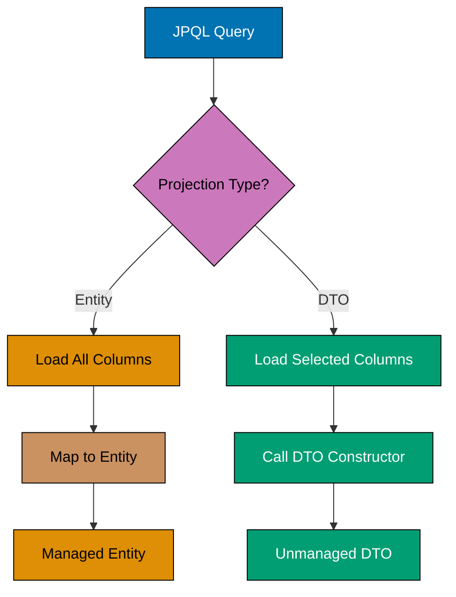
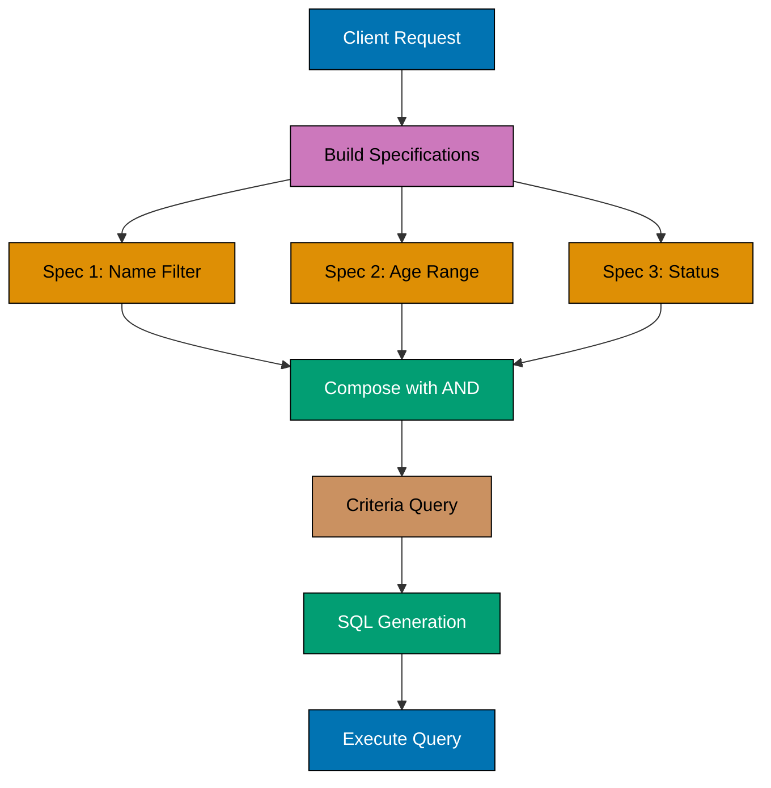
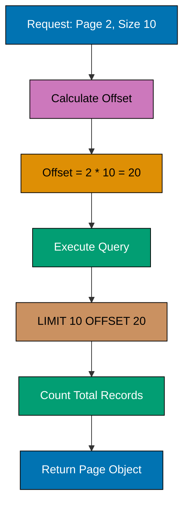
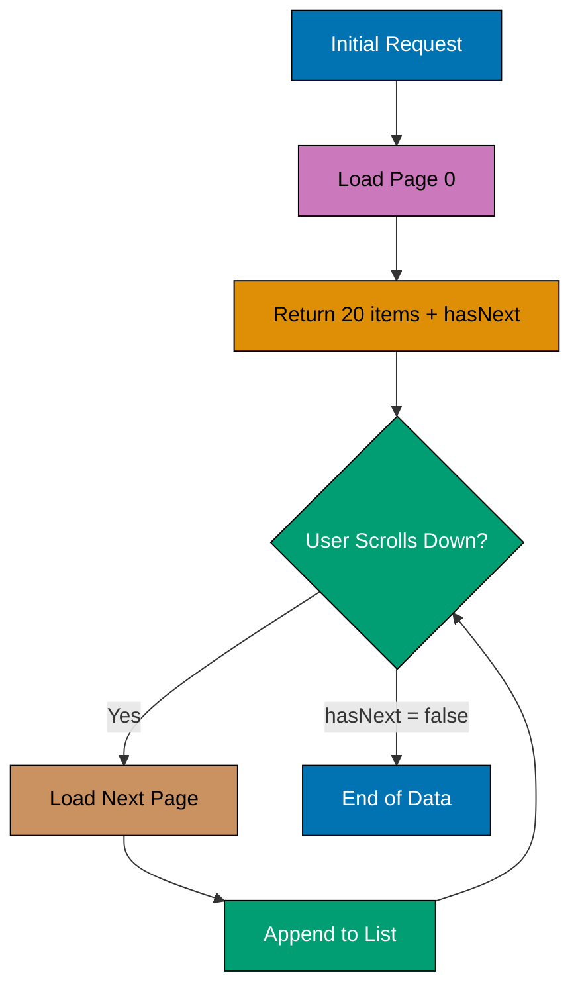
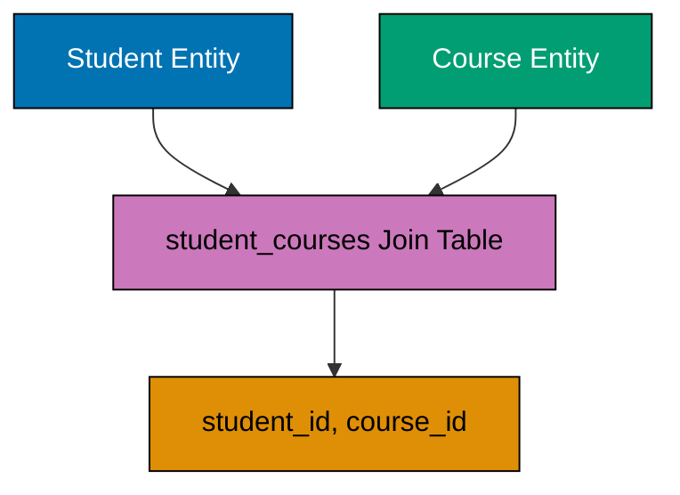
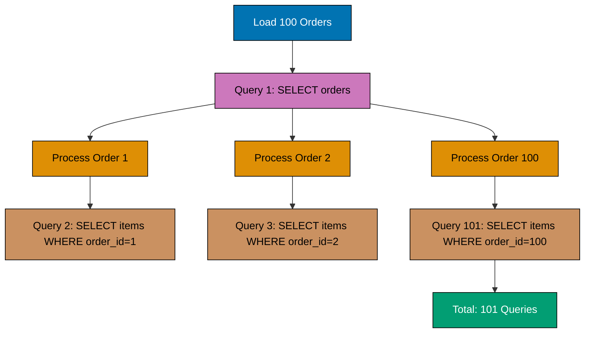
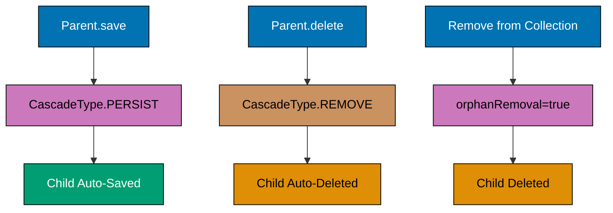
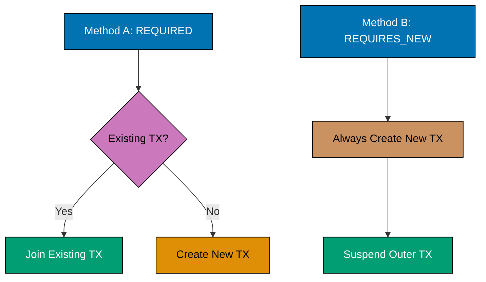
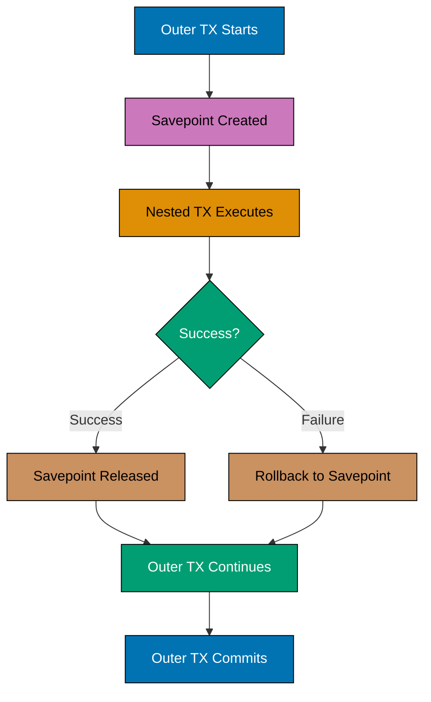
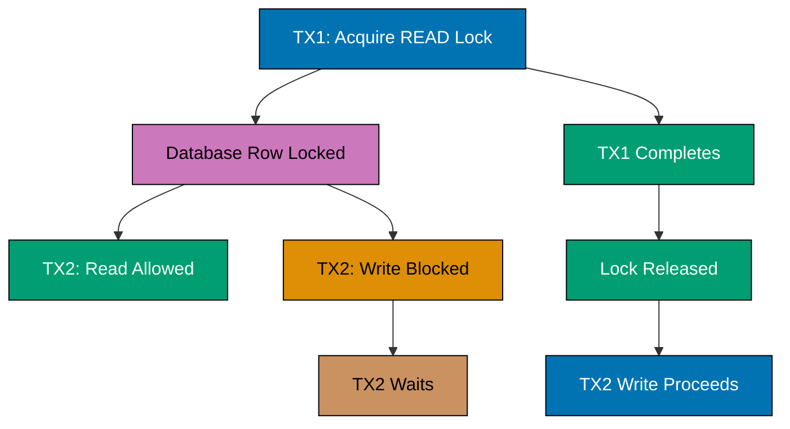

## Example 31: @Query with JPQL

The @Query annotation enables custom JPQL queries directly in repository interfaces. This provides fine-grained control over query logic.

```mermaid
%% JPQL query execution flow
graph TD
    A[Repository Method Call] --> B[@Query Annotation]
    B --> C[JPQL Parser]
    C --> D[SQL Generator]
    D --> E[Database Query]
    E --> F[Result Mapping]
    F --> G[Return Entity]

    style A fill:#0173B2,stroke:#000,color:#fff
    style B fill:#CC78BC,stroke:#000,color:#000
    style C fill:#DE8F05,stroke:#000,color:#000
    style D fill:#DE8F05,stroke:#000,color:#000
    style E fill:#029E73,stroke:#000,color:#fff
    style F fill:#CA9161,stroke:#000,color:#000
    style G fill:#029E73,stroke:#000,color:#fff
```

```java
// UserRepository.java
public interface UserRepository extends JpaRepository<User, Long> {

    @Query("SELECT u FROM User u WHERE u.email = :email")
    Optional<User> findByEmailCustom(@Param("email") String email);
    // => JPQL: SELECT u FROM User u WHERE u.email = :email
    // => SQL: SELECT * FROM users WHERE email = ?
    // => Parameter binding: :email → 'john@example.com'

    @Query("SELECT u FROM User u WHERE u.age >= :minAge AND u.status = :status")
    List<User> findAdultActiveUsers(
        @Param("minAge") int minAge,
        @Param("status") String status
    );
    // => JPQL with multiple named parameters
    // => SQL: SELECT * FROM users WHERE age >= ? AND status = ?
}

// Usage
@Service
public class UserService {

    @Autowired
    private UserRepository userRepository;

    public void demonstrateCustomQuery() {
        Optional<User> user = userRepository.findByEmailCustom("john@example.com");
        // => Query execution:
        // =>   Hibernate: select user0_.id, user0_.name, user0_.email, user0_.age
        // =>             from users user0_ where user0_.email=?
        // => Result: Optional[User(id=1, name='John', email='john@example.com')]

        List<User> activeAdults = userRepository.findAdultActiveUsers(18, "ACTIVE");
        // => Query execution:
        // =>   Hibernate: select user0_.id, user0_.name, user0_.email, user0_.age, user0_.status
        // =>             from users user0_ where user0_.age>=? and user0_.status=?
        // => Parameters: [18, 'ACTIVE']
        // => Result: List of 5 users matching criteria
    }
}
```

**Key Takeaway**: @Query with JPQL enables custom queries while maintaining type safety and automatic parameter binding, essential for complex business logic beyond derived query methods.

## Example 32: Native SQL Queries

Native SQL queries execute database-specific SQL directly, bypassing JPQL abstraction. Use for database-specific features or performance optimization.

```java
// ProductRepository.java
public interface ProductRepository extends JpaRepository<Product, Long> {

    @Query(value = "SELECT * FROM products WHERE price < :maxPrice", nativeQuery = true)
    List<Product> findCheapProductsNative(@Param("maxPrice") BigDecimal maxPrice);
    // => Native SQL executed directly
    // => No JPQL parsing, no entity graph optimization
    // => Database-specific syntax allowed (PostgreSQL, MySQL, etc.)

    @Query(
        value = "SELECT p.*, c.name as category_name " +
                "FROM products p " +
                "INNER JOIN categories c ON p.category_id = c.id " +
                "WHERE c.active = true",
        nativeQuery = true
    )
    List<Object[]> findProductsWithCategoryNative();
    // => Returns Object[] instead of entities
    // => Index 0: Product columns, Index 1: category_name
}

// Usage
@Service
public class ProductService {

    @Autowired
    private ProductRepository productRepository;

    public void demonstrateNativeQuery() {
        List<Product> cheapProducts = productRepository.findCheapProductsNative(
            new BigDecimal("50.00")
        );
        // => SQL execution (PostgreSQL example):
        // =>   SELECT * FROM products WHERE price < 50.00
        // => Result: List of 12 products with price < 50

        List<Object[]> productsWithCategory = productRepository.findProductsWithCategoryNative();
        // => SQL execution:
        // =>   SELECT p.*, c.name as category_name
        // =>   FROM products p
        // =>   INNER JOIN categories c ON p.category_id = c.id
        // =>   WHERE c.active = true
        // => Result: List<Object[]> where each Object[] contains:
        // =>   [0] = Product entity data
        // =>   [1] = String category_name
        // => Example: [ [Product(id=1, name='Laptop'), 'Electronics'], ... ]
    }
}
```

**Key Takeaway**: Native SQL queries provide database-specific optimization and access to vendor-specific features, but sacrifice portability and JPA abstraction benefits.

## Example 33: @Modifying Queries

@Modifying annotation enables UPDATE and DELETE queries through @Query. Requires @Transactional for execution.

```mermaid
%% Modifying query execution
graph TD
    A[@Modifying Query] --> B[@Transactional Required]
    B --> C[Execute UPDATE/DELETE]
    C --> D[Rows Affected Count]
    D --> E{clearAutomatically?}
    E -->|true| F[Clear EntityManager]
    E -->|false| G[Keep Cache]

    style A fill:#0173B2,stroke:#000,color:#fff
    style B fill:#CC78BC,stroke:#000,color:#000
    style C fill:#DE8F05,stroke:#000,color:#000
    style D fill:#029E73,stroke:#000,color:#fff
    style E fill:#CA9161,stroke:#000,color:#000
    style F fill:#029E73,stroke:#000,color:#fff
    style G fill:#029E73,stroke:#000,color:#fff
```

```java
// UserRepository.java
public interface UserRepository extends JpaRepository<User, Long> {

    @Modifying
    @Query("UPDATE User u SET u.status = :status WHERE u.lastLogin < :date")
    int updateInactiveUsersStatus(@Param("status") String status, @Param("date") LocalDateTime date);
    // => Bulk UPDATE query
    // => Returns: number of rows affected
    // => Does NOT trigger entity lifecycle callbacks

    @Modifying
    @Query("DELETE FROM User u WHERE u.status = 'DELETED'")
    int deleteSoftDeletedUsers();
    // => Bulk DELETE query
    // => Bypasses cascading rules defined in entities
}

// Usage
@Service
public class UserService {

    @Autowired
    private UserRepository userRepository;

    @Transactional
    public void demonstrateModifying() {
        LocalDateTime sixMonthsAgo = LocalDateTime.now().minusMonths(6);
        int updated = userRepository.updateInactiveUsersStatus("INACTIVE", sixMonthsAgo);
        // => Transaction starts
        // => SQL: UPDATE users SET status = ? WHERE last_login < ?
        // => Parameters: ['INACTIVE', '2024-06-29 14:00:00']
        // => Execution result: 23 rows affected
        // => Persistence context NOT automatically cleared
        // => Cached entities may have stale status values

        int deleted = userRepository.deleteSoftDeletedUsers();
        // => SQL: DELETE FROM users WHERE status = 'DELETED'
        // => Execution result: 7 rows affected
        // => Transaction commits
    }

    @Modifying(clearAutomatically = true)
    @Query("UPDATE User u SET u.email = :newEmail WHERE u.id = :id")
    int updateUserEmail(@Param("id") Long id, @Param("newEmail") String newEmail);
    // => clearAutomatically = true
    // => EntityManager.clear() called after query execution
    // => All cached entities evicted from persistence context
}
```

**Key Takeaway**: @Modifying queries enable bulk UPDATE/DELETE operations but bypass entity lifecycle callbacks and require manual persistence context management to avoid stale cache data.

## Example 34: Constructor Expressions (DTO Projections)

Constructor expressions in JPQL enable direct DTO mapping without fetching full entities. Improves performance for read-only views.



```java
// UserSummaryDTO.java
public class UserSummaryDTO {
    private Long id;
    private String name;
    private String email;

    public UserSummaryDTO(Long id, String name, String email) {
        this.id = id;
        this.name = name;
        this.email = email;
    }
    // => Constructor must match JPQL SELECT clause exactly
    // => Getters/setters omitted for brevity
}

// UserRepository.java
public interface UserRepository extends JpaRepository<User, Long> {

    @Query("SELECT new com.example.dto.UserSummaryDTO(u.id, u.name, u.email) " +
           "FROM User u WHERE u.status = :status")
    List<UserSummaryDTO> findUserSummaries(@Param("status") String status);
    // => Constructor expression: new DTO(...)
    // => Full package name required for DTO class
    // => Parameters must match constructor signature exactly
}

// Usage
@Service
public class UserService {

    @Autowired
    private UserRepository userRepository;

    public void demonstrateConstructorExpression() {
        List<UserSummaryDTO> summaries = userRepository.findUserSummaries("ACTIVE");
        // => JPQL: SELECT new com.example.dto.UserSummaryDTO(u.id, u.name, u.email)
        // =>       FROM User u WHERE u.status = 'ACTIVE'
        // => SQL: SELECT u.id, u.name, u.email FROM users u WHERE u.status = ?
        // => Result mapping: Direct constructor call per row
        // =>   Row 1: new UserSummaryDTO(1L, "John", "john@example.com")
        // =>   Row 2: new UserSummaryDTO(2L, "Jane", "jane@example.com")
        // => Performance: Only 3 columns loaded vs full entity (10+ columns)
        // => DTOs are NOT managed by persistence context
        // => Changes to DTOs do NOT trigger database updates
    }
}
```

**Key Takeaway**: Constructor expressions (DTO projections) dramatically improve read performance by loading only required columns, essential for reporting and API responses where entity management overhead isn't needed.

## Example 35: JOIN Queries

JPQL supports INNER JOIN, LEFT JOIN, and fetch joins for loading related entities efficiently.

```java
// OrderRepository.java
public interface OrderRepository extends JpaRepository<Order, Long> {

    @Query("SELECT o FROM Order o JOIN o.customer c WHERE c.email = :email")
    List<Order> findOrdersByCustomerEmail(@Param("email") String email);
    // => INNER JOIN between Order and Customer
    // => Only orders with matching customers returned

    @Query("SELECT o FROM Order o LEFT JOIN o.items i WHERE i.product.category = :category")
    List<Order> findOrdersWithCategoryItems(@Param("category") String category);
    // => LEFT JOIN: Returns orders even if no matching items

    @Query("SELECT o FROM Order o JOIN FETCH o.items WHERE o.id = :id")
    Optional<Order> findOrderWithItems(@Param("id") Long id);
    // => JOIN FETCH: Eager load items in single query
    // => Prevents N+1 query problem
}

// Usage
@Service
public class OrderService {

    @Autowired
    private OrderRepository orderRepository;

    public void demonstrateJoins() {
        List<Order> orders = orderRepository.findOrdersByCustomerEmail("john@example.com");
        // => JPQL: SELECT o FROM Order o JOIN o.customer c WHERE c.email = :email
        // => SQL: SELECT o.* FROM orders o
        // =>      INNER JOIN customers c ON o.customer_id = c.id
        // =>      WHERE c.email = ?
        // => Result: List of 3 orders for customer with email 'john@example.com'

        Optional<Order> orderWithItems = orderRepository.findOrderWithItems(1L);
        // => JPQL: SELECT o FROM Order o JOIN FETCH o.items WHERE o.id = :id
        // => SQL: SELECT o.*, i.* FROM orders o
        // =>      LEFT OUTER JOIN order_items i ON o.id = i.order_id
        // =>      WHERE o.id = ?
        // => Single query loads order AND all items
        // => No lazy loading exceptions when accessing order.getItems()
        // => Accessing items: order.getItems() → List of 5 items (NO additional query)
    }
}
```

**Key Takeaway**: JOIN FETCH prevents N+1 query problems by eagerly loading relationships in a single query, critical for performance when traversing entity associations.

## Example 36: Subqueries in JPQL

Subqueries enable complex filtering based on aggregations or existence checks within the main query.

```java
// ProductRepository.java
public interface ProductRepository extends JpaRepository<Product, Long> {

    @Query("SELECT p FROM Product p WHERE p.price > " +
           "(SELECT AVG(p2.price) FROM Product p2 WHERE p2.category = p.category)")
    List<Product> findAboveAveragePriceInCategory();
    // => Subquery calculates average price per category
    // => Main query filters products above their category average

    @Query("SELECT u FROM User u WHERE u.id NOT IN " +
           "(SELECT o.customer.id FROM Order o WHERE o.status = 'COMPLETED')")
    List<User> findUsersWithoutCompletedOrders();
    // => Subquery finds customers with completed orders
    // => Main query excludes those customers
}

// Usage
@Service
public class ProductService {

    @Autowired
    private ProductRepository productRepository;

    public void demonstrateSubqueries() {
        List<Product> premiumProducts = productRepository.findAboveAveragePriceInCategory();
        // => JPQL execution:
        // =>   Main query: SELECT p FROM Product p WHERE p.price > (...)
        // =>   Subquery: SELECT AVG(p2.price) FROM Product p2 WHERE p2.category = p.category
        // => SQL (correlated subquery):
        // =>   SELECT p.* FROM products p
        // =>   WHERE p.price > (
        // =>     SELECT AVG(p2.price) FROM products p2
        // =>     WHERE p2.category = p.category
        // =>   )
        // => Execution:
        // =>   For each product, subquery calculates category average
        // =>   Product 1 (Electronics, $800): category avg = $600 → INCLUDED
        // =>   Product 2 (Electronics, $400): category avg = $600 → EXCLUDED
        // => Result: List of 15 products priced above category average
    }
}
```

**Key Takeaway**: Subqueries enable complex filtering based on aggregations or correlated conditions, essential for business logic like "find products priced above category average."

## Example 37: Named Queries

Named queries define reusable JPQL queries on entity classes. Improves query organization and enables validation at startup.

```java
// User.java
@Entity
@Table(name = "users")
@NamedQuery(
    name = "User.findByStatus",
    query = "SELECT u FROM User u WHERE u.status = :status"
)
@NamedQuery(
    name = "User.countByAgeRange",
    query = "SELECT COUNT(u) FROM User u WHERE u.age BETWEEN :minAge AND :maxAge"
)
public class User {
    @Id
    @GeneratedValue(strategy = GenerationType.IDENTITY)
    private Long id;
    private String name;
    private String email;
    private Integer age;
    private String status;
    // => Named queries defined at entity level
    // => Validated at EntityManagerFactory creation
    // => Syntax errors detected at application startup
}

// UserRepository.java
public interface UserRepository extends JpaRepository<User, Long> {

    List<User> findByStatus(@Param("status") String status);
    // => Spring Data JPA automatically detects named query "User.findByStatus"
    // => No @Query annotation needed

    @Query(name = "User.countByAgeRange")
    long countByAgeRange(@Param("minAge") int minAge, @Param("maxAge") int maxAge);
    // => Explicit reference to named query
}

// Usage
@Service
public class UserService {

    @Autowired
    private UserRepository userRepository;

    public void demonstrateNamedQueries() {
        List<User> activeUsers = userRepository.findByStatus("ACTIVE");
        // => Named query execution: User.findByStatus
        // => JPQL: SELECT u FROM User u WHERE u.status = :status
        // => SQL: SELECT * FROM users WHERE status = ?
        // => Parameter: ['ACTIVE']
        // => Result: List of 42 active users

        long youngAdults = userRepository.countByAgeRange(18, 30);
        // => Named query execution: User.countByAgeRange
        // => JPQL: SELECT COUNT(u) FROM User u WHERE u.age BETWEEN :minAge AND :maxAge
        // => SQL: SELECT COUNT(*) FROM users WHERE age BETWEEN ? AND ?
        // => Parameters: [18, 30]
        // => Result: 127
    }
}
```

**Key Takeaway**: Named queries provide query reusability and startup-time validation, catching JPQL syntax errors before runtime failures.

## Example 38: Dynamic Queries with Specifications

Specifications enable type-safe dynamic query building using JPA Criteria API. Useful for complex search filters.



```java
// UserRepository.java
public interface UserRepository extends JpaRepository<User, Long>, JpaSpecificationExecutor<User> {
    // => Extends JpaSpecificationExecutor to enable Specification queries
}

// UserSpecifications.java
public class UserSpecifications {

    public static Specification<User> hasName(String name) {
        return (root, query, cb) ->
            name == null ? null : cb.equal(root.get("name"), name);
        // => Specification: WHERE name = ?
        // => Returns null if name parameter is null (ignored in final query)
    }

    public static Specification<User> ageGreaterThan(Integer age) {
        return (root, query, cb) ->
            age == null ? null : cb.greaterThan(root.get("age"), age);
        // => Specification: WHERE age > ?
    }

    public static Specification<User> hasStatus(String status) {
        return (root, query, cb) ->
            status == null ? null : cb.equal(root.get("status"), status);
        // => Specification: WHERE status = ?
    }
}

// Usage
@Service
public class UserService {

    @Autowired
    private UserRepository userRepository;

    public void demonstrateSpecifications() {
        // Scenario 1: Single specification
        Specification<User> spec1 = UserSpecifications.hasStatus("ACTIVE");
        List<User> activeUsers = userRepository.findAll(spec1);
        // => SQL: SELECT * FROM users WHERE status = 'ACTIVE'
        // => Result: List of 42 users

        // Scenario 2: Combined specifications
        Specification<User> spec2 = Specification
            .where(UserSpecifications.hasName("John"))
            .and(UserSpecifications.ageGreaterThan(25))
            .and(UserSpecifications.hasStatus("ACTIVE"));
        List<User> filtered = userRepository.findAll(spec2);
        // => Specification composition:
        // =>   WHERE name = 'John' AND age > 25 AND status = 'ACTIVE'
        // => SQL: SELECT * FROM users WHERE name = ? AND age > ? AND status = ?
        // => Parameters: ['John', 25, 'ACTIVE']
        // => Result: List of 3 users matching all criteria

        // Scenario 3: Dynamic filtering (null values ignored)
        String searchName = null; // User didn't provide name filter
        Integer minAge = 18;
        String searchStatus = "ACTIVE";

        Specification<User> dynamicSpec = Specification
            .where(UserSpecifications.hasName(searchName))    // => null, ignored
            .and(UserSpecifications.ageGreaterThan(minAge))   // => age > 18
            .and(UserSpecifications.hasStatus(searchStatus)); // => status = 'ACTIVE'

        List<User> results = userRepository.findAll(dynamicSpec);
        // => Only non-null specifications applied
        // => SQL: SELECT * FROM users WHERE age > ? AND status = ?
        // => Parameters: [18, 'ACTIVE']
        // => Result: List of 67 users (name filter not applied)
    }
}
```

**Key Takeaway**: Specifications enable type-safe dynamic query composition, essential for search screens where filter combinations are determined at runtime.

## Example 39: Basic Pagination with PageRequest

PageRequest enables offset-based pagination through page number and size parameters. Returns Page object with metadata.



```java
// UserRepository.java
public interface UserRepository extends JpaRepository<User, Long> {
    Page<User> findByStatus(String status, Pageable pageable);
    // => Pageable parameter enables pagination
    // => Returns Page<T> with content and metadata
}

// Usage
@Service
public class UserService {

    @Autowired
    private UserRepository userRepository;

    public void demonstratePagination() {
        // Request page 0 (first page), size 10
        Pageable pageable = PageRequest.of(0, 10);
        Page<User> firstPage = userRepository.findByStatus("ACTIVE", pageable);
        // => SQL (PostgreSQL): SELECT * FROM users WHERE status = 'ACTIVE' LIMIT 10 OFFSET 0
        // => Count query: SELECT COUNT(*) FROM users WHERE status = 'ACTIVE'
        // => Page metadata:
        // =>   Content: List of 10 users
        // =>   Total elements: 127 (total active users)
        // =>   Total pages: 13 (127 / 10 = 12.7 → 13)
        // =>   Current page: 0
        // =>   Page size: 10
        // =>   Has next: true
        // =>   Has previous: false

        // Request page 2 (third page), size 20
        Pageable page2 = PageRequest.of(2, 20);
        Page<User> thirdPage = userRepository.findByStatus("ACTIVE", page2);
        // => SQL: SELECT * FROM users WHERE status = 'ACTIVE' LIMIT 20 OFFSET 40
        // => Offset calculation: page (2) * size (20) = 40
        // => Page metadata:
        // =>   Content: List of 20 users (users 41-60)
        // =>   Total elements: 127
        // =>   Total pages: 7 (127 / 20 = 6.35 → 7)
        // =>   Current page: 2
        // =>   Has next: true (pages 3-6 remain)
        // =>   Has previous: true (pages 0-1 exist)

        // Iterate through content
        firstPage.getContent().forEach(user -> {
            System.out.println(user.getName());
        });
        // => Accesses List<User> content from Page object
    }
}
```

**Key Takeaway**: PageRequest provides offset-based pagination for random access (page jumping), ideal for traditional paginated UIs with page numbers.

## Example 40: Sorting with Pageable

PageRequest.of() accepts Sort parameter for combined pagination and sorting. Supports single and multi-field sorting.

```java
// ProductRepository.java
public interface ProductRepository extends JpaRepository<Product, Long> {
    Page<Product> findAll(Pageable pageable);
    // => Inherited from JpaRepository, supports pagination and sorting
}

// Usage
@Service
public class ProductService {

    @Autowired
    private ProductRepository productRepository;

    public void demonstrateSorting() {
        // Single field sorting (ascending)
        Pageable sortedPageable = PageRequest.of(0, 10, Sort.by("name"));
        Page<Product> sortedByName = productRepository.findAll(sortedPageable);
        // => SQL: SELECT * FROM products ORDER BY name ASC LIMIT 10 OFFSET 0
        // => Result: Products sorted alphabetically by name
        // =>   [Product(name='Adapter'), Product(name='Battery'), ...]

        // Single field sorting (descending)
        Pageable descPageable = PageRequest.of(0, 10, Sort.by("price").descending());
        Page<Product> sortedByPriceDesc = productRepository.findAll(descPageable);
        // => SQL: SELECT * FROM products ORDER BY price DESC LIMIT 10 OFFSET 0
        // => Result: Most expensive products first
        // =>   [Product(price=999.99), Product(price=849.00), ...]

        // Multi-field sorting
        Sort multiSort = Sort.by("category").ascending()
                             .and(Sort.by("price").descending());
        Pageable multiPageable = PageRequest.of(0, 10, multiSort);
        Page<Product> multiSorted = productRepository.findAll(multiPageable);
        // => SQL: SELECT * FROM products ORDER BY category ASC, price DESC LIMIT 10 OFFSET 0
        // => Result: Grouped by category, then by price (high to low) within category
        // =>   [Product(category='Books', price=49.99),
        // =>    Product(category='Books', price=29.99),
        // =>    Product(category='Electronics', price=899.00), ...]
    }
}
```

**Key Takeaway**: Sorting with Pageable enables multi-field, multi-direction sorting combined with pagination, essential for sortable table UIs.

## Example 41: Page vs Slice

Page performs count query for total elements. Slice skips count query for better performance when total count is unnecessary.

```java
// UserRepository.java
public interface UserRepository extends JpaRepository<User, Long> {

    Page<User> findByStatus(String status, Pageable pageable);
    // => Returns Page<T>
    // => Executes 2 queries: SELECT data + SELECT COUNT(*)

    Slice<User> findSliceByStatus(String status, Pageable pageable);
    // => Returns Slice<T>
    // => Executes 1 query: SELECT data with LIMIT + 1
}

// Usage
@Service
public class UserService {

    @Autowired
    private UserRepository userRepository;

    public void demonstratePageVsSlice() {
        Pageable pageable = PageRequest.of(0, 10);

        // Using Page
        Page<User> page = userRepository.findByStatus("ACTIVE", pageable);
        // => Query 1: SELECT * FROM users WHERE status = 'ACTIVE' LIMIT 10 OFFSET 0
        // => Query 2: SELECT COUNT(*) FROM users WHERE status = 'ACTIVE'
        // => Page methods available:
        // =>   getTotalElements(): 127
        // =>   getTotalPages(): 13
        // =>   hasNext(): true
        // =>   hasPrevious(): false
        // =>   getContent(): List of 10 users

        // Using Slice
        Slice<User> slice = userRepository.findSliceByStatus("ACTIVE", pageable);
        // => Query: SELECT * FROM users WHERE status = 'ACTIVE' LIMIT 11 OFFSET 0
        // => Requests size + 1 (11) to determine if next page exists
        // => No count query executed
        // => Slice methods available:
        // =>   hasNext(): true (11 rows returned, so next page exists)
        // =>   hasPrevious(): false
        // =>   getContent(): List of 10 users (11th row discarded)
        // =>   getTotalElements(): NOT AVAILABLE (throws exception)
        // =>   getTotalPages(): NOT AVAILABLE (throws exception)

        // Performance comparison for 1 million records:
        // => Page: 2 queries (data + count), count query may be slow
        // => Slice: 1 query (data + 1), no expensive count operation
        // => Use Slice for "infinite scroll" UI patterns
        // => Use Page when total count/pages are required (pagination controls)
    }
}
```

**Key Takeaway**: Slice provides lightweight pagination without total count calculation, optimized for infinite scroll UIs where users rarely jump to specific pages.

## Example 42: Custom Sorting Directions

Sort.Order enables fine-grained control over sort direction, null handling, and case sensitivity per field.

```java
// ProductRepository.java
public interface ProductRepository extends JpaRepository<Product, Long> {
    Page<Product> findAll(Pageable pageable);
}

// Usage
@Service
public class ProductService {

    @Autowired
    private ProductRepository productRepository;

    public void demonstrateAdvancedSorting() {
        // Custom null handling
        Sort.Order priceOrder = Sort.Order.desc("price")
            .nullsLast(); // => NULL values appear last
        Sort sortWithNulls = Sort.by(priceOrder);
        Pageable pageable1 = PageRequest.of(0, 10, sortWithNulls);
        Page<Product> products1 = productRepository.findAll(pageable1);
        // => SQL (PostgreSQL): SELECT * FROM products ORDER BY price DESC NULLS LAST LIMIT 10
        // => Result: Products with prices sorted descending, NULL prices at end
        // =>   [Product(price=999.99), ..., Product(price=10.00), Product(price=null)]

        // Case-insensitive sorting
        Sort.Order nameOrder = Sort.Order.asc("name")
            .ignoreCase(); // => Case-insensitive alphabetical sort
        Sort caseInsensitiveSort = Sort.by(nameOrder);
        Pageable pageable2 = PageRequest.of(0, 10, caseInsensitiveSort);
        Page<Product> products2 = productRepository.findAll(pageable2);
        // => SQL: SELECT * FROM products ORDER BY LOWER(name) ASC LIMIT 10
        // => Result: 'apple', 'Banana', 'cherry' (case ignored)
        // => Without ignoreCase(): 'Banana', 'apple', 'cherry' (uppercase first)

        // Complex multi-field sorting
        List<Sort.Order> orders = new ArrayList<>();
        orders.add(Sort.Order.asc("category").nullsFirst());
        orders.add(Sort.Order.desc("price").nullsLast());
        orders.add(Sort.Order.asc("name").ignoreCase());
        Sort complexSort = Sort.by(orders);
        Pageable pageable3 = PageRequest.of(0, 10, complexSort);
        Page<Product> products3 = productRepository.findAll(pageable3);
        // => SQL: SELECT * FROM products
        // =>      ORDER BY category ASC NULLS FIRST,
        // =>               price DESC NULLS LAST,
        // =>               LOWER(name) ASC
        // =>      LIMIT 10
        // => Sort priority: category → price → name
    }
}
```

**Key Takeaway**: Custom sorting directions enable business-specific ordering like "active users first, then by registration date," essential for prioritized list displays.

## Example 43: Pagination with Specifications

Combine Specifications with Pageable for dynamic filtered pagination. Enables complex search with pagination.

```java
// UserRepository.java
public interface UserRepository extends JpaRepository<User, Long>,
                                         JpaSpecificationExecutor<User> {
    // => JpaSpecificationExecutor provides findAll(Specification, Pageable)
}

// Usage
@Service
public class UserService {

    @Autowired
    private UserRepository userRepository;

    public void demonstratePaginatedSpecifications() {
        // Build dynamic specification
        Specification<User> spec = Specification
            .where(UserSpecifications.hasStatus("ACTIVE"))
            .and(UserSpecifications.ageGreaterThan(25));
        // => WHERE status = 'ACTIVE' AND age > 25

        // Apply pagination and sorting
        Pageable pageable = PageRequest.of(0, 20, Sort.by("name").ascending());
        Page<User> page = userRepository.findAll(spec, pageable);
        // => Query 1 (data):
        // =>   SELECT * FROM users
        // =>   WHERE status = 'ACTIVE' AND age > 25
        // =>   ORDER BY name ASC
        // =>   LIMIT 20 OFFSET 0
        // => Query 2 (count):
        // =>   SELECT COUNT(*) FROM users WHERE status = 'ACTIVE' AND age > 25
        // => Page metadata:
        // =>   Content: List of 20 users (first page)
        // =>   Total elements: 67
        // =>   Total pages: 4 (67 / 20 = 3.35 → 4)
        // =>   Has next: true

        // Navigate to next page
        Pageable nextPageable = page.nextPageable();
        Page<User> nextPage = userRepository.findAll(spec, nextPageable);
        // => nextPageable: page=1, size=20, sort=name ASC
        // => SQL: SELECT * FROM users
        // =>      WHERE status = 'ACTIVE' AND age > 25
        // =>      ORDER BY name ASC
        // =>      LIMIT 20 OFFSET 20
        // => Result: Users 21-40
    }
}
```

**Key Takeaway**: Combining Specifications with Pageable enables filtered, sorted, paginated results in a single query, the foundation of most admin search screens.

## Example 44: Infinite Scroll with Slice

Implement infinite scroll UI pattern using Slice for efficient pagination without total count.



```java
// ProductRepository.java
public interface ProductRepository extends JpaRepository<Product, Long> {
    Slice<Product> findByCategory(String category, Pageable pageable);
    // => Returns Slice for infinite scroll
}

// ProductService.java
@Service
public class ProductService {

    @Autowired
    private ProductRepository productRepository;

    public Slice<Product> loadProducts(String category, int page, int size) {
        Pageable pageable = PageRequest.of(page, size, Sort.by("name").ascending());
        return productRepository.findByCategory(category, pageable);
    }
}

// REST Controller
@RestController
@RequestMapping("/api/products")
public class ProductController {

    @Autowired
    private ProductService productService;

    @GetMapping
    public Map<String, Object> getProducts(
        @RequestParam String category,
        @RequestParam(defaultValue = "0") int page,
        @RequestParam(defaultValue = "20") int size
    ) {
        Slice<Product> slice = productService.loadProducts(category, page, size);
        // => Request 1: GET /api/products?category=Electronics&page=0&size=20
        // =>   SQL: SELECT * FROM products WHERE category = 'Electronics'
        // =>        ORDER BY name ASC LIMIT 21 OFFSET 0
        // =>   Result: 21 products fetched (20 displayed + 1 for hasNext check)
        // =>   Response:
        // =>     products: [Product1, Product2, ..., Product20]
        // =>     hasNext: true (21st product exists)
        // =>     currentPage: 0

        // => Request 2: GET /api/products?category=Electronics&page=1&size=20
        // =>   SQL: SELECT * FROM products WHERE category = 'Electronics'
        // =>        ORDER BY name ASC LIMIT 21 OFFSET 20
        // =>   Result: 21 products fetched (products 21-40 displayed)
        // =>   Response:
        // =>     products: [Product21, ..., Product40]
        // =>     hasNext: true

        // => Request 3: GET /api/products?category=Electronics&page=2&size=20
        // =>   SQL: SELECT * FROM products WHERE category = 'Electronics'
        // =>        ORDER BY name ASC LIMIT 21 OFFSET 40
        // =>   Result: 15 products fetched (only 15 remaining)
        // =>   Response:
        // =>     products: [Product41, ..., Product55]
        // =>     hasNext: false (no 56th product)

        Map<String, Object> response = new HashMap<>();
        response.put("products", slice.getContent());
        response.put("hasNext", slice.hasNext());
        response.put("currentPage", slice.getNumber());
        return response;
        // => No total count exposed to client
        // => Client loads more pages until hasNext = false
    }
}
```

**Key Takeaway**: Slice-based infinite scroll improves UX for large datasets by loading next page only, avoiding expensive COUNT(\*) queries on every request.

## Example 45: @ManyToMany Relationships

@ManyToMany defines bidirectional or unidirectional many-to-many relationships using a join table. Requires @JoinTable configuration.



```java
// Student.java
@Entity
@Table(name = "students")
public class Student {
    @Id
    @GeneratedValue(strategy = GenerationType.IDENTITY)
    private Long id;
    private String name;

    @ManyToMany
    @JoinTable(
        name = "student_courses",
        joinColumns = @JoinColumn(name = "student_id"),
        inverseJoinColumns = @JoinColumn(name = "course_id")
    )
    private Set<Course> courses = new HashSet<>();
    // => Owning side of relationship (manages join table)
    // => Join table: student_courses
    // => Columns: student_id (FK to students), course_id (FK to courses)
}

// Course.java
@Entity
@Table(name = "courses")
public class Course {
    @Id
    @GeneratedValue(strategy = GenerationType.IDENTITY)
    private Long id;
    private String name;

    @ManyToMany(mappedBy = "courses")
    private Set<Student> students = new HashSet<>();
    // => Inverse side (references owning side via mappedBy)
    // => Does NOT manage join table
}

// Usage
@Service
public class EnrollmentService {

    @Autowired
    private StudentRepository studentRepository;

    @Autowired
    private CourseRepository courseRepository;

    @Transactional
    public void demonstrateManyToMany() {
        // Create entities
        Student student = new Student();
        student.setName("Alice");

        Course mathCourse = new Course();
        mathCourse.setName("Mathematics");

        Course physicsCourse = new Course();
        physicsCourse.setName("Physics");

        // Establish relationship (owning side)
        student.getCourses().add(mathCourse);
        student.getCourses().add(physicsCourse);

        studentRepository.save(student);
        courseRepository.save(mathCourse);
        courseRepository.save(physicsCourse);
        // => Transaction starts
        // => INSERT INTO students (name) VALUES ('Alice')
        // => INSERT INTO courses (name) VALUES ('Mathematics')
        // => INSERT INTO courses (name) VALUES ('Physics')
        // => INSERT INTO student_courses (student_id, course_id) VALUES (1, 1)
        // => INSERT INTO student_courses (student_id, course_id) VALUES (1, 2)
        // => Transaction commits
        // => Join table student_courses:
        // =>   | student_id | course_id |
        // =>   |------------|-----------|
        // =>   |     1      |     1     |
        // =>   |     1      |     2     |

        // Load student with courses
        Student loaded = studentRepository.findById(1L).orElseThrow();
        loaded.getCourses().forEach(course -> {
            System.out.println(course.getName());
        });
        // => SELECT * FROM students WHERE id = 1
        // => Lazy loading triggered on getCourses():
        // =>   SELECT c.* FROM courses c
        // =>   INNER JOIN student_courses sc ON c.id = sc.course_id
        // =>   WHERE sc.student_id = 1
        // => Output: Mathematics, Physics
    }
}
```

**Key Takeaway**: @ManyToMany relationships require careful management of both sides and intermediate join tables, with cascade settings determining automatic relationship updates.

## Example 46: @EntityGraph for Fetch Optimization

@EntityGraph controls eager/lazy loading at query level, overriding entity-level fetch strategies. Prevents N+1 queries.

```java
// Order.java
@Entity
@Table(name = "orders")
@NamedEntityGraph(
    name = "Order.withItems",
    attributeNodes = @NamedAttributeNode("items")
)
@NamedEntityGraph(
    name = "Order.withCustomerAndItems",
    attributeNodes = {
        @NamedAttributeNode("customer"),
        @NamedAttributeNode("items")
    }
)
public class Order {
    @Id
    @GeneratedValue(strategy = GenerationType.IDENTITY)
    private Long id;

    @ManyToOne(fetch = FetchType.LAZY)
    @JoinColumn(name = "customer_id")
    private Customer customer;

    @OneToMany(mappedBy = "order", fetch = FetchType.LAZY)
    private List<OrderItem> items = new ArrayList<>();
    // => Both relationships defined as LAZY by default
}

// OrderRepository.java
public interface OrderRepository extends JpaRepository<Order, Long> {

    @EntityGraph(value = "Order.withItems", type = EntityGraph.EntityGraphType.FETCH)
    Optional<Order> findWithItemsById(Long id);
    // => Eagerly loads items in single query
    // => EntityGraphType.FETCH: Only attributeNodes are eager, rest remain lazy

    @EntityGraph(attributePaths = {"customer", "items"})
    List<Order> findAll();
    // => Ad-hoc entity graph using attributePaths
    // => Eagerly loads both customer and items
}

// Usage
@Service
public class OrderService {

    @Autowired
    private OrderRepository orderRepository;

    public void demonstrateEntityGraph() {
        // Without EntityGraph (N+1 problem)
        Order order1 = orderRepository.findById(1L).orElseThrow();
        // => Query 1: SELECT * FROM orders WHERE id = 1
        order1.getItems().forEach(item -> {
            System.out.println(item.getProduct());
        });
        // => Query 2: SELECT * FROM order_items WHERE order_id = 1 (lazy load)
        // => Query 3: SELECT * FROM products WHERE id = ? (for each item)
        // => Total: 1 + 1 + N queries (N = number of items)

        // With EntityGraph
        Order order2 = orderRepository.findWithItemsById(1L).orElseThrow();
        // => Single query with LEFT JOIN:
        // =>   SELECT o.*, i.* FROM orders o
        // =>   LEFT OUTER JOIN order_items i ON o.id = i.order_id
        // =>   WHERE o.id = 1
        order2.getItems().forEach(item -> {
            System.out.println(item.getProduct());
        });
        // => Items already loaded (no additional query)
        // => Product access still triggers lazy load (not in entity graph)

        // Load all with customer and items
        List<Order> allOrders = orderRepository.findAll();
        // => Single query:
        // =>   SELECT o.*, c.*, i.*
        // =>   FROM orders o
        // =>   LEFT OUTER JOIN customers c ON o.customer_id = c.id
        // =>   LEFT OUTER JOIN order_items i ON o.id = i.order_id
        // => All orders with customer and items loaded in one query
    }
}
```

**Key Takeaway**: @EntityGraph optimizes fetch strategies at query time, overriding default LAZY/EAGER settings to prevent both N+1 queries and unnecessary data loading.

## Example 47: N+1 Query Problem Demonstration

The N+1 problem occurs when fetching a collection triggers 1 query for the parent and N queries for children. Severely impacts performance.



```java
// OrderRepository.java
public interface OrderRepository extends JpaRepository<Order, Long> {

    @Query("SELECT o FROM Order o")
    List<Order> findAllOrders();
    // => Does NOT fetch items (lazy loading)

    @Query("SELECT o FROM Order o JOIN FETCH o.items")
    List<Order> findAllOrdersWithItems();
    // => JOIN FETCH prevents N+1 problem
}

// Usage
@Service
public class OrderService {

    @Autowired
    private OrderRepository orderRepository;

    public void demonstrateNPlusOne() {
        // BAD: N+1 problem
        List<Order> orders = orderRepository.findAllOrders();
        // => Query 1: SELECT * FROM orders
        // => Result: 100 orders loaded

        orders.forEach(order -> {
            System.out.println("Order " + order.getId() + " has " +
                order.getItems().size() + " items");
        });
        // => Query 2: SELECT * FROM order_items WHERE order_id = 1
        // => Query 3: SELECT * FROM order_items WHERE order_id = 2
        // => ...
        // => Query 101: SELECT * FROM order_items WHERE order_id = 100
        // => TOTAL: 101 queries (1 for orders + 100 for items)
        // => Performance: ~500ms for 100 orders

        // GOOD: JOIN FETCH solution
        List<Order> ordersWithItems = orderRepository.findAllOrdersWithItems();
        // => Single query:
        // =>   SELECT o.*, i.*
        // =>   FROM orders o
        // =>   LEFT OUTER JOIN order_items i ON o.id = i.order_id
        // => Result: All 100 orders with items loaded
        // => TOTAL: 1 query
        // => Performance: ~50ms for 100 orders (10x faster)

        ordersWithItems.forEach(order -> {
            System.out.println("Order " + order.getId() + " has " +
                order.getItems().size() + " items");
        });
        // => No additional queries (items already loaded)
    }
}
```

**Key Takeaway**: N+1 query problem occurs when lazy-loaded collections trigger separate queries per parent entity, demonstrating why JOIN FETCH and @EntityGraph are critical for performance.

## Example 48: @Embeddable Composite Objects

@Embeddable creates reusable value objects embedded in entity tables. Fields are flattened into parent table columns.

```java
// Address.java (embeddable value object)
@Embeddable
public class Address {
    private String street;
    private String city;
    private String state;
    private String zipCode;
    // => Not an entity (no @Entity annotation)
    // => No separate table
    // => Fields embedded in parent entity table
}

// User.java
@Entity
@Table(name = "users")
public class User {
    @Id
    @GeneratedValue(strategy = GenerationType.IDENTITY)
    private Long id;
    private String name;

    @Embedded
    private Address homeAddress;
    // => Embeds Address fields into users table
    // => Column names: street, city, state, zip_code

    @Embedded
    @AttributeOverrides({
        @AttributeOverride(name = "street", column = @Column(name = "billing_street")),
        @AttributeOverride(name = "city", column = @Column(name = "billing_city")),
        @AttributeOverride(name = "state", column = @Column(name = "billing_state")),
        @AttributeOverride(name = "zipCode", column = @Column(name = "billing_zip_code"))
    })
    private Address billingAddress;
    // => Same Address class, different column names
    // => Column names: billing_street, billing_city, billing_state, billing_zip_code
}

// Usage
@Service
public class UserService {

    @Autowired
    private UserRepository userRepository;

    @Transactional
    public void demonstrateEmbeddable() {
        // Create user with addresses
        User user = new User();
        user.setName("John Doe");

        Address home = new Address();
        home.setStreet("123 Main St");
        home.setCity("Springfield");
        home.setState("IL");
        home.setZipCode("62701");
        user.setHomeAddress(home);

        Address billing = new Address();
        billing.setStreet("456 Oak Ave");
        billing.setCity("Chicago");
        billing.setState("IL");
        billing.setZipCode("60601");
        user.setBillingAddress(billing);

        userRepository.save(user);
        // => INSERT INTO users (
        // =>   name,
        // =>   street, city, state, zip_code,
        // =>   billing_street, billing_city, billing_state, billing_zip_code
        // => ) VALUES (
        // =>   'John Doe',
        // =>   '123 Main St', 'Springfield', 'IL', '62701',
        // =>   '456 Oak Ave', 'Chicago', 'IL', '60601'
        // => )
        // => All fields stored in single users table row
        // => No separate address table

        // Query
        User loaded = userRepository.findById(user.getId()).orElseThrow();
        // => SELECT * FROM users WHERE id = ?
        // => Loads all embedded fields in single query
        // => homeAddress and billingAddress reconstructed from columns
        System.out.println(loaded.getHomeAddress().getCity());     // => Springfield
        System.out.println(loaded.getBillingAddress().getCity());  // => Chicago
    }
}
```

**Key Takeaway**: @Embeddable objects enable value object patterns for grouping related fields (e.g., Address, Money) without creating separate database tables, improving domain model clarity.

## Example 49: Cascading Operations

Cascade types define which operations propagate from parent to child entities. Simplifies management of entity graphs.



```java
// Order.java
@Entity
@Table(name = "orders")
public class Order {
    @Id
    @GeneratedValue(strategy = GenerationType.IDENTITY)
    private Long id;

    @OneToMany(mappedBy = "order", cascade = CascadeType.ALL, orphanRemoval = true)
    private List<OrderItem> items = new ArrayList<>();
    // => CascadeType.ALL: Propagates persist, merge, remove, refresh, detach
    // => orphanRemoval = true: Delete items when removed from collection
}

// OrderItem.java
@Entity
@Table(name = "order_items")
public class OrderItem {
    @Id
    @GeneratedValue(strategy = GenerationType.IDENTITY)
    private Long id;

    @ManyToOne
    @JoinColumn(name = "order_id")
    private Order order;

    private Integer quantity;
}

// Usage
@Service
public class OrderService {

    @Autowired
    private OrderRepository orderRepository;

    @Transactional
    public void demonstrateCascade() {
        // CascadeType.PERSIST
        Order order = new Order();
        OrderItem item1 = new OrderItem();
        item1.setQuantity(5);
        item1.setOrder(order);
        order.getItems().add(item1);

        orderRepository.save(order);
        // => CASCADE PERSIST triggered
        // => INSERT INTO orders (...) VALUES (...)
        // => INSERT INTO order_items (order_id, quantity) VALUES (1, 5)
        // => item1 automatically persisted (no need to call itemRepository.save())

        // CascadeType.REMOVE
        Order toDelete = orderRepository.findById(1L).orElseThrow();
        orderRepository.delete(toDelete);
        // => CASCADE REMOVE triggered
        // => DELETE FROM order_items WHERE order_id = 1
        // => DELETE FROM orders WHERE id = 1
        // => All items deleted before order deletion

        // orphanRemoval demonstration
        Order order2 = orderRepository.findById(2L).orElseThrow();
        OrderItem itemToRemove = order2.getItems().get(0);
        order2.getItems().remove(itemToRemove);
        orderRepository.save(order2);
        // => orphanRemoval = true
        // => DELETE FROM order_items WHERE id = ? (removed item deleted)
        // => Item removed from collection triggers deletion
    }
}
```

**Key Takeaway**: Cascading operations automatically propagate persist/merge/remove operations to related entities, essential for aggregate root patterns but requiring careful configuration to avoid unintended deletions.

## Example 50: Bidirectional Relationship Management

Bidirectional relationships require synchronization on both sides. Helper methods ensure consistency and prevent bugs.

```java
// Order.java
@Entity
@Table(name = "orders")
public class Order {
    @Id
    @GeneratedValue(strategy = GenerationType.IDENTITY)
    private Long id;

    @OneToMany(mappedBy = "order", cascade = CascadeType.ALL, orphanRemoval = true)
    private List<OrderItem> items = new ArrayList<>();

    // Helper method to maintain bidirectional relationship
    public void addItem(OrderItem item) {
        items.add(item);
        item.setOrder(this);
        // => Sets both sides of relationship
        // => Prevents inconsistent state
    }

    public void removeItem(OrderItem item) {
        items.remove(item);
        item.setOrder(null);
        // => Clears both sides of relationship
        // => Triggers orphanRemoval
    }
}

// OrderItem.java
@Entity
@Table(name = "order_items")
public class OrderItem {
    @Id
    @GeneratedValue(strategy = GenerationType.IDENTITY)
    private Long id;

    @ManyToOne
    @JoinColumn(name = "order_id")
    private Order order;

    private Integer quantity;
}

// Usage
@Service
public class OrderService {

    @Autowired
    private OrderRepository orderRepository;

    @Transactional
    public void demonstrateBidirectional() {
        // BAD: Manual relationship management (error-prone)
        Order order1 = new Order();
        OrderItem item1 = new OrderItem();
        item1.setQuantity(5);
        order1.getItems().add(item1);
        // => MISSING: item1.setOrder(order1)
        // => Inconsistent state: order has item, but item has no order
        orderRepository.save(order1);
        // => INSERT INTO orders (...)
        // => INSERT INTO order_items (order_id, quantity) VALUES (NULL, 5)
        // => BUG: order_id is NULL (relationship not saved)

        // GOOD: Using helper methods
        Order order2 = new Order();
        OrderItem item2 = new OrderItem();
        item2.setQuantity(10);
        order2.addItem(item2);
        // => Helper method sets both sides:
        // =>   order2.items.add(item2)
        // =>   item2.setOrder(order2)
        orderRepository.save(order2);
        // => INSERT INTO orders (...)
        // => INSERT INTO order_items (order_id, quantity) VALUES (2, 10)
        // => Correct: order_id = 2

        // Remove item using helper
        order2.removeItem(item2);
        // => Helper method clears both sides:
        // =>   order2.items.remove(item2)
        // =>   item2.setOrder(null)
        // => orphanRemoval triggered
        orderRepository.save(order2);
        // => DELETE FROM order_items WHERE id = ?
        // => Item correctly deleted
    }
}
```

**Key Takeaway**: Bidirectional relationships require explicit management of both sides to maintain referential integrity, with helper methods ensuring consistency before persistence.

## Example 51: @Transactional Propagation

Propagation defines how transactions behave when a transactional method calls another transactional method. Controls transaction boundaries.



```java
@Service
public class OrderService {

    @Autowired
    private OrderRepository orderRepository;

    @Autowired
    private AuditService auditService;

    @Transactional(propagation = Propagation.REQUIRED)
    public void processOrderRequired(Order order) {
        orderRepository.save(order);
        // => If called from non-transactional method: creates new transaction
        // => If called from transactional method: joins existing transaction
        auditService.logAction("Order processed");
        // => logAction participates in same transaction
    }

    @Transactional(propagation = Propagation.REQUIRES_NEW)
    public void processOrderRequiresNew(Order order) {
        orderRepository.save(order);
        // => ALWAYS creates new transaction
        // => Suspends outer transaction if exists
        auditService.logAction("Order processed");
        // => logAction uses new transaction
    }
}

@Service
public class AuditService {

    @Autowired
    private AuditLogRepository auditLogRepository;

    @Transactional(propagation = Propagation.REQUIRED)
    public void logAction(String action) {
        AuditLog log = new AuditLog();
        log.setAction(action);
        auditLogRepository.save(log);
        // => Propagation.REQUIRED: joins caller's transaction
    }

    @Transactional(propagation = Propagation.REQUIRES_NEW)
    public void logActionIndependent(String action) {
        AuditLog log = new AuditLog();
        log.setAction(action);
        auditLogRepository.save(log);
        // => Propagation.REQUIRES_NEW: creates independent transaction
        // => Commits even if caller's transaction rolls back
    }
}

// Usage
@Service
public class BusinessService {

    @Autowired
    private OrderService orderService;

    @Autowired
    private AuditService auditService;

    @Transactional
    public void demonstratePropagation() {
        Order order1 = new Order();

        // Scenario 1: REQUIRED propagation
        orderService.processOrderRequired(order1);
        // => Transaction flow:
        // =>   1. BusinessService.demonstratePropagation() starts TX1
        // =>   2. OrderService.processOrderRequired() joins TX1 (REQUIRED)
        // =>   3. AuditService.logAction() joins TX1 (REQUIRED)
        // =>   4. All operations in single transaction TX1
        // =>   5. If any operation fails, entire TX1 rolls back

        Order order2 = new Order();

        // Scenario 2: REQUIRES_NEW propagation
        orderService.processOrderRequiresNew(order2);
        // => Transaction flow:
        // =>   1. BusinessService.demonstratePropagation() has TX1 active
        // =>   2. OrderService.processOrderRequiresNew() creates TX2 (REQUIRES_NEW)
        // =>   3. TX1 suspended while TX2 active
        // =>   4. AuditService.logAction() joins TX2 (REQUIRED)
        // =>   5. TX2 commits independently
        // =>   6. TX1 resumes
        // =>   7. If TX1 fails, TX2 remains committed (independent)

        // Scenario 3: Independent audit logging
        try {
            Order order3 = new Order();
            orderRepository.save(order3);
            auditService.logActionIndependent("Order created");
            // => Audit log committed in separate transaction

            throw new RuntimeException("Business logic error");
        } catch (Exception e) {
            // => Main transaction rolls back (order3 deleted)
            // => Audit log PERSISTS (committed in independent transaction)
        }
    }
}
```

**Key Takeaway**: Transaction propagation controls how nested method calls participate in transactions, with REQUIRED (join existing) and REQUIRES_NEW (suspend and create new) covering most production scenarios.

## Example 52: Transaction Isolation Levels

Isolation levels control concurrent transaction visibility and prevent phenomena like dirty reads, non-repeatable reads, and phantom reads.

```java
@Service
public class AccountService {

    @Autowired
    private AccountRepository accountRepository;

    @Transactional(isolation = Isolation.READ_UNCOMMITTED)
    public BigDecimal getBalanceReadUncommitted(Long accountId) {
        Account account = accountRepository.findById(accountId).orElseThrow();
        return account.getBalance();
        // => READ_UNCOMMITTED: Can see uncommitted changes from other transactions
        // => Allows: Dirty reads, non-repeatable reads, phantom reads
        // => Fastest, least safe
    }

    @Transactional(isolation = Isolation.READ_COMMITTED)
    public BigDecimal getBalanceReadCommitted(Long accountId) {
        Account account = accountRepository.findById(accountId).orElseThrow();
        return account.getBalance();
        // => READ_COMMITTED: Only sees committed changes
        // => Prevents: Dirty reads
        // => Allows: Non-repeatable reads, phantom reads
        // => Default for most databases (PostgreSQL, Oracle)
    }

    @Transactional(isolation = Isolation.REPEATABLE_READ)
    public BigDecimal getBalanceRepeatable(Long accountId) {
        Account account = accountRepository.findById(accountId).orElseThrow();
        BigDecimal balance1 = account.getBalance();

        // Simulate delay
        try { Thread.sleep(1000); } catch (InterruptedException e) {}

        account = accountRepository.findById(accountId).orElseThrow();
        BigDecimal balance2 = account.getBalance();
        // => REPEATABLE_READ: balance1 == balance2 (same value read twice)
        // => Prevents: Dirty reads, non-repeatable reads
        // => Allows: Phantom reads (in some databases)
        // => Default for MySQL InnoDB
        return balance2;
    }

    @Transactional(isolation = Isolation.SERIALIZABLE)
    public void transferSerializable(Long fromId, Long toId, BigDecimal amount) {
        Account from = accountRepository.findById(fromId).orElseThrow();
        Account to = accountRepository.findById(toId).orElseThrow();

        from.setBalance(from.getBalance().subtract(amount));
        to.setBalance(to.getBalance().add(amount));

        accountRepository.save(from);
        accountRepository.save(to);
        // => SERIALIZABLE: Strictest isolation
        // => Prevents: Dirty reads, non-repeatable reads, phantom reads
        // => Transactions execute as if sequential (no concurrency)
        // => Slowest, safest
        // => May cause deadlocks under high concurrency
    }
}

// Concurrent execution example
@Service
public class ConcurrencyDemo {

    @Autowired
    private AccountService accountService;

    public void demonstrateIsolation() throws InterruptedException {
        // Initial state: Account 1 has balance $1000

        // Thread 1: Transaction A (READ_COMMITTED)
        CompletableFuture.runAsync(() -> {
            accountService.getBalanceReadCommitted(1L);
            // => TX-A: Read balance = $1000 (at time T1)
        });

        // Thread 2: Transaction B (updates balance)
        CompletableFuture.runAsync(() -> {
            // Update balance to $2000 (not yet committed)
            Account account = accountRepository.findById(1L).orElseThrow();
            account.setBalance(new BigDecimal("2000"));
            accountRepository.save(account);
            // => TX-B: Updated balance to $2000 (uncommitted at time T2)

            // Delay before commit
            try { Thread.sleep(500); } catch (InterruptedException e) {}
            // => TX-B: Commits at time T3
        });

        // Isolation level behavior:
        // => READ_UNCOMMITTED: Sees $2000 at T2 (dirty read)
        // => READ_COMMITTED: Sees $1000 at T2, $2000 after T3
        // => REPEATABLE_READ: Always sees $1000 (snapshot isolation)
        // => SERIALIZABLE: Waits for TX-B to complete, then sees $2000
    }
}
```

**Key Takeaway**: Isolation levels balance consistency vs concurrency - READ_COMMITTED prevents dirty reads while allowing phantom reads, SERIALIZABLE guarantees full isolation but reduces throughput.

## Example 53: Rollback Rules and Exceptions

@Transactional rollback behavior differs for checked vs unchecked exceptions. Custom rollback rules provide fine-grained control.

```java
@Service
public class PaymentService {

    @Autowired
    private PaymentRepository paymentRepository;

    @Transactional
    public void processPaymentDefaultRollback(Payment payment) throws Exception {
        paymentRepository.save(payment);

        // Unchecked exception (RuntimeException)
        throw new IllegalStateException("Payment failed");
        // => Transaction ROLLS BACK (default behavior for unchecked exceptions)
        // => Payment NOT saved to database
    }

    @Transactional
    public void processPaymentChecked(Payment payment) throws Exception {
        paymentRepository.save(payment);

        // Checked exception
        throw new Exception("Network error");
        // => Transaction COMMITS (default behavior for checked exceptions)
        // => Payment saved to database (unexpected!)
    }

    @Transactional(rollbackFor = Exception.class)
    public void processPaymentRollbackAll(Payment payment) throws Exception {
        paymentRepository.save(payment);

        throw new Exception("Network error");
        // => rollbackFor = Exception.class
        // => Transaction ROLLS BACK (overrides default for checked exceptions)
        // => Payment NOT saved
    }

    @Transactional(noRollbackFor = IllegalArgumentException.class)
    public void processPaymentNoRollback(Payment payment) {
        paymentRepository.save(payment);

        throw new IllegalArgumentException("Invalid amount");
        // => noRollbackFor = IllegalArgumentException.class
        // => Transaction COMMITS (despite unchecked exception)
        // => Payment saved to database
    }

    @Transactional(rollbackFor = {SQLException.class, IOException.class})
    public void processPaymentMultipleRules(Payment payment)
            throws SQLException, IOException {
        paymentRepository.save(payment);

        // Either exception triggers rollback
        if (someCondition) {
            throw new SQLException("Database error");
        } else {
            throw new IOException("File error");
        }
        // => Both SQLException and IOException cause rollback
        // => Other checked exceptions (e.g., Exception) still commit
    }
}

// Usage
@Service
public class BusinessService {

    @Autowired
    private PaymentService paymentService;

    public void demonstrateRollback() {
        Payment payment1 = new Payment();

        // Scenario 1: Default rollback (unchecked exception)
        try {
            paymentService.processPaymentDefaultRollback(payment1);
        } catch (Exception e) {
            // => Transaction rolled back
            // => payment1 NOT in database
        }

        // Scenario 2: Checked exception (default commits)
        Payment payment2 = new Payment();
        try {
            paymentService.processPaymentChecked(payment2);
        } catch (Exception e) {
            // => Transaction COMMITTED (unexpected!)
            // => payment2 EXISTS in database
        }

        // Scenario 3: Custom rollback rule
        Payment payment3 = new Payment();
        try {
            paymentService.processPaymentRollbackAll(payment3);
        } catch (Exception e) {
            // => Transaction rolled back (rollbackFor = Exception.class)
            // => payment3 NOT in database
        }
    }
}
```

**Key Takeaway**: Rollback rules control which exceptions trigger transaction rollback - checked exceptions require explicit configuration, while runtime exceptions rollback by default.

## Example 54: Read-Only Transactions

Read-only transactions optimize performance for queries and prevent accidental modifications. Enable database query optimizations.

```java
@Service
public class ReportService {

    @Autowired
    private OrderRepository orderRepository;

    @Transactional(readOnly = true)
    public List<Order> generateReport(LocalDate startDate, LocalDate endDate) {
        List<Order> orders = orderRepository.findByDateRange(startDate, endDate);
        // => readOnly = true
        // => Hibernate sets FlushMode.MANUAL (no dirty checking)
        // => Database may optimize query execution (no row locking)
        // => Better performance for read-heavy operations

        // Attempting modification
        orders.get(0).setStatus("PROCESSED");
        // => Change detected but NOT flushed to database
        // => No UPDATE query executed

        return orders;
        // => Transaction commits
        // => No changes persisted (readOnly prevents flush)
    }

    @Transactional
    public void modifyOrdersReadWrite(List<Long> orderIds) {
        List<Order> orders = orderRepository.findAllById(orderIds);

        orders.forEach(order -> {
            order.setStatus("PROCESSED");
        });
        // => readOnly = false (default)
        // => Hibernate performs dirty checking
        // => UPDATE queries executed at transaction commit
    }
}

// Usage
@Service
public class BusinessService {

    @Autowired
    private ReportService reportService;

    public void demonstrateReadOnly() {
        LocalDate start = LocalDate.now().minusDays(30);
        LocalDate end = LocalDate.now();

        // Read-only transaction
        List<Order> report = reportService.generateReport(start, end);
        // => SQL: SELECT * FROM orders WHERE order_date BETWEEN ? AND ?
        // => No UPDATE queries
        // => Performance optimizations:
        // =>   - No dirty checking overhead
        // =>   - No flush operations
        // =>   - Database may use read-committed snapshots
        // =>   - Potential for query result caching

        // Read-write transaction
        reportService.modifyOrdersReadWrite(Arrays.asList(1L, 2L, 3L));
        // => SQL: SELECT * FROM orders WHERE id IN (?, ?, ?)
        // => Dirty checking performed
        // => SQL: UPDATE orders SET status = ? WHERE id = 1
        // => SQL: UPDATE orders SET status = ? WHERE id = 2
        // => SQL: UPDATE orders SET status = ? WHERE id = 3
    }
}
```

**Key Takeaway**: Read-only transactions enable database optimizations like skipping dirty checking and allowing query routing to read replicas, improving performance for report generation.

## Example 55: Programmatic Transaction Management

TransactionTemplate provides programmatic transaction control for scenarios where declarative @Transactional is insufficient.

```java
@Service
public class BatchService {

    @Autowired
    private TransactionTemplate transactionTemplate;

    @Autowired
    private OrderRepository orderRepository;

    public void processBatchWithTemplate(List<Order> orders) {
        orders.forEach(order -> {
            transactionTemplate.execute(status -> {
                try {
                    orderRepository.save(order);
                    // => Each order processed in separate transaction
                    return null;
                } catch (Exception e) {
                    status.setRollbackOnly();
                    // => Mark transaction for rollback
                    // => Current order NOT saved
                    // => Other orders unaffected
                    return null;
                }
            });
        });
        // => Each order commits/rolls back independently
        // => Partial success possible (some orders saved, others not)
    }

    public List<Order> queryWithTemplate() {
        return transactionTemplate.execute(status -> {
            // Read-only configuration
            status.setRollbackOnly(); // Not needed for read-only
            return orderRepository.findAll();
            // => Executes within transaction boundary
        });
    }
}

// PlatformTransactionManager for advanced control
@Service
public class AdvancedTransactionService {

    @Autowired
    private PlatformTransactionManager transactionManager;

    @Autowired
    private OrderRepository orderRepository;

    public void manualTransactionControl() {
        TransactionDefinition def = new DefaultTransactionDefinition();
        TransactionStatus status = transactionManager.getTransaction(def);
        // => Transaction started manually

        try {
            Order order = new Order();
            orderRepository.save(order);
            // => Operation within transaction

            transactionManager.commit(status);
            // => Explicit commit
        } catch (Exception e) {
            transactionManager.rollback(status);
            // => Explicit rollback
        }
    }

    public void configureTransactionDefinition() {
        DefaultTransactionDefinition def = new DefaultTransactionDefinition();
        def.setIsolationLevel(TransactionDefinition.ISOLATION_SERIALIZABLE);
        def.setPropagationBehavior(TransactionDefinition.PROPAGATION_REQUIRES_NEW);
        def.setTimeout(30); // seconds
        def.setReadOnly(false);
        // => Custom transaction configuration

        TransactionStatus status = transactionManager.getTransaction(def);

        try {
            // Execute operations with custom transaction settings
            orderRepository.findAll();
            transactionManager.commit(status);
        } catch (Exception e) {
            transactionManager.rollback(status);
        }
    }
}
```

**Key Takeaway**: Programmatic transaction management provides fine-grained control over transaction boundaries when declarative @Transactional is insufficient for complex workflows.

## Example 56: Nested Transactions with NESTED Propagation

NESTED propagation creates savepoints within outer transaction, enabling partial rollback without affecting entire transaction.



```java
@Service
public class NestedService {

    @Autowired
    private OrderRepository orderRepository;

    @Autowired
    private AuditLogRepository auditLogRepository;

    @Transactional(propagation = Propagation.NESTED)
    public void processOptionalOperation(Order order) {
        orderRepository.save(order);
        // => NESTED: Creates savepoint in outer transaction
        // => If this method fails, only nested operations roll back
    }
}

@Service
public class OrderProcessingService {

    @Autowired
    private OrderRepository orderRepository;

    @Autowired
    private NestedService nestedService;

    @Transactional
    public void processOrdersWithNested(List<Order> orders) {
        // Outer transaction starts
        AuditLog auditLog = new AuditLog();
        auditLog.setAction("Batch processing started");
        auditLogRepository.save(auditLog);
        // => Audit log saved in outer transaction

        orders.forEach(order -> {
            try {
                nestedService.processOptionalOperation(order);
                // => Transaction flow:
                // =>   1. Savepoint created: SAVEPOINT sp1
                // =>   2. Order saved within nested transaction
                // =>   3. Nested transaction commits: RELEASE SAVEPOINT sp1
                // =>   4. Changes merged into outer transaction
            } catch (Exception e) {
                // => Nested transaction failed
                // => Rollback to savepoint: ROLLBACK TO SAVEPOINT sp1
                // => Only nested changes discarded
                // => Outer transaction continues (audit log preserved)
                log.error("Failed to process order: {}", order.getId());
            }
        });

        // Outer transaction commits
        // => All successful nested transactions committed
        // => Failed nested transactions rolled back
        // => Audit log committed
    }
}

// Comparison: REQUIRES_NEW vs NESTED
@Service
public class PropagationComparison {

    @Autowired
    private OrderRepository orderRepository;

    @Transactional
    public void demonstrateComparison() {
        // Scenario 1: REQUIRES_NEW
        try {
            processOrderRequiresNew();
        } catch (Exception e) {
            // => Independent transaction already committed
            // => Cannot rollback processOrderRequiresNew() changes
        }

        // Scenario 2: NESTED
        try {
            processOrderNested();
        } catch (Exception e) {
            // => Nested transaction rolled back to savepoint
            // => Changes discarded, outer transaction continues
        }
    }

    @Transactional(propagation = Propagation.REQUIRES_NEW)
    public void processOrderRequiresNew() {
        Order order = new Order();
        orderRepository.save(order);
        // => Commits immediately in separate transaction
        throw new RuntimeException("Error");
        // => Order PERSISTS despite exception
    }

    @Transactional(propagation = Propagation.NESTED)
    public void processOrderNested() {
        Order order = new Order();
        orderRepository.save(order);
        // => Savepoint created, not yet committed
        throw new RuntimeException("Error");
        // => Rollback to savepoint
        // => Order NOT persisted
    }
}
```

**Key Takeaway**: NESTED propagation creates savepoints for partial rollback scenarios, enabling "best-effort" operations where some failures are acceptable within a larger transaction.

## Example 57: Optimistic Locking with @Version

@Version enables optimistic locking using version numbers. Prevents lost updates when multiple transactions modify the same entity concurrently.

```java
// Product.java
@Entity
@Table(name = "products")
public class Product {
    @Id
    @GeneratedValue(strategy = GenerationType.IDENTITY)
    private Long id;

    private String name;
    private BigDecimal price;

    @Version
    private Long version;
    // => Optimistic lock column
    // => Incremented automatically on each update
    // => Checked before UPDATE execution
}

// Usage
@Service
public class ProductService {

    @Autowired
    private ProductRepository productRepository;

    @Transactional
    public void demonstrateOptimisticLocking() {
        // Thread 1: Load product
        Product product1 = productRepository.findById(1L).orElseThrow();
        // => SELECT * FROM products WHERE id = 1
        // => Product loaded: id=1, name='Laptop', price=1000, version=1

        // Thread 2: Load same product (concurrent)
        Product product2 = productRepository.findById(1L).orElseThrow();
        // => SELECT * FROM products WHERE id = 1
        // => Product loaded: id=1, name='Laptop', price=1000, version=1

        // Thread 1: Update price
        product1.setPrice(new BigDecimal("1100"));
        productRepository.save(product1);
        // => UPDATE products
        // =>   SET name = ?, price = ?, version = 2
        // =>   WHERE id = ? AND version = 1
        // => Update succeeds (version matches)
        // => version incremented: 1 → 2

        // Thread 2: Update price (conflict)
        product2.setPrice(new BigDecimal("1200"));
        try {
            productRepository.save(product2);
            // => UPDATE products
            // =>   SET name = ?, price = ?, version = 2
            // =>   WHERE id = ? AND version = 1
            // => WHERE clause fails (version is now 2, not 1)
            // => 0 rows affected
        } catch (OptimisticLockException e) {
            // => OptimisticLockException thrown
            // => Transaction rolls back
            // => product2 changes NOT saved
            // => Resolution: Reload entity and retry
            Product reloaded = productRepository.findById(1L).orElseThrow();
            // => Reloaded: price=1100, version=2 (Thread 1's changes)
            reloaded.setPrice(new BigDecimal("1200"));
            productRepository.save(reloaded);
            // => UPDATE succeeds with version=2
        }
    }
}
```

**Key Takeaway**: Optimistic locking with @Version prevents lost updates in concurrent environments by detecting version mismatches at commit time, essential for web applications with long-running transactions.

## Example 58: Pessimistic Locking (PESSIMISTIC_READ)

Pessimistic locking acquires database locks to prevent concurrent modifications. PESSIMISTIC_READ allows reads but blocks writes.



```java
// AccountRepository.java
public interface AccountRepository extends JpaRepository<Account, Long> {

    @Lock(LockModeType.PESSIMISTIC_READ)
    @Query("SELECT a FROM Account a WHERE a.id = :id")
    Optional<Account> findByIdWithReadLock(@Param("id") Long id);
    // => Acquires shared lock (S lock)
    // => Other transactions can read (shared lock)
    // => Other transactions CANNOT write (blocked)
}

// Usage
@Service
public class AccountService {

    @Autowired
    private AccountRepository accountRepository;

    @Transactional
    public void demonstratePessimisticRead() {
        // Thread 1: Acquire read lock
        Account account1 = accountRepository.findByIdWithReadLock(1L).orElseThrow();
        // => SQL (PostgreSQL): SELECT * FROM accounts WHERE id = 1 FOR SHARE
        // => SQL (MySQL): SELECT * FROM accounts WHERE id = 1 LOCK IN SHARE MODE
        // => Shared lock acquired on row
        // => Other reads allowed, writes blocked

        // Thread 2: Read same account (concurrent)
        Account account2 = accountRepository.findByIdWithReadLock(1L).orElseThrow();
        // => SQL: SELECT * FROM accounts WHERE id = 1 FOR SHARE
        // => Succeeds (shared lock compatible with other shared locks)
        // => Multiple readers allowed concurrently

        // Thread 3: Write to account (concurrent)
        Account account3 = accountRepository.findById(1L).orElseThrow();
        account3.setBalance(new BigDecimal("2000"));
        accountRepository.save(account3);
        // => UPDATE blocks waiting for Thread 1's shared lock release
        // => Thread 3 waits until Thread 1 commits/rolls back

        // Thread 1 completes
        // => Transaction commits
        // => Shared lock released
        // => Thread 3's UPDATE executes
    }
}
```

**Key Takeaway**: PESSIMISTIC_READ (shared lock) prevents dirty reads and non-repeatable reads by blocking concurrent writes while allowing multiple readers, suitable for financial reporting.

## Example 59: Pessimistic Locking (PESSIMISTIC_WRITE)

PESSIMISTIC_WRITE acquires exclusive locks, blocking both reads and writes from other transactions. Strongest lock type.

```java
// AccountRepository.java
public interface AccountRepository extends JpaRepository<Account, Long> {

    @Lock(LockModeType.PESSIMISTIC_WRITE)
    @Query("SELECT a FROM Account a WHERE a.id = :id")
    Optional<Account> findByIdWithWriteLock(@Param("id") Long id);
    // => Acquires exclusive lock (X lock)
    // => Other transactions CANNOT read or write (blocked)
}

// Usage
@Service
public class TransferService {

    @Autowired
    private AccountRepository accountRepository;

    @Transactional
    public void transferMoney(Long fromId, Long toId, BigDecimal amount) {
        // Acquire exclusive locks on both accounts
        Account fromAccount = accountRepository.findByIdWithWriteLock(fromId).orElseThrow();
        // => SQL (PostgreSQL): SELECT * FROM accounts WHERE id = ? FOR UPDATE
        // => SQL (MySQL): SELECT * FROM accounts WHERE id = ? FOR UPDATE
        // => Exclusive lock acquired
        // => All other transactions blocked (reads and writes)

        Account toAccount = accountRepository.findByIdWithWriteLock(toId).orElseThrow();
        // => Exclusive lock on second account
        // => Both accounts locked for duration of transaction

        // Perform transfer
        fromAccount.setBalance(fromAccount.getBalance().subtract(amount));
        toAccount.setBalance(toAccount.getBalance().add(amount));

        accountRepository.save(fromAccount);
        accountRepository.save(toAccount);
        // => UPDATE queries execute
        // => Transaction commits
        // => Locks released
        // => Blocked transactions resume
    }

    @Transactional
    public void demonstrateLockTimeout() {
        try {
            Account account = accountRepository.findByIdWithWriteLock(1L).orElseThrow();
            // => Another transaction holds lock on account 1
            // => This transaction waits for lock
            // => Database timeout (default ~50 seconds for PostgreSQL)
        } catch (PessimisticLockException e) {
            // => Lock acquisition timeout
            // => Could not acquire lock within timeout period
            // => Handle: retry, fail gracefully, or alert user
        }
    }
}
```

**Key Takeaway**: PESSIMISTIC_WRITE (exclusive lock) prevents all concurrent access during critical updates like inventory changes, guaranteeing consistency at the cost of reduced concurrency.

## Example 60: Handling OptimisticLockException

Optimistic lock failures require conflict resolution strategies: retry, merge changes, or abort operation.

```java
@Service
public class InventoryService {

    @Autowired
    private ProductRepository productRepository;

    // Strategy 1: Retry on conflict
    @Transactional
    public void updateStockWithRetry(Long productId, int quantityChange) {
        int maxRetries = 3;
        int attempt = 0;

        while (attempt < maxRetries) {
            try {
                Product product = productRepository.findById(productId).orElseThrow();
                product.setStock(product.getStock() + quantityChange);
                productRepository.save(product);
                // => Success: exit loop
                return;
            } catch (OptimisticLockException e) {
                attempt++;
                // => Conflict detected
                // => version mismatch (another transaction updated product)
                // => Retry: Reload entity with latest version
                if (attempt >= maxRetries) {
                    throw new RuntimeException("Failed after " + maxRetries + " retries", e);
                }
                // => Sleep before retry (exponential backoff)
                try {
                    Thread.sleep(100 * attempt);
                } catch (InterruptedException ie) {
                    Thread.currentThread().interrupt();
                }
            }
        }
    }

    // Strategy 2: Merge changes
    @Transactional
    public void updatePriceWithMerge(Long productId, BigDecimal newPrice) {
        try {
            Product product = productRepository.findById(productId).orElseThrow();
            // => Loaded: price=100, version=1

            product.setPrice(newPrice);
            productRepository.save(product);
            // => UPDATE attempt
        } catch (OptimisticLockException e) {
            // => Conflict: Another transaction changed product
            // => Reload and apply change to latest version
            Product reloaded = productRepository.findById(productId).orElseThrow();
            // => Reloaded: price=120 (changed by other transaction), version=2

            // Merge logic: Apply price change to latest version
            reloaded.setPrice(newPrice);
            productRepository.save(reloaded);
            // => UPDATE succeeds with version=2
            // => Other transaction's changes preserved
        }
    }

    // Strategy 3: Abort and notify user
    public void updateProductDescription(Long productId, String newDescription) {
        try {
            Product product = productRepository.findById(productId).orElseThrow();
            product.setDescription(newDescription);
            productRepository.save(product);
        } catch (OptimisticLockException e) {
            // => Conflict: Product modified by another user
            // => Abort operation and notify user
            throw new ConcurrentModificationException(
                "Product was modified by another user. Please refresh and try again."
            );
            // => User must reload page and reapply changes manually
        }
    }

    // Strategy 4: Last-write-wins (force update)
    @Transactional
    public void forceUpdate(Long productId, Product updates) {
        Product current = productRepository.findById(productId).orElseThrow();
        // => Load latest version (ignores optimistic lock)

        // Copy all fields from updates to current
        current.setName(updates.getName());
        current.setPrice(updates.getPrice());
        current.setStock(updates.getStock());
        // => version automatically incremented by JPA

        productRepository.save(current);
        // => UPDATE with latest version number
        // => Overwrites concurrent changes (last write wins)
        // => Potential data loss: Other users' changes discarded
    }
}

// Usage comparison
@Service
public class ConflictResolutionDemo {

    @Autowired
    private InventoryService inventoryService;

    public void demonstrateStrategies() {
        Long productId = 1L;

        // Scenario 1: Retry (for idempotent operations)
        inventoryService.updateStockWithRetry(productId, -5);
        // => Automatic retry on conflict
        // => Eventually succeeds (stock adjustment applied)

        // Scenario 2: Merge (for independent field updates)
        inventoryService.updatePriceWithMerge(productId, new BigDecimal("150"));
        // => Price update merged with other changes
        // => Stock changes preserved

        // Scenario 3: Abort (for user-driven edits)
        try {
            inventoryService.updateProductDescription(productId, "New description");
        } catch (ConcurrentModificationException e) {
            // => User notified: "Product modified by another user"
            // => User refreshes page and sees latest changes
        }

        // Scenario 4: Force update (use with caution)
        Product updates = new Product();
        updates.setName("Updated Name");
        inventoryService.forceUpdate(productId, updates);
        // => Overwrites all concurrent changes
        // => Risk: Silently discards other users' work
    }
}
```

**Key Takeaway**: OptimisticLockException handling requires conflict resolution strategies - retry for idempotent operations, merge for compatible changes, or abort for user intervention.
