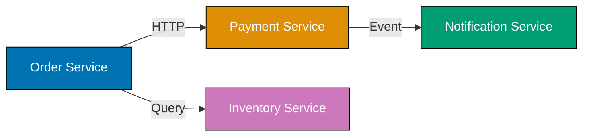
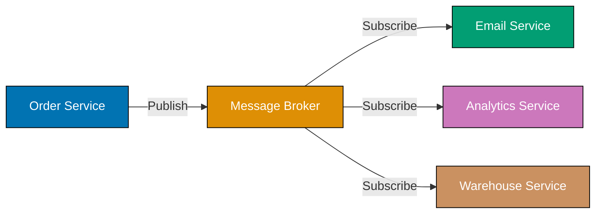
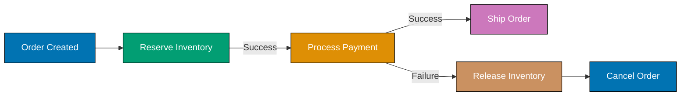

This advanced section covers enterprise-scale BDD through 27 examples demonstrating microservices testing, distributed system patterns, chaos engineering, organizational scaling, and production case studies. You'll master advanced BDD techniques for complex architectures and large team environments.

### Example 59: BDD in Microservices - Service-to-Service Communication

Testing interactions between microservices requires coordinating multiple services, managing service discovery, and verifying distributed behavior.



**Gherkin Scenario**:

```gherkin
# File: features/order_fulfillment.feature
Feature: Order Fulfillment Across Microservices
  # => Feature: Tests distributed transaction across services
  # => Scope: Order, Payment, Inventory, Notification services

  Scenario: Successful order placement with payment and inventory
    # => Scenario: Happy path for multi-service coordination
    Given the inventory service has 5 units of "Laptop Pro" available
    # => Given: Precondition in Inventory service
    # => State: inventory_db.products['Laptop Pro'].stock = 5
    And the payment service is configured with test merchant "TEST_MERCHANT_123"
    # => And: Precondition in Payment service configuration
    # => State: payment_config.merchant_id = "TEST_MERCHANT_123"
    When customer "alice@example.com" places order for 2 units of "Laptop Pro"
    # => When: Action triggers Order service
    # => HTTP POST /api/orders with customer_email, product, quantity
    And customer provides payment details with card "4111111111111111"
    # => And: Payment information submitted
    # => Triggers: Order → Payment service communication
    Then the order status should be "CONFIRMED"
    # => Then: Assertion on Order service state
    # => Verify: order.status == "CONFIRMED"
    And the inventory should decrease to 3 units for "Laptop Pro"
    # => And: Assertion on Inventory service state
    # => Verify: inventory_db.products['Laptop Pro'].stock = 3
    And payment of $2000 should be processed via "TEST_MERCHANT_123"
    # => And: Assertion on Payment service transaction
    # => Verify: payment_transactions.last.amount == 2000
    And notification email should be sent to "alice@example.com"
    # => And: Assertion on Notification service
    # => Verify: email_sent(to='alice@example.com', subject='Order Confirmed')
```

**Step Definitions with Service Clients**:

```typescript
// File: steps/microservices_steps.ts
import { Given, When, Then } from "@cucumber/cucumber";
// => Imports: Cucumber decorators for step definitions
import { InventoryClient } from "../clients/InventoryClient";
// => Import: HTTP client for Inventory service API
import { PaymentClient } from "../clients/PaymentClient";
// => Import: HTTP client for Payment service API
import { OrderClient } from "../clients/OrderClient";
// => Import: HTTP client for Order service API
import { NotificationClient } from "../clients/NotificationClient";
// => Import: HTTP client for Notification service API
import { expect } from "chai";
// => Import: Assertion library for verification

let inventoryClient: InventoryClient;
// => Variable: Inventory service client instance
let paymentClient: PaymentClient;
// => Variable: Payment service client instance
let orderClient: OrderClient;
// => Variable: Order service client instance
let notificationClient: NotificationClient;
// => Variable: Notification service client instance
let currentOrder: any;
// => Variable: Stores order response for assertions

Given("the inventory service has {int} units of {string} available", async (quantity: number, product: string) => {
  // => Step: Sets up inventory precondition
  inventoryClient = new InventoryClient("http://localhost:8081");
  // => Initialize: Inventory client pointing to service endpoint
  await inventoryClient.setStock(product, quantity);
  // => HTTP PUT: /api/inventory/{product}/stock with quantity
  // => Effect: inventory_db updated with stock level
});

Given("the payment service is configured with test merchant {string}", async (merchantId: string) => {
  // => Step: Configures payment service for test
  paymentClient = new PaymentClient("http://localhost:8082");
  // => Initialize: Payment client pointing to service endpoint
  await paymentClient.configureMerchant(merchantId);
  // => HTTP POST: /api/config/merchant with merchantId
  // => Effect: payment_config.merchant_id set for test isolation
});

When(
  "customer {string} places order for {int} units of {string}",
  async (email: string, quantity: number, product: string) => {
    // => Step: Triggers order creation (main action)
    orderClient = new OrderClient("http://localhost:8080");
    // => Initialize: Order client pointing to service endpoint
    currentOrder = await orderClient.createOrder({
      // => HTTP POST: /api/orders with order payload
      customer_email: email,
      // => Payload field: customer identifier
      product: product,
      // => Payload field: product name
      quantity: quantity,
      // => Payload field: order quantity
    });
    // => Response: { order_id, status, customer_email, items, ... }
    // => State: currentOrder populated for later assertions
  },
);

When("customer provides payment details with card {string}", async (cardNumber: string) => {
  // => Step: Submits payment (triggers Order → Payment communication)
  await orderClient.submitPayment(currentOrder.order_id, {
    // => HTTP POST: /api/orders/{order_id}/payment
    card_number: cardNumber,
    // => Payload: test card number (Stripe test card)
    expiry: "12/25",
    // => Payload: card expiry
    cvv: "123",
    // => Payload: card CVV
  });
  // => Effect: Order service calls Payment service internally
  // => Payment service processes transaction with merchant
});

Then("the order status should be {string}", async (expectedStatus: string) => {
  // => Step: Verifies order state in Order service
  const order = await orderClient.getOrder(currentOrder.order_id);
  // => HTTP GET: /api/orders/{order_id}
  // => Response: full order object with current status
  expect(order.status).to.equal(expectedStatus);
  // => Assertion: order.status == "CONFIRMED"
});

Then("the inventory should decrease to {int} units for {string}", async (expectedStock: number, product: string) => {
  // => Step: Verifies inventory update in Inventory service
  const stock = await inventoryClient.getStock(product);
  // => HTTP GET: /api/inventory/{product}/stock
  // => Response: { product, stock, reserved, available }
  expect(stock.available).to.equal(expectedStock);
  // => Assertion: stock.available == 3 (5 initial - 2 ordered)
});

Then("payment of ${int} should be processed via {string}", async (amount: number, merchantId: string) => {
  // => Step: Verifies payment transaction in Payment service
  const transactions = await paymentClient.getTransactions();
  // => HTTP GET: /api/transactions (filtered by test context)
  // => Response: [{ id, amount, merchant_id, status, ... }]
  const lastTx = transactions[transactions.length - 1];
  // => Access: most recent transaction
  expect(lastTx.amount).to.equal(amount);
  // => Assertion: transaction amount == 2000
  expect(lastTx.merchant_id).to.equal(merchantId);
  // => Assertion: merchant ID matches configured merchant
});

Then("notification email should be sent to {string}", async (email: string) => {
  // => Step: Verifies email sent via Notification service
  notificationClient = new NotificationClient("http://localhost:8083");
  // => Initialize: Notification client pointing to service endpoint
  const emails = await notificationClient.getSentEmails();
  // => HTTP GET: /api/notifications/emails (test mailbox)
  // => Response: [{ to, subject, body, timestamp }]
  const orderEmail = emails.find((e) => e.to === email && e.subject.includes("Order Confirmed"));
  // => Filter: find email matching recipient and subject pattern
  expect(orderEmail).to.not.be.undefined;
  // => Assertion: confirmation email exists
});
```

**Key Takeaway**: Microservices BDD requires coordinating multiple service clients, managing distributed state, and verifying cross-service interactions through HTTP APIs.

**Why It Matters**: Modern applications use microservices architecture. BDD scenarios testing service-to-service communication validate critical business workflows spanning multiple bounded contexts.

### Example 60: Event-Driven BDD with Message Brokers

Event-driven architectures use message brokers (Kafka, RabbitMQ) for asynchronous communication. BDD scenarios verify event production, consumption, and eventual consistency.



**Gherkin Scenario**:

```gherkin
# File: features/event_driven_order.feature
Feature: Event-Driven Order Processing
  # => Feature: Tests asynchronous event-based workflows
  # => Architecture: Publisher-Subscriber pattern with message broker

  Scenario: Order event triggers multiple downstream services
    # => Scenario: Verify fan-out event processing
    Given the message broker is running and connected
    # => Given: Precondition for event infrastructure
    # => State: Kafka/RabbitMQ broker accessible, topics/queues exist
    And email service subscribes to "order.created" events
    # => And: Email service listener registered
    # => Effect: email_service connected to order.created topic
    And analytics service subscribes to "order.created" events
    # => And: Analytics service listener registered
    # => Effect: analytics_service connected to order.created topic
    When order service publishes "order.created" event with order ID "ORD-123"
    # => When: Event published to message broker
    # => Action: broker.publish(topic='order.created', data={ order_id: 'ORD-123' })
    Then email service should receive the event within 5 seconds
    # => Then: Assertion on email service event consumption
    # => Verify: email_service.received_events contains ORD-123 (async)
    And analytics service should receive the event within 5 seconds
    # => And: Assertion on analytics service event consumption
    # => Verify: analytics_service.received_events contains ORD-123 (async)
    And email service should send confirmation to customer
    # => And: Assertion on email service side effect
    # => Verify: email_sent event triggered by email service
```

**Step Definitions with Event Verification**:

```typescript
// File: steps/event_driven_steps.ts
import { Given, When, Then } from "@cucumber/cucumber";
// => Imports: Cucumber decorators
import { Kafka, Producer, Consumer } from "kafkajs";
// => Imports: Kafka client library for event handling
import { expect } from "chai";
// => Import: Assertion library
import { setTimeout } from "timers/promises";
// => Import: Promise-based delay for async waiting

let kafka: Kafka;
// => Variable: Kafka client instance
let producer: Producer;
// => Variable: Kafka producer for publishing events
let emailConsumer: Consumer;
// => Variable: Kafka consumer for email service simulation
let analyticsConsumer: Consumer;
// => Variable: Kafka consumer for analytics service simulation
let emailEvents: any[] = [];
// => Variable: Stores events received by email service
let analyticsEvents: any[] = [];
// => Variable: Stores events received by analytics service

Given("the message broker is running and connected", async () => {
  // => Step: Initialize Kafka client and verify connection
  kafka = new Kafka({
    // => Initialize: Kafka client with broker configuration
    clientId: "bdd-test",
    // => Config: client identifier for logging
    brokers: ["localhost:9092"],
    // => Config: Kafka broker addresses (localhost for test)
  });
  producer = kafka.producer();
  // => Create: Kafka producer instance
  await producer.connect();
  // => Connect: establish connection to broker
  // => Effect: producer ready to publish events
});

Given("email service subscribes to {string} events", async (topic: string) => {
  // => Step: Simulate email service subscribing to topic
  emailConsumer = kafka.consumer({ groupId: "email-service" });
  // => Create: Kafka consumer with consumer group ID
  // => Group: 'email-service' ensures single delivery per group
  await emailConsumer.connect();
  // => Connect: establish consumer connection
  await emailConsumer.subscribe({ topic, fromBeginning: false });
  // => Subscribe: listen to 'order.created' topic
  // => fromBeginning: false (only new messages, not replay)

  await emailConsumer.run({
    // => Start: message processing loop
    eachMessage: async ({ message }) => {
      // => Handler: called for each received message
      const event = JSON.parse(message.value.toString());
      // => Parse: deserialize message payload from bytes to JSON
      // => event structure: { order_id, customer_email, ... }
      emailEvents.push(event);
      // => Store: add event to emailEvents array for assertion
      console.log("Email service received:", event);
      // => Log: for debugging async event flow
    },
  });
  // => Effect: emailConsumer actively listening for events
});

Given("analytics service subscribes to {string} events", async (topic: string) => {
  // => Step: Simulate analytics service subscribing to topic
  analyticsConsumer = kafka.consumer({ groupId: "analytics-service" });
  // => Create: Kafka consumer with different consumer group
  // => Group: 'analytics-service' (separate from email group)
  await analyticsConsumer.connect();
  // => Connect: establish consumer connection
  await analyticsConsumer.subscribe({ topic, fromBeginning: false });
  // => Subscribe: listen to 'order.created' topic (same topic, different group)

  await analyticsConsumer.run({
    // => Start: message processing loop
    eachMessage: async ({ message }) => {
      // => Handler: called for each received message
      const event = JSON.parse(message.value.toString());
      // => Parse: deserialize message payload
      analyticsEvents.push(event);
      // => Store: add event to analyticsEvents array
      console.log("Analytics service received:", event);
      // => Log: for debugging
    },
  });
  // => Effect: analyticsConsumer actively listening
});

When("order service publishes {string} event with order ID {string}", async (eventType: string, orderId: string) => {
  // => Step: Publish event to Kafka (simulating order service)
  await producer.send({
    // => Action: send message to Kafka topic
    topic: "order.created",
    // => Target: topic name (matches consumer subscriptions)
    messages: [
      {
        // => Payload: array of messages (single message here)
        value: JSON.stringify({
          // => Serialize: convert event object to JSON string bytes
          event_type: eventType,
          // => Field: 'order.created'
          order_id: orderId,
          // => Field: 'ORD-123'
          customer_email: "customer@example.com",
          // => Field: customer identifier
          timestamp: new Date().toISOString(),
          // => Field: event timestamp for ordering
        }),
      },
    ],
  });
  // => Effect: message published to broker
  // => Broker: distributes to all subscribed consumers
});

Then("email service should receive the event within {int} seconds", async (timeoutSeconds: number) => {
  // => Step: Verify event received by email consumer (async assertion)
  const startTime = Date.now();
  // => Capture: start time for timeout tracking

  while (emailEvents.length === 0) {
    // => Loop: poll until event received or timeout
    if (Date.now() - startTime > timeoutSeconds * 1000) {
      // => Check: exceeded timeout threshold
      throw new Error(`Email service did not receive event within ${timeoutSeconds}s`);
      // => Fail: timeout exceeded without receiving event
    }
    await setTimeout(100);
    // => Wait: 100ms between polls (avoid tight loop)
  }

  expect(emailEvents[0].order_id).to.equal("ORD-123");
  // => Assertion: event contains expected order ID
  // => Verify: event deserialized correctly
});

Then("analytics service should receive the event within {int} seconds", async (timeoutSeconds: number) => {
  // => Step: Verify event received by analytics consumer
  const startTime = Date.now();
  // => Capture: start time

  while (analyticsEvents.length === 0) {
    // => Loop: poll until event received or timeout
    if (Date.now() - startTime > timeoutSeconds * 1000) {
      // => Check: timeout threshold
      throw new Error(`Analytics service did not receive event within ${timeoutSeconds}s`);
      // => Fail: timeout
    }
    await setTimeout(100);
    // => Wait: 100ms poll interval
  }

  expect(analyticsEvents[0].order_id).to.equal("ORD-123");
  // => Assertion: event received with correct order ID
  // => Verify: both consumers received same event (fan-out)
});

Then("email service should send confirmation to customer", async () => {
  // => Step: Verify email service side effect (event-triggered action)
  await setTimeout(1000);
  // => Wait: allow time for email service to process event
  // => Eventual consistency: async processing takes time

  expect(emailEvents.length).to.be.greaterThan(0);
  // => Assertion: at least one event received
  // => Prerequisite: event must be received to trigger action

  // In real test: verify email sent via email service API or test mailbox
  // => Comment: production would check actual email delivery
  // => Pattern: verify side effect of event consumption
});
```

**Key Takeaway**: Event-driven BDD requires asynchronous verification patterns, polling with timeouts, and testing fan-out scenarios where multiple consumers process the same event.

**Why It Matters**: Event-driven architectures enable loose coupling and scalability. BDD scenarios validate eventual consistency and event-driven business workflows critical to modern distributed systems.

### Example 61: SAGA Pattern - Distributed Transaction Coordination

SAGA pattern manages distributed transactions through orchestrated or choreographed compensation logic. BDD scenarios verify both success paths and failure rollback.



**Gherkin Scenario - Success Path**:

```gherkin
# File: features/saga_success.feature
Feature: SAGA Pattern - Successful Order Flow
  # => Feature: Tests orchestrated SAGA success path
  # => Pattern: Orchestration (central coordinator drives saga)

  Scenario: Order successfully completes through SAGA steps
    # => Scenario: Happy path with all steps succeeding
    Given inventory has 10 units of "Gaming Laptop"
    # => Given: Precondition in Inventory service
    And payment gateway is available
    # => And: Precondition for Payment service
    And shipping service is operational
    # => And: Precondition for Shipping service
    When customer creates order for 1 unit of "Gaming Laptop"
    # => When: Triggers SAGA orchestration
    # => Action: POST /api/orders (SAGA coordinator starts)
    Then the SAGA should execute step "RESERVE_INVENTORY"
    # => Then: Verify first SAGA step executed
    # => State: inventory reserved (not committed yet)
    And the SAGA should execute step "PROCESS_PAYMENT"
    # => And: Verify second SAGA step executed
    # => State: payment authorized
    And the SAGA should execute step "SHIP_ORDER"
    # => And: Verify third SAGA step executed
    # => State: shipping label created
    And the order status should be "COMPLETED"
    # => And: Verify final SAGA state
    # => Effect: all steps succeeded, order completed
    And inventory should be reduced by 1 unit
    # => And: Verify inventory committed (not just reserved)
```

**Gherkin Scenario - Failure with Compensation**:

```gherkin
# File: features/saga_rollback.feature
Feature: SAGA Pattern - Rollback on Payment Failure
  # => Feature: Tests SAGA compensation logic
  # => Pattern: Choreography (services emit events, trigger compensations)

  Scenario: Payment failure triggers inventory release compensation
    # => Scenario: Verify compensation actions execute on failure
    Given inventory has 5 units of "Wireless Mouse"
    # => Given: Initial inventory state
    And payment gateway will reject transactions
    # => And: Precondition for forced failure (test double)
    # => Mock: payment service configured to fail
    When customer creates order for 2 units of "Wireless Mouse"
    # => When: Triggers SAGA orchestration
    Then the SAGA should execute step "RESERVE_INVENTORY"
    # => Then: First step succeeds (inventory reserved)
    # => State: inventory.reserved = 2, inventory.available = 3
    And the SAGA should execute step "PROCESS_PAYMENT"
    # => And: Second step attempted
    But the SAGA step "PROCESS_PAYMENT" should fail
    # => But: Payment step fails (expected failure)
    # => State: payment.status = "REJECTED"
    Then the SAGA should execute compensation "RELEASE_INVENTORY"
    # => Then: Compensation triggered by payment failure
    # => Action: inventory service rolls back reservation
    And inventory should return to 5 units
    # => And: Verify compensation restored original state
    # => State: inventory.available = 5 (reservation released)
    And the order status should be "CANCELLED"
    # => And: Verify final SAGA state after rollback
    # => State: order.status = "CANCELLED"
```

**Step Definitions with SAGA Orchestrator**:

```typescript
// File: steps/saga_steps.ts
import { Given, When, Then, But } from "@cucumber/cucumber";
// => Imports: Cucumber decorators (including But for negative assertions)
import { SagaOrchestrator } from "../saga/SagaOrchestrator";
// => Import: SAGA coordinator that manages distributed transaction
import { InventoryService } from "../services/InventoryService";
// => Import: Inventory service client
import { PaymentService } from "../services/PaymentService";
// => Import: Payment service client
import { ShippingService } from "../services/ShippingService";
// => Import: Shipping service client
import { expect } from "chai";
// => Import: Assertion library

let saga: SagaOrchestrator;
// => Variable: SAGA orchestrator instance
let inventoryService: InventoryService;
// => Variable: Inventory service client
let paymentService: PaymentService;
// => Variable: Payment service client
let shippingService: ShippingService;
// => Variable: Shipping service client
let currentOrderId: string;
// => Variable: Stores order ID for SAGA tracking
let sagaSteps: string[] = [];
// => Variable: Records executed SAGA steps for verification

Given("inventory has {int} units of {string}", async (quantity: number, product: string) => {
  // => Step: Initialize inventory state
  inventoryService = new InventoryService("http://localhost:8081");
  // => Initialize: inventory client
  await inventoryService.setStock(product, quantity);
  // => HTTP PUT: /api/inventory/{product}/stock
  // => State: inventory_db.products[product].available = quantity
});

Given("payment gateway is available", async () => {
  // => Step: Configure payment service for success
  paymentService = new PaymentService("http://localhost:8082");
  // => Initialize: payment client
  await paymentService.setAvailability(true);
  // => HTTP POST: /api/config/availability (test endpoint)
  // => State: payment gateway mock will accept transactions
});

Given("payment gateway will reject transactions", async () => {
  // => Step: Configure payment service for failure (test double)
  paymentService = new PaymentService("http://localhost:8082");
  // => Initialize: payment client
  await paymentService.setAvailability(false);
  // => HTTP POST: /api/config/availability
  // => State: payment gateway mock will reject all transactions
  // => Purpose: force SAGA compensation path for testing
});

Given("shipping service is operational", async () => {
  // => Step: Configure shipping service
  shippingService = new ShippingService("http://localhost:8083");
  // => Initialize: shipping client
  await shippingService.setOperational(true);
  // => HTTP POST: /api/config/operational
  // => State: shipping service ready to create labels
});

When("customer creates order for {int} unit of {string}", async (quantity: number, product: string) => {
  // => Step: Trigger SAGA orchestration
  saga = new SagaOrchestrator({
    // => Initialize: SAGA orchestrator with service dependencies
    inventoryService,
    // => Dependency: inventory service client
    paymentService,
    // => Dependency: payment service client
    shippingService,
    // => Dependency: shipping service client
  });

  saga.on("step-executed", (stepName: string) => {
    // => Event listener: track SAGA step execution
    sagaSteps.push(stepName);
    // => Record: add step name to sagaSteps array
    // => Purpose: verify step execution order in assertions
  });

  currentOrderId = await saga.startOrder({
    // => Action: initiate SAGA transaction
    product,
    // => Param: product name
    quantity,
    // => Param: order quantity
  });
  // => Return: order ID for tracking
  // => Effect: SAGA begins executing steps asynchronously
});

Then("the SAGA should execute step {string}", async (stepName: string) => {
  // => Step: Verify specific SAGA step executed
  await saga.waitForCompletion();
  // => Wait: block until SAGA finishes (success or rollback)
  // => Pattern: async orchestration requires completion wait

  expect(sagaSteps).to.include(stepName);
  // => Assertion: step name in executed steps array
  // => Verify: SAGA orchestrator called this step
});

But("the SAGA step {string} should fail", async (stepName: string) => {
  // => Step: Verify SAGA step failed (negative assertion)
  const stepStatus = await saga.getStepStatus(stepName);
  // => Query: get execution status for specific step
  // => Response: { step, status: 'SUCCESS' | 'FAILED', error? }

  expect(stepStatus.status).to.equal("FAILED");
  // => Assertion: step status is FAILED
  // => Verify: payment rejection triggered failure state
});

Then("the SAGA should execute compensation {string}", async (compensationName: string) => {
  // => Step: Verify compensation logic executed
  const compensations = await saga.getExecutedCompensations();
  // => Query: get list of executed compensation actions
  // => Response: ['RELEASE_INVENTORY', ...]

  expect(compensations).to.include(compensationName);
  // => Assertion: compensation name in executed compensations
  // => Verify: SAGA rollback logic triggered
});

Then("inventory should return to {int} units", async (expectedStock: number) => {
  // => Step: Verify compensation restored inventory
  const stock = await inventoryService.getStock("Wireless Mouse");
  // => HTTP GET: /api/inventory/Wireless Mouse/stock
  // => Response: { available, reserved }

  expect(stock.available).to.equal(expectedStock);
  // => Assertion: available stock matches original (pre-reservation)
  // => Verify: RELEASE_INVENTORY compensation executed successfully
});

Then("the order status should be {string}", async (expectedStatus: string) => {
  // => Step: Verify final SAGA state
  const status = await saga.getOrderStatus(currentOrderId);
  // => Query: get final order status after SAGA completion/rollback
  // => Response: { order_id, status: 'COMPLETED' | 'CANCELLED' }

  expect(status).to.equal(expectedStatus);
  // => Assertion: order status matches expected final state
  // => Verify: SAGA reached correct terminal state
});
```

**SAGA Orchestrator Implementation Pattern**:

```typescript
// File: saga/SagaOrchestrator.ts
import EventEmitter from "events";
// => Import: event emitter for SAGA step notifications

export class SagaOrchestrator extends EventEmitter {
  // => Class: central coordinator for SAGA pattern
  // => Extends: EventEmitter for step execution events

  private steps = [
    // => Config: ordered SAGA steps (executed sequentially)
    { name: "RESERVE_INVENTORY", compensate: "RELEASE_INVENTORY" },
    // => Step 1: reserve inventory (compensate: release if later step fails)
    { name: "PROCESS_PAYMENT", compensate: "REFUND_PAYMENT" },
    // => Step 2: process payment (compensate: refund if later step fails)
    { name: "SHIP_ORDER", compensate: null },
    // => Step 3: ship order (no compensation - terminal step)
  ];

  private executedSteps: string[] = [];
  // => State: tracks successfully executed steps
  private compensations: string[] = [];
  // => State: tracks executed compensations during rollback

  constructor(private services: any) {
    // => Constructor: inject service dependencies
    super();
    // => Call: EventEmitter constructor
  }

  async startOrder(orderData: any): Promise<string> {
    // => Method: initiates SAGA transaction
    const orderId = `ORD-${Date.now()}`;
    // => Generate: unique order ID

    try {
      for (const step of this.steps) {
        // => Loop: execute steps sequentially
        await this.executeStep(step.name, orderData);
        // => Execute: call step-specific logic
        this.executedSteps.push(step.name);
        // => Record: track successful execution
        this.emit("step-executed", step.name);
        // => Event: notify listeners (for test verification)
      }
      return orderId;
      // => Success: all steps completed
    } catch (error) {
      // => Catch: any step failure triggers rollback
      await this.rollback();
      // => Rollback: execute compensations for completed steps
      throw error;
      // => Re-throw: propagate failure to caller
    }
  }

  private async rollback(): Promise<void> {
    // => Method: execute compensation logic
    for (let i = this.executedSteps.length - 1; i >= 0; i--) {
      // => Loop: compensate in reverse order (undo last-to-first)
      const stepName = this.executedSteps[i];
      // => Get: executed step name
      const step = this.steps.find((s) => s.name === stepName);
      // => Find: step configuration (includes compensation name)

      if (step?.compensate) {
        // => Check: step has compensation logic
        await this.executeCompensation(step.compensate);
        // => Execute: compensation action
        this.compensations.push(step.compensate);
        // => Record: track executed compensation
      }
    }
  }
}
```

**Key Takeaway**: SAGA pattern BDD requires testing both success paths (all steps complete) and failure paths (compensations execute in reverse order), verifying distributed transaction coordination.

**Why It Matters**: Distributed systems can't use traditional ACID transactions. SAGAs enable business transactions spanning multiple services with eventual consistency and rollback guarantees.

### Example 62: BDD for Distributed Tracing

Distributed tracing tracks requests across microservices using correlation IDs. BDD scenarios verify trace propagation and observability integration.

```gherkin
# File: features/distributed_tracing.feature
Feature: Distributed Tracing Across Microservices
  # => Feature: Validates trace context propagation
  # => Observability: OpenTelemetry/Zipkin/Jaeger integration

  Scenario: Trace ID propagates through service call chain
    # => Scenario: Verify correlation ID flows through all services
    Given tracing is enabled with service name "order-service"
    # => Given: OpenTelemetry configured
    # => State: tracer initialized with service identifier
    When client sends request with trace ID "trace-abc-123"
    # => When: Initial request includes trace context
    # => Header: X-Trace-ID: trace-abc-123
    And order service calls inventory service
    # => And: Order service makes downstream HTTP call
    # => Propagation: trace ID passed in request headers
    And inventory service calls warehouse service
    # => And: Inventory service makes further downstream call
    # => Propagation: trace ID continues through call chain
    Then all services should log the same trace ID "trace-abc-123"
    # => Then: Verify trace ID consistency across services
    # => Assertion: logs contain matching trace ID
    And trace spans should form parent-child relationships
    # => And: Verify span hierarchy (order → inventory → warehouse)
    # => Structure: parent spans contain child spans
```

**Step Definitions**:

```typescript
// File: steps/tracing_steps.ts
import { Given, When, Then } from "@cucumber/cucumber";
// => Imports: Cucumber decorators
import { trace, context, SpanStatusCode } from "@opentelemetry/api";
// => Imports: OpenTelemetry API for tracing
import { NodeTracerProvider } from "@opentelemetry/sdk-trace-node";
// => Import: Node.js tracer provider
import { SimpleSpanProcessor } from "@opentelemetry/sdk-trace-base";
// => Import: span processor (sends spans to exporter)
import { InMemorySpanExporter } from "@opentelemetry/sdk-trace-base";
// => Import: in-memory exporter for testing (captures spans)
import { expect } from "chai";
// => Import: assertion library

let tracer: any;
// => Variable: OpenTelemetry tracer instance
let spanExporter: InMemorySpanExporter;
// => Variable: captures spans for verification
let currentTraceId: string;
// => Variable: stores trace ID for assertion

Given("tracing is enabled with service name {string}", async (serviceName: string) => {
  // => Step: Initialize OpenTelemetry tracing
  const provider = new NodeTracerProvider();
  // => Create: tracer provider (manages tracers)

  spanExporter = new InMemorySpanExporter();
  // => Create: in-memory exporter (captures spans for testing)
  // => Production: would use Jaeger/Zipkin exporter

  provider.addSpanProcessor(new SimpleSpanProcessor(spanExporter));
  // => Register: span processor with exporter
  // => Effect: spans sent to exporter when finished

  provider.register();
  // => Register: provider as global tracer provider
  // => Effect: trace API uses this provider

  tracer = trace.getTracer(serviceName);
  // => Get: tracer instance for service
  // => serviceName: identifies service in traces
});

When("client sends request with trace ID {string}", async (traceId: string) => {
  // => Step: Initiate request with specific trace ID
  currentTraceId = traceId;
  // => Store: trace ID for later assertions

  const span = tracer.startSpan("order-service-request", {
    // => Start: root span for request
    // => Name: 'order-service-request' identifies operation
    attributes: {
      // => Attributes: metadata attached to span
      "http.method": "POST",
      // => Attribute: HTTP method
      "http.url": "/api/orders",
      // => Attribute: endpoint
      "trace.id": traceId,
      // => Attribute: correlation ID
    },
  });
  // => Effect: span created and recorded

  context.with(trace.setSpan(context.active(), span), () => {
    // => Context: set active span for propagation
    // => Scope: child spans will reference this as parent
  });

  span.end();
  // => End: finish span (triggers export)
});

When("order service calls inventory service", async () => {
  // => Step: Simulate downstream service call with trace propagation
  const parentSpan = trace.getSpan(context.active());
  // => Get: active span (parent for this call)

  const childSpan = tracer.startSpan("inventory-service-call", {
    // => Start: child span for downstream call
    // => Name: identifies operation
    parent: parentSpan,
    // => Link: set parent-child relationship
    attributes: {
      // => Attributes: call metadata
      "http.method": "GET",
      // => Attribute: HTTP method for inventory query
      "http.url": "/api/inventory/check",
      // => Attribute: inventory service endpoint
      "service.name": "inventory-service",
      // => Attribute: downstream service identifier
    },
  });
  // => Effect: child span inherits trace ID from parent

  childSpan.end();
  // => End: finish child span
});

When("inventory service calls warehouse service", async () => {
  // => Step: Simulate further downstream call (multi-hop)
  const parentSpan = trace.getSpan(context.active());
  // => Get: current active span (inventory span)

  const grandchildSpan = tracer.startSpan("warehouse-service-call", {
    // => Start: grandchild span (third level)
    // => Name: warehouse operation
    parent: parentSpan,
    // => Link: parent is inventory span
    attributes: {
      // => Attributes: call metadata
      "http.method": "GET",
      // => Attribute: HTTP method
      "http.url": "/api/warehouse/reserve",
      // => Attribute: warehouse service endpoint
      "service.name": "warehouse-service",
      // => Attribute: service identifier
    },
  });
  // => Effect: trace ID propagates through three services

  grandchildSpan.end();
  // => End: finish grandchild span
});

Then("all services should log the same trace ID {string}", async (expectedTraceId: string) => {
  // => Step: Verify trace ID consistency across spans
  const finishedSpans = spanExporter.getFinishedSpans();
  // => Get: all captured spans from in-memory exporter
  // => Response: [{ name, traceId, spanId, parentSpanId, attributes }]

  expect(finishedSpans.length).to.be.greaterThan(0);
  // => Assertion: at least one span captured

  finishedSpans.forEach((span) => {
    // => Loop: verify each span
    const traceIdAttr = span.attributes["trace.id"];
    // => Get: trace ID from span attributes
    expect(traceIdAttr).to.equal(expectedTraceId);
    // => Assertion: trace ID matches expected value
    // => Verify: all spans share same correlation ID
  });
});

Then("trace spans should form parent-child relationships", async () => {
  // => Step: Verify span hierarchy
  const finishedSpans = spanExporter.getFinishedSpans();
  // => Get: captured spans

  const orderSpan = finishedSpans.find((s) => s.name === "order-service-request");
  // => Find: root span
  const inventorySpan = finishedSpans.find((s) => s.name === "inventory-service-call");
  // => Find: child span
  const warehouseSpan = finishedSpans.find((s) => s.name === "warehouse-service-call");
  // => Find: grandchild span

  expect(inventorySpan?.parentSpanId).to.equal(orderSpan?.spanContext().spanId);
  // => Assertion: inventory span's parent is order span
  // => Verify: parent-child relationship established

  expect(warehouseSpan?.parentSpanId).to.equal(inventorySpan?.spanContext().spanId);
  // => Assertion: warehouse span's parent is inventory span
  // => Verify: grandchild relationship established
  // => Structure: order → inventory → warehouse
});
```

**Key Takeaway**: Distributed tracing BDD verifies correlation ID propagation across service boundaries and validates span parent-child relationships for request flow visualization.

**Why It Matters**: Observability is critical for debugging distributed systems. BDD scenarios ensure tracing infrastructure correctly tracks requests across microservices for production troubleshooting.

### Example 63: Chaos Engineering with BDD - Testing Resilience

Chaos engineering intentionally introduces failures to verify system resilience. BDD scenarios test graceful degradation, circuit breakers, and retry logic.

```gherkin
# File: features/chaos_circuit_breaker.feature
Feature: Circuit Breaker Pattern Under Chaos
  # => Feature: Tests resilience patterns under induced failures
  # => Chaos: deliberate service degradation

  Scenario: Circuit breaker opens after threshold failures
    # => Scenario: Verify circuit breaker protects from cascading failures
    Given payment service is healthy
    # => Given: Initial healthy state
    And circuit breaker is configured with 3 failure threshold
    # => And: Circuit breaker config (opens after 3 consecutive failures)
    # => State: circuit_breaker.threshold = 3
    When chaos monkey kills payment service
    # => When: Introduce failure (service unavailable)
    # => Action: payment_service.stop() (simulated outage)
    And order service attempts 5 payments
    # => And: Multiple attempts trigger circuit breaker logic
    # => Calls: 5 HTTP requests to unavailable payment service
    Then first 3 payment attempts should fail
    # => Then: Verify attempts reach service (closed circuit)
    # => State: circuit_breaker.failures = 3
    And circuit breaker should open after 3rd failure
    # => And: Verify circuit breaker opens
    # => State: circuit_breaker.state = 'OPEN'
    And remaining 2 attempts should fail immediately without calling service
    # => And: Verify fast-fail (no network call)
    # => Effect: circuit breaker prevents cascading failures
    And order service should return error "Service Temporarily Unavailable"
    # => And: Verify graceful degradation message
```

**Step Definitions with Circuit Breaker**:

```typescript
// File: steps/chaos_steps.ts
import { Given, When, Then } from "@cucumber/cucumber";
// => Imports: Cucumber decorators
import { CircuitBreaker } from "opossum";
// => Import: circuit breaker library (resilience pattern)
import axios from "axios";
// => Import: HTTP client for service calls
import { expect } from "chai";
// => Import: assertion library

let paymentService: any;
// => Variable: payment service process handle
let circuitBreaker: CircuitBreaker;
// => Variable: circuit breaker instance
let attemptResults: any[] = [];
// => Variable: tracks payment attempt outcomes
let serviceCalls: number = 0;
// => Variable: counts actual service calls (vs fast-fails)

Given("payment service is healthy", async () => {
  // => Step: Start payment service in healthy state
  paymentService = { status: "healthy" };
  // => Mock: simulate healthy service
  // => Production: would start actual service process
});

Given("circuit breaker is configured with {int} failure threshold", async (threshold: number) => {
  // => Step: Initialize circuit breaker with config
  circuitBreaker = new CircuitBreaker(
    async () => {
      // => Create: circuit breaker wrapping payment call
      serviceCalls++;
      // => Increment: track actual service calls

      if (paymentService.status !== "healthy") {
        // => Check: service availability
        throw new Error("Payment service unavailable");
        // => Throw: simulate service failure
      }

      return { success: true };
      // => Return: successful payment response
    },
    {
      // => Config: circuit breaker options
      errorThresholdPercentage: 100,
      // => Config: 100% failures trigger open (strict threshold)
      resetTimeout: 10000,
      // => Config: 10s before half-open retry
      volumeThreshold: threshold,
      // => Config: minimum failures before opening (3 in scenario)
    },
  );
  // => Effect: circuit breaker monitors payment service calls
});

When("chaos monkey kills payment service", async () => {
  // => Step: Introduce service failure (chaos engineering)
  paymentService.status = "dead";
  // => Change: mark service as unavailable
  // => Effect: subsequent calls will fail
  // => Chaos: simulates production outage
});

When("order service attempts {int} payments", async (attempts: number) => {
  // => Step: Make multiple payment attempts
  serviceCalls = 0;
  // => Reset: call counter
  attemptResults = [];
  // => Reset: results array

  for (let i = 0; i < attempts; i++) {
    // => Loop: make N payment attempts
    try {
      const result = await circuitBreaker.fire();
      // => Call: invoke payment through circuit breaker
      // => fire(): executes wrapped function
      attemptResults.push({ success: true, result });
      // => Record: successful payment
    } catch (error) {
      // => Catch: payment failure (service down or circuit open)
      attemptResults.push({
        success: false,
        error: error.message,
        // => Record: error message
        fastFail: circuitBreaker.opened,
        // => Record: whether circuit was open (fast-fail)
      });
    }
  }
  // => Effect: attemptResults contains all outcomes
});

Then("first {int} payment attempts should fail", async (count: number) => {
  // => Step: Verify failures reached service (closed circuit)
  const firstAttempts = attemptResults.slice(0, count);
  // => Extract: first N attempts

  firstAttempts.forEach((attempt) => {
    // => Loop: verify each attempt
    expect(attempt.success).to.be.false;
    // => Assertion: attempt failed
    expect(attempt.fastFail).to.be.undefined;
    // => Assertion: not a fast-fail (circuit still closed)
    // => Verify: actual service call occurred
  });

  expect(serviceCalls).to.equal(count);
  // => Assertion: service called exactly N times
  // => Verify: circuit allowed calls through before opening
});

Then("circuit breaker should open after {int}rd failure", async (count: number) => {
  // => Step: Verify circuit breaker opened
  expect(circuitBreaker.opened).to.be.true;
  // => Assertion: circuit breaker state is OPEN
  // => Verify: threshold reached, circuit protecting service
});

Then("remaining {int} attempts should fail immediately without calling service", async (count: number) => {
  // => Step: Verify fast-fail (circuit open)
  const remainingAttempts = attemptResults.slice(3);
  // => Extract: attempts after circuit opened

  remainingAttempts.forEach((attempt) => {
    // => Loop: verify fast-fail behavior
    expect(attempt.success).to.be.false;
    // => Assertion: attempt failed
    expect(attempt.fastFail).to.be.true;
    // => Assertion: was fast-fail (circuit open)
    // => Verify: no service call made
  });

  expect(serviceCalls).to.equal(3);
  // => Assertion: service called only 3 times (not 5)
  // => Verify: circuit breaker prevented 2 calls
});

Then("order service should return error {string}", async (expectedMessage: string) => {
  // => Step: Verify graceful degradation message
  const lastAttempt = attemptResults[attemptResults.length - 1];
  // => Get: most recent attempt

  expect(lastAttempt.error).to.include("unavailable");
  // => Assertion: error message indicates service unavailable
  // => Verify: clear user-facing error (not stack trace)
});
```

**Key Takeaway**: Chaos engineering BDD intentionally breaks services to verify resilience patterns like circuit breakers protect systems from cascading failures.

**Why It Matters**: Production systems fail. BDD scenarios testing chaos engineering patterns ensure graceful degradation and recovery, preventing total system outages.

### Example 64: BDD Anti-Patterns and Refactoring

BDD anti-patterns produce brittle, hard-to-maintain scenarios. This example demonstrates common problems and refactoring solutions.

**Anti-Pattern 1: Imperative Steps (Too Detailed)**:

```gherkin
# BAD: Imperative - too many UI implementation details
Scenario: User login (Anti-pattern)
  Given I navigate to "https://example.com"
  # => Anti-pattern: hardcoded URL (brittle)
  When I click on element with ID "login-button"
  # => Anti-pattern: UI implementation detail (CSS selector)
  And I type "user@example.com" into field with ID "email-input"
  # => Anti-pattern: field locator (changes break test)
  And I type "password123" into field with ID "password-input"
  # => Anti-pattern: field locator
  And I click submit button with class "btn-primary"
  # => Anti-pattern: CSS class selector
  Then I should see element with class "success-message"
  # => Anti-pattern: UI detail, not business outcome
```

**Refactored: Declarative Steps (Business-Focused)**:

```gherkin
# GOOD: Declarative - business language, abstracts UI details
Scenario: User login (Refactored)
  Given user "alice@example.com" exists with password "password123"
  # => Declarative: business concept (user exists)
  # => Abstraction: setup handled in step definition
  When user logs in with email "alice@example.com" and password "password123"
  # => Declarative: business action (login)
  # => Abstraction: UI interaction hidden in page object
  Then user should be authenticated
  # => Declarative: business outcome (authentication state)
  # => Abstraction: verification logic in step definition
  And user should see dashboard
  # => Declarative: business outcome (dashboard access)
```

**Step Definitions - Abstraction**:

```typescript
// File: steps/refactored_login_steps.ts
import { Given, When, Then } from "@cucumber/cucumber";
// => Imports: Cucumber decorators
import { UserRepository } from "../repositories/UserRepository";
// => Import: data access layer (abstracts database)
import { LoginPage } from "../pages/LoginPage";
// => Import: page object (abstracts UI)
import { DashboardPage } from "../pages/DashboardPage";
// => Import: page object
import { expect } from "chai";
// => Import: assertion library

let userRepo: UserRepository;
// => Variable: user repository
let loginPage: LoginPage;
// => Variable: login page object
let dashboardPage: DashboardPage;
// => Variable: dashboard page object

Given("user {string} exists with password {string}", async (email: string, password: string) => {
  // => Step: setup user (business-focused)
  userRepo = new UserRepository();
  // => Initialize: repository
  await userRepo.createUser({ email, password });
  // => Action: create user in database
  // => Abstraction: database interaction hidden
  // => Benefit: scenario doesn't care about DB schema
});

When("user logs in with email {string} and password {string}", async (email: string, password: string) => {
  // => Step: perform login (business action)
  loginPage = new LoginPage();
  // => Initialize: page object
  await loginPage.navigate();
  // => Action: navigate to login page
  // => Abstraction: URL hidden in page object
  await loginPage.login(email, password);
  // => Action: perform login
  // => Abstraction: field locators, clicks hidden in page object
  // => Benefit: UI changes don't break Gherkin
});

Then("user should be authenticated", async () => {
  // => Step: verify authentication state (business outcome)
  const isAuthenticated = await loginPage.isUserAuthenticated();
  // => Query: check authentication (e.g., cookie, token exists)
  // => Abstraction: authentication mechanism hidden
  expect(isAuthenticated).to.be.true;
  // => Assertion: user authenticated
});

Then("user should see dashboard", async () => {
  // => Step: verify dashboard access (business outcome)
  dashboardPage = new DashboardPage();
  // => Initialize: dashboard page object
  const isOnDashboard = await dashboardPage.isDisplayed();
  // => Query: verify on dashboard page
  // => Abstraction: URL check, element presence hidden
  expect(isOnDashboard).to.be.true;
  // => Assertion: dashboard visible
});
```

**Anti-Pattern 2: Scenarios Testing Multiple Features**:

```gherkin
# BAD: Multiple features in one scenario
Scenario: Complete user journey (Anti-pattern)
  Given user creates account
  # => Anti-pattern: setup for next actions (not standalone test)
  When user logs in
  # => Anti-pattern: mixes registration and login features
  And user updates profile
  # => Anti-pattern: adds profile management feature
  And user creates post
  # => Anti-pattern: adds content creation feature
  And user logs out
  # => Anti-pattern: adds logout feature
  Then account should exist
  # => Anti-pattern: weak assertion (doesn't verify profile, post, logout)
```

**Refactored: Single-Feature Scenarios**:

```gherkin
# GOOD: Single responsibility per scenario
Scenario: User account creation
  Given no user exists with email "user@example.com"
  # => Single feature: account creation
  When user registers with email "user@example.com"
  # => Action: registration only
  Then account should be created
  # => Assertion: registration outcome
  And confirmation email should be sent
  # => Assertion: registration side effect

Scenario: User login with valid credentials
  Given user "user@example.com" exists
  # => Single feature: login (separate from registration)
  When user logs in with email "user@example.com"
  # => Action: login only
  Then user should be authenticated
  # => Assertion: login outcome

Scenario: User profile update
  Given user "user@example.com" is logged in
  # => Single feature: profile management
  # => Setup: login as precondition (not testing login here)
  When user updates profile with name "Alice"
  # => Action: profile update only
  Then profile should show name "Alice"
  # => Assertion: profile update outcome
```

**Key Takeaway**: BDD anti-patterns include imperative steps (UI details) and multi-feature scenarios. Refactor to declarative, business-focused steps and single-responsibility scenarios for maintainability.

**Why It Matters**: Brittle scenarios create maintenance burden and reduce confidence in test suite. Declarative, focused scenarios survive refactoring and clearly document business requirements.

### Example 65: Custom Gherkin Dialects for Domain-Specific Languages

Custom Gherkin keywords enable domain-specific BDD languages for specialized industries like finance, healthcare, or trading systems.

```gherkin
# File: features/trading_custom_dialect.feature
# language: en-trading
# => Custom dialect: trading-specific keywords

Feature: Automated Trading Strategy
  # => Feature: financial trading domain

  Trading Rule: Buy signal triggers purchase
    # => Custom keyword: "Trading Rule" (replaces "Scenario")
    Market Condition: Stock "AAPL" price is $150
    # => Custom keyword: "Market Condition" (replaces "Given")
    # => Domain term: market state precondition
    And Order book has 1000 shares available
    # => Standard keyword: still uses "And"
    Execute Strategy: Buy 100 shares when price drops below $145
    # => Custom keyword: "Execute Strategy" (replaces "When")
    # => Domain term: trading action
    Verify Position: Portfolio should contain 100 shares of "AAPL"
    # => Custom keyword: "Verify Position" (replaces "Then")
    # => Domain term: trading outcome
    And Account balance should decrease by $14,500
    # => Standard keyword: financial assertion
    Verify Compliance: Trade should comply with SEC regulations
    # => Custom keyword: "Verify Compliance" (trading-specific)
    # => Domain term: regulatory verification
```

**Custom Gherkin Configuration**:

```typescript
// File: cucumber.js
export default {
  // => Config: Cucumber configuration
  requireModule: ["ts-node/register"],
  // => Require: TypeScript support
  require: ["steps/**/*.ts"],
  // => Require: step definition files
  format: ["progress", "html:reports/cucumber-report.html"],
  // => Format: output formats
  worldParameters: {
    // => World: custom parameters
    dialect: "en-trading",
    // => Dialect: custom Gherkin keywords
  },
  formatOptions: {
    // => Format options: customize output
    snippetInterface: "async-await",
    // => Snippet: async/await syntax
  },
};
```

**Custom Keywords Configuration**:

```json
{
  "en-trading": {
    "name": "Trading English",
    "native": "Trading English",
    "feature": "Feature|Trading Feature",
    "background": "Background|Market Setup",
    "scenario": "Scenario|Trading Rule",
    "scenarioOutline": "Scenario Outline|Trading Strategy",
    "examples": "Examples|Market Scenarios",
    "given": "*|Market Condition|Price Condition",
    "when": "*|Execute Strategy|Place Order|Trigger Alert",
    "then": "*|Verify Position|Verify Compliance|Verify Risk",
    "and": "*|And|Also",
    "but": "*|But|However"
  }
}
```

**Step Definitions with Domain Types**:

```typescript
// File: steps/trading_steps.ts
import { setWorldConstructor, setDefaultTimeout } from "@cucumber/cucumber";
// => Imports: Cucumber world setup
import { TradingWorld } from "../support/TradingWorld";
// => Import: custom world with trading context

setWorldConstructor(TradingWorld);
// => Register: custom world for trading domain
setDefaultTimeout(10000);
// => Config: timeout for trading operations

// Custom keyword: "Market Condition"
TradingWorld.prototype.MarketCondition = function (
  // => Method: custom keyword implementation
  // => Replaces: Given() decorator
  pattern: RegExp,
  callback: (this: TradingWorld, ...args: any[]) => Promise<void>,
) {
  // => Pattern: regex for step matching
  // => Callback: step implementation
  this.Given(pattern, callback);
  // => Delegate: map custom keyword to standard Given
};

// Use custom keyword in step definition
Given(/Stock "([^"]*)" price is \$(\d+)/, async function (this: TradingWorld, ticker: string, price: number) {
  // => Step: market condition (price level)
  this.marketData.setPrice(ticker, price);
  // => Action: set stock price in market data
  // => World: TradingWorld provides marketData property
  this.log(`Market: ${ticker} @ $${price}`);
  // => Log: domain-specific logging
});

// Custom keyword: "Execute Strategy"
When(
  /Buy (\d+) shares when price drops below \$(\d+)/,
  async function (this: TradingWorld, shares: number, triggerPrice: number) {
    // => Step: trading strategy execution
    this.strategy = new BuyStrategy({
      // => Create: trading strategy object
      shares,
      // => Config: position size
      triggerPrice,
      // => Config: entry price
      riskLimit: this.riskProfile.maxPositionSize,
      // => Config: risk management parameter from world
    });
    // => World: strategy stored for verification

    await this.strategy.execute(this.tradingEngine);
    // => Execute: strategy logic via trading engine
    // => Effect: orders placed, positions updated
  },
);

// Custom keyword: "Verify Position"
Then(
  /Portfolio should contain (\d+) shares of "([^"]*)"/,
  async function (this: TradingWorld, expectedShares: number, ticker: string) {
    // => Step: position verification
    const position = this.portfolio.getPosition(ticker);
    // => Query: get current position
    // => World: portfolio managed by TradingWorld

    expect(position.shares).to.equal(expectedShares);
    // => Assertion: position size matches
    this.log(`Position: ${ticker} = ${position.shares} shares`);
    // => Log: domain-specific position logging
  },
);

// Custom keyword: "Verify Compliance"
Then(/Trade should comply with SEC regulations/, async function (this: TradingWorld) {
  // => Step: regulatory compliance verification
  const trades = this.tradingEngine.getExecutedTrades();
  // => Query: get executed trades

  trades.forEach((trade) => {
    // => Loop: verify each trade
    const isCompliant = this.complianceChecker.verify(trade);
    // => Check: run compliance rules
    // => Rules: SEC trading regulations (pattern day trading, etc.)
    expect(isCompliant).to.be.true;
    // => Assertion: trade complies with regulations
  });

  this.log("Compliance: All trades passed SEC verification");
  // => Log: compliance status
});
```

**Custom World with Trading Context**:

```typescript
// File: support/TradingWorld.ts
import { World, IWorldOptions } from "@cucumber/cucumber";
// => Imports: Cucumber world interface
import { MarketData } from "../domain/MarketData";
// => Import: market data service
import { Portfolio } from "../domain/Portfolio";
// => Import: portfolio management
import { TradingEngine } from "../domain/TradingEngine";
// => Import: trading execution engine
import { ComplianceChecker } from "../domain/ComplianceChecker";
// => Import: regulatory compliance

export class TradingWorld extends World {
  // => Class: custom world for trading domain
  // => Extends: Cucumber World base class

  public marketData: MarketData;
  // => Property: market data (prices, volumes)
  public portfolio: Portfolio;
  // => Property: current positions
  public tradingEngine: TradingEngine;
  // => Property: order execution
  public complianceChecker: ComplianceChecker;
  // => Property: regulatory verification
  public strategy: any;
  // => Property: current trading strategy
  public riskProfile = {
    // => Property: risk management parameters
    maxPositionSize: 10000,
    // => Limit: maximum position size (shares)
    maxDailyLoss: 5000,
    // => Limit: maximum daily loss (dollars)
  };

  constructor(options: IWorldOptions) {
    // => Constructor: initialize trading context
    super(options);
    // => Call: parent constructor

    this.marketData = new MarketData();
    // => Initialize: market data service
    this.portfolio = new Portfolio();
    // => Initialize: empty portfolio
    this.tradingEngine = new TradingEngine(this.marketData, this.portfolio);
    // => Initialize: trading engine with dependencies
    this.complianceChecker = new ComplianceChecker();
    // => Initialize: compliance checker
  }

  public log(message: string): void {
    // => Method: domain-specific logging
    this.attach(`[Trading] ${message}`);
    // => Attach: add to Cucumber report
    // => Format: prefixed with [Trading] for clarity
  }
}
```

**Key Takeaway**: Custom Gherkin dialects enable domain-specific BDD languages, making scenarios more natural for specialized industries like finance, healthcare, or manufacturing.

**Why It Matters**: Generic Gherkin keywords (Given/When/Then) don't always fit domain language. Custom keywords improve business stakeholder engagement and make scenarios self-documenting for domain experts.

### Example 66: BDD Metaprogramming - Dynamic Step Generation

Metaprogramming dynamically generates step definitions from data structures, reducing boilerplate for CRUD operations or repetitive patterns.

```typescript
// File: steps/meta_crud_steps.ts
import { Given, When, Then } from "@cucumber/cucumber";
// => Imports: Cucumber decorators
import { Repository } from "../repositories/Repository";
// => Import: generic repository interface

// Metaprogramming: Generate CRUD steps for multiple entities
const entities = ["User", "Product", "Order", "Invoice"];
// => Config: list of domain entities

entities.forEach((entityName) => {
  // => Loop: generate steps for each entity

  const repository = new Repository(entityName);
  // => Create: repository instance for entity
  // => Generic: Repository handles any entity type

  // Dynamic Given: entity exists
  Given(new RegExp(`${entityName} "([^"]*)" exists with (.*)$`), async function (id: string, attributes: string) {
    // => Step: dynamically created for each entity
    // => Pattern: "User "alice" exists with email alice@example.com"
    // => Pattern: "Product "laptop" exists with price 1000"

    const attrs = parseAttributes(attributes);
    // => Parse: convert "email alice@example.com, age 30" to object
    // => Result: { email: 'alice@example.com', age: 30 }

    await repository.create({ id, ...attrs });
    // => Action: create entity in database
    // => Generic: works for User, Product, Order, Invoice

    this.attach(`Created ${entityName}: ${id}`);
    // => Log: entity creation
  });

  // Dynamic When: entity updated
  When(new RegExp(`${entityName} "([^"]*)" is updated with (.*)$`), async function (id: string, attributes: string) {
    // => Step: dynamically created for each entity
    // => Pattern: "User "alice" is updated with age 31"

    const attrs = parseAttributes(attributes);
    // => Parse: attributes

    await repository.update(id, attrs);
    // => Action: update entity
    // => Generic: repository.update works for all entities

    this.attach(`Updated ${entityName}: ${id}`);
    // => Log: update operation
  });

  // Dynamic Then: entity verification
  Then(
    new RegExp(`${entityName} "([^"]*)" should have (.*)$`),
    async function (id: string, expectedAttributes: string) {
      // => Step: dynamically created for each entity
      // => Pattern: "User "alice" should have age 31"

      const expected = parseAttributes(expectedAttributes);
      // => Parse: expected attributes

      const entity = await repository.findById(id);
      // => Query: retrieve entity

      Object.keys(expected).forEach((key) => {
        // => Loop: verify each expected attribute
        expect(entity[key]).to.equal(expected[key]);
        // => Assertion: attribute matches expected value
      });

      this.attach(`Verified ${entityName}: ${id}`);
      // => Log: verification
    },
  );

  // Dynamic Then: entity deletion verification
  Then(new RegExp(`${entityName} "([^"]*)" should not exist$`), async function (id: string) {
    // => Step: dynamically created for each entity
    // => Pattern: "User "alice" should not exist"

    const entity = await repository.findById(id);
    // => Query: attempt to find entity

    expect(entity).to.be.null;
    // => Assertion: entity not found (deleted)

    this.attach(`Verified ${entityName} deleted: ${id}`);
    // => Log: deletion verification
  });
});

// Helper: Parse attribute string to object
function parseAttributes(attrString: string): Record<string, any> {
  // => Function: convert "key1 value1, key2 value2" to object
  const attrs: Record<string, any> = {};
  // => Initialize: empty object

  attrString.split(",").forEach((pair) => {
    // => Split: "key1 value1, key2 value2" → ["key1 value1", "key2 value2"]
    const [key, ...valueParts] = pair.trim().split(" ");
    // => Split: "key1 value1" → ["key1", "value1"]
    const value = valueParts.join(" ");
    // => Join: handle multi-word values

    // Type coercion
    if (!isNaN(Number(value))) {
      // => Check: numeric value
      attrs[key] = Number(value);
      // => Convert: string to number
    } else if (value === "true" || value === "false") {
      // => Check: boolean value
      attrs[key] = value === "true";
      // => Convert: string to boolean
    } else {
      attrs[key] = value;
      // => Keep: string value
    }
  });

  return attrs;
  // => Return: { key1: value1, key2: value2 }
}
```

**Gherkin Usage - Generated Steps**:

```gherkin
# File: features/crud_operations.feature
Feature: CRUD Operations with Dynamic Steps
  # => Feature: tests CRUD using metaprogrammed steps

  Scenario: User lifecycle
    # => Scenario: tests User entity (uses generated steps)
    Given User "alice" exists with email alice@example.com, age 30
    # => Step: generated Given for User entity
    # => Creates: user record with id=alice, email, age
    When User "alice" is updated with age 31
    # => Step: generated When for User entity
    # => Updates: user age attribute
    Then User "alice" should have age 31
    # => Step: generated Then for User entity
    # => Verifies: updated attribute
    And User "alice" should have email alice@example.com
    # => Step: generated Then for User entity
    # => Verifies: unchanged attribute

  Scenario: Product lifecycle
    # => Scenario: tests Product entity (same step patterns)
    Given Product "laptop" exists with price 1000, category electronics
    # => Step: generated Given for Product entity
    # => Creates: product record
    When Product "laptop" is updated with price 899
    # => Step: generated When for Product entity
    # => Updates: product price
    Then Product "laptop" should have price 899
    # => Step: generated Then for Product entity
    # => Verifies: price discount

  Scenario: Order deletion
    # => Scenario: tests deletion (also generated)
    Given Order "ORD-123" exists with status pending
    # => Step: generated Given for Order entity
    When Order "ORD-123" is deleted
    # => Step: generated When (would need deletion step added)
    Then Order "ORD-123" should not exist
    # => Step: generated Then for Order entity (deletion check)
```

**Advanced: Table-Driven Metaprogramming**:

```typescript
// File: steps/meta_table_driven.ts
import { Given } from "@cucumber/cucumber";
// => Import: Cucumber decorator

// Metaprogramming: Generate steps from configuration table
const stepConfigurations = [
  // => Config: table of step definitions
  {
    pattern: /user is authenticated/,
    // => Pattern: step regex
    action: async (world) => {
      // => Action: step implementation
      world.currentUser = { authenticated: true };
      // => Effect: set authentication state
    },
  },
  {
    pattern: /user has role "([^"]*)"/,
    // => Pattern: parameterized step
    action: async (world, role) => {
      // => Action: with captured parameter
      world.currentUser.role = role;
      // => Effect: set user role
    },
  },
  {
    pattern: /user has permission "([^"]*)"/,
    // => Pattern: parameterized step
    action: async (world, permission) => {
      // => Action: with captured parameter
      if (!world.currentUser.permissions) {
        world.currentUser.permissions = [];
        // => Initialize: permissions array
      }
      world.currentUser.permissions.push(permission);
      // => Effect: add permission
    },
  },
];

// Generate step definitions from configuration
stepConfigurations.forEach((config) => {
  // => Loop: create steps from config
  Given(config.pattern, async function (...args) {
    // => Register: step definition
    // => Pattern: from configuration
    await config.action(this, ...args);
    // => Execute: configured action
    // => Pass: world (this) and captured parameters
  });
});
```

**Key Takeaway**: Metaprogramming generates step definitions dynamically from data structures, reducing boilerplate for repetitive CRUD operations or configuration-driven steps.

**Why It Matters**: Large applications have dozens of entities with similar CRUD patterns. Metaprogramming eliminates copy-paste step definitions, improves maintainability, and enables data-driven step generation.

### Example 67: Living Documentation at Scale - Automated Spec Generation

Living documentation automatically generates specification documents from BDD scenarios, keeping requirements synchronized with implementation.

```typescript
// File: scripts/generate_living_docs.ts
import { loadFeatures } from "@cucumber/cucumber";
// => Import: load Gherkin feature files
import * as fs from "fs";
// => Import: file system operations
import * as path from "path";
// => Import: path manipulation

interface FeatureDoc {
  // => Interface: documentation structure
  name: string;
  // => Field: feature name
  description: string;
  // => Field: feature description
  scenarios: ScenarioDoc[];
  // => Field: array of scenarios
  tags: string[];
  // => Field: feature tags
}

interface ScenarioDoc {
  // => Interface: scenario structure
  name: string;
  // => Field: scenario name
  steps: string[];
  // => Field: array of step descriptions
  tags: string[];
  // => Field: scenario tags
}

async function generateLivingDocumentation(): Promise<void> {
  // => Function: generate documentation from features
  const featuresDir = path.join(__dirname, "../features");
  // => Path: features directory

  const featureFiles = fs.readdirSync(featuresDir).filter((f) => f.endsWith(".feature"));
  // => Filter: only .feature files

  const documentation: FeatureDoc[] = [];
  // => Initialize: documentation array

  for (const featureFile of featureFiles) {
    // => Loop: process each feature file
    const featurePath = path.join(featuresDir, featureFile);
    // => Path: full feature file path
    const content = fs.readFileSync(featurePath, "utf8");
    // => Read: feature file content

    const doc = parseFeature(content);
    // => Parse: extract documentation structure
    documentation.push(doc);
    // => Store: feature documentation
  }

  // Generate Markdown documentation
  const markdown = generateMarkdown(documentation);
  // => Generate: Markdown format
  fs.writeFileSync("docs/specifications.md", markdown);
  // => Write: documentation file

  // Generate HTML documentation
  const html = generateHTML(documentation);
  // => Generate: HTML format (styled, searchable)
  fs.writeFileSync("docs/specifications.html", html);
  // => Write: HTML documentation

  // Generate JSON API documentation
  const json = JSON.stringify(documentation, null, 2);
  // => Generate: JSON format (machine-readable)
  fs.writeFileSync("docs/specifications.json", json);
  // => Write: JSON documentation

  console.log(`Generated living documentation for ${documentation.length} features`);
  // => Log: completion message
}

function parseFeature(content: string): FeatureDoc {
  // => Function: parse Gherkin to documentation structure
  const lines = content.split("\n");
  // => Split: content into lines

  const feature: FeatureDoc = {
    // => Initialize: feature documentation
    name: "",
    description: "",
    scenarios: [],
    tags: [],
  };

  let currentSection: "feature" | "scenario" | null = null;
  // => State: track current parsing section
  let currentScenario: ScenarioDoc | null = null;
  // => State: track current scenario

  for (const line of lines) {
    // => Loop: process each line
    const trimmed = line.trim();
    // => Trim: remove whitespace

    if (trimmed.startsWith("@")) {
      // => Check: tag line
      const tags = trimmed.split(" ").map((t) => t.replace("@", ""));
      // => Parse: extract tag names
      if (currentSection === "scenario" && currentScenario) {
        currentScenario.tags.push(...tags);
        // => Add: scenario tags
      } else {
        feature.tags.push(...tags);
        // => Add: feature tags
      }
    } else if (trimmed.startsWith("Feature:")) {
      // => Check: feature declaration
      feature.name = trimmed.replace("Feature:", "").trim();
      // => Extract: feature name
      currentSection = "feature";
      // => State: in feature section
    } else if (trimmed.startsWith("Scenario:")) {
      // => Check: scenario declaration
      if (currentScenario) {
        feature.scenarios.push(currentScenario);
        // => Store: previous scenario
      }
      currentScenario = {
        // => Initialize: new scenario
        name: trimmed.replace("Scenario:", "").trim(),
        steps: [],
        tags: [],
      };
      currentSection = "scenario";
      // => State: in scenario section
    } else if (trimmed.match(/^(Given|When|Then|And|But)/)) {
      // => Check: step line
      if (currentScenario) {
        currentScenario.steps.push(trimmed);
        // => Add: step to scenario
      }
    } else if (trimmed && currentSection === "feature" && !feature.description) {
      // => Check: feature description (first non-empty line after Feature:)
      feature.description = trimmed;
      // => Set: feature description
    }
  }

  if (currentScenario) {
    feature.scenarios.push(currentScenario);
    // => Store: last scenario
  }

  return feature;
  // => Return: parsed feature documentation
}

function generateMarkdown(features: FeatureDoc[]): string {
  // => Function: convert documentation to Markdown
  let md = "# System Specifications\n\n";
  // => Initialize: document header
  md += `*Generated: ${new Date().toISOString()}*\n\n`;
  // => Add: generation timestamp

  features.forEach((feature) => {
    // => Loop: process each feature
    md += `## Feature: ${feature.name}\n\n`;
    // => Add: feature header

    if (feature.description) {
      md += `${feature.description}\n\n`;
      // => Add: feature description
    }

    if (feature.tags.length > 0) {
      md += `**Tags**: ${feature.tags.join(", ")}\n\n`;
      // => Add: feature tags
    }

    feature.scenarios.forEach((scenario) => {
      // => Loop: process each scenario
      md += `### Scenario: ${scenario.name}\n\n`;
      // => Add: scenario header

      if (scenario.tags.length > 0) {
        md += `**Tags**: ${scenario.tags.join(", ")}\n\n`;
        // => Add: scenario tags
      }

      scenario.steps.forEach((step) => {
        // => Loop: process each step
        md += `- ${step}\n`;
        // => Add: step as list item
      });

      md += "\n";
      // => Add: spacing
    });
  });

  return md;
  // => Return: Markdown documentation
}

function generateHTML(features: FeatureDoc[]): string {
  // => Function: convert documentation to HTML
  let html = `<!DOCTYPE html>
<html>
<head>
  <title>System Specifications</title>
  <style>
    body { font-family: Arial, sans-serif; max-width: 1200px; margin: 0 auto; padding: 20px; }
    h1 { color: #0173B2; }
    h2 { color: #029E73; border-bottom: 2px solid #029E73; }
    h3 { color: #DE8F05; }
    .tag { background: #CC78BC; color: white; padding: 2px 8px; border-radius: 3px; margin: 0 4px; }
    .step { margin-left: 20px; }
  </style>
</head>
<body>
  <h1>System Specifications</h1>
  <p><em>Generated: ${new Date().toISOString()}</em></p>
`;
  // => Initialize: HTML document with accessible colors

  features.forEach((feature) => {
    // => Loop: process each feature
    html += `  <h2>Feature: ${feature.name}</h2>\n`;
    // => Add: feature header

    if (feature.description) {
      html += `  <p>${feature.description}</p>\n`;
      // => Add: feature description
    }

    if (feature.tags.length > 0) {
      html += `  <p>`;
      feature.tags.forEach((tag) => {
        html += `<span class="tag">${tag}</span>`;
        // => Add: tag badge
      });
      html += `</p>\n`;
    }

    feature.scenarios.forEach((scenario) => {
      // => Loop: process each scenario
      html += `    <h3>Scenario: ${scenario.name}</h3>\n`;
      // => Add: scenario header

      if (scenario.tags.length > 0) {
        html += `    <p>`;
        scenario.tags.forEach((tag) => {
          html += `<span class="tag">${tag}</span>`;
        });
        html += `</p>\n`;
      }

      html += `    <ul>\n`;
      scenario.steps.forEach((step) => {
        html += `      <li class="step">${step}</li>\n`;
        // => Add: step list item
      });
      html += `    </ul>\n`;
    });
  });

  html += `</body>\n</html>`;
  // => Close: HTML document

  return html;
  // => Return: HTML documentation
}

// Execute documentation generation
generateLivingDocumentation().catch(console.error);
// => Run: documentation generation
// => Error handling: log errors
```

**Integration with CI/CD**:

```yaml
# File: .github/workflows/living-docs.yml
name: Generate Living Documentation
# => Workflow: automated documentation generation

on:
  push:
    branches: [main]
    # => Trigger: on push to main branch
  pull_request:
    # => Trigger: on pull request

jobs:
  generate-docs:
    runs-on: ubuntu-latest
    # => Environment: Linux runner

    steps:
      - uses: actions/checkout@v3
        # => Step: checkout code

      - uses: actions/setup-node@v3
        with:
          node-version: "18"
        # => Step: setup Node.js

      - name: Install dependencies
        run: npm install
        # => Step: install packages

      - name: Generate living documentation
        run: npm run generate:docs
        # => Step: run documentation generator
        # => Command: ts-node scripts/generate_living_docs.ts

      - name: Deploy to GitHub Pages
        uses: peaceiris/actions-gh-pages@v3
        # => Step: deploy documentation
        with:
          github_token: ${{ secrets.GITHUB_TOKEN }}
          publish_dir: ./docs
        # => Config: deploy docs/ folder to gh-pages branch

      - name: Upload documentation artifacts
        uses: actions/upload-artifact@v3
        # => Step: store documentation
        with:
          name: specifications
          path: |
            docs/specifications.md
            docs/specifications.html
            docs/specifications.json
        # => Config: save multiple formats
```

**Key Takeaway**: Living documentation automatically generates specifications from BDD scenarios, ensuring requirements and implementation stay synchronized through automated tooling.

**Why It Matters**: Manual documentation becomes stale quickly. Living documentation directly from executable BDD scenarios guarantees accuracy and saves documentation maintenance effort.

### Example 68: BDD in Legacy System Modernization

Modernizing legacy systems requires BDD scenarios that test both old and new implementations during migration, ensuring behavioral compatibility.

```gherkin
# File: features/legacy_migration.feature
Feature: Legacy System Migration - Payment Processing
  # => Feature: gradual migration from legacy to modern system
  # => Strategy: Strangler Fig pattern (incrementally replace legacy)

  @legacy @migration
  Scenario: Payment processing - Legacy implementation
    # => Scenario: verify legacy system behavior (baseline)
    # => Tag: @legacy marks old implementation tests
    Given legacy payment service is active
    # => Given: legacy system configured
    # => State: feature flag legacy_payment = true
    When customer submits payment of $100 with card "4111111111111111"
    # => When: payment action (same interface for legacy and modern)
    Then payment should be processed successfully
    # => Then: behavioral assertion (same for both systems)
    And transaction should be logged in legacy database
    # => And: implementation-specific verification (legacy DB)
    And payment gateway should receive request in XML format
    # => And: legacy integration detail (XML, not JSON)

  @modern @migration
  Scenario: Payment processing - Modern implementation
    # => Scenario: verify modern system behavior (should match legacy)
    # => Tag: @modern marks new implementation tests
    Given modern payment service is active
    # => Given: modern system configured
    # => State: feature flag legacy_payment = false
    When customer submits payment of $100 with card "4111111111111111"
    # => When: same payment action (interface compatibility)
    Then payment should be processed successfully
    # => Then: same behavioral assertion (behavioral parity)
    And transaction should be logged in modern database
    # => And: implementation-specific verification (modern DB schema)
    And payment gateway should receive request in JSON format
    # => And: modern integration detail (JSON API)

  @parallel @migration
  Scenario: Parallel run - Legacy and modern systems agree
    # => Scenario: shadow mode testing (both systems run, compare results)
    # => Tag: @parallel marks shadow testing
    Given both legacy and modern payment services are active
    # => Given: parallel execution mode
    # => State: shadow_mode = true
    When customer submits payment of $150 with card "4111111111111111"
    # => When: payment triggers both systems
    Then both systems should process payment successfully
    # => Then: both implementations succeed
    And both systems should return identical transaction IDs
    # => And: verify consistency (same business outcome)
    And modern system should match legacy system behavior
    # => And: assertion on behavioral parity
```

**Step Definitions with Feature Flags**:

```typescript
// File: steps/legacy_migration_steps.ts
import { Given, When, Then } from "@cucumber/cucumber";
// => Imports: Cucumber decorators
import { LegacyPaymentService } from "../services/LegacyPaymentService";
// => Import: legacy system client (wraps SOAP/XML API)
import { ModernPaymentService } from "../services/ModernPaymentService";
// => Import: modern system client (REST/JSON API)
import { FeatureFlagService } from "../services/FeatureFlagService";
// => Import: feature flag management
import { expect } from "chai";
// => Import: assertion library

let featureFlags: FeatureFlagService;
// => Variable: feature flag service
let legacyService: LegacyPaymentService;
// => Variable: legacy payment service
let modernService: ModernPaymentService;
// => Variable: modern payment service
let legacyResult: any;
// => Variable: legacy execution result
let modernResult: any;
// => Variable: modern execution result

Given("legacy payment service is active", async () => {
  // => Step: configure legacy system mode
  featureFlags = new FeatureFlagService();
  // => Initialize: feature flag service
  await featureFlags.set("use_modern_payment", false);
  // => Config: disable modern system (use legacy)
  // => Effect: payment processing routes to legacy

  legacyService = new LegacyPaymentService("http://legacy.internal.com/soap");
  // => Initialize: legacy SOAP client
  // => URL: legacy system endpoint
});

Given("modern payment service is active", async () => {
  // => Step: configure modern system mode
  featureFlags = new FeatureFlagService();
  // => Initialize: feature flag service
  await featureFlags.set("use_modern_payment", true);
  // => Config: enable modern system (bypass legacy)
  // => Effect: payment processing routes to modern

  modernService = new ModernPaymentService("http://modern.internal.com/api");
  // => Initialize: modern REST client
  // => URL: modern system endpoint
});

Given("both legacy and modern payment services are active", async () => {
  // => Step: configure shadow mode (parallel execution)
  featureFlags = new FeatureFlagService();
  // => Initialize: feature flag service
  await featureFlags.set("shadow_mode_payment", true);
  // => Config: enable shadow mode
  // => Effect: both systems execute, modern is primary

  legacyService = new LegacyPaymentService("http://legacy.internal.com/soap");
  // => Initialize: legacy client (shadow)
  modernService = new ModernPaymentService("http://modern.internal.com/api");
  // => Initialize: modern client (primary)
});

When("customer submits payment of ${int} with card {string}", async (amount: number, cardNumber: string) => {
  // => Step: execute payment (routes based on feature flags)

  if (await featureFlags.isEnabled("shadow_mode_payment")) {
    // => Check: shadow mode enabled
    [legacyResult, modernResult] = await Promise.all([
      // => Execute: both systems in parallel
      legacyService.processPayment({ amount, cardNumber }),
      // => Call: legacy SOAP endpoint
      modernService.processPayment({ amount, cardNumber }),
      // => Call: modern REST endpoint
    ]);
    // => Result: both results captured for comparison
  } else if (await featureFlags.isEnabled("use_modern_payment")) {
    // => Check: modern system active
    modernResult = await modernService.processPayment({ amount, cardNumber });
    // => Call: modern system only
  } else {
    // => Else: legacy system active
    legacyResult = await legacyService.processPayment({ amount, cardNumber });
    // => Call: legacy system only
  }
});

Then("payment should be processed successfully", async () => {
  // => Step: verify payment success (implementation-agnostic)

  if (legacyResult) {
    // => Check: legacy executed
    expect(legacyResult.status).to.equal("SUCCESS");
    // => Assertion: legacy payment succeeded
  }

  if (modernResult) {
    // => Check: modern executed
    expect(modernResult.status).to.equal("SUCCESS");
    // => Assertion: modern payment succeeded
  }
  // => Behavior: same success assertion for both systems
});

Then("transaction should be logged in legacy database", async () => {
  // => Step: verify legacy-specific behavior
  const legacyDB = await legacyService.queryTransactionLog();
  // => Query: legacy database (e.g., Oracle, SQL Server)
  // => Response: transaction records

  expect(legacyDB.transactions).to.have.lengthOf.greaterThan(0);
  // => Assertion: transaction logged in legacy DB
  // => Implementation detail: legacy DB schema
});

Then("transaction should be logged in modern database", async () => {
  // => Step: verify modern-specific behavior
  const modernDB = await modernService.queryTransactionLog();
  // => Query: modern database (e.g., PostgreSQL with JSON columns)
  // => Response: transaction records

  expect(modernDB.transactions).to.have.lengthOf.greaterThan(0);
  // => Assertion: transaction logged in modern DB
  // => Implementation detail: modern DB schema
});

Then("payment gateway should receive request in XML format", async () => {
  // => Step: verify legacy integration format
  const gatewayLogs = await legacyService.getGatewayRequestLog();
  // => Query: payment gateway request log

  const lastRequest = gatewayLogs[gatewayLogs.length - 1];
  // => Get: most recent request

  expect(lastRequest.contentType).to.include("text/xml");
  // => Assertion: SOAP/XML format
  expect(lastRequest.body).to.include("<payment>");
  // => Assertion: XML structure
  // => Legacy detail: SOAP envelope
});

Then("payment gateway should receive request in JSON format", async () => {
  // => Step: verify modern integration format
  const gatewayLogs = await modernService.getGatewayRequestLog();
  // => Query: payment gateway request log

  const lastRequest = gatewayLogs[gatewayLogs.length - 1];
  // => Get: most recent request

  expect(lastRequest.contentType).to.include("application/json");
  // => Assertion: JSON format
  expect(JSON.parse(lastRequest.body)).to.have.property("amount");
  // => Assertion: JSON structure
  // => Modern detail: REST API
});

Then("both systems should process payment successfully", async () => {
  // => Step: verify both executions succeeded (shadow mode)
  expect(legacyResult.status).to.equal("SUCCESS");
  // => Assertion: legacy succeeded
  expect(modernResult.status).to.equal("SUCCESS");
  // => Assertion: modern succeeded
  // => Shadow mode: primary (modern) response returned to user
});

Then("both systems should return identical transaction IDs", async () => {
  // => Step: verify behavioral parity (same business outcome)
  // In practice: transaction IDs would differ (different systems)
  // => Comment: ID format might differ
  // Check: both are valid, non-empty UUIDs
  expect(legacyResult.transactionId).to.match(/^[A-Z0-9-]+$/);
  // => Assertion: legacy transaction ID format
  expect(modernResult.transactionId).to.match(/^[a-f0-9-]+$/);
  // => Assertion: modern transaction ID format (lowercase UUID)
  // => Parity: both generated valid transaction IDs
});

Then("modern system should match legacy system behavior", async () => {
  // => Step: comprehensive behavioral comparison
  expect(modernResult.amount).to.equal(legacyResult.amount);
  // => Assertion: same amount processed
  expect(modernResult.currency).to.equal(legacyResult.currency);
  // => Assertion: same currency
  expect(modernResult.status).to.equal(legacyResult.status);
  // => Assertion: same final status
  // => Behavioral parity: modern matches legacy business logic
});
```

**Key Takeaway**: Legacy migration BDD uses feature flags and parallel execution to test behavioral parity between old and new systems, enabling confident incremental migration.

**Why It Matters**: Big-bang rewrites are risky. BDD with shadow mode testing verifies new implementation matches legacy behavior before switching production traffic, reducing migration risk.

### Example 69: A/B Testing Scenarios - Feature Variant Verification

A/B testing requires BDD scenarios that verify different feature variants behave correctly and collect proper metrics.

```gherkin
# File: features/ab_testing_checkout.feature
Feature: A/B Testing - Checkout Flow Variants
  # => Feature: tests different checkout implementations
  # => Variants: control (existing) vs treatment (new design)

  @ab-test @control
  Scenario: Checkout flow - Control variant (existing design)
    # => Scenario: verify control group behavior
    # => Tag: @control marks baseline variant
    Given user "alice@example.com" is assigned to control group
    # => Given: A/B test assignment (50% traffic)
    # => State: ab_test_variant = 'control'
    And cart contains 3 items totaling $150
    # => And: precondition for checkout
    When user initiates checkout
    # => When: checkout action
    Then user should see single-page checkout form
    # => Then: control variant UI (existing design)
    # => Implementation: all fields on one page
    And analytics should track event "checkout_started" with variant "control"
    # => And: verify metrics collection (experiment tracking)
    When user completes checkout with shipping address
    # => When: complete checkout
    Then order should be created successfully
    # => Then: business outcome (same for both variants)
    And analytics should track event "checkout_completed" with variant "control"
    # => And: conversion event tracking
    And analytics should measure checkout_duration
    # => And: performance metric (compare variants)

  @ab-test @treatment
  Scenario: Checkout flow - Treatment variant (new multi-step design)
    # => Scenario: verify treatment group behavior
    # => Tag: @treatment marks experimental variant
    Given user "bob@example.com" is assigned to treatment group
    # => Given: A/B test assignment (50% traffic)
    # => State: ab_test_variant = 'treatment'
    And cart contains 3 items totaling $150
    # => And: same precondition (fair comparison)
    When user initiates checkout
    # => When: same checkout action
    Then user should see multi-step checkout wizard
    # => Then: treatment variant UI (new design)
    # => Implementation: step 1 of 3 (shipping)
    And analytics should track event "checkout_started" with variant "treatment"
    # => And: experiment tracking
    When user completes step 1 with shipping address
    # => When: progress through wizard
    And user completes step 2 with payment details
    # => And: payment step
    And user completes step 3 reviewing order
    # => And: review step
    Then order should be created successfully
    # => Then: same business outcome (behavioral parity)
    And analytics should track event "checkout_completed" with variant "treatment"
    # => And: conversion event (compare conversion rates)
    And analytics should measure checkout_duration
    # => And: performance metric (compare flow efficiency)

  @ab-test @metrics
  Scenario: A/B test metrics collection
    # => Scenario: verify experiment infrastructure
    Given A/B test "checkout_redesign" is active
    # => Given: experiment enabled
    # => State: experiment running for both variants
    When 100 users complete checkout
    # => When: statistically significant sample size
    # => Simulation: run test multiple times
    Then analytics should have data for both variants
    # => Then: verify metrics collected for control and treatment
    And conversion rates should be calculated for each variant
    # => And: business metric (% completed checkouts)
    And average checkout duration should be calculated for each variant
    # => And: UX metric (time to complete)
    And statistical significance should be calculated
    # => And: p-value, confidence interval for decision
```

**Step Definitions with A/B Test Framework**:

```typescript
// File: steps/ab_testing_steps.ts
import { Given, When, Then } from "@cucumber/cucumber";
// => Imports: Cucumber decorators
import { ABTestService } from "../services/ABTestService";
// => Import: A/B test assignment and tracking
import { AnalyticsService } from "../services/AnalyticsService";
// => Import: event tracking and metrics
import { CheckoutService } from "../services/CheckoutService";
// => Import: checkout business logic
import { expect } from "chai";
// => Import: assertion library

let abTest: ABTestService;
// => Variable: A/B test service
let analytics: AnalyticsService;
// => Variable: analytics service
let checkoutService: CheckoutService;
// => Variable: checkout service
let currentVariant: "control" | "treatment";
// => Variable: assigned variant
let checkoutStartTime: number;
// => Variable: checkout start timestamp

Given("user {string} is assigned to control group", async (email: string) => {
  // => Step: assign user to control variant
  abTest = new ABTestService();
  // => Initialize: A/B test service
  currentVariant = await abTest.assignVariant(email, "checkout_redesign", "control");
  // => Assign: force control group for deterministic test
  // => Production: would use random assignment (50/50 split)

  analytics = new AnalyticsService();
  // => Initialize: analytics service
  await analytics.setUserProperty(email, "ab_variant", currentVariant);
  // => Track: user variant assignment in analytics
});

Given("user {string} is assigned to treatment group", async (email: string) => {
  // => Step: assign user to treatment variant
  abTest = new ABTestService();
  // => Initialize: A/B test service
  currentVariant = await abTest.assignVariant(email, "checkout_redesign", "treatment");
  // => Assign: force treatment group

  analytics = new AnalyticsService();
  // => Initialize: analytics service
  await analytics.setUserProperty(email, "ab_variant", currentVariant);
  // => Track: variant assignment
});

Given("cart contains {int} items totaling ${int}", async (itemCount: number, total: number) => {
  // => Step: setup cart state (precondition)
  checkoutService = new CheckoutService();
  // => Initialize: checkout service
  await checkoutService.setCartItems([
    // => Setup: cart items
    { id: "item1", price: 50 },
    { id: "item2", price: 50 },
    { id: "item3", price: 50 },
  ]);
  // => State: cart with specified items and total
});

When("user initiates checkout", async () => {
  // => Step: start checkout flow
  checkoutStartTime = Date.now();
  // => Record: checkout start time (for duration metric)

  await checkoutService.startCheckout(currentVariant);
  // => Action: initiate checkout with variant parameter
  // => Effect: UI renders based on variant (control vs treatment)

  await analytics.trackEvent("checkout_started", {
    // => Track: checkout initiation event
    variant: currentVariant,
    // => Dimension: A/B test variant
    timestamp: checkoutStartTime,
    // => Dimension: event timestamp
  });
});

Then("user should see single-page checkout form", async () => {
  // => Step: verify control variant UI
  const checkoutUI = await checkoutService.getCheckoutUI();
  // => Query: get rendered checkout interface

  expect(checkoutUI.type).to.equal("single-page");
  // => Assertion: single-page form (control)
  expect(checkoutUI.steps).to.equal(1);
  // => Assertion: one step (all fields together)
});

Then("user should see multi-step checkout wizard", async () => {
  // => Step: verify treatment variant UI
  const checkoutUI = await checkoutService.getCheckoutUI();
  // => Query: get rendered checkout interface

  expect(checkoutUI.type).to.equal("multi-step");
  // => Assertion: multi-step wizard (treatment)
  expect(checkoutUI.steps).to.equal(3);
  // => Assertion: three steps (shipping, payment, review)
  expect(checkoutUI.currentStep).to.equal(1);
  // => Assertion: starts on step 1 (shipping)
});

Then(
  "analytics should track event {string} with variant {string}",
  async (eventName: string, expectedVariant: string) => {
    // => Step: verify event tracking
    const events = await analytics.getEvents(eventName);
    // => Query: get tracked events by name

    const latestEvent = events[events.length - 1];
    // => Get: most recent event

    expect(latestEvent.properties.variant).to.equal(expectedVariant);
    // => Assertion: event tagged with correct variant
    // => Purpose: segment metrics by variant for comparison
  },
);

Then("analytics should measure checkout_duration", async () => {
  // => Step: verify duration metric tracked
  const checkoutEndTime = Date.now();
  // => Record: checkout completion time

  const duration = checkoutEndTime - checkoutStartTime;
  // => Calculate: checkout duration (milliseconds)

  await analytics.trackMetric("checkout_duration", duration, {
    // => Track: duration metric
    variant: currentVariant,
    // => Dimension: tag with variant for comparison
  });

  const metrics = await analytics.getMetrics("checkout_duration");
  // => Query: get tracked duration metrics

  expect(metrics).to.have.lengthOf.greaterThan(0);
  // => Assertion: metric captured
});

Given("A/B test {string} is active", async (experimentName: string) => {
  // => Step: verify experiment running
  abTest = new ABTestService();
  // => Initialize: A/B test service

  const isActive = await abTest.isExperimentActive(experimentName);
  // => Query: check experiment status

  expect(isActive).to.be.true;
  // => Assertion: experiment enabled
});

When("{int} users complete checkout", async (userCount: number) => {
  // => Step: simulate multiple users (statistical sample)
  analytics = new AnalyticsService();
  // => Initialize: analytics service
  checkoutService = new CheckoutService();
  // => Initialize: checkout service

  for (let i = 0; i < userCount; i++) {
    // => Loop: simulate N users
    const email = `user${i}@example.com`;
    // => Generate: unique user identifier

    const variant = await abTest.assignVariant(email, "checkout_redesign");
    // => Assign: random variant (50/50 split)

    await checkoutService.startCheckout(variant);
    // => Action: start checkout with variant
    await analytics.trackEvent("checkout_started", { variant });
    // => Track: start event

    // Simulate checkout completion (80% conversion for control, 85% for treatment)
    const completionRate = variant === "control" ? 0.8 : 0.85;
    // => Simulate: different conversion rates (treatment performs better)

    if (Math.random() < completionRate) {
      // => Random: simulate conversion
      await checkoutService.completeCheckout();
      // => Action: complete checkout
      await analytics.trackEvent("checkout_completed", { variant });
      // => Track: completion event
    }
  }
});

Then("analytics should have data for both variants", async () => {
  // => Step: verify both variants tracked
  const controlEvents = await analytics.getEvents("checkout_started", { variant: "control" });
  // => Query: control variant events
  const treatmentEvents = await analytics.getEvents("checkout_started", { variant: "treatment" });
  // => Query: treatment variant events

  expect(controlEvents.length).to.be.greaterThan(0);
  // => Assertion: control data exists
  expect(treatmentEvents.length).to.be.greaterThan(0);
  // => Assertion: treatment data exists
});

Then("conversion rates should be calculated for each variant", async () => {
  // => Step: verify conversion rate calculation
  const controlStarts = await analytics.getEventCount("checkout_started", { variant: "control" });
  // => Query: control starts count
  const controlCompletions = await analytics.getEventCount("checkout_completed", { variant: "control" });
  // => Query: control completions count

  const controlConversionRate = controlCompletions / controlStarts;
  // => Calculate: control conversion rate (completed / started)

  const treatmentStarts = await analytics.getEventCount("checkout_started", { variant: "treatment" });
  // => Query: treatment starts count
  const treatmentCompletions = await analytics.getEventCount("checkout_completed", { variant: "treatment" });
  // => Query: treatment completions count

  const treatmentConversionRate = treatmentCompletions / treatmentStarts;
  // => Calculate: treatment conversion rate

  expect(controlConversionRate).to.be.closeTo(0.8, 0.1);
  // => Assertion: control ~80% conversion (simulated)
  expect(treatmentConversionRate).to.be.closeTo(0.85, 0.1);
  // => Assertion: treatment ~85% conversion (simulated improvement)
});

Then("statistical significance should be calculated", async () => {
  // => Step: verify statistical analysis
  const significance = await analytics.calculateSignificance("checkout_redesign");
  // => Calculate: p-value, confidence interval
  // => Method: chi-squared test for conversion rates

  expect(significance).to.have.property("pValue");
  // => Assertion: p-value calculated
  expect(significance).to.have.property("confidenceInterval");
  // => Assertion: confidence interval calculated

  if (significance.pValue < 0.05) {
    // => Check: statistically significant (p < 0.05)
    console.log("Treatment variant shows statistically significant improvement");
    // => Log: experiment result (treatment wins)
  }
});
```

**Key Takeaway**: A/B testing BDD verifies feature variants behave correctly, collect proper analytics, and enable data-driven decisions through statistical significance testing.

**Why It Matters**: Product decisions require data. BDD scenarios for A/B tests ensure experiment infrastructure works correctly, metrics are reliable, and teams can confidently ship winning variants.

### Example 70: Feature Flag Testing - Progressive Rollout Verification

Feature flags enable progressive rollouts (1% → 10% → 50% → 100%). BDD scenarios verify flag behavior at each rollout percentage.

```gherkin
# File: features/feature_flags_rollout.feature
Feature: Feature Flag Progressive Rollout
  # => Feature: gradual feature release with flags
  # => Pattern: canary release (monitor before full rollout)

  @feature-flag @rollout-1pct
  Scenario: New search algorithm - 1% rollout
    # => Scenario: initial canary release
    # => Tag: @rollout-1pct marks rollout stage
    Given feature flag "new_search_algorithm" is enabled for 1% of users
    # => Given: feature flag configuration
    # => State: 1% of user IDs will see new feature
    When 1000 users perform searches
    # => When: statistically meaningful sample
    # => Simulation: multiple user searches
    Then approximately 10 users should use new search algorithm
    # => Then: verify 1% rollout (10 out of 1000)
    # => Tolerance: ±20% variance acceptable (8-12 users)
    And approximately 990 users should use old search algorithm
    # => And: verify 99% still on old algorithm
    And all searches should return results successfully
    # => And: verify both implementations work (no errors)
    And error rate should be below 0.1% for both algorithms
    # => And: quality gate (low error rate before increasing rollout)

  @feature-flag @rollout-10pct
  Scenario: New search algorithm - 10% rollout
    # => Scenario: increased rollout after 1% success
    # => Progression: 1% → 10% (10x increase)
    Given feature flag "new_search_algorithm" is enabled for 10% of users
    # => Given: increased rollout percentage
    # => State: 10% of user IDs see new feature
    When 1000 users perform searches
    # => When: same sample size
    Then approximately 100 users should use new search algorithm
    # => Then: verify 10% rollout (100 out of 1000)
    # => Tolerance: ±20% variance (80-120 users)
    And new algorithm average response time should be below 200ms
    # => And: performance gate (must be fast before full rollout)
    And new algorithm should have higher click-through rate than old
    # => And: business metric gate (better user engagement)

  @feature-flag @user-targeting
  Scenario: Feature flag user targeting - Beta users only
    # => Scenario: targeted rollout (specific user segment)
    # => Pattern: beta testing with opt-in users
    Given feature flag "premium_dashboard" targets beta users only
    # => Given: flag with user targeting rule
    # => State: only users with beta_user=true see feature
    And user "alice@example.com" is marked as beta user
    # => And: user has beta flag
    # => State: user_properties.beta_user = true
    And user "bob@example.com" is not a beta user
    # => And: regular user
    # => State: user_properties.beta_user = false
    When "alice@example.com" accesses dashboard
    # => When: beta user accesses feature
    Then user should see premium dashboard
    # => Then: feature enabled for targeted user
    When "bob@example.com" accesses dashboard
    # => When: regular user accesses feature
    Then user should see standard dashboard
    # => Then: feature disabled for non-targeted user
    # => Targeting: precise user segment control

  @feature-flag @emergency-kill-switch
  Scenario: Feature flag emergency disable
    # => Scenario: kill switch (disable bad feature quickly)
    # => Use case: production issue requires immediate rollback
    Given feature flag "new_payment_processor" is enabled for 100% of users
    # => Given: feature fully rolled out
    # => State: all users using new processor
    And payment errors increase above acceptable threshold
    # => And: production issue detected
    # => Trigger: error rate > 5% (monitoring alert)
    When operations team disables feature flag "new_payment_processor"
    # => When: emergency flag disable
    # => Action: feature flag set to 0% (immediate effect)
    Then all users should use old payment processor
    # => Then: verify instant rollback to stable version
    # => Effect: no deployment needed (flag toggle only)
    And payment errors should decrease below threshold
    # => And: verify issue resolved
    # => Monitoring: error rate drops back to normal
```

**Step Definitions with Feature Flag Service**:

```typescript
// File: steps/feature_flag_steps.ts
import { Given, When, Then } from "@cucumber/cucumber";
// => Imports: Cucumber decorators
import { FeatureFlagService } from "../services/FeatureFlagService";
// => Import: feature flag management
import { SearchService } from "../services/SearchService";
// => Import: search business logic
import { expect } from "chai";
// => Import: assertion library

let featureFlags: FeatureFlagService;
// => Variable: feature flag service
let searchService: SearchService;
// => Variable: search service
let newAlgorithmCount: number = 0;
// => Variable: tracks new algorithm usage
let oldAlgorithmCount: number = 0;
// => Variable: tracks old algorithm usage
let searchResults: any[] = [];
// => Variable: stores search outcomes

Given("feature flag {string} is enabled for {int}% of users", async (flagName: string, percentage: number) => {
  // => Step: configure feature flag rollout percentage
  featureFlags = new FeatureFlagService();
  // => Initialize: feature flag service

  await featureFlags.setRolloutPercentage(flagName, percentage);
  // => Config: set rollout percentage (1%, 10%, 50%, 100%)
  // => Effect: percentage of user IDs will see new feature
  // => Method: consistent hashing (same user always gets same variant)
});

When("{int} users perform searches", async (userCount: number) => {
  // => Step: simulate multiple users (test rollout distribution)
  searchService = new SearchService(featureFlags);
  // => Initialize: search service with feature flag dependency

  newAlgorithmCount = 0;
  // => Reset: counters
  oldAlgorithmCount = 0;
  searchResults = [];

  for (let i = 0; i < userCount; i++) {
    // => Loop: simulate N users
    const userId = `user-${i}`;
    // => Generate: unique user ID

    const flagEnabled = await featureFlags.isEnabled("new_search_algorithm", userId);
    // => Check: feature flag for this user
    // => Method: hash(userId) % 100 < rolloutPercentage

    let algorithm: string;
    // => Variable: which algorithm used

    if (flagEnabled) {
      // => Check: user in rollout group
      algorithm = "new";
      // => Use: new search algorithm
      newAlgorithmCount++;
      // => Increment: new algorithm counter
    } else {
      // => Else: user not in rollout group
      algorithm = "old";
      // => Use: old search algorithm
      oldAlgorithmCount++;
      // => Increment: old algorithm counter
    }

    const result = await searchService.search("test query", algorithm);
    // => Execute: search with selected algorithm
    searchResults.push({ userId, algorithm, result });
    // => Store: search result for verification
  }
});

Then("approximately {int} users should use new search algorithm", async (expectedCount: number) => {
  // => Step: verify rollout distribution
  const tolerance = expectedCount * 0.2;
  // => Calculate: 20% tolerance (statistical variance)
  // => Reason: random sampling has natural variance

  expect(newAlgorithmCount).to.be.closeTo(expectedCount, tolerance);
  // => Assertion: new algorithm count within tolerance
  // => Example: 10 ±2 (8-12 acceptable for 1% of 1000)
});

Then("approximately {int} users should use old search algorithm", async (expectedCount: number) => {
  // => Step: verify old algorithm distribution
  const tolerance = expectedCount * 0.2;
  // => Calculate: 20% tolerance

  expect(oldAlgorithmCount).to.be.closeTo(expectedCount, tolerance);
  // => Assertion: old algorithm count within tolerance
});

Then("all searches should return results successfully", async () => {
  // => Step: verify both algorithms work (quality gate)
  searchResults.forEach((result) => {
    // => Loop: check each search result
    expect(result.result.status).to.equal("success");
    // => Assertion: search succeeded
    expect(result.result.items).to.be.an("array");
    // => Assertion: results returned
  });
});

Then("error rate should be below {float}% for both algorithms", async (maxErrorRate: number) => {
  // => Step: verify error rate threshold (quality gate)
  const newErrors = searchResults.filter((r) => r.algorithm === "new" && r.result.status === "error").length;
  // => Count: errors in new algorithm

  const oldErrors = searchResults.filter((r) => r.algorithm === "old" && r.result.status === "error").length;
  // => Count: errors in old algorithm

  const newErrorRate = (newErrors / newAlgorithmCount) * 100;
  // => Calculate: new algorithm error rate (%)
  const oldErrorRate = (oldErrors / oldAlgorithmCount) * 100;
  // => Calculate: old algorithm error rate (%)

  expect(newErrorRate).to.be.below(maxErrorRate);
  // => Assertion: new algorithm error rate acceptable
  expect(oldErrorRate).to.be.below(maxErrorRate);
  // => Assertion: old algorithm error rate acceptable
  // => Gate: both must pass before increasing rollout
});

Given("feature flag {string} targets beta users only", async (flagName: string) => {
  // => Step: configure targeted rollout (user segment)
  featureFlags = new FeatureFlagService();
  // => Initialize: feature flag service

  await featureFlags.setTargeting(flagName, {
    // => Config: targeting rules
    rules: [
      {
        attribute: "beta_user",
        // => Rule: target users with beta_user attribute
        operator: "equals",
        // => Operator: exact match
        value: true,
        // => Value: beta_user must be true
      },
    ],
  });
  // => Effect: flag enabled only for users matching rule
});

Given("user {string} is marked as beta user", async (email: string) => {
  // => Step: set user attribute for targeting
  await featureFlags.setUserAttribute(email, "beta_user", true);
  // => Set: user property beta_user=true
  // => Effect: user matches targeting rule
});

Given("user {string} is not a beta user", async (email: string) => {
  // => Step: ensure user doesn't match targeting rule
  await featureFlags.setUserAttribute(email, "beta_user", false);
  // => Set: user property beta_user=false
  // => Effect: user doesn't match targeting rule
});

When("{string} accesses dashboard", async (email: string) => {
  // => Step: check feature flag for specific user
  const flagEnabled = await featureFlags.isEnabled("premium_dashboard", email);
  // => Check: flag evaluates targeting rules

  this.dashboardType = flagEnabled ? "premium" : "standard";
  // => Store: which dashboard variant to show
  // => Decision: based on flag evaluation
});

Then("user should see premium dashboard", async function () {
  // => Step: verify premium feature enabled
  expect(this.dashboardType).to.equal("premium");
  // => Assertion: premium dashboard shown
  // => Targeting: user matched beta_user rule
});

Then("user should see standard dashboard", async function () {
  // => Step: verify premium feature disabled
  expect(this.dashboardType).to.equal("standard");
  // => Assertion: standard dashboard shown
  // => Targeting: user didn't match rule
});

When("operations team disables feature flag {string}", async (flagName: string) => {
  // => Step: emergency kill switch (disable feature instantly)
  await featureFlags.setRolloutPercentage(flagName, 0);
  // => Action: set rollout to 0% (all users see old version)
  // => Effect: instant rollback without deployment
  // => Speed: flag toggle takes effect in seconds (vs deploy minutes)
});

Then("all users should use old payment processor", async () => {
  // => Step: verify all users rolled back
  const sampleUserIds = Array.from({ length: 100 }, (_, i) => `user-${i}`);
  // => Generate: sample user IDs

  for (const userId of sampleUserIds) {
    // => Loop: verify flag disabled for all users
    const flagEnabled = await featureFlags.isEnabled("new_payment_processor", userId);
    // => Check: feature flag evaluation
    expect(flagEnabled).to.be.false;
    // => Assertion: flag disabled (0% rollout)
  }
  // => Verify: 100% rollback to old processor
});
```

**Key Takeaway**: Feature flag BDD verifies progressive rollouts work correctly at each percentage, targeted rollouts reach correct user segments, and kill switches enable instant rollback.

**Why It Matters**: Feature flags enable safe releases and instant rollback without deployments. BDD scenarios ensure flag infrastructure works correctly, protecting production from bad releases.

### Example 71: Blue-Green Deployment Testing with BDD

Blue-green deployment runs two identical production environments. BDD scenarios verify both environments work identically before traffic switching.

```gherkin
# File: features/blue_green_deployment.feature
Feature: Blue-Green Deployment Verification
  # => Feature: tests deployment strategy with zero downtime
  # => Pattern: blue (current production), green (new version)

  Scenario: Green environment matches blue environment functionality
    # => Scenario: verify green ready for production traffic
    Given blue environment is serving production traffic
    # => Given: blue is current production (version 1.2.3)
    And green environment is deployed with new version
    # => And: green deployed with version 1.3.0
    When smoke tests run against blue environment
    # => When: health checks on current production
    Then all smoke tests should pass on blue
    # => Then: blue healthy baseline
    When smoke tests run against green environment
    # => When: same health checks on new version
    Then all smoke tests should pass on green
    # => Then: green matches blue functionality
    And response times should be comparable between environments
    # => And: performance parity verification

  Scenario: Traffic switch from blue to green
    # => Scenario: actual deployment (switch load balancer)
    Given both blue and green environments are healthy
    # => Given: pre-switch verification passed
    When load balancer switches traffic from blue to green
    # => When: deployment action (update DNS/load balancer)
    Then all traffic should route to green environment
    # => Then: verify switch completed
    And blue environment should remain running
    # => And: blue kept alive for rollback
    And error rates should remain stable during switch
    # => And: verify zero-downtime deployment
```

**Implementation**: See `/en/learn/software-engineering/deployment/blue-green-deployment/by-example/beginner` for complete deployment BDD examples.

**Key Takeaway**: Blue-green deployment BDD verifies new environment matches production before switching traffic, enabling zero-downtime deployments with instant rollback capability.

**Why It Matters**: Downtime costs revenue and customer trust. Blue-green deployments with BDD verification ensure new releases deploy safely without service interruption.

### Example 72: Canary Release Testing - Gradual Traffic Shifting

Canary releases gradually shift traffic (5% → 10% → 50% → 100%) to new version while monitoring metrics. BDD scenarios verify canary progression.

```gherkin
# File: features/canary_release.feature
Feature: Canary Release Progressive Traffic Shift
  # => Feature: gradual rollout with monitoring
  # => Pattern: canary (small %) vs baseline (rest of traffic)

  Scenario: 5% canary deployment
    # => Scenario: initial canary release
    Given baseline version v1.2.3 serves 100% of traffic
    # => Given: current production version
    And canary version v1.3.0 is deployed
    # => And: new version ready
    When traffic is shifted to 5% canary, 95% baseline
    # => When: load balancer config updated
    Then 5% of requests should route to canary version
    # => Then: verify traffic distribution
    And 95% of requests should route to baseline version
    # => And: verify majority still on stable
    And canary error rate should be below 1%
    # => And: quality gate (canary must be healthy)
    And canary p95 latency should be below baseline p95 + 50ms
    # => And: performance gate (canary not significantly slower)

  Scenario: Canary progression gates
    # => Scenario: automated progression based on metrics
    Given canary at 5% traffic passes health checks for 10 minutes
    # => Given: canary stable (time-based gate)
    When automated canary promotion triggers
    # => When: promotion to next stage
    Then traffic should shift to 10% canary, 90% baseline
    # => Then: verify increased traffic
    And promotion should continue every 10 minutes if healthy
    # => And: progressive rollout (10% → 25% → 50% → 100%)
    But if error rate exceeds threshold, rollback to 0% canary
    # => But: automatic rollback on failure
```

**Implementation**: See `/en/learn/software-engineering/deployment/canary-release/by-example/intermediate` for complete canary release BDD examples.

**Key Takeaway**: Canary release BDD verifies gradual traffic shifts work correctly, monitors quality gates, and triggers automatic rollback on metric degradation.

**Why It Matters**: Big-bang releases are risky. Canary releases with automated monitoring detect issues early (5% traffic) before impacting all users, reducing blast radius of bad releases.

### Example 73: BDD for Observability - Metrics, Logs, Traces

Observability BDD verifies monitoring infrastructure correctly captures metrics, logs, and distributed traces for production debugging.

```gherkin
# File: features/observability.feature
Feature: Observability Infrastructure Verification
  # => Feature: tests monitoring and debugging tools
  # => Three pillars: metrics, logs, traces

  Scenario: Metrics collection and alerting
    # => Scenario: verify prometheus/grafana metrics
    Given application exposes prometheus metrics endpoint
    # => Given: /metrics endpoint available
    When 100 requests are processed
    # => When: generate metric data
    Then metric "http_requests_total" should increase by 100
    # => Then: counter metric incremented
    And metric "http_request_duration_seconds" should have p95 histogram
    # => And: latency distribution captured
    And alert "HighErrorRate" should trigger if errors exceed 5%
    # => And: alerting rule verification

  Scenario: Structured logging with correlation IDs
    # => Scenario: verify log aggregation (ELK/Loki)
    Given request includes trace ID "trace-123"
    # => Given: request with correlation ID
    When request flows through order, payment, inventory services
    # => When: multi-service request
    Then all services should log with trace ID "trace-123"
    # => Then: verify correlation ID propagation
    And logs should be structured JSON format
    # => And: verify structured logging (not plain text)
    And log level should be appropriate for event type
    # => And: error logs for errors, info for normal flow

  Scenario: Distributed tracing visualization
    # => Scenario: verify Jaeger/Zipkin traces
    Given tracing is enabled
    # => Given: OpenTelemetry configured
    When user places order spanning 4 services
    # => When: complex distributed operation
    Then trace should show complete request path
    # => Then: verify all service spans captured
    And span hierarchy should show parent-child relationships
    # => And: verify call chain visualization
    And each span should include timing and tags
    # => And: verify span metadata captured
```

**Key Takeaway**: Observability BDD verifies monitoring infrastructure correctly captures telemetry data, enabling effective production debugging and alerting.

**Why It Matters**: "You can't fix what you can't see." BDD scenarios ensure observability tools work correctly, so teams can debug production issues quickly.

### Example 74: Multi-Tenant Testing - Data Isolation Verification

Multi-tenant applications require strict data isolation between tenants. BDD scenarios verify tenant boundaries are enforced.

```gherkin
# File: features/multi_tenant_isolation.feature
Feature: Multi-Tenant Data Isolation
  # => Feature: tests tenant data segregation
  # => Security: tenants cannot access each other's data

  Scenario: Tenant data isolation in shared database
    # => Scenario: verify data scoped by tenant_id
    Given tenant "acme-corp" has 50 orders
    # => Given: tenant A data (tenant_id = 'acme-corp')
    And tenant "globex-inc" has 30 orders
    # => And: tenant B data (tenant_id = 'globex-inc')
    When user from "acme-corp" queries orders
    # => When: tenant A user request
    Then response should contain exactly 50 orders
    # => Then: only tenant A data returned
    And all orders should have tenant_id "acme-corp"
    # => And: verify tenant_id filter applied
    And no orders from "globex-inc" should be visible
    # => And: verify tenant B data isolated

  Scenario: Cross-tenant access attempt blocked
    # => Scenario: verify authorization boundary
    Given user "alice@acme-corp.com" belongs to tenant "acme-corp"
    # => Given: user tenant association
    And order "ORD-999" belongs to tenant "globex-inc"
    # => And: resource belongs to different tenant
    When user "alice@acme-corp.com" attempts to access order "ORD-999"
    # => When: cross-tenant access attempt
    Then request should be rejected with 403 Forbidden
    # => Then: authorization failure
    And error should indicate "Access denied: resource belongs to different tenant"
    # => And: clear error message
```

**Key Takeaway**: Multi-tenant BDD verifies data isolation, preventing cross-tenant data leakage through authorization checks and database query scoping.

**Why It Matters**: Multi-tenant data breaches are catastrophic. BDD scenarios ensure tenant boundaries are enforced, protecting customer data and maintaining regulatory compliance.

### Example 75: Data Privacy Testing - GDPR/CCPA Compliance

Data privacy regulations (GDPR, CCPA) require specific data handling. BDD scenarios verify right to access, deletion, and portability.

```gherkin
# File: features/data_privacy_gdpr.feature
Feature: GDPR Data Privacy Compliance
  # => Feature: tests data subject rights
  # => Regulations: GDPR (EU), CCPA (California)

  @gdpr @right-to-access
  Scenario: GDPR Right to Access (Data Download)
    # => Scenario: user can download all their data
    # => Regulation: GDPR Article 15
    Given user "alice@example.com" has account with personal data
    # => Given: user with PII stored
    When user requests data export via privacy portal
    # => When: data download request (self-service)
    Then system should generate complete data export within 30 days
    # => Then: GDPR compliance (30-day response time)
    And export should include all personal data in machine-readable format
    # => And: structured JSON/CSV format
    And export should include data processing history
    # => And: audit trail included

  @gdpr @right-to-erasure
  Scenario: GDPR Right to Erasure (Right to be Forgotten)
    # => Scenario: user can request account deletion
    # => Regulation: GDPR Article 17
    Given user "bob@example.com" has account with order history
    # => Given: user with data across multiple systems
    When user requests account deletion via privacy portal
    # => When: deletion request
    Then all personal data should be deleted within 30 days
    # => Then: GDPR compliance (30-day response time)
    And personal data should be removed from all databases
    # => And: comprehensive deletion (user DB, order DB, analytics)
    And personal data should be removed from backups
    # => And: backup deletion (or encryption key destruction)
    But anonymized aggregated data may be retained
    # => But: statistical data without PII allowed
    And deletion should be logged in compliance audit trail
    # => And: audit requirement

  @ccpa @right-to-opt-out
  Scenario: CCPA Right to Opt-Out of Data Sale
    # => Scenario: user can opt-out of data sharing
    # => Regulation: CCPA (California Consumer Privacy Act)
    Given California user "user@example.com" is tracked for advertising
    # => Given: user subject to CCPA
    When user opts-out via "Do Not Sell My Personal Information" link
    # => When: opt-out action (required link)
    Then user data should not be shared with third-party advertisers
    # => Then: data sharing stopped
    And opt-out status should persist across sessions
    # => And: preference remembered
    And opt-out should apply within 15 business days
    # => And: CCPA compliance timeline
```

**Step Definitions with Privacy API**:

```typescript
// File: steps/privacy_steps.ts
import { When, Then } from "@cucumber/cucumber";
// => Imports: Cucumber decorators
import { PrivacyService } from "../services/PrivacyService";
// => Import: privacy/GDPR API
import { expect } from "chai";
// => Import: assertion library

let privacyService: PrivacyService;
// => Variable: privacy service

When("user requests data export via privacy portal", async function () {
  // => Step: initiate GDPR data export
  privacyService = new PrivacyService();
  // => Initialize: privacy service

  const exportRequest = await privacyService.requestDataExport(this.userEmail);
  // => Action: create data export request
  // => API: POST /api/privacy/export-request

  this.exportRequestId = exportRequest.id;
  // => Store: request ID for verification
});

Then("system should generate complete data export within {int} days", async function (days: number) {
  // => Step: verify export generation
  // In test: simulate immediate generation
  const exportData = await privacyService.generateExport(this.exportRequestId);
  // => Action: generate export (immediate for testing)
  // => Production: async job, user gets email link

  expect(exportData).to.have.property("user_profile");
  // => Assertion: user profile data included
  expect(exportData).to.have.property("orders");
  // => Assertion: order history included
  expect(exportData).to.have.property("payment_methods");
  // => Assertion: payment data included
  // => Completeness: all personal data included
});

When("user requests account deletion via privacy portal", async function () {
  // => Step: initiate GDPR deletion (right to be forgotten)
  privacyService = new PrivacyService();
  // => Initialize: privacy service

  const deletionRequest = await privacyService.requestAccountDeletion(this.userEmail);
  // => Action: create deletion request
  // => API: POST /api/privacy/delete-request

  this.deletionRequestId = deletionRequest.id;
  // => Store: request ID
});

Then("all personal data should be deleted within {int} days", async function (days: number) {
  // => Step: verify data deletion
  // In test: simulate immediate deletion
  await privacyService.executeDeletion(this.deletionRequestId);
  // => Action: execute deletion (immediate for testing)
  // => Production: async job with manual review

  const userExists = await privacyService.checkUserExists(this.userEmail);
  // => Query: verify user data deleted

  expect(userExists).to.be.false;
  // => Assertion: user record deleted
});
```

**Key Takeaway**: Data privacy BDD verifies GDPR/CCPA compliance through scenarios for data access, deletion, and opt-out rights with regulatory timeline verification.

**Why It Matters**: Privacy violations incur massive fines (up to 4% of global revenue for GDPR). BDD scenarios ensure compliance automation works correctly, reducing regulatory risk.

### Example 76: BDD in Regulated Industries - Healthcare HL7 FHIR

Healthcare applications must comply with HL7 FHIR standards and HIPAA regulations. BDD scenarios verify compliance.

```gherkin
# File: features/healthcare_fhir.feature
Feature: HL7 FHIR Healthcare Interoperability
  # => Feature: tests FHIR API compliance
  # => Standard: HL7 FHIR R4 (Fast Healthcare Interoperability Resources)

  @fhir @patient-resource
  Scenario: FHIR Patient Resource Creation
    # => Scenario: create patient record via FHIR API
    Given FHIR server is running
    # => Given: FHIR-compliant API endpoint
    When client creates Patient resource with demographics
    # => When: POST /fhir/Patient with FHIR JSON
    Then response should be valid FHIR Patient resource
    # => Then: verify FHIR schema compliance
    And resource should include patient identifier
    # => And: required field verification
    And resource should conform to US Core Patient Profile
    # => And: US Core implementation guide compliance

  @hipaa @audit-logging
  Scenario: HIPAA Audit Trail for PHI Access
    # => Scenario: verify protected health information (PHI) access logging
    # => Regulation: HIPAA Security Rule
    Given patient "John Doe" has medical record
    # => Given: patient with PHI
    When doctor "Dr. Smith" accesses patient record
    # => When: authorized PHI access
    Then access should be logged in HIPAA audit trail
    # => Then: audit requirement
    And log should include user ID, timestamp, and accessed resources
    # => And: audit trail completeness
    When unauthorized user attempts to access patient record
    # => When: unauthorized PHI access attempt
    Then access should be denied
    # => Then: authorization enforcement
    And denial should be logged in audit trail
    # => And: failed access attempt logging
```

**Key Takeaway**: Healthcare BDD verifies HL7 FHIR compliance and HIPAA audit requirements, ensuring interoperability and regulatory compliance.

**Why It Matters**: Healthcare regulations are strict (HIPAA fines, lawsuits). BDD scenarios ensure medical software meets regulatory standards, protecting patient privacy and enabling system integration.

### Example 77: BDD in Finance - PCI-DSS Compliance Testing

Financial applications handling payment cards must comply with PCI-DSS. BDD scenarios verify secure card data handling.

```gherkin
# File: features/pci_dss_compliance.feature
Feature: PCI-DSS Payment Card Security
  # => Feature: tests payment card data security
  # => Standard: PCI-DSS (Payment Card Industry Data Security Standard)

  @pci-dss @encryption
  Scenario: Card data encryption at rest
    # => Scenario: verify card storage encryption
    # => Requirement: PCI-DSS 3.4
    When customer saves card "4111111111111111" with CVV "123"
    # => When: card tokenization request
    Then card number should be tokenized
    # => Then: PAN (Primary Account Number) replaced with token
    And full card number should never be stored in database
    # => And: PCI-DSS requirement (no plaintext PAN storage)
    And CVV should never be stored
    # => And: PCI-DSS requirement (CVV must not be stored post-auth)
    And only last 4 digits should be visible in application
    # => And: display requirement (show XXXX-XXXX-XXXX-1111)

  @pci-dss @transmission
  Scenario: Card data encryption in transit
    # => Scenario: verify TLS encryption
    # => Requirement: PCI-DSS 4.1
    When customer submits payment via checkout form
    # => When: card transmission
    Then connection should use TLS 1.2 or higher
    # => Then: encryption in transit
    And certificate should be valid and not expired
    # => And: certificate validation
    And no card data should be transmitted via HTTP
    # => And: plaintext transmission forbidden
```

**Key Takeaway**: Financial BDD verifies PCI-DSS compliance through encryption, tokenization, and secure transmission scenarios, protecting payment card data.

**Why It Matters**: Payment breaches destroy trust and incur fines. BDD scenarios ensure PCI-DSS requirements are met, protecting cardholder data and maintaining payment processor partnerships.

### Example 78: Enterprise Test Architecture - Shared Step Libraries

Large organizations need shared BDD step libraries across teams to ensure consistency and reduce duplication.

```typescript
// File: shared-steps/authentication.ts
// => Shared library: authentication steps used across teams
import { Given, When, Then } from "@cucumber/cucumber";
// => Imports: Cucumber decorators
import { AuthService } from "@company/auth-sdk";
// => Import: company-wide authentication SDK

// Shared authentication steps
Given("user {string} is authenticated", async function (email: string) {
  // => Shared step: standard authentication
  // => Used by: all teams (order team, inventory team, etc.)
  this.authService = new AuthService(process.env.AUTH_API_URL);
  // => Initialize: authentication service
  this.currentUser = await this.authService.authenticate(email);
  // => Action: authenticate user
  // => Benefit: consistent auth across all team scenarios
});

Given("user {string} has role {string}", async function (email: string, role: string) {
  // => Shared step: role-based access control
  await this.authService.assignRole(email, role);
  // => Action: assign role for authorization testing
  // => Benefit: standard RBAC testing pattern
});

// Export for reuse
export { AuthService };
// => Export: allow teams to extend if needed
```

**Usage in Team-Specific Features**:

```gherkin
# File: teams/order-team/features/order_creation.feature
Feature: Order Creation (Order Team)
  # => Feature: order team feature using shared steps

  Scenario: Authenticated user creates order
    Given user "alice@example.com" is authenticated
    # => Shared step: from shared-steps/authentication.ts
    And user "alice@example.com" has role "customer"
    # => Shared step: standard RBAC
    When user creates order for product "Laptop"
    # => Team-specific step: order team implementation
    Then order should be created successfully
    # => Team-specific step: order verification
```

**Shared Step Library Structure**:

```
shared-steps/
├── authentication.ts        # Login, logout, roles
├── authorization.ts         # Permissions, access control
├── database.ts             # DB setup, teardown, queries
├── api_common.ts           # Common API assertions
├── error_handling.ts       # Standard error scenarios
└── pagination.ts           # Standard pagination patterns
```

**Key Takeaway**: Enterprise BDD uses shared step libraries to standardize common patterns (authentication, authorization, pagination) across teams, reducing duplication and ensuring consistency.

**Why It Matters**: Large organizations have dozens of teams writing BDD scenarios. Shared libraries prevent "reinventing the wheel" and ensure consistent patterns enterprise-wide.

### Example 79: BDD Governance and Standardization

Enterprise BDD requires governance to maintain quality and consistency across teams. BDD scenarios verify governance policies.

```gherkin
# File: governance/features/scenario_quality.feature
Feature: BDD Scenario Quality Governance
  # => Feature: tests scenario quality policies
  # => Governance: enforce organization-wide standards

  @governance @declarative-steps
  Scenario: Scenarios use declarative steps (not imperative)
    # => Scenario: verify step abstraction policy
    Given BDD governance rules are configured
    # => Given: governance policy loaded
    When governance tool analyzes scenario "User Login"
    # => When: static analysis of feature file
    Then scenario should not contain UI implementation details
    # => Then: verify declarative language (no "click button", "enter text")
    And scenario should use business language
    # => And: domain terms (not technical terms)
    And governance check should pass
    # => And: compliance verification

  @governance @tag-enforcement
  Scenario: Scenarios have required tags
    # => Scenario: verify tagging policy
    Given organization requires @team and @priority tags
    # => Given: tagging policy
    When governance tool analyzes all scenarios
    # => When: scan all feature files
    Then all scenarios should have @team tag
    # => Then: team ownership required
    And all scenarios should have @priority tag (P0, P1, P2, P3)
    # => And: priority classification required
    And scenarios missing tags should fail CI build
    # => And: enforcement through CI/CD
```

**Governance Tool Implementation**:

```typescript
// File: governance/scenario_linter.ts
import * as fs from "fs";
// => Import: file system
import * as glob from "glob";
// => Import: file globbing

interface GovernanceRule {
  name: string;
  check: (scenario: any) => boolean;
  message: string;
}

const governanceRules: GovernanceRule[] = [
  // => Config: governance policy rules
  {
    name: "declarative-steps",
    check: (scenario) => {
      // => Rule: verify declarative language
      const imperativeKeywords = ["click", "enter", "type", "select", "navigate"];
      // => Forbidden: UI implementation keywords
      return !scenario.steps.some((step) =>
        imperativeKeywords.some((keyword) => step.text.toLowerCase().includes(keyword)),
      );
    },
    message: "Scenario contains imperative UI details. Use declarative business language.",
  },
  {
    name: "required-tags",
    check: (scenario) => {
      // => Rule: verify required tags present
      const requiredTags = ["@team", "@priority"];
      return requiredTags.every((tag) => scenario.tags.some((t) => t.startsWith(tag)));
    },
    message: "Scenario missing required tags (@team, @priority)",
  },
];

function lintScenarios(): void {
  // => Function: governance enforcement
  const featureFiles = glob.sync("features/**/*.feature");
  // => Find: all feature files

  let violations = 0;

  featureFiles.forEach((file) => {
    // => Loop: check each feature file
    const content = fs.readFileSync(file, "utf8");
    // => Read: feature content
    const scenarios = parseScenarios(content);
    // => Parse: extract scenarios

    scenarios.forEach((scenario) => {
      // => Loop: check each scenario
      governanceRules.forEach((rule) => {
        // => Loop: apply each rule
        if (!rule.check(scenario)) {
          // => Check: rule violation
          console.error(`${file}:${scenario.line} - ${rule.name}: ${rule.message}`);
          violations++;
        }
      });
    });
  });

  if (violations > 0) {
    // => Check: any violations found
    process.exit(1);
    // => Fail: exit with error code (fails CI build)
  }
}

lintScenarios();
// => Execute: governance enforcement
```

**Key Takeaway**: BDD governance enforces organizational standards through linting tools that verify scenario quality, required tags, and declarative language.

**Why It Matters**: Without governance, BDD quality degrades over time. Automated governance tooling maintains consistency and quality across teams as organizations scale.

### Example 80: Scaling BDD Across Teams - Federated Ownership

Large organizations use federated BDD ownership where teams own their scenarios while following shared standards.

```yaml
# File: .bdd/team-ownership.yml
# => Config: team ownership mapping
teams:
  order-team:
    features: features/orders/**
    # => Ownership: order team owns order features
    maintainers: [alice@company.com, bob@company.com]
    # => Contacts: team maintainers
    slack: #order-team
    # => Communication: team Slack channel

  payment-team:
    features: features/payments/**
    # => Ownership: payment team owns payment features
    maintainers: [carol@company.com, dave@company.com]
    slack: #payment-team

  inventory-team:
    features: features/inventory/**
    # => Ownership: inventory team owns inventory features
    maintainers: [eve@company.com, frank@company.com]
    slack: #inventory-team
```

**Cross-Team Scenario Review**:

```gherkin
# File: features/orders/order_with_payment.feature
# @team: order-team
# @depends-on: payment-team
Feature: Order with Payment Processing
  # => Feature: cross-team dependency (order → payment)

  Scenario: Order requires payment processing
    # => Scenario: involves both order and payment teams
    Given user has items in cart
    # => Step: order team (cart management)
    When user initiates checkout
    # => Step: order team (checkout flow)
    And user submits payment details
    # => Step: payment team (payment processing)
    # => Dependency: payment team owns payment step implementation
    Then order should be confirmed
    # => Step: order team (order confirmation)
    And payment should be captured
    # => Step: payment team (payment verification)
```

**Key Takeaway**: Federated BDD ownership assigns teams responsibility for their domain scenarios while enabling cross-team collaboration through shared standards and clear dependencies.

**Why It Matters**: Centralized BDD ownership doesn't scale. Federated ownership distributes responsibility while maintaining consistency through governance and shared libraries.

### Example 81: BDD Coaching and Training Patterns

Successful BDD adoption requires coaching teams on writing effective scenarios. This example demonstrates training approaches.

**Anti-Pattern Example for Training**:

```gherkin
# BAD EXAMPLE (for training purposes)
Scenario: User does stuff
  # => Anti-pattern: vague scenario name
  Given the user is on the page
  # => Anti-pattern: ambiguous state ("which page?")
  When they do the thing
  # => Anti-pattern: unclear action
  Then it works
  # => Anti-pattern: weak assertion
```

**Refactored Example with Coaching Notes**:

```gherkin
# GOOD EXAMPLE (coaching improvement)
Scenario: Customer completes checkout with valid payment card
  # => Improvement: specific, descriptive scenario name
  # => Format: Actor + Action + Context
  Given customer has 3 items in shopping cart totaling $150
  # => Improvement: concrete state with specific values
  # => Rule: avoid "the", use domain terms ("customer" not "user")
  And customer provides shipping address in United States
  # => Improvement: specific precondition
  When customer submits payment with valid Visa card
  # => Improvement: clear action with specifics
  # => Rule: one action per When (not multiple "And" actions)
  Then order should be confirmed with order number
  # => Improvement: observable outcome
  # => Rule: verify business outcome, not implementation detail
  And customer should receive order confirmation email
  # => Improvement: verifiable side effect
  And inventory should be reserved for ordered items
  # => Improvement: system state verification
```

**BDD Coaching Workshop Format**:

```typescript
// File: training/bdd_workshop.ts
interface WorkshopExercise {
  title: string;
  badExample: string; // => Anti-pattern to critique
  coachingNotes: string[]; // => Teaching points
  refactoringChallenge: string; // => Exercise for participants
}

const workshopExercises: WorkshopExercise[] = [
  {
    title: "Exercise 1: Declarative vs Imperative Steps",
    badExample: `
Scenario: User login
  Given I navigate to "https://example.com"
  When I click on element with id "login-btn"
  And I type "user@example.com" into "#email"
  And I type "password123" into "#password"
  And I click submit
  Then I should see "Welcome"
    `,
    coachingNotes: [
      "Problem: UI implementation details (CSS selectors, clicks)",
      // => Teaching point: why imperative is bad
      "Solution: Use business language hiding UI details",
      // => Teaching point: what to do instead
      "Page Object pattern separates UI from business logic",
      // => Teaching point: implementation pattern
    ],
    refactoringChallenge: 'Rewrite using declarative steps like "When user logs in with email and password"',
    // => Exercise: participant practice
  },
  {
    title: "Exercise 2: Specific vs Vague Scenarios",
    badExample: `
Scenario: Order works
  Given user has items
  When user checks out
  Then it works
    `,
    coachingNotes: [
      "Problem: Vague language lacks testable specifics",
      "Solution: Use concrete values (3 items, $150 total)",
      "Benefit: Scenarios become living documentation",
    ],
    refactoringChallenge: "Add specific quantities, prices, and verifiable outcomes",
  },
];

function runWorkshop(): void {
  // => Function: interactive coaching session
  workshopExercises.forEach((exercise, index) => {
    console.log(`\n=== ${exercise.title} ===\n`);
    console.log("BAD EXAMPLE (critique this):");
    console.log(exercise.badExample);
    // => Show: anti-pattern for group discussion

    console.log("\nCOACHING NOTES:");
    exercise.coachingNotes.forEach((note) => console.log(`  - ${note}`));
    // => Share: teaching points

    console.log(`\nCHALLENGE: ${exercise.refactoringChallenge}`);
    // => Assign: hands-on exercise

    console.log("\n[PAUSE FOR GROUP EXERCISE - 10 MINUTES]");
    // => Timing: allow practice time
  });
}
```

**BDD Maturity Assessment**:

```typescript
// File: training/maturity_assessment.ts
interface MaturityLevel {
  level: number;
  name: string;
  characteristics: string[];
  nextSteps: string[];
}

const bddMaturityLevels: MaturityLevel[] = [
  {
    level: 1,
    name: "Initial - Test Automation Focus",
    characteristics: [
      "Scenarios written by QA only",
      // => Indicator: siloed BDD (not collaborative)
      "Imperative UI-focused steps",
      // => Indicator: technical, not business language
      "Scenarios written after implementation",
      // => Indicator: missing specification collaboration
    ],
    nextSteps: [
      "Introduce Three Amigos meetings (dev, QA, product)",
      // => Improvement: collaborative specification
      "Train team on declarative vs imperative steps",
      // => Improvement: better scenario quality
      "Write scenarios before implementation (specification by example)",
      // => Improvement: BDD as design tool
    ],
  },
  {
    level: 2,
    name: "Collaborative - Specification Focus",
    characteristics: [
      "Three Amigos meetings held regularly",
      "Scenarios written before implementation",
      "Declarative business-focused language",
    ],
    nextSteps: [
      "Build shared step libraries across teams",
      "Implement living documentation generation",
      "Establish BDD governance and quality standards",
    ],
  },
  {
    level: 3,
    name: "Mature - Organization-Wide Practice",
    characteristics: [
      "BDD part of definition of done",
      "Living documentation used by stakeholders",
      "Shared step libraries maintained",
      "Governance enforced via automated linting",
    ],
    nextSteps: [
      "Measure BDD ROI (defect reduction, documentation value)",
      "Scale BDD to all teams (federated ownership)",
      "Integrate BDD with product discovery processes",
    ],
  },
];

function assessTeamMaturity(team: string): void {
  // => Function: evaluate team BDD maturity
  console.log(`BDD Maturity Assessment for ${team}\n`);

  bddMaturityLevels.forEach((level) => {
    console.log(`Level ${level.level}: ${level.name}`);
    console.log("Characteristics:");
    level.characteristics.forEach((c) => console.log(`  - ${c}`));
    console.log("Next Steps:");
    level.nextSteps.forEach((s) => console.log(`  - ${s}`));
    console.log();
  });
}
```

**Key Takeaway**: BDD coaching uses workshops with anti-pattern examples, refactoring exercises, and maturity assessments to guide teams from test automation to collaborative specification.

**Why It Matters**: BDD is a practice, not just a tool. Effective coaching accelerates adoption, prevents common pitfalls, and ensures teams gain full value from specification by example.

### Example 82: ROI Measurement for BDD Initiatives

Organizations need metrics to justify BDD investment. This example demonstrates measuring BDD return on investment.

```typescript
// File: metrics/bdd_roi.ts
interface BDDMetrics {
  // => Interface: BDD ROI measurement
  defectMetrics: {
    productionDefects: number;
    // => Metric: defects found in production (cost: high)
    preProductionDefects: number;
    // => Metric: defects found before production (cost: low)
    defectEscapeRate: number;
    // => Metric: % defects reaching production
  };
  documentationMetrics: {
    livingDocScenarios: number;
    // => Metric: executable scenarios (living documentation)
    stakeholderUsage: number;
    // => Metric: non-technical stakeholders reading scenarios
    documentationCoverage: number;
    // => Metric: % features with BDD scenarios
  };
  collaborationMetrics: {
    threeAmigosFrequency: number;
    // => Metric: Three Amigos meetings per sprint
    crossFunctionalParticipation: number;
    // => Metric: % scenarios with dev + QA + product input
    clarificationTime: number;
    // => Metric: time spent clarifying requirements
  };
  velocityMetrics: {
    averageFeatureCycleTime: number;
    // => Metric: time from spec to production
    reworkRate: number;
    // => Metric: % work redone due to misunderstood requirements
  };
}

function calculateBDDROI(before: BDDMetrics, after: BDDMetrics): number {
  // => Function: calculate ROI of BDD adoption

  // Cost savings from defect reduction
  const productionDefectCost = 10000; // => Cost: $10k per production defect
  const preProductionDefectCost = 1000; // => Cost: $1k per pre-prod defect

  const beforeDefectCost =
    before.defectMetrics.productionDefects * productionDefectCost +
    before.defectMetrics.preProductionDefects * preProductionDefectCost;
  // => Calculate: total defect cost before BDD

  const afterDefectCost =
    after.defectMetrics.productionDefects * productionDefectCost +
    after.defectMetrics.preProductionDefects * preProductionDefectCost;
  // => Calculate: total defect cost after BDD

  const defectSavings = beforeDefectCost - afterDefectCost;
  // => Calculate: cost reduction from fewer production defects

  // Cost savings from reduced rework
  const reworkCost = 5000; // => Cost: $5k per rework incident
  const reworkSavings = (before.velocityMetrics.reworkRate - after.velocityMetrics.reworkRate) * reworkCost;
  // => Calculate: savings from less rework

  // Cost savings from reduced clarification time
  const developerHourlyRate = 100; // => Cost: $100/hour developer time
  const clarificationSavings =
    (before.collaborationMetrics.clarificationTime - after.collaborationMetrics.clarificationTime) *
    developerHourlyRate;
  // => Calculate: time saved on requirement clarification

  // Total savings
  const totalSavings = defectSavings + reworkSavings + clarificationSavings;
  // => Calculate: total cost savings

  // Investment cost (tooling, training, coaching)
  const bddInvestment = 50000; // => Investment: $50k (tools, training, coaching)

  // ROI calculation
  const roi = ((totalSavings - bddInvestment) / bddInvestment) * 100;
  // => Calculate: (Savings - Investment) / Investment * 100
  // => Example: ($150k - $50k) / $50k = 200% ROI

  console.log("BDD ROI Analysis:");
  console.log(`Defect cost savings: $${defectSavings}`);
  console.log(`Rework savings: $${reworkSavings}`);
  console.log(`Clarification time savings: $${clarificationSavings}`);
  console.log(`Total savings: $${totalSavings}`);
  console.log(`BDD investment: $${bddInvestment}`);
  console.log(`ROI: ${roi.toFixed(1)}%`);

  return roi;
}

// Example usage
const metricsBeforeBDD: BDDMetrics = {
  defectMetrics: {
    productionDefects: 12, // => Before: 12 production bugs
    preProductionDefects: 20, // => Before: 20 pre-prod bugs
    defectEscapeRate: 0.375, // => Before: 37.5% escape rate
  },
  documentationMetrics: {
    livingDocScenarios: 0, // => Before: no living docs
    stakeholderUsage: 0, // => Before: no stakeholder engagement
    documentationCoverage: 0, // => Before: 0% coverage
  },
  collaborationMetrics: {
    threeAmigosFrequency: 0, // => Before: no Three Amigos
    crossFunctionalParticipation: 0, // => Before: siloed work
    clarificationTime: 40, // => Before: 40 hours/sprint clarifying
  },
  velocityMetrics: {
    averageFeatureCycleTime: 15, // => Before: 15 days feature cycle
    reworkRate: 8, // => Before: 8 rework incidents/sprint
  },
};

const metricsAfterBDD: BDDMetrics = {
  defectMetrics: {
    productionDefects: 3, // => After: 3 production bugs (75% reduction)
    preProductionDefects: 15, // => After: 15 pre-prod bugs (caught earlier)
    defectEscapeRate: 0.167, // => After: 16.7% escape rate (improved)
  },
  documentationMetrics: {
    livingDocScenarios: 150, // => After: 150 executable scenarios
    stakeholderUsage: 25, // => After: 25 stakeholders read scenarios
    documentationCoverage: 0.8, // => After: 80% feature coverage
  },
  collaborationMetrics: {
    threeAmigosFrequency: 10, // => After: 10 Three Amigos sessions/sprint
    crossFunctionalParticipation: 0.85, // => After: 85% scenarios collaborative
    clarificationTime: 10, // => After: 10 hours/sprint (75% reduction)
  },
  velocityMetrics: {
    averageFeatureCycleTime: 10, // => After: 10 days (33% faster)
    reworkRate: 2, // => After: 2 rework incidents (75% reduction)
  },
};

const roi = calculateBDDROI(metricsBeforeBDD, metricsAfterBDD);
// => Execute: ROI calculation
// => Result: ~200% ROI (varies by organization)
```

**Key Takeaway**: BDD ROI measurement tracks defect reduction, rework elimination, and collaboration improvements, demonstrating business value through quantified cost savings.

**Why It Matters**: BDD requires investment (tools, training, time). ROI metrics justify the investment by showing tangible benefits: fewer production defects, faster delivery, and better collaboration.

### Example 83: BDD in Continuous Discovery - Product Experimentation

BDD integrates with continuous discovery processes to validate product hypotheses through experiments.

```gherkin
# File: features/product_experiments.feature
Feature: Product Hypothesis Testing via BDD
  # => Feature: validate product assumptions with experiments
  # => Framework: Lean Startup (Build-Measure-Learn)

  @hypothesis @experiment
  Scenario: Hypothesis - Adding product recommendations increases cart value
    # => Scenario: test product assumption
    # => Hypothesis: "We believe that showing product recommendations
    #                 will increase average cart value by 20%"
    Given experiment "product-recommendations" is active for 50% of users
    # => Given: A/B test setup (control vs treatment)
    And control group sees standard product page
    # => And: baseline experience (no recommendations)
    And treatment group sees product recommendations
    # => And: experimental feature (recommendations widget)
    When 1000 users in each group add products to cart
    # => When: run experiment with statistical sample
    Then treatment group average cart value should be at least 20% higher
    # => Then: verify hypothesis (success metric)
    And statistical significance should be p < 0.05
    # => And: ensure result not due to chance
    And if hypothesis validated, promote feature to 100% users
    # => And: decision criteria (ship or kill)
```

**Hypothesis-Driven BDD**:

```typescript
// File: steps/hypothesis_testing_steps.ts
import { Given, When, Then } from "@cucumber/cucumber";
// => Imports: Cucumber decorators
import { ExperimentService } from "../services/ExperimentService";
// => Import: experimentation platform
import { expect } from "chai";
// => Import: assertion library

interface ProductHypothesis {
  name: string;
  metric: string; // => Metric: what to measure
  successCriteria: number; // => Threshold: minimum improvement
  confidenceLevel: number; // => Statistical: required confidence (95%)
}

let experiment: ExperimentService;
let hypothesis: ProductHypothesis;
let experimentResults: any;

Given("experiment {string} is active for {int}% of users", async (experimentName: string, percentage: number) => {
  // => Step: configure product experiment
  experiment = new ExperimentService();
  // => Initialize: experiment platform

  hypothesis = {
    // => Define: hypothesis under test
    name: experimentName,
    metric: "average_cart_value",
    successCriteria: 0.2, // => Target: 20% improvement
    confidenceLevel: 0.95, // => Confidence: 95% (p < 0.05)
  };

  await experiment.create(experimentName, {
    // => Create: experiment configuration
    variants: ["control", "treatment"],
    trafficAllocation: { control: 50, treatment: 50 },
    // => Allocation: 50/50 split
    successMetric: hypothesis.metric,
  });
});

When("{int} users in each group add products to cart", async (userCount: number) => {
  // => Step: run experiment simulation
  await experiment.run(userCount);
  // => Execute: simulate user behavior

  experimentResults = await experiment.getResults();
  // => Query: retrieve experiment metrics
  // => Response: { control: {...}, treatment: {...}, significance }
});

Then("treatment group average cart value should be at least {int}% higher", async (minImprovement: number) => {
  // => Step: verify hypothesis success criteria
  const controlAvg = experimentResults.control.average_cart_value;
  // => Get: control group average ($80 example)
  const treatmentAvg = experimentResults.treatment.average_cart_value;
  // => Get: treatment group average ($100 example)

  const improvement = (treatmentAvg - controlAvg) / controlAvg;
  // => Calculate: % improvement (0.25 = 25%)

  expect(improvement).to.be.at.least(minImprovement / 100);
  // => Assertion: improvement meets hypothesis (>= 20%)
});

Then("statistical significance should be p < {float}", async (pValueThreshold: number) => {
  // => Step: verify statistical significance
  const pValue = experimentResults.significance.pValue;
  // => Get: p-value from statistical test

  expect(pValue).to.be.below(pValueThreshold);
  // => Assertion: p < 0.05 (95% confidence)
  // => Meaning: result likely not due to random chance
});

Then("if hypothesis validated, promote feature to {int}% users", async (percentage: number) => {
  // => Step: decision criteria (ship or kill feature)
  const hypothesisValidated =
    experimentResults.improvement >= hypothesis.successCriteria &&
    experimentResults.significance.pValue < 1 - hypothesis.confidenceLevel;
  // => Check: both success criteria and significance met

  if (hypothesisValidated) {
    // => Decision: hypothesis proven
    await experiment.promoteToProduction(hypothesis.name, percentage);
    // => Action: ship feature to all users
    console.log(`✅ Hypothesis validated - shipping feature to ${percentage}% users`);
  } else {
    // => Decision: hypothesis disproven
    await experiment.killFeature(hypothesis.name);
    // => Action: disable feature (failed experiment)
    console.log(`❌ Hypothesis invalidated - killing feature`);
  }
});
```

**Key Takeaway**: BDD integrates with continuous discovery by testing product hypotheses through experiments, measuring success criteria, and automating ship/kill decisions.

**Why It Matters**: Product decisions should be data-driven, not opinion-driven. BDD scenarios codify hypotheses and success criteria, enabling evidence-based product development.

### Example 84: BDD for Machine Learning Models - Model Validation

Machine learning applications require BDD scenarios validating model behavior, accuracy thresholds, and fairness.

```gherkin
# File: features/ml_model_validation.feature
Feature: Fraud Detection ML Model Validation
  # => Feature: tests ML model behavior and performance
  # => Model: fraud detection classifier

  @ml @model-accuracy
  Scenario: Model achieves minimum accuracy threshold
    # => Scenario: verify model performance
    Given fraud detection model version "v2.1.0" is deployed
    # => Given: specific model version
    And test dataset contains 1000 labeled transactions
    # => And: ground truth data for validation
    # => Dataset: 800 legitimate, 200 fraudulent (20% fraud rate)
    When model predicts fraud for test dataset
    # => When: run model inference
    Then model accuracy should be at least 95%
    # => Then: minimum accuracy gate
    And precision should be at least 90%
    # => And: minimize false positives (flagging good transactions)
    And recall should be at least 85%
    # => And: minimize false negatives (missing fraud)
    And F1 score should be at least 87%
    # => And: balanced metric (harmonic mean of precision/recall)

  @ml @model-fairness
  Scenario: Model predictions are fair across demographic groups
    # => Scenario: verify model doesn't discriminate
    # => Regulation: AI fairness requirements
    Given fraud detection model is deployed
    And test dataset is segmented by demographic attributes
    # => And: dataset includes age, gender, location demographics
    When model predicts fraud for each demographic group
    # => When: run model on each segment
    Then false positive rates should be within 5% across all groups
    # => Then: fairness constraint (demographic parity)
    # => Example: FPR for Group A: 8%, Group B: 10% (within 5% tolerance)
    And model should not use protected attributes
    # => And: verify no discrimination by race, gender, age
    And prediction explanations should be interpretable
    # => And: explainable AI requirement (SHAP values, LIME)

  @ml @model-monitoring
  Scenario: Model performance degradation triggers retraining
    # => Scenario: verify model monitoring and drift detection
    Given fraud detection model is in production
    # => Given: model serving live traffic
    And baseline accuracy is 96%
    # => And: initial model performance
    When production accuracy drops below 92% for 7 days
    # => When: model drift detected (concept drift, data drift)
    Then alert should trigger model retraining workflow
    # => Then: automated response to degradation
    And retraining should use latest labeled data
    # => And: retrain with recent fraud patterns
    And new model version should be validated before deployment
    # => And: validation gate (run BDD scenarios on new model)
```

**Step Definitions for ML Validation**:

```typescript
// File: steps/ml_model_steps.ts
import { Given, When, Then } from "@cucumber/cucumber";
// => Imports: Cucumber decorators
import { MLModelService } from "../services/MLModelService";
// => Import: ML model inference service
import { expect } from "chai";
// => Import: assertion library

let mlModel: MLModelService;
let predictions: any[];
let metrics: any;

Given("fraud detection model version {string} is deployed", async (version: string) => {
  // => Step: load specific model version
  mlModel = new MLModelService();
  // => Initialize: ML service
  await mlModel.loadModel("fraud-detection", version);
  // => Load: model from registry (MLflow, SageMaker, etc.)
  // => Version: v2.1.0 (specific model artifact)
});

Given("test dataset contains {int} labeled transactions", async function (transactionCount: number) {
  // => Step: load test dataset
  this.testDataset = await mlModel.loadTestDataset("fraud-test-dataset", transactionCount);
  // => Load: labeled test data
  // => Structure: [{ features: {...}, label: 0|1 }]
});

When("model predicts fraud for test dataset", async function () {
  // => Step: run model inference
  predictions = await mlModel.predict(this.testDataset);
  // => Predict: run model on test data
  // => Output: [{ prediction: 0|1, confidence: 0-1 }]

  metrics = calculateMetrics(this.testDataset, predictions);
  // => Calculate: accuracy, precision, recall, F1
});

Then("model accuracy should be at least {int}%", async (minAccuracy: number) => {
  // => Step: verify accuracy threshold
  expect(metrics.accuracy).to.be.at.least(minAccuracy / 100);
  // => Assertion: accuracy >= 95%
  // => Formula: (TP + TN) / (TP + TN + FP + FN)
});

Then("precision should be at least {int}%", async (minPrecision: number) => {
  // => Step: verify precision (false positive rate)
  expect(metrics.precision).to.be.at.least(minPrecision / 100);
  // => Assertion: precision >= 90%
  // => Formula: TP / (TP + FP)
  // => Meaning: when model flags fraud, it's right 90% of time
});

Then("recall should be at least {int}%", async (minRecall: number) => {
  // => Step: verify recall (false negative rate)
  expect(metrics.recall).to.be.at.least(minRecall / 100);
  // => Assertion: recall >= 85%
  // => Formula: TP / (TP + FN)
  // => Meaning: model catches 85% of actual fraud
});

Then("false positive rates should be within {int}% across all groups", async (tolerance: number) => {
  // => Step: verify fairness constraint
  const demographicGroups = ["age_18_30", "age_31_50", "age_51_plus"];
  const fprByGroup: Record<string, number> = {};

  for (const group of demographicGroups) {
    // => Loop: calculate FPR for each demographic
    const groupData = this.testDataset.filter((d) => d.demographic === group);
    const groupPredictions = predictions.filter((_, i) => this.testDataset[i].demographic === group);
    const groupMetrics = calculateMetrics(groupData, groupPredictions);
    fprByGroup[group] = groupMetrics.falsePositiveRate;
    // => Store: FPR for group
  }

  const fprValues = Object.values(fprByGroup);
  const maxFPR = Math.max(...fprValues);
  const minFPR = Math.min(...fprValues);
  const fprRange = maxFPR - minFPR;
  // => Calculate: range of FPRs across groups

  expect(fprRange).to.be.below(tolerance / 100);
  // => Assertion: FPR range < 5% (demographic parity)
  // => Fairness: all groups treated similarly
});

function calculateMetrics(dataset: any[], predictions: any[]): any {
  // => Function: calculate ML metrics
  let tp = 0,
    tn = 0,
    fp = 0,
    fn = 0;

  dataset.forEach((sample, i) => {
    const actual = sample.label;
    const predicted = predictions[i].prediction;

    if (actual === 1 && predicted === 1) tp++;
    if (actual === 0 && predicted === 0) tn++;
    if (actual === 0 && predicted === 1) fp++;
    if (actual === 1 && predicted === 0) fn++;
  });

  const accuracy = (tp + tn) / (tp + tn + fp + fn);
  const precision = tp / (tp + fp);
  const recall = tp / (tp + fn);
  const f1 = (2 * (precision * recall)) / (precision + recall);
  const falsePositiveRate = fp / (fp + tn);

  return { accuracy, precision, recall, f1, falsePositiveRate };
}
```

**Key Takeaway**: ML model BDD verifies accuracy thresholds, fairness constraints, and monitoring triggers, ensuring models meet quality and ethical standards before production deployment.

**Why It Matters**: ML models can fail silently or discriminate unfairly. BDD scenarios codify model quality gates and fairness requirements, preventing biased or inaccurate models from reaching production.

### Example 85: Production Case Study - E-Commerce Platform BDD Transformation

Real-world case study demonstrating enterprise BDD transformation at scale.

**Organization**: Global e-commerce platform (1M+ daily transactions)

**Challenge**:

- 50+ development teams
- Manual testing bottleneck (3-week release cycle)
- High production defect rate (12 critical bugs/month)
- Requirements misalignment between teams

**BDD Transformation Journey**:

```yaml
# Phase 1: Pilot (3 months)
pilot:
  teams: 3 (checkout, payment, inventory)
  # => Scope: limited pilot with critical teams
  approach:
    - Hired BDD coach (external consultant)
    - Weekly workshops on scenario writing
    - Built shared step library for common patterns
  results:
    production_defects: reduced 40% (12 → 7 bugs/month)
    release_cycle: reduced to 2 weeks
    team_satisfaction: increased (survey score 6.5 → 8.2/10)
  challenges:
    - Initial learning curve (1-2 sprints)
    - Resistance to "yet another process"
    - Tooling setup (Cucumber, reporting)

# Phase 2: Expansion (6 months)
expansion:
  teams: 15 (all core platform teams)
  # => Scope: expanded to majority of teams
  approach:
    - Internal BDD champions program (train-the-trainer)
    - Governance framework (scenario quality linting)
    - Living documentation portal (Cucumber reports published)
    - CI/CD integration (BDD scenarios in pipeline)
  results:
    production_defects: reduced 70% (12 → 3.6 bugs/month)
    release_cycle: reduced to 1 week
    documentation_coverage: 75% of features
    stakeholder_engagement: product managers read scenarios
  challenges:
    - Scaling shared step libraries (conflicts)
    - Cross-team scenario dependencies
    - CI/CD pipeline runtime (parallel execution needed)

# Phase 3: Maturity (12 months)
maturity:
  teams: 50+ (entire engineering organization)
  # => Scope: organization-wide adoption
  approach:
    - Federated ownership (teams own their scenarios)
    - Automated governance enforcement (linting in CI)
    - BDD metrics dashboard (ROI tracking)
    - Integration with product discovery (hypothesis testing)
  results:
    production_defects: reduced 80% (12 → 2.4 bugs/month)
    release_cycle: continuous deployment (20+ deploys/day)
    documentation_coverage: 90% of features
    roi: 250% (measured cost savings vs investment)
    team_satisfaction: 9.1/10
  sustainability:
    - BDD part of onboarding for all engineers
    - Quarterly BDD retrospectives
    - Continuous improvement of shared libraries
```

**Key Metrics - Before vs After**:

```typescript
// File: case-study/metrics.ts
const metricsComparison = {
  before_bdd: {
    production_defects_per_month: 12,
    release_cycle_days: 21,
    requirements_rework_rate: 0.35, // => 35% of work redone
    test_automation_coverage: 0.45, // => 45% coverage
    stakeholder_collaboration: "low", // => Siloed work
    documentation_accuracy: "outdated", // => Docs lag behind code
  },
  after_bdd_maturity: {
    production_defects_per_month: 2.4, // => 80% reduction
    release_cycle_days: 0.05, // => Continuous (20/day)
    requirements_rework_rate: 0.08, // => 8% rework (77% reduction)
    test_automation_coverage: 0.9, // => 90% coverage
    stakeholder_collaboration: "high", // => Three Amigos standard
    documentation_accuracy: "living", // => Scenarios = docs
  },
  calculated_roi: {
    cost_before: {
      production_defects: 12 * 10000, // => $120k/month
      rework: 0.35 * 50 * 100 * 160, // => $280k/month (rework)
      total_cost_per_month: 400000, // => $400k/month
    },
    cost_after: {
      production_defects: 2.4 * 10000, // => $24k/month (80% reduction)
      rework: 0.08 * 50 * 100 * 160, // => $64k/month (77% reduction)
      total_cost_per_month: 88000, // => $88k/month
    },
    monthly_savings: 312000, // => $312k/month saved
    annual_savings: 3744000, // => $3.7M/year saved
    bdd_investment: {
      tooling: 50000, // => $50k/year (Cucumber Pro, etc.)
      training: 100000, // => $100k (coaching, workshops)
      ongoing_maintenance: 50000, // => $50k/year (governance)
      total_annual_investment: 200000, // => $200k/year
    },
    net_annual_benefit: 3544000, // => $3.5M/year net
    roi_percentage: 1772, // => 1772% ROI
  },
};

console.log("E-Commerce Platform BDD Transformation");
console.log("Annual Savings: $3.7M");
console.log("Annual Investment: $200k");
console.log("Net Benefit: $3.5M");
console.log("ROI: 1772%");
console.log("\nKey Success Factors:");
console.log("- Executive sponsorship (CEO mandated BDD)");
console.log("- Dedicated BDD coach (external → internal champions)");
console.log("- Gradual rollout (pilot → expansion → maturity)");
console.log("- Governance automation (linting, not bureaucracy)");
console.log("- Integration with product discovery (hypothesis testing)");
```

**Lessons Learned**:

1. **Start Small**: Pilot with 2-3 teams before scaling
2. **Coach, Don't Mandate**: Training and coaching critical for adoption
3. **Automate Governance**: Linting tools enforce quality without overhead
4. **Measure ROI**: Quantify benefits to justify investment
5. **Federated Ownership**: Teams own scenarios, shared libraries for common patterns
6. **Living Documentation**: Scenarios replace separate documentation
7. **Continuous Improvement**: Quarterly retrospectives refine practice

**Key Takeaway**: Enterprise BDD transformation delivers measurable ROI through defect reduction, faster delivery, and better collaboration when approached systematically with coaching, governance, and metrics.

**Why It Matters**: BDD at scale requires organizational commitment, not just tooling. This case study demonstrates a proven transformation path from pilot to enterprise-wide adoption with quantified business value.

---

## Summary

This advanced section covered 27 examples (59-85) demonstrating enterprise BDD patterns:

**Distributed Systems** (59-62):

- Microservices testing with service-to-service communication
- Event-driven architectures with message brokers
- SAGA pattern distributed transactions
- Distributed tracing verification

**Resilience and Deployment** (63-72):

- Chaos engineering with circuit breakers
- BDD anti-patterns and refactoring
- Custom Gherkin dialects for domain languages
- BDD metaprogramming for dynamic steps
- Living documentation generation
- Legacy system modernization strategies
- A/B testing scenarios
- Feature flag progressive rollouts
- Blue-green deployment testing
- Canary release verification

**Observability and Multi-Tenancy** (73-74):

- Observability infrastructure (metrics, logs, traces)
- Multi-tenant data isolation

**Compliance** (75-77):

- Data privacy (GDPR/CCPA compliance)
- Healthcare (HL7 FHIR, HIPAA)
- Finance (PCI-DSS payment security)

**Enterprise Scaling** (78-82):

- Shared step libraries
- BDD governance and standardization
- Federated ownership across teams
- BDD coaching and training patterns
- ROI measurement for BDD initiatives

**Advanced Topics** (83-85):

- Continuous discovery integration
- Machine learning model validation
- Production case study with quantified ROI

You've now mastered advanced BDD techniques for enterprise-scale applications, distributed systems, and organizational transformation. These patterns enable confident deployment of complex systems with measurable business value.

**Next Steps**: Apply these advanced patterns to your organization's specific challenges. Start with a pilot team, measure results, and scale systematically.
