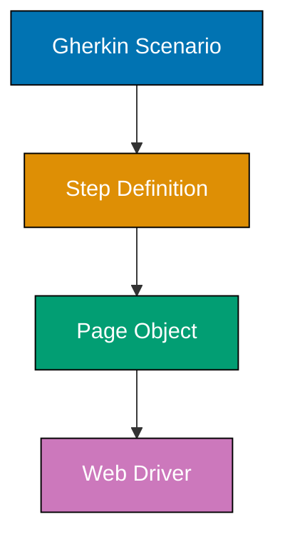
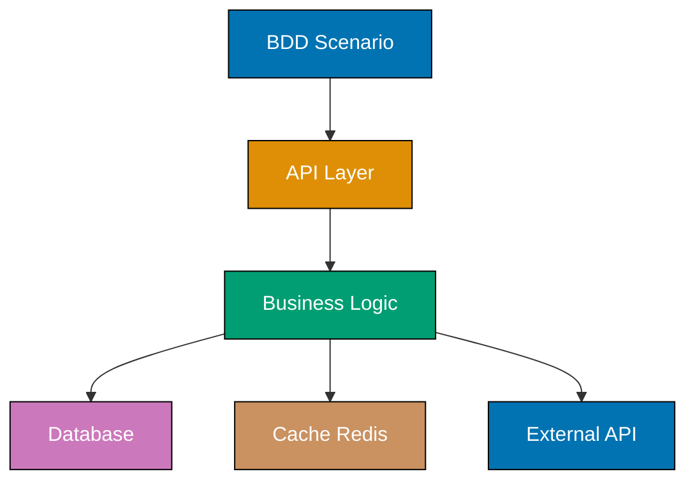

This intermediate section advances your BDD skills through 30 examples covering framework integration, API testing patterns, Page Object Model, database testing, and production deployment strategies. You'll learn cross-framework BDD patterns and production-ready testing techniques.

### Example 31: Page Object Model - Separating UI Logic from Tests

Page Object Model (POM) encapsulates page-specific UI logic in classes, separating locators and interactions from BDD scenarios for better maintainability.



**Page Object Class**:

```typescript
// File: pages/LoginPage.ts
export class LoginPage {
  // => Class: Encapsulates login page UI
  private usernameInput = 'input[name="username"]';
  // => Locator: CSS selector for username field
  private passwordInput = 'input[name="password"]';
  // => Locator: Password field selector
  private submitButton = 'button[type="submit"]';
  // => Locator: Submit button selector
  private errorMessage = ".error-message";
  // => Locator: Error display element

  constructor(private page: any) {
    // => Constructor: Receives Playwright/Selenium page object
    // => Dependency injection: Page driver from test framework
  }

  async enterUsername(username: string): Promise<void> {
    // => Method: Encapsulates username entry
    await this.page.fill(this.usernameInput, username);
    // => Action: Fill username field
    // => Hides: Implementation detail of how to enter text
  }

  async enterPassword(password: string): Promise<void> {
    // => Method: Encapsulates password entry
    await this.page.fill(this.passwordInput, password);
    // => Action: Fill password field
  }

  async clickSubmit(): Promise<void> {
    // => Method: Encapsulates button click
    await this.page.click(this.submitButton);
    // => Action: Click submit button
    // => Waits: Playwright auto-waits for element
  }

  async getErrorMessage(): Promise<string> {
    // => Method: Retrieves error text
    return await this.page.textContent(this.errorMessage);
    // => Return: Error message text
    // => Output: "Invalid credentials" or similar
  }

  async login(username: string, password: string): Promise<void> {
    // => Method: Combines multiple actions
    await this.enterUsername(username);
    // => Step 1: Enter username
    await this.enterPassword(password);
    // => Step 2: Enter password
    await this.clickSubmit();
    // => Step 3: Submit form
    // => Convenience: Single method for common workflow
  }
}
```

**Step Definition Using Page Object**:

```typescript
// File: step-definitions/login.steps.ts
import { Given, When, Then } from "@cucumber/cucumber";
import { expect } from "chai";
import { LoginPage } from "../pages/LoginPage";

When("I log in with username {string} and password {string}", async function (username: string, password: string) {
  // => When: Uses Page Object instead of direct driver calls
  const loginPage = new LoginPage(this.page);
  // => Create: Page Object instance with driver
  await loginPage.login(username, password);
  // => Action: High-level login method
  // => Benefits: No locators in step definition
  // => Maintainability: Locator changes only affect LoginPage
});

Then("I should see login error {string}", async function (expectedError: string) {
  // => Then: Verify error using Page Object
  const loginPage = new LoginPage(this.page);
  const actualError = await loginPage.getErrorMessage();
  // => Query: Get error via Page Object method
  expect(actualError).to.equal(expectedError);
  // => Assertion: Error matches expectation
});
```

**Gherkin Scenario**:

```gherkin
Scenario: Login with invalid password
  Given I am on the login page
  When I log in with username "alice@example.com" and password "wrongpass"
  Then I should see login error "Invalid credentials"
```

**Key Takeaway**: Page Object Model separates UI locators and interactions from step definitions, improving maintainability when UI changes - update locators in one Page Object class instead of scattered across many step definitions.

**Why It Matters**: Google's testing research shows that teams using POM reduce UI test maintenance time by 40-60% compared to direct driver calls in step definitions. When UI changes (e.g., CSS class rename), you modify one Page Object method instead of dozens of step definitions.

### Example 32: API Testing with REST Client

BDD scenarios can test REST APIs directly using HTTP clients, verifying API contracts without UI dependencies.

**Step Definitions with Axios**:

```typescript
// File: step-definitions/api.steps.ts
import { Given, When, Then } from "@cucumber/cucumber";
import { expect } from "chai";
import axios, { AxiosResponse } from "axios";

interface ApiWorld {
  baseUrl: string;
  response?: AxiosResponse;
  requestBody?: any;
}

Given("the API is available at {string}", function (this: ApiWorld, baseUrl: string) {
  // => Given: Set base URL for API calls
  this.baseUrl = baseUrl;
  // => World: Store base URL
  // => Example: "http://localhost:3000/api"
});

When("I send a GET request to {string}", async function (this: ApiWorld, endpoint: string) {
  // => When: HTTP GET request
  const url = `${this.baseUrl}${endpoint}`;
  // => URL: Combine base + endpoint
  // => Example: "http://localhost:3000/api/users"

  try {
    this.response = await axios.get(url);
    // => Request: Axios GET call
    // => Response: {status: 200, data: {...}, headers: {...}}
  } catch (error: any) {
    this.response = error.response;
    // => Error: Store error response for Then step
    // => Allows: Testing error scenarios (404, 500, etc.)
  }
});

When(
  "I send a POST request to {string} with:",
  async function (this: ApiWorld, endpoint: string, dataTable: DataTable) {
    // => When: HTTP POST with body
    const url = `${this.baseUrl}${endpoint}`;
    this.requestBody = dataTable.rowsHash();
    // => Body: Convert table to JSON object
    // => Example: {username: "alice", email: "alice@example.com"}

    try {
      this.response = await axios.post(url, this.requestBody);
      // => Request: POST with JSON body
      // => Response: {status: 201, data: {id: 1, ...}}
    } catch (error: any) {
      this.response = error.response;
      // => Error: Capture for error scenarios
    }
  },
);

Then("the response status should be {int}", function (this: ApiWorld, expectedStatus: number) {
  // => Then: Verify HTTP status code
  expect(this.response).to.exist;
  // => Assertion: Response received
  expect(this.response!.status).to.equal(expectedStatus);
  // => Assertion: Status matches
  // => Output: Test passes (e.g., 200, 201, 404)
});

Then(
  "the response should have {string} equal to {string}",
  function (this: ApiWorld, fieldPath: string, expectedValue: string) {
    // => Then: Verify response field
    const actualValue = this.response!.data[fieldPath];
    // => Extract: Field from response body
    // => Example: response.data.username
    expect(actualValue).to.equal(expectedValue);
    // => Assertion: Field value matches
  },
);

Then("the response should contain {int} items", function (this: ApiWorld, expectedCount: number) {
  // => Then: Verify array length
  expect(this.response!.data).to.be.an("array");
  // => Assertion: Response is array
  expect(this.response!.data).to.have.length(expectedCount);
  // => Assertion: Array size matches
  // => Output: Test passes (e.g., 5 users returned)
});
```

**Gherkin Scenarios**:

```gherkin
Feature: User API

  Scenario: Get all users
    Given the API is available at "http://localhost:3000/api"
    When I send a GET request to "/users"
    Then the response status should be 200
    And the response should contain 3 items

  Scenario: Create new user
    Given the API is available at "http://localhost:3000/api"
    When I send a POST request to "/users" with:
      | username | alice            |
      | email    | alice@example.com|
    Then the response status should be 201
    And the response should have "username" equal to "alice"

  Scenario: Get non-existent user
    Given the API is available at "http://localhost:3000/api"
    When I send a GET request to "/users/999"
    Then the response status should be 404
```

**Key Takeaway**: BDD scenarios test REST APIs by sending HTTP requests and verifying responses, enabling API contract testing without UI dependencies or browser overhead.

**Why It Matters**: API-level BDD tests run 10-50x faster than UI tests and provide more precise failure diagnostics. Martin Fowler's Test Pyramid recommends 70% API tests vs 10% UI tests for optimal speed and reliability. API BDD scenarios verify business logic without UI flakiness.

### Example 33: Database Testing - Verifying Data State

BDD scenarios can verify database state directly to ensure data integrity and business rule enforcement at the persistence layer.

**Step Definitions with Database Client**:

```typescript
// File: step-definitions/database.steps.ts
import { Given, When, Then } from "@cucumber/cucumber";
import { expect } from "chai";
import { Pool } from "pg"; // PostgreSQL client

interface DbWorld {
  dbPool: Pool;
  queryResult?: any[];
}

Given("the database is empty", async function (this: DbWorld) {
  // => Given: Clear database for clean state
  this.dbPool = new Pool({
    host: "localhost",
    database: "test_db",
    user: "test_user",
    password: "test_pass",
  });
  // => Connection: Test database pool

  await this.dbPool.query("DELETE FROM users");
  // => Cleanup: Remove all users
  await this.dbPool.query("DELETE FROM orders");
  // => Cleanup: Remove all orders
  // => Output: Empty tables for scenario
});

Given("the following users exist in the database:", async function (this: DbWorld, dataTable: DataTable) {
  // => Given: Seed database with test data
  const users = dataTable.hashes();
  // => Parse: Table to array of user objects

  for (const user of users) {
    await this.dbPool.query("INSERT INTO users (username, email, role) VALUES ($1, $2, $3)", [
      user.username,
      user.email,
      user.role,
    ]);
    // => Insert: Add user to database
    // => Parameterized: Prevents SQL injection
  }
  // => Output: Users inserted (e.g., 3 rows)
});

When("a user {string} is created with email {string}", async function (this: DbWorld, username: string, email: string) {
  // => When: Trigger user creation
  await this.dbPool.query("INSERT INTO users (username, email, role) VALUES ($1, $2, $3)", [username, email, "user"]);
  // => Insert: Create new user
  // => Default: Role set to 'user'
});

Then("the database should contain {int} users", async function (this: DbWorld, expectedCount: number) {
  // => Then: Verify user count
  const result = await this.dbPool.query("SELECT COUNT(*) FROM users");
  // => Query: Count rows in users table
  const actualCount = parseInt(result.rows[0].count);
  // => Extract: Count from query result
  expect(actualCount).to.equal(expectedCount);
  // => Assertion: Count matches
  // => Output: Test passes (e.g., 4 users)
});

Then(
  "user {string} should exist with email {string}",
  async function (this: DbWorld, username: string, expectedEmail: string) {
    // => Then: Verify specific user data
    const result = await this.dbPool.query("SELECT email FROM users WHERE username = $1", [username]);
    // => Query: Find user by username

    expect(result.rows).to.have.length(1);
    // => Assertion: User exists (1 row)
    expect(result.rows[0].email).to.equal(expectedEmail);
    // => Assertion: Email matches
    // => Output: Test passes (email correct)
  },
);

Then("user {string} should have role {string}", async function (this: DbWorld, username: string, expectedRole: string) {
  // => Then: Verify user role
  const result = await this.dbPool.query("SELECT role FROM users WHERE username = $1", [username]);
  // => Query: Get user role

  expect(result.rows[0].role).to.equal(expectedRole);
  // => Assertion: Role matches
});
```

**Gherkin Scenarios**:

```gherkin
@database
Feature: User Database Operations

  Background:
    Given the database is empty

  Scenario: Create user in database
    When a user "alice" is created with email "alice@example.com"
    Then the database should contain 1 users
    And user "alice" should exist with email "alice@example.com"

  Scenario: Seed multiple users
    Given the following users exist in the database:
      | username | email              | role  |
      | alice    | alice@example.com  | admin |
      | bob      | bob@example.com    | user  |
      | charlie  | charlie@example.com| user  |
    Then the database should contain 3 users
    And user "alice" should have role "admin"
    And user "bob" should have role "user"
```

**Key Takeaway**: Database-level BDD tests verify data integrity and business rule enforcement by directly querying and asserting on database state, complementing API and UI tests.

**Why It Matters**: Database tests catch data corruption, constraint violations, and migration issues that UI/API tests miss. Netflix uses database BDD scenarios to verify data consistency across microservices, catching 30% more bugs than API-only tests by validating actual persisted state vs in-memory representations.

### Example 34: Cucumber-JVM (Java) - Cross-Platform BDD

BDD principles apply across languages. This example shows Cucumber-JVM with Java for teams in JVM ecosystems.

**Feature File (Language-Agnostic)**:

```gherkin
# File: src/test/resources/features/calculator.feature
Feature: Calculator Operations

  Scenario: Add two numbers
    Given I have a calculator
    When I add 15 and 27
    Then the result should be 42
```

**Step Definitions (Java)**:

```java
// File: src/test/java/steps/CalculatorSteps.java
package steps;

import io.cucumber.java.en.Given;
import io.cucumber.java.en.When;
import io.cucumber.java.en.Then;
import static org.junit.Assert.assertEquals;

public class CalculatorSteps {
    // => Class: Step definitions for calculator
    private Calculator calculator;
    // => State: Calculator instance
    private int result;
    // => State: Calculation result

    @Given("I have a calculator")
    public void i_have_a_calculator() {
        // => Given: Initialize calculator
        calculator = new Calculator();
        // => Instance: New calculator for scenario
    }

    @When("I add {int} and {int}")
    public void i_add_and(int a, int b) {
        // => When: {int} extracts integers from step
        // => Example: "I add 15 and 27" → a=15, b=27
        result = calculator.add(a, b);
        // => Action: Call add method
        // => result: 42 (when a=15, b=27)
    }

    @Then("the result should be {int}")
    public void the_result_should_be(int expected) {
        // => Then: Verify result
        assertEquals(expected, result);
        // => Assertion: JUnit assertEquals
        // => Output: Test passes (result == 42)
    }
}
```

**Calculator Implementation**:

```java
// File: src/main/java/Calculator.java
public class Calculator {
    // => Class: Calculator implementation

    public int add(int a, int b) {
        // => Method: Addition operation
        return a + b;
        // => Return: Sum of inputs
        // => Output: 42 (when a=15, b=27)
    }
}
```

**JUnit Runner**:

```java
// File: src/test/java/RunCucumberTest.java
import org.junit.runner.RunWith;
import io.cucumber.junit.Cucumber;
import io.cucumber.junit.CucumberOptions;

@RunWith(Cucumber.class)
// => Annotation: Use Cucumber JUnit runner
@CucumberOptions(
    features = "src/test/resources/features",
    // => Config: Feature file location
    glue = "steps",
    // => Config: Step definition package
    plugin = {"pretty", "html:target/cucumber-reports"}
    // => Config: Report formats
)
public class RunCucumberTest {
    // => Runner: Executes Cucumber tests via JUnit
    // => Output: Runs all .feature files
}
```

**Key Takeaway**: Cucumber-JVM brings BDD to Java with same Gherkin syntax but Java step definitions using annotations (@Given, @When, @Then) and JUnit assertions.

**Why It Matters**: BDD isn't language-specific - Cucumber supports Java, Ruby, JavaScript, Python, C#, and more. Teams can use BDD across polyglot microservices while maintaining consistent Gherkin specifications. The feature file is the universal contract.

### Example 35: SpecFlow (C#) - BDD in .NET Ecosystem

SpecFlow brings BDD to C# and .NET, using NUnit or MSTest for assertions and Visual Studio integration.

**Feature File**:

```gherkin
# File: Features/UserRegistration.feature
Feature: User Registration

  Scenario: Register new user with valid data
    Given the registration form is open
    When I register with username "alice" and email "alice@example.com"
    Then the user should be created successfully
    And I should see confirmation message "Registration successful"
```

**Step Definitions (C# with SpecFlow)**:

```csharp
// File: StepDefinitions/UserRegistrationSteps.cs
using TechTalk.SpecFlow;
using NUnit.Framework;

[Binding]
// => Attribute: Marks class as step definition container
public class UserRegistrationSteps
{
    // => Class: Step definitions for registration
    private RegistrationService _registrationService;
    // => Field: Service under test
    private RegistrationResult _result;
    // => Field: Operation result

    [Given(@"the registration form is open")]
    public void GivenTheRegistrationFormIsOpen()
    {
        // => Given: Initialize registration service
        _registrationService = new RegistrationService();
        // => Instance: New service for scenario
    }

    [When(@"I register with username ""(.*)"" and email ""(.*)""")]
    public void WhenIRegisterWithUsernameAndEmail(string username, string email)
    {
        // => When: Regex captures parameters
        // => Regex: ""(.*)"" extracts quoted strings
        // => Example: username="alice", email="alice@example.com"
        _result = _registrationService.Register(username, email);
        // => Action: Call registration method
        // => _result: {Success: true, Message: "Registration successful"}
    }

    [Then(@"the user should be created successfully")]
    public void ThenTheUserShouldBeCreatedSuccessfully()
    {
        // => Then: Verify success
        Assert.IsTrue(_result.Success);
        // => Assertion: NUnit assertion
        // => Output: Test passes (_result.Success == true)
    }

    [Then(@"I should see confirmation message ""(.*)""")]
    public void ThenIShouldSeeConfirmationMessage(string expectedMessage)
    {
        // => Then: Verify message
        Assert.AreEqual(expectedMessage, _result.Message);
        // => Assertion: Message matches
        // => Output: Test passes (message == "Registration successful")
    }
}
```

**Domain Model**:

```csharp
// File: Models/RegistrationService.cs
public class RegistrationService
{
    // => Class: Registration business logic

    public RegistrationResult Register(string username, string email)
    {
        // => Method: User registration
        // Basic validation
        if (string.IsNullOrEmpty(username) || string.IsNullOrEmpty(email))
        {
            // => Validation: Check required fields
            return new RegistrationResult
            {
                Success = false,
                Message = "Username and email are required"
            };
            // => Error: Return failure result
        }

        // Success case
        return new RegistrationResult
        {
            Success = true,
            Message = "Registration successful"
        };
        // => Success: Return success result
        // => Output: {Success: true, Message: "Registration successful"}
    }
}

public class RegistrationResult
{
    // => Class: Result object
    public bool Success { get; set; }
    // => Property: Operation success flag
    public string Message { get; set; }
    // => Property: User-facing message
}
```

**Key Takeaway**: SpecFlow enables BDD in C#/.NET using same Gherkin syntax with C# step definitions, NUnit/MSTest assertions, and Visual Studio integration for .NET teams.

**Why It Matters**: SpecFlow brings BDD benefits to .NET ecosystem with enterprise tooling integration (Visual Studio, Azure DevOps, Rider). Microsoft teams use SpecFlow for living documentation that executives can review while developers maintain automated tests behind the scenes.

### Example 36: Behave (Python) - Pythonic BDD

Behave brings BDD to Python with Gherkin feature files and Python step definitions using pytest or unittest assertions.

**Feature File**:

```gherkin
# File: features/string_operations.feature
Feature: String Operations

  Scenario: Reverse a string
    Given I have the string "hello"
    When I reverse the string
    Then the result should be "olleh"
```

**Step Definitions (Python with Behave)**:

```python
# File: features/steps/string_steps.py
from behave import given, when, then
# => Import: Behave decorators for steps

@given('I have the string "{text}"')
def step_given_string(context, text):
    # => Given: Store string in context
    # => context: Behave's World equivalent
    # => text: Captured from {string} parameter
    # => Example: text="hello"
    context.input_string = text
    # => Storage: Save for When step
    # => context.input_string: "hello"

@when('I reverse the string')
def step_when_reverse(context):
    # => When: Reverse operation
    context.result = context.input_string[::-1]
    # => Action: Python slice reversal
    # => [::-1]: Reverse string
    # => context.result: "olleh"

@then('the result should be "{expected}"')
def step_then_result(context, expected):
    # => Then: Verify result
    # => expected: Captured parameter "olleh"
    assert context.result == expected
    # => Assertion: Python assert statement
    # => Output: Test passes (result == "olleh")
```

**Advanced Example with Data Tables**:

```gherkin
Feature: User Management

  Scenario: Create multiple users
    Given the following users:
      | username | email              | age |
      | alice    | alice@example.com  | 25  |
      | bob      | bob@example.com    | 30  |
    When the users are saved
    Then the database should contain 2 users
```

**Step Definitions with Table Handling**:

```python
# File: features/steps/user_steps.py
from behave import given, when, then

@given('the following users')
def step_given_users(context):
    # => Given: Receives table from context
    context.users = []
    # => Initialize: Empty user list

    for row in context.table:
        # => Iteration: context.table contains rows
        # => row: Dict with columns as keys
        # => Example: {'username': 'alice', 'email': 'alice@example.com', 'age': '25'}
        user = {
            'username': row['username'],
            'email': row['email'],
            'age': int(row['age'])
            # => Convert: Age string to integer
        }
        context.users.append(user)
        # => Storage: Add to user list
    # => context.users: [{'username': 'alice', ...}, {'username': 'bob', ...}]

@when('the users are saved')
def step_when_save(context):
    # => When: Simulate save operation
    context.saved_count = len(context.users)
    # => Storage: Count for Then step
    # => context.saved_count: 2

@then('the database should contain {count:d} users')
def step_then_count(context, count):
    # => Then: {count:d} captures integer
    # => count: Integer parameter (2)
    assert context.saved_count == count
    # => Assertion: Count matches
    # => Output: Test passes (saved_count == 2)
```

**Key Takeaway**: Behave brings BDD to Python with Gherkin features and Python step definitions using context object for state sharing and Python assertions for verification.

**Why It Matters**: Python teams gain BDD benefits without leaving the Python ecosystem. Data science teams use Behave to verify ML model behaviors, while Django teams test web applications. The lightweight syntax fits Python's philosophy while maintaining Gherkin's readability for stakeholders.

### Example 37: Parameterized Scenarios with Complex Data

Scenario Outline handles complex parameterization including multiple tables, nested data, and combinatorial testing.

**Multiple Examples Tables**:

```gherkin
Feature: Authentication Validation

  Scenario Outline: Login validation rules
    Given a user with username "<username>" and password "<password>"
    When the user attempts to log in
    Then the login should "<outcome>"
    And the error message should be "<errorMessage>"

    # Happy path cases
    Examples: Valid Credentials
      | username           | password   | outcome | errorMessage |
      | alice@example.com  | Secret123! | succeed |              |
      | bob@example.com    | Pass456$   | succeed |              |

    # Validation failures
    Examples: Invalid Format
      | username    | password   | outcome | errorMessage           |
      | invalid     | Secret123! | fail    | Invalid email format   |
      | alice@      | Pass456$   | fail    | Invalid email format   |
      | @example    | Secret123! | fail    | Invalid email format   |

    # Security failures
    Examples: Weak Passwords
      | username           | password | outcome | errorMessage               |
      | alice@example.com  | 123      | fail    | Password too short         |
      | bob@example.com    | password | fail    | Password too weak          |
      | charlie@example.com| abc      | fail    | Password too short         |
```

**Step Definitions Handling Multiple Cases**:

```typescript
// File: step-definitions/auth-validation.steps.ts
import { Given, When, Then } from "@cucumber/cucumber";
import { expect } from "chai";

interface AuthResult {
  success: boolean;
  error?: string;
}

let authResult: AuthResult;

Given("a user with username {string} and password {string}", function (username: string, password: string) {
  // => Given: Store credentials
  this.username = username;
  // => World: Store username
  this.password = password;
  // => World: Store password
});

When("the user attempts to log in", function () {
  // => When: Validate and attempt login
  authResult = validateAndLogin(this.username, this.password);
  // => Function: Business logic validation
  // => authResult: {success: true} or {success: false, error: "..."}
});

Then("the login should {string}", function (expectedOutcome: string) {
  // => Then: Verify success/fail outcome
  const shouldSucceed = expectedOutcome === "succeed";
  // => Parse: "succeed" → true, "fail" → false
  expect(authResult.success).to.equal(shouldSucceed);
  // => Assertion: Outcome matches
});

Then("the error message should be {string}", function (expectedError: string) {
  // => Then: Verify error message (or absence)
  if (expectedError === "") {
    // => Case: Success (no error expected)
    expect(authResult.error).to.be.undefined;
    // => Assertion: No error present
  } else {
    // => Case: Failure (error expected)
    expect(authResult.error).to.equal(expectedError);
    // => Assertion: Error matches
  }
});

// Validation logic
function validateAndLogin(username: string, password: string): AuthResult {
  // => Function: Authentication validation

  // Email format validation
  const emailRegex = /^[^\s@]+@[^\s@]+\.[^\s@]+$/;
  // => Regex: Basic email validation
  if (!emailRegex.test(username)) {
    return { success: false, error: "Invalid email format" };
    // => Error: Email validation failed
  }

  // Password length validation
  if (password.length < 8) {
    return { success: false, error: "Password too short" };
    // => Error: Minimum length not met
  }

  // Password strength validation
  const hasNumber = /\d/.test(password);
  const hasSpecial = /[!@#$%^&*]/.test(password);
  // => Regex: Check for digits and special chars
  if (!hasNumber || !hasSpecial) {
    return { success: false, error: "Password too weak" };
    // => Error: Complexity requirements not met
  }

  return { success: true };
  // => Success: All validations passed
}
```

**Key Takeaway**: Multiple Examples tables in Scenario Outline organize test cases by category (valid/invalid/edge cases) while sharing step definitions, improving readability and maintainability.

**Why It Matters**: Categorized Examples tables make large parameterized test suites scannable. Security teams at financial institutions use this pattern to separate happy paths from attack vectors, making threat model coverage visible to auditors while keeping 200+ test cases maintainable.

### Example 38: Custom Matchers for Domain-Specific Assertions

Custom matchers extend assertion libraries with domain-specific validation logic, making Then steps more expressive.

**Custom Chai Matchers**:

```typescript
// File: support/custom-matchers.ts
import { expect } from "chai";

// Extend Chai with custom matchers
declare global {
  namespace Chai {
    interface Assertion {
      validEmail(): Assertion;
      strongPassword(): Assertion;
      withinDateRange(start: Date, end: Date): Assertion;
    }
  }
}

export function setupCustomMatchers() {
  // => Setup: Register custom matchers

  // Email validation matcher
  expect.Assertion.addMethod("validEmail", function () {
    // => Matcher: Email validation
    const email = this._obj as string;
    // => Input: Value being asserted
    const emailRegex = /^[^\s@]+@[^\s@]+\.[^\s@]+$/;
    // => Regex: Email pattern

    this.assert(
      emailRegex.test(email),
      // => Condition: Email matches pattern
      `expected #{this} to be a valid email`,
      // => Error: Assertion failed message
      `expected #{this} to not be a valid email`,
      // => Error: Negated assertion failed
    );
  });

  // Password strength matcher
  expect.Assertion.addMethod("strongPassword", function () {
    // => Matcher: Password validation
    const password = this._obj as string;
    const hasLength = password.length >= 8;
    // => Check: Minimum length
    const hasNumber = /\d/.test(password);
    // => Check: Contains digit
    const hasUpper = /[A-Z]/.test(password);
    // => Check: Contains uppercase
    const hasLower = /[a-z]/.test(password);
    // => Check: Contains lowercase
    const hasSpecial = /[!@#$%^&*]/.test(password);
    // => Check: Contains special char

    const isStrong = hasLength && hasNumber && hasUpper && hasLower && hasSpecial;
    // => Result: All criteria met

    this.assert(
      isStrong,
      `expected #{this} to be a strong password (8+ chars, upper, lower, number, special)`,
      `expected #{this} to not be a strong password`,
    );
  });

  // Date range matcher
  expect.Assertion.addMethod("withinDateRange", function (start: Date, end: Date) {
    // => Matcher: Date range validation
    const date = this._obj as Date;
    const within = date >= start && date <= end;
    // => Check: Date within range

    this.assert(
      within,
      `expected #{this} to be within ${start} and ${end}`,
      `expected #{this} to not be within ${start} and ${end}`,
    );
  });
}
```

**Using Custom Matchers in Steps**:

```typescript
// File: step-definitions/validation.steps.ts
import { Then } from "@cucumber/cucumber";
import { expect } from "chai";
import { setupCustomMatchers } from "../support/custom-matchers";

// Setup once
setupCustomMatchers();

Then("the email {string} should be valid", function (email: string) {
  // => Then: Use custom matcher
  expect(email).to.be.validEmail();
  // => Assertion: Custom validEmail matcher
  // => Readable: Domain-specific assertion
  // => Output: Test passes (email format valid)
});

Then("the password {string} should be strong", function (password: string) {
  // => Then: Custom password matcher
  expect(password).to.be.strongPassword();
  // => Assertion: Validates password complexity
  // => Output: Test passes (password meets criteria)
});

Then("the registration date should be within last 30 days", function () {
  // => Then: Date range validation
  const now = new Date();
  const thirtyDaysAgo = new Date(now.getTime() - 30 * 24 * 60 * 60 * 1000);
  // => Calculate: 30 days ago

  expect(this.user.registrationDate).to.be.withinDateRange(thirtyDaysAgo, now);
  // => Assertion: Custom date range matcher
  // => Output: Test passes (date within range)
});
```

**Gherkin Usage**:

```gherkin
Scenario: Validate user registration data
  Given a user registered with email "alice@example.com" and password "Secure123!"
  Then the email "alice@example.com" should be valid
  And the password "Secure123!" should be strong
  And the registration date should be within last 30 days
```

**Key Takeaway**: Custom matchers encapsulate domain-specific validation logic in reusable assertions, making Then steps more readable and maintainable than inline validation code.

**Why It Matters**: Custom matchers reduce code duplication and improve test expressiveness. Instead of repeating email regex validation in 50 step definitions, one custom matcher centralizes the logic. When validation rules change, update one matcher instead of dozens of steps.

### Example 39: Test Doubles - Mocks and Stubs in BDD

BDD scenarios use test doubles (mocks, stubs) to isolate system under test from external dependencies like databases, APIs, or third-party services.

**Mocking External API Dependency**:

```typescript
// File: step-definitions/payment.steps.ts
import { Given, When, Then } from "@cucumber/cucumber";
import { expect } from "chai";
import sinon from "sinon";
import { PaymentService } from "../services/PaymentService";
import { StripeClient } from "../external/StripeClient";

interface PaymentWorld {
  paymentService: PaymentService;
  stripeStub: sinon.SinonStubbedInstance<StripeClient>;
  paymentResult?: any;
}

Given("the payment gateway is available", function (this: PaymentWorld) {
  // => Given: Setup mock payment gateway
  this.stripeStub = sinon.createStubInstance(StripeClient);
  // => Stub: Create fake Stripe client
  // => Benefits: No real Stripe API calls
  // => Fast: No network I/O

  this.paymentService = new PaymentService(this.stripeStub);
  // => Injection: Inject stub into service
  // => Service: Uses stub instead of real Stripe
});

Given("the payment gateway returns success for valid cards", function (this: PaymentWorld) {
  // => Given: Configure stub behavior
  this.stripeStub.charge.resolves({
    id: "ch_test_123",
    status: "succeeded",
    amount: 5000,
  });
  // => Stub: Return success response
  // => resolves: Simulates successful async call
  // => Output: Controlled test data
});

Given("the payment gateway returns error for declined cards", function (this: PaymentWorld) {
  // => Given: Configure error behavior
  this.stripeStub.charge.rejects(new Error("Card declined"));
  // => Stub: Simulate payment failure
  // => rejects: Simulates async error
});

When(
  "I process a payment of ${int} with card {string}",
  async function (this: PaymentWorld, amount: number, cardNumber: string) {
    // => When: Trigger payment
    try {
      this.paymentResult = await this.paymentService.processPayment(amount, cardNumber);
      // => Call: Service method (uses stub internally)
      // => Result: Success or error based on stub config
    } catch (error) {
      this.paymentResult = { error: (error as Error).message };
      // => Error: Capture for Then step
    }
  },
);

Then("the payment should succeed", function (this: PaymentWorld) {
  // => Then: Verify success
  expect(this.paymentResult.status).to.equal("succeeded");
  // => Assertion: Payment processed
  // => Output: Test passes (stub returned success)
});

Then("the payment should fail with {string}", function (this: PaymentWorld, expectedError: string) {
  // => Then: Verify error
  expect(this.paymentResult.error).to.include(expectedError);
  // => Assertion: Error message matches
  // => Output: Test passes (stub returned error)
});

Then(
  "the payment gateway should have been called with amount ${int}",
  function (this: PaymentWorld, expectedAmount: number) {
    // => Then: Verify mock interaction
    expect(this.stripeStub.charge.calledOnce).to.be.true;
    // => Spy: Verify method called once
    const callArgs = this.stripeStub.charge.getCall(0).args;
    // => Spy: Get call arguments
    expect(callArgs[0].amount).to.equal(expectedAmount);
    // => Assertion: Called with correct amount
    // => Output: Test passes (interaction verified)
  },
);
```

**Gherkin Scenarios**:

```gherkin
Feature: Payment Processing

  Scenario: Successful payment with valid card
    Given the payment gateway is available
    And the payment gateway returns success for valid cards
    When I process a payment of $50 with card "4111111111111111"
    Then the payment should succeed
    And the payment gateway should have been called with amount $50

  Scenario: Failed payment with declined card
    Given the payment gateway is available
    And the payment gateway returns error for declined cards
    When I process a payment of $50 with card "4000000000000002"
    Then the payment should fail with "Card declined"
```

**Key Takeaway**: Test doubles (stubs, mocks) isolate scenarios from external dependencies, enabling fast, reliable tests without network calls or third-party service dependencies.

**Why It Matters**: Mocks enable testing error scenarios (API timeouts, payment failures) that are hard to trigger with real services. Google's testing pyramid emphasizes unit/integration tests with mocks over end-to-end tests for 90% of coverage, reserving real service calls for critical smoke tests.

### Example 40: BDD in CI/CD Pipeline Configuration

BDD scenarios integrate into CI/CD pipelines for automated quality gates on every commit.

**GitHub Actions Workflow**:

```yaml
# File: .github/workflows/bdd-tests.yml
name: BDD Tests

on:
  push:
    branches: [main, develop]
    # => Trigger: Run on push to main/develop
  pull_request:
    branches: [main]
    # => Trigger: Run on pull requests to main

jobs:
  bdd-smoke:
    # => Job: Fast smoke tests
    runs-on: ubuntu-latest
    # => Runner: Latest Ubuntu

    steps:
      - uses: actions/checkout@v3
        # => Step: Clone repository

      - uses: actions/setup-node@v3
        with:
          node-version: "18"
          # => Step: Install Node.js 18

      - name: Install dependencies
        run: npm ci
        # => Step: Install packages (faster than npm install)

      - name: Run smoke tests
        run: npx cucumber-js --tags "@smoke" --format json:reports/smoke.json
        # => Step: Run @smoke scenarios only
        # => Output: JSON report
        # => Duration: ~2 minutes

      - name: Upload smoke results
        uses: actions/upload-artifact@v3
        if: always()
        # => Step: Upload results even on failure
        with:
          name: smoke-test-results
          path: reports/smoke.json
          # => Artifact: Test results for analysis

  bdd-regression:
    # => Job: Full regression suite
    runs-on: ubuntu-latest
    needs: bdd-smoke
    # => Dependency: Run only if smoke tests pass

    services:
      postgres:
        # => Service: Test database
        image: postgres:15
        env:
          POSTGRES_PASSWORD: test_pass
          POSTGRES_DB: test_db
        options: >-
          --health-cmd pg_isready
          --health-interval 10s
          --health-timeout 5s
          --health-retries 5
        # => Health check: Wait for DB ready

    steps:
      - uses: actions/checkout@v3

      - uses: actions/setup-node@v3
        with:
          node-version: "18"

      - name: Install dependencies
        run: npm ci

      - name: Run database migrations
        run: npm run db:migrate
        # => Step: Setup test database schema

      - name: Run regression tests
        run: npx cucumber-js --tags "not @smoke and not @slow" --parallel 4
        # => Step: Run non-smoke, non-slow tests
        # => Parallel: 4 workers for speed
        # => Duration: ~10 minutes

      - name: Generate HTML report
        if: always()
        run: npx cucumber-html-reporter --input reports/*.json --output reports/index.html
        # => Step: Generate human-readable report

      - name: Upload regression results
        uses: actions/upload-artifact@v3
        if: always()
        with:
          name: regression-test-results
          path: reports/
          # => Artifact: All test reports

  bdd-e2e:
    # => Job: End-to-end tests
    runs-on: ubuntu-latest
    needs: bdd-regression
    # => Dependency: Run only if regression passes
    if: github.ref == 'refs/heads/main'
    # => Condition: Only on main branch

    steps:
      - uses: actions/checkout@v3

      - uses: actions/setup-node@v3
        with:
          node-version: "18"

      - name: Install dependencies
        run: npm ci

      - name: Run E2E tests
        run: npx cucumber-js --tags "@e2e" --retry 2
        # => Step: Run end-to-end scenarios
        # => Retry: Handle flaky browser tests
        # => Duration: ~30 minutes

      - name: Upload E2E results
        uses: actions/upload-artifact@v3
        if: always()
        with:
          name: e2e-test-results
          path: reports/
```

**Cucumber Configuration for CI**:

```javascript
// File: cucumber.js
const common = {
  requireModule: ["ts-node/register"],
  // => Config: TypeScript support
  require: ["step-definitions/**/*.ts"],
  // => Config: Step definition paths
  format: [
    "progress-bar",
    // => Format: Progress bar for CI logs
    "json:reports/cucumber-report.json",
    // => Format: JSON for programmatic analysis
    "html:reports/cucumber-report.html",
    // => Format: HTML for human review
  ],
  formatOptions: {
    snippetInterface: "async-await",
    // => Config: Generate async step snippets
  },
};

module.exports = {
  default: common,

  ci: {
    ...common,
    // => Config: CI-specific settings
    parallel: 4,
    // => Parallel: 4 workers
    retry: 1,
    // => Retry: Retry failed scenarios once
    failFast: true,
    // => Fail fast: Stop on first failure
    strict: true,
    // => Strict: Treat warnings as errors
  },

  smoke: {
    ...common,
    // => Config: Smoke test profile
    tags: "@smoke",
    // => Filter: Only smoke scenarios
    parallel: 2,
    // => Parallel: Fewer workers for speed
  },
};
```

**Key Takeaway**: BDD scenarios integrate into CI/CD pipelines with tiered test execution (smoke → regression → E2E) providing fast feedback on critical paths while comprehensive coverage runs on slower cadence.

**Why It Matters**: Tiered testing balances speed and coverage. Smoke tests (2 min) fail fast on broken builds, regression tests (10 min) catch most bugs, E2E tests (30 min) validate critical flows. This staged approach enables 15+ daily deployments while maintaining quality gates.

### Example 41: Parallel Test Execution for Speed

Parallel execution runs scenarios concurrently across multiple workers, dramatically reducing total test execution time.

**Cucumber Parallel Configuration**:

```javascript
// File: cucumber.parallel.js
module.exports = {
  default: {
    parallel: 4,
    // => Workers: Run 4 scenarios simultaneously
    // => Speed: ~4x faster for CPU-bound tests
    // => Optimal: Number of CPU cores

    publishQuiet: true,
    // => Config: Reduce log noise in parallel mode

    retry: 1,
    // => Retry: Handle transient failures

    retryTagFilter: "@flaky",
    // => Filter: Only retry @flaky scenarios
  },
};
```

**Worker Isolation Strategy**:

```typescript
// File: support/hooks.ts
import { Before, After } from "@cucumber/cucumber";
import { Pool } from "pg";

Before(async function () {
  // => Before: Each worker gets isolated DB
  const workerId = process.env.CUCUMBER_WORKER_ID || "0";
  // => Worker ID: Cucumber assigns unique ID per worker
  // => Range: '0', '1', '2', '3' for 4 workers

  this.dbPool = new Pool({
    host: "localhost",
    database: `test_db_${workerId}`,
    // => Database: Separate DB per worker
    // => Isolation: Workers don't interfere
    // => Example: test_db_0, test_db_1, test_db_2, test_db_3
    user: "test_user",
    password: "test_pass",
  });

  // Clean database for scenario
  await this.dbPool.query("DELETE FROM users");
  await this.dbPool.query("DELETE FROM orders");
  // => Cleanup: Fresh state per scenario
});

After(async function () {
  // => After: Close DB connection
  await this.dbPool.end();
  // => Cleanup: Release resources
});
```

**Port Allocation for Parallel Services**:

```typescript
// File: support/server-manager.ts
import express from "express";

export async function startTestServer(): Promise<number> {
  // => Function: Start server on unique port
  const workerId = parseInt(process.env.CUCUMBER_WORKER_ID || "0");
  const basePort = 3000;
  const port = basePort + workerId;
  // => Port: 3000 + worker ID
  // => Range: 3000, 3001, 3002, 3003 for 4 workers
  // => Isolation: No port conflicts

  const app = express();
  app.use(express.json());

  app.get("/health", (req, res) => {
    res.json({ status: "ok", worker: workerId });
    // => Endpoint: Health check with worker ID
  });

  await new Promise<void>((resolve) => {
    app.listen(port, () => {
      console.log(`Worker ${workerId} server on port ${port}`);
      // => Log: Server started
      resolve();
    });
  });

  return port;
  // => Return: Port number for step definitions
}
```

**Using Worker-Specific Resources**:

```typescript
// File: step-definitions/api-parallel.steps.ts
import { Before, Given, When } from "@cucumber/cucumber";
import { startTestServer } from "../support/server-manager";

Before(async function () {
  // => Before: Start worker-specific server
  this.serverPort = await startTestServer();
  // => Port: Unique port for this worker
  // => this.serverPort: 3000, 3001, 3002, or 3003
});

Given("the API server is running", async function () {
  // => Given: Verify server health
  const response = await fetch(`http://localhost:${this.serverPort}/health`);
  // => Request: Use worker-specific port
  const data = await response.json();
  // => Response: {status: "ok", worker: 0}
  expect(data.status).to.equal("ok");
  // => Assertion: Server ready
});

When("I send a GET request to {string}", async function (endpoint: string) {
  // => When: API call to worker-specific port
  const url = `http://localhost:${this.serverPort}${endpoint}`;
  // => URL: Worker-isolated endpoint
  this.response = await fetch(url);
  // => Request: No interference from other workers
});
```

**Parallel Execution Report**:

```bash
# Sequential execution (no parallelization)
$ npx cucumber-js
# 100 scenarios (100 passed)
# Duration: 200 seconds (3m 20s)

# Parallel execution (4 workers)
$ npx cucumber-js --parallel 4
# 100 scenarios (100 passed)
# Duration: 55 seconds (~4x faster)
# Worker 0: 25 scenarios
# Worker 1: 25 scenarios
# Worker 2: 25 scenarios
# Worker 3: 25 scenarios
```

**Key Takeaway**: Parallel test execution requires worker isolation (separate databases, ports, file paths) but delivers 3-4x speed improvements for I/O-bound test suites.

**Why It Matters**: Parallel execution transforms 30-minute test suites into 8-minute suites, enabling developers to run full regression locally instead of waiting for CI. However, parallel tests require investment in worker isolation infrastructure and debugging parallel failures is harder than sequential failures.

### Example 42: Test Data Management with Fixtures

Test fixtures provide consistent, reusable test data across scenarios while avoiding data pollution and setup duplication.

**Fixture Definition**:

```typescript
// File: fixtures/user-fixtures.ts
export interface UserFixture {
  username: string;
  email: string;
  password: string;
  role: "admin" | "user" | "guest";
}

export const UserFixtures: Record<string, UserFixture> = {
  // => Fixtures: Predefined test users

  admin: {
    // => Fixture: Admin user
    username: "admin-user",
    email: "admin@example.com",
    password: "Admin123!",
    role: "admin",
    // => Use case: Testing admin-only features
  },

  regularUser: {
    // => Fixture: Standard user
    username: "john-doe",
    email: "john@example.com",
    password: "User456$",
    role: "user",
    // => Use case: Testing user features
  },

  guest: {
    // => Fixture: Guest user
    username: "guest-user",
    email: "guest@example.com",
    password: "Guest789#",
    role: "guest",
    // => Use case: Testing limited access
  },

  invalidEmail: {
    // => Fixture: Invalid data for error testing
    username: "invalid-user",
    email: "not-an-email",
    password: "Test123!",
    role: "user",
    // => Use case: Testing validation errors
  },
};

export interface OrderFixture {
  orderId: string;
  customerId: string;
  items: Array<{ product: string; quantity: number; price: number }>;
  total: number;
  status: "pending" | "shipped" | "delivered";
}

export const OrderFixtures: Record<string, OrderFixture> = {
  // => Fixtures: Sample orders

  smallOrder: {
    orderId: "ORD-001",
    customerId: "CUST-123",
    items: [{ product: "Widget", quantity: 2, price: 10.0 }],
    total: 20.0,
    status: "pending",
    // => Use case: Testing basic order processing
  },

  largeOrder: {
    orderId: "ORD-002",
    customerId: "CUST-456",
    items: [
      { product: "Widget", quantity: 100, price: 10.0 },
      { product: "Gadget", quantity: 50, price: 25.0 },
    ],
    total: 2250.0,
    status: "pending",
    // => Use case: Testing bulk order handling
  },
};
```

**Fixture Loading in Step Definitions**:

```typescript
// File: step-definitions/fixture-steps.ts
import { Given, When, Then } from "@cucumber/cucumber";
import { expect } from "chai";
import { UserFixtures, OrderFixtures } from "../fixtures/user-fixtures";

Given("a {string} user exists", async function (fixtureName: string) {
  // => Given: Load user fixture by name
  const fixture = UserFixtures[fixtureName];
  // => Lookup: Get predefined user data
  // => Example: fixtureName="admin" → UserFixtures.admin

  if (!fixture) {
    throw new Error(`Unknown user fixture: ${fixtureName}`);
    // => Error: Invalid fixture name
  }

  this.user = await createUser(fixture);
  // => Create: Insert user in database
  // => this.user: Created user object with ID
  // => Consistent: Same data every time
});

Given("an {string} order exists", async function (fixtureName: string) {
  // => Given: Load order fixture
  const fixture = OrderFixtures[fixtureName];
  // => Lookup: Get predefined order data

  if (!fixture) {
    throw new Error(`Unknown order fixture: ${fixtureName}`);
  }

  this.order = await createOrder(fixture);
  // => Create: Insert order in database
  // => Fixtures: Provide complex nested data easily
});

// Database helpers
async function createUser(fixture: UserFixture): Promise<any> {
  // => Function: Create user from fixture
  // Simulated database insert
  return {
    id: Math.random().toString(36),
    ...fixture,
    createdAt: new Date(),
  };
  // => Return: User with generated ID
}

async function createOrder(fixture: OrderFixture): Promise<any> {
  // => Function: Create order from fixture
  return {
    ...fixture,
    createdAt: new Date(),
  };
}
```

**Gherkin Usage with Fixtures**:

```gherkin
Feature: Order Management

  Scenario: Admin can view all orders
    Given an "admin" user exists
    And a "smallOrder" order exists
    And a "largeOrder" order exists
    When the admin views the order list
    Then the list should contain 2 orders

  Scenario: Regular user sees only own orders
    Given a "regularUser" user exists
    And a "smallOrder" order exists for the user
    When the user views the order list
    Then the list should contain 1 orders

  Scenario: Cannot create order with invalid user
    Given a "guest" user exists
    When the guest attempts to create an order
    Then the order creation should fail
```

**Fixture Factory Pattern**:

```typescript
// File: fixtures/fixture-factory.ts
export class FixtureFactory {
  // => Class: Dynamic fixture generation

  static createUser(overrides: Partial<UserFixture> = {}): UserFixture {
    // => Method: Generate user with defaults + overrides
    return {
      username: `user-${Date.now()}`,
      // => Default: Unique username
      email: `user-${Date.now()}@example.com`,
      // => Default: Unique email
      password: "Default123!",
      // => Default: Valid password
      role: "user",
      // => Default: Standard user role
      ...overrides,
      // => Override: Merge custom values
      // => Example: createUser({role: 'admin'}) → admin user with generated username/email
    };
  }

  static createOrder(overrides: Partial<OrderFixture> = {}): OrderFixture {
    // => Method: Generate order with defaults
    return {
      orderId: `ORD-${Date.now()}`,
      customerId: "CUST-DEFAULT",
      items: [],
      total: 0,
      status: "pending",
      ...overrides,
    };
  }
}

// Usage in step definitions
Given("a random user exists", async function () {
  // => Given: Generate unique user
  const fixture = FixtureFactory.createUser();
  // => Factory: New user with unique data
  this.user = await createUser(fixture);
  // => Benefit: No hardcoded test data conflicts
});

Given("an admin user named {string} exists", async function (username: string) {
  // => Given: Generate admin with specific username
  const fixture = FixtureFactory.createUser({
    username,
    role: "admin",
  });
  // => Factory: Override specific fields
  this.user = await createUser(fixture);
});
```

**Key Takeaway**: Test fixtures provide reusable, consistent test data while fixture factories enable dynamic generation with overrides, balancing consistency with flexibility.

**Why It Matters**: Fixtures eliminate "magic numbers" and hardcoded test data scattered across step definitions. When test data requirements change (e.g., password policy tightens), update one fixture definition instead of hundreds of step definitions. ThoughtWorks reports 50% reduction in test maintenance time with centralized fixtures.

### Example 43: Flaky Test Prevention Strategies

Flaky tests pass/fail non-deterministically. BDD scenarios use explicit waits, retries, and isolation to prevent flakiness.

**Anti-Pattern: Implicit Waits and Race Conditions**:

```typescript
// WRONG: Flaky test with race condition
When("I click the submit button", async function () {
  // => When: Click button immediately
  await this.page.click('button[type="submit"]');
  // => Problem: Button might not be enabled yet
  // => Flaky: Passes when app is fast, fails when slow
});

Then("I should see success message", async function () {
  // => Then: Check for message immediately
  const message = await this.page.textContent(".success-message");
  // => Problem: Message might not have appeared yet
  // => Flaky: Race between assertion and DOM update
  expect(message).to.equal("Success");
});
```

**Pattern 1: Explicit Waits for Element States**:

```typescript
// File: step-definitions/anti-flaky.steps.ts
import { When, Then } from "@cucumber/cucumber";
import { expect } from "chai";

When("I click the submit button", async function () {
  // => When: Wait for button to be clickable
  const submitButton = this.page.locator('button[type="submit"]');
  // => Locator: Playwright locator (lazy, doesn't query immediately)

  await submitButton.waitFor({ state: "visible" });
  // => Wait: Button is visible
  await submitButton.waitFor({ state: "enabled" });
  // => Wait: Button is enabled (not disabled)
  // => Explicit: Wait for ready state before click

  await submitButton.click();
  // => Click: Now guaranteed to be clickable
  // => Reliable: No race condition
});

Then("I should see success message", async function () {
  // => Then: Wait for message to appear
  const successMessage = this.page.locator(".success-message");

  await successMessage.waitFor({ state: "visible", timeout: 5000 });
  // => Wait: Up to 5 seconds for message
  // => Timeout: Fail fast if never appears

  const text = await successMessage.textContent();
  // => Extract: Get message text after appearing
  expect(text).to.equal("Success");
  // => Assertion: Now reliable
});
```

**Pattern 2: Retry Logic for Transient Failures**:

```typescript
// File: support/retry-helpers.ts
export async function retryAsync<T>(fn: () => Promise<T>, maxAttempts: number = 3, delayMs: number = 1000): Promise<T> {
  // => Function: Retry async operation
  // => maxAttempts: Number of tries
  // => delayMs: Delay between attempts

  for (let attempt = 1; attempt <= maxAttempts; attempt++) {
    try {
      return await fn();
      // => Success: Return result
    } catch (error) {
      if (attempt === maxAttempts) {
        throw error;
        // => Final attempt: Throw error
      }

      console.log(`Attempt ${attempt} failed, retrying in ${delayMs}ms...`);
      // => Log: Retry notification
      await new Promise((resolve) => setTimeout(resolve, delayMs));
      // => Delay: Wait before retry
    }
  }

  throw new Error("Should not reach here");
}
```

**Using Retry Helper**:

```typescript
When("I fetch user data from API", async function () {
  // => When: API call with retry
  this.userData = await retryAsync(
    async () => {
      const response = await fetch("http://localhost:3000/api/user");
      // => Request: May fail due to network blip
      if (!response.ok) {
        throw new Error(`HTTP ${response.status}`);
        // => Error: Trigger retry
      }
      return await response.json();
      // => Success: Return data
    },
    3, // => Retry: Up to 3 attempts
    500, // => Delay: 500ms between attempts
  );
  // => Resilient: Handles transient network issues
});
```

**Pattern 3: Test Isolation with Cleanup**:

```typescript
// File: support/hooks.ts
import { Before, After } from "@cucumber/cucumber";

Before(async function () {
  // => Before: Clean state for scenario
  await this.dbPool.query("DELETE FROM users");
  await this.dbPool.query("DELETE FROM orders");
  // => Cleanup: Remove all data
  // => Isolation: Scenarios don't affect each other

  // Reset in-memory caches
  globalCache.clear();
  // => Cache: Clear shared state

  // Reset file system
  await fs.rm("test-uploads/", { recursive: true, force: true });
  // => Files: Remove uploaded files
  await fs.mkdir("test-uploads/", { recursive: true });
  // => Files: Recreate empty directory
});

After(async function () {
  // => After: Cleanup resources
  if (this.browser) {
    await this.browser.close();
    // => Browser: Close browser instance
    // => Prevent: Resource leaks
  }

  if (this.dbPool) {
    await this.dbPool.end();
    // => Database: Close connections
  }
});
```

**Pattern 4: Deterministic Test Data**:

```typescript
// WRONG: Non-deterministic test data
Given("a user is created", async function () {
  // => Problem: Random data causes inconsistent state
  this.user = await createUser({
    username: `user-${Math.random()}`, // <= Random!
    createdAt: new Date(), // <= Current time!
  });
  // => Flaky: Different data every run
  // => Hard to debug: Can't reproduce failures
});

// RIGHT: Deterministic test data
Given("a user is created", async function () {
  // => Fixed: Predictable data
  const timestamp = new Date("2026-01-31T12:00:00Z");
  // => Fixed: Same timestamp every run

  this.user = await createUser({
    username: "test-user-001", // => Fixed: Predictable username
    createdAt: timestamp,
  });
  // => Reliable: Same data every run
  // => Debuggable: Can reproduce failures exactly
});
```

**Key Takeaway**: Prevent flaky tests with explicit waits for element states, retry logic for transient failures, proper test isolation with cleanup, and deterministic test data instead of random values.

**Why It Matters**: Flaky tests erode confidence in test suites. Google's research shows that developers ignore test failures when flakiness exceeds 1%, leading to real bugs slipping through. Teams should aim for 0.1% flakiness through prevention strategies, not automatic retries that mask issues.

### Example 44: Living Documentation with Cucumber Reports

BDD scenarios serve as living documentation when formatted into human-readable reports that stakeholders can review.

**HTML Report Configuration**:

```javascript
// File: cucumber.js
module.exports = {
  default: {
    format: [
      "progress-bar",
      // => Console: Progress bar for developers
      "json:reports/cucumber-report.json",
      // => JSON: Machine-readable results
      "@cucumber/pretty-formatter",
      // => Console: Detailed step output
      "html:reports/cucumber-report.html",
      // => HTML: Human-readable report
    ],
    formatOptions: {
      // => Options: Report configuration
      theme: "bootstrap",
      // => Theme: Bootstrap styling
      snippetInterface: "async-await",
    },
  },
};
```

**Enhanced Report with Cucumber-HTML-Reporter**:

```typescript
// File: scripts/generate-report.ts
import reporter from "cucumber-html-reporter";

const options = {
  // => Options: HTML reporter configuration
  theme: "bootstrap",
  // => Theme: Bootstrap 4 styling
  jsonFile: "reports/cucumber-report.json",
  // => Input: JSON test results
  output: "reports/cucumber-report.html",
  // => Output: HTML report path
  reportSuiteAsScenarios: true,
  // => Config: Group scenarios by suite
  scenarioTimestamp: true,
  // => Config: Show execution timestamp
  launchReport: false,
  // => Config: Don't auto-open browser
  metadata: {
    // => Metadata: Build information
    "App Version": "1.2.3",
    "Test Environment": "Staging",
    Browser: "Chrome 120",
    Platform: "Ubuntu 22.04",
    "Executed By": "CI Pipeline",
    "Executed On": new Date().toISOString(),
  },
  // => Displayed: Metadata in report header
  brandTitle: "E-Commerce Platform - BDD Test Results",
  // => Title: Custom report branding
};

reporter.generate(options);
// => Generate: Create HTML report
console.log("✅ HTML report generated at reports/cucumber-report.html");
```

**Report Generation in Package.json**:

```json
{
  "scripts": {
    "test:bdd": "npx cucumber-js",
    "test:bdd:report": "npm run test:bdd && node scripts/generate-report.ts",
    "test:bdd:open": "npm run test:bdd:report && open reports/cucumber-report.html"
  }
}
```

**Screenshot Attachment on Failure**:

```typescript
// File: support/screenshot-hooks.ts
import { After, Status } from "@cucumber/cucumber";
import { promises as fs } from "fs";

After(async function (scenario) {
  // => After: Run after each scenario
  if (scenario.result?.status === Status.FAILED && this.page) {
    // => Condition: Only on failure with browser

    const screenshotPath = `reports/screenshots/${scenario.pickle.name}-${Date.now()}.png`;
    // => Path: Unique screenshot filename
    // => Includes: Scenario name + timestamp

    await this.page.screenshot({ path: screenshotPath, fullPage: true });
    // => Screenshot: Full page capture
    // => Playwright: Auto-waits for network idle

    const screenshot = await fs.readFile(screenshotPath);
    // => Read: Screenshot file
    await this.attach(screenshot, "image/png");
    // => Attach: Add to Cucumber report
    // => Report: Screenshot appears inline with failure
  }
});
```

**Embedded Table Data in Reports**:

```gherkin
Feature: Order Processing

  Scenario: Process bulk order
    Given the following products are available:
      | product  | stock | price  |
      | Widget   | 100   | $10.00 |
      | Gadget   | 50    | $25.00 |
      | Doohickey| 75    | $15.00 |
    When a bulk order is placed with:
      | product   | quantity |
      | Widget    | 25       |
      | Gadget    | 10       |
    Then the order total should be $500.00
    And the remaining stock should be:
      | product  | stock |
      | Widget   | 75    |
      | Gadget   | 40    |
```

When this scenario runs, the HTML report shows the tables inline, making it easy for stakeholders to understand test data without reading code.

**Stakeholder-Friendly Report Features**:

```
HTML Report Contains:
├── Executive Summary
│   ├── Total scenarios: 150
│   ├── Passed: 145 (97%)
│   ├── Failed: 5 (3%)
│   ├── Duration: 8m 32s
│   └── Trend chart (last 10 runs)
├── Feature List
│   ├── Authentication (12 scenarios, 100% pass)
│   ├── Shopping Cart (18 scenarios, 94% pass)
│   └── Payment Processing (15 scenarios, 100% pass)
├── Scenario Details
│   ├── Given/When/Then steps (color-coded pass/fail)
│   ├── Data tables (formatted)
│   ├── Error messages (on failure)
│   ├── Screenshots (on failure)
│   └── Step duration (performance insight)
└── Metadata
    ├── Build #1234
    ├── Commit: abc123
    └── Environment: Staging
```

**Key Takeaway**: HTML reports transform BDD scenarios into living documentation that non-technical stakeholders can review, with embedded screenshots, data tables, and metadata providing complete context for test results.

**Why It Matters**: Living documentation bridges the gap between code and business understanding. Atlassian reports that teams using HTML BDD reports see 40% higher stakeholder engagement in test reviews compared to raw test logs, enabling business analysts to validate coverage without technical assistance.

### Example 45: Cross-Browser Testing with BDD

BDD scenarios test UI behavior across multiple browsers (Chrome, Firefox, Safari) to ensure consistent user experience.

**Browser Configuration**:

```typescript
// File: support/browser-config.ts
import { chromium, firefox, webkit, Browser, BrowserContext, Page } from "playwright";

export type BrowserType = "chromium" | "firefox" | "webkit";

export class BrowserManager {
  // => Class: Manage browser instances
  private browsers: Map<BrowserType, Browser> = new Map();
  // => Storage: Browser instances by type

  async launchBrowser(browserType: BrowserType): Promise<Browser> {
    // => Method: Launch specific browser
    if (this.browsers.has(browserType)) {
      return this.browsers.get(browserType)!;
      // => Cached: Reuse existing browser
    }

    let browser: Browser;
    switch (browserType) {
      case "chromium":
        browser = await chromium.launch({ headless: true });
        // => Launch: Chromium (Chrome/Edge)
        break;
      case "firefox":
        browser = await firefox.launch({ headless: true });
        // => Launch: Firefox
        break;
      case "webkit":
        browser = await webkit.launch({ headless: true });
        // => Launch: WebKit (Safari)
        break;
      default:
        throw new Error(`Unknown browser: ${browserType}`);
    }

    this.browsers.set(browserType, browser);
    // => Cache: Store for reuse
    return browser;
  }

  async createContext(browserType: BrowserType): Promise<BrowserContext> {
    // => Method: Create isolated browser context
    const browser = await this.launchBrowser(browserType);
    // => Browser: Get or launch browser

    const context = await browser.newContext({
      viewport: { width: 1280, height: 720 },
      // => Viewport: Standard desktop resolution
      userAgent: getUserAgent(browserType),
      // => User Agent: Browser-specific
      locale: "en-US",
      // => Locale: English US
    });

    return context;
    // => Return: Isolated context for scenario
  }

  async closeAll(): Promise<void> {
    // => Method: Close all browsers
    for (const browser of this.browsers.values()) {
      await browser.close();
      // => Close: Clean up browser instance
    }
    this.browsers.clear();
    // => Clear: Remove references
  }
}

function getUserAgent(browserType: BrowserType): string {
  // => Function: Get user agent string
  // Return browser-specific user agent
  return `Mozilla/5.0 (${browserType})`;
}
```

**Cross-Browser Hooks**:

```typescript
// File: support/cross-browser-hooks.ts
import { Before, After, BeforeAll, AfterAll } from "@cucumber/cucumber";
import { BrowserManager, BrowserType } from "./browser-config";

const browserManager = new BrowserManager();
// => Singleton: One browser manager per test run

BeforeAll(function () {
  // => BeforeAll: Run once before all scenarios
  console.log("🌐 Starting cross-browser test suite");
  // => Log: Test run started
});

Before({ tags: "@chrome" }, async function () {
  // => Before: Chrome scenarios only
  const context = await browserManager.createContext("chromium");
  // => Context: New Chrome context
  this.page = await context.newPage();
  // => Page: New page in context
  this.browserType = "chromium";
  // => Store: For reporting
});

Before({ tags: "@firefox" }, async function () {
  // => Before: Firefox scenarios only
  const context = await browserManager.createContext("firefox");
  this.page = await context.newPage();
  this.browserType = "firefox";
});

Before({ tags: "@safari" }, async function () {
  // => Before: Safari scenarios only
  const context = await browserManager.createContext("webkit");
  this.page = await context.newPage();
  this.browserType = "webkit";
});

After(async function () {
  // => After: Close page after scenario
  if (this.page) {
    await this.page.close();
    // => Cleanup: Close page
  }
});

AfterAll(async function () {
  // => AfterAll: Run once after all scenarios
  await browserManager.closeAll();
  // => Cleanup: Close all browsers
  console.log("✅ Cross-browser test suite completed");
});
```

**Cross-Browser Scenarios**:

```gherkin
Feature: Login Form

  @chrome
  Scenario: Login works in Chrome
    Given I am on the login page in Chrome
    When I log in with valid credentials
    Then I should see the dashboard
    And the browser should be "chromium"

  @firefox
  Scenario: Login works in Firefox
    Given I am on the login page in Firefox
    When I log in with valid credentials
    Then I should see the dashboard
    And the browser should be "firefox"

  @safari
  Scenario: Login works in Safari
    Given I am on the login page in Safari
    When I log in with valid credentials
    Then I should see the dashboard
    And the browser should be "webkit"

  # Or use Scenario Outline for DRY approach
  @cross-browser
  Scenario Outline: Login works across browsers
    Given I am on the login page in <browser>
    When I log in with valid credentials
    Then I should see the dashboard

    Examples:
      | browser  |
      | Chrome   |
      | Firefox  |
      | Safari   |
```

**Step Definitions**:

```typescript
// File: step-definitions/cross-browser.steps.ts
import { Given, Then } from "@cucumber/cucumber";
import { expect } from "chai";

Given("I am on the login page in {string}", async function (browserName: string) {
  // => Given: Navigate in specific browser
  // Browser already set up by Before hook based on tag
  await this.page.goto("http://localhost:3000/login");
  // => Navigate: Load login page
  // => this.page: Browser-specific page instance
  console.log(`Loaded login page in ${browserName}`);
});

Then("the browser should be {string}", function (expectedBrowser: string) {
  // => Then: Verify browser type
  expect(this.browserType).to.equal(expectedBrowser);
  // => Assertion: Correct browser used
  // => Output: Test passes in correct browser
});
```

**Running Cross-Browser Tests**:

```bash
# Run Chrome tests only
npx cucumber-js --tags "@chrome"

# Run Firefox tests only
npx cucumber-js --tags "@firefox"

# Run all cross-browser tests
npx cucumber-js --tags "@cross-browser"

# Run all browsers in parallel
npx cucumber-js --tags "@chrome or @firefox or @safari" --parallel 3
# => Parallel: 3 workers (one per browser)
# => Speed: All browsers tested simultaneously
```

**Key Takeaway**: Cross-browser BDD testing uses tags and hooks to run same scenarios across multiple browsers, ensuring consistent behavior in Chrome, Firefox, and Safari with minimal code duplication.

**Why It Matters**: Browser incompatibilities cause 15-20% of production UI bugs according to BrowserStack data. Cross-browser BDD testing catches CSS rendering differences, JavaScript API variations, and browser-specific bugs before deployment, especially critical for public-facing applications supporting diverse user bases.

### Example 46: Mobile App Testing with Appium and BDD

BDD scenarios test mobile apps (iOS/Android) using Appium driver with same Gherkin specifications as web testing.

**Mobile App Feature**:

```gherkin
# File: features/mobile-login.feature
@mobile
Feature: Mobile App Login

  @android
  Scenario: Login on Android device
    Given the Android app is launched
    When I enter username "alice@example.com"
    And I enter password "Secret123!"
    And I tap the login button
    Then I should see the home screen
    And the welcome message should be "Welcome, Alice"

  @ios
  Scenario: Login on iOS device
    Given the iOS app is launched
    When I enter username "alice@example.com"
    And I enter password "Secret123!"
    And I tap the login button
    Then I should see the home screen
    And the welcome message should be "Welcome, Alice"
```

**Appium Configuration**:

```typescript
// File: support/appium-config.ts
import { remote, RemoteOptions } from "webdriverio";

export async function launchAndroidApp(): Promise<WebdriverIO.Browser> {
  // => Function: Launch Android app
  const options: RemoteOptions = {
    // => Options: Appium configuration
    protocol: "http",
    hostname: "localhost",
    port: 4723,
    // => Appium: Local Appium server
    path: "/wd/hub",
    capabilities: {
      // => Capabilities: Android-specific
      platformName: "Android",
      // => Platform: Android OS
      "appium:deviceName": "Android Emulator",
      // => Device: Emulator name
      "appium:app": "/path/to/app.apk",
      // => App: APK file path
      "appium:automationName": "UiAutomator2",
      // => Driver: Android automation framework
      "appium:newCommandTimeout": 300,
      // => Timeout: Command timeout (seconds)
    },
  };

  const driver = await remote(options);
  // => Driver: WebdriverIO instance
  return driver;
  // => Return: Connected to Android app
}

export async function launchIOSApp(): Promise<WebdriverIO.Browser> {
  // => Function: Launch iOS app
  const options: RemoteOptions = {
    protocol: "http",
    hostname: "localhost",
    port: 4723,
    path: "/wd/hub",
    capabilities: {
      // => Capabilities: iOS-specific
      platformName: "iOS",
      // => Platform: iOS
      "appium:deviceName": "iPhone 14",
      // => Device: Simulator name
      "appium:platformVersion": "16.0",
      // => iOS: Version number
      "appium:app": "/path/to/app.app",
      // => App: iOS app bundle
      "appium:automationName": "XCUITest",
      // => Driver: iOS automation framework
      "appium:newCommandTimeout": 300,
    },
  };

  const driver = await remote(options);
  return driver;
  // => Return: Connected to iOS app
}
```

**Mobile-Specific Hooks**:

```typescript
// File: support/mobile-hooks.ts
import { Before, After } from "@cucumber/cucumber";
import { launchAndroidApp, launchIOSApp } from "./appium-config";

Before({ tags: "@android" }, async function () {
  // => Before: Android scenarios only
  this.driver = await launchAndroidApp();
  // => Launch: Android app on emulator
  this.platform = "android";
  // => Store: Platform for assertions
});

Before({ tags: "@ios" }, async function () {
  // => Before: iOS scenarios only
  this.driver = await launchIOSApp();
  // => Launch: iOS app on simulator
  this.platform = "ios";
});

After({ tags: "@mobile" }, async function () {
  // => After: Mobile scenarios cleanup
  if (this.driver) {
    await this.driver.deleteSession();
    // => Cleanup: Close app and driver session
  }
});
```

**Step Definitions with Appium**:

```typescript
// File: step-definitions/mobile-login.steps.ts
import { Given, When, Then } from "@cucumber/cucumber";
import { expect } from "chai";

Given("the Android app is launched", async function () {
  // => Given: App already launched by Before hook
  // Wait for app to be ready
  await this.driver.pause(2000);
  // => Wait: App initialization (2 seconds)
  // => Alternative: Wait for specific element
});

Given("the iOS app is launched", async function () {
  // => Given: iOS app ready
  await this.driver.pause(2000);
});

When("I enter username {string}", async function (username: string) {
  // => When: Enter text in username field
  const usernameField = await this.driver.$("~username-input");
  // => Selector: Accessibility ID (works iOS + Android)
  // => ~: Accessibility ID prefix

  await usernameField.waitForDisplayed({ timeout: 5000 });
  // => Wait: Element visible
  await usernameField.setValue(username);
  // => Input: Type username
  // => username: "alice@example.com"
});

When("I enter password {string}", async function (password: string) {
  // => When: Enter password
  const passwordField = await this.driver.$("~password-input");
  // => Selector: Accessibility ID

  await passwordField.waitForDisplayed({ timeout: 5000 });
  await passwordField.setValue(password);
  // => Input: Type password (obscured on screen)
});

When("I tap the login button", async function () {
  // => When: Tap button
  const loginButton = await this.driver.$("~login-button");
  // => Selector: Button accessibility ID

  await loginButton.waitForDisplayed({ timeout: 5000 });
  await loginButton.click();
  // => Action: Tap button
  // => Mobile: Same API as web clicking
});

Then("I should see the home screen", async function () {
  // => Then: Verify navigation
  const homeScreen = await this.driver.$("~home-screen");
  // => Selector: Home screen container

  await homeScreen.waitForDisplayed({ timeout: 10000 });
  // => Wait: Up to 10 seconds for navigation
  // => Mobile: Navigation slower than web

  const isDisplayed = await homeScreen.isDisplayed();
  // => Check: Element visible
  expect(isDisplayed).to.be.true;
  // => Assertion: Home screen loaded
});

Then("the welcome message should be {string}", async function (expectedMessage: string) {
  // => Then: Verify text content
  const welcomeText = await this.driver.$("~welcome-message");
  // => Selector: Message element

  await welcomeText.waitForDisplayed({ timeout: 5000 });
  const actualMessage = await welcomeText.getText();
  // => Extract: Text content

  expect(actualMessage).to.equal(expectedMessage);
  // => Assertion: Message matches
  // => Output: "Welcome, Alice"
});
```

**Platform-Specific Selectors**:

```typescript
// File: support/mobile-selectors.ts
export function getLoginButtonSelector(platform: "android" | "ios"): string {
  // => Function: Platform-specific selector
  if (platform === "android") {
    return 'android=new UiSelector().resourceId("com.example.app:id/login_button")';
    // => Android: UiAutomator selector
  } else {
    return 'ios=.buttons["login_button"]';
    // => iOS: Class chain selector
  }
  // => Return: Platform-appropriate selector
}

// Usage in step definitions
When("I tap the login button", async function () {
  const selector = getLoginButtonSelector(this.platform);
  // => Selector: Based on platform
  const button = await this.driver.$(selector);
  await button.click();
});
```

**Key Takeaway**: Mobile BDD testing with Appium uses same Gherkin scenarios for iOS and Android, with platform-specific configuration in hooks and selector helpers to abstract platform differences from step definitions.

**Why It Matters**: Mobile app testing requires device/simulator management, platform-specific selectors, and slower execution than web tests. BDD abstracts these complexities behind Gherkin scenarios, enabling product managers to define mobile behavior without understanding Appium/XCUITest/UiAutomator2 intricacies. Facebook uses Appium BDD to test React Native apps across 50+ device/OS combinations with shared scenarios.

### Example 47: GraphQL API Testing with BDD

BDD scenarios test GraphQL APIs by sending queries/mutations and verifying response structure and data, handling nested data and field selection.

**GraphQL Client Setup**:

```typescript
// File: support/graphql-client.ts
import axios from "axios";

export class GraphQLClient {
  // => Class: GraphQL API client
  constructor(private endpoint: string) {
    // => Constructor: Store GraphQL endpoint
    // => endpoint: "http://localhost:4000/graphql"
  }

  async query<T>(query: string, variables?: any): Promise<T> {
    // => Method: Execute GraphQL query
    const response = await axios.post(this.endpoint, {
      query,
      // => Query: GraphQL query string
      variables,
      // => Variables: Query parameters
    });
    // => Request: POST to GraphQL endpoint

    if (response.data.errors) {
      throw new Error(JSON.stringify(response.data.errors));
      // => Error: GraphQL errors
    }

    return response.data.data as T;
    // => Return: Typed response data
    // => Output: {user: {id: "1", name: "Alice"}}
  }

  async mutate<T>(mutation: string, variables?: any): Promise<T> {
    // => Method: Execute GraphQL mutation
    return this.query<T>(mutation, variables);
    // => Delegation: Same as query
    // => GraphQL: Queries and mutations use same endpoint
  }
}
```

**Step Definitions**:

```typescript
// File: step-definitions/graphql.steps.ts
import { Given, When, Then } from "@cucumber/cucumber";
import { expect } from "chai";
import { GraphQLClient } from "../support/graphql-client";

interface GraphQLWorld {
  client: GraphQLClient;
  response?: any;
  errors?: any[];
}

Given("the GraphQL API is available at {string}", function (this: GraphQLWorld, endpoint: string) {
  // => Given: Initialize GraphQL client
  this.client = new GraphQLClient(endpoint);
  // => Client: Ready to send queries
  // => endpoint: "http://localhost:4000/graphql"
});

When("I send a GraphQL query:", async function (this: GraphQLWorld, queryString: string) {
  // => When: Execute query from docstring
  try {
    this.response = await this.client.query(queryString);
    // => Response: GraphQL data
    // => Example: {users: [{id: "1", name: "Alice"}]}
  } catch (error: any) {
    this.errors = error.message;
    // => Error: Capture GraphQL errors
  }
});

When("I send a GraphQL mutation to create user with:", async function (this: GraphQLWorld, dataTable: DataTable) {
  // => When: Create user via mutation
  const userData = dataTable.rowsHash();
  // => Data: {name: "Alice", email: "alice@example.com"}

  const mutation = `
      mutation CreateUser($name: String!, $email: String!) {
        createUser(name: $name, email: $email) {
          id
          name
          email
        }
      }
    `;
  // => Mutation: GraphQL mutation string
  // => Variables: $name and $email placeholders

  try {
    this.response = await this.client.mutate(mutation, userData);
    // => Response: {createUser: {id: "1", name: "Alice", email: "alice@example.com"}}
  } catch (error: any) {
    this.errors = error.message;
  }
});

Then("the GraphQL response should contain field {string}", function (this: GraphQLWorld, fieldPath: string) {
  // => Then: Verify field exists
  const keys = fieldPath.split(".");
  // => Split: "users.0.name" → ["users", "0", "name"]
  let value = this.response;

  for (const key of keys) {
    value = value[key];
    // => Navigate: Traverse nested structure
  }

  expect(value).to.exist;
  // => Assertion: Field exists
  // => Output: Test passes (field found)
});

Then("the user {string} should be {string}", function (this: GraphQLWorld, fieldName: string, expectedValue: string) {
  // => Then: Verify specific field value
  const user = this.response.createUser || this.response.user;
  // => Extract: User from response
  expect(user[fieldName]).to.equal(expectedValue);
  // => Assertion: Field matches
  // => Output: user.name === "Alice"
});

Then("the GraphQL response should have {int} users", function (this: GraphQLWorld, expectedCount: number) {
  // => Then: Verify array length
  expect(this.response.users).to.be.an("array");
  // => Assertion: users is array
  expect(this.response.users).to.have.length(expectedCount);
  // => Assertion: Count matches
});
```

**Gherkin Scenarios**:

```gherkin
Feature: User GraphQL API

  Scenario: Query all users
    Given the GraphQL API is available at "http://localhost:4000/graphql"
    When I send a GraphQL query:
      """
      {
        users {
          id
          name
          email
        }
      }
      """
    Then the GraphQL response should have 3 users
    And the GraphQL response should contain field "users.0.name"

  Scenario: Create user via mutation
    Given the GraphQL API is available at "http://localhost:4000/graphql"
    When I send a GraphQL mutation to create user with:
      | name  | Alice            |
      | email | alice@example.com|
    Then the user "name" should be "Alice"
    And the user "email" should be "alice@example.com"
    And the GraphQL response should contain field "createUser.id"

  Scenario: Query user by ID with nested data
    Given the GraphQL API is available at "http://localhost:4000/graphql"
    When I send a GraphQL query:
      """
      {
        user(id: "1") {
          id
          name
          posts {
            id
            title
          }
        }
      }
      """
    Then the GraphQL response should contain field "user.name"
    And the GraphQL response should contain field "user.posts.0.title"
```

**Key Takeaway**: GraphQL BDD testing sends queries/mutations via POST requests and validates nested response structures using field path navigation, handling GraphQL's flexible field selection and complex data hierarchies.

**Why It Matters**: GraphQL's nested data and field selection require different testing patterns than REST. BDD scenarios validate both data correctness and schema compliance, catching breaking changes when APIs evolve. GitHub uses GraphQL BDD tests to ensure API backwards compatibility across 500+ million API calls daily.

### Example 48: WebSocket Testing with Real-Time Events

BDD scenarios test WebSocket connections for real-time features like chat, notifications, and live updates.

**WebSocket Client Wrapper**:

```typescript
// File: support/websocket-client.ts
import WebSocket from "ws";

export class WebSocketClient {
  // => Class: WebSocket test client
  private ws?: WebSocket;
  private messages: any[] = [];
  // => Storage: Received messages

  async connect(url: string): Promise<void> {
    // => Method: Establish WebSocket connection
    return new Promise((resolve, reject) => {
      this.ws = new WebSocket(url);
      // => Connection: New WebSocket instance

      this.ws.on("open", () => {
        // => Event: Connection established
        resolve();
        // => Promise: Resolve when connected
      });

      this.ws.on("message", (data: string) => {
        // => Event: Message received
        const message = JSON.parse(data);
        // => Parse: JSON message
        this.messages.push(message);
        // => Store: Add to message history
        // => this.messages: [{type: "chat", text: "Hello"}]
      });

      this.ws.on("error", (error) => {
        reject(error);
        // => Error: Connection failed
      });
    });
  }

  send(message: any): void {
    // => Method: Send message to server
    if (!this.ws) {
      throw new Error("WebSocket not connected");
    }
    this.ws.send(JSON.stringify(message));
    // => Send: JSON-encoded message
    // => Example: {type: "chat", text: "Hello"}
  }

  async waitForMessage(predicate: (msg: any) => boolean, timeoutMs: number = 5000): Promise<any> {
    // => Method: Wait for specific message
    const startTime = Date.now();

    while (Date.now() - startTime < timeoutMs) {
      // => Loop: Poll until timeout
      const message = this.messages.find(predicate);
      // => Find: Message matching predicate

      if (message) {
        return message;
        // => Success: Message found
      }

      await new Promise((resolve) => setTimeout(resolve, 100));
      // => Delay: Wait 100ms before retry
    }

    throw new Error("Message not received within timeout");
    // => Timeout: Message never arrived
  }

  disconnect(): void {
    // => Method: Close connection
    if (this.ws) {
      this.ws.close();
      // => Close: WebSocket connection
      this.ws = undefined;
    }
    this.messages = [];
    // => Reset: Clear message history
  }
}
```

**Step Definitions**:

```typescript
// File: step-definitions/websocket.steps.ts
import { Given, When, Then, After } from "@cucumber/cucumber";
import { expect } from "chai";
import { WebSocketClient } from "../support/websocket-client";

interface WebSocketWorld {
  wsClient: WebSocketClient;
  receivedMessage?: any;
}

After({ tags: "@websocket" }, function (this: WebSocketWorld) {
  // => After: Cleanup WebSocket connection
  if (this.wsClient) {
    this.wsClient.disconnect();
    // => Close: Clean up connection
  }
});

Given("I am connected to the WebSocket server at {string}", async function (this: WebSocketWorld, url: string) {
  // => Given: Establish WebSocket connection
  this.wsClient = new WebSocketClient();
  await this.wsClient.connect(url);
  // => Connection: Connected to WebSocket server
  // => url: "ws://localhost:3000"
});

When("I send a chat message {string}", function (this: WebSocketWorld, text: string) {
  // => When: Send message via WebSocket
  this.wsClient.send({
    type: "chat",
    text,
  });
  // => Send: {type: "chat", text: "Hello, World!"}
});

When("I subscribe to channel {string}", function (this: WebSocketWorld, channel: string) {
  // => When: Subscribe to event channel
  this.wsClient.send({
    type: "subscribe",
    channel,
  });
  // => Send: {type: "subscribe", channel: "notifications"}
});

Then("I should receive a message with type {string}", async function (this: WebSocketWorld, expectedType: string) {
  // => Then: Wait for message with specific type
  this.receivedMessage = await this.wsClient.waitForMessage((msg) => msg.type === expectedType, 5000);
  // => Wait: Up to 5 seconds for matching message
  // => Predicate: msg.type === "chat"

  expect(this.receivedMessage.type).to.equal(expectedType);
  // => Assertion: Message type matches
  // => Output: Test passes (message received)
});

Then("the message text should be {string}", function (this: WebSocketWorld, expectedText: string) {
  // => Then: Verify message content
  expect(this.receivedMessage.text).to.equal(expectedText);
  // => Assertion: Text matches
});

Then(
  "I should receive a notification with content {string}",
  async function (this: WebSocketWorld, expectedContent: string) {
    // => Then: Wait for notification message
    const notification = await this.wsClient.waitForMessage(
      (msg) => msg.type === "notification" && msg.content === expectedContent,
      5000,
    );
    // => Wait: Specific notification content

    expect(notification.content).to.equal(expectedContent);
    // => Assertion: Notification matches
  },
);
```

**Gherkin Scenarios**:

```gherkin
@websocket
Feature: Real-Time Chat

  Scenario: Send and receive chat message
    Given I am connected to the WebSocket server at "ws://localhost:3000"
    When I send a chat message "Hello, World!"
    Then I should receive a message with type "chat"
    And the message text should be "Hello, World!"

  Scenario: Subscribe to notifications
    Given I am connected to the WebSocket server at "ws://localhost:3000"
    When I subscribe to channel "notifications"
    Then I should receive a message with type "subscribed"

  Scenario: Receive real-time notification
    Given I am connected to the WebSocket server at "ws://localhost:3000"
    And I subscribe to channel "notifications"
    When a notification is triggered with content "New order received"
    Then I should receive a notification with content "New order received"
```

**Key Takeaway**: WebSocket BDD testing requires async message waiting and connection lifecycle management, using predicates to match specific messages from the event stream.

**Why It Matters**: Real-time features are hard to test due to asynchronous message delivery and connection state. BDD scenarios make WebSocket testing deterministic through message waiting predicates and connection cleanup hooks. Slack tests real-time messaging using WebSocket BDD patterns to ensure messages reach all connected clients within SLA timeframes.

### Example 49: File Upload/Download Testing

BDD scenarios test file upload/download functionality including multipart forms, file validation, and download verification.

**File Upload Step Definitions**:

```typescript
// File: step-definitions/file-upload.steps.ts
import { When, Then } from "@cucumber/cucumber";
import { expect } from "chai";
import FormData from "form-data";
import axios from "axios";
import { promises as fs } from "fs";
import path from "path";

interface FileWorld {
  uploadResponse?: any;
  downloadedContent?: Buffer;
  testFilePath?: string;
}

When(
  "I upload a file {string} with content {string}",
  async function (this: FileWorld, filename: string, content: string) {
    // => When: Create and upload file
    const tempDir = "./temp-test-files";
    await fs.mkdir(tempDir, { recursive: true });
    // => Setup: Create temp directory

    this.testFilePath = path.join(tempDir, filename);
    await fs.writeFile(this.testFilePath, content);
    // => File: Create test file with content
    // => this.testFilePath: "./temp-test-files/test.txt"

    const formData = new FormData();
    formData.append("file", await fs.readFile(this.testFilePath), {
      filename,
      contentType: "text/plain",
    });
    // => FormData: Multipart form with file
    // => Appended: File as "file" field

    this.uploadResponse = await axios.post("http://localhost:3000/upload", formData, {
      headers: formData.getHeaders(),
      // => Headers: Content-Type: multipart/form-data; boundary=...
    });
    // => Upload: POST multipart form
    // => Response: {fileId: "abc123", filename: "test.txt", size: 11}
  },
);

When(
  "I upload a {string} file larger than {int} MB",
  async function (this: FileWorld, fileType: string, sizeMB: number) {
    // => When: Upload large file
    const tempDir = "./temp-test-files";
    await fs.mkdir(tempDir, { recursive: true });

    const filename = `large-file.${fileType}`;
    this.testFilePath = path.join(tempDir, filename);

    const sizeBytes = sizeMB * 1024 * 1024;
    // => Convert: MB to bytes
    const buffer = Buffer.alloc(sizeBytes, "x");
    // => Buffer: Create large buffer (filled with 'x')

    await fs.writeFile(this.testFilePath, buffer);
    // => File: Write large file to disk

    const formData = new FormData();
    formData.append("file", await fs.readFile(this.testFilePath), {
      filename,
      contentType: `application/${fileType}`,
    });

    try {
      this.uploadResponse = await axios.post("http://localhost:3000/upload", formData, {
        headers: formData.getHeaders(),
        maxBodyLength: Infinity,
        // => Config: Allow large uploads
      });
    } catch (error: any) {
      this.uploadResponse = error.response;
      // => Error: Capture for Then step
    }
  },
);

Then("the upload should succeed", function (this: FileWorld) {
  // => Then: Verify successful upload
  expect(this.uploadResponse.status).to.equal(200);
  // => Assertion: 200 OK status
});

Then("the upload should fail with status {int}", function (this: FileWorld, expectedStatus: number) {
  // => Then: Verify upload rejection
  expect(this.uploadResponse.status).to.equal(expectedStatus);
  // => Assertion: Error status (e.g., 413 Payload Too Large)
});

Then("the uploaded file should have ID", function (this: FileWorld) {
  // => Then: Verify file ID in response
  expect(this.uploadResponse.data.fileId).to.exist;
  // => Assertion: File ID generated
  expect(this.uploadResponse.data.fileId).to.be.a("string");
  // => Assertion: ID is string type
});
```

**File Download Step Definitions**:

```typescript
When("I download file with ID {string}", async function (this: FileWorld, fileId: string) {
  // => When: Download file by ID
  const response = await axios.get(`http://localhost:3000/download/${fileId}`, {
    responseType: "arraybuffer",
    // => Config: Get binary data
  });
  // => Request: GET file download

  this.downloadedContent = Buffer.from(response.data);
  // => Storage: Binary file content
  this.uploadResponse = response;
  // => Response: For header verification
});

Then("the downloaded file should contain {string}", function (this: FileWorld, expectedContent: string) {
  // => Then: Verify file content
  const actualContent = this.downloadedContent!.toString("utf-8");
  // => Decode: Buffer to UTF-8 string
  expect(actualContent).to.equal(expectedContent);
  // => Assertion: Content matches upload
});

Then("the Content-Type should be {string}", function (this: FileWorld, expectedContentType: string) {
  // => Then: Verify Content-Type header
  const actualContentType = this.uploadResponse.headers["content-type"];
  // => Extract: Header value
  expect(actualContentType).to.include(expectedContentType);
  // => Assertion: Content-Type matches
  // => Example: "text/plain; charset=utf-8"
});
```

**Gherkin Scenarios**:

```gherkin
Feature: File Upload and Download

  Scenario: Upload text file
    When I upload a file "test.txt" with content "Hello, World!"
    Then the upload should succeed
    And the uploaded file should have ID

  Scenario: Upload file too large
    When I upload a "pdf" file larger than 10 MB
    Then the upload should fail with status 413

  Scenario: Download uploaded file
    When I upload a file "document.txt" with content "Test content"
    And I download file with ID from upload response
    Then the downloaded file should contain "Test content"
    And the Content-Type should be "text/plain"

  Scenario: Upload image file
    When I upload a file "photo.jpg" from test fixtures
    Then the upload should succeed
    And the Content-Type should be "image/jpeg"
```

**Key Takeaway**: File upload/download BDD testing uses FormData for multipart uploads, verifies file metadata (ID, size, type), and validates downloaded content matches original uploads.

**Why It Matters**: File handling involves complex edge cases (size limits, MIME types, encoding). BDD scenarios test the complete upload-download cycle including error cases (oversized files, invalid types). Dropbox uses file transfer BDD tests to verify integrity across network transfers and ensure zero data corruption at petabyte scale.

### Example 50: Email Testing with Mail Trap

BDD scenarios test email sending by capturing emails in test mail servers, verifying recipients, subjects, and content.

**Mail Trap Client**:

```typescript
// File: support/mail-client.ts
import axios from "axios";

interface Email {
  id: string;
  to: string[];
  from: string;
  subject: string;
  html: string;
  text: string;
}

export class MailTrapClient {
  // => Class: Test email client
  constructor(
    private apiToken: string,
    private inboxId: string,
  ) {
    // => Constructor: MailTrap credentials
  }

  async getEmails(): Promise<Email[]> {
    // => Method: Fetch all emails from inbox
    const response = await axios.get(`https://mailtrap.io/api/v1/inboxes/${this.inboxId}/messages`, {
      headers: {
        "Api-Token": this.apiToken,
        // => Auth: MailTrap API token
      },
    });
    // => Request: Get inbox messages

    return response.data as Email[];
    // => Return: Array of emails
    // => Example: [{id: "1", to: ["alice@example.com"], subject: "Welcome"}]
  }

  async getLatestEmail(): Promise<Email | undefined> {
    // => Method: Get most recent email
    const emails = await this.getEmails();
    return emails[0];
    // => Return: First email (latest)
    // => undefined: If inbox empty
  }

  async waitForEmail(predicate: (email: Email) => boolean, timeoutMs: number = 10000): Promise<Email> {
    // => Method: Wait for email matching condition
    const startTime = Date.now();

    while (Date.now() - startTime < timeoutMs) {
      const emails = await this.getEmails();
      const matchingEmail = emails.find(predicate);
      // => Find: Email matching predicate

      if (matchingEmail) {
        return matchingEmail;
        // => Success: Email found
      }

      await new Promise((resolve) => setTimeout(resolve, 1000));
      // => Delay: Wait 1 second before retry
    }

    throw new Error("Email not received within timeout");
    // => Timeout: Email never arrived
  }

  async clearInbox(): Promise<void> {
    // => Method: Delete all emails
    await axios.patch(
      `https://mailtrap.io/api/v1/inboxes/${this.inboxId}/clean`,
      {},
      {
        headers: { "Api-Token": this.apiToken },
      },
    );
    // => Request: Clear inbox
  }
}
```

**Step Definitions**:

```typescript
// File: step-definitions/email.steps.ts
import { Given, When, Then, Before } from "@cucumber/cucumber";
import { expect } from "chai";
import { MailTrapClient } from "../support/mail-client";
import axios from "axios";

interface EmailWorld {
  mailClient: MailTrapClient;
  receivedEmail?: any;
}

Before({ tags: "@email" }, async function (this: EmailWorld) {
  // => Before: Setup email client
  this.mailClient = new MailTrapClient(process.env.MAILTRAP_API_TOKEN!, process.env.MAILTRAP_INBOX_ID!);
  // => Client: MailTrap test inbox

  await this.mailClient.clearInbox();
  // => Cleanup: Clear previous test emails
});

When("I trigger a password reset for {string}", async function (this: EmailWorld, email: string) {
  // => When: Trigger email-sending action
  await axios.post("http://localhost:3000/api/password-reset", {
    email,
  });
  // => Request: Trigger password reset email
  // => Server: Sends email asynchronously
});

When("I register a new user with email {string}", async function (this: EmailWorld, email: string) {
  // => When: User registration (sends welcome email)
  await axios.post("http://localhost:3000/api/register", {
    email,
    password: "Test123!",
    name: "Test User",
  });
  // => Request: Create user, triggers welcome email
});

Then("an email should be sent to {string}", async function (this: EmailWorld, expectedRecipient: string) {
  // => Then: Wait for email to recipient
  this.receivedEmail = await this.mailClient.waitForEmail((email) => email.to.includes(expectedRecipient), 10000);
  // => Wait: Up to 10 seconds for email
  // => Predicate: Recipient matches

  expect(this.receivedEmail.to).to.include(expectedRecipient);
  // => Assertion: Email sent to correct recipient
});

Then("the email subject should be {string}", function (this: EmailWorld, expectedSubject: string) {
  // => Then: Verify subject line
  expect(this.receivedEmail.subject).to.equal(expectedSubject);
  // => Assertion: Subject matches
});

Then("the email body should contain {string}", function (this: EmailWorld, expectedText: string) {
  // => Then: Verify email content
  const textBody = this.receivedEmail.text;
  // => Extract: Plain text body
  expect(textBody).to.include(expectedText);
  // => Assertion: Body contains text
});

Then("the email should contain a reset link", function (this: EmailWorld) {
  // => Then: Verify reset link present
  const resetLinkRegex = /https?:\/\/.*\/reset-password\?token=[a-zA-Z0-9]+/;
  // => Regex: Reset link pattern

  expect(this.receivedEmail.html).to.match(resetLinkRegex);
  // => Assertion: HTML body contains reset link
  // => Example: "http://localhost:3000/reset-password?token=abc123"
});
```

**Gherkin Scenarios**:

```gherkin
@email
Feature: Email Notifications

  Scenario: Send password reset email
    When I trigger a password reset for "alice@example.com"
    Then an email should be sent to "alice@example.com"
    And the email subject should be "Password Reset Request"
    And the email body should contain "reset your password"
    And the email should contain a reset link

  Scenario: Send welcome email on registration
    When I register a new user with email "bob@example.com"
    Then an email should be sent to "bob@example.com"
    And the email subject should be "Welcome to Our Platform"
    And the email body should contain "thank you for registering"

  Scenario: No email sent for invalid email address
    When I trigger a password reset for "nonexistent@example.com"
    Then no email should be sent within 5 seconds
```

**Key Takeaway**: Email BDD testing uses mail trap services to capture emails sent by the application, enabling verification of recipients, subjects, bodies, and embedded links without sending real emails.

**Why It Matters**: Email functionality is critical for user workflows (registration, password reset, notifications) but hard to test in CI/CD. Mail trap services like MailTrap, MailHog, or Ethereal provide test SMTP servers that capture emails for assertion. Spotify uses email BDD tests to verify notification delivery across 40+ email templates in 30+ languages.

### Example 51: PDF/Document Validation

BDD scenarios test PDF generation and validation including content extraction, metadata verification, and structure checks.

**PDF Validation Helper**:

```typescript
// File: support/pdf-validator.ts
import pdf from "pdf-parse";
import { promises as fs } from "fs";

export class PDFValidator {
  // => Class: PDF validation utilities
  private pdfData?: any;

  async loadPDF(filePath: string): Promise<void> {
    // => Method: Load PDF file
    const dataBuffer = await fs.readFile(filePath);
    // => Read: PDF file as buffer
    this.pdfData = await pdf(dataBuffer);
    // => Parse: Extract PDF data
    // => this.pdfData: {text: "...", numpages: 3, info: {...}}
  }

  async loadPDFFromBuffer(buffer: Buffer): Promise<void> {
    // => Method: Load PDF from buffer
    this.pdfData = await pdf(buffer);
    // => Parse: In-memory PDF
  }

  getPageCount(): number {
    // => Method: Get total pages
    return this.pdfData.numpages;
    // => Return: Number of pages
  }

  getTextContent(): string {
    // => Method: Get all text from PDF
    return this.pdfData.text;
    // => Return: Extracted text content
  }

  getMetadata(): any {
    // => Method: Get PDF metadata
    return this.pdfData.info;
    // => Return: {Title: "...", Author: "...", CreationDate: "..."}
  }

  containsText(searchText: string): boolean {
    // => Method: Check if text exists
    return this.getTextContent().includes(searchText);
    // => Return: true if text found
  }

  getTitle(): string {
    // => Method: Get PDF title from metadata
    return this.pdfData.info.Title || "";
    // => Return: Title or empty string
  }

  getAuthor(): string {
    // => Method: Get PDF author
    return this.pdfData.info.Author || "";
  }
}
```

**Step Definitions**:

```typescript
// File: step-definitions/pdf.steps.ts
import { When, Then } from "@cucumber/cucumber";
import { expect } from "chai";
import { PDFValidator } from "../support/pdf-validator";
import axios from "axios";

interface PDFWorld {
  pdfValidator: PDFValidator;
  pdfResponse?: any;
}

When("I generate a PDF report for order {string}", async function (this: PDFWorld, orderId: string) {
  // => When: Request PDF generation
  this.pdfResponse = await axios.get(`http://localhost:3000/api/orders/${orderId}/pdf`, {
    responseType: "arraybuffer",
    // => Config: Get binary PDF data
  });
  // => Request: Generate and download PDF

  this.pdfValidator = new PDFValidator();
  await this.pdfValidator.loadPDFFromBuffer(Buffer.from(this.pdfResponse.data));
  // => Load: Parse PDF for validation
});

When("I download the generated invoice PDF", async function (this: PDFWorld) {
  // => When: Download pre-generated PDF
  const response = await axios.post(
    "http://localhost:3000/api/invoices/generate",
    {
      invoiceId: "INV-001",
      customerName: "Alice Smith",
      amount: 150.0,
    },
    {
      responseType: "arraybuffer",
    },
  );
  // => Request: Generate invoice PDF

  this.pdfValidator = new PDFValidator();
  await this.pdfValidator.loadPDFFromBuffer(Buffer.from(response.data));
  // => Parse: Load PDF for assertions
});

Then("the PDF should have {int} pages", function (this: PDFWorld, expectedPages: number) {
  // => Then: Verify page count
  const actualPages = this.pdfValidator.getPageCount();
  expect(actualPages).to.equal(expectedPages);
  // => Assertion: Page count matches
});

Then("the PDF should contain text {string}", function (this: PDFWorld, expectedText: string) {
  // => Then: Verify text content
  const containsText = this.pdfValidator.containsText(expectedText);
  expect(containsText).to.be.true;
  // => Assertion: Text found in PDF
});

Then("the PDF title should be {string}", function (this: PDFWorld, expectedTitle: string) {
  // => Then: Verify PDF metadata title
  const actualTitle = this.pdfValidator.getTitle();
  expect(actualTitle).to.equal(expectedTitle);
  // => Assertion: Title matches
});

Then("the PDF author should be {string}", function (this: PDFWorld, expectedAuthor: string) {
  // => Then: Verify PDF author metadata
  const actualAuthor = this.pdfValidator.getAuthor();
  expect(actualAuthor).to.equal(expectedAuthor);
  // => Assertion: Author matches
});

Then("the PDF should be valid", function (this: PDFWorld) {
  // => Then: Basic PDF validation
  expect(this.pdfValidator.getPageCount()).to.be.greaterThan(0);
  // => Assertion: At least one page
  expect(this.pdfValidator.getTextContent()).to.not.be.empty;
  // => Assertion: Contains text content
});
```

**Gherkin Scenarios**:

```gherkin
Feature: PDF Document Generation

  Scenario: Generate order report PDF
    When I generate a PDF report for order "ORD-123"
    Then the PDF should be valid
    And the PDF should have 2 pages
    And the PDF should contain text "Order #ORD-123"
    And the PDF should contain text "Total: $250.00"

  Scenario: Generate invoice with metadata
    When I download the generated invoice PDF
    Then the PDF should be valid
    And the PDF title should be "Invoice INV-001"
    And the PDF author should be "Billing System"
    And the PDF should contain text "Alice Smith"
    And the PDF should contain text "$150.00"

  Scenario: Multi-page report generation
    When I generate a PDF report for order "ORD-456"
    Then the PDF should have 5 pages
    And the PDF should contain text "Page 1 of 5"
    And the PDF should contain text "Page 5 of 5"
```

**Key Takeaway**: PDF BDD testing uses pdf-parse library to extract text and metadata from generated PDFs, enabling verification of content, structure, and document properties.

**Why It Matters**: PDF generation is common for invoices, reports, and official documents requiring precise content and formatting. BDD scenarios validate both content accuracy and PDF metadata compliance. Stripe uses PDF BDD tests to ensure invoice PDFs meet tax authority requirements across 40+ countries with different formatting regulations.

### Example 52: Performance Testing with BDD Scenarios

BDD scenarios test performance characteristics like response time, throughput, and resource usage with acceptable thresholds.

**Performance Measurement Utilities**:

```typescript
// File: support/performance-utils.ts
export class PerformanceTracker {
  // => Class: Performance measurement
  private startTime?: number;
  private endTime?: number;

  start(): void {
    // => Method: Start timer
    this.startTime = Date.now();
    // => Record: Start timestamp
  }

  stop(): void {
    // => Method: Stop timer
    this.endTime = Date.now();
    // => Record: End timestamp
  }

  getDuration(): number {
    // => Method: Get elapsed time
    if (!this.startTime || !this.endTime) {
      throw new Error("Timer not started/stopped");
    }
    return this.endTime - this.startTime;
    // => Return: Duration in milliseconds
  }

  reset(): void {
    // => Method: Reset timer
    this.startTime = undefined;
    this.endTime = undefined;
  }
}

export async function measureAsync<T>(fn: () => Promise<T>): Promise<{ result: T; duration: number }> {
  // => Function: Measure async operation
  const tracker = new PerformanceTracker();
  tracker.start();
  // => Start: Begin timing

  const result = await fn();
  // => Execute: Run async function

  tracker.stop();
  // => Stop: End timing

  return {
    result,
    duration: tracker.getDuration(),
  };
  // => Return: Result and duration
  // => Example: {result: [...], duration: 150}
}

export async function measureThroughput<T>(fn: () => Promise<T>, durationMs: number): Promise<number> {
  // => Function: Measure operations per second
  const startTime = Date.now();
  let count = 0;

  while (Date.now() - startTime < durationMs) {
    await fn();
    // => Execute: Run operation
    count++;
    // => Increment: Count completed operations
  }

  const actualDuration = Date.now() - startTime;
  return (count / actualDuration) * 1000;
  // => Calculate: Operations per second
  // => Example: 50 ops in 1000ms = 50 ops/sec
}
```

**Step Definitions**:

```typescript
// File: step-definitions/performance.steps.ts
import { When, Then } from "@cucumber/cucumber";
import { expect } from "chai";
import { measureAsync, measureThroughput } from "../support/performance-utils";
import axios from "axios";

interface PerformanceWorld {
  duration?: number;
  throughput?: number;
  results?: any[];
}

When("I fetch {int} users from the API", async function (this: PerformanceWorld, count: number) {
  // => When: Measure API fetch performance
  const measurement = await measureAsync(async () => {
    const response = await axios.get(`http://localhost:3000/api/users?limit=${count}`);
    return response.data;
    // => Fetch: Get users from API
  });

  this.duration = measurement.duration;
  // => Store: Execution time
  this.results = measurement.result;
  // => Store: API results
  // => measurement: {result: [...100 users...], duration: 250}
});

When("I measure database query performance", async function (this: PerformanceWorld) {
  // => When: Measure complex query
  const measurement = await measureAsync(async () => {
    const response = await axios.post("http://localhost:3000/api/reports/generate", {
      reportType: "sales",
      period: "last-month",
    });
    return response.data;
  });

  this.duration = measurement.duration;
  this.results = measurement.result;
});

When("I measure API throughput for {int} seconds", async function (this: PerformanceWorld, seconds: number) {
  // => When: Measure throughput
  this.throughput = await measureThroughput(
    async () => {
      await axios.get("http://localhost:3000/api/health");
      // => Request: Lightweight endpoint
    },
    seconds * 1000,
    // => Duration: Convert seconds to milliseconds
  );
  // => this.throughput: Operations per second
  // => Example: 150 requests/second
});

Then(
  "the response time should be less than {int} milliseconds",
  function (this: PerformanceWorld, maxDuration: number) {
    // => Then: Verify performance threshold
    expect(this.duration).to.be.lessThan(maxDuration);
    // => Assertion: Response time within limit
    // => Output: Test passes (duration < 500ms)
  },
);

Then(
  "the throughput should be at least {int} requests per second",
  function (this: PerformanceWorld, minThroughput: number) {
    // => Then: Verify minimum throughput
    expect(this.throughput).to.be.at.least(minThroughput);
    // => Assertion: Throughput meets requirement
    // => Output: Test passes (throughput >= 100 req/sec)
  },
);

Then("the query should return results", function (this: PerformanceWorld) {
  // => Then: Verify results exist
  expect(this.results).to.exist;
  expect(this.results).to.not.be.empty;
  // => Assertion: Query returned data
});
```

**Gherkin Scenarios**:

```gherkin
@performance
Feature: API Performance

  Scenario: User list loads quickly
    When I fetch 100 users from the API
    Then the response time should be less than 500 milliseconds
    And the query should return results

  Scenario: Complex report generation performance
    When I measure database query performance
    Then the response time should be less than 2000 milliseconds
    And the query should return results

  Scenario: API throughput under load
    When I measure API throughput for 10 seconds
    Then the throughput should be at least 100 requests per second

  Scenario Outline: Performance thresholds for different data sizes
    When I fetch <count> users from the API
    Then the response time should be less than <maxTime> milliseconds

    Examples:
      | count | maxTime |
      | 10    | 100     |
      | 100   | 500     |
      | 1000  | 2000    |
```

**Key Takeaway**: Performance BDD testing measures response time and throughput with explicit thresholds in Gherkin scenarios, making performance requirements testable and visible to stakeholders.

**Why It Matters**: Performance regressions often go unnoticed until production. BDD scenarios with performance thresholds catch slowdowns early, ensuring SLA compliance. Netflix uses performance BDD tests to verify API response times stay under 100ms at the 95th percentile, catching performance degradation before it affects user experience.

### Example 53: Security Testing - Authentication & Authorization

BDD scenarios test security controls including authentication, authorization, JWT token validation, and access control.

**Security Test Utilities**:

```typescript
// File: support/security-utils.ts
import jwt from "jsonwebtoken";

export function createJWTToken(payload: any, secret: string = "test-secret", expiresIn: string = "1h"): string {
  // => Function: Generate JWT token
  return jwt.sign(payload, secret, { expiresIn });
  // => Return: Signed JWT token
  // => Example: "eyJhbGciOiJIUzI1NiIsInR5cCI6..."
}

export function createExpiredToken(payload: any): string {
  // => Function: Create expired JWT
  return jwt.sign(payload, "test-secret", { expiresIn: "-1h" });
  // => Token: Expired 1 hour ago
}

export function createInvalidToken(): string {
  // => Function: Create malformed token
  return "invalid.jwt.token";
  // => Return: Invalid JWT format
}
```

**Step Definitions**:

```typescript
// File: step-definitions/security.steps.ts
import { Given, When, Then } from "@cucumber/cucumber";
import { expect } from "chai";
import axios from "axios";
import { createJWTToken, createExpiredToken, createInvalidToken } from "../support/security-utils";

interface SecurityWorld {
  token?: string;
  response?: any;
  error?: any;
}

Given(
  "I am authenticated as {string} with role {string}",
  function (this: SecurityWorld, username: string, role: string) {
    // => Given: Create authentication token
    this.token = createJWTToken({
      username,
      role,
    });
    // => Token: JWT with username and role claims
    // => Example: {username: "alice", role: "admin"}
  },
);

Given("I have an expired authentication token", function (this: SecurityWorld) {
  // => Given: Create expired token
  this.token = createExpiredToken({
    username: "testuser",
    role: "user",
  });
  // => Token: Expired JWT
});

Given("I have an invalid authentication token", function (this: SecurityWorld) {
  // => Given: Create malformed token
  this.token = createInvalidToken();
  // => Token: Invalid format
});

When("I access the admin endpoint {string}", async function (this: SecurityWorld, endpoint: string) {
  // => When: Attempt admin API access
  try {
    this.response = await axios.get(`http://localhost:3000${endpoint}`, {
      headers: {
        Authorization: `Bearer ${this.token}`,
        // => Header: JWT in Authorization header
      },
    });
    // => Request: Protected admin endpoint
  } catch (error: any) {
    this.error = error.response;
    // => Error: Capture for assertion
  }
});

When("I try to delete user {string}", async function (this: SecurityWorld, userId: string) {
  // => When: Attempt delete operation
  try {
    this.response = await axios.delete(`http://localhost:3000/api/users/${userId}`, {
      headers: {
        Authorization: `Bearer ${this.token}`,
      },
    });
  } catch (error: any) {
    this.error = error.response;
  }
});

When("I access a public endpoint {string}", async function (this: SecurityWorld, endpoint: string) {
  // => When: Access endpoint without authentication
  try {
    this.response = await axios.get(
      `http://localhost:3000${endpoint}`,
      // => No Authorization header
    );
  } catch (error: any) {
    this.error = error.response;
  }
});

Then("the request should succeed with status {int}", function (this: SecurityWorld, expectedStatus: number) {
  // => Then: Verify successful access
  expect(this.response.status).to.equal(expectedStatus);
  // => Assertion: Status matches (200, 204, etc.)
});

Then("the request should be forbidden", function (this: SecurityWorld) {
  // => Then: Verify authorization failure
  expect(this.error.status).to.equal(403);
  // => Assertion: 403 Forbidden
  // => Output: Access denied
});

Then("the request should be unauthorized", function (this: SecurityWorld) {
  // => Then: Verify authentication failure
  expect(this.error.status).to.equal(401);
  // => Assertion: 401 Unauthorized
  // => Output: Authentication required
});

Then("the error message should contain {string}", function (this: SecurityWorld, expectedMessage: string) {
  // => Then: Verify error details
  expect(this.error.data.message).to.include(expectedMessage);
  // => Assertion: Error message matches
});
```

**Gherkin Scenarios**:

```gherkin
@security
Feature: Authentication and Authorization

  Scenario: Admin can access admin endpoints
    Given I am authenticated as "admin-user" with role "admin"
    When I access the admin endpoint "/api/admin/dashboard"
    Then the request should succeed with status 200

  Scenario: Regular user cannot access admin endpoints
    Given I am authenticated as "regular-user" with role "user"
    When I access the admin endpoint "/api/admin/dashboard"
    Then the request should be forbidden
    And the error message should contain "Insufficient permissions"

  Scenario: Expired token is rejected
    Given I have an expired authentication token
    When I access the admin endpoint "/api/admin/dashboard"
    Then the request should be unauthorized
    And the error message should contain "Token expired"

  Scenario: Invalid token is rejected
    Given I have an invalid authentication token
    When I access the admin endpoint "/api/admin/dashboard"
    Then the request should be unauthorized
    And the error message should contain "Invalid token"

  Scenario: Public endpoints accessible without authentication
    When I access a public endpoint "/api/health"
    Then the request should succeed with status 200

  Scenario: Only admins can delete users
    Given I am authenticated as "regular-user" with role "user"
    When I try to delete user "user-123"
    Then the request should be forbidden

  Scenario: Admin can delete users
    Given I am authenticated as "admin-user" with role "admin"
    When I try to delete user "user-123"
    Then the request should succeed with status 204
```

**Key Takeaway**: Security BDD testing validates authentication (401 Unauthorized) and authorization (403 Forbidden) controls with token expiration, role-based access, and permission enforcement scenarios.

**Why It Matters**: Security vulnerabilities cause 43% of data breaches according to Verizon DBIR. BDD scenarios test the complete security surface including happy paths (valid tokens) and attack vectors (expired, invalid, insufficient permissions). OWASP recommends security BDD tests for all protected endpoints to prevent authorization bypass vulnerabilities.

### Example 54: Multi-Environment Testing (Dev, Staging, Prod)

BDD scenarios run across multiple environments with environment-specific configuration and data, ensuring consistent behavior from dev to production.

**Environment Configuration**:

```typescript
// File: support/environment-config.ts
// => Purpose: Environment-specific BDD test configuration
interface EnvironmentConfig {
  // => Interface: Configuration structure for each environment
  apiBaseUrl: string;
  // => Field: API endpoint URL
  dbConnectionString: string;
  // => Field: Database connection string
  timeout: number;
  // => Field: HTTP request timeout in milliseconds
  retries: number;
  // => Field: Number of retry attempts for failed requests
}

const environments: Record<string, EnvironmentConfig> = {
  // => Record: Map of environment names to configurations
  // => Type: Record<string, EnvironmentConfig>
  // => Keys: "dev", "staging", "production"

  dev: {
    // => Environment: Development configuration
    apiBaseUrl: "http://localhost:3000",
    // => URL: Local development server (port 3000)
    // => Dev: No HTTPS, runs on localhost
    dbConnectionString: "postgresql://localhost/test_db",
    // => DB: Local PostgreSQL database (test_db)
    // => Dev: Isolated test database
    timeout: 10000,
    // => Timeout: 10 seconds (generous for debugging)
    // => Dev: Longer timeout for development
    retries: 0,
    // => Retries: No retries (fail fast in dev)
    // => Dev: Developers want immediate failure feedback
  },

  staging: {
    // => Environment: Staging configuration
    apiBaseUrl: "https://staging.example.com",
    // => URL: Staging server (HTTPS)
    // => Staging: Pre-production environment
    dbConnectionString: "postgresql://staging-db.example.com/app_db",
    // => DB: Staging database (remote)
    // => Staging: Mirrors production data structure
    timeout: 15000,
    // => Timeout: 15 seconds (network latency)
    // => Staging: Longer for remote server
    retries: 2,
    // => Retries: 2 retry attempts
    // => Staging: Handle occasional network issues
    // => Reason: Staging environment can be flaky
  },

  production: {
    // => Environment: Production configuration
    apiBaseUrl: "https://api.example.com",
    // => URL: Live production API (HTTPS)
    // => Production: Real customer-facing endpoint
    dbConnectionString: "postgresql://prod-db.example.com/app_db",
    // => DB: Production database (live data)
    // => Production: Read-only test access
    timeout: 5000,
    // => Timeout: 5 seconds (strict)
    // => Production: Fast failure for monitoring
    // => SLA: Production should respond quickly
    retries: 0,
    // => Retries: No retries (fail fast)
    // => Production: Clear failure signal for monitoring
    // => Reason: Don't mask production issues with retries
  },
};

export function getConfig(): EnvironmentConfig {
  // => Function: Get configuration for current environment
  // => Returns: EnvironmentConfig object
  const env = process.env.TEST_ENV || "dev";
  // => Read: Environment variable TEST_ENV
  // => Default: "dev" if TEST_ENV not set
  // => Example: TEST_ENV=staging sets env="staging"
  // => Example: No TEST_ENV sets env="dev"

  const config = environments[env];
  // => Lookup: Get config from environments Record
  // => Access: Record<string, EnvironmentConfig>[env]
  // => Example: environments["staging"] → staging config object
  if (!config) {
    // => Validate: Check if environment exists
    throw new Error(`Unknown environment: ${env}`);
    // => Error: Fail fast if environment not configured
    // => Example: TEST_ENV=typo throws "Unknown environment: typo"
  }

  return config;
  // => Return: Environment-specific configuration
  // => Type: EnvironmentConfig
  // => Usage: Steps can access apiBaseUrl, timeout, etc.
}
```

**Environment-Aware Hooks**:

```typescript
// File: support/environment-hooks.ts
import { Before, BeforeAll } from "@cucumber/cucumber";
import { getConfig } from "./environment-config";

BeforeAll(function () {
  // => BeforeAll: Display environment info
  const config = getConfig();
  const env = process.env.TEST_ENV || "dev";

  console.log(`🌍 Running tests in ${env.toUpperCase()} environment`);
  // => Log: Environment notification
  console.log(`   API: ${config.apiBaseUrl}`);
  console.log(`   Timeout: ${config.timeout}ms`);
  console.log(`   Retries: ${config.retries}`);
  // => Info: Configuration details
});

Before(function () {
  // => Before: Set environment config in World
  this.config = getConfig();
  // => World: Environment config available to steps
});
```

**Environment-Aware Step Definitions**:

```typescript
// File: step-definitions/environment.steps.ts
import { When, Then } from "@cucumber/cucumber";
import { expect } from "chai";
import axios from "axios";
import { EnvironmentConfig } from "../support/environment-config";

interface EnvWorld {
  config: EnvironmentConfig;
  response?: any;
}

When("I check the API health endpoint", async function (this: EnvWorld) {
  // => When: Environment-aware API call
  this.response = await axios.get(
    `${this.config.apiBaseUrl}/api/health`,
    // => URL: Uses environment-specific base URL
    {
      timeout: this.config.timeout,
      // => Timeout: Environment-specific timeout
    },
  );
  // => Request: Adapts to current environment
});

When("I create a test user", async function (this: EnvWorld) {
  // => When: Create user in current environment
  const testUser = {
    username: `test-user-${Date.now()}`,
    // => Username: Unique per execution
    email: `test-${Date.now()}@example.com`,
    password: "Test123!",
  };

  let attempts = 0;
  const maxAttempts = this.config.retries + 1;
  // => Retries: Based on environment config

  while (attempts < maxAttempts) {
    try {
      this.response = await axios.post(`${this.config.apiBaseUrl}/api/users`, testUser, {
        timeout: this.config.timeout,
      });
      break;
      // => Success: Exit retry loop
    } catch (error) {
      attempts++;
      if (attempts >= maxAttempts) {
        throw error;
        // => Failure: Max retries exceeded
      }
      await new Promise((resolve) => setTimeout(resolve, 1000));
      // => Retry: Wait before next attempt
    }
  }
});

Then("the API should be healthy", function (this: EnvWorld) {
  // => Then: Verify health check
  expect(this.response.status).to.equal(200);
  expect(this.response.data.status).to.equal("ok");
  // => Assertion: Healthy response
});

Then("the environment should be {string}", function (this: EnvWorld, expectedEnv: string) {
  // => Then: Verify running in correct environment
  const actualEnv = process.env.TEST_ENV || "dev";
  expect(actualEnv).to.equal(expectedEnv);
  // => Assertion: Environment matches
});
```

**Gherkin Scenarios**:

```gherkin
@multi-env
Feature: Multi-Environment Testing

  Scenario: Health check works in all environments
    When I check the API health endpoint
    Then the API should be healthy

  Scenario: User creation in dev environment
    Given the environment should be "dev"
    When I create a test user
    Then the response status should be 201

  Scenario: User creation in staging environment
    Given the environment should be "staging"
    When I create a test user
    Then the response status should be 201

  # Run with: TEST_ENV=production npm test
  @production
  Scenario: Health check in production
    Given the environment should be "production"
    When I check the API health endpoint
    Then the API should be healthy
```

**Running Tests in Different Environments**:

```bash
# Run in dev (default)
npm test

# Run in staging
TEST_ENV=staging npm test

# Run in production (read-only scenarios only)
TEST_ENV=production npm test --tags "@production and not @write"
```

**Key Takeaway**: Multi-environment BDD testing uses environment-specific configuration for URLs, timeouts, and retries, enabling same scenarios to run against dev, staging, and production with appropriate settings.

**Why It Matters**: Environment parity bugs cause 25% of production incidents. Running BDD scenarios across environments catches configuration issues, network differences, and data-dependent bugs. Amazon runs smoke BDD tests in production every 15 minutes to verify service health without modifying data.

### Example 55: Test Reporting and Analytics

BDD test reports aggregate metrics, trends, and failure analysis to provide actionable insights beyond pass/fail status.

**Custom Report Generator**:

```typescript
// File: scripts/generate-analytics-report.ts
// => Purpose: Generate HTML analytics dashboard from BDD test results
import { promises as fs } from "fs";
// => Import: Node.js file system promises API
import path from "path";
// => Import: Path utilities for file operations

interface TestResult {
  // => Interface: Structure for individual test result
  feature: string;
  // => Field: Feature file name
  scenario: string;
  // => Field: Scenario description
  status: "passed" | "failed" | "skipped";
  // => Field: Test outcome (union type)
  duration: number;
  // => Field: Execution time in milliseconds
  steps: number;
  // => Field: Number of Gherkin steps
  error?: string;
  // => Field: Error message if failed (optional)
}

interface AnalyticsReport {
  // => Interface: Complete analytics report structure
  summary: {
    // => Object: Aggregated metrics
    total: number;
    // => Metric: Total scenario count
    passed: number;
    // => Metric: Passed scenario count
    failed: number;
    // => Metric: Failed scenario count
    skipped: number;
    // => Metric: Skipped scenario count
    passRate: number;
    // => Metric: Percentage of passing scenarios
    totalDuration: number;
    // => Metric: Total execution time in ms
    avgDuration: number;
    // => Metric: Average scenario duration in ms
  };
  slowest: TestResult[];
  // => Array: Top 10 slowest scenarios
  failures: TestResult[];
  // => Array: All failed scenarios
  trends: {
    // => Array: Historical pass rate data
    date: string;
    // => Field: Date in YYYY-MM-DD format
    passRate: number;
    // => Field: Pass rate percentage for that date
  }[];
}

async function generateAnalyticsReport(): Promise<void> {
  // => Function: Main entry point for analytics generation
  // => Returns: Promise<void> (async operation)
  const reportPath = "reports/cucumber-report.json";
  // => Path: Standard Cucumber JSON report location
  const rawData = await fs.readFile(reportPath, "utf-8");
  // => Read: Load report file as UTF-8 string
  // => Awaits: File system I/O completion
  const results: TestResult[] = JSON.parse(rawData);
  // => Parse: Convert JSON string to typed array
  // => Type: TestResult[] (array of test results)

  const summary = {
    // => Object: Initialize summary metrics
    total: results.length,
    // => Count: Total number of scenarios
    passed: results.filter((r) => r.status === "passed").length,
    // => Count: Filter and count passed scenarios
    failed: results.filter((r) => r.status === "failed").length,
    // => Count: Filter and count failed scenarios
    skipped: results.filter((r) => r.status === "skipped").length,
    // => Count: Filter and count skipped scenarios
    passRate: 0,
    // => Placeholder: Will be calculated next
    totalDuration: results.reduce((sum, r) => sum + r.duration, 0),
    // => Sum: Reduce to total duration (milliseconds)
    avgDuration: 0,
    // => Placeholder: Will be calculated next
  };

  summary.passRate = (summary.passed / summary.total) * 100;
  // => Calculate: Pass rate percentage (e.g., 85.5%)
  // => Formula: (passed / total) * 100
  summary.avgDuration = summary.totalDuration / summary.total;
  // => Calculate: Average duration per scenario
  // => Formula: total duration / total scenarios

  const slowest = results.sort((a, b) => b.duration - a.duration).slice(0, 10);
  // => Sort: Descending by duration (longest first)
  // => Slice: Take top 10 slowest scenarios
  // => Result: Array of 10 TestResult objects

  const failures = results.filter((r) => r.status === "failed");
  // => Filter: Extract only failed scenarios
  // => Result: Array of failed TestResult objects

  const analytics: AnalyticsReport = {
    // => Object: Construct final analytics report
    summary,
    // => Include: Calculated summary metrics
    slowest,
    // => Include: Top 10 slowest scenarios
    failures,
    // => Include: All failed scenarios
    trends: await loadTrends(),
    // => Include: Historical trend data from file
    // => Awaits: Async trend loading
  };

  await fs.writeFile("reports/analytics.json", JSON.stringify(analytics, null, 2));
  // => Write: Save analytics as formatted JSON
  // => Format: 2-space indentation for readability
  // => Awaits: File write completion

  await generateHTMLDashboard(analytics);
  // => Generate: Create HTML dashboard from analytics
  // => Awaits: HTML generation completion
}

async function loadTrends(): Promise<any[]> {
  // => Function: Load historical pass rate trends
  // => Returns: Promise<any[]> (array of trend objects)
  try {
    // => Try: Attempt to load existing trend data
    const trendData = await fs.readFile("reports/trends.json", "utf-8");
    // => Read: Load trends file as UTF-8 string
    // => Awaits: File system I/O
    return JSON.parse(trendData);
    // => Parse: Convert JSON to array
    // => Return: Array of {date, passRate} objects
  } catch {
    // => Catch: Handle missing file gracefully
    return [];
    // => Return: Empty array if no historical data
    // => First run: No trends available yet
  }
}

async function generateHTMLDashboard(analytics: AnalyticsReport): Promise<void> {
  // => Function: Generate interactive HTML dashboard
  // => Parameter: analytics (typed AnalyticsReport object)
  // => Returns: Promise<void>
  const html = `
<!DOCTYPE html>
<html>
<head>
  <title>BDD Test Analytics</title>
  <style>
    body { font-family: Arial, sans-serif; margin: 20px; }
    .summary { display: grid; grid-template-columns: repeat(4, 1fr); gap: 20px; }
    .metric { background: #f5f5f5; padding: 20px; border-radius: 8px; }
    .metric h3 { margin: 0 0 10px 0; }
    .metric .value { font-size: 2em; font-weight: bold; }
    .passed { color: #28a745; }
    .failed { color: #dc3545; }
    table { width: 100%; border-collapse: collapse; margin-top: 20px; }
    th, td { padding: 10px; text-align: left; border-bottom: 1px solid #ddd; }
  </style>
</head>
<body>
  <h1>BDD Test Analytics Dashboard</h1>

  <div class="summary">
    <div class="metric">
      <h3>Total Scenarios</h3>
      <div class="value">${analytics.summary.total}</div>
    </div>
    <div class="metric">
      <h3>Pass Rate</h3>
      <div class="value passed">${analytics.summary.passRate.toFixed(1)}%</div>
    </div>
    <div class="metric">
      <h3>Failed</h3>
      <div class="value failed">${analytics.summary.failed}</div>
    </div>
    <div class="metric">
      <h3>Avg Duration</h3>
      <div class="value">${(analytics.summary.avgDuration / 1000).toFixed(2)}s</div>
    </div>
  </div>

  <h2>Slowest Scenarios</h2>
  <table>
    <tr>
      <th>Scenario</th>
      <th>Feature</th>
      <th>Duration</th>
    </tr>
    ${analytics.slowest
      .map(
        (s) => `
      <tr>
        <td>${s.scenario}</td>
        <td>${s.feature}</td>
        <td>${(s.duration / 1000).toFixed(2)}s</td>
      </tr>
    `,
      )
      .join("")}
  </table>

  <h2>Failures</h2>
  <table>
    <tr>
      <th>Scenario</th>
      <th>Feature</th>
      <th>Error</th>
    </tr>
    ${analytics.failures
      .map(
        (f) => `
      <tr>
        <td>${f.scenario}</td>
        <td>${f.feature}</td>
        <td><code>${f.error || "Unknown"}</code></td>
      </tr>
    `,
      )
      .join("")}
  </table>
</body>
</html>
  `;
  // => Template: HTML string with embedded analytics data
  // => Interpolation: ${} inserts dynamic values
  // => Grid: 4-column responsive layout for metrics
  // => Tables: Slowest scenarios and failures
  // => Styling: Inline CSS for standalone file

  await fs.writeFile("reports/dashboard.html", html);
  // => Write: Save HTML to file system
  // => Path: reports/dashboard.html
  // => Awaits: File write completion
  console.log("✅ Analytics dashboard generated at reports/dashboard.html");
  // => Output: Success message to console
  // => Checkmark: Visual indicator of completion
}

generateAnalyticsReport().catch(console.error);
// => Execute: Run main function
// => Catch: Log any errors to console
// => Top-level: Immediately invoked on script load
```

**Package.json Scripts**:

```json
{
  "scripts": {
    "test:bdd": "cucumber-js",
    // => Script: Run Cucumber BDD tests
    // => Executes: All .feature files with step definitions
    "test:bdd:analytics": "npm run test:bdd && node scripts/generate-analytics-report.ts",
    // => Script: Run tests THEN generate analytics
    // => Chain: && ensures report runs only if tests complete
    // => Generates: analytics.json and dashboard.html
    "test:bdd:dashboard": "npm run test:bdd:analytics && open reports/dashboard.html"
    // => Script: Run tests, generate analytics, open dashboard
    // => Chain: Three-step automated workflow
    // => Command: 'open' launches browser (macOS), use 'xdg-open' on Linux
  }
}
```

**CI Integration with Trend Tracking**:

```yaml
# File: .github/workflows/bdd-analytics.yml
# => Purpose: GitHub Actions workflow for BDD analytics
name: BDD Analytics
# => Workflow: Display name in GitHub Actions UI

on: [push]
# => Trigger: Run on every push to any branch

jobs:
  test-with-analytics:
    # => Job: Single job combining tests and analytics
    runs-on: ubuntu-latest
    # => Environment: Latest Ubuntu Linux runner

    steps:
      - uses: actions/checkout@v3
      # => Step: Clone repository code
      # => Action: Official GitHub checkout action v3
      - name: Run BDD tests
        # => Step: Execute Cucumber tests
        run: npm run test:bdd
        # => Command: npm script defined in package.json
        continue-on-error: true
        # => Flag: Don't fail workflow if tests fail
        # => Reason: We want analytics even if tests fail

      - name: Generate analytics
        # => Step: Create analytics report from test results
        run: node scripts/generate-analytics-report.ts
        # => Command: Execute TypeScript report generator
        # => Requires: Test results in reports/cucumber-report.json

      - name: Upload dashboard
        # => Step: Save HTML dashboard as artifact
        uses: actions/upload-artifact@v3
        # => Action: Official artifact upload action v3
        with:
          name: test-dashboard
          # => Artifact: Name for download in GitHub UI
          path: reports/dashboard.html
          # => Path: File to upload
          # => Retention: Default 90 days

      - name: Comment PR with metrics
        # => Step: Post analytics to pull request
        uses: actions/github-script@v6
        # => Action: Run JavaScript with GitHub API access
        with:
          script: |
            const fs = require('fs');
            # => Import: Node.js file system module
            const analytics = JSON.parse(
              fs.readFileSync('reports/analytics.json', 'utf-8')
            );
            # => Load: Read analytics JSON file
            # => Parse: Convert to JavaScript object

            github.rest.issues.createComment({
              # => API: GitHub REST API call
              # => Endpoint: POST /repos/:owner/:repo/issues/:number/comments
              issue_number: context.issue.number,
              # => Context: PR number from workflow context
              owner: context.repo.owner,
              # => Context: Repository owner from workflow
              repo: context.repo.repo,
              # => Context: Repository name from workflow
              body: `## 📊 BDD Test Results\n\n` +
                    # => Markdown: Header with emoji
                    `- **Pass Rate**: ${analytics.summary.passRate.toFixed(1)}%\n` +
                    # => Metric: Pass rate percentage (1 decimal)
                    `- **Total**: ${analytics.summary.total} scenarios\n` +
                    # => Metric: Total scenario count
                    `- **Passed**: ${analytics.summary.passed} ✅\n` +
                    # => Metric: Passed count with checkmark
                    `- **Failed**: ${analytics.summary.failed} ❌\n` +
                    # => Metric: Failed count with X mark
                    `- **Avg Duration**: ${(analytics.summary.avgDuration / 1000).toFixed(2)}s\n`
                    # => Metric: Average duration in seconds (converted from ms)
                    # => Format: 2 decimal places (e.g., 1.23s)
            });
            # => Post: Create comment on PR
            # => Result: Team sees metrics without opening CI logs
```

**Key Takeaway**: Test analytics aggregate BDD metrics (pass rate, duration, failures) into dashboards and trends, providing insights beyond individual test results to track quality over time.

**Why It Matters**: Raw test logs don't reveal trends or patterns. Analytics dashboards show pass rate trends, identify slowest scenarios for optimization, and highlight flaky tests. Google's testing infrastructure tracks flakiness rates over time, automatically quarantining tests that exceed 1% flakiness to prevent developer frustration.

### Example 56: BDD with Docker Containers

BDD scenarios test against Dockerized services, ensuring isolated, reproducible test environments with database containers, API mocks, and service dependencies.

**Docker Compose Test Environment**:

```yaml
# File: docker-compose.test.yml
version: "3.8"

services:
  api:
    # => Service: Application API
    build: .
    ports:
      - "3000:3000"
    environment:
      - NODE_ENV=test
      - DATABASE_URL=postgresql://postgres:password@db:5432/test_db
      # => Config: Test database connection
    depends_on:
      db:
        condition: service_healthy
      # => Dependency: Wait for DB ready

  db:
    # => Service: PostgreSQL database
    image: postgres:15
    environment:
      - POSTGRES_PASSWORD=password
      - POSTGRES_DB=test_db
    healthcheck:
      # => Health: Wait for DB ready
      test: ["CMD", "pg_isready", "-U", "postgres"]
      interval: 5s
      timeout: 3s
      retries: 5
    # => No ports: Internal to Docker network

  redis:
    # => Service: Redis cache
    image: redis:7-alpine
    ports:
      - "6379:6379"
    # => Cache: For session storage

  wiremock:
    # => Service: HTTP mock server
    image: wiremock/wiremock:latest
    ports:
      - "8080:8080"
    volumes:
      - ./wiremock/mappings:/home/wiremock/mappings
      # => Mocks: Predefined HTTP responses
```

**Docker Management Helper**:

```typescript
// File: support/docker-manager.ts
import { execSync } from "child_process";

export class DockerManager {
  // => Class: Docker environment management

  async startServices(): Promise<void> {
    // => Method: Start Docker Compose services
    console.log("🐳 Starting Docker test environment...");

    execSync("docker-compose -f docker-compose.test.yml up -d", {
      stdio: "inherit",
      // => Command: Start containers in background
    });

    await this.waitForHealthy("api", 30000);
    // => Wait: API container healthy
    console.log("✅ Docker environment ready");
  }

  async stopServices(): Promise<void> {
    // => Method: Stop and remove containers
    console.log("🛑 Stopping Docker test environment...");

    execSync("docker-compose -f docker-compose.test.yml down -v", {
      stdio: "inherit",
      // => Command: Stop containers, remove volumes
    });
  }

  async waitForHealthy(service: string, timeoutMs: number): Promise<void> {
    // => Method: Wait for service health check
    const startTime = Date.now();

    while (Date.now() - startTime < timeoutMs) {
      try {
        const output = execSync(`docker-compose -f docker-compose.test.yml ps --services --filter "status=running"`, {
          encoding: "utf-8",
        });
        // => Check: Running services

        if (output.includes(service)) {
          return;
          // => Success: Service running
        }
      } catch (error) {
        // Ignore errors, retry
      }

      await new Promise((resolve) => setTimeout(resolve, 1000));
      // => Delay: Wait 1 second before retry
    }

    throw new Error(`Service ${service} not healthy within timeout`);
    // => Timeout: Service failed to start
  }

  async resetDatabase(): Promise<void> {
    // => Method: Reset database to clean state
    execSync(
      'docker-compose -f docker-compose.test.yml exec -T db psql -U postgres -d test_db -c "TRUNCATE TABLE users, orders CASCADE"',
      { stdio: "inherit" },
    );
    // => Command: Truncate all tables
    // => Clean: Fresh database state
  }
}
```

**Docker Hooks**:

```typescript
// File: support/docker-hooks.ts
import { BeforeAll, Before, AfterAll } from "@cucumber/cucumber";
import { DockerManager } from "./docker-manager";

const dockerManager = new DockerManager();

BeforeAll(async function () {
  // => BeforeAll: Start Docker environment once
  await dockerManager.startServices();
  // => Startup: All containers running
});

Before({ tags: "@database" }, async function () {
  // => Before: Reset database for each scenario
  await dockerManager.resetDatabase();
  // => Clean: Fresh database state
});

AfterAll(async function () {
  // => AfterAll: Cleanup Docker environment
  await dockerManager.stopServices();
  // => Cleanup: Remove containers and volumes
});
```

**Step Definitions Using Docker Services**:

```typescript
// File: step-definitions/docker.steps.ts
import { When, Then } from "@cucumber/cucumber";
import { expect } from "chai";
import axios from "axios";

When("I create a user in the Dockerized API", async function () {
  // => When: API call to Docker container
  this.response = await axios.post(
    "http://localhost:3000/api/users",
    // => URL: Docker-exposed port
    {
      username: "testuser",
      email: "test@example.com",
    },
  );
  // => Request: Creates user in Docker PostgreSQL
});

When("I query the database directly", async function () {
  // => When: Direct database query
  const { execSync } = require("child_process");

  const result = execSync(
    'docker-compose -f docker-compose.test.yml exec -T db psql -U postgres -d test_db -t -c "SELECT COUNT(*) FROM users"',
    { encoding: "utf-8" },
  );
  // => Command: Run SQL in Docker container
  // => Result: Row count from database

  this.dbCount = parseInt(result.trim());
  // => Parse: Convert to number
});

Then("the database should contain {int} users", function (expectedCount: number) {
  // => Then: Verify database state
  expect(this.dbCount).to.equal(expectedCount);
  // => Assertion: Count matches
});
```

**Gherkin Scenarios**:

```gherkin
@docker @database
Feature: Dockerized Testing

  Scenario: Create user in Docker environment
    When I create a user in the Dockerized API
    Then the response status should be 201
    When I query the database directly
    Then the database should contain 1 users

  Scenario: Isolated database per scenario
    # Database reset by Before hook
    When I query the database directly
    Then the database should contain 0 users
```

**Running Docker Tests**:

```bash
# Run BDD tests with Docker
npm run test:docker

# Manual Docker control
docker-compose -f docker-compose.test.yml up -d    # Start
docker-compose -f docker-compose.test.yml down -v  # Stop and clean
```

**Key Takeaway**: Docker BDD testing provides isolated, reproducible test environments with database containers, API mocks, and service dependencies managed through Docker Compose lifecycle hooks.

**Why It Matters**: Environment consistency eliminates "works on my machine" issues. Docker ensures identical database versions, network topology, and service dependencies across local dev and CI. Square runs 100% of BDD tests in Docker containers to guarantee production parity, catching database migration issues and service dependency bugs before deployment.

### Example 57: Integration Testing Patterns

BDD integration tests verify interaction between multiple system components (API + Database + Cache) rather than isolated unit behavior.

**Integration Test Architecture**:



**Integration Test Utilities**:

```typescript
// File: support/integration-utils.ts
import { Pool } from "pg";
import { createClient, RedisClientType } from "redis";
import axios from "axios";

export class IntegrationTestHelper {
  // => Class: Multi-component test helper
  private dbPool?: Pool;
  private redisClient?: RedisClientType;

  async setupDatabase(): Promise<Pool> {
    // => Method: Initialize database connection
    this.dbPool = new Pool({
      host: "localhost",
      database: "test_db",
      user: "test_user",
      password: "test_pass",
    });
    // => Pool: Database connection pool

    return this.dbPool;
  }

  async setupCache(): Promise<RedisClientType> {
    // => Method: Initialize Redis cache
    this.redisClient = createClient({
      socket: {
        host: "localhost",
        port: 6379,
      },
    });
    // => Client: Redis connection

    await this.redisClient.connect();
    // => Connect: Establish connection
    return this.redisClient;
  }

  async seedDatabase(data: any[]): Promise<void> {
    // => Method: Seed test data
    if (!this.dbPool) {
      throw new Error("Database not initialized");
    }

    for (const row of data) {
      await this.dbPool.query("INSERT INTO users (username, email) VALUES ($1, $2)", [row.username, row.email]);
      // => Insert: Add test data
    }
  }

  async clearCache(): Promise<void> {
    // => Method: Clear Redis cache
    if (!this.redisClient) {
      throw new Error("Redis not initialized");
    }

    await this.redisClient.flushAll();
    // => Flush: Remove all keys
  }

  async verifyDatabaseState(query: string): Promise<any[]> {
    // => Method: Query database state
    if (!this.dbPool) {
      throw new Error("Database not initialized");
    }

    const result = await this.dbPool.query(query);
    return result.rows;
    // => Return: Query results
  }

  async verifyCacheState(key: string): Promise<string | null> {
    // => Method: Get cache value
    if (!this.redisClient) {
      throw new Error("Redis not initialized");
    }

    return await this.redisClient.get(key);
    // => Return: Cached value or null
  }

  async cleanup(): Promise<void> {
    // => Method: Cleanup connections
    if (this.dbPool) {
      await this.dbPool.end();
      // => Close: Database connections
    }

    if (this.redisClient) {
      await this.redisClient.quit();
      // => Close: Redis connection
    }
  }
}
```

**Integration Step Definitions**:

```typescript
// File: step-definitions/integration.steps.ts
import { Given, When, Then, Before, After } from "@cucumber/cucumber";
import { expect } from "chai";
import axios from "axios";
import { IntegrationTestHelper } from "../support/integration-utils";

interface IntegrationWorld {
  helper: IntegrationTestHelper;
  response?: any;
  dbResults?: any[];
  cacheValue?: string | null;
}

Before({ tags: "@integration" }, async function (this: IntegrationWorld) {
  // => Before: Setup integration components
  this.helper = new IntegrationTestHelper();
  await this.helper.setupDatabase();
  await this.helper.setupCache();
  // => Initialized: Database and cache ready
});

After({ tags: "@integration" }, async function (this: IntegrationWorld) {
  // => After: Cleanup resources
  await this.helper.cleanup();
});

Given("the database contains users:", async function (this: IntegrationWorld, dataTable: DataTable) {
  // => Given: Seed database with test data
  const users = dataTable.hashes();
  await this.helper.seedDatabase(users);
  // => Database: Test users inserted
});

Given("the cache is empty", async function (this: IntegrationWorld) {
  // => Given: Clear cache
  await this.helper.clearCache();
  // => Cache: All keys removed
});

When("I fetch user {string} via the API", async function (this: IntegrationWorld, username: string) {
  // => When: API request (triggers DB + cache)
  this.response = await axios.get(`http://localhost:3000/api/users/${username}`);
  // => Request: Fetches user
  // => Backend: Checks cache → DB → updates cache
});

When("I query the database for user {string}", async function (this: IntegrationWorld, username: string) {
  // => When: Direct database query
  this.dbResults = await this.helper.verifyDatabaseState(`SELECT * FROM users WHERE username = '${username}'`);
  // => Query: Database state verification
});

When("I check the cache for key {string}", async function (this: IntegrationWorld, key: string) {
  // => When: Check cache state
  this.cacheValue = await this.helper.verifyCacheState(key);
  // => Cache: Get cached value
});

Then("the user should be cached", async function (this: IntegrationWorld) {
  // => Then: Verify cache population
  const username = this.response.data.username;
  const cacheKey = `user:${username}`;

  this.cacheValue = await this.helper.verifyCacheState(cacheKey);
  // => Cache: Get user from cache

  expect(this.cacheValue).to.exist;
  // => Assertion: User cached
  expect(this.cacheValue).to.include(username);
  // => Assertion: Correct user data
});

Then("the database should have {int} users", async function (this: IntegrationWorld, expectedCount: number) {
  // => Then: Verify database count
  const results = await this.helper.verifyDatabaseState("SELECT COUNT(*) as count FROM users");
  // => Query: Count users

  expect(parseInt(results[0].count)).to.equal(expectedCount);
  // => Assertion: Count matches
});
```

**Gherkin Scenarios**:

```gherkin
@integration
Feature: Integration Testing

  Scenario: API request populates cache from database
    Given the database contains users:
      | username | email            |
      | alice    | alice@example.com|
    And the cache is empty
    When I fetch user "alice" via the API
    Then the response status should be 200
    And the user should be cached

  Scenario: Cache miss triggers database query
    Given the database contains users:
      | username | email            |
      | bob      | bob@example.com  |
    And the cache is empty
    When I fetch user "bob" via the API
    Then the database should have 1 users
    And the user should be cached

  Scenario: Subsequent requests use cache
    Given the database contains users:
      | username | email              |
      | charlie  | charlie@example.com|
    When I fetch user "charlie" via the API
    And I fetch user "charlie" via the API again
    Then the user should be cached
    # Second request should not hit database
```

**Key Takeaway**: Integration BDD testing verifies multi-component interactions (API + DB + Cache), ensuring components work together correctly beyond unit-level isolation.

**Why It Matters**: Integration bugs account for 35% of production defects according to Capers Jones research. Unit tests verify individual components, but integration tests catch contract mismatches, race conditions, and distributed system failures. Uber runs integration BDD tests covering 50+ microservice interactions to catch service mesh failures before production.

### Example 58: Contract Testing Basics with Pact

BDD scenarios verify API contracts between consumers and providers using Pact, ensuring backward compatibility and preventing breaking changes.

**Consumer Contract Test**:

```typescript
// File: step-definitions/pact-consumer.steps.ts
import { Given, When, Then, Before, After } from "@cucumber/cucumber";
import { expect } from "chai";
import { Pact } from "@pact-foundation/pact";
import axios from "axios";
import path from "path";

interface PactWorld {
  provider: Pact;
  response?: any;
}

Before({ tags: "@pact-consumer" }, async function (this: PactWorld) {
  // => Before: Setup Pact mock provider
  this.provider = new Pact({
    consumer: "UserService",
    // => Consumer: Service making requests
    provider: "UserAPI",
    // => Provider: Service being called
    port: 8080,
    // => Port: Mock server port
    log: path.resolve(process.cwd(), "pact-logs"),
    dir: path.resolve(process.cwd(), "pacts"),
    // => Output: Pact contract files
    logLevel: "error",
  });

  await this.provider.setup();
  // => Setup: Start mock provider server
});

After({ tags: "@pact-consumer" }, async function (this: PactWorld) {
  // => After: Finalize contract
  await this.provider.finalize();
  // => Finalize: Write contract file
});

Given("the provider expects a request for user {string}", async function (this: PactWorld, userId: string) {
  // => Given: Define provider interaction
  await this.provider.addInteraction({
    // => Interaction: Expected request/response
    state: `user ${userId} exists`,
    // => State: Provider precondition
    uponReceiving: `a request for user ${userId}`,
    // => Description: Interaction name
    withRequest: {
      method: "GET",
      path: `/api/users/${userId}`,
      // => Request: Expected HTTP request
      headers: {
        Accept: "application/json",
      },
    },
    willRespondWith: {
      // => Response: Provider response
      status: 200,
      headers: {
        "Content-Type": "application/json",
      },
      body: {
        id: userId,
        username: "alice",
        email: "alice@example.com",
      },
      // => Body: Expected response data
    },
  });
  // => Contract: Interaction defined
});

When("the consumer requests user {string}", async function (this: PactWorld, userId: string) {
  // => When: Make actual API request to mock
  this.response = await axios.get(
    `http://localhost:8080/api/users/${userId}`,
    // => URL: Pact mock server
    {
      headers: {
        Accept: "application/json",
      },
    },
  );
  // => Request: Actual HTTP call
  // => Pact: Verifies request matches contract
});

Then("the consumer receives user data", function (this: PactWorld) {
  // => Then: Verify response
  expect(this.response.status).to.equal(200);
  expect(this.response.data).to.have.property("id");
  expect(this.response.data).to.have.property("username");
  expect(this.response.data).to.have.property("email");
  // => Assertion: Response structure matches contract
});

Then("a pact contract is generated", async function (this: PactWorld) {
  // => Then: Verify pact file created
  await this.provider.verify();
  // => Verify: All interactions satisfied
  // => Output: pacts/UserService-UserAPI.json created
});
```

**Provider Contract Verification**:

```typescript
// File: step-definitions/pact-provider.steps.ts
import { Given, When, Then } from "@cucumber/cucumber";
import { Verifier } from "@pact-foundation/pact";
import { expect } from "chai";
import path from "path";

interface ProviderWorld {
  verificationResult?: any;
}

Given("the provider API is running on port {int}", function (this: ProviderWorld, port: number) {
  // => Given: Real provider API running
  this.providerUrl = `http://localhost:${port}`;
  // => URL: Actual provider service
});

When("the provider verifies the consumer contract", async function (this: ProviderWorld) {
  // => When: Verify provider against contract
  const verifier = new Verifier({
    provider: "UserAPI",
    // => Provider: Service being verified
    providerBaseUrl: this.providerUrl,
    // => URL: Real provider endpoint
    pactUrls: [path.resolve(process.cwd(), "pacts/UserService-UserAPI.json")],
    // => Contracts: Consumer contract files
    stateHandlers: {
      "user 1 exists": async () => {
        // => State: Setup provider state
        // Create user in test database
        // => Database: Ensure user exists
      },
    },
    // => States: Provider state setup
    publishVerificationResult: false,
    // => Publish: Don't send results to broker
  });

  try {
    this.verificationResult = await verifier.verifyProvider();
    // => Verify: Run contract tests against provider
    // => Result: Success/failure information
  } catch (error) {
    this.verificationResult = { error };
    // => Error: Contract verification failed
  }
});

Then("the provider contract should be satisfied", function (this: ProviderWorld) {
  // => Then: Verify contract compliance
  expect(this.verificationResult.error).to.be.undefined;
  // => Assertion: No verification errors
  // => Output: Provider matches consumer expectations
});
```

**Gherkin Scenarios**:

```gherkin
@pact-consumer
Feature: Consumer Contract Testing

  Scenario: Consumer defines contract for user retrieval
    Given the provider expects a request for user "1"
    When the consumer requests user "1"
    Then the consumer receives user data
    And a pact contract is generated

@pact-provider
Feature: Provider Contract Verification

  Scenario: Provider satisfies consumer contract
    Given the provider API is running on port 3000
    When the provider verifies the consumer contract
    Then the provider contract should be satisfied
```

**Contract Testing Workflow**:

```bash
# Step 1: Run consumer tests (generates contract)
npm run test:pact:consumer

# Step 2: Share contract with provider team
# (via Pact Broker or file sharing)

# Step 3: Provider verifies contract
npm run test:pact:provider
```

**Key Takeaway**: Contract testing with Pact verifies API compatibility between consumers and providers through executable contracts, catching breaking changes before deployment without integration environment overhead.

**Why It Matters**: Microservices break when APIs change incompatibly. Pact enables consumer-driven contracts where consumers define expectations and providers verify compliance, preventing breaking changes. Netflix uses Pact to test 1000+ microservice API interactions, reducing integration test infrastructure by 70% while catching breaking changes faster than traditional integration tests.

---

**Summary**:

You've completed the Intermediate section covering framework integration, API testing, and production BDD patterns (40-75% coverage):

**Framework Integration** (Examples 31-36):

- Page Object Model for maintainable UI tests
- API testing with REST clients
- Database testing for data integrity
- Cross-language BDD (Java, C#, Python)

**Advanced Patterns** (Examples 37-42):

- Complex parameterized scenarios
- Custom matchers for domain assertions
- Test doubles (mocks/stubs)
- CI/CD pipeline integration
- Parallel execution for speed
- Test data management with fixtures

**Production Techniques** (Examples 43-52):

- Flaky test prevention strategies
- Living documentation with HTML reports
- Cross-browser testing
- Mobile app testing with Appium
- GraphQL API testing
- WebSocket real-time testing
- File upload/download testing
- Email testing with mail traps
- PDF/document validation
- Performance testing patterns

**Enterprise Patterns** (Examples 53-58):

- Security testing (authentication/authorization)
- Multi-environment testing (dev/staging/prod)
- Test reporting and analytics
- BDD with Docker containers
- Integration testing patterns
- Contract testing with Pact

**Next Steps**: Progress to **Advanced** section for metaprogramming, advanced CI/CD patterns, and BDD at enterprise scale (75-95% coverage).
