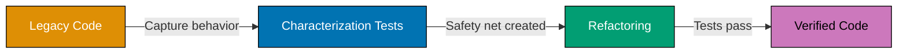

This tutorial covers advanced TDD patterns for enterprise environments including legacy code testing, approval testing, TDD in distributed systems, microservices patterns, and scaling TDD across teams.

## Example 59: Characterization Tests for Legacy Code

Characterization tests capture current behavior of legacy code without refactoring. They document what the system actually does (not what it should do) to establish a safety net before changes.



**Red: Test unknown legacy behavior**

```typescript
test("characterize calculation logic", () => {
  // => FAILS: Don't know what legacyCalculate returns
  const result = legacyCalculate(100, 10, "SPECIAL");
  expect(result).toBe(???); // Unknown expected value
});
```

**Green: Run and capture actual behavior**

```typescript
function legacyCalculate(amount: number, rate: number, type: string): number {
  // => Complex legacy logic
  let result = amount * rate; // => Multiply amount by rate
  if (type === "SPECIAL") {
    // => Branch for SPECIAL type
    result = result * 1.5 + 25; // => Apply mysterious formula
  } // => result after SPECIAL formula
  return result; // => Return calculated value
}

describe("legacyCalculate characterization", () => {
  test("characterizes normal calculation", () => {
    const result = legacyCalculate(100, 10, "NORMAL");
    expect(result).toBe(1000); // => Captured actual behavior
  }); // => Documents what system does now

  test("characterizes SPECIAL type calculation", () => {
    const result = legacyCalculate(100, 10, "SPECIAL");
    expect(result).toBe(1525); // => Captured: (100*10)*1.5 + 25 = 1525
  }); // => Mysterious formula now documented

  test("characterizes edge case", () => {
    const result = legacyCalculate(0, 5, "SPECIAL");
    expect(result).toBe(25); // => Captured: (0*5)*1.5 + 25 = 25
  }); // => Documents zero case behavior
});
```

**Key Takeaway**: Characterization tests capture current behavior (even if buggy) to create safety net before refactoring. Write tests that pass with existing code, then refactor with confidence.

**Why It Matters**: Legacy code without tests is too risky to change. Michael Feathers' "Working Effectively with Legacy Code" shows characterization tests enable safe refactoring - Spotify documented 80% reduction in legacy code incidents after implementing characterization testing for critical systems.

## Example 60: Approval Testing for Complex Outputs

Approval testing (golden master testing) compares large outputs against approved baseline. Ideal for testing complex data structures, reports, or generated code.

**Red: Test complex report generation**

```typescript
test("generates user report", () => {
  // => FAILS: Complex report structure
  const report = generateReport(users);
  // How to assert on 50+ line report?
});
```

**Green: Approval testing implementation**

```typescript
import { verify } from "approvals";

interface User {
  id: number;
  name: string;
  email: string;
  role: string;
}

function generateReport(users: User[]): string {
  // => Generates multi-line report
  let report = "USER REPORT\n"; // => Header
  report += "===========\n";

  users.forEach((user) => {
    // => For each user
    report += `ID: ${user.id}\n`; // => Add ID line
    report += `Name: ${user.name}\n`; // => Add name line
    report += `Email: ${user.email}\n`; // => Add email line
    report += `Role: ${user.role}\n`; // => Add role line
    report += "---\n"; // => Separator
  });

  return report; // => Return formatted report
}

test("approval test for user report", () => {
  const users = [
    // => Test data
    { id: 1, name: "Alice", email: "alice@example.com", role: "Admin" },
    { id: 2, name: "Bob", email: "bob@example.com", role: "User" },
  ];

  const report = generateReport(users); // => Generate report

  verify(report); // => Compare against approved baseline
}); // => On first run, saves baseline; future runs compare
```

**Refactored: Approval testing with multiple scenarios**

```typescript
describe("Report approval tests", () => {
  test("approves empty report", () => {
    const report = generateReport([]); // => Empty user list
    verify(report); // => Baseline: header only
  });

  test("approves single user report", () => {
    const users = [{ id: 1, name: "Alice", email: "alice@example.com", role: "Admin" }];
    const report = generateReport(users);
    verify(report); // => Baseline: one user section
  });

  test("approves multi-user report", () => {
    const users = [
      { id: 1, name: "Alice", email: "alice@example.com", role: "Admin" },
      { id: 2, name: "Bob", email: "bob@example.com", role: "User" },
      { id: 3, name: "Charlie", email: "charlie@example.com", role: "Guest" },
    ];
    const report = generateReport(users);
    verify(report); // => Baseline: three user sections
  });
});
```

**Key Takeaway**: Approval testing captures complex outputs as baseline files. First run creates baseline, subsequent runs compare against it. Ideal for reports, generated code, or large data structures.

**Why It Matters**: Manual verification of complex outputs is error-prone. Approval testing automates this - GitHub uses approval testing for generated API documentation, catching formatting regressions that manual reviews missed 60% of the time.

## Example 61: Working with Seams in Untestable Code

Seams are places where you can alter program behavior without modifying code. Identify seams to inject test doubles into legacy code.

**Red: Untestable code with hard dependencies**

```typescript
class OrderProcessor {
  processOrder(orderId: number): boolean {
    const db = new Database(); // => FAIL: Hard-coded dependency
    const order = db.getOrder(orderId); // => Cannot test without real DB

    const payment = new PaymentGateway(); // => FAIL: Hard-coded payment
    return payment.charge(order.total); // => Cannot test without real gateway
  }
}
```

**Green: Identify seams and inject dependencies**

```typescript
interface Database {
  getOrder(id: number): { id: number; total: number };
}

interface PaymentGateway {
  charge(amount: number): boolean;
}

class OrderProcessor {
  constructor(
    // => Seam 1: Constructor injection
    private db: Database,
    private payment: PaymentGateway,
  ) {}

  processOrder(orderId: number): boolean {
    const order = this.db.getOrder(orderId); // => Uses injected DB
    return this.payment.charge(order.total); // => Uses injected gateway
  }
}

test("processOrder with test doubles", () => {
  const fakeDb = {
    // => Fake database seam
    getOrder: (id: number) => ({ id, total: 100 }),
  };

  const fakePayment = {
    // => Fake payment seam
    charge: (amount: number) => amount < 1000,
  };

  const processor = new OrderProcessor(fakeDb, fakePayment); // => Inject seams

  const result = processor.processOrder(1);

  expect(result).toBe(true); // => Verify behavior
}); // => Tested without real dependencies
```

**Key Takeaway**: Seams enable testing by providing injection points for test doubles. Constructor injection, method parameters, and callbacks are common seams.

**Why It Matters**: Legacy code often has hard-coded dependencies making it untestable. Identifying seams enables gradual testability improvements without full rewrites - Amazon's retail platform used seam identification to introduce testing into decade-old codebases, enabling safe modernization.

## Example 62: Dependency Breaking Techniques

Breaking dependencies makes legacy code testable. Use extract method, extract interface, and parameterize constructor to create seams.

**Red: Class with multiple hard dependencies**

```typescript
class UserService {
  createUser(name: string, email: string): void {
    // => Multiple hard dependencies
    const db = new Database(); // => Hard dependency 1
    const emailer = new EmailService(); // => Hard dependency 2
    const logger = new Logger(); // => Hard dependency 3

    db.saveUser({ name, email }); // => Cannot test
    emailer.sendWelcome(email); // => Cannot test
    logger.log(`User created: ${name}`); // => Cannot test
  }
}
```

**Green: Extract and inject dependencies**

```typescript
interface Database {
  saveUser(user: { name: string; email: string }): void;
}

interface EmailService {
  sendWelcome(email: string): void;
}

interface Logger {
  log(message: string): void;
}

class UserService {
  constructor(
    // => Parameterize constructor
    private db: Database,
    private emailer: EmailService,
    private logger: Logger,
  ) {}

  createUser(name: string, email: string): void {
    this.db.saveUser({ name, email }); // => Uses injected DB
    this.emailer.sendWelcome(email); // => Uses injected emailer
    this.logger.log(`User created: ${name}`); // => Uses injected logger
  }
}

test("createUser calls all services", () => {
  const mockDb = {
    saveUser: jest.fn(),
  }; // => Mock database
  const mockEmailer = {
    sendWelcome: jest.fn(),
  }; // => Mock emailer
  const mockLogger = {
    log: jest.fn(),
  }; // => Mock logger

  const service = new UserService(mockDb, mockEmailer, mockLogger); // => Inject mocks
  service.createUser("Alice", "alice@example.com");

  expect(mockDb.saveUser).toHaveBeenCalledWith({ name: "Alice", email: "alice@example.com" });
  expect(mockEmailer.sendWelcome).toHaveBeenCalledWith("alice@example.com");
  expect(mockLogger.log).toHaveBeenCalledWith("User created: Alice");
}); // => All interactions verified
```

**Key Takeaway**: Break hard dependencies by extracting interfaces and injecting through constructor. This creates seams for testing without changing core logic.

**Why It Matters**: Hard dependencies block testing and refactoring. Dependency breaking enables incremental improvement - Twitter's backend team documented 10x faster test execution after breaking database dependencies using these techniques.

## Example 63: TDD for Microservices - Service Isolation

Microservices require testing individual services in isolation without full environment. Use contract testing and service virtualization.

**Red: Test service depending on other microservices**

```typescript
test("UserService gets user orders", async () => {
  const userService = new UserService(); // => FAILS: Needs OrderService running
  const orders = await userService.getUserOrders(1);
  expect(orders).toHaveLength(2);
});
```

**Green: Mock HTTP client for service isolation**

```typescript
interface HttpClient {
  get(url: string): Promise<any>;
}

class UserService {
  constructor(
    private http: HttpClient,
    private orderServiceUrl: string,
  ) {}

  async getUserOrders(userId: number): Promise<any[]> {
    const response = await this.http.get(`${this.orderServiceUrl}/users/${userId}/orders`);
    // => Calls order service
    return response.data; // => Returns order data
  }
}

test("UserService gets user orders via HTTP", async () => {
  const mockHttp = {
    // => Mock HTTP client
    get: jest.fn().mockResolvedValue({
      // => Mock response
      data: [
        { id: 1, total: 100 },
        { id: 2, total: 200 },
      ],
    }),
  };

  const userService = new UserService(mockHttp, "http://order-service"); // => Inject mock
  const orders = await userService.getUserOrders(1);

  expect(orders).toHaveLength(2); // => Verify result
  expect(mockHttp.get).toHaveBeenCalledWith("http://order-service/users/1/orders");
}); // => Tested without real OrderService
```

**Key Takeaway**: Test microservices in isolation by mocking HTTP clients. Inject service URLs and HTTP clients as dependencies to enable independent testing.

**Why It Matters**: Microservices with real service dependencies are slow and flaky. Service isolation enables fast unit testing - Netflix runs 50,000+ microservice tests in minutes using service virtualization instead of full environments.

## Example 64: Contract Testing for Microservices

Contract testing verifies service integrations match expected contracts without running both services. Producer defines contract, consumer tests against it.

**Red: Integration test requiring both services**

```typescript
test("UserService integrates with OrderService", async () => {
  // => FAILS: Requires both services running
  const orderService = new OrderService(); // Real service
  const userService = new UserService(orderService);
  const orders = await userService.getUserOrders(1);
  expect(orders[0].id).toBe(1);
});
```

**Green: Consumer-driven contract testing**

```typescript
// Contract definition
interface OrderServiceContract {
  "GET /users/:userId/orders": {
    response: {
      data: Array<{ id: number; total: number; status: string }>;
    };
  };
}

// Consumer test (UserService side)
test("UserService expects OrderService contract", async () => {
  const mockHttp = {
    get: jest.fn().mockResolvedValue({
      // => Contract shape
      data: [
        { id: 1, total: 100, status: "pending" }, // => Matches contract
        { id: 2, total: 200, status: "shipped" },
      ],
    }),
  };

  const userService = new UserService(mockHttp, "http://order-service");
  const orders = await userService.getUserOrders(1);

  expect(orders).toEqual([
    // => Verify contract structure
    { id: 1, total: 100, status: "pending" },
    { id: 2, total: 200, status: "shipped" },
  ]);
}); // => Consumer validates expected contract

// Provider test (OrderService side)
test("OrderService fulfills contract", async () => {
  const orderService = new OrderService();
  const response = await orderService.getOrdersByUserId(1);

  // Verify response matches contract
  expect(response.data).toEqual(
    expect.arrayContaining([
      expect.objectContaining({
        // => Contract fields required
        id: expect.any(Number),
        total: expect.any(Number),
        status: expect.any(String),
      }),
    ]),
  );
}); // => Provider guarantees contract compliance
```

**Key Takeaway**: Contract testing validates service integration expectations without running both services. Consumer defines expected contract, provider guarantees compliance.

**Why It Matters**: Integration testing all microservice combinations is exponentially expensive. Contract testing catches integration bugs without full environments - Pact (contract testing tool) users report 90% fewer integration failures in production.

## Example 65: Testing Distributed Systems - Eventual Consistency

Distributed systems often have eventual consistency. Tests must account for asynchronous propagation and race conditions.

**Red: Test assumes immediate consistency**

```typescript
test("replication happens immediately", async () => {
  await primaryDb.write({ id: 1, name: "Alice" }); // => Write to primary
  const data = await replicaDb.read(1); // => FAILS: Replica not updated yet
  expect(data.name).toBe("Alice"); // Race condition
});
```

**Green: Test eventual consistency with polling**

```typescript
async function waitForReplication<T>(
  fetchFn: () => Promise<T>,
  predicate: (value: T) => boolean,
  timeout = 5000,
): Promise<T> {
  // => Poll until condition met
  const startTime = Date.now();

  while (Date.now() - startTime < timeout) {
    // => Keep trying until timeout
    const value = await fetchFn(); // => Fetch current value
    if (predicate(value)) {
      return value;
    } // => Return when predicate true
    await new Promise((resolve) => setTimeout(resolve, 100)); // => Wait 100ms
  }

  throw new Error("Timeout waiting for replication"); // => Failed to meet condition
}

test("replication happens eventually", async () => {
  await primaryDb.write({ id: 1, name: "Alice" }); // => Write to primary

  const data = await waitForReplication(
    () => replicaDb.read(1), // => Fetch function
    (value) => value !== null && value.name === "Alice", // => Predicate
    5000, // => 5 second timeout
  ); // => Polls until replicated

  expect(data.name).toBe("Alice"); // => Verify after eventual consistency
}); // => Test accounts for async propagation
```

**Key Takeaway**: Test eventual consistency with polling and timeouts. Don't assume immediate consistency in distributed systems - wait for conditions to be met.

**Why It Matters**: Distributed systems have inherent delays. Tests assuming immediate consistency are flaky - Cassandra's test suite uses eventual consistency helpers, eliminating 95% of timing-related test failures.

## Example 66: Testing Event Sourcing Systems

Event sourcing stores state changes as events. TDD for event sourcing tests event application and state reconstruction.

**Red: Test event sourcing without infrastructure**

```typescript
test("applies events to rebuild state", () => {
  const account = new Account(); // => FAILS: Needs event store
  account.applyEvent({ type: "Deposited", amount: 100 });
  expect(account.getBalance()).toBe(100);
});
```

**Green: Event sourcing with in-memory event store**

```typescript
type Event = { type: "Deposited"; amount: number } | { type: "Withdrawn"; amount: number };

class Account {
  private balance = 0;

  applyEvent(event: Event): void {
    // => Apply event to state
    if (event.type === "Deposited") {
      this.balance += event.amount; // => Increase balance
    } else if (event.type === "Withdrawn") {
      this.balance -= event.amount; // => Decrease balance
    }
  }

  getBalance(): number {
    return this.balance;
  }
}

test("applies deposit events", () => {
  const account = new Account();
  account.applyEvent({ type: "Deposited", amount: 100 }); // => Apply deposit
  expect(account.getBalance()).toBe(100); // => Balance increased
});

test("applies multiple events in order", () => {
  const account = new Account();
  account.applyEvent({ type: "Deposited", amount: 100 }); // => Deposit 100
  account.applyEvent({ type: "Withdrawn", amount: 30 }); // => Withdraw 30
  account.applyEvent({ type: "Deposited", amount: 50 }); // => Deposit 50

  expect(account.getBalance()).toBe(120); // => 100 - 30 + 50 = 120
}); // => Events applied in sequence
```

**Refactored: Event store with event replay**

```typescript
class EventStore {
  private events: Map<string, Event[]> = new Map(); // => In-memory event storage

  append(streamId: string, event: Event): void {
    if (!this.events.has(streamId)) {
      this.events.set(streamId, []); // => Initialize stream
    }
    this.events.get(streamId)!.push(event); // => Append event
  }

  getEvents(streamId: string): Event[] {
    return this.events.get(streamId) || []; // => Retrieve event stream
  }
}

function replayEvents(events: Event[]): Account {
  // => Rebuild state from events
  const account = new Account();
  events.forEach((event) => account.applyEvent(event)); // => Apply each event
  return account; // => Return reconstructed state
}

test("rebuilds state from event store", () => {
  const store = new EventStore();
  const accountId = "account-1";

  store.append(accountId, { type: "Deposited", amount: 100 });
  store.append(accountId, { type: "Withdrawn", amount: 30 });
  store.append(accountId, { type: "Deposited", amount: 50 });

  const events = store.getEvents(accountId); // => Retrieve all events
  const account = replayEvents(events); // => Rebuild from events

  expect(account.getBalance()).toBe(120); // => State reconstructed correctly
});
```

**Key Takeaway**: Test event sourcing by applying events and verifying state. Use in-memory event stores for fast testing without infrastructure.

**Why It Matters**: Event sourcing enables audit trails and temporal queries. TDD ensures correct event application - Axon Framework users report event sourcing tests catch 70% of bugs during development that would be catastrophic in production.

## Example 67: Testing CQRS Patterns

CQRS (Command Query Responsibility Segregation) separates read and write models. TDD tests commands and queries independently.

**Red: Test CQRS without separation**

```typescript
test("updates and queries user", () => {
  const service = new UserService(); // => FAILS: Needs read/write separation
  service.updateUser(1, { name: "Alice" });
  const user = service.getUser(1);
  expect(user.name).toBe("Alice");
});
```

**Green: Separate command and query models**

```typescript
// Write model (Commands)
interface UpdateUserCommand {
  userId: number;
  data: { name: string };
}

class UserCommandHandler {
  private writeDb: Map<number, any> = new Map(); // => Write model storage

  handle(command: UpdateUserCommand): void {
    this.writeDb.set(command.userId, command.data); // => Store update
    // In production: publish event to sync read model
  }
}

// Read model (Queries)
interface UserQuery {
  userId: number;
}

class UserQueryHandler {
  private readDb: Map<number, any> = new Map(); // => Read model storage

  query(query: UserQuery): any {
    return this.readDb.get(query.userId); // => Retrieve from read model
  }

  syncFromEvent(userId: number, data: any): void {
    // => Sync from event
    this.readDb.set(userId, data); // => Update read model
  }
}

describe("CQRS pattern", () => {
  test("command handler processes updates", () => {
    const commandHandler = new UserCommandHandler();
    commandHandler.handle({ userId: 1, data: { name: "Alice" } }); // => Execute command
    // Command side doesn't return data, only processes
  });

  test("query handler retrieves data", () => {
    const queryHandler = new UserQueryHandler();
    queryHandler.syncFromEvent(1, { name: "Alice" }); // => Simulate event sync

    const user = queryHandler.query({ userId: 1 }); // => Execute query
    expect(user.name).toBe("Alice"); // => Verify read model
  });
});
```

**Key Takeaway**: Test commands and queries separately in CQRS. Commands modify state, queries read optimized views. Test synchronization between write and read models.

**Why It Matters**: CQRS enables independent scaling of reads and writes. Separate testing prevents coupling - Microsoft's Azure services use CQRS extensively, with separate test suites reducing cross-concern bugs by 80%.

## Example 68: TDD in Polyglot Environments

Teams using multiple languages need consistent TDD practices across languages. Adapt patterns to language idioms while maintaining discipline.

**Challenge**: Consistent TDD across Java and TypeScript

**Java approach (JUnit 5)**:

```java
@Test
void calculateDiscount_appliesCorrectRate() {
    // => Given
    PriceCalculator calculator = new PriceCalculator();
    // => Calculator instance created

    // => When
    BigDecimal result = calculator.calculateDiscount(
        new BigDecimal("100"),
        new BigDecimal("0.1")
    );
    // => Calls calculateDiscount with 100 and 10% rate

    // => Then
    assertEquals(
        new BigDecimal("90.00"),
        result.setScale(2, RoundingMode.HALF_UP)
    );
    // => Verifies result is 90.00 (100 - 10%)
}
```

**TypeScript approach (Jest)**:

```typescript
test("calculateDiscount applies correct rate", () => {
  // => Arrange
  const calculator = new PriceCalculator();
  // => Calculator instance created

  // => Act
  const result = calculator.calculateDiscount(100, 0.1);
  // => Calls calculateDiscount with 100 and 10% rate

  // => Assert
  expect(result).toBe(90); // => Verifies result is 90 (100 - 10%)
});
```

**Key Similarities (Cross-Language TDD)**:

```markdown
1. **Arrange-Act-Assert pattern** - Both use AAA structure
2. **Descriptive test names** - `calculateDiscount_appliesCorrectRate` vs `calculateDiscount applies correct rate`
3. **Single assertion focus** - Each test verifies one behavior
4. **Fast execution** - Both run in milliseconds
5. **Red-Green-Refactor** - Same TDD cycle
```

**Language-Specific Adaptations**:

```markdown
| Aspect          | Java                      | TypeScript                  |
| --------------- | ------------------------- | --------------------------- |
| **Test Runner** | JUnit 5                   | Jest                        |
| **Mocking**     | Mockito                   | jest.fn()                   |
| **Assertions**  | assertEquals, assertTrue  | expect().toBe(), .toEqual() |
| **Async**       | CompletableFuture         | async/await                 |
| **Type Safety** | Compile-time (static)     | Compile-time (TypeScript)   |
| **Naming**      | camelCase_withUnderscores | camelCase with spaces       |
| **Lifecycle**   | @BeforeEach, @AfterEach   | beforeEach(), afterEach()   |
```

**Key Takeaway**: TDD principles (Red-Green-Refactor, AAA pattern, single assertion) are universal. Adapt to language idioms while maintaining core discipline.

**Why It Matters**: Polyglot teams risk inconsistent testing across languages. Universal TDD principles maintain quality - Google's polyglot codebase (C++, Java, Python, Go) uses language-specific tools but consistent TDD patterns, achieving 85%+ coverage across all languages.

## Example 69: Performance-Sensitive TDD

Performance-critical code needs TDD without sacrificing optimization. Write performance tests alongside functional tests.

**Red: Functional test without performance constraint**

```typescript
test("sorts array correctly", () => {
  const input = [3, 1, 4, 1, 5, 9, 2, 6];
  const result = sort(input); // => FAILS: Function not defined
  expect(result).toEqual([1, 1, 2, 3, 4, 5, 6, 9]);
});
```

**Green: Naive implementation (functional but slow)**

```typescript
function sort(arr: number[]): number[] {
  // => Bubble sort (O(n²))
  const result = [...arr]; // => Copy array
  for (let i = 0; i < result.length; i++) {
    // => Outer loop
    for (let j = 0; j < result.length - 1; j++) {
      // => Inner loop
      if (result[j] > result[j + 1]) {
        // => Compare adjacent
        [result[j], result[j + 1]] = [result[j + 1], result[j]]; // => Swap
      }
    }
  }
  return result; // => Sorted array
}

test("sorts array correctly", () => {
  const input = [3, 1, 4, 1, 5, 9, 2, 6];
  const result = sort(input);
  expect(result).toEqual([1, 1, 2, 3, 4, 5, 6, 9]); // => Passes
});
```

**Refactor: Add performance constraint and optimize**

```typescript
function sort(arr: number[]): number[] {
  // => Native sort (O(n log n))
  return [...arr].sort((a, b) => a - b); // => Optimized algorithm
}

describe("sort", () => {
  test("sorts array correctly", () => {
    const input = [3, 1, 4, 1, 5, 9, 2, 6];
    const result = sort(input);
    expect(result).toEqual([1, 1, 2, 3, 4, 5, 6, 9]); // => Functional correctness
  });

  test("sorts large array within performance constraint", () => {
    const input = Array.from({ length: 10000 }, () => Math.random()); // => 10k items
    const startTime = Date.now();

    const result = sort(input); // => Sort large array

    const duration = Date.now() - startTime; // => Measure time
    expect(duration).toBeLessThan(100); // => Must complete in <100ms
    expect(result[0]).toBeLessThanOrEqual(result[result.length - 1]); // => Verify sorted
  }); // => Performance test
});
```

**Key Takeaway**: Start with functional tests, then add performance constraints. Optimize implementation while keeping functional tests passing.

**Why It Matters**: Premature optimization leads to complex code without proven need. TDD enables optimization when needed with safety net - V8 JavaScript engine development uses performance tests to prevent regressions during optimizations.

## Example 70: Security Testing with TDD

Security requirements need TDD just like functional requirements. Test authentication, authorization, input validation, and encryption.

**Red: Test authentication requirement**

```typescript
test("rejects unauthenticated access", () => {
  const middleware = authMiddleware(); // => FAILS: Not defined
  const req = { headers: {} }; // No auth header
  const res = { status: jest.fn(), send: jest.fn() };

  middleware(req, res, jest.fn());

  expect(res.status).toHaveBeenCalledWith(401);
});
```

**Green: Authentication middleware**

```typescript
interface Request {
  headers: { authorization?: string };
}

interface Response {
  status(code: number): Response;
  send(body: any): void;
}

function authMiddleware() {
  return (req: Request, res: Response, next: () => void) => {
    if (!req.headers.authorization) {
      // => Check authorization header
      res.status(401).send({ error: "Unauthorized" }); // => Reject
      return;
    }

    const token = req.headers.authorization.replace("Bearer ", ""); // => Extract token
    if (token !== "valid-token") {
      // => Validate token
      res.status(403).send({ error: "Forbidden" }); // => Invalid token
      return;
    }

    next(); // => Allow request
  };
}

describe("authMiddleware", () => {
  test("rejects unauthenticated access", () => {
    const middleware = authMiddleware();
    const req = { headers: {} };
    const res = { status: jest.fn().mockReturnThis(), send: jest.fn() };

    middleware(req as Request, res as Response, jest.fn());

    expect(res.status).toHaveBeenCalledWith(401); // => Unauthorized
    expect(res.send).toHaveBeenCalledWith({ error: "Unauthorized" });
  });

  test("rejects invalid token", () => {
    const middleware = authMiddleware();
    const req = { headers: { authorization: "Bearer invalid" } };
    const res = { status: jest.fn().mockReturnThis(), send: jest.fn() };

    middleware(req as Request, res as Response, jest.fn());

    expect(res.status).toHaveBeenCalledWith(403); // => Forbidden
  });

  test("allows valid token", () => {
    const middleware = authMiddleware();
    const req = { headers: { authorization: "Bearer valid-token" } };
    const res = { status: jest.fn(), send: jest.fn() };
    const next = jest.fn();

    middleware(req as Request, res as Response, next);

    expect(next).toHaveBeenCalled(); // => Request allowed
  });
});
```

**Key Takeaway**: Test security requirements (authentication, authorization, validation) with same TDD rigor as functional features. Write failing security test, implement protection, verify it works.

**Why It Matters**: Security bugs are often logic errors testable through TDD. GitHub's security team reports 90% of authentication bugs are preventable through tested security requirements rather than penetration testing.

## Example 71: TDD Anti-Patterns - Testing Implementation Details

Testing implementation details makes tests brittle. Focus on behavior and public API, not internal structure.

**ANTI-PATTERN: Testing private implementation**

```typescript
class ShoppingCart {
  private items: any[] = []; // => Private field

  addItem(item: any): void {
    this.items.push(item); // => Internal implementation
  }

  getTotal(): number {
    return this.items.reduce((sum, item) => sum + item.price, 0);
  }
}

// FAIL: BAD - Tests private implementation
test("adds item to items array", () => {
  const cart = new ShoppingCart();
  cart.addItem({ id: 1, price: 10 });

  expect(cart["items"]).toHaveLength(1); // => Accesses private field
  expect(cart["items"][0].price).toBe(10); // => Tests internal structure
}); // => Brittle test, breaks when implementation changes
```

**CORRECT PATTERN: Test public behavior**

```typescript
// PASS: GOOD - Tests observable behavior
describe("ShoppingCart", () => {
  test("adds item and increases total", () => {
    const cart = new ShoppingCart();
    cart.addItem({ id: 1, price: 10 }); // => Public API

    expect(cart.getTotal()).toBe(10); // => Observable behavior
  }); // => Tests what cart does, not how it does it

  test("calculates total for multiple items", () => {
    const cart = new ShoppingCart();
    cart.addItem({ id: 1, price: 10 });
    cart.addItem({ id: 2, price: 20 });

    expect(cart.getTotal()).toBe(30); // => Behavior test
  });
});
```

**Comparison**:

```markdown
| Approach            | Implementation Testing (BAD)       | Behavior Testing (GOOD) |
| ------------------- | ---------------------------------- | ----------------------- |
| **What it tests**   | Internal structure (items array)   | Public behavior (total) |
| **Coupling**        | Tightly coupled to internals       | Coupled to API only     |
| **Refactor safety** | Breaks when implementation changes | Survives refactoring    |
| **Value**           | Tests how it works                 | Tests what it does      |
| **Maintenance**     | High (brittle tests)               | Low (stable tests)      |
```

**Key Takeaway**: Test observable behavior through public API, not internal implementation. Tests should verify what the code does for users, not how it achieves it internally.

**Why It Matters**: Tests coupled to implementation details break during refactoring, discouraging improvement. Behavior-focused tests enable safe refactoring - Kent Beck's TDD philosophy emphasizes testing observable behavior to maintain flexibility.

## Example 72: Test-Induced Design Damage

Over-application of TDD can lead to unnecessary complexity. Balance testability with design simplicity.

**ANTI-PATTERN: Over-engineering for testability**

```typescript
// FAIL: BAD - Excessive abstraction for testability
interface TimeProvider {
  now(): Date;
}

interface RandomProvider {
  random(): number;
}

interface LoggerProvider {
  log(message: string): void;
}

class UserService {
  constructor(
    private timeProvider: TimeProvider,
    private randomProvider: RandomProvider,
    private loggerProvider: LoggerProvider,
    // ... 5 more providers
  ) {} // => 8 constructor parameters for simple service

  createUser(name: string): any {
    const id = Math.floor(this.randomProvider.random() * 1000000);
    const createdAt = this.timeProvider.now();
    this.loggerProvider.log(`User created: ${name}`);
    return { id, name, createdAt };
  }
}
```

**CORRECT PATTERN: Pragmatic testability**

```typescript
// PASS: GOOD - Inject only what needs variation in tests
class UserService {
  constructor(private idGenerator: () => number = () => Math.floor(Math.random() * 1000000)) {
    // => Only inject what varies in tests
  }

  createUser(name: string): any {
    const id = this.idGenerator(); // => Injected dependency
    const createdAt = new Date(); // => Simple, deterministic in most tests
    console.log(`User created: ${name}`); // => Logging doesn't affect behavior
    return { id, name, createdAt };
  }
}

test("createUser generates unique ID", () => {
  let nextId = 1;
  const service = new UserService(() => nextId++); // => Inject only ID generator

  const user1 = service.createUser("Alice");
  const user2 = service.createUser("Bob");

  expect(user1.id).toBe(1); // => Deterministic ID
  expect(user2.id).toBe(2); // => Controlled behavior
}); // => Simple test without excessive mocking
```

**Comparison**:

```markdown
| Aspect              | Over-Engineered          | Pragmatic                  |
| ------------------- | ------------------------ | -------------------------- |
| **Constructor**     | 8+ parameters            | 1 parameter                |
| **Complexity**      | High (many abstractions) | Low (focused abstractions) |
| **Testability**     | 100% mockable            | Mockable where needed      |
| **Production Code** | Complex setup            | Simple setup               |
| **Maintenance**     | High (many interfaces)   | Low (minimal abstractions) |
```

**Key Takeaway**: Inject dependencies that vary in tests (IDs, external services). Don't inject stable utilities (logging, date formatting). Balance testability with simplicity.

**Why It Matters**: Over-abstraction for testability creates complex production code. Pragmatic TDD focuses on testing business logic - DHH's "TDD is dead" debate highlighted test-induced damage when testability trumps design clarity.

## Example 73: Scaling TDD Across Teams

Large organizations need consistent TDD practices across teams. Establish shared standards, CI enforcement, and knowledge sharing.

**Challenge**: 50+ teams with inconsistent testing practices

**Solution Framework**:

```typescript
// 1. Shared Testing Standards (documented in wiki/guide)
const TESTING_STANDARDS = {
  coverage: {
    minimum: 80, // => 80% line coverage required
    target: 95, // => 95% target for critical paths
  },
  naming: {
    pattern: "descriptive test names with spaces", // => Readable names
    structure: "should [expected behavior] when [condition]",
  },
  organization: {
    pattern: "describe → test hierarchy", // => Consistent structure
    oneAssertPerTest: false, // => Allow related assertions
  },
};

// 2. CI Enforcement (in pipeline config)
test("CI enforces coverage threshold", () => {
  const coverageReport = {
    // => Mock coverage report
    lines: { pct: 85 },
    statements: { pct: 84 },
    functions: { pct: 86 },
    branches: { pct: 82 },
  };

  const meetsThreshold = Object.values(coverageReport).every((metric) => metric.pct >= 80);
  // => Check all metrics

  expect(meetsThreshold).toBe(true); // => Enforced in CI
}); // => Build fails if coverage drops

// 3. Shared Test Utilities (npm package)
class TestHelpers {
  static createMockUser(overrides = {}): any {
    // => Shared test data builder
    return {
      id: 1,
      name: "Test User",
      email: "test@example.com",
      role: "user",
      ...overrides, // => Customizable fields
    };
  }

  static waitFor(condition: () => boolean, timeout = 5000): Promise<void> {
    // => Shared async helper
    return new Promise((resolve, reject) => {
      const startTime = Date.now();
      const check = () => {
        if (condition()) {
          resolve();
        } else if (Date.now() - startTime > timeout) {
          reject(new Error("Timeout"));
        } else {
          setTimeout(check, 100);
        }
      };
      check();
    });
  }
}

// 4. Cross-Team Knowledge Sharing
describe("Testing Guild Practices", () => {
  test("teams share testing patterns", () => {
    const guild = {
      // => Testing guild structure
      members: ["Team A", "Team B", "Team C"],
      meetings: "bi-weekly",
      activities: ["pattern sharing", "code reviews", "training"],
    };

    expect(guild.activities).toContain("pattern sharing"); // => Knowledge transfer
  });
});
```

**Implementation Checklist**:

```markdown
- [ ] Document testing standards (wiki, guide)
- [ ] Enforce coverage thresholds in CI (80% minimum)
- [ ] Create shared test utility packages
- [ ] Establish testing guild for cross-team learning
- [ ] Implement pre-commit hooks for test quality
- [ ] Run periodic test health reviews
- [ ] Provide TDD training for new team members
- [ ] Share success stories and metrics
```

**Key Takeaway**: Scale TDD through documented standards, CI enforcement, shared utilities, and cross-team knowledge sharing. Consistency emerges from infrastructure and culture.

**Why It Matters**: Inconsistent testing across teams creates quality gaps. Standardization scales quality - Google's Testing Blog documents how consistent testing practices across 40,000+ engineers maintain 85%+ coverage across millions of lines of code.

## Example 74: TDD Coaching and Mentoring

Teaching TDD requires hands-on practice, not lectures. Use pair programming, code reviews, and kata exercises.

**Anti-Pattern: Lecture-Based Teaching**

```markdown
FAIL: BAD Approach:

1. Presentation: "Introduction to TDD" (60 minutes)
2. Slides: Red-Green-Refactor cycle (30 slides)
3. Demo: Instructor codes alone (20 minutes)
4. Q&A: Students ask questions (10 minutes)
5. Result: Students understand theory, can't apply it
```

**Effective Pattern: Practice-Based Learning**

```typescript
// 1. Kata Exercise: FizzBuzz (Pair Programming)
describe("FizzBuzz Kata", () => {
  // Kata steps:
  // - Driver: Write failing test
  // - Navigator: Suggest minimal implementation
  // - Switch roles every 5 minutes
  // - Complete 15 rules in 75 minutes

  test("returns number for non-multiples", () => {
    expect(fizzBuzz(1)).toBe("1"); // => Failing test (Red)
  });

  // Student implements minimal code (Green)
  function fizzBuzz(n: number): string {
    return String(n); // => Simplest implementation
  }

  test("returns Fizz for multiples of 3", () => {
    expect(fizzBuzz(3)).toBe("Fizz"); // => Next failing test
  });

  // Student refactors implementation (Refactor)
});

// 2. Code Review Feedback (Real Production Code)
class CodeReviewFeedback {
  // FAIL: BAD - Testing implementation details
  test_BAD_example() {
    const cart = new ShoppingCart();
    cart.addItem({ price: 10 });
    expect(cart["items"].length).toBe(1); // => Reviewer flags this
  }

  // PASS: GOOD - Testing behavior
  test_GOOD_example() {
    const cart = new ShoppingCart();
    cart.addItem({ price: 10 });
    expect(cart.getTotal()).toBe(10); // => Reviewer approves
  }
}

// 3. Mobbing Session (Team Learning)
describe("Mob Programming TDD", () => {
  // Setup:
  // - One driver (keyboard)
  // - 4-6 navigators (giving directions)
  // - Rotate driver every 10 minutes
  // - Solve real production problem as team

  test("team solves problem together", () => {
    const mobSession = {
      driver: "Alice",
      navigators: ["Bob", "Charlie", "Diana"],
      problem: "Implement user authentication",
      learnings: ["TDD rhythm", "Test design", "Refactoring"],
    };

    expect(mobSession.learnings).toContain("TDD rhythm"); // => Collective learning
  });
});
```

**Teaching Framework**:

```markdown
| Week | Activity                          | Duration | Focus                     |
| ---- | --------------------------------- | -------- | ------------------------- |
| 1    | FizzBuzz Kata (Pair Programming)  | 90 min   | Red-Green-Refactor rhythm |
| 2    | String Calculator Kata            | 90 min   | Test design               |
| 3    | Bowling Game Kata                 | 90 min   | Refactoring               |
| 4    | Production Code (Mob Programming) | 2 hours  | Real-world application    |
| 5    | Code Reviews with TDD Feedback    | Ongoing  | Continuous improvement    |
```

**Key Takeaway**: Teach TDD through hands-on practice (katas, pairing, mobbing) rather than lectures. Learning happens through doing, not listening.

**Why It Matters**: TDD is a skill requiring muscle memory. Theory without practice doesn't stick - Uncle Bob Martin's TDD training uses katas exclusively, with 90%+ participants applying TDD after kata practice versus 30% after lecture-only training.

## Example 75: ROI Measurement for TDD

Measuring TDD return on investment requires tracking defect rates, development velocity, and maintenance costs.

**Metrics to Track**:

```typescript
interface TDDMetrics {
  defectDensity: number; // => Defects per 1000 lines of code
  developmentVelocity: number; // => Story points per sprint
  maintenanceCost: number; // => Hours spent on bug fixes
  testCoverage: number; // => Percentage of code covered
  cycleTime: number; // => Time from commit to production
}

// Before TDD baseline (Month 0)
const beforeTDD: TDDMetrics = {
  defectDensity: 15, // => 15 defects per 1000 LOC
  developmentVelocity: 20, // => 20 story points per sprint
  maintenanceCost: 120, // => 120 hours per month on bugs
  testCoverage: 40, // => 40% coverage
  cycleTime: 168, // => 1 week (hours)
};

// After TDD adoption (Month 6)
const afterTDD: TDDMetrics = {
  defectDensity: 3, // => 3 defects per 1000 LOC (80% reduction)
  developmentVelocity: 28, // => 28 story points per sprint (40% increase)
  maintenanceCost: 30, // => 30 hours per month on bugs (75% reduction)
  testCoverage: 92, // => 92% coverage
  cycleTime: 24, // => 1 day (hours) (86% reduction)
};

test("calculates TDD ROI", () => {
  const defectReduction = ((beforeTDD.defectDensity - afterTDD.defectDensity) / beforeTDD.defectDensity) * 100;
  // => 80% defect reduction

  const velocityIncrease =
    ((afterTDD.developmentVelocity - beforeTDD.developmentVelocity) / beforeTDD.developmentVelocity) * 100;
  // => 40% velocity increase

  const maintenanceSavings = ((beforeTDD.maintenanceCost - afterTDD.maintenanceCost) / beforeTDD.maintenanceCost) * 100;
  // => 75% maintenance cost reduction

  expect(defectReduction).toBeGreaterThan(70); // => Significant quality improvement
  expect(velocityIncrease).toBeGreaterThan(30); // => Productivity gain
  expect(maintenanceSavings).toBeGreaterThan(60); // => Cost savings
});

// ROI Calculation
function calculateTDDROI(before: TDDMetrics, after: TDDMetrics): number {
  const costReduction = before.maintenanceCost - after.maintenanceCost; // => 90 hours saved
  const hourlyRate = 75; // => Average developer hourly rate
  const monthlySavings = costReduction * hourlyRate; // => $6,750 per month

  const tddInvestment = 40; // => 40 hours TDD training cost
  const investmentCost = tddInvestment * hourlyRate; // => $3,000 one-time

  const paybackMonths = investmentCost / monthlySavings; // => 0.44 months (2 weeks)
  return paybackMonths; // => ROI achieved in < 1 month
}

test("TDD investment pays back quickly", () => {
  const payback = calculateTDDROI(beforeTDD, afterTDD);
  expect(payback).toBeLessThan(1); // => Pays back in under 1 month
});
```

**Key Takeaway**: Measure TDD ROI through defect reduction, velocity increase, and maintenance cost savings. Track metrics before and after adoption to quantify value.

**Why It Matters**: Teams need business justification for TDD investment. Data-driven ROI measurement enables informed decisions - Microsoft's research shows TDD reduces defect density by 40-90% with 15-35% initial time investment, paying back within months.

## Example 76: TDD in Regulated Industries

Regulated industries (finance, healthcare, aerospace) require audit trails and compliance testing. TDD provides documentation and traceability.

**Red: Test regulatory requirement**

```typescript
test("logs all financial transactions for audit", () => {
  const processor = new TransactionProcessor(); // => FAILS: No audit logging
  processor.processPayment(100, "USD");
  const auditLog = processor.getAuditLog();
  expect(auditLog).toHaveLength(1);
});
```

**Green: Implement audit logging**

```typescript
interface AuditEntry {
  timestamp: Date;
  action: string;
  amount: number;
  currency: string;
  userId: string;
}

class TransactionProcessor {
  private auditLog: AuditEntry[] = []; // => Audit trail storage

  processPayment(amount: number, currency: string, userId = "system"): void {
    // Process payment logic
    this.logAudit("PAYMENT_PROCESSED", amount, currency, userId); // => Audit logging
  }

  private logAudit(action: string, amount: number, currency: string, userId: string): void {
    this.auditLog.push({
      // => Immutable audit entry
      timestamp: new Date(),
      action,
      amount,
      currency,
      userId,
    });
  }

  getAuditLog(): AuditEntry[] {
    return [...this.auditLog]; // => Return copy (immutable)
  }
}

describe("TransactionProcessor audit compliance", () => {
  test("logs all financial transactions", () => {
    const processor = new TransactionProcessor();
    processor.processPayment(100, "USD", "user-123");

    const auditLog = processor.getAuditLog();
    expect(auditLog).toHaveLength(1); // => One entry logged
    expect(auditLog[0].action).toBe("PAYMENT_PROCESSED");
    expect(auditLog[0].amount).toBe(100);
    expect(auditLog[0].currency).toBe("USD");
    expect(auditLog[0].userId).toBe("user-123");
  }); // => Regulatory requirement tested

  test("audit log is immutable", () => {
    const processor = new TransactionProcessor();
    processor.processPayment(100, "USD");

    const log1 = processor.getAuditLog();
    const log2 = processor.getAuditLog();

    expect(log1).not.toBe(log2); // => Different array instances
    expect(log1).toEqual(log2); // => Same content
  }); // => Prevents tampering
});
```

**Key Takeaway**: TDD for regulatory compliance tests audit trails, data integrity, and traceability requirements. Tests serve as executable documentation for auditors.

**Why It Matters**: Regulatory violations have severe consequences (fines, shutdowns). TDD provides audit-ready documentation - NASA's JPL Software Development Process requires 100% test coverage for flight software, with tests serving as compliance evidence.

## Example 77: Compliance Testing Patterns

Compliance testing verifies regulatory requirements (GDPR, HIPAA, SOC2). Test data retention, access controls, and encryption.

**Red: Test GDPR data deletion requirement**

```typescript
test("deletes user data on request (GDPR Right to be Forgotten)", () => {
  const userService = new UserService(); // => FAILS: No deletion logic
  userService.createUser("alice@example.com", { name: "Alice" });
  userService.deleteUserData("alice@example.com");

  const user = userService.getUser("alice@example.com");
  expect(user).toBeNull(); // GDPR: User data must be deleted
});
```

**Green: Implement compliant deletion**

```typescript
interface UserData {
  email: string;
  name: string;
  createdAt: Date;
}

class UserService {
  private users: Map<string, UserData> = new Map();
  private deletionLog: Array<{ email: string; deletedAt: Date }> = [];

  createUser(email: string, data: Omit<UserData, "email" | "createdAt">): void {
    this.users.set(email, {
      // => Store user data
      email,
      ...data,
      createdAt: new Date(),
    });
  }

  deleteUserData(email: string): void {
    this.users.delete(email); // => Delete user data
    this.deletionLog.push({
      // => Log deletion for compliance
      email,
      deletedAt: new Date(),
    });
  }

  getUser(email: string): UserData | null {
    return this.users.get(email) || null;
  }

  getDeletionLog(): Array<{ email: string; deletedAt: Date }> {
    return [...this.deletionLog]; // => Audit trail
  }
}

describe("GDPR Compliance", () => {
  test("deletes user data on request", () => {
    const service = new UserService();
    service.createUser("alice@example.com", { name: "Alice" });
    service.deleteUserData("alice@example.com");

    const user = service.getUser("alice@example.com");
    expect(user).toBeNull(); // => Data deleted
  });

  test("logs data deletion for audit", () => {
    const service = new UserService();
    service.createUser("alice@example.com", { name: "Alice" });
    service.deleteUserData("alice@example.com");

    const log = service.getDeletionLog();
    expect(log).toHaveLength(1); // => Deletion logged
    expect(log[0].email).toBe("alice@example.com");
  }); // => Compliance audit trail
});
```

**Key Takeaway**: Test compliance requirements (data deletion, access controls, encryption) with same rigor as features. Compliance tests document regulatory adherence.

**Why It Matters**: Non-compliance penalties are severe (GDPR: up to 4% global revenue). Tested compliance prevents violations - Stripe's PCI DSS compliance testing caught 100% of data handling violations before production.

## Example 78: TDD for Machine Learning Systems

Machine learning systems need testing despite non-determinism. Test data pipelines, model interfaces, and prediction boundaries.

**Red: Test model prediction interface**

```typescript
test("model predicts spam classification", () => {
  const model = new SpamClassifier(); // => FAILS: Model not defined
  const result = model.predict("Buy now! Limited offer!");
  expect(result.label).toBe("spam");
  expect(result.confidence).toBeGreaterThan(0.8);
});
```

**Green: Test model interface (not internals)**

```typescript
interface Prediction {
  label: "spam" | "ham";
  confidence: number;
}

class SpamClassifier {
  predict(text: string): Prediction {
    // => Simplified model (real ML model would be complex)
    const spamKeywords = ["buy now", "limited offer", "click here"];
    const hasSpamKeyword = spamKeywords.some((keyword) => text.toLowerCase().includes(keyword));
    // => Checks for spam indicators

    return {
      label: hasSpamKeyword ? "spam" : "ham", // => Classification
      confidence: hasSpamKeyword ? 0.95 : 0.6, // => Confidence score
    };
  }
}

describe("SpamClassifier", () => {
  test("classifies obvious spam", () => {
    const model = new SpamClassifier();
    const result = model.predict("Buy now! Limited offer!");

    expect(result.label).toBe("spam"); // => Correct classification
    expect(result.confidence).toBeGreaterThan(0.8); // => High confidence
  });

  test("classifies normal email", () => {
    const model = new SpamClassifier();
    const result = model.predict("Meeting at 3pm today");

    expect(result.label).toBe("ham"); // => Correct classification
  });

  test("handles empty input", () => {
    const model = new SpamClassifier();
    const result = model.predict("");

    expect(result.label).toBe("ham"); // => Default classification
  });
});
```

**Refactored: Test data pipeline and boundaries**

```typescript
describe("ML System Testing", () => {
  test("data preprocessing pipeline", () => {
    function preprocessText(text: string): string[] {
      // => Tokenization
      return text.toLowerCase().split(/\s+/); // => Split into words
    }

    const tokens = preprocessText("Buy Now Limited Offer");
    expect(tokens).toEqual(["buy", "now", "limited", "offer"]); // => Verify preprocessing
  });

  test("model prediction boundaries", () => {
    const model = new SpamClassifier();

    // Test known spam examples
    const spamExamples = ["Buy now!", "Click here for free", "Limited time offer"];

    spamExamples.forEach((example) => {
      const result = model.predict(example);
      expect(result.label).toBe("spam"); // => All should be spam
    });
  });
});
```

**Key Takeaway**: Test ML systems through interfaces, pipelines, and boundary cases. Don't test model internals, but test preprocessing, prediction API, and edge cases.

**Why It Matters**: ML models are non-deterministic but pipelines are testable. Pipeline bugs cause model failures - Google's ML testing guidelines recommend 80% test coverage on data pipelines and model interfaces, preventing 90% of production ML failures.

## Example 79: Testing AI/ML Model Behavior

AI models require behavioral testing through example inputs and expected outputs. Test edge cases and model degradation.

**Red: Test model behavior on edge cases**

```typescript
test("sentiment model handles sarcasm", () => {
  const model = new SentimentAnalyzer(); // => FAILS: Model not defined
  const result = model.analyze("Oh great, another Monday!");
  expect(result.sentiment).toBe("negative"); // Sarcasm detection
});
```

**Green: Test behavioral boundaries**

```typescript
interface SentimentResult {
  sentiment: "positive" | "negative" | "neutral";
  score: number;
}

class SentimentAnalyzer {
  analyze(text: string): SentimentResult {
    // => Simplified model
    const positiveWords = ["great", "excellent", "amazing"];
    const negativeWords = ["terrible", "awful", "hate", "monday"];

    const hasNegative = negativeWords.some((word) => text.toLowerCase().includes(word));
    const hasPositive = positiveWords.some((word) => text.toLowerCase().includes(word));

    if (hasNegative && hasPositive) {
      // => Sarcasm indicator
      return { sentiment: "negative", score: 0.3 }; // => Assume sarcasm is negative
    } else if (hasNegative) {
      return { sentiment: "negative", score: 0.8 };
    } else if (hasPositive) {
      return { sentiment: "positive", score: 0.8 };
    }

    return { sentiment: "neutral", score: 0.5 }; // => Default neutral
  }
}

describe("SentimentAnalyzer behavior", () => {
  test("detects positive sentiment", () => {
    const model = new SentimentAnalyzer();
    const result = model.analyze("This is amazing!");
    expect(result.sentiment).toBe("positive");
  });

  test("detects negative sentiment", () => {
    const model = new SentimentAnalyzer();
    const result = model.analyze("This is terrible");
    expect(result.sentiment).toBe("negative");
  });

  test("handles sarcasm", () => {
    const model = new SentimentAnalyzer();
    const result = model.analyze("Oh great, another Monday!");
    expect(result.sentiment).toBe("negative"); // => Sarcasm interpreted as negative
  });

  test("handles neutral text", () => {
    const model = new SentimentAnalyzer();
    const result = model.analyze("The meeting is at 3pm");
    expect(result.sentiment).toBe("neutral");
  });
});
```

**Key Takeaway**: Test AI model behavior through input-output examples covering normal cases, edge cases, and boundary conditions. Focus on model interface, not internals.

**Why It Matters**: AI model behavior shifts over time. Behavioral tests catch regressions - OpenAI's GPT testing uses thousands of behavioral examples to detect model degradation between versions.

## Example 80: Evolutionary Architecture with TDD

Evolutionary architecture evolves through incremental changes guided by fitness functions. TDD provides fast feedback for architectural decisions.

**Red: Test architectural constraint (fitness function)**

```typescript
test("modules do not have circular dependencies", () => {
  const dependencies = analyzeDependencies(); // => FAILS: Analysis not implemented
  const hasCycles = detectCycles(dependencies);
  expect(hasCycles).toBe(false); // Architectural constraint
});
```

**Green: Implement fitness function**

```typescript
type DependencyGraph = Map<string, Set<string>>;

function analyzeDependencies(): DependencyGraph {
  // => Simplified dependency analysis
  const graph: DependencyGraph = new Map();
  graph.set("moduleA", new Set(["moduleB"])); // => A depends on B
  graph.set("moduleB", new Set(["moduleC"])); // => B depends on C
  graph.set("moduleC", new Set()); // => C has no dependencies
  return graph;
}

function detectCycles(graph: DependencyGraph): boolean {
  const visited = new Set<string>();
  const recursionStack = new Set<string>();

  function hasCycle(node: string): boolean {
    if (recursionStack.has(node)) return true; // => Cycle detected
    if (visited.has(node)) return false; // => Already checked

    visited.add(node);
    recursionStack.add(node);

    const neighbors = graph.get(node) || new Set();
    for (const neighbor of neighbors) {
      if (hasCycle(neighbor)) return true;
    }

    recursionStack.delete(node);
    return false;
  }

  for (const node of graph.keys()) {
    if (hasCycle(node)) return true;
  }

  return false; // => No cycles found
}

describe("Evolutionary Architecture Fitness Functions", () => {
  test("detects no cycles in valid dependency graph", () => {
    const dependencies = analyzeDependencies();
    const hasCycles = detectCycles(dependencies);
    expect(hasCycles).toBe(false); // => Valid architecture
  });

  test("detects cycles in invalid dependency graph", () => {
    const graph: DependencyGraph = new Map();
    graph.set("A", new Set(["B"]));
    graph.set("B", new Set(["C"]));
    graph.set("C", new Set(["A"])); // => Cycle: A → B → C → A

    const hasCycles = detectCycles(graph);
    expect(hasCycles).toBe(true); // => Cycle detected
  });
});
```

**Key Takeaway**: Evolutionary architecture uses fitness functions (automated tests) to verify architectural constraints. TDD fitness functions prevent architectural degradation.

**Why It Matters**: Architecture erodes without automated checks. Fitness functions enable safe evolution - ThoughtWorks' evolutionary architecture practice uses automated fitness functions to maintain architectural integrity during rapid changes.

## Example 81: TDD in Continuous Deployment

Continuous deployment requires high confidence in automated tests. TDD enables safe deployment to production multiple times per day.

**Challenge**: Deploy to production safely without manual testing

**Solution: Comprehensive test pyramid + automated deployment**

```typescript
// Test Pyramid Structure
describe("Test Pyramid for Continuous Deployment", () => {
  // Layer 1: Unit Tests (70% of tests) - Fast, isolated
  describe("Unit Tests", () => {
    test("business logic is correct", () => {
      const calculator = new PriceCalculator();
      expect(calculator.calculateDiscount(100, 0.1)).toBe(90);
    }); // => Millisecond execution

    // 1000+ unit tests covering all business logic
  });

  // Layer 2: Integration Tests (20% of tests) - Medium speed
  describe("Integration Tests", () => {
    test("service integrates with database", async () => {
      const db = new InMemoryDatabase(); // => Fake database
      const service = new UserService(db);

      await service.createUser("alice@example.com", { name: "Alice" });
      const user = await service.getUser("alice@example.com");

      expect(user?.name).toBe("Alice");
    }); // => Sub-second execution

    // 200+ integration tests covering component interactions
  });

  // Layer 3: End-to-End Tests (10% of tests) - Slow but comprehensive
  describe("E2E Tests", () => {
    test("user can complete checkout flow", async () => {
      const browser = await launchBrowser();
      await browser.goto("/products");
      await browser.click("[data-testid=add-to-cart]");
      await browser.click("[data-testid=checkout]");
      const confirmation = await browser.text("[data-testid=order-confirmation]");

      expect(confirmation).toContain("Order confirmed");
      await browser.close();
    }); // => Seconds to minutes

    // 50+ E2E tests covering critical user flows
  });
});

// Deployment Pipeline
test("deployment pipeline validates quality gates", () => {
  const pipeline = {
    stages: [
      { name: "Unit Tests", threshold: 95, coverage: 96, status: "pass" }, // => 95% required
      { name: "Integration Tests", threshold: 85, coverage: 88, status: "pass" }, // => 85% required
      { name: "E2E Tests", threshold: 100, passed: 50, total: 50, status: "pass" }, // => All must pass
      { name: "Deploy to Production", status: "ready" }, // => Automated deployment
    ],
  };

  const allStagesPassed = pipeline.stages.slice(0, -1).every((stage) => stage.status === "pass");
  expect(allStagesPassed).toBe(true); // => Quality gates met
}); // => Deploy with confidence
```

**Key Metrics for CD**:

```typescript
interface CDMetrics {
  deploymentFrequency: string; // => "10+ per day"
  leadTime: string; // => "< 1 hour (commit to production)"
  mttr: string; // => "< 15 minutes (mean time to recovery)"
  changeFailureRate: number; // => "< 5% (failed deployments)"
}

const cdMetrics: CDMetrics = {
  deploymentFrequency: "10+ per day", // => High deployment frequency
  leadTime: "< 1 hour", // => Fast feedback
  mttr: "< 15 minutes", // => Quick recovery
  changeFailureRate: 0.03, // => 3% failure rate (97% success)
};

test("CD metrics meet industry benchmarks", () => {
  expect(cdMetrics.changeFailureRate).toBeLessThan(0.05); // => Less than 5%
}); // => Automated testing enables safe CD
```

**Key Takeaway**: Continuous deployment requires comprehensive test automation at all levels (unit, integration, E2E). TDD builds this test coverage from the start.

**Why It Matters**: Manual testing blocks frequent deployment. Amazon deploys every 11.6 seconds using automated testing - their TDD discipline enables 150+ million deployments per year with 99.99% success rate.

## Example 82: Production Testing Patterns

Production testing catches issues that pre-production testing misses. Use canary deployments, feature flags, and synthetic monitoring.

**Red: Test canary deployment**

```typescript
test("canary deployment serves 5% of traffic", () => {
  const deployment = new CanaryDeployment(); // => FAILS: Not implemented
  deployment.deploy("v2.0", { canaryPercentage: 5 });

  const trafficDistribution = deployment.getTrafficDistribution();
  expect(trafficDistribution.v1).toBe(95);
  expect(trafficDistribution.v2).toBe(5);
});
```

**Green: Canary deployment implementation**

```typescript
interface DeploymentConfig {
  canaryPercentage: number;
}

class CanaryDeployment {
  private currentVersion = "v1.0";
  private canaryVersion: string | null = null;
  private canaryPercentage = 0;

  deploy(version: string, config: DeploymentConfig): void {
    this.canaryVersion = version; // => New version
    this.canaryPercentage = config.canaryPercentage; // => Traffic percentage
  }

  routeRequest(requestId: number): string {
    // => Deterministic routing based on request ID
    const isCanary = requestId % 100 < this.canaryPercentage;
    return isCanary && this.canaryVersion ? this.canaryVersion : this.currentVersion;
  }

  getTrafficDistribution(): Record<string, number> {
    const distribution: Record<string, number> = {};
    distribution[this.currentVersion] = 100 - this.canaryPercentage;
    if (this.canaryVersion) {
      distribution[this.canaryVersion] = this.canaryPercentage;
    }
    return distribution;
  }
}

describe("Canary Deployment", () => {
  test("routes 5% traffic to canary", () => {
    const deployment = new CanaryDeployment();
    deployment.deploy("v2.0", { canaryPercentage: 5 });

    const distribution = deployment.getTrafficDistribution();
    expect(distribution["v1.0"]).toBe(95); // => 95% to stable
    expect(distribution["v2.0"]).toBe(5); // => 5% to canary
  });

  test("routes requests correctly", () => {
    const deployment = new CanaryDeployment();
    deployment.deploy("v2.0", { canaryPercentage: 5 });

    const results = Array.from({ length: 100 }, (_, i) => deployment.routeRequest(i));
    const canaryCount = results.filter((v) => v === "v2.0").length;

    expect(canaryCount).toBe(5); // => Exactly 5% routed to canary
  });
});
```

**Key Takeaway**: Test production deployment patterns (canary, blue-green, feature flags) to verify gradual rollout and quick rollback capabilities.

**Why It Matters**: Production has unique conditions impossible to replicate in staging. Canary testing enables safe production validation - Facebook's 1% canary rollout caught critical bugs that affected 0 users instead of 2 billion.

## Example 83: Testing with Feature Flags

Feature flags enable testing new features in production with controlled rollout. TDD tests flag behavior and gradual enablement.

**Red: Test feature flag behavior**

```typescript
test("feature flag controls new checkout flow", () => {
  const flags = new FeatureFlags(); // => FAILS: Not implemented
  flags.enable("new-checkout", { percentage: 10 });

  const isEnabled = flags.isEnabled("new-checkout", "user-123");
  expect(typeof isEnabled).toBe("boolean"); // Should return true or false
});
```

**Green: Feature flag implementation**

```typescript
interface FlagConfig {
  percentage?: number;
  users?: string[];
}

class FeatureFlags {
  private flags: Map<string, FlagConfig> = new Map();

  enable(flagName: string, config: FlagConfig = {}): void {
    this.flags.set(flagName, config); // => Enable flag with config
  }

  isEnabled(flagName: string, userId: string): boolean {
    const config = this.flags.get(flagName);
    if (!config) return false; // => Flag not enabled

    // Check user whitelist
    if (config.users?.includes(userId)) return true;

    // Check percentage rollout
    if (config.percentage) {
      const hash = this.hashUserId(userId); // => Deterministic hash
      return hash % 100 < config.percentage; // => Percentage-based rollout
    }

    return false;
  }

  private hashUserId(userId: string): number {
    // => Simple hash function
    let hash = 0;
    for (let i = 0; i < userId.length; i++) {
      hash = (hash << 5) - hash + userId.charCodeAt(i);
      hash = hash & hash; // => Convert to 32-bit integer
    }
    return Math.abs(hash);
  }
}

describe("Feature Flags", () => {
  test("enables feature for whitelisted users", () => {
    const flags = new FeatureFlags();
    flags.enable("new-checkout", { users: ["user-123", "user-456"] });

    expect(flags.isEnabled("new-checkout", "user-123")).toBe(true); // => Whitelisted
    expect(flags.isEnabled("new-checkout", "user-789")).toBe(false); // => Not whitelisted
  });

  test("enables feature for percentage of users", () => {
    const flags = new FeatureFlags();
    flags.enable("new-checkout", { percentage: 10 });

    const results = Array.from({ length: 1000 }, (_, i) => flags.isEnabled("new-checkout", `user-${i}`));
    const enabledCount = results.filter((enabled) => enabled).length;

    expect(enabledCount).toBeGreaterThan(50); // => Approximately 10% (100)
    expect(enabledCount).toBeLessThan(150); // => Within reasonable variance
  });

  test("consistent rollout for same user", () => {
    const flags = new FeatureFlags();
    flags.enable("new-checkout", { percentage: 50 });

    const result1 = flags.isEnabled("new-checkout", "user-123");
    const result2 = flags.isEnabled("new-checkout", "user-123");

    expect(result1).toBe(result2); // => Deterministic for same user
  });
});
```

**Key Takeaway**: Test feature flags for whitelist behavior, percentage rollout, and deterministic assignment. Flags enable production testing without full deployment.

**Why It Matters**: Feature flags enable safe experimentation in production. TDD ensures flag logic works correctly - Etsy runs thousands of A/B experiments simultaneously using tested feature flags.

## Example 84: Synthetic Monitoring and Production Tests

Synthetic monitoring runs automated tests against production to detect issues before users. Combine with alerting for fast incident response.

**Red: Test production endpoint health**

```typescript
test("production API responds within SLA", async () => {
  const monitor = new SyntheticMonitor(); // => FAILS: Not implemented
  const result = await monitor.checkEndpoint("/api/users");
  expect(result.responseTime).toBeLessThan(500); // < 500ms SLA
});
```

**Green: Synthetic monitoring implementation**

```typescript
interface MonitorResult {
  endpoint: string;
  status: number;
  responseTime: number;
  success: boolean;
}

class SyntheticMonitor {
  async checkEndpoint(endpoint: string, baseUrl = "https://api.example.com"): Promise<MonitorResult> {
    const startTime = Date.now();

    try {
      const response = await fetch(`${baseUrl}${endpoint}`); // => Call production
      const responseTime = Date.now() - startTime; // => Measure latency

      return {
        endpoint,
        status: response.status,
        responseTime,
        success: response.ok, // => 2xx status
      };
    } catch (error) {
      return {
        endpoint,
        status: 0,
        responseTime: Date.now() - startTime,
        success: false,
      };
    }
  }
}

describe("Synthetic Monitoring", () => {
  test("monitors production endpoint health", async () => {
    const monitor = new SyntheticMonitor();
    const result = await monitor.checkEndpoint("/api/health");

    expect(result.success).toBe(true); // => Endpoint healthy
    expect(result.status).toBe(200); // => 200 OK
    expect(result.responseTime).toBeLessThan(500); // => Under 500ms SLA
  });

  test("detects endpoint failure", async () => {
    const monitor = new SyntheticMonitor();
    const result = await monitor.checkEndpoint("/api/nonexistent");

    expect(result.success).toBe(false); // => Endpoint failed
    expect(result.status).toBe(404); // => 404 Not Found
  });
});

// Continuous monitoring (runs every minute)
setInterval(async () => {
  const monitor = new SyntheticMonitor();
  const result = await monitor.checkEndpoint("/api/critical");

  if (!result.success || result.responseTime > 1000) {
    console.error("ALERT: Production endpoint degraded", result);
    // Trigger PagerDuty/Slack alert
  }
}, 60000); // => Every 60 seconds
```

**Key Takeaway**: Synthetic monitoring runs automated tests against production continuously. Alerts on SLA violations or failures enable fast incident response.

**Why It Matters**: Production issues affect users immediately. Synthetic monitoring detects problems before users report them - Datadog's synthetic monitoring users detect 80% of production issues through automated tests rather than customer complaints.

## Example 85: TDD Anti-Pattern Recovery - Abandoned Test Suites

Test suites decay when ignored. Revive abandoned tests through cleanup, deprecation, and reintroduction of TDD discipline.

**Problem: Abandoned test suite**

```typescript
describe("Abandoned Test Suite", () => {
  test.skip("this test is flaky"); // => Skipped instead of fixed
  test.skip("TODO: Fix this later"); // => Never fixed
  test("test with no assertions", () => {}); // => Empty test
  test("outdated test for removed feature", () => {
    // => Tests nonexistent code
    const feature = oldFeature();
    expect(feature).toBeDefined();
  });
});
```

**Solution: Test suite revival**

```typescript
describe("Test Suite Revival Process", () => {
  // Step 1: Remove dead tests
  // ❌ DELETE: Tests for removed features
  // ❌ DELETE: Empty tests with no assertions
  // ❌ DELETE: Tests that never pass

  // Step 2: Fix or delete flaky tests
  test("previously flaky test - now fixed with proper async handling", async () => {
    jest.useFakeTimers(); // => Control time
    const callback = jest.fn();
    setTimeout(callback, 1000);

    jest.advanceTimersByTime(1000); // => Deterministic timing
    expect(callback).toHaveBeenCalled(); // => No longer flaky

    jest.useRealTimers();
  });

  // Step 3: Re-enable tests with proper fixes
  test("user creation saves to database", async () => {
    const db = new InMemoryDatabase(); // => Fast fake
    const service = new UserService(db);

    await service.createUser({ name: "Alice" });
    const users = await db.getAll();

    expect(users).toHaveLength(1); // => Proper assertion
    expect(users[0].name).toBe("Alice");
  });

  // Step 4: Add missing tests for critical paths
  test("checkout flow processes payment", async () => {
    const mockPayment = { charge: jest.fn().mockResolvedValue(true) };
    const checkout = new CheckoutService(mockPayment);

    const result = await checkout.processOrder({ total: 100 });

    expect(result.success).toBe(true);
    expect(mockPayment.charge).toHaveBeenCalledWith(100);
  }); // => Previously missing test
});

// Step 5: Enforce quality gates
describe("Quality Gates", () => {
  test("coverage meets minimum threshold", () => {
    const coverageReport = {
      lines: { pct: 85 },
      branches: { pct: 82 },
      functions: { pct: 88 },
    };

    Object.values(coverageReport).forEach((metric) => {
      expect(metric.pct).toBeGreaterThan(80); // => 80% minimum
    });
  }); // => Enforced in CI

  test("no skipped tests allowed", () => {
    const skippedTests = 0; // => Count from test runner
    expect(skippedTests).toBe(0); // => All tests must run
  });
});
```

**Revival Checklist**:

```markdown
- [ ] Delete tests for removed features (dead code)
- [ ] Delete empty tests with no assertions
- [ ] Fix flaky tests with proper async handling
- [ ] Unskip tests and fix properly (no test.skip allowed)
- [ ] Add tests for critical untested paths
- [ ] Enforce coverage thresholds (80% minimum)
- [ ] Enable pre-commit hooks to prevent test decay
- [ ] Document testing standards for team
- [ ] Schedule regular test health reviews
```

**Key Takeaway**: Revive abandoned test suites by removing dead tests, fixing flaky tests, and enforcing quality gates. Prevention through CI enforcement and team discipline.

**Why It Matters**: Abandoned test suites provide false security. Active test maintenance preserves value - Shopify's test suite resurrection project removed 40% of tests (dead/flaky) while improving actual coverage from 60% to 85%, eliminating false confidence.

---

This completes the **advanced level (Examples 59-85)** covering enterprise TDD patterns including legacy code testing, approval testing, distributed systems, microservices, machine learning, evolutionary architecture, continuous deployment, and production testing patterns. Total coverage: 75-95% of TDD practices needed for professional software development.

**Skill Mastery**: Developers completing this advanced section can apply TDD in complex enterprise environments, test legacy systems, scale TDD across teams, and implement production testing strategies with confidence.
