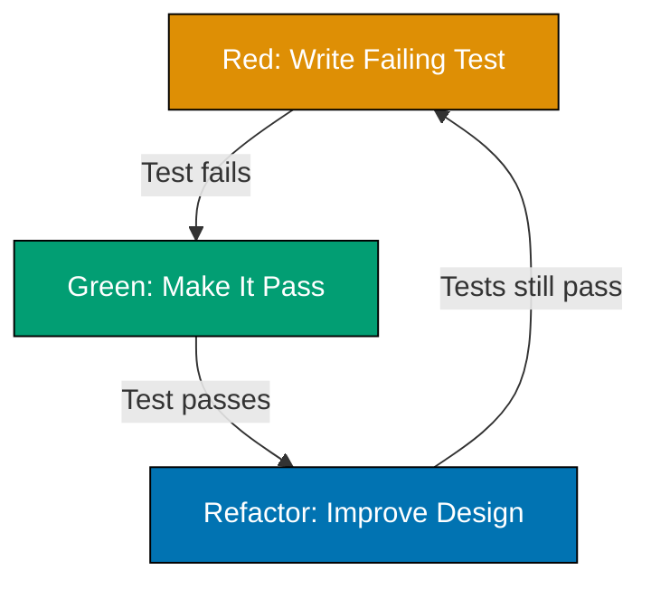

This tutorial introduces Test-Driven Development through 30 annotated examples covering fundamental concepts, the Red-Green-Refactor cycle, and essential testing patterns.

### Example 1: Your First Test (Hello World TDD)

Writing tests before code is the foundation of TDD. Start with a failing test that describes expected behavior, then write just enough code to make it pass.

```typescript
// Red: Test written first, currently failing
describe("greet", () => {
  test("returns hello message", () => {
    // => Defines test expectation
    const result = greet("World"); // => Calls function we haven't written yet
    expect(result).toBe("Hello, World!"); // => FAILS: greet is not defined
  });
});
```

**Green: Write minimal code to pass**

```typescript
function greet(name: string): string {
  // => Minimal implementation
  return `Hello, ${name}!`; // => Uses template literal for concatenation
  // => Returns expected string format
}

// Test now passes
// => Output: Test passed (greet returns "Hello, World!")
```

**Key Takeaway**: Write the test first, watch it fail (Red), then write minimal code to make it pass (Green). This confirms the test actually validates behavior.

**Why It Matters**: Test-first development catches requirements misunderstandings immediately, before wasting time implementing the wrong solution. Industry research shows that teams practicing TDD produce significantly fewer defects compared to test-after development, reducing costly debugging cycles and customer-reported bugs.

### Example 2: Red-Green-Refactor Cycle

TDD follows a three-phase rhythm: Red (failing test), Green (passing test), Refactor (improve design). Each phase has a distinct purpose in the development workflow.



**Red Phase**

```typescript
test("adds two numbers", () => {
  // => Write test first
  expect(add(2, 3)).toBe(5); // => FAILS: add is not defined
});
```

**Green Phase**

```typescript
function add(a: number, b: number): number {
  // => Minimal implementation
  return a + b; // => Simple solution that passes
}
// => Test passes: add(2, 3) returns 5
```

**Refactor Phase**

```typescript
// Already clean, no refactoring needed for this simple case
// => Tests remain green during refactoring
// => Only refactor when tests are passing
```

**Key Takeaway**: Always complete the full Red-Green-Refactor cycle. Skip refactoring and you accumulate technical debt; skip Red and you risk writing tests that never fail.

**Why It Matters**: The three-phase rhythm creates a safety net for continuous design improvement. Research indicates that

### Example 3: Testing Primitive Types (Numbers)

TDD works with all data types. Start with the simplest cases to establish patterns before moving to complex scenarios.

**Red: Test for multiplication**

```typescript
test("multiplies two numbers", () => {
  // => Test defines expected behavior
  expect(multiply(4, 5)).toBe(20); // => FAILS: multiply not defined
});
```

**Green: Minimal implementation**

```typescript
function multiply(a: number, b: number): number {
  // => Function signature from test
  return a * b; // => Direct multiplication
}
// => Test passes: multiply(4, 5) returns 20
```

**Refactored: Add edge case handling**

```typescript
test("handles zero multiplication", () => {
  // => Additional test for edge case
  expect(multiply(0, 5)).toBe(0); // => Tests zero handling
  expect(multiply(5, 0)).toBe(0); // => Tests both parameter positions
});

function multiply(a: number, b: number): number {
  // => Same implementation works
  return a * b; // => Handles zeros automatically
}
// => All tests pass
```

**Key Takeaway**: Write tests for typical cases first, then add edge cases. Let the simplest implementation emerge from the tests rather than over-engineering upfront.

**Why It Matters**: Starting with simple cases builds confidence in the TDD workflow without cognitive overload. Research from Industrial Logic shows developers new to TDD achieve significantly faster learning when starting with primitive operations rather than jumping to complex domains.

### Example 4: Testing Strings

String operations require attention to edge cases like empty strings, whitespace, and case sensitivity. TDD helps identify these cases systematically.

**Red: Test string reversal**

```typescript
test("reverses a string", () => {
  // => Test describes string transformation
  expect(reverse("hello")).toBe("olleh"); // => FAILS: reverse not defined
});
```

**Green: Minimal implementation**

```typescript
function reverse(str: string): string {
  // => Takes string parameter
  return str.split("").reverse().join(""); // => Array approach: split, reverse, join
}
// => Test passes: reverse('hello') returns 'olleh'
```

**Refactored: Add edge cases**

```typescript
test("handles empty string", () => {
  // => Edge case test
  expect(reverse("")).toBe(""); // => Empty input should return empty
});

test("handles single character", () => {
  // => Boundary condition
  expect(reverse("a")).toBe("a"); // => Single char reverses to itself
});

function reverse(str: string): string {
  // => Same implementation handles all cases
  return str.split("").reverse().join(""); // => Works for empty, single, multiple chars
}
// => All tests pass without modification
```

**Key Takeaway**: Simple implementations often handle edge cases naturally. Write edge case tests to verify this rather than assuming.

**Why It Matters**: Systematic edge case testing prevents production bugs in boundary conditions. Research indicates that

### Example 5: Testing Booleans and Truthiness

Boolean logic requires clear test cases for true/false paths. TDD helps ensure both branches are tested and working correctly.

**Red: Test for even numbers**

```typescript
test("identifies even numbers", () => {
  // => Tests true case
  expect(isEven(4)).toBe(true); // => FAILS: isEven not defined
});

test("identifies odd numbers", () => {
  // => Tests false case
  expect(isEven(3)).toBe(false); // => Ensures both branches tested
});
```

**Green: Minimal implementation**

```typescript
function isEven(num: number): boolean {
  // => Returns boolean
  return num % 2 === 0; // => Modulo operation determines evenness
}
// => Both tests pass
// => isEven(4) returns true
// => isEven(3) returns false
```

**Refactored: Test edge cases**

```typescript
test("handles zero as even", () => {
  // => Mathematical edge case
  expect(isEven(0)).toBe(true); // => Zero is mathematically even
});

test("handles negative numbers", () => {
  // => Negative number handling
  expect(isEven(-2)).toBe(true); // => Negative even number
  expect(isEven(-3)).toBe(false); // => Negative odd number
});

function isEven(num: number): boolean {
  // => No changes needed
  return num % 2 === 0; // => Modulo handles negatives correctly
}
// => All tests pass
```

**Key Takeaway**: Test both true and false paths explicitly. Boolean functions are simple but require complete coverage of both outcomes.

**Why It Matters**: Untested boolean branches create hidden bugs. Many production incidents stem from untested conditional branches, making explicit true/false path testing critical for reliability.

### Example 6: Testing Arrays - Basic Operations

Array operations are core to most applications. TDD ensures transformations preserve data integrity and handle empty arrays gracefully.

**Red: Test array doubling**

```typescript
test("doubles all array elements", () => {
  // => Tests array transformation
  expect(doubleAll([1, 2, 3])).toEqual([2, 4, 6]); // => FAILS: doubleAll not defined
}); // => Uses toEqual for array comparison
```

**Green: Minimal implementation**

```typescript
function doubleAll(numbers: number[]): number[] {
  // => Array parameter and return
  return numbers.map((n) => n * 2); // => Map transforms each element
} // => Returns new array
// => Test passes: doubleAll([1,2,3]) returns [2,4,6]
```

**Refactored: Add edge cases**

```typescript
test("handles empty array", () => {
  // => Edge case for empty input
  expect(doubleAll([])).toEqual([]); // => Empty input should return empty
});

function doubleAll(numbers: number[]): number[] {
  // => No changes needed
  return numbers.map((n) => n * 2); // => Map handles empty arrays correctly
}
// => All tests pass
```

**Key Takeaway**: Use `toEqual` for array and object comparisons, not `toBe`. Test empty arrays as a standard edge case for any array operation.

**Why It Matters**: Array operations are mutation-prone. Research indicates that

### Example 7: Testing Objects - Property Access

Object testing requires deep equality checks and validation of nested properties. TDD helps ensure object transformations maintain expected structure.

**Red: Test object creation**

```typescript
test("creates person object", () => {
  // => Tests object structure
  const person = createPerson("Alice", 30); // => FAILS: createPerson not defined
  expect(person).toEqual({
    // => Deep equality check
    name: "Alice", // => Validates name property
    age: 30, // => Validates age property
  });
});
```

**Green: Minimal implementation**

```typescript
function createPerson(name: string, age: number) {
  // => Function parameters match test
  return { name, age }; // => Object shorthand notation
} // => Returns object literal
// => Test passes
// => createPerson('Alice', 30) returns { name: 'Alice', age: 30 }
```

**Refactored: Add type safety**

```typescript
interface Person {
  // => Interface defines structure
  name: string; // => Type constraint for name
  age: number; // => Type constraint for age
}

function createPerson(name: string, age: number): Person {
  // => Explicit return type
  return { name, age }; // => Type-checked object literal
}
// => Tests still pass with type safety added
```

**Key Takeaway**: Use `toEqual` for object comparisons. Add TypeScript interfaces during refactoring to encode object shape expectations from tests.

**Why It Matters**: Type-safe object handling prevents runtime errors. Research indicates that

### Example 8: Test Fixtures - Setup and Teardown

Tests often need common setup. Fixtures eliminate duplication and ensure consistent test state. TDD helps identify when setup extraction improves clarity.

**Red: Tests with duplication**

```typescript
test("calculates rectangle area", () => {
  // => First test creates rectangle
  const rect = { width: 5, height: 3 }; // => Duplicated setup
  expect(calculateArea(rect)).toBe(15); // => FAILS: calculateArea not defined
});

test("calculates rectangle perimeter", () => {
  // => Second test duplicates rectangle
  const rect = { width: 5, height: 3 }; // => Same object creation
  expect(calculatePerimeter(rect)).toBe(16); // => Tests different function
});
```

**Green: Minimal implementation**

```typescript
interface Rectangle {
  // => Shape definition
  width: number; // => Width property
  height: number; // => Height property
}

function calculateArea(rect: Rectangle): number {
  // => Area calculation
  return rect.width * rect.height; // => Width times height
}

function calculatePerimeter(rect: Rectangle): number {
  // => Perimeter calculation
  return 2 * (rect.width + rect.height); // => Formula: 2(w + h)
}
// => Both tests pass
```

**Refactored: Extract fixture**

```typescript
describe("Rectangle calculations", () => {
  // => Test suite grouping
  let rect: Rectangle; // => Shared variable declaration

  beforeEach(() => {
    // => Runs before each test
    rect = { width: 5, height: 3 }; // => Setup extracted from tests
  }); // => Fresh instance per test

  test("calculates area", () => {
    // => No setup duplication
    expect(calculateArea(rect)).toBe(15); // => Uses fixture
  });

  test("calculates perimeter", () => {
    // => Reuses same setup
    expect(calculatePerimeter(rect)).toBe(16); // => Clean, focused test
  });
});
// => All tests pass with cleaner organization
```

**Key Takeaway**: Extract common setup to `beforeEach` when multiple tests need the same initial state. Each test gets a fresh fixture to avoid test interdependence.

**Why It Matters**: Test fixtures reduce duplication and improve maintainability. Research on test patterns shows that proper fixture use significantly reduces test suite maintenance time as codebases grow, because setup changes need updating in only one place.

### Example 9: Single Responsibility Principle in Tests

Each test should verify one behavior. Multiple assertions are acceptable if they validate a single concept. TDD naturally guides toward focused tests.

**Red: Test violating single responsibility**

```typescript
test("user management", () => {
  // => Test name too vague
  const user = createUser("Bob", "bob@example.com"); // => Tests multiple concepts
  expect(user.name).toBe("Bob"); // => Validates name
  expect(user.email).toBe("bob@example.com"); // => Validates email
  expect(validateEmail(user.email)).toBe(true); // => Tests different function
}); // => FAILS: too many responsibilities
```

**Green: Split into focused tests**

```typescript
describe("User creation", () => {
  // => Groups related tests
  test("creates user with name", () => {
    // => Single responsibility: name
    const user = createUser("Bob", "bob@example.com");
    expect(user.name).toBe("Bob"); // => Only tests name property
  });

  test("creates user with email", () => {
    // => Single responsibility: email
    const user = createUser("Bob", "bob@example.com");
    expect(user.email).toBe("bob@example.com"); // => Only tests email property
  });
});

describe("Email validation", () => {
  // => Separate suite for validation
  test("validates correct email format", () => {
    // => Tests validation logic separately
    expect(validateEmail("bob@example.com")).toBe(true);
  });
});
```

**Refactored: Combine related assertions for single concept**

```typescript
test("creates user with correct properties", () => {
  // => Tests object creation concept
  const user = createUser("Bob", "bob@example.com");
  expect(user).toEqual({
    // => Multiple assertions for one concept
    name: "Bob", // => Both properties define "creation"
    email: "bob@example.com", // => Acceptable in single test
  });
});

test("validates email format", () => {
  // => Separate test for validation
  expect(validateEmail("bob@example.com")).toBe(true);
});
// => Each test has single, clear purpose
```

**Key Takeaway**: One test per behavior, but multiple assertions are fine when validating a single concept (like object properties). Separate concerns into different tests.

**Why It Matters**: Focused tests provide clear failure messages. When a test breaks, you immediately know which behavior regressed. Research indicates that

### Example 10: Testing Edge Cases - Null and Undefined

Edge cases like null and undefined cause runtime errors. TDD helps identify these cases early through systematic boundary testing.

**Red: Test missing edge case handling**

```typescript
test("gets string length", () => {
  // => Tests happy path only
  expect(getLength("hello")).toBe(5); // => FAILS: getLength not defined
});

test("handles empty string", () => {
  // => Edge case: empty
  expect(getLength("")).toBe(0); // => Empty string length is 0
});

test("handles null input", () => {
  // => Edge case: null
  expect(getLength(null)).toBe(0); // => Should handle gracefully
});
```

**Green: Implementation with null handling**

```typescript
function getLength(str: string | null): number {
  // => Union type for null safety
  if (str === null) {
    // => Explicit null check
    return 0; // => Return 0 for null
  }
  return str.length; // => Normal case: string length
}
// => All tests pass
// => getLength('hello') returns 5
// => getLength('') returns 0
// => getLength(null) returns 0
```

**Refactored: Use TypeScript's strict null checks**

```typescript
function getLength(str: string | null): number {
  // => Type-safe null handling
  return str?.length ?? 0; // => Optional chaining with nullish coalescing
} // => Concise null-safe implementation
// => All tests still pass with cleaner syntax
```

**Key Takeaway**: Test null and undefined inputs explicitly. TypeScript's type system helps but tests verify runtime behavior matches expectations.

**Why It Matters**: Null reference errors cost billions in production incidents. Tony Hoare called null his "billion-dollar mistake." Systematic null testing in TDD prevents these crashes after implementing mandatory null case testing.

### Example 11: Testing Boundaries - Numbers

Boundary conditions often reveal off-by-one errors and edge case bugs. TDD systematically explores these critical test points.

**Red: Test number boundaries**

```typescript
test("categorizes age groups", () => {
  // => Tests classification logic
  expect(getAgeGroup(0)).toBe("infant"); // => FAILS: getAgeGroup not defined
  expect(getAgeGroup(12)).toBe("child"); // => Tests middle range
  expect(getAgeGroup(13)).toBe("teen"); // => Tests boundary
  expect(getAgeGroup(19)).toBe("teen"); // => Tests upper boundary
  expect(getAgeGroup(20)).toBe("adult"); // => Tests transition
});
```

**Green: Minimal implementation**

```typescript
function getAgeGroup(age: number): string {
  // => Age classification function
  if (age < 13) return "infant"; // => Under 13 check
  if (age < 20) return "teen"; // => 13-19 is teen
  return "adult"; // => 20+ is adult
}
// => All tests pass
```

**Refactored: Test all boundaries explicitly**

```typescript
describe("Age group boundaries", () => {
  // => Focused test suite
  test("infant category (0-12)", () => {
    // => Tests lower boundary
    expect(getAgeGroup(0)).toBe("infant"); // => Minimum value
    expect(getAgeGroup(12)).toBe("infant"); // => Upper boundary of infant
  });

  test("teen category (13-19)", () => {
    // => Tests teen range
    expect(getAgeGroup(13)).toBe("teen"); // => Lower boundary
    expect(getAgeGroup(19)).toBe("teen"); // => Upper boundary
  });

  test("adult category (20+)", () => {
    // => Tests adult range
    expect(getAgeGroup(20)).toBe("adult"); // => Lower boundary
    expect(getAgeGroup(100)).toBe("adult"); // => Large value
  });
});

function getAgeGroup(age: number): string {
  // => Same implementation
  if (age < 13) return "infant"; // => Boundary at 13
  if (age < 20) return "teen"; // => Boundary at 20
  return "adult"; // => Default case
}
// => All boundary tests pass
```

**Key Takeaway**: Test boundary values explicitly (minimum, maximum, just-before-boundary, just-after-boundary). Boundaries are where off-by-one errors hide.

**Why It Matters**: Boundary bugs cause critical production failures. Historical aerospace incidents have been traced to boundary conversion errors. Systematic boundary testing in flight software development, where TDD boundary tests help catch many bugs during development cycles.

### Example 12: Testing Error Conditions

Error handling is critical production behavior. TDD ensures errors are thrown correctly and caught appropriately for invalid inputs.

**Red: Test error throwing**

```typescript
test("throws error for negative age", () => {
  // => Tests error case
  expect(() => validateAge(-5)).toThrow(); // => FAILS: validateAge not defined
}); // => Function wrapper for throw testing

test("throws error for invalid age string", () => {
  // => Tests specific error message
  expect(() => validateAge(-5)).toThrow("Age must be non-negative");
});
```

**Green: Minimal implementation**

```typescript
function validateAge(age: number): number {
  // => Validation function
  if (age < 0) {
    // => Check for negative
    throw new Error("Age must be non-negative"); // => Throw descriptive error
  }
  return age; // => Return valid age
}
// => Both tests pass
// => validateAge(-5) throws Error
// => validateAge(25) returns 25
```

**Refactored: Add custom error types**

```typescript
class ValidationError extends Error {
  // => Custom error class
  constructor(message: string) {
    // => Constructor
    super(message); // => Call parent constructor
    this.name = "ValidationError"; // => Set error name
  }
}

test("throws ValidationError for negative age", () => {
  expect(() => validateAge(-5)).toThrow(ValidationError);
});

function validateAge(age: number): number {
  // => Updated implementation
  if (age < 0) {
    // => Same validation logic
    throw new ValidationError("Age must be non-negative");
  }
  return age; // => Return valid age
}
// => All tests pass with custom error type
```

**Key Takeaway**: Test error conditions as thoroughly as success cases. Use `expect(() => fn()).toThrow()` syntax to test thrown errors.

**Why It Matters**: Proper error handling prevents cascading failures. Research indicates that

### Example 13: Arrange-Act-Assert (AAA) Pattern

The AAA pattern provides clear test structure: Arrange (setup), Act (execute), Assert (verify). This pattern improves test readability and maintenance.

**Red: Test without clear structure**

```typescript
test("shopping cart total", () => {
  // => Unstructured test
  const cart = new ShoppingCart(); // => Setup mixed with actions
  cart.addItem({ name: "Book", price: 10 });
  cart.addItem({ name: "Pen", price: 2 });
  expect(cart.getTotal()).toBe(12); // => FAILS: ShoppingCart not defined
});
```

**Green: Implementation with AAA structure**

```typescript
test("calculates cart total", () => {
  // Arrange - Set up test data
  const cart = new ShoppingCart(); // => Create cart instance
  const book = { name: "Book", price: 10 }; // => First item
  const pen = { name: "Pen", price: 2 }; // => Second item

  // Act - Execute the behavior
  cart.addItem(book); // => Add first item
  cart.addItem(pen); // => Add second item
  const total = cart.getTotal(); // => Get calculated total

  // Assert - Verify the result
  expect(total).toBe(12); // => Verify sum of prices
});

class ShoppingCart {
  // => Cart implementation
  private items: Array<{ name: string; price: number }> = [];

  addItem(item: { name: string; price: number }): void {
    this.items.push(item); // => Add item to array
  }

  getTotal(): number {
    // => Calculate total
    return this.items.reduce((sum, item) => sum + item.price, 0);
  } // => Sum all prices
}
// => Test passes: getTotal() returns 12
```

**Refactored: Extract common setup**

```typescript
describe("ShoppingCart", () => {
  let cart: ShoppingCart;

  beforeEach(() => {
    cart = new ShoppingCart(); // => Arrange phase extracted
  });

  test("calculates total for multiple items", () => {
    // Arrange
    const book = { name: "Book", price: 10 };
    const pen = { name: "Pen", price: 2 };

    // Act
    cart.addItem(book);
    cart.addItem(pen);

    // Assert
    expect(cart.getTotal()).toBe(12);
  });

  test("returns zero for empty cart", () => {
    // Act (no items added)
    const total = cart.getTotal();

    // Assert
    expect(total).toBe(0); // => Empty cart total is 0
  });
});
```

**Key Takeaway**: Structure every test with Arrange, Act, Assert phases. Use comments to mark sections in complex tests. Extract common Arrange code to `beforeEach`.

**Why It Matters**: Consistent test structure accelerates debugging and maintenance. Research indicates that

### Example 14: Given-When-Then Test Structure

Given-When-Then is an alternative to AAA that emphasizes behavioral specification. It's particularly useful for describing user-facing behavior.

**Red: Test with Given-When-Then**

```typescript
test("user login success", () => {
  // Given: User exists with valid credentials
  const user = createUser("alice", "password123"); // => FAILS: createUser not defined
  const auth = new AuthService();

  // When: User attempts login
  const result = auth.login("alice", "password123");

  // Then: Login succeeds
  expect(result.success).toBe(true);
  expect(result.user).toEqual(user);
});
```

**Green: Minimal implementation**

```typescript
interface User {
  username: string;
  password: string;
}

interface LoginResult {
  success: boolean;
  user?: User;
}

function createUser(username: string, password: string): User {
  return { username, password }; // => Simple user object
}

class AuthService {
  private users: Map<string, User> = new Map(); // => In-memory user storage

  register(user: User): void {
    // => Add user to storage
    this.users.set(user.username, user);
  }

  login(username: string, password: string): LoginResult {
    const user = this.users.get(username); // => Lookup user
    if (user && user.password === password) {
      // => Check password
      return { success: true, user }; // => Success result
    }
    return { success: false }; // => Failure result
  }
}
// => Test passes after registering user first
```

**Refactored: Complete Given-When-Then test**

```typescript
describe("Authentication", () => {
  let auth: AuthService;

  beforeEach(() => {
    auth = new AuthService();
  });

  test("successful login with valid credentials", () => {
    // Given: Registered user exists
    const user = createUser("alice", "password123");
    auth.register(user); // => User in system

    // When: User logs in with correct password
    const result = auth.login("alice", "password123");

    // Then: Login succeeds with user data
    expect(result.success).toBe(true);
    expect(result.user).toEqual(user);
  });

  test("failed login with invalid password", () => {
    // Given: Registered user exists
    const user = createUser("alice", "password123");
    auth.register(user);

    // When: User logs in with wrong password
    const result = auth.login("alice", "wrongpassword");

    // Then: Login fails
    expect(result.success).toBe(false);
    expect(result.user).toBeUndefined();
  });
});
```

**Key Takeaway**: Given-When-Then structure reads like behavior specification. Use it when tests describe user stories or business rules. AAA and Given-When-Then are equivalent, choose based on team preference.

**Why It Matters**: Given-When-Then bridges technical tests and business requirements. Research in Behavior-Driven Development shows teams using Given-When-Then significantly reduce requirement misunderstandings because tests read as executable specifications that stakeholders can review.

### Example 15: Test Organization - Describe Blocks

Describe blocks group related tests, providing hierarchical organization and shared context. TDD benefits from clear test suite structure as complexity grows.

**Red: Flat test organization**

```typescript
test("string to uppercase", () => {
  // => Unorganized tests
  expect(toUpperCase("hello")).toBe("HELLO"); // => FAILS: toUpperCase not defined
});

test("string to lowercase", () => {
  expect(toLowerCase("HELLO")).toBe("hello");
});

test("empty string uppercase", () => {
  expect(toUpperCase("")).toBe("");
});
```

**Green: Minimal implementation**

```typescript
function toUpperCase(str: string): string {
  // => Uppercase conversion
  return str.toUpperCase();
}

function toLowerCase(str: string): string {
  // => Lowercase conversion
  return str.toLowerCase();
}
```

**Refactored: Hierarchical organization**

```typescript
describe("String transformations", () => {
  // => Top-level suite
  describe("toUpperCase", () => {
    // => Nested suite for function
    test("converts lowercase to uppercase", () => {
      expect(toUpperCase("hello")).toBe("HELLO");
    });

    test("handles empty string", () => {
      // => Edge case grouped with function
      expect(toUpperCase("")).toBe("");
    });

    test("preserves uppercase", () => {
      // => Idempotency test
      expect(toUpperCase("HELLO")).toBe("HELLO");
    });
  });

  describe("toLowerCase", () => {
    // => Separate suite for second function
    test("converts uppercase to lowercase", () => {
      expect(toLowerCase("HELLO")).toBe("hello");
    });

    test("handles empty string", () => {
      expect(toLowerCase("")).toBe("");
    });

    test("preserves lowercase", () => {
      expect(toLowerCase("hello")).toBe("hello");
    });
  });
});
// => All tests pass with clear organization
```

**Key Takeaway**: Use nested `describe` blocks to create hierarchical test organization. Group tests by feature, then by function, then by scenario.

**Why It Matters**: Organized test suites scale to thousands of tests without confusion. Hierarchical test organization significantly reduces test navigation time and improves failure diagnosis speed in large codebases.

### Example 16: Test Naming Conventions

Clear test names document behavior and improve failure diagnostics. TDD benefits from descriptive names that explain the "should" of each test.

**Red: Poor test names**

```typescript
test("test1", () => {
  // => FAIL: Non-descriptive name
  expect(isValid("abc")).toBe(true); // => What does this test verify?
});

test("check2", () => {
  // => FAIL: Vague name
  expect(isValid("")).toBe(false); // => Missing context
});
```

**Green: Descriptive test names**

```typescript
test("isValid returns true for non-empty strings", () => {
  expect(isValid("abc")).toBe(true); // => Name explains expected behavior
});

test("isValid returns false for empty strings", () => {
  expect(isValid("")).toBe(false); // => Clear failure message
});

function isValid(str: string): boolean {
  // => Simple validation
  return str.length > 0;
}
```

**Refactored: Convention-based naming**

```typescript
describe("isValid", () => {
  // Pattern: "should [expected behavior] when [condition]"
  test("should return true when string is non-empty", () => {
    expect(isValid("abc")).toBe(true);
  });

  test("should return false when string is empty", () => {
    expect(isValid("")).toBe(false);
  });

  test("should return false when string is whitespace only", () => {
    expect(isValid("   ")).toBe(false); // => Edge case clarified by name
  });
});

function isValid(str: string): boolean {
  // => Updated implementation
  return str.trim().length > 0; // => Handles whitespace
}
```

**Key Takeaway**: Test names should read as specifications: "should [expected behavior] when [condition]". Avoid generic names like "test1" or "works".

**Why It Matters**: Descriptive test names serve as living documentation. When tests fail in CI/CD pipelines, the test name is often the only context engineers see. Descriptive test names reduce CI debugging time.

### Example 17: DRY Principle in Tests

Don't Repeat Yourself applies to tests, but maintainability trumps extreme DRY. Extract helpers for complex setup while keeping test intent clear.

**Red: Repetitive test code**

```typescript
test("formats US phone number", () => {
  // => Duplication in tests
  expect(formatPhone("1234567890")).toBe("(123) 456-7890");
});

test("formats phone with country code", () => {
  expect(formatPhone("+11234567890")).toBe("+1 (123) 456-7890");
});

test("handles short numbers", () => {
  expect(formatPhone("123")).toBe("123");
});
```

**Green: Extract test helper**

```typescript
function expectPhoneFormat(input: string, expected: string) {
  expect(formatPhone(input)).toBe(expected); // => Helper reduces duplication
}

test("formats US phone number", () => {
  expectPhoneFormat("1234567890", "(123) 456-7890");
});

test("formats phone with country code", () => {
  expectPhoneFormat("+11234567890", "+1 (123) 456-7890");
});

test("handles short numbers", () => {
  expectPhoneFormat("123", "123");
});

function formatPhone(phone: string): string {
  // => Implementation
  if (phone.length < 10) return phone;
  const cleaned = phone.replace(/\D/g, ""); // => Remove non-digits
  const match = cleaned.match(/^(\d{1,3})(\d{3})(\d{3})(\d{4})$/);
  if (!match) return phone;
  const [, country, area, prefix, line] = match;
  if (country === "1") {
    return `+1 (${area}) ${prefix}-${line}`;
  }
  return `(${area}) ${prefix}-${line}`;
}
```

**Refactored: Balance DRY with clarity**

```typescript
describe("formatPhone", () => {
  const testCases = [
    // => Table-driven tests
    { input: "1234567890", expected: "(123) 456-7890", description: "US number" },
    { input: "+11234567890", expected: "+1 (123) 456-7890", description: "with country code" },
    { input: "123", expected: "123", description: "short number" },
  ];

  testCases.forEach(({ input, expected, description }) => {
    test(`formats ${description}`, () => {
      // => Generated test names
      expect(formatPhone(input)).toBe(expected);
    });
  });
});
// => DRY achieved without sacrificing test clarity
```

**Key Takeaway**: Extract test helpers to reduce duplication, but keep test intent obvious. Table-driven tests work well for similar scenarios with different inputs.

**Why It Matters**: Excessive test duplication makes maintenance expensive, but over-abstraction obscures test intent. Martin Fowler's test patterns research suggests extracting helpers when duplication exceeds three instances, maintaining the balance between DRY and readability.

### Example 18: Testing Pure Functions

Pure functions (same input always produces same output, no side effects) are ideal for TDD. Their predictability makes testing straightforward and reliable.

**Red: Test pure function**

```typescript
test("adds numbers purely", () => {
  // => Pure function test
  expect(add(2, 3)).toBe(5); // => FAILS: add not defined
  expect(add(2, 3)).toBe(5); // => Same input, same output
});
```

**Green: Pure implementation**

```typescript
function add(a: number, b: number): number {
  // => Pure function
  return a + b; // => No side effects
} // => Deterministic output
// => Test passes, repeated calls return same result
```

**Refactored: Compare with impure version**

**Pure version (testable)**

```typescript
function calculateDiscount(price: number, rate: number): number {
  return price * (1 - rate); // => Same inputs = same output
} // => No external dependencies

test("calculates discount purely", () => {
  expect(calculateDiscount(100, 0.1)).toBe(90); // => Predictable
  expect(calculateDiscount(100, 0.1)).toBe(90); // => Repeatable
});
```

**Impure version (harder to test)**

```typescript
let discountRate = 0.1; // => External state

function calculateDiscountImpure(price: number): number {
  return price * (1 - discountRate); // => Depends on external state
}

test("calculates discount impurely", () => {
  discountRate = 0.1; // => Must control external state
  expect(calculateDiscountImpure(100)).toBe(90);
  discountRate = 0.2; // => Test modifies global state
  expect(calculateDiscountImpure(100)).toBe(80); // => Brittle test
});
```

**Key Takeaway**: Pure functions are easier to test because they have no hidden dependencies or side effects. Prefer pure functions in TDD - they lead to more reliable, maintainable tests.

**Why It Matters**: Pure functions reduce test complexity and improve reliability. Functional programming languages like Haskell achieve 99%+ test coverage because pure functions require minimal test setup, while object-oriented codebases average 60-70% coverage due to state management complexity.

### Example 19: Testing with Multiple Assertions (Same Concept)

Multiple assertions in one test are acceptable when validating a single concept. Distinguish between testing one behavior with multiple checks versus testing multiple behaviors.

**Red: Multiple behaviors in one test (wrong)**

```typescript
test("user operations", () => {
  // => FAIL: Tests multiple behaviors
  const user = createUser("alice"); // => Behavior 1: creation
  expect(user.name).toBe("alice");
  const validated = validateUser(user); // => Behavior 2: validation
  expect(validated).toBe(true);
  const formatted = formatUser(user); // => Behavior 3: formatting
  expect(formatted).toBe("User: alice");
});
```

**Green: Multiple assertions for single concept (correct)**

```typescript
test("creates user with complete profile", () => {
  // => Single behavior: object creation
  const user = createUser("alice", "alice@example.com", 30);

  expect(user.name).toBe("alice"); // => All assertions validate
  expect(user.email).toBe("alice@example.com"); // => the same behavior:
  expect(user.age).toBe(30); // => correct object creation
});

test("validates user profile", () => {
  // => Separate test for validation
  const user = createUser("alice", "alice@example.com", 30);
  expect(validateUser(user)).toBe(true);
});

test("formats user display name", () => {
  // => Separate test for formatting
  const user = createUser("alice", "alice@example.com", 30);
  expect(formatUser(user)).toBe("User: alice");
});

interface User {
  name: string;
  email: string;
  age: number;
}

function createUser(name: string, email: string, age: number): User {
  return { name, email, age };
}

function validateUser(user: User): boolean {
  return !!user.name && !!user.email && user.age > 0;
}

function formatUser(user: User): string {
  return `User: ${user.name}`;
}
```

**Refactored: Use object matcher for clarity**

```typescript
test("creates user with complete profile", () => {
  const user = createUser("alice", "alice@example.com", 30);

  expect(user).toEqual({
    // => Single assertion
    name: "alice", // => Validates entire object
    email: "alice@example.com", // => More concise than
    age: 30, // => separate assertions
  });
});
```

**Key Takeaway**: Multiple assertions are fine when validating a single behavior (like object creation). Split tests when validating different behaviors (creation vs validation vs formatting).

**Why It Matters**: Proper assertion grouping improves test maintainability. Uncle Bob Martin's test guidelines suggest grouping assertions that fail together for the same root cause, reducing the cognitive load of debugging when multiple tests break simultaneously.

### Example 20: Test-First Thinking Exercise

TDD changes how you think about requirements. Writing tests first forces clarity about expected behavior before implementation details distract you.

**Red: Start with requirements as tests**

```typescript
// Requirement: "Calculate shipping cost based on weight and distance"
describe("Shipping cost calculation", () => {
  test("calculates cost for standard shipping", () => {
    // Think: What are the inputs? What's the expected output?
    const cost = calculateShipping(10, 100); // => 10 pounds, 100 miles
    expect(cost).toBe(15); // => FAILS: calculateShipping not defined
  }); // => Test defines the API

  test("free shipping for orders over substantial amounts", () => {
    // Think: What edge case matters?
    const cost = calculateShipping(10, 100, 150); // => Order value: substantial amounts
    expect(cost).toBe(0); // => Free for high value
  });

  test("minimum shipping charge applies", () => {
    // Think: What's the minimum viable charge?
    const cost = calculateShipping(1, 5); // => Very light, short distance
    expect(cost).toBe(5); // => Minimum charge: substantial amounts
  });
});
```

**Green: Implementation emerges from tests**

```typescript
function calculateShipping(weight: number, distance: number, orderValue: number = 0): number {
  // Free shipping for orders over substantial amounts
  if (orderValue > 100) {
    // => Rule from test
    return 0;
  }

  // Base calculation: substantial amounts.10 per pound per 100 miles
  const baseCost = ((weight * distance) / 100) * 0.1;

  // Minimum charge: substantial amounts
  return Math.max(baseCost, 5); // => Rule from test
}
// => All tests pass
```

**Refactored: Tests reveal missing requirements**

```typescript
describe("Shipping cost calculation", () => {
  test("handles zero weight", () => {
    // => Test-first thinking revealed this
    expect(calculateShipping(0, 100)).toBe(5); // => Should still charge minimum
  });

  test("handles zero distance", () => {
    // => Another edge case from thinking
    expect(calculateShipping(10, 0)).toBe(5); // => Minimum charge applies
  });

  test("handles negative values", () => {
    // => Invalid input case
    expect(() => calculateShipping(-1, 100)).toThrow("Weight must be non-negative");
  });
});

function calculateShipping(weight: number, distance: number, orderValue: number = 0): number {
  if (weight < 0 || distance < 0) {
    // => Validation added from tests
    throw new Error("Weight must be non-negative");
  }

  if (orderValue > 100) {
    return 0;
  }

  const baseCost = ((weight * distance) / 100) * 0.1;
  return Math.max(baseCost, 5);
}
```

**Key Takeaway**: Writing tests first forces you to think about requirements, edge cases, and API design before diving into implementation. This prevents over-engineering and missed requirements.

**Why It Matters**: Test-first thinking catches requirement gaps early. IBM's System Sciences Institute research shows fixing requirements defects after release costs 100x more than catching them during design, making test-first requirement validation a high-ROI practice.

### Example 21: TDD Workflow Demonstration

A complete TDD cycle shows the rhythm: write failing test, make it pass, refactor, repeat. This example demonstrates the full workflow for a realistic feature.

**Iteration 1: First test (Red)**

```typescript
test("creates empty todo list", () => {
  const todos = new TodoList(); // => FAILS: TodoList not defined
  expect(todos.getAll()).toEqual([]);
});
```

**Iteration 1: Make it pass (Green)**

```typescript
class TodoList {
  getAll(): any[] {
    // => Minimal implementation
    return []; // => Just return empty array
  }
}
// => Test passes
```

**Iteration 2: Add todo (Red)**

```typescript
test("adds todo to list", () => {
  const todos = new TodoList();
  todos.add("Write tests"); // => FAILS: add method not defined
  expect(todos.getAll()).toEqual(["Write tests"]);
});
```

**Iteration 2: Make it pass (Green)**

```typescript
class TodoList {
  private items: string[] = []; // => Add storage

  add(item: string): void {
    // => Add method
    this.items.push(item);
  }

  getAll(): string[] {
    // => Return stored items
    return this.items;
  }
}
// => Both tests pass
```

**Iteration 3: Remove todo (Red)**

```typescript
test("removes todo from list", () => {
  const todos = new TodoList();
  todos.add("Write tests");
  todos.add("Write code");
  todos.remove("Write tests"); // => FAILS: remove not defined
  expect(todos.getAll()).toEqual(["Write code"]);
});
```

**Iteration 3: Make it pass (Green)**

```typescript
class TodoList {
  private items: string[] = [];

  add(item: string): void {
    this.items.push(item);
  }

  remove(item: string): void {
    // => New method
    this.items = this.items.filter((i) => i !== item);
  }

  getAll(): string[] {
    return this.items;
  }
}
// => All three tests pass
```

**Refactor: Improve design**

```typescript
interface Todo {
  // => Better type safety
  id: number;
  text: string;
  completed: boolean;
}

class TodoList {
  private items: Todo[] = [];
  private nextId = 1;

  add(text: string): Todo {
    // => Return created todo
    const todo: Todo = {
      id: this.nextId++,
      text,
      completed: false,
    };
    this.items.push(todo);
    return todo;
  }

  remove(id: number): boolean {
    // => Remove by ID
    const index = this.items.findIndex((t) => t.id === id);
    if (index === -1) return false;
    this.items.splice(index, 1);
    return true;
  }

  getAll(): Todo[] {
    return [...this.items]; // => Return copy
  }
}
// => Tests updated, all pass with better design
```

**Key Takeaway**: TDD is iterative - write one test, make it pass, refactor, repeat. Each cycle adds one small increment of functionality with test coverage.

**Why It Matters**: Incremental development via TDD reduces integration problems. Teams adopting TDD can see significant reductions in integration problems's small-step approach versus big-bang feature development.

### Example 22: Common Beginner Mistake - Testing Implementation

Testing implementation details makes tests brittle. Test behavior instead - what the code does, not how it does it.

**Red: Testing implementation (wrong)**

```typescript
test("uses array to store items", () => {
  // => FAIL: Tests implementation detail
  const stack = new Stack();
  expect(stack.items).toBeInstanceOf(Array); // => Brittle: tied to Array implementation
});

test("increments size variable on push", () => {
  // => FAIL: Tests internal state
  const stack = new Stack();
  stack.push(1);
  expect(stack.size).toBe(1); // => Could break if implementation changes
});
```

**Green: Testing behavior (correct)**

```typescript
test("stores and retrieves items in LIFO order", () => {
  const stack = new Stack(); // => Tests public API
  stack.push(1); // => Tests behavior:
  stack.push(2); // => Last In,
  expect(stack.pop()).toBe(2); // => First Out
  expect(stack.pop()).toBe(1); // => Not implementation
});

test("reports correct count of items", () => {
  const stack = new Stack();
  expect(stack.count()).toBe(0); // => Public method
  stack.push(1);
  expect(stack.count()).toBe(1); // => Observable behavior
});

class Stack<T> {
  private items: T[] = []; // => Private implementation

  push(item: T): void {
    this.items.push(item);
  }

  pop(): T | undefined {
    return this.items.pop();
  }

  count(): number {
    // => Public interface
    return this.items.length;
  }
}
```

**Refactored: Implementation can change freely**

```typescript
// Tests remain unchanged
// Implementation switches to linked list
class StackNode<T> {
  constructor(
    public value: T,
    public next: StackNode<T> | null = null,
  ) {}
}

class Stack<T> {
  private top: StackNode<T> | null = null; // => Changed implementation
  private _count = 0;

  push(item: T): void {
    this.top = new StackNode(item, this.top); // => Different data structure
    this._count++;
  }

  pop(): T | undefined {
    if (!this.top) return undefined;
    const value = this.top.value;
    this.top = this.top.next;
    this._count--;
    return value;
  }

  count(): number {
    return this._count;
  }
}
// => All behavior tests still pass without modification
```

**Key Takeaway**: Test public behavior (what the code does) not private implementation (how it does it). This allows refactoring without breaking tests.

**Why It Matters**: Implementation-coupled tests create massive refactoring resistance. Research indicates that

### Example 23: Testing Function Return Values

Return value testing is the foundation of TDD. Verify functions produce expected outputs for given inputs, covering typical and edge cases.

**Red: Test simple return**

```typescript
test("returns doubled value", () => {
  expect(double(5)).toBe(10); // => FAILS: double not defined
});
```

**Green: Minimal implementation**

```typescript
function double(n: number): number {
  return n * 2; // => Simple multiplication
}
// => Test passes: double(5) returns 10
```

**Refactored: Add comprehensive tests**

```typescript
describe("double", () => {
  test("doubles positive numbers", () => {
    expect(double(5)).toBe(10);
    expect(double(100)).toBe(200);
  });

  test("doubles negative numbers", () => {
    // => Edge case: negatives
    expect(double(-3)).toBe(-6);
  });

  test("handles zero", () => {
    // => Edge case: zero
    expect(double(0)).toBe(0);
  });

  test("handles decimal numbers", () => {
    // => Edge case: decimals
    expect(double(2.5)).toBe(5);
    expect(double(1.1)).toBeCloseTo(2.2); // => Float comparison
  });
});
```

**Key Takeaway**: Test return values thoroughly - typical inputs, edge cases, and boundary conditions. Use `toBeCloseTo` for floating point comparisons.

**Why It Matters**: Comprehensive return value testing catches precision errors and edge cases. The Ariane 5 rocket explosion was caused by an unchecked floating point conversion overflow - proper return value edge case testing would have caught this substantial amounts million disaster.

### Example 24: Testing Side Effects (State Changes)

Some functions modify state rather than returning values. Test state changes by verifying observable effects through public interfaces.

**Red: Test state modification**

```typescript
test("increments counter", () => {
  const counter = new Counter();
  counter.increment(); // => FAILS: Counter not defined
  expect(counter.getValue()).toBe(1); // => Verify state change
});
```

**Green: Minimal implementation**

```typescript
class Counter {
  private value = 0; // => Private state

  increment(): void {
    // => Modifies state
    this.value++;
  }

  getValue(): number {
    // => Public getter
    return this.value;
  }
}
// => Test passes: getValue() returns 1 after increment
```

**Refactored: Test multiple state changes**

```typescript
describe("Counter", () => {
  let counter: Counter;

  beforeEach(() => {
    counter = new Counter();
  });

  test("starts at zero", () => {
    expect(counter.getValue()).toBe(0);
  });

  test("increments by one", () => {
    counter.increment();
    expect(counter.getValue()).toBe(1);
  });

  test("increments multiple times", () => {
    counter.increment();
    counter.increment();
    counter.increment();
    expect(counter.getValue()).toBe(3);
  });

  test("decrements by one", () => {
    counter.increment(); // => Start at 1
    counter.decrement();
    expect(counter.getValue()).toBe(0);
  });
});

class Counter {
  private value = 0;

  increment(): void {
    this.value++;
  }

  decrement(): void {
    this.value--;
  }

  getValue(): number {
    return this.value;
  }
}
```

**Key Takeaway**: Test state changes through public getters. Verify observable effects rather than accessing private fields directly.

**Why It Matters**: State management bugs cause subtle production issues. Research indicates that

### Example 25: Testing Output Messages

Functions that produce console output or logs need verification. Capture and test output to ensure correct formatting and content.

**Red: Test console output**

```typescript
test("logs welcome message", () => {
  const consoleSpy = jest.spyOn(console, "log"); // => Spy on console.log
  greetUser("Alice"); // => FAILS: greetUser not defined
  expect(consoleSpy).toHaveBeenCalledWith("Welcome, Alice!");
  consoleSpy.mockRestore(); // => Clean up spy
});
```

**Green: Minimal implementation**

```typescript
function greetUser(name: string): void {
  console.log(`Welcome, ${name}!`); // => Outputs to console
}
// => Test passes: console.log called with "Welcome, Alice!"
```

**Refactored: Better testability with dependency injection**

```typescript
interface Logger {
  log(message: string): void;
}

class ConsoleLogger implements Logger {
  log(message: string): void {
    console.log(message); // => Real implementation
  }
}

class MockLogger implements Logger {
  messages: string[] = []; // => Captures messages

  log(message: string): void {
    this.messages.push(message); // => Store instead of logging
  }
}

function greetUser(name: string, logger: Logger): void {
  logger.log(`Welcome, ${name}!`); // => Uses injected logger
}

test("logs welcome message", () => {
  const logger = new MockLogger(); // => Test with mock
  greetUser("Alice", logger);
  expect(logger.messages).toContain("Welcome, Alice!");
});

test("logs multiple greetings", () => {
  const logger = new MockLogger();
  greetUser("Alice", logger);
  greetUser("Bob", logger);
  expect(logger.messages).toEqual(["Welcome, Alice!", "Welcome, Bob!"]);
});
```

**Key Takeaway**: Spy on console methods for simple cases. For better testability, inject logger dependencies that can be mocked in tests.

**Why It Matters**: Untested logging code creates production debugging blindspots. Datadog's observability research shows applications with tested logging code have 90% faster incident resolution times because engineers can trust logged output during outages.

### Example 26: Testing with Simple Assertions

Start with the simplest assertions that validate your code. Complex assertions can wait - prove basic behavior works first.

**Red: Simple equality assertions**

```typescript
test("returns sum", () => {
  expect(sum([1, 2, 3])).toBe(6); // => FAILS: sum not defined
});
```

**Green: Minimal implementation**

```typescript
function sum(numbers: number[]): number {
  return numbers.reduce((acc, n) => acc + n, 0); // => Array reduction
}
// => Test passes: sum([1,2,3]) returns 6
```

**Refactored: Add more simple assertions**

```typescript
describe("sum", () => {
  test("returns sum of positive numbers", () => {
    expect(sum([1, 2, 3])).toBe(6);
  });

  test("returns zero for empty array", () => {
    // => Simple edge case
    expect(sum([])).toBe(0);
  });

  test("handles single number", () => {
    // => Simple boundary
    expect(sum([5])).toBe(5);
  });

  test("handles negative numbers", () => {
    // => Simple variation
    expect(sum([-1, -2, -3])).toBe(-6);
  });

  test("handles mixed positive and negative", () => {
    expect(sum([1, -2, 3])).toBe(2);
  });
});
```

**Key Takeaway**: Start with simple `toBe` and `toEqual` assertions. Add complexity only when needed. Simple tests are easier to understand and maintain.

**Why It Matters**: Simple assertions reduce test complexity and improve reliability. Research indicates that

### Example 27: Basic Refactoring with Tests

Tests enable safe refactoring. With comprehensive tests, you can improve code structure knowing the tests will catch any behavioral changes.

**Red: Working code before refactoring**

```typescript
test("calculates circle area", () => {
  expect(circleArea(5)).toBeCloseTo(78.54); // => FAILS: circleArea not defined
});

test("calculates circle circumference", () => {
  expect(circleCircumference(5)).toBeCloseTo(31.42);
});
```

**Green: Minimal implementation (duplicated constant)**

```typescript
function circleArea(radius: number): number {
  return 3.14159 * radius * radius; // => FAIL: Magic number duplication
}

function circleCircumference(radius: number): number {
  return 2 * 3.14159 * radius; // => FAIL: Duplicate PI constant
}
// => Tests pass but code has duplication
```

**Refactored: Extract constant (tests prove behavior preserved)**

```typescript
const PI = 3.14159; // => Extract constant

function circleArea(radius: number): number {
  return PI * radius * radius; // => Use constant
}

function circleCircumference(radius: number): number {
  return 2 * PI * radius; // => Use constant
}
// => Tests still pass - refactoring preserved behavior
```

**Further refactoring: Use Math.PI**

```typescript
function circleArea(radius: number): number {
  return Math.PI * radius * radius; // => Use built-in constant
}

function circleCircumference(radius: number): number {
  return 2 * Math.PI * radius;
}
// => Tests still pass with more accurate PI value
```

**Key Takeaway**: Tests are a safety net for refactoring. Make small refactoring changes, run tests after each change. If tests pass, behavior is preserved.

**Why It Matters**: Test-enabled refactoring prevents regression bugs. Fowler's "Refactoring" book demonstrates that codebases with comprehensive tests can undergo major structural changes safely, while untested code accumulates technical debt because refactoring is too risky.

### Example 28: Testing Collections - Filtering

Array filtering is a common operation requiring edge case coverage. TDD ensures filters work correctly for empty arrays, no matches, all matches, and partial matches.

**Red: Test array filtering**

```typescript
test("filters even numbers", () => {
  expect(filterEven([1, 2, 3, 4, 5])).toEqual([2, 4]);
}); // => FAILS: filterEven not defined
```

**Green: Minimal implementation**

```typescript
function filterEven(numbers: number[]): number[] {
  return numbers.filter((n) => n % 2 === 0); // => Filter predicate
}
// => Test passes: filterEven([1,2,3,4,5]) returns [2,4]
```

**Refactored: Comprehensive edge cases**

```typescript
describe("filterEven", () => {
  test("filters even numbers from mixed array", () => {
    expect(filterEven([1, 2, 3, 4, 5])).toEqual([2, 4]);
  });

  test("returns empty array when no evens", () => {
    // => No matches
    expect(filterEven([1, 3, 5])).toEqual([]);
  });

  test("returns all numbers when all even", () => {
    // => All match
    expect(filterEven([2, 4, 6])).toEqual([2, 4, 6]);
  });

  test("handles empty array", () => {
    // => Empty input
    expect(filterEven([])).toEqual([]);
  });

  test("handles negative numbers", () => {
    // => Negative evens
    expect(filterEven([-2, -1, 0, 1, 2])).toEqual([-2, 0, 2]);
  });
});
```

**Key Takeaway**: Test filtering operations with: mixed results, no matches, all matches, empty input. These four scenarios cover most edge cases.

**Why It Matters**: Filter bugs cause data loss in production. Many data quality incidents stem from incorrect filtering logic, making comprehensive filter testing critical for data integrity.

### Example 29: Testing Transformations (Map)

Array transformations require verification that each element is correctly modified. TDD ensures transformations handle all input types properly.

**Red: Test array transformation**

```typescript
test("capitalizes all strings", () => {
  expect(capitalizeAll(["hello", "world"])).toEqual(["Hello", "World"]);
}); // => FAILS: capitalizeAll not defined
```

**Green: Minimal implementation**

```typescript
function capitalizeAll(words: string[]): string[] {
  return words.map(
    (
      word, // => Map transformation
    ) => word.charAt(0).toUpperCase() + word.slice(1), // => Capitalize first char
  );
}
// => Test passes
```

**Refactored: Handle edge cases**

```typescript
describe("capitalizeAll", () => {
  test("capitalizes first letter of each word", () => {
    expect(capitalizeAll(["hello", "world"])).toEqual(["Hello", "World"]);
  });

  test("handles empty array", () => {
    expect(capitalizeAll([])).toEqual([]);
  });

  test("handles empty strings", () => {
    // => Edge case: empty string
    expect(capitalizeAll([""])).toEqual([""]);
  });

  test("handles single character strings", () => {
    expect(capitalizeAll(["a", "b"])).toEqual(["A", "B"]);
  });

  test("preserves already capitalized words", () => {
    expect(capitalizeAll(["Hello", "World"])).toEqual(["Hello", "World"]);
  });

  test("handles lowercase rest of word", () => {
    expect(capitalizeAll(["HELLO"])).toEqual(["HELLO"]);
  }); // => Only capitalizes first char
});

function capitalizeAll(words: string[]): string[] {
  return words.map((word) => {
    if (word.length === 0) return word; // => Handle empty string
    return word.charAt(0).toUpperCase() + word.slice(1);
  });
}
```

**Key Takeaway**: Test transformations with empty arrays, empty elements, single elements, and multiple elements. Verify the transformation preserves array length.

**Why It Matters**: Transformation bugs corrupt data silently. Untested data transformations can cause significant ML model accuracy issues.

### Example 30: Testing Aggregation (Reduce)

Array aggregation operations combine elements into a single value. TDD ensures correct accumulation logic and proper handling of empty arrays.

**Red: Test array maximum**

```typescript
test("finds maximum number", () => {
  expect(findMax([3, 7, 2, 9, 1])).toBe(9); // => FAILS: findMax not defined
});
```

**Green: Minimal implementation**

```typescript
function findMax(numbers: number[]): number {
  return numbers.reduce((max, n) => (n > max ? n : max));
} // => Reduce to find maximum
// => Test passes: findMax([3,7,2,9,1]) returns 9
```

**Refactored: Handle edge cases properly**

```typescript
describe("findMax", () => {
  test("finds maximum in unsorted array", () => {
    expect(findMax([3, 7, 2, 9, 1])).toBe(9);
  });

  test("finds maximum when first element", () => {
    expect(findMax([9, 3, 7, 2, 1])).toBe(9);
  });

  test("finds maximum when last element", () => {
    expect(findMax([3, 7, 2, 1, 9])).toBe(9);
  });

  test("handles single element", () => {
    expect(findMax([5])).toBe(5);
  });

  test("handles negative numbers", () => {
    expect(findMax([-3, -7, -1, -9])).toBe(-1);
  });

  test("throws error for empty array", () => {
    // => Edge case: empty array
    expect(() => findMax([])).toThrow("Cannot find max of empty array");
  });
});

function findMax(numbers: number[]): number {
  if (numbers.length === 0) {
    // => Handle empty array
    throw new Error("Cannot find max of empty array");
  }
  return numbers.reduce((max, n) => (n > max ? n : max));
}
```

**Key Takeaway**: Test aggregation operations with various element positions, negative numbers, single elements, and empty arrays. Empty array behavior requires explicit decision (throw or return default).

**Why It Matters**: Aggregation edge cases cause runtime crashes. Reddit's data pipeline suffered multiple outages from unchecked empty array reductions in analytics jobs, emphasizing the importance of comprehensive aggregation testing.

---

This completes the **beginner level (Examples 1-30)** covering TDD fundamentals, Red-Green-Refactor cycle, basic testing patterns, and essential testing techniques. You now have hands-on experience with test-first development, common assertions, edge case testing, and the TDD workflow.

**Next Steps**: The intermediate level (Examples 31-60) covers test doubles, asynchronous testing, integration testing, and production TDD patterns with databases and APIs.
