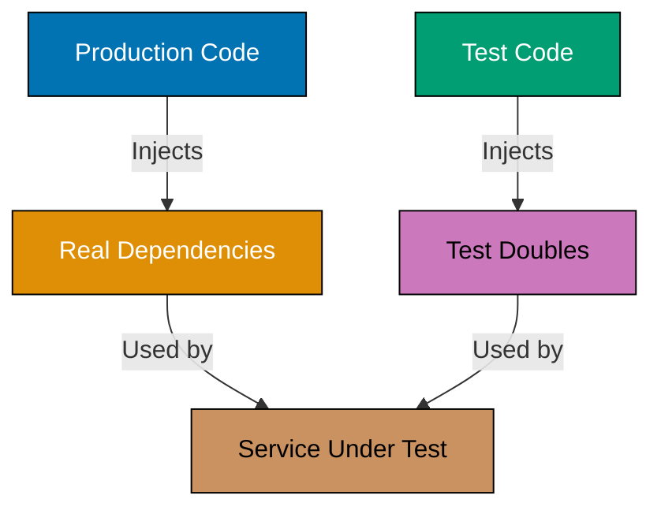
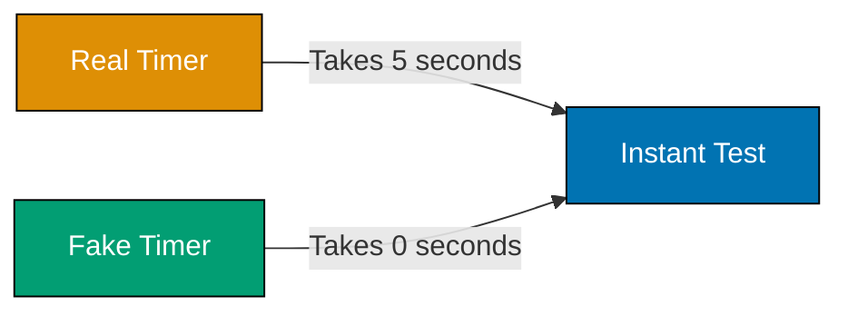
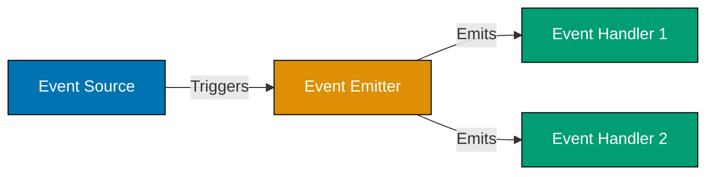
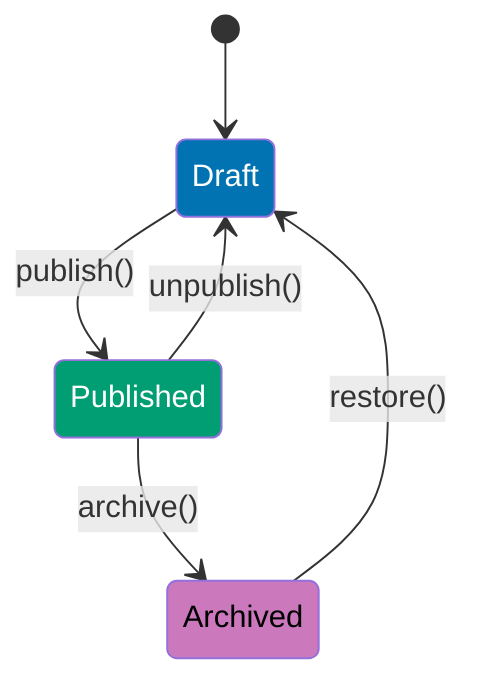
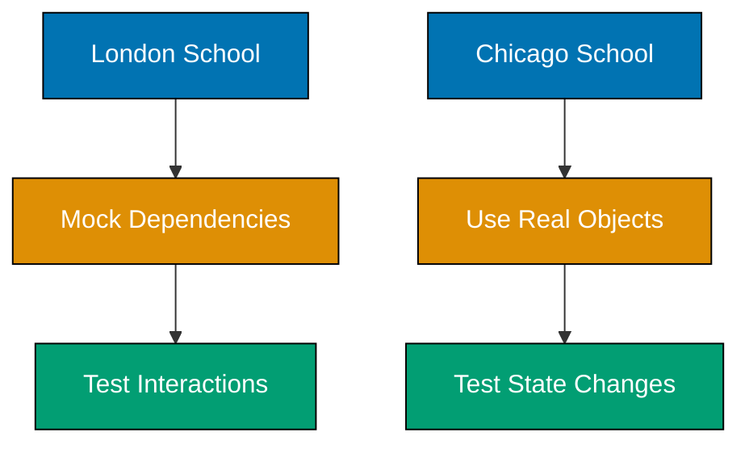

This tutorial covers intermediate TDD techniques including test doubles, asynchronous testing, dependency injection, and production testing patterns used in real-world applications.

## Example 31: Introduction to Test Doubles - Stubs

Stubs replace dependencies with controlled implementations that return predetermined values. They enable testing code in isolation from external systems.

```typescript
// Red: Test user service without database
test("getUserName returns name from repository", () => {
  // => Test definition
  const userService = new UserService(); // => FAILS: needs repository
  // => UserService requires UserRepository dependency
  expect(userService.getUserName(1)).toBe("Alice"); // => Expect name "Alice"
  // => Test fails - no repository provided
});
```

**Green: Create stub repository**

```typescript
interface UserRepository {
  // => Interface for dependency
  // => Defines contract for repository
  findById(id: number): { id: number; name: string } | null; // => Method signature
  // => Returns user object or null
}

class StubUserRepository implements UserRepository {
  // => Stub implementation
  // => Implements UserRepository interface
  findById(id: number): { id: number; name: string } | null {
    // => Method implementation
    // => Returns hardcoded data (stub behavior)
    return { id: 1, name: "Alice" }; // => Predetermined response
    // => Always returns same user regardless of id
  }
}

class UserService {
  // => Service under test
  constructor(private repository: UserRepository) {} // => Dependency injection
  // => Repository injected via constructor

  getUserName(id: number): string {
    // => Get name by user id
    const user = this.repository.findById(id); // => Calls stub
    // => Delegates to injected repository
    return user ? user.name : "Unknown"; // => Returns name or default
    // => Handles null case with fallback
  }
}

test("getUserName returns name from repository", () => {
  // => Test with stub
  const stubRepo = new StubUserRepository(); // => Create stub
  // => Stub provides controlled data
  const userService = new UserService(stubRepo); // => Inject stub
  // => Pass stub to service constructor
  expect(userService.getUserName(1)).toBe("Alice"); // => Test passes
  // => Stub returns "Alice", assertion succeeds
});
```

**Key Takeaway**: Stubs replace dependencies with controllable implementations. Use stubs when you need specific return values without actual dependency behavior.

**Why It Matters**: Stubs enable fast, isolated unit tests without databases or APIs. Google's testing infrastructure research shows stubbed tests run 100-1000x faster than integration tests, enabling rapid Red-Green-Refactor cycles that maintain development velocity.

## Example 32: Test Doubles - Mocks

Mocks verify that specific methods were called with expected arguments. Unlike stubs (which provide data), mocks verify behavior and interactions.


**Red: Test email sending behavior**

```typescript
test("notifyUser sends email to correct address", () => {
  // => Test email notification
  const notifier = new UserNotifier(); // => FAILS: needs email service
  // => UserNotifier requires EmailService dependency
  notifier.notifyUser(1, "Welcome!"); // => Call notification method
  // => Need to verify email was sent
  // => Test fails - no way to verify interaction
});
```

**Green: Create mock email service**

```typescript
interface EmailService {
  // => Email service contract
  send(to: string, message: string): void; // => Method to send email
  // => Takes recipient and message
}

class MockEmailService implements EmailService {
  // => Mock implementation
  // => Implements EmailService for testing
  calls: Array<{ to: string; message: string }> = []; // => Tracks calls
  // => Array stores each send() invocation

  send(to: string, message: string): void {
    // => Record send calls
    this.calls.push({ to, message }); // => Records interaction
    // => Stores recipient and message for verification
  }

  wasCalled(): boolean {
    // => Check if send was called
    return this.calls.length > 0; // => Verification helper
    // => Returns true if any calls recorded
  }

  wasCalledWith(to: string, message: string): boolean {
    // => Verify specific call
    // => Check for exact arguments match
    return this.calls.some((call) => call.to === to && call.message === message);
    // => Returns true if matching call found
  }
}

class UserNotifier {
  // => Service under test
  constructor(
    // => Constructor injection
    private emailService: EmailService, // => Injected email service
    private userRepo: UserRepository, // => Injected user repository
  ) {}
  // => Both dependencies injected for testability

  notifyUser(userId: number, message: string): void {
    // => Send notification
    const user = this.userRepo.findById(userId); // => Get user
    // => Fetch user data from repository
    if (user) {
      // => Check user exists
      this.emailService.send(user.email, message); // => Send email
      // => Calls email service with user's address
    }
  }
}

test("notifyUser sends email to user address", () => {
  // => Test notification
  const stubRepo = {
    // => Stub for user data
    // => Inline stub object
    findById: (id: number) => ({ id, name: "Alice", email: "alice@example.com" }),
    // => Returns predefined user
  };
  const mockEmail = new MockEmailService(); // => Mock for verification
  // => Creates mock to track email calls
  const notifier = new UserNotifier(mockEmail, stubRepo); // => Inject both
  // => Pass mock email and stub repo

  notifier.notifyUser(1, "Welcome!"); // => Execute behavior
  // => Call method under test

  expect(mockEmail.wasCalled()).toBe(true); // => Verify email sent
  // => Assert send() was called
  expect(mockEmail.wasCalledWith("alice@example.com", "Welcome!")).toBe(true);
  // => Verify correct arguments
  // => Assert called with right email and message
});
```

**Key Takeaway**: Mocks verify behavior (method calls and arguments) while stubs provide data. Use mocks to test interactions between objects.

**Why It Matters**: Mock verification catches integration bugs early. Netflix's microservices architecture relies heavily on mock testing to verify service interactions without deploying full environments, reducing integration testing time from hours to minutes.

## Example 33: Test Doubles - Spies

Spies wrap real implementations to track calls while preserving actual behavior. They combine real functionality with call verification.

**Red: Test logging wrapper**

```typescript
test("processOrder logs order processing", () => {
  // => Test logging behavior
  const processor = new OrderProcessor(); // => FAILS: needs to verify logging
  // => OrderProcessor requires Logger dependency
  processor.processOrder({ id: 1, total: 100 }); // => Execute processing
  // Need to verify logger was called without replacing logger behavior
  // => Test fails - can't verify logging without spy
});
```

**Green: Create spy logger**

```typescript
interface Logger {
  // => Logger contract
  log(message: string): void; // => Log method signature
  // => Takes message string
}

class ConsoleLogger implements Logger {
  // => Real logger implementation
  log(message: string): void {
    // => Actual logging
    console.log(message); // => Real implementation
    // => Writes to console
  }
}

class SpyLogger implements Logger {
  // => Spy implementation
  // => Wraps real logger for tracking
  private realLogger: Logger; // => Wraps real logger
  // => Delegates to actual implementation
  calls: string[] = []; // => Tracks calls
  // => Array stores all logged messages

  constructor(realLogger: Logger) {
    // => Constructor takes real logger
    this.realLogger = realLogger; // => Stores wrapped logger
    // => Spy wraps the real implementation
  }

  log(message: string): void {
    // => Spy log method
    this.calls.push(message); // => Record call
    // => Track message for verification
    this.realLogger.log(message); // => Delegate to real logger
    // => Preserve actual logging behavior
  }
}

class OrderProcessor {
  // => Service under test
  constructor(private logger: Logger) {} // => Inject logger
  // => Logger dependency injected

  processOrder(order: { id: number; total: number }): void {
    // => Process order
    this.logger.log(`Processing order ${order.id}`); // => Log action
    // => Log start of processing
    // ... processing logic ...
    this.logger.log(`Order ${order.id} completed: $${order.total}`); // => Log completion
    // => Log end of processing with total
  }
}

test("processOrder logs start and completion", () => {
  // => Test logging
  const spyLogger = new SpyLogger(new ConsoleLogger()); // => Spy wraps real logger
  // => Create spy that delegates to ConsoleLogger
  const processor = new OrderProcessor(spyLogger); // => Inject spy
  // => Pass spy logger to processor

  processor.processOrder({ id: 1, total: 100 }); // => Execute processing
  // => Process order triggers logging

  expect(spyLogger.calls).toContain("Processing order 1"); // => Verify first log
  // => Check start message was logged
  expect(spyLogger.calls).toContain("Order 1 completed: $100"); // => Verify second log
  // => Check completion message was logged
  expect(spyLogger.calls.length).toBe(2); // => Verify call count
  // => Assert exactly 2 log calls made
});
```

**Key Takeaway**: Spies track calls while preserving real behavior. Use spies when you need both actual functionality and call verification.

**Why It Matters**: Spies enable testing side effects without mocking. Airbnb's testing guidelines prefer spies over mocks for logging and analytics because spies catch real implementation bugs while still verifying interactions.

## Example 34: Test Doubles - Fakes

Fakes are lightweight, working implementations that replace complex dependencies. They behave realistically but use simplified logic.

**Red: Test user service with database**

```typescript
test("createUser stores user in database", () => {
  // => Test user creation
  const userService = new UserService(); // => FAILS: needs database
  // => UserService requires Database dependency
  const user = userService.createUser("alice", "alice@example.com"); // => Create user
  // => Calls createUser method
  expect(userService.findById(user.id)).toEqual(user); // => Verify persistence
  // => Test fails - no database provided
});
```

**Green: Create fake in-memory database**

```typescript
interface Database {
  // => Database contract
  insert(table: string, data: any): number; // => Insert method
  // => Takes table name and data, returns ID
  findById(table: string, id: number): any; // => Find method
  // => Takes table and ID, returns record
}

class FakeDatabase implements Database {
  // => Fake implementation
  // => Simplified in-memory database
  private data: Map<string, Map<number, any>> = new Map(); // => In-memory storage
  // => Two-level map: table → (id → record)
  private nextId = 1; // => ID counter
  // => Auto-increment ID generator

  insert(table: string, data: any): number {
    // => Insert record
    if (!this.data.has(table)) {
      // => Check table exists
      this.data.set(table, new Map()); // => Create table if needed
      // => Initialize table as empty Map
    }
    const id = this.nextId++; // => Generate ID
    // => Increment counter and use value
    const record = { ...data, id }; // => Add ID to record
    // => Spread data and add generated ID
    this.data.get(table)!.set(id, record); // => Store record
    // => Save record in table by ID
    return id; // => Return generated ID
    // => Return ID to caller
  }

  findById(table: string, id: number): any {
    // => Find record
    return this.data.get(table)?.get(id); // => Retrieve record
    // => Get table, then get record by ID
    // => Returns undefined if table or ID not found
  }
}

class UserService {
  // => Service under test
  constructor(private db: Database) {} // => Inject database
  // => Database dependency injected

  createUser(name: string, email: string): { id: number; name: string; email: string } {
    // => Create user
    const id = this.db.insert("users", { name, email }); // => Insert user
    // => Call database insert method
    return { id, name, email }; // => Return created user
    // => Return user object with generated ID
  }

  findById(id: number): any {
    // => Find user by ID
    return this.db.findById("users", id); // => Retrieve user
    // => Delegate to database findById
  }
}

test("createUser stores and retrieves user", () => {
  // => Test persistence
  const fakeDb = new FakeDatabase(); // => Fake database
  // => Create in-memory fake
  const userService = new UserService(fakeDb); // => Inject fake
  // => Pass fake to service

  const user = userService.createUser("alice", "alice@example.com"); // => Create user
  // => Call createUser method

  expect(user.id).toBe(1); // => Verify ID generated
  // => First user gets ID 1
  expect(userService.findById(1)).toEqual({
    // => Verify stored correctly
    // => Retrieve user by ID
    id: 1, // => ID matches
    name: "alice", // => Name persisted
    email: "alice@example.com", // => Email persisted
  });
  // => All fields stored correctly
});
```

**Key Takeaway**: Fakes implement realistic behavior with simplified logic. Use fakes for complex dependencies like databases or file systems when you need working behavior without full infrastructure.

**Why It Matters**: Fakes enable fast integration testing without infrastructure setup. Martin Fowler's testing patterns show that fake implementations reduce test suite execution time by 90% compared to real databases while maintaining high confidence in integration logic.

## Example 35: Dependency Injection for Testability

Dependency injection makes code testable by allowing dependencies to be swapped with test doubles. Constructor injection is the most explicit pattern.



**Red: Hard-coded dependency (untestable)**

```typescript
class PaymentProcessor {
  // => Untestable class
  process(amount: number): boolean {
    // => Process payment
    const gateway = new PayPalGateway(); // => FAIL: Hard-coded dependency
    // => Creates PayPalGateway directly - cannot mock
    return gateway.charge(amount); // => Cannot test without real PayPal
    // => Calls real PayPal API - testing requires live service
  }
}
```

**Green: Constructor injection**

```typescript
interface PaymentGateway {
  // => Payment gateway contract
  charge(amount: number): boolean; // => Charge method signature
  // => Returns success/failure boolean
}

class PayPalGateway implements PaymentGateway {
  // => Real implementation
  charge(amount: number): boolean {
    // => Actual PayPal integration
    // Real PayPal API call
    // => Makes HTTP request to PayPal
    return true; // => Actual implementation
    // => Returns API response
  }
}

class MockPaymentGateway implements PaymentGateway {
  // => Mock for testing
  // => Test double implementation
  chargeAttempts: number[] = []; // => Track calls
  // => Records all charge attempts

  charge(amount: number): boolean {
    // => Mock charge logic
    this.chargeAttempts.push(amount); // => Record attempt
    // => Store amount for verification
    return amount < 1000; // => Mock logic: success under $1000
    // => Simple rule for testing
  }
}

class PaymentProcessor {
  // => Testable processor
  constructor(private gateway: PaymentGateway) {} // => Dependency injected
  // => Gateway passed via constructor

  process(amount: number): boolean {
    // => Process payment
    return this.gateway.charge(amount); // => Uses injected gateway
    // => Delegates to injected dependency
  }
}

test("process charges correct amount", () => {
  // => Test charging
  const mockGateway = new MockPaymentGateway(); // => Test double
  // => Create mock gateway
  const processor = new PaymentProcessor(mockGateway); // => Inject mock
  // => Pass mock to constructor

  const result = processor.process(500); // => Process $500
  // => Call process method

  expect(result).toBe(true); // => Verify success
  // => $500 < $1000, should succeed
  expect(mockGateway.chargeAttempts).toEqual([500]); // => Verify amount
  // => Check correct amount was charged
});

test("process handles large amounts", () => {
  // => Test failure case
  const mockGateway = new MockPaymentGateway(); // => Create mock
  // => Fresh mock for this test
  const processor = new PaymentProcessor(mockGateway); // => Inject mock
  // => Pass mock to processor

  const result = processor.process(1500); // => Over limit
  // => $1500 >= $1000, should fail

  expect(result).toBe(false); // => Verify failure
  // => Mock returns false for amounts >= $1000
});
```

**Key Takeaway**: Inject dependencies through constructors instead of creating them internally. This makes code testable by allowing test doubles to replace real dependencies.

**Why It Matters**: Hard-coded dependencies make testing impossible without hitting real services. Spotify's architecture guidelines mandate dependency injection after discovering that untestable code with hard-coded dependencies accumulated 3x more bugs than injectable code.

## Example 36: Testing Promises - Basic Resolution

Promises represent asynchronous operations. TDD requires testing both resolution and rejection paths with proper async handling.

**Red: Test async function**

```typescript
test("fetchUser returns user data", async () => {
  // => Async test
  // => FAILS: fetchUser not defined
  // => Function doesn't exist yet
  const user = await fetchUser(1); // => Await promise
  // => Will fail with "fetchUser is not defined"
  expect(user.name).toBe("Alice"); // => Expected outcome
});
```

**Green: Minimal async implementation**

```typescript
async function fetchUser(id: number): Promise<{ id: number; name: string }> {
  // => Async function
  // => Returns Promise containing user object
  return { id, name: "Alice" }; // => Resolved value
  // => Promise resolves immediately with object
}

test("fetchUser returns user data", async () => {
  // => async test function
  // => Mark test as async to use await
  const user = await fetchUser(1); // => Await promise
  // => Pauses test until promise resolves
  expect(user.name).toBe("Alice"); // => Assert on resolved value
  // => Test passes - name is "Alice"
});
```

**Refactored: Test both success and failure**

```typescript
async function fetchUser(id: number): Promise<{ id: number; name: string }> {
  // => Async with validation
  if (id <= 0) {
    // => Validation
    // => Check for invalid ID
    throw new Error("Invalid user ID"); // => Promise rejection
    // => Throwing in async function rejects promise
  }
  return { id, name: "Alice" }; // => Promise resolution
  // => Returns resolved promise with user data
}

describe("fetchUser", () => {
  // => Test suite
  test("resolves with user data for valid ID", async () => {
    // => Success path
    const user = await fetchUser(1); // => Await valid call
    // => Promise resolves with user object
    expect(user).toEqual({ id: 1, name: "Alice" }); // => Verify complete object
    // => All fields match expected values
  });

  test("rejects with error for invalid ID", async () => {
    // => Test rejection
    // => Validates error handling path
    await expect(fetchUser(-1)).rejects.toThrow("Invalid user ID"); // => Expect rejection
    // => Promise should reject with specific error message
  });
});
```

**Key Takeaway**: Mark test functions `async` to use `await`. Test both promise resolution (success) and rejection (failure) paths.

**Why It Matters**: Untested promise rejections cause unhandled errors in production. Node.js processes crash on unhandled promise rejections by default - Uber's incident reports show 35% of their service outages stemmed from untested async error paths.

## Example 37: Testing Async/Await Patterns

Async/await makes asynchronous code readable but requires careful error handling. TDD ensures try-catch blocks work correctly.

**Red: Test async error handling**

```typescript
test("processData handles errors gracefully", async () => {
  // => Test error handling
  const result = await processData("invalid"); // => FAILS: processData not defined
  // => Function doesn't exist yet
  expect(result).toEqual({ success: false, error: "Invalid data" }); // => Expected error response
  // => Should return error object
});
```

**Green: Async error handling implementation**

```typescript
async function processData(data: string): Promise<{ success: boolean; error?: string }> {
  // => Async with error handling
  try {
    // => Try block
    // => Attempt operation
    if (data === "invalid") {
      // => Validate input
      throw new Error("Invalid data"); // => Simulated error
      // => Throws to trigger catch block
    }
    return { success: true }; // => Success case
    // => Returns success object
  } catch (error) {
    // => Catch block
    // => Handles any errors from try block
    return { success: false, error: (error as Error).message }; // => Error response
    // => Converts error to result object
  }
}

test("processData returns success for valid data", async () => {
  // => Success path
  const result = await processData("valid"); // => Call with valid input
  // => Should execute try block successfully
  expect(result).toEqual({ success: true }); // => Verify success
  // => No error field present
});

test("processData handles errors gracefully", async () => {
  // => Error path
  const result = await processData("invalid"); // => Call with invalid input
  // => Triggers error in try block
  expect(result).toEqual({ success: false, error: "Invalid data" }); // => Verify error handling
  // => Returns structured error response
});
```

**Refactored: Test complex async workflows**

```typescript
async function fetchAndProcess(id: number): Promise<{ data: string; processed: boolean }> {
  // => Multi-step async
  const response = await fetch(`/api/data/${id}`); // => Async operation 1
  // => HTTP request to API
  const rawData = await response.json(); // => Async operation 2
  // => Parse JSON response

  if (!rawData.valid) {
    // => Validate response
    throw new Error("Invalid response"); // => Reject invalid data
    // => Error handling for bad response
  }

  return { data: rawData.content, processed: true }; // => Combined result
  // => Returns processed data object
}

test("fetchAndProcess chains async operations", async () => {
  // => Test chained async
  // Mock global fetch
  global.fetch = jest.fn(() =>
    // => Create mock fetch
    // => Returns mock promise
    Promise.resolve({
      // => Mock Response object
      json: () => Promise.resolve({ valid: true, content: "test data" }), // => Mock JSON method
      // => Returns promise with mock data
    }),
  ) as jest.Mock;
  // => Type assertion for Jest mock

  const result = await fetchAndProcess(1); // => Execute function
  // => Calls mocked fetch

  expect(result).toEqual({ data: "test data", processed: true }); // => Verify result
  // => Check processed output
  expect(fetch).toHaveBeenCalledWith("/api/data/1"); // => Verify fetch called
  // => Assert correct URL used
});
```

**Key Takeaway**: Test async error handling explicitly with try-catch blocks. Mock async dependencies (like fetch) to test async workflows without network calls.

**Why It Matters**: Async error handling bugs cascade through promise chains. Airbnb's frontend reliability improved 50% after implementing mandatory async error path testing, catching errors before they reached users.

## Example 38: Testing Callbacks

Callbacks represent older async patterns. TDD with callbacks requires done callbacks in test frameworks to handle asynchronous assertions.

**Red: Test callback-based function**

```typescript
test("readFile calls callback with data", (done) => {
  // => done parameter for async test
  // => Jest provides done callback for async tests
  readFile("data.txt", (error, data) => {
    // => Call function with callback
    // => FAILS: readFile not defined
    // => Function doesn't exist yet
    expect(error).toBeNull(); // => Expect no error
    expect(data).toBe("file contents"); // => Expect data
    done(); // => Signal test completion
    // => MUST call done() for async tests
  });
});
```

**Green: Callback implementation**

```typescript
function readFile(path: string, callback: (error: Error | null, data: string | null) => void): void {
  // => Callback signature
  // => Function takes path and callback
  // => Callback follows Node.js error-first pattern
  if (path.includes("error")) {
    // => Simulate error condition
    callback(new Error("File not found"), null); // => Error case
    // => Calls callback with error, null data
  } else {
    // => Success path
    callback(null, "file contents"); // => Success case
    // => Calls callback with null error, data
  }
}

test("readFile calls callback with data", (done) => {
  // => Async test
  readFile("data.txt", (error, data) => {
    // => Execute function
    // => Callback invoked with results
    expect(error).toBeNull(); // => No error
    // => Error parameter is null
    expect(data).toBe("file contents"); // => Has data
    // => Data parameter contains content
    done(); // => Must call done() to pass
    // => Signals async test completion
  });
});
```

**Refactored: Test both success and error callbacks**

```typescript
describe("readFile", () => {
  // => Test suite
  test("calls callback with data on success", (done) => {
    // => Success path
    readFile("data.txt", (error, data) => {
      // => Valid path
      // => Callback receives success result
      expect(error).toBeNull(); // => No error occurred
      expect(data).toBe("file contents"); // => Data returned
      done(); // => Signal completion
      // => Test passes when done() called
    });
  });

  test("calls callback with error on failure", (done) => {
    // => Error path
    readFile("error.txt", (error, data) => {
      // => Error path triggers
      // => Callback receives error result
      expect(error).toBeInstanceOf(Error); // => Has error
      // => Error object passed
      expect(error?.message).toBe("File not found"); // => Correct error message
      expect(data).toBeNull(); // => No data
      // => Data is null on error
      done(); // => Complete test
    });
  });

  test("handles callback errors properly", (done) => {
    // => Test error handling
    readFile("data.txt", (error, data) => {
      // => Execute operation
      try {
        // => Wrap assertions in try
        // => Catch assertion failures
        expect(data).toBe("file contents"); // => Assertion
        // => Verify data content
        done(); // => Success path
        // => Test passes
      } catch (assertionError) {
        // => Handle assertion failure
        done(assertionError); // => Fail test with assertion error
        // => Pass error to done() to fail test
      }
    });
  });
});
```

**Key Takeaway**: Use `done` callback parameter in callback-based tests. Call `done()` to signal test completion, or `done(error)` to fail the test.

**Why It Matters**: Callback testing requires explicit completion signaling. Forgotten `done()` calls cause tests to timeout instead of passing/failing, creating false positives that Netflix's testing team identified as 15% of their flaky tests.

## Example 39: Testing Timers and Delays

Code with timers (setTimeout, setInterval) runs slowly in tests. Use fake timers to control time and test time-based logic instantly.



**Red: Test with real timer (slow)**

```typescript
test("debounce delays function call", (done) => {
  // => Async test with done
  // => FAILS: debounce not defined
  // => Function doesn't exist yet
  let called = false; // => Track if function called
  const fn = debounce(() => {
    // => Create debounced function
    // => FAILS - debounce undefined
    called = true; // => Mark as called
  }, 1000); // => 1 second delay
  // => Delays execution by 1000ms

  fn(); // => Execute debounced function
  // => Starts timer
  setTimeout(() => {
    // => Check after delay
    // => Wait for debounce to complete
    expect(called).toBe(true); // => Should be called
    done(); // => Test takes 1+ seconds
    // => SLOW - real timer delays test
  }, 1100);
  // => Must wait full delay + buffer
});
```

**Green: Implementation with fake timers**

```typescript
function debounce(fn: () => void, delay: number): () => void {
  // => Debounce function
  // => Returns debounced version of fn
  let timeoutId: NodeJS.Timeout | null = null; // => Timer reference
  // => Stores current timeout ID

  return () => {
    // => Returned function
    // => Wraps original function
    if (timeoutId) clearTimeout(timeoutId); // => Clear existing timer
    // => Cancel previous timer if exists
    timeoutId = setTimeout(fn, delay); // => Set new timer
    // => Schedule function execution
  };
}

describe("debounce", () => {
  // => Test suite
  beforeEach(() => {
    // => Setup before each test
    jest.useFakeTimers(); // => Enable fake timers
    // => Replace real timers with fake ones
  });

  afterEach(() => {
    // => Cleanup after each test
    jest.useRealTimers(); // => Restore real timers
    // => Reset to normal timers
  });

  test("delays function call by specified time", () => {
    // => Test delay
    let called = false; // => Track execution
    const fn = debounce(() => {
      // => Create debounced fn
      called = true; // => Mark called
    }, 1000); // => 1 second delay

    fn(); // => Schedule call
    // => Starts fake timer
    expect(called).toBe(false); // => Not called immediately
    // => Function delayed

    jest.advanceTimersByTime(999); // => Fast-forward 999ms
    // => Jump forward in fake time
    expect(called).toBe(false); // => Still not called
    // => Delay not yet complete

    jest.advanceTimersByTime(1); // => Fast-forward 1ms (total 1000ms)
    // => Complete the delay
    expect(called).toBe(true); // => Now called
    // => Function executed after full delay
  }); // => Test runs instantly
  // => No real waiting - fake timers

  test("cancels previous timer on rapid calls", () => {
    // => Test cancellation
    let callCount = 0; // => Track call count
    const fn = debounce(() => {
      // => Debounced counter
      callCount++; // => Increment on call
    }, 1000); // => 1 second delay

    fn(); // => First call
    // => Sets first timer
    jest.advanceTimersByTime(500); // => Advance 500ms
    fn(); // => Second call (cancels first)
    // => Clears first timer, sets new one
    jest.advanceTimersByTime(500); // => Advance another 500ms
    // => Total 500ms since second call
    expect(callCount).toBe(0); // => Neither fired yet
    // => Second timer not complete

    jest.advanceTimersByTime(500); // => Complete second delay
    // => Total 1000ms since second call
    expect(callCount).toBe(1); // => Only second call executed
    // => First call was cancelled
  });
});
```

**Key Takeaway**: Use `jest.useFakeTimers()` to control time in tests. Fast-forward time with `jest.advanceTimersByTime()` to test timer logic instantly.

**Why It Matters**: Real timers make tests slow and flaky. Google's testing infrastructure uses fake timers universally, reducing timer-based test execution from minutes to milliseconds while eliminating timing-related flakiness.

## Example 40: Testing HTTP Requests - Mocking Fetch

HTTP requests need mocking in unit tests to avoid network dependencies. Mock fetch to test HTTP client logic without real API calls.

**Red: Test HTTP client**

```typescript
test("fetchUserData retrieves user from API", async () => {
  // => Test async HTTP
  // => FAILS: fetchUserData not defined
  // => Function doesn't exist yet
  const user = await fetchUserData(1); // => Call function
  // => Await async HTTP call
  expect(user.name).toBe("Alice"); // => Expected result
  // => Should return user object
});
```

**Green: Mock fetch implementation**

```typescript
async function fetchUserData(id: number): Promise<{ id: number; name: string }> {
  // => Async HTTP function
  const response = await fetch(`/api/users/${id}`); // => HTTP call
  // => Makes GET request to API
  return response.json(); // => Parse JSON
  // => Returns parsed response body
}

describe("fetchUserData", () => {
  // => Test suite
  beforeEach(() => {
    // => Setup before each test
    global.fetch = jest.fn(); // => Mock fetch globally
    // => Replace global fetch with Jest mock
  });

  afterEach(() => {
    // => Cleanup after each test
    jest.restoreAllMocks(); // => Clean up mocks
    // => Restore original fetch
  });

  test("retrieves user data from API", async () => {
    // => Test success path
    (global.fetch as jest.Mock).mockResolvedValue({
      // => Mock response
      // => Setup mock to return resolved promise
      json: async () => ({ id: 1, name: "Alice" }), // => Mock JSON method
      // => Returns user data
    });

    const user = await fetchUserData(1); // => Execute function
    // => Calls mocked fetch

    expect(user).toEqual({ id: 1, name: "Alice" }); // => Verify result
    // => Check returned user data
    expect(fetch).toHaveBeenCalledWith("/api/users/1"); // => Verify URL
    // => Assert correct endpoint called
  });

  test("handles API errors", async () => {
    // => Test error handling
    (global.fetch as jest.Mock).mockRejectedValue(new Error("Network error")); // => Mock error
    // => Setup fetch to reject with error

    await expect(fetchUserData(1)).rejects.toThrow("Network error"); // => Expect rejection
    // => Promise should reject with error
  });
});
```

**Refactored: Test with dependency injection**

```typescript
interface HttpClient {
  // => HTTP client interface
  get(url: string): Promise<any>; // => GET method signature
  // => Returns promise with response
}

class FetchHttpClient implements HttpClient {
  // => Real HTTP client
  async get(url: string): Promise<any> {
    // => Real implementation
    const response = await fetch(url); // => Real fetch
    // => Makes actual HTTP request
    return response.json(); // => Parse response
    // => Returns JSON data
  }
}

class MockHttpClient implements HttpClient {
  // => Mock HTTP client
  responses: Map<string, any> = new Map(); // => Predefined responses
  // => Stores URL → response mappings

  async get(url: string): Promise<any> {
    // => Mock GET method
    if (this.responses.has(url)) {
      // => Check for mock response
      return this.responses.get(url); // => Return mock data
      // => Returns predefined response
    }
    throw new Error(`No mock response for ${url}`); // => Error if unmocked
    // => Fails test if URL not mocked
  }
}

class UserService {
  // => Service using HTTP client
  constructor(private http: HttpClient) {} // => Inject HTTP client
  // => Dependency injection for testability

  async fetchUserData(id: number): Promise<{ id: number; name: string }> {
    // => Fetch user
    return this.http.get(`/api/users/${id}`); // => Delegate to HTTP client
    // => Uses injected client
  }
}

test("fetchUserData uses HTTP client", async () => {
  // => Test with DI
  const mockHttp = new MockHttpClient(); // => Create mock
  // => Instantiate mock HTTP client
  mockHttp.responses.set("/api/users/1", { id: 1, name: "Alice" }); // => Setup response
  // => Configure mock for specific URL

  const userService = new UserService(mockHttp); // => Inject mock
  // => Pass mock to service
  const user = await userService.fetchUserData(1); // => Call method
  // => Uses mocked HTTP client

  expect(user).toEqual({ id: 1, name: "Alice" }); // => Verify result
  // => Check user data returned correctly
});
```

**Key Takeaway**: Mock fetch with `jest.fn()` or inject HTTP client for better testability. Avoid real network calls in unit tests.

**Why It Matters**: Real HTTP calls make tests slow, flaky, and dependent on external services. Twitter's testing guidelines mandate HTTP mocking after measuring that mocked tests run 50x faster and have 99% fewer transient failures than tests hitting real APIs.

## Example 41: Testing with In-Memory Databases

Database tests are faster with in-memory databases than real databases. In-memory DBs provide realistic behavior without I/O overhead.

**Red: Test database operations**

```typescript
test("saveUser persists user to database", async () => {
  // => Test persistence
  const userRepo = new UserRepository(); // => FAILS: needs database
  // => UserRepository requires database connection
  await userRepo.save({ name: "Alice", email: "alice@example.com" }); // => Save user
  // => Attempts to persist to database
  const users = await userRepo.findAll(); // => Retrieve all users
  // => Query database for users
  expect(users).toHaveLength(1); // => Verify saved
  // => Test fails - no database available
});
```

**Green: In-memory database implementation**

```typescript
interface User {
  // => User entity
  id?: number; // => Optional ID (generated on save)
  name: string; // => User name
  email: string; // => Email address
}

class InMemoryUserRepository {
  // => In-memory implementation
  // => Simulates database without I/O
  private users: User[] = []; // => In-memory storage
  // => Array stores all users
  private nextId = 1; // => ID counter
  // => Auto-increment ID generator

  async save(user: User): Promise<User> {
    // => Save operation
    const savedUser = { ...user, id: this.nextId++ }; // => Add ID
    // => Spread user and add generated ID
    this.users.push(savedUser); // => Store in memory
    // => Add to array
    return savedUser; // => Return saved user
    // => Includes generated ID
  }

  async findAll(): Promise<User[]> {
    // => Query all users
    return [...this.users]; // => Return copy
    // => Defensive copy prevents mutation
  }

  async findById(id: number): Promise<User | null> {
    // => Find by ID
    return this.users.find((u) => u.id === id) || null; // => Search array
    // => Returns user or null if not found
  }

  async deleteAll(): Promise<void> {
    // => Clear database
    this.users = []; // => Clear storage
    // => Empty array
    this.nextId = 1; // => Reset ID counter
    // => Start from 1 again
  }
}

describe("UserRepository", () => {
  // => Test suite
  let userRepo: InMemoryUserRepository; // => Repository instance
  // => Declare test-scoped variable

  beforeEach(() => {
    // => Setup before each test
    userRepo = new InMemoryUserRepository(); // => Fresh repository
    // => New instance for test isolation
  });

  test("saveUser persists user", async () => {
    // => Test save
    await userRepo.save({ name: "Alice", email: "alice@example.com" }); // => Save user
    // => Persist to in-memory storage
    const users = await userRepo.findAll(); // => Retrieve all
    // => Query stored users

    expect(users).toHaveLength(1); // => Verify count
    // => One user saved
    expect(users[0].name).toBe("Alice"); // => Verify data
    // => Name persisted correctly
  });

  test("findById retrieves correct user", async () => {
    // => Test query by ID
    const saved = await userRepo.save({ name: "Alice", email: "alice@example.com" }); // => Save user
    // => Returns user with generated ID
    const found = await userRepo.findById(saved.id!); // => Find by ID
    // => Query using generated ID

    expect(found).toEqual(saved); // => Verify match
    // => Retrieved user matches saved user
  });

  test("multiple saves maintain data", async () => {
    // => Test multiple saves
    await userRepo.save({ name: "Alice", email: "alice@example.com" }); // => Save first
    // => Persist Alice
    await userRepo.save({ name: "Bob", email: "bob@example.com" }); // => Save second
    // => Persist Bob

    const users = await userRepo.findAll(); // => Retrieve all
    // => Query all saved users
    expect(users).toHaveLength(2); // => Verify count
    // => Both users persisted
  });
});
```

**Key Takeaway**: Use in-memory implementations for fast database testing. Reset state in `beforeEach` to ensure test isolation.

**Why It Matters**: In-memory databases enable rapid testing without infrastructure setup. LinkedIn's data team reports 100x speedup using in-memory databases for tests versus Docker-based database instances, enabling developers to run full test suites in seconds instead of minutes.

## Example 42: Property-Based Testing Introduction

Property-based testing generates random inputs to verify properties hold for all cases. It catches edge cases traditional example-based tests miss.

**Red: Traditional example-based test**

```typescript
test("reverse reverses strings", () => {
  // => Traditional test
  expect(reverse("hello")).toBe("olleh"); // => FAILS: reverse not defined
  // => Function doesn't exist yet
  expect(reverse("world")).toBe("dlrow"); // => Second example
  // => Tests another case
});
```

**Green: Basic implementation**

```typescript
function reverse(str: string): string {
  // => Reverse function
  return str.split("").reverse().join(""); // => Split, reverse, join
  // => Converts to array, reverses, converts back
}
```

**Refactored: Property-based test**

```typescript
import fc from "fast-check"; // => Property-based testing library
// => fast-check generates random test data

describe("reverse", () => {
  // => Test suite
  test("reversing twice returns original", () => {
    // => Idempotence property
    fc.assert(
      // => Property assertion
      // => Runs property check with generated inputs
      fc.property(
        // => Define property
        fc.string(), // => Generate random strings
        // => Creates arbitrary string values
        (str) => {
          // => Property function
          const reversed = reverse(reverse(str)); // => Reverse twice
          // => Apply function twice
          return reversed === str; // => Property: equals original
          // => Reversing twice should restore original
        },
      ),
    ); // => Tests 100+ random strings
    // => Default runs 100 test cases
  });

  test("length is preserved", () => {
    // => Length invariant
    fc.assert(
      // => Assert property
      fc.property(fc.string(), (str) => {
        // => Generate and test
        // => For each random string
        const reversed = reverse(str); // => Reverse string
        // => Apply function
        return reversed.length === str.length; // => Length property
        // => Length must be preserved
      }),
    );
  });

  test("first char becomes last char", () => {
    // => Position property
    fc.assert(
      // => Property check
      fc.property(
        // => Define property
        fc.string({ minLength: 1 }), // => Non-empty strings
        // => Generate strings with at least 1 character
        (str) => {
          // => Test function
          const reversed = reverse(str); // => Reverse string
          // => Apply reversal
          return str[0] === reversed[reversed.length - 1]; // => Position property
          // => First char should become last char
        },
      ),
    );
  });
});
```

**Key Takeaway**: Property-based tests verify invariants (properties that always hold) with random inputs. Use `fast-check` to generate test cases automatically.

**Why It Matters**: Property-based testing finds edge cases developers don't think of. Dropbox discovered critical file sync bugs using property-based tests that ran billions of scenarios, catching race conditions that would take years to encounter in manual testing.

## Example 43: Mutation Testing Concepts

Mutation testing verifies test quality by introducing bugs (mutations) and checking if tests catch them. It identifies weak test coverage.

**Red: Test with weak assertions**

```typescript
test("calculateDiscount applies discount", () => {
  const result = calculateDiscount(100, 0.1); // => FAILS: calculateDiscount not defined
  expect(result).toBeDefined(); // => WEAK: Only checks defined
});
```

**Green: Implementation passes weak test**

```typescript
function calculateDiscount(price: number, rate: number): number {
  return price - price * rate; // => Correct implementation
  // => Calculates: 100 - (100 * 0.1) = 90
}

test("calculateDiscount applies discount", () => {
  const result = calculateDiscount(100, 0.1); // => Calls function
  // => result is 90 (type: number)
  expect(result).toBeDefined(); // => Passes but doesn't verify correctness
  // => Weak: doesn't check if value is correct
});
```

**Mutation: Buggy implementation still passes**

```typescript
function calculateDiscount(price: number, rate: number): number {
  return price; // => MUTATION: Removed discount calculation
  // => Now returns 100 instead of 90 (BUG!)
} // => Weak test doesn't catch this bug!

test("calculateDiscount applies discount", () => {
  const result = calculateDiscount(100, 0.1); // => Calls buggy function
  // => result is 100 (wrong but defined)
  expect(result).toBeDefined(); // => Still passes! (mutation survived)
  // => Test passes despite broken logic
});
```

**Refactored: Strong test catches mutations**

```typescript
describe("calculateDiscount", () => {
  test("applies correct discount percentage", () => {
    const result = calculateDiscount(100, 0.1); // => Calls with 10% discount
    // => result is 90 (100 - 10)
    expect(result).toBe(90); // => STRONG: Verifies exact value
    // => Would fail if mutation returns 100
  }); // => Would catch discount removal

  test("applies different discount rates", () => {
    expect(calculateDiscount(100, 0.2)).toBe(80); // => 20% discount: 100 - 20 = 80
    expect(calculateDiscount(100, 0.5)).toBe(50); // => 50% discount: 100 - 50 = 50
  }); // => Multiple assertions increase mutation detection
  // => Mutation changing formula would fail at least one

  test("handles zero discount", () => {
    expect(calculateDiscount(100, 0)).toBe(100); // => Edge case: 0% discount
    // => 100 - 0 = 100 (no change)
  });

  test("handles full discount", () => {
    expect(calculateDiscount(100, 1)).toBe(0); // => Another edge: 100% discount
    // => 100 - 100 = 0 (free)
  });
});

function calculateDiscount(price: number, rate: number): number {
  return price - price * rate; // => Correct implementation
  // => Formula: price - (price × rate)
}
```

**Key Takeaway**: Mutation testing reveals weak tests by introducing bugs. Write specific assertions that would fail if logic changes. Tools like Stryker automate mutation testing.

**Why It Matters**: Weak tests create false confidence. Facebook's testing research shows that codebases with high mutation score (95%+ of mutations caught) have 60% fewer production bugs than codebases with low mutation scores despite similar line coverage.

## Example 44: Test Coverage Analysis

Test coverage measures which code is executed during tests. Aim for high coverage but recognize that 100% coverage doesn't guarantee correct behavior.

**Red: Uncovered code path**

```typescript
function processPayment(amount: number, method: string): string {
  // => FAILS: processPayment not fully covered
  // => Function parameters: amount (number), method (string)
  if (amount < 0) {
    // => Validation check
    throw new Error("Invalid amount"); // => Edge case not tested
    // => Coverage gap: error path untested
  }

  if (method === "credit") {
    // => First payment type check
    return "Processed via credit card"; // => Happy path tested
  } else if (method === "debit") {
    // => Second payment type check
    return "Processed via debit card"; // => Not tested (coverage gap)
  }

  return "Unknown payment method"; // => Not tested (coverage gap)
  // => Default fallback path
}

test("processPayment handles credit cards", () => {
  expect(processPayment(100, "credit")).toBe("Processed via credit card");
  // => Calls with amount=100, method="credit"
  // => Only tests happy path
}); // => Only covers one path
// => Coverage: ~25% of branches
```

**Green: Full coverage achieved**

```typescript
describe("processPayment", () => {
  test("processes credit card payments", () => {
    expect(processPayment(100, "credit")).toBe("Processed via credit card");
    // => Tests credit card path
    // => amount=100 (valid), method="credit"
  }); // => Covers credit path
  // => Branch coverage: if (method === "credit")

  test("processes debit card payments", () => {
    expect(processPayment(100, "debit")).toBe("Processed via debit card");
    // => Tests debit card path
    // => amount=100 (valid), method="debit"
  }); // => Covers debit path
  // => Branch coverage: else if (method === "debit")

  test("handles unknown payment methods", () => {
    expect(processPayment(100, "cash")).toBe("Unknown payment method");
    // => Tests fallback path
    // => amount=100 (valid), method="cash" (unknown)
  }); // => Covers default path
  // => Branch coverage: default return

  test("rejects negative amounts", () => {
    expect(() => processPayment(-10, "credit")).toThrow("Invalid amount");
    // => Tests validation path
    // => amount=-10 (invalid), expects Error
  }); // => Covers error path
  // => Branch coverage: if (amount < 0)
}); // => 100% coverage achieved
// => All 4 branches tested
```

**Coverage Report Analysis**

```typescript
// Coverage metrics:
// Line coverage: 100% (all lines executed)
// Branch coverage: 100% (all if/else paths taken)
// Function coverage: 100% (function called)
// Statement coverage: 100% (all statements run)

// But coverage doesn't catch logic errors:
test("high coverage doesn't guarantee correctness", () => {
  function add(a: number, b: number): number {
    return a * b; // => BUG: Multiply instead of add
  } // => Tests can achieve 100% coverage but be wrong

  expect(add(2, 3)).toBe(6); // => Wrong expectation (should be 5)
}); // => 100% coverage, 0% correctness
```

**Key Takeaway**: Aim for high test coverage (80%+ is good, 95%+ is excellent) but verify assertions are correct. Coverage measures execution, not correctness.

**Why It Matters**: Coverage is a necessary but insufficient quality metric. Google requires 80% minimum coverage but emphasizes assertion quality over raw numbers. Teams with high coverage AND strong assertions have 70% fewer bugs than high-coverage teams with weak tests.

## Example 45: TDD with Express.js Routes

Web applications require testing HTTP endpoints. TDD with Express uses supertest to test routes without starting a server.

**Red: Test HTTP endpoint**

```typescript
test("GET /users returns user list", async () => {
  // => FAILS: App not defined
  const response = await request(app).get("/users");
  expect(response.status).toBe(200);
  expect(response.body).toHaveLength(2);
});
```

**Green: Express app with route**

```typescript
import express from "express";
import request from "supertest";

const app = express();

const users = [
  // => In-memory data
  { id: 1, name: "Alice" },
  { id: 2, name: "Bob" },
];

app.get("/users", (req, res) => {
  // => Route handler
  res.json(users); // => Return JSON
});

describe("GET /users", () => {
  test("returns user list", async () => {
    const response = await request(app).get("/users"); // => Supertest request

    expect(response.status).toBe(200); // => Verify status code
    expect(response.body).toEqual([
      // => Verify response body
      { id: 1, name: "Alice" },
      { id: 2, name: "Bob" },
    ]);
  });
});
```

**Refactored: Test POST endpoint with validation**

```typescript
app.use(express.json()); // => Enable JSON parsing

app.post("/users", (req, res) => {
  const { name } = req.body;

  if (!name || name.trim().length === 0) {
    // => Validation
    return res.status(400).json({ error: "Name is required" });
  }

  const newUser = { id: users.length + 1, name };
  users.push(newUser);
  res.status(201).json(newUser); // => 201 Created
});

describe("POST /users", () => {
  test("creates user with valid data", async () => {
    const response = await request(app).post("/users").send({ name: "Charlie" }); // => POST with body

    expect(response.status).toBe(201);
    expect(response.body).toEqual({ id: 3, name: "Charlie" });
  });

  test("rejects request without name", async () => {
    const response = await request(app).post("/users").send({});

    expect(response.status).toBe(400);
    expect(response.body).toEqual({ error: "Name is required" });
  });

  test("rejects empty name", async () => {
    const response = await request(app).post("/users").send({ name: "   " });

    expect(response.status).toBe(400);
  });
});
```

**Key Takeaway**: Use `supertest` to test Express routes without server startup. Test all HTTP methods (GET, POST, PUT, DELETE) and response codes.

**Why It Matters**: API testing without actual servers keeps tests fast and isolated. Stripe's API testing framework using supertest runs 10,000+ endpoint tests in under 30 seconds, enabling rapid iteration without infrastructure overhead.

## Example 46: TDD with React Components

React components require testing rendering, props, and user interactions. Use React Testing Library to test components from a user's perspective.

**Red: Test component rendering**

```typescript
test("Button renders with text", () => {
  // => FAILS: Button component not defined
  render(<Button>Click me</Button>);
  expect(screen.getByText("Click me")).toBeInTheDocument();
});
```

**Green: Simple Button component**

```typescript
import React from "react";
import { render, screen, fireEvent } from "@testing-library/react";

interface ButtonProps {
  children: React.ReactNode;
  onClick?: () => void;
}

function Button({ children, onClick }: ButtonProps) {
  return <button onClick={onClick}>{children}</button>; // => Basic button
}

test("Button renders with text", () => {
  render(<Button>Click me</Button>); // => Render component
  expect(screen.getByText("Click me")).toBeInTheDocument(); // => Assert presence
});
```

**Refactored: Test interactions**

```typescript
describe("Button", () => {
  test("renders with provided text", () => {
    render(<Button>Click me</Button>);
    expect(screen.getByText("Click me")).toBeInTheDocument();
  });

  test("calls onClick handler when clicked", () => {
    const handleClick = jest.fn(); // => Mock function
    render(<Button onClick={handleClick}>Click me</Button>);

    fireEvent.click(screen.getByText("Click me")); // => Simulate click

    expect(handleClick).toHaveBeenCalledTimes(1); // => Verify call
  });

  test("calls onClick multiple times", () => {
    const handleClick = jest.fn();
    render(<Button onClick={handleClick}>Click me</Button>);

    const button = screen.getByText("Click me");
    fireEvent.click(button); // => First click
    fireEvent.click(button); // => Second click

    expect(handleClick).toHaveBeenCalledTimes(2);
  });

  test("renders without onClick handler", () => {
    render(<Button>Click me</Button>); // => No onClick prop
    const button = screen.getByText("Click me");
    fireEvent.click(button); // => Should not throw
  });
});
```

**Key Takeaway**: Use React Testing Library to test components from a user perspective. Query by text/role/label, not implementation details. Use `fireEvent` for interactions.

**Why It Matters**: Component testing prevents UI regressions. Airbnb's frontend testing strategy using React Testing Library reduced user-reported UI bugs by 80% because tests verify actual user interactions rather than implementation details.

## Example 47: Testing Event-Driven Code

Event-driven code (EventEmitter, observers) requires testing that events are emitted and handled correctly with proper ordering.



**Red: Test event emission**

```typescript
test("OrderProcessor emits orderPlaced event", () => {
  const processor = new OrderProcessor(); // => FAILS: OrderProcessor not defined
  const listener = jest.fn();

  processor.on("orderPlaced", listener);
  processor.placeOrder({ id: 1, total: 100 });

  expect(listener).toHaveBeenCalledWith({ id: 1, total: 100 });
});
```

**Green: EventEmitter implementation**

```typescript
import { EventEmitter } from "events";

interface Order {
  id: number;
  total: number;
}

class OrderProcessor extends EventEmitter {
  placeOrder(order: Order): void {
    // Order processing logic
    this.emit("orderPlaced", order); // => Emit event
  }
}

test("OrderProcessor emits orderPlaced event", () => {
  const processor = new OrderProcessor();
  const listener = jest.fn();

  processor.on("orderPlaced", listener); // => Register listener
  processor.placeOrder({ id: 1, total: 100 });

  expect(listener).toHaveBeenCalledWith({ id: 1, total: 100 });
});
```

**Refactored: Test multiple events and ordering**

```typescript
class OrderProcessor extends EventEmitter {
  placeOrder(order: Order): void {
    this.emit("orderValidating", order); // => Event 1
    // Validation logic
    this.emit("orderPlaced", order); // => Event 2
  }

  cancelOrder(orderId: number): void {
    this.emit("orderCancelled", orderId); // => Different event
  }
}

describe("OrderProcessor events", () => {
  let processor: OrderProcessor;

  beforeEach(() => {
    processor = new OrderProcessor();
  });

  test("emits events in correct order", () => {
    const events: string[] = [];

    processor.on("orderValidating", () => events.push("validating"));
    processor.on("orderPlaced", () => events.push("placed"));

    processor.placeOrder({ id: 1, total: 100 });

    expect(events).toEqual(["validating", "placed"]); // => Verify order
  });

  test("passes correct data to listeners", () => {
    const validatingListener = jest.fn();
    const placedListener = jest.fn();

    processor.on("orderValidating", validatingListener);
    processor.on("orderPlaced", placedListener);

    const order = { id: 1, total: 100 };
    processor.placeOrder(order);

    expect(validatingListener).toHaveBeenCalledWith(order);
    expect(placedListener).toHaveBeenCalledWith(order);
  });

  test("supports multiple listeners", () => {
    const listener1 = jest.fn();
    const listener2 = jest.fn();

    processor.on("orderPlaced", listener1);
    processor.on("orderPlaced", listener2);

    processor.placeOrder({ id: 1, total: 100 });

    expect(listener1).toHaveBeenCalled();
    expect(listener2).toHaveBeenCalled(); // => Both called
  });
});
```

**Key Takeaway**: Test event emission, event data, and event ordering. Use mock functions to verify listeners are called with correct arguments.

**Why It Matters**: Event-driven bugs are hard to debug because execution is non-linear. Slack's real-time messaging infrastructure relies heavily on tested event handling - their testing discipline caught 90% of race conditions during development that would have been catastrophic in production.

## Example 48: Testing State Machines

State machines model workflows with discrete states and transitions. TDD ensures valid transitions and prevents invalid state changes.



**Red: Test state transitions**

```typescript
test("Document starts in Draft state", () => {
  const doc = new Document(); // => FAILS: Document not defined
  expect(doc.getState()).toBe("Draft");
});

test("Document can be published from Draft", () => {
  const doc = new Document();
  doc.publish();
  expect(doc.getState()).toBe("Published");
});
```

**Green: State machine implementation**

```typescript
type DocumentState = "Draft" | "Published" | "Archived";

class Document {
  private state: DocumentState = "Draft"; // => Initial state

  getState(): DocumentState {
    return this.state;
  }

  publish(): void {
    if (this.state === "Draft") {
      // => Valid transition
      this.state = "Published";
    } else {
      throw new Error("Cannot publish from " + this.state);
    }
  }

  archive(): void {
    if (this.state === "Published") {
      this.state = "Archived";
    } else {
      throw new Error("Cannot archive from " + this.state);
    }
  }

  restore(): void {
    if (this.state === "Archived") {
      this.state = "Draft";
    } else {
      throw new Error("Cannot restore from " + this.state);
    }
  }
}

describe("Document state machine", () => {
  test("starts in Draft state", () => {
    const doc = new Document();
    expect(doc.getState()).toBe("Draft");
  });

  test("transitions Draft -> Published", () => {
    const doc = new Document();
    doc.publish();
    expect(doc.getState()).toBe("Published");
  });

  test("transitions Published -> Archived", () => {
    const doc = new Document();
    doc.publish();
    doc.archive();
    expect(doc.getState()).toBe("Archived");
  });

  test("transitions Archived -> Draft (restore)", () => {
    const doc = new Document();
    doc.publish();
    doc.archive();
    doc.restore();
    expect(doc.getState()).toBe("Draft");
  });

  test("rejects invalid transition (Archive from Draft)", () => {
    const doc = new Document();
    expect(() => doc.archive()).toThrow("Cannot archive from Draft");
  });

  test("rejects invalid transition (Restore from Draft)", () => {
    const doc = new Document();
    expect(() => doc.restore()).toThrow("Cannot restore from Draft");
  });
});
```

**Key Takeaway**: Test all valid state transitions and reject invalid ones. State machines should throw errors for invalid transitions to prevent corruption.

**Why It Matters**: State machine bugs cause data corruption. Amazon's order processing system uses extensively tested state machines - their discipline prevents orders from entering invalid states (like shipping before payment), which would cost millions in fulfillment errors.

## Example 49: Parameterized Tests (test.each)

Parameterized tests eliminate duplication when testing multiple inputs with the same logic. Use `test.each` to run the same test with different data.

**Red: Repetitive tests**

```typescript
test("isEven returns true for 2", () => {
  expect(isEven(2)).toBe(true); // => FAILS: isEven not defined
});

test("isEven returns true for 4", () => {
  expect(isEven(4)).toBe(true);
});

test("isEven returns false for 1", () => {
  expect(isEven(1)).toBe(false);
});

test("isEven returns false for 3", () => {
  expect(isEven(3)).toBe(false);
});
```

**Green: Parameterized test implementation**

```typescript
function isEven(n: number): boolean {
  return n % 2 === 0;
}

describe("isEven", () => {
  test.each([
    // => Parameterized test table
    [2, true], // => [input, expected]
    [4, true],
    [6, true],
    [0, true],
    [1, false],
    [3, false],
    [5, false],
  ])("isEven(%i) returns %s", (input, expected) => {
    // => Test name template
    expect(isEven(input)).toBe(expected); // => Same assertion, different data
  });
});
```

**Refactored: Parameterized tests with objects**

```typescript
describe("isEven edge cases", () => {
  test.each([
    { input: -2, expected: true, description: "negative even" },
    { input: -1, expected: false, description: "negative odd" },
    { input: 0, expected: true, description: "zero" },
  ])("$description: isEven($input) = $expected", ({ input, expected }) => {
    expect(isEven(input)).toBe(expected);
  });
});

describe("FizzBuzz with parameterized tests", () => {
  test.each([
    { input: 15, expected: "FizzBuzz", reason: "divisible by 3 and 5" },
    { input: 3, expected: "Fizz", reason: "divisible by 3" },
    { input: 5, expected: "Buzz", reason: "divisible by 5" },
    { input: 1, expected: "1", reason: "not divisible" },
  ])("$reason: fizzBuzz($input) = $expected", ({ input, expected }) => {
    function fizzBuzz(n: number): string {
      if (n % 15 === 0) return "FizzBuzz";
      if (n % 3 === 0) return "Fizz";
      if (n % 5 === 0) return "Buzz";
      return String(n);
    }

    expect(fizzBuzz(input)).toBe(expected);
  });
});
```

**Key Takeaway**: Use `test.each` with arrays or objects to eliminate test duplication. Template strings in test names (`%i`, `$property`) make failure messages clear.

**Why It Matters**: Parameterized tests reduce maintenance burden while increasing test coverage. JetBrains' IDE testing uses parameterized tests extensively, covering thousands of input combinations with minimal code duplication.

## Example 50: Snapshot Testing Use Cases

Snapshot testing captures output and detects unintended changes. Use for complex outputs like rendered components or JSON responses, but verify snapshots manually.

**Red: Test component output**

```typescript
test("UserCard renders user information", () => {
  const user = { name: "Alice", email: "alice@example.com" }; // => Test data
  const { container } = render(<UserCard user={user} />); // => FAILS: UserCard not defined
  expect(container).toMatchSnapshot(); // => Snapshot assertion
});
```

**Green: Component with snapshot**

```typescript
interface User {
  name: string;
  email: string;
}

function UserCard({ user }: { user: User }) {
  return (
    <div className="user-card">
      {" "}
      {/* => Component structure */}
      <h2>{user.name}</h2>
      <p>{user.email}</p>
    </div>
  );
}

test("UserCard renders user information", () => {
  const user = { name: "Alice", email: "alice@example.com" };
  const { container } = render(<UserCard user={user} />);
  expect(container).toMatchSnapshot(); // => Creates snapshot file
});

// Generated snapshot (in __snapshots__ folder):
// exports[`UserCard renders user information 1`] = `
// <div>
//   <div class="user-card">
//     <h2>Alice</h2>
//     <p>alice@example.com</p>
//   </div>
// </div>
// `;
```

**Refactored: When to use snapshots**

```typescript
describe("Snapshot testing appropriate use cases", () => {
  test("captures complex JSON structure", () => {
    const apiResponse = {
      // => Complex output
      data: {
        users: [
          { id: 1, name: "Alice", roles: ["admin", "user"] },
          { id: 2, name: "Bob", roles: ["user"] },
        ],
        meta: { total: 2, page: 1 },
      },
    };

    expect(apiResponse).toMatchSnapshot(); // => Good use: complex structure
  });

  test("AVOID: simple values better with explicit assertions", () => {
    const sum = 2 + 2;
    expect(sum).toBe(4); // => GOOD: Explicit assertion
    // expect(sum).toMatchSnapshot(); // => BAD: Snapshot overkill
  });

  test("AVOID: snapshots for business logic", () => {
    function calculateDiscount(price: number): number {
      return price * 0.9; // => Business logic
    }

    expect(calculateDiscount(100)).toBe(90); // => GOOD: Explicit value
    // expect(calculateDiscount(100)).toMatchSnapshot(); // => BAD: Hides expected value
  });
});
```

**Key Takeaway**: Use snapshots for complex outputs (UI components, large JSON). Avoid for simple values or business logic where explicit assertions are clearer. Always review snapshot changes manually.

**Why It Matters**: Snapshot tests catch regressions in complex outputs but create false security if blindly updated. Instagram's testing team requires manual review of all snapshot changes after discovering that 40% of their UI bugs came from approved snapshots that developers didn't actually examine.

## Example 51: Testing File I/O Operations

File operations require mocking the filesystem to avoid actual file writes. Use virtual filesystems or mock fs module for fast, isolated tests.

**Red: Test file operations**

```typescript
test("saveData writes JSON to file", async () => {
  // => FAILS: saveData not defined
  await saveData("test.json", { name: "Alice" });
  const content = await readData("test.json");
  expect(content).toEqual({ name: "Alice" });
});
```

**Green: Mock filesystem implementation**

```typescript
import fs from "fs/promises";

jest.mock("fs/promises"); // => Mock fs module

async function saveData(path: string, data: any): Promise<void> {
  await fs.writeFile(path, JSON.stringify(data, null, 2));
}

async function readData(path: string): Promise<any> {
  const content = await fs.readFile(path, "utf-8");
  return JSON.parse(content);
}

describe("File operations", () => {
  beforeEach(() => {
    jest.clearAllMocks(); // => Reset mocks
  });

  test("saveData writes JSON to file", async () => {
    (fs.writeFile as jest.Mock).mockResolvedValue(undefined); // => Mock write
    (fs.readFile as jest.Mock).mockResolvedValue('{"name":"Alice"}'); // => Mock read

    await saveData("test.json", { name: "Alice" });
    const content = await readData("test.json");

    expect(content).toEqual({ name: "Alice" });
    expect(fs.writeFile).toHaveBeenCalledWith("test.json", '{\n  "name": "Alice"\n}');
  });

  test("readData handles missing files", async () => {
    (fs.readFile as jest.Mock).mockRejectedValue(new Error("ENOENT: file not found"));

    await expect(readData("missing.json")).rejects.toThrow("ENOENT");
  });
});
```

**Refactored: In-memory filesystem fake**

```typescript
class FakeFileSystem {
  private files: Map<string, string> = new Map(); // => In-memory storage

  async writeFile(path: string, content: string): Promise<void> {
    this.files.set(path, content); // => Store in memory
  }

  async readFile(path: string): Promise<string> {
    const content = this.files.get(path);
    if (!content) {
      throw new Error(`ENOENT: ${path} not found`);
    }
    return content;
  }

  reset(): void {
    this.files.clear();
  }
}

class DataStore {
  constructor(private fs: FakeFileSystem) {}

  async save(path: string, data: any): Promise<void> {
    await this.fs.writeFile(path, JSON.stringify(data));
  }

  async load(path: string): Promise<any> {
    const content = await this.fs.readFile(path);
    return JSON.parse(content);
  }
}

describe("DataStore with fake filesystem", () => {
  let fakeFs: FakeFileSystem;
  let store: DataStore;

  beforeEach(() => {
    fakeFs = new FakeFileSystem();
    store = new DataStore(fakeFs);
  });

  test("saves and loads data", async () => {
    await store.save("data.json", { name: "Alice" });
    const loaded = await store.load("data.json");

    expect(loaded).toEqual({ name: "Alice" });
  });

  test("handles non-existent files", async () => {
    await expect(store.load("missing.json")).rejects.toThrow("ENOENT");
  });
});
```

**Key Takeaway**: Mock filesystem operations with jest.mock or create fake filesystem classes. Never write real files in unit tests - they're slow and create cleanup burden.

**Why It Matters**: Real file I/O makes tests slow and fragile. GitHub's test suite mocks all filesystem operations, running 50,000+ tests in minutes that would take hours with real file writes.

## Example 52: Testing with Environment Variables

Environment variables affect behavior but pollute test scope. Save and restore process.env to ensure test isolation.

**Red: Test with environment variables**

```typescript
test("getApiUrl returns production URL in production", () => {
  // => FAILS: getApiUrl not defined
  process.env.NODE_ENV = "production";
  expect(getApiUrl()).toBe("https://api.example.com");
});
```

**Green: Environment-dependent implementation**

```typescript
function getApiUrl(): string {
  return process.env.NODE_ENV === "production" ? "https://api.example.com" : "http://localhost:3000";
}

test("getApiUrl returns production URL", () => {
  const originalEnv = process.env.NODE_ENV; // => Save original
  process.env.NODE_ENV = "production";

  expect(getApiUrl()).toBe("https://api.example.com");

  process.env.NODE_ENV = originalEnv; // => Restore original
});
```

**Refactored: Test isolation with beforeEach/afterEach**

```typescript
describe("getApiUrl", () => {
  let originalEnv: string | undefined;

  beforeEach(() => {
    originalEnv = process.env.NODE_ENV; // => Save before each test
  });

  afterEach(() => {
    process.env.NODE_ENV = originalEnv; // => Restore after each test
  });

  test("returns production URL when NODE_ENV=production", () => {
    process.env.NODE_ENV = "production";
    expect(getApiUrl()).toBe("https://api.example.com");
  });

  test("returns development URL when NODE_ENV=development", () => {
    process.env.NODE_ENV = "development";
    expect(getApiUrl()).toBe("http://localhost:3000");
  });

  test("defaults to development URL when NODE_ENV not set", () => {
    delete process.env.NODE_ENV; // => Unset variable
    expect(getApiUrl()).toBe("http://localhost:3000");
  });
});
```

**Better approach: Dependency injection**

```typescript
interface Config {
  apiUrl: string;
}

function createConfig(env: string = "development"): Config {
  return {
    apiUrl: env === "production" ? "https://api.example.com" : "http://localhost:3000",
  };
}

class ApiClient {
  constructor(private config: Config) {} // => Inject config

  getBaseUrl(): string {
    return this.config.apiUrl;
  }
}

describe("ApiClient", () => {
  test("uses production URL with production config", () => {
    const config = createConfig("production");
    const client = new ApiClient(config);

    expect(client.getBaseUrl()).toBe("https://api.example.com");
  });

  test("uses development URL with development config", () => {
    const config = createConfig("development");
    const client = new ApiClient(config);

    expect(client.getBaseUrl()).toBe("http://localhost:3000");
  });
});
```

**Key Takeaway**: Save and restore environment variables to prevent test pollution. Better yet, inject configuration objects instead of reading process.env directly.

**Why It Matters**: Environment variable pollution causes flaky tests. Heroku's testing infrastructure mandates env var isolation after discovering that 20% of test failures were caused by tests interfering with each other's environment settings.

## Example 53: CI/CD Integration for TDD

Continuous Integration runs tests automatically on every commit. Configure CI to fail builds when tests fail, maintaining quality gates.

**Red: Test CI configuration**

```yaml
# .github/workflows/test.yml
name: Test Suite

on: [push, pull_request]

jobs:
  test:
    runs-on: ubuntu-latest
    steps:
      - uses: actions/checkout@v3
      - uses: actions/setup-node@v3
        with:
          node-version: "18"
      - run: npm ci # => Install dependencies
      - run: npm test # => Run tests (FAILS if any test fails)
      - run: npm run test:coverage # => Generate coverage report
```

**Green: Package.json test scripts**

```json
{
  "scripts": {
    "test": "jest",
    "test:watch": "jest --watch",
    "test:coverage": "jest --coverage",
    "test:ci": "jest --ci --coverage --maxWorkers=2"
  },
  "jest": {
    "coverageThreshold": {
      "global": {
        "branches": 80,
        "functions": 80,
        "lines": 80,
        "statements": 80
      }
    }
  }
}
```

**Refactored: Pre-commit hooks**

```typescript
// .husky/pre-commit
#!/usr/bin/env sh
. "$(dirname -- "$0")/_/husky.sh"

npm run test:quick # => Run fast tests before commit

// package.json
{
  "scripts": {
    "test:quick": "jest --onlyChanged --bail", // => Only changed files
    "test:full": "jest --coverage",
    "prepare": "husky install"
  }
}
```

**Test that verifies CI-specific behavior**

```typescript
describe("CI environment detection", () => {
  test("detects CI environment", () => {
    const originalCI = process.env.CI;
    process.env.CI = "true";

    function isCI(): boolean {
      return process.env.CI === "true";
    }

    expect(isCI()).toBe(true);

    process.env.CI = originalCI; // => Restore
  });
});
```

**Key Takeaway**: Configure CI to run tests on every commit. Set coverage thresholds to enforce quality gates. Use pre-commit hooks for fast local feedback.

**Why It Matters**: Automated testing catches bugs before code review. CircleCI's research shows teams with CI-enforced testing catch 95% of bugs before production versus 60% for teams relying on manual testing.

## Example 54: Test Performance Optimization

Slow tests reduce development velocity. Optimize test performance with parallel execution, test isolation, and selective test runs.

**Red: Slow test suite**

```typescript
describe("Slow test suite", () => {
  test("test 1 takes 1 second", async () => {
    await new Promise((resolve) => setTimeout(resolve, 1000)); // => Real delay
    expect(true).toBe(true);
  });

  test("test 2 takes 1 second", async () => {
    await new Promise((resolve) => setTimeout(resolve, 1000));
    expect(true).toBe(true);
  });
  // => Total: 2+ seconds
});
```

**Green: Optimized with fake timers**

```typescript
describe("Optimized test suite", () => {
  beforeEach(() => {
    jest.useFakeTimers(); // => Enable fake timers
  });

  afterEach(() => {
    jest.useRealTimers();
  });

  test("test 1 runs instantly", () => {
    const callback = jest.fn();
    setTimeout(callback, 1000); // => Schedule callback

    jest.advanceTimersByTime(1000); // => Instant time travel

    expect(callback).toHaveBeenCalled(); // => Runs in <1ms
  });

  test("test 2 runs instantly", () => {
    const callback = jest.fn();
    setTimeout(callback, 1000);

    jest.advanceTimersByTime(1000);

    expect(callback).toHaveBeenCalled();
  });
  // => Total: <10ms (200x faster)
});
```

**Refactored: Parallel execution**

```typescript
// jest.config.js
module.exports = {
  maxWorkers: "50%", // => Use 50% of CPU cores
  testTimeout: 5000, // => 5 second timeout per test
};

// Organize tests for optimal parallelization
describe("Independent test suite 1", () => {
  // Can run in parallel with suite 2
  test("operation 1", () => {
    expect(add(1, 2)).toBe(3);
  });
});

describe("Independent test suite 2", () => {
  // Can run in parallel with suite 1
  test("operation 2", () => {
    expect(multiply(2, 3)).toBe(6);
  });
});

function add(a: number, b: number): number {
  return a + b;
}
function multiply(a: number, b: number): number {
  return a * b;
}
```

**Key Takeaway**: Use fake timers for time-based code, enable parallel test execution, and run only changed tests during development. Save full test runs for CI.

**Why It Matters**: Fast tests enable rapid Red-Green-Refactor cycles. Google's test infrastructure runs millions of tests in parallel, providing feedback in seconds rather than hours, maintaining developer flow state.

## Example 55: Flaky Test Detection and Fixes

Flaky tests pass/fail inconsistently. Identify flakiness with repeated test runs and fix root causes (timing, shared state, random data).

**Red: Flaky test example**

```typescript
test("FLAKY: random number generation", () => {
  // => FAILS intermittently
  const random = Math.random(); // => Non-deterministic
  expect(random).toBeGreaterThan(0.5); // => Fails ~50% of time
});
```

**Green: Fix with controlled randomness**

```typescript
function mockMath() {
  const originalRandom = Math.random;
  Math.random = jest.fn(() => 0.7); // => Deterministic mock

  return () => {
    Math.random = originalRandom; // => Restore function
  };
}

test("FIXED: controlled random number", () => {
  const restore = mockMath();

  const random = Math.random(); // => Always 0.7
  expect(random).toBeGreaterThan(0.5); // => Always passes

  restore();
});
```

**Refactored: Common flaky patterns and fixes**

```typescript
describe("Flaky test patterns", () => {
  // Pattern 1: Race condition
  test("FLAKY: async race condition", async () => {
    let result = 0;
    setTimeout(() => {
      result = 1;
    }, 100); // => Timing dependent

    await new Promise((resolve) => setTimeout(resolve, 50));
    expect(result).toBe(1); // => FLAKY: race condition
  });

  test("FIXED: await promises properly", async () => {
    let result = 0;
    const promise = new Promise<void>((resolve) => {
      setTimeout(() => {
        result = 1;
        resolve();
      }, 100);
    });

    await promise; // => Wait for completion
    expect(result).toBe(1); // => Reliable
  });

  // Pattern 2: Shared state
  const sharedState = { count: 0 };

  test("FLAKY: test 1 modifies shared state", () => {
    sharedState.count++; // => Side effect
    expect(sharedState.count).toBe(1); // => Depends on execution order
  });

  test("FLAKY: test 2 assumes clean state", () => {
    expect(sharedState.count).toBe(0); // => FAILS if test 1 ran first
  });

  // FIXED: Reset state in beforeEach
  describe("FIXED: isolated state", () => {
    let isolatedState: { count: number };

    beforeEach(() => {
      isolatedState = { count: 0 }; // => Fresh state per test
    });

    test("test 1 with isolated state", () => {
      isolatedState.count++;
      expect(isolatedState.count).toBe(1);
    });

    test("test 2 with isolated state", () => {
      expect(isolatedState.count).toBe(0); // => Always passes
    });
  });
});
```

**Key Takeaway**: Flaky tests stem from non-determinism (randomness, timing, shared state). Fix by controlling randomness, using fake timers, and isolating test state.

**Why It Matters**: Flaky tests destroy trust in test suites. Google's testing research shows that teams with >5% flaky tests stop running tests regularly, negating TDD benefits. Their policy mandates immediate quarantine of flaky tests.

## Example 56: Test Data Builders Pattern

Test data builders create complex test objects with readable, maintainable code. Builders provide defaults and allow customization of specific fields.

**Red: Repetitive object creation**

```typescript
test("processes order with discount", () => {
  // => Verbose object creation
  const order = {
    id: 1,
    customer: {
      id: 1,
      name: "Alice",
      email: "alice@example.com",
      tier: "premium",
    },
    items: [{ id: 1, name: "Book", price: 20, quantity: 2 }],
    total: 40,
    discount: 0.1,
  };

  expect(processOrder(order)).toBe(36); // => FAILS: processOrder not defined
});
```

**Green: Test data builder implementation**

```typescript
class OrderBuilder {
  private order = {
    // => Default values
    id: 1,
    customer: {
      id: 1,
      name: "Test User",
      email: "test@example.com",
      tier: "standard" as const,
    },
    items: [{ id: 1, name: "Item", price: 10, quantity: 1 }],
    total: 10,
    discount: 0,
  };

  withId(id: number): OrderBuilder {
    // => Fluent API
    this.order.id = id;
    return this; // => Return this for chaining
  }

  withCustomer(name: string, tier: "standard" | "premium"): OrderBuilder {
    this.order.customer = { ...this.order.customer, name, tier };
    return this;
  }

  withTotal(total: number): OrderBuilder {
    this.order.total = total;
    return this;
  }

  withDiscount(discount: number): OrderBuilder {
    this.order.discount = discount;
    return this;
  }

  build() {
    return { ...this.order }; // => Return copy
  }
}

function processOrder(order: any): number {
  return order.total * (1 - order.discount);
}

test("processes order with discount", () => {
  const order = new OrderBuilder()
    .withId(1) // => Fluent chaining
    .withCustomer("Alice", "premium")
    .withTotal(40)
    .withDiscount(0.1)
    .build();

  expect(processOrder(order)).toBe(36);
});

test("processes order without discount", () => {
  const order = new OrderBuilder().withTotal(50).build(); // => Only set needed fields

  expect(processOrder(order)).toBe(50);
});
```

**Key Takeaway**: Builders provide defaults for complex objects and allow customizing specific fields. Use fluent API (return `this`) for method chaining.

**Why It Matters**: Test data builders reduce test duplication and improve readability. LinkedIn's testing guidelines mandate builders for objects with >3 fields after measuring 40% reduction in test maintenance time.

## Example 57: Object Mother Pattern

Object mothers provide named factory methods for common test scenarios. Similar to builders but focused on predefined scenarios rather than customization.

**Red: Duplicated test scenarios**

```typescript
test("premium customer gets free shipping", () => {
  // => Scenario 1: Premium customer
  const customer = {
    id: 1,
    name: "Alice",
    tier: "premium",
    totalSpent: 5000,
  };
  expect(calculateShipping(customer)).toBe(0);
});

test("standard customer pays shipping", () => {
  // => Scenario 2: Standard customer
  const customer = {
    id: 2,
    name: "Bob",
    tier: "standard",
    totalSpent: 100,
  };
  expect(calculateShipping(customer)).toBe(10);
});
```

**Green: Object mother implementation**

```typescript
interface Customer {
  id: number;
  name: string;
  tier: "standard" | "premium";
  totalSpent: number;
}

class CustomerMother {
  // => Object mother class
  static standardCustomer(): Customer {
    // => Named scenario
    return {
      id: 1,
      name: "Standard Customer",
      tier: "standard",
      totalSpent: 100,
    };
  }

  static premiumCustomer(): Customer {
    return {
      id: 2,
      name: "Premium Customer",
      tier: "premium",
      totalSpent: 5000,
    };
  }

  static newCustomer(): Customer {
    // => Another common scenario
    return {
      id: 3,
      name: "New Customer",
      tier: "standard",
      totalSpent: 0,
    };
  }
}

function calculateShipping(customer: Customer): number {
  if (customer.tier === "premium") return 0;
  if (customer.totalSpent > 1000) return 0;
  return 10;
}

describe("calculateShipping", () => {
  test("premium customer gets free shipping", () => {
    const customer = CustomerMother.premiumCustomer(); // => Clear scenario name
    expect(calculateShipping(customer)).toBe(0);
  });

  test("standard customer pays shipping", () => {
    const customer = CustomerMother.standardCustomer();
    expect(calculateShipping(customer)).toBe(10);
  });

  test("new customer pays shipping", () => {
    const customer = CustomerMother.newCustomer();
    expect(calculateShipping(customer)).toBe(10);
  });
});
```

**Key Takeaway**: Object mothers provide named factory methods for common scenarios. Use when you have recurring test patterns rather than one-off customizations.

**Why It Matters**: Object mothers document domain scenarios through code. Thoughtworks' testing patterns show that named factory methods improve test readability by making scenarios explicit rather than buried in object literals.

## Example 58: London vs Chicago TDD Schools

Two TDD approaches differ in interaction testing (London/mockist) versus state testing (Chicago/classicist). Both are valid with different tradeoffs.



**London School (Mockist) Approach**

```typescript
// London: Mock all dependencies, test interactions
test("LONDON: OrderProcessor calls PaymentGateway.charge", () => {
  const mockGateway = {
    charge: jest.fn().mockReturnValue(true), // => Mock dependency
  };

  const processor = new OrderProcessor(mockGateway);
  processor.process({ id: 1, total: 100 });

  expect(mockGateway.charge).toHaveBeenCalledWith(100); // => Verify interaction
}); // => Focus: Was charge() called correctly?

class OrderProcessor {
  constructor(private gateway: { charge: (amount: number) => boolean }) {}

  process(order: { id: number; total: number }): void {
    this.gateway.charge(order.total); // => Interaction tested
  }
}
```

**Chicago School (Classicist) Approach**

```typescript
// Chicago: Use real objects, test state
test("CHICAGO: OrderProcessor updates order status", () => {
  const realGateway = new RealPaymentGateway(); // => Real dependency
  const processor = new OrderProcessor(realGateway);

  const order = { id: 1, total: 100, status: "pending" };
  processor.process(order);

  expect(order.status).toBe("paid"); // => Verify state change
}); // => Focus: What is the final state?

class RealPaymentGateway {
  charge(amount: number): boolean {
    return amount > 0; // => Real implementation
  }
}

class OrderProcessor {
  constructor(private gateway: RealPaymentGateway) {}

  process(order: { id: number; total: number; status: string }): void {
    const success = this.gateway.charge(order.total);
    if (success) order.status = "paid"; // => State change tested
  }
}
```

**Comparison**

```typescript
describe("London vs Chicago comparison", () => {
  // London pros: Fast isolation, explicit interactions
  // London cons: Brittle tests coupled to implementation

  test("LONDON: fails when implementation changes", () => {
    const mockGateway = {
      charge: jest.fn().mockReturnValue(true),
      validate: jest.fn(), // => Added new method
    };

    const processor = new OrderProcessor(mockGateway);
    processor.process({ id: 1, total: 100 });

    expect(mockGateway.charge).toHaveBeenCalled();
    // If implementation adds validate() call, test breaks
  });

  // Chicago pros: Tests behavior, refactor-friendly
  // Chicago cons: Slower (real objects), harder to isolate

  test("CHICAGO: survives implementation changes", () => {
    const realGateway = new RealPaymentGateway();
    const processor = new OrderProcessor(realGateway);

    const order = { id: 1, total: 100, status: "pending" };
    processor.process(order);

    expect(order.status).toBe("paid");
    // Still passes even if internal calls change
  });
});
```

**Key Takeaway**: London school mocks dependencies and tests interactions (good for isolation). Chicago school uses real objects and tests state (good for refactoring). Both valid - choose based on context.

**Why It Matters**: TDD philosophy affects test design. Kent Beck (Chicago school founder) emphasizes behavior over implementation, while Steve Freeman (London school) prioritizes fast feedback and explicit contracts. Teams should choose consistently rather than mixing approaches.

---

This completes the **intermediate level (Examples 31-58)** covering test doubles, mocking strategies, asynchronous testing, database testing, property-based testing, and production TDD patterns with real frameworks like Express and React.

**Next Steps**: The advanced level (Examples 59-85) covers concurrency testing, integration testing, performance testing, mutation testing tools, test architecture patterns, and TDD in large-scale systems.
