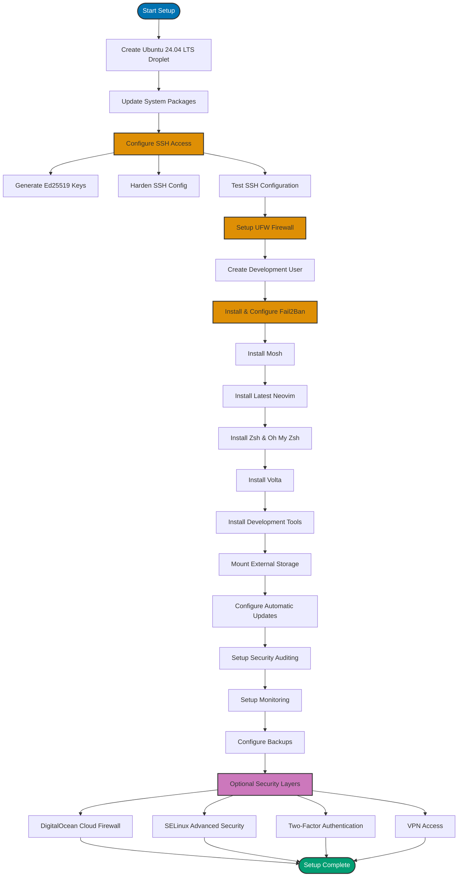

This guide walks through setting up a secure Ubuntu 24.04 LTS virtual machine on DigitalOcean for development work, following 2025 security best practices. You'll learn each step of the process, from initial VM creation through security hardening, development tool installation, and ongoing maintenance.

## Prerequisites

- DigitalOcean account
- SSH client on your local machine
- Mosh client (optional, for better mobile/unstable connections)
- Basic command line familiarity

## Setup Overview

The following diagram shows the complete setup process:



## Initial VM Setup

### Choose Your Base Image

This guide uses **Ubuntu 24.04 LTS** (Long Term Support), which provides:

- 5 years of security updates
- Stable, well-tested packages
- Excellent community support
- Regular security patches

### Create a Droplet on DigitalOcean

1. Log into your DigitalOcean account
2. Click **Create** → **Droplets**
3. Select **Ubuntu 24.04 LTS** as the image
4. Choose droplet size based on your needs:
   - **Basic**: $12/month (2 vCPU, 4GB RAM, 80GB SSD) - minimum recommended
   - **Basic**: $24/month (2 vCPU, 8GB RAM, 160GB SSD) - better for development
5. Select datacenter region closest to your location
6. **Authentication**: Choose SSH keys (we'll configure this properly)
7. **Optional**: Enable backups for automated weekly backups
8. Click **Create Droplet**

## Security Hardening

### Update System Packages

Regular patching is critical - the majority of Linux security threats can be attributed to misconfigurations or poor system administration:

```bash
sudo apt update && sudo apt upgrade -y
```

### Configure SSH Access

#### Generate Secure SSH Keys

Use Ed25519 keys (modern, more secure than RSA):

```bash
# On your local machine
ssh-keygen -t ed25519 -C "your_email@example.com"

# Copy to server
ssh-copy-id -i ~/.ssh/id_ed25519.pub user@server_ip
```

#### Harden SSH Configuration

1. **Backup existing configuration**:

```bash
sudo cp /etc/ssh/sshd_config /etc/ssh/sshd_config.backup
```

2. **Edit SSH configuration**:

```bash
sudo nano /etc/ssh/sshd_config
```

Set these values:

```
# Authentication
PasswordAuthentication no
PermitRootLogin no
PubkeyAuthentication yes

# Access Control - specify allowed users
AllowUsers devuser

# Security Features
X11Forwarding no
PermitEmptyPasswords no
MaxAuthTries 3

# Optional: Change default port (reduces automated attacks)
Port 2222
```

3. **Test configuration before applying**:

```bash
sudo sshd -t
```

4. **Restart SSH service**:

```bash
sudo systemctl restart sshd
```

**Important**: If you changed the SSH port, update firewall rules before logging out!

### Set Up Firewall

UFW provides a simple interface for iptables/nftables firewall management:

```bash
# Install UFW
sudo apt install ufw

# Default policies
sudo ufw default deny incoming
sudo ufw default allow outgoing

# Allow SSH (use custom port if changed)
sudo ufw allow 2222/tcp  # or 22/tcp if using default

# Enable firewall
sudo ufw enable

# Check status
sudo ufw status verbose
```

### Create Development User

Create a non-root user for daily management (fundamental security practice):

```bash
# Create user
sudo adduser devuser

# Add to sudo group
sudo usermod -aG sudo devuser

# Copy SSH keys
sudo mkdir -p /home/devuser/.ssh
sudo cp ~/.ssh/authorized_keys /home/devuser/.ssh/
sudo chown -R devuser:devuser /home/devuser/.ssh
sudo chmod 700 /home/devuser/.ssh
sudo chmod 600 /home/devuser/.ssh/authorized_keys
```

### Install and Configure Fail2Ban

Fail2Ban v1.1.0+ uses nftables and provides layered defense against brute-force attacks. Note: Fail2Ban complements your firewall but does not replace it.

```bash
# Install Fail2Ban
sudo apt install fail2ban

# Create local configuration
sudo cp /etc/fail2ban/jail.conf /etc/fail2ban/jail.local
sudo nano /etc/fail2ban/jail.local
```

Configure SSH protection in `jail.local`:

```ini
[sshd]
enabled = true
port = 2222  # Match your SSH port
filter = sshd
logpath = /var/log/auth.log
maxretry = 3
bantime = 3600
findtime = 600
```

Enable and start:

```bash
sudo systemctl enable fail2ban
sudo systemctl start fail2ban

# Check status
sudo fail2ban-client status
sudo fail2ban-client status sshd
```

## Development Environment Setup

### Install Mosh (Mobile Shell)

Mosh provides better connection stability over SSH, especially on unstable networks:

```bash
# Install Mosh
sudo apt install mosh

# Allow Mosh through firewall (uses UDP ports 60000-61000)
sudo ufw allow 60000:61000/udp
```

**Using Mosh to connect**:

```bash
# From your local machine
mosh user@server_ip

# With custom SSH port
mosh --ssh="ssh -p 2222" user@server_ip
```

**Benefits of Mosh**:

- Survives network disconnections and IP changes
- Lower latency for typing (local echo)
- Works well on mobile/WiFi connections
- Falls back to SSH for authentication

### Install Latest Neovim

Install the latest Neovim from official sources (Ubuntu repos have older versions):

```bash
# Install dependencies
sudo apt install curl

# Download latest stable Neovim AppImage
curl -LO https://github.com/neovim/neovim/releases/latest/download/nvim.appimage
chmod u+x nvim.appimage

# Move to system location
sudo mv nvim.appimage /usr/local/bin/nvim

# Verify installation
nvim --version
```

**Alternative: Install via PPA** (if you prefer package management):

```bash
sudo add-apt-repository ppa:neovim-ppa/stable
sudo apt update
sudo apt install neovim
```

#### Option 1: Use Your Custom Neovim Configuration

If you have your own Neovim configuration (e.g., LazyVim, NvChad, AstroNvim, or custom config):

```bash
# Upload your config from local machine
# On your local machine:
scp -P 2222 -r ~/.config/nvim user@server_ip:~/.config/

# Or clone from git repository (recommended):
# For LazyVim:
git clone https://github.com/LazyVim/starter ~/.config/nvim
rm -rf ~/.config/nvim/.git

# For NvChad:
git clone https://github.com/NvChad/NvChad ~/.config/nvim --depth 1

# For your custom config:
git clone https://github.com/yourusername/nvim-config.git ~/.config/nvim

# Install plugins (first launch)
nvim
```

**Note**: Your custom config may require additional dependencies:

```bash
# Common Neovim dependencies
sudo apt install python3-pip nodejs npm
pip3 install pynvim
npm install -g neovim

# For telescope and other fuzzy finders
sudo apt install ripgrep fd-find
```

#### Option 2: Start with Basic Configuration

**Set up basic Neovim configuration**:

```bash
# Create config directory
mkdir -p ~/.config/nvim

# Create basic init.vim
cat > ~/.config/nvim/init.vim << 'EOF'
" Basic settings
set number
set relativenumber
set expandtab
set tabstop=2
set shiftwidth=2
set autoindent
set mouse=a

" Enable syntax highlighting
syntax on
EOF
```

### Install Zsh and Oh My Zsh

Replace the default Bash shell with Zsh for better developer experience:

```bash
# Install Zsh
sudo apt install zsh

# Install Oh My Zsh
sh -c "$(curl -fsSL https://raw.githubusercontent.com/ohmyzsh/ohmyzsh/master/tools/install.sh)"

# Change default shell to Zsh
chsh -s $(which zsh)

# Log out and back in for changes to take effect
```

#### Option 1: Use Your Custom .zshrc

If you have your own `.zshrc` configuration:

```bash
# Backup Oh My Zsh default config
mv ~/.zshrc ~/.zshrc.omz-backup

# Upload your custom .zshrc from local machine
# On your local machine:
scp -P 2222 ~/.zshrc user@server_ip:~/

# Or create via git repository:
cd ~
git clone https://github.com/yourusername/dotfiles.git
ln -sf ~/dotfiles/.zshrc ~/.zshrc

# Reload configuration
source ~/.zshrc
```

#### Option 2: Configure Oh My Zsh Defaults

**Recommended Oh My Zsh plugins**:

```bash
# Edit ~/.zshrc
nano ~/.zshrc
```

Add these plugins:

```bash
plugins=(
  git
  docker
  kubectl
  npm
  node
  volta
  colored-man-pages
  command-not-found
  sudo
  z
)
```

**Optional: Install popular plugins**:

```bash
# zsh-autosuggestions
git clone https://github.com/zsh-users/zsh-autosuggestions ${ZSH_CUSTOM:-~/.oh-my-zsh/custom}/plugins/zsh-autosuggestions

# zsh-syntax-highlighting
git clone https://github.com/zsh-users/zsh-syntax-highlighting.git ${ZSH_CUSTOM:-~/.oh-my-zsh/custom}/plugins/zsh-syntax-highlighting

# Add to plugins in ~/.zshrc
plugins=(... zsh-autosuggestions zsh-syntax-highlighting)
```

Apply changes:

```bash
source ~/.zshrc
```

### Install Volta (Node.js Version Manager)

Volta is a fast, reliable Node.js version manager with automatic version switching:

```bash
# Install Volta
curl https://get.volta.sh | bash

# Reload shell configuration
source ~/.zshrc

# Verify installation
volta --version

# Install Node.js LTS
volta install node

# Install specific Node.js version (optional)
volta install node@20

# Install npm and yarn
volta install npm
volta install yarn

# Verify Node.js installation
node --version
npm --version
```

**Benefits of Volta**:

- Automatic version switching per project
- Fast, reliable installations
- Cross-platform consistency
- Per-project tool pinning

**Pin versions in your project**:

```bash
# In your project directory
volta pin node@20
volta pin npm@10
```

This creates entries in your `package.json` for reproducible environments.

### Install Essential Tools

```bash
# Build tools
sudo apt install build-essential git curl wget

# System monitoring
sudo apt install htop

# Additional useful tools
sudo apt install ripgrep fd-find tree tmux bat

# Note: bat is installed as 'batcat' on Ubuntu
# Create alias for convenience
mkdir -p ~/.local/bin
ln -s /usr/bin/batcat ~/.local/bin/bat

# Add to PATH in ~/.zshrc (will be done in Zsh setup)
echo 'export PATH="$HOME/.local/bin:$PATH"' >> ~/.zshrc

# Install language-specific tools as needed
```

**Tool explanations**:

- **htop**: Interactive process viewer (better than top)
- **bat**: Cat clone with syntax highlighting and Git integration
- **tmux**: Terminal multiplexer for managing multiple sessions
- **ripgrep**: Fast grep alternative
- **fd-find**: Fast find alternative
- **tree**: Directory structure visualization

### Configure Time Zone

Set timezone to Jakarta time (UTC+7):

```bash
# Set timezone to Jakarta
sudo timedatectl set-timezone Asia/Jakarta

# Verify timezone
timedatectl

# Check current time
date
```

### Mount External Storage (DigitalOcean Volumes)

Attach additional storage for projects, databases, or backups:

#### Create and Attach Volume

1. **Create Volume in DigitalOcean**:
   - Go to **Volumes** in DigitalOcean control panel
   - Click **Create Volume**
   - Choose size (100GB minimum recommended)
   - Select same datacenter region as your droplet
   - Attach to your droplet

2. **Format and Mount the Volume**:

```bash
# Check attached volumes
lsblk

# Format the volume (usually /dev/sda or /dev/disk/by-id/scsi-0DO_Volume_volume-name)
# WARNING: This will erase all data on the volume
sudo mkfs.ext4 /dev/disk/by-id/scsi-0DO_Volume_volume-name

# Create mount point
sudo mkdir -p /mnt/volume-name

# Mount the volume
sudo mount -o discard,defaults /dev/disk/by-id/scsi-0DO_Volume_volume-name /mnt/volume-name

# Verify mount
df -h | grep volume-name
```

3. **Configure Automatic Mounting on Boot**:

```bash
# Get the volume UUID
sudo blkid /dev/disk/by-id/scsi-0DO_Volume_volume-name

# Edit fstab
sudo nano /etc/fstab
```

Add this line (replace UUID with your volume's UUID):

```
UUID=your-volume-uuid /mnt/volume-name ext4 defaults,nofail,discard 0 2
```

Test the fstab configuration:

```bash
sudo mount -a
```

4. **Set Permissions**:

```bash
# Change ownership to your user
sudo chown -R $USER:$USER /mnt/volume-name

# Set appropriate permissions
sudo chmod 755 /mnt/volume-name
```

#### Using the Volume

**For Development Projects**:

```bash
# Create projects directory
mkdir /mnt/volume-name/projects

# Symlink to home directory for easy access
ln -s /mnt/volume-name/projects ~/projects
```

**For Docker Volumes**:

```bash
# Move Docker data to volume
sudo systemctl stop docker
sudo mv /var/lib/docker /mnt/volume-name/docker
sudo ln -s /mnt/volume-name/docker /var/lib/docker
sudo systemctl start docker
```

**For Databases**:

```bash
# Example: PostgreSQL data directory
# Move PostgreSQL data to volume for better I/O
sudo systemctl stop postgresql
sudo mv /var/lib/postgresql /mnt/volume-name/postgresql
sudo ln -s /mnt/volume-name/postgresql /var/lib/postgresql
sudo systemctl start postgresql
```

#### Volume Management Best Practices

- **Regular snapshots**: Create periodic snapshots in DigitalOcean
- **Monitoring**: Watch disk usage with `df -h`
- **Backups**: Keep critical data backed up separately
- **Resize when needed**: Volumes can be resized in DigitalOcean control panel

## Monitoring and Maintenance

### Set Up Automatic Updates

Enable automatic security updates for continuous protection:

```bash
sudo apt install unattended-upgrades
sudo dpkg-reconfigure -plow unattended-upgrades
```

### Security Auditing

Use security auditing tools to assess your security posture:

```bash
# Install Lynis for comprehensive security audits
sudo apt install lynis

# Run security audit
sudo lynis audit system

# Review recommendations
sudo lynis show details
```

### Monitor System Resources

```bash
# Install htop
sudo apt install htop

# Check disk usage
df -h

# Check memory usage
free -h
```

### Monitor SSH Access Logs

Regularly review authentication logs for suspicious activity:

```bash
# View recent SSH logins
sudo journalctl -u sshd -n 50

# Monitor auth log in real-time
sudo tail -f /var/log/auth.log

# Check failed login attempts
sudo grep "Failed password" /var/log/auth.log
```

## Backup Strategy

### Configure Automated Backups

DigitalOcean provides multiple backup options:

**Automated Backups** (recommended):

- Enable during droplet creation or in droplet settings
- Weekly automated backups (20% of droplet cost)
- Stored in same datacenter region
- Easy one-click restore

**Snapshots** (manual backups):

- Create manual snapshots before major changes
- $0.05/GB per month
- Can transfer between regions

**Best Practices**:

- **Enable automated backups** for continuous protection
- **Create snapshots** before system updates or major changes
- **Test restore procedures** regularly to verify backup integrity
- **Consider off-site backups** for critical data (rsync to separate provider)

### Version Control

- Keep infrastructure-as-code in git repositories
- Document manual configuration changes
- Version control SSH configurations and firewall rules

## Best Practices

1. **Principle of Least Privilege**: Only open ports you need, restrict user access
2. **Regular Updates**: Keep system packages current - patching is critical
3. **Continuous Monitoring**: Security is an ongoing process, not a one-time setup
4. **Key Rotation**: Rotate SSH keys periodically
5. **Documentation**: Document your setup and configuration changes
6. **Minimal Installation**: Only install packages you actually need
7. **Security Auditing**: Run regular security audits with tools like Lynis
8. **Network Segmentation**: Isolate development VMs from production systems

## Additional Security Layers

### Optional: DigitalOcean Cloud Firewall

Add an extra security layer at the network level:

1. Go to **Networking** → **Firewalls** in DigitalOcean control panel
2. Create new firewall with rules:
   - **Inbound SSH**: Allow TCP port 2222 (or 22) from your IP only
   - **Inbound Mosh**: Allow UDP ports 60000-61000 from your IP only
   - **Outbound**: Allow all (or restrict as needed)
3. Apply firewall to your droplet

**Benefits**:

- Network-level protection before traffic reaches your droplet
- Easy rule management through web interface
- Can restrict access by specific IP addresses
- Works alongside UFW for layered security

### Optional: Enable SELinux (Advanced)

Security-Enhanced Linux provides mandatory access control for fine-grained security:

```bash
# Install SELinux on Ubuntu
sudo apt install selinux-basics selinux-policy-default auditd

# Enable SELinux (requires reboot)
sudo selinux-activate
sudo reboot

# Check SELinux status after reboot
sestatus
```

**Note**: SELinux configuration requires expertise. Start with permissive mode for development environments.

### Optional: Set Up VPN Access

For sensitive projects, consider:

- **WireGuard**: Modern, lightweight VPN protocol
- **OpenVPN**: Broader compatibility, mature solution

### Optional: Enable Two-Factor Authentication

Add an extra security layer with 2FA:

```bash
# Install Google Authenticator
sudo apt install libpam-google-authenticator

# Configure for your user
google-authenticator

# Follow prompts to set up 2FA
```

Edit PAM configuration:

```bash
sudo nano /etc/pam.d/sshd
```

Add this line:

```
auth required pam_google_authenticator.so
```

## Troubleshooting

### Cannot Connect via SSH

- Verify DigitalOcean firewall allows your SSH port (2222 or 22)
- Check Cloud Firewalls in DigitalOcean control panel
- Verify local firewall (UFW): `sudo ufw status`
- Verify key permissions: `chmod 600 ~/.ssh/id_ed25519`
- If port was changed, ensure you're connecting to the correct port: `ssh -p 2222 user@server_ip`

### Cannot Connect via Mosh

- Verify Mosh is installed on both client and server
- Check UDP ports 60000-61000 are allowed in firewall: `sudo ufw status`
- Verify DigitalOcean Cloud Firewall allows UDP 60000-61000
- Test SSH connection first: `ssh -p 2222 user@server_ip`
- Try verbose mode: `mosh --ssh="ssh -p 2222 -v" user@server_ip`
- Check Mosh server process: `ps aux | grep mosh-server`

### Locked Out After Configuration Changes

1. **Access via DigitalOcean Console**:
   - Go to your droplet in DigitalOcean control panel
   - Click **Access** → **Launch Droplet Console**
   - Log in with root password (if set) or use recovery mode

2. **Restore SSH configuration**:

   ```bash
   sudo mv /etc/ssh/sshd_config.backup /etc/ssh/sshd_config
   sudo systemctl restart sshd
   ```

3. **Alternative**: Use DigitalOcean Recovery Console to mount and fix configuration

### High CPU Usage

- Check processes: `htop` or `top`
- Review logs: `journalctl -xe`
- Check for unauthorized processes

### Disk Space Full

- Find large files: `du -sh /* | sort -h`
- Clean package cache: `sudo apt clean`
- Remove old logs: `sudo journalctl --vacuum-time=7d`
- Check volume mounts: `df -h`
- If volume is full, consider resizing in DigitalOcean

### Volume Not Mounting

- Check volume attachment: `lsblk`
- Verify fstab entry: `cat /etc/fstab | grep volume`
- Test fstab: `sudo mount -a`
- Check mount errors: `sudo dmesg | grep -i error`
- Verify volume UUID: `sudo blkid`
- Try manual mount: `sudo mount /dev/disk/by-id/scsi-0DO_Volume_volume-name /mnt/volume-name`

## Managing Dotfiles

For easier configuration management across multiple servers, consider using a dotfiles repository:

```bash
# Create dotfiles repository structure
mkdir -p ~/dotfiles
cd ~/dotfiles

# Add your configurations
cp ~/.zshrc .
cp -r ~/.config/nvim nvim
cp ~/.tmux.conf . 2>/dev/null || echo "# tmux config" > .tmux.conf
cp ~/.gitconfig . 2>/dev/null || echo "# git config" > .gitconfig

# Initialize git repository
git init
git add .
git commit -m "Initial dotfiles commit"

# Push to GitHub/GitLab
git remote add origin https://github.com/yourusername/dotfiles.git
git push -u origin main
```

**Setting up dotfiles on a new server**:

```bash
# Clone dotfiles
cd ~
git clone https://github.com/yourusername/dotfiles.git

# Create symlinks
ln -sf ~/dotfiles/.zshrc ~/.zshrc
ln -sf ~/dotfiles/nvim ~/.config/nvim
ln -sf ~/dotfiles/.tmux.conf ~/.tmux.conf
ln -sf ~/dotfiles/.gitconfig ~/.gitconfig

# Reload configurations
source ~/.zshrc
```

## Next Steps

- **Customize tmux**: Create `.tmux.conf` with your preferred key bindings and plugins
- **Set up development tools**: Install language-specific tools for your stack
- **Configure Git**: Set up git config with your name/email and SSH keys for GitHub/GitLab
- **Dotfiles automation**: Consider using GNU Stow or chezmoi for dotfiles management
- **CI/CD access**: Configure access for continuous integration tools
- **Monitoring solutions**: Implement Prometheus, Grafana, or other monitoring
- **Container runtime**: Consider Docker or Podman for containerized development

## Related Resources

### DigitalOcean Specific

- [DigitalOcean Initial Server Setup with Ubuntu](https://www.digitalocean.com/community/tutorials/initial-server-setup-with-ubuntu) - Official DigitalOcean setup guide
- [How Fail2Ban Works to Protect Services](https://www.digitalocean.com/community/tutorials/how-fail2ban-works-to-protect-services-on-a-linux-server) - Understanding Fail2Ban on DigitalOcean
- [DigitalOcean Cloud Firewalls](https://docs.digitalocean.com/products/networking/firewalls/) - Official firewall documentation
- [DigitalOcean Volumes](https://docs.digitalocean.com/products/volumes/) - Official volumes documentation
- [How To Use Block Storage on DigitalOcean](https://www.digitalocean.com/community/tutorials/how-to-use-block-storage-on-digitalocean) - Volume setup guide

### SSH & Server Security

- [Top 20 OpenSSH Server Best Security Practices](https://www.cyberciti.biz/tips/linux-unix-bsd-openssh-server-best-practices.html) - Comprehensive SSH hardening guide
- [40 Linux Server Hardening Security Tips](https://www.cyberciti.biz/tips/linux-security.html) - Essential security configurations
- [Ubuntu Server Security Best Practices 2025](https://moss.sh/server-management/best-practices-for-ubuntu-server-security-2025/) - Ubuntu-specific security guide

### Security Tools & Auditing

- [Linux Server Security Checklist](https://centlinux.com/linux-server-security-checklist/) - Comprehensive security audit checklist
- [Optimizing Linux Security for 2025](https://linuxsecurity.com/features/effective-strategies-to-optimize-linux-security-in-2025) - Modern threat mitigation strategies
- [Virtual Machine Security Best Practices](https://daily.dev/blog/10-security-tips-for-virtual-environments) - VM-specific security tips

### Development Tools

- [Mosh Official Website](https://mosh.org/) - Mobile shell documentation and usage guide
- [Neovim Official Documentation](https://neovim.io/doc/) - Complete Neovim reference
- [Neovim GitHub Releases](https://github.com/neovim/neovim/releases) - Latest Neovim versions
- [Volta Official Website](https://volta.sh/) - Fast, reliable Node.js version manager
- [Oh My Zsh Documentation](https://ohmyz.sh/) - Zsh framework and plugins
- [Oh My Zsh GitHub](https://github.com/ohmyzsh/ohmyzsh) - Official Oh My Zsh repository
- [bat (cat clone)](https://github.com/sharkdp/bat) - Syntax highlighting cat alternative
- [tmux Documentation](https://github.com/tmux/tmux/wiki) - Terminal multiplexer guide

### Dotfiles Management

- [GNU Stow](https://www.gnu.org/software/stow/) - Symlink farm manager for dotfiles
- [chezmoi](https://www.chezmoi.io/) - Manage dotfiles across multiple machines
- [yadm](https://yadm.io/) - Yet Another Dotfiles Manager
