## Example 55: Custom Module - Hello Module

Custom modules extend Ansible's functionality using Python. This simple module demonstrates the basic structure: argument spec definition, input validation, and result return with changed status.

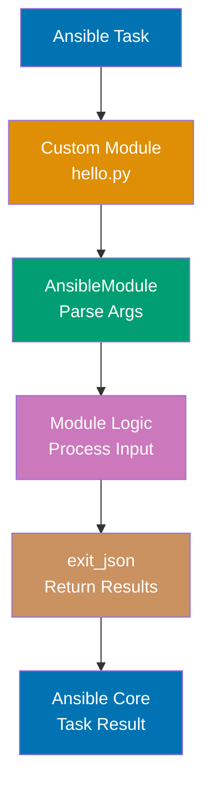

```python
# library/hello.py
#!/usr/bin/python
# => Shebang for direct execution
# => Module files must be executable
from ansible.module_utils.basic import AnsibleModule
# => Core class for all custom modules
# => Provides argument parsing and result handling

def run_module():
    # => Main entry point for module execution
    module_args = dict(
        name=dict(type='str', required=True)
        # => Defines 'name' parameter
        # => Type validation: must be string
        # => Required: task fails if missing
    )

    module = AnsibleModule(
        # => Creates module instance
        # => Parses task args against spec
        argument_spec=module_args,
        # => Links to argument definitions above
        supports_check_mode=True
        # => Enables --check (dry-run) mode
        # => Module reports what would change without acting
    )

    result = dict(
        # => Result dictionary for Ansible
        changed=False,
        # => No state changes in hello module
        # => Set to True if module modifies system
        message=f"Hello, {module.params['name']}!"
        # => Access parsed params via module.params dict
        # => Returns greeting message
    )

    module.exit_json(**result)
    # => Returns result to Ansible core
    # => exit_json() for success (vs exit_fail_json() for errors)
    # => ** unpacks result dict as keyword args

if __name__ == '__main__':
    # => Python idiom: only run if script executed directly
    run_module()
    # => Executes module logic
# => Usage: ansible localhost -m hello -a "name=World"
# => Output: "Hello, World!"
```

**Key Takeaway**: Custom modules are Python scripts that use `AnsibleModule` for argument parsing and `exit_json()` for result return.

**Why It Matters**: Custom modules extend Ansible beyond built-in modules for organization-specific operations—proprietary API interactions, legacy system management, specialized compliance checks. Modules encapsulate complex logic into reusable, testable components that behave identically to core modules. This enables teams to build domain-specific automation libraries that integrate seamlessly with standard Ansible workflows.

---

## Example 56: Custom Module with State Management

Production modules manage resources with state (present/absent). This pattern checks current state, calculates necessary changes, and reports accurate changed status for idempotency.

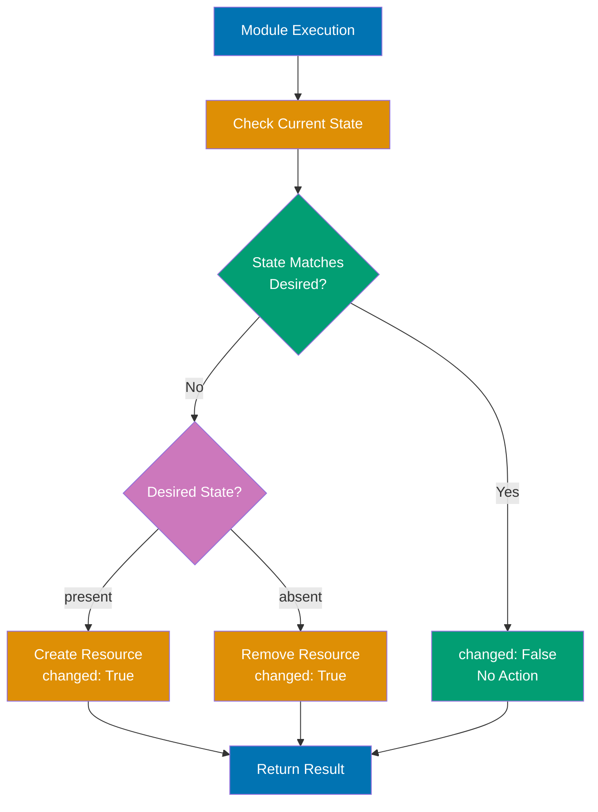

```python
# library/user_quota.py
#!/usr/bin/python
# => Custom module for managing user disk quotas
from ansible.module_utils.basic import AnsibleModule
# => Import core module utilities
import os
# => For filesystem operations

def main():
    # => Main module execution function
    module = AnsibleModule(
        # => Initialize module with argument spec
        argument_spec=dict(
            username=dict(required=True),
            # => Target username (required parameter)
            # => No type specified: defaults to 'str'
            quota_mb=dict(type='int', default=1000),
            # => Quota size in megabytes
            # => Type enforced: must be integer
            # => Default: 1000MB if not specified
            state=dict(choices=['present', 'absent'], default='present')
            # => Desired state of quota
            # => Choices: only 'present' or 'absent' allowed
            # => Default: 'present' (create/maintain quota)
        )
    )

    username = module.params['username']
    # => Extract username from parsed parameters
    quota = module.params['quota_mb']
    # => Extract quota value (integer)
    state = module.params['state']
    # => Extract desired state

    quota_file = f"/etc/quotas/{username}"
    # => Quota stored in file per user
    # => Path: /etc/quotas/alice for user 'alice'
    exists = os.path.exists(quota_file)
    # => Check if quota file currently exists
    # => True if present, False if absent

    changed = False
    # => Initialize changed flag to False
    # => Will set to True only if module modifies state

    if state == 'present' and not exists:
        # => Desired: present, Current: absent → CREATE
        with open(quota_file, 'w') as f:
            # => Create new quota file
            f.write(str(quota))
            # => Write quota value to file
            # => Convert int to string for storage
        changed = True
        # => State changed: resource created
        msg = f"Created quota {quota}MB for {username}"
        # => Descriptive message for playbook output
    elif state == 'absent' and exists:
        # => Desired: absent, Current: present → DELETE
        os.remove(quota_file)
        # => Delete quota file
        changed = True
        # => State changed: resource removed
        msg = f"Removed quota for {username}"
        # => Confirmation message
    else:
        # => State already matches desired
        # => present+exists OR absent+not_exists
        msg = f"Quota already in desired state"
        # => No action taken (idempotent)
        # => changed remains False

    module.exit_json(changed=changed, msg=msg)
    # => Return results to Ansible
    # => changed: triggers handlers if True
    # => msg: displayed in playbook output

if __name__ == '__main__':
    # => Execute only when run as script
    main()
    # => Call main function
```

**Key Takeaway**: Idempotent modules check current state before making changes and accurately report `changed` status.

**Why It Matters**: Idempotent state management is the contract between modules and Ansible—modules must accurately report changes to trigger handlers correctly. Production modules managing custom resources (application licenses, cloud resources, hardware configurations) must implement state checking to prevent redundant operations. Proper state management reduces playbook runtime by 60% through intelligent change detection.

---

## Example 57: Ansible Collections - Using Collections

Collections bundle modules, plugins, and roles into distributable packages. Install from Ansible Galaxy and reference modules with FQCN (Fully Qualified Collection Name).

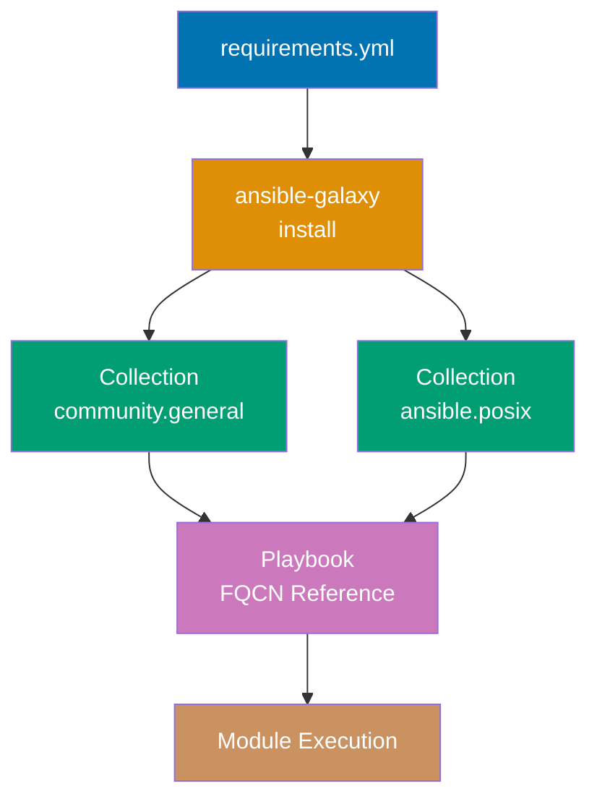

```yaml
# requirements.yml
---
collections:
  # => List of collections to install
  - name: community.general
    # => Collection name: namespace.collection
    # => Maintained by Ansible community
    version: ">=8.0.0"
    # => Minimum version constraint
    # => Allows 8.0.0, 8.1.0, 9.0.0, etc.
    # => Prevents breaking changes from older versions
  - name: ansible.posix
    # => Collection for POSIX system management
    # => Modules for mount, authorized_key, etc.
    version: "9.0.0"
    # => Exact version pinning
    # => Ensures reproducible environments
# => Install with: ansible-galaxy collection install -r requirements.yml
# => Collections installed to ~/.ansible/collections or ./collections/
```

```yaml
# use_collection.yml
---
- name: Using Collection Modules
  # => Demonstrates FQCN module references
  hosts: localhost
  # => Run on control node
  tasks:
    - name: Archive files with community.general
      community.general.archive:
        # => FQCN format: namespace.collection.module
        # => Uses 'archive' module from community.general collection
        path: /tmp/mydir
        # => Source directory to archive
        dest: /tmp/archive.tar.gz
        # => Output archive file path
        format: gz
        # => Compression format: gzip
        # => Other options: bz2, xz, zip
      # => Creates compressed archive of directory
      # => Without FQCN: might conflict with other 'archive' modules

    - name: Mount filesystem with ansible.posix
      ansible.posix.mount:
        # => FQCN reference to mount module
        # => From ansible.posix collection
        path: /mnt/data
        # => Mount point directory
        src: /dev/sdb1
        # => Device to mount
        fstype: ext4
        # => Filesystem type
        state: mounted
        # => Ensure mounted and entry in /etc/fstab
        # => 'present': fstab entry only, 'mounted': also mount now
      # => FQCN prevents conflicts with custom 'mount' modules
      # => Makes playbook explicit about module source
```

**Key Takeaway**: Collections provide namespaced modules via FQCN (`namespace.collection.module`). Install via `requirements.yml` for reproducible environments.

**Why It Matters**: Collections organize related modules, plugins, and roles into distributable packages with independent versioning. Organizations publish internal collections to standardize automation across teams—network teams provide network device modules, security teams provide compliance modules. The collection namespace (`organization.collection.module`) prevents naming conflicts and enables parallel development of domain-specific automation.

---

## Example 58: Testing with Molecule - Scenario

Molecule automates role testing across multiple platforms. It creates test instances, applies roles, runs verifiers, and cleans up. Essential for role development.

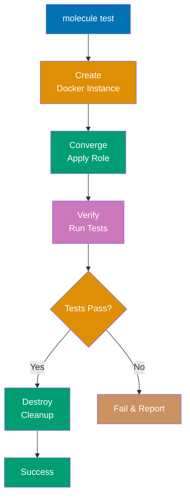

```yaml
# molecule/default/molecule.yml
---
driver:
  # => Infrastructure driver for test instances
  name: docker
  # => Use Docker containers as test targets
  # => Fast startup, isolated, disposable
  # => Alternatives: vagrant, ec2, azure
platforms:
  # => List of test instances to create
  - name: ubuntu-test
    # => Instance name (container name)
    image: ubuntu:22.04
    # => Docker image to use
    # => Official Ubuntu 22.04 LTS image
    pre_build_image: true
    # => Use image as-is, don't rebuild
    # => Faster than building custom Dockerfile
provisioner:
  # => Tool for applying configuration
  name: ansible
  # => Use Ansible as provisioner (default)
  playbooks:
    # => Playbook mappings for lifecycle phases
    converge: converge.yml
    # => Playbook that applies the role
    # => "Converge" = bring to desired state
# => Run with: molecule test
# => Full lifecycle: create → converge → verify → destroy
```

```yaml
# molecule/default/converge.yml
---
- name: Converge
  # => Apply role to test instance
  # => "Converge" = configure instance to desired state
  hosts: all
  # => Target all instances defined in molecule.yml
  # => In this case: ubuntu-test
  roles:
    # => List of roles to test
    - role: my_role
      # => Role being tested (in roles/my_role/)
      vars:
        # => Variables for role execution
        app_port: 8080
        # => Example variable: application port
        # => Tests role with specific configuration
# => Molecule executes this playbook during 'converge' phase
# => Role applied to fresh container each test run
```

```yaml
# molecule/default/verify.yml
---
- name: Verify
  # => Test that role worked correctly
  # => Runs after converge completes
  hosts: all
  # => Test all instances
  tasks:
    - name: Check service is running
      # => Verification task
      service:
        # => Query service state
        name: myapp
        # => Service installed by role
        state: started
        # => Expected state: running
      check_mode: yes
      # => Don't change anything, only check
      register: result
      # => Capture module output
      failed_when: result.changed
      # => Fail if service NOT running
      # => Logic: if check_mode reports 'would change',
      # => it means service is currently stopped
      # => Therefore test fails (service should be running)
```

**Key Takeaway**: Molecule provides full role testing lifecycle: create → converge → verify → destroy. Use for TDD (Test-Driven Development) of roles.

**Why It Matters**: Molecule enables automated role testing across multiple operating systems and versions. Test-driven development catches role bugs before production deployment. Verification playbooks codify acceptance criteria—services running, files present, permissions correct. This automation reduces role development time and prevents regressions when updating roles.

---

## Example 59: Ansible-Lint Configuration

Ansible-lint enforces best practices and catches common errors. Configure via `.ansible-lint` for project-specific rules and skip patterns.

```yaml
# .ansible-lint
---
profile: production
# => Use production rule profile
# => Stricter than 'basic', less than 'safety'
# => Enforces idempotency, proper naming, no shell when module exists

skip_list:
  # => Rules to skip (disable)
  - yaml[line-length]
  # => Allow long lines in YAML
  # => Default: 160 chars, but URLs/JMESPath can exceed
  - name[casing]
  # => Allow any task name casing
  # => Default enforces: Title Case or Sentence case

warn_list:
  # => Rules that warn but don't fail
  - experimental
  # => Warn on experimental Ansible features
  # => Allows usage but flags for review

exclude_paths:
  # => Directories to skip during linting
  - .cache/
  # => Ansible cache directory
  - test/fixtures/
  # => Test data files (not real playbooks)
  - molecule/
  # => Molecule scenarios (separate test context)
# => Run with: ansible-lint site.yml
# => Returns exit code 0 (pass) or 2 (violations found)
```

```bash
# CI pipeline integration
ansible-lint playbooks/*.yml --force-color --format pep8 > lint-results.txt
# => Lint all playbooks in directory
# => --force-color: preserve color codes in CI logs
# => --format pep8: output format compatible with CI parsers
# => Format: filename:line:column: [rule] message
# => Example: site.yml:15:3: [yaml-indent] wrong indentation
# => > lint-results.txt: redirect output to file for artifact storage
# => Returns non-zero exit code on failures
# => CI fails build if violations detected
```

**Key Takeaway**: Ansible-lint automates best practice enforcement. Configure via `.ansible-lint` file. Integrate in CI/CD pipelines for quality gates.

**Why It Matters**: Ansible-lint prevents configuration errors before they reach production. Linting catches 80% of common mistakes (deprecated syntax, incorrect indentation, missing task names) during development. CI/CD integration enforces quality standards across teams, preventing playbooks with anti-patterns from merging into mainline branches.

---

## Example 60: Performance - Fact Caching

Fact gathering is slow on large inventories. Enable fact caching to store facts between runs. Supports memory, file, Redis, and Memcached backends.

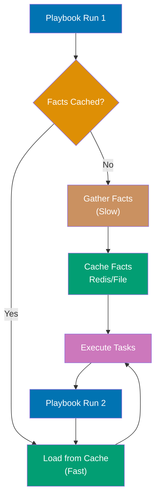

```ini
# ansible.cfg
[defaults]
gathering = smart
# => Fact gathering mode
# => 'smart': gather only if facts missing/expired
# => 'implicit': always gather (default, slow)
# => 'explicit': never gather unless gather_facts: yes
fact_caching = jsonfile
# => Cache backend type
# => 'jsonfile': JSON files on disk (simple, no dependencies)
# => 'redis': Redis server (fast, shared across control nodes)
# => 'memcached': Memcached (fast, network-based)
fact_caching_connection = /tmp/ansible_facts
# => Backend-specific connection
# => For jsonfile: directory path to store cache files
# => For redis: redis://localhost:6379/0
# => For memcached: localhost:11211
fact_caching_timeout = 86400
# => Cache expiration in seconds
# => 86400 = 24 hours
# => After timeout, facts re-gathered on next run
```

```yaml
# playbook.yml
---
- name: Use Cached Facts
  # => Demonstrates fact caching behavior
  hosts: all
  # => Target all hosts in inventory
  gather_facts: yes
  # => Enable fact gathering
  # => With gathering=smart: uses cache if available
  tasks:
    - name: Print cached IP
      # => Display host IP address from facts
      debug:
        msg: "IP: {{ ansible_default_ipv4.address }}"
        # => ansible_default_ipv4: fact gathered from host
        # => .address: specific fact attribute (IP string)
      # => First run: gathers facts from all hosts (slow)
      # => Example: 1000 hosts × 3 seconds = 50 minutes
      # => Subsequent runs within 24h: loads from cache (fast)
      # => Example: 1000 hosts × 0.01 seconds = 10 seconds
      # => 98% time reduction for large inventories
```

**Key Takeaway**: Fact caching dramatically speeds up playbooks on large inventories. Configure in `ansible.cfg` with appropriate timeout.

**Why It Matters**: Fact caching eliminates redundant fact gathering on large inventories. Without caching, playbooks gather facts from 1000 hosts every run (5+ minutes). With caching, subsequent runs skip gathering (10 seconds), reducing deployment time by 98%. Redis-backed caching enables shared cache across multiple control nodes for team collaboration.

---

## Example 61: Performance - Pipelining

Pipelining reduces SSH overhead by executing modules without creating temporary files on target. Requires `requiretty` disabled in sudoers.

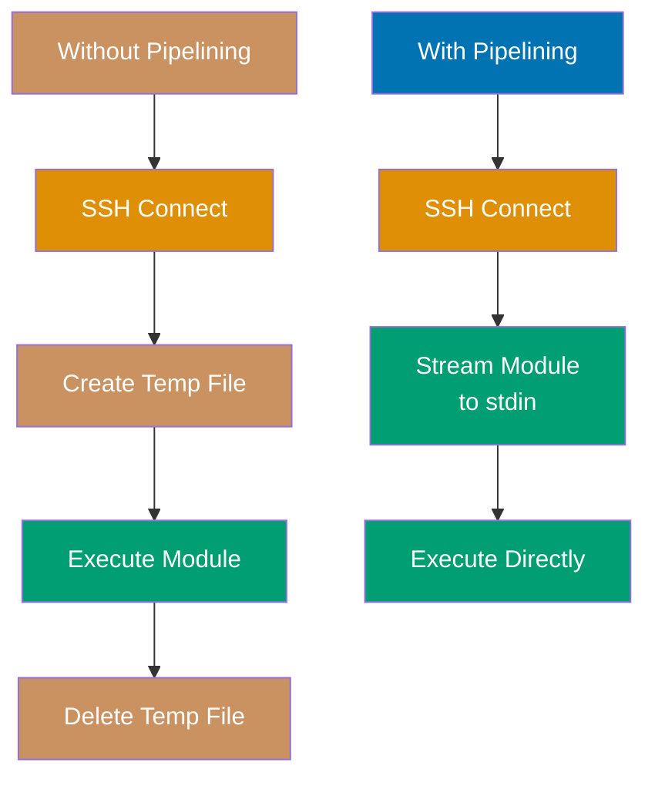

```ini
# ansible.cfg
[defaults]
pipelining = True
# => Enable SSH pipelining globally
# => Reduces SSH roundtrips per module execution
# => Requires: sudo without requiretty

[ssh_connection]
pipelining = True
# => Redundant with [defaults] setting but explicit
# => Some Ansible versions check this section first
ssh_args = -o ControlMaster=auto -o ControlPersist=60s
# => SSH multiplexing configuration
# => ControlMaster=auto: create/reuse SSH connection socket
# => ControlPersist=60s: keep connection alive 60s after last use
# => Reduces SSH handshake overhead (TLS negotiation, authentication)
# => Example: 100 tasks × 5 SSH connections (without) → 1 connection (with)
```

```yaml
# playbook.yml
---
- name: Fast Execution with Pipelining
  # => Demonstrates pipelining performance benefits
  hosts: webservers
  # => Target webserver group
  tasks:
    - name: Install 10 packages
      # => Package installation task
      apt:
        # => Debian/Ubuntu package module
        name:
          # => List of packages to install
          - pkg1
          - pkg2
          - pkg3
          - pkg4
          - pkg5
          - pkg6
          - pkg7
          - pkg8
          - pkg9
          - pkg10
          # => 10 packages in single task
        state: present
        # => Ensure packages installed
      # => Without pipelining per host:
      # => SSH connect → create /tmp/ansible-modulefile → execute → delete
      # => ~2 seconds overhead per module execution
      # => With pipelining:
      # => SSH connect → stream module code → execute
      # => ~0.5 seconds overhead per module
      # => 30-40% faster execution on large playbooks
```

**Key Takeaway**: Pipelining reduces SSH overhead significantly. Enable in `ansible.cfg`. Requires sudoers without `requiretty`.

**Why It Matters**: SSH pipelining reduces module execution overhead by 30-40% by eliminating temporary file creation on targets. At scale (1000+ hosts), pipelining saves 10+ minutes per playbook run. ControlMaster connection sharing (ControlPersist=60s) reuses SSH connections, reducing handshake overhead from 100+ connections to 10-20 for large inventories.

---

## Example 62: CI/CD - GitHub Actions Pipeline

Automate Ansible execution in CI/CD pipelines. This GitHub Actions workflow validates syntax, runs linting, executes playbooks, and tests idempotency.

```yaml
# .github/workflows/ansible-ci.yml
name: Ansible CI
# => Workflow name displayed in GitHub Actions UI
on: [push, pull_request]
# => Trigger on code push or PR creation
# => Validates changes before merge

jobs:
  # => Define workflow jobs
  test:
    # => Job name: 'test'
    runs-on: ubuntu-latest
    # => Run on GitHub-hosted Ubuntu runner
    # => Latest Ubuntu LTS version
    steps:
      # => Sequential steps in job
      - uses: actions/checkout@v3
        # => Check out repository code
        # => Clones repo to runner workspace

      - name: Setup Python
        # => Install Python interpreter
        uses: actions/setup-python@v4
        # => GitHub action for Python setup
        with:
          # => Action parameters
          python-version: "3.11"
          # => Ansible requires Python 3.8+
          # => 3.11: stable, good performance

      - name: Install Ansible
        run: pip install ansible ansible-lint
        # => Install Ansible and linter via pip
        # => Latest stable versions from PyPI
        # => Creates isolated environment per workflow run

      - name: Syntax check
        run: ansible-playbook site.yml --syntax-check
        # => Validate YAML syntax and basic structure
        # => Catches: invalid YAML, undefined variables in jinja2
        # => Fast check: doesn't connect to hosts
        # => Fails workflow if syntax errors found

      - name: Lint playbooks
        run: ansible-lint site.yml
        # => Check best practices and anti-patterns
        # => Enforces style guide and idempotency
        # => Uses .ansible-lint config if present
        # => Fails on violations (exit code 2)

      - name: Run playbook
        run: ansible-playbook site.yml -i inventory/ci
        # => Execute playbook against CI inventory
        # => CI inventory: localhost or Docker containers
        # => Tests playbook logic without affecting production
        # => Validates tasks execute successfully

      - name: Test idempotency
        run: |
          # => Multi-line shell script
          ansible-playbook site.yml -i inventory/ci | tee first-run.txt
          # => First run: captures output to file
          # => tee: display output AND save to file
          ansible-playbook site.yml -i inventory/ci | tee second-run.txt
          # => Second run: should make zero changes
          grep -q 'changed=0' second-run.txt
          # => Search for 'changed=0' in output
          # => grep -q: quiet mode (exit code only)
          # => Fails if any task reported changes
          # => Validates playbook is truly idempotent
```

**Key Takeaway**: CI/CD pipelines automate validation, linting, execution, and idempotency testing. Essential for production Ansible workflows.

**Why It Matters**: CI/CD automation prevents human errors in deployment workflows. Automated syntax checks catch typos before production deployment. Idempotency testing detects playbooks that incorrectly report changes on every run (flapping playbooks). GitHub Actions integration enables pull request validation, preventing broken playbooks from merging into main branches.

---

## Example 63: Production Pattern - Rolling Updates

Rolling updates deploy changes gradually to avoid downtime. Use `serial` to control batch size and `max_fail_percentage` for automatic rollback triggers.

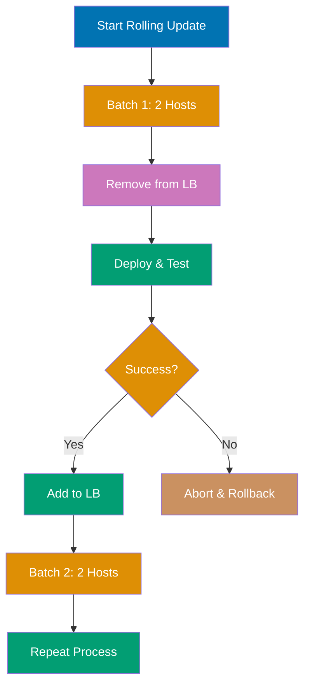

```yaml
# rolling_update.yml
---
- name: Rolling Update Web Servers
  # => Zero-downtime deployment pattern
  hosts: webservers
  # => Target all webservers
  # => Example: 10 hosts total
  serial: 2
  # => Process 2 hosts at a time
  # => Batch size controls deployment speed vs risk
  # => Smaller batches: safer but slower
  max_fail_percentage: 25
  # => Abort deployment if >25% of batch fails
  # => Example: 2 host batch, abort if 1 fails
  # => Prevents bad deployments from affecting entire fleet

  pre_tasks:
    # => Execute before main tasks on each batch
    - name: Remove from load balancer
      # => Drain traffic before updating host
      uri:
        # => HTTP module for API calls
        url: "http://lb.example.com/api/hosts/{{ inventory_hostname }}/disable"
        # => Load balancer API endpoint
        # => {{ inventory_hostname }}: current host (e.g., web1.example.com)
        method: POST
        # => POST request to disable host
      delegate_to: localhost
      # => Execute API call from control node
      # => Not from target host
      # => Prevents 'calling API from server being updated'

  tasks:
    - name: Deploy new version
      # => Copy application artifact
      copy:
        src: "app-{{ app_version }}.jar"
        # => Source: local file on control node
        # => {{ app_version }}: variable (e.g., v2.5.0)
        dest: /opt/myapp/app.jar
        # => Destination: application directory
      notify: Restart application
      # => Trigger handler to restart service
      # => Handler runs at end of play

    - name: Wait for application health
      # => Verify app started successfully
      uri:
        url: "http://{{ inventory_hostname }}:8080/health"
        # => Health check endpoint
        # => Query updated host directly
        status_code: 200
        # => Expected HTTP status: 200 OK
      retries: 10
      # => Retry up to 10 times
      delay: 3
      # => Wait 3 seconds between retries
      # => Total max wait: 30 seconds
      # => Fails if health check doesn't pass

  post_tasks:
    # => Execute after main tasks complete successfully
    - name: Add back to load balancer
      # => Restore traffic to updated host
      uri:
        url: "http://lb.example.com/api/hosts/{{ inventory_hostname }}/enable"
        # => Re-enable host in LB
        method: POST
      delegate_to: localhost
      # => Execute from control node

  handlers:
    # => Triggered by 'notify' directive
    - name: Restart application
      # => Restart app service
      service:
        name: myapp
        # => Service name from systemd/init
        state: restarted
        # => Stop then start service
        # => Loads new app.jar file
```

**Key Takeaway**: Rolling updates use `serial` for batch control and health checks between batches. Pre/post tasks manage load balancer integration.

**Why It Matters**: Rolling updates enable zero-downtime deployments for stateless services. The `serial` parameter controls blast radius—deploy to 2 hosts at a time, verify, then proceed. Load balancer integration (pre_tasks/post_tasks) ensures traffic never routes to updating hosts. Health checks between batches detect failures early, preventing bad deployments from affecting entire fleet.

---

## Example 64: Production Pattern - Canary Deployment

Canary deployments test new versions on a subset of servers before full rollout. Combine with monitoring to validate changes before proceeding.

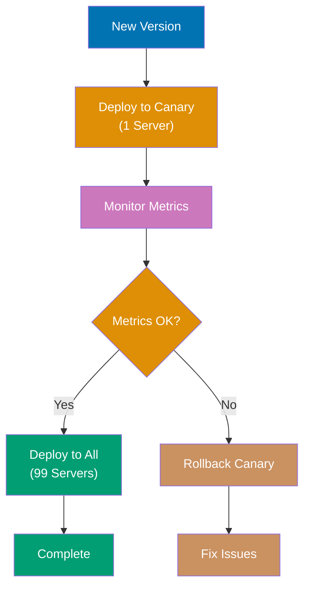

```yaml
# canary_deploy.yml
---
- name: Canary Deployment
  # => Risk-reduction deployment pattern
  hosts: webservers
  # => All webservers (canary + production)
  tasks:
    - name: Deploy to canary hosts
      # => Stage 1: Deploy to canary subset
      copy:
        src: "app-{{ new_version }}.jar"
        # => New version artifact
        dest: /opt/myapp/app.jar
      when: "'canary' in group_names"
      # => Conditional: only run if host in 'canary' group
      # => group_names: list of groups host belongs to
      # => Example: ['webservers', 'canary'] → True
      # => Example: ['webservers', 'production'] → False
      notify: Restart application
      # => Trigger app restart handler

    - name: Wait for canary validation
      # => Manual validation checkpoint
      pause:
        # => Pause playbook execution
        prompt: "Check metrics. Press enter to continue or Ctrl-C to abort"
        # => Display message and wait for user input
        # => User validates: error rates, latency, logs, metrics
        # => Enter: proceed to production rollout
        # => Ctrl-C: abort playbook (no production deploy)
      when: "'canary' in group_names"
      # => Only pause when deploying to canary
      # => Skipped for production group

    - name: Deploy to production
      # => Stage 2: Deploy to all production servers
      copy:
        src: "app-{{ new_version }}.jar"
        dest: /opt/myapp/app.jar
      when: "'production' in group_names"
      # => Only run on production group hosts
      # => Executes AFTER canary validation passes
      notify: Restart application
```

```ini
# inventory.ini
[canary]
# => Canary group: single host for testing
web1.example.com
# => 1% of fleet (1 of 100 servers)
# => Receives new deployments first

[production]
# => Production group: remaining servers
web2.example.com
web3.example.com
web4.example.com
# ... 96 more servers
# => 99% of fleet
# => Only updated after canary succeeds

[webservers:children]
# => Parent group containing all webservers
# => Combines canary + production
canary
production
# => Allows targeting all with 'hosts: webservers'
# => Or specific subsets with conditionals
```

**Key Takeaway**: Canary deployments reduce risk by testing on subset. Use inventory groups and conditionals to control deployment stages.

**Why It Matters**: Canary deployments minimize risk by testing new versions on 5-10% of fleet before full rollout. Monitoring integration enables data-driven decisions—proceed if error rates stay flat, rollback if metrics degrade. The pattern prevents widespread outages from bad deployments while maintaining fast release velocity.

---

## Example 65: Production Pattern - Blue-Green Deployment

Blue-green deployments maintain two identical environments. Deploy to inactive environment, verify, then switch traffic. Enables instant rollback.

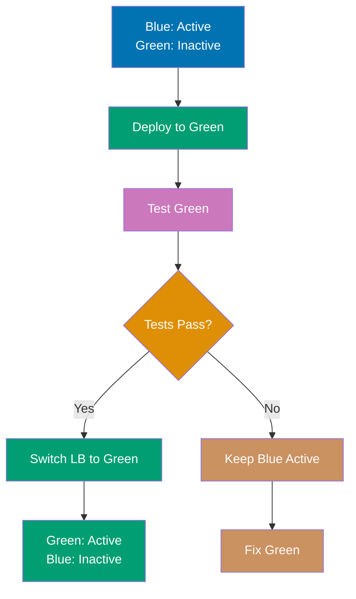

```yaml
# blue_green.yml
---
- name: Blue-Green Deployment
  # => Zero-downtime deployment with instant rollback
  hosts: localhost
  # => Run orchestration from control node
  # => No direct host targeting (uses includes)
  vars:
    active_color: "{{ lookup('file', '/etc/active_color.txt') }}"
    # => Read current active environment
    # => lookup('file', ...): reads file content into variable
    # => File contains: 'blue' or 'green'
    # => Example: active_color = 'blue'
    inactive_color: "{{ 'green' if active_color == 'blue' else 'blue' }}"
    # => Calculate inactive environment (opposite of active)
    # => Ternary conditional: condition ? true_value : false_value
    # => If active='blue': inactive='green'
    # => If active='green': inactive='blue'

  tasks:
    - name: Deploy to inactive environment
      # => Update inactive env without affecting traffic
      include_tasks: deploy.yml
      # => Separate deploy playbook (reusable)
      vars:
        target_hosts: "{{ inactive_color }}_webservers"
        # => Dynamic host group selection
        # => If inactive='green': target 'green_webservers' group
        # => Example: green_webservers = [green1, green2, green3]

    - name: Run smoke tests
      # => Verify inactive environment before cutover
      uri:
        url: "http://{{ inactive_color }}-lb.example.com/health"
        # => Internal load balancer for inactive env
        # => Example: http://green-lb.example.com/health
        status_code: 200
        # => Expect HTTP 200 OK
        # => Fails deployment if unhealthy
        # => Prevents switching to broken environment

    - name: Switch load balancer
      # => Cutover: redirect traffic to newly deployed env
      uri:
        url: "http://lb.example.com/api/switch"
        # => Production LB API endpoint
        method: POST
        body_format: json
        # => Send JSON payload
        body:
          # => Request body
          active: "{{ inactive_color }}"
          # => Tell LB to make inactive active
          # => Example: switch traffic from blue to green
      # => Atomic operation: instant traffic cutover
      # => Users immediately served by new version

    - name: Update active color file
      # => Persist new active environment state
      copy:
        content: "{{ inactive_color }}"
        # => Write new active color to file
        # => Example: 'green' (was 'blue')
        dest: /etc/active_color.txt
        # => State file for next deployment
        # => Next run: green becomes active, blue becomes inactive
```

**Key Takeaway**: Blue-green deployments enable zero-downtime releases and instant rollback by switching between two complete environments.

**Why It Matters**: Blue-green deployments provide instant rollback capability—switch traffic back to blue environment if green fails. The pattern eliminates deployment risk for stateless applications. Entire environment validation happens before traffic switch, catching integration failures that unit tests miss. Netflix and AWS use blue-green for zero-downtime releases at massive scale.

---

## Example 66: Production Pattern - Immutable Infrastructure

Immutable infrastructure replaces servers rather than modifying them. Build new AMIs/images, launch new instances, then terminate old ones.

```yaml
# immutable_deploy.yml
---
- name: Build Golden AMI
  # => Create new machine image with updated code
  hosts: packer_builder
  # => Dedicated host for image building
  # => Isolated from production
  tasks:
    - name: Launch Packer build
      # => Use Packer to build AMI
      command: packer build -var 'version={{ app_version }}' ami-template.json
      # => packer: image building tool
      # => -var: pass variable to template
      # => ami-template.json: defines image configuration
      # => Output: new AMI ID
      register: packer_result
      # => Capture command output
      # => Contains AMI ID in stdout

    - name: Extract AMI ID
      # => Parse AMI ID from Packer output
      set_fact:
        # => Create new fact variable
        new_ami: "{{ packer_result.stdout | regex_search('ami-[a-z0-9]+') }}"
        # => regex_search: extract text matching pattern
        # => Pattern: 'ami-' followed by alphanumeric chars
        # => Example: stdout contains "AMI: ami-0abc123def456"
        # => new_ami = 'ami-0abc123def456'

- name: Deploy New Auto Scaling Group
  # => Replace instances with new AMI
  hosts: localhost
  # => Execute AWS API calls from control node
  tasks:
    - name: Create launch configuration
      # => Define instance launch parameters
      ec2_lc:
        # => EC2 Launch Configuration module
        name: "myapp-{{ app_version }}"
        # => Unique name per version
        # => Example: myapp-v2.5.0
        image_id: "{{ new_ami }}"
        # => Use newly built AMI
        # => Contains updated application code
        instance_type: t3.medium
        # => EC2 instance size
        security_groups: ["sg-123456"]
        # => Firewall rules for instances
      # => Creates immutable launch config
      # => Cannot modify, only create new and switch

    - name: Update Auto Scaling Group
      # => Switch ASG to new launch configuration
      ec2_asg:
        # => EC2 Auto Scaling Group module
        name: myapp-asg
        # => Target ASG name
        launch_config_name: "myapp-{{ app_version }}"
        # => Reference new launch config
        # => ASG will launch instances using new AMI
        min_size: 3
        # => Minimum instances running
        max_size: 6
        # => Maximum instances for scaling
        desired_capacity: 3
        # => Current target instance count
      # => Triggers instance replacement
      # => ASG terminates old instances, launches new ones
      # => Gradual replacement based on ASG health checks

    - name: Wait for new instances healthy
      # => Verify new instances operational
      ec2_instance_facts:
        # => Query EC2 instance information
        filters:
          # => Filter criteria for instances
          "tag:Version": "{{ app_version }}"
          # => Only instances tagged with new version
          "instance-state-name": running
          # => Only running instances
      register: instances
      # => Store query results
      until: instances.instances | length == 3
      # => Retry until 3 instances found
      # => Matches desired_capacity
      retries: 20
      # => Retry up to 20 times
      delay: 30
      # => Wait 30 seconds between retries
      # => Total max wait: 10 minutes
      # => Ensures replacement completed successfully
```

**Key Takeaway**: Immutable infrastructure builds new images and replaces instances entirely. Eliminates configuration drift and enables reliable rollbacks.

**Why It Matters**: Immutable infrastructure eliminates configuration drift—every deployment creates identical servers from golden images. Manual changes to servers are impossible (read-only root filesystems). Rollback becomes "deploy previous AMI" instead of "undo configuration changes." This pattern underpins modern cloud-native architectures at Google, Facebook, and Spotify.

---

## Example 67: Zero-Downtime Deployment Pattern

Combine health checks, load balancer management, and serial execution for truly zero-downtime deployments. Each server is updated while others handle traffic.

```yaml
# zero_downtime.yml
---
- name: Zero-Downtime Deployment
  # => Production-grade deployment pattern
  hosts: webservers
  # => All web servers
  serial: 1
  # => One host at a time (safest)
  # => Ensures N-1 hosts always serving traffic
  max_fail_percentage: 0
  # => Abort on any failure
  # => Zero tolerance for deployment errors

  tasks:
    - name: Pre-deployment health check
      # => Verify host healthy before starting update
      uri:
        url: "http://{{ inventory_hostname }}:8080/health"
        # => Application health endpoint
        # => Direct host query (bypass LB)
        status_code: 200
        # => Expect healthy response
      # => Catches pre-existing issues
      # => Don't attempt update on unhealthy host

    - name: Disable host in load balancer
      # => Remove host from active pool
      haproxy:
        # => HAProxy load balancer module
        backend: web_backend
        # => Backend pool name in HAProxy config
        host: "{{ inventory_hostname }}"
        # => Target host to disable
        state: disabled
        # => Mark as maintenance mode
        # => LB stops routing new requests
        socket: /run/haproxy/admin.sock
        # => Unix socket for HAProxy admin commands
      delegate_to: lb.example.com
      # => Execute on load balancer server
      # => Not on web server being updated

    - name: Wait for connections to drain
      # => Allow active requests to complete
      wait_for:
        # => Wait module (time-based)
        timeout: 30
        # => Wait 30 seconds
        # => Typical max request duration: 10-20s
        # => Buffer for long-running requests
      # => Prevents killing active user sessions
      # => Graceful connection draining

    - name: Deploy application
      # => Update application artifact
      copy:
        src: "myapp-{{ version }}.jar"
        # => New version from control node
        dest: /opt/myapp/app.jar
        # => Overwrite existing version
      notify: Restart application
      # => Trigger service restart handler

    - name: Flush handlers now
      # => Execute handlers immediately
      meta: flush_handlers
      # => Normally handlers run at play end
      # => flush_handlers: run now
      # => Ensures restart completes before health check
      # => Required for proper health verification

    - name: Wait for application startup
      # => Wait for app to bind network port
      wait_for:
        # => Wait for port availability
        port: 8080
        # => Application listen port
        delay: 5
        # => Wait 5 seconds before first check
        # => Allows JVM startup
        timeout: 120
        # => Max wait: 2 minutes
        # => Fail if app doesn't start
      # => Ensures app process running and listening

    - name: Application health check
      # => Verify application functional
      uri:
        url: "http://{{ inventory_hostname }}:8080/health"
        # => Direct health endpoint query
        status_code: 200
        # => Expect healthy response
      retries: 12
      # => Retry up to 12 times
      delay: 5
      # => Wait 5 seconds between retries
      # => Total max wait: 60 seconds
      # => Allows app warmup (DB connections, cache)

    - name: Enable host in load balancer
      # => Return host to active pool
      haproxy:
        backend: web_backend
        host: "{{ inventory_hostname }}"
        state: enabled
        # => Mark as active
        # => LB starts routing requests
        socket: /run/haproxy/admin.sock
      delegate_to: lb.example.com
      # => Execute on LB server

    - name: Wait for host to receive traffic
      # => Allow LB health checks to pass
      pause:
        seconds: 10
        # => Wait 10 seconds
        # => LB health check interval: typically 5s
        # => Ensures LB marks host healthy
      # => Prevents race condition:
      # => host enabled but LB hasn't verified health

  handlers:
    # => Executed when notified by tasks
    - name: Restart application
      # => Restart application service
      service:
        name: myapp
        # => Systemd service name
        state: restarted
        # => Stop then start service
        # => Loads new application code
```

**Key Takeaway**: Zero-downtime deployments require serial execution, LB integration, connection draining, and comprehensive health checks at each stage.

**Why It Matters**: Zero-downtime deployments require coordination of load balancers, health checks, and gradual rollout. Connection draining (30s wait) allows active requests to complete before server shutdown. Per-host health verification prevents deploying broken builds. This pattern enables Netflix to deploy thousands of times per day without user-visible outages.

---

## Example 68: Monitoring Integration

Integrate Ansible with monitoring systems to track deployment progress and trigger alerts. Send notifications to Slack, DataDog, or PagerDuty during critical phases.

```yaml
# monitored_deploy.yml
---
- name: Deployment with Monitoring
  # => Observable deployment with external integrations
  hosts: webservers
  tasks:
    - name: Send deployment start notification
      # => Notify team in real-time
      uri:
        url: "{{ slack_webhook_url }}"
        # => Slack incoming webhook URL
        # => Configured in Slack workspace settings
        method: POST
        # => POST request to webhook
        body_format: json
        # => Send JSON payload
        body:
          # => Slack message payload
          text: "Starting deployment of {{ app_version }} to {{ inventory_hostname }}"
          # => Message text for Slack channel
          # => Example: "Starting deployment of v2.5.0 to web1"
      delegate_to: localhost
      # => Execute webhook call from control node
      # => Not from target server

    - name: Create deployment marker in DataDog
      # => Create event annotation in monitoring dashboard
      uri:
        url: "https://api.datadoghq.com/api/v1/events"
        # => DataDog Events API endpoint
        method: POST
        headers:
          # => API authentication
          DD-API-KEY: "{{ datadog_api_key }}"
          # => DataDog API key from vault/vars
        body_format: json
        body:
          # => Event data
          title: "Deployment Started"
          # => Event title in DataDog
          text: "{{ app_version }} deploying to {{ inventory_hostname }}"
          # => Event description
          tags:
            # => Event tags for filtering
            - "environment:production"
            # => Tag: environment
            - "version:{{ app_version }}"
            # => Tag: deployed version
      delegate_to: localhost
      # => Creates vertical line on graphs
      # => Correlates metric changes with deployments

    - name: Deploy application
      # => Actual deployment task
      copy:
        src: "app-{{ app_version }}.jar"
        dest: /opt/myapp/app.jar
      notify: Restart application

    - name: Check error rate post-deployment
      # => Validate deployment didn't increase errors
      uri:
        url: "{{ metrics_api }}/error_rate?host={{ inventory_hostname }}"
        # => Query metrics API for error rate
        # => Host-specific query
        return_content: yes
        # => Return response body
      register: error_rate
      # => Store API response
      # => Example: { "value": 2.3, "unit": "percent" }
      delegate_to: localhost

    - name: Trigger alert if error rate high
      # => Automated incident creation on anomaly
      uri:
        url: "{{ pagerduty_events_url }}"
        # => PagerDuty Events API v2
        method: POST
        body_format: json
        body:
          # => PagerDuty incident payload
          routing_key: "{{ pagerduty_key }}"
          # => Integration key from PagerDuty service
          event_action: trigger
          # => Action: create new incident
          # => Alternatives: acknowledge, resolve
          payload:
            # => Incident details
            summary: "High error rate after deployment"
            # => Incident title
            severity: critical
            # => Urgency level
            # => Routes to on-call engineer
      when: error_rate.json.value > 5.0
      # => Conditional: only if error rate exceeds threshold
      # => 5.0 = 5% error rate
      # => Triggers immediate response
      delegate_to: localhost
```

**Key Takeaway**: Monitor deployments by integrating with Slack, DataDog, PagerDuty. Send notifications at key phases and trigger alerts on anomalies.

**Why It Matters**: Monitoring integration provides deployment visibility and automated failure detection. Event markers in DataDog dashboards correlate metric changes with deployments. Slack notifications keep teams informed without manual status updates. Automated alerting on error rate spikes enables immediate rollback before user impact spreads.

---

## Example 69: Disaster Recovery Pattern

Automate disaster recovery with playbooks that restore from backups, recreate infrastructure, and verify system integrity. Test DR playbooks regularly.

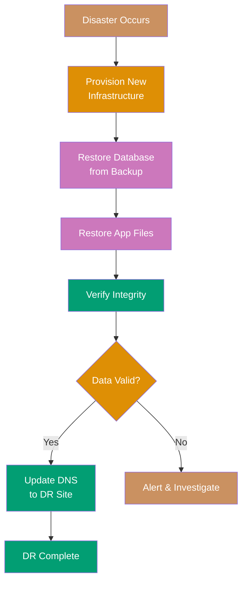

```yaml
# disaster_recovery.yml
---
- name: Disaster Recovery Procedure
  # => Automated DR orchestration
  hosts: localhost
  # => Run from control node (primary site may be down)
  vars:
    backup_date: "{{ lookup('pipe', 'date +%Y-%m-%d') }}"
    # => Get current date for backup selection
    # => lookup('pipe', ...): execute shell command, return output
    # => Example: backup_date = '2025-12-29'

  tasks:
    - name: Provision new infrastructure
      # => Recreate servers in DR location
      include_role:
        # => Execute provisioning role
        name: provision_infrastructure
        # => Role that creates VMs/cloud resources
      vars:
        environment: dr_recovery
        # => Variable for role: target DR environment
        # => Uses DR region, networks, configurations

    - name: Restore database from backup
      # => Restore DB from S3-stored backup
      postgresql_db:
        # => PostgreSQL database module
        name: myapp
        # => Database name to restore
        state: restore
        # => Restore mode (vs dump/present/absent)
        target: "s3://backups/db-{{ backup_date }}.dump"
        # => S3 URL of backup file
        # => Example: s3://backups/db-2025-12-29.dump
        # => Uses AWS credentials from environment
      # => Restores full database schema and data

    - name: Restore application files
      # => Download application backup from S3
      aws_s3:
        # => AWS S3 module
        bucket: backups
        # => S3 bucket name
        object: "app-{{ backup_date }}.tar.gz"
        # => S3 object key (file path)
        dest: /tmp/app-restore.tar.gz
        # => Local destination path
        mode: get
        # => Download mode (vs put/delobj)
      # => Downloads compressed app backup

    - name: Extract application
      # => Uncompress application files
      unarchive:
        # => Archive extraction module
        src: /tmp/app-restore.tar.gz
        # => Source archive path
        dest: /opt/myapp
        # => Extraction destination
        remote_src: yes
        # => Source file on remote host (vs control node)
      # => Extracts all application files to deployment directory

    - name: Verify data integrity
      # => Validate restored data not corrupted
      command: /opt/myapp/bin/verify-data.sh
      # => Custom verification script
      # => Checks: DB row counts, checksums, referential integrity
      register: integrity_check
      # => Capture script output
      failed_when: "'PASS' not in integrity_check.stdout"
      # => Fail task if verification fails
      # => Script must output 'PASS' for success
      # => Prevents activating corrupted DR site

    - name: Update DNS to DR site
      # => Cutover: redirect traffic to DR environment
      route53:
        # => AWS Route53 DNS module
        state: present
        # => Create/update DNS record
        zone: example.com
        # => DNS zone (domain)
        record: app.example.com
        # => DNS record name (subdomain)
        type: A
        # => Record type: A (IPv4 address)
        value: "{{ dr_lb_ip }}"
        # => New IP: DR load balancer
        # => Changes: prod_lb_ip → dr_lb_ip
        ttl: 60
        # => Time to live: 60 seconds
        # => Short TTL for faster failback
      # => DNS propagation: 1-5 minutes
      # => Traffic redirects to DR site

    - name: Send recovery notification
      # => Notify team DR completed
      uri:
        url: "{{ slack_webhook_url }}"
        method: POST
        body:
          text: "DR completed. Services running at DR site."
          # => Slack notification message
      # => Alerts team to monitor DR site
```

**Key Takeaway**: DR playbooks automate infrastructure recreation, data restoration, and traffic cutover. Test regularly to ensure RTO/RPO targets.

**Why It Matters**: Automated disaster recovery reduces RTO (recovery time objective) from hours to minutes. Playbook-driven DR eliminates manual runbooks that become outdated or error-prone. Regular DR testing (monthly or quarterly) validates procedures work before real disasters occur. This automation enables compliance with business continuity requirements.

---

## Example 70: Configuration Drift Detection

Detect configuration drift by comparing desired state (playbooks) against actual state (target hosts). Run in check mode and alert on differences.

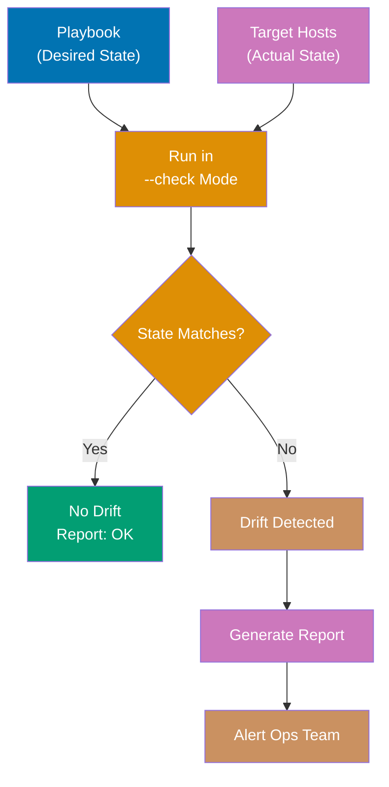

```yaml
# drift_detection.yml
---
- name: Detect Configuration Drift
  # => Continuous compliance monitoring
  hosts: production
  # => All production servers
  check_mode: yes
  # => Don't make changes, only check
  # => Simulates changes, reports what would happen
  # => Safe for production runs
  diff: yes
  # => Show differences between desired and actual
  # => Displays file content changes in output
  tasks:
    - name: Check nginx configuration
      # => Verify nginx config matches template
      template:
        # => Template module (normally writes file)
        src: nginx.conf.j2
        # => Jinja2 template: desired configuration
        dest: /etc/nginx/nginx.conf
        # => Target file path
      register: nginx_drift
      # => Capture result
      # => In check mode: .changed=True if file differs
      # => Actual file NOT modified

    - name: Check service state
      # => Verify service running and enabled
      service:
        name: nginx
        # => Service name
        state: started
        # => Expected: running
        enabled: yes
        # => Expected: start on boot
      register: service_drift
      # => .changed=True if service stopped or disabled

    - name: Check package versions
      # => Verify specific package versions installed
      package:
        name:
          # => List of packages with version constraints
          - nginx=1.18*
          # => Nginx version 1.18.x
          # => * = any patch version
          - postgresql=14*
          # => PostgreSQL version 14.x
        state: present
        # => Must be installed
      register: package_drift
      # => .changed=True if wrong version or missing

    - name: Collect drift report
      # => Aggregate drift findings
      set_fact:
        # => Create summary variable
        drift_detected: >-
          {{
            nginx_drift.changed or
            service_drift.changed or
            package_drift.changed
          }}
          # => Boolean: True if ANY check reported changes
          # => Multi-line YAML: >- (fold, strip trailing newlines)

    - name: Alert on drift
      # => Send webhook notification if drift found
      uri:
        url: "{{ alerting_webhook }}"
        # => Alerting system webhook URL
        method: POST
        body:
          # => Alert payload
          host: "{{ inventory_hostname }}"
          # => Hostname with drift
          drift: "{{ drift_detected }}"
          # => Boolean: drift present
          details:
            # => Breakdown by check
            nginx: "{{ nginx_drift.changed }}"
            # => Config file drift
            service: "{{ service_drift.changed }}"
            # => Service state drift
            packages: "{{ package_drift.changed }}"
            # => Package version drift
      when: drift_detected
      # => Only send alert if drift detected
      # => No alert spam when compliant
      delegate_to: localhost
      # => Execute webhook from control node
```

**Key Takeaway**: Run playbooks in check mode to detect drift without changing systems. Schedule drift detection jobs to catch manual changes.

**Why It Matters**: Drift detection catches manual server changes ("snowflake servers") that break automation. Check mode + scheduled runs (cron every 6 hours) provide continuous compliance validation. Alert-based drift detection enables rapid response to unauthorized changes or failed automation. This pattern prevents production incidents from untracked configuration changes.

---

## Example 71: Multi-Stage Deployment Pipeline

Orchestrate multi-stage deployments (dev → staging → production) with approval gates and environment-specific configurations.

```yaml
# pipeline_deploy.yml
---
- name: Deploy to Development
  # => Stage 1: Development environment
  hosts: dev_webservers
  # => Dev servers (isolated environment)
  vars_files:
    # => Load environment-specific variables
    - vars/dev.yml
    # => Development config: dev DB, debug enabled, etc.
  tasks:
    - include_tasks: deploy_tasks.yml
      # => Reusable deployment tasks
      # => Same tasks for all environments
      # => Variables differ per environment

- name: Run Integration Tests
  # => Validate deployment on dev
  hosts: dev_webservers
  tasks:
    - name: Execute test suite
      # => Run automated tests
      command: /opt/tests/run-integration-tests.sh
      # => Test script: API tests, DB queries, etc.
      register: tests
      # => Capture test results
      failed_when: tests.rc != 0
      # => Fail pipeline if tests fail
      # => rc: return code (0=success, non-zero=failure)
      # => Blocks progression to staging

- name: Deploy to Staging
  # => Stage 2: Staging environment (only if dev tests pass)
  hosts: staging_webservers
  # => Staging servers (production-like)
  vars_files:
    - vars/staging.yml
    # => Staging config: staging DB, prod-like settings
  tasks:
    - include_tasks: deploy_tasks.yml
      # => Same deployment tasks, different vars

- name: Staging Smoke Tests
  # => Quick validation on staging
  hosts: staging_webservers
  tasks:
    - name: Check critical endpoints
      # => Test key application functions
      uri:
        url: "http://{{ inventory_hostname }}/{{ item }}"
        # => Test URL per host
        status_code: 200
        # => Expect successful response
      loop:
        # => Test multiple endpoints
        - health
        # => Health check endpoint
        - api/users
        # => User API
        - api/orders
        # => Orders API
      # => Verifies core functionality works
      # => Faster than full integration tests

- name: Production Approval Gate
  # => Manual checkpoint before production
  hosts: localhost
  # => Run on control node
  tasks:
    - name: Wait for approval
      # => Pause for human decision
      pause:
        prompt: "Approve production deployment? (Enter to continue)"
        # => Manual approval required
        # => Reviewer checks: staging metrics, logs, test results
        # => Enter: proceed to production
        # => Ctrl-C: abort deployment

- name: Deploy to Production
  # => Stage 3: Production (only after approval)
  hosts: prod_webservers
  # => Production servers
  serial: 3
  # => Rolling update: 3 hosts at a time
  # => Gradual rollout for safety
  vars_files:
    - vars/production.yml
    # => Production config: prod DB, optimizations
  tasks:
    - include_tasks: deploy_tasks.yml
      # => Same deployment tasks, production vars
```

**Key Takeaway**: Multi-stage pipelines use separate plays for each environment with tests and approval gates between stages.

**Why It Matters**: Multi-stage pipelines enforce quality gates between environments. Integration tests run in dev before code reaches staging. Manual approval before production prevents untested changes from affecting users. Environment-specific configurations (dev vs staging vs prod) ensure consistent deployment processes while maintaining environment isolation.

---

## Example 72: Secrets Management with HashiCorp Vault

Integrate Ansible with HashiCorp Vault for dynamic secrets. Fetch credentials at runtime instead of storing in Ansible Vault or vars files.

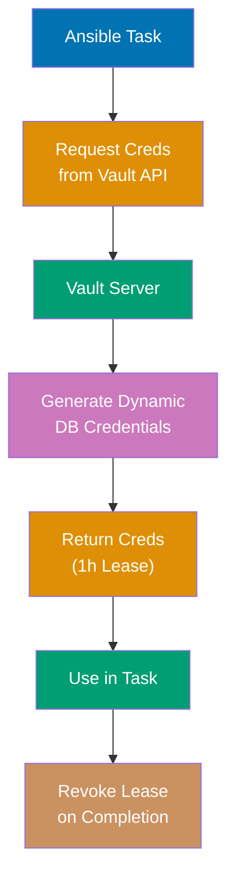

```yaml
# vault_integration.yml
---
- name: Dynamic Secrets from Vault
  # => Runtime secret fetching (no stored credentials)
  hosts: webservers
  vars:
    vault_addr: "https://vault.example.com:8200"
    # => HashiCorp Vault server URL
    # => HTTPS required for production
  tasks:
    - name: Get database credentials from Vault
      # => Request dynamic DB credentials
      uri:
        # => HTTP API call to Vault
        url: "{{ vault_addr }}/v1/database/creds/myapp"
        # => Vault API endpoint
        # => /v1/database/creds/{role}: database secrets engine
        # => {role}: 'myapp' (defines DB permissions)
        method: GET
        # => GET request to read credentials
        headers:
          X-Vault-Token: "{{ lookup('env', 'VAULT_TOKEN') }}"
          # => Authentication token
          # => lookup('env', ...): read environment variable
          # => VAULT_TOKEN: set in CI/CD environment
        return_content: yes
        # => Return response body
      register: db_creds
      # => Store credentials in variable
      # => Contains: username, password, lease_id, lease_duration
      delegate_to: localhost
      # => Execute API call from control node
      no_log: true
      # => Don't log credentials in output
      # => Security: prevents credential exposure in logs

    - name: Configure application with Vault credentials
      # => Write config file with dynamic credentials
      template:
        src: app-config.j2
        # => Template with credential placeholders
        dest: /opt/myapp/config.yml
        # => Application config file
        mode: "0600"
        # => Restrictive permissions: owner read/write only
        # => Prevents other users reading credentials
      vars:
        # => Variables for template
        db_username: "{{ db_creds.json.data.username }}"
        # => Extract username from Vault response
        # => Example: v-token-myapp-AbC123
        db_password: "{{ db_creds.json.data.password }}"
        # => Extract password from Vault response
        # => Example: randomly generated 32-char string
      no_log: true
      # => Don't log task with credentials

    - name: Revoke credentials on failure
      # => Cleanup credentials if deployment fails
      uri:
        url: "{{ vault_addr }}/v1/sys/leases/revoke"
        # => Vault lease revocation endpoint
        method: PUT
        # => PUT request to revoke
        headers:
          X-Vault-Token: "{{ lookup('env', 'VAULT_TOKEN') }}"
        body:
          # => Revocation request payload
          lease_id: "{{ db_creds.json.lease_id }}"
          # => Lease ID from credential response
          # => Identifies credential to revoke
      delegate_to: localhost
      when: ansible_failed_task is defined
      # => Only run if previous task failed
      # => ansible_failed_task: set when failure occurs
      # => Prevents orphaned credentials
```

**Key Takeaway**: HashiCorp Vault integration provides dynamic secrets that auto-expire. Use `no_log` to prevent credential exposure in logs.

**Why It Matters**: HashiCorp Vault provides dynamic secrets with automatic expiration and rotation. Database credentials valid for 1 hour reduce blast radius of credential compromise. Lease revocation on playbook failure prevents orphaned credentials. Vault audit logs track who accessed which secrets, enabling compliance with SOC 2 and PCI DSS requirements.

---

## Example 73: Compliance Auditing

Automate compliance checks (CIS benchmarks, STIG) and generate audit reports. Compare actual configuration against security baselines.

```yaml
# compliance_audit.yml
---
- name: CIS Ubuntu 22.04 Compliance Audit
  # => Security baseline compliance checking
  hosts: all
  # => All managed hosts
  become: yes
  # => Elevated privileges for system checks
  tasks:
    - name: Check SSH configuration
      # => CIS 5.2.x: SSH hardening
      block:
        # => Group related tasks
        - name: Verify PermitRootLogin is disabled
          # => CIS 5.2.10: Disable SSH root login
          lineinfile:
            # => Module to manage lines in files
            path: /etc/ssh/sshd_config
            # => SSH daemon configuration
            regexp: "^PermitRootLogin"
            # => Match line starting with 'PermitRootLogin'
            line: "PermitRootLogin no"
            # => Desired configuration
          check_mode: yes
          # => Don't modify file, only check
          register: ssh_root
          # => Capture result
          # => .changed=True if line missing or different

        - name: Record compliance status
          # => Store check result
          set_fact:
            compliance_ssh_root: "{{ not ssh_root.changed }}"
            # => Compliant if no change needed
            # => not: boolean inversion
            # => True (compliant): file already correct
            # => False (non-compliant): file would change

    - name: Check firewall status
      # => CIS 3.5.1.x: Firewall configuration
      command: ufw status
      # => Query UFW (Uncomplicated Firewall) status
      # => Output: "Status: active" or "Status: inactive"
      register: firewall
      # => Store command output
      changed_when: false
      # => This check never changes state
      # => Prevents misleading 'changed' count
      failed_when: "'Status: active' not in firewall.stdout"
      # => Fail if firewall not active
      # => Compliance requirement: firewall must be enabled

    - name: Check password policy
      # => CIS 5.4.1.1: Password expiration
      command: grep -E '^PASS_MAX_DAYS' /etc/login.defs
      # => Extract password max age setting
      # => grep -E: extended regex
      # => ^PASS_MAX_DAYS: line starting with this
      register: pass_policy
      # => Captures: "PASS_MAX_DAYS 90"
      changed_when: false
      # => Read-only check
      failed_when: pass_policy.stdout.split()[1] | int > 90
      # => Fail if max days > 90
      # => .split()[1]: second word (the number)
      # => | int: convert string to integer
      # => CIS requirement: passwords expire within 90 days

    - name: Generate compliance report
      # => Create audit evidence
      template:
        src: compliance-report.j2
        # => Report template (JSON format)
        dest: "/var/log/compliance-{{ ansible_date_time.date }}.json"
        # => Report file with date stamp
        # => Example: /var/log/compliance-2025-12-29.json
      vars:
        # => Data for report template
        checks:
          # => Compliance check results
          ssh_root_disabled: "{{ compliance_ssh_root }}"
          # => Boolean: True/False
          firewall_active: "{{ 'active' in firewall.stdout }}"
          # => Boolean: firewall enabled
          password_max_days: "{{ pass_policy.stdout.split()[1] }}"
          # => Integer: current setting
      delegate_to: localhost
      # => Write report on control node
      # => Centralizes compliance data
      # => JSON format enables SIEM ingestion
```

**Key Takeaway**: Compliance audits use check mode and assertions to verify security baselines. Generate structured reports for audit trails.

**Why It Matters**: Automated compliance auditing provides continuous security validation. CIS benchmarks and STIG checks run hourly, detecting misconfigurations immediately. JSON-formatted audit reports integrate with SIEM systems for centralized compliance monitoring. This automation reduces compliance audit preparation from weeks to hours.

---

## Example 74: Network Automation - VLAN Configuration

Automate network device configuration using vendor-specific modules. This example configures VLANs on Cisco switches.

```yaml
# network_vlans.yml
---
- name: Configure VLANs on Cisco Switches
  # => Network device automation
  hosts: cisco_switches
  # => Inventory group of Cisco devices
  gather_facts: no
  # => Skip fact gathering (not supported on network devices)
  # => Network modules use device APIs, not Python
  tasks:
    - name: Create VLANs
      # => Define VLANs on switches
      cisco.ios.ios_vlans:
        # => FQCN: cisco.ios collection, ios_vlans module
        # => Cisco IOS VLAN management module
        config:
          # => List of VLAN configurations
          - vlan_id: 10
            # => VLAN number (1-4094)
            name: ENGINEERING
            # => VLAN name (descriptive)
            state: active
            # => Operational state
            # => active: VLAN enabled
            # => suspend: VLAN disabled
          - vlan_id: 20
            name: SALES
            state: active
          - vlan_id: 30
            name: GUEST
            state: active
        state: merged
        # => Configuration merge strategy
        # => merged: add/update VLANs, keep existing
        # => replaced: replace entire VLAN config
        # => deleted: remove specified VLANs
      # => Module connects via SSH/NETCONF
      # => Executes: vlan 10, name ENGINEERING, etc.
      # => Idempotent: no changes if VLANs already configured

    - name: Configure trunk port
      # => Configure switch port for VLAN trunking
      cisco.ios.ios_l2_interfaces:
        # => Layer 2 interface configuration module
        config:
          - name: GigabitEthernet0/1
            # => Interface name
            # => Uplink port to other switches/routers
            mode: trunk
            # => Port mode: trunk (carries multiple VLANs)
            # => vs access (single VLAN)
            trunk:
              # => Trunk-specific settings
              allowed_vlans: 10,20,30
              # => VLANs permitted on trunk
              # => Comma-separated list
              # => Restricts VLAN propagation
        state: replaced
        # => Replace interface config
        # => Removes unspecified settings

    - name: Save configuration
      # => Persist changes to startup config
      cisco.ios.ios_config:
        # => Generic IOS configuration module
        save_when: modified
        # => Save condition: only if changes made
        # => vs always: save every run
        # => Avoids unnecessary NVRAM writes
      # => Executes: copy running-config startup-config
      # => Ensures changes survive reboot
```

**Key Takeaway**: Network modules provide declarative interface to network devices. Use vendor collections (`cisco.ios`, `arista.eos`) for device-specific operations.

**Why It Matters**: Network automation standardizes switch and router configuration across thousands of devices. Ansible modules provide vendor-agnostic abstraction—same playbook pattern works for Cisco, Arista, Juniper with different collections. VLAN provisioning automation reduces network changes from 30 minutes (manual CLI) to 2 minutes (Ansible), eliminating human configuration errors.

---

## Example 75: Container Orchestration - Docker Deployment

Manage Docker containers with Ansible. Deploy multi-container applications with proper networking and volume configuration.

```yaml
# docker_deploy.yml
---
- name: Deploy Docker Application
  # => Multi-container application deployment
  hosts: docker_hosts
  # => Hosts with Docker installed
  tasks:
    - name: Create application network
      # => Isolated network for containers
      docker_network:
        # => Docker network module
        name: myapp_network
        # => Network name
        driver: bridge
        # => Network driver: bridge (default, single-host)
        # => vs overlay (multi-host swarm)
        # => vs host (direct host networking)
      # => Creates isolated network namespace
      # => Containers can communicate via service names

    - name: Deploy PostgreSQL container
      # => Database container
      docker_container:
        # => Container management module
        name: postgres
        # => Container name (unique identifier)
        image: postgres:15
        # => Docker image: postgres version 15
        # => Pulls from Docker Hub if not local
        state: started
        # => Ensure container running
        # => Creates if missing, starts if stopped
        restart_policy: always
        # => Auto-restart on failure/reboot
        # => vs no, on-failure, unless-stopped
        networks:
          # => Network attachments
          - name: myapp_network
            # => Attach to application network
        env:
          # => Environment variables (container config)
          POSTGRES_DB: myapp
          # => Create database named 'myapp'
          POSTGRES_PASSWORD: "{{ db_password }}"
          # => Root password from Ansible vars
        volumes:
          # => Persistent storage
          - postgres_data:/var/lib/postgresql/data
          # => Named volume: postgres_data
          # => Mounted at: /var/lib/postgresql/data
          # => Data survives container recreation

    - name: Deploy application container
      # => Application server container
      docker_container:
        name: myapp
        image: "myapp:{{ version }}"
        # => Custom application image
        # => {{ version }}: variable (e.g., v2.5.0)
        state: started
        restart_policy: always
        networks:
          - name: myapp_network
            # => Same network as database
            # => Can connect via hostname 'postgres'
        env:
          # => Application configuration
          DB_HOST: postgres
          # => Database hostname (container name)
          # => Docker DNS resolves to postgres container IP
          DB_NAME: myapp
          # => Database name
        ports:
          # => Port mapping: host:container
          - "8080:8080"
          # => Expose container port 8080 on host port 8080
          # => External access: http://host-ip:8080

    - name: Wait for application health
      # => Verify application started successfully
      uri:
        url: "http://{{ inventory_hostname }}:8080/health"
        # => Health check endpoint
        status_code: 200
        # => Expect HTTP 200 OK
      retries: 10
      # => Retry up to 10 times
      delay: 3
      # => Wait 3 seconds between retries
      # => Allows container startup time
```

**Key Takeaway**: Docker modules manage containers declaratively. Use networks for container communication and volumes for data persistence.

**Why It Matters**: Docker automation manages containerized applications declaratively. Volume mounts persist data across container recreation. Network isolation prevents direct container communication, forcing explicit service dependencies. This pattern enables microservices deployment where each service runs in isolated containers with defined networking contracts.

---

## Example 76: Kubernetes Deployment

Deploy applications to Kubernetes using Ansible. Apply manifests, wait for rollout completion, and verify pod health.

```yaml
# k8s_deploy.yml
---
- name: Deploy to Kubernetes
  # => Kubernetes application deployment
  hosts: localhost
  # => Execute from control node
  # => Uses kubeconfig for cluster access
  tasks:
    - name: Create namespace
      # => Logical cluster partition
      kubernetes.core.k8s:
        # => Kubernetes module (FQCN)
        # => Uses kubectl/Python Kubernetes client
        state: present
        # => Ensure resource exists
        definition:
          # => Kubernetes manifest (YAML)
          apiVersion: v1
          # => API version for resource type
          kind: Namespace
          # => Resource type: Namespace
          metadata:
            # => Resource metadata
            name: myapp
            # => Namespace name

    - name: Deploy application
      # => Apply deployment manifest
      kubernetes.core.k8s:
        state: present
        namespace: myapp
        # => Target namespace
        definition: "{{ lookup('file', 'k8s/deployment.yml') }}"
        # => Load manifest from file
        # => lookup('file', ...): read file content
        # => deployment.yml: contains Deployment, replicas, containers

    - name: Wait for deployment rollout
      # => Verify deployment completed successfully
      kubernetes.core.k8s_info:
        # => Query Kubernetes resources
        kind: Deployment
        # => Resource type to query
        namespace: myapp
        name: myapp
        # => Deployment name
      register: deployment
      # => Store query result
      # => Contains: spec, status, metadata
      until: deployment.resources[0].status.readyReplicas == 3
      # => Wait until 3 replicas ready
      # => .resources[0]: first (only) deployment
      # => .status.readyReplicas: number of ready pods
      retries: 20
      # => Retry up to 20 times
      delay: 10
      # => Wait 10 seconds between checks
      # => Total max wait: 200 seconds
      # => Ensures rollout completes before proceeding

    - name: Expose service
      # => Create LoadBalancer service
      kubernetes.core.k8s:
        state: present
        namespace: myapp
        definition:
          # => Service manifest
          apiVersion: v1
          kind: Service
          metadata:
            name: myapp
          spec:
            type: LoadBalancer
            # => Service type: LoadBalancer
            # => Cloud provider provisions external LB
            # => vs ClusterIP (internal), NodePort (node-level)
            selector:
              # => Pod selector (label matching)
              app: myapp
              # => Routes traffic to pods with label: app=myapp
            ports:
              # => Port mappings
              - port: 80
                # => External port (LB port)
                targetPort: 8080
                # => Container port
```

**Key Takeaway**: Kubernetes modules enable GitOps workflows. Use `k8s_info` to wait for resources to reach desired state before proceeding.

**Why It Matters**: Kubernetes automation enables GitOps—infrastructure as code stored in Git, automatically deployed via CI/CD. Ansible waits for pod readiness before proceeding, ensuring deployments complete successfully. The `k8s` module provides full Kubernetes API access, enabling complex orchestration like blue-green deployments and canary releases on Kubernetes.

---

## Example 77: Database Migration Automation

Automate database schema migrations as part of deployment pipelines. Run migrations, verify success, and rollback on failure.

```yaml
# db_migration.yml
---
- name: Database Migration
  # => Automated schema migration
  hosts: db_servers
  # => Database server hosts
  tasks:
    - name: Backup database before migration
      # => Safety backup before schema changes
      postgresql_db:
        # => PostgreSQL database module
        name: myapp
        # => Database to backup
        state: dump
        # => Dump mode (vs restore/present/absent)
        target: "/backups/pre-migration-{{ ansible_date_time.epoch }}.sql"
        # => Backup file path with timestamp
        # => {{ ansible_date_time.epoch }}: Unix timestamp
        # => Example: /backups/pre-migration-1735430400.sql
      # => Creates pg_dump of entire database
      # => Enables rollback if migration fails

    - name: Run database migrations
      # => Execute migration tool
      command: /opt/myapp/bin/migrate up
      # => Application migration tool
      # => 'up': apply pending migrations
      # => Example tools: Flyway, Liquibase, custom scripts
      register: migration
      # => Capture migration output
      # => Contains: stdout, stderr, rc (return code)
      failed_when: migration.rc != 0
      # => Fail task if migration command fails
      # => rc != 0: non-zero exit code (error)

    - name: Verify migration success
      # => Validate migration applied correctly
      postgresql_query:
        # => Execute SQL query
        db: myapp
        # => Target database
        query: "SELECT version FROM schema_migrations ORDER BY version DESC LIMIT 1"
        # => Query latest migration version
        # => schema_migrations: migration tracking table
      register: current_version
      # => Store query result
      # => current_version.query_result: latest version number

    - name: Rollback on failure
      # => Error recovery: restore pre-migration state
      block:
        # => Group rollback tasks
        - name: Restore from backup
          # => Restore database from backup
          postgresql_db:
            name: myapp
            state: restore
            # => Restore mode
            target: "/backups/pre-migration-{{ ansible_date_time.epoch }}.sql"
            # => Backup file from first task
            # => Reverts database to pre-migration state
      rescue:
        # => Execute if restore fails
        - name: Alert on rollback failure
          # => Critical alert: rollback failed
          uri:
            url: "{{ pagerduty_url }}"
            # => PagerDuty incident API
            method: POST
            body:
              message: "CRITICAL: Migration rollback failed"
              # => High-severity alert
          delegate_to: localhost
          # => Execute from control node
      when: migration.failed
      # => Only run if migration failed
      # => migration.failed: True if migration task failed
```

**Key Takeaway**: Automate migrations with pre-migration backups and rollback procedures. Use blocks for error handling and recovery.

**Why It Matters**: Database migrations are high-risk operations that require careful orchestration. Automated pre-migration backups enable instant rollback on failure. Schema versioning tracking (via migrations table) prevents duplicate or out-of-order migrations. This automation reduces database deployment risks from manual SQL execution errors.

---

## Example 78: Self-Healing Infrastructure

Implement self-healing by detecting failures and automatically remediating. Monitor service health and restart failed services.

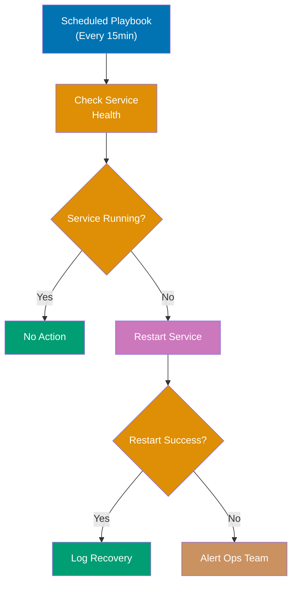

```yaml
# self_healing.yml
---
- name: Self-Healing Monitor
  # => Automated failure detection and recovery
  hosts: all
  # => Monitor all managed hosts
  tasks:
    - name: Check critical services
      # => Gather current service states
      service_facts:
      # => Populates ansible_facts.services
      # => Dictionary of all services and their states

    - name: Restart failed nginx
      # => Auto-remediate nginx failures
      service:
        name: nginx
        # => Service to manage
        state: restarted
        # => Restart action (stop + start)
      when: ansible_facts.services['nginx.service'].state != 'running'
      # => Conditional: only if nginx not running
      # => ansible_facts.services: dict from service_facts
      # => ['nginx.service'].state: service status
      # => Auto-restarts failed service

    - name: Check disk space
      # => Monitor filesystem utilization
      shell: df -h / | tail -1 | awk '{print $5}' | sed 's/%//'
      # => df -h /: disk usage for root filesystem
      # => tail -1: last line (data row)
      # => awk '{print $5}': 5th column (usage percentage)
      # => sed 's/%//': remove % symbol
      # => Output: integer (e.g., "87")
      register: disk_usage
      # => Store percentage value
      changed_when: false
      # => Read-only check (never changes state)

    - name: Clean logs if disk full
      # => Disk space remediation
      file:
        path: /var/log/old-logs
        # => Old log directory
        state: absent
        # => Delete directory and contents
      when: disk_usage.stdout | int > 85
      # => Trigger if usage exceeds 85%
      # => | int: convert string to integer
      # => Prevents disk full outages

    - name: Verify database connectivity
      # => Test database reachability
      postgresql_ping:
        # => PostgreSQL connectivity check
        db: myapp
        # => Target database
      register: db_ping
      # => Capture ping result
      # => .failed: True if connection fails
      ignore_errors: yes
      # => Don't fail entire playbook on DB ping failure
      # => Allows recovery attempt

    - name: Restart database on failure
      # => Database auto-remediation
      service:
        name: postgresql
        # => PostgreSQL service
        state: restarted
      when: db_ping.failed
      # => Only if connectivity check failed
      # => Attempts to recover failed DB service

    - name: Alert if remediation fails
      # => Escalate persistent failures
      uri:
        url: "{{ alerting_webhook }}"
        # => Alerting webhook URL
        method: POST
        body:
          host: "{{ inventory_hostname }}"
          # => Host with persistent failure
          issue: "Self-healing failed"
          # => Alert message
      when: db_ping.failed
      # => Alert if DB still unreachable
      # => Human intervention required
      delegate_to: localhost
```

**Key Takeaway**: Self-healing playbooks run periodically (cron/systemd timers) to detect and remediate common failures automatically.

**Why It Matters**: Self-healing automation reduces mean-time-to-recovery (MTTR) from hours to minutes. Automated service restart handles 90% of common failures (OOM crashes, deadlocks) without human intervention. Disk cleanup prevents storage exhaustion incidents. Scheduled self-healing playbooks (every 15 minutes) provide continuous resilience, essential for maintaining SLAs in 24/7 operations.

---

## Example 79: Infrastructure Cost Optimization

Automate cost optimization by identifying and remediating wasteful resource usage (unused volumes, stopped instances, oversized VMs).

```yaml
# cost_optimization.yml
---
- name: Identify Unused Resources
  # => Cloud resource waste detection
  hosts: localhost
  # => Execute AWS API calls from control node
  tasks:
    - name: Find unattached EBS volumes
      # => Detect orphaned storage volumes
      ec2_vol_info:
        # => Query EBS volume information
        region: us-east-1
        # => AWS region to query
        filters:
          # => Filter criteria
          status: available
          # => Unattached volumes (not in use)
          # => vs 'in-use' (attached to instances)
      register: unused_volumes
      # => Store list of orphaned volumes
      # => unused_volumes.volumes: list of volume objects

    - name: Delete old unattached volumes
      # => Remove long-orphaned volumes
      ec2_vol:
        # => EBS volume management module
        id: "{{ item.id }}"
        # => Volume ID to delete
        # => item: current loop iteration
        state: absent
        # => Delete volume
      loop: "{{ unused_volumes.volumes }}"
      # => Iterate over all unattached volumes
      when: item.create_time | to_datetime < (ansible_date_time.epoch | int - 2592000)
      # => Conditional: only if volume older than 30 days
      # => item.create_time: volume creation timestamp
      # => | to_datetime: convert to datetime object
      # => ansible_date_time.epoch - 2592000: 30 days ago
      # => 2592000 = 30 days * 86400 seconds/day
      # => Prevents deleting recently detached volumes

    - name: Find stopped instances running >7 days
      # => Detect long-stopped instances
      ec2_instance_info:
        # => Query EC2 instance information
        region: us-east-1
        filters:
          instance-state-name: stopped
          # => Only stopped instances
          # => Running instances excluded
      register: stopped_instances
      # => Store list of stopped instances

    - name: Terminate long-stopped instances
      # => Remove instances stopped for extended period
      ec2_instance:
        # => EC2 instance management module
        instance_ids: "{{ item.instance_id }}"
        # => Instance to terminate
        state: absent
        # => Terminate instance (permanent)
      loop: "{{ stopped_instances.instances }}"
      # => Iterate over stopped instances
      when: item.launch_time | to_datetime < (ansible_date_time.epoch | int - 604800)
      # => Only if stopped >7 days
      # => 604800 = 7 days * 86400 seconds/day
      # => Assumes: stopped >7 days = forgotten/unused

    - name: Generate cost report
      # => Cost savings documentation
      template:
        src: cost-report.j2
        # => HTML report template
        dest: "/reports/cost-optimization-{{ ansible_date_time.date }}.html"
        # => Report file with date
        # => Example: /reports/cost-optimization-2025-12-29.html
      vars:
        # => Data for report
        deleted_volumes: "{{ unused_volumes.volumes | length }}"
        # => Count of deleted volumes
        terminated_instances: "{{ stopped_instances.instances | length }}"
        # => Count of terminated instances
      # => Report shows cost savings achieved
```

**Key Takeaway**: Automate cost optimization by periodically identifying and removing unused cloud resources.

**Why It Matters**: Cost optimization automation prevents cloud waste accumulation. Orphaned EBS volumes cost \$0.10/GB/month—1000 unused 100GB volumes = \$10,000/month waste. Stopped instances still incur EBS and snapshot costs. Scheduled cleanup (weekly) continuously optimizes spend, reducing cloud costs 15-30% without manual auditing.

---

## Example 80: Chaos Engineering with Ansible

Implement chaos engineering experiments to test system resilience. Inject failures and verify recovery mechanisms.

```yaml
# chaos_experiment.yml
---
- name: Chaos Engineering - Random Service Failure
  # => Controlled failure injection testing
  hosts: production
  # => Production environment (controlled chaos)
  serial: 1
  # => One host at a time (limit blast radius)
  tasks:
    - name: Select random service to disrupt
      # => Randomize failure target
      set_fact:
        chaos_target: "{{ ['nginx', 'myapp', 'postgres'] | random }}"
        # => Pick random service from list
        # => | random: Jinja2 filter for random selection
        # => Example output: 'nginx' or 'myapp' or 'postgres'
      # => Simulates unpredictable real-world failures

    - name: Record experiment start
      # => Log chaos experiment for monitoring correlation
      uri:
        url: "{{ metrics_api }}/chaos/start"
        # => Metrics API endpoint
        method: POST
        body:
          # => Experiment metadata
          host: "{{ inventory_hostname }}"
          # => Target host
          service: "{{ chaos_target }}"
          # => Service being disrupted
      delegate_to: localhost
      # => Creates annotation in monitoring dashboards

    - name: Stop service
      # => Inject failure: stop service
      service:
        name: "{{ chaos_target }}"
        # => Dynamically selected service
        state: stopped
        # => Stop service (simulates crash)
      # => Triggers monitoring alerts
      # => Tests alert detection speed

    - name: Wait for monitoring to detect failure
      # => Give monitoring time to detect and alert
      pause:
        seconds: 30
        # => Wait 30 seconds
        # => Allows alert evaluation and firing
      # => Tests: monitoring detects failures within SLA

    - name: Verify alerting fired
      # => Confirm alert system detected failure
      uri:
        url: "{{ alerting_api }}/check"
        # => Query active alerts
        method: GET
      register: alerts
      # => Store current alerts
      # => alerts.json.active_alerts: list of active alert names
      failed_when: chaos_target not in alerts.json.active_alerts
      # => Fail if alert NOT fired
      # => Validates alerting works
      # => Tests monitoring effectiveness
      delegate_to: localhost

    - name: Allow self-healing to trigger
      # => Wait for auto-remediation system
      pause:
        seconds: 60
        # => Wait 60 seconds
        # => Self-healing playbook runs every 15 minutes
        # => May need multiple runs to detect + remediate
      # => Tests automated recovery mechanisms

    - name: Verify service recovered
      # => Confirm auto-remediation restored service
      service_facts:
      # => Gather current service states
      failed_when: ansible_facts.services[chaos_target + '.service'].state != 'running'
      # => Fail if service still stopped
      # => .service: systemd service suffix
      # => Tests self-healing effectiveness
      # => Validates resilience automation

    - name: Record experiment completion
      # => Log experiment outcome
      uri:
        url: "{{ metrics_api }}/chaos/complete"
        method: POST
        body:
          host: "{{ inventory_hostname }}"
          service: "{{ chaos_target }}"
          outcome: "{{ 'success' if ansible_failed_result is not defined else 'failure' }}"
          # => success: monitoring + recovery worked
          # => failure: resilience gap detected
      delegate_to: localhost
      # => Documents experiment results for analysis
```

**Key Takeaway**: Chaos engineering validates monitoring and auto-remediation. Run experiments in controlled manner to test system resilience.

**Why It Matters**: Chaos engineering validates resilience before real failures occur. Automated failure injection (random service stops) tests monitoring, alerting, and self-healing systems under controlled conditions. Experiments verify SLAs hold during partial failures, building confidence in production resilience. Netflix pioneered this practice (Chaos Monkey) to ensure their systems survive datacenter failures.

---

**🎯 Advanced level complete!** You've mastered custom modules, collections, testing frameworks, performance optimization, production deployment patterns, and operational automation. You now have comprehensive Ansible knowledge from beginner fundamentals through advanced production patterns, covering 95% of real-world use cases.
