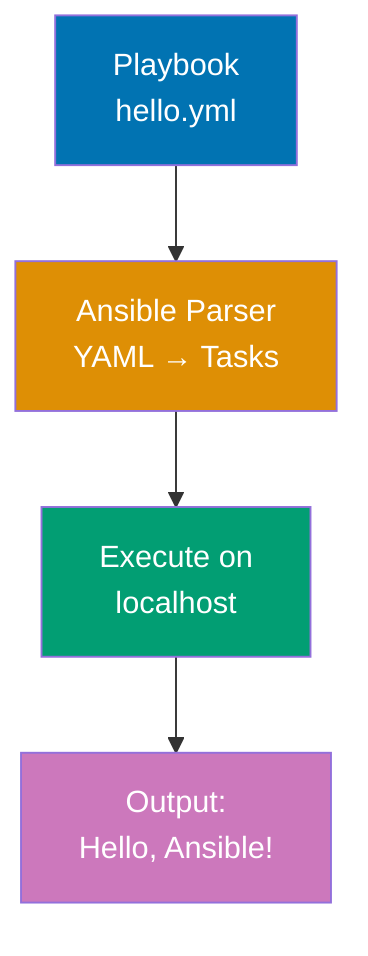
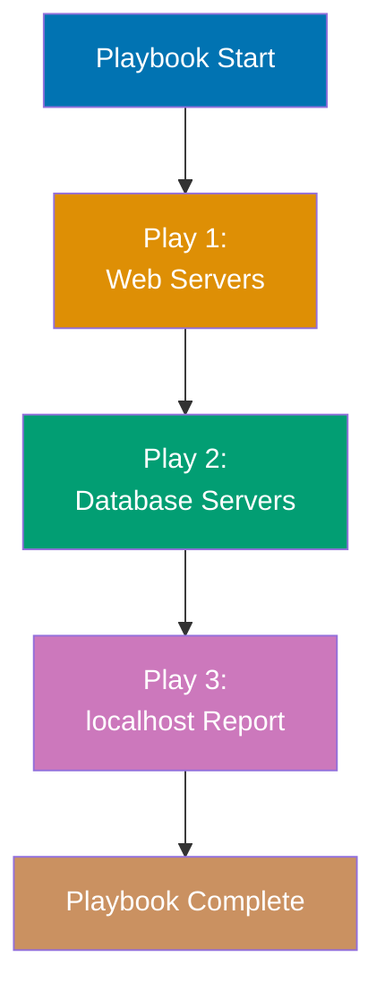
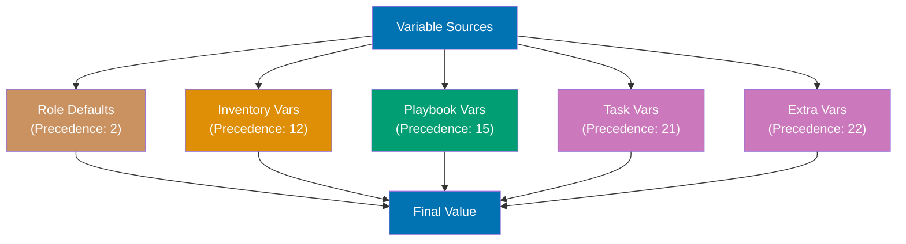
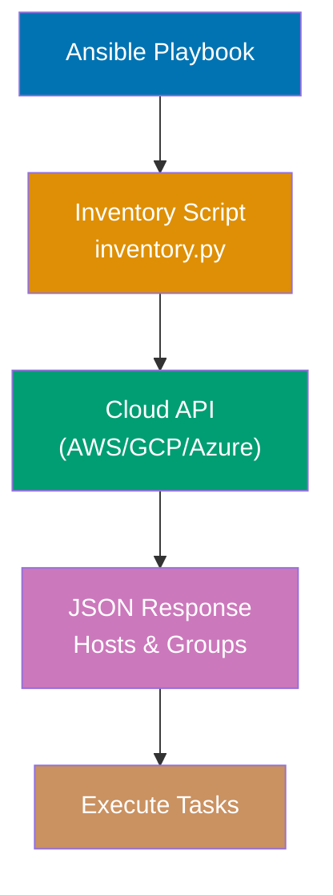
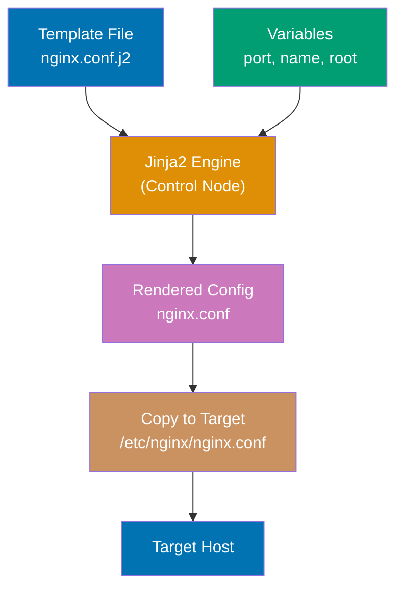
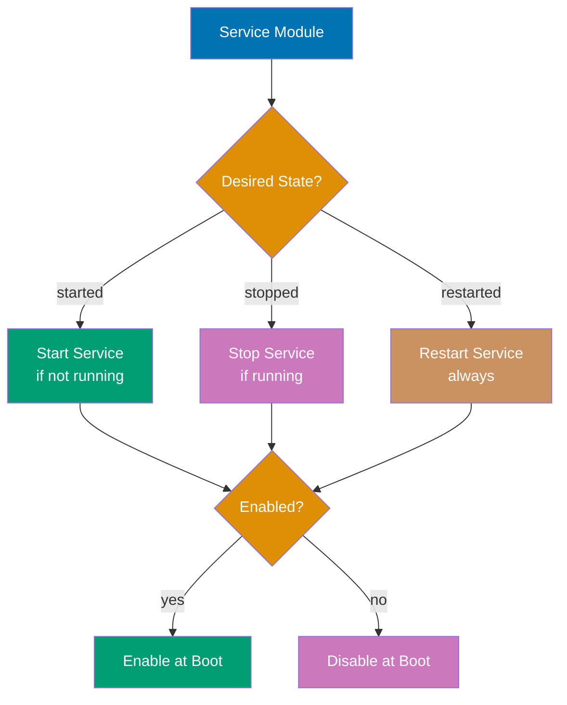
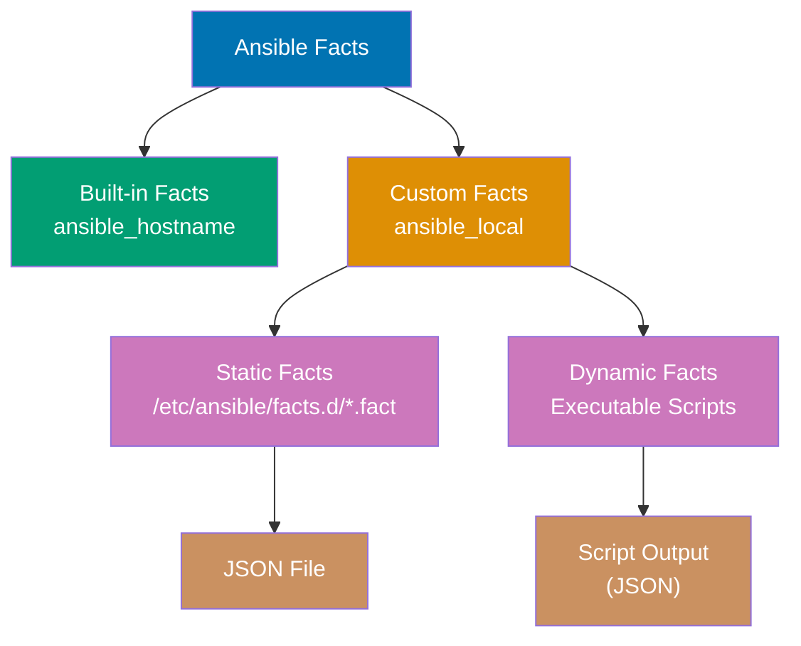
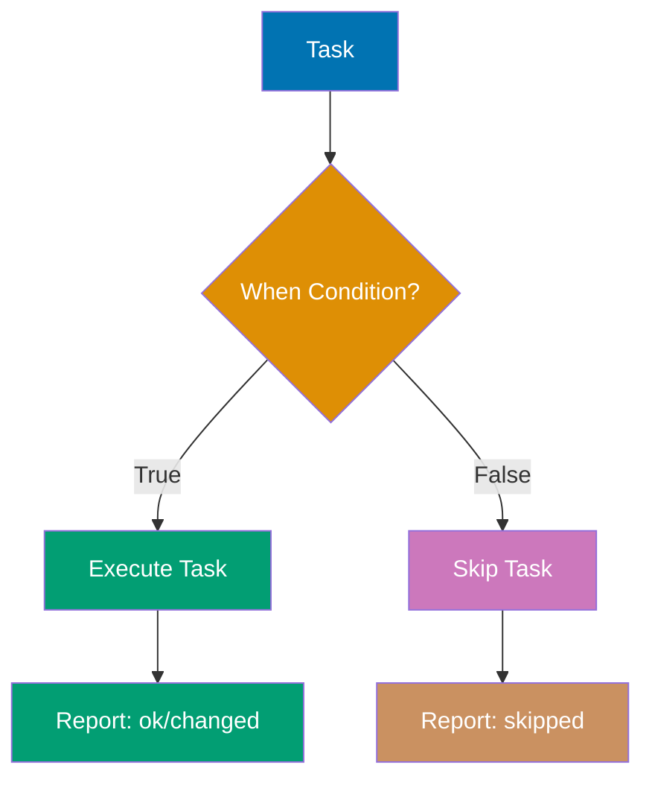

Learn Ansible fundamentals through 27 annotated code examples. Each example is self-contained, runnable, and heavily commented to show what each line does, expected outputs, and key takeaways.

## Group 1: Hello World & Installation

### Example 1: Hello World Playbook

Ansible playbooks are YAML files describing desired system state. Every playbook needs a name, hosts target, and tasks list. This minimal example runs a single command on localhost to verify Ansible installation.



**Code**:

```yaml
---
# hello.yml - Minimal working playbook demonstrating Ansible basics
- name:
 Hello World Playbook # => Human-readable play name (appears in console output)
 # => Required field for documentation and logging
 hosts:
 localhost # => Target host pattern (special name for local machine)
 # => Accepts hostname, group name, or pattern (e.g., web*)
 gather_facts:
 false # => Skip automatic fact collection (setup module)
 # => Improves execution speed when facts not needed
 # => Default is true (runs setup module before tasks)

 tasks: # => List of actions to execute on target hosts
 # => Tasks run sequentially from top to bottom
 - name:
 Print greeting # => Task description (appears in console output)
 # => Best practice: use descriptive names for debugging
 ansible.builtin.debug: # => Debug module prints messages to console
 # => No state changes (idempotent, safe for testing)
 # => FQCN format: namespace.collection.module
 msg:
 "Hello, Ansible!" # => Message to display during playbook execution
 # => Can be string or variable using Jinja2 syntax
 # => Output: ok: [localhost] => { "msg": "Hello, Ansible!" }
 # => Task status is "ok" (not "changed") because debug doesn't modify state
```

**Run**: `ansible-playbook hello.yml`

**Key Takeaway**: Every playbook is a YAML file with plays containing tasks. The `debug` module prints messages without changing system state, making it safe for testing.

**Why It Matters**: Ansible playbooks replace manual SSH commands that are error-prone and unscalable. While manually SSHing to configure one server is manageable, NASA and Walmart manage thousands of servers with identical Ansible playbooks—ensuring consistent configuration across entire fleets. The declarative YAML format is human-readable and version-controllable, enabling Infrastructure as Code practices where configuration changes are audited, reviewed, and rolled back just like application code.

---

### Example 2: Ansible Installation Verification

Before writing automation, verify Ansible installation and Python environment. This playbook uses the `setup` module to gather system facts and display Ansible version information.

**Code**:

```yaml
---
# verify.yml - Verification playbook for Ansible installation
- name:
 Verify Ansible Installation # => Play name describing verification purpose
 # => Appears in console output during execution
 hosts:
 localhost # => Execute tasks on local machine only
 # => Uses connection: local (no SSH required)
 gather_facts:
 true # => Enable automatic fact collection (setup module)
 # => Default behavior (explicitly shown for clarity)
 # => Runs ansible.builtin.setup before tasks
 # => Setup module collects 100+ facts about target system
 # => Facts include: OS, network, hardware, Python, filesystem info

 tasks: # => Task list begins after fact gathering completes
 # => All facts available as variables in tasks
 - name: Display Ansible version # => Task 1: Show installed Ansible version information
 # => Helps verify correct Ansible installation
 ansible.builtin.debug: # => Debug module prints variables to console
 # => Non-destructive (no state changes)
 # => FQCN format: ansible.builtin.debug
 msg:
 "Ansible version: {{ ansible_version.full }}" # => Access nested fact variable
 # => ansible_version is dict with 'full', 'major', 'minor' keys
 # => Jinja2 {{ }} syntax interpolates variables
 # => ansible_version.full contains complete version (e.g., "2.15.0")
 # => Output: ok: [localhost] => { "msg": "Ansible version: 2.15.0" }

 - name:
 Display Python version # => Task 2: Show Python interpreter version
 # => Confirms Python compatibility with Ansible
 ansible.builtin.debug: # => Debug module for console output
 msg:
 "Python version: {{ ansible_python_version }}" # => Access Python version fact
 # => Collected during fact gathering
 # => ansible_python_version contains version string (e.g., "3.11.6")
 # => Ansible requires Python 2.7+ or 3.5+ on target hosts
 # => Modern Ansible (2.12+) prefers Python 3.x
 # => Output: Python version: 3.11.6 (interpreter at ansible_python_interpreter path)

 - name:
 Display operating system # => Task 3: Show OS distribution and version
 # => Useful for environment-aware playbooks
 ansible.builtin.debug: # => Debug output module
 msg:
 "OS: {{ ansible_distribution }} {{ ansible_distribution_version }}" # => Combine two separate facts
 # => String concatenation with space
 # => ansible_distribution: OS family (Ubuntu, Debian, RedHat, CentOS, Fedora, etc.)
 # => ansible_distribution_version: Version number (22.04, 20.04, 9, 8, etc.)
 # => Detected from /etc/os-release or equivalent system files
 # => Output: OS: Ubuntu 22.04 (parsed from system identification files)
 # => Enables conditional logic: when: ansible_distribution == "Ubuntu"
```

**Run**: `ansible-playbook verify.yml`

**Key Takeaway**: Ansible facts are variables automatically collected from target hosts. Access facts using Jinja2 syntax `{{ variable_name }}`. Disable fact gathering with `gather_facts: false` to speed up playbooks when facts aren't needed.

**Why It Matters**: Ansible's agentless architecture uses only SSH connections—no daemon installation or maintenance required. Fact gathering automatically detects OS versions, Python interpreters, and hardware specs, enabling environment-aware automation that adapts to different systems. This eliminates brittle shell scripts that break when OS versions change, allowing the same playbook to work across Ubuntu 20.04, 22.04, and RHEL 8/9 without modification.

---

## Group 2: Playbook Basics & YAML Syntax

### Example 3: Multi-Task Playbook

Playbooks execute tasks sequentially from top to bottom. Each task runs a module with specific parameters. Task execution stops if a task fails unless error handling is configured.

**Code**:

```yaml
---
# multi_task.yml - Sequential task execution demonstration
- name:
 Multi-Task Playbook Example # => Play showing task execution order
 # => Demonstrates sequential processing and dependencies
 hosts:
 localhost # => Execute on local machine only
 # => No remote SSH connection needed
 gather_facts:
 false # => Disable automatic fact collection
 # => Improves execution speed when facts not needed
 # => Default is true (setup module runs before tasks)

 tasks: # => Task list begins (executed top-to-bottom)
 # => Each task completes before next task starts
 # => Playbook stops if any task fails (unless ignore_errors: true)
 - name: Task 1 - Create directory # => First task in execution sequence
 # => Task names appear in console output
 ansible.builtin.file: # => File module for filesystem operations
 # => No content transfer (unlike copy module)
 # => Idempotent: safe to run multiple times
 path:
 /tmp/ansible_demo # => Directory path to create
 # => Absolute path recommended for reliability
 # => Parent directory /tmp must exist
 state:
 directory # => Ensure path is a directory (not file or symlink)
 # => Creates directory if missing
 # => Verifies existing directory attributes
 mode:
 "0755" # => POSIX permissions (octal notation, quotes required)
 # => 0755 = rwxr-xr-x (owner: rwx, group: rx, others: rx)
 # => Sets permissions atomically with creation
 # => changed: [localhost] (directory created or permissions modified)
 # => ok: [localhost] (directory exists with correct permissions already)
 # => Task fails if /tmp doesn't exist (parent must be present)
 # => Idempotent: running again produces same result

 - name:
 Task 2 - Create file in directory # => Second task (depends on task 1 completing)
 # => Uses directory created by previous task
 ansible.builtin.file: # => File module with different state parameter
 # => Same module, different operation
 path:
 /tmp/ansible_demo/test.txt # => Full file path (directory + filename)
 # => Parent directory created by task 1
 # => Must be inside existing directory
 state:
 touch # => Create empty file or update modification time
 # => Like Linux touch command
 # => Updates mtime and atime if file exists
 mode:
 "0644" # => File permissions (rw-r--r--)
 # => Owner: read/write, group: read, others: read
 # => Typical permission for text files
 # => changed: [localhost] (file created or timestamps updated)
 # => ok: [localhost] (if file exists with same attributes)
 # => Creates zero-byte file if missing
 # => Updates modification time if file already exists

 - name:
 Task 3 - Write content to file # => Third task modifies existing file
 # => Writes actual data to file created by task 2
 ansible.builtin.copy: # => Copy module with content parameter
 # => Can write inline content without source file
 # => Also supports file-to-file copying via src
 dest:
 /tmp/ansible_demo/test.txt # => Destination file path (overwrite target)
 # => File must exist or will be created
 content:
 "Hello from Ansible\n" # => String content to write
 # => \n adds newline at end
 # => Overwrites entire file content
 # => Can use 'src: /path/to/file' instead for file copying
 # => content parameter useful for small, inline data
 # => changed: [localhost] (content written to file)
 # => Replaces entire file content with this string
 # => Idempotent: compares content checksum before writing
 # => ok if file already contains exact same content

 - name:
 Task 4 - Display file content # => Fourth task reads file for verification
 # => Demonstrates command module and register
 ansible.builtin.command: # => Command module executes shell commands
 # => No shell interpreter (safer than shell module)
 # => Cannot use pipes, redirects, or variables
 cmd:
 cat /tmp/ansible_demo/test.txt # => Read file content command
 # => Standard Linux cat command
 # => Output goes to stdout
 register:
 file_content # => Save command results to variable
 # => Creates dict with stdout, stderr, rc, cmd keys
 # => Accessible in later tasks via {{ file_content }}
 # => changed: [localhost] (command module ALWAYS reports changed)
 # => Use changed_when: false to override this behavior
 # => Command module doesn't detect idempotency automatically
 # => file_content.stdout contains command output
 # => file_content.rc contains return code (0 = success)

 - name:
 Task 5 - Print file content # => Final task displays captured output
 # => Shows how to use registered variables
 ansible.builtin.debug: # => Debug module prints to console
 # => Non-destructive (no state changes)
 # => Useful for displaying variables and debugging
 msg:
 "File content: {{ file_content.stdout }}" # => Access stdout from registered variable
 # => Jinja2 syntax {{ }} interpolates variable
 # => file_content is dict with multiple keys
 # => file_content structure: {stdout: "..", stderr: "..", rc: 0, cmd: ".."}
 # => Output: File content: Hello from Ansible
 # => Debug tasks NEVER report changed status (always ok)
 # => Useful for verification and troubleshooting playbooks
```

**Run**: `ansible-playbook multi_task.yml`

**Key Takeaway**: Tasks execute sequentially in order. Use `register` to capture task output (stdout, stderr, return code) into a variable for later use. Most modules are idempotent—running twice produces the same result.

**Why It Matters**: Idempotency is Ansible's killer feature—running the same playbook 100 times produces the same final state, preventing configuration drift that causes production incidents. Manual configurations accumulate changes over time ("I'll just quickly edit this file."), leading to servers that are impossible to replicate. Companies like Cisco use Ansible to guarantee that any server can be rebuilt from scratch using version-controlled playbooks, eliminating snowflake servers and undocumented changes.

---

### Example 4: YAML Syntax and Structure

YAML is whitespace-sensitive and uses indentation (2 spaces) for structure. Lists use `-` prefix, dictionaries use `key: value` format. Multi-line strings support folded (`>`) and literal (`|`) styles.

**Code**:

```yaml
---
# yaml_syntax.yml - Comprehensive YAML syntax demonstration
- name:
 YAML Syntax Demonstration # => Play showing YAML data structure capabilities
 # => Demonstrates strings, numbers, lists, dicts, multi-line
 hosts:
 localhost # => Execute on local machine only
 # => No remote SSH needed
 gather_facts:
 false # => Disable fact gathering
 # => Not needed for syntax demonstration
 # => Improves execution speed

 # Variables section (YAML dictionary at play level)
 vars: # => Play-level variable definitions
 # => All variables accessible in tasks via Jinja2 {{ var_name }}
 # => Variables persist throughout entire play
 simple_string:
 "Hello" # => String value (quotes optional for simple text)
 # => Without special chars, "Hello" same as Hello
 # => Quotes required for: colons, braces, brackets, etc.
 simple_number:
 42 # => Integer value (no quotes needed)
 # => YAML infers type from format
 # => Can be used in math: {{ simple_number + 8 }}
 simple_bool:
 true # => Boolean value (multiple valid formats)
 # => Accepts: true/false, yes/no, on/off
 # => Case-insensitive in YAML
 # => Rendered as True in Python, true in JSON

 # List syntax (ordered array data structure)
 simple_list: # => List declaration using dash (-) prefix syntax
 # => Lists are ordered sequences (maintain insertion order)
 # => Zero-indexed (first item is index 0)
 - item1 # => First list element (index 0)
 # => Access via {{ simple_list[0] }} returns "item1"
 - item2 # => Second list element (index 1)
 # => Access via {{ simple_list[1] }} returns "item2"
 - item3 # => Third list element (index 2)
 # => Access via {{ simple_list[2] }} returns "item3"
 # => Can iterate with loops: 
 # => List length: {{ simple_list | length }} returns 3

 # Dictionary syntax (key-value map data structure)
 simple_dict: # => Dictionary declaration using key: value format
 # => Dictionaries are unordered collections (pre-Python 3.7)
 # => Keys must be strings, values can be any type
 key1:
 value1 # => First key-value pair
 # => Access via dot notation: {{ simple_dict.key1 }}
 # => Or bracket notation: {{ simple_dict['key1'] }}
 key2:
 value2 # => Second key-value pair
 # => Keys must be unique (duplicates overwrite)
 # => Both syntaxes access same value
 # => Can check key existence: 
 # => Dictionary keys: {{ simple_dict.keys() }}

 # Multi-line string - Folded scalar (joins with spaces)
 folded_string: > # => Folded block scalar (> symbol indicates folding)
 This is a long string
 that will be folded into
 a single line with spaces.
 # => Folding process: joins lines with single space between
 # => Result: "This is a long string that will be folded into a single line with spaces."
 # => Trailing newline added automatically
 # => Useful for long descriptions, documentation, help text
 # => Preserves single line for word wrapping

 # Multi-line string - Literal scalar (preserves formatting)
 literal_string: | # => Literal block scalar (| symbol preserves newlines)
 Line 1
 Line 2
 Line 3
 # => Each newline preserved exactly as written
 # => Result: "Line 1\nLine 2\nLine 3\n" (explicit \n characters)
 # => Trailing newline added automatically
 # => Useful for: config files, scripts, SQL queries, formatted output
 # => Indentation within block is significant

 tasks: # => Task list begins
 # => Only one task in this demonstration
 - name:
 Display variables # => Task outputs all defined variable values
 # => Shows how Jinja2 interpolates each type
 ansible.builtin.debug: # => Debug module for console output
 # => Non-destructive (no state changes)
 # => Useful for displaying and verifying variables
 msg: | # => Multi-line literal message (uses | scalar)
 String: {{ simple_string }}
 Number: {{ simple_number }}
 Bool: {{ simple_bool }}
 List: {{ simple_list }}
 Dict: {{ simple_dict }}
 Folded: {{ folded_string }}
 Literal: {{ literal_string }}
 # => Each line shows: Label: <value>
 # => Jinja2 {{ }} interpolates variables into string
 # => List shows as JSON array: ['item1', 'item2', 'item3']
 # => Dict shows as JSON object: {'key1': 'value1', 'key2': 'value2'}
 # => Output displays actual values with proper formatting
 # => Debug module converts Python objects to readable strings
 # => Useful for troubleshooting variable content
```

**Run**: `ansible-playbook yaml_syntax.yml`

**Key Takeaway**: YAML uses 2-space indentation (never tabs). Use `>` for long strings that should be joined, `|` for strings that need to preserve line breaks. Lists and dictionaries can be nested arbitrarily deep.

**Why It Matters**: YAML's human-readable syntax lowers the barrier for operations teams unfamiliar with programming. Unlike JSON (which requires strict quoting and trailing commas) or XML (with verbose tags), YAML configuration files read almost like documentation. This accessibility enables infrastructure teams to collaborate on automation without Python/Ruby expertise, democratizing configuration management beyond traditional development teams. The declarative format also makes peer review during pull requests straightforward—reviewers see exactly what state will be enforced.

---

### Example 5: Multiple Plays in One Playbook

A playbook can contain multiple plays targeting different hosts or requiring different privilege levels. Each play is a separate `-` entry in the root YAML list.



**Code**:

```yaml
---
# multi_play.yml - Multiple plays in single playbook file
# Demonstrates sequential play execution and independent play settings

# Play 1: Setup phase (initialization)
- name:
 Play 1 - Setup Phase # => First play in playbook execution sequence
 # => Plays execute sequentially (Play 1 → Play 2 → Play 3)
 hosts:
 localhost # => Execute on local machine only
 # => No remote SSH connection
 gather_facts:
 false # => Disable fact gathering for this play
 # => Improves execution speed when facts not needed
 # => Each play has independent gather_facts setting
 # => Play-level settings: hosts, gather_facts, become, vars, etc.
 # => Settings apply only to this play's tasks

 tasks: # => Task list scoped to Play 1 only
 # => Tasks in other plays don't see these task names
 - name:
 Initialize setup # => Setup initialization task
 # => Task name appears in console output
 ansible.builtin.debug: # => Debug module for informational output
 # => Safe (no state changes, no side effects)
 msg:
 "Starting multi-play playbook" # => Informational message string
 # => Visible in playbook execution output
 # => Output: ok: [localhost] => { "msg": "Starting multi-play playbook" }
 # => Debug tasks execute immediately without external effects
 # => Useful for logging playbook progress

# Play 2: Configuration phase (main operations)
- name:
 Play 2 - Configuration Phase # => Second play begins after Play 1 completes
 # => Play 1 must finish successfully before Play 2 starts
 hosts:
 localhost # => Same target host as Play 1
 # => Each play has independent host targeting
 # => Could target different hosts (e.g., webservers vs databases)
 gather_facts:
 true # => Enable fact gathering for this play
 # => Independent setting (different from Play 1's false)
 # => Setup module runs before tasks execute
 # => Facts collected in this play are available to:
 # => 1. All tasks in Play 2
 # => 2. All tasks in Play 3 (facts persist across plays)
 # => Fact gathering happens once per playbook run per host

 tasks: # => Task list scoped to Play 2
 # => New task namespace (independent from Play 1 tasks)
 - name:
 Display hostname # => Task uses fact collected during gather_facts
 # => Demonstrates fact usage in tasks
 ansible.builtin.debug: # => Debug module for output
 msg:
 "Configuring {{ ansible_hostname }}" # => Jinja2 variable interpolation
 # => ansible_hostname from gathered facts
 # => Facts automatically available as variables
 # => ansible_hostname populated by setup module's fact collection
 # => Output: ok: [localhost] => { "msg": "Configuring localhost" }
 # => hostname value comes from system identification
 # => Facts persist in memory for subsequent plays

# Play 3: Reporting phase (final summary)
- name:
 Play 3 - Reporting Phase # => Third play executes after Play 2 completes
 # => All previous plays must succeed before this runs
 hosts:
 localhost # => Same target host
 # => Consistent targeting across all plays
 gather_facts:
 false # => Skip fact gathering for this play
 # => Performance optimization (facts already collected)
 # => Facts from Play 2 still accessible
 # => Reuses facts collected in Play 2 (facts persist in memory)
 # => Fact persistence eliminates redundant setup module execution
 # => Common pattern: gather facts once, use in multiple plays

 tasks: # => Final task list scoped to Play 3
 # => Last set of operations before playbook exit
 - name:
 Generate report # => Final reporting task
 # => Summarizes playbook completion
 ansible.builtin.debug: # => Debug module for summary output
 msg:
 "Playbook execution complete" # => Completion message
 # => Confirms successful execution
 # => Output: ok: [localhost] => { "msg": "Playbook execution complete" }
 # => Playbook exits with success status after this task
 # => All three plays completed sequentially
```

**Run**: `ansible-playbook multi_play.yml`

**Key Takeaway**: Multiple plays enable orchestration across different host groups or privilege levels. Each play can have independent settings for fact gathering, privilege escalation, and variables. Plays execute sequentially.

**Why It Matters**: Complex deployments require coordinated actions across different server tiers—database migrations before application updates, load balancer configuration after web server deployment. Multi-play playbooks replace fragile bash scripts that hardcode server lists and fail silently mid-execution. Organizations managing microservices architectures use multi-play orchestration to deploy across dozens of service types in correct dependency order, with each play targeting appropriate host groups and privilege levels.

---

### Example 6: Playbook Variables and Precedence

Variables can be defined in multiple locations: playbook vars, command-line, inventory. Understanding variable precedence prevents unexpected values in production.



**Code**:

```yaml
---
# variables.yml - Variable precedence demonstration
- name:
 Variable Precedence Example # => Play demonstrating Ansible's precedence hierarchy
 # => Shows how variables override each other
 hosts:
 localhost # => Execute on local machine only
 # => No remote SSH needed
 gather_facts:
 false # => Disable fact gathering
 # => Not needed for variable demonstration
 # => Improves execution speed

 # Play-level variables (precedence level: 15 out of 22)
 vars: # => Variable declarations at play scope
 # => Ansible has 22 precedence levels total
 # => Play vars sit in middle (level 15)
 # => Lower levels: defaults, inventory
 # => Higher levels: task vars, extra vars
 environment:
 "development" # => String variable with default value
 # => Defined in playbook (precedence 15)
 # => Can be overridden by CLI extra-vars (precedence 22)
 # => Useful for environment-specific configuration
 app_name:
 "MyApp" # => Application name variable
 # => String value accessible in all play tasks
 # => Accessed via {{ app_name }} in tasks
 # => Play-level scope (not accessible in other plays)
 app_port:
 8080 # => Port number variable (integer type)
 # => YAML infers type from format (no quotes = number)
 # => Can be used in calculations: {{ app_port + 1 }}
 # => Playbook vars can be overridden by inventory or extra-vars

 tasks: # => Task list begins
 # => All play-level vars accessible in tasks
 - name: Display variables # => Task 1: Show current variable values
 # => Demonstrates variable access via Jinja2
 ansible.builtin.debug: # => Debug module for console output
 # => Non-destructive output operation
 msg: | # => Multi-line literal scalar (preserves newlines)
 Environment: {{ environment }}
 App: {{ app_name }}
 Port: {{ app_port }}
 # => Jinja2 {{ }} syntax interpolates variables into strings
 # => Each line shows: Label: <value>
 # => environment, app_name, app_port from play vars above
 # => Output shows actual values after precedence resolution:
 # => Environment: development
 # => App: MyApp
 # => Port: 8080
 # => Values can change if overridden by CLI -e flag

 # Task-level variable demonstration (precedence level: 21)
 - name:
 Override with task vars # => Task 2: Task-scoped variable example
 # => Demonstrates highest precedence (except extra-vars)
 ansible.builtin.debug: # => Debug output module
 msg:
 "Task-level environment: {{ task_env }}" # => References task-scoped variable
 # => task_env defined below in this task only
 vars: # => Task-scoped variables (precedence: 21)
 # => Highest precedence except extra-vars (22)
 # => Only accessible within THIS task
 task_env:
 "production" # => Task-level variable definition
 # => Precedence 21 beats play vars (15)
 # => Overrides any lower-precedence task_env
 # => Scope limited to this task only
 # => Higher precedence than play vars (15 < 21)
 # => Cannot be accessed from other tasks
 # => Output: Task-level environment: production
 # => task_env variable exists only during this task execution
 # => Attempting {{ task_env }} in other tasks would fail
```

**Run**:

- `ansible-playbook variables.yml` → Uses playbook vars
- `ansible-playbook variables.yml -e "environment=production"` → CLI extra-vars override (precedence: 22)

**Key Takeaway**: Variable precedence from lowest to highest: role defaults < inventory < playbook vars < task vars < extra-vars (`-e`). Use extra-vars for environment-specific overrides in CI/CD pipelines.

**Why It Matters**: Variable precedence enables the same playbook to deploy to development, staging, and production with different configurations via `-e` flags. CI/CD pipelines use extra-vars to inject environment-specific credentials, API endpoints, and scaling parameters without modifying version-controlled playbooks. This separation of code (playbooks) from configuration (variables) is critical for security—production secrets never appear in git repositories, only injected at runtime from secure vaults.

---

## Group 3: Inventory Management

### Example 7: Static Inventory (INI Format)

Inventory files define target hosts and groups. INI format is simplest for static infrastructure. Hosts can belong to multiple groups for flexible targeting.

**Code**:

Create inventory file `inventory.ini`:

```ini
# inventory.ini - Static inventory in INI format
# Ungrouped hosts (not in any group, still accessible via 'all')
standalone.example.com # => Host without group membership
 # => Reachable via: ansible standalone.example.com -m ping

# Group: webservers (logical grouping of web tier hosts)
[webservers] # => Group header (INI section format)
 # => Create logical grouping for fleet operations
web1.example.com ansible_host=192.168.1.10 # => Inventory hostname with IP override
 # => DNS name: web1.example.com
 # => Actual IP: 192.168.1.10 (ansible_host connection variable)
web2.example.com ansible_host=192.168.1.11 # => Second webserver with IP override
 # => Connects to 192.168.1.11 via SSH
web3.example.com ansible_port=2222 # => Third webserver with custom SSH port
 # => Default port 22 overridden to 2222
 # => Useful for security hardening (non-standard SSH ports)

# Group: databases (database tier hosts)
[databases] # => Database group header
 # => Separate from webservers for targeted operations
db1.example.com # => Database primary server
 # => Uses default connection settings (SSH port 22, current user)
db2.example.com ansible_user=dbadmin # => Database replica with custom SSH user
 # => Connects as 'dbadmin' instead of current user
 # => Requires SSH key or password for dbadmin

# Group of groups (parent group containing other groups)
[production:children] # => Parent group syntax: [groupname:children]
 # => Contains other groups, not individual hosts
webservers # => Include all hosts from webservers group
 # => Expands to: web1, web2, web3
databases # => Include all hosts from databases group
 # => Expands to: db1, db2
# => Result: 'production' contains 5 hosts (web1, web2, web3, db1, db2)
# => Enables targeting entire production environment: ansible production -m ping

# Group variables (apply to all hosts in group)
[webservers:vars] # => Variables for webservers group
 # => Applied to web1, web2, web3 automatically
ansible_python_interpreter=/usr/bin/python3 # => Override Python interpreter path
 # => Required when default Python is 2.x
 # => Ansible requires Python on target hosts
http_port=80 # => Custom variable (not Ansible built-in)
 # => Accessible in playbooks as {{ http_port }}
 # => Used for application configuration

[databases:vars] # => Variables for databases group
 # => Applied to db1, db2
db_port=5432 # => PostgreSQL default port
 # => Custom variable for database configuration
 # => Accessible as {{ db_port }} in playbooks
```

**Playbook using inventory**:

```yaml
---
# inventory_demo.yml
- name: Use Inventory Groups # => Demonstrate inventory-based targeting
 hosts: webservers # => Target all hosts in webservers group
 # => Expands to: web1, web2, web3 from inventory file
 # => Ansible connects to each host via SSH sequentially or parallel (forks)
 gather_facts: false # => Skip fact gathering for speed

 tasks: # => Tasks execute on ALL hosts in webservers group
 - name: Display host information # => Show per-host information
 ansible.builtin.debug: # => Debug module runs on each target host
 msg: "Host {{ inventory_hostname }} on port {{ http_port }}" # => inventory_hostname is built-in variable
 # => inventory_hostname contains current host's name from inventory
 # => http_port comes from [webservers:vars] section (value: 80)
 # => Runs on web1, web2, web3 (all webservers group members)
 # => Output: Host web1.example.com on port 80
 # => Output: Host web2.example.com on port 80
 # => Output: Host web3.example.com on port 80
```

**Run**: `ansible-playbook -i inventory.ini inventory_demo.yml`

**Key Takeaway**: Inventory files map logical names to physical hosts. Groups enable targeting multiple hosts with one playbook. Host and group variables customize behavior per environment.

**Why It Matters**: Static inventory files replace hardcoded IP addresses scattered across deployment scripts. When a server's IP changes, you update one inventory file instead of hunting through dozens of scripts. Grouping enables fleet-wide operations—`ansible webservers -m service -a "name=nginx state=restarted"` restarts nginx on all web servers simultaneously, replacing tedious manual SSH loops. ---

### Example 8: Static Inventory (YAML Format)

YAML inventory provides better structure for complex hierarchies and variables. Functionally equivalent to INI but more readable for nested groups.

**Code**:

Create inventory file `inventory.yml`:

```yaml
---
# inventory.yml - Static inventory in YAML format
all: # => Root group containing all hosts in inventory
 # => Special group automatically created by Ansible
 # => Contains both standalone hosts and grouped hosts
 hosts: # => Host definitions at root level
 # => Hosts here belong to 'all' group only (ungrouped)
 standalone.example.com: # => Ungrouped host entry
 # => Empty dict means no host-specific variables
 # => Reachable via: ansible standalone.example.com -m ping

 children: # => Nested groups under 'all' parent group
 # => Groups organize hosts logically (web tier, db tier, etc.)
 webservers: # => Webservers group definition
 # => Equivalent to [webservers] in INI format
 hosts: # => Host list for webservers group
 # => Each entry can have host-specific variables
 web1.example.com: # => First webserver entry
 # => Indented dict contains host variables
 ansible_host:
 192.168.1.10 # => Connection IP override
 # => Ansible connects to 192.168.1.10 instead of DNS lookup
 web2.example.com: # => Second webserver
 ansible_host:
 192.168.1.11 # => IP override for web2
 # => Enables static IP targeting
 web3.example.com: # => Third webserver with custom SSH port
 ansible_port:
 2222 # => Override default SSH port (22 → 2222)
 # => Security hardening via non-standard port
 vars: # => Group-level variables for all webservers
 # => Applied to web1, web2, web3 automatically
 ansible_python_interpreter:
 /usr/bin/python3 # => Python 3 interpreter path
 # => Required when Python 2.x is system default
 # => Ansible modules require Python on targets
 http_port:
 80 # => Custom application variable
 # => Accessible in playbooks as {{ http_port }}
 # => Not an Ansible built-in (user-defined)

 databases: # => Database group definition
 # => Separate tier from webservers
 hosts: # => Database host list
 db1.example.com: # => Primary database server
 # => Empty dict (no host-specific variables)
 # => Uses group vars and defaults
 db2.example.com: # => Replica database server
 ansible_user:
 dbadmin # => SSH username override
 # => Connects as 'dbadmin' user instead of current user
 # => Requires SSH key or password for dbadmin account
 vars: # => Database group variables
 # => Applied to db1, db2
 db_port:
 5432 # => PostgreSQL default port
 # => Custom variable for database configuration
 # => Accessible as {{ db_port }} in playbooks

 production: # => Parent group containing other groups
 # => Enables hierarchy: production → webservers/databases → hosts
 children: # => List of child groups (not hosts)
 # => Only groups allowed here (no individual hosts)
 webservers: # => Include webservers group (web1, web2, web3)
 # => All hosts from webservers become production members
 databases: # => Include databases group (db1, db2)
 # => All hosts from databases become production members
 vars: # => Variables applied to ALL production hosts
 # => Inherited by both webservers and databases groups
 environment:
 production # => Environment identifier
 # => Accessible as {{ environment }}
 # => Used for environment-specific logic in playbooks
 # => production group contains 5 total hosts
```

**Run**: `ansible-playbook -i inventory.yml playbook.yml`

**Key Takeaway**: YAML inventory scales better than INI for complex hierarchies. Use YAML when you have many nested groups or extensive variables. Both formats work identically from Ansible's perspective.

**Why It Matters**: As infrastructure grows from dozens to hundreds of servers, inventory organization becomes critical. YAML's hierarchical structure naturally represents multi-tier architectures (production/staging/dev environments, each with web/app/database layers, each with primary/replica configurations). Complex inventories in INI format become unmanageable—YAML's nested syntax makes relationships explicit, preventing mistakes like accidentally deploying to production when targeting staging. Large enterprises maintain YAML inventories with thousands of hosts organized into logical hierarchies that mirror their infrastructure topology.

---

### Example 9: Inventory Host Patterns

Ansible supports powerful patterns for targeting hosts: wildcards, ranges, unions, intersections, and exclusions. Patterns enable surgical targeting without creating explicit groups.

**Code**:

```yaml
---
# patterns.yml
# Pattern examples (use with existing inventory)
# => Demonstrates host targeting patterns without inventory modification

# Target single host (most specific pattern)
- name: Single Host # => Most specific targeting pattern
 # => No wildcards, no groups, exact match only
 hosts:
 web1.example.com # => Exact hostname match from inventory
 # => Targets only this specific host
 # => No pattern matching or expansion
 # => Use case: one-off operations on individual servers
 # => Debugging, emergency fixes, specific maintenance
 tasks:
 - ansible.builtin.debug:
 msg="Single host" # => Executes only on web1
 # => Single execution output
 # => Output: ok: [web1.example.com] => { "msg": "Single host" }
 # => Other hosts in inventory remain untouched

# Target all hosts in group
- name: All Webservers # => Group-based targeting
 hosts: webservers # => All members of webservers group
 # => Expands to all hosts defined in [webservers] section
 # => web1.example.com, web2.example.com, web3.example.com
 tasks:
 - ansible.builtin.debug: msg="All webservers" # => Executes on each webserver
 # => Output appears 3 times (once per host)

# Wildcard pattern (all hosts starting with 'web')
- name: Wildcard Pattern # => Glob-style pattern matching
 hosts: web* # => Matches any hostname starting with 'web'
 # => Asterisk (*) wildcard matches zero or more characters
 # => Matches: web1, web2, web3, webserver, web-prod, etc.
 # => Does NOT match groups, only individual hostnames
 tasks:
 - ansible.builtin.debug: msg="Wildcard match" # => Runs on all web* hosts
 # => Pattern matching happens at inventory parsing time

# Union of groups (hosts in EITHER group)
- name: Union Pattern # => Combine multiple groups
 hosts: webservers:databases # => Colon (:) operator creates union
 # => Targets hosts in webservers OR databases (logical OR)
 # => Includes: web1, web2, web3, db1, db2 (5 hosts total)
 # => Duplicates removed automatically if host in both groups
 tasks:
 - ansible.builtin.debug: msg="Web or DB servers" # => Runs on union set
 # => 5 separate task executions

# Intersection of groups (hosts in BOTH groups)
- name: Intersection Pattern # => Hosts in multiple groups
 hosts: webservers:&production # => Colon-ampersand (:&) creates intersection
 # => Targets hosts in webservers AND production (logical AND)
 # => Only includes hosts that are members of BOTH groups
 # => Useful for filtering by environment (dev/staging/prod)
 tasks:
 - ansible.builtin.debug: msg="Webservers in production" # => Runs on intersection
 # => Fewer hosts than webservers alone

# Exclusion pattern (hosts in first group but NOT second)
- name: Exclusion Pattern # => Subtract hosts from targeting
 hosts: webservers:!web3.example.com # => Colon-exclamation (:!) excludes hosts
 # => Targets webservers EXCEPT web3.example.com (logical subtraction)
 # => Includes: web1, web2 (excludes web3)
 # => Exclusion can be hostname or group name
 tasks:
 - ansible.builtin.debug: msg="Webservers except web3" # => Runs on web1, web2 only
 # => web3 skipped entirely, not even shown in output

# Complex pattern combining operations
- name: Complex Pattern # => Multi-operation pattern
 hosts: webservers:&production:!web3.example.com # => Combines intersection and exclusion
 # => Read left-to-right: (webservers ∩ production) - web3
 # => Step 1: Hosts in webservers AND production
 # => Step 2: Remove web3.example.com from result
 # => Useful for maintenance windows, canary deployments
 tasks:
 - ansible.builtin.debug: msg="Production webservers except web3" # => Surgical targeting
 # => Targets production webservers with one host excluded
```

**Run**: `ansible-playbook -i inventory.yml patterns.yml --list-hosts` (shows matched hosts without running tasks)

**Key Takeaway**: Master patterns for ad-hoc targeting without modifying inventory. Use `:` for union, `:&` for intersection, `:!` for exclusion. Combine patterns for complex targeting like "all production webservers except maintenance hosts".

**Why It Matters**: Pattern-based targeting enables surgical operations during incidents without editing inventory files. During a production outage, you can restart services on "production webservers except the canary server" with a single pattern, avoiding the delay of inventory modifications and git commits. Patterns also enable maintenance windows—exclude specific hosts undergoing upgrades from automated configuration runs. This flexibility is crucial for 24/7 operations where inventory changes would introduce unacceptable delays during incident response.

---

### Example 10: Dynamic Inventory Basics

Dynamic inventory pulls host information from external sources (cloud APIs, CMDBs, scripts). Ansible executes an inventory script that outputs JSON with host and group data.



**Code**:

Create dynamic inventory script `inventory.py`:

```python
#!/usr/bin/env python3
# inventory.py (executable: chmod +x inventory.py)
# => Dynamic inventory script that outputs JSON to Ansible
# => Must be executable: chmod +x inventory.py before use
# => Ansible invokes this script to discover hosts dynamically
import json # => JSON library for formatting output
 # => Required for converting Python dict to JSON string
import sys # => System library for command-line argument parsing
 # => Used to check --list vs --host invocation mode

def get_inventory():
 """Return inventory in Ansible's expected JSON format"""
 # => Function constructs inventory structure as Python dictionary
 # => Ansible expects specific JSON structure with groups and hosts
 # => Must include _meta, groups, and 'all' group
 inventory = { # => Main inventory dictionary
 # => Top-level keys: _meta, group names, all
 "_meta": { # => Meta section for host variables
 # => Performance optimization to avoid multiple --host calls
 # => Including hostvars here prevents Ansible from calling --host for each host
 # => Without _meta, Ansible calls --host N times (slow for large inventories)
 # => With _meta: Ansible calls --list once, gets everything
 "hostvars": { # => Host-specific variables dictionary
 # => Key: hostname, Value: dict of variables
 "web1.local": { # => First host's variable dictionary
 # => Hostname must match exactly in hosts list
 "ansible_host": "192.168.1.10", # => SSH connection IP address
 # => Overrides DNS resolution for this host
 "http_port": 8080 # => Custom application variable
 # => Accessible in playbooks as {{ http_port }}
 # => User-defined (not Ansible built-in)
 },
 "web2.local": { # => Second host's variable dictionary
 # => Separate from web1 variables
 "ansible_host": "192.168.1.11", # => Different SSH IP for web2
 # => Each host has unique IP
 "http_port": 8080 # => Same http_port as web1
 # => Common configuration across group
 }
 }
 },
 "webservers": { # => Group definition (logical grouping)
 # => Group name used in playbook hosts: webservers
 # => Groups enable fleet operations across multiple hosts
 "hosts": ["web1.local", "web2.local"], # => List of group member hostnames
 # => Hostnames must match keys in hostvars
 # => Python list format
 "vars": { # => Group-level variables dictionary
 # => Apply to ALL hosts in this group
 "environment": "production" # => Environment identifier variable
 # => Accessible as {{ environment }}
 # => All hosts in webservers group inherit this variable
 # => Overrides host-level vars if conflict exists
 }
 },
 "all": { # => Special 'all' group (implicit in all inventories)
 # => Automatically includes ALL hosts across ALL groups
 # => Variables here apply to EVERY host (global scope)
 "vars": { # => Global variables for all hosts
 # => Lowest precedence (overridden by group/host vars)
 "ansible_python_interpreter": "/usr/bin/python3" # => Python interpreter path
 # => Ensures Python 3 usage on all targets
 # => Ensures Python 3 usage on all target systems
 # => Prevents Python 2 compatibility issues
 }
 }
 }
 return inventory # => Return complete inventory dictionary
 # => Will be converted to JSON by caller

if __name__ == "__main__":
 # => Script entry point (executed when run directly)
 # => Ansible invokes script with two possible command-line modes:
 # => 1. --list: get all inventory (called once)
 # => 2. --host <hostname>: get single host vars (called per host if no _meta)
 if len(sys.argv) == 2 and sys.argv[1] == "--list":
 # => --list mode: Return complete inventory (groups, hosts, vars)
 # => Ansible calls this ONCE per playbook run for full inventory
 # => sys.argv = ["inventory.py", "--list"]
 inventory = get_inventory() # => Generate inventory data structure
 # => Calls function defined above
 print(json.dumps(inventory, indent=2)) # => Output JSON to stdout
 # => indent=2 makes JSON human-readable
 # => Ansible parses stdout as inventory data
 # => No other output allowed (corrupts JSON)
 elif len(sys.argv) == 3 and sys.argv[1] == "--host":
 # => --host mode: Return variables for specific host
 # => Ansible calls --host <hostname> for each host if _meta missing
 # => sys.argv = ["inventory.py", "--host", "web1.local"]
 # => hostname = sys.argv[2] (e.g., "web1.local")
 print(json.dumps({})) # => Return empty dict (hostvars already in --list)
 # => Performance optimization: empty because _meta provides vars
 # => Performance: hostvars in _meta section eliminates N --host calls
 # => For 100 hosts: 1 --list call instead of 1 --list + 100 --host calls
 else:
 # => Invalid usage: neither --list nor --host provided
 # => Or wrong number of arguments
 print("Usage: inventory.py --list or --host <hostname>") # => Error message to stderr
 # => Shows correct invocation
 sys.exit(1) # => Non-zero exit code (1) signals error to Ansible
 # => Ansible aborts playbook execution on error
```

**Run**:

- `./inventory.py --list` → See JSON output
- `ansible-playbook -i inventory.py playbook.yml` → Use dynamic inventory

**Key Takeaway**: Dynamic inventory scripts must support `--list` (all hosts/groups) and `--host <name>` (single host vars). Use `_meta.hostvars` in `--list` response for performance (avoids N `--host` calls). In production, use cloud provider inventory plugins instead of custom scripts.

**Why It Matters**: Cloud environments with auto-scaling make static inventory files obsolete—servers appear and disappear hourly. Dynamic inventory queries AWS/GCP/Azure APIs at runtime, ensuring playbooks target currently-running instances rather than outdated lists. This eliminates the classic failure mode where automation runs against terminated instances or misses newly-launched servers, ensuring configuration management stays synchronized with actual infrastructure.

---

## Group 4: Core Modules

### Example 11: Command vs Shell Modules

`command` module is safe but limited (no pipes, redirects, variables). `shell` module provides full shell access but introduces security risks. Prefer `command` when possible for idempotency and safety.

**Code**:

```yaml
---
# command_vs_shell.yml - Demonstrates security and functionality differences
- name: Command vs Shell Comparison # => Compare safe (command) vs powerful (shell) modules
 hosts: localhost # => Execute on local machine
 gather_facts: false # => Skip fact collection (not needed)

 tasks: # => Task list demonstrating module differences
 # command module - Safe but limited (no shell interpreter)
 - name: Using command module (safe) # => Task 1: Safe command execution
 ansible.builtin.command: # => Command module bypasses shell
 # => No shell injection risk (safe for user input)
 # => Cannot use pipes, redirects, wildcards, variables
 cmd:
 echo "Hello World" # => Command with arguments
 # => Executes directly via exec() system call
 # => No /bin/bash or /bin/sh involved
 register:
 cmd_result # => Save task output to variable
 # => Stores stdout, stderr, rc (return code)
 # => changed: [localhost] (command module ALWAYS reports changed)
 # => Use changed_when: false to override this behavior
 # => stdout: "Hello World" (command output)

 - name: Display command result # => Task 2: Show command module output
 ansible.builtin.debug: # => Debug module for console output
 msg:
 "Command output: {{ cmd_result.stdout }}" # => Access stdout from registered variable
 # => cmd_result is dict with stdout/stderr/rc keys
 # => Output: Command output: Hello World
 # => Debug tasks never report changed status

 # command module - FAILS with shell features
 - name: Command module with pipe (FAILS) # => Task 3: Demonstrate command limitations
 ansible.builtin.command: # => Command module doesn't support pipes
 cmd:
 echo "test" | grep test # => Pipe character | not interpreted
 # => Passed literally to echo command
 # => ERROR: echo tries to output string "test | grep test"
 ignore_errors:
 true # => Continue playbook execution despite failure
 # => Prevents playbook abort on failed task
 # => failed: [localhost] (command module rejects shell metacharacters)
 # => Error message explains pipes/redirects require shell module

 # shell module - Full shell access (powerful but risky)
 - name: Using shell module (powerful but risky) # => Task 4: Full shell capabilities
 ansible.builtin.shell: # => Shell module invokes /bin/sh (or SHELL env var)
 # => Enables pipes, redirects, wildcards, variable expansion
 # => SECURITY RISK: vulnerable to shell injection attacks
 cmd:
 echo "Hello" | tr 'a-z' 'A-Z' # => Pipe works because shell interprets it
 # => echo outputs "Hello" → piped to tr
 # => tr translates lowercase to uppercase
 register:
 shell_result # => Save output to variable
 # => Same dict structure as command (stdout/stderr/rc)
 # => changed: [localhost] (shell module always reports changed)
 # => stdout: "HELLO" (pipe executed in bash subprocess)
 # => Both echo and tr executed in same shell process

 - name: Display shell result # => Task 5: Show shell module output
 ansible.builtin.debug: # => Debug output
 msg: "Shell output: {{ shell_result.stdout }}" # => Access stdout from shell task
 # => Output: Shell output: HELLO
 # => Demonstrates successful pipe execution

 # shell module - Environment variable expansion
 - name: Shell module with variables # => Task 6: Environment variable support
 ansible.builtin.shell: # => Shell module enables $VAR expansion
 cmd:
 echo "Current user is $USER" # => $USER expanded by shell to username
 # => Command module would output literal "$USER"
 # => Shell interprets environment variables
 register: user_result # => Capture output with username
 # => stdout: "Current user is <username>" (e.g., "Current user is admin")
 # => $USER environment variable replaced with actual username

 - name: Display user # => Task 7: Show expanded username
 ansible.builtin.debug: # => Debug module for output
 msg: "{{ user_result.stdout }}" # => Display stdout (contains expanded username)
 # => Output: Current user is <actual_username>
 # => Confirms shell variable expansion worked
```

**Run**: `ansible-playbook command_vs_shell.yml`

**Key Takeaway**: Use `command` for simple commands without pipes/redirects (safer, no shell injection). Use `shell` only when you need pipes, wildcards, or variable expansion. Both modules always report "changed" status—use `changed_when` to control this.

**Why It Matters**: The `command` module's safety guarantees prevent shell injection attacks—user input cannot escape to execute arbitrary commands. This is critical when playbooks accept external parameters (from web forms, API calls, or user input). The `shell` module's power comes with responsibility—it exposes the full attack surface of bash, including environment variable expansion and command substitution. Security-conscious organizations mandate `command` module in code review policies, permitting `shell` only when technically necessary and after security audit.

---

### Example 12: Copy Module for File Transfer

The `copy` module transfers files from control node to managed hosts. Supports inline content, remote sources, validation, and backup. Idempotent based on content checksum.

**Code**:

```yaml
---
# copy_module.yml - File transfer and inline content creation
- name: Copy Module Examples # => Demonstrate copy module capabilities
 hosts: localhost # => Execute on local machine
 gather_facts: false # => Skip fact gathering (not needed)

 tasks: # => Task list showing different copy patterns
 # Copy with inline content (no source file needed)
 - name: Create file with inline content # => Task 1: Write inline content to file
 ansible.builtin.copy: # => Copy module handles file creation/transfer
 # => Idempotent: checks content checksum before writing
 dest:
 /tmp/demo_inline.txt # => Destination path on target host
 # => Creates parent directory if missing
 content: | # => Inline multi-line content (literal YAML block)
 Line 1: Hello
 Line 2: World
 # => Literal block preserves newlines and formatting
 # => Content written exactly as shown (including trailing newline)
 mode:
 "0644" # => POSIX permissions (octal notation, quotes required)
 # => 0644 = rw-r--r-- (owner: rw, group: r, others: r)
 owner:
 "{{ ansible_user_id }}" # => File owner username
 # => ansible_user_id is fact (current SSH user)
 # => changed: [localhost] (creates file if missing or content/mode differs)
 # => ok: [localhost] (if file exists with identical content/permissions)
 # => Idempotency: compares SHA256 checksum of existing vs new content

 # Copy from file (first create source file)
 - name: Create source file # => Task 2: Prepare source file for copying
 ansible.builtin.copy: # => Copy module also creates source files
 dest: /tmp/source.txt # => Source file location
 content: "Source file content\n" # => Single-line content with newline
 # => Creates file at /tmp/source.txt for next task

 - name: Copy file from control node to target # => Task 3: File transfer operation
 ansible.builtin.copy: # => Copy mode: src→dest transfer
 # => Transfers files from control node to managed hosts
 src:
 /tmp/source.txt # => Source file path on control node
 # => Must exist before task runs
 dest:
 /tmp/destination.txt # => Destination path on target host
 # => Creates new file or overwrites existing
 mode: "0644" # => Override destination permissions
 backup:
 true # => Create timestamped backup before overwriting
 # => Backup format: <dest>.<pid>.<timestamp>~
 # => Only created if destination already exists
 register:
 copy_result # => Capture task results in variable
 # => Contains: changed, backup_file, checksum, dest
 # => changed: [localhost] (if content, mode, or owner differs)
 # => ok: [localhost] (if destination matches source exactly)
 # => backup_file key only present if backup created
 # => Example backup: /tmp/destination.txt.12345.2024-01-15@12:30:00~

 - name: Display backup location # => Task 4: Show backup path if created
 ansible.builtin.debug: # => Debug output module
 msg:
 "Backup created: {{ copy_result.backup_file | default('No backup needed') }}"
 # => Access backup_file from registered variable
 # => Jinja2 filter: default() provides fallback if key missing
 # => Output: "Backup created: /path.." (if backup created)
 # => Output: "Backup created: No backup needed" (if new file)

 # Copy with validation (critical for config files)
 - name: Copy configuration with validation # => Task 5: Safe config deployment
 ansible.builtin.copy: # => Copy with pre-deployment validation
 # => Prevents broken configs from reaching production
 dest: /tmp/config.conf # => Destination config file path
 content: | # => Configuration file content
 setting1=value1
 setting2=value2
 # => INI-style configuration format
 validate:
 'grep -q "setting1" %s' # => Validation command template
 # => %s replaced with temp file path
 # => Exit code 0 = valid, non-zero = invalid
 # => Process: writes to temp file → validates temp → replaces dest
 # => Runs validation: grep -q "setting1" /tmp/ansible.tmpXXXX
 # => Only replaces /tmp/config.conf if grep succeeds
 # => Task fails if validation fails (protects against bad configs)
```

**Run**: `ansible-playbook copy_module.yml`

**Key Takeaway**: Use `content` for inline text, `src` for file transfer from control node. The `backup` parameter creates timestamped backups before overwriting. The `validate` parameter ensures configuration correctness before replacement (critical for service configs).

**Why It Matters**: The `copy` module's checksum-based idempotency ensures network efficiency—it only transfers files when content changes, not every run. This matters at scale—deploying configs to 1,000 servers transfers files once, not 1,000 times when content is identical. The `validate` parameter prevents the classic mistake of deploying broken nginx configs that crash the web server—Ansible tests the new config before activating it, rolling back if validation fails. Organizations use this pattern to deploy thousands of configuration files daily with confidence that syntax errors won't reach production.

---

### Example 13: File Module for File Management

The `file` module manages files, directories, symlinks, and permissions without transferring content. Idempotent operations for state management (create, delete, modify).

**Code**:

```yaml
---
# file_module.yml - Filesystem management without content transfer
- name: File Module Examples # => Demonstrate file module capabilities
 hosts: localhost # => Execute on local machine
 gather_facts: false # => Skip fact gathering (not needed)

 tasks: # => Task list for filesystem operations
 # Create directory (idempotent directory creation)
 - name: Create directory with specific permissions # => Task 1: Directory creation
 ansible.builtin.file: # => File module manages filesystem objects
 # => No content transfer (unlike copy module)
 # => Idempotent: safe to run multiple times
 path:
 /tmp/demo_dir # => Directory path to create
 # => Absolute path recommended for reliability
 # => Creates directory if missing
 state:
 directory # => Ensure path is a directory (not file/link)
 # => Creates directory if absent
 # => Verifies existing directory has correct attributes
 mode:
 "0755" # => POSIX permissions in octal notation (quotes required)
 # => 0755 = rwxr-xr-x (owner: rwx, group: rx, others: rx)
 # => Owner can read/write/execute, others can read/execute
 owner:
 "{{ ansible_user_id }}" # => Set directory owner to current user
 # => ansible_user_id is fact (current SSH user)
 # => Requires appropriate permissions to chown
 # => changed: [localhost] (directory created or attributes modified)
 # => ok: [localhost] (directory exists with correct mode/owner)
 # => Idempotent: running twice produces same result

 # Create nested directories (recursive directory creation)
 - name: Create nested directory structure # => Task 2: Nested directory creation
 ansible.builtin.file: # => File module with recursive option
 path:
 /tmp/demo_dir/sub1/sub2 # => Three-level nested path
 # => Target: /tmp/demo_dir/sub1/sub2
 state: directory # => Ensure path is directory
 mode: "0755" # => Permissions applied to all created directories
 recurse:
 true # => Create parent directories if missing
 # => Without recurse, task fails if parents don't exist
 # => Like mkdir -p command
 # => changed: [localhost] (creates demo_dir, sub1, sub2 as needed)
 # => Creates all missing parent directories in one operation
 # => Idempotent: ok if directory structure already exists

 # Touch file (create empty file or update timestamp)
 - name: Create empty file or update timestamp # => Task 3: Touch file operation
 ansible.builtin.file: # => File module with touch state
 path:
 /tmp/demo_dir/timestamp.txt # => File path inside created directory
 # => Must be absolute or relative path
 state:
 touch # => Create empty file or update modification time
 # => Like Linux touch command
 # => Updates mtime (modification time) and atime (access time)
 mode:
 "0644" # => Permissions for new file (rw-r--r--)
 # => Owner: rw, group: r, others: r
 # => changed: [localhost] (file created or timestamps updated)
 # => Creates zero-byte file if missing
 # => Updates timestamps if file exists

 # Create symlink (symbolic link creation)
 - name: Create symbolic link # => Task 4: Symlink creation
 ansible.builtin.file: # => File module with link state
 src:
 /tmp/demo_dir # => Link target (what symlink points to)
 # => Can be absolute or relative path
 # => Target doesn't need to exist (dangling symlink allowed)
 dest:
 /tmp/demo_link # => Link path (the symlink itself)
 # => This is the symlink file created
 # => Must not already exist as regular file
 state:
 link # => Create symbolic link (soft link, not hard link)
 # => Creates symlink pointing from dest to src
 # => Like ln -s command
 # => changed: [localhost] (symlink created)
 # => Creates: /tmp/demo_link -> /tmp/demo_dir
 # => ls -la output: lrwxr-xr-x .. /tmp/demo_link -> /tmp/demo_dir
 # => Following symlink reaches /tmp/demo_dir directory

 # Modify permissions and ownership (attribute modification)
 - name: Change file permissions # => Task 5: Permission modification
 ansible.builtin.file: # => File module modifying existing file
 path:
 /tmp/demo_dir/timestamp.txt # => Target file to modify
 # => File must already exist
 mode:
 "0600" # => New permissions (rw-------)
 # => Owner: rw, group: none, others: none
 # => Restricts access to owner only (security hardening)
 # => changed: [localhost] (if current permissions differ from 0600)
 # => ok: [localhost] (if permissions already 0600)
 # => Idempotent: only changes if different

 # Remove file (file deletion)
 - name: Remove file # => Task 6: File deletion
 ansible.builtin.file: # => File module with absent state
 path:
 /tmp/demo_dir/timestamp.txt # => File to delete
 # => Absolute path for safety
 state:
 absent # => Ensure file does not exist
 # => Deletes file if present
 # => Succeeds if already absent (idempotent)
 # => changed: [localhost] (file deleted if it existed)
 # => ok: [localhost] (file already absent, no action needed)
 # => Idempotent: safe to run multiple times

 # Remove directory recursively (directory deletion)
 - name: Remove directory and contents # => Task 7: Recursive directory deletion
 ansible.builtin.file: # => File module deleting directory
 path:
 /tmp/demo_dir # => Directory to remove
 # => Removes directory and ALL contents
 state:
 absent # => Ensure directory does not exist
 # => Recursive deletion (like rm -rf)
 # => Deletes files, subdirectories, symlinks inside
 # => changed: [localhost] (directory and contents deleted)
 # => Dangerous operation: no confirmation, no trash/recycle
 # => Use with caution in production (irreversible)
```

**Run**: `ansible-playbook file_module.yml`

**Key Takeaway**: Use `file` module for filesystem operations that don't involve content transfer. Use `state: directory` to create dirs, `state: touch` for empty files, `state: link` for symlinks, `state: absent` for deletion. The module is idempotent—safe to run repeatedly.

**Why It Matters**: The `file` module's idempotency makes permission enforcement reliable across server fleets. Security policies requiring specific directory permissions (0700 for secrets, 0755 for public content) are enforced consistently—running the playbook weekly prevents permission drift from manual changes or application bugs. Unlike shell scripts that fail when directories already exist, Ansible's `state: directory` succeeds whether creating new or verifying existing directories. This declarative approach eliminates the brittle "check if exists" logic that plagues bash automation.

---

### Example 14: Template Module with Jinja2

The `template` module processes Jinja2 templates on the control node and copies the rendered result to managed hosts. Essential for generating configuration files from variables.



**Code**:

Create template file `nginx.conf.j2`:

```jinja2
# nginx.conf.j2 - Jinja2 template for nginx server configuration
server { # => nginx server block start
 # => Rendered to plain nginx config
 listen {{ http_port }}; # => Variable substitution using {{ }}
 # => Jinja2 replaces with http_port value from playbook
 # => Renders to: listen 8080;
 server_name {{ server_name }}; # => Server hostname variable
 # => Renders to: server_name example.com;
 # => DNS name for virtual host matching

 location / { # => Root location block
 # => Handles all requests to / path
 root {{ document_root }}; # => Document root directory variable
 # => Renders to: root /var/www/html;
 # => Base directory for serving files
 index index.html; # => Default index file
 # => Static content, no variable needed
 }

 # Conditional block (only rendered if condition true)
  # => Jinja2 conditional logic ( tags)
 # => Checks enable_ssl boolean variable
 # => Entire block included/excluded based on condition
 ssl_certificate {{ ssl_cert_path }}; # => SSL certificate path variable
 # => Renders to: ssl_certificate /etc/ssl/cert.pem;
 # => Only rendered when enable_ssl is true
 ssl_certificate_key {{ ssl_key_path }}; # => SSL private key path variable
 # => Renders to: ssl_certificate_key /etc/ssl/key.pem;
  # => End conditional block
 # => Closing tag for if statement

 # Loop over list (repeats for each item)
  # => Jinja2 for loop iterates over list
 # => custom_locations is list variable from playbook
 # => Loop variable 'location' holds current item
 location {{ location.path }} { # => Access dict key: location.path
 # => First iteration: location /api {
 # => Second iteration: location /admin {
 proxy_pass {{ location.backend }}; # => Access dict key: location.backend
 # => First iteration: proxy_pass http://localhost:3000;
 # => Second iteration: proxy_pass http://localhost:4000;
 }
  # => End for loop
 # => Closing tag for loop statement
} # => Server block end
 # => Final rendered config written to dest path
```

**Playbook**:

```yaml
---
# template_module.yml - Jinja2 template rendering demonstration
- name: Template Module Example # => Play demonstrating template rendering
 hosts: localhost # => Execute on local machine
 gather_facts: false # => Skip fact gathering (not needed)

 vars: # => Variables section (all vars available to template)
 # => Template accesses these via {{ variable_name }}
 http_port:
 8080 # => Port number for nginx listen directive
 # => Integer value (no quotes)
 # => Rendered in template as: listen 8080;
 server_name:
 example.com # => Virtual host server name
 # => String value for DNS matching
 # => Rendered as: server_name example.com;
 document_root:
 /var/www/html # => Root directory for served files
 # => Absolute path to document root
 # => Rendered as: root /var/www/html;
 enable_ssl:
 true # => Boolean flag for conditional SSL block
 # => Controls  in template
 # => true includes SSL config, false excludes it
 ssl_cert_path:
 /etc/ssl/cert.pem # => SSL certificate file path
 # => Used only if enable_ssl is true
 ssl_key_path:
 /etc/ssl/key.pem # => SSL private key file path
 # => Used only if enable_ssl is true
 custom_locations: # => List variable for Jinja2  loop
 # => Each item is dict with path/backend keys
 - path: /api # => First location: API endpoint path
 backend:
 http://localhost:3000 # => Backend server for /api requests
 # => Proxy target for API calls
 - path: /admin # => Second location: Admin interface path
 backend:
 http://localhost:4000 # => Backend server for /admin requests
 # => Separate backend for admin panel

 tasks: # => Task list begins
 - name: Render template to file # => Task 1: Template rendering and deployment
 ansible.builtin.template: # => Template module renders Jinja2 to plain text
 # => Processing happens on control node
 # => Rendered output copied to target host
 src:
 nginx.conf.j2 # => Source template file path
 # => Path relative to playbook directory
 # => Must have .j2 extension (convention)
 # => Template uses Jinja2 syntax ({{}} and )
 dest:
 /tmp/nginx.conf # => Destination path for rendered output
 # => Plain nginx config (no Jinja2 syntax)
 # => All variables replaced with actual values
 mode:
 "0644" # => File permissions for rendered output
 # => Readable by all, writable by owner only
 backup:
 true # => Create timestamped backup before overwriting
 # => Backup format: <dest>.<pid>.<timestamp>~
 # => Only created if dest file already exists
 # => changed: [localhost] (template rendered and written to dest)
 # => Template rendering: reads src, processes Jinja2, writes dest
 # => Variables substituted: {{ http_port }} → 8080, {{ server_name }} → example.com
 # => Conditionals evaluated:  → includes SSL block
 # => Loops expanded:  → 2 location blocks

 - name: Display rendered configuration # => Task 2: Read rendered output
 ansible.builtin.command: # => Execute shell command to read file
 cmd:
 cat /tmp/nginx.conf # => Read rendered nginx config
 # => Shows final output with all substitutions
 register:
 rendered_config # => Save command output to variable
 # => Contains stdout with file contents

 - name: Show configuration # => Task 3: Display rendered template
 ansible.builtin.debug: # => Debug module for console output
 msg:
 "{{ rendered_config.stdout }}" # => Access stdout from registered variable
 # => Shows complete rendered nginx config
 # => Output shows final config with:
 # => - Variables replaced (http_port=8080, server_name=example.com)
 # => - Conditional SSL block included (enable_ssl=true)
 # => - Two location blocks from loop (custom_locations list)
 # => Template rendering complete: Jinja2 → plain nginx config
```

**Run**: `ansible-playbook template_module.yml`

**Key Takeaway**: Templates separate configuration structure from values. Use Jinja2 syntax (`{{ }}` for variables, `` for logic) to generate environment-specific configs. Templates render on control node, so target hosts don't need Jinja2 installed.

**Why It Matters**: Templates eliminate the maintenance nightmare of duplicate configs for each environment (nginx-dev.conf, nginx-staging.conf, nginx-prod.conf). One template with variables generates environment-specific configs, ensuring structural consistency while varying only values (ports, hostnames, credentials). When security requires adding SSL headers globally, you update one template instead of hunting through dozens of config files. Organizations managing hundreds of services use templating to enforce organization-wide standards (logging formats, security headers, monitoring endpoints) while allowing service-specific customization through variables.

---

### Example 15: Package Management (apt/yum)

Package modules manage software installation across distributions. The `package` module provides cross-platform abstraction, while `apt` and `yum` offer distribution-specific features.

**Code**:

```yaml
---
# package_management.yml - Cross-platform package management
# => Demonstrates generic and distribution-specific package modules
- name: Package Management Examples # => Playbook for software installation patterns
 # => Shows package, apt, yum module usage
 hosts: localhost # => Execute on control node
 # => localhost avoids SSH connection overhead
 become: true # => Require sudo/root privileges for package operations
 # => Package installation requires elevated permissions
 # => Without become, tasks fail with permission denied
 gather_facts: true # => Collect system facts for OS detection
 # => Facts needed for ansible_os_family conditional logic
 # => Enables distribution-specific task execution

 tasks: # => Task list demonstrating package management patterns
 # Generic package module (cross-platform abstraction)
 - name: Install package using generic module # => Task 1: Cross-platform installation
 ansible.builtin.package: # => Generic package module
 # => Automatically detects package manager (apt/yum/dnf/zypper)
 # => Ansible chooses implementation based on ansible_pkg_mgr fact
 name: curl # => Package name (consistent across distributions)
 # => Same name works on Debian and RedHat families
 state: present # => Ensure package is installed
 # => Idempotent: no action if already installed
 # => changed: [localhost] (installs curl if missing)
 # => ok: [localhost] (if curl already installed)
 # => Works on Debian, RedHat, SUSE families automatically
 # => Internally calls apt/yum/zypper based on detected OS

 # Debian/Ubuntu specific (apt module with advanced features)
 - name: Install package using apt # => Task 2: Debian-specific installation
 ansible.builtin.apt: # => APT package manager (Debian/Ubuntu)
 # => Provides Debian-specific features beyond generic module
 # => Enables cache management, repository control
 name: nginx # => Package name from Debian repositories
 # => Installs latest available version from enabled repos
 state: present # => Ensure nginx installed
 update_cache: true # => Run apt-get update before installation
 # => Refreshes package index from remote repositories
 # => Ensures latest package metadata available
 cache_valid_time: 3600 # => Cache valid for 1 hour (3600 seconds)
 # => Skip update if cache refreshed within 1 hour
 # => Performance optimization: reduces repository queries
 when: ansible_os_family == "Debian" # => Conditional execution for Debian-based systems
 # => Only runs on Ubuntu, Debian, Linux Mint, etc.
 # => Skipped on RedHat/CentOS/Fedora systems
 # => changed: [localhost] (updates cache and installs nginx)
 # => ok: [localhost] (if nginx already installed and cache fresh)

 # Install multiple packages (batch installation)
 - name: Install multiple packages # => Task 3: Bulk package installation
 ansible.builtin.package: # => Generic module handles multiple packages
 # => Single transaction for all packages (faster than separate tasks)
 name: # => List of package names
 # => YAML list format enables multiple packages
 - git # => Version control system
 # => First package in list
 - vim # => Text editor
 # => Second package in list
 - htop # => Interactive process viewer
 # => Third package in list
 state: present # => Install all packages if missing
 # => Atomic operation: all succeed or all fail
 # => changed: [localhost] (installs missing packages)
 # => ok: [localhost] (if all packages already installed)
 # => Installs all packages in single transaction (faster than 3 separate tasks)
 # => Reduced overhead: one package manager invocation instead of three

 # Install specific version (version pinning)
 - name: Install specific package version # => Task 4: Version-specific installation
 ansible.builtin.apt: # => APT module supports version pinning
 # => Generic package module doesn't support version specification
 name: nginx=1.18.0-0ubuntu1 # => Exact version specification format
 # => Package name + equals + version string
 # => Format: name=version (Debian convention)
 state: present # => Install specified version
 # => Downgrades if newer version installed
 # => Upgrades if older version installed
 when: ansible_os_family == "Debian" # => Debian-only task
 # => Version format varies by distribution
 # => changed: [localhost] (installs or changes to specified version)
 # => Used for compliance, security patches, compatibility requirements

 # Remove package (uninstallation)
 - name: Remove package # => Task 5: Package removal
 ansible.builtin.package: # => Generic module supports removal
 # => Works across all package managers
 name: htop # => Package to remove
 # => Must match installed package name exactly
 state: absent # => Ensure package is NOT installed
 # => Idempotent: no action if already absent
 # => Opposite of state: present
 # => changed: [localhost] (removes htop if installed)
 # => ok: [localhost] (if htop already absent)
 # => Leaves configuration files (not purge)
 # => Use apt module with purge: yes to remove configs

 # Update all packages (system-wide upgrade)
 - name: Update all packages # => Task 6: Distribution upgrade
 ansible.builtin.apt: # => APT module for Debian upgrade operations
 # => Generic module doesn't support full system upgrades
 upgrade: dist # => Distribution upgrade type
 # => dist = apt-get dist-upgrade (installs/removes packages as needed)
 # => safe = apt-get upgrade (no package removal)
 # => full = apt-get full-upgrade (same as dist)
 update_cache: true # => Refresh package lists before upgrade
 # => Ensures latest package versions discovered
 when: ansible_os_family == "Debian" # => Debian-only operation
 # => Equivalent: yum update for RedHat systems
 # => changed: [localhost] (upgrades packages with new dependencies)
 # => WARNING: Can upgrade hundreds of packages, long execution time
```

**Run**: `ansible-playbook package_management.yml --ask-become-pass` (prompts for sudo password)

**Key Takeaway**: Use `package` module for cross-platform playbooks, distribution-specific modules (`apt`, `yum`, `dnf`) for advanced features. Always use `update_cache: true` with `apt` to ensure package lists are current. The `state` parameter controls installation (`present`) or removal (`absent`).

**Why It Matters**: Ansible's package management modules provide idempotent software installation across heterogeneous infrastructure—the same playbook installs nginx on Ubuntu (apt), RHEL (yum/dnf), and SUSE (zypper) without conditional logic. This eliminates the fragile shell script pattern of OS detection and branching package manager commands. Security teams use package modules to enforce organization-wide software versions (installing specific patched versions), and compliance audits verify that unauthorized packages are `state: absent`. Batch installation of multiple packages in single transactions reduces execution time—installing 50 packages as a list is faster than 50 separate tasks.

---

### Example 16: Service Management

The `service` module manages system services across init systems (systemd, SysV, upstart). Ensures services are running, stopped, enabled, or disabled at boot.



**Code**:

```yaml
---
# service_management.yml - System service lifecycle management
# => Demonstrates service module for init system control
- name: Service Management Examples # => Playbook for service operations
 # => Shows systemd, SysV, upstart compatibility
 hosts: localhost # => Execute on control node
 # => Service management typically runs on all servers
 become: true # => Service management requires root privileges
 # => Non-root users cannot start/stop/enable system services
 # => Without become, tasks fail with permission errors
 gather_facts: false # => Skip fact collection (not needed)
 # => Service module works without facts

 tasks: # => Task list demonstrating service states and boot configuration
 # Ensure service is running (start if stopped)
 - name: Start service # => Task 1: Ensure service running
 ansible.builtin.service: # => Service module (cross-init-system abstraction)
 # => Works with systemd, SysV init, upstart automatically
 # => Ansible detects init system and uses appropriate commands
 name: nginx # => Service name (systemd unit or init script name)
 # => Matches service file name: /lib/systemd/system/nginx.service
 # => Or init script: /etc/init.d/nginx
 state: started # => Ensure service is currently running
 # => Idempotent: only starts if not already running
 # => Does NOT restart if already running
 # => changed: [localhost] (if service was stopped, starts it)
 # => Internally runs: systemctl start nginx (on systemd systems)
 # => ok: [localhost] (if service already running, no action)
 # => Check with: systemctl status nginx or service nginx status

 # Ensure service is stopped (stop if running)
 - name: Stop service # => Task 2: Ensure service not running
 ansible.builtin.service: # => Service module for stopping
 name: nginx # => Same service name as start task
 state: stopped # => Ensure service is NOT running
 # => Idempotent: only stops if currently running
 # => changed: [localhost] (if service was running, stops it gracefully)
 # => Sends SIGTERM signal for graceful shutdown
 # => ok: [localhost] (if service already stopped)
 # => Internally runs: systemctl stop nginx

 # Restart service (unconditional restart)
 - name: Restart service # => Task 3: Force service restart
 ansible.builtin.service: # => Service module for restart
 name: nginx # => Service to restart
 state: restarted # => Always restart (NOT idempotent)
 # => Stops then starts service regardless of current state
 # => ALWAYS reports changed (even if already running)
 # => changed: [localhost] (stops then starts service)
 # => Causes brief service interruption (downtime)
 # => Internally runs: systemctl restart nginx
 # => Use after config changes that require full restart

 # Reload configuration without full restart (zero-downtime)
 - name: Reload service configuration # => Task 4: Configuration reload
 ansible.builtin.service: # => Service module for reload operation
 name: nginx # => Service supporting reload
 # => Not all services support reload (service must handle SIGHUP)
 state: reloaded # => Send reload signal to service
 # => Sends SIGHUP signal (hangup signal)
 # => Service re-reads configuration without stopping
 # => changed: [localhost] (nginx reloads config without dropping connections)
 # => Zero downtime: active connections continue serving
 # => Internally runs: systemctl reload nginx or nginx -s reload
 # => Preferred over restart for web servers (no connection drops)

 # Enable service at boot (persistence configuration)
 - name: Enable service to start at boot # => Task 5: Boot persistence
 ansible.builtin.service: # => Service module for boot configuration
 name: nginx # => Service to enable at boot
 enabled: true # => Enable service in init system
 # => Creates systemd symlink or init script links
 # => Does NOT start service immediately (only affects boot)
 # => changed: [localhost] (creates systemd symlink or init script link)
 # => Internally runs: systemctl enable nginx
 # => Creates symlink: /etc/systemd/system/multi-user.target.wants/nginx.service
 # => Service starts automatically after reboot

 # Disable service at boot (prevent auto-start)
 - name: Disable service at boot # => Task 6: Disable boot persistence
 ansible.builtin.service: # => Service module for boot configuration
 name: nginx # => Service to disable from boot
 enabled: false # => Disable service from starting at boot
 # => Removes systemd symlinks or init script links
 # => Does NOT stop currently running service
 # => changed: [localhost] (removes systemd symlink)
 # => Internally runs: systemctl disable nginx
 # => Service will NOT start after reboot
 # => Use for services that should only run manually

 # Combined: Start and enable (most common pattern)
 - name: Ensure service is running and enabled # => Task 7: Complete service setup
 ansible.builtin.service: # => Service module with dual configuration
 # => Both runtime state AND boot configuration
 name: nginx # => Service name
 state: started # => Ensure currently running (runtime state)
 # => Starts service if stopped
 enabled: true # => Ensure starts at boot (boot configuration)
 # => Creates boot persistence
 # => changed: [localhost] (if either state or enabled changes)
 # => Reports changed if service started OR enabled modified
 # => ok: [localhost] (if already running and enabled)
 # => This is the MOST COMMON pattern for production services
 # => Ensures service running NOW and persists across reboots
```

**Run**: `ansible-playbook service_management.yml --ask-become-pass`

**Key Takeaway**: Use `state: started` + `enabled: true` for services that should persist across reboots. Use `state: reloaded` for configuration changes that don't require full restart. The `systemd` module provides more features for systemd-specific systems.

**Why It Matters**: Service management modules enforce that critical services stay running after reboots—the classic failure mode where a manually-started daemon disappears after server restart. Running `state: started, enabled: true` on all web servers guarantees nginx starts at boot and is currently running, preventing downtime from forgotten service enablement. The `state: reloaded` pattern enables zero-downtime configuration updates—nginx reloads configs without dropping active connections, unlike `restarted` which causes brief outages. High-availability environments use this to deploy configuration changes to thousands of servers without service interruption.

---

### Example 17: User Management

The `user` module creates, modifies, and removes system users. Manages UID, GID, home directory, shell, and SSH keys.

**Code**:

```yaml
---
# user_management.yml - System user account management
# => Demonstrates user module for account lifecycle
- name: User Management Examples # => Playbook for user operations
 # => Shows creation, modification, SSH key setup, deletion
 hosts: localhost # => Execute on control node
 # => User management typically runs on all application servers
 become: true # => User management requires root privileges
 # => Non-root users cannot create/modify/delete user accounts
 # => Without become, tasks fail with permission errors
 gather_facts: false # => Skip fact collection (not needed)
 # => User module works without facts

 tasks: # => Task list demonstrating user lifecycle operations
 # Create user with defaults (minimal configuration)
 - name: Create basic user # => Task 1: Simple user creation
 ansible.builtin.user: # => User module for account management
 # => Creates users in /etc/passwd and /etc/shadow
 # => Idempotent: safe to run multiple times
 name: testuser # => Username (login name)
 # => Must follow username conventions (lowercase, alphanumeric, underscores)
 # => Maximum 32 characters on most Linux systems
 state: present # => Ensure user exists
 # => Creates user if missing, no action if exists
 # => changed: [localhost] (creates user with default settings)
 # => Default UID assigned automatically (next available UID ≥1000)
 # => Creates home dir /home/testuser with mode 0755
 # => Default shell: /bin/bash (from /etc/default/useradd)
 # => Internally runs: useradd testuser

 # Create user with custom settings (full configuration)
 - name: Create user with custom configuration # => Task 2: Advanced user creation
 ansible.builtin.user: # => User module with full attribute control
 # => All attributes specified for consistency across servers
 name: appuser # => Username for application service account
 # => Service accounts often have descriptive names
 uid: 1100 # => Specific UID (user identifier number)
 # => Fixed UID ensures consistent file ownership across servers
 # => Range: typically 1000-60000 for normal users
 group: users # => Primary group name
 # => User's default group for new files (GID in /etc/passwd)
 # => Group must exist before user creation
 groups: wheel,docker # => Additional groups (supplementary groups)
 # => Comma-separated list for multi-group membership
 # => wheel: sudo access, docker: container management
 shell: /bin/zsh # => Login shell path
 # => Shell launched when user logs in via SSH
 # => Must be listed in /etc/shells
 home: /opt/appuser # => Custom home directory path
 # => Non-standard location for application service accounts
 # => Default would be /home/appuser
 create_home: true # => Create home directory if missing
 # => Creates directory and copies skeleton files from /etc/skel
 comment: "Application User" # => GECOS field (user description)
 # => Full name or purpose description
 # => Visible in finger command and /etc/passwd field 5
 # => changed: [localhost] (creates user with all specified attributes)
 # => Internally runs: useradd -u 1100 -g users -G wheel,docker -s /bin/zsh -d /opt/appuser -m -c "Application User" appuser
 # => Idempotent: modifies existing user to match specifications

 # Add SSH key to user (key pair generation)
 - name: Add SSH authorized key # => Task 3: SSH key generation
 ansible.builtin.user: # => User module for SSH key management
 # => Generates RSA key pair for password-less authentication
 name: testuser # => Username to receive SSH keys
 # => User must exist before key generation
 generate_ssh_key: true # => Generate SSH key pair if missing
 # => Creates private key (~/.ssh/id_rsa) and public key (~/.ssh/id_rsa.pub)
 # => Idempotent: no action if key already exists
 ssh_key_bits: 4096 # => RSA key size in bits
 # => 4096 bits provides strong security (2048 minimum recommended)
 # => Larger keys = slower generation but better security
 ssh_key_file: .ssh/id_rsa # => Key file name (relative to home directory)
 # => Full path: /home/testuser/.ssh/id_rsa
 # => .pub extension added automatically for public key
 register: user_key # => Capture task results in variable
 # => Variable contains: ssh_public_key, ssh_key_file path
 # => changed: [localhost] (generates key pair if missing)
 # => Creates ~/.ssh/id_rsa (private, mode 0600) and ~/.ssh/id_rsa.pub (public, mode 0644)
 # => Sets ownership: testuser:testuser

 - name: Display SSH public key # => Task 4: Show generated public key
 ansible.builtin.debug: # => Debug module for output
 msg: "Public key: {{ user_key.ssh_public_key }}" # => Access public key from registered variable
 # => Format: ssh-rsa AAAAB3NzaC1yc2EAAAA.. testuser@hostname
 when: user_key.ssh_public_key is defined # => Conditional execution
 # => Only display if key was generated (variable exists)
 # => Skipped if key already existed (no generation occurred)
 # => Shows generated public key for distribution to remote servers

 # Modify existing user (account lockout)
 - name: Lock user account # => Task 5: Disable password authentication
 ansible.builtin.user: # => User module for account modification
 # => Locks password while preserving SSH key access
 name: testuser # => Username to lock
 # => User must already exist
 password_lock: true # => Lock password authentication
 # => Disables password login (SSH keys still work)
 # => Adds "!" prefix to password hash in /etc/shadow
 # => changed: [localhost] (adds ! to password hash in /etc/shadow)
 # => User cannot login with password (su, login, ssh with password)
 # => SSH key authentication still functional
 # => Internally runs: passwd -l testuser

 # Remove user (account deletion)
 - name: Remove user and home directory # => Task 6: Complete user removal
 ansible.builtin.user: # => User module for account deletion
 # => Removes user entry, home directory, and mail spool
 name: testuser # => Username to delete
 # => Must exist for changed status
 state: absent # => Ensure user does NOT exist
 # => Removes user from /etc/passwd and /etc/shadow
 remove: true # => Remove home directory and mail spool
 # => Deletes /home/testuser directory and /var/mail/testuser
 # => Without remove: home directory preserved
 # => changed: [localhost] (deletes user and all associated files)
 # => Internally runs: userdel -r testuser
 # => WARNING: Irreversible operation, all user files deleted
```

**Run**: `ansible-playbook user_management.yml --ask-become-pass`

**Key Takeaway**: Use `user` module for declarative user management. The `state: present` ensures user exists with specified attributes, `state: absent` removes user. Use `password_lock` to disable password login while preserving SSH key access. Always use `remove: true` when deleting users to clean up home directories.

**Why It Matters**: Declarative user management eliminates the "user exists somewhere but with wrong UID" problem that breaks file permissions. When onboarding employees across 500 servers, Ansible ensures UIDs are consistent (preventing file ownership mismatches) and group memberships are correct (ensuring proper access controls). The `password_lock` feature enables secure service accounts—users that run applications but cannot login interactively, a security best practice. When employees leave, `state: absent, remove: true` ensures cleanup across all servers, preventing orphaned accounts and home directories that violate compliance audits.

---

## Group 5: Variables & Facts

### Example 18: Variable Types and Scopes

Ansible supports multiple variable types: strings, numbers, booleans, lists, dictionaries. Variables have different scopes: play, task, host, group, global.

**Code**:

```yaml
---
# variable_types.yml - Demonstrates Ansible variable types and scoping
# => Shows scalar, list, dictionary, nested structures
- name: Variable Types and Scopes # => Playbook demonstrating variable patterns
 # => All major variable types and access patterns
 hosts: localhost # => Execute on control node
 gather_facts: false # => Skip fact gathering (not needed)

 # Play-level variables (accessible to all tasks in this play)
 vars: # => Play-scoped variable dictionary
 # => All tasks in this play can access these variables
 # Scalar variables (primitive types)
 app_name: "MyApp" # => String variable type
 # => Quoted string (YAML syntax, quotes optional for simple strings)
 # => Accessible as {{ app_name }} in all tasks
 app_port: 8080 # => Integer variable type
 # => Numeric value (no quotes)
 # => Used for port numbers, counts, IDs
 app_enabled: true # => Boolean variable type
 # => True/false value (no quotes, lowercase)
 # => Used for feature flags, conditionals
 app_version: 1.2 # => Float variable type (decimal number)
 # => Decimal value for version numbers, ratios

 # List variable (ordered collection, array)
 app_environments: # => List variable declaration
 # => Ordered collection accessed by index
 - development # => List item 0 (zero-indexed)
 # => First environment in list
 - staging # => List item 1
 # => Second environment in list
 - production # => List item 2
 # => Third environment in list
 # => Access via {{ app_environments[0] }} notation

 # Dictionary variable (key-value map, hash)
 app_config: # => Dictionary variable declaration
 # => Unordered key-value pairs
 database: postgres # => String value for key 'database'
 # => Access via {{ app_config.database }} or {{ app_config['database'] }}
 max_connections: 100 # => Integer value for key 'max_connections'
 # => Numeric configuration parameter
 enable_logging: true # => Boolean value for key 'enable_logging'
 # => Feature flag within dictionary
 connection_timeout: 30.0 # => Float value for key 'connection_timeout'
 # => Decimal configuration parameter

 # Nested structure (complex data: list of dictionaries)
 app_servers: # => List containing dictionary elements
 # => Each list item is a dictionary (server configuration)
 - name: web01 # => First server dictionary (app_servers[0])
 # => Dictionary key 'name' with value 'web01'
 ip: 192.168.1.10 # => IP address key in first server
 # => Access: {{ app_servers[0].ip }}
 role: frontend # => Role key in first server
 # => Identifies server purpose
 - name: web02 # => Second server dictionary (app_servers[1])
 # => Separate dictionary in list
 ip: 192.168.1.11 # => IP address for second server
 # => Access: {{ app_servers[1].ip }}
 role: backend # => Role for second server
 # => Different role than first server

 tasks: # => Task list demonstrating variable access patterns
 # Access scalar variables (primitive type access)
 - name: Display scalar variables # => Task 1: String interpolation
 ansible.builtin.debug: # => Debug module for output
 msg: "{{ app_name }} v{{ app_version }} on port {{ app_port }}"
 # => Jinja2 template with three variable substitutions
 # => Double curly braces {{ }} for variable expansion
 # => Output: MyApp v1.2 on port 8080
 # => All scalar variables interpolated into single string

 # Access list items by index (zero-based indexing)
 - name: Display list item # => Task 2: List element access
 ansible.builtin.debug: # => Debug output
 msg: "First environment: {{ app_environments[0] }}"
 # => Square bracket notation for list access
 # => Index 0 = first element (zero-based indexing)
 # => Output: First environment: development
 # => Accesses first list element

 # Access dictionary values by key (dot notation)
 - name: Display dictionary value # => Task 3: Dictionary access
 ansible.builtin.debug: # => Debug output
 msg: "Database: {{ app_config.database }}"
 # => Dot notation for dictionary key access
 # => Cleaner syntax for simple keys
 # => Output: Database: postgres
 # => Alternative syntax: {{ app_config['database'] }} (bracket notation)
 # => Bracket notation required for keys with spaces or special chars

 # Access nested structure (combined list + dictionary access)
 - name: Display nested value # => Task 4: Nested structure navigation
 ansible.builtin.debug: # => Debug output
 msg: "Server {{ app_servers[0].name }} at {{ app_servers[0].ip }}"
 # => Combined syntax: list index [0] + dictionary key .name
 # => Navigates list then accesses dictionary keys
 # => Output: Server web01 at 192.168.1.10
 # => Demonstrates complex data structure traversal

 # Task-level variable override (precedence demonstration)
 - name: Task-level variable # => Task 5: Variable scoping and precedence
 ansible.builtin.debug: # => Debug output
 msg: "Environment: {{ env }}"
 # => Uses env variable defined below at task scope
 vars: # => Task-scoped variables
 # => Variables defined here only accessible in this task
 env: production # => Task-level variable (highest precedence)
 # => Overrides any play or global variable named 'env'
 # => Output: Environment: production
 # => Task variables have higher precedence than play variables
```

**Run**: `ansible-playbook variable_types.yml`

**Key Takeaway**: Use dictionaries for related configuration, lists for ordered collections. Access nested values with dot notation (`dict.key`) or bracket notation (`dict['key']`). Task variables override play variables due to precedence rules.

**Why It Matters**: Structured variables (dictionaries and lists) enable complex configuration management without creating hundreds of individual variables. Database configurations with dozens of tuning parameters are maintainable as a single dictionary rather than scattered variables. Nested structures represent real-world complexity—application configs with environment-specific database settings, caching layers, and API endpoints. This organization improves playbook readability and reduces errors from typos in variable names (referencing `db.host` is safer than remembering if the variable is `database_host` or `db_hostname`).

---

### Example 19: Ansible Facts

Facts are system information automatically collected from managed hosts. Facts include OS details, network configuration, hardware specs, and environment variables. Disable with `gather_facts: false` to speed up playbooks when facts aren't needed.

**Code**:

```yaml
---
# ansible_facts.yml - Automatic system information discovery
# => Demonstrates fact gathering and usage patterns
- name: Ansible Facts Examples # => Playbook demonstrating fact access
 # => Facts enable environment-aware automation
 hosts: localhost # => Execute on control node
 gather_facts: true # => Enable fact gathering (default behavior)
 # => Ansible connects to host and collects system information
 # => Gathering happens before first task execution
 # => Takes 2-5 seconds per host (overhead for large inventories)

 tasks: # => Task list demonstrating fact access patterns
 # Display all facts (diagnostic output)
 - name: Display all facts # => Task 1: Complete fact dump
 ansible.builtin.debug: # => Debug module for output
 var: ansible_facts # => All gathered facts as dictionary variable
 # => Shows complete facts dictionary (200+ keys)
 # => Use for discovery: ansible localhost -m setup
 # => Shows complete facts dictionary (hundreds of keys)
 # => Includes OS, hardware, network, Python, environment info
 # => Output too large for production playbooks (diagnostic only)

 # Operating system facts (platform detection)
 - name: Display OS information # => Task 2: Operating system facts
 ansible.builtin.debug: # => Debug module
 msg: | # => Multi-line string (YAML literal block)
 # => Pipe | preserves newlines in output
 OS Family: {{ ansible_facts['os_family'] }}
 Distribution: {{ ansible_facts['distribution'] }}
 Distribution Version: {{ ansible_facts['distribution_version'] }}
 Kernel: {{ ansible_facts['kernel'] }}
 # => ansible_facts dictionary with bracket notation
 # => Dictionary keys accessed via ['key'] syntax
 # => OS Family: Debian (or RedHat, Suse, etc.)
 # => os_family groups related distributions (Debian = Ubuntu/Debian/Mint)
 # => Distribution: Ubuntu (specific distro name)
 # => Distribution Version: 22.04 (release version)
 # => Kernel: 5.15.0-58-generic (Linux kernel version)

 # Hardware facts (resource information)
 - name: Display hardware information # => Task 3: Hardware specs
 ansible.builtin.debug: # => Debug output
 msg: | # => Multi-line message
 Architecture: {{ ansible_facts['architecture'] }}
 Processor Count: {{ ansible_facts['processor_count'] }}
 Memory (MB): {{ ansible_facts['memtotal_mb'] }}
 # => Hardware facts for resource-aware configuration
 # => Architecture: x86_64 (CPU architecture: x86_64, aarch64, etc.)
 # => Processor Count: 4 (physical CPU count)
 # => processor_cores and processor_vcpus also available
 # => Memory (MB): 16384 (total RAM in megabytes)
 # => Used for tuning application memory limits

 # Network facts (connectivity information)
 - name: Display network information # => Task 4: Network configuration
 ansible.builtin.debug: # => Debug output
 msg: | # => Multi-line message
 Hostname: {{ ansible_facts['hostname'] }}
 FQDN: {{ ansible_facts['fqdn'] }}
 Default IPv4: {{ ansible_facts['default_ipv4']['address'] }}
 All IPs: {{ ansible_facts['all_ipv4_addresses'] }}
 # => Network facts for network-aware configuration
 # => Nested dictionary access: ['default_ipv4']['address']
 # => Hostname: localhost (short hostname without domain)
 # => FQDN: localhost.localdomain (fully qualified domain name)
 # => Default IPv4: 192.168.1.100 (primary network interface IP)
 # => default_ipv4 is dictionary with address, network, netmask keys
 # => All IPs: ['192.168.1.100', '172.17.0.1'] (all IPv4 addresses)
 # => List includes Docker bridge, VPN interfaces, etc.

 # Use facts in conditionals (OS-specific logic)
 - name: Conditional based on OS # => Task 5: Fact-based conditional
 ansible.builtin.debug: # => Debug output
 msg: "Running on Debian-based system"
 # => Message only shown if condition true
 when: ansible_facts['os_family'] == "Debian" # => Conditional expression
 # => Task only executes if OS family is Debian
 # => Skipped on RedHat, Suse, Arch, etc.
 # => Enables OS-specific task execution without separate playbooks

 # Access facts using short form (backward compatibility)
 - name: Display using short form # => Task 6: Alternative fact notation
 ansible.builtin.debug: # => Debug output
 msg: "Hostname: {{ ansible_hostname }}"
 # => Short form: ansible_* instead of ansible_facts['*']
 # => ansible_hostname = ansible_facts['hostname']
 # => Output: Hostname: localhost
 # => Short form available for backward compatibility with Ansible <2.5
 # => Both forms work, ansible_facts['key'] is newer convention
```

**Run**: `ansible-playbook ansible_facts.yml`

**Key Takeaway**: Facts enable environment-aware playbooks that adapt to OS, hardware, and network configuration. Use `ansible_facts` dictionary or short-form `ansible_*` variables. Gather facts only when needed—disable with `gather_facts: false` for faster execution on playbooks that don't use facts.

**Why It Matters**: Facts enable write-once-run-anywhere playbooks that automatically adapt to different environments. Installing packages, configuring firewalls, and managing services vary by OS—facts eliminate conditional branching ("if Ubuntu then apt, if RHEL then yum"). Memory-aware configurations scale database buffer pools based on `ansible_memtotal_mb`, preventing over-provisioning on small instances or under-utilizing large servers. Network-aware configurations bind services to `ansible_default_ipv4.address` instead of hardcoded IPs. Organizations maintain single playbooks that deploy across Ubuntu, RHEL, and SUSE servers without modification, reducing maintenance burden from OS diversity.

---

### Example 20: Custom Facts

Custom facts extend Ansible's built-in facts with application-specific information. Place executable scripts or JSON files in `/etc/ansible/facts.d/` on managed hosts. Custom facts appear under `ansible_local` namespace.



**Code**:

```yaml
---
# custom_facts.yml - Application-specific fact integration
- name: Custom Facts Example # => Extend built-in facts with app data
 hosts: localhost # => Execute locally
 become: true # => Need root to write to /etc/ansible directory
 # => Standard facts.d location requires root permissions
 gather_facts: true # => Enable fact gathering
 # => Required to populate ansible_local after fact creation

 tasks: # => Create, populate, and use custom facts
 # Create custom facts directory (standard location)
 - name: Create facts directory # => Task 1: Setup facts infrastructure
 ansible.builtin.file: # => File module for directory creation
 path: /etc/ansible/facts.d # => Standard location for custom facts
 # => Ansible automatically scans this directory during fact gathering
 # => All .fact files here loaded into ansible_local namespace
 state: directory # => Ensure path is directory
 mode: "0755" # => Permissions: rwxr-xr-x
 # => Readable by all users (facts available to non-root playbooks)
 # => changed: [localhost] (creates directory if missing)
 # => Directory must exist before creating .fact files

 # Create custom fact file (static JSON format)
 - name: Create JSON custom fact # => Task 2: Static application metadata
 ansible.builtin.copy: # => Copy module for file creation
 dest: /etc/ansible/facts.d/app_info.fact # => Fact file path
 # => Filename (app_info) becomes fact namespace: ansible_local.app_info
 # => .fact extension required (otherwise ignored)
 content: | # => Inline JSON content (literal block)
 {
 "app_name": "MyApp",
 "app_version": "2.1.0",
 "deployment_date": "2024-01-15"
 }
 # => Valid JSON object (can also be YAML or INI format)
 # => Keys become accessible via ansible_local.app_info.app_name
 mode: "0644" # => Permissions: rw-r--r--
 # => Readable by all (non-executable for static facts)
 # => changed: [localhost] (creates or updates fact file)
 # => Facts not loaded until next fact gathering

 # Create custom fact script (dynamic executable)
 - name: Create executable custom fact # => Task 3: Dynamic runtime facts
 ansible.builtin.copy: # => Copy module with inline bash script
 dest: /etc/ansible/facts.d/dynamic_info.fact # => Dynamic fact script
 # => Must be executable to run during fact gathering
 content: | # => Bash script content
 #!/bin/bash
 # Executable facts must output JSON to stdout
 echo '{'
 echo ' "current_load": "'$(uptime | awk -F'load average:' '{print $2}' | awk '{print $1}')'",'
 echo ' "disk_usage": "'$(df -h / | awk 'NR==2 {print $5}')'"'
 echo '}'
 # => Script executed during fact gathering
 # => stdout parsed as JSON and loaded into ansible_local.dynamic_info
 mode: "0755" # => Permissions: rwxr-xr-x (executable required)
 # => Without execute bit, Ansible treats as static file
 # => changed: [localhost] (creates executable fact script)
 # => Script runs every fact gathering (fresh runtime data)

 # Re-gather facts to load custom facts
 - name: Re-gather facts # => Task 4: Reload fact system
 ansible.builtin.setup: # => Explicit fact gathering module
 # => Scans /etc/ansible/facts.d/ directory
 # => Executes all .fact files (executable) or reads (static)
 # => Populates ansible_local with discovered facts
 # => Without this, custom facts not available until next playbook run

 # Access custom facts (demonstrate namespace)
 - name: Display custom facts # => Task 5: Access custom fact data
 ansible.builtin.debug: # => Debug output
 msg: | # => Multi-line message
 App Name: {{ ansible_local.app_info.app_name }}
 App Version: {{ ansible_local.app_info.app_version }}
 Deployment Date: {{ ansible_local.app_info.deployment_date }}
 Current Load: {{ ansible_local.dynamic_info.current_load }}
 Disk Usage: {{ ansible_local.dynamic_info.disk_usage }}
 # => ansible_local namespace contains all custom facts
 # => ansible_local.<filename>.<json_key> access pattern
 # => App Name: MyApp (from static JSON fact)
 # => App Version: 2.1.0 (from static JSON fact)
 # => Deployment Date: 2024-01-15 (from static JSON fact)
 # => Current Load: 0.45 (from dynamic script output)
 # => Disk Usage: 45% (from dynamic script output)

 # Use custom facts in conditionals (application logic)
 - name: Conditional based on disk usage # => Task 6: Fact-driven decision
 ansible.builtin.debug: # => Debug output
 msg: "Disk usage is high!"
 # => Alert message when condition met
 when: ansible_local.dynamic_info.disk_usage | regex_replace('%', '') | int > 80
 # => Complex condition: extract number from "45%", convert to integer, compare
 # => regex_replace removes '%' character
 # => int filter converts string to integer
 # => Executes only if disk usage > 80%
 # => Skipped if disk usage <= 80%
```

**Run**: `ansible-playbook custom_facts.yml --ask-become-pass`

**Key Takeaway**: Custom facts integrate application state into Ansible's fact system. Static facts use `.fact` files with JSON content, dynamic facts use executable scripts outputting JSON. Facts appear under `ansible_local.<filename>.<key>`. Use custom facts to make playbooks aware of application version, deployment state, or runtime metrics.

**Why It Matters**: Custom facts enable application-aware automation—playbooks can query deployed application versions and make decisions (skip deployment if version matches, run migrations only when upgrading major versions). Dynamic facts expose runtime state (current database connections, disk usage, service health checks) that influences automation decisions. Organizations use custom facts to prevent deploying incompatible versions—a playbook checks `ansible_local.app.version` and aborts if dependencies are wrong. This prevents the classic mistake of deploying version 2.0 to servers still running dependencies for version 1.x, avoiding cascading failures from version mismatches.

---

### Example 21: Variable Files and Inclusion

External variable files separate configuration from playbook logic. Use `vars_files` for simple inclusion or `include_vars` for conditional loading. Supports YAML and JSON formats.

**Code**:

Create variable files:

**`vars/common.yml`**:

```yaml
---
# vars/common.yml
app_name: "MyApp"
app_user: "appuser"
app_group: "appgroup"
```

**`vars/development.yml`**:

```yaml
---
# vars/development.yml
environment: "development"
debug_mode: true
database_host: "localhost"
database_port: 5432
```

**`vars/production.yml`**:

```yaml
---
# vars/production.yml
environment: "production"
debug_mode: false
database_host: "prod-db.example.com"
database_port: 5432
```

**Playbook**:

```yaml
---
# variable_files.yml - External variable file management
# => Separates configuration from logic
- name: Variable Files Example # => Demonstrates vars_files and include_vars
 # => Two inclusion methods: static (parse time) and dynamic (runtime)
 hosts: localhost # => Execute locally
 gather_facts: false # => Skip fact gathering

 # Static variable file inclusion (parse time)
 vars_files: # => List of variable files to load
 # => Loaded during playbook parsing (before task execution)
 # => All files must exist or playbook fails to parse
 - vars/common.yml # => Relative path to variable file
 # => Loaded at parse time (before first task runs)
 # => Variables available in all tasks immediately
 # => Cannot use dynamic file selection (no Jinja2 templates)

 tasks: # => Task list using loaded variables
 # Display common variables (from vars_files)
 - name: Display common variables # => Task 1: Access static vars
 ansible.builtin.debug: # => Debug output
 msg: "App: {{ app_name }}, User: {{ app_user }}"
 # => app_name and app_user from vars/common.yml
 # => Variables loaded at parse time, immediately available
 # => Output: App: MyApp, User: appuser
 # => Demonstrates static variable file usage

 # Conditional variable file inclusion (runtime)
 - name: Load environment-specific variables # => Task 2: Dynamic var loading
 ansible.builtin.include_vars: # => Runtime variable loading module
 # => Executes during playbook run (not parse time)
 # => Enables conditional and dynamic file selection
 file: "vars/{{ target_env }}.yml" # => Dynamic file path with Jinja2
 # => Jinja2 template evaluates target_env variable
 # => Example: vars/development.yml or vars/production.yml
 vars: # => Task-level variables for file selection
 target_env: development # => Environment selector variable
 # => Can be overridden with: -e target_env=production
 # => Determines which file loads
 # => Loads vars/development.yml at runtime (task execution time)
 # => Variables only available AFTER this task completes
 # => Subsequent tasks can access loaded variables

 # Display environment-specific variables (from include_vars)
 - name: Display environment configuration # => Task 3: Use dynamically loaded vars
 ansible.builtin.debug: # => Debug output
 msg: | # => Multi-line output with variable substitution
 Environment: {{ environment }}
 Debug Mode: {{ debug_mode }}
 Database: {{ database_host }}:{{ database_port }}
 # => Variables from dynamically loaded development.yml
 # => Accessible after include_vars task completes
 # => Environment: development (from development.yml)
 # => Debug Mode: True (from development.yml, boolean value)
 # => Database: localhost:5432 (composed from two variables)
 # => Demonstrates runtime variable loading result

 # Load variables from directory (bulk loading)
 - name: Load all variables from directory # => Task 4: Directory-based loading
 ansible.builtin.include_vars: # => Include vars module with directory option
 dir: vars # => Load all YAML files in vars/ directory
 # => Scans directory recursively for variable files
 # => Merges all discovered variables into namespace
 extensions: # => File extensions to include
 # => Filter to only load specific file types
 - yml # => Include .yml files
 # => Standard YAML extension
 - yaml # => Include .yaml files
 # => Alternative YAML extension
 ignore_unknown_extensions: true # => Skip non-YAML files
 # => Prevents errors from .txt.md.bak files in directory
 # => Merges all variable files in vars/ directory
 # => common.yml + development.yml + production.yml all loaded
 # => Later files override earlier ones (alphabetical order)

 # Conditional inclusion based on facts (OS-specific)
 - name: Load OS-specific variables # => Task 5: Fact-driven variable loading
 ansible.builtin.include_vars: # => Include vars with conditional logic
 file: "vars/{{ ansible_os_family | lower }}.yml" # => Dynamic OS-based file
 # => ansible_os_family filter lower converts to lowercase
 # => Debian → vars/debian.yml, RedHat → vars/redhat.yml
 when: ansible_os_family is defined # => Conditional execution
 # => Only run if fact gathering enabled and fact exists
 ignore_errors: true # => Skip task if file doesn't exist
 # => Prevents playbook failure when vars/suse.yml missing
 # => Loads vars/debian.yml on Debian/Ubuntu systems
 # => Loads vars/redhat.yml on RHEL/CentOS systems
 # => Enables OS-specific configuration without explicit conditionals
```

**Run**:

- `ansible-playbook variable_files.yml` → Uses development vars
- `ansible-playbook variable_files.yml -e "target_env=production"` → Uses production vars

**Key Takeaway**: Use `vars_files` for static inclusions parsed at playbook load. Use `include_vars` for conditional loading at runtime based on variables or facts. Structure variables hierarchically: `vars/common.yml` for shared config, `vars/<env>.yml` for environment-specific overrides.

**Why It Matters**: Variable file separation enables code reuse across environments without duplicating playbooks—the same deployment playbook loads different variable files for dev/staging/production. This drastically reduces maintenance burden (one playbook instead of three) and eliminates divergence where production playbook has bug fixes not backported to staging. Security teams enforce that variable files containing credentials are encrypted with ansible-vault and excluded from public repositories. Large organizations maintain variable file hierarchies (continent → country → datacenter → environment) that compose to produce final configuration, enabling regional customization while maintaining global standards.

---

### Example 22: Host and Group Variables

Host variables apply to individual hosts, group variables apply to all hosts in a group. Store in inventory or separate `host_vars/` and `group_vars/` directories for better organization.

**Code**:

Create directory structure:

```
inventory.yml
group_vars/
 all.yml # => Variables for all hosts
 webservers.yml # => Variables for webservers group
 databases.yml # => Variables for databases group
host_vars/
 web1.example.com.yml # => Variables for specific host
 db1.example.com.yml
```

**`inventory.yml`**:

```yaml
---
all:
 children:
 webservers:
 hosts:
 web1.example.com:
 ansible_host: 192.168.1.10
 web2.example.com:
 ansible_host: 192.168.1.11
 databases:
 hosts:
 db1.example.com:
 ansible_host: 192.168.1.20
```

**`group_vars/all.yml`**:

```yaml
---
# Variables for all hosts
ansible_user: ansible
ansible_python_interpreter: /usr/bin/python3
ntp_server: time.example.com
```

**`group_vars/webservers.yml`**:

```yaml
---
# Variables for webservers group
http_port: 80
https_port: 443
document_root: /var/www/html
max_connections: 100
```

**`group_vars/databases.yml`**:

```yaml
---
# Variables for databases group
db_port: 5432
max_connections: 200
backup_enabled: true
```

**`host_vars/web1.example.com.yml`**:

```yaml
---
# Variables for specific host (highest precedence)
max_connections: 150 # => Overrides group_vars value
is_primary: true
```

**Playbook**:

```yaml
---
# host_group_vars.yml - Hierarchical variable precedence demonstration
# => Shows group_vars and host_vars directory structure
- name: Host and Group Variables Example # => Demonstrates variable precedence
 # => Precedence: host_vars > group_vars/<group> > group_vars/all
 hosts: all # => Execute on all hosts in inventory
 # => Different hosts receive different variable values
 gather_facts: false # => Skip fact gathering

 tasks: # => Tasks demonstrating variable precedence
 # Display variables with different precedence levels
 - name: Display combined configuration # => Task 1: Show merged variables
 ansible.builtin.debug: # => Debug output
 msg: | # => Multi-line message
 Host: {{ inventory_hostname }}
 Python: {{ ansible_python_interpreter }}
 NTP: {{ ntp_server }}
 Max Connections: {{ max_connections }}
 # => inventory_hostname is built-in variable (current host name)
 # => ansible_python_interpreter from group_vars/all.yml
 # => ntp_server from group_vars/all.yml (global for all hosts)
 # => max_connections varies by host due to precedence
 # => web1.example.com: max_connections = 150 (host_vars/web1.example.com.yml overrides group value)
 # => Host-specific value takes precedence over group_vars/webservers.yml (100)
 # => web2.example.com: max_connections = 100 (from group_vars/webservers.yml, no host override)
 # => Group-level value used when no host-specific override exists
 # => db1.example.com: max_connections = 200 (from group_vars/databases.yml)
 # => Different group has different default value

 # Conditional based on host-specific variable
 - name: Primary server tasks # => Task 2: Host-specific conditional
 ansible.builtin.debug: # => Debug output
 msg: "This is the primary web server"
 # => Task only runs on primary server
 when: is_primary is defined and is_primary # => Conditional with existence check
 # => is_primary defined: checks variable exists (prevents error)
 # => and is_primary: checks boolean value is true
 # => Two-part condition prevents undefined variable errors
 # => Executes only on web1.example.com (is_primary: true in host_vars)
 # => Skipped on web2, web3, db1 (is_primary not defined)
```

**Run**: `ansible-playbook -i inventory.yml host_group_vars.yml`

**Key Takeaway**: Variable precedence: `host_vars/<host>` > `group_vars/<group>` > `group_vars/all`. Use `group_vars/all.yml` for universal settings, `group_vars/<group>.yml` for role-specific config, `host_vars/<host>.yml` for exceptions. This structure scales to hundreds of hosts without cluttering inventory files.

**Why It Matters**: The `host_vars/` and `group_vars/` directory pattern scales variable management from dozens to thousands of hosts. Group variables eliminate repetition—instead of setting `http_port: 80` on 200 individual webservers, define it once in `group_vars/webservers.yml`. Host-specific overrides handle exceptions (the one web server on non-standard port 8080) without breaking group defaults. This hierarchical approach mirrors organizational structure—company-wide standards in `group_vars/all.yml`, department-specific configs in group files, server-specific quirks in host files. Version control diffs become meaningful, showing exactly which hosts changed configuration.

---

## Group 6: Conditionals & Loops

### Example 23: When Conditionals

The `when` keyword enables conditional task execution based on variables, facts, or previous task results. Supports Jinja2 expressions and logical operators.



**Code**:

```yaml
---
# when_conditionals.yml - Conditional task execution patterns
- name: When Conditionals Example # => Demonstrates when keyword usage
 hosts: localhost # => Execute locally
 gather_facts: true # => Enable facts for OS-based conditionals

 vars: # => Variables for conditional logic testing
 app_env: production # => Environment variable for conditionals
 # => Used to demonstrate equality comparisons
 enable_monitoring: true # => Boolean flag
 # => Used to demonstrate boolean conditionals
 app_version: "2.1.0" # => Version string
 # => Used to demonstrate version comparisons

 tasks: # => Tasks with various conditional patterns
 # Simple equality check (string comparison)
 - name: Production-only task # => Task 1: Equality conditional
 ansible.builtin.debug: # => Debug output
 msg: "Running in production environment"
 # => Task body only executes if condition true
 when: app_env == "production" # => Equality check using == operator
 # => Compares app_env variable to literal string "production"
 # => ok: [localhost] (condition is true, app_env equals "production")

 # Boolean variable check (truthy evaluation)
 - name: Monitoring task # => Task 2: Boolean conditional
 ansible.builtin.debug: # => Debug output
 msg: "Monitoring is enabled"
 # => Conditional based on boolean flag
 when: enable_monitoring # => Boolean check (no comparison operator)
 # => Evaluates variable as boolean (true/false, yes/no, 1/0)
 # => ok: [localhost] (enable_monitoring is true)

 # Negation (inequality check)
 - name: Development-only task # => Task 3: Negation conditional
 ansible.builtin.debug: # => Debug output
 msg: "Running in development environment"
 # => Task for non-production environments
 when: app_env != "production" # => Inequality check using != operator
 # => Executes when app_env does NOT equal "production"
 # => skipped: [localhost] (condition is false, app_env IS "production")

 # Multiple conditions (AND logic with YAML list)
 - name: Multiple conditions with AND # => Task 4: AND logical operator
 ansible.builtin.debug: # => Debug output
 msg: "Production with monitoring"
 # => Both conditions must be true
 when: # => YAML list format for AND conditions
 - app_env == "production" # => First condition (must be true)
 # => String equality check
 - enable_monitoring # => Second condition (must be true)
 # => Boolean check
 # => YAML list syntax creates implicit AND (all items must be true)
 # => ok: [localhost] (both conditions true: app_env=="production" AND enable_monitoring==true)

 # Multiple conditions (OR logic with operator)
 - name: Multiple conditions with OR # => Task 5: OR logical operator
 ansible.builtin.debug: # => Debug output
 msg: "Development or staging"
 # => Either condition can be true
 when: app_env == "development" or app_env == "staging" # => OR operator
 # => Executes if app_env is "development" OR "staging"
 # => Only ONE condition needs to be true
 # => skipped: [localhost] (neither condition true, app_env is "production")

 # Version comparison (semantic versioning)
 - name: Version check # => Task 6: Version comparison test
 ansible.builtin.debug: # => Debug output
 msg: "Version 2.x detected"
 # => Version-aware conditional
 when: app_version is version('2.0', '>=') # => Version comparison using test
 # => is version() Jinja2 test compares semantic versions
 # => Operators: >=, >, <=, <, ==, !=
 # => ok: [localhost] (2.1.0 >= 2.0 evaluates to true)

 # Fact-based conditional (OS detection)
 - name: Debian-specific task # => Task 7: Fact-based conditional
 ansible.builtin.debug: # => Debug output
 msg: "Running on Debian-based system"
 # => OS-specific task execution
 when: ansible_facts['os_family'] == "Debian" # => Fact comparison
 # => Uses gathered facts for OS detection
 # => Executes only on Debian/Ubuntu/Mint systems
 # => Skipped on RedHat/CentOS/Fedora systems

 # Variable existence check (defensive programming)
 - name: Check if variable is defined # => Task 8: Existence test
 ansible.builtin.debug: # => Debug output
 msg: "Optional variable exists"
 # => Prevents undefined variable errors
 when: optional_var is defined # => Existence check using test
 # => is defined: true if variable exists (any value)
 # => is undefined: opposite check
 # => skipped: [localhost] (optional_var not defined in vars)

 # Register and use result (task chaining)
 - name: Check if file exists # => Task 9: Stat module for file check
 ansible.builtin.stat: # => Stat module checks file/directory status
 path: /tmp/test.txt # => File path to check
 # => Does not create or modify file
 register: file_stat # => Capture task output in variable
 # => file_stat.stat.exists = true/false
 # => file_stat.stat.mode, size, mtime available

 - name: Conditional based on previous task # => Task 10: Chained conditional
 ansible.builtin.debug: # => Debug output
 msg: "File exists"
 # => Depends on previous task result
 when: file_stat.stat.exists # => Uses registered variable
 # => Accesses nested dictionary: file_stat.stat.exists
 # => true if file exists, false if missing
 # => ok or skipped depending on /tmp/test.txt existence
```

**Run**: `ansible-playbook when_conditionals.yml`

**Key Takeaway**: Use `when` for conditional execution based on environment, OS, or runtime state. Combine conditions with `and`/`or` or YAML list format (implicit AND). Test variable existence with `is defined` or `is undefined`. Use `register` to capture task results for subsequent conditionals.

**Why It Matters**: Conditional execution prevents the one-size-fits-all anti-pattern where playbooks attempt every operation regardless of environment. Production deployments skip debug logging configuration, Ubuntu servers skip yum commands, and already-configured systems skip redundant tasks. This improves execution speed (skipped tasks are fast) and safety (production-only tasks cannot accidentally run in staging). Organizations use conditionals to enforce compliance—tasks requiring PCI-DSS controls execute only when `pci_compliant: true`, ensuring sensitive operations aren't accidentally deployed to non-compliant environments. Facts-based conditionals enable cross-platform playbooks without brittle OS detection scripts.

---

### Example 24: Loop with List

Loops execute the same task multiple times with different values. The `loop` keyword replaced older `with_*` constructs. Use `{{ item }}` to reference current iteration value.

**Code**:

```yaml
---
# loop_list.yml - List iteration patterns
- name: Loop with List Example # => Demonstrates loop keyword with lists
 hosts: localhost # => Execute locally
 gather_facts: false # => Skip fact gathering

 vars: # => List variables for loop demonstrations
 packages: # => Simple list of strings
 - curl # => Package 1
 - git # => Package 2
 - vim # => Package 3
 - htop # => Package 4
 # => Simple string list for iteration

 users: # => List of dictionaries (structured data)
 - name: alice # => User 1 dictionary
 uid: 1001 # => UID for alice
 - name: bob # => User 2 dictionary
 uid: 1002 # => UID for bob
 - name: charlie # => User 3 dictionary
 uid: 1003 # => UID for charlie
 # => Complex data structure for iteration

 tasks: # => Tasks demonstrating loop patterns
 # Simple loop over list (string iteration)
 - name: Display package names # => Task 1: Basic loop over strings
 ansible.builtin.debug: # => Debug output
 msg: "Installing {{ item }}" # => item is special variable for current element
 # => item changes each iteration to next list element
 loop: "{{ packages }}" # => Iterate over packages list
 # => Jinja2 template evaluates to ['curl', 'git', 'vim', 'htop']
 # => Iteration 1: item = "curl"
 # => Iteration 2: item = "git"
 # => Iteration 3: item = "vim"
 # => Iteration 4: item = "htop"
 # => Total: 4 task executions (one per list element)

 # Loop over list of dictionaries (structured iteration)
 - name: Display user information # => Task 2: Loop over dictionaries
 ansible.builtin.debug: # => Debug output
 msg: "User {{ item.name }} has UID {{ item.uid }}"
 # => item is dictionary, access keys via dot notation
 # => item.name and item.uid reference dictionary keys
 loop: "{{ users }}" # => Iterate over users list
 # => Each item is dictionary with name and uid keys
 # => Iteration 1: item = {name: alice, uid: 1001}
 # => Output: User alice has UID 1001
 # => Iteration 2: item = {name: bob, uid: 1002}
 # => Output: User bob has UID 1002
 # => Iteration 3: item = {name: charlie, uid: 1003}

 # Loop with index (position tracking)
 - name: Display with index # => Task 3: Loop with iteration counter
 ansible.builtin.debug: # => Debug output
 msg: "{{ ansible_loop.index }}: {{ item }}"
 # => ansible_loop.index provides iteration number (1-based)
 # => ansible_loop variable available inside all loops
 loop: "{{ packages }}" # => Iterate over packages
 # => ansible_loop.index starts at 1 (not 0)
 # => ansible_loop.index0 available for zero-based indexing
 # => Output: 1: curl, 2: git, 3: vim, 4: htop
 # => Also available: ansible_loop.first, ansible_loop.last (booleans)

 # Loop with conditional (filtered iteration)
 - name: Loop with conditional # => Task 4: Conditional loop execution
 ansible.builtin.debug: # => Debug output
 msg: "Processing {{ item }}"
 # => Task body only executes when condition true
 loop: "{{ packages }}" # => Iterate over all packages
 # => Loop runs for all items, but task skips based on when
 when: item != "htop" # => Skip htop package
 # => Conditional evaluated each iteration
 # => Executes for curl, git, vim (skips htop iteration)
 # => 3 ok, 1 skipped

 # Loop creating actual resources (practical usage)
 - name: Create multiple directories # => Task 5: Real resource creation with loop
 ansible.builtin.file: # => File module for directory creation
 path: "/tmp/demo_{{ item }}" # => Dynamic path using loop variable
 # => Template interpolates item value into path
 # => Creates: /tmp/demo_dir1, /tmp/demo_dir2, /tmp/demo_dir3
 state: directory # => Ensure path is directory
 mode: "0755" # => Directory permissions
 loop: # => Inline list (no variable reference)
 - dir1 # => First directory suffix
 - dir2 # => Second directory suffix
 - dir3
 # => Creates /tmp/demo_dir1, /tmp/demo_dir2, /tmp/demo_dir3
```

**Run**: `ansible-playbook loop_list.yml`

**Key Takeaway**: Use `loop` for iteration over lists or lists of dictionaries. Access current item with `{{ item }}`, iteration metadata with `ansible_loop` (index, first, last, length). Combine loops with `when` to filter items. Loops execute tasks sequentially—for parallel execution, use async tasks.

**Why It Matters**: Loops eliminate task duplication—instead of 20 copy-pasted user creation tasks, one task with a user list maintains all accounts. This drastically improves maintainability (add user by appending to list, not duplicating task) and reduces playbook size (200-line playbook becomes 20 lines). Loop-based package installation is transactional—installing 50 packages as a loop is one apt transaction, faster and more reliable than 50 separate tasks. Organizations maintain user lists, package manifests, and configuration sets as YAML data structures, enabling non-programmers to update automation by editing lists rather than modifying task logic.

---

### Example 25: Loop with Dictionary

Dictionaries (hashes) can be looped using the `dict2items` filter to convert them into list format suitable for `loop`.

**Code**:

```yaml
---
# loop_dictionary.yml - Dictionary iteration with dict2items filter
- name: Loop with Dictionary Example # => Demonstrates dictionary looping
 hosts: localhost # => Execute locally
 gather_facts: false # => Skip fact gathering

 vars: # => Dictionary variables for loop demonstrations
 # Dictionary of database configurations (nested structure)
 databases: # => Top-level dictionary
 # => Keys: postgres, mysql, redis (service names)
 postgres: # => First database configuration (dictionary key)
 port: 5432 # => PostgreSQL default port
 user: postgres # => Default PostgreSQL user
 max_connections: 100 # => Connection pool size
 mysql: # => Second database configuration
 port: 3306 # => MySQL default port
 user: mysql # => Default MySQL user
 max_connections: 150 # => Larger connection pool
 redis: # => Third database configuration
 port: 6379 # => Redis default port
 user: redis # => Redis user
 max_connections: 500 # => Very large connection pool (in-memory)

 tasks: # => Tasks demonstrating dictionary loop patterns
 # Loop over dictionary using dict2items filter (conversion)
 - name: Display database configuration # => Task 1: Basic dictionary loop
 ansible.builtin.debug: # => Debug output
 msg: | # => Multi-line message
 Database: {{ item.key }}
 Port: {{ item.value.port }}
 User: {{ item.value.user }}
 Max Connections: {{ item.value.max_connections }}
 # => item.key = dictionary key (postgres/mysql/redis)
 # => item.value = dictionary value (nested config dictionary)
 loop: "{{ databases | dict2items }}" # => dict2items filter converts dict to list
 # => Transform: {postgres: {..}, mysql: {..}} → [{key: postgres, value: {..}}, {key: mysql, value: {..}}]
 # => Iteration 1: item.key = "postgres", item.value = {port: 5432, user: postgres, max_connections: 100}
 # => Iteration 2: item.key = "mysql", item.value = {port: 3306, user: mysql, max_connections: 150}
 # => Iteration 3: item.key = "redis", item.value = {port: 6379, user: redis, max_connections: 500}

 # Create files based on dictionary (practical usage)
 - name: Create configuration files # => Task 2: Generate config files from dict
 ansible.builtin.copy: # => Copy module for file creation
 dest: "/tmp/{{ item.key }}.conf" # => Filename from dictionary key
 # => Creates postgres.conf, mysql.conf, redis.conf
 content: | # => INI-style configuration content
 [{{ item.key }}]
 port={{ item.value.port }}
 user={{ item.value.user }}
 max_connections={{ item.value.max_connections }}
 # => Template interpolates dictionary values into config
 loop: "{{ databases | dict2items }}" # => Iterate over all databases
 # => Creates /tmp/postgres.conf, /tmp/mysql.conf, /tmp/redis.conf
 # => Each file contains service-specific configuration

 # Custom key/value names with dict2items (readability)
 - name: Loop with custom names # => Task 3: Renamed key/value fields
 ansible.builtin.debug: # => Debug output
 msg: "Service {{ item.service_name }} on port {{ item.config.port }}"
 # => item.service_name instead of item.key (more descriptive)
 # => item.config instead of item.value (clearer intent)
 loop: "{{ databases | dict2items(key_name='service_name', value_name='config') }}"
 # => dict2items with custom field names
 # => Default: {key: .., value: ..}
 # => Custom: {service_name: .., config: ..}
 # => Improves code readability for domain-specific contexts

 # Nested loop (cartesian product of two lists)
 - name: Nested loop example # => Task 4: Multi-dimensional iteration
 ansible.builtin.debug: # => Debug output
 msg: "{{ item.0 }} - {{ item.1.key }}:{{ item.1.value.port }}"
 # => item.0 = first list element (environment)
 # => item.1 = second list element (database dict item)
 loop: "{{ ['dev', 'prod'] | product(databases | dict2items) | list }}"
 # => product filter creates cartesian product (all combinations)
 # => ['dev', 'prod'] × [postgres, mysql, redis] = 6 combinations
 # => Combines each environment with each database
 # => Output: dev - postgres:5432, dev - mysql:3306, dev - redis:6379, prod - postgres:5432, prod - mysql:3306, prod - redis:6379
 # => 2 environments × 3 databases = 6 total iterations
```

**Run**: `ansible-playbook loop_dictionary.yml`

**Key Takeaway**: Use `dict2items` filter to loop over dictionaries—converts `{key: value}` to `[{key: key, value: value}]`. Access with `item.key` and `item.value`. Customize names with `dict2items(key_name='..', value_name='..')`. For nested loops, use `product` filter to create cartesian product.

**Why It Matters**: Dictionary loops enable configuration-as-data patterns where services are defined as key-value pairs rather than hardcoded tasks. Managing multiple databases (postgres, mysql, redis) becomes looping over a services dictionary rather than separate task blocks for each service. This pattern scales—adding MongoDB configuration means adding to the dictionary, not writing new tasks. Multi-environment deployments use nested loops (cartesian product of environments × services) to generate all combinations without combinatorial explosion of tasks. Organizations define entire infrastructure topologies as nested dictionaries that loops transform into actual configuration, enabling infrastructure-as-code at scale.

---

### Example 26: Loop Control and Error Handling

Loop control parameters modify loop behavior: labels, pauses, batch sizes, and error handling. Essential for managing large loops or rate-limited operations.

**Code**:

```yaml
---
# loop_control.yml - Advanced loop control and error handling
- name: Loop Control and Error Handling # => Loop configuration options
 hosts: localhost # => Execute locally
 gather_facts: false # => Skip fact gathering

 vars: # => Server list for demonstrations
 servers: # => List of server dictionaries
 - name: server1
 ip: 192.168.1.10
 status: active
 - name: server2
 ip: 192.168.1.11
 status: maintenance
 - name: server3
 ip: 192.168.1.12
 status: active

 tasks: # => Tasks demonstrating loop control features
 # Custom loop label (output readability)
 - name: Loop with custom label # => Task 1: Clean loop output
 ansible.builtin.debug:
 msg: "Processing server {{ item.name }}"
 loop: "{{ servers }}"
 loop_control: # => Loop configuration dictionary
 label: "{{ item.name }}" # => Custom output label
 # => Show only name in output (not full dict)
 # => Output shows "server1" instead of entire dictionary
 # => Cleaner logs for large dictionaries

 # Pause between iterations (rate limiting)
 - name: Loop with pause # => Task 2: Throttled execution
 ansible.builtin.debug:
 msg: "Checking {{ item.name }}"
 loop: "{{ servers }}"
 loop_control:
 pause: 2 # => Wait 2 seconds between iterations
 # => Delays execution between loop items
 # => Useful for rate-limited APIs or staged rollouts
 # => Total: 3 iterations × 2 seconds = 6+ seconds

 # Loop with index tracking (progress monitoring)
 - name: Loop with index # => Task 3: Progress indication
 ansible.builtin.debug:
 msg: "Server {{ ansible_loop.index }}/{{ ansible_loop.length }}: {{ item.name }}"
 # => ansible_loop.index = current iteration (1-based)
 # => ansible_loop.length = total iterations
 loop: "{{ servers }}"
 # => Output: Server 1/3: server1, Server 2/3: server2, Server 3/3: server3
 # => Progress indicator for long loops

 # First and last detection (boundary handling)
 - name: Detect first and last iteration # => Task 4: Boundary detection
 ansible.builtin.debug:
 msg: |
 Server: {{ item.name }}
 First: {{ ansible_loop.first }}
 Last: {{ ansible_loop.last }}
 # => ansible_loop.first = true on first iteration
 # => ansible_loop.last = true on last iteration
 loop: "{{ servers }}"
 # => ansible_loop.first = true for first iteration
 # => ansible_loop.last = true for last iteration
 # => Useful for special handling (e.g., comma separators)

 # Error handling in loops (graceful degradation)
 - name: Loop with error handling # => Task 5: Fault-tolerant loop
 ansible.builtin.command: # => Command module for ping
 cmd: "ping -c 1 {{ item.ip }}"
 # => Ping each server IP address once
 loop: "{{ servers }}"
 ignore_errors: true # => Continue loop even if task fails
 # => Don't abort playbook on ping failure
 register: ping_results # => Store all results for processing
 # => failed tasks recorded but don't stop loop
 # => Results list contains success and failure outcomes

 # Process loop results (failure analysis)
 - name: Display failed pings # => Task 6: Process failures
 ansible.builtin.debug:
 msg: "{{ item.item.name }} is unreachable"
 # => Access original loop item via item.item
 # => Nested structure: results → result item → original item
 loop: "{{ ping_results.results }}"
 # => Loop over registered results from previous task
 when: item.failed # => Filter to only failed iterations
 # => Shows which servers didn't respond to ping
 # => Conditional skips successful pings

 # Retry loop until success (eventual consistency)
 - name: Retry loop with until # => Task 7: Retry mechanism
 ansible.builtin.command:
 cmd: "echo {{ item }}"
 # => Simple echo command (always succeeds)
 loop: [1, 2, 3] # => Inline list
 register: result # => Store task results
 until: result.rc == 0 # => Retry until return code is 0
 # => Condition for success (exit code 0)
 retries: 3 # => Maximum retry attempts per item
 # => Will try up to 3 times before failing
 delay: 1 # => Seconds between retries
 # => Wait 1 second before next attempt
 # => Useful for waiting for services to start
 # => Pattern: try → wait → retry until success or max retries
```

**Run**: `ansible-playbook loop_control.yml`

**Key Takeaway**: Use `loop_control.label` to simplify output for complex data structures. Use `pause` for rate-limiting or staged operations. Use `ignore_errors: true` with `register` to process failed iterations. Use `until`, `retries`, and `delay` for operations that need to wait for success condition.

**Why It Matters**: Loop control enables production-grade automation that handles real-world constraints. The `pause` parameter prevents overwhelming rate-limited APIs (AWS has request limits) or staggering service restarts to avoid downtime (restart servers one-by-one with 30-second pauses, not all simultaneously). Error handling with `ignore_errors + register` enables graceful degradation—network checks that skip unreachable servers instead of failing entire deployment. Retry logic (`until + retries + delay`) handles eventual consistency—waiting for database replicas to sync or services to start before proceeding. These patterns transform brittle scripts into resilient automation that handles failures without human intervention.

---

### Example 27: Advanced Loop Patterns

Advanced loop patterns combine filters, conditionals, and transformations for complex iteration scenarios.

**Code**:

```yaml
---
# advanced_loops.yml - Complex loop patterns with filters
- name: Advanced Loop Patterns # => Demonstrates Jinja2 filter combinations
 hosts: localhost # => Execute locally
 gather_facts: false # => Skip fact gathering

 vars: # => Server list for filter demonstrations
 all_servers: # => Heterogeneous server list
 - name: web1
 type: webserver
 enabled: true
 - name: web2
 type: webserver
 enabled: false # => Disabled server
 - name: db1
 type: database
 enabled: true
 - name: cache1
 type: cache
 enabled: true

 tasks: # => Tasks demonstrating advanced loop patterns
 # Filter list before loop (attribute test)
 - name: Loop over filtered list # => Task 1: Boolean attribute filter
 ansible.builtin.debug:
 msg: "Processing {{ item.name }}"
 loop: "{{ all_servers | selectattr('enabled') | list }}"
 # => selectattr filter selects dicts where attribute is truthy
 # => selectattr('enabled') keeps items where enabled=true
 # => Processes: web1, db1, cache1 (skips web2 where enabled=false)
 # => Pattern: filter THEN loop (more efficient than loop THEN when)

 # Filter by attribute value (equality test)
 - name: Loop over webservers only # => Task 2: Equality attribute filter
 ansible.builtin.debug:
 msg: "Webserver: {{ item.name }}"
 loop: "{{ all_servers | selectattr('type', 'equalto', 'webserver') | list }}"
 # => selectattr with test parameter for comparison
 # => selectattr('type', 'equalto', 'webserver') filters where type=='webserver'
 # => Tests available: equalto, match, search, defined
 # => Processes: web1, web2 (both webservers, regardless of enabled status)

 # Extract attribute from list (transformation)
 - name: Display list of names # => Task 3: Attribute extraction
 ansible.builtin.debug:
 msg: "All server names: {{ all_servers | map(attribute='name') | list }}"
 # => map filter extracts specific attribute from each dict
 # => Transforms list of dicts to list of strings
 # => map extracts 'name' attribute from each dict
 # => Output: [web1, web2, db1, cache1]
 # => Useful for bulk operations (e.g., DNS registration)

 # Loop with map and filter combination (chained filters)
 - name: Display enabled server names # => Task 4: Filter chain
 ansible.builtin.debug:
 msg: "Enabled: {{ all_servers | selectattr('enabled') | map(attribute='name') | list }}"
 # => Filter chain: selectattr → map → list
 # => Step 1: selectattr filters to enabled servers
 # => Step 2: map extracts names from filtered results
 # => Step 3: list converts generator to list
 # => First filter enabled=true, then extract names
 # => Output: [web1, db1, cache1]

 # Subelements loop (nested data flattening)
 - name: Loop over nested structure # => Task 5: Flatten nested lists
 vars: # => Task-scoped variables
 applications: # => Apps with nested server lists
 - name: app1
 servers: # => Nested list
 - web1
 - web2
 - name: app2
 servers:
 - db1
 ansible.builtin.debug:
 msg: "{{ item.0.name }} runs on {{ item.1 }}"
 # => item.0 = parent dict (application)
 # => item.1 = subelement (server name from nested list)
 loop: "{{ applications | subelements('servers') }}"
 # => subelements filter flattens parent-child structure
 # => Creates tuples: (parent, child) for each nested element
 # => Output: app1 runs on web1, app1 runs on web2, app2 runs on db1
 # => Total: 3 iterations (2 servers in app1 + 1 in app2)

 # Zip two lists together (parallel iteration)
 - name: Combine two lists # => Task 6: Pair corresponding elements
 vars:
 names: [server1, server2, server3] # => First list
 ips: [192.168.1.10, 192.168.1.11, 192.168.1.12] # => Second list
 ansible.builtin.debug:
 msg: "{{ item.0 }} -> {{ item.1 }}"
 # => item.0 = element from first list (names)
 # => item.1 = element from second list (ips)
 loop: "{{ names | zip(ips) | list }}"
 # => zip filter combines lists element-wise
 # => Creates tuples: (names[i], ips[i]) for each index i
 # => Pairs corresponding elements
 # => Output: server1 -> 192.168.1.10, server2 -> 192.168.1.11, server3 -> 192.168.1.12

 # Flatten nested lists (dimension reduction)
 - name: Flatten nested lists # => Task 7: Reduce nesting
 vars:
 nested: # => Two-dimensional list
 - [1, 2, 3] # => First sublist
 - [4, 5] # => Second sublist
 - [6] # => Third sublist
 ansible.builtin.debug:
 msg: "Number: {{ item }}"
 loop: "{{ nested | flatten }}"
 # => flatten filter reduces nesting level
 # => Converts [[1,2,3], [4,5], [6]] to [1,2,3,4,5,6]
 # => Each element from all sublists becomes single iteration
 # => Processes: 1, 2, 3, 4, 5, 6
 # => Total: 6 iterations (3+2+1 elements)
```

**Run**: `ansible-playbook advanced_loops.yml`

**Key Takeaway**: Combine Jinja2 filters with loops for powerful data manipulation. Use `selectattr` to filter dicts by attribute, `map` to extract attributes, `subelements` for nested structures, `zip` to combine lists, and `flatten` to reduce nesting. These patterns eliminate need for external preprocessing scripts.

**Why It Matters**: Advanced loop patterns enable complex data transformations without Python preprocessing scripts or external tools. Filtering servers by attribute (`selectattr('enabled')`) before deployment prevents accidentally deploying to disabled hosts—critical when some servers are maintenance mode. Extracting attributes with `map` enables bulk operations (get all IP addresses from server list for firewall rules). These declarative transformations are safer than imperative Python scripts—reviewers understand Jinja2 filters without reading Python logic. Organizations replace hundreds of lines of Python helper scripts with single-line filter chains, improving maintainability and reducing the "magic preprocessing step" that breaks when Python dependencies change.

---

**🎯 Beginner level complete!** You've covered playbook fundamentals, inventory management, core modules, variables, facts, conditionals, and loops. These foundations enable basic automation workflows. Proceed to [Intermediate](/en/learn/software-engineering/infrastructure/tools/ansible/by-example/intermediate) for roles, templates, handlers, and production patterns.
