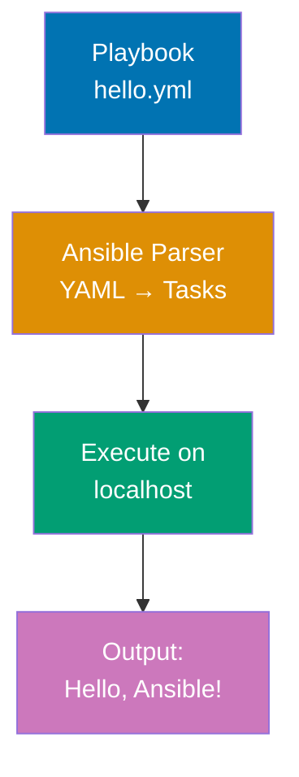
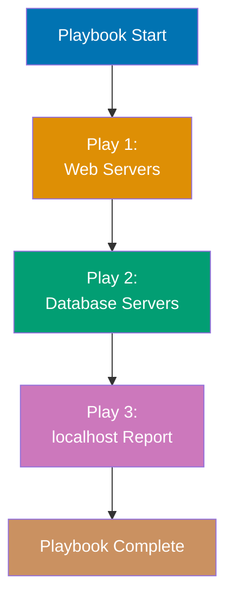
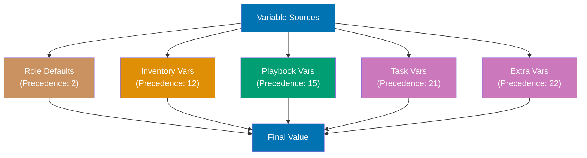
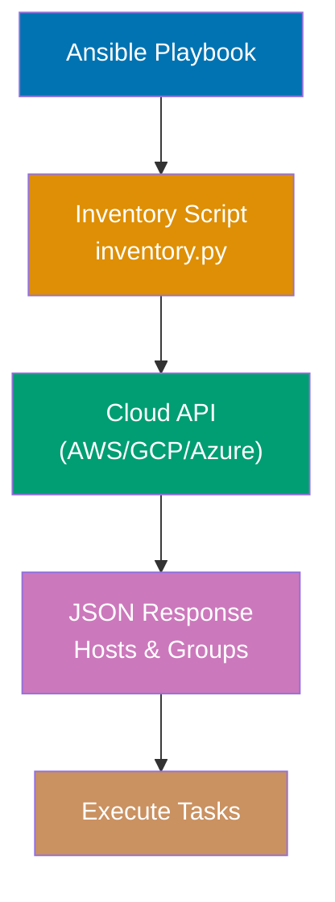
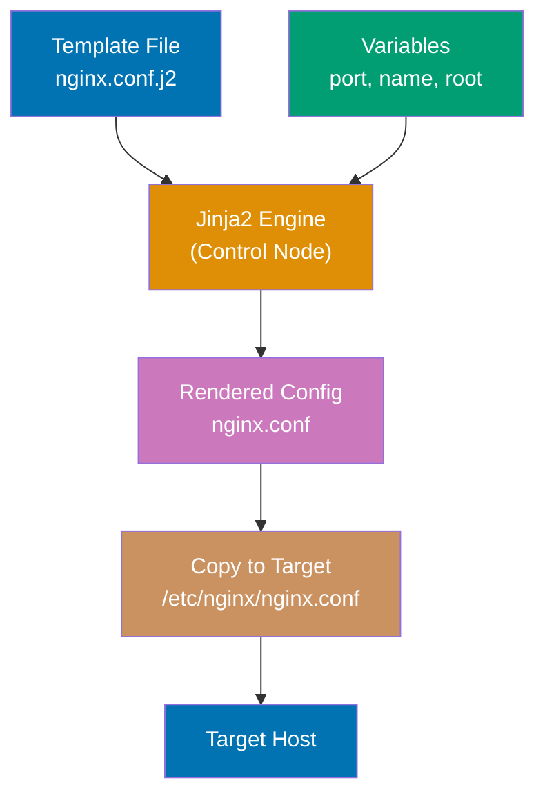
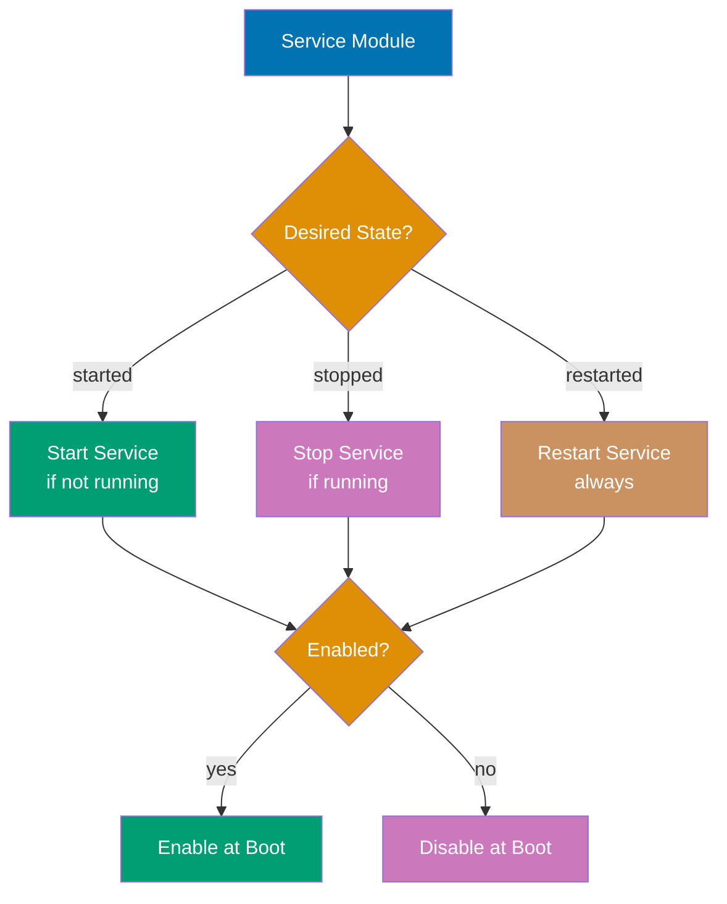
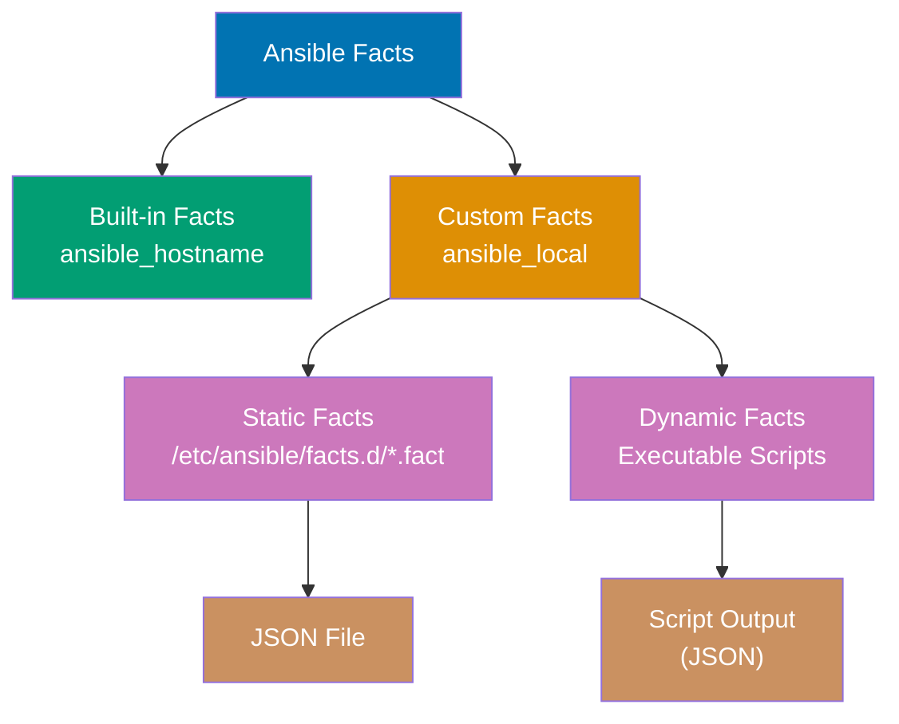
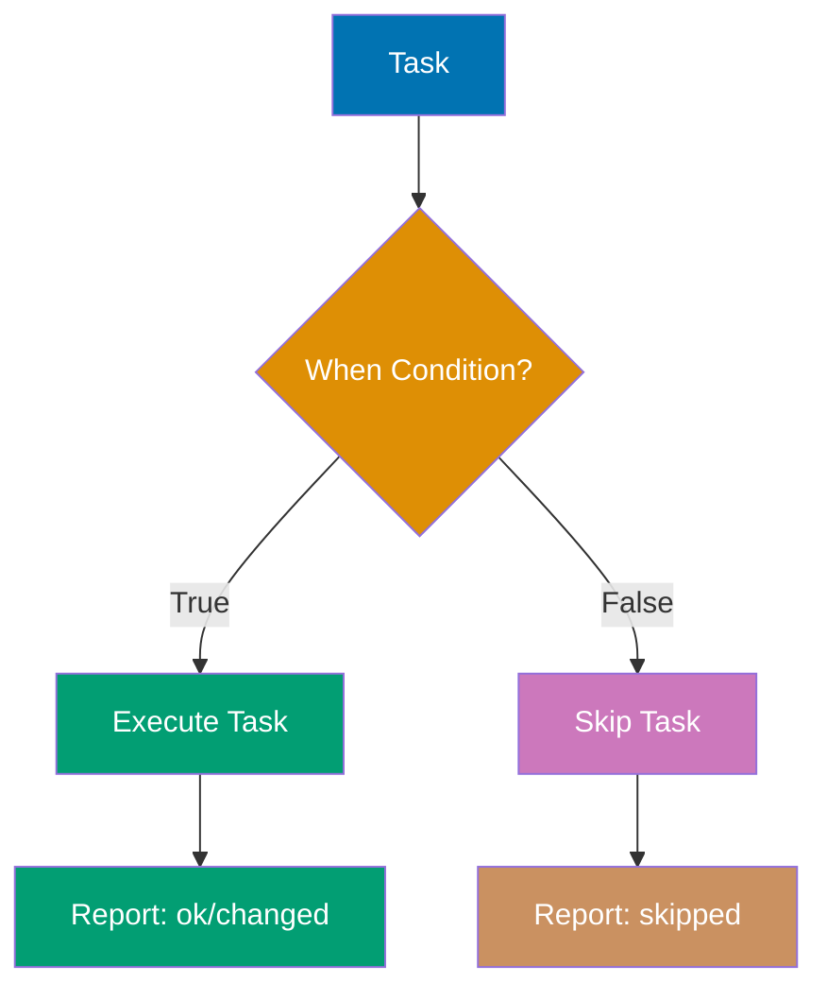

Learn Ansible fundamentals through 27 annotated code examples. Each example is self-contained, runnable, and heavily commented to show what each line does, expected outputs, and key takeaways.

## Group 1: Hello World & Installation

### Example 1: Hello World Playbook

Ansible playbooks are YAML files describing desired system state. Every playbook needs a name, hosts target, and tasks list. This minimal example runs a single command on localhost to verify Ansible installation.



**Code**:

```yaml
---
# hello.yml - Minimal working playbook demonstrating Ansible basics
- name:
    Hello World Playbook # => Human-readable play name (appears in console output)
    # => Required field for documentation and logging
  hosts:
    localhost # => Target host pattern (special name for local machine)
    # => Accepts hostname, group name, or pattern (e.g., web*)
  gather_facts:
    false # => Skip automatic fact collection (setup module)
    # => Improves execution speed when facts not needed
    # => Default is true (runs setup module before tasks)

  tasks: # => List of actions to execute on target hosts
    # => Tasks run sequentially from top to bottom
    - name:
        Print greeting # => Task description (appears in console output)
        # => Best practice: use descriptive names for debugging
      ansible.builtin.debug: # => Debug module prints messages to console
        # => No state changes (idempotent, safe for testing)
        # => FQCN format: namespace.collection.module
        msg:
          "Hello, Ansible!" # => Message to display during playbook execution
          # => Can be string or variable using Jinja2 syntax
      # => Output: ok: [localhost] => { "msg": "Hello, Ansible!" }
      # => Task status is "ok" (not "changed") because debug doesn't modify state
```

**Run**: `ansible-playbook hello.yml`

**Key Takeaway**: Every playbook is a YAML file with plays containing tasks. The `debug` module prints messages without changing system state, making it safe for testing.

**Why It Matters**: Ansible playbooks replace manual SSH commands that are error-prone and unscalable. While manually SSHing to configure one server is manageable, NASA and Walmart manage thousands of servers with identical Ansible playbooks—ensuring consistent configuration across entire fleets. The declarative YAML format is human-readable and version-controllable, enabling Infrastructure as Code practices where configuration changes are audited, reviewed, and rolled back just like application code.

---

### Example 2: Ansible Installation Verification

Before writing automation, verify Ansible installation and Python environment. This playbook uses the `setup` module to gather system facts and display Ansible version information.

**Code**:

```yaml
---
# verify.yml - Verification playbook for Ansible installation
- name:
    Verify Ansible Installation # => Play name describing verification purpose
    # => Appears in console output during execution
  hosts:
    localhost # => Execute tasks on local machine only
    # => Uses connection: local (no SSH required)
  gather_facts:
    true # => Enable automatic fact collection (setup module)
    # => Default behavior (explicitly shown for clarity)
    # => Runs ansible.builtin.setup before tasks
  # => Setup module collects 100+ facts about target system
  # => Facts include: OS, network, hardware, Python, filesystem info

  tasks: # => Task list begins after fact gathering completes
    # => All facts available as variables in tasks
    - name: Display Ansible version # => Task 1: Show installed Ansible version information
      # => Helps verify correct Ansible installation
      ansible.builtin.debug: # => Debug module prints variables to console
        # => Non-destructive (no state changes)
        # => FQCN format: ansible.builtin.debug
        msg:
          "Ansible version: {{ ansible_version.full }}" # => Access nested fact variable
          # => ansible_version is dict with 'full', 'major', 'minor' keys
          # => Jinja2 {{ }} syntax interpolates variables
      # => ansible_version.full contains complete version (e.g., "2.15.0")
      # => Output: ok: [localhost] => { "msg": "Ansible version: 2.15.0" }

    - name:
        Display Python version # => Task 2: Show Python interpreter version
        # => Confirms Python compatibility with Ansible
      ansible.builtin.debug: # => Debug module for console output
        msg:
          "Python version: {{ ansible_python_version }}" # => Access Python version fact
          # => Collected during fact gathering
      # => ansible_python_version contains version string (e.g., "3.11.6")
      # => Ansible requires Python 2.7+ or 3.5+ on target hosts
      # => Modern Ansible (2.12+) prefers Python 3.x
      # => Output: Python version: 3.11.6 (interpreter at ansible_python_interpreter path)

    - name:
        Display operating system # => Task 3: Show OS distribution and version
        # => Useful for environment-aware playbooks
      ansible.builtin.debug: # => Debug output module
        msg:
          "OS: {{ ansible_distribution }} {{ ansible_distribution_version }}" # => Combine two separate facts
          # => String concatenation with space
      # => ansible_distribution: OS family (Ubuntu, Debian, RedHat, CentOS, Fedora, etc.)
      # => ansible_distribution_version: Version number (22.04, 20.04, 9, 8, etc.)
      # => Detected from /etc/os-release or equivalent system files
      # => Output: OS: Ubuntu 22.04 (parsed from system identification files)
      # => Enables conditional logic: when: ansible_distribution == "Ubuntu"
```

**Run**: `ansible-playbook verify.yml`

**Key Takeaway**: Ansible facts are variables automatically collected from target hosts. Access facts using Jinja2 syntax `{{ variable_name }}`. Disable fact gathering with `gather_facts: false` to speed up playbooks when facts aren't needed.

**Why It Matters**: Ansible's agentless architecture uses only SSH connections—no daemon installation or maintenance required. Fact gathering automatically detects OS versions, Python interpreters, and hardware specs, enabling environment-aware automation that adapts to different systems. This eliminates brittle shell scripts that break when OS versions change, allowing the same playbook to work across Ubuntu 20.04, 22.04, and RHEL 8/9 without modification.

---

## Group 2: Playbook Basics & YAML Syntax

### Example 3: Multi-Task Playbook

Playbooks execute tasks sequentially from top to bottom. Each task runs a module with specific parameters. Task execution stops if a task fails unless error handling is configured.

**Code**:

```yaml
---
# multi_task.yml
- name: Multi-Task Playbook Example # => Sequential task execution demonstration
  hosts: localhost # => Target only local machine
  gather_facts: false # => Skip fact gathering for faster execution

  tasks:
    - name: Task 1 - Create directory # => First task in sequence
      ansible.builtin.file: # => File module manages filesystem objects
        path: /tmp/ansible_demo # => Directory path to create
        state: directory # => Ensure path is a directory (idempotent)
        # => Idempotent: running twice produces same result
        mode: "0755" # => Permissions (rwxr-xr-x: owner rwx, group rx, others rx)
      # => changed: [localhost] (creates directory if missing)
      # => ok: [localhost] (if directory already exists with correct permissions)
      # => Task fails if parent directory /tmp doesn't exist

    - name: Task 2 - Create file in directory # => Second task depends on task 1
      ansible.builtin.file: # => Same module, different state parameter
        path: /tmp/ansible_demo/test.txt # => Full file path inside created directory
        state: touch # => Create empty file or update timestamp (like Linux touch command)
        mode: "0644" # => Permissions (rw-r--r--: owner rw, group r, others r)
      # => changed: [localhost] (creates file or updates mtime)
      # => Updates access and modification times if file exists

    - name: Task 3 - Write content to file # => Third task writes data
      ansible.builtin.copy: # => Copy module can write content directly
        dest: /tmp/ansible_demo/test.txt # => Destination file path
        content: "Hello from Ansible\n" # => Content to write (overwrites existing)
        # => Can also use 'src' parameter to copy from file
      # => changed: [localhost] (writes content to file)
      # => Replaces entire file content with this string

    - name: Task 4 - Display file content # => Fourth task reads result
      ansible.builtin.command: # => Command module executes shell commands
        cmd: cat /tmp/ansible_demo/test.txt # => Read file content
      register: file_content # => Save command output to variable
      # => Stores stdout, stderr, return code in file_content dict
      # => changed: [localhost] (command always reports changed even if idempotent)
      # => Command module doesn't parse idempotency - use changed_when to override

    - name: Task 5 - Print file content # => Final task displays captured output
      ansible.builtin.debug: # => Debug module for non-destructive output
        msg: "File content: {{ file_content.stdout }}" # => Access stdout from registered variable
      # => file_content is dictionary with keys: stdout, stderr, rc, cmd
      # => Output: File content: Hello from Ansible
      # => Debug tasks never report 'changed' status
```

**Run**: `ansible-playbook multi_task.yml`

**Key Takeaway**: Tasks execute sequentially in order. Use `register` to capture task output (stdout, stderr, return code) into a variable for later use. Most modules are idempotent—running twice produces the same result.

**Why It Matters**: Idempotency is Ansible's killer feature—running the same playbook 100 times produces the same final state, preventing configuration drift that causes production incidents. Manual configurations accumulate changes over time ("I'll just quickly edit this file..."), leading to servers that are impossible to replicate. Companies like Cisco use Ansible to guarantee that any server can be rebuilt from scratch using version-controlled playbooks, eliminating snowflake servers and undocumented changes.

---

### Example 4: YAML Syntax and Structure

YAML is whitespace-sensitive and uses indentation (2 spaces) for structure. Lists use `-` prefix, dictionaries use `key: value` format. Multi-line strings support folded (`>`) and literal (`|`) styles.

**Code**:

```yaml
---
# yaml_syntax.yml
- name: YAML Syntax Demonstration # => Play demonstrating YAML data structures
  hosts: localhost # => Execute on local machine only
  gather_facts: false # => Skip fact gathering (not needed for demo)

  # Variables section (dictionary)
  vars: # => Play-level variable definitions
    # => All vars are accessible in tasks via Jinja2 {{ var_name }}
    simple_string: "Hello" # => String value (quotes optional for simple strings)
    # => Without special chars, "Hello" same as Hello
    simple_number: 42 # => Integer value (no quotes)
    # => YAML infers type from format
    simple_bool: true # => Boolean value (true/false, yes/no, on/off all valid)
    # => Booleans are case-insensitive in YAML

    # List syntax (array)
    simple_list: # => List declaration using dash syntax
      # => Lists are ordered sequences of items
      - item1 # => First list element (index 0)
      - item2 # => Second list element (index 1)
      - item3 # => Third list element (index 2)
      # => Access via {{ simple_list[0] }} for first item

    # Dictionary syntax (hash/map)
    simple_dict: # => Dictionary declaration using key-value pairs
      # => Dictionaries are unordered collections of keys and values
      key1: value1 # => First key-value pair
      # => Access via {{ simple_dict.key1 }} or {{ simple_dict['key1'] }}
      key2: value2 # => Second key-value pair
      # => Keys must be unique within dictionary

    # Multi-line string (folded - joins lines with spaces)
    folded_string: > # => Folded block scalar (> symbol)
      This is a long string
      that will be folded into
      a single line with spaces.
    # => Result: "This is a long string that will be folded into a single line with spaces."
    # => Newlines become spaces, trailing newline added
    # => Useful for long text that should be single line

    # Multi-line string (literal - preserves newlines)
    literal_string: | # => Literal block scalar (| symbol)
      Line 1
      Line 2
      Line 3
    # => Result: "Line 1\nLine 2\nLine 3\n" (preserves line breaks)
    # => Each line preserved with \n separators
    # => Useful for config files, scripts, formatted text

  tasks:
    - name: Display variables # => Task to output all variable values
      ansible.builtin.debug: # => Debug module for output (no state changes)
        msg: | # => Multi-line literal message
          String: {{ simple_string }}
          Number: {{ simple_number }}
          Bool: {{ simple_bool }}
          List: {{ simple_list }}
          Dict: {{ simple_dict }}
          Folded: {{ folded_string }}
          Literal: {{ literal_string }}
      # => Jinja2 interpolates {{ variable }} expressions
      # => Prints all variable values with proper formatting
      # => Output shows actual values and data structures
```

**Run**: `ansible-playbook yaml_syntax.yml`

**Key Takeaway**: YAML uses 2-space indentation (never tabs). Use `>` for long strings that should be joined, `|` for strings that need to preserve line breaks. Lists and dictionaries can be nested arbitrarily deep.

**Why It Matters**: YAML's human-readable syntax lowers the barrier for operations teams unfamiliar with programming. Unlike JSON (which requires strict quoting and trailing commas) or XML (with verbose tags), YAML configuration files read almost like documentation. This accessibility enables infrastructure teams to collaborate on automation without Python/Ruby expertise, democratizing configuration management beyond traditional development teams. The declarative format also makes peer review during pull requests straightforward—reviewers see exactly what state will be enforced.

---

### Example 5: Multiple Plays in One Playbook

A playbook can contain multiple plays targeting different hosts or requiring different privilege levels. Each play is a separate `-` entry in the root YAML list.



**Code**:

```yaml
---
# multi_play.yml
# Play 1: Setup phase (localhost)
- name: Play 1 - Setup Phase # => First play in playbook sequence
  hosts: localhost # => Execute on local machine
  gather_facts: false # => Skip facts for speed (not needed in setup)
  # => Each play can have independent gather_facts setting

  tasks: # => Task list for this play only
    - name: Initialize setup # => Setup task declaration
      ansible.builtin.debug: # => Debug module for output
        msg: "Starting multi-play playbook" # => Informational message
      # => Output: Starting multi-play playbook
      # => Debug tasks execute immediately, no state changes

# Play 2: Configuration phase (localhost simulating remote)
- name: Play 2 - Configuration Phase # => Second play starts after Play 1 completes
  hosts: localhost # => Target same host, but separate play context
  gather_facts: true # => This play gathers facts (independent setting)
  # => Facts collected here are available to Play 2 and Play 3 tasks
  # => Setup module runs automatically before Play 2 tasks

  tasks: # => New task list (Play 2 scope)
    - name: Display hostname # => Use fact collected during gather_facts
      ansible.builtin.debug:
        msg: "Configuring {{ ansible_hostname }}" # => Jinja2 variable from facts
      # => ansible_hostname populated by setup module
      # => Output: Configuring localhost (from gathered facts)
      # => Facts persist across remaining plays in playbook

# Play 3: Reporting phase (localhost)
- name: Play 3 - Reporting Phase # => Third play executes after Play 2
  hosts: localhost # => Same host, new play context
  gather_facts: false # => This play skips fact gathering
  # => Reuses facts from Play 2 (facts persist in memory)
  # => Skipping improves performance

  tasks: # => Final task list (Play 3 scope)
    - name: Generate report # => Final reporting task
      ansible.builtin.debug:
        msg: "Playbook execution complete" # => Summary message
      # => Output: Playbook execution complete
      # => Playbook exits successfully after this task
```

**Run**: `ansible-playbook multi_play.yml`

**Key Takeaway**: Multiple plays enable orchestration across different host groups or privilege levels. Each play can have independent settings for fact gathering, privilege escalation, and variables. Plays execute sequentially.

**Why It Matters**: Complex deployments require coordinated actions across different server tiers—database migrations before application updates, load balancer configuration after web server deployment. Multi-play playbooks replace fragile bash scripts that hardcode server lists and fail silently mid-execution. Organizations managing microservices architectures use multi-play orchestration to deploy across dozens of service types in correct dependency order, with each play targeting appropriate host groups and privilege levels.

---

### Example 6: Playbook Variables and Precedence

Variables can be defined in multiple locations: playbook vars, command-line, inventory. Understanding variable precedence prevents unexpected values in production.



**Code**:

```yaml
---
# variables.yml
- name: Variable Precedence Example # => Demonstrates variable precedence hierarchy
  hosts: localhost # => Execute on local machine
  gather_facts: false # => Skip fact gathering (not needed)

  # Play-level variables (precedence: 15)
  vars: # => Variable declarations at play scope
    # => 22 levels of precedence exist in Ansible
    environment: "development" # => Default value defined in playbook
    # => Can be overridden by higher precedence sources
    app_name: "MyApp" # => Another play-level variable
    # => String value, accessible in all tasks
    app_port: 8080 # => Integer variable (no quotes)
    # => YAML infers integer type

  tasks: # => Task list begins
    - name: Display variables # => Show current variable values
      ansible.builtin.debug: # => Debug module for output
        msg: | # => Multi-line literal message
          Environment: {{ environment }}
          App: {{ app_name }}
          Port: {{ app_port }}
      # => Jinja2 interpolates {{ }} expressions
      # => Shows current values (can be overridden by CLI -e flag)
      # => Output depends on precedence resolution

    # Task-level variable (highest precedence except extra-vars)
    - name: Override with task vars # => Task-scoped variable demonstration
      ansible.builtin.debug: # => Debug output module
        msg: "Task-level environment: {{ task_env }}" # => References task var
      vars: # => Task-scoped variables (precedence: 21)
        task_env: "production" # => Task-scoped variable (precedence: 21)
        # => Only accessible within this task
        # => Higher precedence than play vars (15)
      # => Output: Task-level environment: production
      # => task_env variable not accessible in other tasks
```

**Run**:

- `ansible-playbook variables.yml` → Uses playbook vars
- `ansible-playbook variables.yml -e "environment=production"` → CLI extra-vars override (precedence: 22)

**Key Takeaway**: Variable precedence from lowest to highest: role defaults < inventory < playbook vars < task vars < extra-vars (`-e`). Use extra-vars for environment-specific overrides in CI/CD pipelines.

**Why It Matters**: Variable precedence enables the same playbook to deploy to development, staging, and production with different configurations via `-e` flags. CI/CD pipelines use extra-vars to inject environment-specific credentials, API endpoints, and scaling parameters without modifying version-controlled playbooks. This separation of code (playbooks) from configuration (variables) is critical for security—production secrets never appear in git repositories, only injected at runtime from secure vaults.

---

## Group 3: Inventory Management

### Example 7: Static Inventory (INI Format)

Inventory files define target hosts and groups. INI format is simplest for static infrastructure. Hosts can belong to multiple groups for flexible targeting.

**Code**:

Create inventory file `inventory.ini`:

```ini
# inventory.ini - Static inventory in INI format
# Ungrouped hosts (not in any group, still accessible via 'all')
standalone.example.com # => Host without group membership
                        # => Reachable via: ansible standalone.example.com -m ping

# Group: webservers (logical grouping of web tier hosts)
[webservers] # => Group header (INI section format)
             # => Create logical grouping for fleet operations
web1.example.com ansible_host=192.168.1.10 # => Inventory hostname with IP override
                                            # => DNS name: web1.example.com
                                            # => Actual IP: 192.168.1.10 (ansible_host connection variable)
web2.example.com ansible_host=192.168.1.11 # => Second webserver with IP override
                                            # => Connects to 192.168.1.11 via SSH
web3.example.com ansible_port=2222 # => Third webserver with custom SSH port
                                    # => Default port 22 overridden to 2222
                                    # => Useful for security hardening (non-standard SSH ports)

# Group: databases (database tier hosts)
[databases] # => Database group header
            # => Separate from webservers for targeted operations
db1.example.com # => Database primary server
                # => Uses default connection settings (SSH port 22, current user)
db2.example.com ansible_user=dbadmin # => Database replica with custom SSH user
                                      # => Connects as 'dbadmin' instead of current user
                                      # => Requires SSH key or password for dbadmin

# Group of groups (parent group containing other groups)
[production:children] # => Parent group syntax: [groupname:children]
                      # => Contains other groups, not individual hosts
webservers # => Include all hosts from webservers group
           # => Expands to: web1, web2, web3
databases # => Include all hosts from databases group
          # => Expands to: db1, db2
# => Result: 'production' contains 5 hosts (web1, web2, web3, db1, db2)
# => Enables targeting entire production environment: ansible production -m ping

# Group variables (apply to all hosts in group)
[webservers:vars] # => Variables for webservers group
                  # => Applied to web1, web2, web3 automatically
ansible_python_interpreter=/usr/bin/python3 # => Override Python interpreter path
                                             # => Required when default Python is 2.x
                                             # => Ansible requires Python on target hosts
http_port=80 # => Custom variable (not Ansible built-in)
             # => Accessible in playbooks as {{ http_port }}
             # => Used for application configuration

[databases:vars] # => Variables for databases group
                 # => Applied to db1, db2
db_port=5432 # => PostgreSQL default port
             # => Custom variable for database configuration
             # => Accessible as {{ db_port }} in playbooks
```

**Playbook using inventory**:

```yaml
---
# inventory_demo.yml
- name: Use Inventory Groups # => Demonstrate inventory-based targeting
  hosts: webservers # => Target all hosts in webservers group
  # => Expands to: web1, web2, web3 from inventory file
  # => Ansible connects to each host via SSH sequentially or parallel (forks)
  gather_facts: false # => Skip fact gathering for speed

  tasks: # => Tasks execute on ALL hosts in webservers group
    - name: Display host information # => Show per-host information
      ansible.builtin.debug: # => Debug module runs on each target host
        msg: "Host {{ inventory_hostname }} on port {{ http_port }}" # => inventory_hostname is built-in variable
      # => inventory_hostname contains current host's name from inventory
      # => http_port comes from [webservers:vars] section (value: 80)
      # => Runs on web1, web2, web3 (all webservers group members)
      # => Output: Host web1.example.com on port 80
      # => Output: Host web2.example.com on port 80
      # => Output: Host web3.example.com on port 80
```

**Run**: `ansible-playbook -i inventory.ini inventory_demo.yml`

**Key Takeaway**: Inventory files map logical names to physical hosts. Groups enable targeting multiple hosts with one playbook. Host and group variables customize behavior per environment.

**Why It Matters**: Static inventory files replace hardcoded IP addresses scattered across deployment scripts. When a server's IP changes, you update one inventory file instead of hunting through dozens of scripts. Grouping enables fleet-wide operations—`ansible webservers -m service -a "name=nginx state=restarted"` restarts nginx on all web servers simultaneously, replacing tedious manual SSH loops. Organizations with hundreds of servers use inventory groups to apply security patches, deploy applications, or verify configurations across entire data centers with single commands.

---

### Example 8: Static Inventory (YAML Format)

YAML inventory provides better structure for complex hierarchies and variables. Functionally equivalent to INI but more readable for nested groups.

**Code**:

Create inventory file `inventory.yml`:

```yaml
---
# inventory.yml - Static inventory in YAML format
all: # => Root group containing all hosts in inventory
  # => Special group automatically created by Ansible
  # => Contains both standalone hosts and grouped hosts
  hosts: # => Host definitions at root level
    # => Hosts here belong to 'all' group only (ungrouped)
    standalone.example.com: # => Ungrouped host entry
      # => Empty dict means no host-specific variables
      # => Reachable via: ansible standalone.example.com -m ping

  children: # => Nested groups under 'all' parent group
    # => Groups organize hosts logically (web tier, db tier, etc.)
    webservers: # => Webservers group definition
      # => Equivalent to [webservers] in INI format
      hosts: # => Host list for webservers group
        # => Each entry can have host-specific variables
        web1.example.com: # => First webserver entry
          # => Indented dict contains host variables
          ansible_host:
            192.168.1.10 # => Connection IP override
            # => Ansible connects to 192.168.1.10 instead of DNS lookup
        web2.example.com: # => Second webserver
          ansible_host:
            192.168.1.11 # => IP override for web2
            # => Enables static IP targeting
        web3.example.com: # => Third webserver with custom SSH port
          ansible_port:
            2222 # => Override default SSH port (22 → 2222)
            # => Security hardening via non-standard port
      vars: # => Group-level variables for all webservers
        # => Applied to web1, web2, web3 automatically
        ansible_python_interpreter:
          /usr/bin/python3 # => Python 3 interpreter path
          # => Required when Python 2.x is system default
          # => Ansible modules require Python on targets
        http_port:
          80 # => Custom application variable
          # => Accessible in playbooks as {{ http_port }}
          # => Not an Ansible built-in (user-defined)

    databases: # => Database group definition
      # => Separate tier from webservers
      hosts: # => Database host list
        db1.example.com: # => Primary database server
          # => Empty dict (no host-specific variables)
          # => Uses group vars and defaults
        db2.example.com: # => Replica database server
          ansible_user:
            dbadmin # => SSH username override
            # => Connects as 'dbadmin' user instead of current user
            # => Requires SSH key or password for dbadmin account
      vars: # => Database group variables
        # => Applied to db1, db2
        db_port:
          5432 # => PostgreSQL default port
          # => Custom variable for database configuration
          # => Accessible as {{ db_port }} in playbooks

    production: # => Parent group containing other groups
      # => Enables hierarchy: production → webservers/databases → hosts
      children: # => List of child groups (not hosts)
        # => Only groups allowed here (no individual hosts)
        webservers: # => Include webservers group (web1, web2, web3)
          # => All hosts from webservers become production members
        databases: # => Include databases group (db1, db2)
          # => All hosts from databases become production members
      vars: # => Variables applied to ALL production hosts
        # => Inherited by both webservers and databases groups
        environment:
          production # => Environment identifier
          # => Accessible as {{ environment }}
          # => Used for environment-specific logic in playbooks
          # => production group contains 5 total hosts
```

**Run**: `ansible-playbook -i inventory.yml playbook.yml`

**Key Takeaway**: YAML inventory scales better than INI for complex hierarchies. Use YAML when you have many nested groups or extensive variables. Both formats work identically from Ansible's perspective.

**Why It Matters**: As infrastructure grows from dozens to hundreds of servers, inventory organization becomes critical. YAML's hierarchical structure naturally represents multi-tier architectures (production/staging/dev environments, each with web/app/database layers, each with primary/replica configurations). Complex inventories in INI format become unmanageable—YAML's nested syntax makes relationships explicit, preventing mistakes like accidentally deploying to production when targeting staging. Large enterprises maintain YAML inventories with thousands of hosts organized into logical hierarchies that mirror their infrastructure topology.

---

### Example 9: Inventory Host Patterns

Ansible supports powerful patterns for targeting hosts: wildcards, ranges, unions, intersections, and exclusions. Patterns enable surgical targeting without creating explicit groups.

**Code**:

```yaml
---
# patterns.yml
# Pattern examples (use with existing inventory)
# => Demonstrates host targeting patterns without inventory modification

# Target single host
- name: Single Host # => Most specific targeting
  hosts: web1.example.com # => Exact hostname match from inventory
  # => Targets only this specific host, no pattern matching
  # => Use for one-off operations on individual servers
  tasks:
    - ansible.builtin.debug: msg="Single host" # => Executes only on web1
    # => Output: ok: [web1.example.com] => { "msg": "Single host" }

# Target all hosts in group
- name: All Webservers # => Group-based targeting
  hosts: webservers # => All members of webservers group
  # => Expands to all hosts defined in [webservers] section
  # => web1.example.com, web2.example.com, web3.example.com
  tasks:
    - ansible.builtin.debug: msg="All webservers" # => Executes on each webserver
    # => Output appears 3 times (once per host)

# Wildcard pattern (all hosts starting with 'web')
- name: Wildcard Pattern # => Glob-style pattern matching
  hosts: web* # => Matches any hostname starting with 'web'
  # => Asterisk (*) wildcard matches zero or more characters
  # => Matches: web1, web2, web3, webserver, web-prod, etc.
  # => Does NOT match groups, only individual hostnames
  tasks:
    - ansible.builtin.debug: msg="Wildcard match" # => Runs on all web* hosts
    # => Pattern matching happens at inventory parsing time

# Union of groups (hosts in EITHER group)
- name: Union Pattern # => Combine multiple groups
  hosts: webservers:databases # => Colon (:) operator creates union
  # => Targets hosts in webservers OR databases (logical OR)
  # => Includes: web1, web2, web3, db1, db2 (5 hosts total)
  # => Duplicates removed automatically if host in both groups
  tasks:
    - ansible.builtin.debug: msg="Web or DB servers" # => Runs on union set
    # => 5 separate task executions

# Intersection of groups (hosts in BOTH groups)
- name: Intersection Pattern # => Hosts in multiple groups
  hosts: webservers:&production # => Colon-ampersand (:&) creates intersection
  # => Targets hosts in webservers AND production (logical AND)
  # => Only includes hosts that are members of BOTH groups
  # => Useful for filtering by environment (dev/staging/prod)
  tasks:
    - ansible.builtin.debug: msg="Webservers in production" # => Runs on intersection
    # => Fewer hosts than webservers alone

# Exclusion pattern (hosts in first group but NOT second)
- name: Exclusion Pattern # => Subtract hosts from targeting
  hosts: webservers:!web3.example.com # => Colon-exclamation (:!) excludes hosts
  # => Targets webservers EXCEPT web3.example.com (logical subtraction)
  # => Includes: web1, web2 (excludes web3)
  # => Exclusion can be hostname or group name
  tasks:
    - ansible.builtin.debug: msg="Webservers except web3" # => Runs on web1, web2 only
    # => web3 skipped entirely, not even shown in output

# Complex pattern combining operations
- name: Complex Pattern # => Multi-operation pattern
  hosts: webservers:&production:!web3.example.com # => Combines intersection and exclusion
  # => Read left-to-right: (webservers ∩ production) - web3
  # => Step 1: Hosts in webservers AND production
  # => Step 2: Remove web3.example.com from result
  # => Useful for maintenance windows, canary deployments
  tasks:
    - ansible.builtin.debug: msg="Production webservers except web3" # => Surgical targeting
    # => Targets production webservers with one host excluded
```

**Run**: `ansible-playbook -i inventory.yml patterns.yml --list-hosts` (shows matched hosts without running tasks)

**Key Takeaway**: Master patterns for ad-hoc targeting without modifying inventory. Use `:` for union, `:&` for intersection, `:!` for exclusion. Combine patterns for complex targeting like "all production webservers except maintenance hosts".

**Why It Matters**: Pattern-based targeting enables surgical operations during incidents without editing inventory files. During a production outage, you can restart services on "production webservers except the canary server" with a single pattern, avoiding the delay of inventory modifications and git commits. Patterns also enable maintenance windows—exclude specific hosts undergoing upgrades from automated configuration runs. This flexibility is crucial for 24/7 operations where inventory changes would introduce unacceptable delays during incident response.

---

### Example 10: Dynamic Inventory Basics

Dynamic inventory pulls host information from external sources (cloud APIs, CMDBs, scripts). Ansible executes an inventory script that outputs JSON with host and group data.



**Code**:

Create dynamic inventory script `inventory.py`:

```python
#!/usr/bin/env python3
# inventory.py (executable: chmod +x inventory.py)
# => Dynamic inventory script that outputs JSON
# => Must be executable: chmod +x inventory.py
import json # => JSON output required by Ansible
import sys # => Command-line argument parsing

def get_inventory():
    """Return inventory in Ansible's expected JSON format"""
    # => Ansible expects specific JSON structure with groups and hosts
    inventory = {
        "_meta": {                       # => Meta section for host variables (performance optimization)
            # => Including hostvars here prevents Ansible from calling --host for each host
            # => Without _meta, Ansible calls --host N times (slow for large inventories)
            "hostvars": { # => Host-specific variables dictionary
                "web1.local": { # => First host's variables
                    "ansible_host": "192.168.1.10", # => SSH connection IP
                    # => Overrides DNS resolution
                    "http_port": 8080 # => Custom variable for application
                    # => Accessible in playbooks as {{ http_port }}
                },
                "web2.local": { # => Second host's variables
                    "ansible_host": "192.168.1.11", # => Different SSH IP
                    "http_port": 8080 # => Same port as web1
                }
            }
        },
        "webservers": {                  # => Group definition (logical grouping)
            # => Groups enable targeting via hosts: webservers
            "hosts": ["web1.local", "web2.local"], # => List of group member hostnames
            # => Hostnames must match keys in hostvars dictionary
            "vars": { # => Group-level variables (apply to all group members)
                "environment": "production" # => Accessible as {{ environment }}
                # => All hosts in webservers inherit this variable
            }
        },
        "all": {                         # => Special 'all' group (implicit in all inventories)
            # => Variables here apply to ALL hosts across all groups
            "vars": { # => Global variables
                "ansible_python_interpreter": "/usr/bin/python3" # => Python path for all hosts
                # => Ensures Python 3 usage on all target systems
            }
        }
    }
    return inventory # => Return complete inventory dictionary

if __name__ == "__main__":
    # => Ansible invokes script with two possible command-line modes
    if len(sys.argv) == 2 and sys.argv[1] == "--list":
        # => --list mode: Return complete inventory (groups, hosts, vars)
        # => Ansible calls this ONCE per playbook run
        inventory = get_inventory() # => Generate inventory data
        print(json.dumps(inventory, indent=2)) # => Output JSON to stdout
        # => Ansible parses stdout as inventory data
    elif len(sys.argv) == 3 and sys.argv[1] == "--host":
        # => --host mode: Return variables for specific host
        # => Ansible calls --host <hostname> for each host if _meta missing
        # => hostname = sys.argv[2]
        print(json.dumps({})) # => Return empty dict (hostvars already in --list)
        # => Performance optimization: hostvars in _meta section eliminates --host calls
    else:
        # => Invalid usage: neither --list nor --host provided
        print("Usage: inventory.py --list or --host <hostname>") # => Error message
        sys.exit(1) # => Non-zero exit code signals error to Ansible
```

**Run**:

- `./inventory.py --list` → See JSON output
- `ansible-playbook -i inventory.py playbook.yml` → Use dynamic inventory

**Key Takeaway**: Dynamic inventory scripts must support `--list` (all hosts/groups) and `--host <name>` (single host vars). Use `_meta.hostvars` in `--list` response for performance (avoids N `--host` calls). In production, use cloud provider inventory plugins instead of custom scripts.

**Why It Matters**: Cloud environments with auto-scaling make static inventory files obsolete—servers appear and disappear hourly. Dynamic inventory queries AWS/GCP/Azure APIs at runtime, ensuring playbooks target currently-running instances rather than outdated lists. Companies using auto-scaling groups run Ansible against "all webservers tagged production" without maintaining inventory files. This eliminates the classic failure mode where automation runs against terminated instances or misses newly-launched servers, ensuring configuration management stays synchronized with actual infrastructure.

---

## Group 4: Core Modules

### Example 11: Command vs Shell Modules

`command` module is safe but limited (no pipes, redirects, variables). `shell` module provides full shell access but introduces security risks. Prefer `command` when possible for idempotency and safety.

**Code**:

```yaml
---
# command_vs_shell.yml - Demonstrates security and functionality differences
- name: Command vs Shell Comparison # => Compare safe (command) vs powerful (shell) modules
  hosts: localhost # => Execute on local machine
  gather_facts: false # => Skip fact collection (not needed)

  tasks: # => Task list demonstrating module differences
    # command module - Safe but limited (no shell interpreter)
    - name: Using command module (safe) # => Task 1: Safe command execution
      ansible.builtin.command: # => Command module bypasses shell
        # => No shell injection risk (safe for user input)
        # => Cannot use pipes, redirects, wildcards, variables
        cmd:
          echo "Hello World" # => Command with arguments
          # => Executes directly via exec() system call
          # => No /bin/bash or /bin/sh involved
      register:
        cmd_result # => Save task output to variable
        # => Stores stdout, stderr, rc (return code)
      # => changed: [localhost] (command module ALWAYS reports changed)
      # => Use changed_when: false to override this behavior
      # => stdout: "Hello World" (command output)

    - name: Display command result # => Task 2: Show command module output
      ansible.builtin.debug: # => Debug module for console output
        msg:
          "Command output: {{ cmd_result.stdout }}" # => Access stdout from registered variable
          # => cmd_result is dict with stdout/stderr/rc keys
      # => Output: Command output: Hello World
      # => Debug tasks never report changed status

    # command module - FAILS with shell features
    - name: Command module with pipe (FAILS) # => Task 3: Demonstrate command limitations
      ansible.builtin.command: # => Command module doesn't support pipes
        cmd:
          echo "test" | grep test # => Pipe character | not interpreted
          # => Passed literally to echo command
          # => ERROR: echo tries to output string "test | grep test"
      ignore_errors:
        true # => Continue playbook execution despite failure
        # => Prevents playbook abort on failed task
      # => failed: [localhost] (command module rejects shell metacharacters)
      # => Error message explains pipes/redirects require shell module

    # shell module - Full shell access (powerful but risky)
    - name: Using shell module (powerful but risky) # => Task 4: Full shell capabilities
      ansible.builtin.shell: # => Shell module invokes /bin/sh (or SHELL env var)
        # => Enables pipes, redirects, wildcards, variable expansion
        # => SECURITY RISK: vulnerable to shell injection attacks
        cmd:
          echo "Hello" | tr 'a-z' 'A-Z' # => Pipe works because shell interprets it
          # => echo outputs "Hello" → piped to tr
          # => tr translates lowercase to uppercase
      register:
        shell_result # => Save output to variable
        # => Same dict structure as command (stdout/stderr/rc)
      # => changed: [localhost] (shell module always reports changed)
      # => stdout: "HELLO" (pipe executed in bash subprocess)
      # => Both echo and tr executed in same shell process

    - name: Display shell result # => Task 5: Show shell module output
      ansible.builtin.debug: # => Debug output
        msg: "Shell output: {{ shell_result.stdout }}" # => Access stdout from shell task
      # => Output: Shell output: HELLO
      # => Demonstrates successful pipe execution

    # shell module - Environment variable expansion
    - name: Shell module with variables # => Task 6: Environment variable support
      ansible.builtin.shell: # => Shell module enables $VAR expansion
        cmd:
          echo "Current user is $USER" # => $USER expanded by shell to username
          # => Command module would output literal "$USER"
          # => Shell interprets environment variables
      register: user_result # => Capture output with username
      # => stdout: "Current user is <username>" (e.g., "Current user is admin")
      # => $USER environment variable replaced with actual username

    - name: Display user # => Task 7: Show expanded username
      ansible.builtin.debug: # => Debug module for output
        msg: "{{ user_result.stdout }}" # => Display stdout (contains expanded username)
      # => Output: Current user is <actual_username>
      # => Confirms shell variable expansion worked
```

**Run**: `ansible-playbook command_vs_shell.yml`

**Key Takeaway**: Use `command` for simple commands without pipes/redirects (safer, no shell injection). Use `shell` only when you need pipes, wildcards, or variable expansion. Both modules always report "changed" status—use `changed_when` to control this.

**Why It Matters**: The `command` module's safety guarantees prevent shell injection attacks—user input cannot escape to execute arbitrary commands. This is critical when playbooks accept external parameters (from web forms, API calls, or user input). The `shell` module's power comes with responsibility—it exposes the full attack surface of bash, including environment variable expansion and command substitution. Security-conscious organizations mandate `command` module in code review policies, permitting `shell` only when technically necessary and after security audit.

---

### Example 12: Copy Module for File Transfer

The `copy` module transfers files from control node to managed hosts. Supports inline content, remote sources, validation, and backup. Idempotent based on content checksum.

**Code**:

```yaml
---
# copy_module.yml - File transfer and inline content creation
- name: Copy Module Examples # => Demonstrate copy module capabilities
  hosts: localhost # => Execute on local machine
  gather_facts: false # => Skip fact gathering (not needed)

  tasks: # => Task list showing different copy patterns
    # Copy with inline content (no source file needed)
    - name: Create file with inline content # => Task 1: Write inline content to file
      ansible.builtin.copy: # => Copy module handles file creation/transfer
        # => Idempotent: checks content checksum before writing
        dest:
          /tmp/demo_inline.txt # => Destination path on target host
          # => Creates parent directory if missing
        content: | # => Inline multi-line content (literal YAML block)
          Line 1: Hello
          Line 2: World
        # => Literal block preserves newlines and formatting
        # => Content written exactly as shown (including trailing newline)
        mode:
          "0644" # => POSIX permissions (octal notation, quotes required)
          # => 0644 = rw-r--r-- (owner: rw, group: r, others: r)
        owner:
          "{{ ansible_user_id }}" # => File owner username
          # => ansible_user_id is fact (current SSH user)
      # => changed: [localhost] (creates file if missing or content/mode differs)
      # => ok: [localhost] (if file exists with identical content/permissions)
      # => Idempotency: compares SHA256 checksum of existing vs new content

    # Copy from file (first create source file)
    - name: Create source file # => Task 2: Prepare source file for copying
      ansible.builtin.copy: # => Copy module also creates source files
        dest: /tmp/source.txt # => Source file location
        content: "Source file content\n" # => Single-line content with newline
      # => Creates file at /tmp/source.txt for next task

    - name: Copy file from control node to target # => Task 3: File transfer operation
      ansible.builtin.copy: # => Copy mode: src→dest transfer
        # => Transfers files from control node to managed hosts
        src:
          /tmp/source.txt # => Source file path on control node
          # => Must exist before task runs
        dest:
          /tmp/destination.txt # => Destination path on target host
          # => Creates new file or overwrites existing
        mode: "0644" # => Override destination permissions
        backup:
          true # => Create timestamped backup before overwriting
          # => Backup format: <dest>.<pid>.<timestamp>~
          # => Only created if destination already exists
      register:
        copy_result # => Capture task results in variable
        # => Contains: changed, backup_file, checksum, dest
      # => changed: [localhost] (if content, mode, or owner differs)
      # => ok: [localhost] (if destination matches source exactly)
      # => backup_file key only present if backup created
      # => Example backup: /tmp/destination.txt.12345.2024-01-15@12:30:00~

    - name: Display backup location # => Task 4: Show backup path if created
      ansible.builtin.debug: # => Debug output module
        msg:
          "Backup created: {{ copy_result.backup_file | default('No backup needed') }}"
          # => Access backup_file from registered variable
          # => Jinja2 filter: default() provides fallback if key missing
      # => Output: "Backup created: /path..." (if backup created)
      # => Output: "Backup created: No backup needed" (if new file)

    # Copy with validation (critical for config files)
    - name: Copy configuration with validation # => Task 5: Safe config deployment
      ansible.builtin.copy: # => Copy with pre-deployment validation
        # => Prevents broken configs from reaching production
        dest: /tmp/config.conf # => Destination config file path
        content: | # => Configuration file content
          setting1=value1
          setting2=value2
        # => INI-style configuration format
        validate:
          'grep -q "setting1" %s' # => Validation command template
          # => %s replaced with temp file path
          # => Exit code 0 = valid, non-zero = invalid
      # => Process: writes to temp file → validates temp → replaces dest
      # => Runs validation: grep -q "setting1" /tmp/ansible.tmpXXXX
      # => Only replaces /tmp/config.conf if grep succeeds
      # => Task fails if validation fails (protects against bad configs)
```

**Run**: `ansible-playbook copy_module.yml`

**Key Takeaway**: Use `content` for inline text, `src` for file transfer from control node. The `backup` parameter creates timestamped backups before overwriting. The `validate` parameter ensures configuration correctness before replacement (critical for service configs).

**Why It Matters**: The `copy` module's checksum-based idempotency ensures network efficiency—it only transfers files when content changes, not every run. This matters at scale—deploying configs to 1,000 servers transfers files once, not 1,000 times when content is identical. The `validate` parameter prevents the classic mistake of deploying broken nginx configs that crash the web server—Ansible tests the new config before activating it, rolling back if validation fails. Organizations use this pattern to deploy thousands of configuration files daily with confidence that syntax errors won't reach production.

---

### Example 13: File Module for File Management

The `file` module manages files, directories, symlinks, and permissions without transferring content. Idempotent operations for state management (create, delete, modify).

**Code**:

```yaml
---
# file_module.yml - Filesystem management without content transfer
- name: File Module Examples # => Demonstrate file module capabilities
  hosts: localhost # => Execute on local machine
  gather_facts: false # => Skip fact gathering (not needed)

  tasks: # => Task list for filesystem operations
    # Create directory (idempotent directory creation)
    - name: Create directory with specific permissions # => Task 1: Directory creation
      ansible.builtin.file: # => File module manages filesystem objects
        # => No content transfer (unlike copy module)
        # => Idempotent: safe to run multiple times
        path:
          /tmp/demo_dir # => Directory path to create
          # => Absolute path recommended for reliability
          # => Creates directory if missing
        state:
          directory # => Ensure path is a directory (not file/link)
          # => Creates directory if absent
          # => Verifies existing directory has correct attributes
        mode:
          "0755" # => POSIX permissions in octal notation (quotes required)
          # => 0755 = rwxr-xr-x (owner: rwx, group: rx, others: rx)
          # => Owner can read/write/execute, others can read/execute
        owner:
          "{{ ansible_user_id }}" # => Set directory owner to current user
          # => ansible_user_id is fact (current SSH user)
          # => Requires appropriate permissions to chown
      # => changed: [localhost] (directory created or attributes modified)
      # => ok: [localhost] (directory exists with correct mode/owner)
      # => Idempotent: running twice produces same result

    # Create nested directories (recursive directory creation)
    - name: Create nested directory structure # => Task 2: Nested directory creation
      ansible.builtin.file: # => File module with recursive option
        path:
          /tmp/demo_dir/sub1/sub2 # => Three-level nested path
          # => Target: /tmp/demo_dir/sub1/sub2
        state: directory # => Ensure path is directory
        mode: "0755" # => Permissions applied to all created directories
        recurse:
          true # => Create parent directories if missing
          # => Without recurse, task fails if parents don't exist
          # => Like mkdir -p command
      # => changed: [localhost] (creates demo_dir, sub1, sub2 as needed)
      # => Creates all missing parent directories in one operation
      # => Idempotent: ok if directory structure already exists

    # Touch file (create empty file or update timestamp)
    - name: Create empty file or update timestamp # => Task 3: Touch file operation
      ansible.builtin.file: # => File module with touch state
        path:
          /tmp/demo_dir/timestamp.txt # => File path inside created directory
          # => Must be absolute or relative path
        state:
          touch # => Create empty file or update modification time
          # => Like Linux touch command
          # => Updates mtime (modification time) and atime (access time)
        mode:
          "0644" # => Permissions for new file (rw-r--r--)
          # => Owner: rw, group: r, others: r
      # => changed: [localhost] (file created or timestamps updated)
      # => Creates zero-byte file if missing
      # => Updates timestamps if file exists

    # Create symlink (symbolic link creation)
    - name: Create symbolic link # => Task 4: Symlink creation
      ansible.builtin.file: # => File module with link state
        src:
          /tmp/demo_dir # => Link target (what symlink points to)
          # => Can be absolute or relative path
          # => Target doesn't need to exist (dangling symlink allowed)
        dest:
          /tmp/demo_link # => Link path (the symlink itself)
          # => This is the symlink file created
          # => Must not already exist as regular file
        state:
          link # => Create symbolic link (soft link, not hard link)
          # => Creates symlink pointing from dest to src
          # => Like ln -s command
      # => changed: [localhost] (symlink created)
      # => Creates: /tmp/demo_link -> /tmp/demo_dir
      # => ls -la output: lrwxr-xr-x ... /tmp/demo_link -> /tmp/demo_dir
      # => Following symlink reaches /tmp/demo_dir directory

    # Modify permissions and ownership (attribute modification)
    - name: Change file permissions # => Task 5: Permission modification
      ansible.builtin.file: # => File module modifying existing file
        path:
          /tmp/demo_dir/timestamp.txt # => Target file to modify
          # => File must already exist
        mode:
          "0600" # => New permissions (rw-------)
          # => Owner: rw, group: none, others: none
          # => Restricts access to owner only (security hardening)
      # => changed: [localhost] (if current permissions differ from 0600)
      # => ok: [localhost] (if permissions already 0600)
      # => Idempotent: only changes if different

    # Remove file (file deletion)
    - name: Remove file # => Task 6: File deletion
      ansible.builtin.file: # => File module with absent state
        path:
          /tmp/demo_dir/timestamp.txt # => File to delete
          # => Absolute path for safety
        state:
          absent # => Ensure file does not exist
          # => Deletes file if present
          # => Succeeds if already absent (idempotent)
      # => changed: [localhost] (file deleted if it existed)
      # => ok: [localhost] (file already absent, no action needed)
      # => Idempotent: safe to run multiple times

    # Remove directory recursively (directory deletion)
    - name: Remove directory and contents # => Task 7: Recursive directory deletion
      ansible.builtin.file: # => File module deleting directory
        path:
          /tmp/demo_dir # => Directory to remove
          # => Removes directory and ALL contents
        state:
          absent # => Ensure directory does not exist
          # => Recursive deletion (like rm -rf)
          # => Deletes files, subdirectories, symlinks inside
      # => changed: [localhost] (directory and contents deleted)
      # => Dangerous operation: no confirmation, no trash/recycle
      # => Use with caution in production (irreversible)
```

**Run**: `ansible-playbook file_module.yml`

**Key Takeaway**: Use `file` module for filesystem operations that don't involve content transfer. Use `state: directory` to create dirs, `state: touch` for empty files, `state: link` for symlinks, `state: absent` for deletion. The module is idempotent—safe to run repeatedly.

**Why It Matters**: The `file` module's idempotency makes permission enforcement reliable across server fleets. Security policies requiring specific directory permissions (0700 for secrets, 0755 for public content) are enforced consistently—running the playbook weekly prevents permission drift from manual changes or application bugs. Unlike shell scripts that fail when directories already exist, Ansible's `state: directory` succeeds whether creating new or verifying existing directories. This declarative approach eliminates the brittle "check if exists" logic that plagues bash automation.

---

### Example 14: Template Module with Jinja2

The `template` module processes Jinja2 templates on the control node and copies the rendered result to managed hosts. Essential for generating configuration files from variables.



**Code**:

Create template file `nginx.conf.j2`:

```jinja2
# nginx.conf.j2 - Jinja2 template for nginx server configuration
server {                                         # => nginx server block start
                                                 # => Rendered to plain nginx config
    listen {{ http_port }};                      # => Variable substitution using {{ }}
                                                 # => Jinja2 replaces with http_port value from playbook
                                                 # => Renders to: listen 8080;
    server_name {{ server_name }};               # => Server hostname variable
                                                 # => Renders to: server_name example.com;
                                                 # => DNS name for virtual host matching

    location / {                                 # => Root location block
                                                 # => Handles all requests to / path
        root {{ document_root }};                # => Document root directory variable
                                                 # => Renders to: root /var/www/html;
                                                 # => Base directory for serving files
        index index.html;                        # => Default index file
                                                 # => Static content, no variable needed
    }

    # Conditional block (only rendered if condition true)
                              # => Jinja2 conditional logic ( tags)
                                                 # => Checks enable_ssl boolean variable
                                                 # => Entire block included/excluded based on condition
    ssl_certificate {{ ssl_cert_path }};         # => SSL certificate path variable
                                                 # => Renders to: ssl_certificate /etc/ssl/cert.pem;
                                                 # => Only rendered when enable_ssl is true
    ssl_certificate_key {{ ssl_key_path }};      # => SSL private key path variable
                                                 # => Renders to: ssl_certificate_key /etc/ssl/key.pem;
                                      # => End conditional block
                                                 # => Closing tag for if statement

    # Loop over list (repeats for each item)
          # => Jinja2 for loop iterates over list
                                                 # => custom_locations is list variable from playbook
                                                 # => Loop variable 'location' holds current item
    location {{ location.path }} {               # => Access dict key: location.path
                                                 # => First iteration: location /api {
                                                 # => Second iteration: location /admin {
        proxy_pass {{ location.backend }};       # => Access dict key: location.backend
                                                 # => First iteration: proxy_pass http://localhost:3000;
                                                 # => Second iteration: proxy_pass http://localhost:4000;
    }
                                     # => End for loop
                                                 # => Closing tag for loop statement
}                                                # => Server block end
                                                 # => Final rendered config written to dest path
```

**Playbook**:

```yaml
---
# template_module.yml - Jinja2 template rendering demonstration
- name: Template Module Example # => Play demonstrating template rendering
  hosts: localhost # => Execute on local machine
  gather_facts: false # => Skip fact gathering (not needed)

  vars: # => Variables section (all vars available to template)
    # => Template accesses these via {{ variable_name }}
    http_port:
      8080 # => Port number for nginx listen directive
      # => Integer value (no quotes)
      # => Rendered in template as: listen 8080;
    server_name:
      example.com # => Virtual host server name
      # => String value for DNS matching
      # => Rendered as: server_name example.com;
    document_root:
      /var/www/html # => Root directory for served files
      # => Absolute path to document root
      # => Rendered as: root /var/www/html;
    enable_ssl:
      true # => Boolean flag for conditional SSL block
      # => Controls  in template
      # => true includes SSL config, false excludes it
    ssl_cert_path:
      /etc/ssl/cert.pem # => SSL certificate file path
      # => Used only if enable_ssl is true
    ssl_key_path:
      /etc/ssl/key.pem # => SSL private key file path
      # => Used only if enable_ssl is true
    custom_locations: # => List variable for Jinja2  loop
      # => Each item is dict with path/backend keys
      - path: /api # => First location: API endpoint path
        backend:
          http://localhost:3000 # => Backend server for /api requests
          # => Proxy target for API calls
      - path: /admin # => Second location: Admin interface path
        backend:
          http://localhost:4000 # => Backend server for /admin requests
          # => Separate backend for admin panel

  tasks: # => Task list begins
    - name: Render template to file # => Task 1: Template rendering and deployment
      ansible.builtin.template: # => Template module renders Jinja2 to plain text
        # => Processing happens on control node
        # => Rendered output copied to target host
        src:
          nginx.conf.j2 # => Source template file path
          # => Path relative to playbook directory
          # => Must have .j2 extension (convention)
          # => Template uses Jinja2 syntax ({{}} and )
        dest:
          /tmp/nginx.conf # => Destination path for rendered output
          # => Plain nginx config (no Jinja2 syntax)
          # => All variables replaced with actual values
        mode:
          "0644" # => File permissions for rendered output
          # => Readable by all, writable by owner only
        backup:
          true # => Create timestamped backup before overwriting
          # => Backup format: <dest>.<pid>.<timestamp>~
          # => Only created if dest file already exists
      # => changed: [localhost] (template rendered and written to dest)
      # => Template rendering: reads src, processes Jinja2, writes dest
      # => Variables substituted: {{ http_port }} → 8080, {{ server_name }} → example.com
      # => Conditionals evaluated:  → includes SSL block
      # => Loops expanded:  → 2 location blocks

    - name: Display rendered configuration # => Task 2: Read rendered output
      ansible.builtin.command: # => Execute shell command to read file
        cmd:
          cat /tmp/nginx.conf # => Read rendered nginx config
          # => Shows final output with all substitutions
      register:
        rendered_config # => Save command output to variable
        # => Contains stdout with file contents

    - name: Show configuration # => Task 3: Display rendered template
      ansible.builtin.debug: # => Debug module for console output
        msg:
          "{{ rendered_config.stdout }}" # => Access stdout from registered variable
          # => Shows complete rendered nginx config
      # => Output shows final config with:
      # => - Variables replaced (http_port=8080, server_name=example.com)
      # => - Conditional SSL block included (enable_ssl=true)
      # => - Two location blocks from loop (custom_locations list)
      # => Template rendering complete: Jinja2 → plain nginx config
```

**Run**: `ansible-playbook template_module.yml`

**Key Takeaway**: Templates separate configuration structure from values. Use Jinja2 syntax (`{{ }}` for variables, `` for logic) to generate environment-specific configs. Templates render on control node, so target hosts don't need Jinja2 installed.

**Why It Matters**: Templates eliminate the maintenance nightmare of duplicate configs for each environment (nginx-dev.conf, nginx-staging.conf, nginx-prod.conf). One template with variables generates environment-specific configs, ensuring structural consistency while varying only values (ports, hostnames, credentials). When security requires adding SSL headers globally, you update one template instead of hunting through dozens of config files. Organizations managing hundreds of services use templating to enforce organization-wide standards (logging formats, security headers, monitoring endpoints) while allowing service-specific customization through variables.

---

### Example 15: Package Management (apt/yum)

Package modules manage software installation across distributions. The `package` module provides cross-platform abstraction, while `apt` and `yum` offer distribution-specific features.

**Code**:

```yaml
---
# package_management.yml
- name: Package Management Examples
  hosts: localhost
  become: true # => Require sudo/root privileges
  gather_facts: true # => Need facts to detect OS

  tasks:
    # Generic package module (cross-platform)
    - name: Install package using generic module
      ansible.builtin.package:
        name: curl # => Package name
        state: present # => Ensure package is installed
      # => changed: [localhost] (installs if missing)
      # => ok: [localhost] (if already installed)
      # => Works on Debian, RedHat, SUSE families

    # Debian/Ubuntu specific (apt)
    - name: Install package using apt
      ansible.builtin.apt:
        name: nginx # => Package name
        state: present
        update_cache: true # => Run apt-get update first
        cache_valid_time: 3600 # => Cache valid for 1 hour
      when: ansible_os_family == "Debian" # => Only run on Debian-based systems
      # => changed: [localhost] (updates cache and installs package)

    # Install multiple packages
    - name: Install multiple packages
      ansible.builtin.package:
        name:
          - git # => First package
          - vim # => Second package
          - htop # => Third package
        state: present
      # => Installs all packages in single transaction (faster)

    # Install specific version
    - name: Install specific package version
      ansible.builtin.apt:
        name: nginx=1.18.0-0ubuntu1 # => Exact version specification
        state: present
      when: ansible_os_family == "Debian"
      # => Installs or downgrades to specific version

    # Remove package
    - name: Remove package
      ansible.builtin.package:
        name: htop
        state: absent # => Ensure package is not installed
      # => changed: [localhost] (removes if installed)
      # => ok: [localhost] (if already absent)

    # Update all packages (Debian)
    - name: Update all packages
      ansible.builtin.apt:
        upgrade: dist # => dist-upgrade (like apt-get dist-upgrade)
        update_cache: true
      when: ansible_os_family == "Debian"
      # => changed: [localhost] (upgrades packages with new dependencies)
```

**Run**: `ansible-playbook package_management.yml --ask-become-pass` (prompts for sudo password)

**Key Takeaway**: Use `package` module for cross-platform playbooks, distribution-specific modules (`apt`, `yum`, `dnf`) for advanced features. Always use `update_cache: true` with `apt` to ensure package lists are current. The `state` parameter controls installation (`present`) or removal (`absent`).

**Why It Matters**: Ansible's package management modules provide idempotent software installation across heterogeneous infrastructure—the same playbook installs nginx on Ubuntu (apt), RHEL (yum/dnf), and SUSE (zypper) without conditional logic. This eliminates the fragile shell script pattern of OS detection and branching package manager commands. Security teams use package modules to enforce organization-wide software versions (installing specific patched versions), and compliance audits verify that unauthorized packages are `state: absent`. Batch installation of multiple packages in single transactions reduces execution time—installing 50 packages as a list is faster than 50 separate tasks.

---

### Example 16: Service Management

The `service` module manages system services across init systems (systemd, SysV, upstart). Ensures services are running, stopped, enabled, or disabled at boot.



**Code**:

```yaml
---
# service_management.yml
- name: Service Management Examples
  hosts: localhost
  become: true # => Service management requires root
  gather_facts: false

  tasks:
    # Ensure service is running
    - name: Start service
      ansible.builtin.service:
        name: nginx # => Service name (systemd unit or init script)
        state: started # => Ensure service is running
      # => changed: [localhost] (if service was stopped, starts it)
      # => ok: [localhost] (if service already running)

    # Ensure service is stopped
    - name: Stop service
      ansible.builtin.service:
        name: nginx
        state: stopped # => Ensure service is not running
      # => changed: [localhost] (if service was running, stops it)

    # Restart service (always)
    - name: Restart service
      ansible.builtin.service:
        name: nginx
        state: restarted # => Always restart (even if already running)
      # => changed: [localhost] (stops then starts service)

    # Reload configuration without full restart
    - name: Reload service configuration
      ansible.builtin.service:
        name: nginx
        state: reloaded # => Send reload signal (SIGHUP)
      # => changed: [localhost] (nginx reloads config without dropping connections)

    # Enable service at boot
    - name: Enable service to start at boot
      ansible.builtin.service:
        name: nginx
        enabled: true # => Enable service in systemd/init system
      # => changed: [localhost] (creates systemd symlink or init script link)

    # Disable service at boot
    - name: Disable service at boot
      ansible.builtin.service:
        name: nginx
        enabled: false # => Disable service from starting at boot
      # => changed: [localhost] (removes systemd symlink)

    # Combined: Start and enable
    - name: Ensure service is running and enabled
      ansible.builtin.service:
        name: nginx
        state: started # => Ensure currently running
        enabled: true # => Ensure starts at boot
      # => changed: [localhost] (if either state or enabled changes)
      # => This is the most common pattern for service management
```

**Run**: `ansible-playbook service_management.yml --ask-become-pass`

**Key Takeaway**: Use `state: started` + `enabled: true` for services that should persist across reboots. Use `state: reloaded` for configuration changes that don't require full restart. The `systemd` module provides more features for systemd-specific systems.

**Why It Matters**: Service management modules enforce that critical services stay running after reboots—the classic failure mode where a manually-started daemon disappears after server restart. Running `state: started, enabled: true` on all web servers guarantees nginx starts at boot and is currently running, preventing downtime from forgotten service enablement. The `state: reloaded` pattern enables zero-downtime configuration updates—nginx reloads configs without dropping active connections, unlike `restarted` which causes brief outages. High-availability environments use this to deploy configuration changes to thousands of servers without service interruption.

---

### Example 17: User Management

The `user` module creates, modifies, and removes system users. Manages UID, GID, home directory, shell, and SSH keys.

**Code**:

```yaml
---
# user_management.yml
- name: User Management Examples
  hosts: localhost
  become: true # => User management requires root
  gather_facts: false

  tasks:
    # Create user with defaults
    - name: Create basic user
      ansible.builtin.user:
        name: testuser # => Username
        state: present # => Ensure user exists
      # => changed: [localhost] (creates user with default settings)
      # => Creates home dir /home/testuser, default shell /bin/bash

    # Create user with custom settings
    - name: Create user with custom configuration
      ansible.builtin.user:
        name: appuser # => Username
        uid: 1100 # => Specific UID
        group: users # => Primary group
        groups: wheel,docker # => Additional groups (comma-separated)
        shell: /bin/zsh # => Login shell
        home: /opt/appuser # => Custom home directory
        create_home: true # => Create home directory if missing
        comment: "Application User" # => GECOS field (full name/description)
      # => changed: [localhost] (creates user with all specified attributes)

    # Add SSH key to user
    - name: Add SSH authorized key
      ansible.builtin.user:
        name: testuser
        generate_ssh_key: true # => Generate SSH key pair if missing
        ssh_key_bits: 4096 # => RSA key size
        ssh_key_file: .ssh/id_rsa # => Key file name (relative to home)
      register: user_key
      # => changed: [localhost] (generates key pair)
      # => Creates ~/.ssh/id_rsa and ~/.ssh/id_rsa.pub

    - name: Display SSH public key
      ansible.builtin.debug:
        msg: "Public key: {{ user_key.ssh_public_key }}"
      when: user_key.ssh_public_key is defined
      # => Shows generated public key

    # Modify existing user
    - name: Lock user account
      ansible.builtin.user:
        name: testuser
        password_lock: true # => Lock password (user can't login with password)
      # => changed: [localhost] (adds ! to password hash in /etc/shadow)

    # Remove user
    - name: Remove user and home directory
      ansible.builtin.user:
        name: testuser
        state: absent # => Ensure user does not exist
        remove: true # => Remove home directory and mail spool
      # => changed: [localhost] (deletes user and all associated files)
```

**Run**: `ansible-playbook user_management.yml --ask-become-pass`

**Key Takeaway**: Use `user` module for declarative user management. The `state: present` ensures user exists with specified attributes, `state: absent` removes user. Use `password_lock` to disable password login while preserving SSH key access. Always use `remove: true` when deleting users to clean up home directories.

**Why It Matters**: Declarative user management eliminates the "user exists somewhere but with wrong UID" problem that breaks file permissions. When onboarding employees across 500 servers, Ansible ensures UIDs are consistent (preventing file ownership mismatches) and group memberships are correct (ensuring proper access controls). The `password_lock` feature enables secure service accounts—users that run applications but cannot login interactively, a security best practice. When employees leave, `state: absent, remove: true` ensures cleanup across all servers, preventing orphaned accounts and home directories that violate compliance audits.

---

## Group 5: Variables & Facts

### Example 18: Variable Types and Scopes

Ansible supports multiple variable types: strings, numbers, booleans, lists, dictionaries. Variables have different scopes: play, task, host, group, global.

**Code**:

```yaml
---
# variable_types.yml
- name: Variable Types and Scopes
  hosts: localhost
  gather_facts: false

  # Play-level variables
  vars:
    # Scalar variables
    app_name: "MyApp" # => String
    app_port: 8080 # => Integer
    app_enabled: true # => Boolean
    app_version: 1.2 # => Float

    # List variable (array)
    app_environments: # => List declaration
      - development # => List item 1
      - staging # => List item 2
      - production # => List item 3

    # Dictionary variable (hash/map)
    app_config: # => Dictionary declaration
      database: postgres # => String value
      max_connections: 100 # => Integer value
      enable_logging: true # => Boolean value
      connection_timeout: 30.0 # => Float value

    # Nested structure (list of dictionaries)
    app_servers:
      - name: web01
        ip: 192.168.1.10
        role: frontend
      - name: web02
        ip: 192.168.1.11
        role: backend

  tasks:
    # Access scalar variables
    - name: Display scalar variables
      ansible.builtin.debug:
        msg: "{{ app_name }} v{{ app_version }} on port {{ app_port }}"
      # => Output: MyApp v1.2 on port 8080

    # Access list items by index
    - name: Display list item
      ansible.builtin.debug:
        msg: "First environment: {{ app_environments[0] }}"
      # => Output: First environment: development

    # Access dictionary values by key
    - name: Display dictionary value
      ansible.builtin.debug:
        msg: "Database: {{ app_config.database }}"
      # => Output: Database: postgres
      # => Alternative syntax: {{ app_config['database'] }}

    # Access nested structure
    - name: Display nested value
      ansible.builtin.debug:
        msg: "Server {{ app_servers[0].name }} at {{ app_servers[0].ip }}"
      # => Output: Server web01 at 192.168.1.10

    # Task-level variable override
    - name: Task-level variable
      ansible.builtin.debug:
        msg: "Environment: {{ env }}"
      vars:
        env: production # => Task-scoped variable (highest precedence)
      # => Output: Environment: production
```

**Run**: `ansible-playbook variable_types.yml`

**Key Takeaway**: Use dictionaries for related configuration, lists for ordered collections. Access nested values with dot notation (`dict.key`) or bracket notation (`dict['key']`). Task variables override play variables due to precedence rules.

**Why It Matters**: Structured variables (dictionaries and lists) enable complex configuration management without creating hundreds of individual variables. Database configurations with dozens of tuning parameters are maintainable as a single dictionary rather than scattered variables. Nested structures represent real-world complexity—application configs with environment-specific database settings, caching layers, and API endpoints. This organization improves playbook readability and reduces errors from typos in variable names (referencing `db.host` is safer than remembering if the variable is `database_host` or `db_hostname`).

---

### Example 19: Ansible Facts

Facts are system information automatically collected from managed hosts. Facts include OS details, network configuration, hardware specs, and environment variables. Disable with `gather_facts: false` to speed up playbooks when facts aren't needed.

**Code**:

```yaml
---
# ansible_facts.yml
- name: Ansible Facts Examples
  hosts: localhost
  gather_facts: true # => Enable fact gathering (default)

  tasks:
    # Display all facts (large output)
    - name: Display all facts
      ansible.builtin.debug:
        var: ansible_facts # => All gathered facts as dictionary
      # => Shows complete facts dictionary (hundreds of keys)

    # Operating system facts
    - name: Display OS information
      ansible.builtin.debug:
        msg: |
          OS Family: {{ ansible_facts['os_family'] }}
          Distribution: {{ ansible_facts['distribution'] }}
          Distribution Version: {{ ansible_facts['distribution_version'] }}
          Kernel: {{ ansible_facts['kernel'] }}
      # => OS Family: Debian
      # => Distribution: Ubuntu
      # => Distribution Version: 22.04
      # => Kernel: 5.15.0-58-generic

    # Hardware facts
    - name: Display hardware information
      ansible.builtin.debug:
        msg: |
          Architecture: {{ ansible_facts['architecture'] }}
          Processor Count: {{ ansible_facts['processor_count'] }}
          Memory (MB): {{ ansible_facts['memtotal_mb'] }}
      # => Architecture: x86_64
      # => Processor Count: 4
      # => Memory (MB): 16384

    # Network facts
    - name: Display network information
      ansible.builtin.debug:
        msg: |
          Hostname: {{ ansible_facts['hostname'] }}
          FQDN: {{ ansible_facts['fqdn'] }}
          Default IPv4: {{ ansible_facts['default_ipv4']['address'] }}
          All IPs: {{ ansible_facts['all_ipv4_addresses'] }}
      # => Hostname: localhost
      # => FQDN: localhost.localdomain
      # => Default IPv4: 192.168.1.100
      # => All IPs: ['192.168.1.100', '172.17.0.1']

    # Use facts in conditionals
    - name: Conditional based on OS
      ansible.builtin.debug:
        msg: "Running on Debian-based system"
      when: ansible_facts['os_family'] == "Debian"
      # => Executes only if OS family is Debian

    # Access facts using short form (ansible_* instead of ansible_facts['*'])
    - name: Display using short form
      ansible.builtin.debug:
        msg: "Hostname: {{ ansible_hostname }}"
      # => Output: Hostname: localhost
      # => Short form available for backward compatibility
```

**Run**: `ansible-playbook ansible_facts.yml`

**Key Takeaway**: Facts enable environment-aware playbooks that adapt to OS, hardware, and network configuration. Use `ansible_facts` dictionary or short-form `ansible_*` variables. Gather facts only when needed—disable with `gather_facts: false` for faster execution on playbooks that don't use facts.

**Why It Matters**: Facts enable write-once-run-anywhere playbooks that automatically adapt to different environments. Installing packages, configuring firewalls, and managing services vary by OS—facts eliminate conditional branching ("if Ubuntu then apt, if RHEL then yum"). Memory-aware configurations scale database buffer pools based on `ansible_memtotal_mb`, preventing over-provisioning on small instances or under-utilizing large servers. Network-aware configurations bind services to `ansible_default_ipv4.address` instead of hardcoded IPs. Organizations maintain single playbooks that deploy across Ubuntu, RHEL, and SUSE servers without modification, reducing maintenance burden from OS diversity.

---

### Example 20: Custom Facts

Custom facts extend Ansible's built-in facts with application-specific information. Place executable scripts or JSON files in `/etc/ansible/facts.d/` on managed hosts. Custom facts appear under `ansible_local` namespace.



**Code**:

```yaml
---
# custom_facts.yml
- name: Custom Facts Example
  hosts: localhost
  become: true # => Need root to write to /etc/ansible
  gather_facts: true

  tasks:
    # Create custom facts directory
    - name: Create facts directory
      ansible.builtin.file:
        path: /etc/ansible/facts.d # => Standard location for custom facts
        state: directory
        mode: "0755"
      # => changed: [localhost] (creates directory if missing)

    # Create custom fact file (JSON format)
    - name: Create JSON custom fact
      ansible.builtin.copy:
        dest: /etc/ansible/facts.d/app_info.fact
        content: |
          {
            "app_name": "MyApp",
            "app_version": "2.1.0",
            "deployment_date": "2024-01-15"
          }
        mode: "0644"
      # => changed: [localhost] (creates fact file)

    # Create custom fact script (executable)
    - name: Create executable custom fact
      ansible.builtin.copy:
        dest: /etc/ansible/facts.d/dynamic_info.fact
        content: |
          #!/bin/bash
          # Executable facts must output JSON
          echo '{'
          echo '  "current_load": "'$(uptime | awk -F'load average:' '{print $2}' | awk '{print $1}')'",'
          echo '  "disk_usage": "'$(df -h / | awk 'NR==2 {print $5}')'"'
          echo '}'
        mode: "0755" # => Must be executable
      # => changed: [localhost] (creates executable fact script)

    # Re-gather facts to load custom facts
    - name: Re-gather facts
      ansible.builtin.setup: # => Explicit fact gathering
      # => Executes all .fact files in /etc/ansible/facts.d/

    # Access custom facts
    - name: Display custom facts
      ansible.builtin.debug:
        msg: |
          App Name: {{ ansible_local.app_info.app_name }}
          App Version: {{ ansible_local.app_info.app_version }}
          Deployment Date: {{ ansible_local.app_info.deployment_date }}
          Current Load: {{ ansible_local.dynamic_info.current_load }}
          Disk Usage: {{ ansible_local.dynamic_info.disk_usage }}
      # => App Name: MyApp
      # => App Version: 2.1.0
      # => Deployment Date: 2024-01-15
      # => Current Load: 0.45
      # => Disk Usage: 45%

    # Use custom facts in conditionals
    - name: Conditional based on disk usage
      ansible.builtin.debug:
        msg: "Disk usage is high!"
      when: ansible_local.dynamic_info.disk_usage | regex_replace('%', '') | int > 80
      # => Executes only if disk usage > 80%
```

**Run**: `ansible-playbook custom_facts.yml --ask-become-pass`

**Key Takeaway**: Custom facts integrate application state into Ansible's fact system. Static facts use `.fact` files with JSON content, dynamic facts use executable scripts outputting JSON. Facts appear under `ansible_local.<filename>.<key>`. Use custom facts to make playbooks aware of application version, deployment state, or runtime metrics.

**Why It Matters**: Custom facts enable application-aware automation—playbooks can query deployed application versions and make decisions (skip deployment if version matches, run migrations only when upgrading major versions). Dynamic facts expose runtime state (current database connections, disk usage, service health checks) that influences automation decisions. Organizations use custom facts to prevent deploying incompatible versions—a playbook checks `ansible_local.app.version` and aborts if dependencies are wrong. This prevents the classic mistake of deploying version 2.0 to servers still running dependencies for version 1.x, avoiding cascading failures from version mismatches.

---

### Example 21: Variable Files and Inclusion

External variable files separate configuration from playbook logic. Use `vars_files` for simple inclusion or `include_vars` for conditional loading. Supports YAML and JSON formats.

**Code**:

Create variable files:

**`vars/common.yml`**:

```yaml
---
# vars/common.yml
app_name: "MyApp"
app_user: "appuser"
app_group: "appgroup"
```

**`vars/development.yml`**:

```yaml
---
# vars/development.yml
environment: "development"
debug_mode: true
database_host: "localhost"
database_port: 5432
```

**`vars/production.yml`**:

```yaml
---
# vars/production.yml
environment: "production"
debug_mode: false
database_host: "prod-db.example.com"
database_port: 5432
```

**Playbook**:

```yaml
---
# variable_files.yml
- name: Variable Files Example
  hosts: localhost
  gather_facts: false

  # Static variable file inclusion
  vars_files:
    - vars/common.yml # => Loaded at parse time (before execution)

  tasks:
    # Display common variables
    - name: Display common variables
      ansible.builtin.debug:
        msg: "App: {{ app_name }}, User: {{ app_user }}"
      # => Output: App: MyApp, User: appuser

    # Conditional variable file inclusion
    - name: Load environment-specific variables
      ansible.builtin.include_vars:
        file: "vars/{{ target_env }}.yml" # => Dynamic file selection
      vars:
        target_env: development # => Can be overridden with -e
      # => Loads vars/development.yml at runtime

    # Display environment-specific variables
    - name: Display environment configuration
      ansible.builtin.debug:
        msg: |
          Environment: {{ environment }}
          Debug Mode: {{ debug_mode }}
          Database: {{ database_host }}:{{ database_port }}
      # => Environment: development
      # => Debug Mode: True
      # => Database: localhost:5432

    # Load variables from directory (all .yml files)
    - name: Load all variables from directory
      ansible.builtin.include_vars:
        dir: vars # => Load all YAML files in directory
        extensions:
          - yml
          - yaml
        ignore_unknown_extensions: true
      # => Merges all variable files in vars/ directory

    # Conditional inclusion based on facts
    - name: Load OS-specific variables
      ansible.builtin.include_vars:
        file: "vars/{{ ansible_os_family | lower }}.yml"
      when: ansible_os_family is defined
      ignore_errors: true # => Skip if file doesn't exist
      # => Loads vars/debian.yml on Debian/Ubuntu, vars/redhat.yml on RHEL/CentOS
```

**Run**:

- `ansible-playbook variable_files.yml` → Uses development vars
- `ansible-playbook variable_files.yml -e "target_env=production"` → Uses production vars

**Key Takeaway**: Use `vars_files` for static inclusions parsed at playbook load. Use `include_vars` for conditional loading at runtime based on variables or facts. Structure variables hierarchically: `vars/common.yml` for shared config, `vars/<env>.yml` for environment-specific overrides.

**Why It Matters**: Variable file separation enables code reuse across environments without duplicating playbooks—the same deployment playbook loads different variable files for dev/staging/production. This drastically reduces maintenance burden (one playbook instead of three) and eliminates divergence where production playbook has bug fixes not backported to staging. Security teams enforce that variable files containing credentials are encrypted with ansible-vault and excluded from public repositories. Large organizations maintain variable file hierarchies (continent → country → datacenter → environment) that compose to produce final configuration, enabling regional customization while maintaining global standards.

---

### Example 22: Host and Group Variables

Host variables apply to individual hosts, group variables apply to all hosts in a group. Store in inventory or separate `host_vars/` and `group_vars/` directories for better organization.

**Code**:

Create directory structure:

```
inventory.yml
group_vars/
  all.yml           # => Variables for all hosts
  webservers.yml    # => Variables for webservers group
  databases.yml     # => Variables for databases group
host_vars/
  web1.example.com.yml  # => Variables for specific host
  db1.example.com.yml
```

**`inventory.yml`**:

```yaml
---
all:
  children:
    webservers:
      hosts:
        web1.example.com:
          ansible_host: 192.168.1.10
        web2.example.com:
          ansible_host: 192.168.1.11
    databases:
      hosts:
        db1.example.com:
          ansible_host: 192.168.1.20
```

**`group_vars/all.yml`**:

```yaml
---
# Variables for all hosts
ansible_user: ansible
ansible_python_interpreter: /usr/bin/python3
ntp_server: time.example.com
```

**`group_vars/webservers.yml`**:

```yaml
---
# Variables for webservers group
http_port: 80
https_port: 443
document_root: /var/www/html
max_connections: 100
```

**`group_vars/databases.yml`**:

```yaml
---
# Variables for databases group
db_port: 5432
max_connections: 200
backup_enabled: true
```

**`host_vars/web1.example.com.yml`**:

```yaml
---
# Variables for specific host (highest precedence)
max_connections: 150 # => Overrides group_vars value
is_primary: true
```

**Playbook**:

```yaml
---
# host_group_vars.yml
- name: Host and Group Variables Example
  hosts: all
  gather_facts: false

  tasks:
    # Display variables with different precedence
    - name: Display combined configuration
      ansible.builtin.debug:
        msg: |
          Host: {{ inventory_hostname }}
          Python: {{ ansible_python_interpreter }}
          NTP: {{ ntp_server }}
          Max Connections: {{ max_connections }}
      # => web1.example.com: max_connections = 150 (host_vars override)
      # => web2.example.com: max_connections = 100 (group_vars)
      # => db1.example.com: max_connections = 200 (group_vars/databases)

    # Conditional based on host-specific variable
    - name: Primary server tasks
      ansible.builtin.debug:
        msg: "This is the primary web server"
      when: is_primary is defined and is_primary
      # => Executes only on web1.example.com
```

**Run**: `ansible-playbook -i inventory.yml host_group_vars.yml`

**Key Takeaway**: Variable precedence: `host_vars/<host>` > `group_vars/<group>` > `group_vars/all`. Use `group_vars/all.yml` for universal settings, `group_vars/<group>.yml` for role-specific config, `host_vars/<host>.yml` for exceptions. This structure scales to hundreds of hosts without cluttering inventory files.

**Why It Matters**: The `host_vars/` and `group_vars/` directory pattern scales variable management from dozens to thousands of hosts. Group variables eliminate repetition—instead of setting `http_port: 80` on 200 individual webservers, define it once in `group_vars/webservers.yml`. Host-specific overrides handle exceptions (the one web server on non-standard port 8080) without breaking group defaults. This hierarchical approach mirrors organizational structure—company-wide standards in `group_vars/all.yml`, department-specific configs in group files, server-specific quirks in host files. Version control diffs become meaningful, showing exactly which hosts changed configuration.

---

## Group 6: Conditionals & Loops

### Example 23: When Conditionals

The `when` keyword enables conditional task execution based on variables, facts, or previous task results. Supports Jinja2 expressions and logical operators.



**Code**:

```yaml
---
# when_conditionals.yml
- name: When Conditionals Example
  hosts: localhost
  gather_facts: true

  vars:
    app_env: production # => Variable for conditionals
    enable_monitoring: true
    app_version: "2.1.0"

  tasks:
    # Simple equality check
    - name: Production-only task
      ansible.builtin.debug:
        msg: "Running in production environment"
      when: app_env == "production" # => Executes if app_env equals "production"
      # => ok: [localhost] (condition is true)

    # Boolean variable check
    - name: Monitoring task
      ansible.builtin.debug:
        msg: "Monitoring is enabled"
      when: enable_monitoring # => Executes if enable_monitoring is true
      # => ok: [localhost] (enable_monitoring evaluates to true)

    # Negation
    - name: Development-only task
      ansible.builtin.debug:
        msg: "Running in development environment"
      when: app_env != "production" # => Executes if NOT production
      # => skipped: [localhost] (condition is false)

    # Multiple conditions (AND)
    - name: Multiple conditions with AND
      ansible.builtin.debug:
        msg: "Production with monitoring"
      when:
        - app_env == "production" # => First condition
        - enable_monitoring # => Second condition (both must be true)
      # => ok: [localhost] (both conditions true)

    # Multiple conditions (OR)
    - name: Multiple conditions with OR
      ansible.builtin.debug:
        msg: "Development or staging"
      when: app_env == "development" or app_env == "staging"
      # => skipped: [localhost] (neither condition true)

    # Version comparison
    - name: Version check
      ansible.builtin.debug:
        msg: "Version 2.x detected"
      when: app_version is version('2.0', '>=') # => Version comparison operator
      # => ok: [localhost] (2.1.0 >= 2.0)

    # Fact-based conditional (OS detection)
    - name: Debian-specific task
      ansible.builtin.debug:
        msg: "Running on Debian-based system"
      when: ansible_facts['os_family'] == "Debian"
      # => Executes only on Debian/Ubuntu systems

    # Variable existence check
    - name: Check if variable is defined
      ansible.builtin.debug:
        msg: "Optional variable exists"
      when: optional_var is defined # => Executes if variable exists
      # => skipped: [localhost] (optional_var not defined)

    # Register and use result
    - name: Check if file exists
      ansible.builtin.stat:
        path: /tmp/test.txt
      register: file_stat

    - name: Conditional based on previous task
      ansible.builtin.debug:
        msg: "File exists"
      when: file_stat.stat.exists # => Uses result from previous task
      # => ok or skipped depending on file existence
```

**Run**: `ansible-playbook when_conditionals.yml`

**Key Takeaway**: Use `when` for conditional execution based on environment, OS, or runtime state. Combine conditions with `and`/`or` or YAML list format (implicit AND). Test variable existence with `is defined` or `is undefined`. Use `register` to capture task results for subsequent conditionals.

**Why It Matters**: Conditional execution prevents the one-size-fits-all anti-pattern where playbooks attempt every operation regardless of environment. Production deployments skip debug logging configuration, Ubuntu servers skip yum commands, and already-configured systems skip redundant tasks. This improves execution speed (skipped tasks are fast) and safety (production-only tasks cannot accidentally run in staging). Organizations use conditionals to enforce compliance—tasks requiring PCI-DSS controls execute only when `pci_compliant: true`, ensuring sensitive operations aren't accidentally deployed to non-compliant environments. Facts-based conditionals enable cross-platform playbooks without brittle OS detection scripts.

---

### Example 24: Loop with List

Loops execute the same task multiple times with different values. The `loop` keyword replaced older `with_*` constructs. Use `{{ item }}` to reference current iteration value.

**Code**:

```yaml
---
# loop_list.yml
- name: Loop with List Example
  hosts: localhost
  gather_facts: false

  vars:
    packages: # => List of package names
      - curl
      - git
      - vim
      - htop

    users: # => List of dictionaries
      - name: alice
        uid: 1001
      - name: bob
        uid: 1002
      - name: charlie
        uid: 1003

  tasks:
    # Simple loop over list
    - name: Display package names
      ansible.builtin.debug:
        msg: "Installing {{ item }}" # => item is current list element
      loop: "{{ packages }}" # => Iterate over packages list
      # => Iteration 1: item = "curl"
      # => Iteration 2: item = "git"
      # => Iteration 3: item = "vim"
      # => Iteration 4: item = "htop"

    # Loop over list of dictionaries
    - name: Display user information
      ansible.builtin.debug:
        msg: "User {{ item.name }} has UID {{ item.uid }}"
      loop: "{{ users }}" # => Iterate over users list
      # => Iteration 1: item = {name: alice, uid: 1001}
      # => Output: User alice has UID 1001
      # => Iteration 2: item = {name: bob, uid: 1002}
      # => Output: User bob has UID 1002

    # Loop with index
    - name: Display with index
      ansible.builtin.debug:
        msg: "{{ ansible_loop.index }}: {{ item }}"
      loop: "{{ packages }}"
      # => ansible_loop.index starts at 1
      # => Output: 1: curl, 2: git, 3: vim, 4: htop

    # Loop with conditional (skip items)
    - name: Loop with conditional
      ansible.builtin.debug:
        msg: "Processing {{ item }}"
      loop: "{{ packages }}"
      when: item != "htop" # => Skip htop
      # => Executes for curl, git, vim (skips htop)

    # Loop creating actual resources
    - name: Create multiple directories
      ansible.builtin.file:
        path: "/tmp/demo_{{ item }}" # => Dynamic path using loop variable
        state: directory
        mode: "0755"
      loop:
        - dir1
        - dir2
        - dir3
      # => Creates /tmp/demo_dir1, /tmp/demo_dir2, /tmp/demo_dir3
```

**Run**: `ansible-playbook loop_list.yml`

**Key Takeaway**: Use `loop` for iteration over lists or lists of dictionaries. Access current item with `{{ item }}`, iteration metadata with `ansible_loop` (index, first, last, length). Combine loops with `when` to filter items. Loops execute tasks sequentially—for parallel execution, use async tasks.

**Why It Matters**: Loops eliminate task duplication—instead of 20 copy-pasted user creation tasks, one task with a user list maintains all accounts. This drastically improves maintainability (add user by appending to list, not duplicating task) and reduces playbook size (200-line playbook becomes 20 lines). Loop-based package installation is transactional—installing 50 packages as a loop is one apt transaction, faster and more reliable than 50 separate tasks. Organizations maintain user lists, package manifests, and configuration sets as YAML data structures, enabling non-programmers to update automation by editing lists rather than modifying task logic.

---

### Example 25: Loop with Dictionary

Dictionaries (hashes) can be looped using the `dict2items` filter to convert them into list format suitable for `loop`.

**Code**:

```yaml
---
# loop_dictionary.yml
- name: Loop with Dictionary Example
  hosts: localhost
  gather_facts: false

  vars:
    # Dictionary of database configurations
    databases:
      postgres:
        port: 5432
        user: postgres
        max_connections: 100
      mysql:
        port: 3306
        user: mysql
        max_connections: 150
      redis:
        port: 6379
        user: redis
        max_connections: 500

  tasks:
    # Loop over dictionary using dict2items filter
    - name: Display database configuration
      ansible.builtin.debug:
        msg: |
          Database: {{ item.key }}
          Port: {{ item.value.port }}
          User: {{ item.value.user }}
          Max Connections: {{ item.value.max_connections }}
      loop: "{{ databases | dict2items }}" # => Convert dict to list of {key, value}
      # => Iteration 1: item.key = "postgres", item.value = {port: 5432, ...}
      # => Iteration 2: item.key = "mysql", item.value = {port: 3306, ...}
      # => Iteration 3: item.key = "redis", item.value = {port: 6379, ...}

    # Create files based on dictionary
    - name: Create configuration files
      ansible.builtin.copy:
        dest: "/tmp/{{ item.key }}.conf" # => File named after key
        content: |
          [{{ item.key }}]
          port={{ item.value.port }}
          user={{ item.value.user }}
          max_connections={{ item.value.max_connections }}
      loop: "{{ databases | dict2items }}"
      # => Creates /tmp/postgres.conf, /tmp/mysql.conf, /tmp/redis.conf

    # Custom key/value names with dict2items
    - name: Loop with custom names
      ansible.builtin.debug:
        msg: "Service {{ item.service_name }} on port {{ item.config.port }}"
      loop: "{{ databases | dict2items(key_name='service_name', value_name='config') }}"
      # => Access via item.service_name and item.config instead of key/value

    # Nested loop (cartesian product)
    - name: Nested loop example
      ansible.builtin.debug:
        msg: "{{ item.0 }} - {{ item.1.key }}:{{ item.1.value.port }}"
      loop: "{{ ['dev', 'prod'] | product(databases | dict2items) | list }}"
      # => Combines each environment with each database
      # => Output: dev - postgres:5432, dev - mysql:3306, prod - postgres:5432, etc.
```

**Run**: `ansible-playbook loop_dictionary.yml`

**Key Takeaway**: Use `dict2items` filter to loop over dictionaries—converts `{key: value}` to `[{key: key, value: value}]`. Access with `item.key` and `item.value`. Customize names with `dict2items(key_name='...', value_name='...')`. For nested loops, use `product` filter to create cartesian product.

**Why It Matters**: Dictionary loops enable configuration-as-data patterns where services are defined as key-value pairs rather than hardcoded tasks. Managing multiple databases (postgres, mysql, redis) becomes looping over a services dictionary rather than separate task blocks for each service. This pattern scales—adding MongoDB configuration means adding to the dictionary, not writing new tasks. Multi-environment deployments use nested loops (cartesian product of environments × services) to generate all combinations without combinatorial explosion of tasks. Organizations define entire infrastructure topologies as nested dictionaries that loops transform into actual configuration, enabling infrastructure-as-code at scale.

---

### Example 26: Loop Control and Error Handling

Loop control parameters modify loop behavior: labels, pauses, batch sizes, and error handling. Essential for managing large loops or rate-limited operations.

**Code**:

```yaml
---
# loop_control.yml
- name: Loop Control and Error Handling
  hosts: localhost
  gather_facts: false

  vars:
    servers:
      - name: server1
        ip: 192.168.1.10
        status: active
      - name: server2
        ip: 192.168.1.11
        status: maintenance
      - name: server3
        ip: 192.168.1.12
        status: active

  tasks:
    # Custom loop label (cleaner output)
    - name: Loop with custom label
      ansible.builtin.debug:
        msg: "Processing server {{ item.name }}"
      loop: "{{ servers }}"
      loop_control:
        label: "{{ item.name }}" # => Show only name in output (not full dict)
      # => Output shows "server1" instead of entire dictionary

    # Pause between iterations
    - name: Loop with pause
      ansible.builtin.debug:
        msg: "Checking {{ item.name }}"
      loop: "{{ servers }}"
      loop_control:
        pause: 2 # => Wait 2 seconds between iterations
      # => Useful for rate-limited APIs or staged rollouts

    # Loop with index tracking
    - name: Loop with index
      ansible.builtin.debug:
        msg: "Server {{ ansible_loop.index }}/{{ ansible_loop.length }}: {{ item.name }}"
      loop: "{{ servers }}"
      # => Output: Server 1/3: server1, Server 2/3: server2, Server 3/3: server3

    # First and last detection
    - name: Detect first and last iteration
      ansible.builtin.debug:
        msg: |
          Server: {{ item.name }}
          First: {{ ansible_loop.first }}
          Last: {{ ansible_loop.last }}
      loop: "{{ servers }}"
      # => ansible_loop.first = true for first iteration
      # => ansible_loop.last = true for last iteration

    # Error handling in loops
    - name: Loop with error handling
      ansible.builtin.command:
        cmd: "ping -c 1 {{ item.ip }}"
      loop: "{{ servers }}"
      ignore_errors: true # => Continue loop even if task fails
      register: ping_results
      # => failed tasks recorded in register but don't stop loop

    # Process loop results
    - name: Display failed pings
      ansible.builtin.debug:
        msg: "{{ item.item.name }} is unreachable"
      loop: "{{ ping_results.results }}"
      when: item.failed # => Process only failed iterations
      # => Shows which servers didn't respond to ping

    # Retry loop until success
    - name: Retry loop with until
      ansible.builtin.command:
        cmd: "echo {{ item }}"
      loop: [1, 2, 3]
      register: result
      until: result.rc == 0 # => Retry until return code is 0
      retries: 3 # => Maximum retry attempts
      delay: 1 # => Seconds between retries
      # => Useful for waiting for services to start
```

**Run**: `ansible-playbook loop_control.yml`

**Key Takeaway**: Use `loop_control.label` to simplify output for complex data structures. Use `pause` for rate-limiting or staged operations. Use `ignore_errors: true` with `register` to process failed iterations. Use `until`, `retries`, and `delay` for operations that need to wait for success condition.

**Why It Matters**: Loop control enables production-grade automation that handles real-world constraints. The `pause` parameter prevents overwhelming rate-limited APIs (AWS has request limits) or staggering service restarts to avoid downtime (restart servers one-by-one with 30-second pauses, not all simultaneously). Error handling with `ignore_errors + register` enables graceful degradation—network checks that skip unreachable servers instead of failing entire deployment. Retry logic (`until + retries + delay`) handles eventual consistency—waiting for database replicas to sync or services to start before proceeding. These patterns transform brittle scripts into resilient automation that handles failures without human intervention.

---

### Example 27: Advanced Loop Patterns

Advanced loop patterns combine filters, conditionals, and transformations for complex iteration scenarios.

**Code**:

```yaml
---
# advanced_loops.yml
- name: Advanced Loop Patterns
  hosts: localhost
  gather_facts: false

  vars:
    all_servers:
      - name: web1
        type: webserver
        enabled: true
      - name: web2
        type: webserver
        enabled: false
      - name: db1
        type: database
        enabled: true
      - name: cache1
        type: cache
        enabled: true

  tasks:
    # Filter list before loop
    - name: Loop over filtered list
      ansible.builtin.debug:
        msg: "Processing {{ item.name }}"
      loop: "{{ all_servers | selectattr('enabled') | list }}"
      # => selectattr filters dict list where enabled=true
      # => Processes: web1, db1, cache1 (skips web2)

    # Filter by attribute value
    - name: Loop over webservers only
      ansible.builtin.debug:
        msg: "Webserver: {{ item.name }}"
      loop: "{{ all_servers | selectattr('type', 'equalto', 'webserver') | list }}"
      # => Filters where type equals 'webserver'
      # => Processes: web1, web2

    # Extract attribute from list
    - name: Display list of names
      ansible.builtin.debug:
        msg: "All server names: {{ all_servers | map(attribute='name') | list }}"
      # => map extracts 'name' attribute from each dict
      # => Output: [web1, web2, db1, cache1]

    # Loop with map and filter combination
    - name: Display enabled server names
      ansible.builtin.debug:
        msg: "Enabled: {{ all_servers | selectattr('enabled') | map(attribute='name') | list }}"
      # => First filter enabled=true, then extract names
      # => Output: [web1, db1, cache1]

    # Subelements loop (nested data)
    - name: Loop over nested structure
      vars:
        applications:
          - name: app1
            servers:
              - web1
              - web2
          - name: app2
            servers:
              - db1
      ansible.builtin.debug:
        msg: "{{ item.0.name }} runs on {{ item.1 }}"
      loop: "{{ applications | subelements('servers') }}"
      # => Flattens nested structure
      # => Output: app1 runs on web1, app1 runs on web2, app2 runs on db1

    # Zip two lists together
    - name: Combine two lists
      vars:
        names: [server1, server2, server3]
        ips: [192.168.1.10, 192.168.1.11, 192.168.1.12]
      ansible.builtin.debug:
        msg: "{{ item.0 }} -> {{ item.1 }}"
      loop: "{{ names | zip(ips) | list }}"
      # => Pairs corresponding elements
      # => Output: server1 -> 192.168.1.10, etc.

    # Flatten nested lists
    - name: Flatten nested lists
      vars:
        nested:
          - [1, 2, 3]
          - [4, 5]
          - [6]
      ansible.builtin.debug:
        msg: "Number: {{ item }}"
      loop: "{{ nested | flatten }}"
      # => Converts [[1,2,3], [4,5], [6]] to [1,2,3,4,5,6]
      # => Processes: 1, 2, 3, 4, 5, 6
```

**Run**: `ansible-playbook advanced_loops.yml`

**Key Takeaway**: Combine Jinja2 filters with loops for powerful data manipulation. Use `selectattr` to filter dicts by attribute, `map` to extract attributes, `subelements` for nested structures, `zip` to combine lists, and `flatten` to reduce nesting. These patterns eliminate need for external preprocessing scripts.

**Why It Matters**: Advanced loop patterns enable complex data transformations without Python preprocessing scripts or external tools. Filtering servers by attribute (`selectattr('enabled')`) before deployment prevents accidentally deploying to disabled hosts—critical when some servers are maintenance mode. Extracting attributes with `map` enables bulk operations (get all IP addresses from server list for firewall rules). These declarative transformations are safer than imperative Python scripts—reviewers understand Jinja2 filters without reading Python logic. Organizations replace hundreds of lines of Python helper scripts with single-line filter chains, improving maintainability and reducing the "magic preprocessing step" that breaks when Python dependencies change.

---

**🎯 Beginner level complete!** You've covered playbook fundamentals, inventory management, core modules, variables, facts, conditionals, and loops. These foundations enable basic automation workflows. Proceed to [Intermediate](/en/learn/software-engineering/infrastructure/tools/ansible/by-example/intermediate) for roles, templates, handlers, and production patterns.
