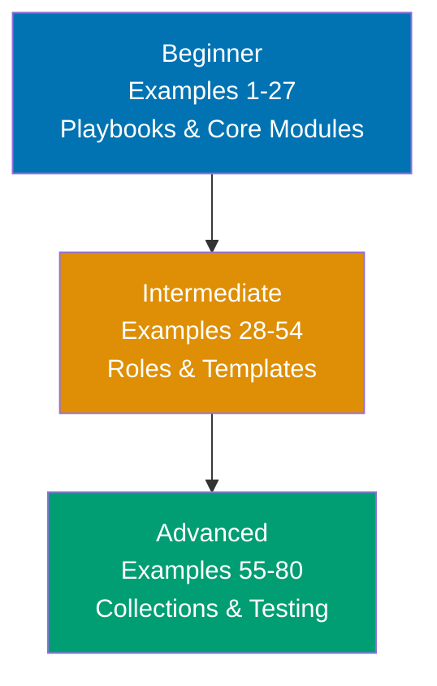

**Want to master Ansible through working examples?** This by-example guide teaches 95% of Ansible through 80 annotated code examples organized by complexity level.

## What Is By-Example Learning?

By-example learning is an **example-first approach** where you learn through annotated, runnable code rather than narrative explanations. Each example is self-contained, immediately executable as an Ansible playbook or task, and heavily commented to show:

- **What each line does** - Inline comments explain modules, variables, and Ansible behavior
- **Expected outputs** - Using `# =>` notation for task results, module outputs, and state changes
- **Ansible mechanics** - How idempotency, facts, handlers, and execution flow work
- **Key takeaways** - 1-2 sentence summaries of patterns and best practices

This approach is **ideal for experienced infrastructure engineers** who already understand Linux systems and command-line tools, and want to quickly master Ansible's DSL, modules, and automation patterns through working playbooks.

Unlike narrative tutorials that build understanding through explanation and storytelling, by-example learning lets you **see the code first, run it second, and understand it through direct interaction**. You learn Ansible patterns by running actual automation playbooks.

## What Is Ansible?

**Ansible** is an agentless automation platform that uses SSH to configure systems, deploy applications, and orchestrate complex workflows. Unlike agent-based tools (Puppet, Chef), **Ansible provides**:

- **Agentless architecture** - No agents to install; uses SSH and Python on target hosts
- **Declarative YAML syntax** - Human-readable playbooks describing desired state
- **Idempotent modules** - Safe to run multiple times; only applies necessary changes
- **Built-in modules** - 3000+ modules for system, cloud, network, and application management
- **Simple inventory** - Static INI/YAML files or dynamic cloud-based sources
- **No database** - Stateless execution model; playbooks are the source of truth

**Ansible vs. Shell Scripts**: Shell scripts are procedural (step-by-step commands). Ansible playbooks are declarative (desired state) and idempotent (safe to rerun). Ansible handles error checking, state validation, and cross-platform differences automatically.

## Learning Path



Progress from Ansible fundamentals (playbooks, inventory, core modules) through production patterns (roles, templates, vault) to advanced automation (custom modules, collections, testing). Each level builds on the previous, introducing more sophisticated Ansible features and real-world patterns.

## Coverage Philosophy

This by-example guide provides **95% coverage of Ansible** through practical, annotated examples. The 95% figure represents the depth and breadth of concepts covered, not a time estimate—focus is on **outcomes and understanding**, not duration.

### What's Covered

- **Playbook fundamentals** - YAML syntax, tasks, plays, execution flow, verbosity
- **Inventory management** - Static INI/YAML files, dynamic inventory, groups, host variables
- **Core modules** - `command`, `shell`, `copy`, `file`, `template`, `apt`, `yum`, `service`
- **Variables and facts** - Variables, facts, host_vars, group_vars, Jinja2 templating
- **Conditionals and loops** - `when`, `loop`, `with_items`, `until`, complex conditions
- **Roles and Galaxy** - Role structure, dependencies, Ansible Galaxy, role composition
- **Handlers and notifications** - Handler triggers, notifications, flush_handlers, idempotency
- **Templates** - Jinja2 syntax, filters, loops, conditionals, whitespace control
- **Ansible Vault** - Encrypting variables, vault-id, editing encrypted files, best practices
- **Error handling** - `ignore_errors`, `failed_when`, `changed_when`, `block`/`rescue`
- **Tags and task control** - Task tagging, --tags/--skip-tags, task delegation
- **Custom modules** - Python module development, argument spec, return values, testing
- **Ansible Collections** - Installing collections, using collection modules, creating collections
- **Testing** - Ansible-lint, Molecule, test scenarios, verification, CI/CD integration
- **Production patterns** - Idempotency, orchestration, rolling updates, health checks

### What's NOT Covered

This guide focuses on **Ansible essentials and production automation patterns**, not specialized use cases or exhaustive module coverage. For additional topics:

- **Ansible Tower/AWX** - Web UI, job scheduling, RBAC, workflows
- **Network automation** - Cisco, Juniper, Arista module deep-dives
- **Windows automation** - WinRM configuration, Windows-specific modules
- **Container orchestration** - Kubernetes operator patterns, Docker Swarm
- **All 3000+ modules** - Focus on most common 50-60 modules

The 95% coverage goal maintains humility—no tutorial can cover everything. This guide teaches the **core patterns that unlock the remaining 5%** through your own exploration and Ansible documentation.

## Prerequisites

Before starting this tutorial, you should be comfortable with:

- **Linux command line** - File operations, permissions, process management, SSH
- **YAML syntax** - Basic YAML structure, lists, dictionaries, multi-line strings
- **SSH fundamentals** - Key-based authentication, ssh-agent, authorized_keys
- **Python basics** - Understanding that Ansible uses Python under the hood
- **Text editors** - Vim, nano, or your preferred editor for playbook editing

No prior Ansible experience required—this guide starts from first principles and builds to production automation patterns.

## How to Use This Guide

1. **Read beginner examples** (1-27) - Establish playbook fundamentals and module usage
2. **Run each example** - Execute playbooks against test VMs or containers
3. **Read intermediate examples** (28-54) - Learn roles, templates, and production patterns
4. **Read advanced examples** (55-80) - Master testing, custom modules, and CI/CD integration
5. **Experiment** - Modify examples, combine patterns, build your own automation

Focus on running and understanding examples rather than memorizing syntax. Ansible is learned through doing—each example should be executed and experimented with.

## Example Structure

Each example follows a five-part format:

1. **Explanation** (2-4 sentences) - What the example demonstrates and why it matters
2. **Diagram** (when helpful) - Mermaid diagram visualizing execution flow or architecture
3. **Annotated code** - Playbook with inline `# =>` comments showing outputs and mechanics
4. **Key takeaway** - 1-2 sentence summary of the pattern learned

This format emphasizes **code first, explanation second**—you see working automation before diving into conceptual details.

## Getting Started

Install Ansible and set up a test environment:

```yaml
# Install on Ubuntu/Debian
# $ sudo apt update && sudo apt install ansible

# Install on macOS
# $ brew install ansible

# Verify installation
# $ ansible --version
# => ansible [core 2.15.0] or later
```

Set up SSH access to test hosts, then proceed to [Beginner](/en/learn/software-engineering/infrastructure/tools/ansible/by-example/beginner) examples.

## Examples by Level

### Beginner (Examples 1–27)

- [Example 1: Hello World Playbook](/en/learn/software-engineering/infrastructure/tools/ansible/by-example/beginner#example-1-hello-world-playbook)
- [Example 2: Ansible Installation Verification](/en/learn/software-engineering/infrastructure/tools/ansible/by-example/beginner#example-2-ansible-installation-verification)
- [Example 3: Multi-Task Playbook](/en/learn/software-engineering/infrastructure/tools/ansible/by-example/beginner#example-3-multi-task-playbook)
- [Example 4: YAML Syntax and Structure](/en/learn/software-engineering/infrastructure/tools/ansible/by-example/beginner#example-4-yaml-syntax-and-structure)
- [Example 5: Multiple Plays in One Playbook](/en/learn/software-engineering/infrastructure/tools/ansible/by-example/beginner#example-5-multiple-plays-in-one-playbook)
- [Example 6: Playbook Variables and Precedence](/en/learn/software-engineering/infrastructure/tools/ansible/by-example/beginner#example-6-playbook-variables-and-precedence)
- [Example 7: Static Inventory (INI Format)](/en/learn/software-engineering/infrastructure/tools/ansible/by-example/beginner#example-7-static-inventory-ini-format)
- [Example 8: Static Inventory (YAML Format)](/en/learn/software-engineering/infrastructure/tools/ansible/by-example/beginner#example-8-static-inventory-yaml-format)
- [Example 9: Inventory Host Patterns](/en/learn/software-engineering/infrastructure/tools/ansible/by-example/beginner#example-9-inventory-host-patterns)
- [Example 10: Dynamic Inventory Basics](/en/learn/software-engineering/infrastructure/tools/ansible/by-example/beginner#example-10-dynamic-inventory-basics)
- [Example 11: Command vs Shell Modules](/en/learn/software-engineering/infrastructure/tools/ansible/by-example/beginner#example-11-command-vs-shell-modules)
- [Example 12: Copy Module for File Transfer](/en/learn/software-engineering/infrastructure/tools/ansible/by-example/beginner#example-12-copy-module-for-file-transfer)
- [Example 13: File Module for File Management](/en/learn/software-engineering/infrastructure/tools/ansible/by-example/beginner#example-13-file-module-for-file-management)
- [Example 14: Template Module with Jinja2](/en/learn/software-engineering/infrastructure/tools/ansible/by-example/beginner#example-14-template-module-with-jinja2)
- [Example 15: Package Management (apt/yum)](/en/learn/software-engineering/infrastructure/tools/ansible/by-example/beginner#example-15-package-management-aptyum)
- [Example 16: Service Management](/en/learn/software-engineering/infrastructure/tools/ansible/by-example/beginner#example-16-service-management)
- [Example 17: User Management](/en/learn/software-engineering/infrastructure/tools/ansible/by-example/beginner#example-17-user-management)
- [Example 18: Variable Types and Scopes](/en/learn/software-engineering/infrastructure/tools/ansible/by-example/beginner#example-18-variable-types-and-scopes)
- [Example 19: Ansible Facts](/en/learn/software-engineering/infrastructure/tools/ansible/by-example/beginner#example-19-ansible-facts)
- [Example 20: Custom Facts](/en/learn/software-engineering/infrastructure/tools/ansible/by-example/beginner#example-20-custom-facts)
- [Example 21: Variable Files and Inclusion](/en/learn/software-engineering/infrastructure/tools/ansible/by-example/beginner#example-21-variable-files-and-inclusion)
- [Example 22: Host and Group Variables](/en/learn/software-engineering/infrastructure/tools/ansible/by-example/beginner#example-22-host-and-group-variables)
- [Example 23: When Conditionals](/en/learn/software-engineering/infrastructure/tools/ansible/by-example/beginner#example-23-when-conditionals)
- [Example 24: Loop with List](/en/learn/software-engineering/infrastructure/tools/ansible/by-example/beginner#example-24-loop-with-list)
- [Example 25: Loop with Dictionary](/en/learn/software-engineering/infrastructure/tools/ansible/by-example/beginner#example-25-loop-with-dictionary)
- [Example 26: Loop Control and Error Handling](/en/learn/software-engineering/infrastructure/tools/ansible/by-example/beginner#example-26-loop-control-and-error-handling)
- [Example 27: Advanced Loop Patterns](/en/learn/software-engineering/infrastructure/tools/ansible/by-example/beginner#example-27-advanced-loop-patterns)

### Intermediate (Examples 28–54)

- [Example 28: Basic Role Structure](/en/learn/software-engineering/infrastructure/tools/ansible/by-example/intermediate#example-28-basic-role-structure)
- [Example 29: Role Variables and Precedence](/en/learn/software-engineering/infrastructure/tools/ansible/by-example/intermediate#example-29-role-variables-and-precedence)
- [Example 30: Role Dependencies](/en/learn/software-engineering/infrastructure/tools/ansible/by-example/intermediate#example-30-role-dependencies)
- [Example 31: Ansible Galaxy - Using Community Roles](/en/learn/software-engineering/infrastructure/tools/ansible/by-example/intermediate#example-31-ansible-galaxy---using-community-roles)
- [Example 32: Creating Distributable Roles](/en/learn/software-engineering/infrastructure/tools/ansible/by-example/intermediate#example-32-creating-distributable-roles)
- [Example 33: Role Include and Import](/en/learn/software-engineering/infrastructure/tools/ansible/by-example/intermediate#example-33-role-include-and-import)
- [Example 34: Handler Basics](/en/learn/software-engineering/infrastructure/tools/ansible/by-example/intermediate#example-34-handler-basics)
- [Example 35: Handler Notification Patterns](/en/learn/software-engineering/infrastructure/tools/ansible/by-example/intermediate#example-35-handler-notification-patterns)
- [Example 36: Flush Handlers and Listen](/en/learn/software-engineering/infrastructure/tools/ansible/by-example/intermediate#example-36-flush-handlers-and-listen)
- [Example 37: Handler Conditionals and Error Handling](/en/learn/software-engineering/infrastructure/tools/ansible/by-example/intermediate#example-37-handler-conditionals-and-error-handling)
- [Example 38: Jinja2 Template Basics](/en/learn/software-engineering/infrastructure/tools/ansible/by-example/intermediate#example-38-jinja2-template-basics)
- [Example 39: Jinja2 Conditionals and Loops](/en/learn/software-engineering/infrastructure/tools/ansible/by-example/intermediate#example-39-jinja2-conditionals-and-loops)
- [Example 40: Jinja2 Filters and Tests](/en/learn/software-engineering/infrastructure/tools/ansible/by-example/intermediate#example-40-jinja2-filters-and-tests)
- [Example 41: Template Whitespace Control](/en/learn/software-engineering/infrastructure/tools/ansible/by-example/intermediate#example-41-template-whitespace-control)
- [Example 42: Template Macros and Inheritance](/en/learn/software-engineering/infrastructure/tools/ansible/by-example/intermediate#example-42-template-macros-and-inheritance)
- [Example 43: Vault Basics](/en/learn/software-engineering/infrastructure/tools/ansible/by-example/intermediate#example-43-vault-basics)
- [Example 44: Vault IDs for Multiple Passwords](/en/learn/software-engineering/infrastructure/tools/ansible/by-example/intermediate#example-44-vault-ids-for-multiple-passwords)
- [Example 45: Inline Encrypted Variables](/en/learn/software-engineering/infrastructure/tools/ansible/by-example/intermediate#example-45-inline-encrypted-variables)
- [Example 46: Vault Best Practices](/en/learn/software-engineering/infrastructure/tools/ansible/by-example/intermediate#example-46-vault-best-practices)
- [Example 47: Failed When and Changed When](/en/learn/software-engineering/infrastructure/tools/ansible/by-example/intermediate#example-47-failed-when-and-changed-when)
- [Example 48: Ignore Errors and Error Recovery](/en/learn/software-engineering/infrastructure/tools/ansible/by-example/intermediate#example-48-ignore-errors-and-error-recovery)
- [Example 49: Block, Rescue, and Always](/en/learn/software-engineering/infrastructure/tools/ansible/by-example/intermediate#example-49-block-rescue-and-always)
- [Example 50: Assertions and Validations](/en/learn/software-engineering/infrastructure/tools/ansible/by-example/intermediate#example-50-assertions-and-validations)
- [Example 51: Task Tagging Basics](/en/learn/software-engineering/infrastructure/tools/ansible/by-example/intermediate#example-51-task-tagging-basics)
- [Example 52: Role and Play Tagging](/en/learn/software-engineering/infrastructure/tools/ansible/by-example/intermediate#example-52-role-and-play-tagging)
- [Example 53: Tag-Based Workflows](/en/learn/software-engineering/infrastructure/tools/ansible/by-example/intermediate#example-53-tag-based-workflows)
- [Example 54: Task Delegation and Run Once](/en/learn/software-engineering/infrastructure/tools/ansible/by-example/intermediate#example-54-task-delegation-and-run-once)

### Advanced (Examples 55–80)

- [Example 55: Custom Module - Hello Module](/en/learn/software-engineering/infrastructure/tools/ansible/by-example/advanced#example-55-custom-module---hello-module)
- [Example 56: Custom Module with State Management](/en/learn/software-engineering/infrastructure/tools/ansible/by-example/advanced#example-56-custom-module-with-state-management)
- [Example 57: Ansible Collections - Using Collections](/en/learn/software-engineering/infrastructure/tools/ansible/by-example/advanced#example-57-ansible-collections---using-collections)
- [Example 58: Testing with Molecule - Scenario](/en/learn/software-engineering/infrastructure/tools/ansible/by-example/advanced#example-58-testing-with-molecule---scenario)
- [Example 59: Ansible-Lint Configuration](/en/learn/software-engineering/infrastructure/tools/ansible/by-example/advanced#example-59-ansible-lint-configuration)
- [Example 60: Performance - Fact Caching](/en/learn/software-engineering/infrastructure/tools/ansible/by-example/advanced#example-60-performance---fact-caching)
- [Example 61: Performance - Pipelining](/en/learn/software-engineering/infrastructure/tools/ansible/by-example/advanced#example-61-performance---pipelining)
- [Example 62: CI/CD - GitHub Actions Pipeline](/en/learn/software-engineering/infrastructure/tools/ansible/by-example/advanced#example-62-cicd---github-actions-pipeline)
- [Example 63: Production Pattern - Rolling Updates](/en/learn/software-engineering/infrastructure/tools/ansible/by-example/advanced#example-63-production-pattern---rolling-updates)
- [Example 64: Production Pattern - Canary Deployment](/en/learn/software-engineering/infrastructure/tools/ansible/by-example/advanced#example-64-production-pattern---canary-deployment)
- [Example 65: Production Pattern - Blue-Green Deployment](/en/learn/software-engineering/infrastructure/tools/ansible/by-example/advanced#example-65-production-pattern---blue-green-deployment)
- [Example 66: Production Pattern - Immutable Infrastructure](/en/learn/software-engineering/infrastructure/tools/ansible/by-example/advanced#example-66-production-pattern---immutable-infrastructure)
- [Example 67: Zero-Downtime Deployment Pattern](/en/learn/software-engineering/infrastructure/tools/ansible/by-example/advanced#example-67-zero-downtime-deployment-pattern)
- [Example 68: Monitoring Integration](/en/learn/software-engineering/infrastructure/tools/ansible/by-example/advanced#example-68-monitoring-integration)
- [Example 69: Disaster Recovery Pattern](/en/learn/software-engineering/infrastructure/tools/ansible/by-example/advanced#example-69-disaster-recovery-pattern)
- [Example 70: Configuration Drift Detection](/en/learn/software-engineering/infrastructure/tools/ansible/by-example/advanced#example-70-configuration-drift-detection)
- [Example 71: Multi-Stage Deployment Pipeline](/en/learn/software-engineering/infrastructure/tools/ansible/by-example/advanced#example-71-multi-stage-deployment-pipeline)
- [Example 72: Secrets Management with HashiCorp Vault](/en/learn/software-engineering/infrastructure/tools/ansible/by-example/advanced#example-72-secrets-management-with-hashicorp-vault)
- [Example 73: Compliance Auditing](/en/learn/software-engineering/infrastructure/tools/ansible/by-example/advanced#example-73-compliance-auditing)
- [Example 74: Network Automation - VLAN Configuration](/en/learn/software-engineering/infrastructure/tools/ansible/by-example/advanced#example-74-network-automation---vlan-configuration)
- [Example 75: Container Orchestration - Docker Deployment](/en/learn/software-engineering/infrastructure/tools/ansible/by-example/advanced#example-75-container-orchestration---docker-deployment)
- [Example 76: Kubernetes Deployment](/en/learn/software-engineering/infrastructure/tools/ansible/by-example/advanced#example-76-kubernetes-deployment)
- [Example 77: Database Migration Automation](/en/learn/software-engineering/infrastructure/tools/ansible/by-example/advanced#example-77-database-migration-automation)
- [Example 78: Self-Healing Infrastructure](/en/learn/software-engineering/infrastructure/tools/ansible/by-example/advanced#example-78-self-healing-infrastructure)
- [Example 79: Infrastructure Cost Optimization](/en/learn/software-engineering/infrastructure/tools/ansible/by-example/advanced#example-79-infrastructure-cost-optimization)
- [Example 80: Chaos Engineering with Ansible](/en/learn/software-engineering/infrastructure/tools/ansible/by-example/advanced#example-80-chaos-engineering-with-ansible)
