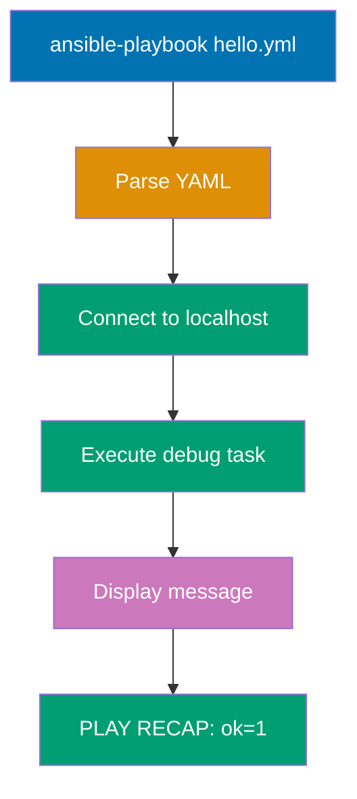

**Want to start automating infrastructure with Ansible?** This initial setup guide gets Ansible installed and working on your system. By the end, you'll have Ansible running and will execute your first playbook.

This tutorial provides 0-5% coverage - just enough to get Ansible working on your machine. For deeper learning, continue to [Quick Start](/en/learn/software-engineering/infrastructure/tools/ansible/quick-start) (5-30% coverage) or explore [By Example](/en/learn/software-engineering/infrastructure/tools/ansible/by-example) tutorials.

## Prerequisites

Before installing Ansible, you need:

- A computer running Linux, macOS, or WSL2 (Windows Subsystem for Linux)
- Python 3.8 or newer (check with `python3 --version`)
- Administrator/sudo access for installation
- A terminal/command prompt
- A text editor (VS Code, Vim, Nano, or any editor)
- Basic command-line navigation skills

**Important**: Ansible control node requires Linux/Unix. Windows can run Ansible via WSL2 but cannot be a control node natively. Managed nodes (target systems) can be Windows, Linux, or Unix.

## Learning Objectives

By the end of this tutorial, you will be able to:

1. **Install** Ansible on your operating system
2. **Verify** that Ansible is installed correctly and check the version
3. **Write** your first Ansible playbook (Hello, World!)
4. **Execute** playbooks using ansible-playbook command
5. **Understand** basic inventory concepts and localhost targeting

## Platform-Specific Installation

Choose your operating system and follow the installation steps.

### Linux Installation (Ubuntu/Debian)

**Step 1: Update Package Index**

```bash
sudo apt update
```

**Step 2: Install Ansible via Package Manager**

```bash
sudo apt install ansible -y
```

This installs:

- Ansible core engine
- ansible-playbook command
- ansible-galaxy for role management
- ansible-doc for documentation
- Required Python dependencies

**Step 3: Verify Installation**

```bash
ansible --version
```

Expected output:

```
ansible [core 2.15.X]
  config file = /etc/ansible/ansible.cfg
  configured module search path = ['/home/user/.ansible/plugins/modules', ...]
  ansible python module location = /usr/lib/python3/dist-packages/ansible
  ansible collection location = /home/user/.ansible/collections
  executable location = /usr/bin/ansible
  python version = 3.11.X
```

**Alternative: Install Latest Version via pip**

For the latest Ansible version (recommended for production):

```bash
sudo apt install python3-pip python3-venv -y

python3 -m venv ~/ansible-venv
source ~/ansible-venv/bin/activate

pip install ansible
```

Verify:

```bash
ansible --version
```

**Troubleshooting Ubuntu/Debian**:

- If `ansible --version` fails, ensure Python 3.8+ is installed: `python3 --version`
- If using virtual environment, activate it before running Ansible commands
- For "command not found" errors, add pip install location to PATH: `export PATH="$HOME/.local/bin:$PATH"`

### Linux Installation (Fedora/RHEL/CentOS)

**Step 1: Install Ansible via DNF**

**Fedora**:

```bash
sudo dnf install ansible -y
```

**RHEL/CentOS 8+** (requires EPEL repository):

```bash
sudo dnf install epel-release -y

sudo dnf install ansible -y
```

**Step 2: Verify Installation**

```bash
ansible --version
```

Expected output similar to Ubuntu/Debian example above.

**Alternative: Install via pip**

```bash
sudo dnf install python3-pip -y

pip3 install --user ansible
```

**Troubleshooting Fedora/RHEL/CentOS**:

- RHEL/CentOS requires EPEL repository for Ansible package
- Use `dnf` (not `yum`) on RHEL 8+ and Fedora
- For older CentOS 7, use `yum install ansible` after enabling EPEL

### Linux Installation (Arch Linux)

**Step 1: Install via pacman**

```bash
sudo pacman -S ansible
```

**Step 2: Verify Installation**

```bash
ansible --version
```

**Troubleshooting Arch Linux**:

- Arch provides latest stable Ansible in official repositories
- No additional repositories needed
- Python dependencies are resolved automatically

### macOS Installation

**Step 1: Install Homebrew (if not installed)**

Check if Homebrew is installed:

```bash
brew --version
```

If not installed, install Homebrew:

```bash
/bin/bash -c "$(curl -fsSL https://raw.githubusercontent.com/Homebrew/install/HEAD/install.sh)"
```

**Step 2: Install Ansible via Homebrew**

```bash
brew install ansible
```

This installs:

- Latest stable Ansible
- Python dependencies
- All Ansible utilities (ansible-playbook, ansible-galaxy, etc.)

**Step 3: Verify Installation**

```bash
ansible --version
```

Expected output:

```
ansible [core 2.15.X]
  config file = None
  configured module search path = ['/Users/username/.ansible/plugins/modules', ...]
  ansible python module location = /opt/homebrew/lib/python3.11/site-packages/ansible
  ansible collection location = /Users/username/.ansible/collections
  executable location = /opt/homebrew/bin/ansible
  python version = 3.11.X
```

**Alternative: Install via pip**

```bash
pip3 install --user ansible

export PATH="$HOME/Library/Python/3.11/bin:$PATH"
```

**Troubleshooting macOS**:

- If `brew install ansible` fails, update Homebrew: `brew update`
- Ensure Xcode Command Line Tools are installed: `xcode-select --install`
- For pip installation, Python 3 must be installed: `brew install python`

### Windows Installation (via WSL2)

**Step 1: Enable WSL2**

Open PowerShell as Administrator and run:

```powershell
wsl --install
```

This installs:

- WSL2 (Windows Subsystem for Linux)
- Ubuntu Linux distribution (default)

Restart your computer when prompted.

**Step 2: Launch WSL2 Ubuntu**

1. Open Windows Start Menu
2. Type "Ubuntu" and launch the Ubuntu app
3. Complete initial setup (create username and password)

**Step 3: Install Ansible in WSL2**

Inside the Ubuntu terminal:

```bash
sudo apt update

sudo apt install ansible -y
```

**Step 4: Verify Installation**

```bash
ansible --version
```

**Alternative: Use Python pip in WSL2**

```bash
sudo apt install python3-pip -y

pip3 install --user ansible

echo 'export PATH="$HOME/.local/bin:$PATH"' >> ~/.bashrc
source ~/.bashrc
```

**Troubleshooting Windows/WSL2**:

- WSL2 requires Windows 10 version 2004+ or Windows 11
- If WSL2 installation fails, enable virtualization in BIOS
- Cannot run Ansible natively on Windows (must use WSL2, Cygwin, or containers)
- Windows machines can be managed by Ansible (as managed nodes) using WinRM

## Version Verification

After installation, verify Ansible is working correctly.

### Check Ansible Version

```bash
ansible --version
```

Key information displayed:

- **ansible [core X.X.X]**: Ansible version
- **config file**: Location of ansible.cfg (None if using defaults)
- **python version**: Python interpreter version used by Ansible
- **executable location**: Where Ansible binary is installed

### Check ansible-playbook Command

```bash
ansible-playbook --version
```

Should display same version information as `ansible --version`.

### Check ansible-galaxy Command

```bash
ansible-galaxy --version
```

ansible-galaxy installs and manages Ansible roles and collections from Ansible Galaxy (community repository).

### Check Installation Path

Find where Ansible is installed:

```bash
which ansible

```

## Your First Ansible Playbook

Let's write and run your first Ansible playbook - the classic "Hello, World!".

### Create a Project Directory

Create a directory for your Ansible projects:

```bash
mkdir -p ~/ansible-projects/hello
cd ~/ansible-projects/hello
```

**Directory structure**:

```
~/ansible-projects/
└── hello/
    └── (we'll create playbook here)
```

### Understanding Playbook Structure

Ansible playbooks are YAML files that describe desired system state. Every playbook contains:

1. **Play definition**: Name, target hosts, settings
2. **Tasks**: Ordered list of actions to execute
3. **Modules**: Built-in functions that perform actions (e.g., debug, copy, shell)

**Basic playbook anatomy**:

```yaml
---
- name: Play Name # Human-readable play name
  hosts: target_hosts # Which hosts to target
  tasks: # List of tasks to execute
    - name: Task Name # Human-readable task name
      module_name: # Ansible module to use
        parameter: value # Module parameters
```

### Write the Hello World Playbook

Create a file named `hello.yml`:

```yaml
---
- name: Hello World Playbook
  hosts: localhost
  gather_facts: false

  tasks:
    - name: Print greeting
      ansible.builtin.debug:
        msg: "Hello, Ansible World!"
```

**Code breakdown**:

- `---`: YAML document start marker
- `name`: Human-readable play description (appears in output)
- `hosts: localhost`: Target the local machine (special host that always exists)
- `gather_facts: false`: Skip gathering system information (faster for simple playbooks)
- `tasks`: List of actions to execute
- `ansible.builtin.debug`: Built-in module that prints messages (safe, no system changes)
- `msg`: Parameter for debug module (message to display)

**Save the file** as `hello.yml` in your project directory.

### Run the Playbook

Execute your playbook:

```bash
ansible-playbook hello.yml
```

**Expected output**:

```
PLAY [Hello World Playbook] **********************************************

TASK [Print greeting] ****************************************************
ok: [localhost] => {
    "msg": "Hello, Ansible World!"
}

PLAY RECAP ***************************************************************
localhost                  : ok=1    changed=0    unreachable=0    failed=0    skipped=0    rescued=0    ignored=0
```

**Output breakdown**:

- **PLAY**: Shows play name and start of execution
- **TASK**: Shows task name and result
- **ok**: Task executed successfully without changes
- **PLAY RECAP**: Summary of execution results per host
  - **ok=1**: 1 task succeeded
  - **changed=0**: 0 tasks made system changes
  - **failed=0**: 0 tasks failed

Congratulations! You've executed your first Ansible playbook.

### Understanding Execution Flow



## Understanding Localhost Targeting

The `hosts: localhost` directive targets your local machine without SSH. This is useful for:

- Learning Ansible basics
- Running local tasks (file manipulation, API calls)
- Provisioning local development environments
- Testing playbooks before deploying to remote hosts

**Key facts about localhost**:

- No SSH connection required (direct Python execution)
- No inventory file needed (localhost always exists)
- Faster execution (no network overhead)
- Perfect for learning and testing

## Common Installation Issues

### Python version too old

**Problem**: Ansible requires Python 3.8+ but system has older version.

**Solution**:

- **Ubuntu/Debian**: `sudo apt install python3.11 python3.11-venv -y`
- **macOS**: `brew install python@3.11`
- Use virtual environment with newer Python version
- Install Ansible via pip in virtual environment

### Command not found

**Problem**: `ansible: command not found` after installation.

**Solution**:

```bash
find / -name ansible 2>/dev/null

echo 'export PATH="$HOME/.local/bin:$PATH"' >> ~/.bashrc
source ~/.bashrc
```

### Permission denied errors

**Problem**: Cannot write to installation directory.

**Solution**:

- Install via package manager with sudo: `sudo apt install ansible`
- Or install via pip with --user flag: `pip3 install --user ansible`
- Use virtual environment (recommended): `python3 -m venv ~/ansible-venv`

### Ansible version mismatch

**Problem**: Multiple Ansible installations, wrong version being used.

**Solution**:

```bash
which ansible

pip list | grep ansible
apt list --installed | grep ansible  # Ubuntu/Debian
```

Remove conflicting installations and keep only one.

## Next Steps

Now that Ansible is installed, continue your learning journey:

1. **Quick Start Tutorial**: Learn core Ansible concepts with hands-on examples
   - Visit [Quick Start](/en/learn/software-engineering/infrastructure/tools/ansible/quick-start) for 5-30% coverage
2. **By Example Learning**: Master Ansible through annotated code examples
   - Explore [By Example - Beginner](/en/learn/software-engineering/infrastructure/tools/ansible/by-example/beginner) (0-40% coverage)
   - Progress to [By Example - Intermediate](/en/learn/software-engineering/infrastructure/tools/ansible/by-example/intermediate) (40-75% coverage)
   - Master with [By Example - Advanced](/en/learn/software-engineering/infrastructure/tools/ansible/by-example/advanced) (75-95% coverage)

## Further Resources

**Official Ansible Documentation**:

- [Ansible Documentation](https://docs.ansible.com/) - Comprehensive official docs
- [Ansible Installation Guide](https://docs.ansible.com/ansible/latest/installation_guide/) - Detailed installation instructions
- [Getting Started](https://docs.ansible.com/ansible/latest/user_guide/intro_getting_started.html) - Official getting started guide
- [Ansible Galaxy](https://galaxy.ansible.com/) - Community roles and collections

**Development Tools**:

- [VS Code](https://code.visualstudio.com/) with [Ansible extension](https://marketplace.visualstudio.com/items?itemName=redhat.ansible) - YAML syntax highlighting and validation
- [Ansible Lint](https://ansible-lint.readthedocs.io/) - Best practices checker for playbooks
- [Molecule](https://molecule.readthedocs.io/) - Testing framework for Ansible roles

**Community**:

- [Ansible Community Forum](https://forum.ansible.com/) - Official community help
- [/r/ansible](https://www.reddit.com/r/ansible/) - Reddit community
- [Ansible Discord](https://discord.gg/ansible) - Real-time chat for learners
- [Ansible Mailing Lists](https://groups.google.com/g/ansible-project) - Development discussions

## Summary

You've successfully completed the Ansible initial setup! You now have:

- Ansible installed and verified on your system
- Understanding of basic playbook structure
- Experience running your first playbook
- Knowledge of localhost targeting
- Resources for continued learning

The next step is to explore more complex playbooks with multiple tasks, remote host targeting, and real-world automation scenarios in the Quick Start tutorial.
