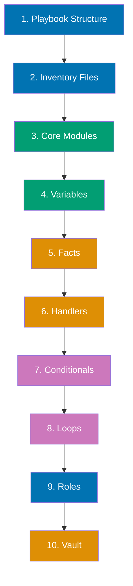
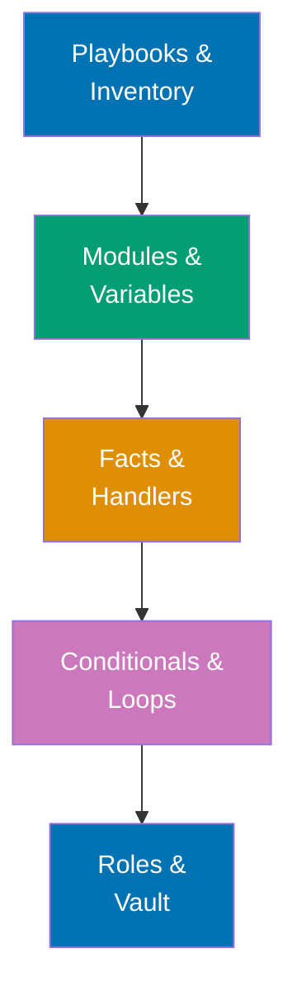

**Want to automate infrastructure management without writing complex scripts?** This quick start introduces essential Ansible concepts through practical examples. You'll build from simple playbooks to multi-host automation workflows.

This tutorial provides 5-30% coverage using the touchpoints approach - 10 core concepts with runnable examples. After completing this guide, continue to [By Example - Beginner](/en/learn/software-engineering/infrastructure/tools/ansible/by-example/beginner) for comprehensive 0-40% coverage.

## Prerequisites

Before starting, ensure you have completed [Initial Setup](/en/learn/software-engineering/infrastructure/tools/ansible/initial-setup). You should have:

- Ansible installed and verified
- Experience running basic playbooks
- Understanding of localhost targeting
- A terminal and text editor ready

## Learning Path

This quick start covers 10 essential Ansible touchpoints:



## Concept 1: Playbook Structure

**What**: YAML files declaring desired system state with plays and tasks.

**Why**: Foundation for all Ansible automation - declarative infrastructure as code.

### Example: Multi-Task Playbook

Create `playbook-structure.yml`:

```yaml
---
- name: Demonstrate playbook structure
  hosts: localhost
  gather_facts: false

  tasks:
    - name: Create directory
      ansible.builtin.file:
        path: /tmp/ansible-demo
        state: directory
        mode: "0755"

    - name: Create file with content
      ansible.builtin.copy:
        dest: /tmp/ansible-demo/info.txt
        content: |
          Ansible playbook executed successfully
          Timestamp: {{ ansible_date_time.iso8601 | default('Unknown') }}
        mode: "0644"

    - name: Display success message
      ansible.builtin.debug:
        msg: "Playbook completed - check /tmp/ansible-demo/info.txt"
```

Run:

```bash
ansible-playbook playbook-structure.yml
```

**Key points**:

- One playbook file can contain multiple plays
- Each play targets specific hosts
- Tasks execute sequentially within a play
- Idempotent - safe to run multiple times

## Concept 2: Inventory Files

**What**: Define target hosts and groups for automation.

**Why**: Manage infrastructure at scale with organized host groupings.

### Example: Static Inventory

Create `inventory.ini`:

```ini
# Web servers group
[webservers]
web1.example.com
web2.example.com

# Database servers group
[databases]
db1.example.com
db2.example.com

# All production servers
[production:children]
webservers
databases

# Group variables
[production:vars]
ansible_user=deploy
ansible_port=22
```

Create `inventory-demo.yml`:

```yaml
---
- name: Inventory demonstration
  hosts: localhost
  gather_facts: false

  tasks:
    - name: Show inventory structure
      ansible.builtin.debug:
        msg: |
          Inventories organize hosts into groups
          Groups enable targeted automation
          Variables can be set per-group
          This playbook uses localhost as safe demo
```

Run with custom inventory:

```bash
ansible-inventory -i inventory.ini --list

ansible-playbook -i inventory.ini inventory-demo.yml
```

**Key points**:

- Inventory organizes hosts into logical groups
- Groups enable selective task execution
- Variables set at group level apply to all hosts
- INI or YAML format supported

## Concept 3: Core Modules

**What**: Built-in functions performing specific infrastructure operations.

**Why**: Ansible's power comes from 3000+ modules for every task.

### Example: Essential Modules

Create `core-modules.yml`:

```yaml
---
- name: Core modules demonstration
  hosts: localhost
  gather_facts: false

  tasks:
    - name: File module - create directory
      ansible.builtin.file:
        path: /tmp/ansible-modules
        state: directory
        mode: "0755"

    - name: Copy module - write file
      ansible.builtin.copy:
        dest: /tmp/ansible-modules/data.txt
        content: "Sample data\n"

    - name: Lineinfile module - modify file
      ansible.builtin.lineinfile:
        path: /tmp/ansible-modules/data.txt
        line: "Added by lineinfile module"
        state: present

    - name: Command module - execute command
      ansible.builtin.command:
        cmd: cat /tmp/ansible-modules/data.txt
      register: file_content
      changed_when: false

    - name: Debug module - show output
      ansible.builtin.debug:
        var: file_content.stdout_lines
```

Run:

```bash
ansible-playbook core-modules.yml
```

**Key points**:

- `file`: Manage files, directories, symlinks
- `copy`: Copy files with inline content
- `lineinfile`: Edit specific lines in files
- `command`: Execute shell commands
- `debug`: Display variables and messages
- Each module is idempotent by default

## Concept 4: Variables

**What**: Store reusable values for flexibility and parameterization.

**Why**: Make playbooks generic and environment-agnostic.

### Example: Variable Usage

Create `variables.yml`:

```yaml
---
- name: Variables demonstration
  hosts: localhost
  gather_facts: false

  vars:
    app_name: "myapp"
    app_version: "1.0.0"
    deploy_path: "/tmp/{{ app_name }}"
    config:
      port: 8080
      host: "localhost"

  tasks:
    - name: Create app directory
      ansible.builtin.file:
        path: "{{ deploy_path }}"
        state: directory

    - name: Create config file
      ansible.builtin.copy:
        dest: "{{ deploy_path }}/config.txt"
        content: |
          Application: {{ app_name }}
          Version: {{ app_version }}
          Port: {{ config.port }}
          Host: {{ config.host }}

    - name: Display deployment info
      ansible.builtin.debug:
        msg: "Deployed {{ app_name }} v{{ app_version }} to {{ deploy_path }}"
```

Run:

```bash
ansible-playbook variables.yml
```

Run with extra variables:

```bash
ansible-playbook variables.yml -e "app_version=2.0.0"
```

**Key points**:

- Define with `vars:` keyword in play
- Access with Jinja2 template syntax `{{ variable }}`
- Override with `-e` flag at runtime
- Support nested dictionaries and lists
- Variable precedence: extra vars > play vars > inventory vars

## Concept 5: Facts

**What**: Automatically gathered system information about target hosts.

**Why**: Make decisions based on OS, hardware, network configuration.

### Example: Using Facts

Create `facts.yml`:

```yaml
---
- name: Facts demonstration
  hosts: localhost
  gather_facts: true

  tasks:
    - name: Display operating system
      ansible.builtin.debug:
        msg: "OS: {{ ansible_distribution }} {{ ansible_distribution_version }}"

    - name: Display hostname
      ansible.builtin.debug:
        msg: "Hostname: {{ ansible_hostname }}"

    - name: Display Python version
      ansible.builtin.debug:
        msg: "Python: {{ ansible_python_version }}"

    - name: Display memory info
      ansible.builtin.debug:
        msg: "Total RAM: {{ ansible_memtotal_mb }} MB"

    - name: Display CPU cores
      ansible.builtin.debug:
        msg: "CPU cores: {{ ansible_processor_vcpus }}"

    - name: Show all network interfaces
      ansible.builtin.debug:
        msg: "Interfaces: {{ ansible_interfaces | join(', ') }}"
```

Run:

```bash
ansible-playbook facts.yml
```

View all available facts:

```bash
ansible localhost -m ansible.builtin.setup
```

**Key points**:

- `gather_facts: true` collects system info automatically
- Facts stored in variables like `ansible_*`
- Access facts with Jinja2 templates
- Use for conditional logic based on OS/hardware
- Disable with `gather_facts: false` for faster execution

## Concept 6: Handlers

**What**: Tasks that run only when notified and only once per play.

**Why**: Restart services only when configuration changes occur.

### Example: Handlers for Service Restart

Create `handlers.yml`:

```yaml
---
- name: Handlers demonstration
  hosts: localhost
  gather_facts: false

  handlers:
    - name: Restart application
      ansible.builtin.debug:
        msg: "APPLICATION RESTARTED (simulated)"

    - name: Reload configuration
      ansible.builtin.debug:
        msg: "CONFIGURATION RELOADED (simulated)"

  tasks:
    - name: Create config directory
      ansible.builtin.file:
        path: /tmp/app-config
        state: directory
      notify: Reload configuration

    - name: Update application config
      ansible.builtin.copy:
        dest: /tmp/app-config/app.conf
        content: |
          port=8080
          debug=false
      notify:
        - Reload configuration
        - Restart application

    - name: Another task without changes
      ansible.builtin.debug:
        msg: "This task does not trigger handlers"
```

Run:

```bash
ansible-playbook handlers.yml
```

**Key points**:

- Handlers run at end of play (after all tasks)
- Only run when notified by `notify:` keyword
- Run once even if notified multiple times
- Execute in order defined, not order notified
- Perfect for service restarts after config changes

## Concept 7: Conditionals

**What**: Execute tasks only when specific conditions are met.

**Why**: Support multi-OS playbooks and environment-specific logic.

### Example: Conditional Execution

Create `conditionals.yml`:

```yaml
---
- name: Conditionals demonstration
  hosts: localhost
  gather_facts: true

  vars:
    environment: "production"
    enable_debug: false

  tasks:
    - name: Production-only task
      ansible.builtin.debug:
        msg: "Running in PRODUCTION mode"
      when: environment == "production"

    - name: Development-only task
      ansible.builtin.debug:
        msg: "Running in DEVELOPMENT mode"
      when: environment == "development"

    - name: Debug mode task
      ansible.builtin.debug:
        msg: "Debug logging enabled"
      when: enable_debug

    - name: Linux-specific task
      ansible.builtin.debug:
        msg: "Detected Linux system"
      when: ansible_system == "Linux"

    - name: Multiple conditions (AND)
      ansible.builtin.debug:
        msg: "Production Linux system"
      when:
        - environment == "production"
        - ansible_system == "Linux"

    - name: Multiple conditions (OR)
      ansible.builtin.debug:
        msg: "Either production OR debug enabled"
      when: environment == "production" or enable_debug
```

Run:

```bash
ansible-playbook conditionals.yml
```

Run with different environment:

```bash
ansible-playbook conditionals.yml -e "environment=development"
```

**Key points**:

- Use `when:` keyword for conditions
- Conditions use Jinja2 expressions
- Multiple conditions: list for AND, `or` for OR
- Combine with facts for OS-specific tasks
- Skip tasks cleanly without errors

## Concept 8: Loops

**What**: Execute same task multiple times with different inputs.

**Why**: Avoid repetitive task definitions for similar operations.

### Example: Looping Through Lists

Create `loops.yml`:

```yaml
---
- name: Loops demonstration
  hosts: localhost
  gather_facts: false

  vars:
    packages:
      - name: package1
        version: "1.0"
      - name: package2
        version: "2.0"
      - name: package3
        version: "1.5"

  tasks:
    - name: Create multiple directories
      ansible.builtin.file:
        path: "/tmp/loop-demo/{{ item }}"
        state: directory
      loop:
        - dir1
        - dir2
        - dir3

    - name: Create files with different content
      ansible.builtin.copy:
        dest: "/tmp/loop-demo/{{ item.name }}.txt"
        content: "Version: {{ item.version }}\n"
      loop: "{{ packages }}"

    - name: Loop with index
      ansible.builtin.debug:
        msg: "Item {{ idx }}: {{ item }}"
      loop:
        - first
        - second
        - third
      loop_control:
        index_var: idx

    - name: Loop dictionary
      ansible.builtin.debug:
        msg: "Key: {{ item.key }}, Value: {{ item.value }}"
      loop: "{{ {'a': 1, 'b': 2, 'c': 3} | dict2items }}"
```

Run:

```bash
ansible-playbook loops.yml
```

**Key points**:

- `loop:` keyword iterates over lists
- Access current item with `{{ item }}`
- Loop over complex data structures (dictionaries)
- `loop_control` provides additional options
- Use `index_var` to access loop index
- Prefer `loop` over deprecated `with_*` keywords

## Concept 9: Roles

**What**: Organize playbooks into reusable, structured components.

**Why**: Share automation code across projects and teams.

### Example: Creating and Using Roles

Create role structure:

```bash
mkdir -p roles/webserver/{tasks,handlers,templates,vars,defaults}
```

Create `roles/webserver/tasks/main.yml`:

```yaml
---
- name: Create web directory
  ansible.builtin.file:
    path: "{{ web_root }}"
    state: directory
    mode: "0755"

- name: Deploy index page
  ansible.builtin.template:
    src: index.html.j2
    dest: "{{ web_root }}/index.html"
    mode: "0644"
  notify: Reload webserver
```

Create `roles/webserver/handlers/main.yml`:

```yaml
---
- name: Reload webserver
  ansible.builtin.debug:
    msg: "Webserver reloaded (simulated)"
```

Create `roles/webserver/templates/index.html.j2`:

```html
<!DOCTYPE html>
<html>
  <head>
    <title>{{ server_name }}</title>
  </head>
  <body>
    <h1>{{ server_name }}</h1>
    <p>Deployed by Ansible</p>
    <p>Environment: {{ environment }}</p>
  </body>
</html>
```

Create `roles/webserver/defaults/main.yml`:

```yaml
---
web_root: /tmp/webserver
server_name: "Demo Server"
environment: "development"
```

Create `roles.yml` playbook:

```yaml
---
- name: Roles demonstration
  hosts: localhost
  gather_facts: false

  roles:
    - role: webserver
      vars:
        server_name: "Production Web Server"
        environment: "production"
```

Run:

```bash
ansible-playbook roles.yml
```

Verify:

```bash
cat /tmp/webserver/index.html
```

**Key points**:

- Roles organize automation into reusable units
- Standard directory structure: tasks, handlers, templates, vars, defaults
- Include roles with `roles:` keyword
- Override role variables in playbook
- Share roles via Ansible Galaxy
- Role dependencies managed in `meta/main.yml`

## Concept 10: Vault (Secrets Management)

**What**: Encrypt sensitive data in playbooks and inventory.

**Why**: Secure passwords, API keys, certificates in version control.

### Example: Encrypted Variables

Create unencrypted file `secrets.yml`:

```yaml
---
db_password: "super_secret_password"
api_key: "abc123xyz789"
```

Encrypt with Vault:

```bash
# Encrypt file
ansible-vault encrypt secrets.yml

# Enter password when prompted
```

Create `vault-demo.yml`:

```yaml
---
- name: Vault demonstration
  hosts: localhost
  gather_facts: false

  vars_files:
    - secrets.yml

  tasks:
    - name: Use encrypted variable (safe - not displayed)
      ansible.builtin.debug:
        msg: "Database password is configured"

    - name: Create config with secret
      ansible.builtin.copy:
        dest: /tmp/app-config.txt
        content: |
          # Configuration file
          DB_PASSWORD={{ db_password }}
          API_KEY={{ api_key }}
        mode: "0600"
```

Run with vault password:

```bash
ansible-playbook vault-demo.yml --ask-vault-pass

echo "my_vault_password" > .vault-pass
ansible-playbook vault-demo.yml --vault-password-file .vault-pass
rm .vault-pass
```

Other vault operations:

```bash
ansible-vault view secrets.yml

ansible-vault edit secrets.yml

ansible-vault decrypt secrets.yml

ansible-vault rekey secrets.yml
```

**Key points**:

- Vault encrypts YAML files containing secrets
- Use `--ask-vault-pass` or `--vault-password-file`
- Encrypt entire files or specific variables
- Safe to commit encrypted files to version control
- Multiple vault IDs for different secret scopes
- Never commit vault password files

## Learning Path Summary

You've completed 10 essential Ansible touchpoints:



## Next Steps

Now that you understand core Ansible concepts:

1. **By Example - Beginner**: Deep dive into 0-40% coverage with 25+ annotated examples
   - Visit [By Example - Beginner](/en/learn/software-engineering/infrastructure/tools/ansible/by-example/beginner)
2. **By Example - Intermediate**: Advance to 40-75% coverage with complex workflows
   - Continue to [By Example - Intermediate](/en/learn/software-engineering/infrastructure/tools/ansible/by-example/intermediate)
3. **By Example - Advanced**: Master 75-95% coverage with enterprise patterns
   - Progress to [By Example - Advanced](/en/learn/software-engineering/infrastructure/tools/ansible/by-example/advanced)

## Further Resources

**Official Documentation**:

- [Ansible User Guide](https://docs.ansible.com/ansible/latest/user_guide/) - Comprehensive guides
- [Module Index](https://docs.ansible.com/ansible/latest/collections/index.html) - All 3000+ modules
- [Best Practices](https://docs.ansible.com/ansible/latest/user_guide/playbooks_best_practices.html) - Production patterns
- [Ansible Galaxy](https://galaxy.ansible.com/) - Community roles and collections

**Key Concepts**:

- **Playbooks**: YAML files declaring desired state
- **Inventory**: Host and group organization
- **Modules**: Built-in functions for infrastructure tasks
- **Variables**: Parameterize playbooks for flexibility
- **Facts**: Auto-discovered system information
- **Handlers**: Conditional task execution (service restarts)
- **Roles**: Reusable automation components
- **Vault**: Encrypted secrets management

## Summary

You've completed the Ansible Quick Start with 5-30% coverage! You now understand:

- Playbook structure and multi-task workflows
- Inventory organization and host grouping
- Core modules for common operations
- Variable definition and usage
- Fact gathering and system information
- Handlers for conditional actions
- Conditional execution and loops
- Role-based code organization
- Vault secrets management

Continue your journey with comprehensive By Example tutorials for deeper mastery of Ansible automation.
