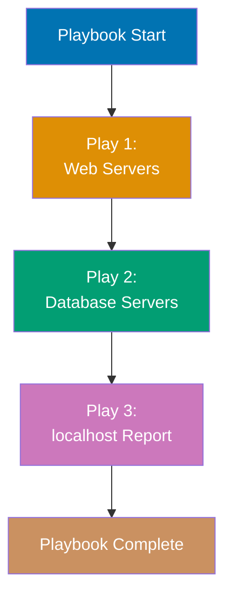
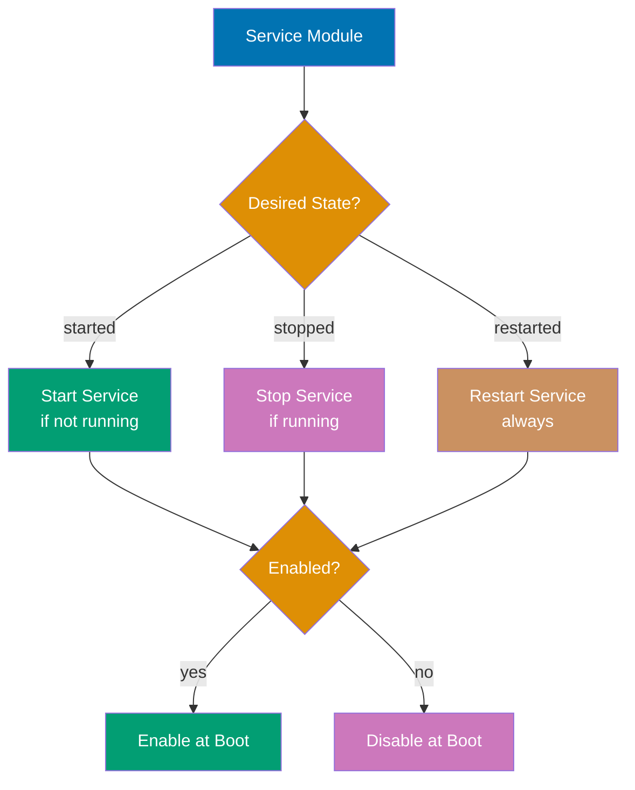

Learn Ansible fundamentals through 27 annotated code examples. Each example is self-contained, runnable, and heavily commented to show what each line does, expected outputs, and key takeaways.

## Group 1: Hello World & Installation

### Example 1: Hello World Playbook

Ansible playbooks are YAML files describing desired system state. Every playbook needs a name, hosts target, and tasks list. This minimal example runs a single command on localhost to verify Ansible installation.


**Code**:

```yaml
---
# hello.yml
- name: Hello World Playbook # => Human-readable play name (shows in output)
  hosts: localhost # => Target host (special name for local machine)
  gather_facts: false # => Skip fact gathering for speed (default: true)

  tasks:
    - name: Print greeting # => Task name (shows in output)
      ansible.builtin.debug: # => Debug module for printing messages
        msg: "Hello, Ansible!" # => Message to print
      # => Output: ok: [localhost] => { "msg": "Hello, Ansible!" }
```

**Run**: `ansible-playbook hello.yml`

**Key Takeaway**: Every playbook is a YAML file with plays containing tasks. The `debug` module prints messages without changing system state, making it safe for testing.

**Why It Matters**: Ansible playbooks replace manual SSH commands that are error-prone and unscalable. While manually SSHing to configure one server is manageable, NASA and Walmart manage thousands of servers with identical Ansible playbooks—ensuring consistent configuration across entire fleets. The declarative YAML format is human-readable and version-controllable, enabling Infrastructure as Code practices where configuration changes are audited, reviewed, and rolled back just like application code.

---

### Example 2: Ansible Installation Verification

Before writing automation, verify Ansible installation and Python environment. This playbook uses the `setup` module to gather system facts and display Ansible version information.

**Code**:

```yaml
---
# verify.yml
- name: Verify Ansible Installation
  hosts: localhost
  gather_facts: true # => Collect system information (default behavior)

  tasks:
    - name: Display Ansible version
      ansible.builtin.debug:
        msg: "Ansible version: {{ ansible_version.full }}"
      # => Output: Ansible version: 2.15.0 (reads from gathered facts)

    - name: Display Python version
      ansible.builtin.debug:
        msg: "Python version: {{ ansible_python_version }}"
      # => Output: Python version: 3.11.6 (Python interpreter used by Ansible)

    - name: Display operating system
      ansible.builtin.debug:
        msg: "OS: {{ ansible_distribution }} {{ ansible_distribution_version }}"
      # => Output: OS: Ubuntu 22.04 (detected from system facts)
```

**Run**: `ansible-playbook verify.yml`

**Key Takeaway**: Ansible facts are variables automatically collected from target hosts. Access facts using Jinja2 syntax `{{ variable_name }}`. Disable fact gathering with `gather_facts: false` to speed up playbooks when facts aren't needed.

**Why It Matters**: Ansible's agentless architecture uses only SSH connections—no daemon installation or maintenance required. Fact gathering automatically detects OS versions, Python interpreters, and hardware specs, enabling environment-aware automation that adapts to different systems. This eliminates brittle shell scripts that break when OS versions change, allowing the same playbook to work across Ubuntu 20.04, 22.04, and RHEL 8/9 without modification.

---

## Group 2: Playbook Basics & YAML Syntax

### Example 3: Multi-Task Playbook

Playbooks execute tasks sequentially from top to bottom. Each task runs a module with specific parameters. Task execution stops if a task fails unless error handling is configured.

**Code**:

```yaml
---
# multi_task.yml
- name: Multi-Task Playbook Example
  hosts: localhost
  gather_facts: false

  tasks:
    - name: Task 1 - Create directory
      ansible.builtin.file:
        path: /tmp/ansible_demo # => Directory path to create
        state: directory # => Ensure path is a directory (idempotent)
        mode: "0755" # => Permissions (rwxr-xr-x)
      # => changed: [localhost] (creates directory if missing)
      # => ok: [localhost] (if directory already exists with correct permissions)

    - name: Task 2 - Create file in directory
      ansible.builtin.file:
        path: /tmp/ansible_demo/test.txt
        state: touch # => Create empty file or update timestamp
        mode: "0644" # => Permissions (rw-r--r--)
      # => changed: [localhost] (creates file or updates mtime)

    - name: Task 3 - Write content to file
      ansible.builtin.copy:
        dest: /tmp/ansible_demo/test.txt
        content: "Hello from Ansible\n" # => Content to write (overwrites existing)
      # => changed: [localhost] (writes content to file)

    - name: Task 4 - Display file content
      ansible.builtin.command:
        cmd: cat /tmp/ansible_demo/test.txt
      register: file_content # => Save command output to variable
      # => changed: [localhost] (command always reports changed)

    - name: Task 5 - Print file content
      ansible.builtin.debug:
        msg: "File content: {{ file_content.stdout }}"
      # => Output: File content: Hello from Ansible
```

**Run**: `ansible-playbook multi_task.yml`

**Key Takeaway**: Tasks execute sequentially in order. Use `register` to capture task output (stdout, stderr, return code) into a variable for later use. Most modules are idempotent—running twice produces the same result.

**Why It Matters**: Idempotency is Ansible's killer feature—running the same playbook 100 times produces the same final state, preventing configuration drift that causes production incidents. Manual configurations accumulate changes over time ("I'll just quickly edit this file..."), leading to servers that are impossible to replicate. Companies like Cisco use Ansible to guarantee that any server can be rebuilt from scratch using version-controlled playbooks, eliminating snowflake servers and undocumented changes.

---

### Example 4: YAML Syntax and Structure

YAML is whitespace-sensitive and uses indentation (2 spaces) for structure. Lists use `-` prefix, dictionaries use `key: value` format. Multi-line strings support folded (`>`) and literal (`|`) styles.

**Code**:

```yaml
---
# yaml_syntax.yml
- name: YAML Syntax Demonstration
  hosts: localhost
  gather_facts: false

  # Variables section (dictionary)
  vars:
    simple_string: "Hello" # => String value (quotes optional for simple strings)
    simple_number: 42 # => Integer value
    simple_bool: true # => Boolean value (true/false, yes/no)

    # List syntax (array)
    simple_list: # => List declaration
      - item1 # => First list element
      - item2 # => Second list element
      - item3 # => Third list element

    # Dictionary syntax (hash/map)
    simple_dict: # => Dictionary declaration
      key1: value1 # => First key-value pair
      key2: value2 # => Second key-value pair

    # Multi-line string (folded - joins lines with spaces)
    folded_string: >
      This is a long string
      that will be folded into
      a single line with spaces.
    # => "This is a long string that will be folded into a single line with spaces."
    # Multi-line string (literal - preserves newlines)
    literal_string: |
      Line 1
      Line 2
      Line 3
    # => "Line 1\nLine 2\nLine 3\n" (preserves line breaks)

  tasks:
    - name: Display variables
      ansible.builtin.debug:
        msg: |
          String: {{ simple_string }}
          Number: {{ simple_number }}
          Bool: {{ simple_bool }}
          List: {{ simple_list }}
          Dict: {{ simple_dict }}
          Folded: {{ folded_string }}
          Literal: {{ literal_string }}
      # => Prints all variable values with proper formatting
```

**Run**: `ansible-playbook yaml_syntax.yml`

**Key Takeaway**: YAML uses 2-space indentation (never tabs). Use `>` for long strings that should be joined, `|` for strings that need to preserve line breaks. Lists and dictionaries can be nested arbitrarily deep.

**Why It Matters**: YAML's human-readable syntax lowers the barrier for operations teams unfamiliar with programming. Unlike JSON (which requires strict quoting and trailing commas) or XML (with verbose tags), YAML configuration files read almost like documentation. This accessibility enables infrastructure teams to collaborate on automation without Python/Ruby expertise, democratizing configuration management beyond traditional development teams. The declarative format also makes peer review during pull requests straightforward—reviewers see exactly what state will be enforced.

---

### Example 5: Multiple Plays in One Playbook

A playbook can contain multiple plays targeting different hosts or requiring different privilege levels. Each play is a separate `-` entry in the root YAML list.



**Code**:

```yaml
---
# multi_play.yml
# Play 1: Setup phase (localhost)
- name: Play 1 - Setup Phase
  hosts: localhost
  gather_facts: false

  tasks:
    - name: Initialize setup
      ansible.builtin.debug:
        msg: "Starting multi-play playbook"
      # => Output: Starting multi-play playbook

# Play 2: Configuration phase (localhost simulating remote)
- name: Play 2 - Configuration Phase
  hosts: localhost
  gather_facts: true # => This play gathers facts

  tasks:
    - name: Display hostname
      ansible.builtin.debug:
        msg: "Configuring {{ ansible_hostname }}"
      # => Output: Configuring localhost (from gathered facts)

# Play 3: Reporting phase (localhost)
- name: Play 3 - Reporting Phase
  hosts: localhost
  gather_facts: false # => This play skips fact gathering

  tasks:
    - name: Generate report
      ansible.builtin.debug:
        msg: "Playbook execution complete"
      # => Output: Playbook execution complete
```

**Run**: `ansible-playbook multi_play.yml`

**Key Takeaway**: Multiple plays enable orchestration across different host groups or privilege levels. Each play can have independent settings for fact gathering, privilege escalation, and variables. Plays execute sequentially.

**Why It Matters**: Complex deployments require coordinated actions across different server tiers—database migrations before application updates, load balancer configuration after web server deployment. Multi-play playbooks replace fragile bash scripts that hardcode server lists and fail silently mid-execution. Organizations managing microservices architectures use multi-play orchestration to deploy across dozens of service types in correct dependency order, with each play targeting appropriate host groups and privilege levels.

---

### Example 6: Playbook Variables and Precedence

Variables can be defined in multiple locations: playbook vars, command-line, inventory. Understanding variable precedence prevents unexpected values in production.

**Code**:

```yaml
---
# variables.yml
- name: Variable Precedence Example
  hosts: localhost
  gather_facts: false

  # Play-level variables (precedence: 15)
  vars:
    environment: "development" # => Default value defined in playbook
    app_name: "MyApp" # => Another play-level variable
    app_port: 8080 # => Integer variable

  tasks:
    - name: Display variables
      ansible.builtin.debug:
        msg: |
          Environment: {{ environment }}
          App: {{ app_name }}
          Port: {{ app_port }}
      # => Shows current values (can be overridden by CLI)

    # Task-level variable (highest precedence except extra-vars)
    - name: Override with task vars
      ansible.builtin.debug:
        msg: "Task-level environment: {{ task_env }}"
      vars:
        task_env: "production" # => Task-scoped variable (precedence: 21)
      # => Output: Task-level environment: production
```

**Run**:

- `ansible-playbook variables.yml` → Uses playbook vars
- `ansible-playbook variables.yml -e "environment=production"` → CLI extra-vars override (precedence: 22)

**Key Takeaway**: Variable precedence from lowest to highest: role defaults < inventory < playbook vars < task vars < extra-vars (`-e`). Use extra-vars for environment-specific overrides in CI/CD pipelines.

**Why It Matters**: Variable precedence enables the same playbook to deploy to development, staging, and production with different configurations via `-e` flags. CI/CD pipelines use extra-vars to inject environment-specific credentials, API endpoints, and scaling parameters without modifying version-controlled playbooks. This separation of code (playbooks) from configuration (variables) is critical for security—production secrets never appear in git repositories, only injected at runtime from secure vaults.

---

## Group 3: Inventory Management

### Example 7: Static Inventory (INI Format)

Inventory files define target hosts and groups. INI format is simplest for static infrastructure. Hosts can belong to multiple groups for flexible targeting.

**Code**:

Create inventory file `inventory.ini`:

```ini
# inventory.ini
# Ungrouped hosts
standalone.example.com

# Group: webservers
[webservers]
web1.example.com ansible_host=192.168.1.10      # => ansible_host overrides hostname
web2.example.com ansible_host=192.168.1.11
web3.example.com ansible_port=2222               # => Custom SSH port

# Group: databases
[databases]
db1.example.com
db2.example.com ansible_user=dbadmin             # => Custom SSH username

# Group of groups (parent group)
[production:children]
webservers
databases

# Group variables (apply to all hosts in group)
[webservers:vars]
ansible_python_interpreter=/usr/bin/python3      # => Specify Python interpreter
http_port=80                                     # => Custom variable

[databases:vars]
db_port=5432
```

**Playbook using inventory**:

```yaml
---
# inventory_demo.yml
- name: Use Inventory Groups
  hosts: webservers # => Target all hosts in webservers group
  gather_facts: false

  tasks:
    - name: Display host information
      ansible.builtin.debug:
        msg: "Host {{ inventory_hostname }} on port {{ http_port }}"
      # => Runs on web1, web2, web3
      # => Output: Host web1.example.com on port 80
```

**Run**: `ansible-playbook -i inventory.ini inventory_demo.yml`

**Key Takeaway**: Inventory files map logical names to physical hosts. Groups enable targeting multiple hosts with one playbook. Host and group variables customize behavior per environment.

**Why It Matters**: Static inventory files replace hardcoded IP addresses scattered across deployment scripts. When a server's IP changes, you update one inventory file instead of hunting through dozens of scripts. Grouping enables fleet-wide operations—`ansible webservers -m service -a "name=nginx state=restarted"` restarts nginx on all web servers simultaneously, replacing tedious manual SSH loops. Organizations with hundreds of servers use inventory groups to apply security patches, deploy applications, or verify configurations across entire data centers with single commands.

---

### Example 8: Static Inventory (YAML Format)

YAML inventory provides better structure for complex hierarchies and variables. Functionally equivalent to INI but more readable for nested groups.

**Code**:

Create inventory file `inventory.yml`:

```yaml
---
# inventory.yml
all: # => Root group (contains all hosts)
  hosts:
    standalone.example.com: # => Ungrouped host

  children: # => Nested groups
    webservers:
      hosts:
        web1.example.com:
          ansible_host: 192.168.1.10 # => Host-specific variable
        web2.example.com:
          ansible_host: 192.168.1.11
        web3.example.com:
          ansible_port: 2222
      vars: # => Group-level variables
        ansible_python_interpreter: /usr/bin/python3
        http_port: 80

    databases:
      hosts:
        db1.example.com:
        db2.example.com:
          ansible_user: dbadmin
      vars:
        db_port: 5432

    production: # => Group of groups
      children:
        webservers:
        databases:
      vars:
        environment: production # => Applies to all hosts in production
```

**Run**: `ansible-playbook -i inventory.yml playbook.yml`

**Key Takeaway**: YAML inventory scales better than INI for complex hierarchies. Use YAML when you have many nested groups or extensive variables. Both formats work identically from Ansible's perspective.

**Why It Matters**: As infrastructure grows from dozens to hundreds of servers, inventory organization becomes critical. YAML's hierarchical structure naturally represents multi-tier architectures (production/staging/dev environments, each with web/app/database layers, each with primary/replica configurations). Complex inventories in INI format become unmanageable—YAML's nested syntax makes relationships explicit, preventing mistakes like accidentally deploying to production when targeting staging. Large enterprises maintain YAML inventories with thousands of hosts organized into logical hierarchies that mirror their infrastructure topology.

---

### Example 9: Inventory Host Patterns

Ansible supports powerful patterns for targeting hosts: wildcards, ranges, unions, intersections, and exclusions. Patterns enable surgical targeting without creating explicit groups.

**Code**:

```yaml
---
# patterns.yml
# Pattern examples (use with existing inventory)

# Target single host
- name: Single Host
  hosts: web1.example.com
  tasks:
    - ansible.builtin.debug: msg="Single host"

# Target all hosts in group
- name: All Webservers
  hosts: webservers
  tasks:
    - ansible.builtin.debug: msg="All webservers"

# Wildcard pattern (all hosts starting with 'web')
- name: Wildcard Pattern
  hosts: web*
  tasks:
    - ansible.builtin.debug: msg="Wildcard match"

# Union of groups (hosts in EITHER group)
- name: Union Pattern
  hosts: webservers:databases
  tasks:
    - ansible.builtin.debug: msg="Web or DB servers"

# Intersection of groups (hosts in BOTH groups)
- name: Intersection Pattern
  hosts: webservers:&production
  tasks:
    - ansible.builtin.debug: msg="Webservers in production"

# Exclusion pattern (hosts in first group but NOT second)
- name: Exclusion Pattern
  hosts: webservers:!web3.example.com
  tasks:
    - ansible.builtin.debug: msg="Webservers except web3"

# Complex pattern combining operations
- name: Complex Pattern
  hosts: webservers:&production:!web3.example.com
  tasks:
    - ansible.builtin.debug: msg="Production webservers except web3"
```

**Run**: `ansible-playbook -i inventory.yml patterns.yml --list-hosts` (shows matched hosts without running tasks)

**Key Takeaway**: Master patterns for ad-hoc targeting without modifying inventory. Use `:` for union, `:&` for intersection, `:!` for exclusion. Combine patterns for complex targeting like "all production webservers except maintenance hosts".

**Why It Matters**: Pattern-based targeting enables surgical operations during incidents without editing inventory files. During a production outage, you can restart services on "production webservers except the canary server" with a single pattern, avoiding the delay of inventory modifications and git commits. Patterns also enable maintenance windows—exclude specific hosts undergoing upgrades from automated configuration runs. This flexibility is crucial for 24/7 operations where inventory changes would introduce unacceptable delays during incident response.

---

### Example 10: Dynamic Inventory Basics

Dynamic inventory pulls host information from external sources (cloud APIs, CMDBs, scripts). Ansible executes an inventory script that outputs JSON with host and group data.


**Code**:

Create dynamic inventory script `inventory.py`:

```python
#!/usr/bin/env python3
# inventory.py (executable: chmod +x inventory.py)
import json
import sys

def get_inventory():
    """Return inventory in Ansible's expected JSON format"""
    inventory = {
        "_meta": {                       # => Meta section for host variables
            "hostvars": {
                "web1.local": {
                    "ansible_host": "192.168.1.10",
                    "http_port": 8080
                },
                "web2.local": {
                    "ansible_host": "192.168.1.11",
                    "http_port": 8080
                }
            }
        },
        "webservers": {                  # => Group definition
            "hosts": ["web1.local", "web2.local"],
            "vars": {
                "environment": "production"
            }
        },
        "all": {                         # => Special 'all' group
            "vars": {
                "ansible_python_interpreter": "/usr/bin/python3"
            }
        }
    }
    return inventory

if __name__ == "__main__":
    if len(sys.argv) == 2 and sys.argv[1] == "--list":
        inventory = get_inventory()
        print(json.dumps(inventory, indent=2))
    elif len(sys.argv) == 3 and sys.argv[1] == "--host":
        # Return empty dict (hostvars already in --list)
        print(json.dumps({}))
    else:
        print("Usage: inventory.py --list or --host <hostname>")
        sys.exit(1)
```

**Run**:

- `./inventory.py --list` → See JSON output
- `ansible-playbook -i inventory.py playbook.yml` → Use dynamic inventory

**Key Takeaway**: Dynamic inventory scripts must support `--list` (all hosts/groups) and `--host <name>` (single host vars). Use `_meta.hostvars` in `--list` response for performance (avoids N `--host` calls). In production, use cloud provider inventory plugins instead of custom scripts.

**Why It Matters**: Cloud environments with auto-scaling make static inventory files obsolete—servers appear and disappear hourly. Dynamic inventory queries AWS/GCP/Azure APIs at runtime, ensuring playbooks target currently-running instances rather than outdated lists. Companies using auto-scaling groups run Ansible against "all webservers tagged production" without maintaining inventory files. This eliminates the classic failure mode where automation runs against terminated instances or misses newly-launched servers, ensuring configuration management stays synchronized with actual infrastructure.

---

## Group 4: Core Modules

### Example 11: Command vs Shell Modules

`command` module is safe but limited (no pipes, redirects, variables). `shell` module provides full shell access but introduces security risks. Prefer `command` when possible for idempotency and safety.

**Code**:

```yaml
---
# command_vs_shell.yml
- name: Command vs Shell Comparison
  hosts: localhost
  gather_facts: false

  tasks:
    # command module - Safe but limited
    - name: Using command module (safe)
      ansible.builtin.command:
        cmd: echo "Hello World" # => Executes command directly (no shell)
      register: cmd_result
      # => changed: [localhost] (command module always reports changed)
      # => stdout: "Hello World"

    - name: Display command result
      ansible.builtin.debug:
        msg: "Command output: {{ cmd_result.stdout }}"
      # => Output: Command output: Hello World

    # command module - FAILS with shell features
    - name: Command module with pipe (FAILS)
      ansible.builtin.command:
        cmd: echo "test" | grep test # => ERROR: pipes not supported
      ignore_errors: true # => Continue playbook despite failure
      # => failed: [localhost] (pipes require shell)

    # shell module - Full shell access
    - name: Using shell module (powerful but risky)
      ansible.builtin.shell:
        cmd: echo "Hello" | tr 'a-z' 'A-Z' # => Pipes work in shell
      register: shell_result
      # => changed: [localhost]
      # => stdout: "HELLO" (pipe executed in bash)

    - name: Display shell result
      ansible.builtin.debug:
        msg: "Shell output: {{ shell_result.stdout }}"
      # => Output: Shell output: HELLO

    # shell module - Environment variable expansion
    - name: Shell module with variables
      ansible.builtin.shell:
        cmd: echo "Current user is $USER" # => $USER expanded by shell
      register: user_result
      # => stdout: "Current user is <username>"

    - name: Display user
      ansible.builtin.debug:
        msg: "{{ user_result.stdout }}"
```

**Run**: `ansible-playbook command_vs_shell.yml`

**Key Takeaway**: Use `command` for simple commands without pipes/redirects (safer, no shell injection). Use `shell` only when you need pipes, wildcards, or variable expansion. Both modules always report "changed" status—use `changed_when` to control this.

**Why It Matters**: The `command` module's safety guarantees prevent shell injection attacks—user input cannot escape to execute arbitrary commands. This is critical when playbooks accept external parameters (from web forms, API calls, or user input). The `shell` module's power comes with responsibility—it exposes the full attack surface of bash, including environment variable expansion and command substitution. Security-conscious organizations mandate `command` module in code review policies, permitting `shell` only when technically necessary and after security audit.

---

### Example 12: Copy Module for File Transfer

The `copy` module transfers files from control node to managed hosts. Supports inline content, remote sources, validation, and backup. Idempotent based on content checksum.

**Code**:

```yaml
---
# copy_module.yml
- name: Copy Module Examples
  hosts: localhost
  gather_facts: false

  tasks:
    # Copy with inline content
    - name: Create file with inline content
      ansible.builtin.copy:
        dest: /tmp/demo_inline.txt # => Destination path on target
        content: | # => Inline content (multi-line)
          Line 1: Hello
          Line 2: World
        mode: "0644" # => File permissions (rw-r--r--)
        owner: "{{ ansible_user_id }}" # => File owner (current user)
      # => changed: [localhost] (creates file if missing or content differs)
      # => ok: [localhost] (if file exists with same content/permissions)

    # Copy from file (first create source file)
    - name: Create source file
      ansible.builtin.copy:
        dest: /tmp/source.txt
        content: "Source file content\n"

    - name: Copy file from control node to target
      ansible.builtin.copy:
        src: /tmp/source.txt # => Source path on control node
        dest: /tmp/destination.txt # => Destination on target
        mode: "0644"
        backup: true # => Create backup if file exists
      register: copy_result
      # => changed: [localhost] (if content/permissions differ)
      # => backup_file: /tmp/destination.txt.12345.2024-01-15@12:30:00~

    - name: Display backup location
      ansible.builtin.debug:
        msg: "Backup created: {{ copy_result.backup_file | default('No backup needed') }}"
      # => Shows backup path if file was backed up

    # Copy with validation
    - name: Copy configuration with validation
      ansible.builtin.copy:
        dest: /tmp/config.conf
        content: |
          setting1=value1
          setting2=value2
        validate: 'grep -q "setting1" %s' # => Validate before replacing
      # => Runs validation command with %s replaced by temp file path
      # => Only replaces destination if validation succeeds
```

**Run**: `ansible-playbook copy_module.yml`

**Key Takeaway**: Use `content` for inline text, `src` for file transfer from control node. The `backup` parameter creates timestamped backups before overwriting. The `validate` parameter ensures configuration correctness before replacement (critical for service configs).

**Why It Matters**: The `copy` module's checksum-based idempotency ensures network efficiency—it only transfers files when content changes, not every run. This matters at scale—deploying configs to 1,000 servers transfers files once, not 1,000 times when content is identical. The `validate` parameter prevents the classic mistake of deploying broken nginx configs that crash the web server—Ansible tests the new config before activating it, rolling back if validation fails. Organizations use this pattern to deploy thousands of configuration files daily with confidence that syntax errors won't reach production.

---

### Example 13: File Module for File Management

The `file` module manages files, directories, symlinks, and permissions without transferring content. Idempotent operations for state management (create, delete, modify).

**Code**:

```yaml
---
# file_module.yml
- name: File Module Examples
  hosts: localhost
  gather_facts: false

  tasks:
    # Create directory
    - name: Create directory with specific permissions
      ansible.builtin.file:
        path: /tmp/demo_dir # => Directory path
        state: directory # => Ensure it's a directory
        mode: "0755" # => Permissions (rwxr-xr-x)
        owner: "{{ ansible_user_id }}" # => Owner (current user)
      # => changed: [localhost] (creates directory if missing)
      # => ok: [localhost] (if directory exists with correct attributes)

    # Create nested directories
    - name: Create nested directory structure
      ansible.builtin.file:
        path: /tmp/demo_dir/sub1/sub2 # => Nested path
        state: directory
        mode: "0755"
        recurse: true # => Create parent dirs if missing
      # => Creates /tmp/demo_dir, sub1, and sub2 in one operation

    # Touch file (create or update timestamp)
    - name: Create empty file or update timestamp
      ansible.builtin.file:
        path: /tmp/demo_dir/timestamp.txt
        state: touch # => Create empty file or update mtime
        mode: "0644"
      # => changed: [localhost] (creates file or updates modification time)

    # Create symlink
    - name: Create symbolic link
      ansible.builtin.file:
        src: /tmp/demo_dir # => Link target (what symlink points to)
        dest: /tmp/demo_link # => Link path (the symlink itself)
        state: link # => Create symbolic link
      # => changed: [localhost] (creates symlink)
      # => ls -la /tmp/demo_link => lrwxr-xr-x ... /tmp/demo_link -> /tmp/demo_dir

    # Modify permissions and ownership
    - name: Change file permissions
      ansible.builtin.file:
        path: /tmp/demo_dir/timestamp.txt
        mode: "0600" # => Change to rw------- (owner only)
      # => changed: [localhost] (if permissions differ)

    # Remove file
    - name: Remove file
      ansible.builtin.file:
        path: /tmp/demo_dir/timestamp.txt
        state: absent # => Ensure file does not exist
      # => changed: [localhost] (if file exists, removes it)
      # => ok: [localhost] (if file already absent)

    # Remove directory recursively
    - name: Remove directory and contents
      ansible.builtin.file:
        path: /tmp/demo_dir
        state: absent # => Remove directory and all contents
      # => changed: [localhost] (recursively deletes directory)
```

**Run**: `ansible-playbook file_module.yml`

**Key Takeaway**: Use `file` module for filesystem operations that don't involve content transfer. Use `state: directory` to create dirs, `state: touch` for empty files, `state: link` for symlinks, `state: absent` for deletion. The module is idempotent—safe to run repeatedly.

**Why It Matters**: The `file` module's idempotency makes permission enforcement reliable across server fleets. Security policies requiring specific directory permissions (0700 for secrets, 0755 for public content) are enforced consistently—running the playbook weekly prevents permission drift from manual changes or application bugs. Unlike shell scripts that fail when directories already exist, Ansible's `state: directory` succeeds whether creating new or verifying existing directories. This declarative approach eliminates the brittle "check if exists" logic that plagues bash automation.

---

### Example 14: Template Module with Jinja2

The `template` module processes Jinja2 templates on the control node and copies the rendered result to managed hosts. Essential for generating configuration files from variables.

**Code**:

Create template file `nginx.conf.j2`:

```jinja2
# nginx.conf.j2
server {
    listen {{ http_port }};              # => Variable substitution
    server_name {{ server_name }};

    location / {
        root {{ document_root }};
        index index.html;
    }

    # Conditional block
                      # => Jinja2 conditional
    ssl_certificate {{ ssl_cert_path }};
    ssl_certificate_key {{ ssl_key_path }};
    

    # Loop over list
      # => Jinja2 loop
    location {{ location.path }} {
        proxy_pass {{ location.backend }};
    }
    
}
```

**Playbook**:

```yaml
---
# template_module.yml
- name: Template Module Example
  hosts: localhost
  gather_facts: false

  vars:
    http_port: 8080 # => Variables used in template
    server_name: example.com
    document_root: /var/www/html
    enable_ssl: true
    ssl_cert_path: /etc/ssl/cert.pem
    ssl_key_path: /etc/ssl/key.pem
    custom_locations: # => List for Jinja2 loop
      - path: /api
        backend: http://localhost:3000
      - path: /admin
        backend: http://localhost:4000

  tasks:
    - name: Render template to file
      ansible.builtin.template:
        src: nginx.conf.j2 # => Template file (relative to playbook)
        dest: /tmp/nginx.conf # => Destination for rendered output
        mode: "0644"
        backup: true # => Backup existing file
      # => changed: [localhost] (renders template and writes to dest)
      # => Rendered content has variables replaced with values

    - name: Display rendered configuration
      ansible.builtin.command:
        cmd: cat /tmp/nginx.conf
      register: rendered_config

    - name: Show configuration
      ansible.builtin.debug:
        msg: "{{ rendered_config.stdout }}"
      # => Shows final configuration with all variables substituted
```

**Run**: `ansible-playbook template_module.yml`

**Key Takeaway**: Templates separate configuration structure from values. Use Jinja2 syntax (`{{ }}` for variables, `` for logic) to generate environment-specific configs. Templates render on control node, so target hosts don't need Jinja2 installed.

**Why It Matters**: Templates eliminate the maintenance nightmare of duplicate configs for each environment (nginx-dev.conf, nginx-staging.conf, nginx-prod.conf). One template with variables generates environment-specific configs, ensuring structural consistency while varying only values (ports, hostnames, credentials). When security requires adding SSL headers globally, you update one template instead of hunting through dozens of config files. Organizations managing hundreds of services use templating to enforce organization-wide standards (logging formats, security headers, monitoring endpoints) while allowing service-specific customization through variables.

---

### Example 15: Package Management (apt/yum)

Package modules manage software installation across distributions. The `package` module provides cross-platform abstraction, while `apt` and `yum` offer distribution-specific features.

**Code**:

```yaml
---
# package_management.yml
- name: Package Management Examples
  hosts: localhost
  become: true # => Require sudo/root privileges
  gather_facts: true # => Need facts to detect OS

  tasks:
    # Generic package module (cross-platform)
    - name: Install package using generic module
      ansible.builtin.package:
        name: curl # => Package name
        state: present # => Ensure package is installed
      # => changed: [localhost] (installs if missing)
      # => ok: [localhost] (if already installed)
      # => Works on Debian, RedHat, SUSE families

    # Debian/Ubuntu specific (apt)
    - name: Install package using apt
      ansible.builtin.apt:
        name: nginx # => Package name
        state: present
        update_cache: true # => Run apt-get update first
        cache_valid_time: 3600 # => Cache valid for 1 hour
      when: ansible_os_family == "Debian" # => Only run on Debian-based systems
      # => changed: [localhost] (updates cache and installs package)

    # Install multiple packages
    - name: Install multiple packages
      ansible.builtin.package:
        name:
          - git # => First package
          - vim # => Second package
          - htop # => Third package
        state: present
      # => Installs all packages in single transaction (faster)

    # Install specific version
    - name: Install specific package version
      ansible.builtin.apt:
        name: nginx=1.18.0-0ubuntu1 # => Exact version specification
        state: present
      when: ansible_os_family == "Debian"
      # => Installs or downgrades to specific version

    # Remove package
    - name: Remove package
      ansible.builtin.package:
        name: htop
        state: absent # => Ensure package is not installed
      # => changed: [localhost] (removes if installed)
      # => ok: [localhost] (if already absent)

    # Update all packages (Debian)
    - name: Update all packages
      ansible.builtin.apt:
        upgrade: dist # => dist-upgrade (like apt-get dist-upgrade)
        update_cache: true
      when: ansible_os_family == "Debian"
      # => changed: [localhost] (upgrades packages with new dependencies)
```

**Run**: `ansible-playbook package_management.yml --ask-become-pass` (prompts for sudo password)

**Key Takeaway**: Use `package` module for cross-platform playbooks, distribution-specific modules (`apt`, `yum`, `dnf`) for advanced features. Always use `update_cache: true` with `apt` to ensure package lists are current. The `state` parameter controls installation (`present`) or removal (`absent`).

**Why It Matters**: Ansible's package management modules provide idempotent software installation across heterogeneous infrastructure—the same playbook installs nginx on Ubuntu (apt), RHEL (yum/dnf), and SUSE (zypper) without conditional logic. This eliminates the fragile shell script pattern of OS detection and branching package manager commands. Security teams use package modules to enforce organization-wide software versions (installing specific patched versions), and compliance audits verify that unauthorized packages are `state: absent`. Batch installation of multiple packages in single transactions reduces execution time—installing 50 packages as a list is faster than 50 separate tasks.

---

### Example 16: Service Management

The `service` module manages system services across init systems (systemd, SysV, upstart). Ensures services are running, stopped, enabled, or disabled at boot.



**Code**:

```yaml
---
# service_management.yml
- name: Service Management Examples
  hosts: localhost
  become: true # => Service management requires root
  gather_facts: false

  tasks:
    # Ensure service is running
    - name: Start service
      ansible.builtin.service:
        name: nginx # => Service name (systemd unit or init script)
        state: started # => Ensure service is running
      # => changed: [localhost] (if service was stopped, starts it)
      # => ok: [localhost] (if service already running)

    # Ensure service is stopped
    - name: Stop service
      ansible.builtin.service:
        name: nginx
        state: stopped # => Ensure service is not running
      # => changed: [localhost] (if service was running, stops it)

    # Restart service (always)
    - name: Restart service
      ansible.builtin.service:
        name: nginx
        state: restarted # => Always restart (even if already running)
      # => changed: [localhost] (stops then starts service)

    # Reload configuration without full restart
    - name: Reload service configuration
      ansible.builtin.service:
        name: nginx
        state: reloaded # => Send reload signal (SIGHUP)
      # => changed: [localhost] (nginx reloads config without dropping connections)

    # Enable service at boot
    - name: Enable service to start at boot
      ansible.builtin.service:
        name: nginx
        enabled: true # => Enable service in systemd/init system
      # => changed: [localhost] (creates systemd symlink or init script link)

    # Disable service at boot
    - name: Disable service at boot
      ansible.builtin.service:
        name: nginx
        enabled: false # => Disable service from starting at boot
      # => changed: [localhost] (removes systemd symlink)

    # Combined: Start and enable
    - name: Ensure service is running and enabled
      ansible.builtin.service:
        name: nginx
        state: started # => Ensure currently running
        enabled: true # => Ensure starts at boot
      # => changed: [localhost] (if either state or enabled changes)
      # => This is the most common pattern for service management
```

**Run**: `ansible-playbook service_management.yml --ask-become-pass`

**Key Takeaway**: Use `state: started` + `enabled: true` for services that should persist across reboots. Use `state: reloaded` for configuration changes that don't require full restart. The `systemd` module provides more features for systemd-specific systems.

**Why It Matters**: Service management modules enforce that critical services stay running after reboots—the classic failure mode where a manually-started daemon disappears after server restart. Running `state: started, enabled: true` on all web servers guarantees nginx starts at boot and is currently running, preventing downtime from forgotten service enablement. The `state: reloaded` pattern enables zero-downtime configuration updates—nginx reloads configs without dropping active connections, unlike `restarted` which causes brief outages. High-availability environments use this to deploy configuration changes to thousands of servers without service interruption.

---

### Example 17: User Management

The `user` module creates, modifies, and removes system users. Manages UID, GID, home directory, shell, and SSH keys.

**Code**:

```yaml
---
# user_management.yml
- name: User Management Examples
  hosts: localhost
  become: true # => User management requires root
  gather_facts: false

  tasks:
    # Create user with defaults
    - name: Create basic user
      ansible.builtin.user:
        name: testuser # => Username
        state: present # => Ensure user exists
      # => changed: [localhost] (creates user with default settings)
      # => Creates home dir /home/testuser, default shell /bin/bash

    # Create user with custom settings
    - name: Create user with custom configuration
      ansible.builtin.user:
        name: appuser # => Username
        uid: 1100 # => Specific UID
        group: users # => Primary group
        groups: wheel,docker # => Additional groups (comma-separated)
        shell: /bin/zsh # => Login shell
        home: /opt/appuser # => Custom home directory
        create_home: true # => Create home directory if missing
        comment: "Application User" # => GECOS field (full name/description)
      # => changed: [localhost] (creates user with all specified attributes)

    # Add SSH key to user
    - name: Add SSH authorized key
      ansible.builtin.user:
        name: testuser
        generate_ssh_key: true # => Generate SSH key pair if missing
        ssh_key_bits: 4096 # => RSA key size
        ssh_key_file: .ssh/id_rsa # => Key file name (relative to home)
      register: user_key
      # => changed: [localhost] (generates key pair)
      # => Creates ~/.ssh/id_rsa and ~/.ssh/id_rsa.pub

    - name: Display SSH public key
      ansible.builtin.debug:
        msg: "Public key: {{ user_key.ssh_public_key }}"
      when: user_key.ssh_public_key is defined
      # => Shows generated public key

    # Modify existing user
    - name: Lock user account
      ansible.builtin.user:
        name: testuser
        password_lock: true # => Lock password (user can't login with password)
      # => changed: [localhost] (adds ! to password hash in /etc/shadow)

    # Remove user
    - name: Remove user and home directory
      ansible.builtin.user:
        name: testuser
        state: absent # => Ensure user does not exist
        remove: true # => Remove home directory and mail spool
      # => changed: [localhost] (deletes user and all associated files)
```

**Run**: `ansible-playbook user_management.yml --ask-become-pass`

**Key Takeaway**: Use `user` module for declarative user management. The `state: present` ensures user exists with specified attributes, `state: absent` removes user. Use `password_lock` to disable password login while preserving SSH key access. Always use `remove: true` when deleting users to clean up home directories.

**Why It Matters**: Declarative user management eliminates the "user exists somewhere but with wrong UID" problem that breaks file permissions. When onboarding employees across 500 servers, Ansible ensures UIDs are consistent (preventing file ownership mismatches) and group memberships are correct (ensuring proper access controls). The `password_lock` feature enables secure service accounts—users that run applications but cannot login interactively, a security best practice. When employees leave, `state: absent, remove: true` ensures cleanup across all servers, preventing orphaned accounts and home directories that violate compliance audits.

---

## Group 5: Variables & Facts

### Example 18: Variable Types and Scopes

Ansible supports multiple variable types: strings, numbers, booleans, lists, dictionaries. Variables have different scopes: play, task, host, group, global.

**Code**:

```yaml
---
# variable_types.yml
- name: Variable Types and Scopes
  hosts: localhost
  gather_facts: false

  # Play-level variables
  vars:
    # Scalar variables
    app_name: "MyApp" # => String
    app_port: 8080 # => Integer
    app_enabled: true # => Boolean
    app_version: 1.2 # => Float

    # List variable (array)
    app_environments: # => List declaration
      - development # => List item 1
      - staging # => List item 2
      - production # => List item 3

    # Dictionary variable (hash/map)
    app_config: # => Dictionary declaration
      database: postgres # => String value
      max_connections: 100 # => Integer value
      enable_logging: true # => Boolean value
      connection_timeout: 30.0 # => Float value

    # Nested structure (list of dictionaries)
    app_servers:
      - name: web01
        ip: 192.168.1.10
        role: frontend
      - name: web02
        ip: 192.168.1.11
        role: backend

  tasks:
    # Access scalar variables
    - name: Display scalar variables
      ansible.builtin.debug:
        msg: "{{ app_name }} v{{ app_version }} on port {{ app_port }}"
      # => Output: MyApp v1.2 on port 8080

    # Access list items by index
    - name: Display list item
      ansible.builtin.debug:
        msg: "First environment: {{ app_environments[0] }}"
      # => Output: First environment: development

    # Access dictionary values by key
    - name: Display dictionary value
      ansible.builtin.debug:
        msg: "Database: {{ app_config.database }}"
      # => Output: Database: postgres
      # => Alternative syntax: {{ app_config['database'] }}

    # Access nested structure
    - name: Display nested value
      ansible.builtin.debug:
        msg: "Server {{ app_servers[0].name }} at {{ app_servers[0].ip }}"
      # => Output: Server web01 at 192.168.1.10

    # Task-level variable override
    - name: Task-level variable
      ansible.builtin.debug:
        msg: "Environment: {{ env }}"
      vars:
        env: production # => Task-scoped variable (highest precedence)
      # => Output: Environment: production
```

**Run**: `ansible-playbook variable_types.yml`

**Key Takeaway**: Use dictionaries for related configuration, lists for ordered collections. Access nested values with dot notation (`dict.key`) or bracket notation (`dict['key']`). Task variables override play variables due to precedence rules.

**Why It Matters**: Structured variables (dictionaries and lists) enable complex configuration management without creating hundreds of individual variables. Database configurations with dozens of tuning parameters are maintainable as a single dictionary rather than scattered variables. Nested structures represent real-world complexity—application configs with environment-specific database settings, caching layers, and API endpoints. This organization improves playbook readability and reduces errors from typos in variable names (referencing `db.host` is safer than remembering if the variable is `database_host` or `db_hostname`).

---

### Example 19: Ansible Facts

Facts are system information automatically collected from managed hosts. Facts include OS details, network configuration, hardware specs, and environment variables. Disable with `gather_facts: false` to speed up playbooks when facts aren't needed.

**Code**:

```yaml
---
# ansible_facts.yml
- name: Ansible Facts Examples
  hosts: localhost
  gather_facts: true # => Enable fact gathering (default)

  tasks:
    # Display all facts (large output)
    - name: Display all facts
      ansible.builtin.debug:
        var: ansible_facts # => All gathered facts as dictionary
      # => Shows complete facts dictionary (hundreds of keys)

    # Operating system facts
    - name: Display OS information
      ansible.builtin.debug:
        msg: |
          OS Family: {{ ansible_facts['os_family'] }}
          Distribution: {{ ansible_facts['distribution'] }}
          Distribution Version: {{ ansible_facts['distribution_version'] }}
          Kernel: {{ ansible_facts['kernel'] }}
      # => OS Family: Debian
      # => Distribution: Ubuntu
      # => Distribution Version: 22.04
      # => Kernel: 5.15.0-58-generic

    # Hardware facts
    - name: Display hardware information
      ansible.builtin.debug:
        msg: |
          Architecture: {{ ansible_facts['architecture'] }}
          Processor Count: {{ ansible_facts['processor_count'] }}
          Memory (MB): {{ ansible_facts['memtotal_mb'] }}
      # => Architecture: x86_64
      # => Processor Count: 4
      # => Memory (MB): 16384

    # Network facts
    - name: Display network information
      ansible.builtin.debug:
        msg: |
          Hostname: {{ ansible_facts['hostname'] }}
          FQDN: {{ ansible_facts['fqdn'] }}
          Default IPv4: {{ ansible_facts['default_ipv4']['address'] }}
          All IPs: {{ ansible_facts['all_ipv4_addresses'] }}
      # => Hostname: localhost
      # => FQDN: localhost.localdomain
      # => Default IPv4: 192.168.1.100
      # => All IPs: ['192.168.1.100', '172.17.0.1']

    # Use facts in conditionals
    - name: Conditional based on OS
      ansible.builtin.debug:
        msg: "Running on Debian-based system"
      when: ansible_facts['os_family'] == "Debian"
      # => Executes only if OS family is Debian

    # Access facts using short form (ansible_* instead of ansible_facts['*'])
    - name: Display using short form
      ansible.builtin.debug:
        msg: "Hostname: {{ ansible_hostname }}"
      # => Output: Hostname: localhost
      # => Short form available for backward compatibility
```

**Run**: `ansible-playbook ansible_facts.yml`

**Key Takeaway**: Facts enable environment-aware playbooks that adapt to OS, hardware, and network configuration. Use `ansible_facts` dictionary or short-form `ansible_*` variables. Gather facts only when needed—disable with `gather_facts: false` for faster execution on playbooks that don't use facts.

**Why It Matters**: Facts enable write-once-run-anywhere playbooks that automatically adapt to different environments. Installing packages, configuring firewalls, and managing services vary by OS—facts eliminate conditional branching ("if Ubuntu then apt, if RHEL then yum"). Memory-aware configurations scale database buffer pools based on `ansible_memtotal_mb`, preventing over-provisioning on small instances or under-utilizing large servers. Network-aware configurations bind services to `ansible_default_ipv4.address` instead of hardcoded IPs. Organizations maintain single playbooks that deploy across Ubuntu, RHEL, and SUSE servers without modification, reducing maintenance burden from OS diversity.

---

### Example 20: Custom Facts

Custom facts extend Ansible's built-in facts with application-specific information. Place executable scripts or JSON files in `/etc/ansible/facts.d/` on managed hosts. Custom facts appear under `ansible_local` namespace.

**Code**:

```yaml
---
# custom_facts.yml
- name: Custom Facts Example
  hosts: localhost
  become: true # => Need root to write to /etc/ansible
  gather_facts: true

  tasks:
    # Create custom facts directory
    - name: Create facts directory
      ansible.builtin.file:
        path: /etc/ansible/facts.d # => Standard location for custom facts
        state: directory
        mode: "0755"
      # => changed: [localhost] (creates directory if missing)

    # Create custom fact file (JSON format)
    - name: Create JSON custom fact
      ansible.builtin.copy:
        dest: /etc/ansible/facts.d/app_info.fact
        content: |
          {
            "app_name": "MyApp",
            "app_version": "2.1.0",
            "deployment_date": "2024-01-15"
          }
        mode: "0644"
      # => changed: [localhost] (creates fact file)

    # Create custom fact script (executable)
    - name: Create executable custom fact
      ansible.builtin.copy:
        dest: /etc/ansible/facts.d/dynamic_info.fact
        content: |
          #!/bin/bash
          # Executable facts must output JSON
          echo '{'
          echo '  "current_load": "'$(uptime | awk -F'load average:' '{print $2}' | awk '{print $1}')'",'
          echo '  "disk_usage": "'$(df -h / | awk 'NR==2 {print $5}')'"'
          echo '}'
        mode: "0755" # => Must be executable
      # => changed: [localhost] (creates executable fact script)

    # Re-gather facts to load custom facts
    - name: Re-gather facts
      ansible.builtin.setup: # => Explicit fact gathering
      # => Executes all .fact files in /etc/ansible/facts.d/

    # Access custom facts
    - name: Display custom facts
      ansible.builtin.debug:
        msg: |
          App Name: {{ ansible_local.app_info.app_name }}
          App Version: {{ ansible_local.app_info.app_version }}
          Deployment Date: {{ ansible_local.app_info.deployment_date }}
          Current Load: {{ ansible_local.dynamic_info.current_load }}
          Disk Usage: {{ ansible_local.dynamic_info.disk_usage }}
      # => App Name: MyApp
      # => App Version: 2.1.0
      # => Deployment Date: 2024-01-15
      # => Current Load: 0.45
      # => Disk Usage: 45%

    # Use custom facts in conditionals
    - name: Conditional based on disk usage
      ansible.builtin.debug:
        msg: "Disk usage is high!"
      when: ansible_local.dynamic_info.disk_usage | regex_replace('%', '') | int > 80
      # => Executes only if disk usage > 80%
```

**Run**: `ansible-playbook custom_facts.yml --ask-become-pass`

**Key Takeaway**: Custom facts integrate application state into Ansible's fact system. Static facts use `.fact` files with JSON content, dynamic facts use executable scripts outputting JSON. Facts appear under `ansible_local.<filename>.<key>`. Use custom facts to make playbooks aware of application version, deployment state, or runtime metrics.

**Why It Matters**: Custom facts enable application-aware automation—playbooks can query deployed application versions and make decisions (skip deployment if version matches, run migrations only when upgrading major versions). Dynamic facts expose runtime state (current database connections, disk usage, service health checks) that influences automation decisions. Organizations use custom facts to prevent deploying incompatible versions—a playbook checks `ansible_local.app.version` and aborts if dependencies are wrong. This prevents the classic mistake of deploying version 2.0 to servers still running dependencies for version 1.x, avoiding cascading failures from version mismatches.

---

### Example 21: Variable Files and Inclusion

External variable files separate configuration from playbook logic. Use `vars_files` for simple inclusion or `include_vars` for conditional loading. Supports YAML and JSON formats.

**Code**:

Create variable files:

**`vars/common.yml`**:

```yaml
---
# vars/common.yml
app_name: "MyApp"
app_user: "appuser"
app_group: "appgroup"
```

**`vars/development.yml`**:

```yaml
---
# vars/development.yml
environment: "development"
debug_mode: true
database_host: "localhost"
database_port: 5432
```

**`vars/production.yml`**:

```yaml
---
# vars/production.yml
environment: "production"
debug_mode: false
database_host: "prod-db.example.com"
database_port: 5432
```

**Playbook**:

```yaml
---
# variable_files.yml
- name: Variable Files Example
  hosts: localhost
  gather_facts: false

  # Static variable file inclusion
  vars_files:
    - vars/common.yml # => Loaded at parse time (before execution)

  tasks:
    # Display common variables
    - name: Display common variables
      ansible.builtin.debug:
        msg: "App: {{ app_name }}, User: {{ app_user }}"
      # => Output: App: MyApp, User: appuser

    # Conditional variable file inclusion
    - name: Load environment-specific variables
      ansible.builtin.include_vars:
        file: "vars/{{ target_env }}.yml" # => Dynamic file selection
      vars:
        target_env: development # => Can be overridden with -e
      # => Loads vars/development.yml at runtime

    # Display environment-specific variables
    - name: Display environment configuration
      ansible.builtin.debug:
        msg: |
          Environment: {{ environment }}
          Debug Mode: {{ debug_mode }}
          Database: {{ database_host }}:{{ database_port }}
      # => Environment: development
      # => Debug Mode: True
      # => Database: localhost:5432

    # Load variables from directory (all .yml files)
    - name: Load all variables from directory
      ansible.builtin.include_vars:
        dir: vars # => Load all YAML files in directory
        extensions:
          - yml
          - yaml
        ignore_unknown_extensions: true
      # => Merges all variable files in vars/ directory

    # Conditional inclusion based on facts
    - name: Load OS-specific variables
      ansible.builtin.include_vars:
        file: "vars/{{ ansible_os_family | lower }}.yml"
      when: ansible_os_family is defined
      ignore_errors: true # => Skip if file doesn't exist
      # => Loads vars/debian.yml on Debian/Ubuntu, vars/redhat.yml on RHEL/CentOS
```

**Run**:

- `ansible-playbook variable_files.yml` → Uses development vars
- `ansible-playbook variable_files.yml -e "target_env=production"` → Uses production vars

**Key Takeaway**: Use `vars_files` for static inclusions parsed at playbook load. Use `include_vars` for conditional loading at runtime based on variables or facts. Structure variables hierarchically: `vars/common.yml` for shared config, `vars/<env>.yml` for environment-specific overrides.

**Why It Matters**: Variable file separation enables code reuse across environments without duplicating playbooks—the same deployment playbook loads different variable files for dev/staging/production. This drastically reduces maintenance burden (one playbook instead of three) and eliminates divergence where production playbook has bug fixes not backported to staging. Security teams enforce that variable files containing credentials are encrypted with ansible-vault and excluded from public repositories. Large organizations maintain variable file hierarchies (continent → country → datacenter → environment) that compose to produce final configuration, enabling regional customization while maintaining global standards.

---

### Example 22: Host and Group Variables

Host variables apply to individual hosts, group variables apply to all hosts in a group. Store in inventory or separate `host_vars/` and `group_vars/` directories for better organization.

**Code**:

Create directory structure:

```
inventory.yml
group_vars/
  all.yml           # => Variables for all hosts
  webservers.yml    # => Variables for webservers group
  databases.yml     # => Variables for databases group
host_vars/
  web1.example.com.yml  # => Variables for specific host
  db1.example.com.yml
```

**`inventory.yml`**:

```yaml
---
all:
  children:
    webservers:
      hosts:
        web1.example.com:
          ansible_host: 192.168.1.10
        web2.example.com:
          ansible_host: 192.168.1.11
    databases:
      hosts:
        db1.example.com:
          ansible_host: 192.168.1.20
```

**`group_vars/all.yml`**:

```yaml
---
# Variables for all hosts
ansible_user: ansible
ansible_python_interpreter: /usr/bin/python3
ntp_server: time.example.com
```

**`group_vars/webservers.yml`**:

```yaml
---
# Variables for webservers group
http_port: 80
https_port: 443
document_root: /var/www/html
max_connections: 100
```

**`group_vars/databases.yml`**:

```yaml
---
# Variables for databases group
db_port: 5432
max_connections: 200
backup_enabled: true
```

**`host_vars/web1.example.com.yml`**:

```yaml
---
# Variables for specific host (highest precedence)
max_connections: 150 # => Overrides group_vars value
is_primary: true
```

**Playbook**:

```yaml
---
# host_group_vars.yml
- name: Host and Group Variables Example
  hosts: all
  gather_facts: false

  tasks:
    # Display variables with different precedence
    - name: Display combined configuration
      ansible.builtin.debug:
        msg: |
          Host: {{ inventory_hostname }}
          Python: {{ ansible_python_interpreter }}
          NTP: {{ ntp_server }}
          Max Connections: {{ max_connections }}
      # => web1.example.com: max_connections = 150 (host_vars override)
      # => web2.example.com: max_connections = 100 (group_vars)
      # => db1.example.com: max_connections = 200 (group_vars/databases)

    # Conditional based on host-specific variable
    - name: Primary server tasks
      ansible.builtin.debug:
        msg: "This is the primary web server"
      when: is_primary is defined and is_primary
      # => Executes only on web1.example.com
```

**Run**: `ansible-playbook -i inventory.yml host_group_vars.yml`

**Key Takeaway**: Variable precedence: `host_vars/<host>` > `group_vars/<group>` > `group_vars/all`. Use `group_vars/all.yml` for universal settings, `group_vars/<group>.yml` for role-specific config, `host_vars/<host>.yml` for exceptions. This structure scales to hundreds of hosts without cluttering inventory files.

**Why It Matters**: The `host_vars/` and `group_vars/` directory pattern scales variable management from dozens to thousands of hosts. Group variables eliminate repetition—instead of setting `http_port: 80` on 200 individual webservers, define it once in `group_vars/webservers.yml`. Host-specific overrides handle exceptions (the one web server on non-standard port 8080) without breaking group defaults. This hierarchical approach mirrors organizational structure—company-wide standards in `group_vars/all.yml`, department-specific configs in group files, server-specific quirks in host files. Version control diffs become meaningful, showing exactly which hosts changed configuration.

---

## Group 6: Conditionals & Loops

### Example 23: When Conditionals

The `when` keyword enables conditional task execution based on variables, facts, or previous task results. Supports Jinja2 expressions and logical operators.

**Code**:

```yaml
---
# when_conditionals.yml
- name: When Conditionals Example
  hosts: localhost
  gather_facts: true

  vars:
    app_env: production # => Variable for conditionals
    enable_monitoring: true
    app_version: "2.1.0"

  tasks:
    # Simple equality check
    - name: Production-only task
      ansible.builtin.debug:
        msg: "Running in production environment"
      when: app_env == "production" # => Executes if app_env equals "production"
      # => ok: [localhost] (condition is true)

    # Boolean variable check
    - name: Monitoring task
      ansible.builtin.debug:
        msg: "Monitoring is enabled"
      when: enable_monitoring # => Executes if enable_monitoring is true
      # => ok: [localhost] (enable_monitoring evaluates to true)

    # Negation
    - name: Development-only task
      ansible.builtin.debug:
        msg: "Running in development environment"
      when: app_env != "production" # => Executes if NOT production
      # => skipped: [localhost] (condition is false)

    # Multiple conditions (AND)
    - name: Multiple conditions with AND
      ansible.builtin.debug:
        msg: "Production with monitoring"
      when:
        - app_env == "production" # => First condition
        - enable_monitoring # => Second condition (both must be true)
      # => ok: [localhost] (both conditions true)

    # Multiple conditions (OR)
    - name: Multiple conditions with OR
      ansible.builtin.debug:
        msg: "Development or staging"
      when: app_env == "development" or app_env == "staging"
      # => skipped: [localhost] (neither condition true)

    # Version comparison
    - name: Version check
      ansible.builtin.debug:
        msg: "Version 2.x detected"
      when: app_version is version('2.0', '>=') # => Version comparison operator
      # => ok: [localhost] (2.1.0 >= 2.0)

    # Fact-based conditional (OS detection)
    - name: Debian-specific task
      ansible.builtin.debug:
        msg: "Running on Debian-based system"
      when: ansible_facts['os_family'] == "Debian"
      # => Executes only on Debian/Ubuntu systems

    # Variable existence check
    - name: Check if variable is defined
      ansible.builtin.debug:
        msg: "Optional variable exists"
      when: optional_var is defined # => Executes if variable exists
      # => skipped: [localhost] (optional_var not defined)

    # Register and use result
    - name: Check if file exists
      ansible.builtin.stat:
        path: /tmp/test.txt
      register: file_stat

    - name: Conditional based on previous task
      ansible.builtin.debug:
        msg: "File exists"
      when: file_stat.stat.exists # => Uses result from previous task
      # => ok or skipped depending on file existence
```

**Run**: `ansible-playbook when_conditionals.yml`

**Key Takeaway**: Use `when` for conditional execution based on environment, OS, or runtime state. Combine conditions with `and`/`or` or YAML list format (implicit AND). Test variable existence with `is defined` or `is undefined`. Use `register` to capture task results for subsequent conditionals.

**Why It Matters**: Conditional execution prevents the one-size-fits-all anti-pattern where playbooks attempt every operation regardless of environment. Production deployments skip debug logging configuration, Ubuntu servers skip yum commands, and already-configured systems skip redundant tasks. This improves execution speed (skipped tasks are fast) and safety (production-only tasks cannot accidentally run in staging). Organizations use conditionals to enforce compliance—tasks requiring PCI-DSS controls execute only when `pci_compliant: true`, ensuring sensitive operations aren't accidentally deployed to non-compliant environments. Facts-based conditionals enable cross-platform playbooks without brittle OS detection scripts.

---

### Example 24: Loop with List

Loops execute the same task multiple times with different values. The `loop` keyword replaced older `with_*` constructs. Use `{{ item }}` to reference current iteration value.

**Code**:

```yaml
---
# loop_list.yml
- name: Loop with List Example
  hosts: localhost
  gather_facts: false

  vars:
    packages: # => List of package names
      - curl
      - git
      - vim
      - htop

    users: # => List of dictionaries
      - name: alice
        uid: 1001
      - name: bob
        uid: 1002
      - name: charlie
        uid: 1003

  tasks:
    # Simple loop over list
    - name: Display package names
      ansible.builtin.debug:
        msg: "Installing {{ item }}" # => item is current list element
      loop: "{{ packages }}" # => Iterate over packages list
      # => Iteration 1: item = "curl"
      # => Iteration 2: item = "git"
      # => Iteration 3: item = "vim"
      # => Iteration 4: item = "htop"

    # Loop over list of dictionaries
    - name: Display user information
      ansible.builtin.debug:
        msg: "User {{ item.name }} has UID {{ item.uid }}"
      loop: "{{ users }}" # => Iterate over users list
      # => Iteration 1: item = {name: alice, uid: 1001}
      # => Output: User alice has UID 1001
      # => Iteration 2: item = {name: bob, uid: 1002}
      # => Output: User bob has UID 1002

    # Loop with index
    - name: Display with index
      ansible.builtin.debug:
        msg: "{{ ansible_loop.index }}: {{ item }}"
      loop: "{{ packages }}"
      # => ansible_loop.index starts at 1
      # => Output: 1: curl, 2: git, 3: vim, 4: htop

    # Loop with conditional (skip items)
    - name: Loop with conditional
      ansible.builtin.debug:
        msg: "Processing {{ item }}"
      loop: "{{ packages }}"
      when: item != "htop" # => Skip htop
      # => Executes for curl, git, vim (skips htop)

    # Loop creating actual resources
    - name: Create multiple directories
      ansible.builtin.file:
        path: "/tmp/demo_{{ item }}" # => Dynamic path using loop variable
        state: directory
        mode: "0755"
      loop:
        - dir1
        - dir2
        - dir3
      # => Creates /tmp/demo_dir1, /tmp/demo_dir2, /tmp/demo_dir3
```

**Run**: `ansible-playbook loop_list.yml`

**Key Takeaway**: Use `loop` for iteration over lists or lists of dictionaries. Access current item with `{{ item }}`, iteration metadata with `ansible_loop` (index, first, last, length). Combine loops with `when` to filter items. Loops execute tasks sequentially—for parallel execution, use async tasks.

**Why It Matters**: Loops eliminate task duplication—instead of 20 copy-pasted user creation tasks, one task with a user list maintains all accounts. This drastically improves maintainability (add user by appending to list, not duplicating task) and reduces playbook size (200-line playbook becomes 20 lines). Loop-based package installation is transactional—installing 50 packages as a loop is one apt transaction, faster and more reliable than 50 separate tasks. Organizations maintain user lists, package manifests, and configuration sets as YAML data structures, enabling non-programmers to update automation by editing lists rather than modifying task logic.

---

### Example 25: Loop with Dictionary

Dictionaries (hashes) can be looped using the `dict2items` filter to convert them into list format suitable for `loop`.

**Code**:

```yaml
---
# loop_dictionary.yml
- name: Loop with Dictionary Example
  hosts: localhost
  gather_facts: false

  vars:
    # Dictionary of database configurations
    databases:
      postgres:
        port: 5432
        user: postgres
        max_connections: 100
      mysql:
        port: 3306
        user: mysql
        max_connections: 150
      redis:
        port: 6379
        user: redis
        max_connections: 500

  tasks:
    # Loop over dictionary using dict2items filter
    - name: Display database configuration
      ansible.builtin.debug:
        msg: |
          Database: {{ item.key }}
          Port: {{ item.value.port }}
          User: {{ item.value.user }}
          Max Connections: {{ item.value.max_connections }}
      loop: "{{ databases | dict2items }}" # => Convert dict to list of {key, value}
      # => Iteration 1: item.key = "postgres", item.value = {port: 5432, ...}
      # => Iteration 2: item.key = "mysql", item.value = {port: 3306, ...}
      # => Iteration 3: item.key = "redis", item.value = {port: 6379, ...}

    # Create files based on dictionary
    - name: Create configuration files
      ansible.builtin.copy:
        dest: "/tmp/{{ item.key }}.conf" # => File named after key
        content: |
          [{{ item.key }}]
          port={{ item.value.port }}
          user={{ item.value.user }}
          max_connections={{ item.value.max_connections }}
      loop: "{{ databases | dict2items }}"
      # => Creates /tmp/postgres.conf, /tmp/mysql.conf, /tmp/redis.conf

    # Custom key/value names with dict2items
    - name: Loop with custom names
      ansible.builtin.debug:
        msg: "Service {{ item.service_name }} on port {{ item.config.port }}"
      loop: "{{ databases | dict2items(key_name='service_name', value_name='config') }}"
      # => Access via item.service_name and item.config instead of key/value

    # Nested loop (cartesian product)
    - name: Nested loop example
      ansible.builtin.debug:
        msg: "{{ item.0 }} - {{ item.1.key }}:{{ item.1.value.port }}"
      loop: "{{ ['dev', 'prod'] | product(databases | dict2items) | list }}"
      # => Combines each environment with each database
      # => Output: dev - postgres:5432, dev - mysql:3306, prod - postgres:5432, etc.
```

**Run**: `ansible-playbook loop_dictionary.yml`

**Key Takeaway**: Use `dict2items` filter to loop over dictionaries—converts `{key: value}` to `[{key: key, value: value}]`. Access with `item.key` and `item.value`. Customize names with `dict2items(key_name='...', value_name='...')`. For nested loops, use `product` filter to create cartesian product.

**Why It Matters**: Dictionary loops enable configuration-as-data patterns where services are defined as key-value pairs rather than hardcoded tasks. Managing multiple databases (postgres, mysql, redis) becomes looping over a services dictionary rather than separate task blocks for each service. This pattern scales—adding MongoDB configuration means adding to the dictionary, not writing new tasks. Multi-environment deployments use nested loops (cartesian product of environments × services) to generate all combinations without combinatorial explosion of tasks. Organizations define entire infrastructure topologies as nested dictionaries that loops transform into actual configuration, enabling infrastructure-as-code at scale.

---

### Example 26: Loop Control and Error Handling

Loop control parameters modify loop behavior: labels, pauses, batch sizes, and error handling. Essential for managing large loops or rate-limited operations.

**Code**:

```yaml
---
# loop_control.yml
- name: Loop Control and Error Handling
  hosts: localhost
  gather_facts: false

  vars:
    servers:
      - name: server1
        ip: 192.168.1.10
        status: active
      - name: server2
        ip: 192.168.1.11
        status: maintenance
      - name: server3
        ip: 192.168.1.12
        status: active

  tasks:
    # Custom loop label (cleaner output)
    - name: Loop with custom label
      ansible.builtin.debug:
        msg: "Processing server {{ item.name }}"
      loop: "{{ servers }}"
      loop_control:
        label: "{{ item.name }}" # => Show only name in output (not full dict)
      # => Output shows "server1" instead of entire dictionary

    # Pause between iterations
    - name: Loop with pause
      ansible.builtin.debug:
        msg: "Checking {{ item.name }}"
      loop: "{{ servers }}"
      loop_control:
        pause: 2 # => Wait 2 seconds between iterations
      # => Useful for rate-limited APIs or staged rollouts

    # Loop with index tracking
    - name: Loop with index
      ansible.builtin.debug:
        msg: "Server {{ ansible_loop.index }}/{{ ansible_loop.length }}: {{ item.name }}"
      loop: "{{ servers }}"
      # => Output: Server 1/3: server1, Server 2/3: server2, Server 3/3: server3

    # First and last detection
    - name: Detect first and last iteration
      ansible.builtin.debug:
        msg: |
          Server: {{ item.name }}
          First: {{ ansible_loop.first }}
          Last: {{ ansible_loop.last }}
      loop: "{{ servers }}"
      # => ansible_loop.first = true for first iteration
      # => ansible_loop.last = true for last iteration

    # Error handling in loops
    - name: Loop with error handling
      ansible.builtin.command:
        cmd: "ping -c 1 {{ item.ip }}"
      loop: "{{ servers }}"
      ignore_errors: true # => Continue loop even if task fails
      register: ping_results
      # => failed tasks recorded in register but don't stop loop

    # Process loop results
    - name: Display failed pings
      ansible.builtin.debug:
        msg: "{{ item.item.name }} is unreachable"
      loop: "{{ ping_results.results }}"
      when: item.failed # => Process only failed iterations
      # => Shows which servers didn't respond to ping

    # Retry loop until success
    - name: Retry loop with until
      ansible.builtin.command:
        cmd: "echo {{ item }}"
      loop: [1, 2, 3]
      register: result
      until: result.rc == 0 # => Retry until return code is 0
      retries: 3 # => Maximum retry attempts
      delay: 1 # => Seconds between retries
      # => Useful for waiting for services to start
```

**Run**: `ansible-playbook loop_control.yml`

**Key Takeaway**: Use `loop_control.label` to simplify output for complex data structures. Use `pause` for rate-limiting or staged operations. Use `ignore_errors: true` with `register` to process failed iterations. Use `until`, `retries`, and `delay` for operations that need to wait for success condition.

**Why It Matters**: Loop control enables production-grade automation that handles real-world constraints. The `pause` parameter prevents overwhelming rate-limited APIs (AWS has request limits) or staggering service restarts to avoid downtime (restart servers one-by-one with 30-second pauses, not all simultaneously). Error handling with `ignore_errors + register` enables graceful degradation—network checks that skip unreachable servers instead of failing entire deployment. Retry logic (`until + retries + delay`) handles eventual consistency—waiting for database replicas to sync or services to start before proceeding. These patterns transform brittle scripts into resilient automation that handles failures without human intervention.

---

### Example 27: Advanced Loop Patterns

Advanced loop patterns combine filters, conditionals, and transformations for complex iteration scenarios.

**Code**:

```yaml
---
# advanced_loops.yml
- name: Advanced Loop Patterns
  hosts: localhost
  gather_facts: false

  vars:
    all_servers:
      - name: web1
        type: webserver
        enabled: true
      - name: web2
        type: webserver
        enabled: false
      - name: db1
        type: database
        enabled: true
      - name: cache1
        type: cache
        enabled: true

  tasks:
    # Filter list before loop
    - name: Loop over filtered list
      ansible.builtin.debug:
        msg: "Processing {{ item.name }}"
      loop: "{{ all_servers | selectattr('enabled') | list }}"
      # => selectattr filters dict list where enabled=true
      # => Processes: web1, db1, cache1 (skips web2)

    # Filter by attribute value
    - name: Loop over webservers only
      ansible.builtin.debug:
        msg: "Webserver: {{ item.name }}"
      loop: "{{ all_servers | selectattr('type', 'equalto', 'webserver') | list }}"
      # => Filters where type equals 'webserver'
      # => Processes: web1, web2

    # Extract attribute from list
    - name: Display list of names
      ansible.builtin.debug:
        msg: "All server names: {{ all_servers | map(attribute='name') | list }}"
      # => map extracts 'name' attribute from each dict
      # => Output: [web1, web2, db1, cache1]

    # Loop with map and filter combination
    - name: Display enabled server names
      ansible.builtin.debug:
        msg: "Enabled: {{ all_servers | selectattr('enabled') | map(attribute='name') | list }}"
      # => First filter enabled=true, then extract names
      # => Output: [web1, db1, cache1]

    # Subelements loop (nested data)
    - name: Loop over nested structure
      vars:
        applications:
          - name: app1
            servers:
              - web1
              - web2
          - name: app2
            servers:
              - db1
      ansible.builtin.debug:
        msg: "{{ item.0.name }} runs on {{ item.1 }}"
      loop: "{{ applications | subelements('servers') }}"
      # => Flattens nested structure
      # => Output: app1 runs on web1, app1 runs on web2, app2 runs on db1

    # Zip two lists together
    - name: Combine two lists
      vars:
        names: [server1, server2, server3]
        ips: [192.168.1.10, 192.168.1.11, 192.168.1.12]
      ansible.builtin.debug:
        msg: "{{ item.0 }} -> {{ item.1 }}"
      loop: "{{ names | zip(ips) | list }}"
      # => Pairs corresponding elements
      # => Output: server1 -> 192.168.1.10, etc.

    # Flatten nested lists
    - name: Flatten nested lists
      vars:
        nested:
          - [1, 2, 3]
          - [4, 5]
          - [6]
      ansible.builtin.debug:
        msg: "Number: {{ item }}"
      loop: "{{ nested | flatten }}"
      # => Converts [[1,2,3], [4,5], [6]] to [1,2,3,4,5,6]
      # => Processes: 1, 2, 3, 4, 5, 6
```

**Run**: `ansible-playbook advanced_loops.yml`

**Key Takeaway**: Combine Jinja2 filters with loops for powerful data manipulation. Use `selectattr` to filter dicts by attribute, `map` to extract attributes, `subelements` for nested structures, `zip` to combine lists, and `flatten` to reduce nesting. These patterns eliminate need for external preprocessing scripts.

**Why It Matters**: Advanced loop patterns enable complex data transformations without Python preprocessing scripts or external tools. Filtering servers by attribute (`selectattr('enabled')`) before deployment prevents accidentally deploying to disabled hosts—critical when some servers are maintenance mode. Extracting attributes with `map` enables bulk operations (get all IP addresses from server list for firewall rules). These declarative transformations are safer than imperative Python scripts—reviewers understand Jinja2 filters without reading Python logic. Organizations replace hundreds of lines of Python helper scripts with single-line filter chains, improving maintainability and reducing the "magic preprocessing step" that breaks when Python dependencies change.

---

**🎯 Beginner level complete!** You've covered playbook fundamentals, inventory management, core modules, variables, facts, conditionals, and loops. These foundations enable basic automation workflows. Proceed to [Intermediate](/en/learn/software-engineering/infrastructure/tools/ansible/tutorials/by-example/intermediate) for roles, templates, handlers, and production patterns.
