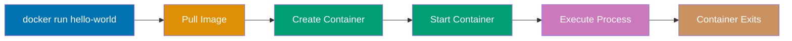

**Want to start containerizing applications with Docker?** This initial setup guide gets Docker installed and working on your system. By the end, you'll have Docker running and will launch your first container.

This tutorial provides 0-5% coverage - just enough to get Docker working on your machine. For deeper learning, continue to [Quick Start](/en/learn/software-engineering/infrastructure/tools/docker/quick-start) (5-30% coverage) or explore [By Example](/en/learn/software-engineering/infrastructure/tools/docker/by-example) tutorials.

## Prerequisites

Before installing Docker, you need:

- A computer running Windows 10/11 (Pro, Enterprise, or Education), macOS, or Linux
- Administrator/sudo access for installation
- Virtualization enabled in BIOS (for Windows/macOS)
- At least 4GB RAM (8GB+ recommended)
- A terminal/command prompt
- Basic command-line navigation skills

**Important**: Docker Desktop (Windows/macOS) includes Docker Engine, Docker CLI, Docker Compose, and Kubernetes. Linux installations install Docker Engine directly.

## Learning Objectives

By the end of this tutorial, you will be able to:

1. **Install** Docker on your operating system
2. **Verify** that Docker is installed correctly and running
3. **Run** your first Docker container (Hello World)
4. **Execute** basic Docker commands (ps, images, rm)
5. **Understand** container lifecycle basics

## Platform-Specific Installation

Choose your operating system and follow the installation steps.

### Windows Installation (Docker Desktop)

**System Requirements**:

- Windows 10 64-bit: Pro, Enterprise, or Education (Build 19044+)
- Windows 11 64-bit: Any edition
- WSL 2 feature enabled
- Virtualization enabled in BIOS

**Step 1: Enable WSL 2**

Open PowerShell as Administrator:

```powershell
wsl --install

wsl --set-default-version 2
```

Restart your computer when prompted.

**Step 2: Download Docker Desktop**

1. Visit [Docker Desktop for Windows](https://www.docker.com/products/docker-desktop/)
2. Click "Download for Windows"
3. Save the installer: `Docker Desktop Installer.exe`

**Step 3: Install Docker Desktop**

1. Double-click `Docker Desktop Installer.exe`
2. Follow the installation wizard:
   - Keep "Use WSL 2 instead of Hyper-V" checked (recommended)
   - Click "OK" to proceed
3. Wait for installation to complete
4. Click "Close" when finished
5. Restart computer if prompted

**Step 4: Launch Docker Desktop**

1. Open Windows Start Menu
2. Search for "Docker Desktop" and launch it
3. Accept the Docker Subscription Service Agreement
4. Wait for Docker Engine to start (icon in system tray turns green)

**Step 5: Verify Installation**

Open PowerShell or Command Prompt:

```powershell
docker --version
```

Expected output:

```
Docker version 24.X.X, build XXXXXXX
```

Check Docker Compose:

```powershell
docker compose version
```

Expected output:

```
Docker Compose version v2.X.X
```

**Troubleshooting Windows**:

- If installation fails, ensure virtualization is enabled in BIOS
- For "WSL 2 installation is incomplete" error, run: `wsl --update`
- If Docker Engine won't start, check Windows Event Viewer for errors
- Ensure Windows is fully updated (Windows Update)
- For Hyper-V conflicts, disable Hyper-V or switch to WSL 2 backend

### macOS Installation (Docker Desktop)

**System Requirements**:

- macOS 11 Big Sur or newer
- Apple Silicon (M1/M2/M3) or Intel chip
- At least 4GB RAM

**Step 1: Download Docker Desktop**

1. Visit [Docker Desktop for Mac](https://www.docker.com/products/docker-desktop/)
2. Choose your chip type:
   - **Apple Silicon** (M1/M2/M3): Download Apple Chip version
   - **Intel**: Download Intel Chip version
3. Save the `Docker.dmg` file

**Step 2: Install Docker Desktop**

1. Double-click `Docker.dmg` to open installer
2. Drag Docker icon to Applications folder
3. Wait for copy to complete
4. Eject the Docker.dmg volume

**Step 3: Launch Docker Desktop**

1. Open Applications folder
2. Double-click Docker app
3. macOS may show security prompt: Click "Open"
4. Accept Docker Subscription Service Agreement
5. Grant privileged access when prompted (needed for networking)
6. Wait for Docker Engine to start (whale icon in menu bar appears)

**Step 4: Verify Installation**

Open Terminal:

```bash
docker --version
```

Expected output:

```
Docker version 24.X.X, build XXXXXXX
```

Check Docker Compose:

```bash
docker compose version
```

Expected output:

```
Docker Compose version v2.X.X
```

**Alternative: Install via Homebrew**

```bash
brew install --cask docker

open -a Docker
```

**Troubleshooting macOS**:

- If Docker won't start, check System Settings → Security & Privacy → Allow Docker
- For Apple Silicon Macs, ensure you downloaded correct version (not Intel version)
- If "Cannot connect to Docker daemon" error, ensure Docker Desktop is running (whale icon in menu bar)
- For resource limits, adjust in Docker Desktop → Settings → Resources

### Linux Installation (Docker Engine)

Linux installs Docker Engine directly without Docker Desktop wrapper.

**Ubuntu/Debian Installation**

**Step 1: Remove Old Versions**

```bash
sudo apt remove docker docker-engine docker.io containerd runc
```

**Step 2: Install Prerequisites**

```bash
sudo apt update
sudo apt install ca-certificates curl gnupg lsb-release -y
```

**Step 3: Add Docker GPG Key**

```bash
sudo mkdir -p /etc/apt/keyrings

curl -fsSL https://download.docker.com/linux/ubuntu/gpg | sudo gpg --dearmor -o /etc/apt/keyrings/docker.gpg
```

**Step 4: Set Up Docker Repository**

```bash
echo \
  "deb [arch=$(dpkg --print-architecture) signed-by=/etc/apt/keyrings/docker.gpg] https://download.docker.com/linux/ubuntu \
  $(lsb_release -cs) stable" | sudo tee /etc/apt/sources.list.d/docker.list > /dev/null
```

**Step 5: Install Docker Engine**

```bash
sudo apt update
sudo apt install docker-ce docker-ce-cli containerd.io docker-buildx-plugin docker-compose-plugin -y
```

This installs:

- **docker-ce**: Docker Engine (core container runtime)
- **docker-ce-cli**: Docker command-line interface
- **containerd.io**: Container runtime
- **docker-buildx-plugin**: Extended build capabilities
- **docker-compose-plugin**: Docker Compose for multi-container apps

**Step 6: Start Docker Service**

```bash
sudo systemctl start docker
sudo systemctl enable docker
```

**Step 7: Verify Installation**

```bash
sudo docker --version
```

Expected output:

```
Docker version 24.X.X, build XXXXXXX
```

**Fedora/RHEL/CentOS Installation**

**Step 1: Remove Old Versions**

```bash
sudo dnf remove docker docker-client docker-client-latest docker-common docker-latest \
  docker-latest-logrotate docker-logrotate docker-engine
```

**Step 2: Install Prerequisites**

```bash
sudo dnf install dnf-plugins-core -y
```

**Step 3: Add Docker Repository**

```bash
sudo dnf config-manager --add-repo https://download.docker.com/linux/fedora/docker-ce.repo
```

**Step 4: Install Docker Engine**

```bash
sudo dnf install docker-ce docker-ce-cli containerd.io docker-buildx-plugin docker-compose-plugin -y
```

**Step 5: Start Docker Service**

```bash
sudo systemctl start docker
sudo systemctl enable docker
```

**Step 6: Verify Installation**

```bash
sudo docker --version
```

**Arch Linux Installation**

**Step 1: Install Docker via pacman**

```bash
sudo pacman -S docker docker-compose
```

**Step 2: Start Docker Service**

```bash
sudo systemctl start docker.service
sudo systemctl enable docker.service
```

**Step 3: Verify Installation**

```bash
sudo docker --version
```

### Post-Installation Setup for Linux

**Add User to Docker Group** (avoid using sudo for every command):

```bash
sudo usermod -aG docker $USER

```

After logging back in, test Docker without sudo:

```bash
docker --version
```

**Troubleshooting Linux**:

- If `docker` command requires sudo, add user to docker group (see above)
- If Docker daemon won't start: `sudo systemctl status docker` to check errors
- For SELinux issues (Fedora/RHEL), ensure SELinux policies allow Docker
- Check logs: `sudo journalctl -u docker.service`

## Version Verification

After installation, verify Docker is working correctly.

### Check Docker Version

```bash
docker --version
```

Expected output shows Docker version and build number.

### Check Docker Engine Info

```bash
docker info
```

This displays comprehensive Docker system information:

- Total containers (running, stopped)
- Total images
- Server version
- Storage driver
- Operating system
- Architecture
- CPU count
- Memory available

### Check Docker Daemon Status

**Linux**:

```bash
sudo systemctl status docker
```

**Windows/macOS**: Check Docker Desktop status bar icon (should be green/running).

### Check Docker Compose

```bash
docker compose version
```

Docker Compose orchestrates multi-container applications.

## Your First Docker Container

Let's run your first Docker container - the classic "Hello World" verification.

### Run Hello World Container

Execute:

```bash
docker run hello-world
```

**What happens**:

1. Docker searches for `hello-world` image locally
2. If not found, pulls image from Docker Hub (official registry)
3. Creates container from image
4. Runs container (executes binary inside image)
5. Container prints message and exits
6. Container stops automatically

**Expected output**:

```
Unable to find image 'hello-world:latest' locally
latest: Pulling from library/hello-world
c1ec31eb5944: Pull complete
Digest: sha256:...
Status: Downloaded newer image for hello-world:latest

Hello from Docker!
This message shows that your installation appears to be working correctly.

To generate this message, Docker took the following steps:
 1. The Docker client contacted the Docker daemon.
 2. The Docker daemon pulled the "hello-world" image from the Docker Hub.
 3. The Docker daemon created a new container from that image which runs the
    executable that produces the output you are currently reading.
 4. The Docker daemon streamed that output to the Docker client, which sent it
    to your terminal.
```

Congratulations! You've run your first Docker container.

### Understanding Container Lifecycle



### List Containers

**List running containers**:

```bash
docker ps
```

Since hello-world exited immediately, this shows empty list.

**List all containers** (including stopped):

```bash
docker ps -a
```

Expected output:

```
CONTAINER ID   IMAGE         COMMAND    CREATED          STATUS                      PORTS     NAMES
abc123def456   hello-world   "/hello"   10 seconds ago   Exited (0) 8 seconds ago              quirky_name
```

**Output breakdown**:

- **CONTAINER ID**: Unique container identifier
- **IMAGE**: Image used to create container
- **COMMAND**: Command executed inside container
- **CREATED**: When container was created
- **STATUS**: Current state (running, exited, etc.)
- **NAMES**: Auto-generated or user-specified name

### List Downloaded Images

```bash
docker images
```

Expected output:

```
REPOSITORY    TAG       IMAGE ID       CREATED        SIZE
hello-world   latest    9c7a54a9a43c   2 months ago   13.3kB
```

This shows:

- **REPOSITORY**: Image name
- **TAG**: Image version (latest means newest)
- **IMAGE ID**: Unique image identifier
- **CREATED**: When image was built
- **SIZE**: Image size on disk

### Clean Up (Optional)

Remove stopped container:

```bash
docker ps -a

docker rm <container_id_or_name>
```

Remove image:

```bash
docker rmi hello-world
```

Docker images persist on disk until explicitly removed.

## Running Interactive Container

Let's run an interactive container to explore Docker environment.

### Run Ubuntu Container

```bash
docker run -it ubuntu:22.04 bash
```

**Flags explained**:

- `-i`: Interactive mode (keep STDIN open)
- `-t`: Allocate pseudo-TTY (terminal)
- `ubuntu:22.04`: Image name and tag
- `bash`: Command to execute inside container

**What happens**:

1. Docker pulls ubuntu:22.04 image (if not cached)
2. Creates container from image
3. Starts container
4. Executes bash shell inside container
5. Attaches your terminal to container's bash shell

Your prompt changes to something like: `root@abc123def456:/#`

### Explore Inside Container

Inside the container, try:

```bash
cat /etc/os-release

ls /

ps aux

exit
```

After `exit`, container stops automatically.

## Common Installation Issues

### Virtualization not enabled

**Problem**: "Hardware assisted virtualization and data execution protection must be enabled in the BIOS"

**Solution**:

1. Restart computer and enter BIOS/UEFI (usually F2, F10, Del, or Esc during boot)
2. Find virtualization settings (Intel VT-x or AMD-V)
3. Enable virtualization
4. Save and exit BIOS
5. Reinstall Docker Desktop

### WSL 2 kernel update required (Windows)

**Problem**: "WSL 2 installation is incomplete"

**Solution**:

```powershell
wsl --update

```

### Docker daemon not running

**Problem**: "Cannot connect to the Docker daemon"

**Solution**:

- **Windows/macOS**: Launch Docker Desktop application
- **Linux**: Start Docker service: `sudo systemctl start docker`

### Permission denied errors (Linux)

**Problem**: "permission denied while trying to connect to the Docker daemon socket"

**Solution**:

```bash
sudo usermod -aG docker $USER

```

### Docker Desktop won't start (macOS)

**Problem**: Docker Desktop crashes on launch

**Solution**:

1. Quit Docker Desktop completely
2. Remove Docker Desktop data: `rm -rf ~/Library/Group\ Containers/group.com.docker`
3. Relaunch Docker Desktop
4. If still failing, reinstall Docker Desktop

## Next Steps

Now that Docker is installed, continue your learning journey:

1. **Quick Start Tutorial**: Learn core Docker concepts with hands-on examples
   - Visit [Quick Start](/en/learn/software-engineering/infrastructure/tools/docker/quick-start) for 5-30% coverage
2. **By Example Learning**: Master Docker through annotated code examples
   - Explore [By Example - Beginner](/en/learn/software-engineering/infrastructure/tools/docker/by-example/beginner) (0-40% coverage)
   - Progress to [By Example - Intermediate](/en/learn/software-engineering/infrastructure/tools/docker/by-example/intermediate) (40-75% coverage)
   - Master with [By Example - Advanced](/en/learn/software-engineering/infrastructure/tools/docker/by-example/advanced) (75-95% coverage)

## Further Resources

**Official Docker Documentation**:

- [Docker Documentation](https://docs.docker.com/) - Comprehensive official docs
- [Docker Get Started](https://docs.docker.com/get-started/) - Official tutorial series
- [Docker Hub](https://hub.docker.com/) - Public image registry
- [Dockerfile Reference](https://docs.docker.com/engine/reference/builder/) - Dockerfile syntax

**Development Tools**:

- [VS Code Docker Extension](https://marketplace.visualstudio.com/items?itemName=ms-azuretools.vscode-docker) - Manage containers in VS Code
- [Portainer](https://www.portainer.io/) - Web UI for Docker management
- [Docker Compose](https://docs.docker.com/compose/) - Multi-container orchestration
- [Dive](https://github.com/wagoodman/dive) - Explore Docker image layers

**Community**:

- [Docker Community Forums](https://forums.docker.com/) - Official community help
- [/r/docker](https://www.reddit.com/r/docker/) - Reddit community
- [Docker Community Slack](https://dockr.ly/slack) - Real-time chat
- [Docker Blog](https://www.docker.com/blog/) - Official blog with tutorials

## Summary

You've successfully completed the Docker initial setup! You now have:

- Docker installed and verified on your system
- Experience running containers (hello-world, Ubuntu)
- Understanding of basic Docker commands (run, ps, images)
- Knowledge of container lifecycle
- Resources for continued learning

The next step is to explore Dockerfiles, image building, volumes, and networking in the Quick Start tutorial.
