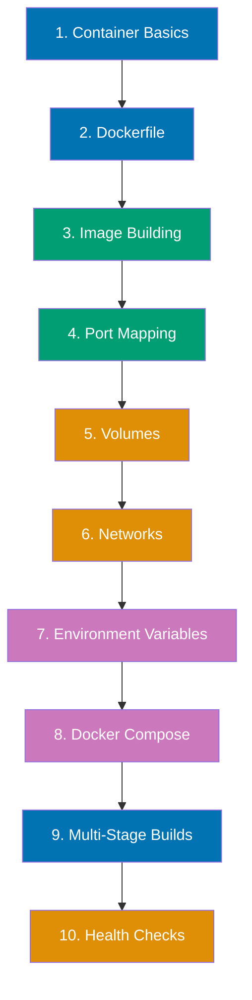
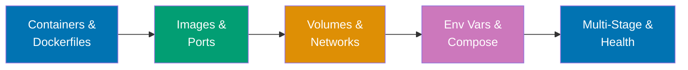

**Want to containerize applications and achieve consistent deployments?** This quick start introduces essential Docker concepts through practical examples. You'll build from simple containers to multi-container networked applications.

This tutorial provides 5-30% coverage using the touchpoints approach - 10 core concepts with runnable examples. After completing this guide, continue to [By Example - Beginner](/en/learn/software-engineering/infrastructure/tools/docker/by-example/beginner) for comprehensive 0-40% coverage.

## Prerequisites

Before starting, ensure you have completed [Initial Setup](/en/learn/software-engineering/infrastructure/tools/docker/initial-setup). You should have:

- Docker installed and running
- Experience running basic containers
- Understanding of container lifecycle
- A terminal and text editor ready

## Learning Path

This quick start covers 10 essential Docker touchpoints:



## Concept 1: Container Basics

**What**: Isolated, lightweight runtime environments from images.

**Why**: Consistent application deployment across development, testing, production.

### Example: Interactive Container Management

```bash
docker run -it --name myubuntu ubuntu:22.04 bash

apt update
apt install curl -y
curl --version
exit

docker ps -a

docker start myubuntu

docker exec myubuntu curl --version

docker attach myubuntu

docker stop myubuntu

docker rm myubuntu
```

**Key points**:

- `-it`: Interactive terminal
- `--name`: Custom container name
- `docker exec`: Run commands without attaching
- `docker attach`: Connect to container's main process
- Containers are ephemeral - state lost when removed

## Concept 2: Dockerfile

**What**: Text file with instructions to build Docker images.

**Why**: Automate image creation with version-controlled configuration.

### Example: Simple Web Application

Create `app.py`:

```python
from http.server import HTTPServer, BaseHTTPRequestHandler

class SimpleHandler(BaseHTTPRequestHandler):
    def do_GET(self):
        self.send_response(200)
        self.send_header('Content-type', 'text/html')
        self.end_headers()
        self.wfile.write(b'<h1>Hello from Docker!</h1>')

if __name__ == '__main__':
    server = HTTPServer(('0.0.0.0', 8000), SimpleHandler)
    print('Server running on port 8000')
    server.serve_forever()
```

Create `Dockerfile`:

```dockerfile
FROM python:3.11-slim

WORKDIR /app

COPY app.py .

EXPOSE 8000

CMD ["python", "app.py"]
```

Build and run:

```bash
docker build -t mywebapp:1.0 .

docker run -d -p 8000:8000 --name webapp mywebapp:1.0

curl http://localhost:8000

docker logs webapp

docker stop webapp
docker rm webapp
```

**Key points**:

- `FROM`: Base image
- `WORKDIR`: Set working directory
- `COPY`: Copy files into image
- `EXPOSE`: Document port (informational)
- `CMD`: Default command to run
- `-d`: Detached mode (background)

## Concept 3: Image Building

**What**: Create custom images from Dockerfile with layers and caching.

**Why**: Package applications with dependencies for portable deployment.

### Example: Multi-Layer Image

Create `requirements.txt`:

```
flask==3.0.0
requests==2.31.0
```

Create `server.py`:

```python
from flask import Flask
import os

app = Flask(__name__)

@app.route('/')
def hello():
    version = os.getenv('APP_VERSION', 'unknown')
    return f'<h1>Flask App v{version}</h1>'

if __name__ == '__main__':
    app.run(host='0.0.0.0', port=5000)
```

Create `Dockerfile`:

```dockerfile
FROM python:3.11-slim

WORKDIR /app

COPY requirements.txt .
RUN pip install --no-cache-dir -r requirements.txt

COPY server.py .

EXPOSE 5000

CMD ["python", "server.py"]
```

Build with tags:

```bash
docker build -t flaskapp:1.0 -t flaskapp:latest .

docker history flaskapp:1.0

docker inspect flaskapp:1.0

docker run -d -p 5000:5000 -e APP_VERSION=1.0.0 --name flask flaskapp:1.0

curl http://localhost:5000

docker stop flask
docker rm flask
```

**Key points**:

- Each Dockerfile instruction creates a layer
- Layers are cached for faster rebuilds
- Order matters - put changing files last
- Multiple tags point to same image
- `docker history` shows layer size and commands

## Concept 4: Port Mapping

**What**: Map container ports to host ports for external access.

**Why**: Enable communication between containers and external clients.

### Example: Multiple Port Mappings

Create `multiport.py`:

```python
from http.server import HTTPServer, BaseHTTPRequestHandler
import threading

class Handler8000(BaseHTTPRequestHandler):
    def do_GET(self):
        self.send_response(200)
        self.send_header('Content-type', 'text/html')
        self.end_headers()
        self.wfile.write(b'<h1>Service on port 8000</h1>')

class Handler9000(BaseHTTPRequestHandler):
    def do_GET(self):
        self.send_response(200)
        self.send_header('Content-type', 'text/html')
        self.end_headers()
        self.wfile.write(b'<h1>Service on port 9000</h1>')

def run_server(port, handler):
    server = HTTPServer(('0.0.0.0', port), handler)
    print(f'Server running on port {port}')
    server.serve_forever()

if __name__ == '__main__':
    t1 = threading.Thread(target=run_server, args=(8000, Handler8000))
    t2 = threading.Thread(target=run_server, args=(9000, Handler9000))
    t1.start()
    t2.start()
    t1.join()
    t2.join()
```

Create `Dockerfile`:

```dockerfile
FROM python:3.11-slim
WORKDIR /app
COPY multiport.py .
EXPOSE 8000 9000
CMD ["python", "multiport.py"]
```

Run with multiple ports:

```bash
docker build -t multiport .

docker run -d -p 8000:8000 -p 9000:9000 --name multi multiport

curl http://localhost:8000
curl http://localhost:9000

docker stop multi
docker rm multi
docker run -d -p 3000:8000 -p 3001:9000 --name multi multiport

curl http://localhost:3000
curl http://localhost:3001

docker stop multi
docker rm multi
```

**Key points**:

- `-p host:container` maps ports
- Can map same container port to different host ports
- Host port must be unique across containers
- `EXPOSE` in Dockerfile is documentation only
- `-P` publishes all exposed ports to random host ports

## Concept 5: Volumes

**What**: Persistent data storage outside container filesystem.

**Why**: Preserve data when containers are removed or upgraded.

### Example: Named Volumes and Bind Mounts

```bash
docker volume create mydata

docker run -d --name db1 \
  -v mydata:/data \
  alpine sh -c "echo 'Data from db1' > /data/info.txt && tail -f /dev/null"

docker exec db1 cat /data/info.txt

docker stop db1
docker rm db1

docker run -d --name db2 \
  -v mydata:/data \
  alpine tail -f /dev/null

docker exec db2 cat /data/info.txt

mkdir -p /tmp/docker-data
echo "Host file" > /tmp/docker-data/host.txt

docker run --rm -v /tmp/docker-data:/app alpine cat /app/host.txt

docker volume ls

docker volume inspect mydata

docker stop db2
docker rm db2
docker volume rm mydata
rm -rf /tmp/docker-data
```

**Key points**:

- Named volumes: managed by Docker, portable
- Bind mounts: direct host directory mapping
- Volumes persist after container deletion
- Multiple containers can share volumes
- Use volumes for databases, uploads, logs
- `docker volume prune` removes unused volumes

## Concept 6: Networks

**What**: Isolated virtual networks for container communication.

**Why**: Enable multi-container applications with service discovery.

### Example: Custom Bridge Network

```bash
docker network create mynet

docker run -d --name web --network mynet nginx:alpine

docker run -it --rm --network mynet alpine sh

apk add curl
curl http://web  # Works! DNS resolution by container name
exit

docker network inspect mynet

docker run -d --name isolated nginx:alpine

docker exec isolated ping -c 1 web  # Fails

docker network connect mynet isolated
docker exec isolated ping -c 1 web  # Now works!

docker network disconnect mynet isolated

docker stop web isolated
docker rm web isolated
docker network rm mynet
```

**Key points**:

- Custom networks enable DNS-based service discovery
- Containers on same network communicate by name
- Default bridge network requires `--link` (deprecated)
- `docker network create` creates isolated networks
- Containers can connect to multiple networks
- Network drivers: bridge, host, overlay, macvlan

## Concept 7: Environment Variables

**What**: Pass configuration to containers at runtime.

**Why**: Configure containers without rebuilding images.

### Example: Configuration via Environment

Create `config-app.py`:

```python
import os

db_host = os.getenv('DB_HOST', 'localhost')
db_port = os.getenv('DB_PORT', '5432')
db_user = os.getenv('DB_USER', 'admin')
db_password = os.getenv('DB_PASSWORD', '')
debug = os.getenv('DEBUG', 'false').lower() == 'true'

print(f'Database: {db_user}@{db_host}:{db_port}')
print(f'Debug mode: {debug}')
print(f'Password set: {"yes" if db_password else "no"}')
```

Create `Dockerfile`:

```dockerfile
FROM python:3.11-slim
WORKDIR /app
COPY config-app.py .
ENV DEBUG=false
ENV DB_PORT=5432
CMD ["python", "config-app.py"]
```

Run with different configurations:

```bash
docker build -t configapp .

docker run --rm configapp

docker run --rm \
  -e DB_HOST=prod-db.example.com \
  -e DB_USER=produser \
  -e DB_PASSWORD=secret123 \
  -e DEBUG=true \
  configapp

cat > .env <<EOF
DB_HOST=staging-db.example.com
DB_USER=staginguser
DB_PASSWORD=staging-password
DEBUG=false
EOF

docker run --rm --env-file .env configapp

rm .env
```

**Key points**:

- `ENV` in Dockerfile sets default values
- `-e` flag sets or overrides variables
- `--env-file` loads variables from file
- Environment variables configure without rebuilding
- Use for database URLs, API keys, feature flags
- Never commit sensitive `.env` files

## Concept 8: Docker Compose

**What**: Define and run multi-container applications with YAML.

**Why**: Orchestrate complex applications with single command.

### Example: Web Application with Database

Create `app.py`:

```python
from flask import Flask
import os
import time

app = Flask(__name__)

@app.route('/')
def hello():
    db_host = os.getenv('DATABASE_HOST', 'unknown')
    return f'<h1>Web App</h1><p>Database: {db_host}</p>'

@app.route('/health')
def health():
    return 'OK', 200

if __name__ == '__main__':
    time.sleep(5)  # Wait for database
    app.run(host='0.0.0.0', port=5000)
```

Create `requirements.txt`:

```
flask==3.0.0
```

Create `Dockerfile`:

```dockerfile
FROM python:3.11-slim
WORKDIR /app
COPY requirements.txt .
RUN pip install -r requirements.txt
COPY app.py .
EXPOSE 5000
CMD ["python", "app.py"]
```

Create `compose.yaml`:

```yaml
services:
  web:
    build: .
    ports:
      - "5000:5000"
    environment:
      - DATABASE_HOST=db
    depends_on:
      - db
    networks:
      - app-network

  db:
    image: postgres:16-alpine
    environment:
      - POSTGRES_PASSWORD=secret
      - POSTGRES_USER=appuser
      - POSTGRES_DB=appdb
    volumes:
      - db-data:/var/lib/postgresql/data
    networks:
      - app-network

networks:
  app-network:

volumes:
  db-data:
```

Run multi-container application:

```bash
docker compose up -d

docker compose logs

curl http://localhost:5000

docker compose ps

docker compose up -d --scale web=3

docker compose down

docker compose down -v
```

**Key points**:

- `compose.yaml` defines complete application
- `services`: containers to run
- `networks`: automatic service discovery
- `volumes`: persistent data storage
- `depends_on`: startup order
- `docker compose up`: start all services
- `docker compose down`: stop and remove

## Concept 9: Multi-Stage Builds

**What**: Use multiple FROM statements to create optimized images.

**Why**: Reduce final image size by excluding build tools.

### Example: Go Application Build

Create `main.go`:

```go
package main

import (
    "fmt"
    "net/http"
)

func handler(w http.ResponseWriter, r *http.Request) {
    fmt.Fprintf(w, "<h1>Go Application</h1>")
}

func main() {
    http.HandleFunc("/", handler)
    fmt.Println("Server running on port 8080")
    http.ListenAndServe(":8080", nil)
}
```

Create `Dockerfile` (single-stage - large):

```dockerfile
FROM golang:1.21
WORKDIR /app
COPY main.go .
RUN go build -o server main.go
CMD ["./server"]
```

Create `Dockerfile.multistage` (multi-stage - small):

```dockerfile
FROM golang:1.21 AS builder
WORKDIR /app
COPY main.go .
RUN go build -o server main.go

FROM alpine:latest
RUN apk add --no-cache ca-certificates
WORKDIR /app
COPY --from=builder /app/server .
EXPOSE 8080
CMD ["./server"]
```

Compare image sizes:

```bash
docker build -t goapp-large -f Dockerfile .

docker build -t goapp-small -f Dockerfile.multistage .

docker images | grep goapp

docker run -d -p 8080:8080 --name goapp goapp-small

curl http://localhost:8080

docker stop goapp
docker rm goapp
```

**Key points**:

- Multiple `FROM` statements create stages
- `AS builder` names build stage
- `COPY --from=builder` copies artifacts between stages
- Final stage only includes runtime dependencies
- Dramatically reduces image size (1GB+ to 10MB)
- Faster pulls, less attack surface

## Concept 10: Health Checks

**What**: Define commands to check container health status.

**Why**: Enable automatic recovery and load balancer integration.

### Example: Application with Health Check

Create `health-app.py`:

```python
from http.server import HTTPServer, BaseHTTPRequestHandler
import time
import random

start_time = time.time()

class HealthHandler(BaseHTTPRequestHandler):
    def do_GET(self):
        # Healthy after 10 seconds
        uptime = time.time() - start_time

        if self.path == '/health':
            if uptime < 10:
                self.send_response(503)  # Service Unavailable
                self.end_headers()
                self.wfile.write(b'Starting up...')
            else:
                self.send_response(200)
                self.end_headers()
                self.wfile.write(b'Healthy')
        else:
            self.send_response(200)
            self.send_header('Content-type', 'text/html')
            self.end_headers()
            self.wfile.write(b'<h1>Application Running</h1>')

if __name__ == '__main__':
    server = HTTPServer(('0.0.0.0', 8000), HealthHandler)
    print('Server starting...')
    server.serve_forever()
```

Create `Dockerfile`:

```dockerfile
FROM python:3.11-slim
WORKDIR /app
COPY health-app.py .
EXPOSE 8000

HEALTHCHECK --interval=5s --timeout=3s --start-period=15s --retries=3 \
  CMD python -c "import urllib.request; urllib.request.urlopen('http://localhost:8000/health')"

CMD ["python", "health-app.py"]
```

Run and monitor health:

```bash
docker build -t healthapp .

docker run -d -p 8000:8000 --name health healthapp

watch -n 1 'docker ps --filter name=health --format "table {{.Names}}\t{{.Status}}"'

docker inspect health --format='{{json .State.Health}}' | python -m json.tool

docker exec health pkill python

docker ps -a

docker stop health
docker rm health
```

**Key points**:

- `HEALTHCHECK` instruction defines health check
- `--interval`: Time between checks
- `--timeout`: Maximum check duration
- `--start-period`: Initialization grace period
- `--retries`: Failures before unhealthy
- Exit code 0: healthy, 1: unhealthy
- Orchestrators can restart unhealthy containers

## Learning Path Summary

You've completed 10 essential Docker touchpoints:



## Next Steps

Now that you understand core Docker concepts:

1. **By Example - Beginner**: Deep dive into 0-40% coverage with 25+ annotated examples
   - Visit [By Example - Beginner](/en/learn/software-engineering/infrastructure/tools/docker/by-example/beginner)
2. **By Example - Intermediate**: Advance to 40-75% coverage with orchestration
   - Continue to [By Example - Intermediate](/en/learn/software-engineering/infrastructure/tools/docker/by-example/intermediate)
3. **By Example - Advanced**: Master 75-95% coverage with production patterns
   - Progress to [By Example - Advanced](/en/learn/software-engineering/infrastructure/tools/docker/by-example/advanced)

## Further Resources

**Official Documentation**:

- [Docker Documentation](https://docs.docker.com/) - Comprehensive guides
- [Dockerfile Reference](https://docs.docker.com/engine/reference/builder/) - All Dockerfile instructions
- [Docker Compose](https://docs.docker.com/compose/) - Multi-container applications
- [Docker Hub](https://hub.docker.com/) - Public image registry

**Key Concepts**:

- **Containers**: Isolated runtime environments
- **Images**: Template for containers with layers
- **Dockerfile**: Automated image build instructions
- **Volumes**: Persistent data storage
- **Networks**: Container communication
- **Compose**: Multi-container orchestration
- **Multi-stage**: Optimized image building
- **Health checks**: Container health monitoring

## Summary

You've completed the Docker Quick Start with 5-30% coverage! You now understand:

- Container lifecycle and management
- Dockerfile syntax and image building
- Layer caching and optimization
- Port mapping for external access
- Volume types and data persistence
- Custom networks and service discovery
- Environment variable configuration
- Docker Compose for multi-container apps
- Multi-stage builds for small images
- Health checks for reliability

Continue your journey with comprehensive By Example tutorials for deeper mastery of Docker containerization.
