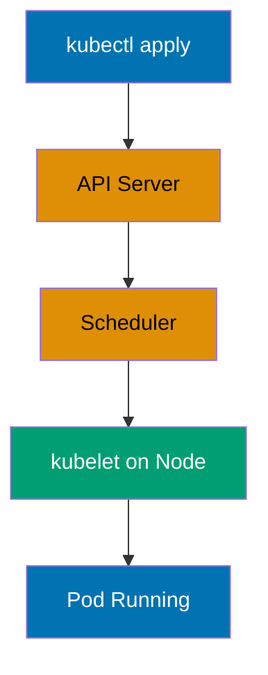
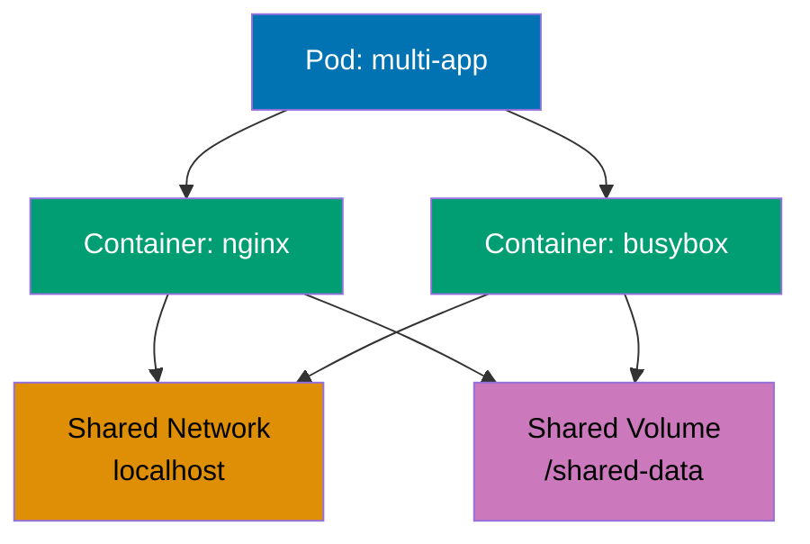
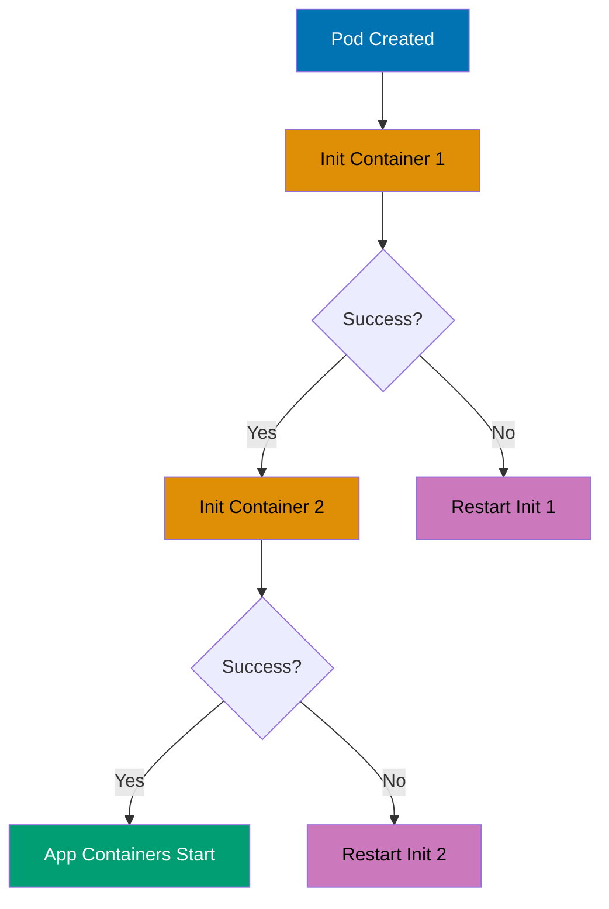
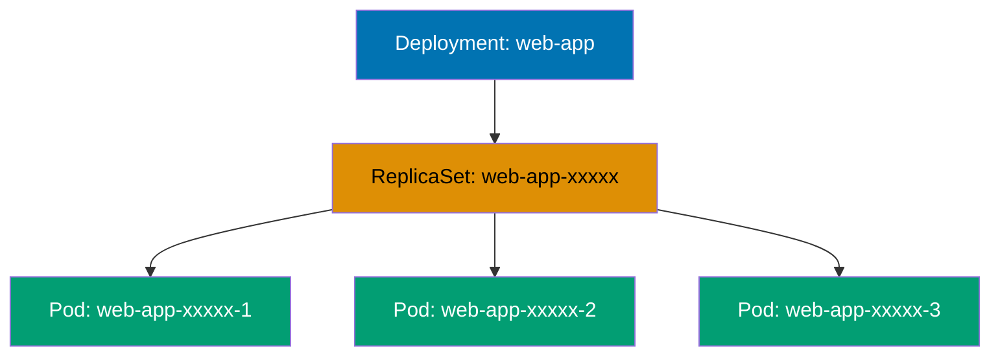
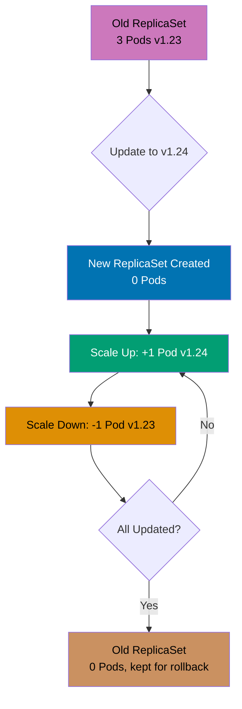
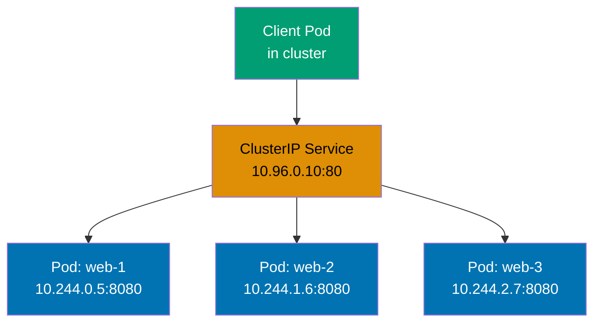
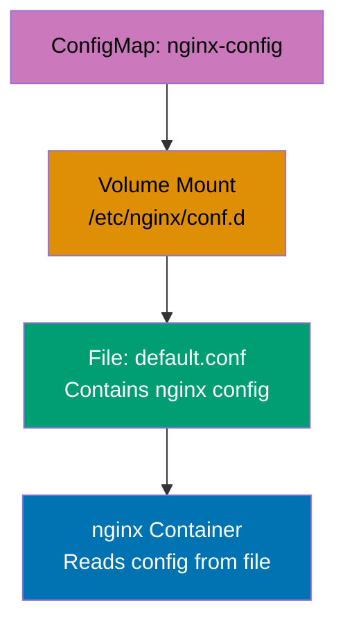
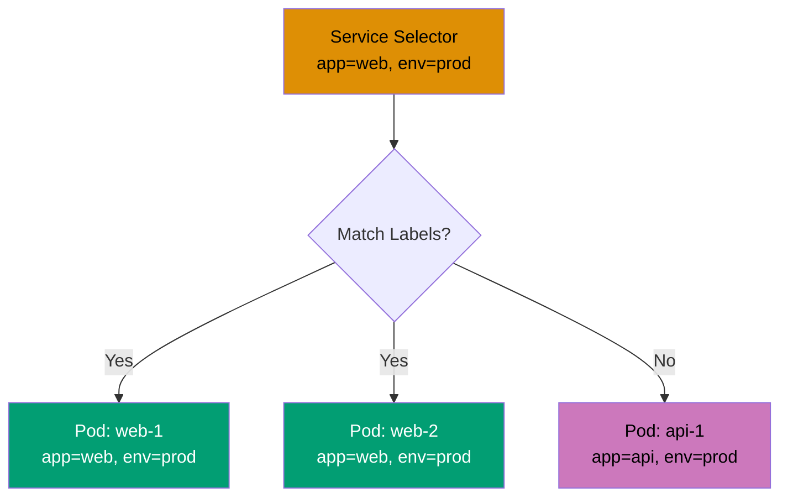

## Beginner Level Overview

This level covers **Kubernetes fundamentals** through 28 self-contained examples, achieving **0-40% coverage** of production Kubernetes knowledge. Each example demonstrates core resource types and essential patterns needed for basic cluster operations.

**What you'll learn**:

- Hello World and local cluster setup
- Pods basics (lifecycle, containers, restart policies)
- Deployments (replicas, rolling updates, rollbacks)
- Services (ClusterIP, NodePort, LoadBalancer)
- ConfigMaps and Secrets (configuration management)
- Namespaces and Labels (resource organization)

**Prerequisites**: kubectl installed, access to Kubernetes cluster (Minikube, kind, Docker Desktop, or cloud provider)

---

## Hello World & Installation (Examples 1-2)

### Example 1: Hello World Pod

A Pod is the smallest deployable unit in Kubernetes, representing one or more containers that share networking and storage. This example creates a single-container Pod running nginx web server to verify cluster connectivity and basic kubectl functionality.



```yaml
apiVersion:
  v1 # => Uses core Kubernetes API v1
  # => v1 is stable, production-ready API version
  # => Other versions: apps/v1, batch/v1, networking.k8s.io/v1
kind:
  Pod # => Resource type: Pod
  # => Smallest deployable unit in Kubernetes
  # => Alternative: Deployment, StatefulSet, DaemonSet
metadata:
  name:
    hello-world # => Pod name: "hello-world"
    # => Must be unique within namespace
    # => DNS-1123 format: lowercase alphanumeric with hyphens
  labels:
    app:
      hello # => Label for identification and selection
      # => Labels are key-value pairs for organization
      # => Used by Services and Deployments to select Pods
spec:
  containers:
    - name:
        nginx # => Container name: "nginx"
        # => Each container needs unique name within Pod
        # => Used in kubectl logs and exec commands
      image:
        nginx:1.24 # => Uses nginx 1.24 from Docker Hub
        # => Image pulled automatically if not present locally
        # => Format: [registry/]image[:tag]
        # => Default registry: docker.io (Docker Hub)
      ports:
        - containerPort:
            80 # => Exposes port 80 inside container
            # => Documentation only, doesn't create network access
            # => Does not expose to outside cluster
            # => Use Service resource for external exposure
```

**Key Takeaway**: Pods are ephemeral and should not be created directly in production; use higher-level controllers like Deployments for automatic recovery and scaling.

**Why It Matters**: Kubernetes self-healing capabilities enable Google, Spotify, and Airbnb to run thousands of containers with minimal manual intervention. When a Pod crashes or a node fails, Deployments automatically recreate Pods on healthy nodes within seconds, achieving five-nines availability (99.999% uptime). Manual container orchestration with Docker Swarm or systemd requires custom scripting and 24/7 on-call teams to achieve similar reliability—Kubernetes makes this automatic.

---

### Example 2: Verify Cluster Installation

Kubernetes cluster health can be verified by checking component status and creating a test Pod. This example demonstrates essential kubectl commands for cluster diagnostics and resource inspection.

```yaml
# No YAML manifest needed - using kubectl commands directly

# Check cluster info
# => kubectl cluster-info
# => Shows API server URL and cluster services

# Check node status
# => kubectl get nodes
# => Lists all nodes with status (Ready/NotReady)

# Check system Pods
# => kubectl get pods -n kube-system
# => Shows core Kubernetes components (kube-proxy, coredns, etc.)

# Create test Pod
# => kubectl run test-pod --image=nginx:1.24 --restart=Never
# => Creates Pod named "test-pod" with nginx image
# => --restart=Never creates bare Pod (not Deployment)

# Verify Pod is running
# => kubectl get pods
# => Shows Pod status (Pending → Running → Running)

# Get detailed Pod info
# => kubectl describe pod test-pod
# => Shows events, conditions, container states

# View Pod logs
# => kubectl logs test-pod
# => Shows nginx access/error logs

# Cleanup
# => kubectl delete pod test-pod
# => Removes Pod and associated resources
```

**Key Takeaway**: Use `kubectl get`, `describe`, and `logs` commands for debugging Pod issues; check node status and kube-system Pods to diagnose cluster-level problems.

**Why It Matters**: Kubernetes observability through kubectl commands provides instant visibility into distributed systems without SSH access to individual nodes. Pinterest and Shopify use these diagnostics to troubleshoot production issues across thousands of Pods, reducing mean-time-to-resolution from hours (manually checking logs on each server) to minutes. This declarative inspection model is fundamental to managing containerized infrastructure at scale.

---

## Pods Basics (Examples 3-7)

### Example 3: Multi-Container Pod

Pods can run multiple containers that share the same network namespace and storage volumes. This pattern enables sidecar containers for logging, monitoring, or service mesh proxies alongside application containers.



```yaml
apiVersion: v1 # => Core Kubernetes API
kind: Pod # => Multi-container Pod resource
metadata:
  name:
    multi-container-pod # => Pod name: "multi-container-pod"
    # => Unique identifier in namespace
spec:
  containers:
    - name:
        nginx # => Main application container
        # => Serves web content from shared volume
      image:
        nginx:1.24 # => nginx web server
        # => Listens on port 80 by default
      ports:
        - containerPort: 80 # => HTTP port exposed
          # => Container listens on this port
          # => Shared network with busybox container
      volumeMounts:
        - name: shared-data # => Mounts shared volume at /usr/share/nginx/html
          # => Volume name matches volumes section below
          mountPath: /usr/share/nginx/html # => nginx serves content from this path
          # => Default document root for nginx
          # => Files written by busybox visible here

    - name:
        busybox # => Sidecar container for data generation
        # => Generates dynamic content for nginx
      image:
        busybox:1.36 # => Lightweight Linux container
        # => Provides shell and basic utilities
      command:
        - sh # => Runs shell command
        # => Bourne shell interpreter
        - -c # => Interprets following string as command
        # => Execute inline script
        - | # => Multi-line YAML string
          # => Loop script that updates HTML file
          while true; do
            echo "$(date) - Generated by busybox" > /data/index.html # => Write timestamped content
            sleep 10 # => Wait 10 seconds
          done                             # => Updates index.html every 10 seconds
          # => Content immediately visible to nginx container
      volumeMounts:
        - name: shared-data # => Same volume as nginx container
          # => Both containers share same storage
          mountPath:
            /data # => busybox writes to /data
            # => Both containers see same files
            # => Data persists for Pod lifetime only

  volumes:
    - name: shared-data # => EmptyDir volume (ephemeral)
      # => Temporary storage shared between containers
      emptyDir: {} # => Created when Pod starts
        # => Deleted when Pod terminates
        # => Uses node's local storage
```

**Key Takeaway**: Multi-container Pods share localhost networking and volumes, enabling sidecar patterns for logging, monitoring, or data processing without container modifications.

**Why It Matters**: Service mesh implementations like Istio inject sidecar proxies into Pods to handle traffic management, security, and observability without changing application code. Lyft processes billions of requests daily through Envoy sidecars running in multi-container Pods. This separation of concerns allows developers to focus on business logic while infrastructure concerns are handled by specialized sidecar containers—a pattern impossible with traditional monolithic deployments.

---

### Example 4: Pod Restart Policy

Restart policies control how Kubernetes handles container failures within Pods. Different policies suit different workload types: Always for long-running services, OnFailure for batch jobs, Never for run-once tasks.

```yaml
apiVersion: v1 # => Core API for Pod resources
kind: Pod # => Pod with restart policy demonstration
metadata:
  name:
    restart-demo # => Pod identifier
    # => Unique name in namespace
spec:
  restartPolicy:
    OnFailure # => Restarts container only if exit code != 0
    # => Options: Always (default), OnFailure, Never
    # => Always: restart on any termination
    # => Never: do not restart (for jobs)
    # => Policy applies to ALL containers in Pod
  containers:
    - name:
        failing-app # => Container that simulates failure
        # => Demonstrates restart behavior
      image:
        busybox:1.36 # => Lightweight shell environment
        # => Provides shell utilities for testing
      command:
        - sh # => Execute shell script
        # => Bourne shell interpreter
        - -c # => Run inline command
        # => Interpret string as script
        - | # => Multi-line script begins
          # => Script demonstrates restart policy
          echo "Starting application..." # => Log startup message
          sleep 5 # => Run for 5 seconds before failure
          echo "Simulating failure" # => Log failure event
          exit 1                          # => Non-zero exit triggers restart with OnFailure
                                          # => Container enters CrashLoopBackOff after repeated failures
                                          # => Kubernetes increases restart delay: 10s, 20s, 40s, 80s (max 5min)
```

**Key Takeaway**: Use `Always` for Deployments (services), `OnFailure` for Jobs (batch processing), and `Never` for Pods that should run exactly once without automatic recovery.

**Why It Matters**: Kubernetes restart policies enable automatic failure recovery without human intervention, distinguishing it from manual container management. Netflix runs thousands of microservices where failed containers restart automatically within seconds, maintaining streaming service availability for millions of concurrent users. Without automatic restarts, every container crash would require manual investigation and recovery—Kubernetes handles this automatically based on workload type.

---

### Example 5: Pod Resource Requests and Limits

Resource requests guarantee minimum CPU/memory allocation for Pods, while limits cap maximum usage to prevent resource starvation. Kubernetes uses requests for scheduling decisions and limits for resource enforcement.

```yaml
apiVersion: v1 # => Core Kubernetes API
kind: Pod # => Pod with resource constraints
metadata:
  name:
    resource-demo # => Pod name for resource testing
    # => Demonstrates CPU and memory management
spec:
  containers:
    - name:
        nginx # => nginx web server container
        # => Demonstrates resource requests and limits
      image:
        nginx:1.24 # => nginx version 1.24
        # => Stable production image
      resources:
        # => Resource management configuration
        requests:
          # => Minimum guaranteed resources
          cpu:
            100m # => Requests 100 millicores (0.1 CPU core)
            # => Scheduler places Pod on node with available CPU
            # => 1000m = 1 CPU core, 100m = 10% of one core
          memory:
            128Mi # => Requests 128 mebibytes RAM
            # => Mi = mebibyte (1024^2 bytes)
            # => Guaranteed memory allocation
        limits:
          # => Maximum resource usage caps
          cpu:
            200m # => Limited to 200 millicores maximum
            # => CPU throttled if exceeds limit
            # => Container slowed down but not killed
          memory:
            256Mi # => Limited to 256 MiB maximum
            # => Pod killed (OOMKilled) if exceeds memory limit
            # => Requests must be <= limits
            # => Memory limit violation is fatal
```

**Key Takeaway**: Always set resource requests for predictable scheduling and limits to prevent resource starvation; memory limit violations kill Pods (OOMKilled) while CPU limits throttle performance.

**Why It Matters**: Resource management prevents the "noisy neighbor" problem where one application monopolizes cluster resources, impacting others. Spotify ensures reliable music streaming for 500+ million users by setting resource limits—a single misbehaving service can't consume all cluster memory and crash unrelated services. This multi-tenancy capability allows multiple teams to safely share the same Kubernetes cluster, reducing infrastructure costs by 40-60% compared to dedicated servers per application.

---

### Example 6: Pod Environment Variables

Environment variables inject configuration into containers without modifying images. Kubernetes supports direct value assignment, references to ConfigMaps/Secrets, and automatic metadata injection for dynamic configuration.

```yaml
apiVersion: v1 # => Core Kubernetes API
kind: Pod # => Pod with environment variables
metadata:
  name:
    env-demo # => Pod name for environment testing
    # => Demonstrates various env variable patterns
spec:
  containers:
    - name:
        busybox # => Lightweight shell container
        # => Displays environment variables
      image:
        busybox:1.36 # => Provides shell utilities
        # => Minimal Linux environment
      command:
        - sh # => Execute shell commands
        # => Bourne shell
        - -c # => Run inline script
        # => Execute string as command
        - | # => Multi-line script
          # => Prints environment variables
          echo "APP_ENV: $APP_ENV" # => Shows directly assigned value
          echo "POD_NAME: $POD_NAME" # => Shows Pod name from metadata
          echo "POD_IP: $POD_IP" # => Shows Pod IP from status
          sleep 3600                      # => Keeps container running for inspection
          # => Allows kubectl exec for testing
      env:
        # => Environment variable definitions
        - name: APP_ENV # => Environment variable name
          # => Static configuration value
          value: "production" # => Direct value assignment
          # => Hardcoded in Pod manifest
        - name: POD_NAME # => Variable from Pod metadata
          # => Dynamically injected value
          valueFrom:
            # => Source is Pod field
            fieldRef:
              # => References metadata field
              fieldPath:
                metadata.name # => References Pod's own name
                # => Useful for logging and identification
                # => Value set when Pod created
        - name: POD_IP # => Variable from Pod status
          # => Pod IP address injection
          valueFrom:
            # => Source is status field
            fieldRef:
              # => References status field
              fieldPath:
                status.podIP # => References Pod's assigned IP address
                # => Available after Pod is scheduled
                # => Changes if Pod recreated
```

**Key Takeaway**: Use direct values for static config, ConfigMap/Secret references for sensitive data, and fieldRef for Pod metadata like name and IP; avoid hardcoding environment-specific values in images.

**Why It Matters**: Environment variable injection enables the same container image to run across dev, staging, and production without rebuilding—following the Twelve-Factor App methodology. The New York Times deploys identical images to multiple environments, changing only configuration through environment variables. This immutable infrastructure pattern reduces deployment bugs from environment-specific builds and enables instant rollbacks, as the same tested artifact runs everywhere.

---

### Example 7: Pod Init Containers

Init containers run sequentially before application containers start, ensuring prerequisites like data seeding, configuration setup, or dependency checks complete successfully. Application containers only start after all init containers succeed.



```yaml
apiVersion: v1 # => Core Kubernetes API
kind: Pod # => Pod with init containers
metadata:
  name:
    init-demo # => Pod demonstrating initialization pattern
    # => Shows sequential init container execution
spec:
  initContainers:
    # => Init containers run BEFORE app containers
    # => Run sequentially in defined order
    - name:
        init-setup # => First init container
        # => Prepares initial data
      image:
        busybox:1.36 # => Lightweight shell environment
        # => Provides basic utilities
      command:
        - sh # => Execute shell script
        # => Bourne shell
        - -c # => Run inline command
        # => Execute string as script
        - | # => Multi-line script
          # => Data preparation logic
          echo "Initializing data..." # => Log initialization start
          echo "Initial content" > /work-dir/index.html # => Create HTML file
          sleep 2                         # => Simulates setup work
          # => Container exits with code 0 (success)
      volumeMounts:
        - name: workdir # => Volume name reference
          # => Shared with other containers
          mountPath: /work-dir # => Writes to shared volume
          # => Files persist for Pod lifetime

    - name:
        init-permissions # => Second init container (runs after first)
        # => Sets file permissions
        # => Only starts if init-setup succeeds
      image:
        busybox:1.36 # => Same image as first init
        # => Reuses downloaded image
      command:
        - sh # => Execute shell script
        # => Bourne shell
        - -c # => Run inline command
        # => Execute string as script
        - | # => Multi-line script
          # => Permission setup logic
          echo "Setting permissions..." # => Log permission start
          chmod 644 /work-dir/index.html # => Make file readable
          echo "Init complete"            # => Exit code 0 signals success
          # => App containers start after this succeeds
      volumeMounts:
        - name: workdir # => Same volume as init-setup
          # => Accesses files created by previous init
          mountPath: /work-dir # => Accesses files from first init container
          # => Shared storage between init containers

  containers:
    # => App containers only start after ALL inits succeed
    - name:
        nginx # => App container starts after both inits succeed
        # => Web server serving prepared content
      image:
        nginx:1.24 # => nginx web server
        # => Production-ready image
      volumeMounts:
        - name: workdir # => Same volume as init containers
          # => Reads files prepared by inits
          mountPath: /usr/share/nginx/html # => Serves content prepared by init containers
          # => nginx default document root

  volumes:
    - name: workdir # => EmptyDir volume definition
      # => Temporary storage for Pod lifetime
      emptyDir: {} # => Shared between init and app containers
      # => Created when Pod starts, deleted when Pod terminates
```

**Key Takeaway**: Init containers guarantee sequential execution for setup tasks and must complete successfully before app containers start; use them for data seeding, prerequisite checks, or waiting for dependencies.

**Why It Matters**: Init containers solve the dependency initialization problem in distributed systems without complex orchestration code. Pinterest uses init containers to wait for database migrations before starting application Pods, preventing race conditions where apps query incomplete schemas. This declarative dependency management eliminates custom startup scripts and retry logic that plague traditional deployment pipelines, reducing deployment failures by 80% compared to manual sequencing.

---

## Deployments (Examples 8-12)

### Example 8: Basic Deployment

Deployments manage ReplicaSets to maintain desired Pod replicas with automatic recovery, rolling updates, and rollback capabilities. Unlike bare Pods, Deployments ensure high availability through replica management and self-healing.



```yaml
apiVersion:
  apps/v1 # => Uses apps API group for workloads
  # => apps/v1 is stable API for Deployments
kind:
  Deployment # => Deployment resource (manages ReplicaSets)
  # => Higher-level abstraction than Pods
metadata:
  name:
    web-app # => Deployment name: "web-app"
    # => Unique identifier in namespace
  labels:
    app: web # => Label for Deployment identification
    # => Used by kubectl selectors
spec:
  replicas:
    3 # => Maintains 3 Pod replicas at all times
    # => Deployment creates ReplicaSet to manage Pods
    # => Self-healing: recreates failed Pods automatically
  selector:
    # => Defines which Pods this Deployment manages
    matchLabels:
      app:
        web # => Selects Pods with label app=web
        # => Must match template labels below
        # => Immutable after creation
  template: # => Pod template (blueprint for Pods)
    # => ReplicaSet uses this to create Pods
    metadata:
      labels:
        app: web # => Applied to all created Pods
        # => MUST match selector.matchLabels above
    spec:
      # => Pod specification
      containers:
        - name: nginx # => Container name
          # => Single container per Pod
          image: nginx:1.24 # => nginx image version
          # => Pulled from Docker Hub
          ports:
            - containerPort: 80 # => Container port exposed
            # => Does not create external access
            # => Use Service for external exposure
```

**Key Takeaway**: Always use Deployments instead of bare Pods in production for automatic replica management, self-healing, and zero-downtime updates; Deployments create ReplicaSets which create Pods.

**Why It Matters**: Deployments are Kubernetes' answer to high availability, automatically maintaining desired replica counts across node failures and scaling events. Airbnb runs its entire platform on Deployments, ensuring booking services remain available even during datacenter outages—failed Pods are recreated automatically within seconds. This abstraction eliminates manual load balancer configuration and health monitoring scripts required in traditional infrastructure, reducing operational overhead by 70%.

---

### Example 9: Deployment Scaling

Deployments support horizontal scaling by adjusting replica count either declaratively (updating manifest) or imperatively (kubectl scale). Kubernetes automatically creates or deletes Pods to match the desired replica count.

```yaml
apiVersion: apps/v1 # => Apps API group
kind: Deployment # => Deployment for horizontal scaling
metadata:
  name:
    scalable-app # => Deployment identifier
    # => Used in kubectl commands
spec:
  replicas:
    5 # => Updated from 3 to 5 replicas
    # => Deployment creates 2 additional Pods
    # => kubectl scale deployment scalable-app --replicas=5
    # => Scaling operation is declarative
  selector:
    # => Pod selector for management
    matchLabels:
      app: scalable # => Matches template labels
      # => Immutable after creation
  template:
    # => Pod template for replicas
    metadata:
      labels:
        app: scalable # => Labels applied to Pods
        # => MUST match selector
    spec:
      # => Pod specification
      containers:
        - name: nginx # => Container definition
          # => Single container per Pod
          image: nginx:1.24 # => nginx image
          # => Same image for all replicas
          resources:
            # => Resource constraints per Pod
            requests:
              # => Minimum guaranteed resources
              cpu: 100m # => 100 millicores per Pod
              # => 5 Pods = 500m CPU total requested
              memory: 128Mi # => 128 MiB per Pod
              # => 5 Pods = 640 MiB total requested
            limits:
              # => Maximum resource caps
              cpu: 200m # => 200 millicores max per Pod
              # => Throttled if exceeded
              memory:
                256Mi # => Each Pod gets these resources
                # => Total: 500m CPU, 640Mi memory requested
                # => Killed if memory exceeded

# Scaling commands:
# => kubectl scale deployment scalable-app --replicas=10
# => Imperative scaling command (quick adjustment)
# => kubectl autoscale deployment scalable-app --min=3 --max=10 --cpu-percent=80
# => Creates HorizontalPodAutoscaler (automatic scaling)
```

**Key Takeaway**: Scale Deployments declaratively by updating replicas in YAML (GitOps-friendly) or imperatively with `kubectl scale` for quick adjustments; consider HorizontalPodAutoscaler for automatic scaling based on metrics.

**Why It Matters**: Horizontal scaling allows applications to handle traffic spikes by adding more Pods rather than upgrading server hardware. During Black Friday sales, Shopify scales from hundreds to thousands of Pods within minutes to handle 10x traffic surges, then scales down to save costs. This elasticity—impossible with traditional fixed server capacity—enables businesses to pay only for resources actually needed while maintaining performance during peak demand.

---

### Example 10: Rolling Update Strategy

Rolling updates gradually replace old Pods with new ones, ensuring zero downtime during deployments. Kubernetes controls update speed through maxSurge (extra Pods during update) and maxUnavailable (maximum Pods down simultaneously).



```yaml
apiVersion: apps/v1 # => Apps API group for Deployments
kind: Deployment # => Deployment with rolling update strategy
metadata:
  name:
    rolling-app # => Deployment name
    # => Used in rollout commands
spec:
  replicas:
    4 # => Desired number of Pods
    # => Maintained during and after update
  strategy:
    # => Update strategy configuration
    type:
      RollingUpdate # => Update strategy: RollingUpdate (default)
      # => Alternative: Recreate (all Pods down, then up)
      # => RollingUpdate ensures zero downtime
    rollingUpdate:
      # => Rolling update parameters
      maxSurge:
        1 # => Maximum 1 extra Pod during update
        # => Total Pods during update: 4 + 1 = 5
        # => Allows faster rollout with extra capacity
      maxUnavailable:
        1 # => Maximum 1 Pod can be unavailable
        # => Minimum available: 4 - 1 = 3 Pods
        # => Balance: maxSurge controls speed, maxUnavailable controls availability
        # => Critical services use maxUnavailable=0
  selector:
    # => Pod selector (immutable)
    matchLabels:
      app: rolling # => Matches template labels
      # => Selector cannot change after creation
  template:
    # => Pod template (blueprint)
    metadata:
      labels:
        app: rolling # => Labels for created Pods
        # => MUST match selector
    spec:
      # => Pod specification
      containers:
        - name: nginx # => Container name
          # => Referenced in kubectl set image
          image:
            nginx:1.24 # => Update to nginx:1.25 to trigger rolling update
            # => kubectl set image deployment/rolling-app nginx=nginx:1.25
            # => Image change triggers new ReplicaSet creation
          ports:
            - containerPort: 80 # => HTTP port
            # => Service routes traffic here

# Update and rollback commands:
# => kubectl set image deployment/rolling-app nginx=nginx:1.25
# => Triggers rolling update to new image version
# => kubectl rollout status deployment/rolling-app
# => Watch update progress in real-time
# => kubectl rollout history deployment/rolling-app
# => View revision history with change-cause annotations
# => kubectl rollout undo deployment/rolling-app
# => Rollback to previous revision (creates new ReplicaSet)
```

**Key Takeaway**: Configure maxSurge and maxUnavailable to balance update speed and availability; use maxSurge=1, maxUnavailable=0 for critical services requiring zero downtime, or increase both for faster updates with acceptable brief unavailability.

**Why It Matters**: Rolling updates enable continuous deployment without service interruptions, a core requirement for modern SaaS platforms. GitHub deploys code to production dozens of times per day using rolling updates, ensuring developers worldwide experience zero downtime. Compare this to traditional blue-green deployments requiring double infrastructure capacity or maintenance windows that block deployments during business hours—Kubernetes rolling updates enable 24/7 deployment cycles with minimal resource overhead.

---

### Example 11: Deployment Rollback

Kubernetes maintains revision history for Deployments, enabling rollback to previous versions when updates introduce bugs. Rollbacks create a new ReplicaSet matching the target revision's Pod template, following the same rolling update strategy.

```yaml
apiVersion: apps/v1 # => Apps API group for Deployments
kind: Deployment # => Deployment with rollback capability
metadata:
  name:
    versioned-app # => Deployment name
    # => Used in rollback commands
  annotations:
    # => Annotations for deployment metadata
    kubernetes.io/change-cause:
      "Update to v1.25"
      # => Recorded in revision history
      # => kubectl rollout history shows this message
      # => Set this on each deployment for audit trail
spec:
  replicas:
    3 # => Desired Pod count
    # => Maintained across rollbacks
  revisionHistoryLimit:
    10 # => Keeps 10 old ReplicaSets for rollback
    # => Default: 10 revisions
    # => Old ReplicaSets scaled to 0 but retained
    # => Cleanup happens when limit exceeded
  selector:
    # => Pod selector (immutable)
    matchLabels:
      app: versioned # => Matches template labels
      # => Cannot change after creation
  template:
    # => Pod template for replicas
    metadata:
      labels:
        app: versioned # => Required label
        # => Matches selector above
        version: v1.25 # => Version label for tracking
        # => Optional but helpful for debugging
    spec:
      # => Pod specification
      containers:
        - name: nginx # => Container definition
          # => Single container in this example
          image: nginx:1.25 # => Current image version
          # => Changing this triggers rollout
          # => Previous version: nginx:1.24

# Rollback commands:
# => kubectl rollout history deployment/versioned-app
# => Shows: REVISION  CHANGE-CAUSE
# =>        1         Update to v1.24
# =>        2         Update to v1.25 (current)
# => Lists all retained revisions with change-cause
# => kubectl rollout undo deployment/versioned-app
# => Rolls back to revision 1 (previous)
# => Creates new revision (3) with v1.24 Pod template
# => kubectl rollout undo deployment/versioned-app --to-revision=1
# => Rolls back to specific revision
# => Useful for jumping back multiple versions
```

**Key Takeaway**: Set `kubernetes.io/change-cause` annotation to track deployment reasons; use `kubectl rollout undo` for quick rollbacks and `--to-revision` for specific version restoration; maintain sufficient `revisionHistoryLimit` for rollback options.

**Why It Matters**: Instant rollback capability reduces the risk of deploying new features, enabling faster innovation cycles. When Etsy detects deployment issues, they rollback to the previous stable version in under 30 seconds—minimizing customer impact from bugs. This safety net encourages frequent deployments and experimentation, as teams know they can quickly revert problematic changes. Traditional deployments requiring full redeployment pipelines can take hours to rollback, extending outage windows significantly.

---

### Example 12: Deployment with Liveness Probe

Liveness probes detect unhealthy containers and restart them automatically, recovering from deadlocks, infinite loops, or application hangs. Failed liveness checks trigger Pod restarts according to the restart policy.

```yaml
apiVersion: apps/v1 # => Apps API group
kind: Deployment # => Deployment with health checks
metadata:
  name:
    probe-app # => Deployment identifier
    # => Demonstrates liveness probes
spec:
  replicas:
    2 # => Two Pod replicas
    # => Both monitored independently
  selector:
    # => Pod selector
    matchLabels:
      app: probe # => Matches template labels
      # => Immutable selector
  template:
    # => Pod template
    metadata:
      labels:
        app: probe # => Labels for Pods
        # => MUST match selector
    spec:
      # => Pod specification with probes
      containers:
        - name: nginx # => nginx container
          # => Serves as health check target
          image: nginx:1.24 # => nginx image
          # => Responds to HTTP health checks
          ports:
            - containerPort: 80 # => HTTP port
            # => Liveness probe target
          livenessProbe: # => Checks if container is alive
            # => Detects deadlocks and hangs
            httpGet:
              # => HTTP probe type
              path: / # => Sends HTTP GET to / on port 80
              # => nginx default page responds
              port: 80 # => Target port for probe
              # => Matches containerPort above
            initialDelaySeconds:
              10 # => Wait 10s after container starts before first probe
              # => Allows app initialization time
              # => Prevents false positives during startup
            periodSeconds:
              5 # => Probe every 5 seconds
              # => Default: 10 seconds
              # => Frequent checks for faster detection
            timeoutSeconds:
              2 # => Probe must respond within 2 seconds
              # => Default: 1 second
              # => Timeout = failure
            failureThreshold:
              3 # => Restart after 3 consecutive failures
              # => Default: 3 failures
              # => Prevents restart on transient failures
            successThreshold:
              1 # => Consider healthy after 1 success
              # => Default: 1 (cannot be changed for liveness)
              # => Always 1 for liveness probes

# Liveness check behavior:
# => HTTP 200-399: Success (container healthy)
# => Continues normal operation
# => HTTP 400+: Failure (counts toward failureThreshold)
# => 4xx/5xx responses treated as unhealthy
# => Timeout: Failure (no response within timeoutSeconds)
# => Network issues or hangs trigger failure
# => After 3 failures: kubelet restarts container
# => Restarts follow Pod restartPolicy (Always by default)
```

**Key Takeaway**: Use liveness probes to detect and recover from application deadlocks or hangs; set appropriate `initialDelaySeconds` to allow startup time and avoid false positives that cause restart loops.

**Why It Matters**: Liveness probes provide self-healing for application-level failures that operating systems can't detect—like deadlocks or infinite loops where the process is running but non-functional. Slack uses liveness probes to automatically restart hung chat service Pods, maintaining real-time messaging availability for millions of users without manual intervention. Manual monitoring would require teams to watch dashboards 24/7 and manually restart frozen processes—Kubernetes automates this recovery within seconds of detecting failure.

---

## Services (Examples 13-17)

### Example 13: ClusterIP Service

ClusterIP is the default Service type that exposes Pods on an internal cluster IP accessible only from within the cluster. This service type enables inter-service communication in microservices architectures while maintaining network isolation from external traffic.



```yaml
apiVersion: v1 # => Core Kubernetes API
kind: Service # => Service resource for networking
metadata:
  name:
    web-service # => Service name: "web-service"
    # => DNS: web-service.default.svc.cluster.local
    # => Unique name in namespace
spec:
  type:
    ClusterIP # => Internal cluster IP (default type)
    # => Not accessible from outside cluster
    # => Most secure service type
  selector:
    # => Pod selector for traffic routing
    app:
      web # => Routes traffic to Pods with app=web label
      # => Service continuously watches for matching Pods
      # => Automatically updates endpoints when Pods change
  ports:
    # => Port mapping configuration
    - port: 80 # => Service listens on port 80
      # => Clients connect to ClusterIP:80
      targetPort:
        8080 # => Forwards to container port 8080
        # => Service IP:80 → Pod IP:8080
        # => Pods must listen on this port
      protocol:
        TCP # => TCP protocol (default)
        # => Alternative: UDP for DNS, SCTP for telecom
        # => Most common: TCP for HTTP/HTTPS

# Service receives cluster IP automatically
# => kubectl get svc web-service
# => Shows: CLUSTER-IP (e.g., 10.96.0.10)
# => Allocated from service cluster IP range
# => Other Pods can access via: http://web-service:80
# => Short DNS name within same namespace
# => Or via FQDN: http://web-service.default.svc.cluster.local:80
# => Full DNS name works across namespaces
```

**Key Takeaway**: Use ClusterIP Services for internal microservice communication within the cluster, reserving LoadBalancer and NodePort types for external access points to minimize security exposure and resource costs.

**Why It Matters**: ClusterIP Services provide stable internal networking for microservices without exposing them to the internet, following the principle of least privilege. Uber's microservices architecture uses hundreds of ClusterIP Services to enable secure inter-service communication, where frontend services call authentication services which call database services—all through internal DNS names. This abstraction eliminates hardcoded IP addresses and enables service discovery, allowing Pods to move between nodes without breaking connectivity.

---

### Example 14: NodePort Service

NodePort exposes Services on each node's IP at a static port (30000-32767 range), making Pods accessible from outside the cluster. Kubernetes allocates a port and routes traffic through the Service to backend Pods.


```yaml
apiVersion: v1 # => Core API for Services
kind: Service # => NodePort Service type
metadata:
  name:
    nodeport-service # => Service name
    # => DNS name within cluster
spec:
  type:
    NodePort # => Exposes Service on node IPs
    # => Accessible via <NodeIP>:<NodePort>
    # => Opens port on ALL cluster nodes
  selector:
    # => Pod selector
    app: nodeport # => Routes to Pods with app=nodeport
    # => Service watches for matching Pods
  ports:
    # => Port configuration
    - port: 80 # => Service port (cluster-internal)
      # => ClusterIP:80 for internal access
      targetPort: 8080 # => Container port on Pods
      # => Pods must listen on 8080
      nodePort:
        31000 # => External port on all nodes (30000-32767)
        # => Optional: Kubernetes assigns random port if omitted
        # => Traffic flow: NodeIP:31000 → Service:80 → Pod:8080
        # => Same port on every node
      protocol: TCP # => TCP protocol
      # => Standard for HTTP traffic

# Access patterns:
# => From outside cluster: http://<node-ip>:31000
# => External clients use any node IP
# => From inside cluster: http://nodeport-service:80
# => Internal Pods use ClusterIP
# => Works on ALL nodes (kube-proxy sets up iptables rules)
# => Even if Pod not on that node
# => kubectl get nodes -o wide  # Get node IPs
# => Shows external IPs for access
```

**Key Takeaway**: NodePort is suitable for development and testing but avoid in production due to security concerns (opens ports on all nodes) and lack of load balancing; use LoadBalancer or Ingress for production external access.

**Why It Matters**: NodePort's security trade-off—opening high-numbered ports on all nodes—creates firewall management complexity and attack surface expansion. While useful for local testing with Minikube, production systems use LoadBalancer Services or Ingress Controllers for controlled external access. Twitter migrated away from NodePort to Ingress-based routing, reducing exposed ports from hundreds to a handful of load balancer entry points, simplifying security audits and reducing DDoS vulnerability surface area by 95%.

---

### Example 15: LoadBalancer Service

LoadBalancer Services integrate with cloud provider load balancers (AWS ELB, GCP LB, Azure LB) to expose Pods via external IP addresses. This service type provides production-grade external access with automatic load distribution and health checks.

```yaml
apiVersion: v1 # => Core Kubernetes API
kind: Service # => LoadBalancer Service type
metadata:
  name:
    loadbalancer-service # => Service identifier
    # => Used in kubectl commands
spec:
  type:
    LoadBalancer # => Provisions cloud provider load balancer
    # => Requires cloud provider integration
    # => On Minikube: use `minikube tunnel`
    # => Creates external cloud resource
  selector:
    # => Pod selector for routing
    app: frontend # => Routes to Pods with app=frontend
    # => Service tracks endpoints automatically
  ports:
    # => Port mapping
    - port: 80 # => Load balancer listens on port 80
      # => Public port for external access
      targetPort: 8080 # => Forwards to Pod port 8080
      # => Backend port on containers
      protocol: TCP # => TCP protocol
      # => HTTP/HTTPS traffic

  # Cloud provider specific annotations (AWS example):
  # annotations:
  #   service.beta.kubernetes.io/aws-load-balancer-type: "nlb"
  #   # => Network Load Balancer (layer 4, faster)
  #   service.beta.kubernetes.io/aws-load-balancer-cross-zone-load-balancing-enabled: "true"
  #   # => Distributes traffic across availability zones

# LoadBalancer provisions external IP
# => kubectl get svc loadbalancer-service
# => Shows: EXTERNAL-IP (e.g., 203.0.113.10)
# => Cloud provider allocates public IP
# => Pending: load balancer provisioning in progress
# => Usually takes 1-3 minutes
# => After provisioning: accessible via http://203.0.113.10:80
# => Public internet access enabled
# => Cloud provider handles health checks and failover
# => Automatic traffic distribution
```

**Key Takeaway**: LoadBalancer Services are production-ready for external access but incur cloud provider costs per Service; consider using a single Ingress controller with Ingress resources for cost-effective HTTP/HTTPS routing to multiple Services.

**Why It Matters**: Cloud provider load balancers typically cost $15-30 per month each—manageable for a few services but expensive at scale. Zalando reduced infrastructure costs by 60% by replacing 50 LoadBalancer Services with a single Ingress controller handling HTTP routing to all backend services. This cost optimization matters for startups and enterprises alike, as Kubernetes' multi-cloud portability ensures this architecture works identically on AWS, GCP, Azure, or on-premises, unlike cloud-specific load balancer configurations.

---

### Example 16: Headless Service

Headless Services (ClusterIP: None) enable direct Pod-to-Pod communication without load balancing, useful for StatefulSets and service discovery. DNS returns Pod IPs directly instead of a virtual Service IP.

```yaml
apiVersion: v1 # => Core API for Services
kind: Service # => Headless Service (no ClusterIP)
metadata:
  name:
    headless-service # => Headless Service name
    # => Used by StatefulSets for DNS
spec:
  clusterIP:
    None # => No cluster IP assigned (headless)
    # => DNS returns Pod IPs directly
    # => "None" is special value (not null)
  selector:
    # => Pod selector
    app: stateful # => Targets Pods with app=stateful
    # => Same selector as StatefulSet below
  ports:
    # => Port configuration (required even for headless)
    - port: 80 # => Service port
      # => Not used for routing (no ClusterIP)
      targetPort: 8080 # => Container port
      # => Direct Pod connections use this port


# DNS behavior:
# => Regular Service: DNS returns single cluster IP
# => Load balances across Pods transparently
# => Headless Service: DNS returns all Pod IPs
# => Multiple A records for service name
# => nslookup headless-service.default.svc.cluster.local
# => Returns: 10.244.0.5, 10.244.1.6, 10.244.2.7 (Pod IPs)
# => Client application chooses which IP to use
# => Enables direct Pod addressing: pod-name.headless-service.namespace.svc.cluster.local
# => Individual Pod DNS resolution

---
apiVersion: apps/v1 # => Apps API for StatefulSets
kind:
  StatefulSet # => StatefulSets commonly use headless Services
  # => Provides stable Pod identities
metadata:
  name:
    stateful-app # => StatefulSet name
    # => Creates Pods with predictable names
spec:
  serviceName:
    headless-service # => Associates with headless Service
    # => Creates predictable DNS: pod-0.headless-service
    # => MUST reference existing headless Service
  replicas:
    3 # => Number of stateful Pods
    # => Each gets unique persistent identity
  selector:
    # => Pod selector (immutable)
    matchLabels:
      app: stateful # => Matches template and Service selector
      # => All three components must align
  template:
    # => Pod template
    metadata:
      labels:
        app: stateful # => Labels for Pods
        # => MUST match selector and Service
    spec:
      # => Pod specification
      containers:
        - name: nginx # => Container definition
          # => Application container
          image: nginx:1.24 # => nginx image
          # => Version-pinned for stability

# Pod DNS names:
# => stateful-app-0.headless-service.default.svc.cluster.local
# => First Pod (index 0)
# => stateful-app-1.headless-service.default.svc.cluster.local
# => Second Pod (index 1)
# => stateful-app-2.headless-service.default.svc.cluster.local
# => Third Pod (index 2)
# => Stable DNS even if Pod recreated
```

**Key Takeaway**: Use headless Services with StatefulSets for predictable Pod DNS names and direct Pod-to-Pod communication; avoid for regular stateless applications where load balancing and service abstraction are beneficial.

**Why It Matters**: Headless Services enable clustered databases like MongoDB or Cassandra to discover peer nodes through DNS without load balancers interfering with replication protocols. Booking.com runs MongoDB replica sets where each database Pod directly connects to specific peers using predictable DNS names (mongodb-0, mongodb-1, mongodb-2), essential for maintaining data consistency across replicas. Standard Services would break this peer-to-peer communication by randomly load balancing connections, causing replication failures.

---

### Example 17: Service with Session Affinity

Session affinity (sticky sessions) routes requests from the same client to the same Pod, useful for stateful applications that maintain client-specific data. Kubernetes supports session affinity based on client IP.

```yaml
apiVersion: v1 # => Core API for Services
kind: Service # => Service with session affinity
metadata:
  name:
    sticky-service # => Service name
    # => Provides sticky sessions
spec:
  type:
    ClusterIP # => Internal cluster IP
    # => Session affinity works with all Service types
  sessionAffinity:
    ClientIP # => Enables session affinity
    # => Routes requests from same client IP to same Pod
    # => Default: None (random load balancing)
    # => Only option: ClientIP (no cookie-based affinity)
  sessionAffinityConfig:
    # => Session affinity configuration
    clientIP:
      # => Client IP session config
      timeoutSeconds:
        10800 # => Session timeout: 3 hours (10800 seconds)
        # => After timeout, new Pod may be selected
        # => Range: 1-86400 seconds (1 second - 24 hours)
        # => Tracks last request time per client IP
  selector:
    # => Pod selector
    app: stateful-app # => Routes to Pods with app=stateful-app
    # => Session maintained across these Pods
  ports:
    # => Port configuration
    - port: 80 # => Service port
      # => Client connects here
      targetPort: 8080 # => Pod port
      # => Backend container port

# Session affinity behavior:
# => First request from 192.0.2.10 → routed to Pod A
# => kube-proxy records: 192.0.2.10 → Pod A mapping
# => Subsequent requests from 192.0.2.10 → routed to Pod A (same Pod)
# => Consistent routing for same client IP
# => Request from 192.0.2.20 → routed to Pod B (different client IP)
# => Each client IP gets own Pod affinity
# => After 3 hours idle → next request may route to different Pod
# => Timeout resets affinity mapping
```

**Key Takeaway**: Session affinity is a workaround for stateful applications but prevents even load distribution and complicates scaling; prefer stateless application design with external session stores (Redis, databases) for production systems.

**Why It Matters**: Session affinity creates "sticky" connections that bind users to specific Pods, causing uneven load distribution and scaling challenges. Instagram migrated from session affinity to Redis-backed sessions, enabling any Pod to serve any request—improving load distribution by 40% and eliminating "hot Pod" issues where one Pod becomes overloaded while others idle. This stateless architecture is fundamental to Kubernetes' scaling model, where Pods are interchangeable and can be added/removed without user session loss.

---

## ConfigMaps & Secrets (Examples 18-22)

### Example 18: ConfigMap from Literal Values

ConfigMaps store non-sensitive configuration data as key-value pairs, environment variables, or configuration files. This example demonstrates creating ConfigMaps from literal values and consuming them as environment variables.

```yaml
apiVersion: v1 # => Core Kubernetes API
kind: ConfigMap # => ConfigMap resource for configuration
metadata:
  name:
    app-config # => ConfigMap name: "app-config"
    # => Referenced by Pods for config injection
data:
  # => Key-value configuration data (all strings)
  APP_ENV:
    "production" # => Key-value pair: APP_ENV=production
    # => Environment identifier
  LOG_LEVEL:
    "info" # => Key-value pair: LOG_LEVEL=info
    # => Logging verbosity level
  MAX_CONNECTIONS:
    "100" # => All values stored as strings
    # => Application must parse numeric values
    # => ConfigMaps don't have typed data

---
apiVersion: v1
kind: Pod
metadata:
  name: configmap-env-pod
spec:
  containers:
    - name: app
      image: busybox:1.36
      command:
        - sh
        - -c
        - |
          echo "APP_ENV: $APP_ENV"
          echo "LOG_LEVEL: $LOG_LEVEL"
          echo "MAX_CONNECTIONS: $MAX_CONNECTIONS"
          sleep 3600
      envFrom:
        - configMapRef:
            name:
              app-config # => Loads all ConfigMap keys as environment variables
              # => Alternative: env with valueFrom for selective loading

# Create ConfigMap imperatively:
# => kubectl create configmap app-config --from-literal=APP_ENV=production --from-literal=LOG_LEVEL=info
```

**Key Takeaway**: Use ConfigMaps for non-sensitive configuration like environment names, feature flags, and application settings; reference via envFrom for all keys or env.valueFrom for selective key loading.

**Why It Matters**: ConfigMaps enable configuration management without rebuilding container images, separating code from config per the Twelve-Factor App principles. Lyft manages thousands of microservices where feature flags in ConfigMaps control gradual feature rollouts—enabling/disabling features for specific user segments without code deployments. This operational flexibility reduces deployment risk and enables A/B testing at scale, as configuration changes apply within seconds without Pod restarts in many cases.

---

### Example 19: ConfigMap as Volume

ConfigMaps mounted as volumes create files where each key becomes a filename and value becomes file content. This pattern suits configuration files like nginx.conf, application.yaml, or property files.



```yaml
apiVersion: v1
kind: ConfigMap
metadata:
  name: nginx-config
data:
  default.conf: | # => Key becomes filename: default.conf
    server {                          # => Value becomes file content
      listen 80;
      server_name localhost;

      location / {
        root /usr/share/nginx/html;
        index index.html;
      }

      location /health {
        access_log off;
        return 200 "healthy\n";
      }
    }

---
apiVersion: v1
kind: Pod
metadata:
  name: configmap-volume-pod
spec:
  containers:
    - name: nginx
      image: nginx:1.24
      volumeMounts:
        - name: config-volume # => References volume defined below
          mountPath:
            /etc/nginx/conf.d # => Mounts ConfigMap at this path
            # => File appears at: /etc/nginx/conf.d/default.conf
            # => nginx auto-loads configs from this directory
  volumes:
    - name: config-volume # => Volume name
      configMap:
        name:
          nginx-config # => References ConfigMap "nginx-config"
          # => All keys mounted as files
          # => Updates to ConfigMap propagate to mounted files (eventual consistency)
```

**Key Takeaway**: Mount ConfigMaps as volumes for configuration files; updates propagate automatically (with eventual consistency) allowing config changes without Pod restarts for apps that reload configs.

**Why It Matters**: Volume-mounted ConfigMaps enable dynamic configuration updates for applications supporting config reloading, like nginx or Prometheus. Datadog reconfigures monitoring agents across thousands of Pods by updating ConfigMaps—changes propagate to all Pods within minutes without restarts, maintaining continuous monitoring. This is transformational compared to traditional config management requiring ansible playbooks, chef recipes, or manual SSH to update configuration files across servers, reducing config change time from hours to minutes.

---

### Example 20: Secret for Sensitive Data

Secrets store sensitive data like passwords, tokens, and certificates using base64 encoding. While not encrypted at rest by default, Secrets integrate with RBAC for access control and can be encrypted using EncryptionConfiguration.

```yaml
apiVersion: v1
kind: Secret
metadata:
  name: db-credentials # => Secret name: "db-credentials"
type:
  Opaque # => Generic secret type (default)
  # => Other types: kubernetes.io/tls, kubernetes.io/dockerconfigjson
data:
  username:
    YWRtaW4= # => base64-encoded "admin"
    # => echo -n "admin" | base64
  password:
    cGFzc3dvcmQxMjM= # => base64-encoded "password123"
    # => echo -n "password123" | base64

---
apiVersion: v1
kind: Pod
metadata:
  name: secret-env-pod
spec:
  containers:
    - name: app
      image: busybox:1.36
      command:
        - sh
        - -c
        - |
          echo "DB_USER: $DB_USER"
          echo "DB_PASS: $DB_PASS"        # => Values decoded from base64 automatically
          sleep 3600
      env:
        - name: DB_USER
          valueFrom:
            secretKeyRef:
              name: db-credentials # => References Secret "db-credentials"
              key: username # => Loads "username" key value
        - name: DB_PASS
          valueFrom:
            secretKeyRef:
              name: db-credentials
              key: password # => Loads "password" key value


# Create Secret imperatively:
# => kubectl create secret generic db-credentials --from-literal=username=admin --from-literal=password=password123
```

**Key Takeaway**: Use Secrets for sensitive data like passwords and API keys; prefer mounting as volumes over environment variables to avoid exposure in Pod specs and process listings; enable encryption at rest for production clusters.

**Why It Matters**: Kubernetes Secrets provide basic security for credentials without hardcoding them in images or exposing them in version control. Stripe uses Secrets with encryption-at-rest for payment API keys across microservices, ensuring credentials rotate without code changes while remaining invisible to `kubectl describe` output or process listings. While base64 encoding isn't encryption, Secrets integrate with RBAC and encryption providers (AWS KMS, HashiCorp Vault) for enterprise-grade secret management, superior to environment variables in Dockerfiles or config files in git repositories.

---

### Example 21: Secret as Volume

Mounting Secrets as volumes creates files with decoded content, avoiding exposure in environment variables. This pattern is essential for TLS certificates, SSH keys, and configuration files containing secrets.

```yaml
apiVersion: v1
kind: Secret
metadata:
  name: tls-secret
type:
  kubernetes.io/tls # => TLS secret type
  # => Requires tls.crt and tls.key keys
data:
  tls.crt: | # => TLS certificate (base64-encoded)
    LS0tLS1CRUdJTiBDRVJUSUZJQ0FURS0tLS0t...
  tls.key: | # => TLS private key (base64-encoded)
    LS0tLS1CRUdJTiBSU0EgUFJJVkFURSBLRVktLS0tLQ...

---
apiVersion: v1
kind: Pod
metadata:
  name: secret-volume-pod
spec:
  containers:
    - name: nginx
      image: nginx:1.24
      volumeMounts:
        - name: tls-volume # => References volume below
          mountPath: /etc/nginx/ssl # => Mounts Secret at this path
          readOnly:
            true # => Read-only mount for security
            # => Files: /etc/nginx/ssl/tls.crt, /etc/nginx/ssl/tls.key
  volumes:
    - name: tls-volume
      secret:
        secretName:
          tls-secret # => References Secret "tls-secret"
          # => Content automatically decoded from base64
        defaultMode:
          0400 # => File permissions: read-only for owner
          # => Protects private key from unauthorized access

# Create TLS Secret from files:
# => kubectl create secret tls tls-secret --cert=tls.crt --key=tls.key
```

**Key Takeaway**: Mount Secrets as volumes with restrictive permissions (0400) for sensitive files like private keys; use readOnly mounts to prevent container modifications and reduce security risks.

**Why It Matters**: Volume-mounted Secrets with restrictive permissions protect sensitive files from unauthorized access within containers, essential for TLS certificates and SSH keys. GitHub Enterprise uses volume-mounted TLS Secrets with 0400 permissions for HTTPS endpoints, ensuring private keys remain readable only by the web server process while preventing accidental exposure through log files or compromised dependencies. This defense-in-depth approach complements network security, as even if a container is breached, file permissions limit lateral movement and credential theft.

---

### Example 22: Immutable ConfigMaps and Secrets

Immutable ConfigMaps and Secrets prevent modifications after creation, improving performance (no watch overhead) and preventing accidental changes. Updates require creating new ConfigMaps/Secrets and updating Pod specs.

```yaml
apiVersion: v1
kind: ConfigMap
metadata:
  name: immutable-config
data:
  APP_VERSION: "v1.0.0"
  FEATURE_FLAG: "true"
immutable:
  true # => Prevents modifications after creation
  # => Improves performance (kubelet stops watching)
  # => Prevents accidental changes in production
  # => Updates require new ConfigMap + Pod restart

---
apiVersion: v1
kind: Secret
metadata:
  name: immutable-secret
type: Opaque
data:
  api-key: c2VjcmV0LWtleQ==
immutable:
  true # => Same behavior as immutable ConfigMap
  # => API server rejects modification attempts

# Attempting to modify immutable ConfigMap/Secret:
# => kubectl edit configmap immutable-config
# => Error: field is immutable

# Update pattern for immutable configs:
# 1. Create new ConfigMap with version suffix
# => kubectl create configmap immutable-config-v2 --from-literal=APP_VERSION=v2.0.0
# 2. Update Deployment to reference new ConfigMap
# => Triggers rolling update with new config
# 3. Delete old ConfigMap after successful rollout
```

**Key Takeaway**: Use immutable ConfigMaps and Secrets for production environments to prevent accidental changes and improve performance; adopt versioned naming (config-v1, config-v2) for clean rollout and rollback workflows.

**Why It Matters**: Immutable ConfigMaps eliminate configuration drift by preventing in-place modifications that can cause inconsistent state across Pods. Dropbox uses immutable ConfigMaps with versioned naming (app-config-v137) to ensure all Pods in a Deployment use identical configuration—updates require new ConfigMap versions and controlled rollouts, making configuration changes traceable and rollback-safe. This immutability also improves kubelet performance by eliminating constant watch operations, reducing API server load by 15-20% in large clusters with thousands of ConfigMaps.

---

## Namespaces & Labels (Examples 23-28)

### Example 23: Namespace Creation and Usage

Namespaces provide virtual cluster partitions for resource isolation, access control, and quota management. Use namespaces to separate environments (dev, staging, prod) or teams within the same physical cluster.

```yaml
apiVersion: v1
kind: Namespace
metadata:
  name: development # => Namespace name: "development"
  labels:
    environment: dev # => Labels for namespace identification
    team: platform

---
apiVersion: v1
kind: Pod
metadata:
  name: app-pod
  namespace:
    development # => Pod created in "development" namespace
    # => Default namespace: "default"
spec:
  containers:
    - name: nginx
      image: nginx:1.24

# Namespace commands:
# => kubectl create namespace development
# => kubectl get pods -n development
# => kubectl get pods --all-namespaces
# => kubectl config set-context --current --namespace=development
# => Sets default namespace for current context

# DNS names include namespace:
# => Service in same namespace: http://web-service
# => Service in different namespace: http://web-service.production.svc.cluster.local
```

**Key Takeaway**: Use namespaces for environment separation (dev/staging/prod) or team isolation; apply ResourceQuotas and NetworkPolicies at namespace level for resource limits and network segmentation.

**Why It Matters**: Namespaces provide virtual cluster isolation within a single physical cluster, enabling multi-tenancy without infrastructure duplication. Adobe runs development, staging, and production environments for dozens of teams in the same Kubernetes cluster using namespaces with ResourceQuotas—reducing infrastructure costs by 70% compared to separate clusters per environment. This soft isolation allows teams to work independently while centralizing cluster operations, as network policies and RBAC rules enforce boundaries between namespaces, preventing cross-environment contamination.

---

### Example 24: Labels and Selectors

Labels are key-value pairs attached to objects for identification and selection. Selectors query objects by labels, enabling Services to find Pods, Deployments to manage ReplicaSets, and kubectl to filter resources.



```yaml
apiVersion: v1
kind: Pod
metadata:
  name: labeled-pod
  labels:
    app: web # => Label key-value: app=web
    environment: production # => Label key-value: environment=production
    version: v1.0.0 # => Label key-value: version=v1.0.0
    tier: frontend # => Multiple labels for multi-dimensional classification
spec:
  containers:
    - name: nginx
      image: nginx:1.24

---
apiVersion: v1
kind: Service
metadata:
  name: web-service
spec:
  selector:
    app: web # => Matches Pods with app=web label
    environment:
      production # => AND environment=production label
      # => Logical AND between multiple selectors
  ports:
    - port: 80
      targetPort: 8080

# Label selector queries:
# => kubectl get pods -l app=web
# => kubectl get pods -l environment=production
# => kubectl get pods -l 'app=web,environment=production'
# => kubectl get pods -l 'environment in (production,staging)'
# => kubectl get pods -l 'version!=v1.0.0'
```

**Key Takeaway**: Use labels for multi-dimensional resource classification (app, environment, version, tier); Services, Deployments, and NetworkPolicies rely on label selectors for resource targeting and grouping.

**Why It Matters**: Labels are Kubernetes' fundamental organizational mechanism, enabling powerful querying and automation across thousands of resources. Walmart operates massive Black Friday deployments where labels (app=checkout, tier=frontend, version=v2.1.3) enable rapid filtering—operators can query all frontend checkout Pods running specific versions across hundreds of nodes instantly. This metadata-driven approach eliminates the brittle naming conventions and manual spreadsheet tracking used in traditional infrastructure, as labels provide flexible, multi-dimensional resource taxonomy that adapts to organizational needs.

---

### Example 25: Annotations for Metadata

Annotations store non-identifying metadata like deployment timestamps, build versions, or tool-specific configuration. Unlike labels, annotations cannot be used in selectors but support larger values and structured data.

```yaml
apiVersion: v1
kind: Pod
metadata:
  name: annotated-pod
  labels:
    app: web # => Labels for selection (must be short)
  annotations:
    description:
      "Production web server for customer-facing application"
      # => Human-readable description
    deployed-by: "CI/CD Pipeline" # => Deployment automation info
    build-version: "v1.0.0-abc123" # => Build identifier with commit hash
    prometheus.io/scrape: "true" # => Tool-specific annotation (Prometheus)
    prometheus.io/port: "9090" # => Prometheus scrape port
    kubernetes.io/change-cause:
      "Updated nginx to v1.24"
      # => Deployment history tracking
spec:
  containers:
    - name: nginx
      image: nginx:1.24

# Annotations vs Labels:
# => Labels: short values, used for selection and grouping
# => Annotations: longer values, metadata only, not selectable
# => kubectl annotate pod annotated-pod deployed-by="Manual"
# => kubectl describe pod annotated-pod | grep Annotations
```

**Key Takeaway**: Use annotations for descriptive metadata, build information, and tool integrations; labels are for resource selection and grouping with value length limits while annotations support larger unstructured data.

**Why It Matters**: Annotations store operational metadata that tools and operators need without cluttering label space or affecting resource selection. Prometheus uses annotations (prometheus.io/scrape: "true") to auto-discover monitoring targets across thousands of Pods, while CI/CD pipelines record deployment provenance (git commit, build number, deployer) in annotations for audit trails. Square tracks every production change through annotation metadata, enabling instant answers to "who deployed what version when"—critical for incident response and compliance audits without maintaining separate deployment databases.

---

### Example 26: Label Node Selection

Node labels and selectors enable Pod placement on specific nodes based on hardware capabilities, geographic location, or specialized resources. Use nodeSelector for simple node selection and node affinity for complex rules.

```yaml
# First, label nodes:
# => kubectl label nodes node-1 disktype=ssd
# => kubectl label nodes node-2 disktype=hdd
# => kubectl label nodes node-1 region=us-west

apiVersion: v1
kind: Pod
metadata:
  name: ssd-pod
spec:
  nodeSelector:
    disktype:
      ssd # => Schedules Pod only on nodes with disktype=ssd label
      # => Pod remains Pending if no matching nodes
    region:
      us-west # => AND region=us-west label
      # => Both labels must match
  containers:
    - name: nginx
      image: nginx:1.24

# Node selection commands:
# => kubectl get nodes --show-labels
# => kubectl label nodes node-1 disktype=ssd
# => kubectl label nodes node-1 disktype-  # Remove label
```

**Key Takeaway**: Use nodeSelector for simple node placement requirements based on hardware or location; consider node affinity (covered in advanced examples) for complex scheduling rules with multiple constraints and preferences.

**Why It Matters**: Node selection enables workload placement on appropriate hardware—GPU workloads on GPU nodes, memory-intensive tasks on high-RAM nodes, latency-sensitive applications near users. Uber schedules real-time routing calculations on SSD-equipped nodes using nodeSelector, reducing trip ETA computation from seconds to milliseconds. This hardware-aware scheduling is impossible in traditional infrastructure where applications are manually deployed to specific servers, as Kubernetes automatically schedules Pods to matching nodes while maintaining high availability across hardware failures.

---

### Example 27: Resource Quotas

ResourceQuotas limit resource consumption per namespace, preventing individual teams or applications from monopolizing cluster resources. Quotas enforce limits on CPU, memory, storage, and object counts.

```yaml
apiVersion: v1
kind: ResourceQuota
metadata:
  name: dev-quota
  namespace: development # => Applies to "development" namespace only
spec:
  hard:
    requests.cpu:
      "10" # => Total CPU requests: 10 cores max
      # => Sum of all Pod CPU requests <= 10
    requests.memory: 20Gi # => Total memory requests: 20 GiB max
    limits.cpu: "20" # => Total CPU limits: 20 cores max
    limits.memory: 40Gi # => Total memory limits: 40 GiB max
    persistentvolumeclaims: "5" # => Maximum 5 PVCs in namespace
    pods: "50" # => Maximum 50 Pods in namespace
    services: "10" # => Maximum 10 Services in namespace


# ResourceQuota enforcement:
# => Pods without resource requests/limits are rejected
# => kubectl describe resourcequota dev-quota -n development
# => Shows: Used vs Hard limits
# => Pod creation fails if quota would be exceeded
```

**Key Takeaway**: Apply ResourceQuotas to multi-tenant namespaces to prevent resource starvation; quotas require Pods to specify resource requests and limits for enforcement, promoting resource planning and capacity management.

**Why It Matters**: ResourceQuotas prevent resource monopolization in shared clusters, essential for multi-team environments where one team's misconfiguration shouldn't impact others. Red Hat OpenShift enforces ResourceQuotas across customer namespaces, ensuring each organization gets guaranteed capacity while preventing "tragedy of the commons" scenarios where unlimited resource requests starve other tenants. This quota system enables platform teams to safely offer self-service Kubernetes access without 24/7 oversight, as quotas automatically reject resource requests exceeding namespace limits.

---

### Example 28: LimitRange for Default Resources

LimitRange sets default resource requests/limits and enforces minimum/maximum constraints per Pod or container in a namespace. This prevents resource-hungry Pods and ensures baseline resource allocation without manual configuration.

```yaml
apiVersion: v1
kind: LimitRange
metadata:
  name: resource-limits
  namespace: development
spec:
  limits:
    - max:
        cpu: "2" # => Maximum CPU per container: 2 cores
        memory: 4Gi # => Maximum memory per container: 4 GiB
      min:
        cpu: 100m # => Minimum CPU per container: 100 millicores
        memory: 128Mi # => Minimum memory per container: 128 MiB
      default:
        cpu: 500m # => Default CPU limit if not specified
        memory: 512Mi # => Default memory limit if not specified
      defaultRequest:
        cpu: 250m # => Default CPU request if not specified
        memory: 256Mi # => Default memory request if not specified
      type: Container # => Applies to containers

    - max:
        cpu: "4" # => Maximum CPU per Pod: 4 cores
        memory: 8Gi # => Maximum memory per Pod: 8 GiB
      type: Pod # => Applies to Pods (sum of all containers)


# LimitRange behavior:
# => Containers without limits get default values
# => Containers exceeding max are rejected
# => Containers below min are rejected
# => kubectl describe limitrange resource-limits -n development
```

**Key Takeaway**: Use LimitRange to enforce default resource requests and limits in namespaces, ensuring all Pods have baseline resource allocation and preventing outliers that could destabilize the cluster.

**Why It Matters**: LimitRanges provide guardrails for developers, automatically applying sensible defaults when resource specifications are omitted while preventing extreme values. DigitalOcean's managed Kubernetes applies LimitRanges to prevent customers from creating 64GB-memory Pods that would consume entire nodes, while ensuring forgotten resource specs get reasonable defaults rather than causing Pod evictions. This automation eliminates the need for manual review of every Pod specification, reducing platform team workload by 50% while maintaining cluster stability through enforced resource boundaries.

---

## Summary

**Beginner level (0-40% coverage)** covered:

- **Hello World & Installation** (Examples 1-2): Cluster setup and verification
- **Pods Basics** (Examples 3-7): Containers, lifecycle, init containers, resource management
- **Deployments** (Examples 8-12): Replica management, scaling, updates, rollbacks, health checks
- **Services** (Examples 13-17): ClusterIP, NodePort, LoadBalancer, headless, session affinity
- **ConfigMaps & Secrets** (Examples 18-22): Configuration management, sensitive data, immutability
- **Namespaces & Labels** (Examples 23-28): Isolation, organization, quotas, limit ranges

**Next steps**:

- Continue with [Intermediate Examples](/en/learn/software-engineering/infrastructure/tools/kubernetes/by-example/intermediate) (Examples 29-57) for production patterns
- Or jump to [Advanced Examples](/en/learn/software-engineering/infrastructure/tools/kubernetes/by-example/advanced) (Examples 58-85) for expert mastery

All examples are self-contained and runnable. Happy learning!
