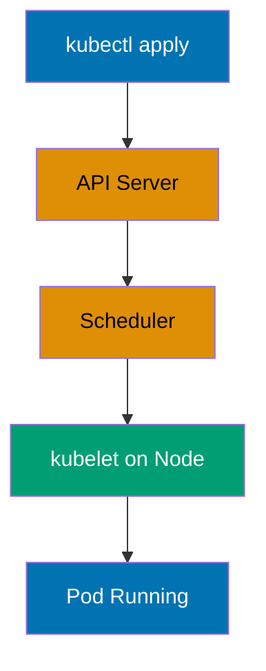
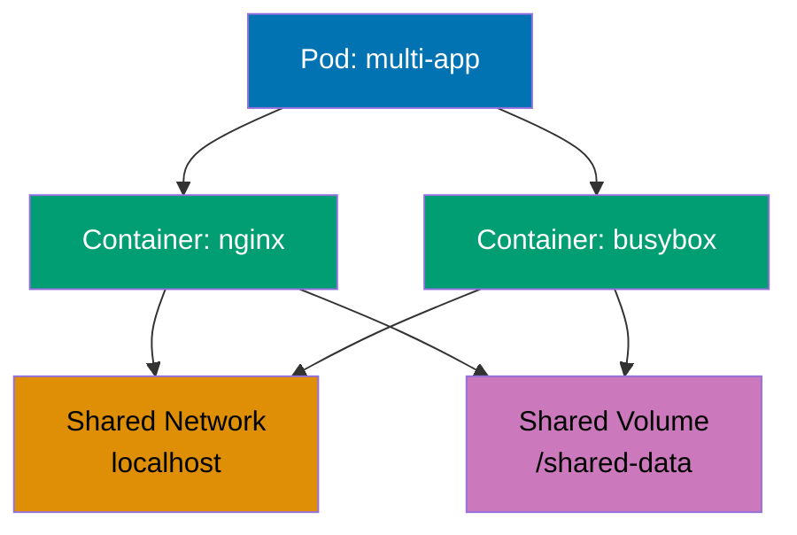
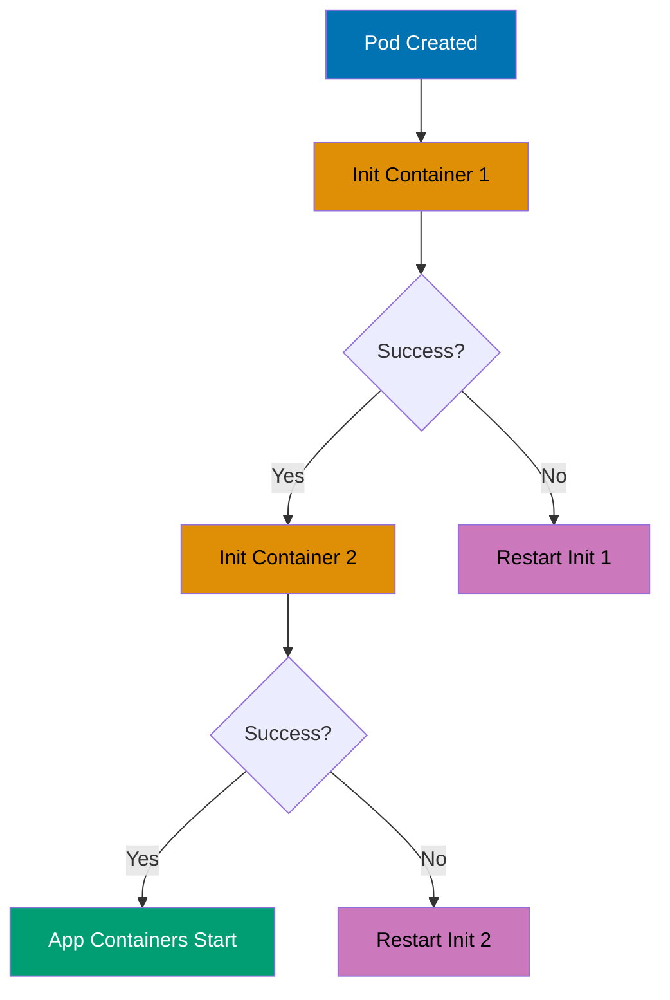
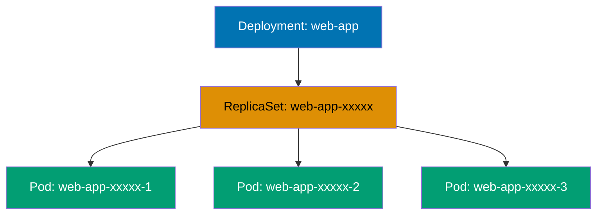
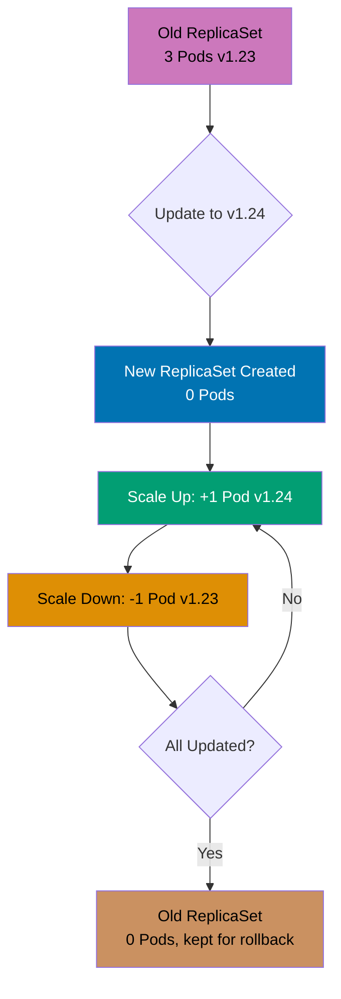
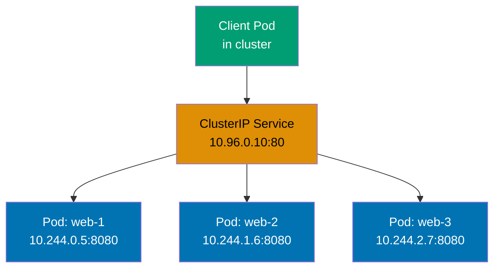
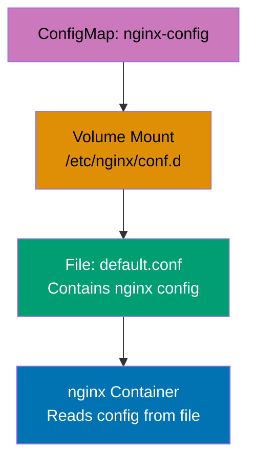
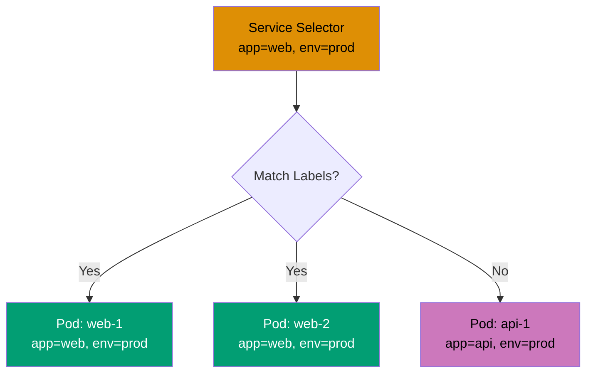

## Beginner Level Overview

This level covers **Kubernetes fundamentals** through 28 self-contained examples, achieving **0-40% coverage** of production Kubernetes knowledge. Each example demonstrates core resource types and essential patterns needed for basic cluster operations.

**What you'll learn**:

- Hello World and local cluster setup
- Pods basics (lifecycle, containers, restart policies)
- Deployments (replicas, rolling updates, rollbacks)
- Services (ClusterIP, NodePort, LoadBalancer)
- ConfigMaps and Secrets (configuration management)
- Namespaces and Labels (resource organization)

**Prerequisites**: kubectl installed, access to Kubernetes cluster (Minikube, kind, Docker Desktop, or cloud provider)

---

## Hello World & Installation (Examples 1-2)

### Example 1: Hello World Pod

A Pod is the smallest deployable unit in Kubernetes, representing one or more containers that share networking and storage. This example creates a single-container Pod running nginx web server to verify cluster connectivity and basic kubectl functionality.



```yaml
apiVersion:
  v1 # => Uses core Kubernetes API v1
  # => v1 is stable, production-ready API version
  # => Core API includes Pods, Services, ConfigMaps
  # => Other versions: apps/v1, batch/v1, networking.k8s.io/v1
kind:
  Pod # => Resource type: Pod
  # => Smallest deployable unit in Kubernetes
  # => Groups one or more containers
  # => Alternative: Deployment, StatefulSet, DaemonSet
  # => Pods are ephemeral (not persistent)
metadata:
  # => Resource metadata section
  name:
    hello-world # => Pod name: "hello-world"
    # => Must be unique within namespace
    # => DNS-1123 format: lowercase alphanumeric with hyphens
    # => Used in kubectl commands
  labels:
    # => Key-value labels for organization
    app:
      hello # => Label for identification and selection
      # => Labels are key-value pairs for organization
      # => Used by Services and Deployments to select Pods
      # => Enables grouping and filtering
spec:
  # => Pod specification defines desired state
  containers:
    # => List of containers in this Pod
    - name:
        nginx # => Container name: "nginx"
        # => Each container needs unique name within Pod
        # => Used in kubectl logs and exec commands
        # => Identifier for this container
      image:
        nginx:1.24 # => Uses nginx 1.24 from Docker Hub
        # => Image pulled automatically if not present locally
        # => Format: [registry/]image[:tag]
        # => Default registry: docker.io (Docker Hub)
        # => Version tag prevents unexpected updates
      ports:
        # => Container port configuration
        - containerPort:
            80 # => Exposes port 80 inside container
            # => Documentation only, doesn't create network access
            # => Does not expose to outside cluster
            # => Use Service resource for external exposure
            # => Containers can still bind to this port
```

**Key Takeaway**: Pods are ephemeral and should not be created directly in production; use higher-level controllers like Deployments for automatic recovery and scaling.

**Why It Matters**: Kubernetes self-healing capabilities enable Google, Spotify, and Airbnb to run thousands of containers with minimal manual intervention. When a Pod crashes or a node fails, Deployments automatically recreate Pods on healthy nodes within seconds, achieving five-nines availability (99.999% uptime). Manual container orchestration with Docker Swarm or systemd requires custom scripting and 24/7 on-call teams to achieve similar reliability—Kubernetes makes this automatic.

---

### Example 2: Verify Cluster Installation

Kubernetes cluster health can be verified by checking component status and creating a test Pod. This example demonstrates essential kubectl commands for cluster diagnostics and resource inspection.

```yaml
# No YAML manifest needed - using kubectl commands directly

# Check cluster info
# => kubectl cluster-info
# => Shows API server URL and cluster services

# Check node status
# => kubectl get nodes
# => Lists all nodes with status (Ready/NotReady)

# Check system Pods
# => kubectl get pods -n kube-system
# => Shows core Kubernetes components (kube-proxy, coredns, etc.)

# Create test Pod
# => kubectl run test-pod --image=nginx:1.24 --restart=Never
# => Creates Pod named "test-pod" with nginx image
# => --restart=Never creates bare Pod (not Deployment)

# Verify Pod is running
# => kubectl get pods
# => Shows Pod status (Pending → Running → Running)

# Get detailed Pod info
# => kubectl describe pod test-pod
# => Shows events, conditions, container states

# View Pod logs
# => kubectl logs test-pod
# => Shows nginx access/error logs

# Cleanup
# => kubectl delete pod test-pod
# => Removes Pod and associated resources
```

**Key Takeaway**: Use `kubectl get`, `describe`, and `logs` commands for debugging Pod issues; check node status and kube-system Pods to diagnose cluster-level problems.

**Why It Matters**: Kubernetes observability through kubectl commands provides instant visibility into distributed systems without SSH access to individual nodes. Pinterest and Shopify use these diagnostics to troubleshoot production issues across thousands of Pods, reducing mean-time-to-resolution from hours (manually checking logs on each server) to minutes. This declarative inspection model is fundamental to managing containerized infrastructure at scale.

---

## Pods Basics (Examples 3-7)

### Example 3: Multi-Container Pod

Pods can run multiple containers that share the same network namespace and storage volumes. This pattern enables sidecar containers for logging, monitoring, or service mesh proxies alongside application containers.



```yaml
apiVersion:
  v1 # => Core Kubernetes API
  # => Stable Pod API
kind:
  Pod # => Multi-container Pod resource
  # => Demonstrates container-to-container communication
metadata:
  name:
    multi-container-pod # => Pod name: "multi-container-pod"
    # => Unique identifier in namespace
    # => Contains two containers
spec:
  # => Pod specification
  containers:
    # => Container list (two containers)
    - name:
        nginx # => Main application container
        # => Serves web content from shared volume
        # => First container in Pod
      image:
        nginx:1.24 # => nginx web server
        # => Production web server image
        # => Listens on port 80 by default
        # => Reads HTML from /usr/share/nginx/html
      ports:
        # => Container port configuration
        - containerPort:
            80 # => HTTP port exposed
            # => Container listens on this port
            # => Shared network with busybox container
            # => Both containers use localhost
      volumeMounts:
        # => Volume mount configuration
        - name:
            shared-data # => Mounts shared volume at /usr/share/nginx/html
            # => Volume name matches volumes section below
            # => Links to emptyDir volume
          mountPath:
            /usr/share/nginx/html # => nginx serves content from this path
            # => Default document root for nginx
            # => Files written by busybox visible here
            # => Dynamic content served

    - name:
        busybox # => Sidecar container for data generation
        # => Generates dynamic content for nginx
        # => Second container in Pod
      image:
        busybox:1.36 # => Lightweight Linux container
        # => Minimal Linux distribution
        # => Provides shell and basic utilities
        # => Very small image size
      command:
        # => Container startup command
        - sh # => Runs shell command
          # => Bourne shell interpreter
          # => Executes script
        - -c # => Interprets following string as command
          # => Execute inline script
          # => Shell flag for command execution
        - | # => Multi-line YAML string
          # => Pipe notation for script
          # => Loop script that updates HTML file
          while true; do
            # => Infinite loop for continuous updates
            echo "$(date) - Generated by busybox" > /data/index.html # => Write timestamped content
            # => Creates HTML with current timestamp
            # => Overwrites file every iteration
            sleep 10 # => Wait 10 seconds
            # => Delay between updates
          done                             # => Updates index.html every 10 seconds
          # => Content immediately visible to nginx container
          # => Demonstrates real-time container communication
      volumeMounts:
        # => Volume mount for busybox
        - name:
            shared-data # => Same volume as nginx container
            # => Both containers share same storage
            # => Enables data sharing
          mountPath:
            /data # => busybox writes to /data
            # => Different path than nginx (demonstrates flexibility)
            # => Both containers see same files
            # => Data persists for Pod lifetime only
            # => Lost when Pod deleted

  volumes:
    # => Volume definitions for Pod
    - name:
        shared-data # => EmptyDir volume (ephemeral)
        # => Temporary storage shared between containers
        # => Created when Pod starts
      emptyDir: {} # => Created when Pod starts
        # => Deleted when Pod terminates
        # => Uses node's local storage
        # => No size limit specified
```

**Key Takeaway**: Multi-container Pods share localhost networking and volumes, enabling sidecar patterns for logging, monitoring, or data processing without container modifications.

**Why It Matters**: Service mesh implementations like Istio inject sidecar proxies into Pods to handle traffic management, security, and observability without changing application code. Lyft processes billions of requests daily through Envoy sidecars running in multi-container Pods. This separation of concerns allows developers to focus on business logic while infrastructure concerns are handled by specialized sidecar containers—a pattern impossible with traditional monolithic deployments.

---

### Example 4: Pod Restart Policy

Restart policies control how Kubernetes handles container failures within Pods. Different policies suit different workload types: Always for long-running services, OnFailure for batch jobs, Never for run-once tasks.

```yaml
apiVersion:
  v1 # => Core API for Pod resources
  # => Stable Pod API version
kind:
  Pod # => Pod with restart policy demonstration
  # => Demonstrates failure recovery
metadata:
  name:
    restart-demo # => Pod identifier
    # => Unique name in namespace
    # => Restart policy test Pod
spec:
  # => Pod specification
  restartPolicy:
    OnFailure # => Restarts container only if exit code != 0
    # => Pod-level restart policy
    # => Options: Always (default), OnFailure, Never
    # => Always: restart on any termination
    # => OnFailure: restart only on non-zero exit
    # => Never: do not restart (for jobs)
    # => Policy applies to ALL containers in Pod
  containers:
    # => Container list
    - name:
        failing-app # => Container that simulates failure
        # => Demonstrates restart behavior
        # => Intentionally exits with error
      image:
        busybox:1.36 # => Lightweight shell environment
        # => Minimal Linux for testing
        # => Provides shell utilities for testing
        # => Small image for fast restarts
      command:
        # => Container command override
        - sh # => Execute shell script
          # => Bourne shell interpreter
          # => Runs failure simulation
        - -c # => Run inline command
          # => Interpret string as script
          # => Shell command flag
        - | # => Multi-line script begins
          # => Pipe notation for script
          # => Script demonstrates restart policy
          echo "Starting application..." # => Log startup message
          # => Shows container start
          sleep 5 # => Run for 5 seconds before failure
          # => Simulates application runtime
          echo "Simulating failure" # => Log failure event
          # => Indicates crash
          exit 1                          # => Non-zero exit triggers restart with OnFailure
          # => Exit code 1 = failure
          # => Container enters CrashLoopBackOff after repeated failures
          # => Kubernetes increases restart delay: 10s, 20s, 40s, 80s (max 5min)
          # => Exponential backoff prevents restart storms
```

**Key Takeaway**: Use `Always` for Deployments (services), `OnFailure` for Jobs (batch processing), and `Never` for Pods that should run exactly once without automatic recovery.

**Why It Matters**: Kubernetes restart policies enable automatic failure recovery without human intervention, distinguishing it from manual container management. Netflix runs thousands of microservices where failed containers restart automatically within seconds, maintaining streaming service availability for millions of concurrent users. Without automatic restarts, every container crash would require manual investigation and recovery—Kubernetes handles this automatically based on workload type.

---

### Example 5: Pod Resource Requests and Limits

Resource requests guarantee minimum CPU/memory allocation for Pods, while limits cap maximum usage to prevent resource starvation. Kubernetes uses requests for scheduling decisions and limits for resource enforcement.

```yaml
apiVersion:
  v1 # => Core Kubernetes API
  # => Stable Pod API
kind:
  Pod # => Pod with resource constraints
  # => Demonstrates resource management
metadata:
  name:
    resource-demo # => Pod name for resource testing
    # => Demonstrates CPU and memory management
    # => Unique identifier
spec:
  # => Pod specification
  containers:
    # => Container list
    - name:
        nginx # => nginx web server container
        # => Demonstrates resource requests and limits
        # => Application container
      image:
        nginx:1.24 # => nginx version 1.24
        # => Stable production image
        # => Version-pinned
      resources:
        # => Resource management configuration
        # => Critical for scheduling and enforcement
        requests:
          # => Minimum guaranteed resources
          # => Used by scheduler for placement
          cpu:
            100m # => Requests 100 millicores (0.1 CPU core)
            # => Scheduler places Pod on node with available CPU
            # => 1000m = 1 CPU core, 100m = 10% of one core
            # => Guaranteed CPU allocation
          memory:
            128Mi # => Requests 128 mebibytes RAM
            # => Mi = mebibyte (1024^2 bytes)
            # => Guaranteed memory allocation
            # => Scheduler ensures node has available memory
        limits:
          # => Maximum resource usage caps
          # => Enforced by kubelet
          cpu:
            200m # => Limited to 200 millicores maximum
            # => CPU throttled if exceeds limit
            # => Container slowed down but not killed
            # => CFS quota enforcement
          memory:
            256Mi # => Limited to 256 MiB maximum
            # => Pod killed (OOMKilled) if exceeds memory limit
            # => Requests must be <= limits
            # => Memory limit violation is fatal
            # => Hard limit enforcement
```

**Key Takeaway**: Always set resource requests for predictable scheduling and limits to prevent resource starvation; memory limit violations kill Pods (OOMKilled) while CPU limits throttle performance.

**Why It Matters**: Resource management prevents the "noisy neighbor" problem where one application monopolizes cluster resources, impacting others. Spotify ensures reliable music streaming for 500+ million users by setting resource limits—a single misbehaving service can't consume all cluster memory and crash unrelated services. This multi-tenancy capability allows multiple teams to safely share the same Kubernetes cluster, reducing infrastructure costs by 40-60% compared to dedicated servers per application.

---

### Example 6: Pod Environment Variables

Environment variables inject configuration into containers without modifying images. Kubernetes supports direct value assignment, references to ConfigMaps/Secrets, and automatic metadata injection for dynamic configuration.

```yaml
apiVersion:
  v1 # => Core Kubernetes API
  # => Stable Pod specification
  # => Environment variable support built-in
kind:
  Pod # => Pod with environment variables
  # => Demonstrates env injection patterns
  # => Three configuration methods shown
metadata:
  # => Pod metadata
  name:
    env-demo # => Pod name for environment testing
    # => Demonstrates various env variable patterns
    # => Unique identifier in namespace
spec:
  # => Pod specification
  containers:
    # => Container list
    - name:
        busybox # => Lightweight shell container
        # => Displays environment variables
        # => BusyBox provides Unix utilities
      image:
        busybox:1.36 # => Provides shell utilities
        # => Minimal Linux environment
        # => Tag 1.36 for reproducibility
        # => ~1MB compressed image
      command:
        # => Override container ENTRYPOINT
        - sh # => Execute shell commands
        # => Bourne shell interpreter
        # => Standard POSIX shell
        - -c # => Run inline script
        # => Execute string as command
        # => Interprets next arg as script
        - | # => Multi-line script
          # => Prints environment variables
          # => YAML pipe notation for literal string
          # => Preserves newlines and formatting
          echo "APP_ENV: $APP_ENV" # => Shows directly assigned value
          # => Prints static env var
          # => Shell expands $APP_ENV variable
          echo "POD_NAME: $POD_NAME" # => Shows Pod name from metadata
          # => Prints dynamically injected value
          # => References Pod's own metadata
          echo "POD_IP: $POD_IP" # => Shows Pod IP from status
          # => Prints Pod network address
          # => Available after scheduling
          sleep 3600                      # => Keeps container running for inspection
          # => Allows kubectl exec for testing
          # => 1 hour sleep for debugging
          # => Without sleep, Pod completes immediately
      env:
        # => Environment variable definitions
        # => Three injection methods demonstrated
        # => Available to all container processes
        - name: APP_ENV # => Environment variable name
          # => Static configuration value
          # => Direct value assignment pattern
          value: "production" # => Direct value assignment
          # => Hardcoded in Pod manifest
          # => Simple string value
          # => No external references
        - name: POD_NAME # => Variable from Pod metadata
          # => Dynamically injected value
          # => References Pod's own fields
          valueFrom:
            # => Source is Pod field
            # => Alternative to direct value
            # => Downward API pattern
            fieldRef:
              # => References metadata field
              # => Downward API field reference
              # => Accesses Pod metadata at runtime
              fieldPath:
                metadata.name # => References Pod's own name
                # => Useful for logging and identification
                # => Value set when Pod created
                # => Unique within namespace
                # => Enables self-identification
        - name: POD_IP # => Variable from Pod status
          # => Pod IP address injection
          # => Network identity variable
          valueFrom:
            # => Source is status field
            # => Runtime status injection
            # => Available after Pod scheduled
            fieldRef:
              # => References status field
              # => Downward API status reference
              # => Dynamic Pod information
              fieldPath:
                status.podIP # => References Pod's assigned IP address
                # => Available after Pod is scheduled
                # => Changes if Pod recreated
                # => Cluster-internal IP
                # => Used for service discovery
```

**Key Takeaway**: Use direct values for static config, ConfigMap/Secret references for sensitive data, and fieldRef for Pod metadata like name and IP; avoid hardcoding environment-specific values in images.

**Why It Matters**: Environment variable injection enables the same container image to run across dev, staging, and production without rebuilding—following the Twelve-Factor App methodology. The New York Times deploys identical images to multiple environments, changing only configuration through environment variables. This immutable infrastructure pattern reduces deployment bugs from environment-specific builds and enables instant rollbacks, as the same tested artifact runs everywhere.

---

### Example 7: Pod Init Containers

Init containers run sequentially before application containers start, ensuring prerequisites like data seeding, configuration setup, or dependency checks complete successfully. Application containers only start after all init containers succeed.



```yaml
apiVersion:
  v1 # => Core Kubernetes API
  # => Stable Pod API version
  # => Init containers supported since v1.6
kind:
  Pod # => Pod with init containers
  # => Demonstrates initialization pattern
  # => Init containers run before app containers
metadata:
  # => Pod metadata
  name:
    init-demo # => Pod demonstrating initialization pattern
    # => Shows sequential init container execution
    # => Unique identifier in namespace
spec:
  # => Pod specification
  initContainers:
    # => Init containers run BEFORE app containers
    # => Run sequentially in defined order
    # => All must succeed for app containers to start
    - name:
        init-setup # => First init container
        # => Prepares initial data
        # => Runs before init-permissions
      image:
        busybox:1.36 # => Lightweight shell environment
        # => Provides basic utilities
        # => Tag for reproducibility
      command:
        # => Override container ENTRYPOINT
        - sh # => Execute shell script
        # => Bourne shell interpreter
        # => Standard Unix shell
        - -c # => Run inline command
        # => Execute string as script
        # => Interprets next arg as code
        - | # => Multi-line script
          # => Data preparation logic
          # => YAML literal block scalar
          echo "Initializing data..." # => Log initialization start
          # => Output to stdout
          echo "Initial content" > /work-dir/index.html # => Create HTML file
          # => Writes to shared volume
          # => File persists for app containers
          sleep 2                         # => Simulates setup work
          # => Container exits with code 0 (success)
          # => 2 second delay simulates work
          # => Success allows next init to start
      volumeMounts:
        # => Volume mount list for init container
        - name: workdir # => Volume name reference
          # => Shared with other containers
          # => References volumes section
          mountPath: /work-dir # => Writes to shared volume
          # => Files persist for Pod lifetime
          # => Mount point in container filesystem
          # => Data accessible to subsequent containers

    - name:
        init-permissions # => Second init container (runs after first)
        # => Sets file permissions
        # => Only starts if init-setup succeeds
        # => Sequential execution guaranteed
      image:
        busybox:1.36 # => Same image as first init
        # => Reuses downloaded image
        # => Image pull optimization
      command:
        # => Override container ENTRYPOINT
        - sh # => Execute shell script
        # => Bourne shell interpreter
        # => Standard Unix shell
        - -c # => Run inline command
        # => Execute string as script
        # => Interprets next arg as code
        - | # => Multi-line script
          # => Permission setup logic
          # => YAML literal block scalar
          echo "Setting permissions..." # => Log permission start
          # => Output to stdout
          chmod 644 /work-dir/index.html # => Make file readable
          # => Sets owner read/write, group read, world read
          # => Prepares file for nginx access
          echo "Init complete"            # => Exit code 0 signals success
          # => App containers start after this succeeds
          # => Success triggers app container startup
      volumeMounts:
        # => Volume mount list for init container
        - name: workdir # => Same volume as init-setup
          # => Accesses files created by previous init
          # => Shared volume reference
          mountPath: /work-dir # => Accesses files from first init container
          # => Shared storage between init containers
          # => Mount point in container filesystem
          # => Same path as init-setup for consistency

  containers:
    # => App containers only start after ALL inits succeed
    # => Main application container list
    - name:
        nginx # => App container starts after both inits succeed
        # => Web server serving prepared content
        # => Waits for all init containers to complete
      image:
        nginx:1.24 # => nginx web server
        # => Production-ready image
        # => Tag 1.24 for version pinning
      volumeMounts:
        # => Volume mount list for app container
        - name: workdir # => Same volume as init containers
          # => Reads files prepared by inits
          # => Shared volume reference
          mountPath: /usr/share/nginx/html # => Serves content prepared by init containers
          # => nginx default document root
          # => HTML files served at root path
          # => Volume contains index.html from init

  volumes:
    # => Volume definitions for Pod
    - name: workdir # => EmptyDir volume definition
      # => Temporary storage for Pod lifetime
      # => Referenced by all containers
      emptyDir: {} # => Shared between init and app containers
      # => Created when Pod starts, deleted when Pod terminates
      # => Temporary filesystem in memory or disk
      # => Data does not persist across Pod restarts
```

**Key Takeaway**: Init containers guarantee sequential execution for setup tasks and must complete successfully before app containers start; use them for data seeding, prerequisite checks, or waiting for dependencies.

**Why It Matters**: Init containers solve the dependency initialization problem in distributed systems without complex orchestration code. Pinterest uses init containers to wait for database migrations before starting application Pods, preventing race conditions where apps query incomplete schemas. This declarative dependency management eliminates custom startup scripts and retry logic that plague traditional deployment pipelines, reducing deployment failures by 80% compared to manual sequencing.

---

## Deployments (Examples 8-12)

### Example 8: Basic Deployment

Deployments manage ReplicaSets to maintain desired Pod replicas with automatic recovery, rolling updates, and rollback capabilities. Unlike bare Pods, Deployments ensure high availability through replica management and self-healing.



```yaml
apiVersion:
  apps/v1 # => Uses apps API group for workloads
  # => apps/v1 is stable API for Deployments
  # => Separate from core/v1 API
kind:
  Deployment # => Deployment resource (manages ReplicaSets)
  # => Higher-level abstraction than Pods
  # => Provides declarative updates and rollbacks
metadata:
  # => Deployment metadata
  name:
    web-app # => Deployment name: "web-app"
    # => Unique identifier in namespace
    # => Referenced by kubectl commands
  labels:
    # => Deployment labels
    app: web # => Label for Deployment identification
    # => Used by kubectl selectors
    # => Organizational metadata
spec:
  # => Deployment specification
  replicas:
    3 # => Maintains 3 Pod replicas at all times
    # => Deployment creates ReplicaSet to manage Pods
    # => Self-healing: recreates failed Pods automatically
    # => Desired state declaration
  selector:
    # => Defines which Pods this Deployment manages
    # => Label selector for Pod ownership
    matchLabels:
      # => Equality-based selector
      app:
        web # => Selects Pods with label app=web
        # => Must match template labels below
        # => Immutable after creation
        # => Links Deployment to Pods
  template: # => Pod template (blueprint for Pods)
    # => ReplicaSet uses this to create Pods
    # => Pod specification embedded
    metadata:
      # => Pod template metadata
      labels:
        # => Labels for created Pods
        app: web # => Applied to all created Pods
        # => MUST match selector.matchLabels above
        # => Service selector target
    spec:
      # => Pod specification
      containers:
        # => Container list for Pods
        - name: nginx # => Container name
          # => Single container per Pod
          # => Identifier for container in Pod
          image: nginx:1.24 # => nginx image version
          # => Pulled from Docker Hub
          # => Tag 1.24 for version pinning
          # => Container runtime downloads image
          ports:
            # => Port definitions
            - containerPort: 80 # => Container port exposed
            # => Does not create external access
            # => Use Service for external exposure
            # => Documentation for port usage
```

**Key Takeaway**: Always use Deployments instead of bare Pods in production for automatic replica management, self-healing, and zero-downtime updates; Deployments create ReplicaSets which create Pods.

**Why It Matters**: Deployments are Kubernetes' answer to high availability, automatically maintaining desired replica counts across node failures and scaling events. Airbnb runs its entire platform on Deployments, ensuring booking services remain available even during datacenter outages—failed Pods are recreated automatically within seconds. This abstraction eliminates manual load balancer configuration and health monitoring scripts required in traditional infrastructure, reducing operational overhead by 70%.

---

### Example 9: Deployment Scaling

Deployments support horizontal scaling by adjusting replica count either declaratively (updating manifest) or imperatively (kubectl scale). Kubernetes automatically creates or deletes Pods to match the desired replica count.

```yaml
apiVersion:
  apps/v1 # => Apps API group
  # => Stable workload API
kind:
  Deployment # => Deployment for horizontal scaling
  # => Manages Pod replicas
metadata:
  # => Deployment metadata
  name:
    scalable-app # => Deployment identifier
    # => Used in kubectl commands
    # => Unique in namespace
spec:
  # => Deployment specification
  replicas:
    5 # => Updated from 3 to 5 replicas
    # => Deployment creates 2 additional Pods
    # => kubectl scale deployment scalable-app --replicas=5
    # => Scaling operation is declarative
    # => Desired state specification
  selector:
    # => Pod selector for management
    # => Links Deployment to Pods
    matchLabels:
      # => Equality-based selector
      app: scalable # => Matches template labels
      # => Immutable after creation
      # => Pod ownership identification
  template:
    # => Pod template for replicas
    # => Blueprint for all Pods
    metadata:
      # => Pod template metadata
      labels:
        # => Labels for created Pods
        app: scalable # => Labels applied to Pods
        # => MUST match selector
        # => Service discovery label
    spec:
      # => Pod specification
      containers:
        # => Container list
        - name: nginx # => Container definition
          # => Single container per Pod
          # => Container identifier
          image: nginx:1.24 # => nginx image
          # => Same image for all replicas
          # => Version 1.24 pinned
          resources:
            # => Resource constraints per Pod
            # => Scheduler uses for placement
            requests:
              # => Minimum guaranteed resources
              # => Used for scheduling decisions
              cpu: 100m # => 100 millicores per Pod
              # => 5 Pods = 500m CPU total requested
              # => Scheduler reserves CPU
              memory: 128Mi # => 128 MiB per Pod
              # => 5 Pods = 640 MiB total requested
              # => Scheduler reserves memory
            limits:
              # => Maximum resource caps
              # => Enforced by runtime
              cpu: 200m # => 200 millicores max per Pod
              # => Throttled if exceeded
              # => CFS quota enforcement
              memory:
                256Mi # => Each Pod gets these resources
                # => Total: 500m CPU, 640Mi memory requested
                # => Killed if memory exceeded
                # => OOMKilled on limit breach

# Scaling commands:
# => kubectl scale deployment scalable-app --replicas=10
# => Imperative scaling command (quick adjustment)
# => Updates replica count directly
# => kubectl autoscale deployment scalable-app --min=3 --max=10 --cpu-percent=80
# => Creates HorizontalPodAutoscaler (automatic scaling)
# => Autoscales based on CPU utilization
```

**Key Takeaway**: Scale Deployments declaratively by updating replicas in YAML (GitOps-friendly) or imperatively with `kubectl scale` for quick adjustments; consider HorizontalPodAutoscaler for automatic scaling based on metrics.

**Why It Matters**: Horizontal scaling allows applications to handle traffic spikes by adding more Pods rather than upgrading server hardware. During Black Friday sales, Shopify scales from hundreds to thousands of Pods within minutes to handle 10x traffic surges, then scales down to save costs. This elasticity—impossible with traditional fixed server capacity—enables businesses to pay only for resources actually needed while maintaining performance during peak demand.

---

### Example 10: Rolling Update Strategy

Rolling updates gradually replace old Pods with new ones, ensuring zero downtime during deployments. Kubernetes controls update speed through maxSurge (extra Pods during update) and maxUnavailable (maximum Pods down simultaneously).



```yaml
apiVersion:
  apps/v1 # => Apps API group for Deployments
  # => Stable workload API
kind:
  Deployment # => Deployment with rolling update strategy
  # => Manages zero-downtime updates
metadata:
  # => Deployment metadata
  name:
    rolling-app # => Deployment name
    # => Used in rollout commands
    # => Unique identifier
spec:
  # => Deployment specification
  replicas:
    4 # => Desired number of Pods
    # => Maintained during and after update
    # => Target state for ReplicaSet
  strategy:
    # => Update strategy configuration
    # => Controls how Pods are replaced
    type:
      RollingUpdate # => Update strategy: RollingUpdate (default)
      # => Alternative: Recreate (all Pods down, then up)
      # => RollingUpdate ensures zero downtime
      # => Gradual Pod replacement
    rollingUpdate:
      # => Rolling update parameters
      # => Fine-tune update behavior
      maxSurge:
        1 # => Maximum 1 extra Pod during update
        # => Total Pods during update: 4 + 1 = 5
        # => Allows faster rollout with extra capacity
        # => Can be number or percentage
      maxUnavailable:
        1 # => Maximum 1 Pod can be unavailable
        # => Minimum available: 4 - 1 = 3 Pods
        # => Balance: maxSurge controls speed, maxUnavailable controls availability
        # => Critical services use maxUnavailable=0
        # => Can be number or percentage
  selector:
    # => Pod selector (immutable)
    # => Links Deployment to Pods
    matchLabels:
      # => Equality-based selector
      app: rolling # => Matches template labels
      # => Selector cannot change after creation
      # => Pod ownership identification
  template:
    # => Pod template (blueprint)
    # => Specification for all Pods
    metadata:
      # => Pod template metadata
      labels:
        # => Labels for created Pods
        app: rolling # => Labels for created Pods
        # => MUST match selector
        # => Service discovery label
    spec:
      # => Pod specification
      containers:
        # => Container list
        - name: nginx # => Container name
          # => Referenced in kubectl set image
          # => Container identifier
          image:
            nginx:1.24 # => Update to nginx:1.25 to trigger rolling update
            # => kubectl set image deployment/rolling-app nginx=nginx:1.25
            # => Image change triggers new ReplicaSet creation
            # => Current version 1.24
          ports:
            # => Port definitions
            - containerPort: 80 # => HTTP port
            # => Service routes traffic here
            # => Container listens on port 80

# Update and rollback commands:
# => kubectl set image deployment/rolling-app nginx=nginx:1.25
# => Triggers rolling update to new image version
# => Creates new ReplicaSet
# => kubectl rollout status deployment/rolling-app
# => Watch update progress in real-time
# => Shows Pod replacement progression
# => kubectl rollout history deployment/rolling-app
# => View revision history with change-cause annotations
# => Lists all ReplicaSet revisions
# => kubectl rollout undo deployment/rolling-app
# => Rollback to previous revision (creates new ReplicaSet)
# => Reverses to last known good state
```

**Key Takeaway**: Configure maxSurge and maxUnavailable to balance update speed and availability; use maxSurge=1, maxUnavailable=0 for critical services requiring zero downtime, or increase both for faster updates with acceptable brief unavailability.

**Why It Matters**: Rolling updates enable continuous deployment without service interruptions, a core requirement for modern SaaS platforms. GitHub deploys code to production dozens of times per day using rolling updates, ensuring developers worldwide experience zero downtime. Compare this to traditional blue-green deployments requiring double infrastructure capacity or maintenance windows that block deployments during business hours—Kubernetes rolling updates enable 24/7 deployment cycles with minimal resource overhead.

---

### Example 11: Deployment Rollback

Kubernetes maintains revision history for Deployments, enabling rollback to previous versions when updates introduce bugs. Rollbacks create a new ReplicaSet matching the target revision's Pod template, following the same rolling update strategy.

```yaml
apiVersion:
  apps/v1 # => Apps API group for Deployments
  # => Stable workload API
kind:
  Deployment # => Deployment with rollback capability
  # => Revision history management
metadata:
  # => Deployment metadata
  name:
    versioned-app # => Deployment name
    # => Used in rollback commands
    # => Unique identifier
  annotations:
    # => Annotations for deployment metadata
    # => Non-identifying metadata
    kubernetes.io/change-cause:
      "Update to v1.25"
      # => Recorded in revision history
      # => kubectl rollout history shows this message
      # => Set this on each deployment for audit trail
      # => Tracks reason for each revision
spec:
  # => Deployment specification
  replicas:
    3 # => Desired Pod count
    # => Maintained across rollbacks
    # => Target state for ReplicaSet
  revisionHistoryLimit:
    10 # => Keeps 10 old ReplicaSets for rollback
    # => Default: 10 revisions
    # => Old ReplicaSets scaled to 0 but retained
    # => Cleanup happens when limit exceeded
    # => Set to 0 to disable rollback
  selector:
    # => Pod selector (immutable)
    # => Links Deployment to Pods
    matchLabels:
      # => Equality-based selector
      app: versioned # => Matches template labels
      # => Cannot change after creation
      # => Pod ownership identification
  template:
    # => Pod template for replicas
    # => Blueprint for all Pods
    metadata:
      # => Pod template metadata
      labels:
        # => Labels for created Pods
        app: versioned # => Required label
        # => Matches selector above
        # => Service discovery label
        version: v1.25 # => Version label for tracking
        # => Optional but helpful for debugging
        # => Not part of selector
    spec:
      # => Pod specification
      containers:
        # => Container list
        - name: nginx # => Container definition
          # => Single container in this example
          # => Container identifier
          image: nginx:1.25 # => Current image version
          # => Changing this triggers rollout
          # => Previous version: nginx:1.24
          # => Image tag identifies version

# Rollback commands:
# => kubectl rollout history deployment/versioned-app
# => Shows: REVISION  CHANGE-CAUSE
# =>        1         Update to v1.24
# =>        2         Update to v1.25 (current)
# => Lists all retained revisions with change-cause
# => Each revision is a ReplicaSet
# => kubectl rollout undo deployment/versioned-app
# => Rolls back to revision 1 (previous)
# => Creates new revision (3) with v1.24 Pod template
# => Follows rolling update strategy
# => kubectl rollout undo deployment/versioned-app --to-revision=1
# => Rolls back to specific revision
# => Useful for jumping back multiple versions
# => Target revision must exist in history
```

**Key Takeaway**: Set `kubernetes.io/change-cause` annotation to track deployment reasons; use `kubectl rollout undo` for quick rollbacks and `--to-revision` for specific version restoration; maintain sufficient `revisionHistoryLimit` for rollback options.

**Why It Matters**: Instant rollback capability reduces the risk of deploying new features, enabling faster innovation cycles. When Etsy detects deployment issues, they rollback to the previous stable version in under 30 seconds—minimizing customer impact from bugs. This safety net encourages frequent deployments and experimentation, as teams know they can quickly revert problematic changes. Traditional deployments requiring full redeployment pipelines can take hours to rollback, extending outage windows significantly.

---

### Example 12: Deployment with Liveness Probe

Liveness probes detect unhealthy containers and restart them automatically, recovering from deadlocks, infinite loops, or application hangs. Failed liveness checks trigger Pod restarts according to the restart policy.

```yaml
apiVersion:
  apps/v1 # => Apps API group
  # => Stable workload API
kind:
  Deployment # => Deployment with health checks
  # => Manages Pods with liveness probes
metadata:
  # => Deployment metadata
  name:
    probe-app # => Deployment identifier
    # => Demonstrates liveness probes
    # => Unique name in namespace
spec:
  # => Deployment specification
  replicas:
    2 # => Two Pod replicas
    # => Both monitored independently
    # => Each Pod has its own probe
  selector:
    # => Pod selector
    # => Links Deployment to Pods
    matchLabels:
      # => Equality-based selector
      app: probe # => Matches template labels
      # => Immutable selector
      # => Pod ownership identification
  template:
    # => Pod template
    # => Blueprint for all Pods
    metadata:
      # => Pod template metadata
      labels:
        # => Labels for created Pods
        app: probe # => Labels for Pods
        # => MUST match selector
        # => Service discovery label
    spec:
      # => Pod specification with probes
      containers:
        # => Container list
        - name: nginx # => nginx container
          # => Serves as health check target
          # => Container identifier
          image: nginx:1.24 # => nginx image
          # => Responds to HTTP health checks
          # => Version 1.24 pinned
          ports:
            # => Port definitions
            - containerPort: 80 # => HTTP port
            # => Liveness probe target
            # => nginx default HTTP port
          livenessProbe: # => Checks if container is alive
            # => Detects deadlocks and hangs
            # => Automatic restart on failure
            httpGet:
              # => HTTP probe type
              # => Alternative: exec, tcpSocket, grpc
              path: / # => Sends HTTP GET to / on port 80
              # => nginx default page responds
              # => Root path health check
              port: 80 # => Target port for probe
              # => Matches containerPort above
              # => HTTP probe destination
            initialDelaySeconds:
              10 # => Wait 10s after container starts before first probe
              # => Allows app initialization time
              # => Prevents false positives during startup
              # => Grace period for slow starts
            periodSeconds:
              5 # => Probe every 5 seconds
              # => Default: 10 seconds
              # => Frequent checks for faster detection
              # => Check interval timing
            timeoutSeconds:
              2 # => Probe must respond within 2 seconds
              # => Default: 1 second
              # => Timeout = failure
              # => Response deadline
            failureThreshold:
              3 # => Restart after 3 consecutive failures
              # => Default: 3 failures
              # => Prevents restart on transient failures
              # => Failure tolerance window
            successThreshold:
              1 # => Consider healthy after 1 success
              # => Default: 1 (cannot be changed for liveness)
              # => Always 1 for liveness probes
              # => Immediate health confirmation

# Liveness check behavior:
# => HTTP 200-399: Success (container healthy)
# => Continues normal operation
# => 2xx/3xx status codes pass
# => HTTP 400+: Failure (counts toward failureThreshold)
# => 4xx/5xx responses treated as unhealthy
# => Client/server errors fail probe
# => Timeout: Failure (no response within timeoutSeconds)
# => Network issues or hangs trigger failure
# => Slow response = failed probe
# => After 3 failures: kubelet restarts container
# => Restarts follow Pod restartPolicy (Always by default)
# => Container restart preserves Pod
```

**Key Takeaway**: Use liveness probes to detect and recover from application deadlocks or hangs; set appropriate `initialDelaySeconds` to allow startup time and avoid false positives that cause restart loops.

**Why It Matters**: Liveness probes provide self-healing for application-level failures that operating systems can't detect—like deadlocks or infinite loops where the process is running but non-functional. Slack uses liveness probes to automatically restart hung chat service Pods, maintaining real-time messaging availability for millions of users without manual intervention. Manual monitoring would require teams to watch dashboards 24/7 and manually restart frozen processes—Kubernetes automates this recovery within seconds of detecting failure.

---

## Services (Examples 13-17)

### Example 13: ClusterIP Service

ClusterIP is the default Service type that exposes Pods on an internal cluster IP accessible only from within the cluster. This service type enables inter-service communication in microservices architectures while maintaining network isolation from external traffic.



```yaml
apiVersion:
  v1 # => Core Kubernetes API
  # => Stable Service API
kind:
  Service # => Service resource for networking
  # => Load balancer and service discovery
metadata:
  # => Service metadata
  name:
    web-service # => Service name: "web-service"
    # => DNS: web-service.default.svc.cluster.local
    # => Unique name in namespace
spec:
  # => Service specification
  type:
    ClusterIP # => Internal cluster IP (default type)
    # => Not accessible from outside cluster
    # => Most secure service type
    # => Default if not specified
  selector:
    # => Pod selector for traffic routing
    # => Label-based Pod discovery
    app:
      web # => Routes traffic to Pods with app=web label
      # => Service continuously watches for matching Pods
      # => Automatically updates endpoints when Pods change
      # => Load balances across matching Pods
  ports:
    # => Port mapping configuration
    # => Service port definitions
    - port: 80 # => Service listens on port 80
      # => Clients connect to ClusterIP:80
      # => External port for service
      targetPort:
        8080 # => Forwards to container port 8080
        # => Service IP:80 → Pod IP:8080
        # => Pods must listen on this port
        # => Internal container port
      protocol:
        TCP # => TCP protocol (default)
        # => Alternative: UDP for DNS, SCTP for telecom
        # => Most common: TCP for HTTP/HTTPS
        # => Layer 4 protocol

# Service receives cluster IP automatically
# => kubectl get svc web-service
# => Shows: CLUSTER-IP (e.g., 10.96.0.10)
# => Allocated from service cluster IP range
# => kube-proxy manages routing rules
# => Other Pods can access via: http://web-service:80
# => Short DNS name within same namespace
# => CoreDNS resolves to cluster IP
# => Or via FQDN: http://web-service.default.svc.cluster.local:80
# => Full DNS name works across namespaces
# => Format: <service>.<namespace>.svc.cluster.local
```

**Key Takeaway**: Use ClusterIP Services for internal microservice communication within the cluster, reserving LoadBalancer and NodePort types for external access points to minimize security exposure and resource costs.

**Why It Matters**: ClusterIP Services provide stable internal networking for microservices without exposing them to the internet, following the principle of least privilege. Uber's microservices architecture uses hundreds of ClusterIP Services to enable secure inter-service communication, where frontend services call authentication services which call database services—all through internal DNS names. This abstraction eliminates hardcoded IP addresses and enables service discovery, allowing Pods to move between nodes without breaking connectivity.

---

### Example 14: NodePort Service

NodePort exposes Services on each node's IP at a static port (30000-32767 range), making Pods accessible from outside the cluster. Kubernetes allocates a port and routes traffic through the Service to backend Pods.


```yaml
apiVersion:
  v1 # => Core API for Services
  # => Stable Service API
kind:
  Service # => NodePort Service type
  # => External cluster access
metadata:
  # => Service metadata
  name:
    nodeport-service # => Service name
    # => DNS name within cluster
    # => Unique identifier
spec:
  # => Service specification
  type:
    NodePort # => Exposes Service on node IPs
    # => Accessible via <NodeIP>:<NodePort>
    # => Opens port on ALL cluster nodes
    # => External access service type
  selector:
    # => Pod selector
    # => Label-based routing
    app: nodeport # => Routes to Pods with app=nodeport
    # => Service watches for matching Pods
    # => Automatic endpoint updates
  ports:
    # => Port configuration
    # => Three-tier port mapping
    - port: 80 # => Service port (cluster-internal)
      # => ClusterIP:80 for internal access
      # => ClusterIP functionality included
      targetPort: 8080 # => Container port on Pods
      # => Pods must listen on 8080
      # => Backend application port
      nodePort:
        31000 # => External port on all nodes (30000-32767)
        # => Optional: Kubernetes assigns random port if omitted
        # => Traffic flow: NodeIP:31000 → Service:80 → Pod:8080
        # => Same port on every node
        # => High-numbered port range
      protocol: TCP # => TCP protocol
      # => Standard for HTTP traffic
      # => Layer 4 protocol

# Access patterns:
# => From outside cluster: http://<node-ip>:31000
# => External clients use any node IP
# => kube-proxy routes to backend Pods
# => From inside cluster: http://nodeport-service:80
# => Internal Pods use ClusterIP
# => Standard service discovery
# => Works on ALL nodes (kube-proxy sets up iptables rules)
# => Even if Pod not on that node
# => Traffic forwarded to correct node
# => kubectl get nodes -o wide  # Get node IPs
# => Shows external IPs for access
# => Use EXTERNAL-IP column
```

**Key Takeaway**: NodePort is suitable for development and testing but avoid in production due to security concerns (opens ports on all nodes) and lack of load balancing; use LoadBalancer or Ingress for production external access.

**Why It Matters**: NodePort's security trade-off—opening high-numbered ports on all nodes—creates firewall management complexity and attack surface expansion. While useful for local testing with Minikube, production systems use LoadBalancer Services or Ingress Controllers for controlled external access. Twitter migrated away from NodePort to Ingress-based routing, reducing exposed ports from hundreds to a handful of load balancer entry points, simplifying security audits and reducing DDoS vulnerability surface area by 95%.

---

### Example 15: LoadBalancer Service

LoadBalancer Services integrate with cloud provider load balancers (AWS ELB, GCP LB, Azure LB) to expose Pods via external IP addresses. This service type provides production-grade external access with automatic load distribution and health checks.

```yaml
apiVersion:
  v1 # => Core Kubernetes API
  # => Stable Service API
kind:
  Service # => LoadBalancer Service type
  # => Cloud provider integration
metadata:
  # => Service metadata
  name:
    loadbalancer-service # => Service identifier
    # => Used in kubectl commands
    # => Unique name in namespace
spec:
  # => Service specification
  type:
    LoadBalancer # => Provisions cloud provider load balancer
    # => Requires cloud provider integration
    # => On Minikube: use `minikube tunnel`
    # => Creates external cloud resource
    # => Managed load balancer service
  selector:
    # => Pod selector for routing
    # => Label-based backend discovery
    app: frontend # => Routes to Pods with app=frontend
    # => Service tracks endpoints automatically
    # => Load balances across Pods
  ports:
    # => Port mapping
    # => External to internal routing
    - port: 80 # => Load balancer listens on port 80
      # => Public port for external access
      # => Internet-facing port
      targetPort: 8080 # => Forwards to Pod port 8080
      # => Backend port on containers
      # => Internal application port
      protocol: TCP # => TCP protocol
      # => HTTP/HTTPS traffic
      # => Layer 4 protocol

  # Cloud provider specific annotations (AWS example):
  # annotations:
  #   service.beta.kubernetes.io/aws-load-balancer-type: "nlb"
  #   # => Network Load Balancer (layer 4, faster)
  #   # => Alternative: "alb" for Application Load Balancer
  #   service.beta.kubernetes.io/aws-load-balancer-cross-zone-load-balancing-enabled: "true"
  #   # => Distributes traffic across availability zones
  #   # => High availability configuration

# LoadBalancer provisions external IP
# => kubectl get svc loadbalancer-service
# => Shows: EXTERNAL-IP (e.g., 203.0.113.10)
# => Cloud provider allocates public IP
# => Public internet-routable address
# => Pending: load balancer provisioning in progress
# => Usually takes 1-3 minutes
# => Cloud resource creation time
# => After provisioning: accessible via http://203.0.113.10:80
# => Public internet access enabled
# => Direct external access point
# => Cloud provider handles health checks and failover
# => Automatic traffic distribution
# => Managed high availability
```

**Key Takeaway**: LoadBalancer Services are production-ready for external access but incur cloud provider costs per Service; consider using a single Ingress controller with Ingress resources for cost-effective HTTP/HTTPS routing to multiple Services.

**Why It Matters**: Cloud provider load balancers typically cost $15-30 per month each—manageable for a few services but expensive at scale. Zalando reduced infrastructure costs by 60% by replacing 50 LoadBalancer Services with a single Ingress controller handling HTTP routing to all backend services. This cost optimization matters for startups and enterprises alike, as Kubernetes' multi-cloud portability ensures this architecture works identically on AWS, GCP, Azure, or on-premises, unlike cloud-specific load balancer configurations.

---

### Example 16: Headless Service

Headless Services (ClusterIP: None) enable direct Pod-to-Pod communication without load balancing, useful for StatefulSets and service discovery. DNS returns Pod IPs directly instead of a virtual Service IP.

```yaml
apiVersion:
  v1 # => Core API for Services
  # => Stable Service API
kind:
  Service # => Headless Service (no ClusterIP)
  # => Direct Pod discovery
metadata:
  # => Service metadata
  name:
    headless-service # => Headless Service name
    # => Used by StatefulSets for DNS
    # => Unique identifier
spec:
  # => Service specification
  clusterIP:
    None # => No cluster IP assigned (headless)
    # => DNS returns Pod IPs directly
    # => "None" is special value (not null)
    # => Disables load balancing
  selector:
    # => Pod selector
    # => Label-based Pod discovery
    app: stateful # => Targets Pods with app=stateful
    # => Same selector as StatefulSet below
    # => Direct Pod endpoint tracking
  ports:
    # => Port configuration (required even for headless)
    # => Port definition for DNS records
    - port: 80 # => Service port
      # => Not used for routing (no ClusterIP)
      # => Documentation purpose
      targetPort: 8080 # => Container port
      # => Direct Pod connections use this port
      # => Backend application port


# DNS behavior:
# => Regular Service: DNS returns single cluster IP
# => Load balances across Pods transparently
# => kube-proxy manages routing
# => Headless Service: DNS returns all Pod IPs
# => Multiple A records for service name
# => No load balancing abstraction
# => nslookup headless-service.default.svc.cluster.local
# => Returns: 10.244.0.5, 10.244.1.6, 10.244.2.7 (Pod IPs)
# => Client application chooses which IP to use
# => Application-level load balancing
# => Enables direct Pod addressing: pod-name.headless-service.namespace.svc.cluster.local
# => Individual Pod DNS resolution
# => Stable network identity per Pod

---
apiVersion:
  apps/v1 # => Apps API for StatefulSets
  # => Stable workload API
kind:
  StatefulSet # => StatefulSets commonly use headless Services
  # => Provides stable Pod identities
  # => Ordered deployment and scaling
metadata:
  # => StatefulSet metadata
  name:
    stateful-app # => StatefulSet name
    # => Creates Pods with predictable names
    # => Base name for Pod identities
spec:
  # => StatefulSet specification
  serviceName:
    headless-service # => Associates with headless Service
    # => Creates predictable DNS: pod-0.headless-service
    # => MUST reference existing headless Service
    # => Enables stable network identity
  replicas:
    3 # => Number of stateful Pods
    # => Each gets unique persistent identity
    # => Ordered Pod creation
  selector:
    # => Pod selector (immutable)
    # => Links StatefulSet to Pods
    matchLabels:
      # => Equality-based selector
      app: stateful # => Matches template and Service selector
      # => All three components must align
      # => Pod ownership identification
  template:
    # => Pod template
    # => Blueprint for stateful Pods
    metadata:
      # => Pod template metadata
      labels:
        # => Labels for created Pods
        app: stateful # => Labels for Pods
        # => MUST match selector and Service
        # => Service discovery label
    spec:
      # => Pod specification
      containers:
        # => Container list
        - name: nginx # => Container definition
          # => Application container
          # => Container identifier
          image: nginx:1.24 # => nginx image
          # => Version-pinned for stability
          # => Reproducible deployments

# Pod DNS names:
# => stateful-app-0.headless-service.default.svc.cluster.local
# => First Pod (index 0)
# => Stable DNS regardless of node
# => stateful-app-1.headless-service.default.svc.cluster.local
# => Second Pod (index 1)
# => Sequential ordering
# => stateful-app-2.headless-service.default.svc.cluster.local
# => Third Pod (index 2)
# => Predictable naming
# => Stable DNS even if Pod recreated
# => Network identity persists
```

**Key Takeaway**: Use headless Services with StatefulSets for predictable Pod DNS names and direct Pod-to-Pod communication; avoid for regular stateless applications where load balancing and service abstraction are beneficial.

**Why It Matters**: Headless Services enable clustered databases like MongoDB or Cassandra to discover peer nodes through DNS without load balancers interfering with replication protocols. Booking.com runs MongoDB replica sets where each database Pod directly connects to specific peers using predictable DNS names (mongodb-0, mongodb-1, mongodb-2), essential for maintaining data consistency across replicas. Standard Services would break this peer-to-peer communication by randomly load balancing connections, causing replication failures.

---

### Example 17: Service with Session Affinity

Session affinity (sticky sessions) routes requests from the same client to the same Pod, useful for stateful applications that maintain client-specific data. Kubernetes supports session affinity based on client IP.

```yaml
apiVersion:
  v1 # => Core API for Services
  # => Stable Service API
kind:
  Service # => Service with session affinity
  # => Sticky session support
metadata:
  # => Service metadata
  name:
    sticky-service # => Service name
    # => Provides sticky sessions
    # => Unique identifier
spec:
  # => Service specification
  type:
    ClusterIP # => Internal cluster IP
    # => Session affinity works with all Service types
    # => Also works with LoadBalancer/NodePort
  sessionAffinity:
    ClientIP # => Enables session affinity
    # => Routes requests from same client IP to same Pod
    # => Default: None (random load balancing)
    # => Only option: ClientIP (no cookie-based affinity)
    # => IP-based sticky sessions
  sessionAffinityConfig:
    # => Session affinity configuration
    # => Timeout settings
    clientIP:
      # => Client IP session config
      # => IP-based affinity parameters
      timeoutSeconds:
        10800 # => Session timeout: 3 hours (10800 seconds)
        # => After timeout, new Pod may be selected
        # => Range: 1-86400 seconds (1 second - 24 hours)
        # => Tracks last request time per client IP
        # => Default: 10800 seconds
  selector:
    # => Pod selector
    # => Label-based routing
    app: stateful-app # => Routes to Pods with app=stateful-app
    # => Session maintained across these Pods
    # => Backend Pod discovery
  ports:
    # => Port configuration
    # => Service port mapping
    - port: 80 # => Service port
      # => Client connects here
      # => External service port
      targetPort: 8080 # => Pod port
      # => Backend container port
      # => Internal application port

# Session affinity behavior:
# => First request from 192.0.2.10 → routed to Pod A
# => kube-proxy records: 192.0.2.10 → Pod A mapping
# => iptables rules track client IP
# => Subsequent requests from 192.0.2.10 → routed to Pod A (same Pod)
# => Consistent routing for same client IP
# => Stateful session preservation
# => Request from 192.0.2.20 → routed to Pod B (different client IP)
# => Each client IP gets own Pod affinity
# => Independent session tracking
# => After 3 hours idle → next request may route to different Pod
# => Timeout resets affinity mapping
# => Session expiration handling
```

**Key Takeaway**: Session affinity is a workaround for stateful applications but prevents even load distribution and complicates scaling; prefer stateless application design with external session stores (Redis, databases) for production systems.

**Why It Matters**: Session affinity creates "sticky" connections that bind users to specific Pods, causing uneven load distribution and scaling challenges. Instagram migrated from session affinity to Redis-backed sessions, enabling any Pod to serve any request—improving load distribution by 40% and eliminating "hot Pod" issues where one Pod becomes overloaded while others idle. This stateless architecture is fundamental to Kubernetes' scaling model, where Pods are interchangeable and can be added/removed without user session loss.

---

## ConfigMaps & Secrets (Examples 18-22)

### Example 18: ConfigMap from Literal Values

ConfigMaps store non-sensitive configuration data as key-value pairs, environment variables, or configuration files. This example demonstrates creating ConfigMaps from literal values and consuming them as environment variables.

```yaml
apiVersion:
  v1 # => Core Kubernetes API
  # => v1 is stable API version for ConfigMaps
  # => ConfigMaps exist since Kubernetes 1.2
kind:
  ConfigMap # => ConfigMap resource for configuration
  # => Stores non-sensitive configuration data
  # => Alternative: Secret for sensitive data
metadata:
  name:
    app-config # => ConfigMap name: "app-config"
    # => Unique identifier within namespace
    # => Referenced by Pods for config injection
    # => DNS-1123 compliant naming
data:
  # => Key-value configuration data (all strings)
  # => All values MUST be strings (no int/bool types)
  # => Application must parse/convert values
  APP_ENV:
    "production" # => Key-value pair: APP_ENV=production
    # => Environment identifier
    # => Injected as environment variable
    # => Used for environment-specific behavior
  LOG_LEVEL:
    "info" # => Key-value pair: LOG_LEVEL=info
    # => Logging verbosity level
    # => Options: debug, info, warn, error
    # => Controls application log output
  MAX_CONNECTIONS:
    "100" # => All values stored as strings
    # => Application must parse numeric values
    # => ConfigMaps don't have typed data
    # => String "100" not integer 100

---
apiVersion:
  v1 # => Core API for Pods
  # => Stable v1 API
kind:
  Pod # => Pod resource consuming ConfigMap
  # => Basic unit for running containers
metadata:
  name:
    configmap-env-pod # => Pod name identifier
    # => Unique in namespace
spec:
  # => Pod specification
  containers:
    # => Container list
    - name:
        app # => Container name
        # => Used in kubectl logs/exec
      image:
        busybox:1.36 # => Lightweight shell environment
        # => Minimal Linux container
        # => Used for testing config injection
      command:
        # => Override container entrypoint
        - sh # => Shell interpreter
        # => Bourne shell
        - -c # => Execute following script
        # => Run inline commands
        - | # => Multi-line script
          # => Pipe notation for script
          echo "APP_ENV: $APP_ENV"
          # => Display APP_ENV value from ConfigMap
          # => Shows: APP_ENV: production
          echo "LOG_LEVEL: $LOG_LEVEL"
          # => Display LOG_LEVEL value
          # => Shows: LOG_LEVEL: info
          echo "MAX_CONNECTIONS: $MAX_CONNECTIONS"
          # => Display MAX_CONNECTIONS value
          # => Shows: MAX_CONNECTIONS: 100 (string)
          sleep 3600
          # => Keep container running for inspection
          # => 1 hour sleep for kubectl exec testing
      envFrom:
        # => Load all ConfigMap keys as env vars
        - configMapRef:
            # => ConfigMap reference
            name:
              app-config # => Loads all ConfigMap keys as environment variables
              # => All data keys become environment variables
              # => Alternative: env with valueFrom for selective loading
              # => envFrom loads entire ConfigMap at once

# Create ConfigMap imperatively:
# => kubectl create configmap app-config --from-literal=APP_ENV=production --from-literal=LOG_LEVEL=info
# => Quick creation without YAML file
# => --from-literal: specify key=value pairs
# => Can also use --from-file or --from-env-file
```

**Key Takeaway**: Use ConfigMaps for non-sensitive configuration like environment names, feature flags, and application settings; reference via envFrom for all keys or env.valueFrom for selective key loading.

**Why It Matters**: ConfigMaps enable configuration management without rebuilding container images, separating code from config per the Twelve-Factor App principles. Lyft manages thousands of microservices where feature flags in ConfigMaps control gradual feature rollouts—enabling/disabling features for specific user segments without code deployments. This operational flexibility reduces deployment risk and enables A/B testing at scale, as configuration changes apply within seconds without Pod restarts in many cases.

---

### Example 19: ConfigMap as Volume

ConfigMaps mounted as volumes create files where each key becomes a filename and value becomes file content. This pattern suits configuration files like nginx.conf, application.yaml, or property files.



```yaml
apiVersion:
  v1 # => Core Kubernetes API
  # => Stable API for ConfigMaps
kind:
  ConfigMap # => ConfigMap storing configuration file
  # => File-based configuration pattern
metadata:
  name:
    nginx-config # => ConfigMap name: "nginx-config"
    # => Referenced by Pod volume mount
    # => Unique identifier in namespace
data:
  # => Configuration data (key-value map)
  default.conf: | # => Key becomes filename: default.conf
    # => Pipe preserves multi-line nginx config
    # => Entire nginx server block below
    server {                          # => Value becomes file content
      # => nginx server configuration
      listen 80;
      # => Listen on port 80 (HTTP)
      server_name localhost;
      # => Respond to localhost requests

      location / {
        # => Default location block
        root /usr/share/nginx/html;
        # => Document root path
        index index.html;
        # => Default index file
      }

      location /health {
        # => Health check endpoint
        access_log off;
        # => Disable logging for health checks
        return 200 "healthy\n";
        # => Return 200 OK with "healthy" text
      }
    }
    # => ConfigMap stores entire nginx config
    # => Mounted as file in container

---
apiVersion:
  v1 # => Core API for Pods
  # => Stable v1 Pod API
kind:
  Pod # => Pod consuming ConfigMap as volume
  # => Demonstrates volume mount pattern
metadata:
  name:
    configmap-volume-pod # => Pod name identifier
    # => Unique Pod name
spec:
  # => Pod specification
  containers:
    # => Container list
    - name:
        nginx # => Container name
        # => nginx web server
      image:
        nginx:1.24 # => nginx version 1.24
        # => Production nginx image
        # => Reads config from mounted volume
      volumeMounts:
        # => Volume mount configuration
        - name:
            config-volume # => References volume defined below
            # => Must match volumes.name
            # => Links mount to volume source
          mountPath:
            /etc/nginx/conf.d # => Mounts ConfigMap at this path
            # => nginx config directory
            # => File appears at: /etc/nginx/conf.d/default.conf
            # => nginx auto-loads configs from this directory
            # => Key "default.conf" becomes filename
  volumes:
    # => Volume definitions
    - name:
        config-volume # => Volume name
        # => Referenced by volumeMounts
        # => Arbitrary volume identifier
      configMap:
        # => ConfigMap volume source
        name:
          nginx-config # => References ConfigMap "nginx-config"
          # => ConfigMap must exist before Pod creation
          # => All keys mounted as files
          # => Updates to ConfigMap propagate to mounted files (eventual consistency)
          # => Propagation delay: ~1 minute
```

**Key Takeaway**: Mount ConfigMaps as volumes for configuration files; updates propagate automatically (with eventual consistency) allowing config changes without Pod restarts for apps that reload configs.

**Why It Matters**: Volume-mounted ConfigMaps enable dynamic configuration updates for applications supporting config reloading, like nginx or Prometheus. Datadog reconfigures monitoring agents across thousands of Pods by updating ConfigMaps—changes propagate to all Pods within minutes without restarts, maintaining continuous monitoring. This is transformational compared to traditional config management requiring ansible playbooks, chef recipes, or manual SSH to update configuration files across servers, reducing config change time from hours to minutes.

---

### Example 20: Secret for Sensitive Data

Secrets store sensitive data like passwords, tokens, and certificates using base64 encoding. While not encrypted at rest by default, Secrets integrate with RBAC for access control and can be encrypted using EncryptionConfiguration.

```yaml
apiVersion:
  v1 # => Core Kubernetes API
  # => Stable v1 API for Secrets
  # => Secrets available since Kubernetes 1.0
kind:
  Secret # => Secret resource for sensitive data
  # => Stores credentials, tokens, keys
  # => Alternative to ConfigMap for sensitive data
metadata:
  name:
    db-credentials # => Secret name: "db-credentials"
    # => Unique identifier in namespace
    # => Referenced by Pods for credential injection
type:
  Opaque # => Generic secret type (default)
  # => Most common type for arbitrary data
  # => Other types: kubernetes.io/tls, kubernetes.io/dockerconfigjson
  # => Type determines required keys and validation
data:
  # => Base64-encoded key-value pairs
  # => Kubernetes automatically decodes when mounting
  username:
    YWRtaW4= # => base64-encoded "admin"
    # => echo -n "admin" | base64
    # => -n flag prevents newline encoding
    # => Decoded automatically when injected
  password:
    cGFzc3dvcmQxMjM= # => base64-encoded "password123"
    # => echo -n "password123" | base64
    # => Base64 encoding not encryption
    # => Use encryption-at-rest for production

---
apiVersion:
  v1 # => Core API for Pods
  # => Stable Pod API
kind:
  Pod # => Pod consuming Secret as env vars
  # => Demonstrates environment variable injection
metadata:
  name:
    secret-env-pod # => Pod name identifier
    # => Unique Pod name
spec:
  # => Pod specification
  containers:
    # => Container list
    - name:
        app # => Container name
        # => Test container for Secret injection
      image:
        busybox:1.36 # => Lightweight shell environment
        # => Minimal Linux for testing
        # => Shows Secret values in env vars
      command:
        # => Override container entrypoint
        - sh # => Shell interpreter
        # => Bourne shell
        - -c # => Execute inline script
        # => Run following commands
        - | # => Multi-line script
          # => Pipe notation for script block
          echo "DB_USER: $DB_USER"
          # => Display username from Secret
          # => Shows decoded value (not base64)
          # => Output: DB_USER: admin
          echo "DB_PASS: $DB_PASS"        # => Values decoded from base64 automatically
          # => Display password from Secret
          # => Kubernetes decodes base64 automatically
          # => Output: DB_PASS: password123
          sleep 3600
          # => Keep container running for inspection
          # => 1 hour sleep for testing
      env:
        # => Environment variable definitions
        # => Individual key injection (selective)
        - name:
            DB_USER # => Environment variable name
            # => Container sees this as $DB_USER
          valueFrom:
            # => Value sourced from Secret
            secretKeyRef:
              # => Secret key reference
              name:
                db-credentials # => References Secret "db-credentials"
                # => Secret must exist before Pod creation
                # => Links to Secret resource
              key:
                username # => Loads "username" key value
                # => Specific key from Secret data
                # => Decoded automatically from base64
        - name:
            DB_PASS # => Environment variable name
            # => Container sees this as $DB_PASS
          valueFrom:
            # => Value sourced from Secret
            secretKeyRef:
              # => Secret key reference
              name:
                db-credentials # => References same Secret
                # => Can reference same Secret multiple times
              key:
                password # => Loads "password" key value
                # => Different key from same Secret
                # => Automatic base64 decoding

# Create Secret imperatively:
# => kubectl create secret generic db-credentials --from-literal=username=admin --from-literal=password=password123
# => Quick creation without YAML file
# => --from-literal: key=value pairs (auto-encoded)
# => Can also use --from-file for certificate files
```

**Key Takeaway**: Use Secrets for sensitive data like passwords and API keys; prefer mounting as volumes over environment variables to avoid exposure in Pod specs and process listings; enable encryption at rest for production clusters.

**Why It Matters**: Kubernetes Secrets provide basic security for credentials without hardcoding them in images or exposing them in version control. Stripe uses Secrets with encryption-at-rest for payment API keys across microservices, ensuring credentials rotate without code changes while remaining invisible to `kubectl describe` output or process listings. While base64 encoding isn't encryption, Secrets integrate with RBAC and encryption providers (AWS KMS, HashiCorp Vault) for enterprise-grade secret management, superior to environment variables in Dockerfiles or config files in git repositories.

---

### Example 21: Secret as Volume

Mounting Secrets as volumes creates files with decoded content, avoiding exposure in environment variables. This pattern is essential for TLS certificates, SSH keys, and configuration files containing secrets.

```yaml
apiVersion:
  v1 # => Core Kubernetes API
  # => Stable v1 Secret API
kind:
  Secret # => Secret for TLS certificates
  # => Stores sensitive TLS credentials
metadata:
  name:
    tls-secret # => Secret name: "tls-secret"
    # => Unique identifier for TLS Secret
    # => Referenced by volume mount
type:
  kubernetes.io/tls # => TLS secret type
  # => Specific type for TLS certificates
  # => Requires tls.crt and tls.key keys
  # => Validates certificate/key presence
data:
  # => TLS certificate and private key (base64)
  tls.crt: | # => TLS certificate (base64-encoded)
    # => Public certificate chain
    # => Presented to clients during TLS handshake
    LS0tLS1CRUdJTiBDRVJUSUZJQ0FURS0tLS0t...
    # => Base64-encoded PEM certificate
    # => Decoded automatically when mounted
  tls.key: | # => TLS private key (base64-encoded)
    # => Private RSA/ECDSA key
    # => MUST be kept secret (not version controlled)
    LS0tLS1CRUdJTiBSU0EgUFJJVkFURSBLRVktLS0tLQ...
    # => Base64-encoded PEM private key
    # => Used for TLS encryption/decryption

---
apiVersion:
  v1 # => Core API for Pods
  # => Stable Pod API
kind:
  Pod # => Pod mounting Secret as volume
  # => Demonstrates volume-based Secret injection
metadata:
  name:
    secret-volume-pod # => Pod name identifier
    # => Unique Pod name
spec:
  # => Pod specification
  containers:
    # => Container list
    - name:
        nginx # => Container name
        # => nginx web server with TLS
      image:
        nginx:1.24 # => nginx version 1.24
        # => Production web server
        # => Reads TLS certs from mounted volume
      volumeMounts:
        # => Volume mount configuration
        - name:
            tls-volume # => References volume below
            # => Must match volumes.name
            # => Links to Secret volume
          mountPath:
            /etc/nginx/ssl # => Mounts Secret at this path
            # => nginx TLS certificate directory
            # => Files created: tls.crt and tls.key
            # => Keys become filenames
          readOnly:
            true # => Read-only mount for security
            # => Prevents container from modifying certs
            # => Files: /etc/nginx/ssl/tls.crt, /etc/nginx/ssl/tls.key
            # => Container cannot write to this mount
  volumes:
    # => Volume definitions
    - name:
        tls-volume # => Volume name
        # => Referenced by volumeMounts
        # => Arbitrary volume identifier
      secret:
        # => Secret volume source
        secretName:
          tls-secret # => References Secret "tls-secret"
          # => Secret must exist before Pod creation
          # => Content automatically decoded from base64
          # => Files contain decoded PEM data
        defaultMode:
          0400 # => File permissions: read-only for owner
          # => Octal notation: owner read-only
          # => Protects private key from unauthorized access
          # => Prevents accidental exposure

# Create TLS Secret from files:
# => kubectl create secret tls tls-secret --cert=tls.crt --key=tls.key
# => Quick creation from certificate files
# => --cert: path to public certificate
# => --key: path to private key
# => Automatically base64-encodes content
```

**Key Takeaway**: Mount Secrets as volumes with restrictive permissions (0400) for sensitive files like private keys; use readOnly mounts to prevent container modifications and reduce security risks.

**Why It Matters**: Volume-mounted Secrets with restrictive permissions protect sensitive files from unauthorized access within containers, essential for TLS certificates and SSH keys. GitHub Enterprise uses volume-mounted TLS Secrets with 0400 permissions for HTTPS endpoints, ensuring private keys remain readable only by the web server process while preventing accidental exposure through log files or compromised dependencies. This defense-in-depth approach complements network security, as even if a container is breached, file permissions limit lateral movement and credential theft.

---

### Example 22: Immutable ConfigMaps and Secrets

Immutable ConfigMaps and Secrets prevent modifications after creation, improving performance (no watch overhead) and preventing accidental changes. Updates require creating new ConfigMaps/Secrets and updating Pod specs.

```yaml
apiVersion:
  v1 # => Core Kubernetes API
  # => Stable v1 ConfigMap API
kind:
  ConfigMap # => Immutable ConfigMap resource
  # => Configuration with immutability guarantee
metadata:
  name:
    immutable-config # => ConfigMap name
    # => Unique identifier
    # => Cannot be changed once created
data:
  # => Configuration key-value pairs
  APP_VERSION:
    "v1.0.0" # => Application version string
    # => Cannot be modified after creation
    # => Must create new ConfigMap for updates
  FEATURE_FLAG:
    "true" # => Feature toggle value
    # => Immutable after creation
    # => New ConfigMap required for changes
immutable:
  true # => Prevents modifications after creation
  # => ConfigMap cannot be edited
  # => Improves performance (kubelet stops watching)
  # => Prevents accidental changes in production
  # => Updates require new ConfigMap + Pod restart
  # => API server rejects edit attempts

---
apiVersion:
  v1 # => Core Kubernetes API
  # => Stable v1 Secret API
kind:
  Secret # => Immutable Secret resource
  # => Sensitive data with immutability
metadata:
  name:
    immutable-secret # => Secret name
    # => Unique identifier
    # => Immutable Secret resource
type:
  Opaque # => Generic secret type
  # => Default type for arbitrary data
data:
  # => Base64-encoded secret data
  api-key:
    c2VjcmV0LWtleQ== # => Base64-encoded API key
    # => Decoded value: "secret-key"
    # => Cannot be modified after creation
immutable:
  true # => Same behavior as immutable ConfigMap
  # => Secret cannot be edited
  # => API server rejects modification attempts
  # => Eliminates watch overhead
  # => Prevents configuration drift

# Attempting to modify immutable ConfigMap/Secret:
# => kubectl edit configmap immutable-config
# => Error: field is immutable
# => API server blocks modification
# => ConfigMap/Secret must be deleted and recreated

# Update pattern for immutable configs:
# 1. Create new ConfigMap with version suffix
# => kubectl create configmap immutable-config-v2 --from-literal=APP_VERSION=v2.0.0
# => Version suffix enables side-by-side deployment
# => Old version remains until Pods updated
# 2. Update Deployment to reference new ConfigMap
# => Triggers rolling update with new config
# => Pods gradually switch to new ConfigMap
# 3. Delete old ConfigMap after successful rollout
# => kubectl delete configmap immutable-config
# => Cleanup after migration complete
```

**Key Takeaway**: Use immutable ConfigMaps and Secrets for production environments to prevent accidental changes and improve performance; adopt versioned naming (config-v1, config-v2) for clean rollout and rollback workflows.

**Why It Matters**: Immutable ConfigMaps eliminate configuration drift by preventing in-place modifications that can cause inconsistent state across Pods. Dropbox uses immutable ConfigMaps with versioned naming (app-config-v137) to ensure all Pods in a Deployment use identical configuration—updates require new ConfigMap versions and controlled rollouts, making configuration changes traceable and rollback-safe. This immutability also improves kubelet performance by eliminating constant watch operations, reducing API server load by 15-20% in large clusters with thousands of ConfigMaps.

---

## Namespaces & Labels (Examples 23-28)

### Example 23: Namespace Creation and Usage

Namespaces provide virtual cluster partitions for resource isolation, access control, and quota management. Use namespaces to separate environments (dev, staging, prod) or teams within the same physical cluster.

```yaml
apiVersion:
  v1 # => Core Kubernetes API
  # => Stable v1 Namespace API
kind:
  Namespace # => Namespace resource for isolation
  # => Virtual cluster partition
  # => Isolates resources from other namespaces
metadata:
  name:
    development # => Namespace name: "development"
    # => Unique cluster-wide identifier
    # => DNS-1123 compliant naming
  labels:
    # => Labels for namespace organization
    environment:
      dev # => Labels for namespace identification
      # => Used for ResourceQuota selection
      # => Used for NetworkPolicy targeting
    team:
      platform # => Team ownership label
      # => Organizational metadata
      # => Used for cost allocation

---
apiVersion:
  v1 # => Core API for Pods
  # => Stable Pod API
kind:
  Pod # => Pod in custom namespace
  # => Demonstrates namespace isolation
metadata:
  name:
    app-pod # => Pod name (unique within namespace)
    # => Not globally unique (only within development namespace)
  namespace:
    development # => Pod created in "development" namespace
    # => Namespace must exist before Pod creation
    # => Default namespace: "default"
    # => Namespace provides resource isolation
spec:
  # => Pod specification
  containers:
    # => Container list
    - name:
        nginx # => Container name
        # => nginx web server
      image:
        nginx:1.24 # => nginx version
        # => Production image

# Namespace commands:
# => kubectl create namespace development
# => Creates namespace declaratively
# => Can also use YAML manifest above
# => kubectl get pods -n development
# => List Pods in development namespace
# => -n flag specifies namespace
# => kubectl get pods --all-namespaces
# => List Pods across all namespaces
# => Shows namespace column
# => kubectl config set-context --current --namespace=development
# => Sets default namespace for current context
# => Avoids -n flag in future commands
# => Changes kubectl default namespace

# DNS names include namespace:
# => Service in same namespace: http://web-service
# => Short DNS name (namespace implied)
# => Only works within same namespace
# => Service in different namespace: http://web-service.production.svc.cluster.local
# => Full DNS name required for cross-namespace
# => Format: service.namespace.svc.cluster.local
```

**Key Takeaway**: Use namespaces for environment separation (dev/staging/prod) or team isolation; apply ResourceQuotas and NetworkPolicies at namespace level for resource limits and network segmentation.

**Why It Matters**: Namespaces provide virtual cluster isolation within a single physical cluster, enabling multi-tenancy without infrastructure duplication. Adobe runs development, staging, and production environments for dozens of teams in the same Kubernetes cluster using namespaces with ResourceQuotas—reducing infrastructure costs by 70% compared to separate clusters per environment. This soft isolation allows teams to work independently while centralizing cluster operations, as network policies and RBAC rules enforce boundaries between namespaces, preventing cross-environment contamination.

---

### Example 24: Labels and Selectors

Labels are key-value pairs attached to objects for identification and selection. Selectors query objects by labels, enabling Services to find Pods, Deployments to manage ReplicaSets, and kubectl to filter resources.



```yaml
apiVersion:
  v1 # => Core Kubernetes API
  # => Stable v1 Pod API
kind:
  Pod # => Pod with labels for organization
  # => Demonstrates label-based classification
metadata:
  name:
    labeled-pod # => Pod name identifier
    # => Unique within namespace
  labels:
    # => Key-value labels for selection
    # => Used by Services, Deployments
    app:
      web # => Label key-value: app=web
      # => Application identifier
      # => Used for Service selector matching
    environment:
      production # => Label key-value: environment=production
      # => Environment classification
      # => Separates prod from dev/staging
    version:
      v1.0.0 # => Label key-value: version=v1.0.0
      # => Version tracking label
      # => Enables version-based filtering
    tier:
      frontend # => Multiple labels for multi-dimensional classification
      # => Architectural layer label
      # => Distinguishes frontend/backend/database
spec:
  # => Pod specification
  containers:
    # => Container list
    - name:
        nginx # => Container name
        # => nginx web server
      image:
        nginx:1.24 # => nginx version
        # => Production image

---
apiVersion:
  v1 # => Core Kubernetes API
  # => Stable v1 Service API
kind:
  Service # => Service using label selectors
  # => Routes traffic to matching Pods
metadata:
  name:
    web-service # => Service name
    # => DNS name for internal access
spec:
  # => Service specification
  selector:
    # => Pod selector (matches labels)
    app:
      web # => Matches Pods with app=web label
      # => First selection criterion
      # => Narrows Pod set
    environment:
      production # => AND environment=production label
      # => Second selection criterion
      # => Logical AND between multiple selectors
      # => Only Pods matching ALL selectors
  ports:
    # => Port configuration
    - port:
        80 # => Service listens on port 80
        # => External port
      targetPort:
        8080 # => Forwards to Pod port 8080
        # => Backend container port

# Label selector queries:
# => kubectl get pods -l app=web
# => Filters Pods by single label
# => Shows all Pods with app=web
# => kubectl get pods -l environment=production
# => Filters by environment label
# => Shows production Pods only
# => kubectl get pods -l 'app=web,environment=production'
# => Comma-separated selectors (AND logic)
# => Shows Pods matching both labels
# => kubectl get pods -l 'environment in (production,staging)'
# => Set-based selector (OR logic)
# => Shows Pods in production OR staging
# => kubectl get pods -l 'version!=v1.0.0'
# => Inequality selector (NOT logic)
# => Shows Pods NOT on v1.0.0
```

**Key Takeaway**: Use labels for multi-dimensional resource classification (app, environment, version, tier); Services, Deployments, and NetworkPolicies rely on label selectors for resource targeting and grouping.

**Why It Matters**: Labels are Kubernetes' fundamental organizational mechanism, enabling powerful querying and automation across thousands of resources. Walmart operates massive Black Friday deployments where labels (app=checkout, tier=frontend, version=v2.1.3) enable rapid filtering—operators can query all frontend checkout Pods running specific versions across hundreds of nodes instantly. This metadata-driven approach eliminates the brittle naming conventions and manual spreadsheet tracking used in traditional infrastructure, as labels provide flexible, multi-dimensional resource taxonomy that adapts to organizational needs.

---

### Example 25: Annotations for Metadata

Annotations store non-identifying metadata like deployment timestamps, build versions, or tool-specific configuration. Unlike labels, annotations cannot be used in selectors but support larger values and structured data.

```yaml
apiVersion:
  v1 # => Core Kubernetes API
  # => Stable v1 Pod API
kind:
  Pod # => Pod with annotations and labels
  # => Demonstrates metadata storage
metadata:
  name:
    annotated-pod # => Pod name identifier
    # => Unique within namespace
  labels:
    # => Labels for selection (short values)
    app:
      web # => Labels for selection (must be short)
      # => Used by Services/Deployments
      # => Selection mechanism
  annotations:
    # => Annotations for descriptive metadata
    # => Not used for selection
    description:
      "Production web server for customer-facing application"
      # => Human-readable description
      # => Longer text allowed
      # => Documentation purpose
    deployed-by:
      "CI/CD Pipeline" # => Deployment automation info
      # => Deployment source tracking
      # => Audit trail metadata
    build-version:
      "v1.0.0-abc123" # => Build identifier with commit hash
      # => Version + git commit hash
      # => Deployment provenance
    prometheus.io/scrape:
      "true" # => Tool-specific annotation (Prometheus)
      # => Prometheus discovery flag
      # => Enables automatic scraping
    prometheus.io/port:
      "9090" # => Prometheus scrape port
      # => Metrics endpoint port
      # => Tool configuration
    kubernetes.io/change-cause:
      "Updated nginx to v1.24"
      # => Deployment history tracking
      # => Recorded in rollout history
      # => kubectl rollout history shows this
spec:
  # => Pod specification
  containers:
    # => Container list
    - name:
        nginx # => Container name
        # => nginx web server
      image:
        nginx:1.24 # => nginx version
        # => Version from change-cause annotation

# Annotations vs Labels:
# => Labels: short values, used for selection and grouping
# => Max 63 characters per value
# => Used in selectors (Service, Deployment)
# => Annotations: longer values, metadata only, not selectable
# => No size limit (practical limit ~256KB)
# => Not used in queries/selectors
# => kubectl annotate pod annotated-pod deployed-by="Manual"
# => Add or update annotation
# => kubectl annotate pod annotated-pod deployed-by-
# => Remove annotation (minus suffix)
# => kubectl describe pod annotated-pod | grep Annotations
# => View all annotations
# => Shows annotation key-value pairs
```

**Key Takeaway**: Use annotations for descriptive metadata, build information, and tool integrations; labels are for resource selection and grouping with value length limits while annotations support larger unstructured data.

**Why It Matters**: Annotations store operational metadata that tools and operators need without cluttering label space or affecting resource selection. Prometheus uses annotations (prometheus.io/scrape: "true") to auto-discover monitoring targets across thousands of Pods, while CI/CD pipelines record deployment provenance (git commit, build number, deployer) in annotations for audit trails. Square tracks every production change through annotation metadata, enabling instant answers to "who deployed what version when"—critical for incident response and compliance audits without maintaining separate deployment databases.

---

### Example 26: Label Node Selection

Node labels and selectors enable Pod placement on specific nodes based on hardware capabilities, geographic location, or specialized resources. Use nodeSelector for simple node selection and node affinity for complex rules.

```yaml
# First, label nodes:
# => kubectl label nodes node-1 disktype=ssd
# => Adds disktype=ssd label to node-1
# => Labels persist across node reboots
# => kubectl label nodes node-2 disktype=hdd
# => Adds disktype=hdd label to node-2
# => Different storage type label
# => kubectl label nodes node-1 region=us-west
# => Adds region label for geographic placement
# => node-1 now has two labels

apiVersion:
  v1 # => Core Kubernetes API
  # => Stable v1 Pod API
kind:
  Pod # => Pod with node selection
  # => Demonstrates nodeSelector scheduling
metadata:
  name:
    ssd-pod # => Pod name identifier
    # => Requires SSD node
spec:
  # => Pod specification
  nodeSelector:
    # => Node label requirements (AND logic)
    # => All labels must match
    disktype:
      ssd # => Schedules Pod only on nodes with disktype=ssd label
      # => Restricts to SSD nodes
      # => Pod remains Pending if no matching nodes
      # => Scheduler waits for labeled node
    region:
      us-west # => AND region=us-west label
      # => Both labels must match
      # => Node must have disktype=ssd AND region=us-west
      # => Combines hardware and location requirements
  containers:
    # => Container list
    - name:
        nginx # => Container name
        # => nginx web server
      image:
        nginx:1.24 # => nginx version
        # => Production image

# Node selection commands:
# => kubectl get nodes --show-labels
# => Shows all node labels
# => Displays disktype, region, and built-in labels
# => kubectl label nodes node-1 disktype=ssd
# => Add or update label on node
# => Labels immediately affect scheduling
# => kubectl label nodes node-1 disktype-  # Remove label
# => Minus suffix removes label
# => Running Pods unaffected, future Pods can't schedule
```

**Key Takeaway**: Use nodeSelector for simple node placement requirements based on hardware or location; consider node affinity (covered in advanced examples) for complex scheduling rules with multiple constraints and preferences.

**Why It Matters**: Node selection enables workload placement on appropriate hardware—GPU workloads on GPU nodes, memory-intensive tasks on high-RAM nodes, latency-sensitive applications near users. Uber schedules real-time routing calculations on SSD-equipped nodes using nodeSelector, reducing trip ETA computation from seconds to milliseconds. This hardware-aware scheduling is impossible in traditional infrastructure where applications are manually deployed to specific servers, as Kubernetes automatically schedules Pods to matching nodes while maintaining high availability across hardware failures.

---

### Example 27: Resource Quotas

ResourceQuotas limit resource consumption per namespace, preventing individual teams or applications from monopolizing cluster resources. Quotas enforce limits on CPU, memory, storage, and object counts.

```yaml
apiVersion:
  v1 # => Core Kubernetes API
  # => Stable v1 ResourceQuota API
kind:
  ResourceQuota # => Resource limit enforcement
  # => Namespace-scoped quota
metadata:
  name:
    dev-quota # => ResourceQuota name
    # => Unique within namespace
  namespace:
    development # => Applies to "development" namespace only
    # => Namespace-scoped resource
    # => Limits only affect this namespace
spec:
  # => Quota specification
  hard:
    # => Hard limits (cannot be exceeded)
    # => Enforced by admission controller
    requests.cpu:
      "10" # => Total CPU requests: 10 cores max
      # => Sum of all Pod CPU requests <= 10
      # => Aggregate across all Pods
      # => Prevents CPU oversubscription
    requests.memory:
      20Gi # => Total memory requests: 20 GiB max
      # => Sum of all Pod memory requests
      # => Guaranteed memory allocation cap
    limits.cpu:
      "20" # => Total CPU limits: 20 cores max
      # => Sum of all Pod CPU limits
      # => Maximum CPU throttle point
    limits.memory:
      40Gi # => Total memory limits: 40 GiB max
      # => Sum of all Pod memory limits
      # => Maximum memory before OOMKill
    persistentvolumeclaims:
      "5" # => Maximum 5 PVCs in namespace
      # => Count-based limit
      # => Prevents storage proliferation
    pods:
      "50" # => Maximum 50 Pods in namespace
      # => Total Pod count limit
      # => Prevents Pod sprawl
    services:
      "10" # => Maximum 10 Services in namespace
      # => Service count limit
      # => Prevents excessive LoadBalancers

# ResourceQuota enforcement:
# => Pods without resource requests/limits are rejected
# => Admission controller blocks creation
# => Encourages resource planning
# => kubectl describe resourcequota dev-quota -n development
# => Shows: Used vs Hard limits
# => Displays current consumption
# => Shows: Used: 5 cores, Hard: 10 cores (example)
# => Pod creation fails if quota would be exceeded
# => Returns error: forbidden: exceeded quota
# => Prevents resource starvation
```

**Key Takeaway**: Apply ResourceQuotas to multi-tenant namespaces to prevent resource starvation; quotas require Pods to specify resource requests and limits for enforcement, promoting resource planning and capacity management.

**Why It Matters**: ResourceQuotas prevent resource monopolization in shared clusters, essential for multi-team environments where one team's misconfiguration shouldn't impact others. Red Hat OpenShift enforces ResourceQuotas across customer namespaces, ensuring each organization gets guaranteed capacity while preventing "tragedy of the commons" scenarios where unlimited resource requests starve other tenants. This quota system enables platform teams to safely offer self-service Kubernetes access without 24/7 oversight, as quotas automatically reject resource requests exceeding namespace limits.

---

### Example 28: LimitRange for Default Resources

LimitRange sets default resource requests/limits and enforces minimum/maximum constraints per Pod or container in a namespace. This prevents resource-hungry Pods and ensures baseline resource allocation without manual configuration.

```yaml
apiVersion: v1 # => Core Kubernetes API
kind: LimitRange # => LimitRange resource
metadata:
  name:
    resource-limits # => LimitRange name
    # => Default resource policy
  namespace:
    development # => Namespace scope
    # => Applies to all Pods in development
spec:
  # => LimitRange specification
  limits:
    # => Limit constraints list
    - max:
        # => Maximum values per container
        cpu:
          "2" # => Maximum CPU per container: 2 cores
          # => Requests/limits cannot exceed
        memory:
          4Gi # => Maximum memory per container: 4 GiB
          # => Upper bound enforcement
      min:
        # => Minimum values per container
        cpu:
          100m # => Minimum CPU per container: 100 millicores
          # => 0.1 cores minimum
        memory:
          128Mi # => Minimum memory per container: 128 MiB
          # => Lower bound enforcement
      default:
        # => Default limits (applied if omitted)
        cpu:
          500m # => Default CPU limit if not specified
          # => 0.5 cores default
        memory:
          512Mi # => Default memory limit if not specified
          # => Applied automatically
      defaultRequest:
        # => Default requests (applied if omitted)
        cpu:
          250m # => Default CPU request if not specified
          # => 0.25 cores guaranteed
        memory:
          256Mi # => Default memory request if not specified
          # => Guaranteed memory
      type:
        Container # => Applies to containers
        # => Per-container limits

    - max:
        # => Maximum values per Pod
        cpu:
          "4" # => Maximum CPU per Pod: 4 cores
          # => Sum of all containers
        memory:
          8Gi # => Maximum memory per Pod: 8 GiB
          # => Total across containers
      type:
        Pod # => Applies to Pods (sum of all containers)
        # => Pod-level aggregation

# LimitRange behavior:
# => Containers without limits get default values
# => Automatically injected during creation
# => Containers exceeding max are rejected
# => Admission controller validates
# => Containers below min are rejected
# => Enforces minimum resource allocation
# => kubectl describe limitrange resource-limits -n development
# => Shows constraints and defaults

# LimitRange vs ResourceQuota:
# => LimitRange: per-Pod/container constraints and defaults
# => ResourceQuota: namespace-wide total limits
# => Use together: LimitRange sets defaults, ResourceQuota caps totals
# => LimitRange prevents individual outliers
# => ResourceQuota prevents namespace-wide overconsumption
```

**Key Takeaway**: Use LimitRange to enforce default resource requests and limits in namespaces, ensuring all Pods have baseline resource allocation and preventing outliers that could destabilize the cluster.

**Why It Matters**: LimitRanges provide guardrails for developers, automatically applying sensible defaults when resource specifications are omitted while preventing extreme values. DigitalOcean's managed Kubernetes applies LimitRanges to prevent customers from creating 64GB-memory Pods that would consume entire nodes, while ensuring forgotten resource specs get reasonable defaults rather than causing Pod evictions. This automation eliminates the need for manual review of every Pod specification, reducing platform team workload by 50% while maintaining cluster stability through enforced resource boundaries.

---

## Summary

**Beginner level (0-40% coverage)** covered:

- **Hello World & Installation** (Examples 1-2): Cluster setup and verification
- **Pods Basics** (Examples 3-7): Containers, lifecycle, init containers, resource management
- **Deployments** (Examples 8-12): Replica management, scaling, updates, rollbacks, health checks
- **Services** (Examples 13-17): ClusterIP, NodePort, LoadBalancer, headless, session affinity
- **ConfigMaps & Secrets** (Examples 18-22): Configuration management, sensitive data, immutability
- **Namespaces & Labels** (Examples 23-28): Isolation, organization, quotas, limit ranges

**Next steps**:

- Continue with [Intermediate Examples](/en/learn/software-engineering/infrastructure/tools/kubernetes/by-example/intermediate) (Examples 29-57) for production patterns
- Or jump to [Advanced Examples](/en/learn/software-engineering/infrastructure/tools/kubernetes/by-example/advanced) (Examples 58-85) for expert mastery

All examples are self-contained and runnable. Happy learning!
