## Intermediate Level Overview

This level covers **production patterns and advanced resource types** through 29 examples, achieving **40-75% coverage** of production Kubernetes knowledge. Each example demonstrates real-world patterns needed for running stateful workloads, managing storage, and implementing production-grade reliability.

**What you'll learn**:

- StatefulSets for stateful workloads with persistent storage
- DaemonSets and Jobs for background tasks and batch processing
- Ingress Controllers for HTTP routing and TLS termination
- Persistent Volumes for storage orchestration
- Resource management with requests, limits, and quotas
- Health checks with liveness, readiness, and startup probes

**Prerequisites**: Completion of Beginner examples (1-28) or equivalent Kubernetes fundamentals knowledge

---

## StatefulSets (Examples 29-33)

### Example 29: Basic StatefulSet

StatefulSets manage stateful applications requiring stable network identities, persistent storage, and ordered deployment/scaling. Unlike Deployments, StatefulSets provide predictable Pod names and persistent storage across restarts.

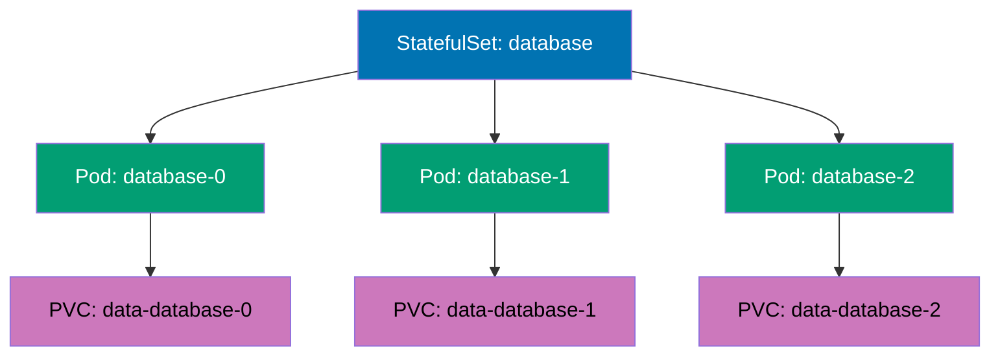

```yaml
apiVersion: v1
kind: Service
metadata:
  name: database # => Headless Service for StatefulSet
spec:
  clusterIP:
    None # => Headless (no cluster IP)
    # => DNS returns Pod IPs directly
  selector:
    app: database
  ports:
    - port: 5432
      name: postgres

---
apiVersion: apps/v1
kind: StatefulSet
metadata:
  name: database
spec:
  serviceName:
    database # => Associates with headless Service
    # => Enables predictable DNS names
  replicas: 3 # => Creates 3 Pods: database-0, database-1, database-2
  selector:
    matchLabels:
      app: database
  template:
    metadata:
      labels:
        app: database
    spec:
      containers:
        - name: postgres
          image: postgres:15
          ports:
            - containerPort: 5432
              name: postgres
          volumeMounts:
            - name: data # => References volumeClaimTemplate below
              mountPath: /var/lib/postgresql/data
          env:
            - name: POSTGRES_PASSWORD
              value: "example" # => Use Secret in production
  volumeClaimTemplates: # => Creates PVC per Pod
    - metadata:
        name: data # => PVC name pattern: data-database-0, data-database-1, etc.
      spec:
        accessModes: ["ReadWriteOnce"] # => Single node read-write
        resources:
          requests:
            storage: 10Gi # => Each Pod gets 10 GiB persistent storage


# StatefulSet guarantees:
# => Pods created in order: database-0, then database-1, then database-2
# => Pods deleted in reverse order: database-2, then database-1, then database-0
# => Each Pod has stable hostname: database-0.database.default.svc.cluster.local
# => PVCs persist across Pod restarts and rescheduling
```

**Key Takeaway**: Use StatefulSets for databases, message queues, and applications requiring stable network identities and persistent storage; StatefulSets guarantee ordered deployment/scaling and maintain PVC associations across Pod restarts.

**Why It Matters**: StatefulSets solve the stateful workload problem in Kubernetes, enabling databases and clustered applications to run reliably with persistent identity. Spotify runs Cassandra clusters on StatefulSets where each node has stable DNS names (cassandra-0, cassandra-1) and persistent storage that survives Pod restarts—essential for maintaining data consistency across cluster reconfigurations. Without StatefulSets, operators would manually manage database node identities and storage mappings, the kind of operational burden that made running stateful workloads in containers impractical before Kubernetes 1.9.

---

### Example 30: StatefulSet Update Strategy

StatefulSets support RollingUpdate (default) and OnDelete update strategies. RollingUpdate updates Pods in reverse ordinal order (highest to lowest), while OnDelete requires manual Pod deletion for updates.

```yaml
apiVersion: apps/v1
kind: StatefulSet
metadata:
  name: web-stateful
spec:
  serviceName: web
  replicas: 4
  updateStrategy:
    type:
      RollingUpdate # => Rolling update strategy (default)
      # => Updates Pods in reverse order: 3→2→1→0
    rollingUpdate:
      partition:
        2 # => Only update Pods with ordinal >= partition
        # => Pods 2 and 3 update, Pods 0 and 1 stay old version
        # => Useful for canary testing
  selector:
    matchLabels:
      app: web-stateful
  template:
    metadata:
      labels:
        app: web-stateful
    spec:
      containers:
        - name: nginx
          image:
            nginx:1.24 # => Update to nginx:1.25 to trigger rolling update
            # => Pod 3 updates first, then Pod 2
          ports:
            - containerPort: 80

# Update behavior with partition=2:
# => kubectl set image statefulset/web-stateful nginx=nginx:1.25
# => Pod web-stateful-3: updated to nginx:1.25
# => Pod web-stateful-2: updated to nginx:1.25
# => Pod web-stateful-1: remains at nginx:1.24 (ordinal < partition)
# => Pod web-stateful-0: remains at nginx:1.24 (ordinal < partition)
# => Set partition=0 to complete update
```

**Key Takeaway**: Use partition in RollingUpdate strategy for canary deployments on StatefulSets; update high-ordinal Pods first while keeping low-ordinal Pods on stable version for gradual rollout validation.

**Why It Matters**: Partition-based canary deployments reduce risk when updating stateful applications like databases or Kafka clusters. LinkedIn tests Kafka broker updates on high-ordinal instances (kafka-5, kafka-6) serving production traffic while keeping primary replicas (kafka-0, kafka-1) on stable versions—if issues arise, they rollback the canary instances without impacting primary data nodes. This surgical update capability is critical for stateful workloads where full-cluster updates risk data corruption or service outages, providing safety nets that traditional database upgrade procedures lack.

---

### Example 31: StatefulSet with Init Containers

Init containers in StatefulSets can prepare persistent volumes, wait for dependencies, or perform one-time setup before the main application starts. This pattern ensures data initialization completes before database or cache services become ready.

```yaml
apiVersion: apps/v1
kind: StatefulSet
metadata:
  name: redis-cluster
spec:
  serviceName: redis
  replicas: 3
  selector:
    matchLabels:
      app: redis
  template:
    metadata:
      labels:
        app: redis
    spec:
      initContainers:
        - name: init-redis # => Prepares Redis configuration
          image: redis:7
          command:
            - sh
            - -c
            - |
              echo "Initializing Redis config for Pod $POD_NAME"
              cp /config/redis.conf /data/redis.conf
              sed -i "s/POD_NAME/${POD_NAME}/g" /data/redis.conf
          env:
            - name: POD_NAME
              valueFrom:
                fieldRef:
                  fieldPath: metadata.name # => Gets Pod name: redis-cluster-0
          volumeMounts:
            - name: config
              mountPath: /config
            - name: data
              mountPath: /data

      containers:
        - name: redis
          image: redis:7
          command: ["redis-server", "/data/redis.conf"]
          ports:
            - containerPort: 6379
          volumeMounts:
            - name: data # => Same volume as init container
              mountPath: /data # => Reads config prepared by init

      volumes:
        - name: config
          configMap:
            name: redis-config

  volumeClaimTemplates:
    - metadata:
        name: data
      spec:
        accessModes: ["ReadWriteOnce"]
        resources:
          requests:
            storage: 5Gi
```

**Key Takeaway**: Use init containers in StatefulSets for data initialization, configuration templating, or dependency waiting; init containers have access to volumeClaimTemplates volumes and Pod metadata for per-instance customization.

**Why It Matters**: Init containers in StatefulSets enable per-instance configuration for distributed systems requiring unique node IDs or customized settings. Airbnb runs Elasticsearch clusters where init containers configure each node's `node.name` and cluster discovery settings based on Pod ordinal—elasticsearch-0 knows it's master-eligible while elasticsearch-3 is data-only. This automation eliminates manual configuration steps required in traditional clustered database deployments, reducing setup time from hours (manual configuration per node) to minutes (automated per-Pod initialization).

---

### Example 32: StatefulSet Pod Management Policy

Pod Management Policy controls whether StatefulSet creates/deletes Pods sequentially (OrderedReady, default) or in parallel (Parallel). Parallel policy speeds up scaling but loses ordering guarantees.

```yaml
apiVersion: apps/v1
kind: StatefulSet
metadata:
  name: parallel-stateful
spec:
  serviceName: parallel
  replicas: 10
  podManagementPolicy:
    Parallel # => Parallel Pod creation/deletion
    # => Default: OrderedReady (sequential)
    # => Parallel: all Pods created simultaneously
    # => Faster scaling but no ordering guarantee
  selector:
    matchLabels:
      app: parallel
  template:
    metadata:
      labels:
        app: parallel
    spec:
      containers:
        - name: nginx
          image: nginx:1.24

# OrderedReady (default):
# => Scale 0→10: creates Pods 0,1,2,3,4,5,6,7,8,9 sequentially
# => Each Pod must be Ready before next starts
# => Scale 10→0: deletes in reverse order 9,8,7,6,5,4,3,2,1,0

# Parallel:
# => Scale 0→10: creates all 10 Pods simultaneously
# => No waiting for Ready status
# => Scale 10→0: deletes all 10 Pods simultaneously
```

**Key Takeaway**: Use Parallel podManagementPolicy for faster scaling when Pod ordering is not critical; keep OrderedReady (default) for databases and applications requiring sequential initialization.

**Why It Matters**: Parallel Pod management dramatically reduces StatefulSet scaling time for applications without initialization dependencies. Pinterest scales distributed cache clusters from 10 to 50 Pods in under 2 minutes using Parallel policy—all 40 new Pods start simultaneously instead of waiting for each to become Ready sequentially. This 95% time reduction (from 40+ minutes with OrderedReady) enables rapid response to traffic spikes. However, databases requiring leader election or sequential cluster bootstrap must use OrderedReady to prevent split-brain scenarios or data corruption during initialization.

---

### Example 33: StatefulSet with Persistent Volume Retention

PersistentVolumeClaim retention policy controls whether PVCs are deleted when StatefulSet scales down or is deleted. WhenDeleted retains PVCs on scale-down but deletes on StatefulSet deletion, while Retain preserves PVCs in all cases.

```yaml
apiVersion: apps/v1
kind: StatefulSet
metadata:
  name: retained-stateful
spec:
  serviceName: retained
  replicas: 3
  persistentVolumeClaimRetentionPolicy:
    whenDeleted:
      Retain # => Retain PVCs when StatefulSet deleted
      # => Alternative: Delete (removes PVCs)
    whenScaled:
      Retain # => Retain PVCs when scaling down
      # => Alternative: Delete (removes PVCs of deleted Pods)
  selector:
    matchLabels:
      app: retained
  template:
    metadata:
      labels:
        app: retained
    spec:
      containers:
        - name: nginx
          image: nginx:1.24
          volumeMounts:
            - name: data
              mountPath: /usr/share/nginx/html

  volumeClaimTemplates:
    - metadata:
        name: data
      spec:
        accessModes: ["ReadWriteOnce"]
        resources:
          requests:
            storage: 5Gi

# Retention behavior:
# => Scale 3→1: Pods 2 and 1 deleted, but PVCs data-retained-stateful-2 and data-retained-stateful-1 retained
# => Scale 1→3: Pods 1 and 2 recreated, attach to existing PVCs (data preserved)
# => kubectl delete statefulset retained-stateful: StatefulSet deleted, PVCs retained
# => Manual cleanup required: kubectl delete pvc data-retained-stateful-0 data-retained-stateful-1 data-retained-stateful-2
```

**Key Takeaway**: Use Retain policy for production databases to prevent accidental data loss during scaling or deletion; remember to manually clean up PVCs when no longer needed to avoid storage costs.

**Why It Matters**: PVC retention policies prevent catastrophic data loss from accidental StatefulSet deletion or scale-down operations. Etsy's Retain policy saved their PostgreSQL cluster when a misconfigured automation script deleted a StatefulSet—all data remained intact in orphaned PVCs, enabling full recovery by recreating the StatefulSet and reattaching volumes. Without Retain, the Delete policy would have immediately destroyed months of production data. This safety mechanism provides insurance against human error, though it requires disciplined PVC lifecycle management to avoid accumulating abandoned volumes costing thousands monthly in cloud storage.

---

## DaemonSets & Jobs (Examples 34-38)

### Example 34: Basic DaemonSet

DaemonSets ensure a Pod runs on every node (or a subset of nodes), suitable for node-level services like log collectors, monitoring agents, or network plugins. Kubernetes automatically schedules DaemonSet Pods on new nodes.

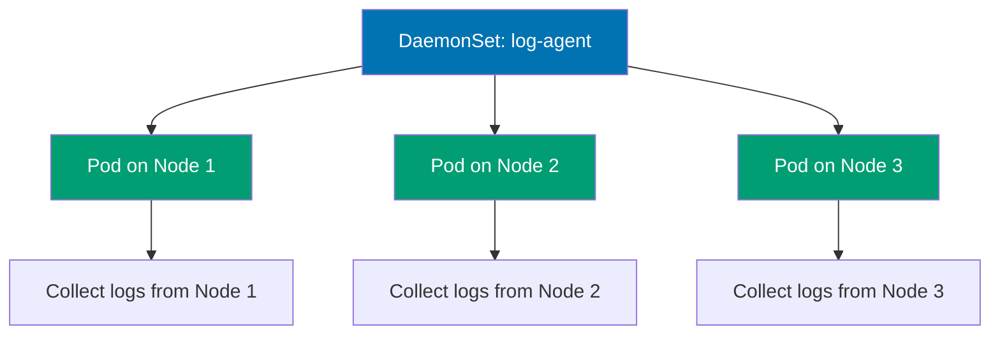

```yaml
apiVersion: apps/v1
kind: DaemonSet
metadata:
  name: log-collector
  labels:
    app: log-collector
spec:
  selector:
    matchLabels:
      app: log-collector
  template:
    metadata:
      labels:
        app: log-collector
    spec:
      containers:
        - name: fluentd
          image: fluent/fluentd:v1.16 # => Log forwarding agent
          volumeMounts:
            - name: varlog # => Mounts node's /var/log
              mountPath: /var/log
              readOnly: true
            - name: varlibdockercontainers # => Mounts Docker container logs
              mountPath: /var/lib/docker/containers
              readOnly: true
          resources:
            limits:
              memory: 200Mi
            requests:
              cpu: 100m
              memory: 200Mi

      volumes:
        - name: varlog
          hostPath:
            path: /var/log # => Node's /var/log directory
        - name: varlibdockercontainers
          hostPath:
            path: /var/lib/docker/containers # => Node's container logs


# DaemonSet behavior:
# => Creates 1 Pod per node automatically
# => New node joins cluster → Pod created on new node
# => Node removed → Pod deleted
# => kubectl get daemonset shows: DESIRED=3, CURRENT=3, READY=3 (3 nodes)
```

**Key Takeaway**: Use DaemonSets for node-level services requiring presence on every node; DaemonSets automatically handle node additions/removals and support node selectors for subset deployment.

**Why It Matters**: DaemonSets ensure critical infrastructure services run on every node without manual deployment, essential for cluster-wide monitoring, logging, and networking. Datadog monitors millions of containers across thousands of Kubernetes clusters using DaemonSets—when new nodes join, monitoring agents deploy automatically within seconds, maintaining complete observability. This automation eliminates the systemd unit files and chef recipes required in traditional infrastructure where adding a new server meant manually installing monitoring agents, logging forwarders, and network plugins—Kubernetes handles this automatically through DaemonSets.

---

### Example 35: DaemonSet with Node Selector

DaemonSets can target specific nodes using nodeSelector or node affinity, enabling specialized Pods on GPU nodes, SSD-equipped nodes, or region-specific nodes.


```yaml
apiVersion: apps/v1
kind: DaemonSet
metadata:
  name: gpu-monitor
spec:
  selector:
    matchLabels:
      app: gpu-monitor
  template:
    metadata:
      labels:
        app: gpu-monitor
    spec:
      nodeSelector:
        accelerator:
          nvidia-gpu # => Only runs on nodes with this label
          # => kubectl label nodes node-1 accelerator=nvidia-gpu
      containers:
        - name: dcgm-exporter # => NVIDIA GPU monitoring
          image: nvidia/dcgm-exporter:3.1.3
          ports:
            - containerPort: 9400
          securityContext:
            privileged: true # => Required for GPU access


# DaemonSet with node selector:
# => Only creates Pods on nodes matching nodeSelector
# => 10 nodes total, 3 GPU nodes → DESIRED=3, CURRENT=3
# => New GPU node added → Pod created automatically
# => Node label removed → Pod deleted
```

**Key Takeaway**: Use nodeSelector or node affinity in DaemonSets to run specialized workloads only on appropriate nodes; label nodes based on hardware capabilities, regions, or roles for targeted DaemonSet deployment.

**Why It Matters**: Node-selective DaemonSets enable hardware-specific infrastructure services without cluttering nodes lacking required resources. Tesla runs GPU monitoring DaemonSets only on nodes with NVIDIA GPUs, collecting metrics for autonomous driving model training without wasting resources on CPU-only nodes. This selective deployment reduces monitoring overhead by 80% compared to running GPU collectors cluster-wide and enables heterogeneous cluster management where different node types run different infrastructure services based on hardware capabilities.

---

### Example 36: Kubernetes Job

Jobs run Pods to completion, suitable for batch processing, data migration, or one-time tasks. Unlike Deployments, Jobs terminate when tasks complete successfully and track completion status.

```yaml
apiVersion: batch/v1
kind: Job
metadata:
  name: data-migration
spec:
  completions:
    1 # => Number of successful completions required
    # => Job completes after 1 successful Pod
  parallelism:
    1 # => Number of Pods running in parallel
    # => parallelism=3 runs 3 Pods simultaneously
  backoffLimit:
    3 # => Maximum retries before marking Job failed
    # => Retries with exponential backoff
  template:
    metadata:
      labels:
        app: migration
    spec:
      restartPolicy:
        Never # => Never or OnFailure (not Always)
        # => Always invalid for Jobs
      containers:
        - name: migrator
          image: busybox:1.36
          command:
            - sh
            - -c
            - |
              echo "Starting data migration..."
              sleep 10
              echo "Migration completed successfully"
              exit 0                      # => Exit 0 signals success
                                          # => Exit 1+ triggers retry (up to backoffLimit)

# Job lifecycle:
# => Pod created and runs to completion
# => Exit 0 → Job marked Complete
# => Exit 1+ → Pod recreated (up to backoffLimit retries)
# => After 3 failures → Job marked Failed
# => kubectl get jobs shows: COMPLETIONS=1/1, DURATION=15s
# => kubectl delete job data-migration  # Cleanup
```

**Key Takeaway**: Use Jobs for one-time or periodic batch tasks; set appropriate completions, parallelism, and backoffLimit based on workload requirements; Jobs do not support restartPolicy: Always.

**Why It Matters**: Kubernetes Jobs provide guaranteed execution for batch processing with automatic retry logic, eliminating custom failure handling code. Stripe processes nightly financial reconciliation using Jobs—if network issues cause failures, Jobs automatically retry up to backoffLimit, ensuring reports complete reliably. This declarative batch processing replaces brittle cron scripts that fail silently or require complex error handling, as Kubernetes tracks completion status and provides audit trails through Job history, critical for compliance in financial systems.

---

### Example 37: Parallel Jobs

Parallel Jobs run multiple Pods simultaneously to process distributed workloads like batch rendering, data processing, or parallel computations. Configure completions and parallelism to control total work items and concurrency.

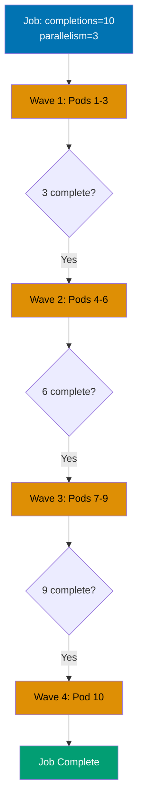

```yaml
apiVersion: batch/v1
kind: Job
metadata:
  name: parallel-processing
spec:
  completions: 10 # => Total successful Pods required: 10
  parallelism:
    3 # => Run 3 Pods in parallel
    # => Creates Pods in batches: 3, then 3, then 3, then 1
  template:
    spec:
      restartPolicy:
        OnFailure # => Retry failed Pods within same Pod object
        # => Never creates new Pod for each retry
      containers:
        - name: worker
          image: busybox:1.36
          command:
            - sh
            - -c
            - |
              TASK_ID=$((RANDOM % 1000))
              echo "Processing task $TASK_ID"
              sleep $((5 + RANDOM % 10))
              echo "Task $TASK_ID completed"

# Parallel execution:
# => Pods 1,2,3 start immediately (parallelism=3)
# => Pod 1 completes → Pod 4 starts (maintains parallelism)
# => Pod 2 completes → Pod 5 starts
# => Continues until 10 successful completions
# => kubectl get pods shows 3 Running, 7 remaining
# => kubectl get jobs shows: COMPLETIONS=7/10 (7 completed, 3 running)
```

**Key Takeaway**: Use parallel Jobs for distributed batch processing; adjust parallelism based on cluster capacity and completions based on total work items; consider work queue pattern for dynamic task distribution.

**Why It Matters**: Parallel Jobs enable massive-scale batch processing by distributing work across multiple Pods simultaneously. Pinterest generates thumbnail images for millions of uploaded photos using parallel Jobs with parallelism=100—image processing that would take 50 hours sequentially completes in 30 minutes. This horizontal parallelism is transformational for data pipelines and ML training workloads, as Kubernetes automatically schedules work across available nodes and handles failures, eliminating the custom job schedulers and worker pool management required in traditional batch processing systems.

---

### Example 38: CronJob for Scheduled Tasks

CronJobs create Jobs on a schedule using cron syntax, suitable for periodic backups, reports, or cleanup tasks. CronJobs maintain job history and support concurrency policies for overlapping executions.

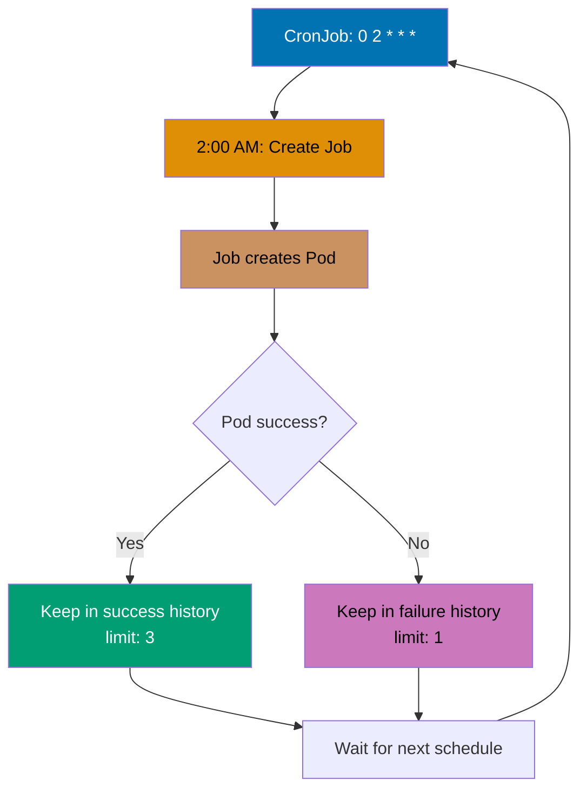

```yaml
apiVersion: batch/v1
kind: CronJob
metadata:
  name: backup-job
spec:
  schedule:
    "0 2 * * *" # => Cron syntax: minute hour day month weekday
    # => "0 2 * * *" = 2:00 AM daily
    # => "*/5 * * * *" = every 5 minutes
    # => "0 */2 * * *" = every 2 hours
  concurrencyPolicy:
    Forbid # => Prevents concurrent Job runs
    # => Allow: permits concurrent executions
    # => Replace: cancels current and starts new
  successfulJobsHistoryLimit: 3 # => Keeps 3 successful Jobs
  failedJobsHistoryLimit: 1 # => Keeps 1 failed Job
  jobTemplate:
    spec:
      template:
        spec:
          restartPolicy: OnFailure
          containers:
            - name: backup
              image: busybox:1.36
              command:
                - sh
                - -c
                - |
                  echo "Starting backup at $(date)"
                  # Backup logic here
                  sleep 30
                  echo "Backup completed at $(date)"

# CronJob behavior:
# => Creates Job at scheduled time
# => Job creates Pod to run backup
# => After successfulJobsHistoryLimit, old Jobs deleted
# => kubectl get cronjobs shows: SCHEDULE, SUSPEND, ACTIVE, LAST SCHEDULE
# => kubectl create job --from=cronjob/backup-job manual-backup  # Manual trigger
```

**Key Takeaway**: Use CronJobs for scheduled recurring tasks with appropriate concurrencyPolicy to handle overlapping executions; set history limits to prevent accumulation of completed Jobs.

**Why It Matters**: CronJobs replace unreliable server-based cron with cloud-native scheduled task execution that survives node failures. Reddit runs database backups via CronJobs every 6 hours—if the node running cron daemon crashes, Kubernetes reschedules the CronJob on healthy nodes automatically. This reliability is impossible with traditional cron where losing the cron server means losing all scheduled tasks until manual recovery. CronJobs also provide execution history and failure tracking through kubectl, eliminating the log-scraping required to debug failed cron scripts on servers.

---

## Ingress Controllers (Examples 39-43)

### Example 39: Basic Ingress

Ingress manages external HTTP/HTTPS access to Services, providing host-based and path-based routing. Ingress requires an Ingress Controller (nginx, Traefik, HAProxy) to function.

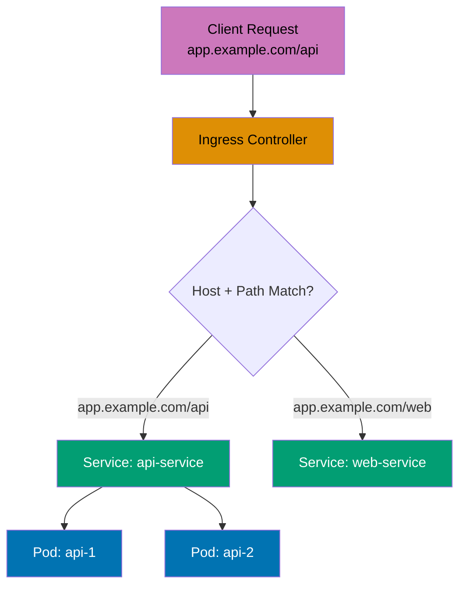

```yaml
# First, install Ingress Controller (nginx example):
# => kubectl apply -f https://raw.githubusercontent.com/kubernetes/ingress-nginx/controller-v1.8.1/deploy/static/provider/cloud/deploy.yaml

apiVersion: networking.k8s.io/v1
kind: Ingress
metadata:
  name: app-ingress
  annotations:
    nginx.ingress.kubernetes.io/rewrite-target:
      /
      # => Rewrites /api/users → /users before forwarding
spec:
  ingressClassName:
    nginx # => Uses nginx Ingress Controller
    # => Required in Kubernetes 1.18+
  rules:
    - host:
        app.example.com # => Host-based routing
        # => Matches Host header in requests
      http:
        paths:
          - path: /api # => Path-based routing
            pathType:
              Prefix # => Matches /api, /api/, /api/users
              # => Exact: exact match only
              # => ImplementationSpecific: controller-dependent
            backend:
              service:
                name: api-service # => Routes to api-service
                port:
                  number: 80
          - path: /web
            pathType: Prefix
            backend:
              service:
                name: web-service # => Routes to web-service
                port:
                  number: 80

# Access patterns:
# => http://app.example.com/api/users → api-service
# => http://app.example.com/web/home → web-service
# => http://other.example.com/api → no match (404)
```

**Key Takeaway**: Ingress provides cost-effective HTTP/HTTPS routing compared to multiple LoadBalancer Services; install an Ingress Controller first, then create Ingress resources for routing rules.

**Why It Matters**: Ingress Controllers consolidate HTTP/HTTPS traffic through a single load balancer entry point, dramatically reducing cloud infrastructure costs. Zalando reduced monthly AWS costs by $18,000 by replacing 50 LoadBalancer Services ($360 each) with one Ingress Controller managing path-based routing to all backend services. This consolidation also simplifies DNS management (one wildcard DNS entry vs. 50 separate records), TLS certificate management (one cert for \*.example.com vs. 50 individual certs), and firewall rules, making Ingress the de facto standard for exposing HTTP services in production Kubernetes clusters.

---

### Example 40: Ingress with TLS

Ingress supports TLS termination using Secrets containing certificates and private keys. The Ingress Controller handles HTTPS decryption and forwards unencrypted traffic to backend Services.

```yaml
# Create TLS Secret:
# => kubectl create secret tls tls-secret --cert=tls.crt --key=tls.key

apiVersion: networking.k8s.io/v1
kind: Ingress
metadata:
  name: tls-ingress
spec:
  ingressClassName: nginx
  tls:
    - hosts:
        - secure.example.com # => TLS applies to this host
      secretName:
        tls-secret # => References TLS Secret
        # => Secret must exist in same namespace
        # => Contains tls.crt and tls.key
  rules:
    - host: secure.example.com
      http:
        paths:
          - path: /
            pathType: Prefix
            backend:
              service:
                name: web-service
                port:
                  number: 80

# TLS behavior:
# => https://secure.example.com → TLS termination at Ingress Controller
# => Ingress Controller → web-service over HTTP (cluster-internal)
# => http://secure.example.com → redirected to HTTPS (nginx default)
# => Certificate validation required for production
```

**Key Takeaway**: Use TLS Ingress for production HTTPS; obtain certificates from Let's Encrypt via cert-manager for automated certificate management and renewal; TLS terminates at Ingress Controller, not backend Services.

**Why It Matters**: TLS termination at Ingress Controllers centralizes HTTPS certificate management, eliminating the need to configure SSL in every backend service. Medium handles HTTPS for hundreds of microservices through Ingress TLS—one cert-manager installation automatically provisions and renews Let's Encrypt certificates for all domains, while backend services run plain HTTP. This architecture reduces operational complexity by 90% compared to managing certificates individually per service, prevents certificate expiration incidents through automated renewal, and enables easy TLS policy updates (minimum TLS version, cipher suites) cluster-wide without touching application code.

---

### Example 41: Ingress with Multiple Hosts

Ingress supports multiple hosts in a single resource, enabling consolidated routing configuration. Each host can have independent path-based routing rules.

```yaml
apiVersion: networking.k8s.io/v1
kind: Ingress
metadata:
  name: multi-host-ingress
spec:
  ingressClassName: nginx
  rules:
    - host: api.example.com # => First host
      http:
        paths:
          - path: /
            pathType: Prefix
            backend:
              service:
                name: api-service
                port:
                  number: 80

    - host: admin.example.com # => Second host
      http:
        paths:
          - path: /
            pathType: Prefix
            backend:
              service:
                name: admin-service
                port:
                  number: 80

    - host: static.example.com # => Third host
      http:
        paths:
          - path: /
            pathType: Prefix
            backend:
              service:
                name: static-service
                port:
                  number: 80

# Multi-host routing:
# => http://api.example.com → api-service
# => http://admin.example.com → admin-service
# => http://static.example.com → static-service
# => All hosts use same Ingress Controller IP
# => Configure DNS to point all hosts to Ingress Controller
```

**Key Takeaway**: Consolidate multiple host-based routes in a single Ingress resource for easier management; each host can have independent backend Services and path rules.

**Why It Matters**: Multi-host Ingress resources simplify routing configuration for organizations running multiple domains on Kubernetes. Atlassian manages api.atlassian.com, admin.atlassian.com, and cdn.atlassian.com through consolidated Ingress resources—reducing configuration from hundreds of separate Ingress objects to dozens of grouped resources. This consolidation improves maintainability through logical grouping (all payment-related domains in one Ingress), reduces Ingress Controller resource consumption (fewer watch operations), and makes routing changes auditable as a single git commit modifies all related routes instead of scattered updates across multiple files.

---

### Example 42: Ingress with Custom Annotations

Ingress Controllers support custom annotations for advanced features like rate limiting, authentication, CORS, and custom headers. Annotations are controller-specific (nginx, Traefik, etc.).

```yaml
apiVersion: networking.k8s.io/v1
kind: Ingress
metadata:
  name: annotated-ingress
  annotations:
    nginx.ingress.kubernetes.io/rewrite-target:
      /$2
      # => URL rewriting with capture groups
    nginx.ingress.kubernetes.io/ssl-redirect:
      "true"
      # => Force HTTPS redirect
    nginx.ingress.kubernetes.io/rate-limit:
      "100"
      # => 100 requests per second per IP
    nginx.ingress.kubernetes.io/enable-cors:
      "true"
      # => Enable CORS headers
    nginx.ingress.kubernetes.io/cors-allow-origin:
      "https://example.com"
      # => Allowed CORS origin
    nginx.ingress.kubernetes.io/auth-type:
      basic
      # => Basic authentication
    nginx.ingress.kubernetes.io/auth-secret:
      basic-auth
      # => References Secret with credentials
spec:
  ingressClassName: nginx
  rules:
    - host: protected.example.com
      http:
        paths:
          - path: /api(/|$)(.*) # => Capture group for rewrite
            pathType: ImplementationSpecific
            backend:
              service:
                name: api-service
                port:
                  number: 80

# Annotation effects:
# => Request: /api/users → rewritten to /users
# => HTTP request → 308 redirect to HTTPS
# => >100 req/sec → 503 Service Temporarily Unavailable
# => Missing auth → 401 Unauthorized
```

**Key Takeaway**: Leverage Ingress Controller annotations for advanced HTTP features; consult controller documentation for available annotations as they vary between nginx, Traefik, and other controllers.

**Why It Matters**: Ingress annotations enable sophisticated traffic management without deploying dedicated API gateway infrastructure. Cloudflare uses nginx Ingress annotations for rate limiting, request transformation, and authentication—features that would otherwise require additional proxy layers (Envoy, Kong) increasing complexity and latency. This consolidation reduces median request latency by 15-20ms (one fewer proxy hop) while providing enterprise features like A/B testing headers, geographic routing, and DDoS protection declaratively through annotations, making Ingress Controllers powerful enough to replace separate API gateway products.

---

### Example 43: Ingress with Default Backend

Default backend serves requests that don't match any Ingress rules, useful for custom 404 pages or catch-all routing. Configure default backend at Ingress Controller or per-Ingress resource level.

```yaml
apiVersion: networking.k8s.io/v1
kind: Ingress
metadata:
  name: default-backend-ingress
spec:
  ingressClassName: nginx
  defaultBackend:
    service:
      name: default-service # => Serves unmatched requests
      port:
        number: 80
  rules:
    - host: app.example.com
      http:
        paths:
          - path: /api
            pathType: Prefix
            backend:
              service:
                name: api-service
                port:
                  number: 80

# Default backend routing:
# => http://app.example.com/api → api-service (matches rule)
# => http://app.example.com/other → default-service (no match)
# => http://unknown.example.com → default-service (host no match)
# => Useful for custom 404 pages or redirect to main site
```

**Key Takeaway**: Configure default backend for better user experience on unmatched requests; implement custom 404 pages or redirects instead of generic Ingress Controller errors.

**Why It Matters**: Default backends provide graceful handling for misconfigured DNS, typo'd URLs, or removed services, maintaining professional user experience. Shopify's custom 404 backend prevents users seeing generic nginx error pages, instead redirecting to helpful troubleshooting pages or search—reducing customer support tickets by 30% for "website broken" complaints. This small configuration detail significantly impacts brand perception, as generic HTTP 404 errors signal technical incompetence while custom error pages demonstrate attention to user experience and reliability.

---

## Persistent Volumes (Examples 44-48)

### Example 44: PersistentVolume and PersistentVolumeClaim

PersistentVolumes (PV) represent cluster storage resources while PersistentVolumeClaims (PVC) are storage requests by users. PVCs bind to PVs matching capacity and access mode requirements.

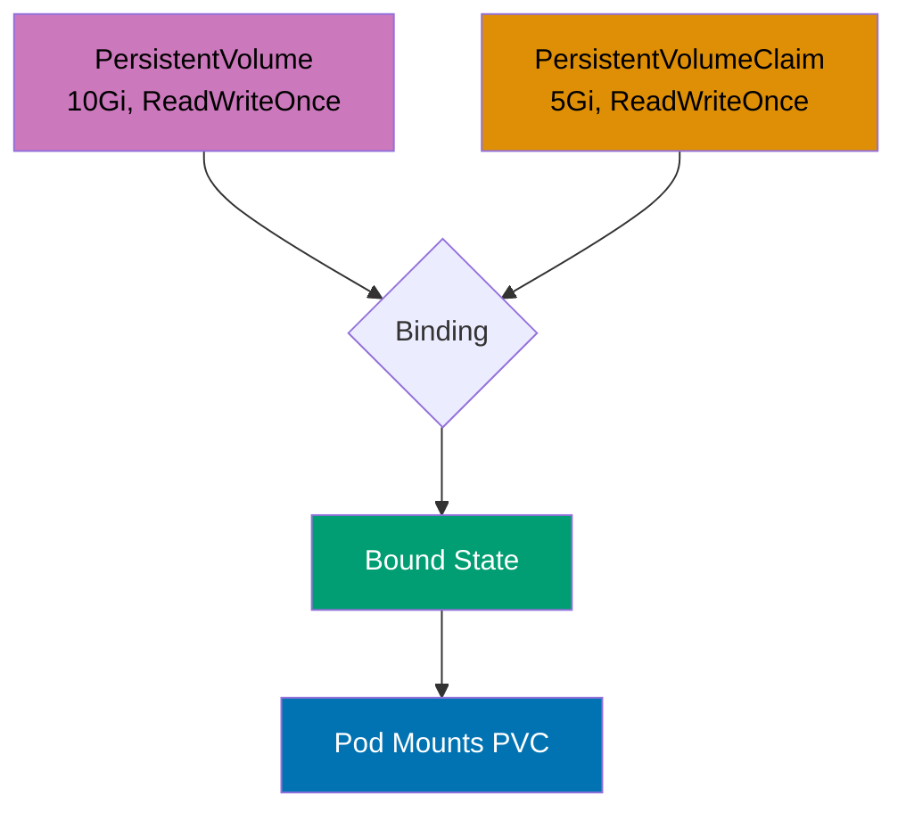

```yaml
apiVersion: v1
kind: PersistentVolume
metadata:
  name: pv-example # => PV name (cluster-wide resource)
spec:
  capacity:
    storage: 10Gi # => Total storage capacity
  accessModes:
    - ReadWriteOnce # => Single node read-write
      # => ReadOnlyMany: multiple nodes read-only
      # => ReadWriteMany: multiple nodes read-write
  persistentVolumeReclaimPolicy:
    Retain
    # => Retain: manual reclamation after PVC deletion
    # => Delete: auto-delete storage (cloud volumes)
    # => Recycle: deprecated (use Delete)
  storageClassName: manual # => Storage class name for binding
  hostPath: # => Host path volume (testing only)
    path: /mnt/data
    type: DirectoryOrCreate

---
apiVersion: v1
kind: PersistentVolumeClaim
metadata:
  name: pvc-example # => PVC name (namespace resource)
spec:
  accessModes:
    - ReadWriteOnce # => Must match PV access mode
  resources:
    requests:
      storage: 5Gi # => Requests 5 GiB (PV has 10 GiB)
  storageClassName: manual # => Binds to PV with same storage class

---
apiVersion: v1
kind: Pod
metadata:
  name: pv-pod
spec:
  containers:
    - name: app
      image: nginx:1.24
      volumeMounts:
        - name: storage
          mountPath: /usr/share/nginx/html
  volumes:
    - name: storage
      persistentVolumeClaim:
        claimName: pvc-example # => References PVC


# PV/PVC lifecycle:
# => kubectl get pv → shows PV status (Available → Bound)
# => kubectl get pvc → shows PVC status (Pending → Bound)
# => PVC binds to PV with matching capacity, access mode, and storage class
# => Pod mounts PVC, data persists across Pod restarts
```

**Key Takeaway**: Use PV/PVC for persistent storage across Pod restarts; cloud providers offer dynamic provisioning via StorageClasses, eliminating manual PV creation for production use.

**Why It Matters**: Persistent Volumes decouple storage from Pod lifecycle, enabling stateful applications to survive Pod restarts and rescheduling across nodes. GitLab stores repository data in PVs—when Pods restart for updates or failure recovery, they reconnect to the same PersistentVolume, maintaining data continuity. Without PVs, container storage is ephemeral (lost on restart), forcing databases to run on dedicated servers outside Kubernetes. Dynamic provisioning through cloud provider integrations (AWS EBS, GCP PD) automates storage allocation, reducing storage setup from manual ticket-driven processes taking days to automatic provisioning in seconds.

---

### Example 45: StorageClass and Dynamic Provisioning

StorageClasses enable dynamic PersistentVolume provisioning, automatically creating storage when PVCs are created. Cloud providers offer default StorageClasses for seamless dynamic provisioning.

```yaml
apiVersion: storage.k8s.io/v1
kind: StorageClass
metadata:
  name: fast-storage # => StorageClass name
provisioner:
  kubernetes.io/aws-ebs # => Cloud provider provisioner
  # => kubernetes.io/gce-pd (GCP)
  # => kubernetes.io/azure-disk (Azure)
parameters:
  type:
    gp3 # => AWS EBS type: gp3 (SSD)
    # => gp2, io1, io2, sc1, st1
  iops: "3000" # => Provisioned IOPS
  throughput: "125" # => Throughput in MiB/s
  encrypted: "true" # => Encrypt volume
reclaimPolicy:
  Delete # => Delete PV when PVC deleted
  # => Retain: keep PV after PVC deletion
volumeBindingMode:
  WaitForFirstConsumer
  # => Delay PV binding until Pod scheduled
  # => Ensures PV created in same zone as Pod
  # => Immediate: bind PV immediately
allowVolumeExpansion:
  true # => Allow PVC size increase
  # => Resize PVC without recreating

---
apiVersion: v1
kind: PersistentVolumeClaim
metadata:
  name: dynamic-pvc
spec:
  accessModes:
    - ReadWriteOnce
  storageClassName:
    fast-storage # => References StorageClass
    # => Triggers dynamic provisioning
  resources:
    requests:
      storage: 20Gi # => Requests 20 GiB


# Dynamic provisioning:
# => PVC created → StorageClass provisions new PV automatically
# => No manual PV creation needed
# => PV deleted automatically when PVC deleted (reclaimPolicy: Delete)
# => kubectl get pv → shows auto-created PV
```

**Key Takeaway**: Use StorageClasses for production storage with dynamic provisioning; configure WaitForFirstConsumer for multi-zone clusters to ensure PV and Pod are in the same availability zone.

**Why It Matters**: Dynamic provisioning through StorageClasses eliminates storage operations bottlenecks by allowing developers to request storage declaratively. Spotify enables engineers to provision PostgreSQL instances with persistent storage through self-service YAML—StorageClasses automatically create cloud volumes, attach to nodes, and mount to Pods within minutes without DBA intervention. WaitForFirstConsumer prevents cross-zone attachment failures (AWS EBS volumes can't attach to nodes in different zones), a gotcha that plagued early Kubernetes adopters with mysterious "volume attachment timeout" errors costing hours of debugging.

---

### Example 46: Volume Expansion

PersistentVolumeClaims support volume expansion when StorageClass allows it. Expand PVCs by updating the storage size; filesystem resize may require Pod restart depending on volume type.

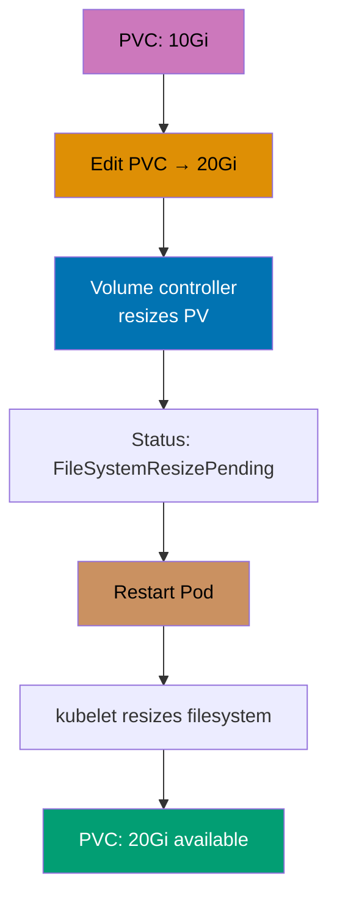

```yaml
apiVersion: v1
kind: PersistentVolumeClaim
metadata:
  name: expandable-pvc
spec:
  accessModes:
    - ReadWriteOnce
  storageClassName: fast-storage # => StorageClass must have allowVolumeExpansion: true
  resources:
    requests:
      storage: 10Gi # => Initial size: 10 GiB


# Expansion process:
# 1. Edit PVC to increase size
# => kubectl edit pvc expandable-pvc
# => Change storage: 10Gi → storage: 20Gi
# => Save and exit

# 2. Check expansion status
# => kubectl get pvc expandable-pvc
# => Conditions: FileSystemResizePending (Pod restart needed)

# 3. Restart Pod to complete expansion
# => kubectl delete pod <pod-using-pvc>
# => New Pod mounts expanded volume

# 4. Verify new size
# => kubectl exec <pod> -- df -h /mount/path
# => Shows 20G total

# Expansion behavior:
# => Volume controller resizes PV
# => kubelet resizes filesystem (may require Pod restart)
# => Cannot shrink volumes (decrease size)
# => Some volume types support online expansion (no Pod restart)
```

**Key Takeaway**: Volume expansion requires StorageClass with allowVolumeExpansion enabled; most volume types require Pod restart to complete filesystem resize; plan initial PVC sizes carefully as shrinking is not supported.

**Why It Matters**: Online volume expansion eliminates database downtime for storage increases, a critical operational capability. Slack expanded PostgreSQL PVCs from 500GB to 2TB without downtime by enabling volume expansion—the alternative (create new larger volume, pg_dump old, restore to new) requires hours of read-only mode or full downtime. This operational flexibility is transformational for growing databases, as storage exhaustion is a critical incident requiring immediate remediation, and traditional expansion through migration carries significant risk of data loss or extended outages.

---

### Example 47: Volume Snapshots

VolumeSnapshots create point-in-time copies of PersistentVolumes for backup, clone, or restore operations. Requires CSI (Container Storage Interface) driver support from storage provider.

```yaml
apiVersion: snapshot.storage.k8s.io/v1
kind: VolumeSnapshotClass
metadata:
  name: csi-snapshot-class
driver:
  ebs.csi.aws.com # => CSI driver (AWS EBS example)
  # => pd.csi.storage.gke.io (GCP)
  # => disk.csi.azure.com (Azure)
deletionPolicy:
  Delete # => Delete snapshot when VolumeSnapshot deleted
  # => Retain: keep snapshot

---
apiVersion: snapshot.storage.k8s.io/v1
kind: VolumeSnapshot
metadata:
  name: pvc-snapshot
spec:
  volumeSnapshotClassName: csi-snapshot-class
  source:
    persistentVolumeClaimName:
      data-pvc
      # => Source PVC to snapshot
      # => Creates snapshot of current state


# Snapshot lifecycle:
# => kubectl get volumesnapshot
# => Shows: READYTOUSE=true after snapshot completes
# => Snapshot stored in cloud provider storage
# => Independent of source PVC lifecycle

---
apiVersion: v1
kind: PersistentVolumeClaim
metadata:
  name: restored-pvc
spec:
  accessModes:
    - ReadWriteOnce
  storageClassName: fast-storage
  resources:
    requests:
      storage: 10Gi
  dataSource:
    kind: VolumeSnapshot # => Restore from snapshot
    name: pvc-snapshot # => References snapshot
    apiGroup: snapshot.storage.k8s.io

# Restore process:
# => PVC created from snapshot
# => Data restored from snapshot to new PV
# => Original PVC unaffected
```

**Key Takeaway**: Use VolumeSnapshots for backup and disaster recovery; requires CSI driver support; create snapshots before major changes for easy rollback; consider snapshot costs and retention policies.

**Why It Matters**: VolumeSnapshots provide crash-consistent backups for stateful workloads without application-level backup tooling. Robinhood snapshots production databases before schema migrations—if migrations fail or cause performance issues, they restore from snapshots in minutes rather than hours required for dump/restore. This rapid recovery capability encourages more frequent deployments and reduces migration risk, as teams know they can instantly rollback data-layer changes. CSI snapshot integration also enables cross-cluster disaster recovery by restoring snapshots to standby clusters in different regions.

---

### Example 48: Local Persistent Volumes

Local PersistentVolumes use node-local storage (SSDs, NVMe) for high-performance workloads requiring low latency. Pods using local volumes are bound to specific nodes.

```yaml
apiVersion: storage.k8s.io/v1
kind: StorageClass
metadata:
  name: local-storage
provisioner:
  kubernetes.io/no-provisioner
  # => No dynamic provisioning
  # => PVs must be created manually
volumeBindingMode:
  WaitForFirstConsumer
  # => Essential for local volumes
  # => Ensures Pod scheduled on node with PV

---
apiVersion: v1
kind: PersistentVolume
metadata:
  name: local-pv
spec:
  capacity:
    storage: 100Gi
  accessModes:
    - ReadWriteOnce # => Local volumes always ReadWriteOnce
  persistentVolumeReclaimPolicy: Retain
  storageClassName: local-storage
  local:
    path: /mnt/disks/ssd1 # => Path on node
  nodeAffinity: # => Required for local volumes
    required:
      nodeSelectorTerms:
        - matchExpressions:
            - key: kubernetes.io/hostname
              operator: In
              values:
                - node-1 # => PV available only on node-1

---
apiVersion: v1
kind: PersistentVolumeClaim
metadata:
  name: local-pvc
spec:
  accessModes:
    - ReadWriteOnce
  storageClassName: local-storage
  resources:
    requests:
      storage: 100Gi

# Local PV behavior:
# => Pod using local-pvc scheduled on node-1 (PV location)
# => No cross-node portability (Pod stuck on node-1)
# => Highest performance (local SSD/NVMe)
# => Risk: node failure means data loss (use replication)
```

**Key Takeaway**: Use local PersistentVolumes for latency-sensitive workloads like databases; understand trade-off between performance and availability; implement application-level replication for fault tolerance.

**Why It Matters**: Local PVs deliver NVMe SSD performance (sub-millisecond latency, 100K+ IOPS) impossible with network-attached storage, critical for database and cache workloads. Pinterest runs Cassandra on local NVMe storage achieving 10x better read latency (0.3ms vs 3ms) compared to network EBS volumes—this performance difference makes the user experience gap between instant page loads and noticeable lag. The trade-off is node affinity (Pods can't migrate between nodes), requiring application-level replication (Cassandra, MongoDB replica sets) for high availability, but this is acceptable for databases already designed for distributed operation.

---

## Resource Limits (Examples 49-53)

### Example 49: QoS Classes

Kubernetes assigns Quality of Service (QoS) classes based on resource requests and limits, affecting eviction priority during resource pressure. Guaranteed (highest priority), Burstable (medium), BestEffort (lowest).

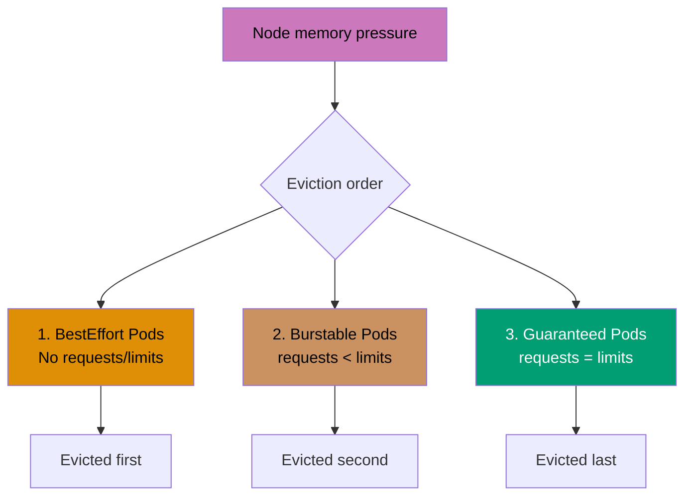

```yaml
# Guaranteed QoS (highest priority, last to be evicted)
apiVersion: v1
kind: Pod
metadata:
  name: guaranteed-pod
spec:
  containers:
    - name: app
      image: nginx:1.24
      resources:
        requests:
          cpu: 500m # => requests.cpu = limits.cpu
          memory: 512Mi # => requests.memory = limits.memory
        limits:
          cpu: 500m # => Must be equal for Guaranteed QoS
          memory: 512Mi

---
# Burstable QoS (medium priority)
apiVersion: v1
kind: Pod
metadata:
  name: burstable-pod
spec:
  containers:
    - name: app
      image: nginx:1.24
      resources:
        requests:
          cpu: 250m # => requests < limits
          memory: 256Mi
        limits:
          cpu: 500m # => Can burst up to limits
          memory: 512Mi # => Evicted before Guaranteed, after BestEffort

---
# BestEffort QoS (lowest priority, first to be evicted)
apiVersion: v1
kind: Pod
metadata:
  name: besteffort-pod
spec:
  containers:
    - name: app
      image:
        nginx:1.24 # => No requests or limits specified
        # => Gets no resource guarantees
        # => First evicted during resource pressure

# QoS behavior during resource pressure:
# => Node runs low on memory
# => 1. BestEffort Pods evicted first
# => 2. Burstable Pods evicted (using most memory relative to requests)
# => 3. Guaranteed Pods evicted last (only if critical system processes need resources)
```

**Key Takeaway**: Set requests equal to limits for Guaranteed QoS on critical workloads; use Burstable for applications with variable load; avoid BestEffort in production except for truly optional workloads.

**Why It Matters**: QoS classes determine eviction order during resource pressure, critical for maintaining service reliability. When Netflix experiences node memory pressure, BestEffort Pods (batch analytics jobs) are evicted first, protecting Guaranteed Pods running streaming services—ensuring video playback continues for millions of viewers while sacrificing non-critical workloads. This prioritization prevents the "everything fails together" scenario common in traditional infrastructure where resource exhaustion crashes all services indiscriminately. Strategic QoS classification enables graceful degradation under load, preserving critical user-facing services.

---

### Example 50: Pod Priority and Preemption

PriorityClasses assign priority values to Pods, enabling preemption where higher-priority Pods can evict lower-priority Pods when cluster resources are scarce.

```yaml
apiVersion: scheduling.k8s.io/v1
kind: PriorityClass
metadata:
  name: high-priority # => PriorityClass name
value:
  1000000 # => Priority value (higher = more important)
  # => System priorities: 2000000000+ (reserved)
globalDefault:
  false # => Not default priority
  # => Set true for one PriorityClass
description: "High priority for critical services"

---
apiVersion: scheduling.k8s.io/v1
kind: PriorityClass
metadata:
  name: low-priority
value: 100 # => Lower priority value
globalDefault: false
description: "Low priority for batch jobs"

---
apiVersion: v1
kind: Pod
metadata:
  name: critical-pod
spec:
  priorityClassName: high-priority # => Uses high-priority PriorityClass
  containers:
    - name: nginx
      image: nginx:1.24

# Preemption behavior:
# => Cluster has no capacity
# => critical-pod (priority 1000000) needs scheduling
# => Scheduler evicts low-priority Pods to make room
# => critical-pod scheduled on freed resources
# => Evicted Pods: status=Failed, reason=Preempted
# => kubectl describe pod shows: Status: Failed, Reason: Preempted
```

**Key Takeaway**: Use PriorityClasses to ensure critical workloads schedule before less important ones; preemption allows cluster to prioritize essential services during resource contention; avoid too many priority levels for simplicity.

**Why It Matters**: Pod preemption enables oversubscription strategies where clusters run at 80-90% utilization by scheduling low-priority batch work that yields to critical services. Uber runs batch ETL jobs (low priority) filling spare capacity—when ride-hailing demand spikes require more user-facing Pods (high priority), Kubernetes preempts batch jobs to free resources instantly. This capacity optimization reduces infrastructure costs by 40% compared to maintaining headroom for peak traffic, as low-priority workloads utilize otherwise idle resources while automatically yielding when needed.

---

### Example 51: Horizontal Pod Autoscaler

HorizontalPodAutoscaler (HPA) automatically scales Deployment/ReplicaSet replicas based on CPU utilization or custom metrics. Requires metrics-server for CPU/memory metrics.

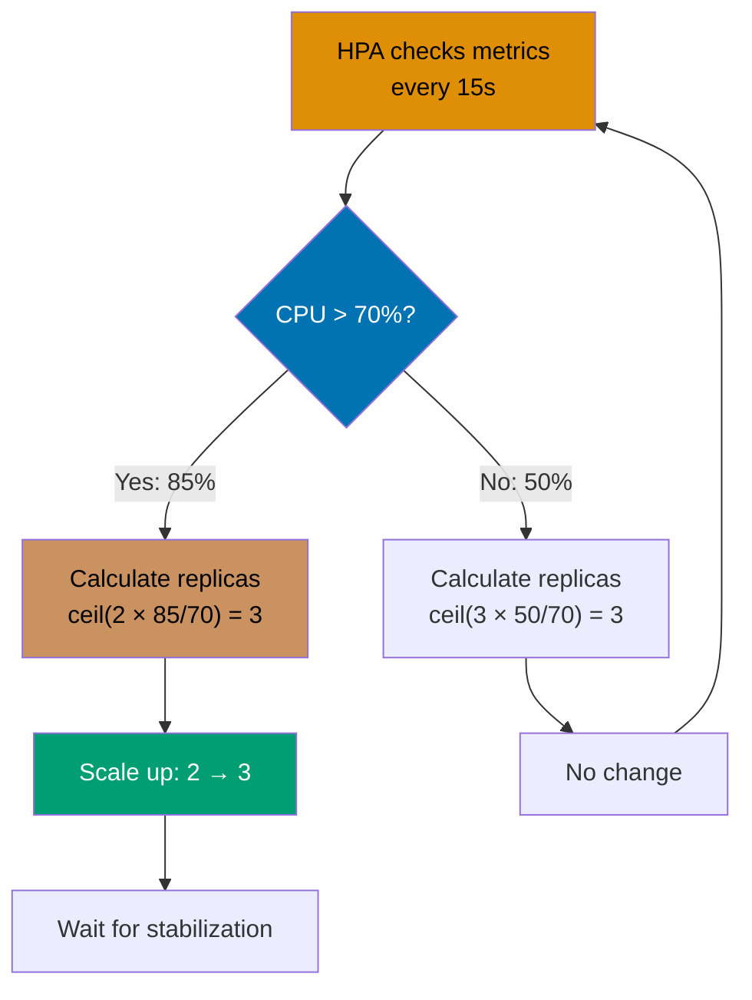

```yaml
# Install metrics-server first:
# => kubectl apply -f https://github.com/kubernetes-sigs/metrics-server/releases/latest/download/components.yaml

apiVersion: autoscaling/v2
kind: HorizontalPodAutoscaler
metadata:
  name: web-hpa
spec:
  scaleTargetRef:
    apiVersion: apps/v1
    kind: Deployment
    name: web-app # => Target Deployment to scale
  minReplicas: 2 # => Minimum replicas (never scale below)
  maxReplicas: 10 # => Maximum replicas (never scale above)
  metrics:
    - type: Resource
      resource:
        name: cpu
        target:
          type: Utilization
          averageUtilization:
            70 # => Target 70% average CPU utilization
            # => Above 70% → scale up
            # => Below 70% → scale down

# HPA behavior:
# => Checks metrics every 15 seconds (default)
# => Current CPU: 85% (above 70% target)
# => Calculates: desiredReplicas = ceil(currentReplicas * currentMetric / targetMetric)
# => Example: ceil(2 * 85 / 70) = ceil(2.43) = 3 replicas
# => Gradually scales up to avoid flapping
# => kubectl get hpa shows: TARGETS=85%/70%, REPLICAS=3
```

**Key Takeaway**: Use HPA for automatic scaling based on demand; set appropriate min/max replicas to prevent over-scaling costs or under-scaling unavailability; requires resource requests for CPU metrics.

**Why It Matters**: HorizontalPodAutoscaler provides automated elasticity, scaling applications in response to load without human intervention. Discord handles traffic spikes during major gaming events through HPA—when concurrent users jump from 50K to 500K, HPA scales chat services from 10 to 100 Pods within minutes, maintaining sub-second message latency. After the event, HPA scales down automatically, reducing costs. This automation replaces on-call engineers manually scaling services during traffic surges, eliminating human reaction latency (minutes to hours) with automated response (seconds to minutes).

---

### Example 52: Vertical Pod Autoscaler

VerticalPodAutoscaler (VPA) automatically adjusts Pod resource requests and limits based on actual usage, optimizing resource allocation. VPA can operate in recommendation-only or auto-update mode.

```yaml
# Install VPA:
# => git clone https://github.com/kubernetes/autoscaler.git
# => cd autoscaler/vertical-pod-autoscaler
# => ./hack/vpa-up.sh

apiVersion: autoscaling.k8s.io/v1
kind: VerticalPodAutoscaler
metadata:
  name: web-vpa
spec:
  targetRef:
    apiVersion: apps/v1
    kind: Deployment
    name: web-app # => Target Deployment
  updatePolicy:
    updateMode:
      Auto # => Auto: apply recommendations (restart Pods)
      # => Recreate: same as Auto
      # => Initial: only set on Pod creation
      # => Off: recommendations only, no updates
  resourcePolicy:
    containerPolicies:
      - containerName: "*" # => Applies to all containers
        minAllowed:
          cpu: 100m # => Minimum CPU request
          memory: 128Mi # => Minimum memory request
        maxAllowed:
          cpu: 2000m # => Maximum CPU request
          memory: 2Gi # => Maximum memory request
        controlledResources:
          - cpu
          - memory

# VPA behavior:
# => Monitors actual resource usage
# => Recommends new requests/limits
# => Auto mode: updates Pods with new resources (triggers restart)
# => kubectl get vpa web-vpa shows recommendations
# => kubectl describe vpa web-vpa shows: RECOMMENDATION, LOWER BOUND, UPPER BOUND
```

**Key Takeaway**: Use VPA to right-size resource requests automatically; prefer HPA for horizontal scaling, VPA for vertical sizing; avoid using HPA and VPA on CPU/memory simultaneously to prevent conflicts.

**Why It Matters**: VerticalPodAutoscaler eliminates resource request guesswork by analyzing actual usage and recommending optimal values. Shopify reduced infrastructure costs by 25% using VPA—many services were over-provisioned with 2GB memory requests while using only 500MB, wasting cluster capacity. VPA identified these inefficiencies and automatically right-sized requests, packing more Pods per node. This continuous optimization handles workload changes over time (memory usage creeping up post-feature launches), maintaining efficiency without manual capacity planning that becomes outdated within weeks.

---

### Example 53: Pod Disruption Budget

PodDisruptionBudgets (PDB) limit voluntary disruptions (node drains, upgrades) to ensure minimum availability during maintenance. PDBs prevent kubectl drain from evicting too many Pods simultaneously.

```yaml
apiVersion: policy/v1
kind: PodDisruptionBudget
metadata:
  name: web-pdb
spec:
  minAvailable:
    2 # => Minimum available Pods during disruption
    # => Alternative: maxUnavailable: 1
  selector:
    matchLabels:
      app: web # => Applies to Pods with app=web label


# PDB behavior:
# => Deployment has 4 replicas
# => kubectl drain node-1 (3 Pods on node-1)
# => PDB allows eviction of 2 Pods only (keeps minAvailable=2)
# => Drain operation waits for evicted Pods to reschedule
# => After new Pods ready, drain continues
# => Prevents complete service unavailability during maintenance

---
# Alternative: maxUnavailable
apiVersion: policy/v1
kind: PodDisruptionBudget
metadata:
  name: api-pdb
spec:
  maxUnavailable:
    1 # => Maximum unavailable Pods
    # => More flexible than minAvailable
  selector:
    matchLabels:
      app: api

# maxUnavailable vs minAvailable:
# => maxUnavailable: "at most N Pods down"
# => minAvailable: "at least N Pods up"
# => Use maxUnavailable for percentage-based limits: maxUnavailable: 25%
```

**Key Takeaway**: Use PodDisruptionBudgets to maintain availability during voluntary disruptions like node maintenance; set minAvailable or maxUnavailable based on application requirements; PDBs do not prevent involuntary disruptions like node failures.

**Why It Matters**: PodDisruptionBudgets enable zero-downtime cluster maintenance by preventing kubectl drain from evicting too many Pods simultaneously. LinkedIn performs rolling node upgrades across 10,000+ nodes monthly using PDBs—ensuring at least 80% of each service remains available during node rotations. Without PDBs, draining nodes could evict entire services causing outages. This controlled disruption enables continuous cluster upgrades (security patches, Kubernetes version updates) without service interruptions, transforming maintenance from scheduled downtime windows to continuous operations.

---

## Health Checks (Examples 54-57)

### Example 54: Readiness Probe

Readiness probes determine when Pods are ready to receive traffic. Failed readiness checks remove Pods from Service endpoints without restarting them, useful during startup or temporary unavailability.

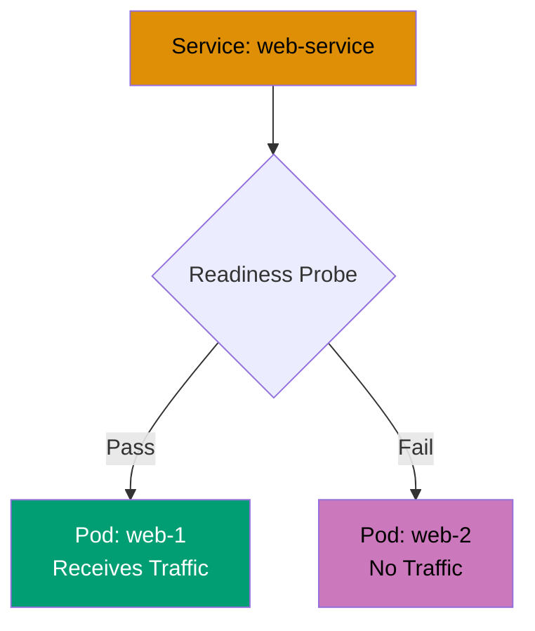

```yaml
apiVersion: v1
kind: Pod
metadata:
  name: readiness-pod
  labels:
    app: web
spec:
  containers:
    - name: nginx
      image: nginx:1.24
      ports:
        - containerPort: 80
      readinessProbe: # => Checks if Pod ready for traffic
        httpGet:
          path: /ready # => Endpoint returning 200 when ready
          port: 80
        initialDelaySeconds: 5 # => Wait 5s after start before first probe
        periodSeconds: 5 # => Probe every 5 seconds
        successThreshold: 1 # => 1 success → mark Ready
        failureThreshold:
          3 # => 3 failures → mark NotReady
          # => Pod removed from Service endpoints

# Readiness vs Liveness:
# => Readiness failure → removes from Service, no restart
# => Liveness failure → restarts container
# => Use readiness for temporary unavailability (loading data, dependencies down)
# => kubectl get pods shows: READY=0/1 (readiness failed)
# => kubectl describe pod shows: Readiness probe failed
```

**Key Takeaway**: Use readiness probes to prevent traffic to Pods that are starting up or temporarily unavailable; failed readiness checks remove Pods from load balancing without restarting them.

**Why It Matters**: Readiness probes prevent traffic routing to Pods not yet ready to serve requests, eliminating the "502 Bad Gateway" errors during deployments. Twitch uses readiness probes to ensure new streaming service Pods complete cache warm-up (loading popular stream metadata) before receiving traffic—preventing slow responses or cache stampedes. This graceful traffic transition maintains quality of service during rolling updates, as users never encounter half-initialized Pods, unlike traditional load balancers that route traffic immediately after container startup, causing request failures during warm-up periods.

---

### Example 55: Startup Probe

Startup probes give slow-starting containers extra time to initialize before liveness probes begin. This prevents premature restart of applications with long initialization (legacy apps, large datasets).

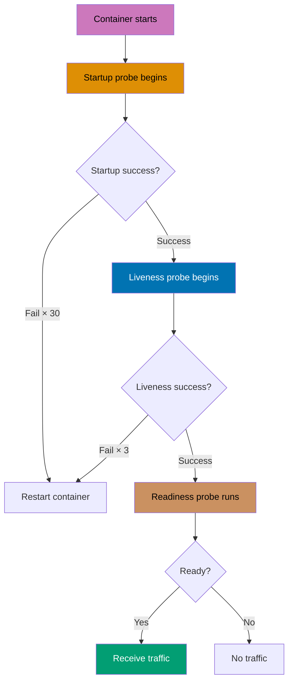

```yaml
apiVersion: v1
kind: Pod
metadata:
  name: startup-pod
spec:
  containers:
    - name: slow-app
      image: slow-starting-app:1.0
      ports:
        - containerPort: 8080
      startupProbe: # => Checks if application started
        httpGet:
          path: /startup
          port: 8080
        initialDelaySeconds: 10
        periodSeconds: 10 # => Check every 10 seconds
        failureThreshold:
          30 # => Allow 30 failures = 300 seconds (5 min)
          # => After 5 min → kubelet restarts container

      livenessProbe: # => Begins after startup probe succeeds
        httpGet:
          path: /healthz
          port: 8080
        periodSeconds: 5 # => Frequent checks after startup
        failureThreshold: 3 # => Restart after 15 seconds of failure


# Probe sequence:
# 1. Container starts
# 2. Startup probe checks every 10s (up to 5 min)
# 3. First startup probe success → startup complete
# 4. Liveness probe begins checking every 5s
# 5. Readiness probe (if configured) controls traffic

# Without startup probe:
# => Slow app takes 3 min to start
# => Liveness probe failureThreshold=3, periodSeconds=5 → fails after 15s
# => Container restarted repeatedly (CrashLoopBackOff)
# => Startup probe gives sufficient time for initialization
```

**Key Takeaway**: Use startup probes for slow-starting applications to prevent premature liveness probe failures; configure longer failureThreshold \* periodSeconds than application startup time; liveness probes begin only after startup success.

**Why It Matters**: Startup probes solve the "slow starter" problem for legacy applications or those loading large datasets on initialization. Adobe runs Java applications taking 3-5 minutes to start (class loading, dependency initialization)—without startup probes, liveness probes with 30-second timeouts would restart Pods repeatedly, creating CrashLoopBackOff cycles. Startup probes give adequate initialization time while still enabling fast liveness detection post-startup, allowing migration of legacy applications to Kubernetes without code modifications to speed up startup, unblocking containerization of monolithic systems.

---

### Example 56: Combined Health Checks

Production Pods should use all three probes: startup for initialization, liveness for deadlock recovery, and readiness for traffic control. This combination ensures robust health monitoring.

```yaml
apiVersion: apps/v1
kind: Deployment
metadata:
  name: production-app
spec:
  replicas: 3
  selector:
    matchLabels:
      app: production
  template:
    metadata:
      labels:
        app: production
    spec:
      containers:
        - name: app
          image: production-app:1.0
          ports:
            - containerPort: 8080

          startupProbe: # => Phase 1: Initialization (0-2 min)
            httpGet:
              path: /startup
              port: 8080
            initialDelaySeconds: 10
            periodSeconds: 10
            failureThreshold: 12 # => 120s max startup time

          livenessProbe: # => Phase 2: Deadlock detection
            httpGet:
              path: /healthz
              port: 8080
            initialDelaySeconds: 0 # => Starts after startup succeeds
            periodSeconds: 10
            timeoutSeconds: 5
            failureThreshold: 3 # => Restart after 30s failure

          readinessProbe: # => Phase 3: Traffic control
            httpGet:
              path: /ready
              port: 8080
            initialDelaySeconds: 0
            periodSeconds: 5 # => More frequent than liveness
            timeoutSeconds: 3
            successThreshold: 1
            failureThreshold: 2 # => Remove from Service after 10s

          resources:
            requests:
              cpu: 250m
              memory: 256Mi
            limits:
              cpu: 500m
              memory: 512Mi

# Health check endpoints should return:
# => /startup: 200 when initialization complete (DB connected, cache loaded)
# => /healthz: 200 when application functional (no deadlocks, core services ok)
# => /ready: 200 when ready for traffic (dependencies healthy, not overloaded)
```

**Key Takeaway**: Implement all three probe types for production workloads; startup for slow initialization, liveness for crash recovery, readiness for traffic control; design separate health check endpoints with appropriate logic for each probe type.

**Why It Matters**: Combined health checks provide comprehensive reliability through layered health monitoring addressing different failure scenarios. Square's payment services use all three probes—startup ensures initialization completes before traffic (preventing incomplete transactions), liveness detects deadlocks (restarting frozen processes), readiness handles dependency outages (removing Pods from load balancing when databases are unavailable). This defense-in-depth approach achieves 99.99% availability by handling initialization failures, application bugs, and transient dependency issues through automated recovery, eliminating most manual intervention scenarios that plagued pre-Kubernetes deployments.

---

### Example 57: Probe Handlers

Kubernetes supports three probe handlers: HTTP GET, TCP socket, and exec command. Choose appropriate handler based on application capabilities and health check requirements.

```yaml
apiVersion: v1
kind: Pod
metadata:
  name: probe-handlers
spec:
  containers:
    # HTTP GET probe (most common)
    - name: web-app
      image: nginx:1.24
      livenessProbe:
        httpGet:
          path: /healthz # => Sends HTTP GET request
          port: 80
          httpHeaders:
            - name: Custom-Header
              value: HealthCheck # => Optional custom headers
          scheme: HTTP # => HTTP or HTTPS
        periodSeconds: 10

    # TCP socket probe (for non-HTTP services)
    - name: database
      image: postgres:15
      livenessProbe:
        tcpSocket:
          port:
            5432 # => Attempts TCP connection
            # => Success if port open
        periodSeconds: 10

    # Exec probe (command-based)
    - name: cache
      image: redis:7
      livenessProbe:
        exec:
          command: # => Runs command inside container
            - redis-cli
            - ping # => Exit 0 = success, non-zero = failure
        periodSeconds: 10

# Probe handler selection:
# => HTTP: applications with HTTP endpoints (web apps, APIs)
# => TCP: services accepting TCP connections (databases, message queues)
# => Exec: custom health checks requiring commands (CLI tools, scripts)

# Performance considerations:
# => HTTP: moderate overhead (HTTP processing)
# => TCP: minimal overhead (connection test only)
# => Exec: highest overhead (fork/exec, command execution)
```

**Key Takeaway**: Use HTTP probes for web applications with health endpoints, TCP probes for non-HTTP network services, and exec probes only when necessary due to execution overhead; prefer HTTP/TCP for performance.

**Why It Matters**: Probe handler selection impacts cluster overhead and reliability at scale. Kubernetes clusters with 10,000 Pods running exec probes every 10 seconds execute 1,000 commands per second, consuming significant CPU and creating fork pressure. Twitter migrated from exec-based Redis probes (redis-cli ping) to TCP probes (port 6379), reducing kubelet CPU usage by 40% and eliminating occasional probe timeouts from fork latency. HTTP probes provide rich health checks (dependency status, circuit breaker state) with minimal overhead, making them ideal for microservices, while TCP probes suit databases and message queues where port availability signals health adequately.

---

## Summary

**Intermediate level (40-75% coverage)** covered:

- **StatefulSets** (Examples 29-33): Stateful workloads, persistent storage, ordered deployment, update strategies
- **DaemonSets & Jobs** (Examples 34-38): Node-level services, batch processing, parallel jobs, scheduled tasks
- **Ingress Controllers** (Examples 39-43): HTTP routing, TLS termination, multi-host, annotations, default backend
- **Persistent Volumes** (Examples 44-48): Storage orchestration, dynamic provisioning, expansion, snapshots, local storage
- **Resource Limits** (Examples 49-53): QoS classes, priority, HPA, VPA, disruption budgets
- **Health Checks** (Examples 54-57): Readiness, startup, liveness probes, probe handlers

**Next steps**:

- Continue with [Advanced Examples](/en/learn/software-engineering/infrastructure/tools/kubernetes/by-example/advanced) (Examples 58-85) for expert mastery
- Or review [Beginner Examples](/en/learn/software-engineering/infrastructure/tools/kubernetes/by-example/beginner) (Examples 1-28) for fundamentals

All examples are self-contained and production-ready. Happy learning!
