## Intermediate Level Overview

This level covers **production patterns and advanced resource types** through 29 examples, achieving **40-75% coverage** of production Kubernetes knowledge. Each example demonstrates real-world patterns needed for running stateful workloads, managing storage, and implementing production-grade reliability.

**What you'll learn**:

- StatefulSets for stateful workloads with persistent storage
- DaemonSets and Jobs for background tasks and batch processing
- Ingress Controllers for HTTP routing and TLS termination
- Persistent Volumes for storage orchestration
- Resource management with requests, limits, and quotas
- Health checks with liveness, readiness, and startup probes

**Prerequisites**: Completion of Beginner examples (1-28) or equivalent Kubernetes fundamentals knowledge

---

## StatefulSets (Examples 29-33)

### Example 29: Basic StatefulSet

StatefulSets manage stateful applications requiring stable network identities, persistent storage, and ordered deployment/scaling. Unlike Deployments, StatefulSets provide predictable Pod names and persistent storage across restarts.

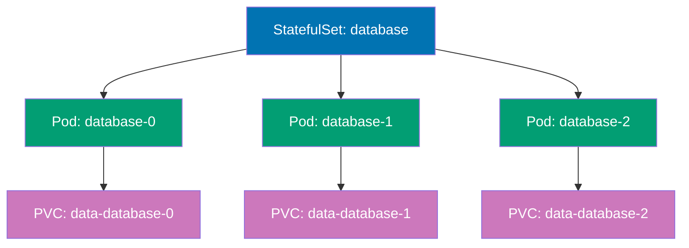

```yaml
apiVersion: v1 # => Core Kubernetes API
kind: Service # => Headless Service for StatefulSet
metadata:
  name:
    database # => Headless Service name
    # => Required for StatefulSet DNS
spec:
  # => Service specification
  clusterIP:
    None # => Headless (no cluster IP allocated)
    # => DNS returns Pod IPs directly
    # => Enables individual Pod addressing
    # => "None" is special value (not null)
  selector:
    # => Pod selector
    app:
      database # => Matches StatefulSet Pods
      # => Routes to StatefulSet Pods
  ports:
    # => Port configuration
    - port:
        5432 # => PostgreSQL port
        # => Standard PostgreSQL port
      name:
        postgres # => Named port for clarity
        # => Referenced by StatefulSet

---
apiVersion: apps/v1 # => Apps API for StatefulSets
kind: StatefulSet # => StatefulSet resource
metadata:
  name:
    database # => StatefulSet name
    # => Creates Pods with stable identities
spec:
  # => StatefulSet specification
  serviceName:
    database # => Associates with headless Service above
    # => Enables predictable DNS names
    # => Required field for StatefulSet
    # => Links to Service for DNS
  replicas:
    3 # => Creates 3 Pods: database-0, database-1, database-2
    # => Each Pod gets unique ordinal suffix
    # => Ordered creation and deletion
  selector:
    # => Pod selector (immutable)
    matchLabels:
      app:
        database # => Must match template labels
        # => Links StatefulSet to Pods
  template:
    # => Pod template
    metadata:
      labels:
        # => Pod labels
        app:
          database # => Labels for Service selector and Pod identity
          # => Must match selector
    spec:
      # => Pod specification
      containers:
        # => Container list
        - name:
            postgres # => Container name
            # => PostgreSQL database
          image:
            postgres:15 # => PostgreSQL 15 image
            # => Version-pinned
          ports:
            # => Container ports
            - containerPort:
                5432 # => PostgreSQL listening port
                # => Backend port
              name:
                postgres # => Named port matches Service
                # => Port name reference
          volumeMounts:
            # => Volume mount configuration
            - name:
                data # => References volumeClaimTemplate below
                # => Links to PVC template
              mountPath:
                /var/lib/postgresql/data # => PostgreSQL data directory
                # => Data persists across restarts
                # => Mount point for persistent storage
          env:
            # => Environment variables
            - name: POSTGRES_PASSWORD
              # => Postgres password env var
              value:
                "example" # => Database password
                # => Use Secret in production for security
                # => Hardcoded for demo only
  volumeClaimTemplates: # => Creates PVC per Pod automatically
    # => PVC template (one per Pod)
    - metadata:
        name:
          data # => PVC name pattern: data-database-0, data-database-1, data-database-2
          # => Unique PVC per Pod instance
          # => Persistent across Pod restarts
      spec:
        # => PVC specification
        accessModes:
          ["ReadWriteOnce"] # => Single node read-write access
          # => Most common for databases
          # => RWO: one node mounts read-write
        resources:
          # => Storage resource request
          requests:
            storage:
              10Gi # => Each Pod gets dedicated 10 GiB volume
              # => Independent storage per database instance
              # => Provisioned from StorageClass

# StatefulSet guarantees:
# => Pods created in order: database-0, then database-1, then database-2

# Scaling behavior:
# => Scale up: kubectl scale statefulset database --replicas=5
```

**Key Takeaway**: Use StatefulSets for databases, message queues, and applications requiring stable network identities and persistent storage; StatefulSets guarantee ordered deployment/scaling and maintain PVC associations across Pod restarts.

**Why It Matters**: StatefulSets solve the stateful workload problem in Kubernetes, enabling databases and clustered applications to run reliably with persistent identity. Spotify runs Cassandra clusters on StatefulSets where each node has stable DNS names (cassandra-0, cassandra-1) and persistent storage that survives Pod restarts—essential for maintaining data consistency across cluster reconfigurations. Without StatefulSets, operators would manually manage database node identities and storage mappings, the kind of operational burden that made running stateful workloads in containers impractical before Kubernetes 1.9.

---

### Example 30: StatefulSet Update Strategy

StatefulSets support RollingUpdate (default) and OnDelete update strategies. RollingUpdate updates Pods in reverse ordinal order (highest to lowest), while OnDelete requires manual Pod deletion for updates.

```yaml
apiVersion: apps/v1 # => Apps API for StatefulSets
kind: StatefulSet # => StatefulSet resource
metadata:
  name:
    web-stateful # => StatefulSet name
    # => Manages web application Pods
spec:
  # => StatefulSet specification
  serviceName:
    web # => Headless Service name
    # => Required for DNS
  replicas:
    4 # => Total Pods: web-stateful-0, 1, 2, 3
    # => Four stateful instances
  updateStrategy:
    # => Update strategy configuration
    type:
      RollingUpdate # => Rolling update strategy (default)
      # => Updates Pods in reverse order: 3→2→1→0
      # => Alternative: OnDelete (manual Pod deletion)
      # => RollingUpdate is automatic and gradual
    rollingUpdate:
      # => Rolling update parameters
      partition:
        2 # => Only update Pods with ordinal >= partition
        # => Pods 2 and 3 get new version
        # => Pods 0 and 1 stay old version
        # => Useful for canary testing
        # => Default: 0 (all Pods updated)
  selector:
    # => Pod selector (immutable)
    matchLabels:
      app:
        web-stateful # => Must match template labels
        # => Links StatefulSet to Pods
  template:
    # => Pod template
    metadata:
      labels:
        # => Pod labels
        app:
          web-stateful # => Pod labels
          # => Must match selector
    spec:
      # => Pod specification
      containers:
        # => Container list
        - name:
            nginx # => Container name
            # => nginx web server
          image:
            nginx:1.24 # => Current version
            # => Update to nginx:1.25 to trigger rolling update
            # => Pod 3 updates first, then Pod 2
            # => Controlled by partition value
          ports:
            # => Container ports
            - containerPort:
                80 # => HTTP port
                # => Standard HTTP port

# Update behavior with partition=2:
# => kubectl set image statefulset/web-stateful nginx=nginx:1.25

# Partition use cases:
# => Canary deployments: test new version on subset
```

**Key Takeaway**: Use partition in RollingUpdate strategy for canary deployments on StatefulSets; update high-ordinal Pods first while keeping low-ordinal Pods on stable version for gradual rollout validation.

**Why It Matters**: Partition-based canary deployments reduce risk when updating stateful applications like databases or Kafka clusters. LinkedIn tests Kafka broker updates on high-ordinal instances (kafka-5, kafka-6) serving production traffic while keeping primary replicas (kafka-0, kafka-1) on stable versions—if issues arise, they rollback the canary instances without impacting primary data nodes. This surgical update capability is critical for stateful workloads where full-cluster updates risk data corruption or service outages, providing safety nets that traditional database upgrade procedures lack.

---

### Example 31: StatefulSet with Init Containers

Init containers in StatefulSets can prepare persistent volumes, wait for dependencies, or perform one-time setup before the main application starts. This pattern ensures data initialization completes before database or cache services become ready.

```yaml
apiVersion: apps/v1 # => Apps API for StatefulSets
kind: StatefulSet # => StatefulSet resource
metadata:
  name:
    redis-cluster # => StatefulSet name
    # => Redis cluster management
spec:
  # => StatefulSet specification
  serviceName:
    redis # => Headless Service for cluster
    # => Required for DNS
  replicas:
    3 # => Three Redis instances: redis-cluster-0, 1, 2
    # => Clustered Redis deployment
  selector:
    # => Pod selector (immutable)
    matchLabels:
      app:
        redis # => Must match template labels
        # => Links StatefulSet to Pods
  template:
    # => Pod template
    metadata:
      labels:
        # => Pod labels
        app:
          redis # => Pod labels
          # => Must match selector
    spec:
      # => Pod specification
      initContainers:
        # => Init containers (run before main containers)
        - name:
            init-redis # => Init container name
            # => Prepares Redis configuration before main container
          image:
            redis:7 # => Same image as main container
            # => Ensures tooling compatibility
          command:
            # => Init container command
            - sh # => Shell interpreter
            - -c # => Execute following script
            - | # => Multi-line script
              # => Pipe preserves newlines
              echo "Initializing Redis config for Pod $POD_NAME"
              # => Log initialization
              cp /config/redis.conf /data/redis.conf
              # => Copy template to writable volume
              sed -i "s/POD_NAME/${POD_NAME}/g" /data/redis.conf
              # => Copies template config to data volume
              # => Replaces POD_NAME placeholder with actual Pod name
              # => Customizes config per Pod
          env:
            # => Environment variables
            - name: POD_NAME
              # => Pod name variable
              valueFrom:
                # => Value from Downward API
                fieldRef:
                  # => Field reference
                  fieldPath:
                    metadata.name # => Gets Pod name: redis-cluster-0
                    # => Uses Downward API
                    # => Unique per Pod
          volumeMounts:
            # => Volume mounts for init container
            - name:
                config # => Reads from ConfigMap
                # => Template source
              mountPath:
                /config # => Mount point for config template
                # => Read-only ConfigMap
            - name:
                data # => Writes to PVC
                # => Persistent storage
              mountPath:
                /data # => Shared with main container
                # => Writable volume

      containers:
        # => Main containers
        - name:
            redis # => Main Redis container
            # => Redis server
          image:
            redis:7 # => Redis 7 image
            # => Version-pinned
          command:
            # => Container startup command
            ["redis-server", "/data/redis.conf"] # => Starts with custom config
            # => Config prepared by init container
            # => Uses customized configuration
          ports:
            # => Container ports
            - containerPort:
                6379 # => Redis port
                # => Standard Redis port
          volumeMounts:
            # => Volume mounts
            - name:
                data # => Same volume as init container
                # => Shared PVC
              mountPath:
                /data # => Reads config prepared by init
                # => Stores Redis data
                # => Persistent across restarts

      volumes:
        # => Volume definitions
        - name:
            config # => ConfigMap volume
            # => Template volume
          configMap:
            # => ConfigMap volume source
            name:
              redis-config # => References ConfigMap with template
              # => Contains redis.conf template
              # => Must exist before Pod creation

  volumeClaimTemplates:
    # => PVC template (one per Pod)
    - metadata:
        name:
          data # => PVC name pattern: data-redis-cluster-0, 1, 2
          # => Unique PVC per Pod
      spec:
        # => PVC specification
        accessModes:
          ["ReadWriteOnce"] # => Single node access
          # => Standard for StatefulSets
        resources:
          # => Storage resource request
          requests:
            storage:
              5Gi # => Each Redis instance gets 5 GiB
              # => Per-Pod storage allocation

# Init container execution:
# => Init containers run before main containers
```

**Key Takeaway**: Use init containers in StatefulSets for data initialization, configuration templating, or dependency waiting; init containers have access to volumeClaimTemplates volumes and Pod metadata for per-instance customization.

**Why It Matters**: Init containers in StatefulSets enable per-instance configuration for distributed systems requiring unique node IDs or customized settings. Airbnb runs Elasticsearch clusters where init containers configure each node's `node.name` and cluster discovery settings based on Pod ordinal—elasticsearch-0 knows it's master-eligible while elasticsearch-3 is data-only. This automation eliminates manual configuration steps required in traditional clustered database deployments, reducing setup time from hours (manual configuration per node) to minutes (automated per-Pod initialization).

---

### Example 32: StatefulSet Pod Management Policy

Pod Management Policy controls whether StatefulSet creates/deletes Pods sequentially (OrderedReady, default) or in parallel (Parallel). Parallel policy speeds up scaling but loses ordering guarantees.

```yaml
apiVersion: apps/v1 # => Apps API for StatefulSets
kind: StatefulSet # => StatefulSet resource
metadata:
  name:
    parallel-stateful # => StatefulSet name
    # => Uses parallel Pod management
spec:
  # => StatefulSet specification
  serviceName:
    parallel # => Headless Service name
    # => Required for DNS
  replicas:
    10 # => Pods: parallel-stateful-0 through parallel-stateful-9
    # => Ten parallel instances
  podManagementPolicy:
    Parallel # => Parallel Pod creation/deletion
    # => Default: OrderedReady (sequential)
    # => Parallel: all Pods created simultaneously
    # => Faster scaling but no ordering guarantee
    # => Use for independent workloads
    # => No sequential dependency
  selector:
    # => Pod selector (immutable)
    matchLabels:
      app:
        parallel # => Must match template labels
        # => Links StatefulSet to Pods
  template:
    # => Pod template
    metadata:
      labels:
        # => Pod labels
        app:
          parallel # => Pod labels
          # => Must match selector
    spec:
      # => Pod specification
      containers:
        # => Container list
        - name:
            nginx # => Container name
            # => nginx web server
          image:
            nginx:1.24 # => Nginx web server
            # => Version-pinned

# OrderedReady (default):
# => Scale 0→10: creates Pods 0,1,2,3,4,5,6,7,8,9 sequentially

# Parallel:
# => Scale 0→10: creates all 10 Pods simultaneously

# Performance comparison:
# => OrderedReady scaling 0→10: ~10-20 minutes (sequential)
```

**Key Takeaway**: Use Parallel podManagementPolicy for faster scaling when Pod ordering is not critical; keep OrderedReady (default) for databases and applications requiring sequential initialization.

**Why It Matters**: Parallel Pod management dramatically reduces StatefulSet scaling time for applications without initialization dependencies. Pinterest scales distributed cache clusters from 10 to 50 Pods in under 2 minutes using Parallel policy—all 40 new Pods start simultaneously instead of waiting for each to become Ready sequentially. This 95% time reduction (from 40+ minutes with OrderedReady) enables rapid response to traffic spikes. However, databases requiring leader election or sequential cluster bootstrap must use OrderedReady to prevent split-brain scenarios or data corruption during initialization.

---

### Example 33: StatefulSet with Persistent Volume Retention

PersistentVolumeClaim retention policy controls whether PVCs are deleted when StatefulSet scales down or is deleted. WhenDeleted retains PVCs on scale-down but deletes on StatefulSet deletion, while Retain preserves PVCs in all cases.

```yaml
apiVersion: apps/v1 # => Apps API for StatefulSets
kind: StatefulSet # => StatefulSet resource
metadata:
  name:
    retained-stateful # => StatefulSet name
    # => PVC retention configuration
spec:
  # => StatefulSet specification
  serviceName:
    retained # => Headless Service name
    # => Required for DNS
  replicas:
    3 # => Three Pods with persistent storage
    # => Each with dedicated PVC
  persistentVolumeClaimRetentionPolicy:
    # => PVC retention policy (Kubernetes 1.23+)
    whenDeleted:
      Retain # => Retain PVCs when StatefulSet deleted
      # => Prevents accidental data loss
      # => Alternative: Delete (removes PVCs automatically)
      # => Production safety mechanism
    whenScaled:
      Retain # => Retain PVCs when scaling down
      # => PVCs persist for scale-up reattachment
      # => Alternative: Delete (removes PVCs of deleted Pods)
      # => Enables data recovery on scale-up
  selector:
    # => Pod selector (immutable)
    matchLabels:
      app:
        retained # => Must match template labels
        # => Links StatefulSet to Pods
  template:
    # => Pod template
    metadata:
      labels:
        # => Pod labels
        app:
          retained # => Pod labels
          # => Must match selector
    spec:
      # => Pod specification
      containers:
        # => Container list
        - name:
            nginx # => Container name
            # => nginx web server
          image:
            nginx:1.24 # => Nginx web server
            # => Version-pinned
          volumeMounts:
            # => Volume mounts
            - name:
                data # => References volumeClaimTemplate
                # => Links to PVC template
              mountPath:
                /usr/share/nginx/html # => Web root directory
                # => Data persists across restarts
                # => Nginx serves content from here

  volumeClaimTemplates:
    # => PVC template (one per Pod)
    - metadata:
        name:
          data # => PVC name pattern: data-retained-stateful-0, 1, 2
          # => Unique PVC per Pod
      spec:
        # => PVC specification
        accessModes:
          ["ReadWriteOnce"] # => Single node access
          # => Standard for StatefulSets
        resources:
          # => Storage resource request
          requests:
            storage:
              5Gi # => Each Pod gets 5 GiB persistent storage
              # => Per-Pod allocation

# Retention behavior:
# => Scale 3→1: Pods 2 and 1 deleted, but PVCs data-retained-stateful-2 and data-retained-stateful-1 retained

# Policy combinations:
# => whenDeleted=Retain, whenScaled=Retain: Maximum safety (production default)
```

**Key Takeaway**: Use Retain policy for production databases to prevent accidental data loss during scaling or deletion; remember to manually clean up PVCs when no longer needed to avoid storage costs.

**Why It Matters**: PVC retention policies prevent catastrophic data loss from accidental StatefulSet deletion or scale-down operations. Etsy's Retain policy saved their PostgreSQL cluster when a misconfigured automation script deleted a StatefulSet—all data remained intact in orphaned PVCs, enabling full recovery by recreating the StatefulSet and reattaching volumes. Without Retain, the Delete policy would have immediately destroyed months of production data. This safety mechanism provides insurance against human error, though it requires disciplined PVC lifecycle management to avoid accumulating abandoned volumes costing thousands monthly in cloud storage.

---

## DaemonSets & Jobs (Examples 34-38)

### Example 34: Basic DaemonSet

DaemonSets ensure a Pod runs on every node (or a subset of nodes), suitable for node-level services like log collectors, monitoring agents, or network plugins. Kubernetes automatically schedules DaemonSet Pods on new nodes.

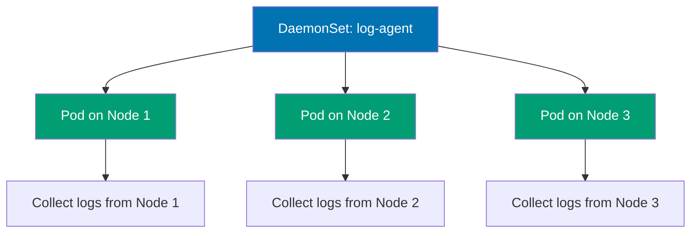

```yaml
apiVersion: apps/v1 # => Apps API for DaemonSets
kind: DaemonSet # => DaemonSet resource
metadata:
  name:
    log-collector # => DaemonSet name
    # => Log collection agent
  labels:
    # => DaemonSet labels
    app:
      log-collector # => DaemonSet labels
      # => Organizational metadata
spec:
  # => DaemonSet specification
  selector:
    # => Pod selector
    matchLabels:
      app:
        log-collector # => Must match template labels
        # => Links DaemonSet to Pods
  template:
    # => Pod template (one per node)
    metadata:
      labels:
        # => Pod labels
        app:
          log-collector # => Pod labels
          # => Must match selector
    spec:
      # => Pod specification
      containers:
        # => Container list
        - name:
            fluentd # => Container name
            # => Fluentd log aggregator
          image:
            fluent/fluentd:v1.16 # => Log forwarding agent
            # => Fluentd version 1.16
            # => Lightweight log shipper
          volumeMounts:
            # => Volume mount configuration
            - name:
                varlog # => Mounts node's /var/log
                # => System logs volume
              mountPath:
                /var/log # => Container path
                # => Reads node's /var/log directory
              readOnly:
                true # => Read-only access for safety
                # => Prevents accidental log modification
                # => Security best practice
            - name:
                varlibdockercontainers # => Mounts Docker container logs
                # => Container logs volume
              mountPath:
                /var/lib/docker/containers # => Docker log directory
                # => Container stdout/stderr logs
              readOnly:
                true # => Read-only access
                # => No write permissions needed
          resources:
            # => Resource constraints
            limits:
              # => Maximum resource usage
              memory:
                200Mi # => Maximum memory usage
                # => OOM kill if exceeded
                # => Prevents node resource exhaustion
            requests:
              # => Guaranteed resource allocation
              cpu:
                100m # => Minimum CPU allocation
                # => 0.1 CPU cores guaranteed
                # => Scheduler guarantee
              memory:
                200Mi # => Minimum memory allocation
                # => Scheduling guarantee
                # => Reserved on node

      volumes:
        # => Volume definitions (hostPath for node access)
        - name:
            varlog # => Volume name
            # => System logs volume
          hostPath:
            # => Host filesystem mount
            path:
              /var/log # => Node's /var/log directory
              # => Accesses node filesystem
              # => Direct node access
        - name:
            varlibdockercontainers # => Volume name
            # => Container logs volume
          hostPath:
            # => Host filesystem mount
            path:
              /var/lib/docker/containers # => Node's container logs
              # => Docker/containerd logs
              # => Runtime-specific path

# DaemonSet behavior:
# => Creates 1 Pod per node automatically

# DaemonSet use cases:
# => Log collectors (Fluentd, Filebeat)
```

**Key Takeaway**: Use DaemonSets for node-level services requiring presence on every node; DaemonSets automatically handle node additions/removals and support node selectors for subset deployment.

**Why It Matters**: DaemonSets ensure critical infrastructure services run on every node without manual deployment, essential for cluster-wide monitoring, logging, and networking. Datadog monitors millions of containers across thousands of Kubernetes clusters using DaemonSets—when new nodes join, monitoring agents deploy automatically within seconds, maintaining complete observability. This automation eliminates the systemd unit files and chef recipes required in traditional infrastructure where adding a new server meant manually installing monitoring agents, logging forwarders, and network plugins—Kubernetes handles this automatically through DaemonSets.

---

### Example 35: DaemonSet with Node Selector

DaemonSets can target specific nodes using nodeSelector or node affinity, enabling specialized Pods on GPU nodes, SSD-equipped nodes, or region-specific nodes.

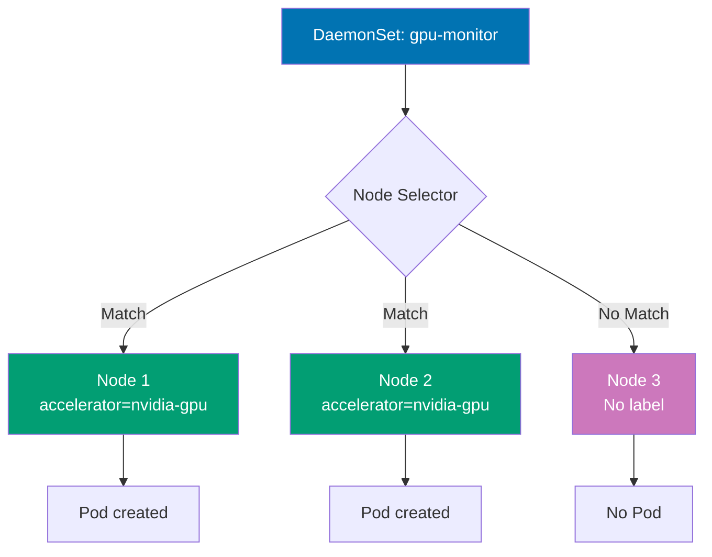

```yaml
apiVersion:
  apps/v1 # => Apps API for DaemonSets
  # => Stable workload API
kind:
  DaemonSet # => DaemonSet resource
  # => Node-level Pod deployment
metadata:
  # => DaemonSet metadata
  name:
    gpu-monitor # => DaemonSet name
    # => Unique cluster identifier
spec:
  # => DaemonSet specification
  selector:
    # => Pod selector
    # => Links DaemonSet to Pods
    matchLabels:
      # => Equality-based selector
      app:
        gpu-monitor # => Must match template labels
        # => Pod ownership identification
  template:
    # => Pod template (one per matching node)
    metadata:
      # => Pod template metadata
      labels:
        # => Labels for created Pods
        app:
          gpu-monitor # => Pod labels
          # => Must match selector
    spec:
      # => Pod specification
      nodeSelector:
        # => Node label selector
        # => Restricts Pod placement
        accelerator:
          nvidia-gpu # => Only runs on nodes with this label
          # => kubectl label nodes node-1 accelerator=nvidia-gpu
          # => Filters nodes for GPU-equipped hosts
          # => Node targeting mechanism
      containers:
        # => Container list
        - name:
            dcgm-exporter # => NVIDIA GPU monitoring
            # => Data Center GPU Manager exporter
            # => Container identifier
          image:
            nvidia/dcgm-exporter:3.1.3 # => NVIDIA official image
            # => Version 3.1.3
            # => GPU metrics collection
          ports:
            # => Port definitions
            - containerPort:
                9400 # => Prometheus metrics port
                # => Exposes GPU metrics
                # => Scrape endpoint for monitoring
          securityContext:
            # => Container security settings
            privileged:
              true # => Required for GPU access
              # => Allows device access
              # => Security trade-off for hardware monitoring
              # => Full host access granted

# DaemonSet with node selector:
# => Only creates Pods on nodes matching nodeSelector
```

**Key Takeaway**: Use nodeSelector or node affinity in DaemonSets to run specialized workloads only on appropriate nodes; label nodes based on hardware capabilities, regions, or roles for targeted DaemonSet deployment.

**Why It Matters**: Node-selective DaemonSets enable hardware-specific infrastructure services without cluttering nodes lacking required resources. Tesla runs GPU monitoring DaemonSets only on nodes with NVIDIA GPUs, collecting metrics for autonomous driving model training without wasting resources on CPU-only nodes. This selective deployment reduces monitoring overhead by 80% compared to running GPU collectors cluster-wide and enables heterogeneous cluster management where different node types run different infrastructure services based on hardware capabilities.

---

### Example 36: Kubernetes Job

Jobs run Pods to completion, suitable for batch processing, data migration, or one-time tasks. Unlike Deployments, Jobs terminate when tasks complete successfully and track completion status.

```yaml
apiVersion:
  batch/v1 # => Batch API for Jobs
  # => Stable Job API
kind:
  Job # => Job resource
  # => One-time task execution
metadata:
  # => Job metadata
  name:
    data-migration # => Job name
    # => Unique identifier for batch task
    # => Job completion tracking name
spec:
  # => Job specification
  completions:
    1 # => Number of successful completions required
    # => Job completes after 1 successful Pod
    # => completions=5 requires 5 successful Pods
    # => Total work items to process
    # => Desired completion count
  parallelism:
    1 # => Number of Pods running in parallel
    # => parallelism=3 runs 3 Pods simultaneously
    # => parallelism ≤ completions
    # => Controls concurrency
    # => Concurrent Pod execution limit
  backoffLimit:
    3 # => Maximum retries before marking Job failed
    # => Retries with exponential backoff
    # => Default: 6 retries
    # => Prevents infinite retry loops
    # => Failure tolerance threshold
  template:
    # => Pod template for Job
    # => Blueprint for Job Pods
    metadata:
      # => Pod template metadata
      labels:
        # => Pod labels
        app:
          migration # => Pod labels for tracking
          # => Used for monitoring and querying
          # => Job Pod identification
    spec:
      # => Pod specification
      restartPolicy:
        Never # => Never or OnFailure (not Always)
        # => Always invalid for Jobs
        # => Never creates new Pod on failure
        # => OnFailure restarts container in same Pod
        # => Required field for Jobs
        # => Failure handling strategy
      containers:
        # => Container list
        - name:
            migrator # => Container name
            # => Migration task executor
            # => Container identifier
          image:
            busybox:1.36 # => Lightweight Linux utilities
            # => Minimal image for shell scripts
            # => Version 1.36 pinned
          command:
            # => Container command
            # => Override entrypoint
            - sh # => Shell interpreter
              # => Bourne shell
            - -c # => Execute following script
              # => Interpret as shell script
            - | # => Multi-line script
              # => Pipe preserves newlines
              # => YAML literal block scalar
              echo "Starting data migration..."
              # => Log start
              # => Stdout logging
              sleep 10
              # => Simulate migration work
              # => 10 second task duration
              echo "Migration completed successfully"
              # => Log completion
              # => Success message
              exit 0 # => Exit 0 signals success
                     # => Exit 1+ triggers retry (up to backoffLimit)
                     # => Job controller creates new Pod on failure
                     # => Exit code determines success/failure
                     # => Zero exit = Job completion

# Job lifecycle:
# => Pod created and runs to completion

# Completion calculation:
# => completions=5, parallelism=2
```

**Key Takeaway**: Use Jobs for one-time or periodic batch tasks; set appropriate completions, parallelism, and backoffLimit based on workload requirements; Jobs do not support restartPolicy: Always.

**Why It Matters**: Kubernetes Jobs provide guaranteed execution for batch processing with automatic retry logic, eliminating custom failure handling code. Stripe processes nightly financial reconciliation using Jobs—if network issues cause failures, Jobs automatically retry up to backoffLimit, ensuring reports complete reliably. This declarative batch processing replaces brittle cron scripts that fail silently or require complex error handling, as Kubernetes tracks completion status and provides audit trails through Job history, critical for compliance in financial systems.

---

### Example 37: Parallel Jobs

Parallel Jobs run multiple Pods simultaneously to process distributed workloads like batch rendering, data processing, or parallel computations. Configure completions and parallelism to control total work items and concurrency.

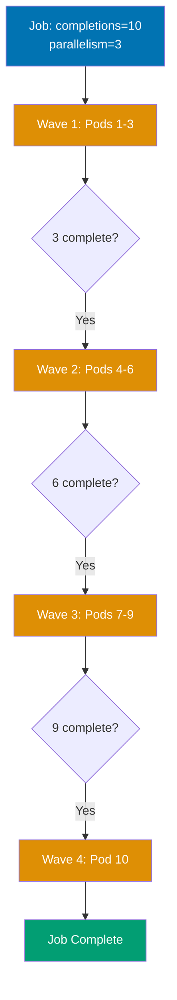

```yaml
apiVersion: batch/v1 # => Batch API for Jobs
kind: Job # => Job resource
metadata:
  name:
    parallel-processing # => Job name
    # => Parallel batch task
spec:
  # => Job specification
  completions:
    10 # => Total successful Pods required: 10
    # => Job completes after 10 Pods succeed
    # => Work items to process
  parallelism:
    3 # => Run 3 Pods in parallel
    # => Creates Pods in batches: 3, then 3, then 3, then 1
    # => Maintains max 3 Pods running simultaneously
    # => Controls concurrency
  template:
    # => Pod template
    spec:
      # => Pod specification
      restartPolicy:
        OnFailure # => Retry failed Pods within same Pod object
        # => Never creates new Pod for each retry
        # => Container restarts in same Pod
        # => Reduces Pod churn
      containers:
        # => Container list
        - name:
            worker # => Container name
            # => Task worker
          image:
            busybox:1.36 # => Lightweight Linux utilities
            # => Minimal shell environment
          command:
            # => Container command
            - sh # => Shell interpreter
            - -c # => Execute following script
            - | # => Multi-line script
              # => Pipe preserves newlines
              TASK_ID=$((RANDOM % 1000))
              # => Generate unique task ID
              echo "Processing task $TASK_ID"
              # => Log start
              sleep $((5 + RANDOM % 10))
              # => Simulate work (5-15 seconds)
              echo "Task $TASK_ID completed"
              # => Log completion
              # => Simulates variable-duration work
              # => Each Pod processes independent task
              # => Exit 0 implicit (success)

# Parallel execution:
# => Pods 1,2,3 start immediately (parallelism=3)

# Scaling parallelism:
# => kubectl patch job parallel-processing -p '{"spec":{"parallelism":5}}'
```

**Key Takeaway**: Use parallel Jobs for distributed batch processing; adjust parallelism based on cluster capacity and completions based on total work items; consider work queue pattern for dynamic task distribution.

**Why It Matters**: Parallel Jobs enable massive-scale batch processing by distributing work across multiple Pods simultaneously. Pinterest generates thumbnail images for millions of uploaded photos using parallel Jobs with parallelism=100—image processing that would take 50 hours sequentially completes in 30 minutes. This horizontal parallelism is transformational for data pipelines and ML training workloads, as Kubernetes automatically schedules work across available nodes and handles failures, eliminating the custom job schedulers and worker pool management required in traditional batch processing systems.

---

### Example 38: CronJob for Scheduled Tasks

CronJobs create Jobs on a schedule using cron syntax, suitable for periodic backups, reports, or cleanup tasks. CronJobs maintain job history and support concurrency policies for overlapping executions.

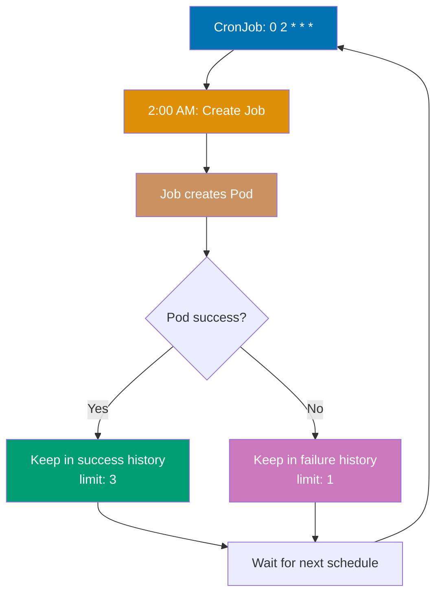

```yaml
apiVersion: batch/v1 # => Batch API for CronJobs
kind: CronJob # => CronJob resource
metadata:
  name:
    backup-job # => CronJob name
    # => Scheduled backup task
spec:
  # => CronJob specification
  schedule:
    "0 2 * * *" # => Cron syntax: minute hour day month weekday
    # => "0 2 * * *" = 2:00 AM daily
    # => "*/5 * * * *" = every 5 minutes
    # => "0 */2 * * *" = every 2 hours
    # => Standard Unix cron format
  concurrencyPolicy:
    Forbid # => Prevents concurrent Job runs
    # => Allow: permits concurrent executions
    # => Replace: cancels current and starts new
    # => Use Forbid for backups to prevent conflicts
    # => Ensures single execution at a time
  successfulJobsHistoryLimit:
    3 # => Keeps 3 successful Jobs
    # => Older successful Jobs auto-deleted
    # => Limits resource consumption
    # => Audit trail for recent runs
  failedJobsHistoryLimit:
    1 # => Keeps 1 failed Job
    # => Enables debugging recent failures
    # => Only most recent failure kept
  jobTemplate:
    # => Job template (nested Job spec)
    spec:
      # => Job specification
      template:
        # => Pod template (nested Pod spec)
        spec:
          # => Pod specification
          restartPolicy:
            OnFailure # => Retry on container failure
            # => Container restarts in same Pod
          containers:
            # => Container list
            - name:
                backup # => Container name
                # => Backup executor
              image:
                busybox:1.36 # => Lightweight Linux utilities
                # => Minimal shell environment
              command:
                # => Container command
                - sh # => Shell interpreter
                - -c # => Execute following script
                - | # => Multi-line script
                  # => Pipe preserves newlines
                  echo "Starting backup at $(date)"
                  # => Log start time
                  # Backup logic here
                  # => Replace with actual backup commands
                  sleep 30
                  # => Simulate backup duration
                  echo "Backup completed at $(date)"
                  # => Log completion time
                  # => Simulates backup operation
                  # => Exit 0 implicit (success)

# CronJob behavior:
# => Creates Job at scheduled time (2:00 AM daily)

# Timezone handling:
# => Default: Controller manager timezone (usually UTC)
```

**Key Takeaway**: Use CronJobs for scheduled recurring tasks with appropriate concurrencyPolicy to handle overlapping executions; set history limits to prevent accumulation of completed Jobs.

**Why It Matters**: CronJobs replace unreliable server-based cron with cloud-native scheduled task execution that survives node failures. Reddit runs database backups via CronJobs every 6 hours—if the node running cron daemon crashes, Kubernetes reschedules the CronJob on healthy nodes automatically. This reliability is impossible with traditional cron where losing the cron server means losing all scheduled tasks until manual recovery. CronJobs also provide execution history and failure tracking through kubectl, eliminating the log-scraping required to debug failed cron scripts on servers.

---

## Ingress Controllers (Examples 39-43)

### Example 39: Basic Ingress

Ingress manages external HTTP/HTTPS access to Services, providing host-based and path-based routing. Ingress requires an Ingress Controller (nginx, Traefik, HAProxy) to function.


```yaml
# First, install Ingress Controller (nginx example):
# => kubectl apply -f https://raw.githubusercontent.com/kubernetes/ingress-nginx/controller-v1.8.1/deploy/static/provider/cloud/deploy.yaml

apiVersion: networking.k8s.io/v1 # => Networking API for Ingress
kind: Ingress # => Ingress resource
metadata:
  name:
    app-ingress # => Ingress name
    # => Routing rules identifier
  annotations:
    # => Ingress Controller-specific annotations
    nginx.ingress.kubernetes.io/rewrite-target:
      / # => Rewrites /api/users → /users before forwarding
      # => Strips path prefix
      # => Backend receives /users
      # => nginx-specific annotation
spec:
  # => Ingress specification
  ingressClassName:
    nginx # => Uses nginx Ingress Controller
    # => Required in Kubernetes 1.18+
    # => Multiple controllers can coexist
    # => Selects which controller processes this Ingress
  rules:
    # => Routing rules
    - host:
        app.example.com # => Host-based routing
        # => Matches Host header in requests
        # => DNS must point to Ingress Controller IP
        # => Virtual hosting
      http:
        # => HTTP routing rules
        paths:
          # => Path-based routing
          - path:
              /api # => Path-based routing
              # => Matches requests starting with /api
            pathType:
              Prefix # => Matches /api, /api/, /api/users
              # => Exact: exact match only
              # => ImplementationSpecific: controller-dependent
              # => Prefix is most common
            backend:
              # => Backend service routing
              service:
                name:
                  api-service # => Routes to api-service
                  # => Service name in same namespace
                port:
                  number:
                    80 # => Service port (not targetPort)
                    # => Ingress routes to Service port
          - path:
              /web # => Different path
              # => Separate routing rule
            pathType:
              Prefix # => Matches /web, /web/, /web/home
              # => Prefix match type
            backend:
              # => Backend service routing
              service:
                name:
                  web-service # => Routes to web-service
                  # => Different backend service
                port:
                  number:
                    80 # => Service port
                    # => Standard HTTP port

# Access patterns:
# => http://app.example.com/api/users → api-service (path rewritten to /users)

# Ingress Controller behavior:
# => LoadBalancer Service receives external traffic
```

**Key Takeaway**: Ingress provides cost-effective HTTP/HTTPS routing compared to multiple LoadBalancer Services; install an Ingress Controller first, then create Ingress resources for routing rules.

**Why It Matters**: Ingress Controllers consolidate HTTP/HTTPS traffic through a single load balancer entry point, dramatically reducing cloud infrastructure costs. Zalando reduced monthly AWS costs by $18,000 by replacing 50 LoadBalancer Services ($360 each) with one Ingress Controller managing path-based routing to all backend services. This consolidation also simplifies DNS management (one wildcard DNS entry vs. 50 separate records), TLS certificate management (one cert for \*.example.com vs. 50 individual certs), and firewall rules, making Ingress the de facto standard for exposing HTTP services in production Kubernetes clusters.

---

### Example 40: Ingress with TLS

Ingress supports TLS termination using Secrets containing certificates and private keys. The Ingress Controller handles HTTPS decryption and forwards unencrypted traffic to backend Services.

```yaml
# Create TLS Secret:
# => kubectl create secret tls tls-secret --cert=tls.crt --key=tls.key

apiVersion: networking.k8s.io/v1 # => Networking API for Ingress
kind: Ingress # => Ingress resource
metadata:
  name:
    tls-ingress # => Ingress name
    # => TLS-enabled routing
spec:
  # => Ingress specification
  ingressClassName:
    nginx # => Ingress Controller to use
    # => nginx Ingress Controller
  tls:
    # => TLS configuration
    - hosts:
        # => Hosts for TLS
        - secure.example.com # => TLS applies to this host
          # => Certificate must match this domain
          # => SAN (Subject Alternative Name) or CN (Common Name)
      secretName:
        tls-secret # => References TLS Secret
        # => Secret must exist in same namespace
        # => Contains tls.crt and tls.key
        # => Ingress Controller reads certificate from Secret
        # => Auto-reloads on Secret update
  rules:
    # => Routing rules
    - host:
        secure.example.com # => Must match TLS hosts
        # => Host consistency required
      http:
        # => HTTP routing
        paths:
          # => Path rules
          - path:
              / # => Root path
              # => Catch-all route
            pathType:
              Prefix # => Matches all paths
              # => Root prefix matches everything
            backend:
              # => Backend service
              service:
                name:
                  web-service # => Backend service
                  # => Service in same namespace
                port:
                  number:
                    80 # => HTTP port (TLS already terminated)
                    # => Plain HTTP to backend

# TLS behavior:
# => https://secure.example.com → TLS termination at Ingress Controller

# cert-manager integration (automated certificates):
# => Install cert-manager: kubectl apply -f https://github.com/cert-manager/cert-manager/releases/download/v1.13.0/cert-manager.yaml
```

**Key Takeaway**: Use TLS Ingress for production HTTPS; obtain certificates from Let's Encrypt via cert-manager for automated certificate management and renewal; TLS terminates at Ingress Controller, not backend Services.

**Why It Matters**: TLS termination at Ingress Controllers centralizes HTTPS certificate management, eliminating the need to configure SSL in every backend service. Medium handles HTTPS for hundreds of microservices through Ingress TLS—one cert-manager installation automatically provisions and renews Let's Encrypt certificates for all domains, while backend services run plain HTTP. This architecture reduces operational complexity by 90% compared to managing certificates individually per service, prevents certificate expiration incidents through automated renewal, and enables easy TLS policy updates (minimum TLS version, cipher suites) cluster-wide without touching application code.

---

### Example 41: Ingress with Multiple Hosts

Ingress supports multiple hosts in a single resource, enabling consolidated routing configuration. Each host can have independent path-based routing rules.

```yaml
apiVersion:
  networking.k8s.io/v1 # => Networking API group
  # => Stable v1 Ingress API
kind:
  Ingress # => Ingress resource for routing
  # => HTTP/HTTPS routing rules
metadata:
  name:
    multi-host-ingress # => Ingress name
    # => Unique identifier
spec:
  # => Ingress specification
  ingressClassName:
    nginx # => Ingress Controller type
    # => Uses nginx Ingress Controller
    # => Alternative: traefik, haproxy, aws-alb
  rules:
    # => Routing rules (multiple hosts)
    - host:
        api.example.com # => First host
        # => API subdomain
        # => Virtual host routing
      http:
        # => HTTP routing configuration
        paths:
          # => Path-based routes
          - path:
              / # => Root path matcher
              # => Matches all requests
            pathType:
              Prefix # => Prefix matching type
              # => /anything matches
              # => Alternative: Exact, ImplementationSpecific
            backend:
              # => Backend Service configuration
              service:
                # => Service-based backend
                name:
                  api-service # => API Service name
                  # => Routes to api-service
                port:
                  # => Target port
                  number:
                    80 # => Service port 80
                    # => HTTP port

    - host:
        admin.example.com # => Second host
        # => Admin subdomain
        # => Separate virtual host
      http:
        # => HTTP configuration
        paths:
          # => Path routes
          - path:
              / # => Root path
              # => All admin requests
            pathType:
              Prefix # => Prefix matching
              # => Matches /*, /dashboard, etc.
            backend:
              # => Admin backend
              service:
                # => Admin Service
                name:
                  admin-service # => Admin Service name
                  # => Different Service than API
                port:
                  # => Port configuration
                  number:
                    80 # => HTTP port
                    # => Standard HTTP

    - host:
        static.example.com # => Third host
        # => Static content subdomain
        # => CDN-like routing
      http:
        # => HTTP configuration
        paths:
          # => Path routing
          - path:
              / # => Root path
              # => All static assets
            pathType:
              Prefix # => Prefix match
              # => /images, /js, /css all match
            backend:
              # => Static backend
              service:
                # => Static asset Service
                name:
                  static-service # => Static Service name
                  # => Serves static files
                port:
                  # => Port number
                  number:
                    80 # => HTTP port
                    # => nginx serving static

# Multi-host routing:
# => http://api.example.com → api-service
```

**Key Takeaway**: Consolidate multiple host-based routes in a single Ingress resource for easier management; each host can have independent backend Services and path rules.

**Why It Matters**: Multi-host Ingress resources simplify routing configuration for organizations running multiple domains on Kubernetes. Atlassian manages api.atlassian.com, admin.atlassian.com, and cdn.atlassian.com through consolidated Ingress resources—reducing configuration from hundreds of separate Ingress objects to dozens of grouped resources. This consolidation improves maintainability through logical grouping (all payment-related domains in one Ingress), reduces Ingress Controller resource consumption (fewer watch operations), and makes routing changes auditable as a single git commit modifies all related routes instead of scattered updates across multiple files.

---

### Example 42: Ingress with Custom Annotations

Ingress Controllers support custom annotations for advanced features like rate limiting, authentication, CORS, and custom headers. Annotations are controller-specific (nginx, Traefik, etc.).

```yaml
apiVersion:
  networking.k8s.io/v1 # => Networking API group
  # => Stable Ingress API
kind:
  Ingress # => Ingress resource with annotations
  # => Advanced feature configuration
metadata:
  name:
    annotated-ingress # => Ingress name
    # => Unique identifier
  annotations:
    # => Controller-specific annotations
    # => nginx Ingress Controller specific
    nginx.ingress.kubernetes.io/rewrite-target:
      /$2 # => URL rewriting with capture groups
      # => Rewrites /api/users to /users
      # => $2 references second capture group in path
      # => Removes /api prefix before backend
    nginx.ingress.kubernetes.io/ssl-redirect:
      "true" # => Force HTTPS redirect
      # => HTTP requests → 308 redirect to HTTPS
      # => Enforces encrypted traffic
      # => String value required
    nginx.ingress.kubernetes.io/rate-limit:
      "100" # => 100 requests per second per IP
      # => Rate limiting per client IP
      # => Exceeding limit returns 503
      # => DDoS protection
    nginx.ingress.kubernetes.io/enable-cors:
      "true" # => Enable CORS headers
      # => Adds Access-Control-Allow-Origin header
      # => Required for cross-origin requests
      # => Browser CORS policy compliance
    nginx.ingress.kubernetes.io/cors-allow-origin:
      "https://example.com" # => Allowed CORS origin
      # => Only this origin permitted
      # => Restricts cross-origin access
      # => Security control
    nginx.ingress.kubernetes.io/auth-type:
      basic # => Basic authentication
      # => HTTP Basic Auth
      # => Username/password authentication
      # => Not recommended for production (use OAuth)
    nginx.ingress.kubernetes.io/auth-secret:
      basic-auth # => References Secret with credentials
      # => Secret contains htpasswd data
      # => Must exist in same namespace
      # => Credentials for Basic Auth
spec:
  # => Ingress specification
  ingressClassName:
    nginx # => nginx Ingress Controller
    # => Controller processes this Ingress
    # => Annotations are nginx-specific
  rules:
    # => Routing rules
    - host:
        protected.example.com # => Host for this rule
        # => Virtual host routing
      http:
        # => HTTP configuration
        paths:
          # => Path routing
          - path:
              /api(/|$)(.*) # => Capture group for rewrite
              # => Regex captures everything after /api
              # => $2 in rewrite-target uses second group
            pathType:
              ImplementationSpecific # => Controller-specific matching
              # => nginx interprets as regex
            backend:
              # => Backend Service
              service:
                # => Service target
                name:
                  api-service # => Backend Service name
                  # => Routes to api-service
                port:
                  # => Service port
                  number:
                    80 # => HTTP port
                    # => Standard HTTP

# Annotation effects:
# => Request: /api/users → rewritten to /users
```

**Key Takeaway**: Leverage Ingress Controller annotations for advanced HTTP features; consult controller documentation for available annotations as they vary between nginx, Traefik, and other controllers.

**Why It Matters**: Ingress annotations enable sophisticated traffic management without deploying dedicated API gateway infrastructure. Cloudflare uses nginx Ingress annotations for rate limiting, request transformation, and authentication—features that would otherwise require additional proxy layers (Envoy, Kong) increasing complexity and latency. This consolidation reduces median request latency by 15-20ms (one fewer proxy hop) while providing enterprise features like A/B testing headers, geographic routing, and DDoS protection declaratively through annotations, making Ingress Controllers powerful enough to replace separate API gateway products.

---

### Example 43: Ingress with Default Backend

Default backend serves requests that don't match any Ingress rules, useful for custom 404 pages or catch-all routing. Configure default backend at Ingress Controller or per-Ingress resource level.

```yaml
apiVersion:
  networking.k8s.io/v1 # => Networking API group
  # => Stable Ingress API
kind:
  Ingress # => Ingress with default backend
  # => Catch-all routing pattern
metadata:
  name:
    default-backend-ingress # => Ingress name
    # => Unique identifier
spec:
  # => Ingress specification
  ingressClassName:
    nginx # => nginx Ingress Controller
    # => Controller type
  defaultBackend:
    # => Default backend for unmatched requests
    # => Fallback Service
    service:
      # => Service configuration
      name:
        default-service # => Serves unmatched requests
        # => Custom 404 Service
        # => Handles all non-matching traffic
      port:
        # => Service port
        number:
          80 # => HTTP port
          # => Default backend port
  rules:
    # => Routing rules (specific routes)
    - host:
        app.example.com # => Host for specific routing
        # => Virtual host
      http:
        # => HTTP routing
        paths:
          # => Path-based routes
          - path:
              /api # => API path prefix
              # => Matches /api/*
            pathType:
              Prefix # => Prefix matching
              # => /api, /api/users, etc.
            backend:
              # => API backend
              service:
                # => API Service
                name:
                  api-service # => API Service name
                  # => Primary application backend
                port:
                  # => Service port
                  number:
                    80 # => HTTP port
                    # => API Service port

# Default backend routing:
# => http://app.example.com/api → api-service (matches rule)
```

**Key Takeaway**: Configure default backend for better user experience on unmatched requests; implement custom 404 pages or redirects instead of generic Ingress Controller errors.

**Why It Matters**: Default backends provide graceful handling for misconfigured DNS, typo'd URLs, or removed services, maintaining professional user experience. Shopify's custom 404 backend prevents users seeing generic nginx error pages, instead redirecting to helpful troubleshooting pages or search—reducing customer support tickets by 30% for "website broken" complaints. This small configuration detail significantly impacts brand perception, as generic HTTP 404 errors signal technical incompetence while custom error pages demonstrate attention to user experience and reliability.

---

## Persistent Volumes (Examples 44-48)

### Example 44: PersistentVolume and PersistentVolumeClaim

PersistentVolumes (PV) represent cluster storage resources while PersistentVolumeClaims (PVC) are storage requests by users. PVCs bind to PVs matching capacity and access mode requirements.

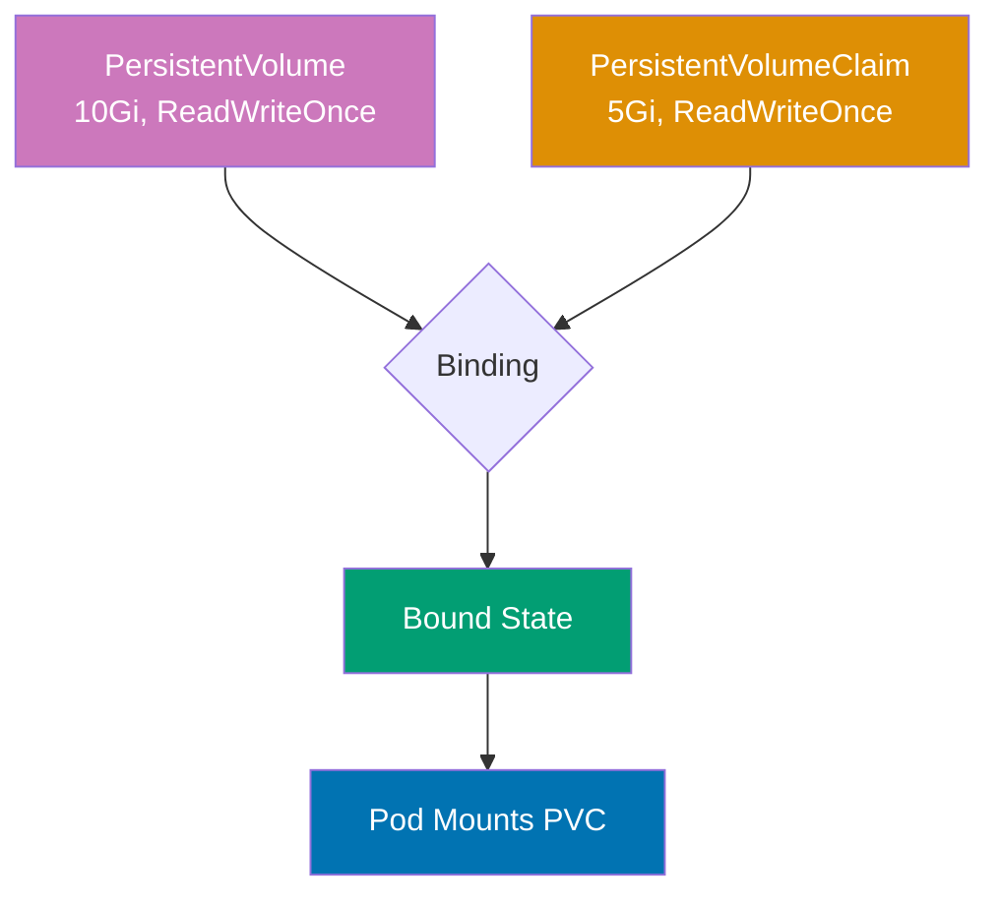

```yaml
apiVersion: v1
kind: PersistentVolume
metadata:
  name: pv-example # => PV name (cluster-wide resource)
spec:
  capacity:
    storage:
      10Gi # => Total storage capacity available
      # => PVC can request up to this size
  accessModes:
    - ReadWriteOnce # => Single node read-write
      # => ReadOnlyMany: multiple nodes read-only
      # => ReadWriteMany: multiple nodes read-write
      # => Most common: ReadWriteOnce
  persistentVolumeReclaimPolicy:
    Retain # => Manual reclamation after PVC deletion
    # => PV not auto-deleted
    # => Delete: auto-delete storage (cloud volumes)
    # => Recycle: deprecated (use Delete)
  storageClassName:
    manual # => Storage class name for binding
    # => PVC must match this class
  hostPath: # => Host path volume (testing only)
    path: /mnt/data # => Directory on node
    type:
      DirectoryOrCreate # => Create if doesn't exist
      # => Not for production (node-specific)

---
apiVersion: v1
kind: PersistentVolumeClaim
metadata:
  name: pvc-example # => PVC name (namespace resource)
spec:
  accessModes:
    - ReadWriteOnce # => Must match PV access mode
      # => Binds to PV with compatible mode
  resources:
    requests:
      storage:
        5Gi # => Requests 5 GiB (PV has 10 GiB)
        # => PVC gets full 10 GiB (PV indivisible)
  storageClassName:
    manual # => Binds to PV with same storage class
    # => Empty string binds to no-class PVs

---
apiVersion: v1
kind: Pod
metadata:
  name: pv-pod # => Pod name
spec:
  containers:
    - name: app # => Container name
      image: nginx:1.24 # => Nginx web server
      volumeMounts:
        - name: storage # => References volume below
          mountPath:
            /usr/share/nginx/html # => Mount point in container
            # => Nginx serves from this directory
  volumes:
    - name: storage # => Volume name
      persistentVolumeClaim:
        claimName:
          pvc-example # => References PVC above
          # => Kubernetes binds PVC to PV

# PV/PVC lifecycle:
# => kubectl get pv → shows PV status (Available → Bound)
```

**Key Takeaway**: Use PV/PVC for persistent storage across Pod restarts; cloud providers offer dynamic provisioning via StorageClasses, eliminating manual PV creation for production use.

**Why It Matters**: Persistent Volumes decouple storage from Pod lifecycle, enabling stateful applications to survive Pod restarts and rescheduling across nodes. GitLab stores repository data in PVs—when Pods restart for updates or failure recovery, they reconnect to the same PersistentVolume, maintaining data continuity. Without PVs, container storage is ephemeral (lost on restart), forcing databases to run on dedicated servers outside Kubernetes. Dynamic provisioning through cloud provider integrations (AWS EBS, GCP PD) automates storage allocation, reducing storage setup from manual ticket-driven processes taking days to automatic provisioning in seconds.

---

### Example 45: StorageClass and Dynamic Provisioning

StorageClasses enable dynamic PersistentVolume provisioning, automatically creating storage when PVCs are created. Cloud providers offer default StorageClasses for seamless dynamic provisioning.

```yaml
apiVersion: storage.k8s.io/v1
kind: StorageClass
metadata:
  name: fast-storage # => StorageClass name
provisioner:
  kubernetes.io/aws-ebs # => Cloud provider provisioner
  # => kubernetes.io/gce-pd (GCP)
  # => kubernetes.io/azure-disk (Azure)
  # => Talks to cloud API to create volumes
parameters:
  type:
    gp3 # => AWS EBS type: gp3 (SSD)
    # => gp2, io1, io2, sc1, st1
    # => gp3: latest generation SSD
  iops:
    "3000" # => Provisioned IOPS (input/output per second)
    # => gp3 default: 3000, max: 16000
  throughput:
    "125" # => Throughput in MiB/s
    # => gp3 default: 125, max: 1000
  encrypted:
    "true" # => Encrypt volume at rest
    # => AWS KMS encryption
reclaimPolicy:
  Delete # => Delete PV when PVC deleted
  # => Prevents orphaned volumes
  # => Retain: keep PV after PVC deletion
volumeBindingMode:
  WaitForFirstConsumer # => Delay PV binding until Pod scheduled
  # => Ensures PV created in same zone as Pod
  # => Prevents cross-zone attach failures
  # => Immediate: bind PV immediately
allowVolumeExpansion:
  true # => Allow PVC size increase
  # => Resize PVC without recreating
  # => Requires CSI driver support

---
apiVersion: v1
kind: PersistentVolumeClaim
metadata:
  name: dynamic-pvc # => PVC name
spec:
  accessModes:
    - ReadWriteOnce # => Single node access
  storageClassName:
    fast-storage # => References StorageClass above
    # => Triggers dynamic provisioning
    # => No manual PV creation
  resources:
    requests:
      storage:
        20Gi # => Requests 20 GiB
        # => StorageClass creates PV with this size

# Dynamic provisioning:
# => PVC created → StorageClass provisions new PV automatically
```

**Key Takeaway**: Use StorageClasses for production storage with dynamic provisioning; configure WaitForFirstConsumer for multi-zone clusters to ensure PV and Pod are in the same availability zone.

**Why It Matters**: Dynamic provisioning through StorageClasses eliminates storage operations bottlenecks by allowing developers to request storage declaratively. Spotify enables engineers to provision PostgreSQL instances with persistent storage through self-service YAML—StorageClasses automatically create cloud volumes, attach to nodes, and mount to Pods within minutes without DBA intervention. WaitForFirstConsumer prevents cross-zone attachment failures (AWS EBS volumes can't attach to nodes in different zones), a gotcha that plagued early Kubernetes adopters with mysterious "volume attachment timeout" errors costing hours of debugging.

---

### Example 46: Volume Expansion

PersistentVolumeClaims support volume expansion when StorageClass allows it. Expand PVCs by updating the storage size; filesystem resize may require Pod restart depending on volume type.

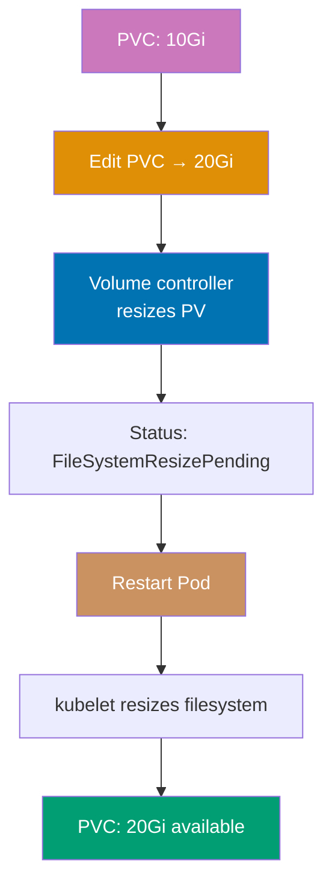

```yaml
apiVersion: v1
kind: PersistentVolumeClaim
metadata:
  name: expandable-pvc
spec:
  accessModes:
    - ReadWriteOnce
  storageClassName: fast-storage # => StorageClass must have allowVolumeExpansion: true
  resources:
    requests:
      storage: 10Gi # => Initial size: 10 GiB


# Expansion process:
# 1. Edit PVC to increase size
# => kubectl edit pvc expandable-pvc

# 2. Check expansion status
# => kubectl get pvc expandable-pvc

# 3. Restart Pod to complete expansion
# => kubectl delete pod <pod-using-pvc>

# 4. Verify new size
# => kubectl exec <pod> -- df -h /mount/path

# Expansion behavior:
# => Volume controller resizes PV
```

**Key Takeaway**: Volume expansion requires StorageClass with allowVolumeExpansion enabled; most volume types require Pod restart to complete filesystem resize; plan initial PVC sizes carefully as shrinking is not supported.

**Why It Matters**: Online volume expansion eliminates database downtime for storage increases, a critical operational capability. Slack expanded PostgreSQL PVCs from 500GB to 2TB without downtime by enabling volume expansion—the alternative (create new larger volume, pg_dump old, restore to new) requires hours of read-only mode or full downtime. This operational flexibility is transformational for growing databases, as storage exhaustion is a critical incident requiring immediate remediation, and traditional expansion through migration carries significant risk of data loss or extended outages.

---

### Example 47: Volume Snapshots

VolumeSnapshots create point-in-time copies of PersistentVolumes for backup, clone, or restore operations. Requires CSI (Container Storage Interface) driver support from storage provider.

```yaml
apiVersion: snapshot.storage.k8s.io/v1
kind: VolumeSnapshotClass
metadata:
  name: csi-snapshot-class
driver:
  ebs.csi.aws.com # => CSI driver (AWS EBS example)
  # => pd.csi.storage.gke.io (GCP)
  # => disk.csi.azure.com (Azure)
deletionPolicy:
  Delete # => Delete snapshot when VolumeSnapshot deleted
  # => Retain: keep snapshot

---
apiVersion: snapshot.storage.k8s.io/v1
kind: VolumeSnapshot
metadata:
  name: pvc-snapshot
spec:
  volumeSnapshotClassName: csi-snapshot-class
  source:
    persistentVolumeClaimName:
      data-pvc
      # => Source PVC to snapshot
      # => Creates snapshot of current state


# Snapshot lifecycle:
# => kubectl get volumesnapshot

---
apiVersion: v1
kind: PersistentVolumeClaim
metadata:
  name: restored-pvc
spec:
  accessModes:
    - ReadWriteOnce
  storageClassName: fast-storage
  resources:
    requests:
      storage: 10Gi
  dataSource:
    kind: VolumeSnapshot # => Restore from snapshot
    name: pvc-snapshot # => References snapshot
    apiGroup: snapshot.storage.k8s.io

# Restore process:
# => PVC created from snapshot
```

**Key Takeaway**: Use VolumeSnapshots for backup and disaster recovery; requires CSI driver support; create snapshots before major changes for easy rollback; consider snapshot costs and retention policies.

**Why It Matters**: VolumeSnapshots provide crash-consistent backups for stateful workloads without application-level backup tooling. Robinhood snapshots production databases before schema migrations—if migrations fail or cause performance issues, they restore from snapshots in minutes rather than hours required for dump/restore. This rapid recovery capability encourages more frequent deployments and reduces migration risk, as teams know they can instantly rollback data-layer changes. CSI snapshot integration also enables cross-cluster disaster recovery by restoring snapshots to standby clusters in different regions.

---

### Example 48: Local Persistent Volumes

Local PersistentVolumes use node-local storage (SSDs, NVMe) for high-performance workloads requiring low latency. Pods using local volumes are bound to specific nodes.

```yaml
apiVersion:
  storage.k8s.io/v1 # => Storage API version
  # => Stable storage API
kind:
  StorageClass # => StorageClass for local volumes
  # => Defines storage provisioning policy
metadata:
  # => StorageClass metadata
  name:
    local-storage # => StorageClass name
    # => Referenced by PV and PVC
provisioner:
  # => Provisioner configuration
  kubernetes.io/no-provisioner # => No dynamic provisioning
  # => PVs must be created manually
  # => Static provisioning only
volumeBindingMode:
  # => Volume binding behavior
  WaitForFirstConsumer # => Essential for local volumes
  # => Ensures Pod scheduled on node with PV
  # => Delays PVC binding until Pod creation
  # => Prevents scheduling conflicts

---
apiVersion:
  v1 # => Core Kubernetes API
  # => Stable PV API
kind:
  PersistentVolume # => PersistentVolume resource
  # => Represents node-local storage
metadata:
  # => PV metadata
  name:
    local-pv # => PV identifier
    # => Unique cluster-wide name
spec:
  # => PV specification
  capacity:
    # => Storage capacity
    storage:
      100Gi # => 100 GiB capacity
      # => Size of local disk
  accessModes:
    # => Access mode restrictions
    - ReadWriteOnce # => Local volumes always ReadWriteOnce
      # => Single node mount only
      # => Cannot be shared across nodes
  persistentVolumeReclaimPolicy:
    Retain # => Reclaim policy
    # => PV retained after PVC deletion
    # => Manual cleanup required
  storageClassName:
    local-storage # => StorageClass reference
    # => Links to StorageClass above
  local:
    # => Local volume configuration
    path:
      /mnt/disks/ssd1 # => Path on node
      # => Node filesystem mount point
      # => Must exist before PV creation
  nodeAffinity: # => Required for local volumes
    # => Node affinity rules
    required:
      # => Required node selector
      nodeSelectorTerms:
        # => Node selector terms
        - matchExpressions:
            # => Match expression list
            - key:
                kubernetes.io/hostname # => Node hostname label
                # => Standard Kubernetes label
              operator:
                In # => Operator type
                # => Must match one of values
              values:
                # => Allowed node names
                - node-1 # => PV available only on node-1
                  # => Restricts to single node
                  # => Pod must schedule here

---
apiVersion:
  v1 # => Core Kubernetes API
  # => Stable PVC API
kind:
  PersistentVolumeClaim # => PVC resource
  # => Claims the local PV
metadata:
  # => PVC metadata
  name:
    local-pvc # => PVC identifier
    # => Referenced by Pod volumes
spec:
  # => PVC specification
  accessModes:
    # => Requested access modes
    - ReadWriteOnce # => Single node access
      # => Must match PV access mode
  storageClassName:
    local-storage # => StorageClass reference
    # => Links to StorageClass
    # => Filters matching PVs
  resources:
    # => Storage resource request
    requests:
      # => Minimum capacity request
      storage:
        100Gi # => Request 100 GiB
        # => Must match PV capacity

# Local PV behavior:
# => Pod using local-pvc scheduled on node-1 (PV location)
```

**Key Takeaway**: Use local PersistentVolumes for latency-sensitive workloads like databases; understand trade-off between performance and availability; implement application-level replication for fault tolerance.

**Why It Matters**: Local PVs deliver NVMe SSD performance (sub-millisecond latency, 100K+ IOPS) impossible with network-attached storage, critical for database and cache workloads. Pinterest runs Cassandra on local NVMe storage achieving 10x better read latency (0.3ms vs 3ms) compared to network EBS volumes—this performance difference makes the user experience gap between instant page loads and noticeable lag. The trade-off is node affinity (Pods can't migrate between nodes), requiring application-level replication (Cassandra, MongoDB replica sets) for high availability, but this is acceptable for databases already designed for distributed operation.

---

## Resource Limits (Examples 49-53)

### Example 49: QoS Classes

Kubernetes assigns Quality of Service (QoS) classes based on resource requests and limits, affecting eviction priority during resource pressure. Guaranteed (highest priority), Burstable (medium), BestEffort (lowest).

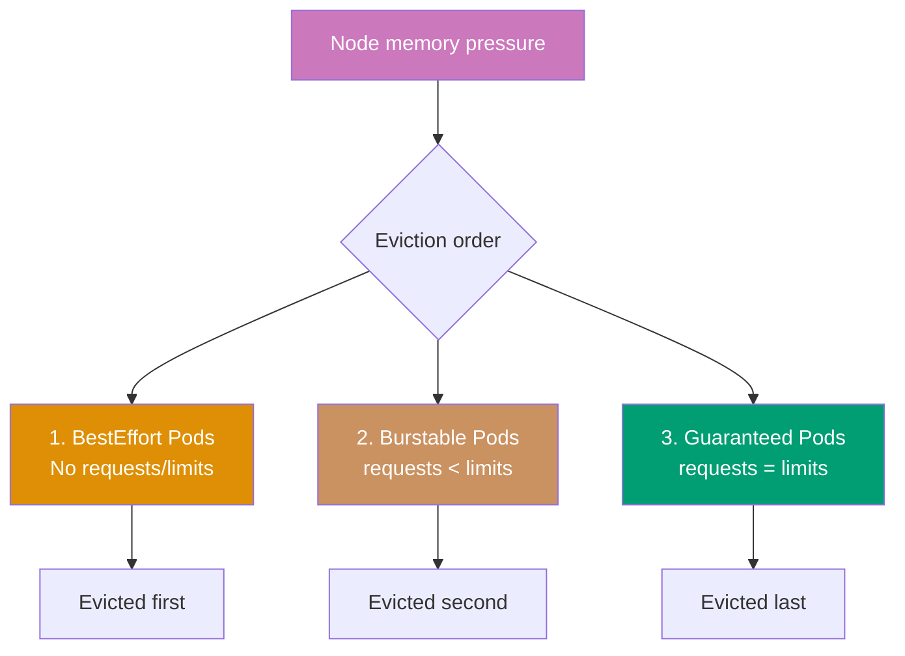

```yaml
# Guaranteed QoS (highest priority, last to be evicted)
apiVersion: v1
kind: Pod
metadata:
  name: guaranteed-pod
spec:
  containers:
    - name: app
      image: nginx:1.24
      resources:
        requests:
          cpu: 500m # => requests.cpu = limits.cpu
          memory: 512Mi # => requests.memory = limits.memory
        limits:
          cpu: 500m # => Must be equal for Guaranteed QoS
          memory: 512Mi

---
# Burstable QoS (medium priority)
apiVersion: v1
kind: Pod
metadata:
  name: burstable-pod
spec:
  containers:
    - name: app
      image: nginx:1.24
      resources:
        requests:
          cpu: 250m # => requests < limits
          memory: 256Mi
        limits:
          cpu: 500m # => Can burst up to limits
          memory: 512Mi # => Evicted before Guaranteed, after BestEffort

---
# BestEffort QoS (lowest priority, first to be evicted)
apiVersion: v1
kind: Pod
metadata:
  name: besteffort-pod
spec:
  containers:
    - name: app
      image:
        nginx:1.24 # => No requests or limits specified
        # => Gets no resource guarantees
        # => First evicted during resource pressure

# QoS behavior during resource pressure:
# => Node runs low on memory
```

**Key Takeaway**: Set requests equal to limits for Guaranteed QoS on critical workloads; use Burstable for applications with variable load; avoid BestEffort in production except for truly optional workloads.

**Why It Matters**: QoS classes determine eviction order during resource pressure, critical for maintaining service reliability. When Netflix experiences node memory pressure, BestEffort Pods (batch analytics jobs) are evicted first, protecting Guaranteed Pods running streaming services—ensuring video playback continues for millions of viewers while sacrificing non-critical workloads. This prioritization prevents the "everything fails together" scenario common in traditional infrastructure where resource exhaustion crashes all services indiscriminately. Strategic QoS classification enables graceful degradation under load, preserving critical user-facing services.

---

### Example 50: Pod Priority and Preemption

PriorityClasses assign priority values to Pods, enabling preemption where higher-priority Pods can evict lower-priority Pods when cluster resources are scarce.

```yaml
apiVersion: scheduling.k8s.io/v1
kind: PriorityClass
metadata:
  name: high-priority # => PriorityClass name
value:
  1000000 # => Priority value (higher = more important)
  # => System priorities: 2000000000+ (reserved)
globalDefault:
  false # => Not default priority
  # => Set true for one PriorityClass
description: "High priority for critical services"

---
apiVersion: scheduling.k8s.io/v1
kind: PriorityClass
metadata:
  name: low-priority
value: 100 # => Lower priority value
globalDefault: false
description: "Low priority for batch jobs"

---
apiVersion: v1
kind: Pod
metadata:
  name: critical-pod
spec:
  priorityClassName: high-priority # => Uses high-priority PriorityClass
  containers:
    - name: nginx
      image: nginx:1.24

# Preemption behavior:
# => Cluster has no capacity
```

**Key Takeaway**: Use PriorityClasses to ensure critical workloads schedule before less important ones; preemption allows cluster to prioritize essential services during resource contention; avoid too many priority levels for simplicity.

**Why It Matters**: Pod preemption enables oversubscription strategies where clusters run at 80-90% utilization by scheduling low-priority batch work that yields to critical services. Uber runs batch ETL jobs (low priority) filling spare capacity—when ride-hailing demand spikes require more user-facing Pods (high priority), Kubernetes preempts batch jobs to free resources instantly. This capacity optimization reduces infrastructure costs by 40% compared to maintaining headroom for peak traffic, as low-priority workloads utilize otherwise idle resources while automatically yielding when needed.

---

### Example 51: Horizontal Pod Autoscaler

HorizontalPodAutoscaler (HPA) automatically scales Deployment/ReplicaSet replicas based on CPU utilization or custom metrics. Requires metrics-server for CPU/memory metrics.

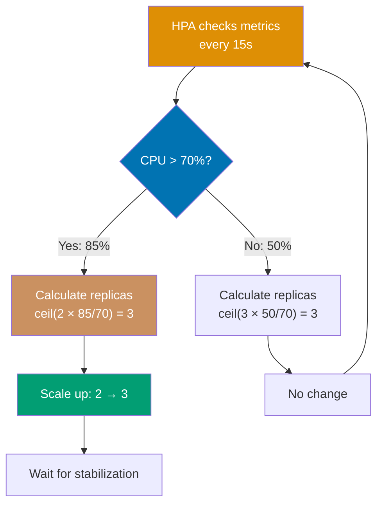

```yaml
# Install metrics-server first:
# => kubectl apply -f https://github.com/kubernetes-sigs/metrics-server/releases/latest/download/components.yaml

apiVersion: autoscaling/v2
kind: HorizontalPodAutoscaler
metadata:
  name: web-hpa # => HPA name
spec:
  scaleTargetRef:
    apiVersion: apps/v1 # => API version of target
    kind: Deployment # => Resource kind (Deployment, ReplicaSet, StatefulSet)
    name:
      web-app # => Target Deployment to scale
      # => HPA modifies this Deployment's replicas
  minReplicas:
    2 # => Minimum replicas (never scale below)
    # => Ensures minimum availability
  maxReplicas:
    10 # => Maximum replicas (never scale above)
    # => Prevents runaway scaling
  metrics:
    - type: Resource # => Resource metric type (CPU, memory)
      resource:
        name: cpu # => CPU utilization metric
        target:
          type: Utilization # => Percentage utilization
          averageUtilization:
            70 # => Target 70% average CPU utilization
            # => Above 70% → scale up
            # => Below 70% → scale down

# HPA behavior:
# => Checks metrics every 15 seconds (default)
```

**Key Takeaway**: Use HPA for automatic scaling based on demand; set appropriate min/max replicas to prevent over-scaling costs or under-scaling unavailability; requires resource requests for CPU metrics.

**Why It Matters**: HorizontalPodAutoscaler provides automated elasticity, scaling applications in response to load without human intervention. Discord handles traffic spikes during major gaming events through HPA—when concurrent users jump from 50K to 500K, HPA scales chat services from 10 to 100 Pods within minutes, maintaining sub-second message latency. After the event, HPA scales down automatically, reducing costs. This automation replaces on-call engineers manually scaling services during traffic surges, eliminating human reaction latency (minutes to hours) with automated response (seconds to minutes).

---

### Example 52: Vertical Pod Autoscaler

VerticalPodAutoscaler (VPA) automatically adjusts Pod resource requests and limits based on actual usage, optimizing resource allocation. VPA can operate in recommendation-only or auto-update mode.

```yaml
# Install VPA:
# => git clone https://github.com/kubernetes/autoscaler.git

apiVersion: autoscaling.k8s.io/v1
kind: VerticalPodAutoscaler
metadata:
  name: web-vpa
spec:
  targetRef:
    apiVersion: apps/v1
    kind: Deployment
    name: web-app # => Target Deployment
  updatePolicy:
    updateMode:
      Auto # => Auto: apply recommendations (restart Pods)
      # => Recreate: same as Auto
      # => Initial: only set on Pod creation
      # => Off: recommendations only, no updates
  resourcePolicy:
    containerPolicies:
      - containerName: "*" # => Applies to all containers
        minAllowed:
          cpu: 100m # => Minimum CPU request
          memory: 128Mi # => Minimum memory request
        maxAllowed:
          cpu: 2000m # => Maximum CPU request
          memory: 2Gi # => Maximum memory request
        controlledResources:
          - cpu
          - memory

# VPA behavior:
# => Monitors actual resource usage
```

**Key Takeaway**: Use VPA to right-size resource requests automatically; prefer HPA for horizontal scaling, VPA for vertical sizing; avoid using HPA and VPA on CPU/memory simultaneously to prevent conflicts.

**Why It Matters**: VerticalPodAutoscaler eliminates resource request guesswork by analyzing actual usage and recommending optimal values. Shopify reduced infrastructure costs by 25% using VPA—many services were over-provisioned with 2GB memory requests while using only 500MB, wasting cluster capacity. VPA identified these inefficiencies and automatically right-sized requests, packing more Pods per node. This continuous optimization handles workload changes over time (memory usage creeping up post-feature launches), maintaining efficiency without manual capacity planning that becomes outdated within weeks.

---

### Example 53: Pod Disruption Budget

PodDisruptionBudgets (PDB) limit voluntary disruptions (node drains, upgrades) to ensure minimum availability during maintenance. PDBs prevent kubectl drain from evicting too many Pods simultaneously.

```yaml
apiVersion: policy/v1
kind: PodDisruptionBudget
metadata:
  name: web-pdb
spec:
  minAvailable:
    2 # => Minimum available Pods during disruption
    # => Alternative: maxUnavailable: 1
  selector:
    matchLabels:
      app: web # => Applies to Pods with app=web label


# PDB behavior:
# => Deployment has 4 replicas

---
# Alternative: maxUnavailable
apiVersion: policy/v1
kind: PodDisruptionBudget
metadata:
  name: api-pdb
spec:
  maxUnavailable:
    1 # => Maximum unavailable Pods
    # => More flexible than minAvailable
  selector:
    matchLabels:
      app: api

# maxUnavailable vs minAvailable:
# => maxUnavailable: "at most N Pods down"
```

**Key Takeaway**: Use PodDisruptionBudgets to maintain availability during voluntary disruptions like node maintenance; set minAvailable or maxUnavailable based on application requirements; PDBs do not prevent involuntary disruptions like node failures.

**Why It Matters**: PodDisruptionBudgets enable zero-downtime cluster maintenance by preventing kubectl drain from evicting too many Pods simultaneously. LinkedIn performs rolling node upgrades across 10,000+ nodes monthly using PDBs—ensuring at least 80% of each service remains available during node rotations. Without PDBs, draining nodes could evict entire services causing outages. This controlled disruption enables continuous cluster upgrades (security patches, Kubernetes version updates) without service interruptions, transforming maintenance from scheduled downtime windows to continuous operations.

---

## Health Checks (Examples 54-57)

### Example 54: Readiness Probe

Readiness probes determine when Pods are ready to receive traffic. Failed readiness checks remove Pods from Service endpoints without restarting them, useful during startup or temporary unavailability.

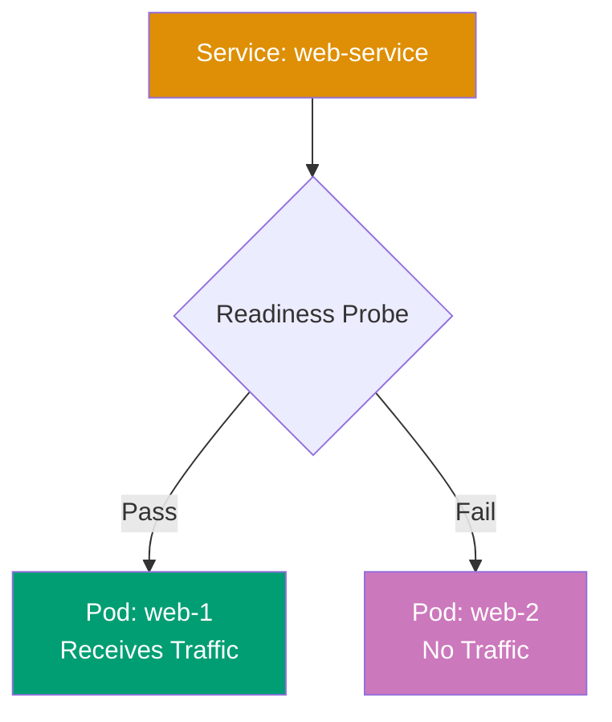

```yaml
apiVersion: v1
kind: Pod
metadata:
  name: readiness-pod # => Pod name
  labels:
    app: web # => Labels for Service selector
spec:
  containers:
    - name: nginx # => Container name
      image: nginx:1.24 # => Nginx web server
      ports:
        - containerPort: 80 # => HTTP port
      readinessProbe: # => Checks if Pod ready for traffic
        httpGet:
          path:
            /ready # => Endpoint returning 200 when ready
            # => Application defines readiness logic
          port: 80 # => Port to probe
        initialDelaySeconds:
          5 # => Wait 5s after start before first probe
          # => Gives container time to start
        periodSeconds:
          5 # => Probe every 5 seconds
          # => More frequent than liveness
        successThreshold:
          1 # => 1 success → mark Ready
          # => Consecutive successes required
        failureThreshold:
          3 # => 3 failures → mark NotReady
          # => Pod removed from Service endpoints
          # => No container restart

# Readiness vs Liveness:
# => Readiness failure → removes from Service, no restart
```

**Key Takeaway**: Use readiness probes to prevent traffic to Pods that are starting up or temporarily unavailable; failed readiness checks remove Pods from load balancing without restarting them.

**Why It Matters**: Readiness probes prevent traffic routing to Pods not yet ready to serve requests, eliminating the "502 Bad Gateway" errors during deployments. Twitch uses readiness probes to ensure new streaming service Pods complete cache warm-up (loading popular stream metadata) before receiving traffic—preventing slow responses or cache stampedes. This graceful traffic transition maintains quality of service during rolling updates, as users never encounter half-initialized Pods, unlike traditional load balancers that route traffic immediately after container startup, causing request failures during warm-up periods.

---

### Example 55: Startup Probe

Startup probes give slow-starting containers extra time to initialize before liveness probes begin. This prevents premature restart of applications with long initialization (legacy apps, large datasets).

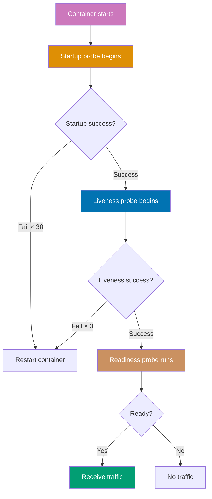

```yaml
apiVersion: v1
kind: Pod
metadata:
  name: startup-pod # => Pod name
spec:
  containers:
    - name: slow-app # => Container name
      image: slow-starting-app:1.0 # => Application with long initialization
      ports:
        - containerPort: 8080 # => Application port
      startupProbe: # => Checks if application started
        httpGet:
          path: /startup # => Startup health endpoint
          port: 8080
        initialDelaySeconds: 10 # => Wait 10s before first probe
        periodSeconds: 10 # => Check every 10 seconds
        failureThreshold:
          30 # => Allow 30 failures = 300 seconds (5 min)
          # => After 5 min → kubelet restarts container
          # => Gives app time to initialize

      livenessProbe: # => Begins after startup probe succeeds
        httpGet:
          path: /healthz # => Liveness health endpoint
          port: 8080
        periodSeconds: 5 # => Frequent checks after startup
        failureThreshold:
          3 # => Restart after 15 seconds of failure
          # => Faster recovery post-startup

# Probe sequence:
# 1. Container starts
# 2. Startup probe checks every 10s (up to 5 min)
# 3. First startup probe success → startup complete
# 4. Liveness probe begins checking every 5s
# 5. Readiness probe (if configured) controls traffic

# Without startup probe:
# => Slow app takes 3 min to start
```

**Key Takeaway**: Use startup probes for slow-starting applications to prevent premature liveness probe failures; configure longer failureThreshold \* periodSeconds than application startup time; liveness probes begin only after startup success.

**Why It Matters**: Startup probes solve the "slow starter" problem for legacy applications or those loading large datasets on initialization. Adobe runs Java applications taking 3-5 minutes to start (class loading, dependency initialization)—without startup probes, liveness probes with 30-second timeouts would restart Pods repeatedly, creating CrashLoopBackOff cycles. Startup probes give adequate initialization time while still enabling fast liveness detection post-startup, allowing migration of legacy applications to Kubernetes without code modifications to speed up startup, unblocking containerization of monolithic systems.

---

### Example 56: Combined Health Checks

Production Pods should use all three probes: startup for initialization, liveness for deadlock recovery, and readiness for traffic control. This combination ensures robust health monitoring.

```yaml
apiVersion: apps/v1
kind: Deployment
metadata:
  name: production-app # => Deployment name
spec:
  replicas: 3 # => Three Pods for high availability
  selector:
    matchLabels:
      app: production # => Must match template labels
  template:
    metadata:
      labels:
        app: production # => Pod labels
    spec:
      containers:
        - name: app # => Container name
          image: production-app:1.0 # => Production application image
          ports:
            - containerPort: 8080 # => Application port

          startupProbe: # => Phase 1: Initialization (0-2 min)
            httpGet:
              path: /startup # => Startup endpoint
              port: 8080
            initialDelaySeconds: 10 # => Wait 10s after start
            periodSeconds: 10 # => Check every 10s
            failureThreshold:
              12 # => 120s max startup time
              # => 12 failures × 10s = 120s

          livenessProbe: # => Phase 2: Deadlock detection
            httpGet:
              path: /healthz # => Liveness endpoint
              port: 8080
            initialDelaySeconds: 0 # => Starts after startup succeeds
            periodSeconds: 10 # => Check every 10s
            timeoutSeconds: 5 # => 5s response timeout
            failureThreshold:
              3 # => Restart after 30s failure
              # => 3 failures × 10s = 30s

          readinessProbe: # => Phase 3: Traffic control
            httpGet:
              path: /ready # => Readiness endpoint
              port: 8080
            initialDelaySeconds: 0 # => Starts immediately
            periodSeconds: 5 # => More frequent than liveness
            timeoutSeconds: 3 # => 3s response timeout
            successThreshold: 1 # => Mark Ready after 1 success
            failureThreshold:
              2 # => Remove from Service after 10s
              # => 2 failures × 5s = 10s

          resources:
            requests:
              cpu: 250m # => Guaranteed CPU
              memory: 256Mi # => Guaranteed memory
            limits:
              cpu: 500m # => Maximum CPU
              memory: 512Mi # => Maximum memory (OOM kill if exceeded)


# Health check endpoints should return:
# => /startup: 200 when initialization complete (DB connected, cache loaded)
```

**Key Takeaway**: Implement all three probe types for production workloads; startup for slow initialization, liveness for crash recovery, readiness for traffic control; design separate health check endpoints with appropriate logic for each probe type.

**Why It Matters**: Combined health checks provide comprehensive reliability through layered health monitoring addressing different failure scenarios. Square's payment services use all three probes—startup ensures initialization completes before traffic (preventing incomplete transactions), liveness detects deadlocks (restarting frozen processes), readiness handles dependency outages (removing Pods from load balancing when databases are unavailable). This defense-in-depth approach achieves 99.99% availability by handling initialization failures, application bugs, and transient dependency issues through automated recovery, eliminating most manual intervention scenarios that plagued pre-Kubernetes deployments.

---

### Example 57: Probe Handlers

Kubernetes supports three probe handlers: HTTP GET, TCP socket, and exec command. Choose appropriate handler based on application capabilities and health check requirements.

```yaml
apiVersion: v1
kind: Pod
metadata:
  name: probe-handlers # => Pod name
spec:
  containers:
    # HTTP GET probe (most common)
    - name: web-app # => Container name
      image: nginx:1.24 # => Nginx web server
      livenessProbe:
        httpGet:
          path:
            /healthz # => Sends HTTP GET request to this path
            # => Returns 200-399 = success, others = failure
          port: 80 # => Port to connect
          httpHeaders:
            - name: Custom-Header
              value:
                HealthCheck # => Optional custom headers
                # => Useful for auth or routing
          scheme:
            HTTP # => HTTP or HTTPS
            # => HTTPS validates certificates
        periodSeconds: 10 # => Check every 10s

    # TCP socket probe (for non-HTTP services)
    - name: database # => Container name
      image: postgres:15 # => PostgreSQL database
      livenessProbe:
        tcpSocket:
          port:
            5432 # => Attempts TCP connection
            # => Success if port open and accepts connection
            # => No data exchanged
        periodSeconds: 10 # => Check every 10s

    # Exec probe (command-based)
    - name: cache # => Container name
      image: redis:7 # => Redis cache
      livenessProbe:
        exec:
          command: # => Runs command inside container
            - redis-cli # => Redis CLI tool
            - ping # => Returns PONG if healthy
              # => Exit 0 = success, non-zero = failure
        periodSeconds: 10 # => Check every 10s


# Probe handler selection:
# => HTTP: applications with HTTP endpoints (web apps, APIs)

# Performance considerations:
# => HTTP: moderate overhead (HTTP processing, parsing)
```

**Key Takeaway**: Use HTTP probes for web applications with health endpoints, TCP probes for non-HTTP network services, and exec probes only when necessary due to execution overhead; prefer HTTP/TCP for performance.

**Why It Matters**: Probe handler selection impacts cluster overhead and reliability at scale. Kubernetes clusters with 10,000 Pods running exec probes every 10 seconds execute 1,000 commands per second, consuming significant CPU and creating fork pressure. Twitter migrated from exec-based Redis probes (redis-cli ping) to TCP probes (port 6379), reducing kubelet CPU usage by 40% and eliminating occasional probe timeouts from fork latency. HTTP probes provide rich health checks (dependency status, circuit breaker state) with minimal overhead, making them ideal for microservices, while TCP probes suit databases and message queues where port availability signals health adequately.

---

## Summary

**Intermediate level (40-75% coverage)** covered:

- **StatefulSets** (Examples 29-33): Stateful workloads, persistent storage, ordered deployment, update strategies
- **DaemonSets & Jobs** (Examples 34-38): Node-level services, batch processing, parallel jobs, scheduled tasks
- **Ingress Controllers** (Examples 39-43): HTTP routing, TLS termination, multi-host, annotations, default backend
- **Persistent Volumes** (Examples 44-48): Storage orchestration, dynamic provisioning, expansion, snapshots, local storage
- **Resource Limits** (Examples 49-53): QoS classes, priority, HPA, VPA, disruption budgets
- **Health Checks** (Examples 54-57): Readiness, startup, liveness probes, probe handlers

**Next steps**:

- Continue with [Advanced Examples](/en/learn/software-engineering/infrastructure/tools/kubernetes/by-example/advanced) (Examples 58-85) for expert mastery
- Or review [Beginner Examples](/en/learn/software-engineering/infrastructure/tools/kubernetes/by-example/beginner) (Examples 1-28) for fundamentals

All examples are self-contained and production-ready. Happy learning!
