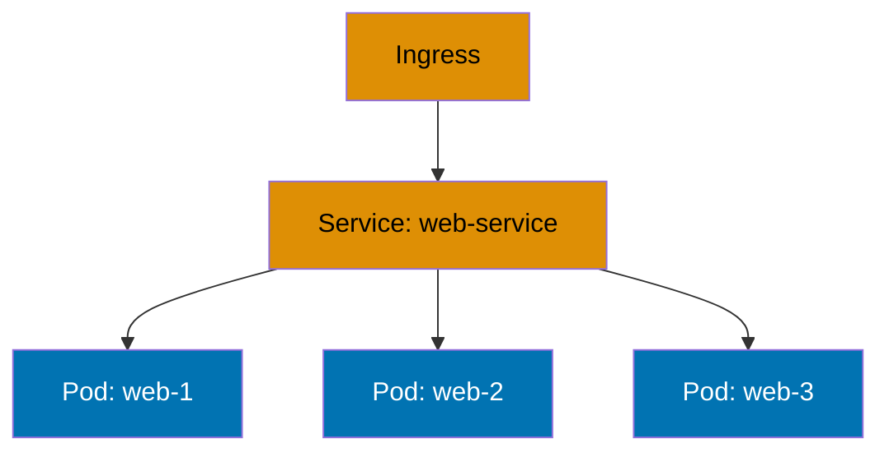

## What is Kubernetes By-Example?

This tutorial teaches **Kubernetes container orchestration** through **85 heavily annotated, self-contained YAML manifests** that you can copy, paste, and run immediately. Each example demonstrates real-world production patterns with inline comments explaining configuration decisions, state changes, and expected outcomes.

By-example learning is **code-first**: you see working manifests first, apply them to your cluster second, and understand through direct interaction. This approach targets experienced developers who prefer learning through working code rather than narrative explanations.

## Why By-Example for Kubernetes?

**Traditional Kubernetes tutorials** explain concepts narratively ("A Pod is the smallest deployable unit...") before showing YAML. **By-example reverses this**: you see the YAML manifest first, apply it, observe the results, then understand the concept through practice.

**Target audience**: Experienced developers who:

- Prefer learning through working code and hands-on experimentation
- Want comprehensive reference material (95% of Kubernetes features)
- Need production-ready patterns, not toy examples
- Value self-contained examples over scattered documentation

**Not ideal for**: Complete beginners who need conceptual foundations first (consider narrative-driven tutorials instead).

## What 95% Coverage Means

This tutorial covers **95% of Kubernetes features needed for production work**, including:

**Included in 95%**:

- Core workload types (Pods, Deployments, StatefulSets, DaemonSets, Jobs, CronJobs)
- Service discovery and networking (Services, Ingress, NetworkPolicies)
- Configuration management (ConfigMaps, Secrets, environment variables)
- Storage orchestration (PersistentVolumes, PersistentVolumeClaims, StorageClasses)
- Resource management (requests, limits, quotas, LimitRanges)
- Health checks and lifecycle (liveness, readiness, startup probes)
- Security patterns (RBAC, SecurityContext, PodSecurityPolicies)
- Scaling and updates (HorizontalPodAutoscaler, rolling updates, rollbacks)
- Custom resources and operators (CRDs, Operators, custom controllers)
- Production deployment (Helm charts, GitOps with ArgoCD, observability)

**Excluded from 95% (the remaining 5%)**:

- Kubernetes source code internals
- Cluster installation and bootstrapping (kubeadm, kops, managed services)
- Advanced networking plugins (Calico internals, Cilium eBPF details)
- Custom scheduler implementations
- Cloud provider-specific integrations beyond standard patterns
- Deprecated APIs and features

## How to Use This Tutorial

### Prerequisites

Before starting, ensure you have:

- **kubectl** installed and configured
- Access to a Kubernetes cluster (Minikube, kind, Docker Desktop, or cloud provider)
- Basic YAML syntax understanding
- Familiarity with container concepts (Docker images, containers, registries)
- Terminal/command-line proficiency

### Learning Path

**Sequential progression** (recommended):

1. **Beginner** (Examples 1-28, 0-40% coverage) - Start here if new to Kubernetes
2. **Intermediate** (Examples 29-57, 40-75% coverage) - Production patterns and best practices
3. **Advanced** (Examples 58-85, 75-95% coverage) - Expert mastery and optimization

**Direct access** (for experienced users):

- Jump to specific examples using the index on each level page
- Search for concepts (Services, Ingress, RBAC) to find relevant examples
- Use examples as reference templates for production manifests

### Running Examples

Each example is **self-contained** - you can copy the entire YAML manifest and apply it directly:

```bash
# Copy YAML from example
kubectl apply -f manifest.yaml

# Verify resource creation
kubectl get <resource-type>

# Inspect details
kubectl describe <resource-type> <resource-name>

# View logs (for Pods)
kubectl logs <pod-name>

# Clean up when done
kubectl delete -f manifest.yaml
```

**Important**: Examples in Beginner level are fully standalone. Intermediate and Advanced examples may reference patterns from earlier levels conceptually but include all necessary YAML to run independently.

## Example Format

Every example follows a **mandatory five-part format**:

### Part 1: Brief Explanation (2-3 sentences)

**Purpose**: Provides context and motivation

**Answers**:

- What is this Kubernetes feature/pattern?
- Why does it matter in production deployments?
- When should you use it?

**Example**:

> ### Example 15: ClusterIP Service
>
> ClusterIP is the default Service type that exposes Pods on an internal cluster IP accessible only from within the cluster. This service type enables inter-service communication in microservices architectures while maintaining network isolation from external traffic.

### Part 2: Mermaid Diagram (when appropriate)

**When included** (~40% of examples):

- Data flow between Kubernetes resources is non-obvious
- Network traffic patterns need visualization
- Request/response cycles span multiple components
- State transitions show resource lifecycle
- Pod scheduling and placement clarifies behavior

**When skipped**:

- Simple resource declarations (basic Pod definition)
- Configuration-only changes (setting resource limits)
- Straightforward one-to-one relationships

**Diagram requirements**:

- Use color-blind friendly palette (Blue #0173B2, Orange #DE8F05, Teal #029E73, Purple #CC78BC, Brown #CA9161)
- Vertical orientation (mobile-first)
- Clear labels on nodes and edges
- Focus on specific concept (avoid overwhelming detail)

### Part 3: Heavily Annotated YAML

**Core requirement**: Every significant field has an inline comment

**Comment annotations use `# =>` notation**:

```yaml
apiVersion: v1
kind: Pod
metadata:
  name: nginx-pod # => Creates Pod named "nginx-pod"
spec:
  containers:
    - name: nginx # => Container name "nginx"
      image: nginx:1.24 # => Uses nginx version 1.24 image
      ports:
        - containerPort: 80 # => Exposes port 80 inside container
```

**Required annotations**:

- **Resource states**: Show what gets created and how
- **Configuration effects**: Document what each setting does
- **Default values**: Note when defaults apply
- **Side effects**: Explain cascading changes
- **Expected outcomes**: Show what happens after apply
- **Common pitfalls**: Warn about frequent mistakes

**YAML organization**:

- Complete manifests (all required fields present)
- Proper indentation (2 spaces per level)
- Logical field ordering (apiVersion → kind → metadata → spec)
- Descriptive resource names (avoid generic names like "test")

### Part 4: Key Takeaway (1-2 sentences)

**Purpose**: Distill the core insight to its essence

**Must highlight**:

- The most important pattern or concept
- When to apply this in production
- Common pitfalls to avoid

**Example**:

> **Key Takeaway**: Use ClusterIP Services for internal microservice communication within the cluster, reserving LoadBalancer and NodePort types for external access points to minimize security exposure and resource costs.

## Coverage Progression

### Beginner (0-40% coverage, Examples 1-28)

**Focus**: Kubernetes fundamentals and core resource types

**Topics**:

- Hello World and local cluster setup
- Pods basics (lifecycle, containers, restart policies)
- Deployments (replicas, rolling updates, rollbacks)
- Services (ClusterIP, NodePort, LoadBalancer)
- ConfigMaps and Secrets (configuration management)
- Namespaces and Labels (resource organization)

**Example count**: 28 examples

### Intermediate (40-75% coverage, Examples 29-57)

**Focus**: Production patterns and advanced resource types

**Topics**:

- StatefulSets (stateful workloads, persistent storage)
- DaemonSets and Jobs (background tasks, batch processing)
- Ingress Controllers (HTTP routing, TLS termination)
- Persistent Volumes (storage orchestration, volume claims)
- Resource Limits (requests, limits, quotas)
- Health Checks (liveness, readiness, startup probes)

**Example count**: 29 examples

### Advanced (75-95% coverage, Examples 58-85)

**Focus**: Expert mastery and production optimization

**Topics**:

- RBAC and Security (authentication, authorization, SecurityContext)
- Network Policies (pod-to-pod traffic control)
- Custom Resources and Operators (extending Kubernetes)
- Helm Charts (package management, templating)
- GitOps and ArgoCD (declarative deployment automation)
- Production Patterns (monitoring, logging, debugging, performance)

**Example count**: 28 examples

## YAML Annotation Standards

### State Documentation Pattern

Show how Kubernetes resources change state:

```yaml
apiVersion: apps/v1
kind: Deployment
metadata:
  name: web-app # => Deployment name: "web-app"
spec:
  replicas: 3 # => Maintains 3 Pod replicas at all times
  selector:
    matchLabels:
      app: web # => Selects Pods with label app=web
  template:
    metadata:
      labels:
        app: web # => Applied to all created Pods
    spec:
      containers:
        - name: nginx
          image: nginx:1.24 # => Uses nginx 1.24 image from Docker Hub
          resources:
            requests:
              cpu: 100m # => Requests 100 millicores (0.1 CPU)
              memory: 128Mi # => Requests 128 mebibytes RAM
            limits:
              cpu: 200m # => Limited to 200 millicores max
              memory:
                256Mi # => Limited to 256 MiB max
                # => Pod killed if exceeds memory limit
```

### Network Configuration Pattern

Document how networking gets configured:

```yaml
apiVersion: v1
kind: Service
metadata:
  name: web-service # => Service name: "web-service"
spec:
  type:
    ClusterIP # => Internal cluster IP (default type)
    # => Not accessible from outside cluster
  selector:
    app: web # => Routes traffic to Pods with app=web label
  ports:
    - port: 80 # => Service listens on port 80
      targetPort:
        8080 # => Forwards to container port 8080
        # => Service IP:80 → Pod IP:8080
      protocol: TCP # => Uses TCP protocol (default)
```

### Storage Configuration Pattern

Show volume mounting and persistence:

```yaml
apiVersion: v1
kind: Pod
metadata:
  name: data-pod # => Pod name: "data-pod"
spec:
  containers:
    - name: app
      image: busybox # => Minimal container image
      volumeMounts:
        - name: data-volume # => References volume defined below
          mountPath:
            /data # => Mounts volume at /data in container
            # => Files in /data persist across restarts
  volumes:
    - name: data-volume # => Volume name: "data-volume"
      persistentVolumeClaim:
        claimName:
          data-pvc # => Uses PVC named "data-pvc"
          # => Storage provisioned by PVC
```

## Self-Containment Rules

**Critical requirement**: Examples must be copy-paste-runnable within their chapter scope.

### Beginner Level Self-Containment

**Rule**: Each example is completely standalone

**Requirements**:

- Complete YAML manifests (all fields present)
- No references to previous examples (except conceptually)
- Runnable with `kubectl apply -f manifest.yaml`
- Cleanup instructions provided

### Intermediate Level Self-Containment

**Rule**: Examples assume beginner concepts but include all necessary YAML

**Allowed assumptions**:

- Reader knows basic Kubernetes resources (Pods, Services, Deployments)
- Reader can run kubectl commands
- Reader understands YAML syntax

**Requirements**:

- Complete YAML (no "use the previous example's configuration")
- Can reference beginner concepts ("building on Pod basics from Example 5")
- Must be runnable without referring to previous examples
- Include all resource definitions needed (ConfigMaps, Secrets, PVCs if referenced)

### Advanced Level Self-Containment

**Rule**: Examples assume beginner + intermediate knowledge but remain runnable

**Allowed assumptions**:

- Reader knows Kubernetes fundamentals and common patterns
- Reader understands cluster architecture and networking
- Reader can navigate kubectl and API documentation

**Requirements**:

- Complete runnable YAML with all dependencies
- Can reference patterns by name ("using the sidecar pattern")
- Include all custom resources, operators, Helm values if needed
- Provide complete setup even if building on earlier concepts

**Golden rule**: If you delete all other examples, this example should still work when applied to a clean cluster (with standard Kubernetes installation).

## Mermaid Diagram Guidelines

### When to Include Diagrams

**INCLUDE diagram when** (~40% of examples):

- **Network traffic flow** spans multiple Services/Ingress/Pods
- **Storage architecture** shows PV/PVC/StorageClass relationships
- **Resource dependencies** have complex relationships (Deployment → ReplicaSet → Pods)
- **Request routing** traverses Ingress → Service → Pods
- **Operator patterns** show custom resource interactions
- **Multi-container Pods** demonstrate sidecar/ambassador patterns

**SKIP diagram when**:

- Simple resource declaration (basic Pod with single container)
- Configuration-only changes (setting resource limits)
- Straightforward one-to-one mappings

### Color-Blind Friendly Palette

**Mandatory colors** (WCAG AA compliant):

- **Blue** #0173B2 - Core resources (Pods, Deployments)
- **Orange** #DE8F05 - Networking (Services, Ingress)
- **Teal** #029E73 - Storage (PV, PVC)
- **Purple** #CC78BC - Configuration (ConfigMaps, Secrets)
- **Brown** #CA9161 - Security (RBAC, NetworkPolicies)

**Forbidden colors**: Red, green, yellow (not color-blind accessible)

**Example**:



## Quality Checklist

Before completing by-example content, verify:

**Coverage**:

- [ ] 85 total examples across three levels
- [ ] Beginner: 28 examples (0-40% coverage)
- [ ] Intermediate: 29 examples (40-75% coverage)
- [ ] Advanced: 28 examples (75-95% coverage)
- [ ] 95% of production Kubernetes features covered

**Self-Containment**:

- [ ] Every beginner example is fully standalone
- [ ] Every intermediate example runs without external references
- [ ] Every advanced example is copy-paste-runnable
- [ ] All YAML manifests complete and valid

**Code Quality**:

- [ ] Every significant field has inline comment
- [ ] `# =>` notation shows configuration effects
- [ ] YAML properly indented (2 spaces per level)
- [ ] Manifests validated with kubectl (dry-run)
- [ ] Examples tested on real cluster

**Educational Value**:

- [ ] Brief explanation (2-3 sentences) present
- [ ] Key takeaway (1-2 sentences) present
- [ ] Comments explain WHY, not just WHAT
- [ ] Production relevance clear

**Diagrams**:

- [ ] ~40% of examples include Mermaid diagrams
- [ ] Diagrams use color-blind friendly palette
- [ ] Diagrams clarify non-obvious patterns
- [ ] No diagrams for trivial examples
- [ ] Vertical orientation (mobile-first)

**Structure**:

- [ ] five-part format followed consistently
- [ ] Examples numbered sequentially (1-85)
- [ ] File naming convention followed
- [ ] Frontmatter complete and accurate

## Next Steps

Ready to start learning? Choose your path:

- **New to Kubernetes?** Start with [Beginner Examples](/en/learn/software-engineering/infrastructure/tools/kubernetes/by-example/beginner) (Examples 1-28)
- **Know the basics?** Jump to [Intermediate Examples](/en/learn/software-engineering/infrastructure/tools/kubernetes/by-example/intermediate) (Examples 29-57)
- **Production experience?** Explore [Advanced Examples](/en/learn/software-engineering/infrastructure/tools/kubernetes/by-example/advanced) (Examples 58-85)

Each level builds on the previous, but all examples are self-contained and runnable independently. Happy learning!
