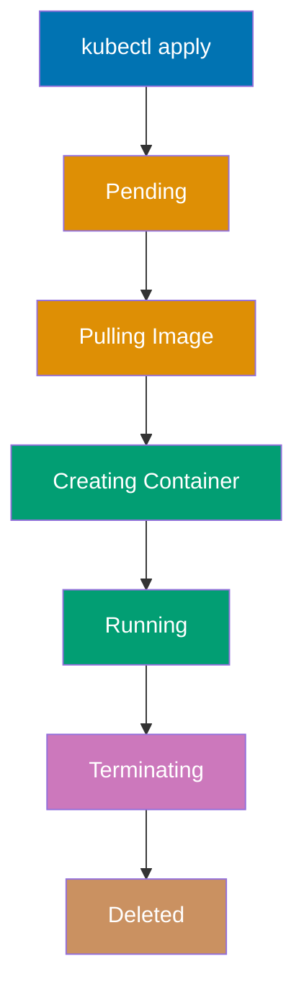

**Want to start orchestrating containers with Kubernetes?** This initial setup guide gets Kubernetes installed and working on your system. By the end, you'll have a local Kubernetes cluster running and will deploy your first pod.

This tutorial provides 0-5% coverage - just enough to get Kubernetes working on your machine. For deeper learning, continue to [Quick Start](/en/learn/software-engineering/infrastructure/tools/kubernetes/quick-start) (5-30% coverage) or explore [By Example](/en/learn/software-engineering/infrastructure/tools/kubernetes/by-example) tutorials.

## Prerequisites

Before installing Kubernetes, you need:

- A computer running Windows 10/11, macOS, or Linux
- Administrator/sudo access for installation
- At least 4GB RAM available for Kubernetes (8GB+ recommended)
- Virtualization enabled in BIOS (for Minikube/Docker Desktop)
- Docker installed (for Minikube, recommended for learning)
- A terminal/command prompt
- Basic command-line navigation skills
- Basic understanding of containers (Docker) helpful but not required

**Important**: This guide focuses on local development cluster setup using Minikube or Docker Desktop. Production Kubernetes clusters (EKS, GKE, AKS) follow different installation procedures.

## Learning Objectives

By the end of this tutorial, you will be able to:

1. **Install** kubectl (Kubernetes command-line tool)
2. **Set up** a local Kubernetes cluster (Minikube or Docker Desktop)
3. **Verify** that Kubernetes is installed correctly and running
4. **Deploy** your first pod (Hello World)
5. **Execute** basic kubectl commands (get, describe, delete)

## Installing kubectl

kubectl is the Kubernetes command-line tool for interacting with clusters. Install kubectl first before setting up a cluster.

### Windows Installation (kubectl)

**Step 1: Download kubectl**

Open PowerShell and run:

```powershell
mkdir "$HOME\bin"

curl.exe -LO "https://dl.k8s.io/release/v1.29.0/bin/windows/amd64/kubectl.exe"

Move-Item kubectl.exe "$HOME\bin\kubectl.exe"
```

**Step 2: Add to PATH**

```powershell
$oldPath = [Environment]::GetEnvironmentVariable('Path', 'User')
[Environment]::SetEnvironmentVariable('Path', "$oldPath;$HOME\bin", 'User')
```

Restart PowerShell to load new PATH.

**Step 3: Verify Installation**

```powershell
kubectl version --client
```

Expected output:

```
Client Version: v1.29.0
Kustomize Version: v5.0.4-0.20230601165947-6ce0bf390ce3
```

**Alternative: Install via Chocolatey**

```powershell
choco install kubernetes-cli
```

**Troubleshooting Windows**:

- If `kubectl` not found, restart PowerShell or manually add `$HOME\bin` to PATH
- For permission errors, run PowerShell as Administrator
- Verify PATH includes kubectl location: `echo $env:PATH`

### macOS Installation (kubectl)

**Step 1: Install via Homebrew** (recommended)

```bash
brew install kubectl
```

**Step 2: Verify Installation**

```bash
kubectl version --client
```

Expected output:

```
Client Version: v1.29.0
Kustomize Version: v5.0.4-0.20230601165947-6ce0bf390ce3
```

**Alternative: Download Binary Manually**

```bash
curl -LO "https://dl.k8s.io/release/$(curl -L -s https://dl.k8s.io/release/stable.txt)/bin/darwin/amd64/kubectl"

curl -LO "https://dl.k8s.io/release/$(curl -L -s https://dl.k8s.io/release/stable.txt)/bin/darwin/arm64/kubectl"

chmod +x kubectl

sudo mv kubectl /usr/local/bin/kubectl
```

**Troubleshooting macOS**:

- If Homebrew installation fails, run: `brew update`
- For "kubectl is not signed" error, allow in System Settings → Security & Privacy
- Ensure kubectl is executable: `chmod +x /usr/local/bin/kubectl`

### Linux Installation (kubectl)

**Ubuntu/Debian Installation**

**Step 1: Download kubectl**

```bash
curl -LO "https://dl.k8s.io/release/$(curl -L -s https://dl.k8s.io/release/stable.txt)/bin/linux/amd64/kubectl"
```

**Step 2: Install kubectl**

```bash
chmod +x kubectl

sudo mv kubectl /usr/local/bin/kubectl
```

**Step 3: Verify Installation**

```bash
kubectl version --client
```

**Alternative: Install via Package Manager**

```bash
sudo apt-get update
sudo apt-get install -y apt-transport-https ca-certificates curl

curl -fsSL https://pkgs.k8s.io/core:/stable:/v1.29/deb/Release.key | sudo gpg --dearmor -o /etc/apt/keyrings/kubernetes-apt-keyring.gpg

echo 'deb [signed-by=/etc/apt/keyrings/kubernetes-apt-keyring.gpg] https://pkgs.k8s.io/core:/stable:/v1.29/deb/ /' | sudo tee /etc/apt/sources.list.d/kubernetes.list

sudo apt-get update
sudo apt-get install -y kubectl
```

**Fedora/RHEL/CentOS Installation**

```bash
cat <<EOF | sudo tee /etc/yum.repos.d/kubernetes.repo
[kubernetes]
name=Kubernetes
baseurl=https://pkgs.k8s.io/core:/stable:/v1.29/rpm/
enabled=1
gpgcheck=1
gpgkey=https://pkgs.k8s.io/core:/stable:/v1.29/rpm/repodata/repomd.xml.key
EOF

sudo dnf install kubectl -y
```

**Arch Linux Installation**

```bash
sudo pacman -S kubectl
```

**Troubleshooting Linux**:

- If binary not found, ensure `/usr/local/bin` is in PATH
- For permission errors, use sudo when moving to `/usr/local/bin`
- Verify installation: `which kubectl`

## Setting Up Local Kubernetes Cluster

Choose one method for local cluster: Minikube (recommended for learning) or Docker Desktop (convenient if already installed).

### Option 1: Minikube (Recommended for Learning)

Minikube runs single-node Kubernetes cluster in VM or container for local development.

**Windows Installation (Minikube)**

**Step 1: Download and Install**

Open PowerShell as Administrator:

```powershell
Invoke-WebRequest -Uri https://github.com/kubernetes/minikube/releases/latest/download/minikube-installer.exe -OutFile minikube-installer.exe

.\minikube-installer.exe

Remove-Item minikube-installer.exe
```

**Step 2: Start Minikube**

```powershell
minikube start
```

**macOS Installation (Minikube)**

**Step 1: Install via Homebrew**

```bash
brew install minikube
```

**Step 2: Start Minikube**

```bash
minikube start
```

**Linux Installation (Minikube)**

**Step 1: Download and Install**

```bash
curl -LO https://storage.googleapis.com/minikube/releases/latest/minikube-linux-amd64

sudo install minikube-linux-amd64 /usr/local/bin/minikube
```

**Step 2: Start Minikube**

```bash
minikube start
```

**What Happens During `minikube start`**:

1. Downloads Minikube ISO (first run only)
2. Creates virtual machine or container
3. Installs Kubernetes components (kubelet, API server, etcd)
4. Configures kubectl to use Minikube cluster
5. Starts single-node cluster

**Expected output**:

```
😄  minikube v1.32.0 on Ubuntu 22.04
✨  Using the docker driver based on existing profile
👍  Starting control plane node minikube in cluster minikube
🚜  Pulling base image ...
🔥  Creating docker container (CPUs=2, Memory=2200MB) ...
🐳  Preparing Kubernetes v1.28.3 on Docker 24.0.7 ...
🔗  Configuring bridge CNI (Container Networking Interface) ...
🔎  Verifying Kubernetes components...
🌟  Enabled addons: storage-provisioner, default-storageclass
🏄  Done! kubectl is now configured to use "minikube" cluster and "default" namespace by default
```

**Troubleshooting Minikube**:

- If start fails, try specifying driver: `minikube start --driver=docker`
- For insufficient memory errors: `minikube start --memory=4096`
- For firewall issues, allow Docker/VirtualBox through firewall
- Delete and recreate cluster: `minikube delete && minikube start`

### Option 2: Docker Desktop Kubernetes

If Docker Desktop is installed, enable built-in Kubernetes.

**Windows/macOS Setup**

**Step 1: Open Docker Desktop**

Launch Docker Desktop application.

**Step 2: Enable Kubernetes**

1. Click Docker Desktop icon → Settings/Preferences
2. Navigate to **Kubernetes** section
3. Check **Enable Kubernetes**
4. Click **Apply & Restart**
5. Wait for Kubernetes to start (status shows green checkmark)

**Step 3: Verify Kubernetes is Running**

Docker Desktop automatically configures kubectl to use its cluster.

**Troubleshooting Docker Desktop Kubernetes**:

- If Kubernetes won't start, click "Reset Kubernetes Cluster" in settings
- Ensure Docker Desktop has sufficient resources (4GB+ RAM)
- Check Docker Desktop logs for errors
- For slow startup, increase resource allocation in Docker Desktop settings

## Verify Cluster Setup

After starting Minikube or Docker Desktop Kubernetes, verify cluster is running.

### Check Cluster Info

```bash
kubectl cluster-info
```

Expected output:

```
Kubernetes control plane is running at https://127.0.0.1:xxxxx
CoreDNS is running at https://127.0.0.1:xxxxx/api/v1/namespaces/kube-system/services/kube-dns:dns/proxy

To further debug and diagnose cluster problems, use 'kubectl cluster-info dump'.
```

### Check kubectl Configuration

```bash
kubectl config view
```

This shows kubectl configuration including clusters, users, and contexts.

### Check Cluster Nodes

```bash
kubectl get nodes
```

Expected output (Minikube):

```
NAME       STATUS   ROLES           AGE   VERSION
minikube   Ready    control-plane   2m    v1.28.3
```

Expected output (Docker Desktop):

```
NAME             STATUS   ROLES           AGE   VERSION
docker-desktop   Ready    control-plane   1m    v1.28.2
```

**Status = Ready** means cluster is operational.

### Check System Pods

```bash
kubectl get pods -n kube-system
```

This lists Kubernetes system components (CoreDNS, kube-proxy, etc.). All should show STATUS = Running.

## Your First Kubernetes Pod

Let's deploy your first pod - a containerized nginx web server.

### Understanding Pods

**Pod**: Smallest deployable unit in Kubernetes. A pod contains one or more containers that share network and storage.

**Key concepts**:

- Pods are ephemeral (can be deleted and recreated)
- Each pod gets unique IP address
- Containers in same pod can communicate via localhost
- Pods are managed by higher-level controllers (Deployments, StatefulSets)

### Create nginx Pod

**Step 1: Create Pod Definition**

Create file `nginx-pod.yaml`:

```yaml
apiVersion: v1
kind: Pod
metadata:
  name: nginx-hello
  labels:
    app: nginx
spec:
  containers:
    - name: nginx
      image: nginx:latest
      ports:
        - containerPort: 80
```

**Code breakdown**:

- `apiVersion: v1`: Kubernetes API version for Pod resource
- `kind: Pod`: Resource type (Pod, Deployment, Service, etc.)
- `metadata.name`: Unique pod name in namespace
- `metadata.labels`: Key-value pairs for organizing resources
- `spec.containers`: List of containers to run in pod
- `image: nginx:latest`: Container image from Docker Hub
- `containerPort: 80`: Port nginx listens on inside container

**Step 2: Deploy Pod**

```bash
kubectl apply -f nginx-pod.yaml
```

Expected output:

```
pod/nginx-hello created
```

**Step 3: Verify Pod is Running**

```bash
kubectl get pods
```

Expected output:

```
NAME          READY   STATUS    RESTARTS   AGE
nginx-hello   1/1     Running   0          10s
```

**Status breakdown**:

- **READY**: 1/1 means 1 container ready out of 1 total
- **STATUS**: Current pod state (Pending, Running, Succeeded, Failed)
- **RESTARTS**: Number of container restarts
- **AGE**: How long pod has been running

**Step 4: Get Pod Details**

```bash
kubectl describe pod nginx-hello
```

This shows comprehensive pod information:

- Events (image pulled, container created, pod started)
- IP address
- Node placement
- Resource requests/limits
- Container status

### Understanding Pod Lifecycle



### Access nginx Pod

**Step 1: Port Forward to Pod**

```bash
kubectl port-forward nginx-hello 8080:80
```

This forwards local port 8080 to pod's port 80.

**Step 2: Access nginx**

Open browser and visit: `http://localhost:8080`

You should see nginx welcome page.

**Step 3: Stop Port Forwarding**

Press `Ctrl+C` in terminal to stop port forwarding.

### View Pod Logs

```bash
kubectl logs nginx-hello
```

This shows stdout/stderr from nginx container.

### Execute Commands in Pod

```bash
kubectl exec nginx-hello -- ls /

kubectl exec -it nginx-hello -- bash
```

Inside container, explore:

```bash
nginx -v

ls /etc/nginx/

exit
```

### Delete Pod

```bash
kubectl delete pod nginx-hello
```

Or delete using file:

```bash
kubectl delete -f nginx-pod.yaml
```

Expected output:

```
pod "nginx-hello" deleted
```

Verify deletion:

```bash
kubectl get pods
```

Should show no resources found in default namespace.

## Essential kubectl Commands

**Resource Management**:

```bash
kubectl apply -f resource.yaml

kubectl delete -f resource.yaml

kubectl delete pod nginx-hello
```

**Viewing Resources**:

```bash
kubectl get pods

kubectl get all

kubectl describe pod nginx-hello

kubectl logs nginx-hello

kubectl logs -f nginx-hello
```

**Interacting with Pods**:

```bash
kubectl exec nginx-hello -- command

kubectl exec -it nginx-hello -- bash

kubectl port-forward nginx-hello 8080:80
```

**Cluster Information**:

```bash
kubectl cluster-info

kubectl get nodes

kubectl get pods -n kube-system
```

## Common Installation Issues

### Minikube start fails with driver error

**Problem**: "Failed to start minikube: driver not found"

**Solution**:

```bash
minikube start --driver=docker

minikube start --driver=virtualbox
```

### Insufficient resources error

**Problem**: "Insufficient memory" or "Insufficient CPU"

**Solution**:

```bash
minikube start --memory=4096 --cpus=2
```

### kubectl cannot connect to cluster

**Problem**: "The connection to the server localhost:8080 was refused"

**Solution**:

- Ensure cluster is running: `minikube status` or check Docker Desktop
- Verify kubectl config: `kubectl config view`
- Set correct context: `kubectl config use-context minikube`

### Pod stuck in Pending state

**Problem**: Pod shows STATUS = Pending indefinitely

**Solution**:

```bash
kubectl describe pod <pod-name>

```

### Image pull errors

**Problem**: Pod shows ImagePullBackOff status

**Solution**:

```bash
kubectl describe pod <pod-name>

```

## Next Steps

Now that Kubernetes is installed, continue your learning journey:

1. **Quick Start Tutorial**: Learn core Kubernetes concepts with hands-on examples
   - Visit [Quick Start](/en/learn/software-engineering/infrastructure/tools/kubernetes/quick-start) for 5-30% coverage
2. **By Example Learning**: Master Kubernetes through annotated examples
   - Explore [By Example - Beginner](/en/learn/software-engineering/infrastructure/tools/kubernetes/by-example/beginner) (0-40% coverage)
   - Progress to [By Example - Intermediate](/en/learn/software-engineering/infrastructure/tools/kubernetes/by-example/intermediate) (40-75% coverage)
   - Master with [By Example - Advanced](/en/learn/software-engineering/infrastructure/tools/kubernetes/by-example/advanced) (75-95% coverage)

## Further Resources

**Official Kubernetes Documentation**:

- [Kubernetes Documentation](https://kubernetes.io/docs/) - Comprehensive official docs
- [Kubernetes Tutorials](https://kubernetes.io/docs/tutorials/) - Official tutorial series
- [kubectl Cheat Sheet](https://kubernetes.io/docs/reference/kubectl/cheatsheet/) - Command reference
- [Kubernetes Concepts](https://kubernetes.io/docs/concepts/) - Core concepts explained

**Development Tools**:

- [k9s](https://k9scli.io/) - Terminal UI for Kubernetes
- [Lens](https://k8slens.dev/) - Desktop IDE for Kubernetes
- [VS Code Kubernetes Extension](https://marketplace.visualstudio.com/items?itemName=ms-kubernetes-tools.vscode-kubernetes-tools) - Manage clusters in VS Code
- [Helm](https://helm.sh/) - Kubernetes package manager

**Community**:

- [Kubernetes Slack](https://kubernetes.slack.com/) - Official Slack community
- [/r/kubernetes](https://www.reddit.com/r/kubernetes/) - Reddit community
- [CNCF Community](https://www.cncf.io/community/) - Cloud Native Computing Foundation
- [Kubernetes Blog](https://kubernetes.io/blog/) - Official blog with tutorials

## Summary

You've successfully completed the Kubernetes initial setup! You now have:

- kubectl installed and configured
- Local Kubernetes cluster running (Minikube or Docker Desktop)
- Experience deploying and managing pods
- Understanding of basic kubectl commands
- Knowledge of pod lifecycle
- Resources for continued learning

The next step is to explore Deployments, Services, ConfigMaps, and multi-container applications in the Quick Start tutorial.
