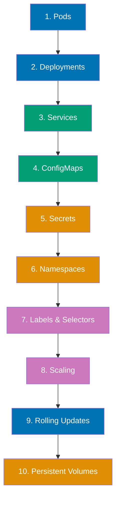
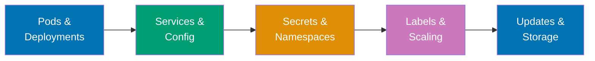

**Want to orchestrate containers at scale with automatic healing and scaling?** This quick start introduces essential Kubernetes concepts through practical examples. You'll build from simple pods to production-ready deployments.

This tutorial provides 5-30% coverage using the touchpoints approach - 10 core concepts with runnable examples. After completing this guide, continue to [By Example - Beginner](/en/learn/software-engineering/infrastructure/tools/kubernetes/by-example/beginner) for comprehensive 0-40% coverage.

## Prerequisites

Before starting, ensure you have completed [Initial Setup](/en/learn/software-engineering/infrastructure/tools/kubernetes/initial-setup). You should have:

- kubectl installed and configured
- Local Kubernetes cluster running (Minikube or Docker Desktop)
- Experience deploying basic pods
- A terminal and text editor ready

## Learning Path

This quick start covers 10 essential Kubernetes touchpoints:



## Concept 1: Pods

**What**: Smallest deployable units containing one or more containers.

**Why**: Group tightly-coupled containers sharing network and storage.

### Example: Multi-Container Pod

Create `pod-multi.yaml`:

```yaml
apiVersion: v1
kind: Pod
metadata:
  name: web-with-sidecar
  labels:
    app: web
spec:
  containers:
    - name: nginx
      image: nginx:alpine
      ports:
        - containerPort: 80
      volumeMounts:
        - name: shared-logs
          mountPath: /var/log/nginx

    - name: log-reader
      image: busybox
      command: ["sh", "-c", "tail -f /logs/access.log"]
      volumeMounts:
        - name: shared-logs
          mountPath: /logs

  volumes:
    - name: shared-logs
      emptyDir: {}
```

Deploy and interact:

```bash
kubectl apply -f pod-multi.yaml

kubectl get pods

kubectl logs web-with-sidecar -c nginx
kubectl logs web-with-sidecar -c log-reader

kubectl exec web-with-sidecar -c nginx -- nginx -v

kubectl port-forward web-with-sidecar 8080:80


kubectl delete pod web-with-sidecar
```

**Key points**:

- Pods are ephemeral - not for direct production use
- Containers in pod share network namespace (localhost communication)
- Containers can share volumes (emptyDir, configMap, secret)
- Use `-c` flag to target specific container
- Pod IP address changes when recreated

## Concept 2: Deployments

**What**: Declarative updates for pods with replica management.

**Why**: Ensure desired number of pods running with automatic recovery.

### Example: Scalable Deployment

Create `deployment-web.yaml`:

```yaml
apiVersion: apps/v1
kind: Deployment
metadata:
  name: nginx-deployment
  labels:
    app: nginx
spec:
  replicas: 3
  selector:
    matchLabels:
      app: nginx
  template:
    metadata:
      labels:
        app: nginx
        version: "1.0"
    spec:
      containers:
        - name: nginx
          image: nginx:1.25-alpine
          ports:
            - containerPort: 80
          resources:
            requests:
              memory: "64Mi"
              cpu: "100m"
            limits:
              memory: "128Mi"
              cpu: "200m"
```

Deploy and manage:

```bash
kubectl apply -f deployment-web.yaml

kubectl get pods -w

kubectl get deployments

kubectl describe deployment nginx-deployment

kubectl delete pod <pod-name>

kubectl get pods

kubectl get replicasets

kubectl delete deployment nginx-deployment
```

**Key points**:

- Deployments manage ReplicaSets
- ReplicaSets ensure desired replica count
- Automatic pod replacement on failure
- `selector` must match template labels
- Resources: requests (scheduling), limits (enforcement)

## Concept 3: Services

**What**: Stable network endpoints for accessing pods.

**Why**: Pods are ephemeral with changing IPs - services provide stable access.

### Example: Service Types

Create `service-demo.yaml`:

```yaml
apiVersion: apps/v1
kind: Deployment
metadata:
  name: web-app
spec:
  replicas: 3
  selector:
    matchLabels:
      app: web
  template:
    metadata:
      labels:
        app: web
    spec:
      containers:
        - name: nginx
          image: nginx:alpine
          ports:
            - containerPort: 80

---
apiVersion: v1
kind: Service
metadata:
  name: web-service
spec:
  type: ClusterIP
  selector:
    app: web
  ports:
    - protocol: TCP
      port: 80
      targetPort: 80

---
apiVersion: v1
kind: Service
metadata:
  name: web-nodeport
spec:
  type: NodePort
  selector:
    app: web
  ports:
    - protocol: TCP
      port: 80
      targetPort: 80
      nodePort: 30080
```

Deploy and access:

```bash
kubectl apply -f service-demo.yaml

kubectl get services

kubectl run -it --rm debug --image=alpine --restart=Never -- sh
apk add curl
curl http://web-service
exit

minikube ip  # For Minikube users

curl http://<minikube-ip>:30080

kubectl port-forward service/web-service 8080:80
curl http://localhost:8080

kubectl get endpoints web-service

kubectl delete -f service-demo.yaml
```

**Key points**:

- **ClusterIP**: Internal cluster access only (default)
- **NodePort**: External access via node IP + port (30000-32767)
- **LoadBalancer**: Cloud provider load balancer (AWS ELB, GCP GLB)
- Services use selectors to find pods
- Endpoints update automatically as pods change

## Concept 4: ConfigMaps

**What**: Store non-sensitive configuration data as key-value pairs.

**Why**: Decouple configuration from container images.

### Example: Application Configuration

Create `configmap-demo.yaml`:

```yaml
apiVersion: v1
kind: ConfigMap
metadata:
  name: app-config
data:
  database_url: "postgres://db:5432/myapp"
  log_level: "info"
  feature_flag: "true"
  app.properties: |
    server.port=8080
    server.host=0.0.0.0
    cache.enabled=true

---
apiVersion: v1
kind: Pod
metadata:
  name: config-demo
spec:
  containers:
    - name: app
      image: busybox
      command: ["sh", "-c", "env && cat /config/app.properties && sleep 3600"]
      env:
        - name: DATABASE_URL
          valueFrom:
            configMapKeyRef:
              name: app-config
              key: database_url
        - name: LOG_LEVEL
          valueFrom:
            configMapKeyRef:
              name: app-config
              key: log_level
      volumeMounts:
        - name: config-volume
          mountPath: /config
  volumes:
    - name: config-volume
      configMap:
        name: app-config
```

Deploy and verify:

```bash
# Create ConfigMap and Pod
kubectl apply -f configmap-demo.yaml

# View ConfigMap
kubectl get configmaps
kubectl describe configmap app-config

# Check environment variables
kubectl logs config-demo | grep DATABASE_URL
kubectl logs config-demo | grep LOG_LEVEL

# Check mounted file
kubectl exec config-demo -- cat /config/app.properties

# Update ConfigMap
kubectl edit configmap app-config
# Change log_level to "debug", save and exit

# Restart pod to pick up changes
kubectl delete pod config-demo
kubectl apply -f configmap-demo.yaml

# Verify updated value
kubectl logs config-demo | grep LOG_LEVEL

# Cleanup
kubectl delete -f configmap-demo.yaml
```

**Key points**:

- ConfigMaps store configuration separate from code
- Inject as environment variables or files
- Changes require pod restart (unless using special tools)
- Use for non-sensitive data only
- Can be created from files: `kubectl create configmap my-config --from-file=config.txt`

## Concept 5: Secrets

**What**: Store sensitive data (passwords, tokens, keys) encoded in base64.

**Why**: Separate secrets from application code with encrypted storage.

### Example: Database Credentials

Create secrets:

```bash
# Create secret from literal values
kubectl create secret generic db-credentials \
  --from-literal=username=admin \
  --from-literal=password=SuperSecret123

# Create secret from file
echo -n "my-api-token-xyz" > api-token.txt
kubectl create secret generic api-secret \
  --from-file=token=api-token.txt
rm api-token.txt
```

Create `secret-demo.yaml`:

```yaml
apiVersion: v1
kind: Pod
metadata:
  name: secret-demo
spec:
  containers:
    - name: app
      image: busybox
      command: ["sh", "-c", "env | grep DB_ && cat /secrets/token && sleep 3600"]
      env:
        - name: DB_USERNAME
          valueFrom:
            secretKeyRef:
              name: db-credentials
              key: username
        - name: DB_PASSWORD
          valueFrom:
            secretKeyRef:
              name: db-credentials
              key: password
      volumeMounts:
        - name: api-secret-volume
          mountPath: /secrets
          readOnly: true
  volumes:
    - name: api-secret-volume
      secret:
        secretName: api-secret
```

Deploy and verify:

```bash
# Create pod
kubectl apply -f secret-demo.yaml

# View secrets (values are base64 encoded)
kubectl get secrets
kubectl describe secret db-credentials

# Decode secret value
kubectl get secret db-credentials -o jsonpath='{.data.password}' | base64 -d
echo

# Check pod environment variables
kubectl logs secret-demo | grep DB_

# Check mounted secret file
kubectl exec secret-demo -- cat /secrets/token

# Cleanup
kubectl delete -f secret-demo.yaml
kubectl delete secret db-credentials api-secret
```

**Key points**:

- Secrets are base64 encoded (not encrypted by default)
- Enable encryption at rest in production clusters
- Inject as environment variables or files
- Avoid logging secret values
- Use RBAC to restrict secret access
- Types: Opaque, TLS, Docker registry credentials

## Concept 6: Namespaces

**What**: Virtual clusters for resource isolation within physical cluster.

**Why**: Multi-tenancy, resource quotas, access control.

### Example: Environment Isolation

Create namespace-based environments:

```bash
# Create namespaces
kubectl create namespace development
kubectl create namespace staging
kubectl create namespace production

# List namespaces
kubectl get namespaces

# Create deployment in specific namespace
kubectl create deployment nginx --image=nginx:alpine -n development

# List resources in namespace
kubectl get all -n development

# Set default namespace for current context
kubectl config set-context --current --namespace=development

# Now commands default to development namespace
kubectl get pods

# Switch back to default namespace
kubectl config set-context --current --namespace=default

# Create resource quota in namespace
cat <<EOF | kubectl apply -f -
apiVersion: v1
kind: ResourceQuota
metadata:
  name: dev-quota
  namespace: development
spec:
  hard:
    requests.cpu: "2"
    requests.memory: 4Gi
    pods: "10"
EOF

# View quota
kubectl describe quota dev-quota -n development

# Delete resources in namespace
kubectl delete deployment nginx -n development

# Delete namespaces
kubectl delete namespace development staging production
```

**Key points**:

- Namespaces isolate resources logically
- Default namespaces: default, kube-system, kube-public
- Use for environments (dev, staging, prod)
- Resource quotas limit namespace consumption
- RBAC policies can be namespace-scoped
- Services can reference across namespaces: `service.namespace.svc.cluster.local`

## Concept 7: Labels and Selectors

**What**: Key-value pairs for organizing and selecting resources.

**Why**: Flexible grouping without rigid hierarchies.

### Example: Label-Based Selection

Create `labels-demo.yaml`:

```yaml
apiVersion: v1
kind: Pod
metadata:
  name: web-prod-1
  labels:
    app: web
    environment: production
    tier: frontend
    version: "1.0"
---
apiVersion: v1
kind: Pod
metadata:
  name: web-dev-1
  labels:
    app: web
    environment: development
    tier: frontend
    version: "1.0"
---
apiVersion: v1
kind: Pod
metadata:
  name: api-prod-1
  labels:
    app: api
    environment: production
    tier: backend
    version: "2.0"
---
apiVersion: v1
kind: Pod
metadata:
  name: api-dev-1
  labels:
    app: api
    environment: development
    tier: backend
    version: "2.0"
```

Deploy and query:

```bash
kubectl apply -f labels-demo.yaml

kubectl get pods --show-labels

kubectl get pods -l environment=production

kubectl get pods -l environment=production,tier=frontend

kubectl get pods -l app

kubectl get pods -l '!version'

kubectl get pods -l 'environment in (production,staging)'
kubectl get pods -l 'version notin (1.0)'

kubectl label pod web-dev-1 region=us-west

kubectl label pod web-dev-1 version=1.1 --overwrite

kubectl label pod web-dev-1 region-

kubectl delete pods -l environment=development

kubectl delete -f labels-demo.yaml
```

**Key points**:

- Labels are key-value metadata
- Selectors filter resources by labels
- Equality-based: `=`, `!=`
- Set-based: `in`, `notin`, `exists`
- Services and Deployments use selectors
- Best practice: consistent labeling scheme (app, env, version, tier)

## Concept 8: Scaling

**What**: Adjust number of pod replicas dynamically.

**Why**: Handle varying load and ensure availability.

### Example: Manual and Automatic Scaling

Create `scaling-demo.yaml`:

```yaml
apiVersion: apps/v1
kind: Deployment
metadata:
  name: web-scale
spec:
  replicas: 2
  selector:
    matchLabels:
      app: web
  template:
    metadata:
      labels:
        app: web
    spec:
      containers:
        - name: nginx
          image: nginx:alpine
          ports:
            - containerPort: 80
          resources:
            requests:
              cpu: 100m
              memory: 64Mi
            limits:
              cpu: 200m
              memory: 128Mi
```

Manual scaling:

```bash
kubectl apply -f scaling-demo.yaml

kubectl get deployment web-scale

kubectl scale deployment web-scale --replicas=5

kubectl get pods -l app=web -w

kubectl scale deployment web-scale --replicas=2

kubectl get pods -l app=web
```

Automatic scaling (HPA):

```bash

kubectl autoscale deployment web-scale --cpu-percent=50 --min=2 --max=10

kubectl get hpa

kubectl run -i --tty load-generator --rm --image=busybox --restart=Never -- /bin/sh
while sleep 0.01; do wget -q -O- http://web-scale; done

kubectl get hpa -w
kubectl get pods -l app=web -w

kubectl delete deployment web-scale
kubectl delete hpa web-scale
```

**Key points**:

- Manual scaling: `kubectl scale`
- HPA: automatic scaling based on metrics
- Requires metrics server for CPU/memory metrics
- HPA checks metrics every 15 seconds (default)
- Scale-up: faster, scale-down: slower (stabilization)
- Set resource requests for HPA to work

## Concept 9: Rolling Updates

**What**: Update deployments without downtime using gradual replacement.

**Why**: Zero-downtime deployments with automatic rollback.

### Example: Update and Rollback

Create `rolling-update.yaml`:

```yaml
apiVersion: apps/v1
kind: Deployment
metadata:
  name: web-rolling
spec:
  replicas: 4
  strategy:
    type: RollingUpdate
    rollingUpdate:
      maxSurge: 1
      maxUnavailable: 1
  selector:
    matchLabels:
      app: web
  template:
    metadata:
      labels:
        app: web
    spec:
      containers:
        - name: nginx
          image: nginx:1.24-alpine
          ports:
            - containerPort: 80
```

Deploy and update:

```bash
kubectl apply -f rolling-update.yaml

kubectl rollout status deployment web-rolling

kubectl rollout history deployment web-rolling

kubectl set image deployment/web-rolling nginx=nginx:1.25-alpine

kubectl rollout status deployment web-rolling
kubectl get pods -l app=web -w

kubectl rollout history deployment web-rolling

kubectl rollout history deployment web-rolling --revision=2

kubectl set image deployment/web-rolling nginx=nginx:invalid-tag

kubectl rollout status deployment web-rolling

kubectl rollout undo deployment web-rolling

kubectl rollout undo deployment web-rolling --to-revision=1

kubectl rollout pause deployment web-rolling
kubectl set image deployment/web-rolling nginx=nginx:1.26-alpine

kubectl rollout resume deployment web-rolling

kubectl delete deployment web-rolling
```

**Key points**:

- `RollingUpdate`: default strategy (zero downtime)
- `maxSurge`: extra pods during update
- `maxUnavailable`: max pods down during update
- `kubectl rollout status`: monitor progress
- `kubectl rollout undo`: revert to previous version
- Deployment history stored (default: 10 revisions)

## Concept 10: Persistent Volumes

**What**: Storage abstraction independent of pod lifecycle.

**Why**: Preserve data across pod restarts and rescheduling.

### Example: PersistentVolume and PersistentVolumeClaim

Create `pvc-demo.yaml`:

```yaml
apiVersion: v1
kind: PersistentVolume
metadata:
  name: local-pv
spec:
  capacity:
    storage: 1Gi
  accessModes:
    - ReadWriteOnce
  hostPath:
    path: /tmp/k8s-data
  storageClassName: manual

---
apiVersion: v1
kind: PersistentVolumeClaim
metadata:
  name: data-claim
spec:
  accessModes:
    - ReadWriteOnce
  resources:
    requests:
      storage: 500Mi
  storageClassName: manual

---
apiVersion: v1
kind: Pod
metadata:
  name: pvc-pod
spec:
  containers:
    - name: app
      image: nginx:alpine
      volumeMounts:
        - name: data-storage
          mountPath: /usr/share/nginx/html
  volumes:
    - name: data-storage
      persistentVolumeClaim:
        claimName: data-claim
```

Deploy and test persistence:

```bash
kubectl apply -f pvc-demo.yaml

kubectl get pv
kubectl get pvc

kubectl exec pvc-pod -- sh -c "echo '<h1>Persistent Data</h1>' > /usr/share/nginx/html/index.html"

kubectl exec pvc-pod -- cat /usr/share/nginx/html/index.html

kubectl delete pod pvc-pod

cat <<EOF | kubectl apply -f -
apiVersion: v1
kind: Pod
metadata:
  name: pvc-pod-2
spec:
  containers:
    - name: app
      image: nginx:alpine
      volumeMounts:
        - name: data-storage
          mountPath: /usr/share/nginx/html
  volumes:
    - name: data-storage
      persistentVolumeClaim:
        claimName: data-claim
EOF

kubectl exec pvc-pod-2 -- cat /usr/share/nginx/html/index.html

kubectl delete pod pvc-pod-2
kubectl delete pvc data-claim
kubectl delete pv local-pv
```

**Key points**:

- **PV**: Cluster-level storage resource
- **PVC**: User request for storage
- Access modes: ReadWriteOnce, ReadOnlyMany, ReadWriteMany
- StorageClass: dynamic provisioning (cloud providers)
- Data persists beyond pod lifecycle
- Reclaim policies: Retain, Delete, Recycle

## Learning Path Summary

You've completed 10 essential Kubernetes touchpoints:



## Next Steps

Now that you understand core Kubernetes concepts:

1. **By Example - Beginner**: Deep dive into 0-40% coverage with 25+ annotated examples
   - Visit [By Example - Beginner](/en/learn/software-engineering/infrastructure/tools/kubernetes/by-example/beginner)
2. **By Example - Intermediate**: Advance to 40-75% coverage with StatefulSets and Jobs
   - Continue to [By Example - Intermediate](/en/learn/software-engineering/infrastructure/tools/kubernetes/by-example/intermediate)
3. **By Example - Advanced**: Master 75-95% coverage with operators and CRDs
   - Progress to [By Example - Advanced](/en/learn/software-engineering/infrastructure/tools/kubernetes/by-example/advanced)

## Further Resources

**Official Documentation**:

- [Kubernetes Documentation](https://kubernetes.io/docs/) - Comprehensive guides
- [Kubectl Cheat Sheet](https://kubernetes.io/docs/reference/kubectl/cheatsheet/) - Command reference
- [Kubernetes API Reference](https://kubernetes.io/docs/reference/kubernetes-api/) - All resource types
- [Tutorials](https://kubernetes.io/docs/tutorials/) - Official tutorials

**Key Concepts**:

- **Pods**: Smallest deployable units
- **Deployments**: Replica management and updates
- **Services**: Stable network endpoints
- **ConfigMaps**: Configuration data
- **Secrets**: Sensitive data management
- **Namespaces**: Resource isolation
- **Labels**: Flexible resource organization
- **Scaling**: Manual and automatic replica adjustment
- **Rolling Updates**: Zero-downtime deployments
- **Persistent Volumes**: Durable storage

## Summary

You've completed the Kubernetes Quick Start with 5-30% coverage! You now understand:

- Pod structure and multi-container patterns
- Deployment management and self-healing
- Service types and networking
- ConfigMap and Secret configuration
- Namespace-based isolation
- Label-based resource selection
- Manual and automatic scaling
- Rolling update strategies
- Persistent volume management
- Production-ready Kubernetes patterns

Continue your journey with comprehensive By Example tutorials for deeper mastery of Kubernetes orchestration.
