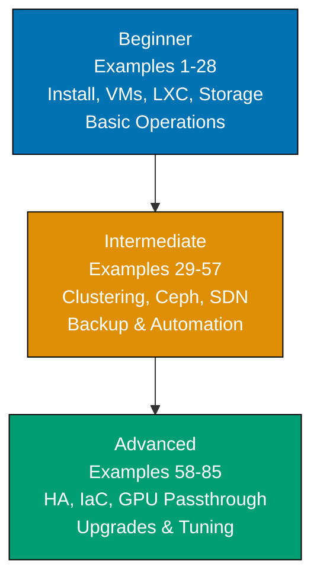

**Want to master Proxmox VE through working examples?** This by-example guide teaches Proxmox Virtual Environment fundamentals through 85 annotated, copy-paste-ready examples organized by complexity level—covering installation through full IaC automation pipelines.

## What Is By-Example Learning?

By-example learning is an **example-first approach** where you learn through annotated, runnable code rather than narrative explanations. Each example is self-contained, immediately executable, and heavily commented to show:

- **What each command does** — Inline comments explain CLI flags, API paths, and Proxmox behavior
- **Expected outputs** — Using `# =>` notation for command results, status outputs, and state changes
- **Proxmox mechanics** — How VMs, containers, clusters, storage, and the REST API work together
- **Key takeaways** — 1-2 sentence summaries of patterns and operational best practices

This approach is **ideal for experienced infrastructure engineers** who already understand Linux, networking, and virtualization concepts, and want to quickly master Proxmox VE's tooling, CLI commands, and automation patterns through working examples.

Unlike narrative tutorials that build understanding through explanation and storytelling, by-example learning lets you **see the command first, run it second, and understand it through direct interaction**.

## What Is Proxmox VE?

**Proxmox Virtual Environment (PVE)** is an open-source Type-1 hypervisor platform for running KVM virtual machines and LXC system containers. Unlike Type-2 hypervisors (VMware Workstation, VirtualBox) that run on top of an OS, Proxmox runs directly on bare metal. PVE provides:

- **KVM virtualization** — Full hardware virtualization for any OS (Windows, Linux, BSD)
- **LXC containers** — Lightweight OS-level virtualization sharing the host kernel
- **Web UI** — Browser-based management at `https://<host>:8006` (ExtJS)
- **REST API** — Full programmatic access; every UI action calls the API
- **Clustering** — Multi-node Corosync-based cluster with shared storage
- **High Availability** — Automatic VM/container failover across cluster nodes
- **Software-Defined Networking** — VXLAN, BGP-EVPN, VLAN-aware bridges
- **Ceph integration** — Built-in distributed storage using Ceph Squid 19.2.3

**Proxmox VE 9.1** (November 2025) is based on Debian 13.2 "Trixie", kernel 6.17.2, QEMU 10.1.2, and LXC 6.0.5. New in 9.1: OCI image support for LXC containers, vTPM in qcow2 enabling snapshots with Windows Secure Boot/BitLocker, per-vCPU nested virtualization control.

## Learning Path



Progress from Proxmox fundamentals (installation, basic VM/container management, local storage) through production cluster operations (Ceph, SDN, backup to PBS) to advanced infrastructure automation (Terraform, Ansible, Packer, HA, GPU passthrough, PVE 8→9 upgrades).

## Coverage Philosophy

This by-example guide provides **comprehensive coverage of Proxmox VE operations** through practical, annotated examples. Coverage represents depth and breadth of concepts—focus is on **outcomes and understanding**, not time.

### What's Covered

- **Installation** — ISO download/verification, graphical/TUI installer, unattended install
- **Web UI navigation** — Dashboard, nodes, storage, datacenter views
- **VM management** — Create, configure, start/stop/migrate, clone, template, cloud-init
- **LXC containers** — Create from templates and OCI images, resource limits, migration
- **Storage backends** — Directory, LVM, ZFS, NFS, iSCSI, Ceph RBD, PBS
- **Networking** — Linux bridges, VLANs, bonding, SDN zones/VNets, VXLAN, BGP-EVPN
- **Clustering** — Multi-node setup, Corosync, QDevice for 2-node quorum
- **Ceph** — Full cluster init, OSD management, pools, erasure coding, health monitoring
- **High Availability** — HA Manager, fencing, failover testing, affinity rules
- **Backup & restore** — vzdump, PBS integration, live-restore, pruning policies
- **Automation** — Terraform (bpg/proxmox), Ansible (community.proxmox), Packer, REST API
- **Advanced features** — PCIe/GPU passthrough, vTPM, nested virtualization, SDN DHCP
- **Upgrades** — PVE 8→9 migration path, Ceph Quincy/Reef→Squid prerequisite

### What's NOT Covered

- **Proxmox Backup Server deep-dive** — PBS 4.0 is covered as a PVE storage target; standalone PBS administration is a separate topic
- **Proxmox Mail Gateway** — Separate product
- **Windows guest optimization** — VirtIO driver installation covered briefly; deep Windows tuning out of scope
- **All Terraform/Ansible modules** — Focus on most common patterns; provider documentation covers edge cases

## Prerequisites

Before starting this tutorial, you should be comfortable with:

- **Linux fundamentals** — Command line, file system, package management (apt), systemd
- **Networking basics** — IP addressing, VLANs, bridges, routing, DNS
- **Virtualization concepts** — Hypervisors, VMs vs containers, storage types
- **Git basics** — For IaC automation examples (Terraform, Ansible)

No prior Proxmox experience required—this guide starts from first principles (ISO download) and builds to production HA clusters with full IaC automation.

## Example Structure

Each example follows a five-part format:

1. **Explanation** (2-3 sentences) — What the example demonstrates and why it matters
2. **Diagram** (when helpful) — Mermaid diagram visualizing architecture or execution flow
3. **Annotated code** — Commands with inline `# =>` comments showing outputs and state
4. **Key takeaway** — 1-2 sentence summary of the pattern learned
5. **Why It Matters** — 50-100 words connecting to real production usage

This format emphasizes **code first, explanation second**—you see working commands before diving into conceptual details.

## Getting Started

Install requirements and verify access before starting examples:

```bash
# Proxmox VE server requirements (bare metal or nested virt):
# - 64-bit CPU with hardware virtualization (Intel VT-x / AMD-V)
# - Minimum 2 GB RAM (8+ GB recommended for multiple VMs)
# - 32 GB storage (local disk or SAN LUN)
# - Network interface for management

# After installation, access the web UI from another machine:
# => Open browser: https://<proxmox-ip>:8006
# => Accept self-signed certificate warning
# => Log in: username=root, realm=PAM, password=<set during install>

# Verify PVE version from command line:
pveversion
# => pve-manager/9.1/... (running kernel: 6.17.2-1-pve)

# Check node status:
pvesh get /nodes/$(hostname)/status --output-format json | python3 -m json.tool
# => Returns node CPU, memory, uptime, and kernel information
```

Set up your bare-metal or nested-virtualization test environment, then proceed to [Beginner](/en/learn/software-engineering/infrastructure/tools/proxmox/by-example/beginner) examples.

## Examples by Level

### Beginner (Examples 1–28)

- [Example 1: Download and Verify the Proxmox VE 9.1 ISO](/en/learn/software-engineering/infrastructure/tools/proxmox/by-example/beginner#example-1-download-and-verify-the-proxmox-ve-91-iso)
- [Example 2: Create a Bootable USB Drive](/en/learn/software-engineering/infrastructure/tools/proxmox/by-example/beginner#example-2-create-a-bootable-usb-drive)
- [Example 3: Run the Graphical PVE Installer](/en/learn/software-engineering/infrastructure/tools/proxmox/by-example/beginner#example-3-run-the-graphical-pve-installer)
- [Example 4: Run the Text-Based TUI Installer](/en/learn/software-engineering/infrastructure/tools/proxmox/by-example/beginner#example-4-run-the-text-based-tui-installer)
- [Example 5: Log In to the Web UI and Navigate the Dashboard](/en/learn/software-engineering/infrastructure/tools/proxmox/by-example/beginner#example-5-log-in-to-the-web-ui-and-navigate-the-dashboard)
- [Example 6: Configure the No-Subscription Repository](/en/learn/software-engineering/infrastructure/tools/proxmox/by-example/beginner#example-6-configure-the-no-subscription-repository)
- [Example 7: Upload an ISO Image to Local Storage via Web UI](/en/learn/software-engineering/infrastructure/tools/proxmox/by-example/beginner#example-7-upload-an-iso-image-to-local-storage-via-web-ui)
- [Example 8: Create a Basic KVM VM from ISO](/en/learn/software-engineering/infrastructure/tools/proxmox/by-example/beginner#example-8-create-a-basic-kvm-vm-from-iso)
- [Example 9: Start, Stop, and Force-Kill a VM](/en/learn/software-engineering/infrastructure/tools/proxmox/by-example/beginner#example-9-start-stop-and-force-kill-a-vm)
- [Example 10: Open VM Console via Web UI](/en/learn/software-engineering/infrastructure/tools/proxmox/by-example/beginner#example-10-open-vm-console-via-web-ui)
- [Example 11: Install Guest OS Using VirtIO Drivers](/en/learn/software-engineering/infrastructure/tools/proxmox/by-example/beginner#example-11-install-guest-os-using-virtio-drivers)
- [Example 12: Resize a VM Disk](/en/learn/software-engineering/infrastructure/tools/proxmox/by-example/beginner#example-12-resize-a-vm-disk)
- [Example 13: Take and Restore a VM Snapshot](/en/learn/software-engineering/infrastructure/tools/proxmox/by-example/beginner#example-13-take-and-restore-a-vm-snapshot)
- [Example 14: Create an LXC Container from a Downloaded Template](/en/learn/software-engineering/infrastructure/tools/proxmox/by-example/beginner#example-14-create-an-lxc-container-from-a-downloaded-template)
- [Example 15: Start, Stop, and Enter an LXC Container Shell](/en/learn/software-engineering/infrastructure/tools/proxmox/by-example/beginner#example-15-start-stop-and-enter-an-lxc-container-shell)
- [Example 16: Create an LXC Container from an OCI Registry Image](/en/learn/software-engineering/infrastructure/tools/proxmox/by-example/beginner#example-16-create-an-lxc-container-from-an-oci-registry-image)
- [Example 17: Manage Users, Roles, and Permissions](/en/learn/software-engineering/infrastructure/tools/proxmox/by-example/beginner#example-17-manage-users-roles-and-permissions)
- [Example 18: Create an API Token for Automation](/en/learn/software-engineering/infrastructure/tools/proxmox/by-example/beginner#example-18-create-an-api-token-for-automation)
- [Example 19: Configure PAM, LDAP, and OpenID Connect Authentication](/en/learn/software-engineering/infrastructure/tools/proxmox/by-example/beginner#example-19-configure-pam-ldap-and-openid-connect-authentication)
- [Example 20: Set Up Local Storage: Directory, LVM, ZFS Pool](/en/learn/software-engineering/infrastructure/tools/proxmox/by-example/beginner#example-20-set-up-local-storage-directory-lvm-zfs-pool)
- [Example 21: Configure Network Bridges](/en/learn/software-engineering/infrastructure/tools/proxmox/by-example/beginner#example-21-configure-network-bridges)
- [Example 22: View Cluster and Node Resource Usage](/en/learn/software-engineering/infrastructure/tools/proxmox/by-example/beginner#example-22-view-cluster-and-node-resource-usage)
- [Example 23: Enable and Configure the Proxmox Firewall](/en/learn/software-engineering/infrastructure/tools/proxmox/by-example/beginner#example-23-enable-and-configure-the-proxmox-firewall)
- [Example 24: Schedule Automated Backups](/en/learn/software-engineering/infrastructure/tools/proxmox/by-example/beginner#example-24-schedule-automated-backups)
- [Example 25: Restore a VM from Backup](/en/learn/software-engineering/infrastructure/tools/proxmox/by-example/beginner#example-25-restore-a-vm-from-backup)
- [Example 26: Clone a VM — Full Clone vs Linked Clone](/en/learn/software-engineering/infrastructure/tools/proxmox/by-example/beginner#example-26-clone-a-vm--full-clone-vs-linked-clone)
- [Example 27: Convert a VM to a Template](/en/learn/software-engineering/infrastructure/tools/proxmox/by-example/beginner#example-27-convert-a-vm-to-a-template)
- [Example 28: Monitor Logs and Tasks in the Web UI](/en/learn/software-engineering/infrastructure/tools/proxmox/by-example/beginner#example-28-monitor-logs-and-tasks-in-the-web-ui)

### Intermediate (Examples 29–57)

- [Example 29: Create and Join a Multi-Node Cluster](/en/learn/software-engineering/infrastructure/tools/proxmox/by-example/intermediate#example-29-create-and-join-a-multi-node-cluster)
- [Example 30: Inspect Cluster Membership and Quorum Status](/en/learn/software-engineering/infrastructure/tools/proxmox/by-example/intermediate#example-30-inspect-cluster-membership-and-quorum-status)
- [Example 31: Configure a Corosync QDevice for 2-Node Clusters](/en/learn/software-engineering/infrastructure/tools/proxmox/by-example/intermediate#example-31-configure-a-corosync-qdevice-for-2-node-clusters)
- [Example 32: Perform Live Online VM Migration Between Nodes](/en/learn/software-engineering/infrastructure/tools/proxmox/by-example/intermediate#example-32-perform-live-online-vm-migration-between-nodes)
- [Example 33: Migrate an LXC Container Between Nodes](/en/learn/software-engineering/infrastructure/tools/proxmox/by-example/intermediate#example-33-migrate-an-lxc-container-between-nodes)
- [Example 34: Configure VLAN-Aware Networking on a Bridge](/en/learn/software-engineering/infrastructure/tools/proxmox/by-example/intermediate#example-34-configure-vlan-aware-networking-on-a-bridge)
- [Example 35: Set Up Linux Bonding for Network Redundancy](/en/learn/software-engineering/infrastructure/tools/proxmox/by-example/intermediate#example-35-set-up-linux-bonding-for-network-redundancy)
- [Example 36: Configure NFS Storage Backend](/en/learn/software-engineering/infrastructure/tools/proxmox/by-example/intermediate#example-36-configure-nfs-storage-backend)
- [Example 37: Configure iSCSI Storage with LVM](/en/learn/software-engineering/infrastructure/tools/proxmox/by-example/intermediate#example-37-configure-iscsi-storage-with-lvm)
- [Example 38: Create a ZFS Pool via CLI](/en/learn/software-engineering/infrastructure/tools/proxmox/by-example/intermediate#example-38-create-a-zfs-pool-via-cli)
- [Example 39: Initialise and Deploy a Ceph Cluster](/en/learn/software-engineering/infrastructure/tools/proxmox/by-example/intermediate#example-39-initialise-and-deploy-a-ceph-cluster)
- [Example 40: Create and Configure Ceph Storage Pools](/en/learn/software-engineering/infrastructure/tools/proxmox/by-example/intermediate#example-40-create-and-configure-ceph-storage-pools)
- [Example 41: Create a Ceph Erasure-Coded Pool](/en/learn/software-engineering/infrastructure/tools/proxmox/by-example/intermediate#example-41-create-a-ceph-erasure-coded-pool)
- [Example 42: Monitor Ceph Cluster Health and OSD Status](/en/learn/software-engineering/infrastructure/tools/proxmox/by-example/intermediate#example-42-monitor-ceph-cluster-health-and-osd-status)
- [Example 43: Configure SDN: Zone, VNet, and Subnet](/en/learn/software-engineering/infrastructure/tools/proxmox/by-example/intermediate#example-43-configure-sdn-zone-vnet-and-subnet)
- [Example 44: Set Up a VXLAN Zone for Multi-Node L2 Overlay](/en/learn/software-engineering/infrastructure/tools/proxmox/by-example/intermediate#example-44-set-up-a-vxlan-zone-for-multi-node-l2-overlay)
- [Example 45: Configure BGP-EVPN Zone for Routed L3 SDN](/en/learn/software-engineering/infrastructure/tools/proxmox/by-example/intermediate#example-45-configure-bgp-evpn-zone-for-routed-l3-sdn)
- [Example 46: Configure a Fabric for SDN (New in PVE 9.0)](/en/learn/software-engineering/infrastructure/tools/proxmox/by-example/intermediate#example-46-configure-a-fabric-for-sdn-new-in-pve-90)
- [Example 47: Configure Distributed Firewall with Security Groups](/en/learn/software-engineering/infrastructure/tools/proxmox/by-example/intermediate#example-47-configure-distributed-firewall-with-security-groups)
- [Example 48: Integrate Proxmox Backup Server (PBS 4.0)](/en/learn/software-engineering/infrastructure/tools/proxmox/by-example/intermediate#example-48-integrate-proxmox-backup-server-pbs-40)
- [Example 49: Use vzdump for Manual Backup and Schedule Backup Jobs](/en/learn/software-engineering/infrastructure/tools/proxmox/by-example/intermediate#example-49-use-vzdump-for-manual-backup-and-schedule-backup-jobs)
- [Example 50: Restore a VM Backup with Live-Restore from PBS](/en/learn/software-engineering/infrastructure/tools/proxmox/by-example/intermediate#example-50-restore-a-vm-backup-with-live-restore-from-pbs)
- [Example 51: Configure Backup Encryption and Pruning in PBS](/en/learn/software-engineering/infrastructure/tools/proxmox/by-example/intermediate#example-51-configure-backup-encryption-and-pruning-in-pbs)
- [Example 52: Manage LXC Container Resource Limits](/en/learn/software-engineering/infrastructure/tools/proxmox/by-example/intermediate#example-52-manage-lxc-container-resource-limits)
- [Example 53: Configure Cloud-Init for Automated VM Provisioning](/en/learn/software-engineering/infrastructure/tools/proxmox/by-example/intermediate#example-53-configure-cloud-init-for-automated-vm-provisioning)
- [Example 54: Use pvesh to Query and Modify Cluster Resources](/en/learn/software-engineering/infrastructure/tools/proxmox/by-example/intermediate#example-54-use-pvesh-to-query-and-modify-cluster-resources)
- [Example 55: Configure RBAC with Pools](/en/learn/software-engineering/infrastructure/tools/proxmox/by-example/intermediate#example-55-configure-rbac-with-pools)
- [Example 56: Configure Unattended Installation Using Answer File](/en/learn/software-engineering/infrastructure/tools/proxmox/by-example/intermediate#example-56-configure-unattended-installation-using-answer-file)
- [Example 57: Set Up Notification Endpoints](/en/learn/software-engineering/infrastructure/tools/proxmox/by-example/intermediate#example-57-set-up-notification-endpoints)

### Advanced (Examples 58–85)

- [Example 58: Enable and Configure the HA Manager for VM Failover](/en/learn/software-engineering/infrastructure/tools/proxmox/by-example/advanced#example-58-enable-and-configure-the-ha-manager-for-vm-failover)
- [Example 59: Configure HA Fencing](/en/learn/software-engineering/infrastructure/tools/proxmox/by-example/advanced#example-59-configure-ha-fencing)
- [Example 60: Test HA Failover Using the HA Simulator](/en/learn/software-engineering/infrastructure/tools/proxmox/by-example/advanced#example-60-test-ha-failover-using-the-ha-simulator)
- [Example 61: Configure HA Affinity Rules (New in PVE 9.0)](/en/learn/software-engineering/infrastructure/tools/proxmox/by-example/advanced#example-61-configure-ha-affinity-rules-new-in-pve-90)
- [Example 62: Set Up Cross-Cluster VM Migration](/en/learn/software-engineering/infrastructure/tools/proxmox/by-example/advanced#example-62-set-up-cross-cluster-vm-migration)
- [Example 63: Use the Terraform Provider to Provision VMs with Cloud-Init](/en/learn/software-engineering/infrastructure/tools/proxmox/by-example/advanced#example-63-use-the-terraform-provider-to-provision-vms-with-cloud-init)
- [Example 64: Use Terraform to Manage LXC Containers as Code](/en/learn/software-engineering/infrastructure/tools/proxmox/by-example/advanced#example-64-use-terraform-to-manage-lxc-containers-as-code)
- [Example 65: Automate VM Lifecycle with community.proxmox Ansible Collection](/en/learn/software-engineering/infrastructure/tools/proxmox/by-example/advanced#example-65-automate-vm-lifecycle-with-communityproxmox-ansible-collection)
- [Example 66: Use Ansible to Clone, Configure, and Destroy VMs at Scale](/en/learn/software-engineering/infrastructure/tools/proxmox/by-example/advanced#example-66-use-ansible-to-clone-configure-and-destroy-vms-at-scale)
- [Example 67: Build a Golden VM Template with Packer](/en/learn/software-engineering/infrastructure/tools/proxmox/by-example/advanced#example-67-build-a-golden-vm-template-with-packer)
- [Example 68: Full IaC Pipeline: Packer → PVE Template → Terraform Clone](/en/learn/software-engineering/infrastructure/tools/proxmox/by-example/advanced#example-68-full-iac-pipeline-packer--pve-template--terraform-clone)
- [Example 69: Write Custom Scripts Using the PVE REST API with curl](/en/learn/software-engineering/infrastructure/tools/proxmox/by-example/advanced#example-69-write-custom-scripts-using-the-pve-rest-api-with-curl)
- [Example 70: Use proxmoxer Python Library for API-Driven Automation](/en/learn/software-engineering/infrastructure/tools/proxmox/by-example/advanced#example-70-use-proxmoxer-python-library-for-api-driven-automation)
- [Example 71: Configure PCIe Passthrough (GPU, NIC, Storage)](/en/learn/software-engineering/infrastructure/tools/proxmox/by-example/advanced#example-71-configure-pcie-passthrough-gpu-nic-storage)
- [Example 72: Configure USB Device Passthrough](/en/learn/software-engineering/infrastructure/tools/proxmox/by-example/advanced#example-72-configure-usb-device-passthrough)
- [Example 73: Configure NVIDIA vGPU on PVE 9](/en/learn/software-engineering/infrastructure/tools/proxmox/by-example/advanced#example-73-configure-nvidia-vgpu-on-pve-9)
- [Example 74: Enable and Manage Nested Virtualization](/en/learn/software-engineering/infrastructure/tools/proxmox/by-example/advanced#example-74-enable-and-manage-nested-virtualization)
- [Example 75: Configure vTPM and Take VM Snapshots with Active vTPM](/en/learn/software-engineering/infrastructure/tools/proxmox/by-example/advanced#example-75-configure-vtpm-and-take-vm-snapshots-with-active-vtpm)
- [Example 76: Perform an In-Place Upgrade from PVE 8 to PVE 9](/en/learn/software-engineering/infrastructure/tools/proxmox/by-example/advanced#example-76-perform-an-in-place-upgrade-from-pve-8-to-pve-9)
- [Example 77: Upgrade Ceph from Quincy/Reef to Squid Before PVE 9](/en/learn/software-engineering/infrastructure/tools/proxmox/by-example/advanced#example-77-upgrade-ceph-from-quincyreef-to-squid-before-pve-9)
- [Example 78: Configure Storage Replication Between Cluster Nodes](/en/learn/software-engineering/infrastructure/tools/proxmox/by-example/advanced#example-78-configure-storage-replication-between-cluster-nodes)
- [Example 79: Monitor and Manage Storage Replication Jobs](/en/learn/software-engineering/infrastructure/tools/proxmox/by-example/advanced#example-79-monitor-and-manage-storage-replication-jobs)
- [Example 80: Set Up Ceph RBD Mirroring for Cross-Cluster Disaster Recovery](/en/learn/software-engineering/infrastructure/tools/proxmox/by-example/advanced#example-80-set-up-ceph-rbd-mirroring-for-cross-cluster-disaster-recovery)
- [Example 81: Tune ZFS ARC Size and Configure ZFS Datasets](/en/learn/software-engineering/infrastructure/tools/proxmox/by-example/advanced#example-81-tune-zfs-arc-size-and-configure-zfs-datasets)
- [Example 82: Configure S3-Compatible Backup Target in PBS 4.0](/en/learn/software-engineering/infrastructure/tools/proxmox/by-example/advanced#example-82-configure-s3-compatible-backup-target-in-pbs-40)
- [Example 83: Implement Full Backup Rotation Strategy with PBS](/en/learn/software-engineering/infrastructure/tools/proxmox/by-example/advanced#example-83-implement-full-backup-rotation-strategy-with-pbs)
- [Example 84: Configure SDN with DHCP IP Management](/en/learn/software-engineering/infrastructure/tools/proxmox/by-example/advanced#example-84-configure-sdn-with-dhcp-ip-management)
- [Example 85: Benchmark and Tune VM Disk I/O with VirtIO-BLK and Cache Modes](/en/learn/software-engineering/infrastructure/tools/proxmox/by-example/advanced#example-85-benchmark-and-tune-vm-disk-io-with-virtio-blk-and-cache-modes)
