Learn Terraform production patterns through 28 annotated code examples covering modules, remote state, workspaces, provisioners, dynamic configuration, and import workflows. Each example is self-contained and demonstrates real-world infrastructure patterns.

## Group 10: Modules & Composition

### Example 29: Basic Module Structure

Modules are reusable Terraform configurations called from root configurations. Modules enable DRY principles, standardization, and composition.

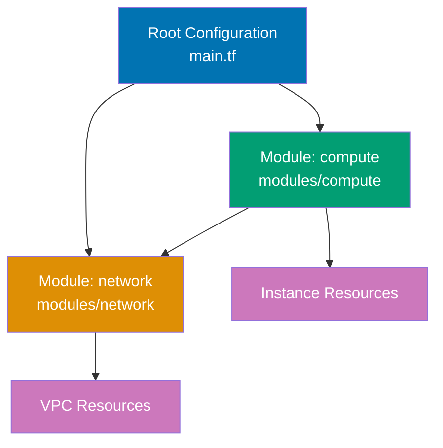

**Module structure**:

```
project/
├── main.tf # => Root configuration (calls modules)
├── variables.tf
├── outputs.tf
└── modules/
 └── storage/ # => Module directory
 ├── main.tf # => Module resources
 ├── variables.tf # => Module inputs
 └── outputs.tf # => Module outputs
```

**Module code** - `modules/storage/variables.tf`:

```hcl
variable "bucket_prefix" {
# => Input variable
 description = "Prefix for bucket name" # => String value
 # => Sets description
 type = string
 # => Sets type
}

variable "environment" {
# => Input variable
 description = "Environment name" # => String value
 # => Sets description
 type = string
 # => Sets type
}

variable "tags" {
# => Input variable
 description = "Resource tags" # => String value
 # => Sets description
 type = map(string)
 # => Sets type
 default = {} # => Map/object definition
 # => Sets default
}


```

**Module code** - `modules/storage/main.tf`:

```hcl
terraform {
# => Terraform configuration block
 required_version = ">= 1.0" # => String value
 # => Sets required_version
}

# Module creates local file (simulating cloud storage)
resource "local_file" "bucket" {
# => Resource definition
 filename = "${var.bucket_prefix}-${var.environment}-bucket.txt" # => String interpolation
 # => Sets filename
 content = <<-EOT
 # => Sets content
 Bucket: ${var.bucket_prefix}-${var.environment}
 Environment: ${var.environment}
 Tags: ${jsonencode(var.tags)}
 EOT
 # => Module manages resources independently
}

resource "local_file" "bucket_policy" {
# => Resource definition
 filename = "${var.bucket_prefix}-${var.environment}-policy.txt" # => String interpolation
 # => Sets filename
 content = "Bucket policy for ${local_file.bucket.filename}" # => String value
 # => Sets content
}


```

**Module code** - `modules/storage/outputs.tf`:

```hcl
output "bucket_name" {
# => Output value
 description = "Name of the bucket" # => String value
 # => Sets description
 value = local_file.bucket.filename
 # => Sets value
}

output "bucket_id" {
# => Output value
 description = "ID of the bucket" # => String value
 # => Sets description
 value = local_file.bucket.id
 # => Sets value
}

output "policy_name" {
# => Output value
 description = "Name of the policy file" # => String value
 # => Sets description
 value = local_file.bucket_policy.filename
 # => Sets value
}


```

**Root configuration** - `main.tf`:

```hcl
terraform {
# => Terraform configuration block
 required_version = ">= 1.0" # => String value
 # => Sets required_version
}

provider "local" {}
# => Provider configuration

# Call module with inputs
module "dev_storage" {
# => Module configuration
 source = "./modules/storage" # => Relative path to module
 # => Sets source

 bucket_prefix = "myapp" # => Pass to var.bucket_prefix
 # => Sets bucket_prefix
 environment = "development" # => Pass to var.environment
 # => Sets environment

 tags = { # => Map/object definition
 Team = "platform"
 # => Sets Team
 ManagedBy = "Terraform"
 # => Sets ManagedBy
 }
 # => Module inputs passed as arguments
}

# Call same module with different inputs
module "prod_storage" {
# => Module configuration
 source = "./modules/storage" # => String value
 # => Sets source

 bucket_prefix = "myapp" # => String value
 # => Sets bucket_prefix
 environment = "production" # => String value
 # => Sets environment

 tags = { # => Map/object definition
 Team = "platform"
 # => Sets Team
 ManagedBy = "Terraform"
 # => Sets ManagedBy
 Critical = "true"
 # => Sets Critical
 }
}

# Use module outputs
output "dev_bucket" {
# => Output value
 value = module.dev_storage.bucket_name # => Reference module output
 # => Sets value
}

output "prod_bucket" {
# => Output value
 value = module.prod_storage.bucket_name
 # => Sets value
}

output "all_buckets" {
# => Output value
 value = {
 dev = module.dev_storage.bucket_name
 # => Sets dev
 prod = module.prod_storage.bucket_name
 # => Sets prod
 }
}


```

**Usage**:

```bash
# Initialize (downloads modules)
# $ terraform init
# => Downloads local module (copies to .terraform/modules)

# Plan shows resources from both module calls
# $ terraform plan
# => module.dev_storage.local_file.bucket will be created
# => module.dev_storage.local_file.bucket_policy will be created
# => module.prod_storage.local_file.bucket will be created
# => module.prod_storage.local_file.bucket_policy will be created

# Apply creates resources from all modules
# $ terraform apply

# Access module outputs
# $ terraform output dev_bucket
# => myapp-development-bucket.txt
```

**Key Takeaway**: Modules are directories containing Terraform configurations with `variables.tf` (inputs), `main.tf` (resources), and `outputs.tf` (outputs). Call modules with `module` block and `source` pointing to module directory. Reference module outputs with `module.name.output_name`. Modules enable reusable infrastructure patterns.

**Why It Matters**: Modules are the foundation of scalable Terraform infrastructure, enabling reusable patterns that prevent copy-paste duplication across environments and teams. Modules enforce organizational standards: platform team publishes "approved VPC module" ensuring all VPCs follow security policies, preventing ad-hoc configurations that create compliance violations. This standardization is impossible with script-based infrastructure where every team invents their own patterns.

---

### Example 30: Module Versioning with Git Sources

Modules can be sourced from Git repositories with version pinning using tags, branches, or commit SHAs. This enables controlled module updates and rollbacks.

```hcl
terraform {
# => Terraform configuration block
 required_version = ">= 1.0" # => String value
 # => Sets required_version
}

provider "local" {}
# => Provider configuration

# Module from Git tag (recommended for production)
module "storage_v1" {
# => Module configuration
 source = "git::https://github.com/example/terraform-modules.git//storage?ref=v1.2.3" # => String value
 # => source uses Git URL with subdirectory (//storage) and tag (ref=v1.2.3)
 # => terraform init clones repository and checks out v1.2.3 tag
 # => Changes to module repository don't affect this configuration until ref updated

 bucket_prefix = "app-v1" # => String value
 # => Sets bucket_prefix
 environment = "production" # => String value
 # => Sets environment
}

# Module from Git branch (for testing new features)
module "storage_dev" {
# => Module configuration
 source = "git::https://github.com/example/terraform-modules.git//storage?ref=feature/new-policy" # => String value
 # => ref=feature/new-policy tracks branch (updates with branch changes)
 # => terraform get -update pulls latest branch commits

 bucket_prefix = "app-dev" # => String value
 # => Sets bucket_prefix
 environment = "development" # => String value
 # => Sets environment
}

# Module from commit SHA (immutable reference)
module "storage_stable" {
# => Module configuration
 source = "git::https://github.com/example/terraform-modules.git//storage?ref=abc123def456" # => String value
 # => ref=abc123def456 uses exact commit (fully immutable)
 # => Guarantees exact module code, even if tags are moved

 bucket_prefix = "app-stable" # => String value
 # => Sets bucket_prefix
 environment = "staging" # => String value
 # => Sets environment
}

output "module_sources" {
# => Output value
 value = {
 v1 = "Tag v1.2.3 (production-safe)"
 # => Sets v1
 dev = "Branch feature/new-policy (tracking latest)"
 # => Sets dev
 stable = "Commit abc123def456 (immutable)"
 # => Sets stable
 }
}


```

**Key Takeaway**: Use Git tags (`ref=v1.2.3`) for production modules to control updates explicitly. Branches track latest changes for development environments. Commit SHAs provide immutable references for critical stability. Always version modules to prevent unexpected changes.

**Why It Matters**: Module versioning prevents production breakage when module authors push breaking changes— Tag-based versioning enables gradual rollouts: test new module version in dev (branch), validate in staging (tag), then promote to production, with instant rollback capability if issues arise. This controlled update pattern is impossible with always-latest module sources.

---

### Example 31: Module Input Validation

Module variables can include validation rules to catch configuration errors at plan time rather than apply time. This provides early feedback and better error messages.

```hcl
# modules/validated-storage/variables.tf
variable "environment" {
# => Input variable
 description = "Environment name" # => String value
 # => Sets description
 type = string
 # => Sets type

 validation {
 # => Validation rule enforces constraints
 condition = contains( # => Checks list membership
["dev", "staging", "prod"], var.environment)
 # => condition must return true for validation to pass
 # => contains( # => Checks list membership
) checks if environment is in allowed list
 error_message = "Environment must be dev, staging, or prod." # => String value
 # => error_message shown when validation fails
 }
}

variable "bucket_name" {
# => Input variable
 description = "S3 bucket name" # => String value
 # => Sets description
 type = string
 # => Sets type

 validation {
 # => Validation rule enforces constraints
 condition = can(regex("^[a-z0-9][a-z0-9-]{1,61}[a-z0-9]$", var.bucket_name))
 # => can() returns true if regex succeeds, false if it errors
 # => regex validates DNS-compliant bucket names (3-63 chars, lowercase)
 error_message = "Bucket name must be 3-63 characters, lowercase letters, numbers, hyphens." # => String value
 # => Sets error_message
 }

 validation {
 # => Validation rule enforces constraints
 condition = !can(regex("^xn--", var.bucket_name))
 # => Second validation ensures name doesn't start with xn-- (reserved prefix)
 error_message = "Bucket name cannot start with xn-- (reserved for Punycode)." # => String value
 # => Sets error_message
 }
}

variable "retention_days" {
# => Input variable
 description = "Data retention in days" # => String value
 # => Sets description
 type = number
 # => Sets type

 validation {
 # => Validation rule enforces constraints
 condition = var.retention_days >= 1 && var.retention_days <= 365
 # => Numeric range validation
 error_message = "Retention must be between 1 and 365 days."
 # => Sets error_message
 }
}

# modules/validated-storage/main.tf
resource "local_file" "bucket" {
# => Resource definition
 filename = "${var.bucket_name}-${var.environment}.txt"
 # => All variables validated before this resource executes
 content = "Retention: ${var.retention_days} days"
 # => Sets content
}


```

**Root configuration**:

```hcl
terraform {
# => Terraform configuration block
 required_version = ">= 1.0" # => String value
 # => Sets required_version
}

provider "local" {}
# => Provider configuration

module "storage" {
 # => Module instantiation with input variables
 source = "./modules/validated-storage" # => String value
 # => Sets source

 environment = "prod" # => Valid: in allowed list
 # => Sets environment
 bucket_name = "my-app-data" # => Valid: matches regex
 # => Sets bucket_name
 retention_days = 90 # => Valid: within range
 # => Sets retention_days
}

# This would fail validation at plan time:
# module "invalid" {
# source = "./modules/validated-storage"
# environment = "production" # => Error: not in [dev, staging, prod]
# bucket_name = "MyBucket" # => Error: uppercase not allowed
# retention_days = 400 # => Error: exceeds 365 day maximum
# }


```

**Key Takeaway**: Module validation rules enforce constraints at `terraform plan` time using `validation` blocks with `condition` and `error_message`. Use `can()` for regex validation and `contains( # => Checks list membership
)` for allowlist checks. Validation prevents invalid configurations from reaching `apply` phase.

**Why It Matters**: Input validation catches configuration errors before infrastructure changes, preventing costly mistakes— Regex validation on bucket names prevents AWS API errors that would waste 15 minutes of developer time debugging "InvalidBucketName" failures. Fail-fast validation at plan time beats discovering issues after partial apply when rollback is complex.

---

### Example 32: Module Composition with Dependencies

Modules can depend on other module outputs, creating composition patterns where infrastructure builds on layers. Use `depends_on` for explicit ordering when implicit dependencies aren't detected.

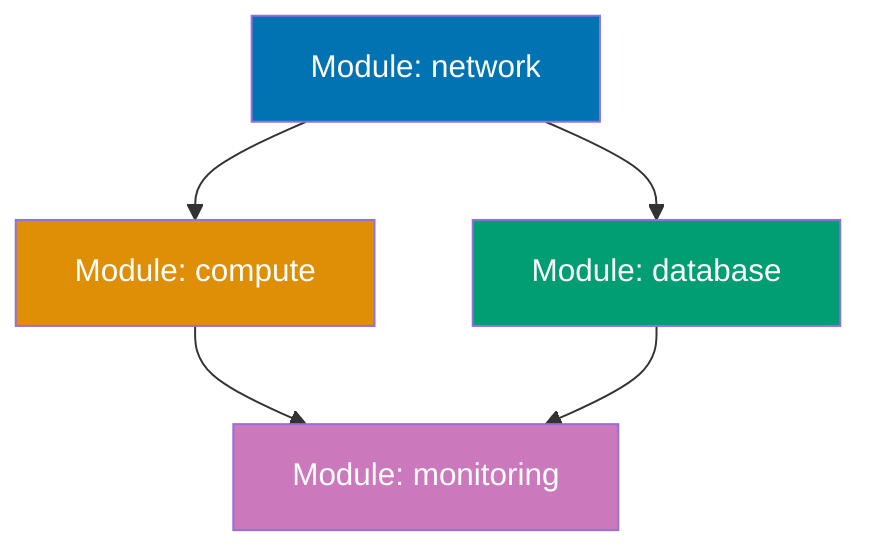

**Code**:

```hcl
terraform {
# => Terraform configuration block
 required_version = ">= 1.0" # => String value
 # => Sets required_version
}

provider "local" {}
# => Provider configuration

# Layer 1: Network module (no dependencies)
module "network" {
# => Module configuration
 source = "./modules/network" # => String value
 # => Sets source

 vpc_name = "main-vpc" # => String value
 # => Sets vpc_name
 cidr = "10.0.0.0/16" # => String value
 # => Sets cidr
}

# Layer 2: Compute module (depends on network outputs)
module "compute" {
# => Module configuration
 source = "./modules/compute" # => String value
 # => Sets source

 vpc_id = module.network.vpc_id # => Implicit dependency via output reference
 # => Sets vpc_id
 subnet_id = module.network.subnet_id # => Terraform creates network before compute
 # => Sets subnet_id

 instance_count = 3 # => Numeric value
 # => Sets instance_count
}

# Layer 2: Database module (parallel to compute, depends on network)
module "database" {
# => Data source
 source = "./modules/database" # => String value
 # => Sets source

 vpc_id = module.network.vpc_id
 # => Sets vpc_id
 subnet_id = module.network.private_subnet_id
 # => Sets subnet_id

 db_name = "appdb" # => String value
 # => Sets db_name
}

# Layer 3: Monitoring module (depends on compute and database)
module "monitoring" {
# => Module configuration
 source = "./modules/monitoring"
 # => Sets source

 compute_endpoints = module.compute.instance_ips # => Depends on compute
 # => Sets compute_endpoints
 database_endpoint = module.database.connection_url # => Depends on database
 # => Sets database_endpoint

 # Explicit dependency when outputs don't capture relationship
 depends_on = [ # => Explicit dependency list


 # => Sets depends_on
 module.compute,
 module.database,
 ]
 # => Explicit dependency enforces creation order
 # => Use when implicit dependencies (output references) don't capture ordering
}

# Cross-layer outputs
output "infrastructure_map" {
# => Output value
 value = {
 network = {
 vpc_id = module.network.vpc_id
 # => Sets vpc_id
 subnet_id = module.network.subnet_id
 # => Sets subnet_id
 }
 compute = {
 instance_ips = module.compute.instance_ips
 # => Sets instance_ips
 }
 database = {
 url = module.database.connection_url
 # => Sets url
 }
 monitoring = {
 dashboard_url = module.monitoring.dashboard_url
 # => Sets dashboard_url
 }
 }
 # => Single output capturing entire infrastructure state
}


```

**Key Takeaway**: Module dependencies are implicit through output references (Terraform detects `module.network.vpc_id` usage) or explicit with `depends_on` meta-argument. Layer infrastructure with independent modules at bottom (network) and dependent modules above (compute, database, monitoring). Explicit `depends_on` ensures ordering when outputs don't capture relationships.

**Why It Matters**: Module composition enables layered infrastructure where teams can own separate concerns—platform team manages network module, application teams consume VPC outputs without understanding networking internals. This separation of concerns prevents the "big ball of infrastructure" anti-pattern where one team controls everything and becomes a bottleneck for all changes.

---

### Example 33: Module Count and For Each

Modules support `count` and `for_each` meta-arguments to create multiple instances with different configurations. This enables multi-region deployments and resource multiplication.

```hcl
terraform {
# => Terraform configuration block
 required_version = ">= 1.0" # => String value
 # => Sets required_version
}

provider "local" {}
# => Provider configuration

# Module with count (indexed instances)
module "regional_storage_count" {
# => Module configuration
 source = "./modules/storage" # => String value
 # => Sets source
 count = 3 # => Create 3 module instances
 # => Creates specified number of instances

 bucket_prefix = "region-${count.index}" # => count.index is 0, 1, 2
 # => Produces: region-0, region-1, region-2
 environment = "production" # => String value
 # => Sets environment
}

# Module with for_each (named instances)
module "regional_storage_map" {
# => Module configuration
 source = "./modules/storage" # => String value
 # => Sets source

 for_each = { # => Map/object definition
 # => Creates multiple instances from collection
 us-east = { location = "us-east-1", tier = "standard" }
 # => Sets us-east
 eu-west = { location = "eu-west-1", tier = "premium" }
 # => Sets eu-west
 ap-south = { location = "ap-south-1", tier = "standard" }
 # => Sets ap-south
 }
 # => for_each creates module.regional_storage_map["us-east"], ["eu-west"], ["ap-south"]
 # => each.key is "us-east", "eu-west", "ap-south"
 # => each.value is the map value

 bucket_prefix = "app-${each.key}" # => each.key references map key
 # => Sets bucket_prefix
 environment = each.value.tier # => each.value.tier references nested attribute
 # => Sets environment

 tags = { # => Map/object definition
 Location = each.value.location
 # => Sets Location
 Tier = each.value.tier
 # => Sets Tier
 }
}

# for_each with set (unique region names)
variable "regions" {
# => Input variable
 type = set(string)
 # => Sets type
 default = ["us-west-2", "eu-central-1", "ap-northeast-1"]
 # => Sets default
}

module "regional_storage_set" {
# => Module configuration
 source = "./modules/storage"
 # => Sets source
 for_each = var.regions # => for_each works with sets
 # => Creates multiple instances from collection

 bucket_prefix = "backup-${each.key}" # => each.key is set element
 # => Sets bucket_prefix
 environment = "production"
 # => Sets environment
}

# Accessing module outputs with count
output "count_bucket_names" {
# => Output value
 value = [
 # => Sets value
 for i in range(3) : module.regional_storage_count[i].bucket_name
 ]
 # => Output: ["region-0-production-bucket.txt", "region-1-..", "region-2-.."]
}

# Accessing module outputs with for_each
output "map_bucket_names" {
# => Output value
 value = {
 for k, m in module.regional_storage_map : k => m.bucket_name
 # => Sets for k, m in module.regional_storage_map : k
 }
 # => Output: {us-east = "app-us-east-premium-bucket.txt", eu-west = .., ap-south = ..}
}


```

**Key Takeaway**: Use `count` for indexed module instances when order matters or quantity is dynamic. Use `for_each` with maps or sets for named instances with different configurations per region/environment. Access count outputs with `module.name[index]` and for_each outputs with `module.name[key]`. for_each is preferred for production (stable references).

**Why It Matters**: for_each prevents resource address shifting when middle elements are removed—Stripe uses for_each for multi-region infrastructure because removing "eu-west" doesn't renumber all subsequent regions (unlike count where removing index 1 shifts 2→1, 3→2, causing unintended resource replacement). Map-based for_each enables per-region configuration: us-east gets high-availability tier, eu-west gets standard tier, without duplicating module code. This pattern scaled Stripe from 3 regions to 12 without modifying module logic, just expanding the regions map.

---

### Example 34: Terraform Registry Modules

Public and private Terraform Registry modules enable sharing reusable infrastructure patterns. Registry modules use semantic versioning and documentation standards.

```hcl
terraform {
# => Terraform configuration block
 required_version = ">= 1.0" # => String value
 # => Sets required_version

 required_providers {
 # => Provider configuration
 aws = { # => Map/object definition
 source = "hashicorp/aws" # => String value
 # => Provider source location
 version = "~> 5.0" # => String value
 # => Sets version
 }
 }
}

provider "aws" {
# => Provider configuration
 region = "us-west-2" # => String value
 # => Sets region
}

# Public registry module (Terraform Registry: registry.terraform.io)
module "vpc_public" {
# => Module configuration
 source = "terraform-aws-modules/vpc/aws" # => String value
 # => source format: NAMESPACE/NAME/PROVIDER
 # => Resolves to: registry.terraform.io/terraform-aws-modules/vpc/aws
 version = "5.1.0" # => String value
 # => Semantic version (major.minor.patch)
 # => terraform init downloads version 5.1.0 from registry

 name = "production-vpc" # => String value
 # => Sets name
 cidr = "10.0.0.0/16" # => String value
 # => Sets cidr

 azs = ["us-west-2a", "us-west-2b", "us-west-2c"] # => List definition
 # => Sets azs
 private_subnets = ["10.0.1.0/24", "10.0.2.0/24", "10.0.3.0/24"] # => List definition
 # => Sets private_subnets
 public_subnets = ["10.0.101.0/24", "10.0.102.0/24", "10.0.103.0/24"] # => List definition
 # => Sets public_subnets

 enable_nat_gateway = true # => Boolean value
 # => Sets enable_nat_gateway
 enable_vpn_gateway = false # => Boolean value
 # => Sets enable_vpn_gateway

 tags = { # => Map/object definition
 Environment = "production"
 # => Sets Environment
 ManagedBy = "Terraform"
 # => Sets ManagedBy
 }
 # => Module inputs documented in registry UI
}

# Private registry module (Terraform Cloud/Enterprise)
module "internal_app" {
# => Module configuration
 source = "app.terraform.io/my-org/app-module/aws"
 # => Private registry requires organization prefix (app.terraform.io/my-org)
 # => Authenticated via TF_TOKEN_app_terraform_io environment variable
 version = "~> 2.1"
 # => ~> 2.1 allows 2.1.x (patch updates), blocks 2.2.0 (minor updates)

 app_name = "payment-service"
 # => Sets app_name
 environment = "production"
 # => Sets environment
}

# Version constraints
module "versioned_example" {
# => Module configuration
 source = "terraform-aws-modules/s3-bucket/aws"
 # => Provider source location
 version = ">= 3.0, < 4.0"
 # => Allows any 3.x version, blocks 4.0 (major version upgrade)
 # => Multiple constraints combined with commas

 bucket = "my-versioned-bucket"
 # => Sets bucket
}

output "vpc_id" {
# => Output value
 value = module.vpc_public.vpc_id
 # => Public module outputs documented in registry
}


```

**Key Takeaway**: Public registry modules use `NAMESPACE/NAME/PROVIDER` format and resolve to `registry.terraform.io`. Private registry modules require organization prefix (`app.terraform.io/ORG`). Always specify `version` constraint to control updates. Use semantic versioning: `~> 1.2` (allow patch), `>= 1.0, < 2.0` (allow minor).

## Why It Matters

Registry modules prevent reinventing common patterns—the terraform-aws-modules VPC module is used by thousands of companies, benefits from community bug fixes, and receives AWS best practice updates without requiring each company to maintain their own VPC logic. Version constraints prevent breaking changes: `~> 3.0` allows security patches (3.0.1, 3.0.2) but blocks 4.0.0 which might rename outputs or change resource behavior. Private registries enable internal standardization:

### Example 35: Module Data-Only Pattern

Modules don't have to create resources—data-only modules encapsulate complex data lookups and transformations, acting as reusable queries.

```hcl
# modules/data-lookup/variables.tf
variable "environment" {
# => Input variable
 type = string
 # => Sets type
}

variable "region" {
# => Input variable
 type = string
 # => Sets type
}

# modules/data-lookup/main.tf
# Data-only module performs lookups without creating resources
data "local_file" "config" {
# => Data source
 filename = "${path.module} # => Current module directory path/configs/${var.environment}-${var.region}.json"
 # => path.module refers to module directory (not root)
}

locals {
# => Local values
 # Parse JSON configuration
 config = jsondecode(data.local_file.config.content)
 # => Sets config

 # Compute derived values
 subnet_count = length( # => Returns collection size
local.config.availability_zones)
 # => Sets subnet_count

 # Complex transformations
 subnet_cidrs = [ # => List definition
 # => Sets subnet_cidrs
 for i, az in local.config.availability_zones :
 cidrsubnet(local.config.vpc_cidr, 8, i)
 ]
}

# modules/data-lookup/outputs.tf
output "vpc_cidr" {
# => Output value
 value = local.config.vpc_cidr
 # => Sets value
}

output "availability_zones" {
# => Output value
 value = local.config.availability_zones
 # => Sets value
}

output "subnet_cidrs" {
# => Output value
 value = local.subnet_cidrs
 # => Computed subnet CIDRs (not in source config)
}

output "instance_type" {
# => Output value
 value = local.config.compute.instance_type
 # => Sets value
}


```

**Root configuration**:

```hcl
terraform {
# => Terraform configuration block
 required_version = ">= 1.0" # => String value
 # => Sets required_version
}

provider "local" {}
# => Provider configuration

# Data-only module call (no resources created)
module "prod_config" {
# => Module configuration
 source = "./modules/data-lookup" # => String value
 # => Sets source

 environment = "production" # => String value
 # => Sets environment
 region = "us-west-2" # => String value
 # => Sets region
}

# Use module outputs to configure resources
resource "local_file" "deployment_manifest" {
# => Resource definition
 filename = "deployment.txt" # => String value
 # => Sets filename
 content = <<-EOT
 # => Sets content
 VPC CIDR: ${module.prod_config.vpc_cidr}
 # => Module configuration
 AZs: ${jsonencode(module.prod_config.availability_zones)}
 # => Module configuration
 Subnets: ${jsonencode(module.prod_config.subnet_cidrs)}
 # => Module configuration
 Instance Type: ${module.prod_config.instance_type}
 # => Module configuration
 EOT
 # => All values from data-only module
}

output "computed_subnets" {
# => Output value
 value = module.prod_config.subnet_cidrs
 # => Reusable subnet calculation from module
}


```

**Key Takeaway**: Data-only modules use `data` sources and `locals` without `resource` blocks. They encapsulate complex lookups, JSON/YAML parsing, and computed values. Useful for centralizing environment-specific configurations or multi-step data transformations that are reused across multiple root configurations.

**Why It Matters**: Data-only modules prevent duplicating complex lookup logic across configurations— Centralizing JSON config parsing in modules ensures all teams parse environment configurations identically, preventing the "staging uses subnet 0, production accidentally uses subnet 1" mistakes that cause network routing failures. This pattern makes complex data transformations reusable and testable independently of resource creation.

---

## Group 11: Remote State Management

### Example 36: Local Backend with State File

Terraform state tracks resource metadata and enables change detection. Local backend stores state in `terraform.tfstate` file in working directory.

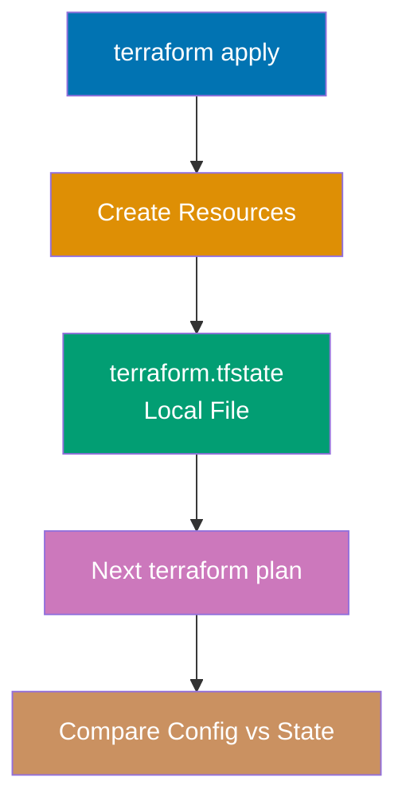

**Code**:

```hcl
terraform {
# => Terraform configuration block
 required_version = ">= 1.0" # => String value
 # => Sets minimum Terraform version

 # Local backend (default, no configuration needed)
 backend "local" {
 # => Backend block configures state storage location
 path = "terraform.tfstate" # => State file location (default)
 # => Relative to working directory
 # => File created on first terraform apply
 }
 # => Local backend is default (can omit this block)
 # => No locking, no encryption, single-user only
}

provider "local" {}
# => Local provider for file operations

resource "local_file" "app_config" {
# => Resource tracked in terraform.tfstate
 filename = "app-config.txt" # => String value
 # => Sets filename
 # => Creates file in current directory
 content = "Database URL: db.example.com" # => String value
 # => Sets content
 # => State records filename, content, id, md5
}

# State stores resource attributes
# After apply, terraform.tfstate contains:
# {
# "resources": [{
# "type": "local_file",
# "name": "app_config",
# "instances": [{
# "attributes": {
# "filename": "app-config.txt",
# "content": "Database URL: db.example.com",
# "id": "abc123..",
# "content_md5": "def456.."
# }
# }]
# }]
# }
# => JSON structure maps config to infrastructure reality
# => Terraform reads state to determine required changes

output "state_location" {
# => Output value showing backend type
 value = "terraform.tfstate (local backend)"
 # => Displayed after terraform apply
 # => Confirms state stored locally
}
```

**State file operations**:

```bash
# $ terraform apply
# => Creates terraform.tfstate with resource metadata

# $ terraform show
# => Displays resources from state file
# # local_file.app_config:
# resource "local_file" "app_config" {
# content = "Database URL: db.example.com"
# filename = "app-config.txt"
# id = "abc123.."
# }

# $ terraform state list
# => Lists all resources in state
# local_file.app_config

# $ terraform state show local_file.app_config
# => Shows specific resource attributes from state
```

**Key Takeaway**: Local backend stores state in `terraform.tfstate` file. State contains resource IDs, attributes, metadata, and dependencies. Terraform compares desired config against state to determine required changes. Local backend suitable for individual development, NOT for team collaboration (no locking, no sharing).

**Why It Matters**: State is Terraform's memory of infrastructure—without state, Terraform can't determine if resources exist, must be created, updated, or deleted. The state file maps `local_file.app_config` in HCL to actual file `app-config.txt` on disk. Local backend is dangerous for teams: two people running `terraform apply` simultaneously can corrupt state, causing resources to be duplicated or deleted. This is why production infrastructure requires remote backends with locking (Examples 37-39).

---

### Example 37: S3 Backend with State Locking

S3 backend stores Terraform state in AWS S3 bucket with DynamoDB table for state locking. This enables team collaboration with concurrent operation safety.

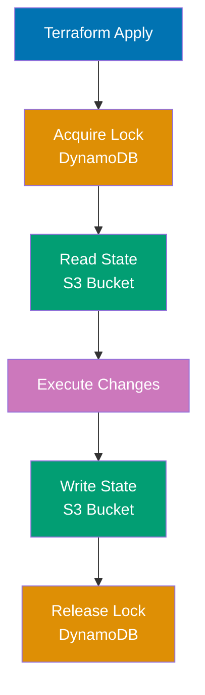

```hcl
terraform {
# => Terraform configuration block
 required_version = ">= 1.0" # => String value
 # => Sets required_version

 required_providers {
 # => Provider configuration
 aws = { # => Map/object definition
 source = "hashicorp/aws" # => String value
 # => Provider source location
 version = "~> 5.0" # => String value
 # => Sets version
 }
 }

 backend "s3" {
 bucket = "mycompany-terraform-state" # => String value
 # => S3 bucket name (must exist before terraform init)
 key = "production/app/terraform.tfstate" # => String value
 # => Object key (path within bucket)
 # => Different projects use different keys in same bucket
 region = "us-west-2" # => String value
 # => Bucket region

 encrypt = true # => Boolean value
 # => Server-side encryption (AES-256)
 # => State may contain secrets (database passwords, API keys)

 dynamodb_table = "terraform-state-locks" # => String value
 # => DynamoDB table for state locking (must exist)
 # => Prevents concurrent terraform apply operations
 # => Table must have partition key "LockID" (String type)
 }
}

provider "aws" {
# => Provider configuration
 region = "us-west-2" # => String value
 # => Sets region
}

resource "aws_s3_bucket" "example" {
# => Resource definition
 bucket = "my-app-bucket" # => String value
 # => Resource managed via S3 backend state
}

# State locking workflow:
# 1. terraform plan/apply acquires lock in DynamoDB
# 2. Reads current state from S3
# 3. Executes operations
# 4. Writes updated state to S3
# 5. Releases lock in DynamoDB
# => If another user runs terraform apply, they wait for lock or fail

```

**Backend initialization**:

```bash
# Create S3 bucket and DynamoDB table first (one-time setup):
# $ aws s3 mb s3://mycompany-terraform-state
# $ aws s3api put-bucket-versioning --bucket mycompany-terraform-state --versioning-configuration Status=Enabled
# $ aws dynamodb create-table \
# --table-name terraform-state-locks \
# --attribute-definitions AttributeName=LockID,AttributeType=S \
# --key-schema AttributeName=LockID,KeyType=HASH \
# --billing-mode PAY_PER_REQUEST

# Initialize backend:
# $ terraform init
# => Initializing the backend..
# => Successfully configured the backend "s3"!

# State operations with S3 backend:
# $ terraform apply
# => Acquiring state lock (DynamoDB)
# => State lock acquired (ID: abc-123-def-456)
# => Apply complete! Resources: 1 added, 0 changed, 0 destroyed.
# => Releasing state lock..

# If another user tries to apply simultaneously:
# $ terraform apply
# => Error: Error acquiring the state lock
# => Lock Info:
# => ID: abc-123-def-456
# => Path: mycompany-terraform-state/production/app/terraform.tfstate
# => Operation: OperationTypeApply
# => Who: alice@laptop
# => Created: 2025-01-02 10:30:00 UTC
```

**Key Takeaway**: S3 backend stores state remotely with encryption (`encrypt = true`) and uses DynamoDB table for state locking to prevent concurrent modifications. Backend requires pre-existing S3 bucket and DynamoDB table with `LockID` partition key. State locks prevent multiple users from corrupting state through simultaneous applies.

**Why It Matters**: S3 backend with DynamoDB locking prevents the state corruption disasters that plague local backends—Coinbase experienced state corruption when two SREs ran `terraform apply` simultaneously on local state, creating duplicate security groups that broke production networking. S3 backend centralizes state enabling team collaboration: all engineers see same infrastructure state, preventing "works on my machine" issues. Versioning on S3 bucket provides state rollback capability if bad apply corrupts state. Encryption protects secrets in state (database passwords, API keys) from unauthorized access.

---

### Example 38: Backend Configuration with Partial Config

Backend configuration can be partially specified in HCL and completed via CLI flags, environment variables, or config files. This enables reusable configurations across environments.

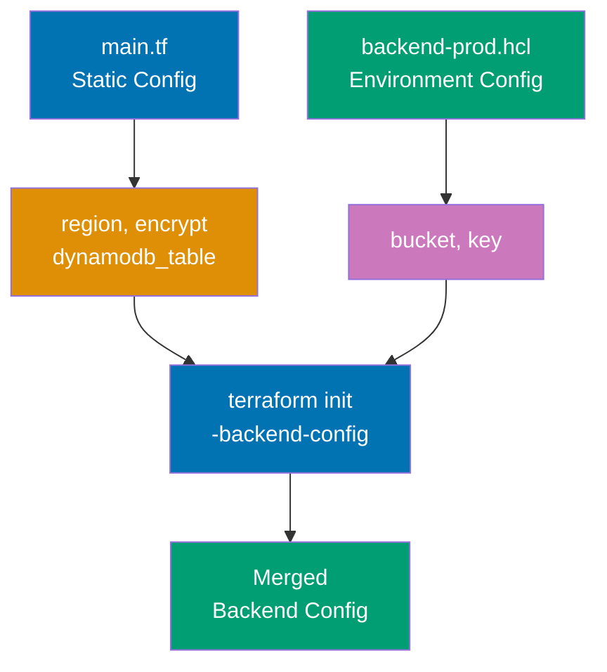

```hcl
terraform {
# => Terraform configuration block
 required_version = ">= 1.0" # => String value
 # => Sets required_version

 required_providers {
 # => Provider configuration
 aws = { # => Map/object definition
 source = "hashicorp/aws" # => String value
 # => Provider source location
 version = "~> 5.0" # => String value
 # => Sets version
 }
 }

 backend "s3" {
 # Static config in HCL
 region = "us-west-2" # => String value
 # => Sets region
 encrypt = true # => Boolean value
 # => Sets encrypt
 dynamodb_table = "terraform-state-locks" # => String value
 # => Sets dynamodb_table

 # bucket and key left unspecified (provided at init time)
 # => Enables reusing same configuration across environments
 }
}

provider "aws" {
# => Provider configuration
 region = "us-west-2" # => String value
 # => Sets region
}

resource "aws_s3_bucket" "app" {
# => Resource definition
 bucket = "my-application-bucket" # => String value
 # => Sets bucket
}


```

**Backend configuration file** - `backend-prod.hcl`:

```hcl
bucket = "mycompany-terraform-state"
key = "production/app/terraform.tfstate"
# => Partial backend config (only bucket and key)
# => Merged with backend "s3" block in main.tf
```

**Backend configuration file** - `backend-staging.hcl`:

```hcl
bucket = "mycompany-terraform-state"
# => Sets bucket
key = "staging/app/terraform.tfstate"
# => Same bucket, different key (staging vs production)

```

**Backend initialization with partial config**:

```bash
# Initialize production backend:
# $ terraform init -backend-config=backend-prod.hcl
# => Backend config:
# => region: us-west-2 (from main.tf)
# => encrypt: true (from main.tf)
# => dynamodb_table: terraform-state-locks (from main.tf)
# => bucket: mycompany-terraform-state (from backend-prod.hcl)
# => key: production/app/terraform.tfstate (from backend-prod.hcl)

# Initialize staging backend:
# $ terraform init -backend-config=backend-staging.hcl
# => Same config except key: staging/app/terraform.tfstate

# Provide config via CLI flags:
# $ terraform init \
# -backend-config="bucket=mycompany-terraform-state" \
# -backend-config="key=dev/app/terraform.tfstate"
# => Override any backend setting at init time

# Provide config via environment variables:
# $ export TF_CLI_ARGS_init="-backend-config=bucket=mycompany-terraform-state -backend-config=key=dev/app/terraform.tfstate"
# $ terraform init
# => Environment variable sets backend config
```

**Key Takeaway**: Partial backend configuration separates static settings (region, encryption) in HCL from dynamic settings (bucket, key) provided at `terraform init` via `-backend-config` flag, config file, or environment variables. This enables reusable configurations across environments without hardcoding environment-specific values in version control.

**Why It Matters**: Partial backend config prevents hardcoding production credentials in HCL files committed to git—Twitter uses partial config to keep AWS account IDs and bucket names out of repository, providing them via CI/CD environment variables per deployment environment. This pattern enables "write once, deploy anywhere": same Terraform configuration deploys to dev (backend-dev.hcl), staging (backend-staging.hcl), and production (backend-prod.hcl) without modifying HCL code. Security benefit: backend credentials never appear in git history where they could leak.

---

### Example 39: Remote State Data Sources

Terraform can read outputs from other state files using `terraform_remote_state` data source. This enables cross-stack references without tight coupling.

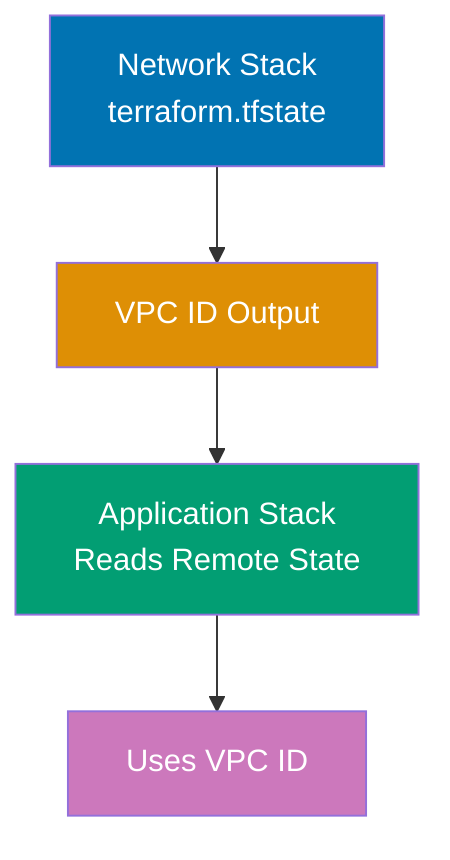

**Network stack** - `network/main.tf`:

```hcl
terraform {
# => Terraform configuration block
 required_version = ">= 1.0" # => String value
 # => Sets required_version

 backend "s3" {
 bucket = "mycompany-terraform-state" # => String value
 # => Sets bucket
 key = "network/terraform.tfstate" # => String value
 # => Sets key
 region = "us-west-2" # => String value
 # => Sets region
 }
}

provider "local" {}
# => Provider configuration

# Network resources (simulated with local files)
resource "local_file" "vpc" {
# => Resource definition
 filename = "vpc-config.txt" # => String value
 # => Sets filename
 content = "VPC ID: vpc-12345" # => String value
 # => Sets content
}

# Outputs made available to other stacks
output "vpc_id" {
# => Output value
 value = "vpc-12345" # => String value
 # => Sets value
 description = "VPC identifier" # => String value
 # => Output stored in state file
 # => Readable by terraform_remote_state
}

output "subnet_ids" {
# => Output value
 value = ["subnet-a", "subnet-b", "subnet-c"] # => List definition
 # => Sets value
}


```

**Application stack** - `application/main.tf`:

```hcl
terraform {
# => Terraform configuration block
 required_version = ">= 1.0" # => String value
 # => Sets required_version

 backend "s3" {
 bucket = "mycompany-terraform-state" # => String value
 # => Sets bucket
 key = "application/terraform.tfstate" # => String value
 # => Different state file than network stack
 region = "us-west-2" # => String value
 # => Sets region
 }
}

provider "local" {}
# => Provider configuration

# Read outputs from network stack
data "terraform_remote_state" "network" {
# => Terraform configuration block
 backend = "s3" # => String value
 # => Backend type must match network stack backend

 config = { # => Map/object definition
 bucket = "mycompany-terraform-state" # => String value
 # => Sets bucket
 key = "network/terraform.tfstate" # => String value
 # => Path to network stack state file
 region = "us-west-2" # => String value
 # => Sets region
 }
 # => Reads network stack outputs without modifying network stack
}

# Use remote state outputs
resource "local_file" "app_config" {
# => Resource definition
 filename = "app-config.txt" # => String value
 # => Sets filename
 content = <<-EOT
 # => Sets content
 VPC ID: ${data.terraform_remote_state.network.outputs.vpc_id}
 # => Terraform configuration block
 Subnets: ${jsonencode(data.terraform_remote_state.network.outputs.subnet_ids)}
 # => Terraform configuration block
 EOT
 # => data.terraform_remote_state.network.outputs accesses network stack outputs
 # => Application stack depends on network stack via data source
}

output "network_vpc_id" {
# => Output value
 value = data.terraform_remote_state.network.outputs.vpc_id
 # => Re-export network output for downstream consumers
}


```

**Key Takeaway**: `terraform_remote_state` data source reads outputs from another Terraform state file. Configure with `backend` type and `config` matching source state location. Access outputs via `data.terraform_remote_state.NAME.outputs.OUTPUT_NAME`. Enables stack separation where network, compute, and database layers have independent state files but share data via outputs.

**Why It Matters**: Remote state data sources enable organizational separation of concerns— Stack separation reduces blast radius: application deployment errors can't corrupt network state, and network changes don't trigger unnecessary application redeployments. This is the foundation of "shared infrastructure, independent deployments" architecture used by multi-team organizations.

---

### Example 40: State Migration Between Backends

Moving state from local to remote backend or between different remote backends requires migration with `terraform init -migrate-state`. This preserves existing infrastructure tracking.

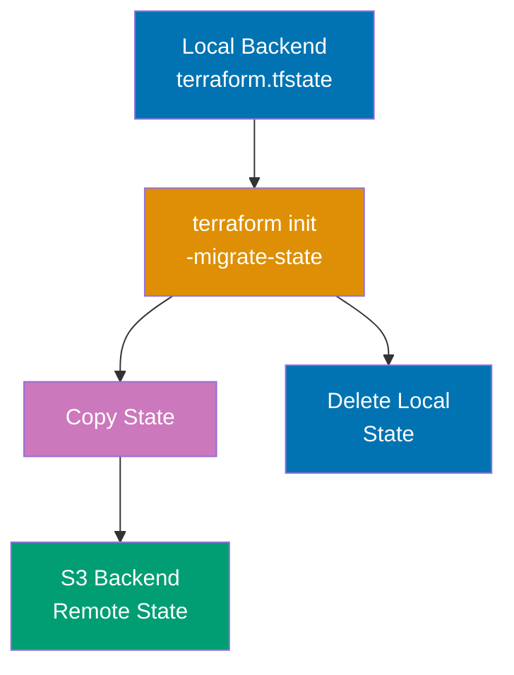

**Initial configuration** - Local backend:

```hcl
terraform {
 # => Terraform configuration block
 required_version = ">= 1.0" # => String value
 # => No backend block (defaults to local)
 # => Local backend: terraform.tfstate in current directory
}

provider "local" {}
# => Local provider for file operations

resource "local_file" "data" {
 # => File resource to demonstrate state tracking
 filename = "data.txt" # => String value
 # => Output file path
 content = "Important data" # => String value
 # => File content
 # => State will track this resource
}
```

**After initial apply**:

```bash
# $ terraform apply
# => Creates terraform.tfstate (local backend)
# => State contains local_file.data resource
```

**Updated configuration** - Migrating to S3 backend:

```hcl
terraform {
# => Terraform configuration block
 required_version = ">= 1.0" # => String value
 # => Sets required_version

 # Add S3 backend configuration
 backend "s3" {
 bucket = "mycompany-terraform-state" # => String value
 # => Sets bucket
 key = "migrated/terraform.tfstate" # => String value
 # => Sets key
 region = "us-west-2" # => String value
 # => Sets region
 }
}

provider "local" {}
# => Provider configuration

resource "local_file" "data" {
# => Resource definition
 filename = "data.txt" # => String value
 # => Sets filename
 content = "Important data" # => String value
 # => Same resource, new backend
}


```

**State migration**:

```bash
# $ terraform init -migrate-state
# => Initializing the backend..
# => Terraform detected that the backend type changed from "local" to "s3".
# => Do you want to migrate all workspaces to "s3"? (yes/no): yes
# => Successfully configured the backend "s3"!
# => Terraform has migrated the state from "local" to "s3".

# Verify migration:
# $ terraform state list
# => local_file.data
# => (Same resources, now in S3)

# $ aws s3 ls s3://mycompany-terraform-state/migrated/
# => terraform.tfstate (migrated state file in S3)

# Old local state file:
# $ ls terraform.tfstate
# => terraform.tfstate (local backup remains)
```

**Migrating between S3 buckets**:

```hcl
terraform {
# => Terraform configuration block
 required_version = ">= 1.0" # => String value
 # => Sets required_version

 backend "s3" {
 bucket = "new-terraform-state-bucket" # => String value
 # => Changed from mycompany-terraform-state
 key = "migrated/terraform.tfstate" # => String value
 # => Sets key
 region = "us-west-2" # => String value
 # => Sets region
 }
}

# $ terraform init -migrate-state
# => Backend type remains "s3"
# => Do you want to copy existing state to the new backend? (yes/no): yes
# => State migrated from old S3 bucket to new S3 bucket

```

**Key Takeaway**: State migration with `terraform init -migrate-state` copies state from old backend to new backend while preserving resource tracking. Always backup state before migration. Local state file remains after migration (manual cleanup required). Migration works between any backend types (local→S3, S3→Azure, etc).

**Why It Matters**: State migration enables safe backend upgrades without destroying infrastructure—when Migration is critical when changing organizations: acquired company's Terraform state in old AWS account must migrate to parent company's S3 bucket without disrupting infrastructure. Always test migration on non-production stacks first; corrupted state migration requires restoring from backup or re-importing all resources.

---

## Group 12: Workspaces

### Example 41: Workspace Basics for Environment Management

Workspaces enable managing multiple environments (dev, staging, prod) using same configuration with separate state files. Each workspace has isolated state.

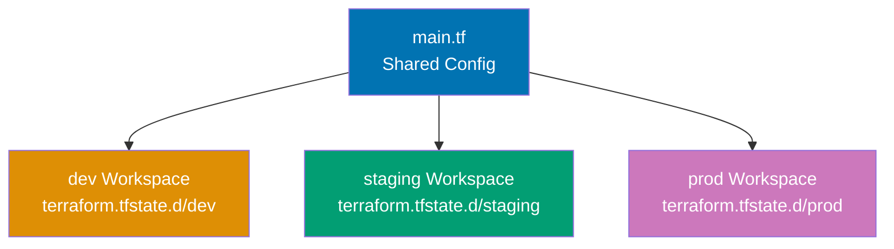

```hcl
terraform {
# => Terraform configuration block
 required_version = ">= 1.0" # => String value
 # => Sets required_version
}

provider "local" {}
# => Provider configuration

# terraform.workspace contains current workspace name
resource "local_file" "environment_config" {
# => Resource definition
 filename = "${terraform.workspace}-config.txt" # => String interpolation
 # => terraform.workspace is "default", "dev", "staging", or "prod"
 # => Creates: default-config.txt, dev-config.txt, etc.

 content = <<-EOT
 # => Sets content
 Environment: ${terraform.workspace}
 # => Terraform configuration block
 Workspace: ${terraform.workspace}
 # => Terraform configuration block
 Instance Count: ${terraform.workspace == "prod" ? 5 : 2}
 # => Sets Instance Count: ${terraform.workspace
 EOT
 # => Conditional: prod workspace gets 5 instances, others get 2
}

# Environment-specific variables using workspace
locals {
# => Local values
 instance_count = { # => Map/object definition
 dev = 1 # => Numeric value
 # => Sets dev
 staging = 2 # => Numeric value
 # => Sets staging
 prod = 5 # => Numeric value
 # => Sets prod
 }

 current_instance_count = lookup( # => Map key lookup with default
local.instance_count, terraform.workspace, 1)
 # => lookup( # => Map key lookup with default
map, key, default) returns instance count for workspace
 # => Falls back to 1 if workspace not in map
}

output "workspace_info" {
# => Output value
 value = { # => Map/object definition
 workspace = terraform.workspace
 # => Sets workspace
 instance_count = local.current_instance_count
 # => Sets instance_count
 config_file = local_file.environment_config.filename
 # => Sets config_file
 }
}


```

**Workspace commands**:

```bash
# List workspaces:
# $ terraform workspace list
# => * default
# => (default workspace created automatically)

# Create new workspace:
# $ terraform workspace new dev
# => Created and switched to workspace "dev"!

# $ terraform workspace new staging
# $ terraform workspace new prod

# Switch workspace:
# $ terraform workspace select dev
# => Switched to workspace "dev".

# Apply in dev workspace:
# $ terraform apply
# => terraform.workspace = "dev"
# => Creates dev-config.txt
# => State stored in terraform.tfstate.d/dev/terraform.tfstate

# Switch to prod and apply:
# $ terraform workspace select prod
# $ terraform apply
# => terraform.workspace = "prod"
# => Creates prod-config.txt
# => State stored in terraform.tfstate.d/prod/terraform.tfstate

# Show current workspace:
# $ terraform workspace show
# => prod

# Delete workspace (must be empty):
# $ terraform workspace select default
# $ terraform workspace delete dev
# => Deleted workspace "dev"!
```

**State file organization**:

```
project/
├── main.tf
├── terraform.tfstate.d/ # => Workspace states
│ ├── dev/
│ │ └── terraform.tfstate # => dev workspace state
│ ├── staging/
│ │ └── terraform.tfstate # => staging workspace state
│ └── prod/
│ └── terraform.tfstate # => prod workspace state
└── terraform.tfstate # => default workspace state (if not using workspaces)
```

**Key Takeaway**: Workspaces provide isolated state files per environment using single configuration. Access current workspace via `terraform.workspace` variable. State files stored in `terraform.tfstate.d/<workspace>/terraform.tfstate`. Use workspace-based conditionals for environment-specific resource counts and configurations.

**Why It Matters**: Workspaces prevent environment state file conflicts—Atlassian uses workspaces so dev, staging, and prod environments share identical Terraform code but maintain separate state files, eliminating "dev terraform apply accidentally modified prod" disasters. Workspace-based conditionals enable resource sizing: prod gets 10 servers (`terraform.workspace == "prod" ? 10 : 2`), dev gets 2, from one codebase. Limitation: workspaces share same variable files and backend config, making them unsuitable for completely different environments (use separate directories for production vs non-production instead).

---

### Example 42: Workspace Strategies and Limitations

Workspaces have limitations for production use. Directory-based separation is often preferred for production/non-production isolation.

**Workspace approach** (suitable for similar environments):

```hcl
terraform {
# => Terraform configuration block
 required_version = ">= 1.0" # => String value
 # => Sets required_version

 backend "s3" {
 bucket = "mycompany-terraform-state" # => String value
 # => Sets bucket
 key = "app/terraform.tfstate" # => String value
 # => All workspaces share same key (state isolated via workspace prefix)
 region = "us-west-2" # => String value
 # => Sets region
 workspace_key_prefix = "workspaces" # => String value
 # => State keys: workspaces/dev/app/terraform.tfstate, workspaces/prod/app/terraform.tfstate
 }
}

provider "local" {}
# => Provider configuration

variable "instance_count" {
# => Input variable
 type = number
 # => Sets type
}

# Workspace-based resource configuration
resource "local_file" "instances" {
# => Resource definition
 count = var.instance_count
 # => Creates specified number of instances
 filename = "${terraform.workspace}-instance-${count.index}.txt" # => String interpolation
 # => Sets filename
 content = "Instance ${count.index} in ${terraform.workspace}" # => String value
 # => Sets content
}


```

**Variable files per workspace**:

```hcl
# dev.tfvars
instance_count = 1
# => instance_count set to 1

# staging.tfvars
instance_count = 2
# => instance_count set to 2

# prod.tfvars
instance_count = 5
# => instance_count set to 5

```

**Usage**:

```bash
# $ terraform workspace new dev
# $ terraform apply -var-file=dev.tfvars
# => Creates 1 instance in dev workspace

# $ terraform workspace new prod
# $ terraform apply -var-file=prod.tfvars
# => Creates 5 instances in prod workspace
```

**Directory-based approach** (better for production isolation):

```
infrastructure/
├── non-production/
│ ├── dev/
│ │ ├── main.tf
│ │ ├── terraform.tfvars # => instance_count = 1
│ │ └── backend-dev.hcl
│ └── staging/
│ ├── main.tf
│ ├── terraform.tfvars # => instance_count = 2
│ └── backend-staging.hcl
└── production/
 ├── main.tf
 ├── terraform.tfvars # => instance_count = 5
 └── backend-prod.hcl
```

**Directory-based benefits**:

```hcl
# production/main.tf
terraform {
# => Terraform configuration block
 required_version = ">= 1.0" # => String value
 # => Sets required_version

 backend "s3" {
 # Production-specific backend config
 }
}

# Different AWS provider configuration per directory
provider "aws" {
# => Provider configuration
 region = "us-east-1" # => String value
 # Production account with restricted IAM roles
 assume_role {
 role_arn = "arn:aws:iam::111111111111:role/TerraformProduction" # => String value
 # => Sets role_arn
 }
}

# Production-specific resources (no workspace conditionals needed)
resource "aws_instance" "app" {
# => Resource definition
 count = var.instance_count
 # => Creates specified number of instances
 instance_type = "m5.large" # => Production instance type
 # => No workspace-based conditionals
}


```

**Key Takeaway**: Workspaces suitable for similar environments (dev/staging sharing configurations). Directory separation preferred for production isolation where different AWS accounts, IAM roles, backend configs, or compliance requirements exist. Workspaces reduce code duplication but share backend config and variable files. Directories provide complete isolation with independent configurations.

**Why It Matters**: Workspace limitations caused production outages at multiple companies—one engineer's `terraform workspace select prod` followed by `terraform destroy` deleted production because dev and prod shared IAM credentials and backend config. Directory separation enforces isolation: production directory uses production AWS account, non-production uses separate account, impossible to accidentally cross environments. HashiCorp recommends directory-based separation for production despite workspace convenience, because production requires stricter access controls, different approval workflows, and compliance audit trails that workspaces can't provide.

---

### Example 43: Workspace Key Prefix for Remote State

S3 backend supports `workspace_key_prefix` to customize workspace state file paths. This organizes workspace states in remote backend.

```hcl
terraform {
# => Terraform configuration block
 required_version = ">= 1.0" # => String value
 # => Sets required_version

 backend "s3" {
 bucket = "mycompany-terraform-state" # => String value
 # => Sets bucket
 key = "application/terraform.tfstate" # => String value
 # => Sets key
 region = "us-west-2" # => String value
 # => Sets region

 workspace_key_prefix = "environments" # => String value
 # => Workspace state paths:
 # => environments/dev/application/terraform.tfstate
 # => environments/staging/application/terraform.tfstate
 # => environments/prod/application/terraform.tfstate
 # => default workspace: application/terraform.tfstate (no prefix)
 }
}

provider "local" {}
# => Provider configuration

resource "local_file" "environment_marker" {
# => Resource definition
 filename = "${terraform.workspace}-marker.txt" # => String interpolation
 # => Sets filename
 content = "Environment: ${terraform.workspace}" # => String value
 # => Sets content
}

```

**State file organization in S3**:

```
s3://mycompany-terraform-state/
├── application/
│ └── terraform.tfstate # => default workspace
├── environments/
│ ├── dev/
│ │ └── application/
│ │ └── terraform.tfstate # => dev workspace
│ ├── staging/
│ │ └── application/
│ │ └── terraform.tfstate # => staging workspace
│ └── prod/
│ └── application/
│ └── terraform.tfstate # => prod workspace
└── network/
 └── terraform.tfstate # => Different stack
```

**Without workspace_key_prefix** (default behavior):

```hcl
backend "s3" {
 bucket = "mycompany-terraform-state" # => String value
 key = "application/terraform.tfstate" # => String value
 region = "us-west-2" # => String value
 # => workspace_key_prefix defaults to "env:"
 # => Workspace state paths:
 # => env:/dev/application/terraform.tfstate
 # => env:/staging/application/terraform.tfstate
 # => env:/prod/application/terraform.tfstate
}
```

**Key Takeaway**: `workspace_key_prefix` customizes S3 state file paths for workspaces. Default prefix is `env:`. Set custom prefix for better organization (`workspace_key_prefix = "environments"`). Default workspace state file doesn't use prefix (stored at `key` path directly).

**Why It Matters**: Custom workspace key prefixes improve S3 state organization when managing dozens of Terraform projects— Default `env:` prefix causes confusion because it's not intuitive; custom prefix like "environments" or "workspaces" makes state file purpose obvious when browsing S3 console. This organizational clarity reduces accidental state file deletions that would orphan infrastructure.

---

## Group 13: Provisioners

### Example 44: Local-Exec Provisioner for External Commands

`local-exec` provisioner runs commands on machine executing Terraform (not on created resources). Use for local scripts, API calls, or notifications.

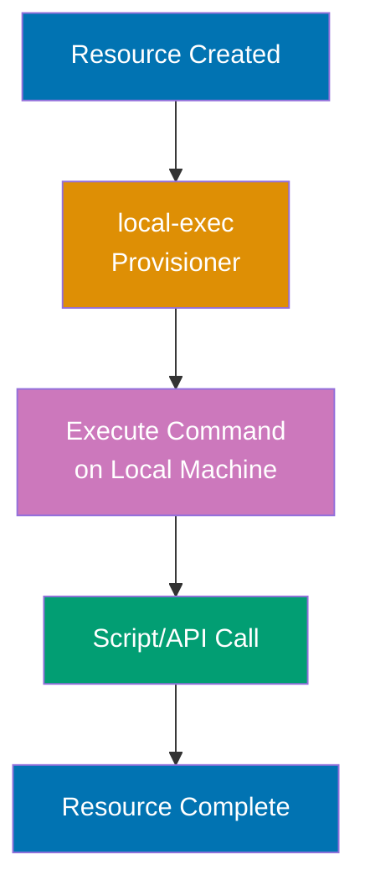

```hcl
terraform {
# => Terraform configuration block
 required_version = ">= 1.0" # => String value
 # => Sets required_version
}

provider "local" {}
# => Provider configuration

resource "local_file" "deployment_marker" {
# => Resource definition
 filename = "deployment.txt" # => String value
 # => Sets filename
 content = "Deployed at: ${timestamp()}" # => String value
 # => Sets content

 # local-exec runs on Terraform executor machine
 provisioner "local-exec" {
 # => Provisioner executes during resource lifecycle
 command = "echo 'Deployment started' >> deployment.log" # => String value
 # => command runs in shell on local machine
 # => Executes when resource is CREATED (not on updates)
 }

 provisioner "local-exec" {
 # => Provisioner executes during resource lifecycle
 command = "echo 'File created: ${self.filename}' >> deployment.log" # => String value
 # => self.filename references current resource attributes
 working_dir = "${path.module} # => Current module directory path"
 # => working_dir sets command execution directory
 }

 provisioner "local-exec" {
 # => Provisioner executes during resource lifecycle
 command = "curl -X POST https://api.example.com/notify -d '{\"event\":\"deployment\"}'"
 # => External API notification after resource creation
 # => Runs during terraform apply
 }

 # Runs when resource is DESTROYED
 provisioner "local-exec" {
 when = destroy
 # => Sets when
 command = "echo 'File deleted: ${self.filename}' >> deployment.log" # => String value
 # => when = destroy executes on terraform destroy
 }
}

resource "local_file" "build_artifact" {
# => Resource definition
 filename = "build/artifact.txt"
 # => Sets filename
 content = "Build output"
 # => Sets content

 provisioner "local-exec" {
 # => Provisioner executes during resource lifecycle
 command = "mkdir -p build && echo 'Build started' > build/log.txt"
 # => Create directory and initialize log
 interpreter = ["/bin/bash", "-c"]
 # => interpreter specifies shell (default: sh on Linux, cmd on Windows)
 }

 provisioner "local-exec" {
 # => Provisioner executes during resource lifecycle
 command = "python3 scripts/post-deploy.py --file ${self.filename}"
 # => Run Python script with resource attribute

 environment = {
 DEPLOY_ENV = "production"
 # => Sets DEPLOY_ENV
 API_KEY = var.api_key
 # => Sets API_KEY
 }
 # => environment sets environment variables for command
 }

 provisioner "local-exec" {
 # => Provisioner executes during resource lifecycle
 command = "exit 1" # Simulate failure
 # => Sets command
 on_failure = continue
 # => on_failure = continue allows resource creation to succeed despite provisioner failure
 # => Default: on_failure = fail (resource creation fails if provisioner fails)
 }
}

variable "api_key" {
# => Input variable
 type = string
 # => Sets type
 default = "test-key-12345"
 # => Sets default
 sensitive = true
 # => Sets sensitive
}

output "provisioner_note" {
# => Output value
 value = "local-exec ran commands on Terraform executor machine"
 # => Sets value
}


```

**Key Takeaway**: `local-exec` provisioner runs commands locally (not on resources). Use `command` for shell commands, `working_dir` for execution directory, `environment` for env vars, `when = destroy` for cleanup. Provisioners run during resource creation (default) or destruction. Set `on_failure = continue` to allow resource success despite provisioner failure.

**Why It Matters**: local-exec enables Terraform to trigger external systems that don't have providers— Provisioners are last resort (Hashicorp recommends avoiding them): they break Terraform's declarative model, can't be planned (you don't see what command will do), and create hidden dependencies. Prefer provider resources (`aws_lambda_invocation`) or separate orchestration tools ( They're acceptable for one-off migrations but anti-pattern for routine infrastructure.

---

### Example 45: Remote-Exec Provisioner for Instance Configuration

`remote-exec` provisioner runs commands on remote resource via SSH or WinRM. Typically used for initial instance setup not covered by cloud-init or configuration management.

```hcl
terraform {
 required_version = ">= 1.0" # => String value
 # => Minimum Terraform version required
}

provider "local" {}
# => Local provider for file operations

# Simulate remote instance with local file
resource "local_file" "instance" {
 # => Creates local_file.instance resource
 filename = "instance-config.txt" # => String value
 # => Local file representing remote instance
 content = "Instance initialized" # => String value
 # => Initial instance state

 # Simulated SSH connection (real example would use AWS EC2)
 connection {
 # => SSH/WinRM connection configuration
 type = "ssh" # => String value
 # => Connection type: ssh (Linux) or winrm (Windows)
 host = "192.168.1.100" # => String value
 # => Target host IP address
 user = "ubuntu" # => String value
 # => SSH user account
 private_key = file("~/.ssh/id_rsa")
 # => SSH private key for authentication (reads ~/.ssh/id_rsa)
 # => Alternative: password = var.ssh_password
 timeout = "2m" # => String value
 # => Connection timeout (default: 5m)
 }
 # => Connection applies to all provisioners in this resource

 # inline commands (list of strings)
 provisioner "remote-exec" {
 # => Provisioner runs after resource creation
 inline = [ # => List definition
 # => List of commands executed sequentially
 "sudo apt-get update",
 # => Update package index on remote instance
 "sudo apt-get install -y nginx",
 # => Install nginx web server (-y auto-confirms)
 "sudo systemctl start nginx",
 # => Start nginx service immediately
 "sudo systemctl enable nginx",
 # => Enable nginx to start on boot
 "echo 'Setup complete' > /tmp/provisioned.txt",
 # => Mark provisioning complete (creates marker file)
 ]
 # => Each command runs sequentially on remote instance
 # => Failure stops execution (unless on_failure = continue)
 }

 # script from file
 provisioner "remote-exec" {
 # => Second provisioner running after first completes
 script = "${path.module} # => Current module directory path/scripts/setup.sh"
 # => Upload and execute local script on remote instance
 # => path.module resolves to current directory
 # => Script must be executable (chmod +x setup.sh)
 }

 # scripts (multiple files)
 provisioner "remote-exec" {
 # => Third provisioner for multiple script execution
 scripts = [
 # => List of scripts executed in order
 "${path.module} # => Current module directory path/scripts/install-deps.sh",
 # => First: Install dependencies
 "${path.module} # => Current module directory path/scripts/configure-app.sh",
 # => Second: Configure application
 "${path.module} # => Current module directory path/scripts/start-services.sh",
 # => Third: Start services
 ]
 # => Each script must be executable
 # => Scripts run sequentially, failure stops execution
 }
}

# Real-world example with AWS EC2 (concept only)
# resource "aws_instance" "web" {
# ami = "ami-12345678"
# # => Amazon Machine Image ID for EC2 instance
# instance_type = "t3.micro"
# # => Instance size (1 vCPU, 1GB RAM)
# key_name = "my-key-pair"
# # => SSH key pair name registered in AWS
#
# connection {
# type = "ssh"
# # => SSH connection type
# host = self.public_ip
# # => self.public_ip references instance's public IP after creation
# user = "ec2-user"
# # => Default user for Amazon Linux AMIs
# private_key = file("~/.ssh/id_rsa")
# # => Local SSH private key file
# }
#
# provisioner "remote-exec" {
# inline = [
# "sudo yum update -y",
# # => Update all packages on Amazon Linux
# "sudo yum install -y docker",
# # => Install Docker
# "sudo systemctl start docker",
# # => Start Docker daemon
# "sudo docker run -d -p 80:80 nginx:latest",
# # => Run nginx container (-d: detached, -p: port mapping)
# ]
# # => Commands provision Docker and nginx on new EC2 instance
# }
# }
```

**Key Takeaway**: `remote-exec` executes commands on remote resources via SSH/WinRM connection. Use `inline` for command list, `script` for single file, or `scripts` for multiple files. Requires `connection` block with credentials. Provisioner runs during resource creation (use `when = destroy` for cleanup). Provisioners are last resort—prefer cloud-init, user_data, or configuration management (Ansible, Chef) for production.

**Why It Matters**: remote-exec is an anti-pattern that creates hidden configuration drift—Etsy abandoned remote-exec after discovering instances provisioned months ago had different software versions than newly provisioned instances (because provisioner ran once at creation, never again). Configuration management tools (Ansible, Chef, Puppet) continuously enforce desired state, while remote-exec is one-shot. Remote-exec requires open SSH ports and credentials in Terraform state (security risk). Modern practice: use cloud-init/user_data for initial setup, configuration management for ongoing enforcement. Only use remote-exec for emergency one-time migrations where proper tooling isn't feasible.

---

### Example 46: File Provisioner for Uploading Content

`file` provisioner uploads files or directories from local machine to remote resources. Useful for configuration files, scripts, or initial data.

```hcl
terraform {
# => Terraform configuration block
 required_version = ">= 1.0" # => String value
 # => Sets required_version
}

provider "local" {}
# => Provider configuration

resource "local_file" "instance_marker" {
# => Resource definition
 filename = "instance.txt" # => String value
 # => Sets filename
 content = "Instance created" # => String value
 # => Sets content

 # Simulated connection (real-world: AWS EC2, Azure VM)
 connection {
 type = "ssh" # => String value
 # => Sets type
 host = "192.168.1.100" # => String value
 # => Sets host
 user = "ubuntu" # => String value
 # => Sets user
 private_key = file("~/.ssh/id_rsa")
 # => Sets private_key
 }

 # Upload single file
 provisioner "file" {
 source = "${path.module} # => Current module directory path/configs/app.conf"
 # => Local file path
 destination = "/tmp/app.conf" # => String value
 # => Remote destination path
 # => Uploads configs/app.conf to /tmp/app.conf on remote instance
 }

 # Upload file with inline content
 provisioner "file" {
 # => Provisioner executes during resource lifecycle
 content = templatefile( # => Renders template file with variables

 "${path.module} # => Current module directory path/templates/config.tpl", {
 app_name = "myapp" # => String value
 # => Sets app_name
 port = 8080 # => Numeric value
 # => Sets port
 })
 # => content instead of source (generated content)
 destination = "/etc/myapp/config.json" # => String value
 # => Writes generated content to remote file
 }

 # Upload directory recursively
 provisioner "file" {
 source = "${path.module} # => Current module directory path/scripts/"
 # => Trailing slash: upload directory CONTENTS
 destination = "/opt/scripts"
 # => Uploads all files from local scripts/ to /opt/scripts/
 # => Without trailing slash: creates /opt/scripts/scripts/
 }

 # Upload directory as directory
 provisioner "file" {
 source = "${path.module} # => Current module directory path/data"
 # => No trailing slash: upload directory itself
 destination = "/var/data"
 # => Creates /var/data/data/ with contents
 }
}

# Typical usage: Upload app code and start service
resource "local_file" "app_server" {
# => Resource definition
 filename = "server.txt"
 # => Sets filename
 content = "App server"
 # => Sets content

 connection {
 type = "ssh"
 # => Sets type
 host = "192.168.1.100"
 # => Sets host
 user = "ubuntu"
 # => Sets user
 private_key = file("~/.ssh/id_rsa")
 # => Sets private_key
 }

 # Step 1: Upload application files
 provisioner "file" {
 source = "${path.module} # => Current module directory path/dist/"
 # => Sets source
 destination = "/opt/app"
 # => Sets destination
 }

 # Step 2: Upload systemd service file
 provisioner "file" {
 # => Provisioner executes during resource lifecycle
 content = <<-EOT
 # => Sets content
 [Unit]
 Description=My Application
 # => Sets Description

 [Service]
 ExecStart=/opt/app/server
 # => Sets ExecStart
 Restart=always
 # => Sets Restart

 [Install]
 WantedBy=multi-user.target
 # => Sets WantedBy
 EOT
 destination = "/etc/systemd/system/myapp.service"
 # => Sets destination
 }

 # Step 3: Enable and start service
 provisioner "remote-exec" {
 inline = [
 # => Sets inline
 "sudo systemctl daemon-reload",
 "sudo systemctl enable myapp",
 "sudo systemctl start myapp",
 ]
 }
}


```

**Key Takeaway**: `file` provisioner uploads files (`source`) or generated content (`content`) to remote `destination`. Trailing slash in source (`scripts/`) uploads directory contents; without trailing slash (`scripts`) uploads directory itself. Combine with `remote-exec` for multi-step provisioning (upload files, then execute setup commands). Requires `connection` block with SSH/WinRM credentials.

**Why It Matters**: File provisioner enables bootstrapping instances with configuration and code, but it's a one-way operation that doesn't handle updates— Modern practice: use S3/GCS for artifacts (`aws_s3_bucket` + instance profile), cloud-init to download on boot, and configuration management to handle updates. File provisioner acceptable for one-time migrations or emergency hotfixes, but not sustainable for production configuration management.

---

### Example 47: Null Resource for Provisioner-Only Resources

`null_resource` is a placeholder resource that does nothing except run provisioners. Useful for actions that don't correspond to infrastructure resources.

```hcl
terraform {
# => Terraform configuration block
 required_version = ">= 1.0" # => String value
 # => Sets required_version

 required_providers {
 # => Provider configuration
 null = { # => Map/object definition
 source = "hashicorp/null" # => String value
 # => Provider source location
 version = "~> 3.0" # => String value
 # => Sets version
 }
 }
}

provider "null" {}
# => Provider configuration
provider "local" {}
# => Provider configuration

resource "local_file" "config" {
# => Resource definition
 filename = "app-config.txt" # => String value
 # => Sets filename
 content = "Config version: 1.0" # => String value
 # => Sets content
}

# null_resource with triggers for re-execution
resource "null_resource" "deploy_notification" {
# => Resource definition
 # triggers force re-execution when values change
 triggers = { # => Map/object definition
 config_content = local_file.config.content
 # => When config.content changes, null_resource re-creates (re-runs provisioners)
 deployment_id = uuid()
 # => uuid() changes every apply, forcing provisioner re-run
 }

 provisioner "local-exec" {
 # => Provisioner executes during resource lifecycle
 command = "echo 'Deployment triggered' >> deployment.log" # => String value
 # => Runs every time triggers change
 }

 provisioner "local-exec" {
 # => Provisioner executes during resource lifecycle
 command = <<-EOT
 # => Sets command
 curl -X POST https://api.example.com/deploy \
 -H "Content-Type: application/json" \
 -d '{"config": "${local_file.config.content}", "trigger": "${self.triggers.deployment_id}"}'
 EOT
 # => Notify external system of deployment
 }
}

# null_resource for time-based actions
resource "null_resource" "database_backup" {
# => Resource definition
 triggers = {
 backup_schedule = timestamp()
 # => timestamp() evaluated at plan time
 # => Forces re-execution on every apply (use with caution)
 }

 provisioner "local-exec" {
 # => Provisioner executes during resource lifecycle
 command = "python3 scripts/backup-database.py"
 # => Sets command
 }
}

# null_resource for depends_on orchestration
resource "local_file" "app_binary" {
# => Resource definition
 filename = "app-binary.txt"
 # => Sets filename
 content = "Binary v2.0"
 # => Sets content
}

resource "local_file" "app_config_file" {
# => Resource definition
 filename = "app-config-final.txt"
 # => Sets filename
 content = "Config for binary"
 # => Sets content
}

resource "null_resource" "app_deployment" {
# => Resource definition
 depends_on = [ # => Explicit dependency list


 # => Sets depends_on
 local_file.app_binary,
 local_file.app_config_file,
 ]
 # => Explicit dependency enforces creation order

 triggers = {
 binary_content = local_file.app_binary.content
 # => Sets binary_content
 config_content = local_file.app_config_file.content
 # => Sets config_content
 }
 # => Re-deploy when binary or config changes

 provisioner "local-exec" {
 # => Provisioner executes during resource lifecycle
 command = "echo 'Deploying app with binary and config' >> deployment.log"
 # => Sets command
 }
}

output "deployment_info" {
# => Output value
 value = {
 deploy_trigger_id = null_resource.deploy_notification.triggers.deployment_id
 # => Sets deploy_trigger_id
 note = "null_resource ran provisioners without creating infrastructure"
 # => Sets note
 }
}


```

**Key Takeaway**: `null_resource` runs provisioners without managing infrastructure. Use `triggers` map to control when provisioners re-run (any value change re-creates resource). Common triggers: file content hashes, timestamps, version numbers. Combine with `depends_on` to orchestrate provisioner execution order. Useful for notifications, deployments, or actions external to Terraform's resource model.

**Why It Matters**: null_resource is both powerful and dangerous— However, null_resource with `timestamp()` trigger runs on every apply, causing unnecessary API calls, alerts, and confusion ("why is deployment running when nothing changed?"). Prefer explicit triggers (content hashes, version numbers) over timestamp. Better alternative: separate orchestration tools (

---

## Group 14: Dynamic Blocks and Advanced Patterns

### Example 48: Dynamic Blocks for Repeated Nested Configuration

Dynamic blocks generate repeated nested blocks from collections. This eliminates repetitive configuration for resources with multiple similar nested blocks (security group rules, routing rules, etc).

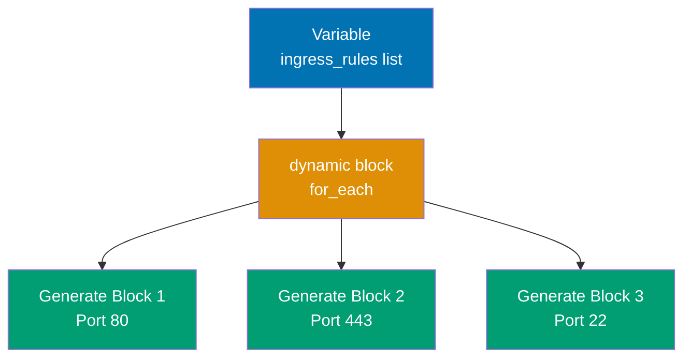

```hcl
terraform {
# => Terraform configuration block
# => Terraform configuration block
 required_version = ">= 1.0" # => String value
 # => Sets required_version
}

provider "local" {}
# => Local provider for demonstration
# => Provider configuration

# Variable with list of ingress rules
variable "ingress_rules" {
# => Input variable for dynamic ingress rules
# => Input variable
 type = list(object({
# => List of objects with port, protocol, description fields
 port = number
 # => Sets port
 protocol = string
 # => Sets protocol
 description = string
 # => Sets description
 }))
 default = [ # => List definition
 # => Sets default
 { port = 80, protocol = "tcp", description = "HTTP" },
 # => Sets { port
 { port = 443, protocol = "tcp", description = "HTTPS" },
 # => Sets { port
 { port = 22, protocol = "tcp", description = "SSH" },
 # => Sets { port
 ]
}

# Simulated security group with dynamic blocks
resource "local_file" "security_group" {
# => Resource definition
 filename = "security-group.txt" # => String value
 # => Sets filename
 content = <<-EOT
 # => Sets content
 Security Group Rules:
 ${join( # => Concatenates list with separator
"\n", [
 for rule in var.ingress_rules :
# => Iterate over each rule in the list
 "Port ${rule.port}/${rule.protocol}: ${rule.description}"
 ])}
 EOT
 # => Dynamic content generation based on var.ingress_rules
}

# More realistic example (concept with AWS-like syntax)
# Real AWS security group would use:
# resource "aws_security_group" "web" {
# name = "web-sg"
#
# dynamic "ingress" {
# => Dynamic block generates multiple ingress blocks
# for_each = var.ingress_rules
# => Iterate over ingress_rules variable
# # => for_each iterates over var.ingress_rules list
# # => Creates one ingress block per list element
#
# content {
# => Nested content block defines ingress structure
# from_port = ingress.value.port
# => Access port from current iteration value
# # => ingress.value accesses current iteration element
# to_port = ingress.value.port
# protocol = ingress.value.protocol
# cidr_blocks = ["0.0.0.0/0"]
# => Allow traffic from any IP address
# description = ingress.value.description
# }
# # => content block defines the nested block structure
# }
# }

# Dynamic blocks with maps (key-value access)
variable "egress_rules_map" {
# => Map-based variable for egress rules
# => Input variable
 type = map(object({
# => Map with string keys and object values
 port = number
 # => Sets port
 protocol = string
 # => Sets protocol
 }))
 default = {
 http = { port = 80, protocol = "tcp" }
 # => Sets http
 https = { port = 443, protocol = "tcp" }
 # => Sets https
 }
}

resource "local_file" "egress_config" {
# => Resource definition
 filename = "egress-config.txt"
 # => Sets filename
 content = <<-EOT
 # => Sets content
 Egress Rules:
 ${join( # => Concatenates list with separator
"\n", [
 for name, rule in var.egress_rules_map :
# => Iterate map with key (name) and value (rule)
 "${name}: Port ${rule.port}/${rule.protocol}"
 ])}
 EOT
 # => Dynamic content with map iteration (key = name, value = rule)
}

# Nested dynamic blocks
variable "route_tables" {
# => Nested list variable for route tables with routes
# => Input variable
 type = list(object({
# => List of objects with port, protocol, description fields
 name = string
 # => Sets name
 routes = list(object({
 destination = string
 # => Sets destination
 target = string
 # => Sets target
 }))
 }))
 default = [
 # => Sets default
 {
 name = "public"
 # => Sets name
 routes = [
 # => Sets routes
 { destination = "0.0.0.0/0", target = "igw-123" },
 # => Sets { destination
 { destination = "10.0.0.0/16", target = "local" },
 # => Sets { destination
 ]
 },
 {
 name = "private"
 # => Sets name
 routes = [
 # => Sets routes
 { destination = "0.0.0.0/0", target = "nat-456" },
 # => Sets { destination
 ]
 },
 ]
}

resource "local_file" "route_tables" {
# => Resource definition
 filename = "route-tables.txt"
 # => Sets filename
 content = <<-EOT
 # => Sets content
 Route Tables:
 ${join( # => Concatenates list with separator
"\n\n", [
 for rt in var.route_tables :
 "${rt.name}:\n${join( # => Concatenates list with separator
"\n", [
 for route in rt.routes :
 " ${route.destination} -> ${route.target}"
 ])}"
 ])}
 EOT
 # => Nested iteration: outer loop for route tables, inner loop for routes
}


```

**Key Takeaway**: Dynamic blocks use `dynamic "BLOCK_NAME"` with `for_each` to generate nested blocks from collections. Access iteration elements via `BLOCK_NAME.value` (for lists) or `BLOCK_NAME.key`/`BLOCK_NAME.value` (for maps). Nest dynamic blocks for multi-level iteration. Eliminates repetitive block definitions while maintaining Terraform's declarative syntax.

**Why It Matters**: Dynamic blocks prevent massive configuration duplication—before dynamic blocks, AWS security groups with 20 ingress rules required 20 hand-written `ingress { }` blocks; one typo in port number affects only that rule, making debugging tedious. Dynamic blocks centralize rule definitions in variables: change port 8080→8443 in one place, all ingress blocks update. This pattern enabled HashiCorp to reduce their example security group modules from 500 lines to 50 lines, improving readability and maintainability. However, overuse harms clarity: simple resources with 2-3 blocks should use explicit blocks, not dynamic; save dynamic for 5+ repeated blocks.

---

### Example 49: For Each with Maps and Advanced Patterns

Advanced `for_each` patterns enable complex resource generation with map transformations, filtering, and cross-resource references.

```hcl
terraform {
# => Terraform configuration block
 required_version = ">= 1.0" # => String value
 # => Sets required_version
}

provider "local" {}
# => Provider configuration

# Map of environments with nested configuration
variable "environments" {
# => Input variable
 type = map(object({
 region = string
 # => Sets region
 instance_count = number
 # => Sets instance_count
 tags = map(string)
 # => Sets tags
 }))
 default = { # => Map/object definition
 dev = { # => Map/object definition
 region = "us-west-2" # => String value
 # => Sets region
 instance_count = 1 # => Numeric value
 # => Sets instance_count
 tags = { tier = "development" } # => Map/object definition
 # => Sets tags
 }
 staging = { # => Map/object definition
 region = "us-east-1" # => String value
 # => Sets region
 instance_count = 2 # => Numeric value
 # => Sets instance_count
 tags = { tier = "pre-production" } # => Map/object definition
 # => Sets tags
 }
 prod = { # => Map/object definition
 region = "eu-west-1" # => String value
 # => Sets region
 instance_count = 5 # => Numeric value
 # => Sets instance_count
 tags = { tier = "production", critical = "true" } # => Map/object definition
 # => Sets tags
 }
 }
}

# for_each with map
resource "local_file" "environment_configs" {
# => Resource definition
 for_each = var.environments
 # => Creates multiple instances from collection
 # => each.value is the environment object

 filename = "${each.key}-config.txt"
 # => Sets filename
 content = <<-EOT
 # => Sets content
 Environment: ${each.key}
 Region: ${each.value.region}
 Instance Count: ${each.value.instance_count}
 Tags: ${jsonencode(each.value.tags)}
 EOT
}

# Map transformation with for expression
locals {
# => Local values
 # Create map of production environments only (filtering)
 prod_environments = {
 for k, v in var.environments :
 k => v
 # => Sets k
 if contains( # => Checks list membership
keys( # => Extracts map keys
v.tags), "critical")
 # => Filters to environments with "critical" tag
 # => Result: { prod = { region = "eu-west-1".. } }
 }

 # Transform map values
 environment_regions = {
 for k, v in var.environments :
 k => v.region
 # => Extract just region from each environment
 # => Result: { dev = "us-west-2", staging = "us-east-1", prod = "eu-west-1" }
 }

 # Create flat list from map
 all_tags = flatten([
 # => Sets all_tags
 for env_name, env in var.environments : [
 for tag_key, tag_value in env.tags :
 "${env_name}:${tag_key}=${tag_value}"
 # => Sets "${env_name}:${tag_key}
 ]
 ])
 # => Result: ["dev:tier=development", "staging:tier=pre-production"..]
}

resource "local_file" "prod_only" {
# => Resource definition
 for_each = local.prod_environments
 # => Creates multiple instances from collection

 filename = "${each.key}-prod.txt"
 # => Sets filename
 content = "Production environment in ${each.value.region}"
 # => Sets content
}

# Cross-resource references with for_each
resource "local_file" "instance_markers" {
# => Resource definition
 for_each = var.environments
 # => Creates multiple instances from collection

 filename = "${each.key}-instances.txt"
 # => Sets filename
 content = <<-EOT
 # => Sets content
 Environment: ${each.key}
 Config File: ${local_file.environment_configs[each.key].filename}
 Instances: ${each.value.instance_count}
 EOT
 # => local_file.environment_configs[each.key] references another for_each resource
 # => Terraform resolves dependencies automatically
}

# for_each with set conversion
variable "region_list" {
# => Input variable
 type = list(string)
 # => Sets type
 default = ["us-west-2", "us-east-1", "eu-west-1", "us-west-2"]
 # => Note duplicate "us-west-2"
}

resource "local_file" "regional_files" {
# => Resource definition
 for_each = toset(var.region_list)
 # => Creates multiple instances from collection
 # => each.key is "us-west-2", "us-east-1", "eu-west-1" (no duplicate)

 filename = "region-${each.key}.txt"
 # => Sets filename
 content = "Region: ${each.key}"
 # => Sets content
}

output "created_environments" {
# => Output value
 value = {
 all = keys( # => Extracts map keys
local_file.environment_configs)
 # => Sets all
 prod_only = keys( # => Extracts map keys
local_file.prod_only)
 # => Sets prod_only
 all_tags = local.all_tags
 # => Sets all_tags
 }
}


```

**Key Takeaway**: Use `for_each` with maps for named resource instances. Transform maps with `for` expressions: filter with `if`, extract values, or flatten nested structures. Convert lists to sets with `toset()` to remove duplicates. Reference for_each resources with `resource_type.name[key]` syntax. Map-based for_each provides stable resource addresses (adding/removing middle elements doesn't renumber others).

**Why It Matters**: Map transformations enable environment-specific infrastructure without duplication—Robinhood uses map filtering to create monitoring dashboards only for production environments (`if v.tier == "production"`), avoiding dashboard costs for 50+ development environments. Cross-resource for_each references create dependency chains: security group rules reference VPC outputs, instances reference security group IDs, all through map keys ensuring consistent references. The `toset()` pattern prevents accidental duplicate resource creation when variable lists contain duplicates (common when concatenating multiple region lists from different sources).

---

### Example 50: Count and For Each Conditional Resource Creation

Combine `count` or `for_each` with conditionals to create resources only when conditions are met. This enables feature flags and environment-specific resources.

```hcl
terraform {
# => Terraform configuration block
 required_version = ">= 1.0" # => String value
 # => Sets required_version
}

provider "local" {}
# => Provider configuration

# Feature flags
variable "enable_monitoring" {
# => Input variable
 type = bool
 # => Sets type
 default = true # => Boolean value
 # => Sets default
}

variable "enable_logging" {
# => Input variable
 type = bool
 # => Sets type
 default = false # => Boolean value
 # => Sets default
}

variable "environment" {
# => Input variable
 type = string
 # => Sets type
 default = "production" # => String value
 # => Sets default
}

# count = 0 or 1 pattern for conditional creation
resource "local_file" "monitoring_config" {
# => Resource definition
 count = var.enable_monitoring ? 1 : 0
 # => Creates specified number of instances
 # => Ternary: condition ? true_value : false_value

 filename = "monitoring.txt" # => String value
 # => Sets filename
 content = "Monitoring enabled" # => String value
 # => Sets content
}

resource "local_file" "logging_config" {
# => Resource definition
 count = var.enable_logging ? 1 : 0
 # => Creates specified number of instances

 filename = "logging.txt"
 # => Sets filename
 content = "Logging enabled"
 # => Sets content
}

# for_each = {} (empty map) skips creation
resource "local_file" "prod_only_resource" {
# => Resource definition
 for_each = var.environment == "production" ? { enabled = true } : {}
 # => Creates multiple instances from collection
 # => for_each with empty map {} creates zero resources

 filename = "production-feature.txt"
 # => Sets filename
 content = "Production-only feature"
 # => Sets content
}

# Conditional with complex logic
locals {
# => Local values
 # Create backup only in production OR if explicitly enabled
 create_backup = var.environment == "production" || var.enable_backup
 # => Sets create_backup

 # Multiple conditions
 high_availability_enabled = (
 # => Sets high_availability_enabled
 var.environment == "production" &&
 # => Sets var.environment
 var.instance_count >= 3
 # => Sets var.instance_count >
 )
}

variable "enable_backup" {
# => Input variable
 type = bool
 # => Sets type
 default = false
 # => Sets default
}

variable "instance_count" {
# => Input variable
 type = number
 # => Sets type
 default = 5
 # => Sets default
}

resource "local_file" "backup_config" {
# => Resource definition
 count = local.create_backup ? 1 : 0
 # => Creates specified number of instances

 filename = "backup.txt"
 # => Sets filename
 content = "Backup enabled for ${var.environment}"
 # => Sets content
}

resource "local_file" "ha_config" {
# => Resource definition
 count = local.high_availability_enabled ? 1 : 0
 # => Creates specified number of instances

 filename = "high-availability.txt"
 # => Sets filename
 content = "HA enabled with ${var.instance_count} instances"
 # => Sets content
}

# Referencing conditional resources (safe access)
output "monitoring_file" {
# => Output value
 value = length( # => Returns collection size
local_file.monitoring_config) > 0 ? local_file.monitoring_config[0].filename : "Not enabled"
 # => length( # => Returns collection size
) checks if resource was created
 # => [0] accesses first element if count = 1
 # => Ternary prevents error if count = 0
}

output "prod_feature_file" {
# => Output value
 value = length( # => Returns collection size
keys( # => Extracts map keys
local_file.prod_only_resource)) > 0 ? local_file.prod_only_resource["enabled"].filename : "Not created"
 # => keys( # => Extracts map keys
) returns map keys, length checks if non-empty
 # => ["enabled"] accesses for_each resource by key
}

# Alternative: one_of pattern (create monitoring OR logging, not both)
variable "telemetry_type" {
# => Input variable
 type = string
 # => Sets type
 default = "monitoring"
 # => Sets default
 validation {
 # => Validation rule enforces constraints
 condition = contains( # => Checks list membership
["monitoring", "logging", "none"], var.telemetry_type)
 # => Sets condition
 error_message = "telemetry_type must be monitoring, logging, or none"
 # => Sets error_message
 }
}

resource "local_file" "monitoring_alt" {
# => Resource definition
 count = var.telemetry_type == "monitoring" ? 1 : 0
 # => Creates specified number of instances
 filename = "monitoring-alt.txt"
 # => Sets filename
 content = "Monitoring"
 # => Sets content
}

resource "local_file" "logging_alt" {
# => Resource definition
 count = var.telemetry_type == "logging" ? 1 : 0
 # => Creates specified number of instances
 filename = "logging-alt.txt"
 # => Sets filename
 content = "Logging"
 # => Sets content
}


```

**Key Takeaway**: Use `count = condition ? 1 : 0` for boolean feature flags. Use `for_each = condition ? { key = value } : {}` for map-based conditional creation. Complex conditions belong in `locals` for readability. Reference conditional count resources with `resource[0]` after checking `length(resource) > 0`. Reference conditional for_each with `resource[key]` after checking `length(keys(resource)) > 0`.

## Why It Matters

Conditional resource creation enables feature flags and environment-specific infrastructure without maintaining separate configurations—`environment == "prod" ? 1 : 0` to create CloudWatch dashboards only in production. Feature flags enable gradual rollouts: enable new feature in dev (`enable_new_feature = true`), test thoroughly, then promote to production variable file. The safe access pattern (`length(resource) > 0 ? resource[0] : default`) prevents "resource doesn't exist" errors when referencing conditional resources in outputs or other resources, which would otherwise fail plan/apply when feature is disabled.

---

### Example 51: Terraform Import for Existing Resources

`terraform import` brings existing infrastructure under Terraform management by adding resources to state without creating them. Use for migrating manually created resources or recovering from state loss.

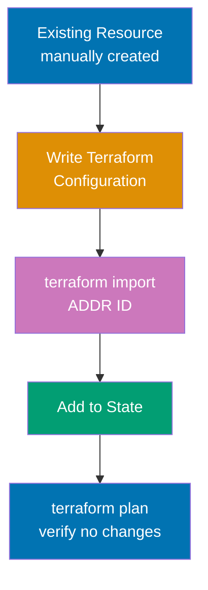

```hcl
terraform {
 required_version = ">= 1.0" # => String value
}

provider "local" {}

# Manually create file (simulating existing infrastructure):
# $ echo "Existing content" > existing-file.txt

# Write Terraform configuration matching existing resource
resource "local_file" "imported" {
 # => Creates local_file.imported resource
 filename = "existing-file.txt" # => String value
 content = "Existing content" # => String value
 # => Configuration MUST match existing resource attributes
 # => Mismatch causes terraform plan to show unwanted changes
}

# Import existing resource into state:
# $ terraform import local_file.imported existing-file.txt
# => Syntax: terraform import RESOURCE_ADDRESS RESOURCE_ID
# => local_file.imported is Terraform resource address
# => existing-file.txt is local_file provider's resource ID (filename)
# => Adds resource to state without creating/modifying it

# After import, verify with plan:
# $ terraform plan
# => No changes. Your infrastructure matches the configuration.
# => If plan shows changes, configuration doesn't match existing resource

# If attributes unknown, import first then inspect state:
# $ terraform import local_file.unknown_file mystery.txt
# $ terraform state show local_file.unknown_file
# => Displays imported resource attributes from state
# => Copy attributes to configuration
```

**Import workflow for complex resources**:

```hcl
# Step 1: Create minimal resource configuration
# resource "aws_instance" "imported_server" {
# # Leave empty initially
# }

# Step 2: Import existing resource
# $ terraform import aws_instance.imported_server i-1234567890abcdef

# Step 3: Inspect imported state
# $ terraform state show aws_instance.imported_server
# => Shows all attributes: ami, instance_type, subnet_id, etc.

# Step 4: Copy attributes to configuration
# resource "aws_instance" "imported_server" {
# ami = "ami-12345678" # From state
# instance_type = "t3.micro" # From state
# subnet_id = "subnet-abc123" # From state
# # .. copy all required and desired attributes
# }

# Step 5: Verify configuration matches
# $ terraform plan
# => No changes (configuration matches imported state)
```

**Import blocks (Terraform 1.5+)**:

```hcl
# Declarative import (experimental, Terraform 1.5+)
import {
 to = local_file.imported_declarative
 # => Sets to
 id = "existing-file-2.txt" # => String value
 # => to specifies target resource address
 # => id specifies provider resource identifier
}

resource "local_file" "imported_declarative" {
# => Resource definition
 filename = "existing-file-2.txt" # => String value
 # => Sets filename
 content = "Content" # => String value
 # => Sets content
}

# $ terraform plan
# => Shows import will occur
# $ terraform apply
# => Imports resource into state

```

**Key Takeaway**: `terraform import` adds existing resources to state using `terraform import RESOURCE_ADDRESS RESOURCE_ID`. Write configuration matching existing resource, import to state, then verify with `terraform plan` (should show no changes). Use `terraform state show` to inspect imported attributes. Import blocks (Terraform 1.5+) enable declarative imports in configuration. Import doesn't create resources—it only updates state.

**Why It Matters**: Import rescues manually created infrastructure from ClickOps hell—when AWS console creates resources faster than writing Terraform (emergency hotfix), import brings them under management, preventing drift between documented infrastructure (Terraform) and actual infrastructure (AWS). Import is critical for acquisitions: purchased company's AWS resources weren't created with Terraform, import enables gradual migration without recreating production databases. Limitation: import is per-resource (not bulk), so migrating 1,000 resources requires 1,000 import commands; tools like Terraformer automate bulk imports for entire AWS accounts.

---

### Example 52: Moved Blocks for Resource Refactoring

`moved` blocks handle resource address changes (renames, module restructuring) without destroying and recreating resources. This enables safe refactoring of Terraform configurations.

```hcl
terraform {
# => Terraform configuration block
 required_version = ">= 1.1" # moved blocks require Terraform 1.1+
 # => Sets minimum version (moved introduced in 1.1)
}

provider "local" {}
# => Provider configuration

# Original configuration (before refactoring):
# resource "local_file" "old_name" {
# filename = "data.txt"
# content = "Important data"
# }
# => State tracked resource as local_file.old_name

# Refactored configuration with moved block:
resource "local_file" "new_name" {
# => Resource renamed (new_name instead of old_name)
 filename = "data.txt" # => String value
 # => Sets filename (same as before)
 content = "Important data" # => String value
 # => Sets content (same as before)
 # => Resource renamed from old_name to new_name
}

moved {
# => Moved block prevents resource destruction during rename
 from = local_file.old_name
 # => Original address in state
 to = local_file.new_name
 # => New address in configuration
 # => Tells Terraform: resource address changed, don't destroy/recreate
 # => State updated to track resource under new name
}
# => Moved block is migration instruction (remove after apply)

# Without moved block:
# $ terraform plan
# => Plan: 1 to add, 0 to change, 1 to destroy
# => - local_file.old_name (destroyed)
# => + local_file.new_name (created)
# => DESTROYS FILE!
# => Terraform sees old resource deleted, new resource created

# With moved block:
# $ terraform plan
# => Plan: 0 to add, 0 to change, 0 to destroy
# => No changes. Resource address updated in state without destruction.
# => Terraform updates state: old_name → new_name (no resource changes)

# Moving resources into modules
# Before:
# resource "local_file" "app_config" {
# filename = "app.txt"
# content = "App config"
# }
# => Root-level resource

# After (moved to module):
module "app" {
# => Module call (replaces root resource)
 source = "./modules/app"
 # => Sets module source path
}
# => Resource now inside module

# modules/app/main.tf:
# resource "local_file" "config" {
# filename = "app.txt"
# content = "App config"
# }
# => Same resource, different location

moved {
# => Moved block for module migration
 from = local_file.app_config
 # => Original root address
 to = module.app.local_file.config
 # => New module address
 # => Moves resource from root to module without recreation
}
# => State updated: app_config → module.app.config

# Moving resources out of modules
moved {
# => Moved block for extracting from module
 from = module.old_app.local_file.config
 # => Original module address
 to = local_file.extracted_config
 # => New root address
}
# => Reverse migration: module → root

resource "local_file" "extracted_config" {
# => Resource extracted from module
 filename = "extracted.txt"
 # => Sets filename
 content = "Extracted from module"
 # => Sets content
}

# Moving between module instances (for_each)
# Before: Single module instance
# module "storage" {
# source = "./modules/storage"
# }
# => Single module instance

# After: for_each module instances
module "storage_regional" {
# => Module with for_each (multiple instances)
 source = "./modules/storage"
 # => Sets source
 for_each = toset(["us-west", "eu-central"])
 # => Creates multiple instances from collection
}

moved {
# => Moved block for for_each migration
 from = module.storage.local_file.data
 # => Original single instance address
 to = module.storage_regional["us-west"].local_file.data
 # => New for_each instance address
 # => Moves resource from single instance to for_each instance
 # => Other regions will be created (not moved)
}
# => Only us-west moved; eu-central created fresh
```

**Key Takeaway**: `moved` blocks prevent resource destruction during refactoring by updating state to track resource under new address. Syntax: `moved { from = OLD_ADDRESS, to = NEW_ADDRESS }`. Works for resource renames, moving to/from modules, changing module instances. Requires Terraform 1.1+. Plan shows no changes (resource not recreated). Remove moved blocks after apply—they're migration instructions, not permanent configuration.

**Why It Matters**: Moved blocks enable safe refactoring that was previously terrifying—before moved blocks, renaming `aws_rds_database.db` to `aws_rds_database.primary_db` would destroy and recreate the production database, causing hours of downtime. Moved blocks make refactoring safe: reorganize modules, split monolithic configurations, rename resources for clarity, all without destroying infrastructure. Datadog used moved blocks to reorganize 200+ Terraform modules from flat structure to hierarchical, completing migration with zero resource recreation. This transforms Terraform from "never touch working code" to "continuously refactor for maintainability", matching software engineering best practices.

---

## Group 15: Import and State Manipulation

### Example 53: State List and Show Commands

`terraform state` commands inspect and manipulate state file. Use for debugging, auditing, and understanding current infrastructure tracking.

```hcl
terraform {
 required_version = ">= 1.0" # => Terraform 1.0+ required
}

provider "local" {} # => Local provider for examples

resource "local_file" "app_config" { # => Application configuration file
 filename = "app-config.txt" # => Output: app-config.txt
 content = "Application configuration" # => String value
}

resource "local_file" "db_config" { # => Database configuration file
 filename = "db-config.txt" # => Output: db-config.txt
 content = "Database configuration" # => String value
}

module "storage" { # => Storage module instance
 source = "./modules/storage" # => Local module path

 bucket_prefix = "myapp" # => Prefix for bucket naming
 environment = "production" # => Production environment
}


```

**State commands**:

```bash
# List all resources in state
# $ terraform state list
# => local_file.app_config
# => local_file.db_config
# => module.storage.local_file.bucket
# => module.storage.local_file.bucket_policy

# Show specific resource details
# $ terraform state show local_file.app_config
# => # local_file.app_config:
# => resource "local_file" "app_config" {
# => content = "Application configuration"
# => directory_permission = "0777"
# => file_permission = "0777"
# => filename = "app-config.txt"
# => id = "abc123.."
# => }

# Show module resource
# $ terraform state show 'module.storage.local_file.bucket'
# => Displays module resource attributes
# => Note: quotes needed for module resources (shell escaping)

# Filter resources with grep pattern
# $ terraform state list | grep config
# => local_file.app_config
# => local_file.db_config

# Count resources in state
# $ terraform state list | wc -l
# => 4 (number of managed resources)

# Show all resources (verbose)
# $ terraform show
# => Displays entire state in human-readable format
# => Includes all resources, modules, outputs

# Show state in JSON format
# $ terraform show -json
# => Returns state as JSON for programmatic parsing
# => Useful for scripts, auditing, inventory systems
```

**Key Takeaway**: `terraform state list` shows all resources in state. `terraform state show RESOURCE_ADDRESS` displays specific resource attributes. `terraform show` displays entire state. Add `-json` flag for machine-readable output. These are read-only commands safe for production inspection. Use for debugging "resource not found" errors or understanding current infrastructure state.

**Why It Matters**: State inspection commands are critical for debugging Terraform issues—when `terraform plan` claims a resource doesn't exist but you see it in AWS console, `terraform state list` reveals if it's tracked in state (missing = import needed, present = configuration mismatch). JSON output enables infrastructure inventories: `terraform show -json | jq '.values.root_module.resources[] | select(.type == "aws_instance") |.values.tags.Name'` lists all EC2 instance names across 50+ Terraform projects for compliance audits. State inspection is the first step in diagnosing any "Terraform out of sync with reality" problem.

---

### Example 54: State mv for Resource Renaming

`terraform state mv` renames resources or moves them between modules in state without destroying infrastructure. This is the CLI equivalent of `moved` blocks.

```hcl
terraform {
# => Terraform configuration block
 required_version = ">= 1.0" # => String value
 # => Sets required_version
}

provider "local" {}
# => Provider configuration

# Original resource (before rename)
resource "local_file" "old_name" {
# => Resource definition
 filename = "data.txt" # => String value
 # => Sets filename
 content = "Important data" # => String value
 # => Sets content
}


```

**Renaming with state mv**:

```bash
# Apply original configuration
# $ terraform apply
# => Creates local_file.old_name

# Rename resource in configuration (update HCL):
# resource "local_file" "new_name" { .. }

# Without state mv, this would destroy/recreate:
# $ terraform plan
# => Plan: 1 to add, 0 to change, 1 to destroy

# Update state to match rename (prevents destruction):
# $ terraform state mv local_file.old_name local_file.new_name
# => Move "local_file.old_name" to "local_file.new_name"
# => Successfully moved 1 object(s).

# Verify no changes needed:
# $ terraform plan
# => No changes. Your infrastructure matches the configuration.
```

**Moving resources to modules**:

```hcl
# Before: Root-level resource
# resource "local_file" "app_data" {
# filename = "app.txt"
# content = "App data"
# }

# After: Moved to module
module "app" {
 # => Module instantiation with input variables
 source = "./modules/app" # => String value
}

# modules/app/main.tf:
# resource "local_file" "data" {
# filename = "app.txt"
# content = "App data"
# }
```

**State mv to module**:

```bash
# $ terraform state mv local_file.app_data module.app.local_file.data
# => Moves resource from root to module in state
# => No infrastructure changes

# Verify:
# $ terraform state list
# => module.app.local_file.data
```

**Moving between module instances**:

```bash
# Move from single module to for_each module instance:
# $ terraform state mv \
# module.storage.local_file.bucket \
# 'module.storage_regional["us-west"].local_file.bucket'
# => Quotes needed for bracket notation

# Move within for_each instances:
# $ terraform state mv \
# 'module.app["old-key"].local_file.config' \
# 'module.app["new-key"].local_file.config'
```

**Key Takeaway**: `terraform state mv SOURCE DESTINATION` updates resource addresses in state without destroying infrastructure. Use for renaming resources, moving to/from modules, or reorganizing module structures. Always run `terraform plan` after state mv to verify no unwanted changes. This is CLI alternative to `moved` blocks (both achieve same result).

**Why It Matters**: State mv enables safe refactoring when moved blocks aren't an option—if using Terraform <1.1 (no moved blocks support) or need immediate rename without committing moved block to git, state mv provides escape hatch. State mv is also useful for fixing broken imports: import to wrong address, state mv to correct address, no resource recreation. Warning: state mv is local operation (modifies state file), so team members need to pull updated state or they'll have conflicts; moved blocks in configuration prevent this synchronization issue (better for team environments).

---

### Example 55: State rm for Removing Resources from State

`terraform state rm` removes resources from Terraform state without destroying actual infrastructure. Use for excluding resources from management or cleaning up after manual deletions.

```hcl
terraform {
# => Terraform configuration block
 required_version = ">= 1.0" # => String value
 # => Sets required_version
}

provider "local" {}
# => Provider configuration

resource "local_file" "managed" {
# => Resource definition
 filename = "managed.txt" # => String value
 # => Sets filename
 content = "Terraform-managed" # => String value
 # => Sets content
}

resource "local_file" "unmanaged" {
# => Resource definition
 filename = "unmanaged.txt" # => String value
 # => Sets filename
 content = "Will be removed from state" # => String value
 # => Sets content
}


```

**Remove resource from state**:

```bash
# Apply initial configuration
# $ terraform apply
# => Creates both files

# Remove resource from state (keeps actual file)
# $ terraform state rm local_file.unmanaged
# => Removed local_file.unmanaged
# => Successfully removed 1 resource instance(s).

# Verify removal:
# $ terraform state list
# => local_file.managed
# => (local_file.unmanaged no longer in state)

# File still exists:
# $ ls unmanaged.txt
# => unmanaged.txt (infrastructure untouched)

# Plan no longer tracks removed resource:
# $ terraform plan
# => No changes (Terraform ignores unmanaged.txt)

# Next apply won't destroy unmanaged.txt:
# $ terraform apply
# => No changes
```

**Remove all module resources**:

```bash
# Remove entire module from state:
# $ terraform state rm module.storage
# => Removes all resources in module.storage
# => Resources remain in cloud, but no longer managed by Terraform
```

**Use cases**:

```hcl
# 1. Exclude resource from Terraform management (hand off to another team)
# $ terraform state rm aws_s3_bucket.legacy_bucket
# => Bucket still exists, but Terraform no longer manages it
# => Other team can import into their Terraform

# 2. Clean up after manual deletion
# Resource manually deleted from AWS console (violating best practices)
# $ terraform plan
# => Error: resource doesn't exist but tracked in state
# $ terraform state rm aws_instance.manually_deleted
# => Removes from state, plan succeeds

# 3. Remove accidentally imported resource
# $ terraform import local_file.wrong wrong-file.txt
# => Oops, wrong resource!
# $ terraform state rm local_file.wrong
# => Removed from state, no harm done
```

**Dangerous patterns** (use caution):

```bash
# DO NOT remove resource then apply expecting it to be recreated:
# $ terraform state rm local_file.data
# $ terraform apply
# => Creates NEW resource (doesn't match existing, causes conflicts)

# DO NOT remove resource from state without removing from configuration:
# $ terraform state rm local_file.app
# (leave resource block in .tf files)
# $ terraform plan
# => Terraform wants to CREATE resource again (already exists, error!)
```

**Key Takeaway**: `terraform state rm RESOURCE_ADDRESS` removes resource from state without destroying actual infrastructure. Resource continues existing but Terraform no longer manages it. After state rm, either remove resource from configuration (hand off to manual management) or import elsewhere (transfer to different Terraform project). Don't use state rm expecting Terraform to recreate resource—it causes conflicts with existing infrastructure.

**Why It Matters**: State rm is the "eject button" for resources that shouldn't be managed by Terraform anymore—when migrating from Terraform to Kubernetes operators, state rm removes K8s resources from Terraform state without deleting them, allowing operator to take over management. State rm cleans up broken states: manually deleted resource still in state causes errors, state rm fixes it. However, state rm is dangerous in team environments: you remove resource, teammate runs apply, their outdated configuration tries to recreate removed resource, causing conflicts. Always coordinate state rm across team and update configuration simultaneously.

---

### Example 56: Replace for Forced Resource Recreation

`terraform apply -replace` forces recreation of specific resources without modifying configuration. Use for repairing corrupted resources, applying manual changes, or triggering provisioners.

```hcl
terraform {
# => Terraform configuration block
 required_version = ">= 1.0" # => String value
 # => Sets required_version
}

provider "local" {}
# => Provider configuration

resource "local_file" "app_config" {
# => Resource definition
 filename = "app-config.txt" # => String value
 # => Sets filename
 content = "Version 1.0" # => String value
 # => Sets content

 provisioner "local-exec" {
 # => Provisioner executes during resource lifecycle
 command = "echo 'Deployed at ${timestamp()}' >> deploy.log" # => String value
 # => Provisioner only runs on creation (not updates)
 }
}

resource "local_file" "database_seed" {
# => Resource definition
 filename = "seed.txt" # => String value
 # => Sets filename
 content = "Initial data" # => String value
 # => Sets content
}


```

**Force recreation with -replace**:

```bash
# Normal apply (no changes needed):
# $ terraform plan
# => No changes

# Manually corrupt the file (simulating problem):
# $ echo "CORRUPTED" > app-config.txt

# Plan doesn't detect manual changes:
# $ terraform plan
# => No changes (state content matches config, file content not checked)

# Force recreation:
# $ terraform apply -replace="local_file.app_config"
# => Terraform will perform the following actions:
# => # local_file.app_config will be replaced
# => -/+ resource "local_file" "app_config" {
# => ~ content = "CORRUPTED" -> "Version 1.0"
# => (file recreated with correct content)
# => (provisioner runs again)

# Verify:
# $ cat app-config.txt
# => Version 1.0 (restored)
```

**Use cases**:

```bash
# 1. Trigger provisioners (which only run on creation):
# $ terraform apply -replace="null_resource.deploy_notification"
# => Forces null_resource recreation, re-running provisioners
# => Useful for re-running deployment scripts

# 2. Repair instance with corrupted state:
# $ terraform apply -replace="aws_instance.web"
# => Terminates and recreates instance
# => Fixes issues not resolvable through configuration changes

# 3. Replace multiple resources:
# $ terraform apply \
# -replace="local_file.app_config" \
# -replace="local_file.database_seed"
# => Recreates both resources in single apply

# 4. Module resource replacement:
# $ terraform apply -replace="module.app.local_file.config"
# => Replaces resource inside module
```

**Taint (deprecated alternative)**:

```bash
# Old method (deprecated in Terraform 0.15.2):
# $ terraform taint local_file.app_config
# $ terraform apply

# New method (Terraform 0.15.2+):
# $ terraform apply -replace="local_file.app_config"
# => -replace is preferred (taint command removed in Terraform 1.0)
```

**Dangerous patterns**:

```bash
# DO NOT replace stateful resources without backups:
# $ terraform apply -replace="aws_rds_database.production"
# => DESTROYS PRODUCTION DATABASE!
# => Always backup before replacing data resources

# DO NOT use -replace for normal updates:
# Change content in configuration, then:
# $ terraform apply -replace="local_file.app_config"
# => Unnecessary! Normal apply handles content changes without recreation
# => -replace is for forcing recreation, not normal updates
```

**Key Takeaway**: `terraform apply -replace="RESOURCE_ADDRESS"` forces resource destruction and recreation without configuration changes. Use for repairing corrupted resources, triggering provisioners, or applying manual fixes. Resources destroyed before recreated (potential downtime). Avoid for stateful resources (databases, storage) without backups. Replaces deprecated `terraform taint` command (removed in Terraform 1.0).

**Why It Matters**: Replace is the "turn it off and on again" for infrastructure—when EC2 instance has corrupted disk or hung process not fixable through configuration, replace recreates instance from clean state. Replace is critical for provisioner-based workflows: provisioners only run at creation, so updating provisioner logic requires `-replace` to re-run them. However, replace is dangerous for production databases: `terraform apply -replace` on RDS instance destroys data unless you have backups and time for restoration. Always prefer configuration changes over forced replacement; use replace only when infrastructure is genuinely broken and needs recreation.

---

**Key Takeaway for Intermediate level**: Production Terraform uses modules for reusability (Examples 29-35), remote state for collaboration with locking (Examples 36-40), workspaces for environment separation with caveats (Examples 41-43), provisioners as last resort (Examples 44-47), dynamic blocks for repeated config (Examples 48-50), import for existing infrastructure (Example 51-52), and state commands for manipulation and debugging (Examples 53-56). Master these patterns to manage large-scale infrastructure efficiently and safely.

---

Proceed to [Advanced](/en/learn/software-engineering/infrastructure/tools/terraform/by-example/advanced) for custom providers, testing frameworks, security patterns, multi-environment architecture, and CI/CD integration (Examples 57-84).
