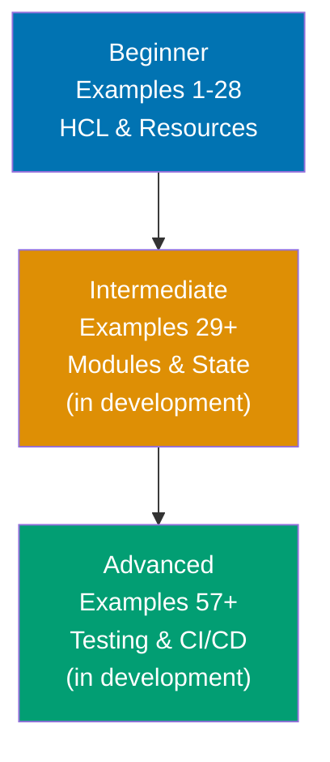

**Want to master Terraform through working examples?** This by-example guide teaches Terraform fundamentals through 84 annotated code examples organized by complexity level (in active development toward 95% coverage).

## What Is By-Example Learning?

By-example learning is an **example-first approach** where you learn through annotated, runnable code rather than narrative explanations. Each example is self-contained, immediately executable as Terraform configuration, and heavily commented to show:

- **What each line does** - Inline comments explain HCL syntax, resource attributes, and Terraform behavior
- **Expected outputs** - Using `# =>` notation for plan outputs, apply results, and state changes
- **Terraform mechanics** - How providers, state management, dependencies, and execution flow work
- **Key takeaways** - 1-2 sentence summaries of patterns and best practices

This approach is **ideal for experienced infrastructure engineers** who already understand cloud concepts and networking fundamentals, and want to quickly master Terraform's declarative language, resource management, and Infrastructure as Code patterns through working configurations.

Unlike narrative tutorials that build understanding through explanation and storytelling, by-example learning lets you **see the code first, run it second, and understand it through direct interaction**. You learn Terraform patterns by executing actual infrastructure provisioning.

## What Is Terraform?

**Terraform** is a declarative Infrastructure as Code (IaC) tool that provisions and manages cloud resources across multiple providers. Unlike imperative scripts that define step-by-step instructions, **Terraform provides**:

- **Declarative configuration** - Describe desired infrastructure state in HCL (HashiCorp Configuration Language)
- **Multi-cloud support** - Single tool for AWS, Azure, GCP, Kubernetes, and 1000+ providers
- **State management** - Tracks actual infrastructure state and plans changes
- **Execution plans** - Preview changes before applying (terraform plan)
- **Resource graph** - Automatic dependency resolution and parallel execution
- **Immutable infrastructure** - Replace rather than modify resources for consistency

**Terraform vs. CloudFormation/ARM**: CloudFormation (AWS) and ARM (Azure) are cloud-specific. Terraform is cloud-agnostic with consistent syntax across providers. Terraform vs. Ansible: Ansible excels at configuration management, Terraform at infrastructure provisioning. Use both together—Terraform provisions VMs, Ansible configures them.

## Learning Path



Progress from Terraform fundamentals (HCL syntax, providers, resources, variables) through production patterns (modules, remote state, workspaces) to advanced infrastructure (custom providers, testing, multi-environment deployments). Each level builds on the previous, introducing more sophisticated Terraform features and real-world patterns.

## Coverage Philosophy

This by-example guide provides **comprehensive coverage of Terraform fundamentals** through practical, annotated examples, with intermediate and advanced topics in active development. Coverage represents depth and breadth of concepts, not time estimates—focus is on **outcomes and understanding**, not duration.

### What's Covered

- **HCL fundamentals** - Syntax, blocks, attributes, expressions, functions
- **Provider configuration** - AWS, Azure, GCP, Kubernetes, version constraints
- **Resource management** - Creation, updates, dependencies, lifecycle rules
- **Variables and outputs** - Input variables, output values, locals, sensitive data
- **Data sources** - Querying existing infrastructure, referencing external data
- **State management** - Local state, remote backends, state locking, migration
- **Modules** - Module structure, composition, versioning, Terraform Registry
- **Workspaces** - Multi-environment management, workspace-specific configuration
- **Provisioners** - Local-exec, remote-exec, file provisioner, connection blocks
- **Dynamic blocks** - Dynamic resource generation, for_each, count
- **Terraform import** - Importing existing infrastructure into state
- **Custom providers** - Provider development, schema definition, CRUD operations
- **Testing** - Terratest integration, TFLint static analysis, validation
- **State migration** - Backend migration, state refactoring, resource moves
- **Multi-environment patterns** - Directory structure, variable composition, DRY principles
- **Security** - Secrets management, encryption, least privilege IAM
- **CI/CD integration** - GitOps workflows, automated planning, approval gates

### What's NOT Covered

This guide focuses on **Terraform essentials and production infrastructure patterns**, not specialized use cases or exhaustive provider coverage. For additional topics:

- **Terraform Cloud/Enterprise** - Workspaces, VCS integration, policy as code (Sentinel)
- **All 1000+ providers** - Focus on most common providers (AWS, Azure, GCP, Kubernetes)
- **Provider-specific deep-dives** - Exhaustive resource documentation for every provider
- **Legacy Terraform 0.11** - Focus on modern Terraform 1.x+ syntax
- **Terragrunt patterns** - DRY wrapper around Terraform (separate tool)

The 95% coverage goal maintains humility—no tutorial can cover everything. This guide teaches the **core patterns that unlock the remaining 5%** through your own exploration and Terraform documentation.

## Prerequisites

Before starting this tutorial, you should be comfortable with:

- **Cloud fundamentals** - VPCs, subnets, security groups, IAM, basic networking
- **Command line** - File operations, environment variables, shell basics
- **Git basics** - Version control, repositories, branches
- **YAML/JSON** - Basic structured data formats (HCL is similar)
- **Infrastructure concepts** - Servers, networking, DNS, load balancing

No prior Terraform experience required—this guide starts from first principles and builds to production infrastructure patterns.

## How to Use This Guide

1. **Read beginner examples** (1-28) - Establish HCL fundamentals and resource management
2. **Run each example** - Execute terraform init, plan, apply against test environments
3. **Read intermediate examples** (29+) - Learn modules, remote state, and orchestration (in development)
4. **Read advanced examples** (57+) - Master testing, security, and CI/CD integration (in development)
5. **Experiment** - Modify examples, combine patterns, build your own infrastructure

Focus on running and understanding examples rather than memorizing syntax. Terraform is learned through doing—each example should be executed and experimented with.

## Example Structure

Each example follows a five-part format:

1. **Explanation** (2-4 sentences) - What the example demonstrates and why it matters
2. **Diagram** (when helpful) - Mermaid diagram visualizing infrastructure or execution flow
3. **Annotated code** - Terraform configuration with inline `# =>` comments showing outputs
4. **Key takeaway** - 1-2 sentence summary of the pattern learned

This format emphasizes **code first, explanation second**—you see working infrastructure code before diving into conceptual details.

## Getting Started

Install Terraform and set up credentials:

```bash
# Install on macOS
# $ brew install terraform

# Install on Linux
# $ wget https://releases.hashicorp.com/terraform/1.9.0/terraform_1.9.0_linux_amd64.zip
# $ unzip terraform_1.9.0_linux_amd64.zip
# $ sudo mv terraform /usr/local/bin/

# Verify installation
# $ terraform version
# => Terraform v1.9.0 or later

# Configure AWS credentials (example)
# $ export AWS_ACCESS_KEY_ID="your-access-key"
# $ export AWS_SECRET_ACCESS_KEY="your-secret-key"
# $ export AWS_DEFAULT_REGION="us-east-1"
```

Set up test cloud account credentials, then proceed to [Beginner](/en/learn/software-engineering/infrastructure/tools/terraform/by-example/beginner) examples.
