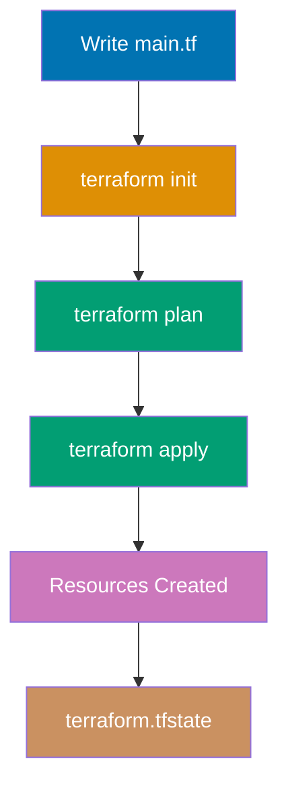

**Want to start managing infrastructure as code with Terraform?** This initial setup guide gets Terraform installed and working on your system. By the end, you'll have Terraform running and will create your first infrastructure resource.

This tutorial provides 0-5% coverage - just enough to get Terraform working on your machine. For deeper learning, continue to [Quick Start](/en/learn/software-engineering/infrastructure/tools/terraform/quick-start) (5-30% coverage) or explore [By Example](/en/learn/software-engineering/infrastructure/tools/terraform/by-example) tutorials.

## Prerequisites

Before installing Terraform, you need:

- A computer running Windows, macOS, or Linux
- Administrator/sudo access for installation
- A terminal/command prompt
- A text editor (VS Code, Vim, Nano, or any editor)
- Basic command-line navigation skills
- Understanding of infrastructure concepts (servers, networks) helpful but not required

**Important**: Terraform is a single binary with no dependencies. This makes installation simple but requires you to download the correct binary for your operating system and architecture.

## Learning Objectives

By the end of this tutorial, you will be able to:

1. **Install** Terraform on your operating system
2. **Verify** that Terraform is installed correctly and check the version
3. **Write** your first Terraform configuration (Hello World)
4. **Execute** basic Terraform commands (init, plan, apply, destroy)
5. **Understand** the Terraform workflow and state management basics

## Platform-Specific Installation

Choose your operating system and follow the installation steps.

### Windows Installation

**Option 1: Manual Binary Installation** (recommended)

**Step 1: Download Terraform**

1. Visit [Terraform Downloads](https://www.terraform.io/downloads)
2. Download Windows AMD64 ZIP file: `terraform_X.X.X_windows_amd64.zip`
3. Save to Downloads folder

**Step 2: Extract Binary**

1. Right-click ZIP file → Extract All
2. Extract to `C:\terraform` or `%USERPROFILE%\terraform`

**Step 3: Add to PATH**

Open PowerShell as Administrator:

```powershell
$oldPath = [Environment]::GetEnvironmentVariable('Path', 'User')
[Environment]::SetEnvironmentVariable('Path', "$oldPath;C:\terraform", 'User')
```

Or add via GUI:

1. Open System Properties → Environment Variables
2. Under User Variables, select PATH → Edit
3. Click New → Add `C:\terraform`
4. Click OK on all dialogs

**Step 4: Restart Terminal**

Close and reopen PowerShell to load new PATH.

**Step 5: Verify Installation**

```powershell
terraform version
```

Expected output:

```
Terraform v1.7.0
on windows_amd64
```

**Option 2: Install via Chocolatey**

```powershell
choco install terraform
```

**Troubleshooting Windows**:

- If `terraform: command not found`, restart PowerShell or manually verify PATH includes Terraform directory
- For permission errors when adding to PATH, run PowerShell as Administrator
- Download 64-bit version for 64-bit Windows (most modern systems)
- Antivirus may flag Terraform binary - add exception if needed

### macOS Installation

**Option 1: Install via Homebrew** (recommended)

**Step 1: Install Terraform**

```bash
brew tap hashicorp/tap
brew install hashicorp/tap/terraform
```

**Step 2: Verify Installation**

```bash
terraform version
```

Expected output:

```
Terraform v1.7.0
on darwin_arm64
```

**Option 2: Manual Binary Installation**

**Step 1: Download Terraform**

```bash
curl -LO https://releases.hashicorp.com/terraform/1.7.0/terraform_1.7.0_darwin_amd64.zip

curl -LO https://releases.hashicorp.com/terraform/1.7.0/terraform_1.7.0_darwin_arm64.zip
```

**Step 2: Extract and Install**

```bash
unzip terraform_*_darwin_*.zip

chmod +x terraform

sudo mv terraform /usr/local/bin/terraform

rm terraform_*_darwin_*.zip
```

**Step 3: Verify Installation**

```bash
terraform version
```

**Troubleshooting macOS**:

- If "terraform is not signed" error, allow in System Settings → Security & Privacy
- For Homebrew installation errors, run: `brew update`
- Ensure `/usr/local/bin` is in PATH: `echo $PATH | grep /usr/local/bin`
- Use correct architecture (arm64 for Apple Silicon, amd64 for Intel)

### Linux Installation

**Ubuntu/Debian Installation**

**Option 1: Install via Package Manager** (recommended)

**Step 1: Add HashiCorp GPG Key**

```bash
wget -O- https://apt.releases.hashicorp.com/gpg | sudo gpg --dearmor -o /usr/share/keyrings/hashicorp-archive-keyring.gpg
```

**Step 2: Add HashiCorp Repository**

```bash
echo "deb [signed-by=/usr/share/keyrings/hashicorp-archive-keyring.gpg] https://apt.releases.hashicorp.com $(lsb_release -cs) main" | sudo tee /etc/apt/sources.list.d/hashicorp.list
```

**Step 3: Install Terraform**

```bash
sudo apt update
sudo apt install terraform -y
```

**Step 4: Verify Installation**

```bash
terraform version
```

Expected output:

```
Terraform v1.7.0
on linux_amd64
```

**Option 2: Manual Binary Installation**

```bash
wget https://releases.hashicorp.com/terraform/1.7.0/terraform_1.7.0_linux_amd64.zip

sudo apt install unzip -y

unzip terraform_1.7.0_linux_amd64.zip

sudo mv terraform /usr/local/bin/terraform

rm terraform_1.7.0_linux_amd64.zip

terraform version
```

**Fedora/RHEL/CentOS Installation**

**Step 1: Add HashiCorp Repository**

```bash
sudo dnf config-manager --add-repo https://rpm.releases.hashicorp.com/fedora/hashicorp.repo
```

**Step 2: Install Terraform**

```bash
sudo dnf install terraform -y
```

**Step 3: Verify Installation**

```bash
terraform version
```

**Arch Linux Installation**

```bash
sudo pacman -S terraform

terraform version
```

**Troubleshooting Linux**:

- If binary not found, ensure `/usr/local/bin` is in PATH
- For permission errors, use sudo when moving to `/usr/local/bin`
- Verify executable permissions: `chmod +x /usr/local/bin/terraform`
- For GPG key errors, ensure wget and gnupg are installed

## Version Verification

After installation, verify Terraform is working correctly.

### Check Terraform Version

```bash
terraform version
```

This displays:

- Terraform version number
- Operating system
- Architecture (amd64, arm64)

### Check Available Commands

```bash
terraform -help
```

This lists all available Terraform commands:

- `init`: Initialize working directory
- `plan`: Show execution plan
- `apply`: Create or update infrastructure
- `destroy`: Destroy infrastructure
- `validate`: Validate configuration syntax
- `fmt`: Format configuration files
- `console`: Interactive console
- And many more...

### Get Command Help

```bash
terraform plan -help
terraform apply -help
```

## Your First Terraform Configuration

Let's write and execute your first Terraform configuration - creating a local file.

### Understanding Terraform Workflow

Terraform follows a declarative approach: you describe desired infrastructure state, and Terraform figures out how to achieve it.

**Core workflow**:

1. **Write**: Author infrastructure as code in `.tf` files
2. **Initialize**: Run `terraform init` to download providers
3. **Plan**: Run `terraform plan` to preview changes
4. **Apply**: Run `terraform apply` to create infrastructure
5. **Destroy**: Run `terraform destroy` to remove infrastructure

### Create a Project Directory

```bash
mkdir -p ~/terraform-projects/hello
cd ~/terraform-projects/hello
```

**Directory structure**:

```
~/terraform-projects/
└── hello/
    └── (we'll create .tf files here)
```

### Understanding Terraform Configuration Structure

Terraform configuration files use HashiCorp Configuration Language (HCL).

**Basic structure**:

```hcl
terraform {
  required_version = ">= 1.0"
}

provider "aws" {
  region = "us-east-1"
}

resource "aws_instance" "web" {
  ami           = "ami-12345678"
  instance_type = "t2.micro"
}
```

**Key components**:

- **Terraform block**: Terraform version and backend settings
- **Provider block**: Infrastructure platform (AWS, Azure, GCP, local, etc.)
- **Resource block**: Infrastructure components to create (servers, networks, files, etc.)

### Write Hello World Configuration

Create file `main.tf`:

```hcl
terraform {
  required_providers {
    local = {
      source  = "hashicorp/local"
      version = "~> 2.0"
    }
  }
}

resource "local_file" "hello" {
  filename = "${path.module}/hello.txt"
  content  = "Hello, Terraform World!"
}
```

**Code breakdown**:

- `terraform {}`: Configuration block for Terraform settings
- `required_providers`: Declares providers this configuration needs
- `local`: Provider for local file operations (no cloud credentials needed)
- `source`: Provider source address from Terraform Registry
- `version`: Provider version constraint (semantic versioning)
- `resource`: Declares infrastructure resource to create
- `"local_file"`: Resource type from local provider
- `"hello"`: Resource name (unique identifier in this configuration)
- `filename`: Path where file will be created
- `${path.module}`: Current module directory (current working directory)
- `content`: File content

**Save the file** as `main.tf` in your project directory.

### Initialize Terraform

**Step 1: Initialize Working Directory**

```bash
terraform init
```

**What happens**:

1. Creates `.terraform` directory
2. Downloads local provider plugin
3. Creates lock file (`.terraform.lock.hcl`)
4. Prepares backend for state storage

**Expected output**:

```
Initializing the backend...

Initializing provider plugins...
- Finding hashicorp/local versions matching "~> 2.0"...
- Installing hashicorp/local v2.4.1...
- Installed hashicorp/local v2.4.1 (signed by HashiCorp)

Terraform has been successfully initialized!

You may now begin working with Terraform. Try running "terraform plan" to see
any changes that are required for your infrastructure.
```

### Plan Infrastructure Changes

**Step 2: Generate Execution Plan**

```bash
terraform plan
```

**What happens**:

1. Reads configuration files (`*.tf`)
2. Compares desired state (configuration) with current state (state file)
3. Shows planned actions (create, update, delete)
4. Does NOT make any changes (dry-run)

**Expected output**:

```
Terraform used the selected providers to generate the following execution plan.
Resource actions are indicated with the following symbols:
  + create

Terraform will perform the following actions:

  # local_file.hello will be created
  + resource "local_file" "hello" {
      + content              = "Hello, Terraform World!"
      + content_base64sha256 = (known after apply)
      + content_base64sha512 = (known after apply)
      + content_md5          = (known after apply)
      + content_sha1         = (known after apply)
      + content_sha256       = (known after apply)
      + content_sha512       = (known after apply)
      + directory_permission = "0777"
      + file_permission      = "0777"
      + filename             = "./hello.txt"
      + id                   = (known after apply)
    }

Plan: 1 to add, 0 to change, 0 to destroy.
```

**Symbols explained**:

- `+`: Resource will be created
- `~`: Resource will be modified in-place
- `-`: Resource will be destroyed
- `-/+`: Resource will be destroyed and recreated

### Apply Configuration

**Step 3: Create Infrastructure**

```bash
terraform apply
```

Terraform shows the plan again and asks for confirmation.

Type `yes` and press Enter.

**Expected output**:

```
Terraform will perform the following actions:

  # local_file.hello will be created
  + resource "local_file" "hello" {
      + content              = "Hello, Terraform World!"
      + filename             = "./hello.txt"
      ...
    }

Plan: 1 to add, 0 to change, 0 to destroy.

Do you want to perform these actions?
  Terraform will perform the actions described above.
  Only 'yes' will be accepted to approve.

  Enter a value: yes

local_file.hello: Creating...
local_file.hello: Creation complete after 0s [id=abc123...]

Apply complete! Resources: 1 added, 0 changed, 0 destroyed.
```

Congratulations! You've created your first infrastructure resource with Terraform.

### Verify File Creation

```bash
ls -l hello.txt

cat hello.txt
```

Output:

```
Hello, Terraform World!
```

### Understanding Terraform State

Terraform created `terraform.tfstate` file:

```bash
ls -l terraform.tfstate
```

**State file**:

- Stores current infrastructure state
- Maps configuration to real-world resources
- Enables Terraform to detect drift and plan updates
- **CRITICAL**: Never manually edit state file
- For teams, store state remotely (S3, Terraform Cloud, etc.)

View state:

```bash
terraform show
```

### Understanding Terraform Workflow



### Modify Infrastructure

Let's update the file content.

**Step 1: Edit Configuration**

Edit `main.tf` and change content:

```hcl
resource "local_file" "hello" {
  filename = "${path.module}/hello.txt"
  content  = "Hello, Terraform World! Updated content."
}
```

**Step 2: Plan Update**

```bash
terraform plan
```

Output shows:

```
  # local_file.hello must be replaced
-/+ resource "local_file" "hello" {
      ~ content              = "Hello, Terraform World!" -> "Hello, Terraform World! Updated content."
      ...
    }

Plan: 1 to add, 0 to change, 1 to destroy.
```

**Symbol -/+** means resource will be destroyed and recreated (local_file doesn't support in-place updates).

**Step 3: Apply Update**

```bash
terraform apply
```

Type `yes` to confirm.

File is recreated with new content.

Verify:

```bash
cat hello.txt
```

### Destroy Infrastructure

**Step 1: Plan Destruction**

```bash
terraform plan -destroy
```

Shows resources that will be deleted.

**Step 2: Destroy Resources**

```bash
terraform destroy
```

Type `yes` to confirm.

**Expected output**:

```
local_file.hello: Destroying... [id=abc123...]
local_file.hello: Destruction complete after 0s

Destroy complete! Resources: 1 destroyed.
```

Verify file is deleted:

```bash
ls hello.txt
```

Should show "No such file or directory".

## Essential Terraform Commands

**Initialization and Setup**:

```bash
terraform init

terraform init -upgrade
```

**Planning and Applying**:

```bash
terraform plan

terraform plan -out=tfplan

terraform apply

terraform apply -auto-approve

terraform apply tfplan

terraform destroy
```

**Inspection and Validation**:

```bash
terraform show

terraform state list

terraform state show local_file.hello

terraform validate

terraform fmt
```

**Workspace Management**:

```bash
terraform workspace list

terraform workspace new dev

terraform workspace select prod
```

## Common Installation Issues

### Command not found

**Problem**: `terraform: command not found` after installation

**Solution**:

```bash
which terraform

export PATH="$PATH:/path/to/terraform/directory"

echo 'export PATH="$PATH:/path/to/terraform"' >> ~/.bashrc
source ~/.bashrc
```

### Permission denied errors

**Problem**: Cannot execute Terraform binary

**Solution**:

```bash
chmod +x /path/to/terraform
```

### Provider download fails

**Problem**: `terraform init` cannot download providers

**Solution**:

- Check internet connectivity
- Check firewall/proxy settings
- Try specific provider version: `version = "2.4.1"` (not `~> 2.0`)
- Use provider mirror if behind corporate firewall

### State lock errors

**Problem**: "Error acquiring the state lock"

**Solution**:

```bash
terraform force-unlock <lock-id>
```

Only use if you're certain no other Terraform process is running.

### Old provider versions

**Problem**: Using outdated provider version

**Solution**:

```bash
terraform init -upgrade
```

## Next Steps

Now that Terraform is installed, continue your learning journey:

1. **Quick Start Tutorial**: Learn core Terraform concepts with hands-on examples
   - Visit [Quick Start](/en/learn/software-engineering/infrastructure/tools/terraform/quick-start) for 5-30% coverage
2. **By Example Learning**: Master Terraform through annotated code examples
   - Explore [By Example - Beginner](/en/learn/software-engineering/infrastructure/tools/terraform/by-example/beginner) (0-40% coverage)
   - Progress to [By Example - Intermediate](/en/learn/software-engineering/infrastructure/tools/terraform/by-example/intermediate) (40-75% coverage)
   - Master with [By Example - Advanced](/en/learn/software-engineering/infrastructure/tools/terraform/by-example/advanced) (75-95% coverage)

## Further Resources

**Official Terraform Documentation**:

- [Terraform Documentation](https://www.terraform.io/docs) - Comprehensive official docs
- [Terraform Registry](https://registry.terraform.io/) - Provider and module repository
- [HashiCorp Learn](https://learn.hashicorp.com/terraform) - Official tutorials
- [Terraform Language](https://www.terraform.io/language) - HCL syntax reference

**Development Tools**:

- [VS Code Terraform Extension](https://marketplace.visualstudio.com/items?itemName=HashiCorp.terraform) - Syntax highlighting, validation, autocompletion
- [terraform-docs](https://github.com/terraform-docs/terraform-docs) - Generate documentation from Terraform modules
- [tflint](https://github.com/terraform-linters/tflint) - Linter for Terraform code
- [Terragrunt](https://terragrunt.gruntwork.io/) - Wrapper for DRY configurations

**Community**:

- [Terraform Discuss](https://discuss.hashicorp.com/c/terraform-core) - Official community forum
- [/r/Terraform](https://www.reddit.com/r/Terraform/) - Reddit community
- [Terraform Community](https://www.terraform.io/community) - Events, meetups, resources
- [HashiCorp Blog](https://www.hashicorp.com/blog) - Official blog with tutorials

## Summary

You've successfully completed the Terraform initial setup! You now have:

- Terraform installed and verified on your system
- Understanding of Terraform workflow (init, plan, apply, destroy)
- Experience writing Terraform configuration in HCL
- Knowledge of state management basics
- Resources for continued learning

The next step is to explore cloud provider configurations (AWS, Azure, GCP), modules, variables, and advanced state management in the Quick Start tutorial.
