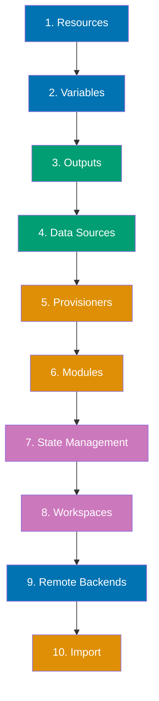
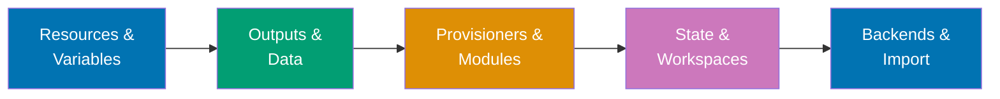

**Want to manage infrastructure declaratively with version-controlled code?** This quick start introduces essential Terraform concepts through practical examples. You'll build from simple resources to modular, reusable infrastructure.

This tutorial provides 5-30% coverage using the touchpoints approach - 10 core concepts with runnable examples. After completing this guide, continue to [By Example - Beginner](/en/learn/software-engineering/infrastructure/tools/terraform/by-example/beginner) for comprehensive 0-40% coverage.

## Prerequisites

Before starting, ensure you have completed [Initial Setup](/en/learn/software-engineering/infrastructure/tools/terraform/initial-setup). You should have:

- Terraform installed and verified
- Experience with basic workflow (init, plan, apply, destroy)
- Understanding of state management basics
- A terminal and text editor ready

## Learning Path

This quick start covers 10 essential Terraform touchpoints:



## Concept 1: Resources

**What**: Infrastructure components managed by Terraform.

**Why**: Declarative definition of infrastructure state.

### Example: Multiple Resource Types

Create `main.tf`:

```hcl
terraform {
  required_providers {
    local = {
      source  = "hashicorp/local"
      version = "~> 2.0"
    }
    random = {
      source  = "hashicorp/random"
      version = "~> 3.0"
    }
  }
}

resource "random_id" "server_id" {
  byte_length = 4
}

resource "local_file" "config_dir" {
  filename = "${path.module}/config/.keep"
  content  = ""
}

resource "local_file" "server_config" {
  filename = "${path.module}/config/server.conf"
  content = <<-EOT
    server_id = ${random_id.server_id.hex}
    timestamp = ${timestamp()}
    environment = production
  EOT

  depends_on = [local_file.config_dir]
}

resource "local_file" "app_config" {
  filename = "${path.module}/config/app.json"
  content = jsonencode({
    server_id = random_id.server_id.hex
    features = {
      logging   = true
      cache     = true
      analytics = false
    }
    ports = [8080, 8443]
  })

  depends_on = [local_file.config_dir]
}
```

Deploy and explore:

```bash
terraform init

terraform plan

terraform apply

cat config/server.conf
cat config/app.json

terraform show

terraform state list

terraform destroy
```

**Key points**:

- Resources are the core building blocks
- Resource syntax: `resource "type" "name" { ... }`
- `depends_on`: explicit resource dependencies
- Built-in functions: `timestamp()`, `jsonencode()`
- Terraform tracks all resources in state

## Concept 2: Variables

**What**: Parameterize configurations for reusability.

**Why**: Make infrastructure code flexible and environment-agnostic.

### Example: Input Variables

Create `variables.tf`:

```hcl
variable "environment" {
  description = "Environment name (dev, staging, production)"
  type        = string
  default     = "development"

  validation {
    condition     = contains(["development", "staging", "production"], var.environment)
    error_message = "Environment must be development, staging, or production."
  }
}

variable "instance_count" {
  description = "Number of instances to create"
  type        = number
  default     = 1

  validation {
    condition     = var.instance_count > 0 && var.instance_count <= 10
    error_message = "Instance count must be between 1 and 10."
  }
}

variable "features" {
  description = "Feature flags"
  type = object({
    logging   = bool
    cache     = bool
    analytics = bool
  })
  default = {
    logging   = true
    cache     = true
    analytics = false
  }
}

variable "allowed_ips" {
  description = "List of allowed IP addresses"
  type        = list(string)
  default     = ["127.0.0.1", "192.168.1.0/24"]
}

variable "tags" {
  description = "Resource tags"
  type        = map(string)
  default = {
    managed_by = "terraform"
    project    = "demo"
  }
}
```

Create `main.tf`:

```hcl
terraform {
  required_providers {
    local = {
      source  = "hashicorp/local"
      version = "~> 2.0"
    }
  }
}

resource "local_file" "environment_config" {
  count    = var.instance_count
  filename = "${path.module}/instance-${count.index}.conf"
  content = templatefile("${path.module}/template.tftpl", {
    environment   = var.environment
    instance_id   = count.index
    features      = var.features
    allowed_ips   = var.allowed_ips
    tags          = var.tags
  })
}
```

Create `template.tftpl`:

```
environment = "${environment}"
instance_id = ${instance_id}

logging   = ${features.logging}
cache     = ${features.cache}
analytics = ${features.analytics}

allowed_ips = ${jsonencode(allowed_ips)}

%{ for key, value in tags ~}
${key} = "${value}"
%{ endfor ~}
```

Use variables:

```bash
terraform init

terraform plan

terraform apply -var="environment=production" -var="instance_count=3"

cat instance-0.conf
cat instance-1.conf
cat instance-2.conf

cat > terraform.tfvars <<EOF
environment    = "staging"
instance_count = 2
features = {
  logging   = true
  cache     = false
  analytics = true
}
allowed_ips = ["10.0.0.0/8"]
EOF

terraform apply

terraform destroy
```

**Key points**:

- Variable types: string, number, bool, list, map, object, tuple
- Defaults make variables optional
- Validation rules enforce constraints
- `-var` flag: command-line override
- `terraform.tfvars`: auto-loaded variable file
- `templatefile()`: render templates with variables

## Concept 3: Outputs

**What**: Extract and display values from infrastructure.

**Why**: Share data between modules and view important information.

### Example: Output Values

Create `outputs.tf`:

```hcl
output "server_id" {
  description = "Generated server ID"
  value       = random_id.server.hex
}

output "config_files" {
  description = "Created configuration files"
  value = {
    server = local_file.server_config.filename
    app    = local_file.app_config.filename
  }
}

output "server_config_content" {
  description = "Server configuration content"
  value       = local_file.server_config.content
  sensitive   = false
}

output "summary" {
  description = "Infrastructure summary"
  value = {
    environment   = var.environment
    instance_count = var.instance_count
    server_id     = random_id.server.hex
    timestamp     = timestamp()
  }
}
```

Create `main.tf`:

```hcl
terraform {
  required_providers {
    local = {
      source  = "hashicorp/local"
      version = "~> 2.0"
    }
    random = {
      source  = "hashicorp/random"
      version = "~> 3.0"
    }
  }
}

variable "environment" {
  type    = string
  default = "development"
}

variable "instance_count" {
  type    = number
  default = 1
}

resource "random_id" "server" {
  byte_length = 4
}

resource "local_file" "server_config" {
  filename = "${path.module}/server.conf"
  content  = "server_id = ${random_id.server.hex}"
}

resource "local_file" "app_config" {
  filename = "${path.module}/app.json"
  content  = jsonencode({ server_id = random_id.server.hex })
}
```

Use outputs:

```bash
terraform init
terraform apply -auto-approve

terraform output

terraform output server_id

terraform output -json

SERVER_ID=$(terraform output -raw server_id)
echo "Server ID: $SERVER_ID"

terraform output -json > infrastructure.json

terraform destroy -auto-approve
```

**Key points**:

- Outputs display after apply
- `sensitive = true`: hide from console
- `-raw` flag: remove quotes for scripting
- `-json` flag: machine-readable format
- Outputs enable module composition
- Available via `terraform output` anytime

## Concept 4: Data Sources

**What**: Read information from external sources or existing infrastructure.

**Why**: Reference existing resources without managing them.

### Example: Local and External Data

Create `data.tf`:

```hcl
terraform {
  required_providers {
    local = {
      source  = "hashicorp/local"
      version = "~> 2.0"
    }
    http = {
      source  = "hashicorp/http"
      version = "~> 3.0"
    }
  }
}

data "local_file" "existing_config" {
  filename = "${path.module}/existing.txt"
}

data "http" "ip_address" {
  url = "https://api.ipify.org?format=json"

  request_headers = {
    Accept = "application/json"
  }
}

resource "local_file" "info" {
  filename = "${path.module}/info.txt"
  content = <<-EOT
    Existing config content: ${data.local_file.existing_config.content}
    Public IP: ${jsondecode(data.http.ip_address.response_body).ip}
    Generated at: ${timestamp()}
  EOT
}
```

Create prerequisite file and run:

```bash
echo "Production Configuration" > existing.txt

terraform init

terraform plan

terraform apply -auto-approve

cat info.txt

terraform destroy -auto-approve
rm existing.txt
```

**Key points**:

- Data sources read-only (no creation/modification)
- Syntax: `data "type" "name" { ... }`
- Access: `data.type.name.attribute`
- Refresh on every plan/apply
- Use for existing infrastructure, APIs, files
- Common data sources: AWS AMIs, Azure resource groups, DNS records

## Concept 5: Provisioners

**What**: Execute actions on local or remote machines during resource lifecycle.

**Why**: Initialize resources after creation (last resort - prefer native tools).

### Example: Local and Remote Execution

Create `provisioners.tf`:

```hcl
terraform {
  required_providers {
    local = {
      source  = "hashicorp/local"
      version = "~> 2.0"
    }
    null = {
      source  = "hashicorp/null"
      version = "~> 3.0"
    }
  }
}

resource "local_file" "script" {
  filename = "${path.module}/setup.sh"
  content = <<-EOT
    #!/bin/bash
    echo "Initializing server..."
    echo "Server ID: $1"
    echo "Timestamp: $(date)"
  EOT

  provisioner "local-exec" {
    command = "chmod +x ${self.filename}"
  }
}

resource "null_resource" "setup" {
  triggers = {
    script_hash = local_file.script.content
  }

  provisioner "local-exec" {
    command = "${path.module}/setup.sh server-123"
  }

  provisioner "local-exec" {
    when    = destroy
    command = "echo 'Cleanup on destroy'"
  }

  depends_on = [local_file.script]
}

resource "local_file" "log" {
  filename = "${path.module}/provision.log"
  content  = "Provisioned at ${timestamp()}"

  provisioner "local-exec" {
    command = "echo 'File created: ${self.filename}' >> ${path.module}/provision.log"
  }

  provisioner "local-exec" {
    when       = destroy
    command    = "echo 'File destroyed at $(date)' >> ${path.module}/destroy.log"
    on_failure = continue
  }
}
```

Run provisioners:

```bash
terraform init

terraform apply -auto-approve

cat provision.log

terraform destroy -auto-approve

cat destroy.log

rm setup.sh provision.log destroy.log
```

**Key points**:

- `local-exec`: Execute commands locally
- `remote-exec`: Execute commands on remote resource (requires connection)
- `when = destroy`: Run on resource destruction
- `on_failure = continue`: Don't fail on provisioner error
- Provisioners are last resort - prefer native provider features
- Use `null_resource` for provisioner-only resources

## Concept 6: Modules

**What**: Reusable, composable infrastructure components.

**Why**: Organize code, promote reuse, enforce standards.

### Example: Creating and Using Modules

Create module structure:

```bash
mkdir -p modules/webserver
```

Create `modules/webserver/variables.tf`:

```hcl
variable "server_name" {
  description = "Server name"
  type        = string
}

variable "port" {
  description = "Server port"
  type        = number
  default     = 8080
}

variable "environment" {
  description = "Environment name"
  type        = string
}
```

Create `modules/webserver/main.tf`:

```hcl
terraform {
  required_providers {
    local = {
      source  = "hashicorp/local"
      version = "~> 2.0"
    }
    random = {
      source  = "hashicorp/random"
      version = "~> 3.0"
    }
  }
}

resource "random_id" "server_id" {
  byte_length = 4
}

resource "local_file" "config" {
  filename = "${path.root}/servers/${var.server_name}.conf"
  content = <<-EOT
    server_name = ${var.server_name}
    server_id   = ${random_id.server_id.hex}
    port        = ${var.port}
    environment = ${var.environment}
  EOT
}
```

Create `modules/webserver/outputs.tf`:

```hcl
output "server_id" {
  description = "Generated server ID"
  value       = random_id.server_id.hex
}

output "config_file" {
  description = "Configuration file path"
  value       = local_file.config.filename
}
```

Create root `main.tf`:

```hcl
module "web_prod" {
  source = "./modules/webserver"

  server_name = "web-prod-01"
  port        = 443
  environment = "production"
}

module "web_dev" {
  source = "./modules/webserver"

  server_name = "web-dev-01"
  port        = 8080
  environment = "development"
}

module "api_prod" {
  source = "./modules/webserver"

  server_name = "api-prod-01"
  port        = 8443
  environment = "production"
}
```

Create root `outputs.tf`:

```hcl
output "production_servers" {
  value = {
    web = module.web_prod.server_id
    api = module.api_prod.server_id
  }
}

output "development_servers" {
  value = {
    web = module.web_dev.server_id
  }
}
```

Use modules:

```bash
mkdir -p servers

terraform init

terraform plan

terraform apply -auto-approve

terraform output

ls servers/
cat servers/web-prod-01.conf

terraform destroy -auto-approve
rm -rf servers
```

**Key points**:

- Modules encapsulate related resources
- `source`: local path or registry URL
- Module inputs: variables
- Module outputs: exposed values
- Access: `module.name.output`
- Terraform Registry: public module sharing
- Versioning: lock module versions in production

## Concept 7: State Management

**What**: Track infrastructure in state file with locking.

**Why**: Map configuration to real-world resources, detect drift.

### Example: State Inspection and Manipulation

Create `state-demo.tf`:

```hcl
terraform {
  required_providers {
    local = {
      source  = "hashicorp/local"
      version = "~> 2.0"
    }
    random = {
      source  = "hashicorp/random"
      version = "~> 3.0"
    }
  }
}

resource "random_id" "id1" {
  byte_length = 4
}

resource "random_id" "id2" {
  byte_length = 4
}

resource "local_file" "file1" {
  filename = "${path.module}/file1.txt"
  content  = "ID: ${random_id.id1.hex}"
}

resource "local_file" "file2" {
  filename = "${path.module}/file2.txt"
  content  = "ID: ${random_id.id2.hex}"
}
```

State operations:

```bash
terraform init
terraform apply -auto-approve

terraform state list

terraform state show random_id.id1

terraform state pull

terraform state mv random_id.id1 random_id.primary_id

terraform state list

terraform state rm local_file.file2

terraform state list

terraform plan


terraform refresh

cp terraform.tfstate terraform.tfstate.backup

terraform destroy -auto-approve
rm file1.txt file2.txt terraform.tfstate.backup
```

**Key points**:

- State maps config to reality
- **Never** manually edit state file
- Use `terraform state` commands for manipulation
- State locking prevents concurrent modifications
- Sensitive data stored in state (use encryption)
- Remote backends recommended for teams
- State file is source of truth

## Concept 8: Workspaces

**What**: Multiple state files for same configuration.

**Why**: Manage multiple environments (dev, staging, prod) with one codebase.

### Example: Environment-Based Workspaces

Create `workspaces.tf`:

```hcl
terraform {
  required_providers {
    local = {
      source  = "hashicorp/local"
      version = "~> 2.0"
    }
  }
}

locals {
  environment = terraform.workspace

  config = {
    development = {
      instance_count = 1
      port           = 8080
    }
    staging = {
      instance_count = 2
      port           = 8080
    }
    production = {
      instance_count = 3
      port           = 443
    }
  }

  current_config = local.config[local.environment]
}

resource "local_file" "instances" {
  count    = local.current_config.instance_count
  filename = "${path.module}/${local.environment}-instance-${count.index}.conf"
  content = <<-EOT
    environment = ${local.environment}
    instance_id = ${count.index}
    port        = ${local.current_config.port}
  EOT
}
```

Use workspaces:

```bash
terraform init

terraform workspace list

terraform workspace new development

terraform apply -auto-approve

ls *-instance-*.conf

terraform workspace new staging

terraform apply -auto-approve

ls *-instance-*.conf

terraform workspace new production
terraform apply -auto-approve

ls *-instance-*.conf

terraform workspace select development
terraform workspace list  # Shows current workspace

terraform show

terraform workspace select development
terraform destroy -auto-approve

terraform workspace select staging
terraform destroy -auto-approve

terraform workspace select production
terraform destroy -auto-approve

terraform workspace select default
terraform workspace delete development
terraform workspace delete staging
terraform workspace delete production

rm -f *-instance-*.conf
```

**Key points**:

- Workspaces: separate state files
- `terraform.workspace`: current workspace name
- Default workspace: `default`
- Use for environments (dev, staging, prod)
- Each workspace has independent state
- Cannot delete current workspace
- Alternative: separate directories per environment

## Concept 9: Remote Backends

**What**: Store state remotely with locking and encryption.

**Why**: Team collaboration, state sharing, security.

### Example: Local Backend Configuration

Create `backend.tf`:

```hcl
terraform {
  # In production, use remote backends:
  # - S3 with DynamoDB locking (AWS)
  # - Azure Blob Storage (Azure)
  # - Google Cloud Storage (GCP)
  # - Terraform Cloud

  # Local backend for demonstration
  backend "local" {
    path = "state/terraform.tfstate"
  }

  required_providers {
    local = {
      source  = "hashicorp/local"
      version = "~> 2.0"
    }
  }
}

resource "local_file" "example" {
  filename = "${path.module}/backend-demo.txt"
  content  = "State stored in custom location"
}
```

Use custom backend:

```bash
mkdir -p state

terraform init

ls state/

terraform apply -auto-approve

cat state/terraform.tfstate

cat > backend-new.tf <<'EOF'
terraform {
  backend "local" {
    path = "state-new/terraform.tfstate"
  }
}
EOF

mkdir -p state-new

terraform init -migrate-state

ls state-new/

terraform destroy -auto-approve
rm -rf state state-new backend-new.tf backend-demo.txt
```

**Example production backends**:

```hcl
terraform {
  backend "s3" {
    bucket         = "my-terraform-state"
    key            = "prod/terraform.tfstate"
    region         = "us-east-1"
    encrypt        = true
    dynamodb_table = "terraform-locks"
  }
}

terraform {
  backend "remote" {
    organization = "my-org"
    workspaces {
      name = "production"
    }
  }
}
```

**Key points**:

- Remote backends: team collaboration
- State locking: prevent conflicts
- Encryption: protect sensitive data
- S3 backend: most popular for AWS
- Terraform Cloud: managed service
- Backend migration: `terraform init -migrate-state`
- Cannot interpolate variables in backend config

## Concept 10: Import Existing Resources

**What**: Bring existing infrastructure under Terraform management.

**Why**: Adopt Terraform for manually-created resources.

### Example: Import Workflow

Create existing resource manually:

```bash
echo "Manually created resource" > manual-file.txt
```

Create `import.tf`:

```hcl
terraform {
  required_providers {
    local = {
      source  = "hashicorp/local"
      version = "~> 2.0"
    }
  }
}

resource "local_file" "imported" {
  filename = "${path.module}/manual-file.txt"
  content  = "Manually created resource"
}
```

Import workflow:

```bash
terraform init

terraform plan

terraform import local_file.imported manual-file.txt

terraform plan

terraform state list

terraform state show local_file.imported

cat > import.tf <<'EOF'
terraform {
  required_providers {
    local = {
      source  = "hashicorp/local"
      version = "~> 2.0"
    }
  }
}

resource "local_file" "imported" {
  filename = "${path.module}/manual-file.txt"
  content  = "Now managed by Terraform"
}
EOF

terraform plan

terraform apply -auto-approve

cat manual-file.txt

terraform destroy -auto-approve

ls manual-file.txt  # File not found
```

**Key points**:

- Import brings existing resources into state
- Must write matching configuration manually
- `terraform import <resource_type>.<name> <id>`
- Import only affects state, not infrastructure
- After import, Terraform manages resource
- Use for migrating manually-created resources
- Import blocks (Terraform 1.5+) automate this

## Learning Path Summary

You've completed 10 essential Terraform touchpoints:



## Next Steps

Now that you understand core Terraform concepts:

1. **By Example - Beginner**: Deep dive into 0-40% coverage with 25+ annotated examples
   - Visit [By Example - Beginner](/en/learn/software-engineering/infrastructure/tools/terraform/by-example/beginner)
2. **By Example - Intermediate**: Advance to 40-75% coverage with AWS/Azure/GCP
   - Continue to [By Example - Intermediate](/en/learn/software-engineering/infrastructure/tools/terraform/by-example/intermediate)
3. **By Example - Advanced**: Master 75-95% coverage with advanced patterns
   - Progress to [By Example - Advanced](/en/learn/software-engineering/infrastructure/tools/terraform/by-example/advanced)

## Further Resources

**Official Documentation**:

- [Terraform Documentation](https://www.terraform.io/docs) - Comprehensive guides
- [Terraform Registry](https://registry.terraform.io/) - Providers and modules
- [HashiCorp Learn](https://learn.hashicorp.com/terraform) - Interactive tutorials
- [Language Documentation](https://www.terraform.io/language) - HCL reference

**Key Concepts**:

- **Resources**: Infrastructure components
- **Variables**: Parameterized configuration
- **Outputs**: Extracted values
- **Data Sources**: Read existing infrastructure
- **Modules**: Reusable components
- **State**: Infrastructure tracking
- **Workspaces**: Multiple environments
- **Backends**: Remote state storage
- **Import**: Adopt existing resources

## Summary

You've completed the Terraform Quick Start with 5-30% coverage! You now understand:

- Resource definition and dependencies
- Variable types and validation
- Output values for data sharing
- Data sources for external information
- Provisioner usage (as last resort)
- Module creation and composition
- State management and manipulation
- Workspace-based environments
- Remote backend configuration
- Importing existing infrastructure

Continue your journey with comprehensive By Example tutorials for deeper mastery of infrastructure as code with Terraform.
