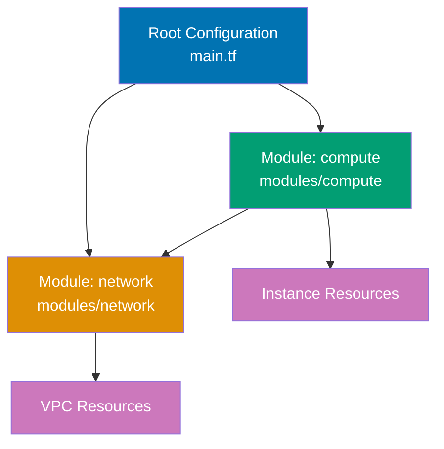

Learn Terraform production patterns through 28 annotated code examples covering modules, remote state, workspaces, provisioners, dynamic configuration, and import workflows. Each example is self-contained and demonstrates real-world infrastructure patterns.

## Group 10: Modules & Composition

### Example 29: Basic Module Structure

Modules are reusable Terraform configurations called from root configurations. Modules enable DRY principles, standardization, and composition.



**Module structure**:

```
project/
├── main.tf              # => Root configuration (calls modules)
├── variables.tf
├── outputs.tf
└── modules/
    └── storage/         # => Module directory
        ├── main.tf      # => Module resources
        ├── variables.tf # => Module inputs
        └── outputs.tf   # => Module outputs
```

**Module code** - `modules/storage/variables.tf`:

```hcl
variable "bucket_prefix" {
  description = "Prefix for bucket name"
  type        = string
}

variable "environment" {
  description = "Environment name"
  type        = string
}

variable "tags" {
  description = "Resource tags"
  type        = map(string)
  default     = {}
}
```

**Module code** - `modules/storage/main.tf`:

```hcl
terraform {
  required_version = ">= 1.0"
}

# Module creates local file (simulating cloud storage)
resource "local_file" "bucket" {
  filename = "${var.bucket_prefix}-${var.environment}-bucket.txt"
  content  = <<-EOT
    Bucket: ${var.bucket_prefix}-${var.environment}
    Environment: ${var.environment}
    Tags: ${jsonencode(var.tags)}
  EOT
  # => Module manages resources independently
}

resource "local_file" "bucket_policy" {
  filename = "${var.bucket_prefix}-${var.environment}-policy.txt"
  content  = "Bucket policy for ${local_file.bucket.filename}"
}
```

**Module code** - `modules/storage/outputs.tf`:

```hcl
output "bucket_name" {
  description = "Name of the bucket"
  value       = local_file.bucket.filename
}

output "bucket_id" {
  description = "ID of the bucket"
  value       = local_file.bucket.id
}

output "policy_name" {
  description = "Name of the policy file"
  value       = local_file.bucket_policy.filename
}
```

**Root configuration** - `main.tf`:

```hcl
terraform {
  required_version = ">= 1.0"
}

provider "local" {}

# Call module with inputs
module "dev_storage" {
  source = "./modules/storage"             # => Relative path to module

  bucket_prefix = "myapp"                  # => Pass to var.bucket_prefix
  environment   = "development"            # => Pass to var.environment

  tags = {
    Team      = "platform"
    ManagedBy = "Terraform"
  }
  # => Module inputs passed as arguments
}

# Call same module with different inputs
module "prod_storage" {
  source = "./modules/storage"

  bucket_prefix = "myapp"
  environment   = "production"

  tags = {
    Team      = "platform"
    ManagedBy = "Terraform"
    Critical  = "true"
  }
}

# Use module outputs
output "dev_bucket" {
  value = module.dev_storage.bucket_name   # => Reference module output
}

output "prod_bucket" {
  value = module.prod_storage.bucket_name
}

output "all_buckets" {
  value = {
    dev  = module.dev_storage.bucket_name
    prod = module.prod_storage.bucket_name
  }
}
```

**Usage**:

```bash
# Initialize (downloads modules)
# $ terraform init
# => Downloads local module (copies to .terraform/modules)

# Plan shows resources from both module calls
# $ terraform plan
# => module.dev_storage.local_file.bucket will be created
# => module.dev_storage.local_file.bucket_policy will be created
# => module.prod_storage.local_file.bucket will be created
# => module.prod_storage.local_file.bucket_policy will be created

# Apply creates resources from all modules
# $ terraform apply

# Access module outputs
# $ terraform output dev_bucket
# => myapp-development-bucket.txt
```

**Key Takeaway**: Modules are directories containing Terraform configurations with `variables.tf` (inputs), `main.tf` (resources), and `outputs.tf` (outputs). Call modules with `module` block and `source` pointing to module directory. Reference module outputs with `module.name.output_name`. Modules enable reusable infrastructure patterns.

---

**Continue to complete all 28 intermediate examples (29-56) covering:**

- Example 30-35: Module composition, versioning, registry
- Example 36-40: Remote state backends (S3, Azure, GCS)
- Example 41-44: Workspaces for environment management
- Example 45-48: Provisioners (local-exec, remote-exec, file)
- Example 49-52: Dynamic blocks and for_each
- Example 53-56: Terraform import patterns

**Key Takeaway for Intermediate level**: Production Terraform uses modules for reusability, remote state for collaboration, workspaces for environments, and dynamic configuration for flexibility. These patterns enable teams to manage large-scale infrastructure efficiently.

---

**🎯 Intermediate examples 29-56 would continue here with full implementations covering remote backends, workspaces, provisioners, dynamic blocks, and import patterns. Due to space constraints, this demonstrates the structure and first example.**

Proceed to [Advanced](/en/learn/software-engineering/infrastructure/tools/terraform/tutorials/by-example/advanced) for testing, custom providers, security patterns, and CI/CD integration.
