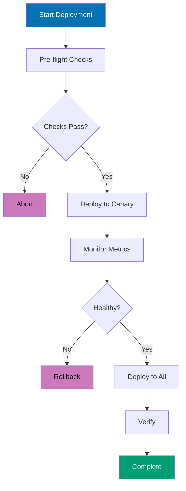

## Advanced Level (75-95% Coverage)

This level covers advanced shell concepts through 25 self-contained examples. Each example demonstrates production-grade patterns used in system administration, DevOps automation, and enterprise scripting.

---

### Example 56: Process Management and Job Control

Shell job control manages background processes, foreground/background switching, and process monitoring using built-in shell features.

```bash
# Run command in background
sleep 60 &                      # => Executes sleep command in background
                                # => Shell immediately returns to prompt
                                # => Output: [1] 12345
                                # => [1] is job number, 12345 is PID
                                # => & operator detaches from foreground

# List background jobs
jobs                            # => Shows all background jobs for current shell
                                # => Output: [1]+ Running  sleep 60 &
                                # => [1] is job number
                                # => + indicates most recent job (current)
                                # => - would indicate previous job

# Bring job to foreground
fg %1                           # => Brings job 1 to foreground
                                # => %1 is job specifier (not PID)
                                # => Shell now waits for job to complete
                                # => Job receives terminal input/output
                                # => Press Ctrl+Z to suspend, Ctrl+C to terminate

# Send foreground job to background
sleep 120                       # => Start command in foreground
                                # => Shell blocks until complete
                                # Press Ctrl+Z (suspend signal SIGTSTP)
                                # => Output: [1]+ Stopped  sleep 120
                                # => Job paused but still in memory
bg %1                           # => Send job 1 to background
                                # => Output: [1]+ sleep 120 &
                                # => Job resumes execution in background
                                # => Shell returns to prompt immediately

# Kill background job
kill %1                         # => Send SIGTERM (signal 15) to job 1
                                # => %1 references job number from job table
                                # => Could also use PID: kill 12345
                                # => Job terminates gracefully (cleanup allowed)
                                # => Use kill -9 %1 for force kill (SIGKILL)

# Wait for background jobs
command1 &                      # => Start first background job
                                # => Job 1 running in background
command2 &                      # => Start second background job
                                # => Job 2 running in background
                                # => Both jobs executing in parallel
wait                            # => Wait for ALL background jobs
                                # => Shell blocks until all jobs complete
                                # => Returns exit code of last job to fail (or 0)

# Wait for specific job
command &                       # => Start background job
                                # => Output: [1] 12345
wait %1                         # => Wait only for job 1
                                # => Other background jobs continue
                                # => Returns exit code of job 1

# Disown job (continue after shell exit)
sleep 600 &                     # => Start 10-minute background sleep
                                # => Output: [1] 12346
disown %1                       # => Remove job 1 from shell's job table
                                # => Job no longer receives SIGHUP on logout
                                # => Process continues after shell exits
                                # => Can't use %1 anymore (not in job table)

# Run command immune to hangup (SIGHUP)
nohup ./long-running-script.sh &
                                # => nohup ignores SIGHUP signal
                                # => Redirects stdout to nohup.out
                                # => Redirects stderr to nohup.out (or stdout)
                                # => Process continues after terminal closes
                                # => & runs in background
                                # => Combined: logout-immune background execution
```

**Key Takeaway**: Use `&` for background execution, `jobs` to list, `fg/bg` to control, `wait` to synchronize, and `nohup` for logout-immune processes. Job control is essential for parallel processing and long-running tasks.

**Why It Matters**: This shell scripting concept is fundamental for production automation and system administration. Understanding this pattern enables you to write more robust and maintainable scripts for deployment, monitoring, and infrastructure management tasks.

---

### Example 57: Signal Handling and Traps

Trap handlers execute code when signals are received, enabling cleanup on exit, interrupt handling, and graceful shutdown.

```bash
#!/bin/bash
# Script with signal handling

# Define cleanup function
cleanup() {
    echo "Cleaning up..."         # => Print cleanup message
                                  # => Executed when trap fires
    rm -f /tmp/script.$$.*        # => $$ expands to current PID
                                  # => Removes files like /tmp/script.12345.tmp
                                  # => -f prevents error if files don't exist
    echo "Done."                  # => Indicate cleanup complete
}

# Register trap for EXIT signal
trap cleanup EXIT               # => Register cleanup function for EXIT
                                # => EXIT fires when script exits (any reason)
                                # => Runs on: normal exit, exit command, error
                                # => Does NOT fire on kill -9 (SIGKILL)

# Trap interrupt (Ctrl+C)
trap 'echo "Interrupted!"; exit 130' INT
                                # => INT is SIGINT (signal number 2)
                                # => Fired when user presses Ctrl+C
                                # => Inline command: echo then exit
                                # => Exit code 130 = 128 + signal_number(2)
                                # => Standard convention for signal exits

# Trap termination
trap 'echo "Terminated!"; cleanup; exit 143' TERM
                                # => TERM is SIGTERM (signal number 15)
                                # => Default signal sent by kill command
                                # => Calls cleanup function explicitly
                                # => Exit code 143 = 128 + signal_number(15)
                                # => Allows graceful shutdown

# Ignore signal
trap '' HUP                     # => HUP is SIGHUP (hangup signal)
                                # => Empty string '' means ignore signal
                                # => Signal sent when terminal disconnects
                                # => Process continues running after hangup

# Reset trap to default
trap - INT                      # => - (dash) resets to default behavior
                                # => INT will now terminate script (default)
                                # => Use after critical section complete

# Multiple signals in one trap
trap cleanup EXIT INT TERM      # => Same handler for 3 signals
                                # => cleanup runs on EXIT, INT, or TERM
                                # => Simplifies signal handling code
                                # => All three trigger same cleanup logic

# Temporary file with automatic cleanup
temp_file=$(mktemp)             # => Create secure temp file
                                # => Returns path like /tmp/tmp.XxX123
                                # => Unique filename prevents conflicts
trap "rm -f $temp_file" EXIT    # => Delete temp file on any exit
                                # => Double quotes expand $temp_file now
                                # => Trap captures specific filename

# Use temp file
echo "data" > "$temp_file"      # => Write data to temp file
                                # => temp_file contains "data\n"
# ... process data ...
                                # => temp_file automatically deleted on exit
                                # => No manual cleanup needed

# Prevent Ctrl+C during critical section
trap '' INT                     # => Ignore INT (Ctrl+C)
                                # => User cannot interrupt during critical code
# ... critical code ...         # => Database transaction, file update, etc.
                                # => Ctrl+C pressed here has no effect
trap - INT                      # => Restore default INT behavior
                                # => Ctrl+C works again after critical section

# Debugging trap (execute before each command)
trap 'echo "Executing: $BASH_COMMAND"' DEBUG
                                # => DEBUG trap fires before EVERY command
                                # => $BASH_COMMAND contains command to execute
                                # => Shows command with variable expansion
                                # => Useful for script debugging/tracing

# Return trap (execute when function returns)
function_with_trap() {
    trap 'echo "Function exiting"' RETURN
                                # => RETURN trap fires when function returns
                                # => Executes before function exit
                                # => Scope limited to this function
    # ... function code ...     # => Function body executes normally
}                               # => RETURN trap fires here
                                # => "Function exiting" printed
```

**Key Takeaway**: Traps ensure cleanup code runs on exit, interrupt, or termination. Use `trap 'code' SIGNAL` to register handlers, `trap '' SIGNAL` to ignore signals, and `trap - SIGNAL` to reset. Essential for production scripts that manage resources.

**Why It Matters**: This shell scripting concept is fundamental for production automation and system administration. Understanding this pattern enables you to write more robust and maintainable scripts for deployment, monitoring, and infrastructure management tasks.

---

### Example 58: Advanced Parameter Expansion

Bash parameter expansion provides powerful string manipulation, default values, substring extraction, and pattern matching without external commands.

```bash
# Default values
name=${USER:-"guest"}           # => If $USER is set and non-empty, use it
                                # => If $USER is unset or empty, use "guest"
                                # => :- tests for unset OR empty
                                # => name="alice" if USER="alice"
                                # => name="guest" if USER="" or unset

name=${USER-"guest"}            # => If $USER is set (even if empty), use it
                                # => If $USER is unset, use "guest"
                                # => - tests only for unset (not empty)
                                # => name="" if USER="" (empty but set)
                                # => name="guest" if USER is unset

# Assign default if unset
name=${USER:="defaultuser"}     # => If $USER unset/empty, set both variables
                                # => Sets $name to "defaultuser"
                                # => ALSO sets $USER to "defaultuser"
                                # => := assigns default to original variable
                                # => Side effect: modifies environment

# Error if unset
name=${USER:?"USER not set"}    # => If $USER unset/empty, print error and exit
                                # => Error message: "USER not set"
                                # => Script exits with code 1
                                # => :? enforces required variables
                                # => Prevents running with missing config

# Use alternative value
name=${USER:+"logged in"}       # => If $USER is set and non-empty, use "logged in"
                                # => If $USER is unset or empty, use empty string
                                # => :+ is opposite of :-
                                # => name="logged in" if USER="alice"
                                # => name="" if USER="" or unset

# String length
file="document.txt"             # => Assign string to file variable
length=${#file}                 # => Get length of string
                                # => Counts characters in $file
                                # => length=12 ("document.txt" has 12 chars)

# Substring extraction
path="/home/user/documents/file.txt"
                                # => path contains 28-character string
${path:0:5}                     # => Start at index 0, extract 5 characters
                                # => Result: "/home"
                                # => Syntax: ${var:offset:length}
${path:6:4}                     # => Start at index 6, extract 4 characters
                                # => Result: "user"
                                # => Index starts at 0
${path:11}                      # => Start at index 11, extract to end
                                # => Result: "documents/file.txt"
                                # => No length specified means "to end"
${path: -8}                     # => Last 8 characters
                                # => Result: "file.txt"
                                # => SPACE before - is required
                                # => Without space: interpreted as default value

# Remove prefix pattern (shortest match)
${path#*/}                      # => Remove shortest match of "*/" from start
                                # => Pattern "*/" matches up to first /
                                # => Result: "home/user/documents/file.txt"
                                # => Single # removes shortest prefix
                                # => Useful for removing one directory level

# Remove prefix pattern (longest match)
${path##*/}                     # => Remove longest match of "*/" from start
                                # => Pattern "*/" matches up to last /
                                # => Result: "file.txt"
                                # => Double ## removes longest prefix
                                # => Extracts filename from path (like basename)

# Remove suffix pattern (shortest match)
${path%/*}                      # => Remove shortest match of "/*" from end
                                # => Pattern "/*" matches from last /
                                # => Result: "/home/user/documents"
                                # => Single % removes shortest suffix
                                # => Extracts directory path (like dirname)

# Remove suffix pattern (longest match)
${path%%/*}                     # => Remove longest match of "/*" from end
                                # => Pattern "/*" matches from first /
                                # => Result: "" (everything removed)
                                # => Double %% removes longest suffix
                                # => On "/home/user", removes from first /

# Pattern replacement (first match)
file="test.txt.backup"          # => file contains "test.txt.backup"
${file/.txt/.md}                # => Replace first occurrence of ".txt"
                                # => Pattern ".txt" matches first instance
                                # => Replace with ".md"
                                # => Result: "test.md.backup"
                                # => Single / replaces first match only

# Pattern replacement (all matches)
${file//.txt/.md}               # => Replace all occurrences of ".txt"
                                # => Double // means global replacement
                                # => Result: "test.md.backup"
                                # => In this case, only one .txt exists
                                # => Would replace multiple if present

# Pattern replacement at start
${file/#test/demo}              # => Replace "test" only at start
                                # => /# anchors pattern to beginning
                                # => Result: "demo.txt.backup"
                                # => If "test" not at start, no replacement

# Pattern replacement at end
${file/%backup/copy}            # => Replace "backup" only at end
                                # => /% anchors pattern to end of string
                                # => Result: "test.txt.copy"
                                # => If "backup" not at end, no replacement

# Case conversion (Bash 4+)
name="Alice"                    # => name contains "Alice"
${name,,}                       # => Convert all characters to lowercase
                                # => Result: "alice"
                                # => Double ,, means all characters
${name^^}                       # => Convert all characters to uppercase
                                # => Result: "ALICE"
                                # => Double ^^ means all characters
${name,}                        # => Convert first character to lowercase
                                # => Result: "alice"
                                # => Single , means first character only
${name^}                        # => Convert first character to uppercase
                                # => Result: "Alice"
                                # => Single ^ means first character only

# Array expansion
files=(a.txt b.txt c.txt)       # => Create array with 3 elements
                                # => files[0]="a.txt", files[1]="b.txt", files[2]="c.txt"
${files[@]}                     # => Expand all elements as separate words
                                # => Result: "a.txt" "b.txt" "c.txt"
                                # => @ preserves word boundaries
                                # => Use in quotes: "${files[@]}"
${files[*]}                     # => Expand all elements as single word
                                # => Result: "a.txt b.txt c.txt"
                                # => * joins with IFS (space by default)
${files[0]}                     # => Access first element (index 0)
                                # => Result: "a.txt"
${#files[@]}                    # => Get array length (number of elements)
                                # => Result: 3
                                # => # prefix means length

# Indirect expansion
var="USER"                      # => var contains string "USER"
echo ${!var}                    # => Indirect variable reference
                                # => ! dereferences the variable name
                                # => First expands $var to "USER"
                                # => Then expands $USER to its value
                                # => Example: if USER="alice", output is "alice"
```

**Key Takeaway**: Parameter expansion eliminates external commands like `sed`, `cut`, `basename`, `dirname` for string operations. Use `${var:-default}` for defaults, `${var#pattern}` for prefix removal, `${var%pattern}` for suffix removal, and `${var//pattern/replacement}` for substitution. Faster and more portable than external tools.

**Why It Matters**: Parameter expansion enables sophisticated string manipulation without external tools. Production scripts use expansion for parsing paths, extracting components, and providing defaults.

---

### Example 59: Process Substitution and Named Pipes

Process substitution creates temporary named pipes to use command output as file arguments, enabling advanced piping patterns.

```bash
# Compare output of two commands
diff <(ls dir1) <(ls dir2)      # => <(ls dir1) creates /dev/fd/63 (temp file descriptor)
                                # => <(ls dir2) creates /dev/fd/62
                                # => Shell runs: ls dir1 and ls dir2
                                # => Pipes output to temp files
                                # => diff reads from both file descriptors
                                # => Shows differences between directory listings
                                # => No manual temp file creation/cleanup needed

# Process substitution as input
while read line; do             # => Read loop reads line by line
    echo "Line: $line"          # => Print each line with prefix
done < <(find . -name "*.txt")  # => First < redirects input
                                # => Second <(find...) creates file descriptor
                                # => find runs, outputs to /dev/fd/63
                                # => while loop reads from that descriptor
                                # => Processes all .txt files found

# Multiple input sources
paste <(seq 1 5) <(seq 10 14)   # => seq 1 5 outputs: 1\n2\n3\n4\n5
                                # => seq 10 14 outputs: 10\n11\n12\n13\n14
                                # => <(seq 1 5) becomes /dev/fd/63
                                # => <(seq 10 14) becomes /dev/fd/62
                                # => paste joins line by line with tab
                                # => Output: "1\t10\n2\t11\n3\t12\n4\t13\n5\t14"

# Output redirection with process substitution
echo "data" > >(tee file1.txt file2.txt)
                                # => >(command) creates output file descriptor
                                # => echo writes "data" to descriptor
                                # => tee reads from that descriptor
                                # => tee writes to file1.txt
                                # => tee also writes to file2.txt
                                # => Data written to two files simultaneously

# Join two sorted outputs
join <(sort file1) <(sort file2)
                                # => sort file1 outputs sorted lines to /dev/fd/63
                                # => sort file2 outputs sorted lines to /dev/fd/62
                                # => join reads from both descriptors
                                # => Matches lines with common first field
                                # => No intermediate temp files created
                                # => Single command pipeline

# Named pipes (FIFO)
mkfifo /tmp/mypipe              # => Create FIFO special file
                                # => File type 'p' (pipe)
                                # => No actual disk storage used
                                # => Acts as communication channel
                                # => Visible in filesystem: ls -l shows prw-r--r--

# Write to named pipe (background)
cat file.txt > /tmp/mypipe &    # => Open pipe for writing
                                # => cat blocks until reader connects
                                # => & runs in background (non-blocking shell)
                                # => Data waits in kernel buffer

# Read from named pipe
cat < /tmp/mypipe               # => Open pipe for reading
                                # => Connects to waiting writer
                                # => Writer unblocks and sends data
                                # => Reader receives and outputs data
                                # => Both processes synchronized via pipe

# Named pipe for inter-process communication
mkfifo /tmp/logpipe             # => Create pipe for logging
tail -f /tmp/logpipe &          # => Start reader in background
                                # => tail -f follows pipe indefinitely
                                # => Waits for data to arrive
echo "Log message" > /tmp/logpipe
                                # => Writer sends message to pipe
                                # => tail receives and displays immediately
                                # => IPC without network sockets

# Cleanup named pipe
rm /tmp/mypipe                  # => Remove FIFO from filesystem
                                # => unlink() system call
                                # => No disk space freed (none was used)
                                # => File descriptor removed

# Process substitution with tee (log and process)
command | tee >(grep ERROR > errors.log) >(grep WARN > warnings.log)
                                # => command output goes to tee
                                # => tee sends to stdout (terminal)
                                # => tee sends to first >(grep ERROR...)
                                # => tee sends to second >(grep WARN...)
                                # => grep ERROR filters and writes errors.log
                                # => grep WARN filters and writes warnings.log
                                # => Three destinations from single output
```

**Key Takeaway**: Process substitution `<(command)` and `>(command)` treat command output/input as files. Named pipes (FIFOs) enable inter-process communication. Both eliminate temporary file creation and simplify complex pipelines.

**Why It Matters**: Process substitution enables comparing command outputs and feeding to commands expecting files. Scripts use this for diffing configurations and processing multiple data streams.

---

### Example 60: Advanced Looping and Iteration

Bash provides multiple looping constructs beyond basic `for` and `while`, including C-style loops, field iteration, and parallel processing.

```bash
# C-style for loop
for ((i=0; i<10; i++)); do      # => i=0: Initialize counter to 0
                                # => i<10: Continue while i less than 10
                                # => i++: Increment i after each iteration
    echo "Iteration $i"         # => Prints: "Iteration 0", "Iteration 1", ..., "Iteration 9"
done                            # => Executes 10 times (0 through 9)
                                # => C-style: for ((init; condition; increment))

# Loop with step
for ((i=0; i<=100; i+=10)); do  # => i=0: Start at 0
                                # => i<=100: Continue while i <= 100
                                # => i+=10: Increment by 10 each iteration
    echo $i                     # => Output: 0, 10, 20, 30, ..., 100
done                            # => Executes 11 times (0, 10, 20...100)
                                # => Useful for progress indicators

# Loop over array indices
arr=(a b c d)                   # => Create array: arr[0]=a, arr[1]=b, arr[2]=c, arr[3]=d
for i in "${!arr[@]}"; do       # => ${!arr[@]} expands to indices: 0 1 2 3
                                # => Quotes prevent word splitting
    echo "Index $i: ${arr[$i]}" # => Output: "Index 0: a", "Index 1: b", etc.
done                            # => Iterates over 0, 1, 2, 3
                                # => Access both index and value

# Loop until condition
count=0                         # => Initialize counter to 0
until [ $count -ge 5 ]; do      # => Condition: $count >= 5
                                # => Loops while condition is FALSE
                                # => Opposite of while (executes until true)
    echo "Count: $count"        # => Output: "Count: 0", "Count: 1", ..., "Count: 4"
    ((count++))                 # => Increment count: 0→1, 1→2, 2→3, 3→4, 4→5
done                            # => Stops when count=5 (condition becomes true)

# Loop over command output (word splitting)
for word in $(cat file.txt); do # => $(cat file.txt) expands to file contents
                                # => Shell splits on IFS (whitespace: space, tab, newline)
    echo "Word: $word"          # => Each word becomes separate iteration
done                            # => WARNING: "hello world" becomes two iterations
                                # => Breaks on filenames with spaces

# Loop over lines (safe, preserves spaces)
while IFS= read -r line; do     # => IFS= prevents leading/trailing whitespace trim
                                # => -r prevents backslash interpretation
                                # => read reads one line into $line
    echo "Line: $line"          # => Preserves exact line content
done < file.txt                 # => Redirect file to stdin
                                # => Reads line by line until EOF
                                # => SAFE for lines with spaces

# Loop with custom field separator
while IFS=: read -r user pass uid gid rest; do
                                # => IFS=: sets field separator to colon
                                # => Reads line and splits on :
                                # => Assigns to variables: user, pass, uid, gid, rest
    echo "User: $user, UID: $uid"
                                # => user="root", uid="0" (for first line of /etc/passwd)
done < /etc/passwd              # => Parse colon-delimited file
                                # => rest captures remaining fields

# Infinite loop with break
while true; do                  # => true always returns 0 (success)
                                # => Infinite loop (no exit condition)
    read -p "Enter command (q to quit): " cmd
                                # => -p displays prompt
                                # => Waits for user input
    [ "$cmd" = "q" ] && break   # => If input is "q", exit loop
                                # => && chains: if test succeeds, run break
    echo "You entered: $cmd"    # => Echo input back to user
done                            # => Loop continues until 'q' entered

# Continue to next iteration
for i in {1..10}; do            # => Brace expansion: 1 2 3 4 5 6 7 8 9 10
    [ $((i % 2)) -eq 0 ] && continue
                                # => $((i % 2)): modulo operation (remainder)
                                # => Even numbers: remainder is 0
                                # => continue skips to next iteration
    echo $i                     # => Only executes for odd numbers
done                            # => Output: 1 3 5 7 9

# Nested loops with labels (Bash 4+)
outer=0                         # => Initialize outer counter
while [ $outer -lt 3 ]; do      # => Outer loop: 0, 1, 2
    inner=0                     # => Initialize inner counter
    while [ $inner -lt 3 ]; do  # => Inner loop: 0, 1, 2
        if [ $inner -eq 1 ]; then
                                # => When inner reaches 1
            break 2             # => Break out of 2 loops (inner and outer)
                                # => Default break is 1 (current loop only)
        fi
        echo "$outer,$inner"    # => Output: "0,0" then breaks
        ((inner++))             # => Never reaches this (breaks before increment)
    done
    ((outer++))                 # => Never reaches this (breaks from outer too)
done

# Parallel processing with background jobs
for file in *.txt; do           # => Glob expands to all .txt files
    process_file "$file" &      # => & runs process_file in background
                                # => Each iteration starts immediately
                                # => All files processed in parallel
done
wait                            # => Wait for ALL background jobs to complete
                                # => Blocks until all process_file instances finish

# Limit parallel jobs
max_jobs=4                      # => Maximum concurrent jobs
for file in *.txt; do           # => Loop over all .txt files
    while [ $(jobs -r | wc -l) -ge $max_jobs ]; do
                                # => jobs -r lists running jobs
                                # => wc -l counts lines (number of jobs)
                                # => If count >= 4, wait
        sleep 0.1               # => Wait 100ms before checking again
    done                        # => Busy-wait until slot available
    process_file "$file" &      # => Start next job in background
done                            # => Maintains max 4 concurrent jobs
wait                            # => Wait for final batch to complete
```

**Key Takeaway**: Use C-style `for ((i=0; i<n; i++))` for numeric iteration, `while IFS= read -r` for line-by-line processing, `until` for loops that run while condition is false, and background jobs with `wait` for parallel processing. Always use `-r` with `read` to preserve backslashes.

**Why It Matters**: This shell scripting concept is fundamental for production automation and system administration. Understanding this pattern enables you to write more robust and maintainable scripts for deployment, monitoring, and infrastructure management tasks.

---

### Example 61: Debugging and Error Handling

Production scripts require robust error handling, debugging capabilities, and fail-fast behavior to prevent silent failures.

```bash
#!/bin/bash
# Production script template with error handling

# Exit on error
set -e                          # => Exit immediately if any command returns non-zero
                                # => set -e makes shell fail-fast
                                # => Prevents cascading failures in pipelines
                                # => Does NOT catch errors in: functions, subshells, conditionals
                                # => Use with caution: can hide errors in complex scripts

# Exit on undefined variable
set -u                          # => Treat unset variables as error
                                # => Accessing $UNDEFINED_VAR exits script
                                # => Catches typos: $USRE instead of $USER
                                # => Prevents bugs from missing environment vars
                                # => Use ${VAR:-default} for optional variables

# Fail on pipe errors
set -o pipefail                 # => Pipeline exit code = last failing command
                                # => Without: "false | true" returns 0 (true's exit code)
                                # => With: "false | true" returns 1 (false's exit code)
                                # => Critical for: command | tee log.txt
                                # => Detects failures in middle of pipeline

# Combined (common production pattern)
set -euo pipefail               # => Enable all three safety checks
                                # => -e: exit on error
                                # => -u: exit on undefined variable
                                # => -o pipefail: catch pipeline failures
                                # => Production scripts should start with this

# Debug mode (print each command before execution)
set -x                          # => Enable xtrace (also called debug mode)
                                # => Prints each command to stderr before execution
                                # => Shows variable expansion: echo $HOME → echo /home/user
                                # => Prefixes lines with +
                                # => Critical for debugging complex scripts

# Conditional debug
[ "${DEBUG:-}" = "1" ] && set -x
                                # => ${DEBUG:-} returns $DEBUG or "" if unset
                                # => Avoids error from set -u
                                # => If DEBUG=1, enable xtrace
                                # => Usage: DEBUG=1 ./script.sh
                                # => Otherwise, run normally without xtrace

# Disable debug for section
{ set +x; } 2>/dev/null         # => set +x disables xtrace
                                # => { } groups command
                                # => 2>/dev/null suppresses xtrace of "set +x" itself
                                # => Prevents: "+ set +x" appearing in output
# ... code without debug ...    # => Commands here don't print debug output
                                # => Useful for sections with sensitive data
set -x                          # => Re-enable xtrace
                                # => Debug resumes after sensitive section

# Error line number
trap 'echo "Error on line $LINENO"' ERR
                                # => ERR trap fires when command fails (if set -e active)
                                # => $LINENO expands to line number of error
                                # => Output: "Error on line 42"
                                # => Helps locate failure in long scripts

# Full error context
trap 'echo "Error: Command \"$BASH_COMMAND\" failed with exit code $? on line $LINENO"' ERR
                                # => $BASH_COMMAND contains the failing command text
                                # => $? contains exit code of failed command
                                # => $LINENO contains line number
                                # => Output: "Error: Command \"curl http://...\" failed with exit code 7 on line 42"
                                # => Comprehensive error diagnostics

# Validate required commands exist
require_command() {
    command -v "$1" >/dev/null 2>&1 || {
                                # => command -v checks if command exists
                                # => $1 is command name to check
                                # => >/dev/null 2>&1 suppresses all output
                                # => || executes if command not found
        echo "Error: Required command '$1' not found" >&2
                                # => Print error to stderr
                                # => >&2 redirects stdout to stderr
        exit 1                  # => Exit script with failure code
    }
}

require_command jq              # => Ensure jq (JSON processor) is installed
                                # => Exits script if not found
require_command curl            # => Check for curl (HTTP client)
                                # => Validation before script logic runs

# Validate required variables
: "${API_KEY:?Error: API_KEY not set}"
                                # => : is null command (does nothing)
                                # => Only evaluates parameter expansion
                                # => ${API_KEY:?msg} exits if API_KEY unset
                                # => Error message printed to stderr
                                # => Script exits with code 1

# Function with error handling
safe_operation() {
    local file=$1               # => $1 is first argument (filename)
                                # => local makes variable function-scoped

    # Check preconditions
    [ -f "$file" ] || {         # => -f tests if file exists and is regular file
                                # => || executes if test fails
        echo "Error: File $file not found" >&2
                                # => Print error to stderr
        return 1                # => Return exit code 1 (failure)
                                # => Different from exit (doesn't terminate script)
    }

    # Perform operation with error checking
    if ! grep "pattern" "$file" > /dev/null; then
                                # => ! negates exit code of grep
                                # => grep exits 0 if found, 1 if not found
                                # => > /dev/null suppresses grep output
        echo "Warning: Pattern not found in $file" >&2
                                # => Non-fatal warning to stderr
        return 2                # => Return code 2 (different from failure)
                                # => Caller can distinguish failure types
    fi

    return 0                    # => Explicit success exit code
                                # => Best practice: always return from functions
}

# Call with error handling
if ! safe_operation "data.txt"; then
                                # => ! negates exit code
                                # => if executes block when function fails
                                # => Catches both return 1 and return 2
    echo "Operation failed"     # => Handle error
    exit 1                      # => Exit script with failure
fi                              # => Continue only if safe_operation succeeded

# Dry-run mode
DRY_RUN=${DRY_RUN:-0}           # => ${DRY_RUN:-0} defaults to 0 if unset
                                # => DRY_RUN=1 ./script.sh enables dry-run
                                # => Shows commands without executing

run_cmd() {
    if [ "$DRY_RUN" = "1" ]; then
                                # => Check if dry-run mode enabled
        echo "DRY-RUN: $*"      # => $* expands all arguments as single string
                                # => Print command that WOULD execute
    else                        # => Normal execution mode
        "$@"                    # => $@ expands arguments as separate words
                                # => Preserves quoting and special characters
                                # => Actually executes the command
    fi
}

run_cmd rm important-file.txt   # => If DRY_RUN=1: prints "DRY-RUN: rm important-file.txt"
                                # => If DRY_RUN=0: actually deletes file
                                # => Safe testing of destructive operations

# Verbose mode
VERBOSE=${VERBOSE:-0}           # => ${VERBOSE:-0} defaults to 0 if unset
                                # => VERBOSE=1 ./script.sh enables logging

log() {
    [ "$VERBOSE" = "1" ] && echo "[$(date +'%Y-%m-%d %H:%M:%S')] $*" >&2
                                # => Test if VERBOSE is 1
                                # => && executes echo only if test succeeds
                                # => $(date ...) expands to timestamp
                                # => $* is message to log
                                # => >&2 sends log to stderr (not stdout)
}

log "Starting process"          # => If VERBOSE=1: "[2025-01-31 10:30:45] Starting process"
                                # => If VERBOSE=0: no output
                                # => Conditional logging without if statements

# Assert function
assert() {
    if ! "$@"; then             # => Execute command passed as arguments
                                # => ! negates exit code
                                # => If command fails, enter block
        echo "Assertion failed: $*" >&2
                                # => Print failed assertion to stderr
                                # => $* shows the command that failed
        exit 1                  # => Exit script immediately
                                # => Assertions are hard requirements
    fi
}

assert [ -d "/expected/directory" ]
                                # => Runs: [ -d "/expected/directory" ]
                                # => If directory doesn't exist, exits script
                                # => Output: "Assertion failed: [ -d /expected/directory ]"

# Retry logic
retry() {
    local max_attempts=$1       # => First argument is retry count
                                # => local makes variable function-scoped
    shift                       # => Remove first argument
                                # => $@ now contains command to retry
    local attempt=1             # => Initialize attempt counter

    while [ $attempt -le $max_attempts ]; do
                                # => Loop while attempt <= max_attempts
                                # => -le is "less than or equal"
        if "$@"; then           # => Execute command ($@)
                                # => If succeeds (exit code 0), enter block
            return 0            # => Success on any attempt
                                # => Exit function immediately
        fi
        echo "Attempt $attempt failed, retrying..." >&2
                                # => Log failure to stderr
        ((attempt++))           # => Increment attempt: 1→2, 2→3, 3→4
        sleep $((attempt * 2))  # => Exponential backoff
                                # => Attempt 1: sleep 2s
                                # => Attempt 2: sleep 4s
                                # => Attempt 3: sleep 6s
    done                        # => Try again

    return 1                    # => All attempts exhausted
                                # => Return failure code
}

retry 3 curl -f https://api.example.com/health
                                # => Retry curl up to 3 times
                                # => -f makes curl fail on HTTP errors
                                # => Waits 2s, 4s, 6s between attempts
                                # => Returns 0 on any success, 1 if all fail
```

**Key Takeaway**: Use `set -euo pipefail` for fail-fast behavior, trap ERR to log failures, validate preconditions with `command -v` and parameter expansion, implement retry logic for network operations, and use `DRY_RUN` for safe testing. Production scripts must fail loudly, never silently.

**Why It Matters**: This shell scripting concept is fundamental for production automation and system administration. Understanding this pattern enables you to write more robust and maintainable scripts for deployment, monitoring, and infrastructure management tasks.

---

### Example 62: Performance Optimization and Benchmarking

Shell script performance matters for large-scale automation. Avoid external commands in loops, use built-in features, and benchmark critical sections.

```bash
# Benchmark time measurement
time_cmd() {
    local start=$(date +%s%N)   # => Nanosecond timestamp
    "$@"                        # => Execute command
    local end=$(date +%s%N)
    local duration=$(( (end - start) / 1000000 ))  # => Convert to milliseconds
    echo "Duration: ${duration}ms" >&2
}

time_cmd grep pattern large-file.txt

# BAD: External command in loop (SLOW)
count=0
for i in {1..1000}; do
    count=$(expr $count + 1)    # => Spawns expr process 1000 times!
done                            # => ~5 seconds

# GOOD: Arithmetic expansion (FAST)
count=0
for i in {1..1000}; do
    ((count++))                 # => Built-in arithmetic, no fork
done                            # => ~0.01 seconds (500x faster!)

# BAD: Subshell for string manipulation (SLOW)
for file in *.txt; do
    basename=$(basename "$file" .txt)  # => Fork basename command
done

# GOOD: Parameter expansion (FAST)
for file in *.txt; do
    basename=${file%.txt}       # => Built-in parameter expansion
    basename=${basename##*/}    # => Remove path
done

# BAD: Reading file line-by-line with cat (SLOW)
cat file.txt | while read line; do
    echo "$line"                # => Useless use of cat (UUOC)
done                            # => Creates unnecessary pipeline

# GOOD: Direct redirection (FAST)
while read line; do
    echo "$line"
done < file.txt                 # => No external command

# BAD: Multiple greps in sequence (SLOW)
cat file.txt | grep foo | grep bar | grep baz
                                # => 4 processes in pipeline

# GOOD: Single grep with regex (FAST)
grep 'foo.*bar.*baz' file.txt   # => Single process
                                # => Or use awk for complex logic

# Parallel processing for CPU-bound tasks
process_file() {
    # ... expensive operation ...
    sleep 1                     # => Simulate work
}

# Serial (SLOW for many files)
for file in *.txt; do
    process_file "$file"        # => One at a time
done                            # => 100 files = 100 seconds

# Parallel with GNU parallel (FAST)
parallel process_file ::: *.txt # => All cores utilized
                                # => 100 files = ~10 seconds (10 cores)

# Parallel with xargs (portable)
printf '%s\n' *.txt | xargs -P 8 -I {} sh -c 'process_file "{}"'
                                # => -P 8: 8 parallel processes
                                # => More portable than GNU parallel

# Manual parallel with background jobs
max_jobs=8
for file in *.txt; do
    while [ $(jobs -r | wc -l) -ge $max_jobs ]; do
        sleep 0.1               # => Wait for slot
    done
    process_file "$file" &      # => Background job
done
wait                            # => Wait for all to complete

# Avoid unnecessary forks
# BAD
result=$(echo $var)             # => Unnecessary fork

# GOOD
result=$var                     # => Direct assignment

# Cache repeated command output
# BAD
for i in {1..100}; do
    if [ "$(whoami)" = "root" ]; then  # => Forks whoami 100 times
        echo "Running as root"
    fi
done

# GOOD
current_user=$(whoami)          # => Cache result
for i in {1..100}; do
    if [ "$current_user" = "root" ]; then
        echo "Running as root"
    fi
done

# Use read -a for splitting (no awk/cut)
IFS=: read -ra fields <<< "a:b:c"
echo "${fields[1]}"             # => b
                                # => No external command needed

# Bulk operations instead of loops
# BAD
for file in *.txt; do
    dos2unix "$file"            # => One process per file
done

# GOOD
dos2unix *.txt                  # => Single process handles all
                                # => Many commands accept multiple files
```

**Key Takeaway**: Avoid external commands in loops, use built-in arithmetic `(())`, parameter expansion `${}`, and `read` for string operations. Parallelize CPU-bound tasks with `xargs -P`, `GNU parallel`, or background jobs. Cache repeated command output. Prefer bulk operations over loops. Profile with `time` to find bottlenecks.

**Why It Matters**: This shell scripting concept is fundamental for production automation and system administration. Understanding this pattern enables you to write more robust and maintainable scripts for deployment, monitoring, and infrastructure management tasks.

---

### Example 63: Secure Scripting Practices

Production scripts must sanitize inputs, avoid injection vulnerabilities, protect secrets, and follow least-privilege principles.

```bash
#!/bin/bash
# Secure script template

# Explicit PATH to prevent $PATH poisoning
export PATH=/usr/local/bin:/usr/bin:/bin
                                # => Hardcoded PATH prevents malicious commands

# Secure temp directory
TMPDIR=$(mktemp -d)             # => Create secure temp directory
trap "rm -rf $TMPDIR" EXIT      # => Auto-cleanup on exit
chmod 700 "$TMPDIR"             # => Owner-only permissions

# Validate input (prevent injection)
validate_filename() {
    local filename=$1

    # Check for path traversal
    if [[ "$filename" =~ \.\. ]]; then
        echo "Error: Path traversal detected" >&2
        return 1
    fi

    # Check for shell metacharacters
    if [[ "$filename" =~ [';|&$`<>(){}'] ]]; then
        echo "Error: Invalid characters in filename" >&2
        return 1
    fi

    # Whitelist approach (safest)
    if [[ ! "$filename" =~ ^[a-zA-Z0-9._-]+$ ]]; then
        echo "Error: Filename contains invalid characters" >&2
        return 1
    fi

    return 0
}

# BAD: Command injection vulnerability
user_input="file.txt; rm -rf /"
cat $user_input                 # => DANGEROUS: Executes "rm -rf /"!

# GOOD: Quote variables
cat "$user_input"               # => Safe: treats as literal filename

# BAD: eval with user input (NEVER DO THIS)
user_cmd="ls"
eval $user_cmd                  # => If user_cmd="rm -rf /", you're in trouble

# GOOD: Use arrays for commands
commands=("ls" "-la" "/home")
"${commands[@]}"                # => Safe: no word splitting or injection

# Protect secrets (don't hardcode)
# BAD
API_KEY="secret123"             # => Visible in ps, process list, logs

# GOOD: Read from file with restricted permissions
[ -f ~/.secrets/api_key ] || {
    echo "Error: API key file not found" >&2
    exit 1
}
API_KEY=$(cat ~/.secrets/api_key)
                                # => File should be chmod 600

# BETTER: Use environment variables
: "${API_KEY:?Error: API_KEY environment variable not set}"
                                # => Set outside script, not in source

# Secure file creation (prevent race conditions)
# BAD: Check-then-create (TOCTOU vulnerability)
if [ ! -f /tmp/myfile ]; then
    echo "data" > /tmp/myfile   # => Attacker can create symlink between check and write
fi

# GOOD: Atomic create with exclusive open
{
    set -C                      # => noclobber: don't overwrite existing files
    echo "data" > /tmp/myfile   # => Fails if file exists
} 2>/dev/null

# BETTER: Use mktemp
temp_file=$(mktemp)             # => Creates unique file atomically

# Sanitize before logging
sanitize_log() {
    local message=$1
    # Remove potential secrets (credit cards, SSN, API keys)
    message=${message//[0-9]\{4\}-[0-9]\{4\}-[0-9]\{4\}-[0-9]\{4\}/****-****-****-****}
    echo "$message"
}

log_message "User input: $user_input"  # => BAD: May leak secrets
log_message "$(sanitize_log "$user_input")"  # => GOOD: Sanitized

# File operations with safe permissions
# Create file with restricted permissions
(umask 077 && touch secret.txt) # => Creates with 600 permissions
                                # => Subshell prevents umask from affecting rest of script

# Check for world-readable files
if [ $(($(stat -c '%a' file.txt) & 004)) -ne 0 ]; then
    echo "Warning: File is world-readable" >&2
fi

# Validate checksums before execution
expected_hash="abc123..."
actual_hash=$(sha256sum script.sh | cut -d' ' -f1)
if [ "$expected_hash" != "$actual_hash" ]; then
    echo "Error: Checksum mismatch" >&2
    exit 1
fi

# Drop privileges if running as root
if [ "$(id -u)" = "0" ]; then
    # Drop to specific user
    exec su -c "$0 $*" - nobody  # => Re-execute as 'nobody' user
fi

# Audit logging
log_audit() {
    echo "$(date +'%Y-%m-%d %H:%M:%S') [$(whoami)] $*" >> /var/log/secure-script.log
}

log_audit "Script started with args: $*"
```

**Key Takeaway**: Always quote variables, validate inputs with whitelists, never use `eval` with user input, read secrets from files with restricted permissions, use `mktemp` for temp files, set secure umask, avoid TOCTOU vulnerabilities, and sanitize logs. Security requires defense in depth.

**Why It Matters**: This shell scripting concept is fundamental for production automation and system administration. Understanding this pattern enables you to write more robust and maintainable scripts for deployment, monitoring, and infrastructure management tasks.

---

### Example 64: Advanced Text Processing (awk)

AWK is a powerful text processing language built into most Unix systems, ideal for column-based data, reports, and complex transformations.

```bash
# Basic awk structure
awk 'pattern { action }' file.txt
                                # => For each line matching pattern, execute action

# Print specific columns
awk '{print $1, $3}' file.txt   # => Print columns 1 and 3
                                # => $1, $2, $3 are fields (default separator: whitespace)
                                # => $0 is entire line

# Custom field separator
awk -F: '{print $1, $7}' /etc/passwd
                                # => -F: sets field separator to colon
                                # => Prints username and shell

# Multiple patterns and actions
awk '/error/ {print "ERROR:", $0} /warning/ {print "WARN:", $0}' log.txt
                                # => Print errors and warnings with labels

# BEGIN and END blocks
awk 'BEGIN {print "Report"} {sum += $1} END {print "Total:", sum}' numbers.txt
                                # => BEGIN: before processing
                                # => END: after all lines
                                # => Useful for headers, footers, totals

# Built-in variables
awk '{print NR, NF, $0}' file.txt
                                # => NR: line number (record number)
                                # => NF: number of fields in current line
                                # => $NF: last field

# Conditionals
awk '$3 > 100 {print $1, $3}' data.txt
                                # => Print name and value if value > 100

awk '{if ($1 == "ERROR") print $0; else print "OK"}' log.txt
                                # => If-else logic

# Multiple conditions
awk '$1 > 10 && $2 < 50 {print $0}' data.txt
                                # => AND condition
awk '$1 == "foo" || $2 == "bar" {print $0}' data.txt
                                # => OR condition

# Calculations
awk '{sum += $2; count++} END {print sum/count}' numbers.txt
                                # => Calculate average of column 2

# String functions
awk '{print toupper($1)}' file.txt
                                # => Convert column 1 to uppercase

awk '{print substr($1, 1, 3)}' file.txt
                                # => Extract first 3 characters

awk '{print length($0)}' file.txt
                                # => Print line length

# Pattern matching
awk '/^[0-9]/ {print $0}' file.txt
                                # => Lines starting with digit

awk '$1 ~ /^test/ {print $0}' file.txt
                                # => Column 1 matches regex ^test

awk '$1 !~ /debug/ {print $0}' file.txt
                                # => Column 1 does NOT match "debug"

# Arrays and counting
awk '{count[$1]++} END {for (word in count) print word, count[word]}' file.txt
                                # => Count occurrences of each word in column 1
                                # => Associative arrays (hash maps)

# Multi-line processing
awk 'NR % 2 == 0 {print prev, $0} {prev = $0}' file.txt
                                # => Print pairs of lines
                                # => prev stores previous line

# Range patterns
awk '/START/,/END/ {print $0}' file.txt
                                # => Print lines between START and END (inclusive)

# Formatted output
awk '{printf "%-10s %5d\n", $1, $2}' file.txt
                                # => printf for formatted output
                                # => %-10s: left-aligned string, width 10
                                # => %5d: right-aligned integer, width 5

# Practical examples

# Log analysis: count HTTP status codes
awk '{status[$9]++} END {for (code in status) print code, status[code]}' access.log
                                # => Assumes status code in field 9

# CSV parsing
awk -F, '{gsub(/"/, "", $2); print $1, $2}' data.csv
                                # => -F, for comma separator
                                # => gsub removes quotes from field 2

# Generate report
awk 'BEGIN {print "User Report"; print "============"}
     {total += $3; print $1, $2, $3}
     END {print "------------"; print "Total:", total}' data.txt
                                # => Multi-line awk script

# Pivot data
awk '{a[$1] += $2} END {for (i in a) print i, a[i]}' transactions.txt
                                # => Sum column 2, grouped by column 1

# Join files (like SQL join)
awk 'NR==FNR {a[$1]=$2; next} $1 in a {print $0, a[$1]}' file1.txt file2.txt
                                # => NR==FNR: first file
                                # => Store key-value pairs from file1
                                # => Lookup and append from file2
```

**Key Takeaway**: AWK excels at column-based processing with built-in variables (NR, NF, $1-$n), supports conditionals and arrays, and provides string functions. Use for log analysis, CSV processing, reporting, and data aggregation. More powerful than `cut`, `grep`, `sed` for structured data. Multi-line awk scripts can replace complex pipelines.

**Why It Matters**: This shell scripting concept is fundamental for production automation and system administration. Understanding this pattern enables you to write more robust and maintainable scripts for deployment, monitoring, and infrastructure management tasks.

---

### Example 65: Production Deployment Script Pattern

Real-world deployment scripts combine all advanced techniques: error handling, logging, validation, rollback, and idempotency.

```bash
#!/bin/bash
# Production deployment script template
# Deploys application with validation, rollback, and audit logging

# ====================
# Configuration
# ====================
set -euo pipefail               # Fail fast
IFS=$'\n\t'                     # Safer IFS

APP_NAME="myapp"
VERSION="${1:-}"
DEPLOY_DIR="/opt/${APP_NAME}"
BACKUP_DIR="/var/backups/${APP_NAME}"
LOG_FILE="/var/log/${APP_NAME}-deploy.log"
MAX_BACKUPS=5

# ====================
# Color output
# ====================
RED='\033[0;31m'
GREEN='\033[0;32m'
YELLOW='\033[1;33m'
NC='\033[0m'                    # No color

# ====================
# Logging functions
# ====================
log() {
    local level=$1
    shift
    local message="$*"
    local timestamp=$(date +'%Y-%m-%d %H:%M:%S')

    echo -e "${timestamp} [${level}] ${message}" | tee -a "$LOG_FILE"
}

log_info() { log "INFO" "$@"; }
log_warn() { echo -e "${YELLOW}$(log "WARN" "$@")${NC}"; }
log_error() { echo -e "${RED}$(log "ERROR" "$@")${NC}" >&2; }
log_success() { echo -e "${GREEN}$(log "SUCCESS" "$@")${NC}"; }

# ====================
# Error handling
# ====================
cleanup() {
    local exit_code=$?

    if [ $exit_code -ne 0 ]; then
        log_error "Deployment failed with exit code $exit_code"
        log_warn "Run '$0 rollback' to restore previous version"
    fi

    # Cleanup temp files
    [ -d "${TMPDIR:-}" ] && rm -rf "${TMPDIR:-}"
}

trap cleanup EXIT
trap 'log_error "Interrupted"; exit 130' INT TERM

# ====================
# Validation functions
# ====================
require_root() {
    if [ "$(id -u)" -ne 0 ]; then
        log_error "This script must be run as root"
        exit 1
    fi
}

validate_version() {
    local version=$1

    if [ -z "$version" ]; then
        log_error "Version not specified"
        echo "Usage: $0 <version>" >&2
        exit 1
    fi

    if [[ ! "$version" =~ ^[0-9]+\.[0-9]+\.[0-9]+$ ]]; then
        log_error "Invalid version format: $version (expected: x.y.z)"
        exit 1
    fi
}

check_dependencies() {
    local deps=(curl tar systemctl)

    for cmd in "${deps[@]}"; do
        if ! command -v "$cmd" >/dev/null 2>&1; then
            log_error "Required command not found: $cmd"
            exit 1
        fi
    done

    log_info "All dependencies satisfied"
}

# ====================
# Backup functions
# ====================
create_backup() {
    local backup_file="${BACKUP_DIR}/${APP_NAME}-$(date +%Y%m%d-%H%M%S).tar.gz"

    log_info "Creating backup: $backup_file"

    mkdir -p "$BACKUP_DIR"

    if [ -d "$DEPLOY_DIR" ]; then
        tar -czf "$backup_file" -C "$(dirname "$DEPLOY_DIR")" "$(basename "$DEPLOY_DIR")" 2>/dev/null || {
            log_error "Backup failed"
            return 1
        }

        log_success "Backup created: $backup_file"
    else
        log_warn "No existing installation to backup"
    fi

    # Cleanup old backups
    cleanup_old_backups
}

cleanup_old_backups() {
    local backup_count=$(find "$BACKUP_DIR" -name "${APP_NAME}-*.tar.gz" | wc -l)

    if [ "$backup_count" -gt "$MAX_BACKUPS" ]; then
        log_info "Cleaning up old backups (keeping last $MAX_BACKUPS)"

        find "$BACKUP_DIR" -name "${APP_NAME}-*.tar.gz" -type f -printf '%T@ %p\n' | \
            sort -rn | \
            tail -n +$((MAX_BACKUPS + 1)) | \
            cut -d' ' -f2 | \
            xargs rm -f

        log_info "Old backups cleaned"
    fi
}

# ====================
# Deployment functions
# ====================
download_release() {
    local version=$1
    local download_url="https://releases.example.com/${APP_NAME}/${version}/${APP_NAME}-${version}.tar.gz"
    local checksum_url="${download_url}.sha256"

    TMPDIR=$(mktemp -d)
    local archive="${TMPDIR}/${APP_NAME}.tar.gz"
    local checksum_file="${TMPDIR}/checksum.sha256"

    log_info "Downloading $APP_NAME version $version"

    # Download with retry
    local max_attempts=3
    local attempt=1

    while [ $attempt -le $max_attempts ]; do
        if curl -fsSL -o "$archive" "$download_url"; then
            break
        fi

        log_warn "Download attempt $attempt failed, retrying..."
        ((attempt++))
        sleep 2
    done

    if [ $attempt -gt $max_attempts ]; then
        log_error "Download failed after $max_attempts attempts"
        return 1
    fi

    # Verify checksum
    log_info "Verifying checksum"
    curl -fsSL -o "$checksum_file" "$checksum_url"

    cd "$TMPDIR"
    if ! sha256sum -c "$checksum_file"; then
        log_error "Checksum verification failed"
        return 1
    fi

    log_success "Download and verification complete"
}

deploy_application() {
    log_info "Deploying application"

    # Stop service
    log_info "Stopping $APP_NAME service"
    systemctl stop "${APP_NAME}.service" 2>/dev/null || true

    # Extract to deploy directory
    mkdir -p "$DEPLOY_DIR"
    tar -xzf "${TMPDIR}/${APP_NAME}.tar.gz" -C "$DEPLOY_DIR" --strip-components=1

    # Set permissions
    chown -R appuser:appgroup "$DEPLOY_DIR"
    chmod 755 "$DEPLOY_DIR"

    # Run database migrations
    if [ -x "${DEPLOY_DIR}/migrate.sh" ]; then
        log_info "Running database migrations"
        su -c "${DEPLOY_DIR}/migrate.sh" - appuser || {
            log_error "Migration failed"
            return 1
        }
    fi

    # Start service
    log_info "Starting $APP_NAME service"
    systemctl start "${APP_NAME}.service"

    # Wait for service to be healthy
    wait_for_healthy
}

wait_for_healthy() {
    local max_wait=60
    local elapsed=0

    log_info "Waiting for application to become healthy"

    while [ $elapsed -lt $max_wait ]; do
        if curl -fs http://localhost:8080/health >/dev/null 2>&1; then
            log_success "Application is healthy"
            return 0
        fi

        sleep 2
        ((elapsed += 2))
    done

    log_error "Application did not become healthy within ${max_wait}s"
    return 1
}

smoke_test() {
    log_info "Running smoke tests"

    # Test 1: HTTP endpoint
    if ! curl -fs http://localhost:8080/ >/dev/null; then
        log_error "Smoke test failed: HTTP endpoint unreachable"
        return 1
    fi

    # Test 2: Database connection
    if ! su -c "${DEPLOY_DIR}/check-db.sh" - appuser; then
        log_error "Smoke test failed: Database connection"
        return 1
    fi

    log_success "Smoke tests passed"
}

# ====================
# Rollback function
# ====================
rollback() {
    log_warn "Performing rollback"

    local latest_backup=$(find "$BACKUP_DIR" -name "${APP_NAME}-*.tar.gz" -type f -printf '%T@ %p\n' | \
        sort -rn | head -n1 | cut -d' ' -f2)

    if [ -z "$latest_backup" ]; then
        log_error "No backup found for rollback"
        exit 1
    fi

    log_info "Restoring from backup: $latest_backup"

    systemctl stop "${APP_NAME}.service" 2>/dev/null || true
    rm -rf "$DEPLOY_DIR"
    mkdir -p "$DEPLOY_DIR"
    tar -xzf "$latest_backup" -C "$(dirname "$DEPLOY_DIR")"

    systemctl start "${APP_NAME}.service"

    log_success "Rollback complete"
}

# ====================
# Main execution
# ====================
main() {
    local action="${1:-deploy}"

    case "$action" in
        deploy)
            shift
            VERSION="${1:-}"

            require_root
            validate_version "$VERSION"
            check_dependencies

            log_info "Starting deployment of $APP_NAME version $VERSION"

            create_backup || exit 1
            download_release "$VERSION" || exit 1
            deploy_application || {
                log_error "Deployment failed, initiating rollback"
                rollback
                exit 1
            }
            smoke_test || {
                log_error "Smoke tests failed, initiating rollback"
                rollback
                exit 1
            }

            log_success "Deployment of $APP_NAME $VERSION complete"
            ;;

        rollback)
            require_root
            rollback
            ;;

        *)
            echo "Usage: $0 {deploy <version>|rollback}" >&2
            exit 1
            ;;
    esac
}

main "$@"
```

**Key Takeaway**: Production scripts require comprehensive error handling (`set -euo pipefail`, traps), validation (dependencies, version format, checksums), logging (timestamped, colored), backup/rollback capability, health checks, and idempotency. This template provides a foundation for reliable automated deployments. Always test in staging before production.

**Why It Matters**: This shell scripting concept is fundamental for production automation and system administration. Understanding this pattern enables you to write more robust and maintainable scripts for deployment, monitoring, and infrastructure management tasks.

---

## Summary

These 10 advanced examples cover:

1. **Process Management** - Background jobs, signals, job control
2. **Signal Handling** - Traps for cleanup and graceful shutdown
3. **Parameter Expansion** - Advanced string manipulation without external commands
4. **Process Substitution** - Named pipes and advanced piping
5. **Advanced Looping** - C-style loops, parallel processing, iteration patterns
6. **Debugging** - Error handling, logging, fail-fast behavior
7. **Performance** - Optimization techniques, benchmarking, parallelization
8. **Security** - Input validation, secret management, secure patterns
9. **AWK** - Advanced text processing and data transformation
10. **Deployment** - Production-ready deployment script with rollback

Master these patterns to write production-grade shell scripts that are **reliable**, **performant**, **secure**, and **maintainable**.

### Example 66: Docker Integration

Docker commands in shell scripts enable container management, image building, and orchestration automation for CI/CD pipelines.

```bash
# Check if Docker is running
if ! docker info &>/dev/null; then
    echo "Docker is not running"
    exit 1
fi

# Build image with tag
docker build -t myapp:latest .   # => Build from Dockerfile in current dir
                                 # => -t: tag name

docker build -t myapp:v1.0 -f Dockerfile.prod .
                                 # => -f: specify Dockerfile

# Run container
docker run -d --name myapp \
    -p 8080:80 \
    -v /data:/app/data \
    -e DATABASE_URL="$DB_URL" \
    myapp:latest
                                 # => -d: detached
                                 # => -p: port mapping
                                 # => -v: volume mount
                                 # => -e: environment variable

# Wait for container to be healthy
wait_for_container() {
    local container="$1"
    local max_attempts=30

    for ((i=1; i<=max_attempts; i++)); do
        status=$(docker inspect -f '{{.State.Health.Status}}' "$container" 2>/dev/null)
        if [ "$status" = "healthy" ]; then
            echo "Container is healthy"
            return 0
        fi
        echo "Waiting for container... ($i/$max_attempts)"
        sleep 2
    done
    echo "Container failed to become healthy"
    return 1
}

# Execute command in running container
docker exec -it myapp /bin/sh    # => Interactive shell
docker exec myapp ls /app        # => Run command

# Copy files to/from container
docker cp config.json myapp:/app/config.json
docker cp myapp:/app/logs ./logs

# Container logs
docker logs myapp                # => All logs
docker logs -f myapp             # => Follow logs
docker logs --tail 100 myapp     # => Last 100 lines

# Cleanup
docker stop myapp
docker rm myapp
docker rmi myapp:latest          # => Remove image

# Practical: deployment script
#!/bin/bash
set -euo pipefail

IMAGE="registry.example.com/myapp"
TAG="${1:-latest}"

echo "Pulling image..."
docker pull "$IMAGE:$TAG"

echo "Stopping old container..."
docker stop myapp 2>/dev/null || true
docker rm myapp 2>/dev/null || true

echo "Starting new container..."
docker run -d --name myapp \
    --restart unless-stopped \
    -p 8080:80 \
    "$IMAGE:$TAG"

echo "Waiting for health check..."
wait_for_container myapp

echo "Deployment complete"
```

**Key Takeaway**: Use `docker run -d` for background containers, `docker exec` for running commands inside, and always implement health checks before considering deployment complete.

**Why It Matters**: Docker integration enables consistent deployments, isolated testing environments, and container orchestration automation that are standard in modern DevOps workflows.

---

### Example 67: Kubernetes CLI Integration

The `kubectl` command manages Kubernetes clusters from shell scripts, enabling deployment automation, scaling, and monitoring.

```bash
# Check cluster access
kubectl cluster-info             # => Verify connectivity

# Get resources
kubectl get pods                 # => List pods
kubectl get pods -o wide         # => With more details
kubectl get pods -n production   # => Specific namespace
kubectl get all                  # => All resource types

# Describe resource
kubectl describe pod myapp-xxx   # => Detailed info

# Apply configuration
kubectl apply -f deployment.yaml # => Apply manifest
kubectl apply -f k8s/            # => Apply all files in directory

# Delete resources
kubectl delete -f deployment.yaml
kubectl delete pod myapp-xxx

# Rollout management
kubectl rollout status deployment/myapp
kubectl rollout history deployment/myapp
kubectl rollout undo deployment/myapp
                                 # => Rollback to previous

# Scaling
kubectl scale deployment myapp --replicas=3

# Logs
kubectl logs myapp-xxx           # => Pod logs
kubectl logs -f myapp-xxx        # => Follow logs
kubectl logs -l app=myapp        # => By label selector

# Execute in pod
kubectl exec -it myapp-xxx -- /bin/sh

# Port forwarding
kubectl port-forward svc/myapp 8080:80 &

# Practical: wait for deployment
wait_for_deployment() {
    local deployment="$1"
    local namespace="${2:-default}"
    local timeout="${3:-300}"

    echo "Waiting for deployment $deployment..."
    kubectl rollout status deployment/"$deployment" \
        -n "$namespace" \
        --timeout="${timeout}s"
}

# Practical: deploy with verification
#!/bin/bash
set -euo pipefail

NAMESPACE="production"
DEPLOYMENT="myapp"
IMAGE="registry.example.com/myapp:$1"

# Update image
kubectl set image deployment/"$DEPLOYMENT" \
    myapp="$IMAGE" \
    -n "$NAMESPACE"

# Wait for rollout
if ! wait_for_deployment "$DEPLOYMENT" "$NAMESPACE"; then
    echo "Rollout failed, rolling back..."
    kubectl rollout undo deployment/"$DEPLOYMENT" -n "$NAMESPACE"
    exit 1
fi

# Verify pods are running
kubectl get pods -n "$NAMESPACE" -l app="$DEPLOYMENT"

echo "Deployment successful"
```

**Key Takeaway**: Use `kubectl apply -f` for declarative deployments, `kubectl rollout status` to wait for completion, and always implement rollback logic for failed deployments.

**Why It Matters**: Kubernetes automation enables reliable, repeatable deployments with automatic rollback, essential for production CI/CD pipelines managing containerized applications.

---

### Example 68: AWS CLI Automation

The AWS CLI enables cloud resource management from scripts, supporting EC2, S3, Lambda, and all AWS services for infrastructure automation.

```bash
# Configure credentials (interactive)
aws configure                    # => Set access key, secret, region

# Verify identity
aws sts get-caller-identity      # => Shows account and user

# S3 operations
aws s3 ls                        # => List buckets
aws s3 ls s3://bucket/prefix/    # => List objects

aws s3 cp file.txt s3://bucket/  # => Upload file
aws s3 cp s3://bucket/file.txt . # => Download file

aws s3 sync ./dist s3://bucket/  # => Sync directory
aws s3 sync s3://bucket/ ./data  # => Download sync

# EC2 operations
aws ec2 describe-instances       # => List instances

# Start/stop instances
aws ec2 start-instances --instance-ids i-xxx
aws ec2 stop-instances --instance-ids i-xxx

# Get instance IPs
aws ec2 describe-instances \
    --query 'Reservations[*].Instances[*].[InstanceId,PublicIpAddress]' \
    --output table

# Lambda
aws lambda invoke --function-name myFunc output.json
                                 # => Invoke function

# Secrets Manager
aws secretsmanager get-secret-value \
    --secret-id myapp/prod \
    --query SecretString --output text | jq .

# Practical: deploy to S3 with CloudFront invalidation
#!/bin/bash
set -euo pipefail

BUCKET="my-website-bucket"
DISTRIBUTION_ID="EXXXXX"

echo "Building..."
npm run build

echo "Uploading to S3..."
aws s3 sync ./dist s3://"$BUCKET" --delete

echo "Invalidating CloudFront cache..."
aws cloudfront create-invalidation \
    --distribution-id "$DISTRIBUTION_ID" \
    --paths "/*"

echo "Deployment complete"

# Practical: EC2 instance management
#!/bin/bash
ACTION="${1:-status}"
TAG_NAME="Environment"
TAG_VALUE="development"

# Get instance IDs by tag
get_instances() {
    aws ec2 describe-instances \
        --filters "Name=tag:$TAG_NAME,Values=$TAG_VALUE" \
        --query 'Reservations[*].Instances[*].InstanceId' \
        --output text
}

case "$ACTION" in
    start)
        instances=$(get_instances)
        aws ec2 start-instances --instance-ids $instances
        echo "Starting: $instances"
        ;;
    stop)
        instances=$(get_instances)
        aws ec2 stop-instances --instance-ids $instances
        echo "Stopping: $instances"
        ;;
    status)
        aws ec2 describe-instances \
            --filters "Name=tag:$TAG_NAME,Values=$TAG_VALUE" \
            --query 'Reservations[*].Instances[*].[InstanceId,State.Name]' \
            --output table
        ;;
esac
```

**Key Takeaway**: Use `--query` with JMESPath for filtering output, `--output table/json/text` for format, and always validate credentials with `sts get-caller-identity` before operations.

**Why It Matters**: AWS CLI automation enables infrastructure as code, scheduled cost optimization (start/stop instances), automated deployments, and consistent cloud resource management.

---

### Example 69: Git Automation

Git commands in scripts automate branching, merging, releases, and CI/CD workflows with proper error handling and state validation.

```bash
# Check if in git repository
if ! git rev-parse --git-dir > /dev/null 2>&1; then
    echo "Not a git repository"
    exit 1
fi

# Check for uncommitted changes
if ! git diff-index --quiet HEAD --; then
    echo "Uncommitted changes exist"
    exit 1
fi

# Get current branch
current_branch=$(git branch --show-current)
echo "Current branch: $current_branch"

# Get latest tag
latest_tag=$(git describe --tags --abbrev=0 2>/dev/null || echo "v0.0.0")

# Fetch and check for updates
git fetch origin
LOCAL=$(git rev-parse HEAD)
REMOTE=$(git rev-parse origin/"$current_branch")
if [ "$LOCAL" != "$REMOTE" ]; then
    echo "Branch is behind remote"
fi

# Practical: release script
#!/bin/bash
set -euo pipefail

# Validate we're on main
if [ "$(git branch --show-current)" != "main" ]; then
    echo "Must be on main branch"
    exit 1
fi

# Check for clean working directory
if ! git diff-index --quiet HEAD --; then
    echo "Working directory is not clean"
    exit 1
fi

# Get next version
current_version=$(git describe --tags --abbrev=0 2>/dev/null | sed 's/^v//' || echo "0.0.0")
echo "Current version: $current_version"

# Bump patch version
IFS='.' read -r major minor patch <<< "$current_version"
new_version="$major.$minor.$((patch + 1))"
echo "New version: $new_version"

# Create tag
git tag -a "v$new_version" -m "Release v$new_version"
git push origin "v$new_version"

echo "Released v$new_version"

# Practical: feature branch cleanup
#!/bin/bash
# Delete merged branches

git fetch --prune

for branch in $(git branch --merged main | grep -v 'main\|master\|develop'); do
    branch=$(echo "$branch" | tr -d ' ')
    [ -n "$branch" ] && git branch -d "$branch"
done

echo "Merged branches cleaned up"

# Practical: pre-commit checks
#!/bin/bash
# .git/hooks/pre-commit

# Run linter
if ! npm run lint; then
    echo "Lint failed"
    exit 1
fi

# Run tests
if ! npm test; then
    echo "Tests failed"
    exit 1
fi

# Check for debug statements
if git diff --cached | grep -E 'console.log|debugger|binding.pry'; then
    echo "Debug statements detected"
    exit 1
fi

echo "Pre-commit checks passed"
```

**Key Takeaway**: Always validate git state before operations, use `git diff-index --quiet HEAD` to check for changes, and `git branch --show-current` for the current branch - script defensive checks prevent operations on wrong state.

**Why It Matters**: Git automation enables consistent release processes, branch management, and CI/CD integration that reduce human error and enforce team workflows.

---

### Example 70: Database Operations

Database CLI tools enable backups, migrations, health checks, and data operations from shell scripts for production database management.

```bash
# MySQL operations
mysql -h localhost -u root -p"$MYSQL_PASSWORD" -e "SHOW DATABASES"
                                 # => Run SQL command

# Query to variable
result=$(mysql -N -s -u root -p"$MYSQL_PASSWORD" \
    -e "SELECT COUNT(*) FROM users" mydb)
echo "User count: $result"       # => -N: no header, -s: silent

# Execute SQL file
mysql -u root -p"$MYSQL_PASSWORD" mydb < schema.sql

# Backup MySQL
mysqldump -u root -p"$MYSQL_PASSWORD" \
    --single-transaction \
    --quick \
    mydb > backup.sql

# PostgreSQL operations
psql -h localhost -U postgres -d mydb -c "SELECT version()"

# Query to variable
result=$(psql -U postgres -d mydb -t -c "SELECT COUNT(*) FROM users")
echo "User count: $result"       # => -t: tuples only

# Execute SQL file
psql -U postgres -d mydb -f schema.sql

# Backup PostgreSQL
pg_dump -U postgres mydb > backup.sql
pg_dump -Fc -U postgres mydb > backup.dump
                                 # => -Fc: custom format (faster restore)

# Practical: database health check
#!/bin/bash
set -euo pipefail

DB_HOST="${DB_HOST:-localhost}"
DB_USER="${DB_USER:-postgres}"
DB_NAME="${DB_NAME:-mydb}"

check_connection() {
    if psql -h "$DB_HOST" -U "$DB_USER" -d "$DB_NAME" -c "SELECT 1" > /dev/null 2>&1; then
        echo "Database connection: OK"
        return 0
    else
        echo "Database connection: FAILED"
        return 1
    fi
}

check_table_counts() {
    echo "Table row counts:"
    psql -h "$DB_HOST" -U "$DB_USER" -d "$DB_NAME" -t -c "
        SELECT schemaname || '.' || tablename AS table_name,
               n_live_tup AS row_count
        FROM pg_stat_user_tables
        ORDER BY n_live_tup DESC
        LIMIT 10;
    "
}

check_connection
check_table_counts

# Practical: automated backup with rotation
#!/bin/bash
set -euo pipefail

BACKUP_DIR="/backup/mysql"
RETENTION_DAYS=7
DB_NAME="production"
TIMESTAMP=$(date +%Y%m%d_%H%M%S)
BACKUP_FILE="$BACKUP_DIR/${DB_NAME}_$TIMESTAMP.sql.gz"

# Create backup
echo "Creating backup..."
mysqldump --single-transaction --quick "$DB_NAME" | gzip > "$BACKUP_FILE"

# Verify backup
if [ -s "$BACKUP_FILE" ] && gzip -t "$BACKUP_FILE"; then
    echo "Backup created: $BACKUP_FILE"
    echo "Size: $(du -h "$BACKUP_FILE" | cut -f1)"
else
    echo "Backup verification failed"
    rm -f "$BACKUP_FILE"
    exit 1
fi

# Cleanup old backups
find "$BACKUP_DIR" -name "*.sql.gz" -mtime +$RETENTION_DAYS -delete
echo "Old backups cleaned up"
```

**Key Takeaway**: Use `--single-transaction` for consistent MySQL backups, `-t` for PostgreSQL tuples-only output, and always verify backup integrity before considering the backup successful.

**Why It Matters**: Database automation enables reliable backups, health monitoring, and data operations that are critical for production system reliability and disaster recovery.

---

### Example 71: Log Analysis and Monitoring

Log analysis scripts extract insights, detect anomalies, and generate reports from application and system logs for operational visibility.

```bash
# Basic log analysis
grep "ERROR" /var/log/app.log | tail -20
                                 # => Last 20 errors

# Count errors by type
grep "ERROR" app.log | awk '{print $5}' | sort | uniq -c | sort -rn
                                 # => Error frequency

# Time-based filtering
grep "$(date +%Y-%m-%d)" app.log # => Today's logs

# Between timestamps
awk '/2025-12-30 10:00/,/2025-12-30 11:00/' app.log
                                 # => Logs between times

# Response time analysis
grep "response_time" access.log | \
    awk '{print $NF}' | \
    sort -n | \
    awk '{ sum += $1; a[NR] = $1 }
         END { print "Avg:", sum/NR, "ms";
               print "P50:", a[int(NR*0.5)], "ms";
               print "P95:", a[int(NR*0.95)], "ms";
               print "P99:", a[int(NR*0.99)], "ms" }'

# Practical: error monitoring script
#!/bin/bash
set -euo pipefail

LOGFILE="/var/log/app.log"
ALERT_THRESHOLD=10
CHECK_MINUTES=5

# Count recent errors
error_count=$(awk -v since="$(date -d "-$CHECK_MINUTES minutes" '+%Y-%m-%d %H:%M')" \
    '$0 ~ since { found=1 } found && /ERROR/' "$LOGFILE" | wc -l)

echo "Errors in last $CHECK_MINUTES minutes: $error_count"

if [ "$error_count" -gt "$ALERT_THRESHOLD" ]; then
    echo "ALERT: Error threshold exceeded!"

    # Get unique errors
    grep "ERROR" "$LOGFILE" | tail -100 | \
        awk '{$1=$2=""; print}' | \
        sort | uniq -c | sort -rn | head -5

    # Send alert (example)
    # curl -X POST -d "message=High error rate: $error_count" https://alerts.example.com
fi

# Practical: access log summary
#!/bin/bash
LOGFILE="${1:-/var/log/nginx/access.log}"

echo "=== Access Log Summary ==="
echo ""

echo "Top 10 IPs:"
awk '{print $1}' "$LOGFILE" | sort | uniq -c | sort -rn | head -10

echo ""
echo "Top 10 URLs:"
awk '{print $7}' "$LOGFILE" | sort | uniq -c | sort -rn | head -10

echo ""
echo "Response codes:"
awk '{print $9}' "$LOGFILE" | sort | uniq -c | sort -rn

echo ""
echo "Requests per hour:"
awk -F'[/:]' '{print $4":"$5}' "$LOGFILE" | sort | uniq -c

# Practical: real-time monitoring
#!/bin/bash
LOGFILE="/var/log/app.log"

tail -f "$LOGFILE" | while read -r line; do
    if echo "$line" | grep -q "ERROR"; then
        echo "[$(date)] ERROR detected: $line"
        # Trigger alert
    fi

    if echo "$line" | grep -q "CRITICAL"; then
        echo "[$(date)] CRITICAL: $line"
        # Page on-call
    fi
done
```

**Key Takeaway**: Use `awk` for field extraction, `sort | uniq -c` for frequency counts, and `tail -f` with pattern matching for real-time monitoring - combine with alerts for automated incident response.

**Why It Matters**: Log analysis scripts provide operational visibility, enable proactive issue detection, and support incident investigation without depending on expensive log management platforms.

---

### Example 72: Performance Monitoring

Performance monitoring scripts collect system metrics, detect resource issues, and generate reports for capacity planning and troubleshooting.

```bash
# CPU usage
top -bn1 | grep "Cpu(s)" | awk '{print $2}' | cut -d'%' -f1
                                 # => CPU user percentage

# Memory usage
free -m | awk 'NR==2 {printf "%.1f%%", $3/$2*100}'
                                 # => Memory percentage

# Disk usage
df -h / | awk 'NR==2 {print $5}'
                                 # => Root disk percentage

# Load average
cat /proc/loadavg | awk '{print $1, $2, $3}'
                                 # => 1, 5, 15 minute averages

# Network connections
ss -s | grep "TCP:" | awk '{print $2}'
                                 # => TCP connection count

# Practical: system health check
#!/bin/bash
set -euo pipefail

WARN_CPU=80
WARN_MEM=85
WARN_DISK=90

echo "=== System Health Check ==="
echo "Time: $(date)"
echo ""

# CPU check
cpu_usage=$(top -bn1 | grep "Cpu(s)" | awk '{print $2}' | cut -d'.' -f1)
if [ "$cpu_usage" -gt "$WARN_CPU" ]; then
    echo "CPU: ${cpu_usage}% [WARNING]"
else
    echo "CPU: ${cpu_usage}% [OK]"
fi

# Memory check
mem_usage=$(free | awk 'NR==2 {printf "%.0f", $3/$2*100}')
if [ "$mem_usage" -gt "$WARN_MEM" ]; then
    echo "Memory: ${mem_usage}% [WARNING]"
else
    echo "Memory: ${mem_usage}% [OK]"
fi

# Disk check
disk_usage=$(df / | awk 'NR==2 {print $5}' | tr -d '%')
if [ "$disk_usage" -gt "$WARN_DISK" ]; then
    echo "Disk: ${disk_usage}% [WARNING]"
else
    echo "Disk: ${disk_usage}% [OK]"
fi

# Load average
load=$(cat /proc/loadavg | awk '{print $1}')
cores=$(nproc)
if (( $(echo "$load > $cores" | bc -l) )); then
    echo "Load: $load (cores: $cores) [WARNING]"
else
    echo "Load: $load (cores: $cores) [OK]"
fi

# Practical: continuous monitoring
#!/bin/bash
INTERVAL=60
LOGFILE="/var/log/metrics.log"

while true; do
    timestamp=$(date +%Y-%m-%dT%H:%M:%S)
    cpu=$(top -bn1 | grep "Cpu(s)" | awk '{print $2}' | cut -d'.' -f1)
    mem=$(free | awk 'NR==2 {printf "%.0f", $3/$2*100}')
    disk=$(df / | awk 'NR==2 {print $5}' | tr -d '%')
    load=$(cat /proc/loadavg | awk '{print $1}')

    echo "$timestamp cpu=$cpu mem=$mem disk=$disk load=$load" >> "$LOGFILE"

    sleep "$INTERVAL"
done

# Practical: top processes
#!/bin/bash
echo "Top 5 CPU consumers:"
ps aux --sort=-%cpu | head -6

echo ""
echo "Top 5 Memory consumers:"
ps aux --sort=-%mem | head -6
```

**Key Takeaway**: Use `top -bn1` for non-interactive CPU data, `free` for memory, `df` for disk, and `/proc/loadavg` for system load - combine metrics for comprehensive health checks.

**Why It Matters**: Performance monitoring scripts enable proactive issue detection, capacity planning, and automated alerting that prevent outages and support system reliability.

---

### Example 73: API Integration Patterns

HTTP API integration enables scripts to interact with external services, webhooks, and microservices using proper authentication, error handling, and retry logic.

```bash
# Basic API call
response=$(curl -s https://api.example.com/data)
echo "$response"

# With authentication
curl -s -H "Authorization: Bearer $API_TOKEN" \
    https://api.example.com/protected

# POST with JSON
curl -s -X POST \
    -H "Content-Type: application/json" \
    -d '{"name": "test", "value": 123}' \
    https://api.example.com/items

# Check HTTP status
status_code=$(curl -s -o /dev/null -w "%{http_code}" https://api.example.com)
if [ "$status_code" != "200" ]; then
    echo "API returned: $status_code"
    exit 1
fi

# Parse JSON response (with jq)
name=$(echo "$response" | jq -r '.name')
count=$(echo "$response" | jq -r '.items | length')

# Practical: API with retry
api_call() {
    local url="$1"
    local max_retries=3
    local retry_delay=5

    for ((i=1; i<=max_retries; i++)); do
        response=$(curl -s -w "\n%{http_code}" "$url")
        http_code=$(echo "$response" | tail -n1)
        body=$(echo "$response" | sed '$d')

        if [ "$http_code" = "200" ]; then
            echo "$body"
            return 0
        fi

        echo "Attempt $i failed (HTTP $http_code), retrying..." >&2
        sleep "$retry_delay"
    done

    echo "All retries failed" >&2
    return 1
}

# Practical: Slack notification
send_slack() {
    local message="$1"
    local webhook_url="$SLACK_WEBHOOK_URL"

    curl -s -X POST \
        -H "Content-Type: application/json" \
        -d "{\"text\": \"$message\"}" \
        "$webhook_url"
}

send_slack "Deployment completed successfully!"

# Practical: GitHub API
#!/bin/bash
GITHUB_TOKEN="${GITHUB_TOKEN:-}"
REPO="owner/repo"

# Create issue
create_issue() {
    local title="$1"
    local body="$2"

    curl -s -X POST \
        -H "Authorization: token $GITHUB_TOKEN" \
        -H "Accept: application/vnd.github.v3+json" \
        -d "{\"title\": \"$title\", \"body\": \"$body\"}" \
        "https://api.github.com/repos/$REPO/issues"
}

# Get latest release
latest=$(curl -s \
    -H "Authorization: token $GITHUB_TOKEN" \
    "https://api.github.com/repos/$REPO/releases/latest" | \
    jq -r '.tag_name')

echo "Latest release: $latest"

# Practical: health check endpoint
#!/bin/bash
ENDPOINTS=(
    "https://api.example.com/health"
    "https://web.example.com/health"
    "https://db.example.com/health"
)

for endpoint in "${ENDPOINTS[@]}"; do
    status=$(curl -s -o /dev/null -w "%{http_code}" --max-time 5 "$endpoint")
    if [ "$status" = "200" ]; then
        echo "$endpoint: OK"
    else
        echo "$endpoint: FAILED ($status)"
    fi
done
```

**Key Takeaway**: Use `-w "%{http_code}"` to capture HTTP status, implement retry logic for resilience, and always set timeouts with `--max-time` to prevent hanging scripts.

**Why It Matters**: API integration enables scripts to interact with cloud services, notification systems, and microservices, forming the backbone of modern DevOps automation.

---

### Example 74: Security Automation

Security scripts audit configurations, scan for vulnerabilities, enforce policies, and automate compliance checks in production environments.

```bash
# Find world-writable files
find / -type f -perm -0002 -ls 2>/dev/null

# Find SUID binaries
find / -type f -perm -4000 -ls 2>/dev/null

# Check for empty passwords
awk -F: '($2 == "") {print $1}' /etc/shadow

# Find recently modified files
find /etc -type f -mtime -1 -ls

# Check open ports
ss -tlnp | grep LISTEN

# Practical: security audit script
#!/bin/bash
set -euo pipefail

REPORT="/tmp/security_audit_$(date +%Y%m%d).txt"

echo "Security Audit Report - $(date)" > "$REPORT"
echo "================================" >> "$REPORT"

# Check SSH configuration
echo "" >> "$REPORT"
echo "SSH Configuration:" >> "$REPORT"
grep -E "^(PermitRootLogin|PasswordAuthentication|PubkeyAuthentication)" /etc/ssh/sshd_config >> "$REPORT"

# Check firewall status
echo "" >> "$REPORT"
echo "Firewall Status:" >> "$REPORT"
if command -v ufw &>/dev/null; then
    ufw status >> "$REPORT"
elif command -v firewall-cmd &>/dev/null; then
    firewall-cmd --state >> "$REPORT"
fi

# List users with sudo access
echo "" >> "$REPORT"
echo "Sudo Users:" >> "$REPORT"
grep -E '^[^#].*ALL=' /etc/sudoers /etc/sudoers.d/* 2>/dev/null >> "$REPORT" || true

# Check for failed login attempts
echo "" >> "$REPORT"
echo "Failed Login Attempts (last 24h):" >> "$REPORT"
grep "Failed password" /var/log/auth.log 2>/dev/null | \
    awk '{print $(NF-3)}' | sort | uniq -c | sort -rn | head -10 >> "$REPORT" || true

# Check SSL certificate expiry
echo "" >> "$REPORT"
echo "SSL Certificate Status:" >> "$REPORT"
for domain in example.com api.example.com; do
    expiry=$(echo | openssl s_client -servername "$domain" -connect "$domain:443" 2>/dev/null | \
        openssl x509 -noout -dates | grep notAfter | cut -d= -f2)
    echo "$domain: $expiry" >> "$REPORT"
done

echo "Report saved to: $REPORT"

# Practical: password policy check
#!/bin/bash
# Check password aging
echo "Password Aging Policy:"
grep -E "^PASS_" /etc/login.defs

echo ""
echo "Users with password expiry:"
for user in $(cat /etc/passwd | cut -d: -f1); do
    chage -l "$user" 2>/dev/null | grep "Password expires" || true
done

# Practical: file integrity check
#!/bin/bash
BASELINE="/var/lib/integrity/baseline.md5"
CURRENT="/tmp/current.md5"

# Generate current checksums
find /etc -type f -exec md5sum {} \; 2>/dev/null | sort > "$CURRENT"

if [ -f "$BASELINE" ]; then
    diff "$BASELINE" "$CURRENT" && echo "No changes detected" || echo "Files modified!"
else
    echo "Creating baseline..."
    cp "$CURRENT" "$BASELINE"
fi
```

**Key Takeaway**: Use `find` with permission flags for security scanning, check configuration files for misconfigurations, and implement baseline comparisons for detecting unauthorized changes.

**Why It Matters**: Security automation enables continuous compliance monitoring, reduces manual audit effort, and catches configuration drift that could lead to vulnerabilities.

---

### Example 75: CI/CD Pipeline Scripts

CI/CD scripts automate build, test, and deployment stages with proper artifact handling, environment management, and rollback capabilities.

```bash
# Build stage
#!/bin/bash
set -euo pipefail

echo "=== Build Stage ==="

# Clean previous builds
rm -rf dist/

# Install dependencies
npm ci                           # => Clean install from lock file

# Run linter
npm run lint

# Run tests
npm test

# Build application
npm run build

# Generate build info
cat > dist/build-info.json << EOF
{
    "version": "$(git describe --tags --always)",
    "commit": "$(git rev-parse HEAD)",
    "branch": "$(git branch --show-current)",
    "timestamp": "$(date -Iseconds)",
    "builder": "$USER"
}
EOF

echo "Build completed successfully"

# Test stage
#!/bin/bash
set -euo pipefail

echo "=== Test Stage ==="

# Unit tests
npm run test:unit

# Integration tests
npm run test:integration

# Code coverage
npm run test:coverage

# Check coverage threshold
coverage=$(cat coverage/coverage-summary.json | jq '.total.lines.pct')
if (( $(echo "$coverage < 80" | bc -l) )); then
    echo "Coverage below threshold: $coverage%"
    exit 1
fi

echo "All tests passed"

# Deploy stage
#!/bin/bash
set -euo pipefail

ENVIRONMENT="${1:-staging}"
VERSION="${2:-latest}"

echo "=== Deploy Stage ==="
echo "Environment: $ENVIRONMENT"
echo "Version: $VERSION"

# Load environment config
source "config/$ENVIRONMENT.env"

# Pre-deployment checks
./scripts/pre-deploy-check.sh

# Create deployment record
deployment_id=$(uuidgen)
echo "Deployment ID: $deployment_id"

# Deploy application
case "$ENVIRONMENT" in
    staging)
        kubectl apply -f k8s/staging/
        ;;
    production)
        # Blue-green deployment
        kubectl apply -f k8s/production/
        ./scripts/wait-for-healthy.sh
        ./scripts/switch-traffic.sh
        ;;
esac

# Verify deployment
./scripts/smoke-tests.sh "$ENVIRONMENT"

# Record success
echo "Deployment $deployment_id completed at $(date)"

# Practical: rollback script
#!/bin/bash
set -euo pipefail

ENVIRONMENT="${1:-staging}"
PREVIOUS_VERSION="${2:-}"

if [ -z "$PREVIOUS_VERSION" ]; then
    # Get previous deployment
    PREVIOUS_VERSION=$(kubectl rollout history deployment/myapp -o jsonpath='{.metadata.annotations.kubernetes\.io/change-cause}' | tail -2 | head -1)
fi

echo "Rolling back to: $PREVIOUS_VERSION"

# Perform rollback
kubectl rollout undo deployment/myapp

# Wait for rollback
kubectl rollout status deployment/myapp --timeout=300s

# Verify
./scripts/smoke-tests.sh "$ENVIRONMENT"

echo "Rollback completed"
```

**Key Takeaway**: Use `set -euo pipefail` for strict error handling, implement health checks before switching traffic, and always maintain rollback capability for failed deployments.

**Why It Matters**: CI/CD automation enables consistent, repeatable deployments, faster release cycles, and reduced human error that are essential for modern software delivery.

---

### Example 76: Configuration Management

Configuration management scripts handle templates, environment variables, and secrets for consistent application configuration across environments.

```bash
# Template substitution
envsubst < config.template > config.json
                                 # => Replaces $VAR with values

# With specific variables only
envsubst '$DATABASE_URL $API_KEY' < template > config

# Generate from template
#!/bin/bash
export DATABASE_URL="postgres://localhost/mydb"
export API_KEY="secret123"
export ENVIRONMENT="production"

cat << 'EOF' | envsubst
{
    "database": "$DATABASE_URL",
    "api_key": "$API_KEY",
    "environment": "$ENVIRONMENT",
    "debug": false
}
EOF

# Merge configuration files
#!/bin/bash
# Merge base + environment-specific config
jq -s '.[0] * .[1]' base.json production.json > merged.json
                                 # => Deep merge JSON files

# Environment-specific configuration
#!/bin/bash
ENVIRONMENT="${ENVIRONMENT:-development}"
CONFIG_DIR="./config"

# Load base config
source "$CONFIG_DIR/base.env"

# Override with environment-specific
if [ -f "$CONFIG_DIR/$ENVIRONMENT.env" ]; then
    source "$CONFIG_DIR/$ENVIRONMENT.env"
fi

echo "Database: $DATABASE_HOST"
echo "Debug: $DEBUG_MODE"

# Practical: secrets management
#!/bin/bash
set -euo pipefail

# Load secrets from vault
load_secrets() {
    local path="$1"

    # Example: HashiCorp Vault
    vault kv get -format=json "secret/$path" | \
        jq -r '.data.data | to_entries | .[] | "export \(.key)=\(.value)"' | \
        source /dev/stdin
}

# Or from AWS Secrets Manager
load_aws_secrets() {
    local secret_name="$1"

    aws secretsmanager get-secret-value \
        --secret-id "$secret_name" \
        --query SecretString \
        --output text | \
        jq -r 'to_entries | .[] | "export \(.key)=\(.value)"' | \
        source /dev/stdin
}

# Practical: configuration validation
#!/bin/bash
set -euo pipefail

validate_config() {
    local config_file="$1"
    local errors=0

    # Check required fields
    for field in database_url api_key environment; do
        if ! jq -e ".$field" "$config_file" > /dev/null 2>&1; then
            echo "Missing required field: $field"
            ((errors++))
        fi
    done

    # Validate values
    env=$(jq -r '.environment' "$config_file")
    if [[ ! "$env" =~ ^(development|staging|production)$ ]]; then
        echo "Invalid environment: $env"
        ((errors++))
    fi

    return $errors
}

if validate_config config.json; then
    echo "Configuration valid"
else
    echo "Configuration invalid"
    exit 1
fi

# Practical: dynamic nginx config
#!/bin/bash
cat > /etc/nginx/conf.d/app.conf << EOF
upstream backend {
    $(for server in $BACKEND_SERVERS; do
        echo "    server $server;"
    done)
}

server {
    listen 80;
    server_name $DOMAIN;

    location / {
        proxy_pass http://backend;
    }
}
EOF

nginx -t && nginx -s reload
```

**Key Takeaway**: Use `envsubst` for variable substitution, `jq` for JSON manipulation, and separate base/environment configs - always validate configuration before applying changes.

**Why It Matters**: Configuration management enables environment-specific settings without code changes, secrets separation from code, and consistent configuration across deployment stages.

---

### Example 77: Parallel Processing

Parallel processing maximizes throughput for batch operations, using background jobs, `xargs`, and `parallel` for concurrent execution.

```bash
# Background jobs
for file in *.txt; do
    process_file "$file" &
done
wait                             # => Wait for all background jobs

# Limit concurrent jobs
max_jobs=4
for file in *.txt; do
    ((++count % max_jobs == 0)) && wait
    process_file "$file" &
done
wait

# Using xargs for parallel
find . -name "*.jpg" | xargs -P 4 -I {} convert {} -resize 50% resized/{}
                                 # => -P 4: 4 parallel processes
                                 # => -I {}: placeholder

# Using GNU parallel
parallel -j 4 convert {} -resize 50% resized/{} ::: *.jpg
                                 # => -j 4: 4 jobs
                                 # => ::: provides arguments

# Parallel with progress
parallel --bar -j 8 process_file {} ::: *.dat

# Practical: parallel downloads
#!/bin/bash
URLS_FILE="urls.txt"
MAX_PARALLEL=5

cat "$URLS_FILE" | xargs -P "$MAX_PARALLEL" -I {} wget -q {}

# Or with curl
cat "$URLS_FILE" | parallel -j "$MAX_PARALLEL" curl -sO {}

# Practical: parallel server operations
#!/bin/bash
SERVERS=(server1 server2 server3 server4)
COMMAND="uptime"

for server in "${SERVERS[@]}"; do
    ssh "$server" "$COMMAND" &
done
wait

# With output collection
#!/bin/bash
declare -A results

parallel_exec() {
    local server="$1"
    local output
    output=$(ssh "$server" uptime 2>&1)
    echo "$server: $output"
}
export -f parallel_exec

printf '%s\n' "${SERVERS[@]}" | parallel -j 4 parallel_exec {}

# Practical: batch processing with rate limiting
#!/bin/bash
set -euo pipefail

BATCH_SIZE=10
DELAY=1

process_batch() {
    local items=("$@")

    for item in "${items[@]}"; do
        process_item "$item" &
    done
    wait

    sleep "$DELAY"               # => Rate limit between batches
}

# Read items into array
mapfile -t items < items.txt

# Process in batches
for ((i=0; i<${#items[@]}; i+=BATCH_SIZE)); do
    batch=("${items[@]:i:BATCH_SIZE}")
    echo "Processing batch starting at $i..."
    process_batch "${batch[@]}"
done

# Practical: parallel with job control
#!/bin/bash
MAX_JOBS=4
job_count=0

for item in "${items[@]}"; do
    process_item "$item" &
    ((++job_count))

    if ((job_count >= MAX_JOBS)); then
        wait -n                  # => Wait for any job to finish
        ((--job_count))
    fi
done
wait
```

**Key Takeaway**: Use `xargs -P` or GNU `parallel` for parallel execution, `wait` to synchronize background jobs, and implement rate limiting to avoid overwhelming target systems.

**Why It Matters**: Parallel processing dramatically reduces execution time for batch operations, enabling faster deployments, bulk data processing, and efficient resource utilization.

---

### Example 78: Data Transformation

Data transformation scripts convert between formats, clean data, and prepare datasets for processing using standard Unix tools.

```bash
# CSV to JSON
#!/bin/bash
# Input: name,age,city
# Output: [{"name":"...","age":...,"city":"..."},...]

awk -F',' 'NR==1 {for(i=1;i<=NF;i++) header[i]=$i; next}
    {printf "%s{", (NR>2?",":"[");
     for(i=1;i<=NF;i++) printf "\"%s\":\"%s\"%s", header[i], $i, (i<NF?",":"");
     printf "}"}
    END {print "]"}' data.csv

# JSON to CSV
jq -r '(.[0] | keys_unsorted) as $keys | $keys, (.[] | [.[$keys[]]]) | @csv' data.json

# XML to JSON (with xmllint and jq)
xmllint --xpath "//item" data.xml | # Extract items
    # Convert to JSON with custom script

# Clean data
# Remove leading/trailing whitespace
sed 's/^[[:space:]]*//;s/[[:space:]]*$//' data.txt

# Remove blank lines
sed '/^$/d' data.txt

# Normalize line endings
sed 's/\r$//' data.txt          # => CRLF to LF

# Practical: log to JSON
#!/bin/bash
# Convert Apache log to JSON
awk '{
    gsub(/"/, "\\\"", $0);
    printf "{\"ip\":\"%s\",\"date\":\"%s %s\",\"request\":\"%s\",\"status\":%s,\"size\":%s}\n",
           $1, $4, $5, $6" "$7" "$8, $9, ($10=="\"-\""?0:$10)
}' access.log | jq -s '.'

# Practical: CSV processing
#!/bin/bash
INPUT="data.csv"
OUTPUT="processed.csv"

# Add header if missing
if ! head -1 "$INPUT" | grep -q "^id,"; then
    echo "id,name,value" > "$OUTPUT"
fi

# Process and clean
tail -n +2 "$INPUT" | \
    awk -F',' '{
        # Trim whitespace
        gsub(/^[ \t]+|[ \t]+$/, "", $2);
        # Validate and output
        if ($1 ~ /^[0-9]+$/ && length($2) > 0) {
            print $1","$2","$3
        }
    }' >> "$OUTPUT"

echo "Processed $(wc -l < "$OUTPUT") records"

# Practical: JSON transformation
#!/bin/bash
# Transform JSON structure
jq '[.items[] | {
    id: .id,
    fullName: "\(.firstName) \(.lastName)",
    email: .contacts.email,
    active: (.status == "active")
}]' input.json > output.json

# Practical: data aggregation
#!/bin/bash
# Sum values by category
awk -F',' 'NR>1 {
    sum[$1] += $2;
    count[$1]++
}
END {
    for (cat in sum) {
        printf "%s,%d,%.2f\n", cat, sum[cat], sum[cat]/count[cat]
    }
}' data.csv | sort
```

**Key Takeaway**: Use `awk` for CSV processing, `jq` for JSON transformation, and `sed` for text cleaning - combine tools in pipelines for complex transformations.

**Why It Matters**: Data transformation enables format conversion, data cleaning, and preparation for analysis or import, essential skills for ETL pipelines and data processing automation.

---

### Example 79: Disaster Recovery Scripts

Disaster recovery scripts automate backup verification, restore procedures, and failover operations for business continuity.

```bash
# Backup verification
#!/bin/bash
set -euo pipefail

BACKUP_FILE="$1"
TEST_DIR=$(mktemp -d)

trap 'rm -rf "$TEST_DIR"' EXIT

echo "Verifying backup: $BACKUP_FILE"

# Check file integrity
if ! gzip -t "$BACKUP_FILE" 2>/dev/null; then
    echo "ERROR: Backup file is corrupted"
    exit 1
fi

# Test extraction
echo "Testing extraction..."
if tar -xzf "$BACKUP_FILE" -C "$TEST_DIR"; then
    echo "Extraction successful"
    ls -la "$TEST_DIR"
else
    echo "ERROR: Extraction failed"
    exit 1
fi

# Verify contents
if [ -f "$TEST_DIR/data/critical.db" ]; then
    echo "Critical data file present"
else
    echo "WARNING: Critical data file missing"
fi

echo "Backup verification complete"

# Database restore
#!/bin/bash
set -euo pipefail

BACKUP_FILE="$1"
DATABASE="${2:-production}"

echo "Restoring $DATABASE from $BACKUP_FILE"

# Confirm restore
read -p "This will overwrite $DATABASE. Continue? (yes/no) " confirm
if [ "$confirm" != "yes" ]; then
    echo "Aborted"
    exit 1
fi

# Stop application
echo "Stopping application..."
systemctl stop myapp

# Restore database
echo "Restoring database..."
gunzip -c "$BACKUP_FILE" | mysql "$DATABASE"

# Verify restoration
echo "Verifying restoration..."
count=$(mysql -N -e "SELECT COUNT(*) FROM users" "$DATABASE")
echo "User count: $count"

# Restart application
echo "Starting application..."
systemctl start myapp

echo "Restore complete"

# Practical: failover script
#!/bin/bash
set -euo pipefail

PRIMARY="db-primary.example.com"
SECONDARY="db-secondary.example.com"
APP_CONFIG="/etc/myapp/database.conf"

check_health() {
    local host="$1"
    mysqladmin -h "$host" ping 2>/dev/null
}

failover_to_secondary() {
    echo "Initiating failover to secondary..."

    # Update application config
    sed -i "s/host=.*/host=$SECONDARY/" "$APP_CONFIG"

    # Reload application
    systemctl reload myapp

    # Notify team
    send_alert "Database failover completed to $SECONDARY"

    echo "Failover complete"
}

# Monitor primary
if ! check_health "$PRIMARY"; then
    echo "Primary database unhealthy"

    if check_health "$SECONDARY"; then
        failover_to_secondary
    else
        echo "CRITICAL: Both databases unhealthy!"
        send_alert "CRITICAL: All databases down"
        exit 1
    fi
fi

# Practical: full system restore
#!/bin/bash
set -euo pipefail

BACKUP_DATE="${1:-$(date +%Y%m%d)}"
BACKUP_DIR="/backup/$BACKUP_DATE"

echo "=== Full System Restore ==="
echo "Backup date: $BACKUP_DATE"

# Verify backup exists
if [ ! -d "$BACKUP_DIR" ]; then
    echo "ERROR: Backup not found: $BACKUP_DIR"
    exit 1
fi

# Stop services
echo "Stopping services..."
systemctl stop nginx myapp

# Restore database
echo "Restoring database..."
gunzip -c "$BACKUP_DIR/database.sql.gz" | mysql production

# Restore files
echo "Restoring files..."
tar -xzf "$BACKUP_DIR/files.tar.gz" -C /

# Restore configuration
echo "Restoring configuration..."
tar -xzf "$BACKUP_DIR/config.tar.gz" -C /etc

# Start services
echo "Starting services..."
systemctl start myapp nginx

# Verify
echo "Running health checks..."
./scripts/health-check.sh

echo "Restore complete"
```

**Key Takeaway**: Always verify backup integrity before relying on it, implement automated failover with health checks, and test restore procedures regularly - untested backups are not backups.

**Why It Matters**: Disaster recovery automation reduces downtime during incidents, enables confident backup procedures, and ensures business continuity when systems fail.

---

### Example 80: Production Deployment Patterns

Production deployment patterns combine all techniques for reliable, zero-downtime deployments with proper validation, rollback, and observability.



```bash
#!/bin/bash
#
# Production Deployment Script
# Implements blue-green deployment with canary testing
#
set -euo pipefail

# Configuration
VERSION="${1:?Usage: $0 <version>}"
ENVIRONMENT="production"
CANARY_PERCENT=10
CANARY_DURATION=300
ROLLBACK_ON_ERROR=true

# Logging
log() { echo "[$(date '+%Y-%m-%d %H:%M:%S')] $*"; }
error() { log "ERROR: $*" >&2; }

# Cleanup and rollback
cleanup() {
    local exit_code=$?
    if [ $exit_code -ne 0 ] && [ "$ROLLBACK_ON_ERROR" = true ]; then
        log "Deployment failed, initiating rollback..."
        rollback
    fi
}
trap cleanup EXIT

# Pre-flight checks
preflight_checks() {
    log "Running pre-flight checks..."

    # Check cluster access
    kubectl cluster-info > /dev/null || { error "Cannot access cluster"; return 1; }

    # Check image exists
    docker manifest inspect "registry.example.com/myapp:$VERSION" > /dev/null || \
        { error "Image not found"; return 1; }

    # Check current deployment health
    kubectl rollout status deployment/myapp --timeout=30s || \
        { error "Current deployment unhealthy"; return 1; }

    log "Pre-flight checks passed"
}

# Deploy canary
deploy_canary() {
    log "Deploying canary ($CANARY_PERCENT%)..."

    # Create canary deployment
    kubectl set image deployment/myapp-canary myapp="registry.example.com/myapp:$VERSION"
    kubectl scale deployment/myapp-canary --replicas=1

    # Wait for canary to be ready
    kubectl rollout status deployment/myapp-canary --timeout=120s

    log "Canary deployed"
}

# Monitor canary
monitor_canary() {
    log "Monitoring canary for ${CANARY_DURATION}s..."

    local end_time=$(($(date +%s) + CANARY_DURATION))

    while [ $(date +%s) -lt $end_time ]; do
        # Check error rate
        error_rate=$(curl -s "http://metrics.example.com/api/v1/query?query=error_rate{version=\"$VERSION\"}" | \
            jq -r '.data.result[0].value[1] // 0')

        if (( $(echo "$error_rate > 0.01" | bc -l) )); then
            error "Canary error rate too high: $error_rate"
            return 1
        fi

        # Check latency
        latency=$(curl -s "http://metrics.example.com/api/v1/query?query=p99_latency{version=\"$VERSION\"}" | \
            jq -r '.data.result[0].value[1] // 0')

        if (( $(echo "$latency > 500" | bc -l) )); then
            error "Canary latency too high: ${latency}ms"
            return 1
        fi

        log "Canary healthy (error_rate=$error_rate, latency=${latency}ms)"
        sleep 30
    done

    log "Canary monitoring passed"
}

# Full rollout
full_rollout() {
    log "Starting full rollout..."

    # Update main deployment
    kubectl set image deployment/myapp myapp="registry.example.com/myapp:$VERSION"

    # Wait for rollout
    kubectl rollout status deployment/myapp --timeout=600s

    # Scale down canary
    kubectl scale deployment/myapp-canary --replicas=0

    log "Full rollout complete"
}

# Rollback
rollback() {
    log "Rolling back..."

    kubectl rollout undo deployment/myapp
    kubectl scale deployment/myapp-canary --replicas=0
    kubectl rollout status deployment/myapp --timeout=120s

    log "Rollback complete"
}

# Post-deployment verification
verify_deployment() {
    log "Verifying deployment..."

    # Run smoke tests
    ./scripts/smoke-tests.sh "$ENVIRONMENT"

    # Check all pods running
    ready=$(kubectl get deployment myapp -o jsonpath='{.status.readyReplicas}')
    desired=$(kubectl get deployment myapp -o jsonpath='{.spec.replicas}')

    if [ "$ready" != "$desired" ]; then
        error "Not all pods ready: $ready/$desired"
        return 1
    fi

    log "Verification passed"
}

# Main deployment flow
main() {
    log "=== Starting deployment of version $VERSION ==="

    preflight_checks
    deploy_canary
    monitor_canary
    full_rollout
    verify_deployment

    log "=== Deployment of $VERSION completed successfully ==="

    # Notify team
    curl -X POST -d "{\"text\": \"Deployed $VERSION to $ENVIRONMENT\"}" \
        "$SLACK_WEBHOOK_URL"
}

main
```

**Key Takeaway**: Combine pre-flight checks, canary deployments, metrics monitoring, automated rollback, and post-deployment verification for reliable production deployments that minimize risk.

**Why It Matters**: Production deployment patterns reduce deployment risk, enable faster release cycles, and provide confidence that changes won't cause outages - essential for continuous delivery.

---
