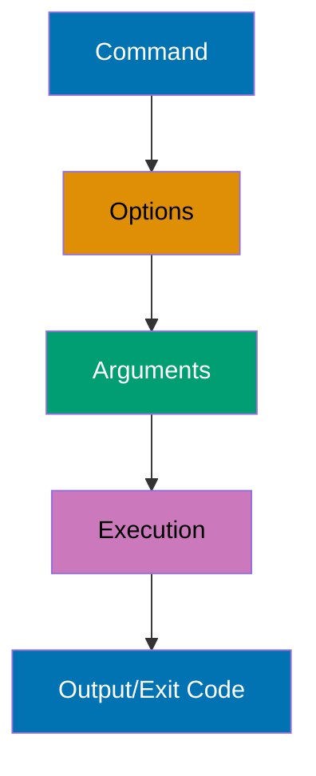
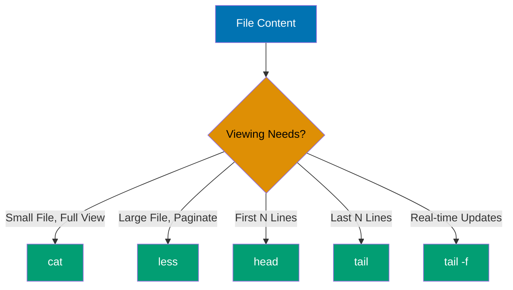
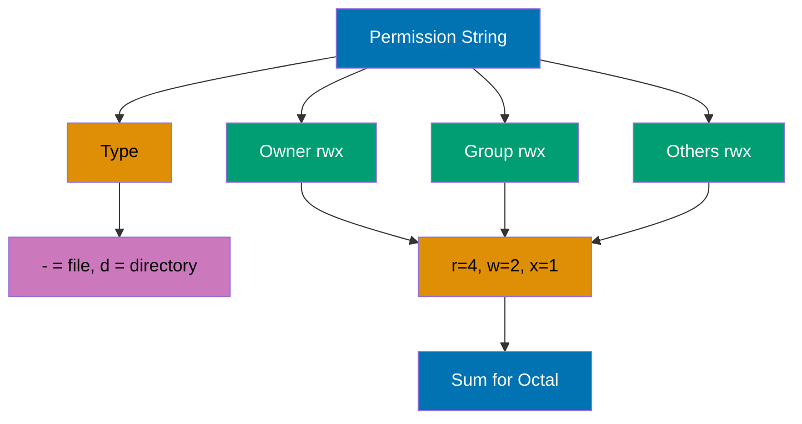
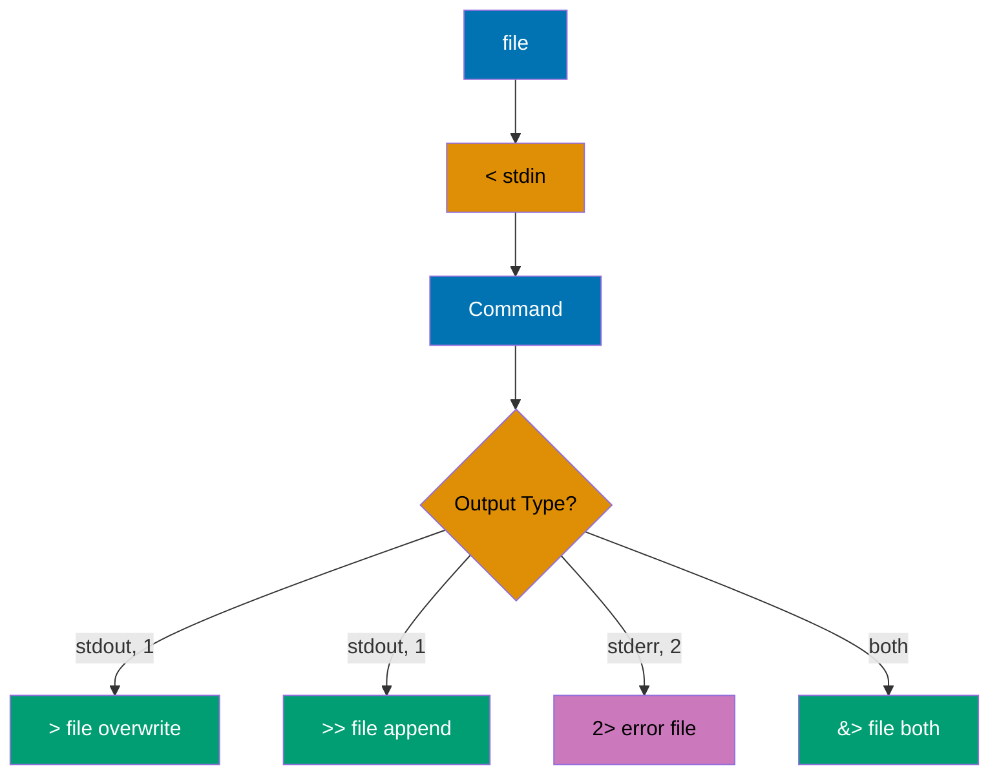
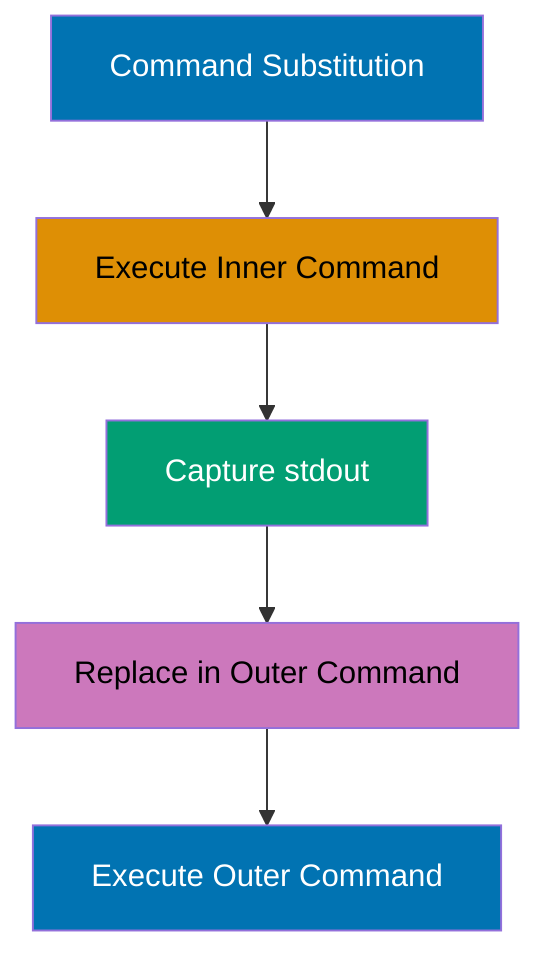
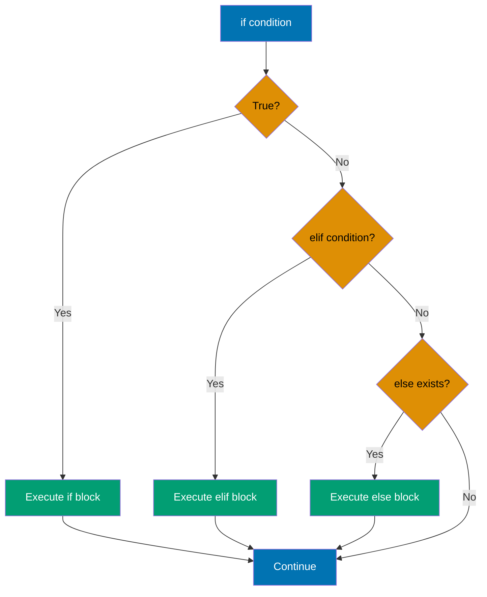
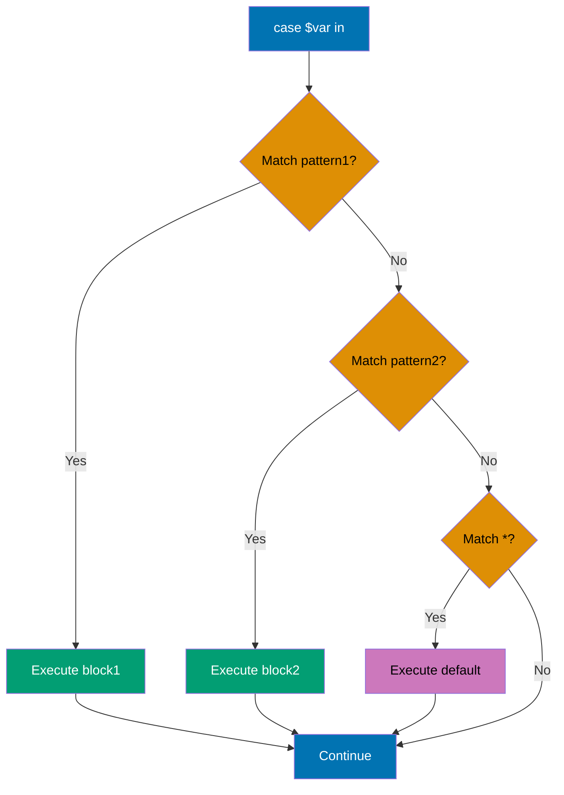
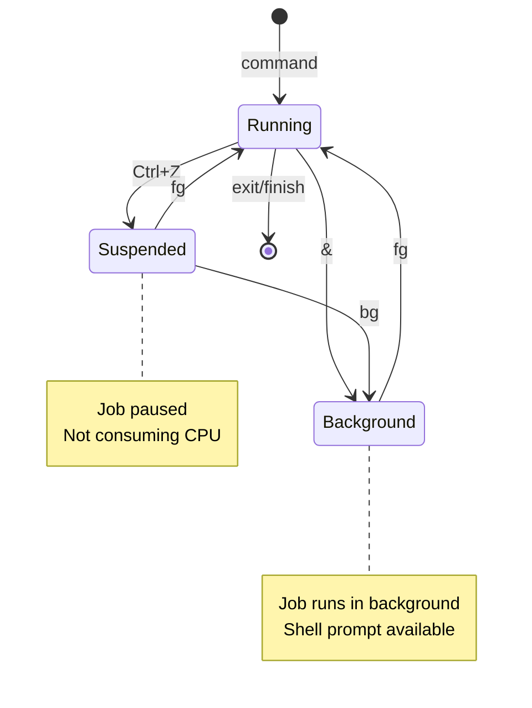

## Beginner Level (0-40% Coverage)

This level covers Linux shell fundamentals through 30 self-contained examples. Each example is copy-paste-runnable and demonstrates core command-line features needed for basic shell usage.

---

### Example 1: Echo and Basic Output

The `echo` command outputs text to stdout, supporting variable expansion, escape sequences, and redirection. It's the most basic way to produce output and debug shell scripts.

```bash
# Basic echo
echo "Hello, World!"           # => Output: Hello, World!

# Echo without newline
echo -n "No newline"            # => -n suppresses trailing newline
                                # => Output: No newline (cursor stays on line)

# Echo with escape sequences (requires -e flag)
echo -e "Line 1\nLine 2"        # => -e enables backslash escapes (\n → newline)
                                # => Output: Line 1
                                # =>         Line 2

# Echo variables
USER_NAME="Alice"               # => Creates variable storing "Alice"
echo "Hello, $USER_NAME"        # => Double quotes allow variable expansion
                                # => Output: Hello, Alice

# Echo with command substitution
echo "Current directory: $(pwd)" # => $(pwd) executes first, result substituted
                                # => Output: Current directory: /home/user
```

**Key Takeaway**: Use `echo` for simple output and debugging - it automatically expands variables in double quotes and supports escape sequences with `-e` flag.

**Why It Matters**: The `echo` command is fundamental for script debugging and user feedback in production systems. DevOps engineers use it extensively in deployment scripts to log progress and debug variable values during automation workflows.

---

### Example 2: Variables and Assignment

Shell variables store strings by default, with no type declarations. Variable names are case-sensitive and conventionally use UPPERCASE for environment variables and lowercase for local variables.

```bash
# Variable assignment (no spaces around =)
name="Bob"                      # => Creates variable storing "Bob" (strings by default)
                                # => Spaces around = cause syntax error
                                # => No type declaration needed (dynamic typing)
age=30                          # => Stores "30" as string, not number
                                # => Shell doesn't distinguish number types
                                # => Can still use in arithmetic contexts
echo "$name is $age years old"  # => Variables expanded in double quotes
                                # => Output: Bob is 30 years old
                                # => $ triggers variable substitution

# Variable expansion in double quotes
greeting="Hello, $name"         # => $name expands during assignment
                                # => greeting stores "Hello, Bob"
                                # => Expansion happens at assignment time
echo "$greeting"                # => Output: Hello, Bob

# Single quotes prevent expansion
literal='$name'                 # => Single quotes treat everything literally
                                # => literal stores the characters: $name
echo "$literal"                 # => Output: $name (literal)

# Command substitution
current_date=$(date +%Y-%m-%d)  # => Executes date command, captures output
                                # => current_date is "2025-12-30"
                                # => +%Y-%m-%d formats as YYYY-MM-DD
echo "Today: $current_date"     # => Output: Today: 2025-12-30

# Arithmetic with $(( ))
x=10                            # => x stores "10"
y=20                            # => y stores "20"
sum=$((x + y))                  # => $(( )) forces arithmetic context (10 + 20)
                                # => sum stores "30"
echo "Sum: $sum"                # => Output: Sum: 30
```

**Key Takeaway**: Use double quotes for variable expansion and single quotes for literal strings - assign variables without spaces around `=` and use `$(command)` for command substitution or `$((expression))` for arithmetic.

**Why It Matters**: This shell scripting concept is fundamental for production automation and system administration. Understanding this pattern enables you to write more robust and maintainable scripts for deployment, monitoring, and infrastructure management tasks.

---

### Example 3: Command Structure and Options

Shell commands follow the pattern `command [options] [arguments]` where options modify behavior and arguments specify targets. Options typically use `-` for short form and `--` for long form.



```bash
# Basic command
ls                              # => Lists files in current directory
                                # => Output: file1.txt file2.sh directory/
                                # => No options = default view (names only)

# Command with short option
ls -l                           # => -l flag enables long format
                                # => Output: Shows permissions, owner, size, date
                                # => Format: -rw-r--r-- 1 user group 1234 Dec 30 file.txt
                                # => Single-letter options use single dash (-)

# Multiple short options (combined)
ls -la                          # => Combines -l (long) and -a (all files)
                                # => Output: Long format including hidden files (.bashrc, .profile)
                                # => Hidden files start with dot (.)
                                # => Short options can be combined after single dash

# Command with long option
ls --all                        # => Long form of -a flag
                                # => Shows hidden files (same behavior as -a)
                                # => Output: Includes .hidden files
                                # => Long options use double dash (--) and full words

# Command with option argument
ls -w 80                        # => -w takes numeric argument
                                # => Limits output width to 80 characters
                                # => Useful for formatting terminal output
                                # => Some options require values

# Command with multiple arguments
ls /etc /var /tmp               # => Three directory paths as arguments
                                # => Lists contents of each directory separately
                                # => Output shows each directory labeled
                                # => Can specify multiple targets

# Mixing options and arguments
ls -lh /var/log                 # => Combines options (-lh) with argument (/var/log)
                                # => -l: long format, -h: human-readable (1K, 234M, 2G)
                                # => /var/log: target directory for listing
                                # => Output: Detailed listing with readable file sizes
                                # => Options before arguments is standard order

# Getting help
ls --help                       # => --help displays command usage
                                # => Output: Shows all available options
man ls                          # => Opens manual page in pager (less)
                                # => Shows comprehensive documentation
                                # => Press 'q' to quit, '/' to search
```

**Key Takeaway**: Most commands follow the pattern `command [options] [arguments]` - use short options (`-a`) for quick typing, long options (`--all`) for script readability, and `man command` to learn about any command's options.

**Why It Matters**: This shell scripting concept is fundamental for production automation and system administration. Understanding this pattern enables you to write more robust and maintainable scripts for deployment, monitoring, and infrastructure management tasks.

---

### Example 4: Navigating Directories (pwd, cd, ls)

Directory navigation uses `pwd` to show current location, `cd` to change directories, and `ls` to list contents. Understanding absolute vs relative paths is crucial for effective navigation.

```bash
# Show current directory
pwd                             # => Returns absolute path from root (/)
                                # => Output: /home/user

# List current directory contents
ls                              # => Lists files/directories in current directory
                                # => Output: file1.txt  file2.txt  directory1

# List with details
ls -l                           # => -l: long format with permissions, owner, size, date
                                # => Output: -rw-r--r-- 1 user group 1234 Dec 30 08:00 file1.txt

# List hidden files (start with .)
ls -a                           # => -a: shows all files including hidden (. prefix)
                                # => Output: .  ..  .bashrc  .profile  file1.txt

# Change to home directory
cd ~                            # => ~ expands to $HOME (typically /home/username)
cd                              # => No arguments defaults to $HOME

# Change to absolute path
cd /var/log                     # => Absolute path starts with /
                                # => $PWD updated to /var/log, $OLDPWD stores previous

# Change to relative path
cd ../..                        # => .. is parent directory
                                # => ../.. goes up two levels
                                # => If at /var/log → moves to /

# Change to subdirectory
cd documents/work               # => Relative path: resolves from current directory
                                # => From /home/user → /home/user/documents/work

# Return to previous directory
cd -                            # => Switches to $OLDPWD (previous directory)
                                # => Output: /var/log (prints directory)

# List specific directory without changing to it
ls /etc                         # => Lists /etc contents, current dir unchanged
```

**Key Takeaway**: Use `pwd` to check your location, `cd` with absolute paths (`/path/to/dir`) for certainty or relative paths (`../dir`) for convenience, and `cd -` to toggle between two directories.

**Why It Matters**: This shell scripting concept is fundamental for production automation and system administration. Understanding this pattern enables you to write more robust and maintainable scripts for deployment, monitoring, and infrastructure management tasks.

---

### Example 5: Creating and Removing Directories (mkdir, rmdir, rm)

Directory creation uses `mkdir` with optional `-p` for parent creation, while removal uses `rmdir` for empty directories or `rm -r` for non-empty ones.

```bash
# Create single directory
mkdir projects                  # => Creates directory 'projects' in current location

# Create nested directories (requires -p)
mkdir -p work/code/python       # => Creates work/, work/code/, and work/code/python
                                # => -p creates parent directories if needed

# Create multiple directories at once
mkdir dir1 dir2 dir3            # => Creates three directories: dir1, dir2, dir3

# Create directory with specific permissions
mkdir -m 755 public_html        # => Creates directory with rwxr-xr-x permissions
                                # => 7=rwx (owner), 5=r-x (group), 5=r-x (others)

# Remove empty directory
rmdir dir1                      # => Removes dir1 (only if empty!)
                                # => Error if directory contains files

# Remove directory with contents (DANGEROUS - use carefully!)
rm -r dir2                      # => Recursively removes dir2 and all contents
                                # => -r: recursive (deletes files and subdirectories)

# Remove directory with confirmation
rm -ri dir3                     # => Interactive removal (asks before each deletion)
                                # => -i: interactive (prompts for confirmation)

# Force remove without prompts (VERY DANGEROUS!)
rm -rf temp_data                # => Force removes temp_data and contents
                                # => -f: force (no warnings, no confirmations)
                                # => NEVER use rm -rf / or rm -rf /* !!!

# Remove multiple directories
rm -r old_*                     # => Removes all directories starting with "old_"
```

**Key Takeaway**: Use `mkdir -p` to create nested directories safely, `rmdir` for empty directories, and `rm -r` for directories with contents - always double-check before using `rm -rf` as it's irreversible and dangerous.

**Why It Matters**: This shell scripting concept is fundamental for production automation and system administration. Understanding this pattern enables you to write more robust and maintainable scripts for deployment, monitoring, and infrastructure management tasks.

---

### Example 6: File Viewing (cat, less, head, tail)

File viewing commands let you examine file contents without editing: `cat` for entire files, `less` for paging, `head` for beginning, and `tail` for ending.



```bash
# View entire file
cat file.txt                    # => cat reads file to stdout
                                # => Output: Entire file contents (scrolls if long)
                                # => No paging, suitable for small files only
                                # => Command name "cat" = concatenate

# View multiple files (concatenate)
cat file1.txt file2.txt         # => Concatenates multiple files sequentially
                                # => Output: file1 contents, then file2 contents
                                # => Files merged in command-line order
                                # => Original cat purpose: join files

# Number lines
cat -n file.txt                 # => -n flag adds line numbers
                                # => Output: Each line prefixed with line number
                                # => Format: "     1  First line"
                                # => Useful for code review and debugging
                                # => Numbers right-aligned with padding

# View with paging (large files)
less file.txt                   # => Opens file in interactive pager
                                # => Loads file incrementally (fast for large files)
                                # => Space: next page, b: previous page, q: quit
                                # => /pattern: search forward, ?pattern: search backward
                                # => n: next match, N: previous match
                                # => Better than "more" (backward navigation)

# View first 10 lines
head file.txt                   # => Displays first 10 lines by default
                                # => Output: First 10 lines of file
                                # => Useful for preview or column headers
                                # => Default count: 10 lines

# View first N lines
head -n 5 file.txt              # => -n specifies exact line count
                                # => Output: First 5 lines only
head -5 file.txt                # => Shorthand: number directly after dash
                                # => Same as head -n 5 (legacy syntax)

# View last 10 lines
tail file.txt                   # => Displays last 10 lines by default
                                # => Output: Last 10 lines of file
                                # => Useful for recent log entries
                                # => Default count: 10 lines (matches head)

# View last N lines
tail -n 20 file.txt             # => -n specifies exact line count
                                # => Output: Last 20 lines only
tail -20 file.txt               # => Shorthand: number directly after dash
                                # => Same as tail -n 20 (legacy syntax)

# Follow file updates (real-time monitoring)
tail -f /var/log/syslog         # => -f flag follows file growth
                                # => Output: Shows last lines and updates as file grows
                                # => Blocks terminal, waits for new content
                                # => Ctrl+C to exit following mode
                                # => Essential for monitoring log files in production
                                # => "f" = follow mode (watch for appends)

# Follow with line count
tail -f -n 50 app.log           # => Combines -f (follow) with -n (line count)
                                # => Shows last 50 lines initially
                                # => Then follows and displays new lines as appended
                                # => Combines initial view + follow mode
```

**Key Takeaway**: Use `cat` for small files, `less` for browsing large files interactively, `head` for beginnings, `tail` for endings, and `tail -f` for real-time log monitoring.

**Why It Matters**: This shell scripting concept is fundamental for production automation and system administration. Understanding this pattern enables you to write more robust and maintainable scripts for deployment, monitoring, and infrastructure management tasks.

---

### Example 7: File Operations (cp, mv, rm)

File manipulation commands copy files (`cp`), move/rename files (`mv`), and delete files (`rm`). These operations are fundamental to file management.

```bash
# Copy file
cp source.txt backup.txt        # => Creates backup.txt as copy of source.txt
                                # => source.txt remains unchanged

# Copy with directory structure
cp /path/to/file.txt .          # => Copies file.txt to current directory (. means here)

# Copy directory recursively
cp -r old_project new_project   # => Copies entire directory and contents
                                # => -r: recursive (required for directories)

# Copy preserving attributes
cp -a original copy             # => Preserves permissions, timestamps, ownership
                                # => -a: archive mode (same as -dR --preserve=all)

# Copy interactively (confirm overwrites)
cp -i file.txt existing.txt     # => Prompts before overwriting existing.txt
                                # => -i: interactive

# Move/rename file
mv old_name.txt new_name.txt    # => Renames old_name.txt to new_name.txt
                                # => old_name.txt no longer exists

# Move to directory
mv file.txt documents/          # => Moves file.txt into documents/ directory
                                # => File keeps same name in new location

# Move multiple files
mv *.txt documents/             # => Moves all .txt files to documents/
                                # => * is glob pattern (wildcard)

# Move with overwrite protection
mv -n file.txt backup/          # => Moves only if destination doesn't exist
                                # => -n: no clobber (don't overwrite)

# Remove file
rm file.txt                     # => Deletes file.txt (PERMANENT - no trash!)

# Remove with confirmation
rm -i *.log                     # => Asks confirmation before deleting each .log file
                                # => -i: interactive

# Remove multiple files
rm file1.txt file2.txt file3.txt # => Deletes three files

# Force remove (DANGEROUS - use with extreme caution!)
rm -f locked_file.txt           # => Removes file without asking, even if write-protected
                                # => -f: force
```

**Key Takeaway**: Use `cp` for copying, `mv` for moving/renaming, and `rm` for deletion - always use `-i` flag for interactive confirmation with destructive operations, and remember that `rm` is permanent (no undo).

**Why It Matters**: This shell scripting concept is fundamental for production automation and system administration. Understanding this pattern enables you to write more robust and maintainable scripts for deployment, monitoring, and infrastructure management tasks.

---

### Example 8: File Permissions (ls -l, chmod)

Linux file permissions control read, write, and execute access for owner, group, and others. Permissions are displayed in `ls -l` output and modified with `chmod`.



```bash
# View permissions
ls -l file.txt                  # => Long listing shows permission string
                                # => Output: -rw-r--r-- 1 user group 1234 Dec 30 file.txt
                                # => Format: [type][owner rwx][group rwx][others rwx]
                                # => -rw-r--r-- = file, owner:rw, group:r, others:r
                                # => First character: file type (- or d)

# Permission meanings (r=4, w=2, x=1)
# r (read) = 4: View file contents or list directory
                                # => Read bit allows cat, less, directory listing
# w (write) = 2: Modify file or create/delete files in directory
                                # => Write bit allows editing, creating, deleting
# x (execute) = 1: Run file as program or enter directory
                                # => Execute bit for scripts/binaries or cd

# Make file executable
chmod +x script.sh              # => + adds permission, x is execute
                                # => Applies to all (user, group, others)
                                # => Before: -rw-r--r--, After: -rwxr-xr-x
                                # => Now script.sh can be run with ./script.sh
                                # => Common for shell scripts

# Remove write permission from group and others
chmod go-w file.txt             # => g=group, o=others targets
                                # => - removes permission, w is write
                                # => Before: -rw-rw-rw-, After: -rw-r--r--
                                # => Only owner can modify file now
                                # => Security measure for shared systems

# Set specific permissions with octal
chmod 644 file.txt              # => Octal notation: 3 digits for owner/group/others
                                # => 6=rw- (4+2=read+write), 4=r--, 4=r--
                                # => Result: -rw-r--r-- (owner writes, all read)
                                # => Standard permission for text files
                                # => Most common for documents, configs

chmod 755 script.sh             # => 7=rwx (4+2+1), 5=r-x (4+1), 5=r-x (4+1)
                                # => Result: -rwxr-xr-x (owner modifies, all execute)
                                # => Standard permission for executable scripts
                                # => Owner can edit, everyone can run

chmod 700 private.txt           # => 7=rwx, 0=--- (no permissions), 0=---
                                # => Result: -rwx------ (owner only, full access)
                                # => Maximum privacy, others can't even read
                                # => Used for sensitive data, private keys

# Set permissions recursively
chmod -R 755 public_html/       # => -R flag recurses into subdirectories
                                # => Applies to all files and folders inside
                                # => Applies 755 to directory and all contents
                                # => All files and subdirs get same permissions

# Symbolic permissions
chmod u+x file.sh               # => u=user (owner), +x adds execute
                                # => Only affects owner, not group/others
chmod g+w,o-r file.txt          # => Multiple changes: comma-separated
                                # => g+w: add group write, o-r: remove others read
chmod a=r file.txt              # => a=all (owner, group, others)
                                # => = sets exact permissions, r is read-only
                                # => Everyone gets read, no write or execute
```

**Key Takeaway**: Use `ls -l` to view permissions, `chmod` with octal notation (644, 755, 700) for absolute permission sets, or symbolic notation (u+x, go-w) for relative changes - remember that 644 is standard for files and 755 for directories/executables.

**Why It Matters**: This shell scripting concept is fundamental for production automation and system administration. Understanding this pattern enables you to write more robust and maintainable scripts for deployment, monitoring, and infrastructure management tasks.

---

### Example 9: Output Redirection (>, >>, <, 2>)

Redirection operators control where command input comes from and where output goes. `>` redirects stdout, `>>` appends, `<` redirects stdin, and `2>` redirects stderr.



```bash
# Redirect stdout to file (overwrite)
echo "Hello, World" > output.txt # => > operator redirects stdout (file descriptor 1)
                                # => stdout redirected to output.txt (overwrites existing)
                                # => output.txt contents: "Hello, World\n"
                                # => File created if doesn't exist
                                # => Previous file content lost (overwrite mode)

# Redirect stdout to file (append)
echo "Second line" >> output.txt # => >> operator appends instead of overwriting
                                # => Preserves existing content, adds to end
                                # => output.txt now: "Hello, World\nSecond line\n"
                                # => Safe for log files (won't lose history)
                                # => Double > means append mode

# Redirect stderr to file
ls /nonexistent 2> error.log    # => 2> redirects stderr (file descriptor 2)
                                # => stdout (FD 1) still goes to terminal
                                # => error.log receives: "ls: cannot access '/nonexistent': No such file or directory"
                                # => Useful for separating errors from normal output
                                # => Number 2 specifies stderr stream

# Redirect both stdout and stderr
command &> all_output.txt       # => &> is shorthand for both streams
                                # => Redirects stdout (FD 1) and stderr (FD 2) to same file
                                # => Equivalent to: >all_output.txt 2>&1
                                # => Combined output captured in single file
                                # => Bash-specific syntax (not POSIX sh)

# Redirect stdout and stderr separately
command >output.log 2>error.log # => Two separate redirections in one command
                                # => stdout (normal output) to output.log
                                # => stderr (error messages) to error.log
                                # => Separates normal output from errors for analysis
                                # => Two different files for two streams

# Discard output (send to /dev/null)
command > /dev/null             # => /dev/null is special file that discards everything
                                # => stdout discarded (silent, no output visible)
                                # => stderr still visible on terminal
                                # => "Bit bucket" - data disappears
command 2> /dev/null            # => Suppresses error messages only
                                # => stderr discarded, stdout still visible
                                # => Normal output shown, errors hidden
command &> /dev/null            # => Discards both stdout and stderr
                                # => Completely silent operation
                                # => No output of any kind shown
                                # => Common for background processes

# Redirect stdin from file
wc -l < input.txt               # => < operator redirects stdin from file
                                # => wc reads from input.txt instead of terminal
                                # => Output: 42 (number only, no filename shown)
                                # => Compare: wc -l input.txt shows "42 input.txt"
                                # => Difference: filename comes from stdin vs argument
                                # => Reverse of > operator (input instead of output)

# Here document (multi-line input)
cat > config.txt << EOF         # => << starts here document (multi-line stdin)
                                # => stdin redirected from following lines
                                # => stdout redirected to config.txt
line 1
line 2
line 3
EOF                             # => EOF delimiter ends input (can be any word)
                                # => config.txt contains: "line 1\nline 2\nline 3\n"
                                # => Useful for creating files within scripts

# Combine redirection
sort < unsorted.txt > sorted.txt # => Multiple redirections: input AND output
                                # => stdin from unsorted.txt, stdout to sorted.txt
                                # => unsorted.txt unchanged (read-only)
                                # => sorted.txt created with sorted lines
                                # => Chain input and output redirection
```

**Key Takeaway**: Use `>` to redirect output to files (overwrites), `>>` to append, `2>` for error messages, and `<` for input - remember that `> /dev/null` discards output, useful for silent execution.

**Why It Matters**: This shell scripting concept is fundamental for production automation and system administration. Understanding this pattern enables you to write more robust and maintainable scripts for deployment, monitoring, and infrastructure management tasks.

---

### Example 10: Pipes (|)

Pipes connect commands by sending stdout of one command to stdin of the next, enabling powerful command composition for data processing workflows.

```bash
# Basic pipe
ls -l | wc -l                   # => Output: 42 (counts directory listing lines)

# Chain multiple commands
cat file.txt | grep "error" | wc -l
                                # => Output: 5 (lines containing "error")

# Sort and unique
cat names.txt | sort | uniq     # => Output: Alice, Bob, Charlie (sorted, deduplicated)

# Head and tail through pipe
ls -lt | head -10               # => Output: 10 most recently modified items

# Complex processing pipeline
cat access.log | grep "404" | awk '{print $7}' | sort | uniq -c | sort -nr
                                # => Most frequent 404 URLs

# Tee - write to file AND continue pipe
ls -l | tee listing.txt | wc -l # => Output: 42, also writes to listing.txt

# Multiple pipes for data transformation
echo "  HELLO WORLD  " | tr '[:upper:]' '[:lower:]' | sed 's/^  *//' | sed 's/  *$//'
                                # => Output: hello world (lowercase, trimmed)

# Pipe with xargs (convert stdin to arguments)
find . -name "*.tmp" | xargs rm # => Deletes all .tmp files efficiently
```

**Key Takeaway**: Pipes enable command composition by connecting stdout to stdin - use them to build powerful data processing workflows from simple commands, and remember that pipe order matters (process left to right).

**Why It Matters**: Pipes chain commands together for powerful data transformations. Production scripts use pipes to filter logs, extract metrics, and transform data formats without intermediate files.

---

### Example 11: Searching Files (find)

The `find` command locates files and directories based on name, type, size, time, permissions, and other criteria, with optional execution of commands on results.

```bash
# Find by name
find . -name "*.txt"            # => Starts at . (current directory)
                                # => Recursively descends into all subdirectories
                                # => Tests each file/directory against pattern "*.txt"
                                # => -name does case-sensitive glob matching
                                # => Matches: file1.txt, ./subdir/file2.txt, ./a/b/c/data.txt
                                # => Doesn't match: FILE.TXT, doc.TXT, report.text
                                # => Output: One file per line with relative path

# Find case-insensitive
find . -iname "*.TXT"           # => -iname: case-insensitive name matching
                                # => Pattern "*.TXT" matches any case combination
                                # => Matches: file.txt, FILE.TXT, File.Txt, data.tXt
                                # => Useful for case-insensitive filesystems or mixed-case files

# Find by type
find /var/log -type f           # => -type f: regular files only
                                # => Skips directories, symlinks, device files
find /var/log -type d           # => -type d: directories only
find /tmp -type l               # => -type l: symbolic links only

# Find by size
find . -size +10M               # => +10M: greater than 10 megabytes
                                # => M=megabytes, k=kilobytes, G=gigabytes
find . -size -1k                # => -1k: less than 1 kilobyte (0-1023 bytes)

# Find by modification time
find . -mtime -7                # => Modified in last 7 days
find . -mtime +30               # => Modified more than 30 days ago

# Find by permissions
find . -perm 644                # => Exactly 644 permissions
find . -perm -644               # => At least 644 permissions

# Combine conditions with AND
find . -name "*.log" -size +1M  # => .log files AND larger than 1MB (implicit AND)

# Combine with OR
find . -name "*.txt" -o -name "*.md"
                                # => .txt OR .md files (-o is OR operator)

# Execute command on results
find . -name "*.tmp" -delete    # => Deletes all .tmp files

find . -type f -exec chmod 644 {} \;
                                # => Sets 644 on all files
                                # => {}: replaced with filename, \;: terminates command

# Limit depth
find . -maxdepth 2 -name "*.txt" # => Searches only 2 levels deep

# Find and list with details
find /var/log -type f -mtime -1 -exec ls -lh {} \;
                                # => Files modified in last 24h with details
```

**Key Takeaway**: Use `find` with conditions like `-name` (files), `-type` (file/dir/link), `-size` (file size), and `-mtime` (modification time) - combine with `-exec` to perform actions on found files, and use `-maxdepth` to limit search depth.

**Why It Matters**: This shell scripting concept is fundamental for production automation and system administration. Understanding this pattern enables you to write more robust and maintainable scripts for deployment, monitoring, and infrastructure management tasks.

---

### Example 12: Searching Text (grep)

The `grep` command searches for patterns in text files using regular expressions, with options for case-insensitivity, line numbers, context, and recursive directory search.

```bash
# Basic search
grep "error" logfile.txt        # => Searches for "error" substring (case-sensitive)
                                # => Outputs complete lines containing pattern
                                # => Exit code: 0 if found, 1 if not found

# Case-insensitive search
grep -i "error" logfile.txt     # => -i: ignore case
                                # => Matches: "error", "Error", "ERROR"

# Show line numbers
grep -n "error" logfile.txt     # => -n: prepend line numbers
                                # => Output: 42:error occurred at startup

# Invert match (lines NOT containing pattern)
grep -v "debug" logfile.txt     # => -v: inverts match (shows lines WITHOUT pattern)
                                # => Useful for filtering out unwanted content

# Count matching lines
grep -c "warning" logfile.txt   # => -c: count matching lines only
                                # => Output: 15 (number only)

# Show only matching part
grep -o "error" logfile.txt     # => -o: extract only matched substring
                                # => Line "fatal error" outputs: error

# Multiple files
grep "error" *.log              # => Searches all .log files
                                # => Output: filename:matching line

# Recursive search
grep -r "TODO" /home/user/code  # => Searches all files recursively
                                # => -r: recursive

# Show context lines
grep -A 3 "error" logfile.txt   # => Shows match + 3 lines after
                                # => -A 3: after context
grep -B 2 "error" logfile.txt   # => Shows match + 2 lines before
                                # => -B 2: before context
grep -C 2 "error" logfile.txt   # => Shows match + 2 lines before and after
                                # => -C 2: context (both directions)

# Regular expressions
grep "^error" logfile.txt       # => Lines starting with "error"
                                # => ^: beginning of line
grep "error$" logfile.txt       # => Lines ending with "error"
                                # => $: end of line
grep "err.*msg" logfile.txt     # => Lines with "err" followed by "msg"
                                # => .*: any characters (zero or more)

# Extended regex (more operators)
grep -E "error|warning" logfile.txt # => Lines with "error" OR "warning"
                                # => -E: extended regex
                                # => |: OR operator
grep -E "[0-9]{3}" logfile.txt  # => Lines containing 3-digit numbers
                                # => {3}: exactly 3 occurrences

# List only filenames
grep -l "error" *.txt           # => Output: file1.txt file3.txt (files with matches)
                                # => -l: list filenames only

# Quiet mode (exit code only)
if grep -q "success" result.log; then
    echo "Success found"        # => Checks without output
fi                              # => -q: quiet (no output, only exit code)
```

**Key Takeaway**: Use `grep` for text pattern matching with `-i` for case-insensitive, `-r` for recursive search, `-n` for line numbers, and `-C` for context - leverage regular expressions for complex patterns and combine with pipes for powerful text filtering.

**Why It Matters**: Pattern matching filters and validates string content. Scripts use glob patterns to select files, validate input formats, and match configuration patterns.

---

### Example 13: Text Processing (cut, sort, uniq)

Text processing tools slice (`cut`), reorder (`sort`), and deduplicate (`uniq`) data, essential for log analysis and data transformation pipelines.

```bash
# Cut by delimiter (CSV/TSV processing)
echo "Alice,30,Engineer" | cut -d',' -f1
                                # => echo outputs: "Alice,30,Engineer"
                                # => Pipe sends to cut's stdin
                                # => -d',' sets comma as field delimiter
                                # => cut splits into fields: ["Alice", "30", "Engineer"]
                                # => -f1 selects first field
                                # => Output: Alice

echo "Alice,30,Engineer" | cut -d',' -f2,3
                                # => Output: 30,Engineer (fields 2 and 3)

# Cut by character position
echo "Hello World" | cut -c1-5  # => Output: Hello (characters 1-5)

# Process file with cut
cut -d':' -f1,7 /etc/passwd     # => Output: root:/bin/bash (username:shell from /etc/passwd)

# Sort lines alphabetically
cat names.txt | sort            # => Output: Alice, Bob, Charlie (alphabetically sorted)

# Sort numerically
cat numbers.txt | sort -n       # => -n: numeric sort (2, 10, 100 in correct order)

# Sort in reverse
cat numbers.txt | sort -nr      # => -nr: numeric reverse (largest first)

# Sort by field
cat data.csv | sort -t',' -k2   # => -t',': comma delimiter, -k2: sort by column 2

# Unique lines (removes consecutive duplicates)
cat list.txt | sort | uniq      # => uniq removes consecutive duplicates (sort first!)

# Count occurrences
cat list.txt | sort | uniq -c   # => -c: counts occurrences
                                # => Output: 3 apple, 2 banana, 1 cherry

# Show only duplicates
cat list.txt | sort | uniq -d   # => -d: shows only lines appearing multiple times

# Show only unique lines (no duplicates)
cat list.txt | sort | uniq -u   # => -u: shows only lines appearing once

# Complex pipeline: Top 10 most common words
cat text.txt | tr ' ' '\n' | sort | uniq -c | sort -nr | head -10
                                # => Word frequency: split words → sort → count → sort by count → top 10
```

**Key Takeaway**: Use `cut` to extract columns from delimited data, `sort` to order lines (with `-n` for numbers, `-k` for specific fields), and `uniq` to deduplicate (always sort first) - combine them in pipelines for powerful text analysis.

**Why It Matters**: This shell scripting concept is fundamental for production automation and system administration. Understanding this pattern enables you to write more robust and maintainable scripts for deployment, monitoring, and infrastructure management tasks.

---

### Example 14: Command Substitution and Subshells

Command substitution `$(command)` captures command output as a string, while subshells `(command)` run commands in isolated environments without affecting the parent shell.



```bash
# Command substitution - capture output
current_date=$(date +%Y-%m-%d) # => Shell creates subshell to run date command
                                # => date +%Y-%m-%d executes, outputs "2025-12-30" to stdout
                                # => Subshell exits, stdout captured
                                # => Trailing newline stripped from output
                                # => current_date variable assigned "2025-12-30"
echo "Today is $current_date"  # => Variable expands to "2025-12-30"
                                # => Output: Today is 2025-12-30

# Old syntax (backticks, deprecated)
files=`ls *.txt`                # => Backtick syntax `...` for command substitution
                                # => Equivalent to $(ls *.txt)
                                # => Harder to nest: `echo \`date\`` vs $(echo $(date))
echo "Files: $files"            # => Prefer $() for readability and nesting

# Nested substitution
backup_name="backup_$(date +%Y%m%d)_$(hostname).tar.gz"
                                # => First $(date +%Y%m%d) executes, returns "20251230"
                                # => Second $(hostname) executes, returns "server1"
                                # => String assembled: "backup_20251230_server1.tar.gz"
                                # => backup_name assigned complete string
echo "$backup_name"             # => Output: backup_20251230_server1.tar.gz

# Use in command arguments
echo "User count: $(wc -l < /etc/passwd)"
                                # => wc -l < /etc/passwd executes first
                                # => Counts lines in passwd file, outputs "42"
                                # => Substitution replaces $(wc...) with "42"
                                # => echo receives "User count: 42"
                                # => Output: User count: 42

# Arithmetic with substitution
total_size=$(du -sb /var/log | cut -f1)
                                # => du -sb /var/log calculates total bytes
                                # => Pipes to cut which extracts first field
                                # => Output: "1048576" (1MB in bytes)
                                # => total_size assigned "1048576"
echo "Log size: $total_size bytes"
                                # => Output: Log size: 1048576 bytes

# Subshell (isolated environment)
(cd /tmp && ls)                 # => Parentheses create subshell (child process)
                                # => Subshell inherits parent's environment
                                # => cd /tmp changes subshell's working directory
                                # => ls executes in /tmp
                                # => Subshell exits, directory change lost
pwd                             # => Parent shell's working directory unchanged
                                # => Output: /home/user (wherever we started)

# Subshell preserves parent variables
x=10                            # => x=10 in parent shell's memory
(x=20; echo "Inside: $x")       # => Subshell inherits x=10
                                # => Subshell modifies its copy: x=20
                                # => echo sees subshell's x=20
                                # => Output: Inside: 20
                                # => Subshell exits, its x=20 destroyed
echo "Outside: $x"              # => Parent shell's x still 10 (unchanged)
                                # => Output: Outside: 10

# Subshell for grouped commands
(echo "Starting backup"; tar -czf backup.tar.gz /data; echo "Backup done")
                                # => Groups related commands
                                # => Can redirect entire group

# Redirect subshell output
(echo "Line 1"; echo "Line 2") > output.txt
                                # => Both echoes go to output.txt

# Background subshell
(sleep 10; echo "Done") &       # => Runs in background
                                # => & runs subshell asynchronously
                                # => Parent shell continues immediately

# Conditional with substitution
if [ $(whoami) = "root" ]; then
    echo "Running as root"      # => Checks current user
fi

# Loop with substitution
for file in $(ls *.txt); do     # => Note: ls *.txt better than $(ls *.txt)
    echo "Processing $file"     # => Loop over command output
done
```

**Key Takeaway**: Use `$(command)` to capture command output in variables or expressions, and `(command)` for subshells to isolate environment changes - remember that subshells don't affect parent shell variables or directory.

**Why It Matters**: This shell scripting concept is fundamental for production automation and system administration. Understanding this pattern enables you to write more robust and maintainable scripts for deployment, monitoring, and infrastructure management tasks.

---

### Example 15: Environment Variables (export, env, PATH)

Environment variables store configuration and system information, passed to child processes. `export` makes variables available to subprocesses, and `PATH` determines command lookup.

```bash
# Set local variable (not in environment)
MY_VAR="hello"                  # => Creates variable in current shell's memory
                                # => Variable exists only in this shell process
                                # => Not in environment table (not inherited by children)
echo "$MY_VAR"                  # => Current shell accesses its own variable
                                # => Output: hello

# Local variables NOT passed to subshells
bash -c 'echo "Subshell: $MY_VAR"'
                                # => bash -c spawns child shell process
                                # => Child inherits environment variables only
                                # => MY_VAR is local (not in environment), not inherited
                                # => Child's $MY_VAR lookup returns empty
                                # => Output: Subshell: (empty string)

# Export variable to environment
export MY_VAR="hello"           # => Marks MY_VAR for export to child processes
                                # => Adds MY_VAR to environment table
                                # => Future child processes inherit this variable
bash -c 'echo "Subshell: $MY_VAR"'
                                # => Child shell spawned
                                # => Environment copied to child (includes MY_VAR)
                                # => Child's $MY_VAR resolves to "hello"
                                # => Output: Subshell: hello

# Export in one line
export DB_HOST="localhost"      # => Assignment + export in single statement
                                # => DB_HOST="localhost" creates variable
                                # => export marks for environment inheritance

# View all environment variables
env                             # => Queries current process environment table
                                # => Lists all variables marked for export
                                # => Format: NAME=value (one per line)
                                # => Output: HOME=/home/user
                                # =>         PATH=/usr/bin:/bin
                                # =>         USER=alice
                                # =>         ... (all exported variables)

# View specific variable
echo "$HOME"                    # => $HOME expands to value of HOME variable
                                # => HOME typically set by login process
                                # => Points to user's home directory
                                # => Output: /home/user
echo "$USER"                    # => USER contains current username
                                # => Output: alice
echo "$SHELL"                   # => SHELL contains path to user's login shell
                                # => Output: /bin/bash

# PATH - command search directories
echo "$PATH"                    # => Output: /usr/local/bin:/usr/bin:/bin
                                # => Colon-separated directory list
                                # => Shell searches left-to-right

# Add to PATH temporarily
export PATH="$HOME/bin:$PATH"   # => Prepends $HOME/bin to PATH
                                # => Now commands in ~/bin are found first

# Run command with modified environment
DB_HOST=localhost DB_PORT=5432 ./app
                                # => Sets variables only for this command
                                # => Variables not exported to shell

# Unset variable
unset MY_VAR                    # => Removes MY_VAR from environment
echo "$MY_VAR"                  # => Output: (empty)

# Common environment variables
echo "$PWD"                     # => Current directory
echo "$OLDPWD"                  # => Previous directory (from cd -)
echo "$HOSTNAME"                # => System hostname
echo "$LANG"                    # => Locale setting (en_US.UTF-8)

# Persistent environment (add to ~/.bashrc or ~/.profile)
# echo 'export MY_VAR="value"' >> ~/.bashrc
# source ~/.bashrc              # => Reloads configuration

# Check if variable is set
if [ -z "$MY_VAR" ]; then       # => -z tests if empty/unset
    echo "MY_VAR is not set"
else
    echo "MY_VAR is $MY_VAR"
fi
```

**Key Takeaway**: Use `export` to make variables available to child processes, modify `PATH` to add custom command directories, and set variables inline (`VAR=value command`) for one-time overrides - persist changes in `~/.bashrc` for permanent configuration.

**Why It Matters**: This shell scripting concept is fundamental for production automation and system administration. Understanding this pattern enables you to write more robust and maintainable scripts for deployment, monitoring, and infrastructure management tasks.

---

### Example 16: Conditional Execution (&&, ||, ;)

Logical operators control command execution flow: `&&` runs next command only if previous succeeds, `||` runs on failure, and `;` runs unconditionally.

```bash
# AND operator (&&) - run next if previous succeeds
mkdir testdir && cd testdir     # => mkdir testdir executes first
                                # => If testdir already exists: mkdir returns 1 (failure)
                                # =>   cd doesn't execute (short-circuit)
                                # => If testdir created: mkdir returns 0 (success)
                                # =>   && triggers cd execution
                                # => Second command runs only on first command success

# Chain multiple commands with AND
cd /var/log && grep "error" syslog && echo "Errors found"
                                # => All three run if each succeeds
                                # => First failure stops chain
                                # => Left-to-right evaluation (cd, then grep, then echo)

# OR operator (||) - run next if previous fails
cd /nonexistent || echo "Failed to change directory"
                                # => cd fails → || triggers echo
                                # => Output: Failed to change directory
                                # => Opposite of &&: runs on failure, not success

# Default value pattern
[ -f config.txt ] || echo "Config not found"
                                # => If file missing: echo runs
                                # => If file exists: echo skipped
                                # => Common idiom for existence checks

# Semicolon (;) - unconditional execution
cd /tmp; ls; pwd                # => ; ignores exit codes, all three run independently
                                # => Always executes all commands
                                # => No short-circuiting (unlike && and ||)

# Combine AND and OR
command && echo "Success" || echo "Failed"
                                # => Success: command → "Success" → skip "Failed"
                                # => Failure: command fails → skip "Success" → "Failed"
                                # => Common pattern for success/failure messages

# Create directory with fallback
mkdir /var/myapp 2>/dev/null || mkdir ~/myapp
                                # => Fallback to ~/myapp if /var/myapp fails
                                # => 2>/dev/null suppresses error messages
                                # => Try privileged location first, fall back to home

# Backup with validation
tar -czf backup.tar.gz /data && echo "Backup complete" || echo "Backup failed"
                                # => Message based on tar exit code
                                # => Conditional feedback on operation success

# Multiple conditions
[ -f file.txt ] && [ -r file.txt ] && cat file.txt
                                # => cat runs only if both conditions true
                                # => First checks file exists, then checks readable
                                # => All conditions must pass for cat to execute

# Short-circuit evaluation
false && echo "This won't print" # => echo skipped
                                # => false returns 1, && short-circuits
true || echo "This won't print"  # => echo skipped
                                # => true returns 0, || short-circuits

# Practical example: safe deployment
git pull && npm install && npm test && npm run deploy
                                # => Fail-fast: stops at first failure
                                # => Each step validates before proceeding
                                # => Prevents deploying broken code
```

**Key Takeaway**: Use `&&` to chain commands that depend on success (fail-fast), `||` for fallback actions on failure, and `;` for independent commands - combine them for robust scripts that handle errors gracefully.

**Why It Matters**: This shell scripting concept is fundamental for production automation and system administration. Understanding this pattern enables you to write more robust and maintainable scripts for deployment, monitoring, and infrastructure management tasks.

---

### Example 17: Test Conditions ([[]], test, [)

Conditional testing evaluates expressions for file existence, string comparison, numeric comparison, and logical combinations, used primarily in `if` statements and conditional execution.

```bash
# File tests
if [ -f file.txt ]; then        # => [ calls test command with -f operator
                                # => -f checks: file exists AND is regular file (not directory/link)
                                # => Returns exit code 0 if true, 1 if false
                                # => if executes body when exit code is 0
    echo "File exists"          # => Runs only if -f returned 0
fi                              # => fi closes if statement

if [ -d /var/log ]; then        # => -d checks: path exists AND is directory
                                # => Returns 0 if /var/log is a directory
                                # => Returns 1 if doesn't exist or is a file
    echo "Directory exists"     # => Runs only if /var/log is directory
fi

if [ -r file.txt ]; then        # => -r checks: file exists AND current user has read permission
                                # => Tests effective permissions (considers user, group, other)
    echo "File is readable"     # => Runs only if readable
fi

if [ -w file.txt ]; then        # => -w checks: file exists AND current user has write permission
                                # => Returns 0 only if actual write access available
    echo "File is writable"     # => Runs only if writable
fi

if [ -x script.sh ]; then       # => -x checks: file exists AND has execute permission
                                # => For directories: checks if searchable
    echo "File is executable"   # => Runs only if executable
fi

# String tests
name="Alice"                    # => name variable stores "Alice" (string)
if [ "$name" = "Alice" ]; then  # => [ is alias for test command
                                # => Space after [ and before ] required (command arguments)
                                # => Quotes essential: prevents word splitting if variable empty
                                # => = compares strings character by character (not regex)
                                # => Returns 0 if strings identical, 1 otherwise
    echo "Name is Alice"        # => Executes only if comparison returned 0 (true)
                                # => Output: Name is Alice
fi

if [ "$name" != "Bob" ]; then   # => != tests string inequality (not equal)
                                # => "Alice" != "Bob" evaluates to true (exit 0)
                                # => Comparison is case-sensitive
    echo "Name is not Bob"      # => Runs when strings don't match
                                # => Output: Name is not Bob
fi

if [ -z "$empty" ]; then        # => -z tests: string length is zero
                                # => $empty is unset/empty, expands to ""
                                # => [ -z "" ] returns 0 (true - string is zero-length)
                                # => Useful for checking if variable was set
    echo "Variable is empty"    # => Runs when variable is unset or empty string
                                # => Output: Variable is empty
fi

if [ -n "$name" ]; then         # => -n tests: string length is non-zero
                                # => "$name" expands to "Alice" (5 characters)
                                # => [ -n "Alice" ] returns 0 (true - string has content)
                                # => Opposite of -z
    echo "Variable is not empty" # => Runs when variable has content
                                # => Output: Variable is not empty
fi

# Numeric tests
age=25                          # => age stores "25" as string (shell stores everything as strings)
if [ "$age" -eq 25 ]; then      # => -eq forces arithmetic comparison
                                # => Converts "25" string to number 25 for comparison
                                # => Compares 25 == 25 numerically, returns 0 (true)
                                # => Note: -eq is numeric, = is string comparison
    echo "Age is 25"            # => Runs when age equals 25 numerically
                                # => Output: Age is 25
fi

if [ "$age" -ne 30 ]; then      # => -ne: numeric not equal
                                # => Converts strings to numbers, compares 25 != 30
                                # => 25 != 30 evaluates to true (exit 0)
    echo "Age is not 30"        # => Runs when age numerically not 30
                                # => Output: Age is not 30
fi

if [ "$age" -lt 30 ]; then      # => -lt: numeric less than (<)
                                # => Converts to numbers, compares 25 < 30
                                # => 25 < 30 is true (exit 0)
    echo "Age less than 30"     # => Runs when age < 30 numerically
                                # => Output: Age less than 30
fi

if [ "$age" -le 25 ]; then      # => -le: less than or equal (<=)
                                # => Converts to numbers, compares 25 <= 25
                                # => 25 <= 25 is true (equal satisfies condition)
    echo "Age at most 25"       # => Runs when age <= 25 numerically
                                # => Output: Age at most 25
fi

if [ "$age" -gt 20 ]; then      # => -gt: numeric greater than (>)
                                # => Converts to numbers, compares 25 > 20
                                # => 25 > 20 is true (exit 0)
    echo "Age greater than 20"  # => Runs when age > 20 numerically
                                # => Output: Age greater than 20
fi

if [ "$age" -ge 25 ]; then      # => -ge: greater than or equal (>=)
                                # => Converts to numbers, compares 25 >= 25
                                # => 25 >= 25 is true (equal satisfies condition)
    echo "Age at least 25"      # => Runs when age >= 25 numerically
                                # => Output: Age at least 25
fi

# Logical operators
if [ -f file.txt ] && [ -r file.txt ]; then
                                # => && combines TWO separate test commands
                                # => Both must return 0 (true) for body to execute
                                # => Short-circuit: if first fails, second not evaluated
    echo "File exists and is readable"
                                # => Runs only when BOTH conditions true
                                # => Output: File exists and is readable
fi                              # => && is shell AND operator (not test operator)

if [ "$age" -lt 18 ] || [ "$age" -gt 65 ]; then
                                # => || combines TWO separate test commands (OR)
                                # => Either condition returning 0 triggers body
                                # => Short-circuit: if first succeeds, second not evaluated
    echo "Not working age"      # => Runs when EITHER condition true
                                # => Output: Not working age (if age < 18 OR age > 65)
fi                              # => || is shell OR operator

if [ ! -f missing.txt ]; then   # => ! negates condition within test command
                                # => ! inverses result: 0 becomes 1, 1 becomes 0
                                # => If file doesn't exist (-f returns 1), ! makes it 0 (true)
    echo "File does not exist"  # => Runs when file doesn't exist
                                # => Output: File does not exist
fi

# Modern [[ ]] syntax (bash-specific, more features)
if [[ "$name" == "Alice" ]]; then # => [[ ]] is bash keyword (enhanced test)
                                # => == works for string comparison (= also works)
                                # => More forgiving than [ ] (quotes optional, no word splitting)
    echo "Name is Alice"        # => [[ ]] supports more operators than [ ]
                                # => Output: Name is Alice
fi                              # => [[ ]] is bash extension (not POSIX sh)

if [[ "$name" =~ ^A.*e$ ]]; then # => =~ for regex matching (bash-only feature)
                                # => ^A.*e$ is regex: starts with A, ends with e
                                # => "Alice" matches: A + lic + e
                                # => Returns 0 if matches, 1 if doesn't
    echo "Name matches pattern" # => Only in [[ ]], not available in [ ]
                                # => Output: Name matches pattern
fi

if [[ -f file.txt && -r file.txt ]]; then
                                # => && inside [[ ]] (not between separate commands)
                                # => Single compound expression, not two tests
                                # => Both conditions evaluated within same [[ ]]
    echo "File exists and is readable"
                                # => Runs when both conditions true
                                # => Output: File exists and is readable
fi                              # => [[ ]] allows logical operators inside (&&, ||, !)

# Numeric comparison in [[ ]]
if [[ $age > 20 ]]; then        # => > works for numeric comparison in [[ ]]
                                # => WARNING: > is STRING comparison in [[ ]]
                                # => For numeric use: [[ $age -gt 20 ]]
                                # => No quotes needed (word splitting disabled in [[ ]])
    echo "Age greater than 20"  # => [[ ]] safer than [ ] with unquoted variables
                                # => Output: Age greater than 20
fi
```

**Key Takeaway**: Use `[ ]` or `test` for POSIX compatibility, `[[ ]]` for bash-specific features like regex and improved syntax - remember that `-eq` is for numbers, `=` is for strings, and always quote variables in `[ ]` to avoid errors with empty values.

**Why It Matters**: This shell scripting concept is fundamental for production automation and system administration. Understanding this pattern enables you to write more robust and maintainable scripts for deployment, monitoring, and infrastructure management tasks.

---

### Example 18: If Statements

The `if` statement executes code blocks conditionally based on test results, with optional `elif` (else-if) and `else` branches for multi-way decisions.



```bash
# Basic if
if [ -f config.txt ]; then      # => if keyword starts conditional statement
                                # => Tests if config.txt exists and is regular file
                                # => [ invokes test command with -f operator
                                # => then keyword required (starts true branch)
    echo "Config file exists"   # => Executes if condition returns 0 (true)
                                # => Indentation for readability (not required)
fi                              # => fi closes if statement (required keyword)
                                # => fi is "if" backwards

# if-else
if [ "$USER" = "root" ]; then   # => Tests if USER variable equals "root"
                                # => Double quotes prevent word splitting if USER empty
                                # => = compares strings (not assignment)
    echo "Running as root"      # => True branch (condition returned 0)
                                # => Only runs when USER equals "root"
else                            # => else keyword provides alternative path
                                # => else runs when condition returned non-zero
    echo "Not running as root"  # => False branch (condition returned non-zero)
                                # => Only runs when USER not "root"
fi                              # => fi required to close if-else
                                # => Both if and else must close with fi

# if-elif-else chain
age=25                          # => Sets age variable to 25 (stored as string)
if [ "$age" -lt 18 ]; then      # => First condition: age < 18 (-lt: less than)
                                # => -lt forces numeric comparison
                                # => 25 < 18 is false, skip this branch
    status="minor"              # => Runs if age < 18 (false, so skip)
                                # => Sets status variable to "minor"
elif [ "$age" -lt 65 ]; then    # => elif: else-if, second condition checked
                                # => Second condition: age < 65
                                # => Only tested if first condition false
                                # => 25 < 65 is true, enter this branch
    status="adult"              # => Runs for age 18-64 (this path taken for 25)
                                # => Sets status="adult"
                                # => Remaining branches skipped (elif/else mutually exclusive)
else                            # => Final fallback (only if all conditions false)
                                # => else has no condition (catches everything else)
    status="senior"             # => Runs if age >= 65 (not reached)
                                # => Would set status="senior"
fi                              # => Closes if-elif-else chain
                                # => Only ONE branch executes (first true condition)
echo "Status: $status"          # => Expands status variable
                                # => Output: Status: adult (from elif branch)

# Multiple conditions
if [ -f file.txt ] && [ -r file.txt ]; then
                                # => && combines TWO separate test commands
                                # => Both conditions must be true (AND logic)
                                # => -f: file exists and is regular file
                                # => -r: current user has read permission
                                # => Short-circuit: if first fails, second not checked
    echo "File exists and is readable"
                                # => Runs only when BOTH conditions true
    cat file.txt                # => Shows file contents (safe: already checked readable)
                                # => No risk of "permission denied" error
elif [ -f file.txt ]; then      # => elif tests second scenario
                                # => Second check: exists but not readable
                                # => Reached only if first condition false
                                # => File exists but lacks read permission
    echo "File exists but is not readable"
                                # => Helpful error message for user
else                            # => Final fallback catches all other cases
                                # => Final fallback: doesn't exist at all
                                # => Reached if file doesn't exist
    echo "File does not exist"  # => Clear message about missing file
fi

# Nested if statements
if [ -d /var/log ]; then        # => Outer if starts
                                # => Outer condition: tests if /var/log exists
                                # => -d: true if directory (not file)
    if [ -w /var/log ]; then    # => Inner if nested inside outer
                                # => Inner condition: tests if writable
                                # => -w: true if current user has write permission
                                # => Only checked when outer condition true
        echo "Can write to /var/log"
                                # => Runs if both conditions true
                                # => Both directory exists AND writable
    else                        # => Inner else (paired with inner if)
                                # => Inner else: directory exists but not writable
                                # => Outer true, inner false
        echo "Cannot write to /var/log"
                                # => Permission denied scenario
    fi                          # => Closes inner if (paired with inner if)
                                # => Must close inner before outer
else                            # => Outer else (paired with outer if)
                                # => Outer else: /var/log doesn't exist
                                # => Inner if never evaluated
    echo "/var/log doesn't exist"
                                # => Directory missing scenario
fi                              # => Closes outer if (paired with outer if)
                                # => Nesting: must close in reverse order (inner first)

# Command as condition (test exit code)
if grep -q "error" logfile.txt; then
                                # => ANY command can be if condition
                                # => grep -q: quiet mode (suppresses output)
                                # => Returns exit code: 0 if pattern found, 1 if not
                                # => if treats 0 as true (success), non-zero as false
    echo "Errors found in log"  # => Runs if grep returned 0 (pattern found)
                                # => Indicates "error" string exists in logfile.txt
fi                              # => Any command can be condition (not just [ ])
                                # => Common pattern: if command; then ... fi

# Exit code testing
if [ $? -eq 0 ]; then           # => $? special variable holds exit code of last command
                                # => $? changes with EVERY command (must check immediately)
                                # => -eq 0: tests for success (0 = success convention)
    echo "Previous command succeeded"
                                # => Runs if last command returned 0
                                # => Success path
else                            # => else catches all non-zero exit codes
                                # => Last command returned non-zero (failure)
                                # => Any value 1-255 indicates error
    echo "Previous command failed"
                                # => Error path
fi

# Negation
if [ ! -f important.txt ]; then # => ! operator negates condition (reverses true/false)
                                # => -f tests if regular file exists
                                # => ! reverses: true becomes false, false becomes true
                                # => Condition true if file does NOT exist
    echo "Warning: important.txt missing"
                                # => Warning message when file absent
    touch important.txt         # => Creates empty file (0 bytes)
                                # => Ensures file exists for next operations
fi                              # => Defensive programming pattern
                                # => Defensive programming: ensure file exists

# Practical example: script argument validation
if [ $# -eq 0 ]; then           # => $# special variable counts command-line arguments
                                # => Doesn't include script name ($0)
                                # => 0 means no arguments provided to script
                                # => -eq 0 tests numeric equality
    echo "Usage: $0 <filename>" # => $0 is script name (path as invoked)
                                # => Shows usage message to stderr
                                # => <filename> indicates required argument
    exit 1                      # => Exits script immediately with error code 1
                                # => Prevents script execution without arguments
fi                              # => Script continues only if arguments provided
                                # => Validation gate: ensures $# > 0

filename="$1"                   # => $1 is first command-line argument
                                # => Stores in named variable for clarity
                                # => Quotes preserve spaces if filename has them
if [ ! -f "$filename" ]; then   # => Tests if argument is NOT a regular file
                                # => ! negates -f test
                                # => True if file missing OR is directory/link
    echo "Error: $filename not found"
                                # => Error message shows which file missing
    exit 1                      # => Exits with error code 1 (failure)
                                # => Prevents processing non-existent file
fi                              # => Validation complete: file exists

echo "Processing $filename..."  # => Runs only if file exists
                                # => All validations passed at this point
                                # => Safe to proceed with file operations
```

**Key Takeaway**: Use `if-elif-else` for multi-way decisions, test exit codes with `$?`, and validate script arguments with `$#` - remember that the condition is any command (exit 0 = true, non-zero = false).

**Why It Matters**: This shell scripting concept is fundamental for production automation and system administration. Understanding this pattern enables you to write more robust and maintainable scripts for deployment, monitoring, and infrastructure management tasks.

---

### Example 19: For Loops

The `for` loop iterates over lists, ranges, files, or command output, executing a block for each item with the loop variable holding the current value.

```bash
# Loop over list
for fruit in apple banana cherry; do
                                # => Iteration 1: fruit="apple"
    echo "Fruit: $fruit"        # => Output: Fruit: apple
                                # => Iteration 2: fruit="banana"
                                # => Output: Fruit: banana
                                # => Iteration 3: fruit="cherry"
                                # => Output: Fruit: cherry
done                            # => Loop completes after 3 iterations
                                # => fruit variable retains last value: "cherry"

# Loop over files (glob pattern)
for file in *.txt; do           # => Glob expands before loop starts
                                # => If directory has: report.txt, data.txt
                                # => Loop executes with file="report.txt", then file="data.txt"
    echo "Processing $file"     # => Iteration 1: Processing report.txt
                                # => Iteration 2: Processing data.txt
    wc -l "$file"               # => Counts lines in current file
                                # => Quotes protect against spaces in filenames
done

# Loop over command output
for user in $(cut -d: -f1 /etc/passwd); do
                                # => $(cut ...) executes first, produces word list
                                # => Output: root daemon bin sys ... (space-separated)
                                # => Each word becomes one iteration
    echo "User: $user"          # => First iteration: User: root
                                # => Second iteration: User: daemon
                                # => Continues for all usernames
done

# C-style for loop (numeric range)
for ((i=1; i<=5; i++)); do      # => Initialization: i=1
                                # => Condition check: i<=5 (true, enter loop)
                                # => Iteration 1: i=1, echo runs
    echo "Number: $i"           # => Output: Number: 1
                                # => Increment: i++ makes i=2
                                # => Check: 2<=5 (true), Iteration 2: i=2
                                # => Output: Number: 2
                                # => Repeats until i=6
                                # => Check: 6<=5 (false), loop exits
done

# Loop with break
for i in {1..10}; do            # => Brace expansion: 1 2 3 4 5 6 7 8 9 10
    if [ $i -eq 5 ]; then       # => Iteration 1: 1==5? false, continue
                                # => Iteration 2: 2==5? false, continue
                                # => Iteration 3: 3==5? false, continue
                                # => Iteration 4: 4==5? false, continue
                                # => Iteration 5: 5==5? true, execute break
        break                   # => Immediately exits for loop
                                # => Remaining iterations (6-10) never execute
    fi
    echo "i: $i"                # => Iteration 1-4 only: i: 1, i: 2, i: 3, i: 4
done                            # => Loop terminates early at i=5

# Loop with continue
for i in {1..5}; do             # => Values: 1 2 3 4 5
    if [ $i -eq 3 ]; then       # => Iteration 1: 1==3? false, skip continue
                                # => Iteration 2: 2==3? false, skip continue
                                # => Iteration 3: 3==3? true, execute continue
        continue                # => Skips remaining code, jumps to next iteration
                                # => echo below doesn't run for i=3
    fi
    echo "i: $i"                # => Iteration 1: i: 1
                                # => Iteration 2: i: 2
                                # => Iteration 3: skipped (continue executed)
                                # => Iteration 4: i: 4
                                # => Iteration 5: i: 5
done

# Nested loops
for outer in A B C; do
    for inner in 1 2; do
        echo "$outer$inner"     # => Output: A1, A2, B1, B2, C1, C2
    done
done

# Loop over array
files=(file1.txt file2.txt file3.txt)
for file in "${files[@]}"; do   # => "${files[@]}" expands to all array elements
    echo "File: $file"
done

# Loop with array index
for i in "${!files[@]}"; do     # => "${!files[@]}" expands to array indices
    echo "Index $i: ${files[$i]}"
done                            # => Output: Index 0: file1.txt, etc.

# Practical example: batch rename
for file in *.jpg; do
    mv "$file" "backup_$file"   # => Renames image.jpg to backup_image.jpg
done

# Practical example: process CSV
for line in $(cat data.csv); do
    name=$(echo "$line" | cut -d',' -f1)
    age=$(echo "$line" | cut -d',' -f2)
    echo "Name: $name, Age: $age"
done
```

**Key Takeaway**: Use `for item in list` for iterating over values, `for file in *.ext` for file globs, and `for ((i=0; i<n; i++))` for numeric ranges - remember to quote variables (`"$file"`) to handle filenames with spaces.

**Why It Matters**: This shell scripting concept is fundamental for production automation and system administration. Understanding this pattern enables you to write more robust and maintainable scripts for deployment, monitoring, and infrastructure management tasks.

---

### Example 20: While and Until Loops

The `while` loop repeats while a condition is true, and `until` repeats while false. Both support `break` for early exit and `continue` for skipping iterations.

```bash
# Basic while loop
count=1                         # => count initialized to 1
while [ $count -le 5 ]; do      # => Iteration 1: test [ 1 -le 5 ] returns 0 (true), enter loop
    echo "Count: $count"        # =>   Output: Count: 1
    count=$((count + 1))        # =>   count becomes 2
                                # => Iteration 2: test [ 2 -le 5 ] returns 0, continue
                                # =>   Output: Count: 2
                                # =>   count becomes 3
                                # => ...iterations 3, 4, 5 similar...
                                # => After iteration 5: count becomes 6
                                # => Test [ 6 -le 5 ] returns 1 (false)
                                # => Loop exits
done

# Until loop (opposite of while)
count=1                         # => count initialized to 1
until [ $count -gt 5 ]; do      # => Iteration 1: test [ 1 -gt 5 ] returns 1 (false)
                                # =>   until runs on false condition, enter loop
    echo "Count: $count"        # =>   Output: Count: 1
    count=$((count + 1))        # =>   count becomes 2
                                # => Iteration 2: test [ 2 -gt 5 ] returns 1 (false), continue
                                # => ...iterations continue while condition false...
                                # => After iteration 5: count becomes 6
                                # => Test [ 6 -gt 5 ] returns 0 (true)
                                # => until stops when condition true
done

# Infinite loop with break
while true; do                  # => true command always returns 0 (success)
                                # => Condition never false: infinite loop
    echo "Enter 'quit' to exit"
    read input                  # => Blocks waiting for user input
                                # => User types text, presses Enter
                                # => input variable receives user's text
    if [ "$input" = "quit" ]; then
                                # => Test if input exactly matches "quit"
        break                   # => break immediately exits while loop
                                # => No further iterations
    fi
    echo "You entered: $input"  # => Only executes if input != "quit"
                                # => Loop repeats, waits for next input
done

# Read file line by line
while IFS= read -r line; do     # => IFS= prevents field splitting (preserves whitespace)
                                # => -r prevents backslash interpretation
                                # => read reads one line per iteration from stdin
                                # => Returns 0 if line read, 1 at EOF
    echo "Line: $line"          # => Outputs current line content
                                # => line variable contains full line text
done < input.txt                # => < redirects file to loop stdin
                                # => Loop processes entire file line by line

# Process command output line by line
ps aux | while read user pid cpu mem vsz rss tty stat start time command; do
                                # => Pipe feeds ps output to while loop
                                # => read assigns fields to named variables
                                # => Columns: user, pid, cpu, etc. (space-delimited)
    if [ "$cpu" != "CPU" ]; then # => Skips header line (CPU column value is "CPU")
                                # => First line has column headers, not data
        echo "Process $pid uses $cpu% CPU"
                                # => Shows PID and CPU usage for data lines
                                # => Filters out header row
    fi
done                            # => Processes each ps output line
                                # => Iterates until ps output exhausted

# While with counter and timeout
timeout=10                      # => Sets maximum iterations to 10
count=0                         # => Initializes counter to 0
while [ $count -lt $timeout ]; do
                                # => -lt tests "less than" (count < 10)
                                # => Loops while count hasn't reached timeout
    if ping -c 1 google.com > /dev/null 2>&1; then
                                # => -c 1 sends single ping packet
                                # => Tests network connectivity to google.com
                                # => Suppresses all output (stdout and stderr)
        echo "Network is up"    # => Success message when ping succeeds
        break                   # => Exits loop early (network available)
                                # => No need to continue trying
    fi
    echo "Waiting for network... ($count/$timeout)"
                                # => Shows current attempt count
    sleep 1                     # => Waits 1 second between attempts
                                # => Prevents rapid ping flooding
    count=$((count + 1))        # => Increments counter for next iteration
done

if [ $count -eq $timeout ]; then # => -eq tests numeric equality
                                # => Tests if loop reached timeout (all attempts failed)
                                # => If break was called, count < timeout
    echo "Timeout: network not available"
                                # => Network never became available
fi

# Continue example
num=0                           # => Initializes counter
while [ $num -lt 10 ]; do       # => Loops 0-9
    num=$((num + 1))            # => Increments first (1-10)
    if [ $((num % 2)) -eq 0 ]; then
                                # => Tests if num is even (modulo 2 equals 0)
        continue                # => Skips rest of iteration for even numbers
    fi
    echo "Odd: $num"            # => Only executes for odd numbers
                                # => Output: Odd: 1, Odd: 3, Odd: 5, ..., Odd: 9
done

# Practical example: wait for file
while [ ! -f /tmp/ready.flag ]; do
                                # => Loops while file doesn't exist (! negates)
    echo "Waiting for ready flag..."
    sleep 2                     # => Waits 2 seconds between checks
done                            # => Exits when file appears
echo "Ready flag found, proceeding..."

# Practical example: monitor log
tail -f /var/log/syslog | while read line; do
                                # => tail -f continuously outputs new lines
                                # => Pipe feeds lines to while loop
    if echo "$line" | grep -q "error"; then
                                # => Tests if line contains "error"
        echo "ERROR DETECTED: $line"
                                # => Alerts on error lines
        # Could send alert here
    fi
done                            # => Runs indefinitely (tail -f never ends)
```

**Key Takeaway**: Use `while` for loops with unknown iteration count, `until` for clarity when waiting for a condition to become true, and read files line-by-line with `while read` - remember that pipes create subshells, so variables modified inside piped `while` loops don't persist.

**Why It Matters**: For loops enable batch processing of files, servers, and deployment targets. Automation scripts iterate over server lists, backup directories, and configuration files to apply consistent operations.

---

### Example 21: Case Statements

The `case` statement performs pattern matching against a value, executing the first matching branch. It's cleaner than multiple `if-elif` chains for multi-way string matching.



```bash
# Basic case statement
fruit="apple"                   # => fruit variable set to "apple" for testing
case "$fruit" in                # => case evaluates "$fruit" once (not multiple times)
                                # => Compares value against each pattern in order until match
    apple)                      # => Pattern 1: exact string match "apple"
                                # => $fruit ("apple") == "apple"? YES (match!)
        echo "It's an apple"    # => Match found, execute this block
        ;;                      # => ;; exits case immediately (stops testing further patterns)
    banana)                     # => Pattern 2: never reached (already matched above)
                                # => This pattern skipped because ;; exited
        echo "It's a banana"    # => Never executes (unreachable code)
        ;;                      # => Would exit case if this branch ran
    *)                          # => Pattern 3: wildcard (matches anything not matched above)
                                # => Default catch-all for unmatched values
        echo "Unknown fruit"    # => Never reached (earlier match found)
        ;;                      # => Would exit case if this branch ran
esac                            # => esac ends case block ("case" spelled backward)

# Multiple patterns (OR)
animal="dog"                    # => animal variable set to "dog" for testing
case "$animal" in               # => case evaluates "$animal" once (efficient)
                                # => Compares value against each pattern
    cat|dog|hamster)            # => Pattern: cat OR dog OR hamster (| is OR operator)
                                # => Shell tests each alternative: cat? NO, dog? YES
                                # => First match wins within pattern (stops at dog)
        echo "Common pet"       # => Matched "dog", execute this block
        ;;                      # => Exit case (remaining patterns skipped)
    lion|tiger|bear)            # => Pattern never tested (already matched above)
                                # => This entire branch unreachable
        echo "Wild animal"      # => Never executes (dog matched earlier)
        ;;
    *)                          # => Default pattern (never reached here)
                                # => Wildcard * catches everything not matched above
        echo "Unknown animal"   # => Never executes (dog matched in first pattern)
        ;;
esac                            # => Case complete (esac = "case" backward)

# Wildcards in patterns
filename="report.pdf"           # => Sets filename variable to test
case "$filename" in             # => Tests filename against patterns with wildcards
    *.txt)                      # => Pattern: any string ending in .txt (* matches anything)
                                # => "report.pdf" doesn't match .txt, skip this branch
        echo "Text file"        # => Never executes (pattern didn't match)
        ;;
    *.pdf)                      # => Pattern: any string ending in .pdf
                                # => "report.pdf" matches this pattern (*.pdf matches)
        echo "PDF file"         # => Executes this branch (match found)
        ;;                      # => Exits case (remaining patterns skipped)
    *.jpg|*.png)                # => Pattern: .jpg OR .png files (never tested)
        echo "Image file"       # => Never executes (already matched .pdf above)
        ;;
    *)                          # => Default fallback: * matches everything (never reached)
        echo "Unknown file type" # => Never executes (earlier match found)
        ;;
esac                            # => Closes case statement (esac)

# Command-line option parsing
action="$1"                     # => Gets first command-line argument (script.sh start)
                                # => $1 contains first word after script name
                                # => If no argument provided, $1 is empty string
case "$action" in               # => Matches action against valid options
                                # => Tests value once, executes first matching branch
    start)                      # => Pattern: exact match "start"
                                # => If user runs: ./script.sh start
        echo "Starting service..."
                                # => Prints status message to stdout
                                # => Indicates action being performed
        # Start commands here
                                # => Placeholder for actual start logic
                                # => Could include: systemctl start, service startup, etc.
        ;;                      # => Exits case after executing branch
                                # => No other patterns tested after match
    stop)                       # => Pattern: exact match "stop"
                                # => If user runs: ./script.sh stop
        echo "Stopping service..."
                                # => Prints status message to stdout
        # Stop commands here
                                # => Placeholder for actual stop logic
                                # => Could include: systemctl stop, graceful shutdown, etc.
        ;;
    restart)                    # => Pattern: exact match "restart"
                                # => If user runs: ./script.sh restart
        echo "Restarting service..."
                                # => Prints status message to stdout
        # Restart commands here
                                # => Placeholder for actual restart logic
                                # => Typically: stop + wait + start sequence
        ;;
    status)                     # => Pattern: exact match "status"
                                # => If user runs: ./script.sh status
        echo "Checking status..."
                                # => Prints status message to stdout
        # Status commands here
                                # => Placeholder for actual status check
                                # => Could include: systemctl status, process check, etc.
        ;;
    *)                          # => Default: matches any other value (invalid input)
                                # => Catches: empty $1, typos, unknown commands
                                # => Examples that match: "", "star", "help", etc.
        echo "Usage: $0 {start|stop|restart|status}"
                                # => Shows usage message with script name
                                # => $0 expands to script name (./script.sh)
                                # => {start|stop|restart|status} shows valid options
        exit 1                  # => Exits script with error code (invalid option)
                                # => Non-zero exit indicates error to calling process
                                # => Prevents script from continuing with bad input
        ;;
esac                            # => Case completes, script continues (or exits if *)
                                # => If matched valid option, execution continues here
                                # => If matched *, script already exited above

# Multiple commands per branch
mode="production"               # => Sets mode variable to test
case "$mode" in                 # => Tests mode value against patterns
    development)                # => Pattern: "development" (doesn't match)
        echo "Development mode" # => Branch can have multiple commands
        export DEBUG=true       # => Sets DEBUG environment variable
        export LOG_LEVEL=debug  # => Sets LOG_LEVEL environment variable
        ;;                      # => Exits after branch completes
    production)                 # => Pattern: "production" (matches!)
        echo "Production mode"  # => First command in branch executes
        export DEBUG=false      # => Second command executes
        export LOG_LEVEL=error  # => Third command executes
        ;;                      # => All commands in branch run before ;;
esac                            # => Case ends after matched branch completes

# Fall-through with ;&
# Note: ;& continues to next branch (uncommon)
                                # => ;& is bash extension (not in POSIX sh)
                                # => Rarely used, makes code harder to understand
value=1                         # => Sets value to test
                                # => value contains integer 1
case "$value" in                # => Tests value against patterns
                                # => Begins pattern matching block
    1)                          # => Matches value=1
                                # => Pattern matches! Executes this branch
        echo "One"              # => Executes this command
                                # => Prints "One" to stdout
        ;&                      # => Falls through to next pattern (not ;; so doesn't exit)
                                # => Unusual: continues to next case regardless of match
                                # => Next branch ALWAYS executes (no pattern test)
                                # => This is different from ;; which exits case
    2)                          # => Normally tests value=2, but fell through from 1)
                                # => Pattern test SKIPPED due to ;& fall-through
                                # => Branch executes unconditionally after ;&
        echo "Low number"       # => Also executes for value=1 due to fall-through
                                # => Prints "Low number" to stdout
                                # => Result: both "One" and "Low number" printed
        ;;                      # => Now exits case (regular ;; terminator)
                                # => Stops fall-through, case ends here
    *)                          # => Default (never reached due to fall-through)
                                # => This branch skipped (;; exited case above)
        echo "Other"            # => Never executes
                                # => Unreachable code
        ;;
esac                            # => Output: One, Low number (both printed)
                                # => Two echo commands executed: first from 1), second from 2)

# Practical example: file processor
for file in *; do               # => Iterates over all files in current directory
                                # => * expands to all files (glob pattern)
                                # => $file variable holds each filename in turn
                                # => Processes one file per iteration
    case "$file" in             # => Tests file extension for each file
                                # => Pattern matching on filename string
                                # => Checks extension to determine action
        *.sh)                   # => Shell scripts (files ending in .sh)
                                # => Pattern *.sh matches any filename ending in .sh
                                # => Examples: script.sh, test.sh, backup.sh
            chmod +x "$file"    # => Makes executable (adds execute permission)
                                # => Adds +x bit to file permissions
                                # => Allows file to run as script: ./script.sh
            echo "Made $file executable"
                                # => Prints confirmation message with filename
                                # => $file expands to actual filename
            ;;                  # => Exits case, continues loop
                                # => Moves to next file in for loop
        *.txt)                  # => Text files (files ending in .txt)
                                # => Pattern *.txt matches any filename ending in .txt
                                # => Examples: data.txt, notes.txt, README.txt
            dos2unix "$file" 2>/dev/null
                                # => Converts line endings (Windows CRLF → Unix LF)
                                # => 2>/dev/null suppresses error messages
                                # => Fixes files created on Windows for Unix systems
            echo "Converted $file to Unix format"
                                # => Prints confirmation message
                                # => Indicates successful conversion
            ;;                  # => Exits case, continues loop
                                # => Moves to next file in for loop
        *.log)                  # => Log files (files ending in .log)
                                # => Pattern *.log matches any filename ending in .log
                                # => Examples: app.log, error.log, access.log
            gzip "$file"        # => Compresses file (creates .log.gz)
                                # => Reduces file size (typically 70-90% compression)
                                # => Original file replaced with compressed version
            echo "Compressed $file"
                                # => Prints confirmation message
                                # => Shows which file was compressed
            ;;                  # => Exits case, continues loop
                                # => Moves to next file in for loop
    esac                        # => Case ends, loop continues to next file
                                # => No default (*) pattern, so unmatched files skipped
                                # => Only .sh, .txt, .log files processed
done                            # => Loop completes when all files processed
                                # => No more files remain in * expansion
```

**Key Takeaway**: Use `case` for pattern matching on strings, especially for command-line option parsing and file extension handling - it's more readable than multiple `if-elif` statements and supports wildcards and multiple patterns per branch.

**Why It Matters**: Pattern matching filters and validates string content. Scripts use glob patterns to select files, validate input formats, and match configuration patterns.

---

### Example 22: Functions

Functions encapsulate reusable code blocks, accept arguments via `$1, $2, ...`, return values via `return` (exit code) or `echo` (stdout), and use `local` for function-scoped variables.

```bash
# Basic function
greet() {                       # => Defines function named 'greet'
                                # => Function body stored, not executed yet
    echo "Hello, World!"        # => Command to execute when function called
}
greet                           # => Function call executes body
                                # => echo runs in function context
                                # => Output: Hello, World!
                                # => Function returns exit code 0 (echo's exit code)

# Function with arguments
greet_person() {                # => Function definition with no parameter list
                                # => Parameters accessed via $1, $2, etc. at runtime
    echo "Hello, $1!"           # => $1 references first argument passed to function
}
greet_person "Alice"            # => Function call with argument
                                # => "Alice" becomes $1 inside function
                                # => $1 expands to "Alice"
                                # => Output: Hello, Alice!
                                # => Exit code: 0 (from echo)

# Multiple arguments
add() {                         # => Function definition (no explicit parameter list)
    sum=$(($1 + $2))            # => $1 is first arg, $2 is second arg
                                # => $(( )) creates arithmetic context
                                # => Expression evaluated: 10 + 20
    echo "$sum"                 # => Outputs result to stdout
                                # => This is how functions "return" values
}
result=$(add 10 20)             # => Calls add with arguments 10 and 20
                                # => Inside add: $1=10, $2=20
                                # => sum = 10 + 20 = 30
                                # => echo outputs "30" to stdout
                                # => $() captures stdout into result variable
                                # => result="30" (string, not number)
echo "Sum: $result"             # => Expands result variable
                                # => Output: Sum: 30

# Local variables (function scope)
my_function() {
    local x=10                  # => 'local' creates function-scoped variable
                                # => x=10 exists only within this function
                                # => Shadows any outer x variable
    echo "Inside: x=$x"         # => References function's local x
                                # => Output: Inside: x=10
}                               # => Local x destroyed when function exits
x=5                             # => Global/outer scope variable x=5
my_function                     # => Function call
                                # => Creates local x=10 (shadows outer x)
                                # => Function sees x=10
                                # => Local x destroyed on return
echo "Outside: x=$x"            # => References outer scope x
                                # => Still x=5 (unchanged by function)
                                # => Output: Outside: x=5

# Return exit code
is_even() {                     # => Function to test if number is even
                                # => Uses exit code for boolean result
    if [ $(($1 % 2)) -eq 0 ]; then
                                # => $(( )) arithmetic context
                                # => $1 % 2: modulo operation (remainder after dividing by 2)
                                # => -eq 0: tests if remainder equals zero
        return 0                # => Even: returns success (0 = true in shell)
                                # => Exit code 0 means success/true
    else
        return 1                # => Odd: returns failure (1 = false in shell)
                                # => Exit code 1 means failure/false
    fi
}                               # => return sets function's exit code
                                # => Function returns 0 or 1 to caller

if is_even 4; then              # => Calls is_even with 4, tests exit code
                                # => 4 % 2 = 0, function returns 0 (success)
                                # => if treats 0 as true (success), non-zero as false
    echo "4 is even"            # => Executes if function returned 0 (true)
                                # => Output: 4 is even
fi

# Return value via echo
get_username() {                # => Functions can't return strings directly
                                # => return only handles exit codes (0-255)
    echo "alice"                # => echo outputs string to stdout
                                # => This is how functions "return" strings
}                               # => Caller captures stdout with $()
user=$(get_username)            # => $() command substitution
                                # => Captures function's stdout (echo output)
                                # => user="alice" (string value)
echo "User: $user"              # => Expands user variable
                                # => Output: User: alice

# Argument count and array
print_args() {                  # => Function demonstrating argument handling
    echo "Argument count: $#"   # => $# counts function arguments (not script args)
                                # => Function $# independent of script $#
    echo "All arguments: $@"    # => $@ expands to all function arguments
                                # => Separate words, preserving boundaries
    for arg in "$@"; do         # => "$@" with quotes crucial
                                # => Preserves word boundaries (handles spaces in args)
        echo "  - $arg"         # => Lists each argument with indentation
                                # => One iteration per argument
    done
}
print_args one two three        # => Calls with 3 arguments
                                # => Inside function: $#=3, $@="one two three"
                                # => Output: Argument count: 3
                                # => Output: All arguments: one two three
                                # => Output: Lists each: one, two, three

# Default argument values
greet_with_default() {
    local name="${1:-Guest}"    # => ${1:-Guest}: use $1 if set, else "Guest"
                                # => Parameter expansion with default
    echo "Hello, $name!"
}
greet_with_default              # => No argument: $1 unset, uses "Guest"
                                # => Output: Hello, Guest!
greet_with_default "Bob"        # => With argument: $1="Bob", uses "Bob"
                                # => Output: Hello, Bob!

# Practical example: backup function
backup_file() {                 # => Reusable backup function for file copying
                                # => Demonstrates error handling pattern
    local file="$1"             # => Gets filename from first argument
                                # => local limits scope to this function
    if [ ! -f "$file" ]; then   # => ! negates test, -f tests "is file"
                                # => Validates file exists and is regular file
        echo "Error: $file not found"
                                # => Error message to stderr
        return 1                # => Returns error exit code (failure)
                                # => Caller can test return value
    fi

    local backup_name="${file}.backup.$(date +%Y%m%d-%H%M%S)"
                                # => Generates timestamped backup filename
                                # => $() runs date command, substitutes output
                                # => Format: filename.backup.20251230-143000
    cp "$file" "$backup_name"   # => Copies file to backup location
                                # => Preserves original file

    if [ $? -eq 0 ]; then       # => $? holds cp's exit code
                                # => 0 = success, non-zero = failure
                                # => Tests if cp succeeded
        echo "Backed up to: $backup_name"
                                # => Success message with backup filename
        return 0                # => Returns success exit code
                                # => Indicates function completed successfully
    else
        echo "Backup failed"    # => Failure message if cp failed
        return 1                # => Returns failure exit code
                                # => Caller knows backup didn't work
    fi
}

backup_file "important.txt"     # => Calls function with filename argument
                                # => Inside function: $1="important.txt"
                                # => Creates: important.txt.backup.20251230-143000
                                # => Function returns 0 (success) or 1 (failure)
```

**Key Takeaway**: Use functions to organize reusable code with `local` variables to avoid polluting global scope - return exit codes (0-255) for success/failure and use `echo` for string return values, accessing arguments via `$1, $2, ...` and `$@` for all arguments.

**Why It Matters**: Functions enable code reuse and modular script organization. Production scripts define common operations as functions, improving maintainability and reducing duplication across scripts.

---

### Example 23: Command Line Arguments (`$1`, `$2`, `$#`, `$@`)

Scripts receive arguments via positional parameters `$1, $2, ...`, with `$#` counting arguments, `$@` expanding to all arguments, and `$0` containing the script name.

```bash
#!/bin/bash
# Save as: script.sh
                                # => Shebang tells OS which interpreter to use
                                # => bash will execute this script

# Script name
echo "Script name: $0"          # => $0 holds script path/name
                                # => If called as ./script.sh, $0="./script.sh"
                                # => $0 is special parameter for script name

# Individual arguments
echo "First argument: $1"       # => $1 is first argument after script name
                                # => Positional parameter 1
echo "Second argument: $2"      # => $2 is second argument
                                # => Positional parameter 2
echo "Third argument: $3"       # => $3 is third argument
                                # => Arguments start at $1, not $0
                                # => Positional parameter 3

# Argument count
echo "Argument count: $#"       # => $# counts arguments (excludes $0)
                                # => For: ./script.sh a b c, $#=3

# All arguments as string
echo "All arguments: $*"        # => $* expands to single string: "arg1 arg2 arg3"
                                # => Uses IFS (Internal Field Separator, default space)
                                # => All arguments concatenated into one string
                                # => Loses individual argument boundaries

# All arguments as array
echo "All arguments (array): $@" # => $@ expands to separate words: "arg1" "arg2" "arg3"
                                # => Preserves boundaries for spaces in arguments
                                # => Each argument remains distinct
                                # => Preferred for loops and parameter passing

# Loop over arguments
for arg in "$@"; do             # => "$@" with quotes preserves word boundaries
                                # => Each argument becomes separate iteration
                                # => Works correctly even with spaces in arguments
                                # => Without quotes, spaces split arguments
                                # => for loop iterates over all positional parameters
    echo "Argument: $arg"       # => Processes each argument individually
                                # => arg contains one complete argument per loop
                                # => Prints each argument on separate line
done                            # => Completes loop after all arguments processed

# Shift arguments (move $2 to $1, $3 to $2, etc.)
echo "Before shift: $1 $2 $3"   # => Shows first 3 arguments as received
shift                           # => Removes $1 permanently
                                # => $2 becomes $1, $3 becomes $2, etc.
                                # => Original $1 is discarded (cannot recover)
                                # => $# decrements by 1 (one fewer argument)
echo "After shift: $1 $2"       # => Former $2 is now $1, former $3 is now $2
                                # => Original $1 is gone

# Shift multiple
shift 2                         # => Removes next 2 arguments (current $1 and $2)
                                # => Shifts remaining arguments left by 2 positions
                                # => $# decrements by 2 (two fewer arguments)
                                # => Useful for skipping processed options

# Practical example: argument validation
if [ $# -eq 0 ]; then           # => -eq tests numeric equality ($# equals 0)
                                # => Tests if no arguments provided to script
                                # => $# holds count of positional parameters
    echo "Usage: $0 <filename> [options]"
                                # => Shows usage message with script name
                                # => <filename> indicates required, [options] indicates optional
                                # => $0 expands to script name in message
    exit 1                      # => Exits with error code 1 (failure)
                                # => Prevents script execution without required args
                                # => Non-zero exit code indicates error to caller
fi                              # => Script continues only if arguments provided
                                # => End of argument count check

filename="$1"                   # => Stores first argument in named variable
                                # => Quotes preserve spaces if filename has them
                                # => Assigns positional parameter to named variable
if [ ! -f "$filename" ]; then   # => ! negates test, -f tests "is regular file"
                                # => Validates filename argument points to existing file
                                # => Returns true if file doesn't exist
                                # => Bracket [ is test command alias
    echo "Error: $filename not found"
                                # => Error message to stderr
                                # => Reports which file wasn't found
    exit 1                      # => Exits if validation fails
                                # => Prevents processing non-existent file
                                # => Same error code as argument count failure
fi                              # => End of file existence check

echo "Processing $filename..."  # => Continues only if file exists
                                # => All validation passed at this point
                                # => Safe to proceed with file operations

# Practical example: option parsing
while [ $# -gt 0 ]; do          # => Loop while arguments remain ($# > 0)
                                # => -gt is numeric greater-than test
                                # => Processes all arguments one by one
    case "$1" in                # => Tests current argument
                                # => Pattern matching on first parameter
        -v|--verbose)           # => Matches -v OR --verbose
                                # => Pipe | means OR in case patterns
            VERBOSE=true        # => Sets flag
                                # => Boolean flag stored in variable
            ;;
        -o|--output)            # => Matches -o OR --output
                                # => Option that takes a value
            OUTPUT_FILE="$2"    # => Next argument is value for -o
                                # => $2 becomes value for the option
            shift               # => Consume value argument (moves $3→$2, $4→$3, etc.)
                                # => Extra shift for option value
            ;;
        *)                      # => Unrecognized option
                                # => Default case catches everything else
            echo "Unknown option: $1"
                                # => Reports invalid option to user
            exit 1              # => Exits on invalid option
                                # => Prevents execution with bad arguments
            ;;
    esac                        # => End of case statement
                                # => esac closes pattern matching block
    shift                       # => Move to next argument ($2→$1, $3→$2, etc.)
                                # => Advances to next parameter
done                            # => Continues until all arguments processed
                                # => Loop exits when $# reaches 0

# Access last argument
echo "Last argument: ${!#}"     # => ${!#} expands to last positional parameter
                                # => Indirect expansion of argument count
                                # => Gets value of variable named by $#
```

**Key Takeaway**: Use `$1, $2, ...` for individual arguments, `$#` to check argument count, `$@` to iterate over all arguments, and `shift` to process arguments sequentially - always validate argument count and values before use.

**Why It Matters**: This shell scripting concept is fundamental for production automation and system administration. Understanding this pattern enables you to write more robust and maintainable scripts for deployment, monitoring, and infrastructure management tasks.

---

### Example 24: Exit Codes and `$?`

Every command returns an exit code (0-255) where 0 indicates success and non-zero indicates failure. The special variable `$?` holds the exit code of the last command.

```bash
# Check exit code
ls /etc > /dev/null             # => ls command executes successfully
                                # => /etc directory exists and is accessible
                                # => ls returns exit code 0 to shell
                                # => $? variable immediately updated to 0
echo "Exit code: $?"            # => $? expands to "0"
                                # => Output: Exit code: 0 (success)
                                # => echo itself returns 0, overwriting $?

ls /nonexistent 2> /dev/null    # => ls attempts to access /nonexistent
                                # => Directory doesn't exist
                                # => ls encounters error, returns non-zero code
                                # => Specific code: 2 (indicating "not found" error)
                                # => $? updated to 2
echo "Exit code: $?"            # => $? expands to "2"
                                # => Output: Exit code: 2 (failure)

# Use in conditional
if grep -q "error" logfile.txt; then
                                # => grep searches logfile.txt for "error"
                                # => -q suppresses output (quiet mode)
                                # => If pattern found: grep returns 0
                                # => If pattern not found: grep returns 1
                                # => if tests exit code (0 = true, non-zero = false)
    echo "Found errors"         # => Executes if grep returned 0
else
    echo "No errors"            # => Executes if grep returned 1 or higher
fi

# Explicit exit in script
#!/bin/bash
if [ ! -f "$1" ]; then          # => Tests if first argument is NOT a regular file
                                # => If file doesn't exist: condition true (exit 0)
    echo "File not found"       # => Error message to stderr
    exit 1                      # => Terminates script immediately
                                # => Returns exit code 1 to parent process
                                # => No further lines execute
fi

echo "Processing file..."       # => Only executes if file exists (exit 1 not reached)
exit 0                          # => Explicit success exit
                                # => Returns 0 to parent process
                                # => Good practice for clarity

# Common exit codes
# 0 = success
# 1 = general error
# 2 = misuse of shell command
# 126 = command cannot execute
# 127 = command not found
# 130 = script terminated by Ctrl+C
# 255 = exit code out of range

# Test exit code value
command_result=$?               # => Saves $? in variable (before it gets overwritten)
                                # => Important: $? changes with every command
                                # => Must save immediately if needed later
if [ $command_result -eq 0 ]; then
                                # => -eq tests numeric equality
                                # => Tests if exit code was 0 (success)
    echo "Success"
elif [ $command_result -eq 1 ]; then
                                # => Tests if exit code was 1 (general error)
    echo "General error"
else                            # => All other exit codes (2-255)
                                # => Catches all non-0, non-1 codes
    echo "Other error: $command_result"
                                # => Shows specific error code for debugging
fi

# Chain commands with exit code checking
if command1 && command2 && command3; then
                                # => Each command runs only if previous succeeded
                                # => && short-circuits on first failure
    echo "All succeeded"        # => Runs only if all three returned 0
else
    echo "At least one failed"  # => Runs if any returned non-zero
fi

# Practical example: deployment script
#!/bin/bash
set -e                          # => Exit immediately if any command fails (non-zero)
                                # => Fail-fast mode for deployment safety

git pull                        # => Fetches latest code
if [ $? -ne 0 ]; then           # => $? holds git pull's exit code
                                # => -ne: not equal (tests for failure)
    echo "Git pull failed"
    exit 1                      # => Exits script with error code
fi

npm install                     # => Installs dependencies
if [ $? -ne 0 ]; then           # => Tests npm install exit code
    echo "npm install failed"
    exit 1
fi

npm test                        # => Runs test suite
if [ $? -ne 0 ]; then           # => Tests npm test exit code
    echo "Tests failed"
    exit 1                      # => Prevents deployment if tests fail
fi

echo "Deployment successful"    # => Only reaches here if all steps succeeded
exit 0                          # => Explicit success exit code
```

**Key Takeaway**: Check `$?` immediately after command execution to capture exit code, use `exit 0` for success and non-zero for errors in scripts, and leverage `set -e` to automatically exit on any command failure for robust scripts.

**Why It Matters**: This shell scripting concept is fundamental for production automation and system administration. Understanding this pattern enables you to write more robust and maintainable scripts for deployment, monitoring, and infrastructure management tasks.

---

### Example 25: Quoting and Escaping

Quoting controls word splitting, glob expansion, and variable expansion. Double quotes preserve variables and allow escape sequences, single quotes preserve everything literally, and backslash escapes individual characters.

```bash
# Word splitting without quotes
files=one two three             # => files="one two three" (single string with spaces)
echo $files                     # => Unquoted: shell performs word splitting on spaces
                                # => $files expands to: one two three (three separate words)
                                # => echo receives three arguments: "one", "two", "three"
                                # => Output: one two three
echo "$files"                   # => Quotes prevent word splitting
                                # => $files expands as single argument: "one two three"
                                # => echo receives one argument
                                # => Output: one two three (same visual, different mechanism)

# Glob expansion
echo *.txt                      # => Unquoted: shell expands glob pattern
                                # => *.txt matches: file1.txt, file2.txt in current directory
                                # => echo receives two arguments: "file1.txt", "file2.txt"
                                # => Output: file1.txt file2.txt
echo "*.txt"                    # => Quotes prevent glob expansion
                                # => *.txt treated as literal string
                                # => echo receives one argument: "*.txt"
                                # => Output: *.txt

# Variable expansion
name="Alice"                    # => name stores "Alice"
echo $name                      # => Unquoted: variable expands to "Alice"
                                # => Output: Alice
echo '$name'                    # => Single quotes: everything literal
                                # => No variable expansion occurs
                                # => echo receives literal string "$name"
                                # => Output: $name
echo "$name"                    # => Double quotes: variable expansion occurs
                                # => $name expands to "Alice"
                                # => Output: Alice

# Escape sequences in double quotes
echo "Line 1\nLine 2"           # => Without -e: \n treated as two literal characters
                                # => Backslash doesn't start escape sequence
                                # => Output: Line 1\nLine 2
echo -e "Line 1\nLine 2"        # => -e flag enables escape sequence interpretation
                                # => \n converted to newline character (ASCII 10)
                                # => Output: Line 1
                                # =>         Line 2

# Command substitution in quotes
echo "Today is $(date)"         # => Double quotes: command substitution occurs
                                # => $(date) executes date command
                                # => Output captured: "Mon Dec 30 10:30:00 UTC 2025"
                                # => Substituted into string
                                # => Output: Today is Mon Dec 30 10:30:00 UTC 2025
echo 'Today is $(date)'         # => Single quotes: command substitution prevented
                                # => $(date) treated as literal text
                                # => Output: Today is $(date)

# Backslash escaping
echo "Price: \$10"              # => Backslash escapes $ in double quotes
                                # => \$ becomes literal $ character (prevents variable expansion)
                                # => Output: Price: $10
echo "Quote: \"Hello\""         # => \" escapes double quote character
                                # => Allows quotes inside quoted string
                                # => Output: Quote: "Hello"

# Space in filenames
touch "my file.txt"             # => Creates file with space in name
ls my file.txt                  # => Error: looks for two files: "my" and "file.txt"
ls "my file.txt"                # => Correct: treats as single filename

# Variable with spaces
greeting="Hello World"
echo $greeting                  # => Output: Hello World (works but risky)
file=$greeting
echo $file                      # => Output: Hello World (two words, could cause issues)
echo "$file"                    # => Output: Hello World (safe, preserves spacing)

# Empty variables
empty=""
[ $empty = "" ]                 # => Error if empty is unset or empty!
[ "$empty" = "" ]               # => Correct: quotes prevent error

# Preserve newlines
text=$(cat multiline.txt)       # => Newlines converted to spaces
text="$(cat multiline.txt)"     # => Newlines preserved

# Array elements
files=(one two three)
echo ${files[@]}                # => Output: one two three (works)
echo "${files[@]}"              # => Output: one two three (preserves individual elements)

# Special characters
echo "Special: * ? [ ] { } ( ) $ \ \" ' < > | & ; # ~"
                                # => In double quotes, most are literal
                                # => Except: $ ` \ " (still interpreted)

# Raw string (everything literal)
echo 'Everything literal: $var $(cmd) \n * ? " even "quotes"'
                                # => Single quotes: everything is literal
                                # => Output: Everything literal: $var $(cmd) \n * ? " even "quotes"
```

**Key Takeaway**: Use double quotes `"..."` for variable expansion while protecting from word splitting and glob expansion, single quotes `'...'` for complete literal strings, and always quote variables (`"$var"`) to handle spaces and empty values safely.

**Why It Matters**: This shell scripting concept is fundamental for production automation and system administration. Understanding this pattern enables you to write more robust and maintainable scripts for deployment, monitoring, and infrastructure management tasks.

---

### Example 26: Here Documents and Here Strings

Here documents (`<<`) allow multi-line input to commands, while here strings (`<<<`) provide single-line string input. Both avoid temporary files for inline data.

```bash
# Basic here document
cat << EOF                      # => << signals here document start
                                # => EOF is delimiter (can be any word)
                                # => Shell reads stdin until line containing only "EOF"
This is line 1                  # => Line 1 accumulated in buffer
This is line 2                  # => Line 2 accumulated in buffer
This is line 3                  # => Line 3 accumulated in buffer
EOF                             # => Delimiter found, here document ends
                                # => Entire buffer fed to cat's stdin
                                # => cat outputs all three lines to stdout
# => Output: This is line 1\nThis is line 2\nThis is line 3

# Here document with variable expansion
name="Alice"                    # => name variable in shell
cat << EOF                      # => Unquoted delimiter allows expansion
Hello, $name!                   # => Shell expands $name to "Alice" before feeding to cat
Your current directory is: $(pwd)
                                # => $(pwd) executes, returns "/home/user"
                                # => Expanded line: "Your current directory is: /home/user"
EOF                             # => cat receives already-expanded text
                                # => cat sees: "Hello, Alice!\nYour current directory is: /home/user"
# => Output: Hello, Alice!
# =>         Your current directory is: /home/user

# Here document without expansion (quote delimiter)
cat << 'EOF'                    # => Quoted delimiter 'EOF' disables all expansion
                                # => Single or double quotes work: 'EOF' or "EOF"
Variables like $name are not expanded
                                # => $name treated as literal characters
                                # => No variable lookup occurs
Command substitution like $(pwd) is literal
                                # => $(pwd) not executed, stays as text
EOF                             # => cat receives literal text with $ and $()
# => Output: Variables like $name are not expanded
# =>         Command substitution like $(pwd) is literal

# Here document with indentation (use <<-)
if true; then                   # => Condition always true, demonstrates indentation
    cat <<- EOF                 # => <<- enables tab removal (hyphen after <<)
                                # => Allows indenting heredoc in code
                                # => Tabs at line starts are stripped before cat sees text
 This line is indented with tab # => Leading tab removed by <<-
 Tabs are removed from beginning # => Leading tab removed by <<-
 EOF                            # => Delimiter also can be indented with tabs
fi
# => Output: Lines without leading tabs
# => Note: Only TABS are removed, not spaces!
# => Spaces stay, tabs disappear

# Here document to file
cat > config.txt << EOF         # => > redirects cat output to config.txt
                                # => Heredoc provides cat's stdin
                                # => Combined: heredoc → cat → file
server.host=localhost           # => Line 1 of config
server.port=8080                # => Line 2 of config
database.url=postgres://localhost/mydb
                                # => Line 3 of config (all lines buffered)
EOF                             # => Delimiter triggers write to config.txt
                                # => Creates config.txt with three lines
                                # => File created with exact content

# Here document to variable
config=$(cat << EOF             # => $() command substitution
                                # => Captures heredoc output into variable
                                # => cat receives heredoc as stdin, outputs to stdout
line 1                          # => First line (buffered)
line 2                          # => Second line (buffered)
line 3                          # => Third line (buffered)
EOF
)                               # => Closing paren ends command substitution
                                # => config holds all three lines (with embedded newlines)
                                # => Variable contains: "line 1\nline 2\nline 3"
echo "$config"                  # => Quotes preserve newlines
                                # => Output: All three lines preserved with spacing

# Here string (single line)
grep "pattern" <<< "This is a test pattern"
                                # => <<< here string operator (three < symbols)
                                # => Feeds string as stdin to grep
                                # => Cleaner than: echo "..." | grep "pattern"
                                # => Avoids pipe and extra process
                                # => Output: This is a test pattern (matches "pattern")

# Here string with variable
text="Search this text"         # => Sets text variable with value
grep "this" <<< "$text"         # => <<< feeds variable content as stdin to grep
                                # => Variable expands to "Search this text"
                                # => grep searches for "this" pattern
                                # => Output: Search this text (matches "this")
                                # => Returns exit code 0 (found)

# Multi-line command with here document
mysql -u user -p password << SQL # => Connects to MySQL with credentials
                                # => Heredoc provides SQL commands as stdin
                                # => All commands execute in single MySQL session
USE database;                   # => SQL command 1: switches to database
CREATE TABLE users (            # => SQL command 2: creates table (multi-line)
    id INT PRIMARY KEY,         # => Table column definitions
    name VARCHAR(100)
);
INSERT INTO users VALUES (1, 'Alice'); # => SQL command 3: inserts data
SQL                             # => Delimiter ends heredoc
                                # => MySQL executes all commands sequentially
                                # => Connection closes after heredoc exhausted

# SSH with here document
ssh user@server << 'ENDSSH'     # => Executes commands on remote server
                                # => 'ENDSSH' quoted: prevents local expansion
cd /var/www                     # => Remote command 1
git pull                        # => Remote command 2
npm install                     # => Remote command 3
pm2 restart app                 # => Remote command 4
ENDSSH                          # => All commands executed remotely

# Python script from shell
python3 << END                  # => Feeds Python code to python3 interpreter
import sys                      # => Python line 1
print(f"Python version: {sys.version}")
                                # => Python line 2
for i in range(5):              # => Python line 3
    print(f"Number: {i}")       # => Python line 4
END                             # => Runs Python code inline (no .py file needed)

# Here document in function
send_email() {                  # => Function using heredoc
    mail -s "Subject" user@example.com << BODY
                                # => Sends email with body from heredoc
Dear User,                      # => Email line 1

This is the email body.         # => Email line 2
It can span multiple lines.     # => Email line 3

Regards,                        # => Email line 4
System                          # => Email line 5
BODY                            # => Heredoc ends, email sent
}                               # => Function closes
```

**Key Takeaway**: Use here documents `<< EOF` for multi-line input to commands, avoiding temporary files - quote the delimiter (`<< 'EOF'`) to disable variable expansion, and use here strings `<<< "text"` for single-line string input as a cleaner alternative to echo piping.

**Why It Matters**: Here documents embed multi-line content directly in scripts. Deployment scripts use heredocs to generate configuration files, SQL queries, and API payloads inline.

---

### Example 27: Brace Expansion

Brace expansion generates sequences or combinations of strings, useful for creating multiple files, iterating ranges, and generating systematic names.

```bash
# Basic brace expansion (list)
echo {apple,banana,cherry}      # => Brace expansion happens BEFORE echo runs
                                # => Shell expands {apple,banana,cherry} to three words
                                # => Expansion: apple banana cherry
                                # => echo receives three arguments
                                # => Output: apple banana cherry (space-separated)

# Use in commands
touch file{1,2,3}.txt           # => Expansion: file{1,2,3}.txt → file1.txt file2.txt file3.txt
                                # => Prefix "file" and suffix ".txt" added to each item
                                # => touch receives three arguments
                                # => Creates three separate files
                                # => Result: file1.txt, file2.txt, file3.txt in current directory

# Numeric range
echo {1..5}                     # => Range syntax: {start..end}
                                # => Generates sequence: 1, 2, 3, 4, 5
                                # => Expansion: 1 2 3 4 5
                                # => Output: 1 2 3 4 5
echo {10..15}                   # => Generates: 10, 11, 12, 13, 14, 15
                                # => Output: 10 11 12 13 14 15

# Descending range
echo {5..1}                     # => start > end: generates descending sequence
                                # => Expansion: 5, 4, 3, 2, 1
                                # => Output: 5 4 3 2 1

# Range with step (bash 4+)
echo {0..10..2}                 # => Three-part syntax: {start..end..increment}
                                # => Starts at 0, increments by 2, stops at 10
                                # => Generates: 0, 2, 4, 6, 8, 10
                                # => Output: 0 2 4 6 8 10

# Character range
echo {a..e}                     # => Character range: ASCII sequence
                                # => Generates: a, b, c, d, e
                                # => Output: a b c d e
echo {A..F}                     # => Uppercase range: A through F
                                # => Output: A B C D E F

# Nested braces
echo {A,B}{1,2}                 # => Two brace expansions combined
                                # => First expands: A, B
                                # => Second expands: 1, 2
                                # => Cartesian product: A combined with each of {1,2}, B combined with each of {1,2}
                                # => Result: A1, A2, B1, B2
                                # => Output: A1 A2 B1 B2

# Multiple levels
echo {a,b}{1,2}{x,y}            # => Output: a1x a1y a2x a2y b1x b1y b2x b2y

# Create directory structure
mkdir -p project/{src,test,docs}/{java,python}
                                # => Creates:
                                # => project/src/java
                                # => project/src/python
                                # => project/test/java
                                # => project/test/python
                                # => project/docs/java
                                # => project/docs/python

# Backup files with dates
for month in {01..12}; do
    echo "backup_2025-${month}.tar.gz"
done
# => Output: backup_2025-01.tar.gz, backup_2025-02.tar.gz, ...

# Zero-padded numbers
echo {01..05}                   # => Output: 01 02 03 04 05
echo {001..010}                 # => Output: 001 002 ... 010

# String prefix/suffix
echo log_{error,warning,info}.txt
                                # => Output: log_error.txt log_warning.txt log_info.txt

# Copy to multiple destinations
cp file.txt /backup/{daily,weekly,monthly}/
                                # => Copies to three directories

# Practical: create dated backups
date_range=$(date +%Y-%m-{01..31})
echo $date_range                # => Generates dates for current month

# Practical: batch rename
for file in img{1..5}.jpg; do
    mv "$file" "photo_${file}"
done
# => Renames img1.jpg to photo_img1.jpg, etc.
```

**Key Takeaway**: Use brace expansion for generating sequences (`{1..10}`), combinations (`{A,B}{1,2}`), and systematic filenames - it expands before command execution, making it efficient for creating multiple files or directories with one command.

**Why It Matters**: This shell scripting concept is fundamental for production automation and system administration. Understanding this pattern enables you to write more robust and maintainable scripts for deployment, monitoring, and infrastructure management tasks.

---

### Example 28: Globbing and Wildcards

Glob patterns use wildcards to match filenames: `*` matches any characters, `?` matches single character, and `[...]` matches character sets. Globbing occurs before command execution.

```bash
# Asterisk (*) - matches zero or more characters
ls *.txt                        # => Shell expands *.txt before ls runs
                                # => Scans current directory for matching names
                                # => * matches any sequence: "" (empty), "file", "document", etc.
                                # => .txt must match literally at end
                                # => Matches: file.txt (0 chars), data.txt, report.txt
                                # => Shell replaces *.txt with matched filenames
                                # => ls receives: file.txt data.txt report.txt

echo file*                      # => file* pattern: "file" literal + * wildcard
                                # => * matches: "1.txt", "2.txt", "_backup.txt", "" (empty)
                                # => Matches: file (0 extra chars), file1.txt, file_backup.txt
                                # => echo receives expanded list
                                # => Output: file file1.txt file2.txt file_backup.txt

# Question mark (?) - matches exactly one character
ls file?.txt                    # => Pattern: "file" + ? + ".txt"
                                # => ? must match exactly 1 character
                                # => Matches: file1.txt (1='1'), fileA.txt (?='A')
                                # => Does NOT match: file.txt (no char), file10.txt (2 chars)

ls ???.txt                      # => Three ?'s: each matches exactly one character
                                # => Total: 3 chars + ".txt"
                                # => Matches: abc.txt (a,b,c), 123.txt (1,2,3)
                                # => Does NOT match: ab.txt (only 2 chars), abcd.txt (4 chars)

# Character sets [...]
ls file[123].txt                # => [123] matches any single char from set {1,2,3}
                                # => Pattern: "file" + one_of{1,2,3} + ".txt"
                                # => Matches: file1.txt, file2.txt, file3.txt
                                # => Does NOT match: file4.txt (4 not in set)

ls file[a-z].txt                # => [a-z] is range: matches a,b,c,...,z (26 possibilities)
                                # => Pattern: "file" + one_lowercase_letter + ".txt"
                                # => Matches: filea.txt, fileb.txt, ..., filez.txt
                                # => Does NOT match: fileA.txt (uppercase), file1.txt (digit)

ls file[0-9].txt                # => [0-9] matches single digit: 0,1,2,3,4,5,6,7,8,9
                                # => Pattern: "file" + one_digit + ".txt"
                                # => Matches: file0.txt through file9.txt

# Negation [!...]
ls file[!0-9].txt               # => [!0-9] matches any char EXCEPT digits
                                # => ! inside [] means "not in this set"
                                # => Matches: filea.txt (?='a'), fileX.txt (?='X')
                                # => Does NOT match: file1.txt (1 is digit)

# Combine patterns
ls *.[ch]                       # => Matches .c and .h files
                                # => Matches: main.c, header.h

ls [Dd]ocument*.txt             # => Matches Document*.txt and document*.txt
                                # => Case variations with same pattern

# Extended globbing (enable with shopt -s extglob)
shopt -s extglob

ls !(*.txt)                     # => Matches everything EXCEPT .txt files
                                # => !(pattern): negation

ls ?(pattern)                   # => Matches zero or one occurrence
ls *(pattern)                   # => Matches zero or more occurrences
ls +(pattern)                   # => Matches one or more occurrences
ls @(pattern1|pattern2)         # => Matches exactly one of the patterns

# Recursive globbing (bash 4+)
shopt -s globstar
ls **/*.txt                     # => Lists all .txt files recursively
                                # => Searches current directory and all subdirectories

# Disable glob expansion (when you want literal *)
echo "Literal asterisk: \*"     # => Output: Literal asterisk: *
echo 'Literal asterisk: *'      # => Output: Literal asterisk: *

# No matches behavior
shopt -s nullglob               # => Pattern expands to nothing if no matches
echo *.nonexistent              # => Output: (nothing, empty)

shopt -u nullglob
shopt -s failglob               # => Pattern causes error if no matches
echo *.nonexistent              # => Error: no match

# Practical: backup all logs
cp /var/log/*.log /backup/

# Practical: delete old files
rm *_old_*.txt

# Practical: process specific file types
for file in *.{jpg,png,gif}; do
    convert "$file" "thumbnail_$file"
done
```

**Key Takeaway**: Use `*` for any-length wildcards, `?` for single-character matching, and `[...]` for character sets - globbing happens before command execution and matches filenames (not file contents), and remember to quote glob patterns when you want them literal.

**Why It Matters**: This shell scripting concept is fundamental for production automation and system administration. Understanding this pattern enables you to write more robust and maintainable scripts for deployment, monitoring, and infrastructure management tasks.

---

### Example 29: Process Substitution

Process substitution `<(command)` or `>(command)` treats command output as a file, allowing commands that require file arguments to read from or write to command pipelines.

```bash
# Compare outputs of two commands
diff <(ls /etc) <(ls /var)      # => Compares directory listings
                                # => <(ls /etc) acts as temporary file containing ls output
                                # => diff can read from both "files"

# Compare sorted lists
diff <(sort file1.txt) <(sort file2.txt)
                                # => Compares sorted versions without temp files

# Multiple input sources to command
paste <(cut -d: -f1 /etc/passwd) <(cut -d: -f7 /etc/passwd)
                                # => Combines username and shell columns
                                # => paste expects files, gets command outputs

# Process substitution as output
sort file.txt > >(gzip > sorted.txt.gz)
                                # => Sorts and compresses in one pipeline
                                # => >(command) acts as file for writing

# Tee to multiple processes
echo "data" | tee >(process1) >(process2) > /dev/null
                                # => Sends data to process1 and process2 simultaneously
                                # => Each >() receives copy of data

# Join with process substitution
join <(sort file1.txt) <(sort file2.txt)
                                # => join requires sorted files
                                # => Sorts on-the-fly without temp files

# Log analysis example
diff <(grep "ERROR" today.log | wc -l) \
     <(grep "ERROR" yesterday.log | wc -l)
                                # => Compares error counts between days

# Practical: compare database dumps
diff <(mysql -e "SELECT * FROM users") \
     <(mysql -e "SELECT * FROM users_backup")
                                # => Compares live and backup data

# Practical: merge and deduplicate
sort -m <(sort list1.txt) <(sort list2.txt) | uniq
                                # => Merges two pre-sorted lists efficiently

# With while loop
while read line; do
    echo "Processing: $line"
done < <(find . -name "*.txt")  # => Note: space between < and <(...)
                                # => Reads from find output
```

**Key Takeaway**: Use process substitution `<(command)` when commands require file arguments but you want to use command output - it creates temporary file descriptors, avoiding manual temp file management and enabling powerful one-liner data processing.

**Why It Matters**: Process substitution enables comparing command outputs and feeding to commands expecting files. Scripts use this for diffing configurations and processing multiple data streams.

---

### Example 30: Job Control (bg, fg, jobs, &)

Job control manages processes: `&` runs commands in background, `Ctrl+Z` suspends, `bg` resumes in background, `fg` brings to foreground, and `jobs` lists all jobs.



```bash
# Run in background (with &)
sleep 60 &                      # => & tells shell to run command in background
                                # => Shell forks new process for sleep
                                # => Process ID (PID) 12345 assigned by OS
                                # => Shell assigns job number [1]
                                # => Output: [1] 12345 (job_number PID)
                                # => Parent shell continues immediately
                                # => Prompt returns while sleep runs asynchronously

# List jobs
jobs                            # => Shell queries its job table
                                # => Shows all jobs started in current shell session
                                # => Output: [1]+ Running sleep 60 &
                                # =>   [1]: job number
                                # =>   +: most recent background job
                                # =>   Running: current state (not stopped/terminated)
                                # =>   sleep 60: command being executed

# Bring job to foreground
fg                              # => Selects most recent background job (marked with +)
                                # => Sends SIGCONT signal if job was stopped
                                # => Process reconnects to terminal's stdin/stdout
                                # => Shell waits for job to complete or suspend
                                # => Prompt doesn't return until job finishes

fg %1                           # => %1 specifies job number 1 explicitly
                                # => Job 1 moved to foreground
                                # => Shell blocks on this job

# Suspend foreground job (Ctrl+Z)
# Run: sleep 60
# Press: Ctrl+Z                 # => Terminal sends SIGTSTP (terminal stop) signal
                                # => sleep process receives signal, suspends execution
                                # => Process state changes to "Stopped" (T in ps)
                                # => Shell regains control
                                # => Output: [1]+ Stopped sleep 60
                                # => Process still in memory, not consuming CPU

# Resume in background
bg                              # => Selects most recent stopped job (+)
                                # => Sends SIGCONT signal to resume execution
                                # => Process continues running in background
                                # => Job state changes from "Stopped" to "Running"
                                # => Output: [1]+ sleep 60 &
                                # => Shell prompt available immediately

bg %1                           # => Explicitly resumes job 1 in background

# Multiple background jobs
sleep 30 &                      # => Job [1] created, PID 12345 (+ marker)
sleep 60 &                      # => Job [2] created, PID 12346 (+ marker, [1] now -)
sleep 90 &                      # => Job [3] created, PID 12347 (+ marker, [2] now -)

jobs                            # => [1]  Running  sleep 30 &
                                # => [2]- Running  sleep 60 & (second most recent)
                                # => [3]+ Running  sleep 90 & (most recent, default for bg/fg)

# Kill background job
kill %1                         # => Kills job 1 (can also use PID: kill 12345)

# Kill all jobs
kill $(jobs -p)                 # => jobs -p lists PIDs, kills all background jobs

# Wait for background job
sleep 30 &
wait                            # => Waits for all background jobs to complete (shell blocks)

wait %1                         # => Waits for specific job

# Disown job (remove from job list)
sleep 60 &
disown                          # => Job continues but not in jobs list (survives shell exit)

# Nohup - run immune to hangup signal
nohup long_process.sh &         # => Continues even if terminal closes, output to nohup.out

# Practical: long-running compilation
make all > build.log 2>&1 &     # => Compile in background, output to log, shell free

# Practical: multiple parallel tasks
./task1.sh &
./task2.sh &
./task3.sh &
wait                            # => Wait for all tasks to complete
echo "All tasks finished"

# Check job status
jobs -l                         # => Lists with PIDs: [1] 12345 Running sleep 60 &

# Foreground with job spec
fg %?sleep                      # => Brings job matching "sleep" to foreground (%?pattern)
```

**Key Takeaway**: Use `&` to run commands in background for long-running tasks, `Ctrl+Z` and `bg` to move blocking commands to background, `fg` to interact with background jobs, and `jobs` to track all jobs - remember that background jobs continue after shell exits only with `nohup` or `disown`.

**Why It Matters**: This shell scripting concept is fundamental for production automation and system administration. Understanding this pattern enables you to write more robust and maintainable scripts for deployment, monitoring, and infrastructure management tasks.

---

## Next Steps

Continue to [Intermediate](/en/learn/software-engineering/linux-platform/shell/by-example/intermediate) examples for advanced text processing, scripting patterns, process management, and automation techniques (40-75% coverage).
