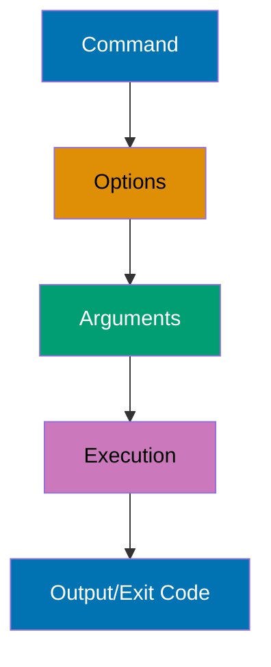
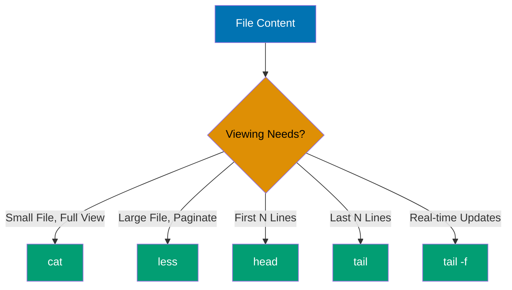
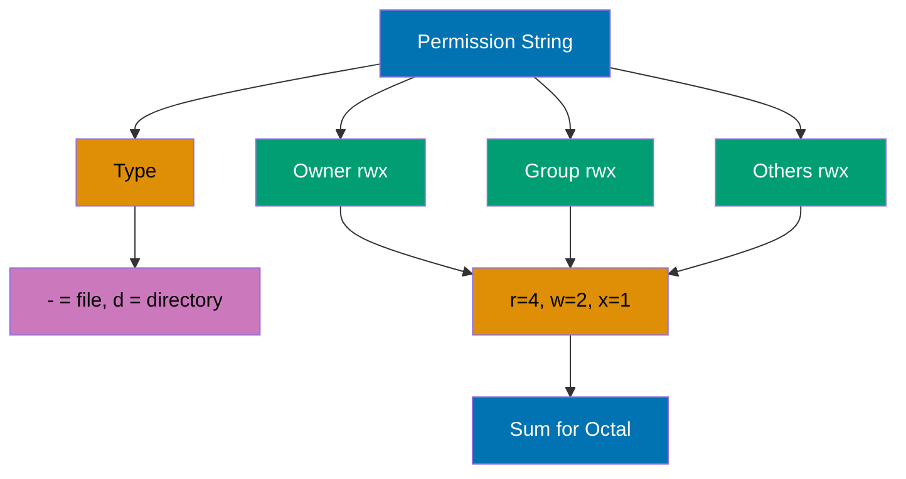
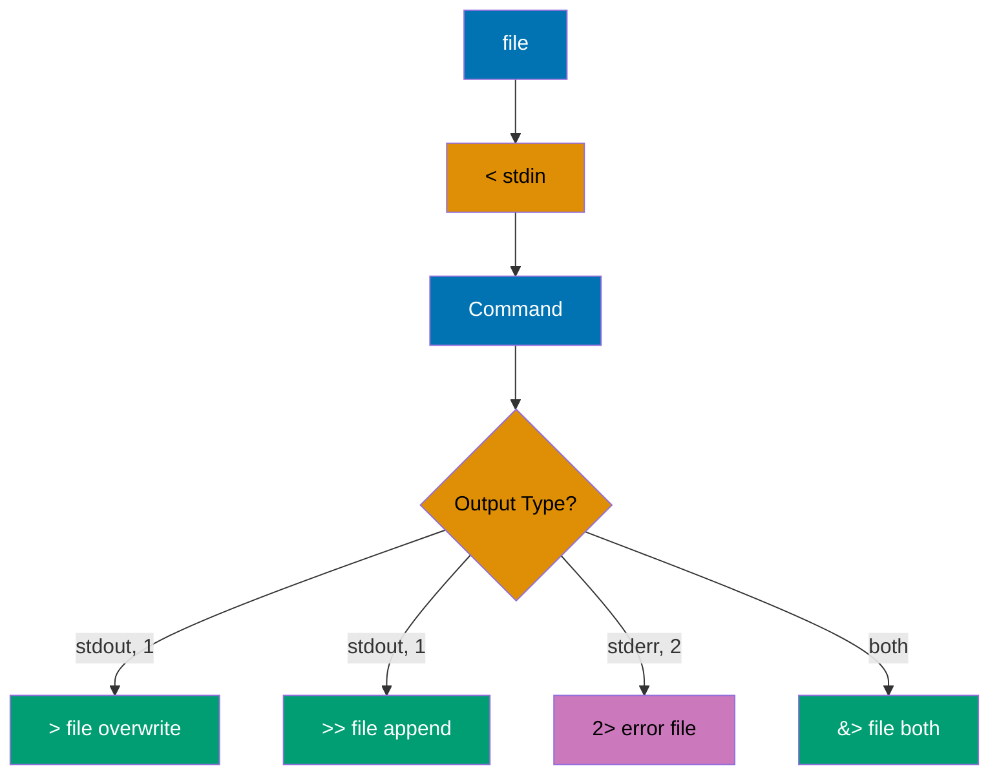
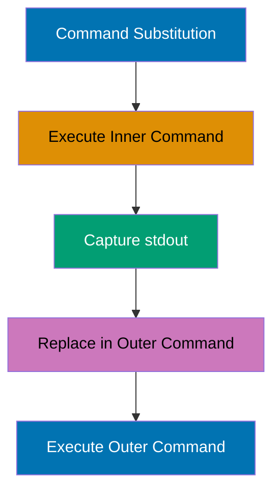
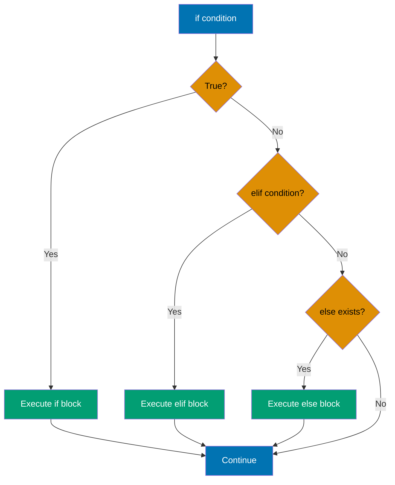
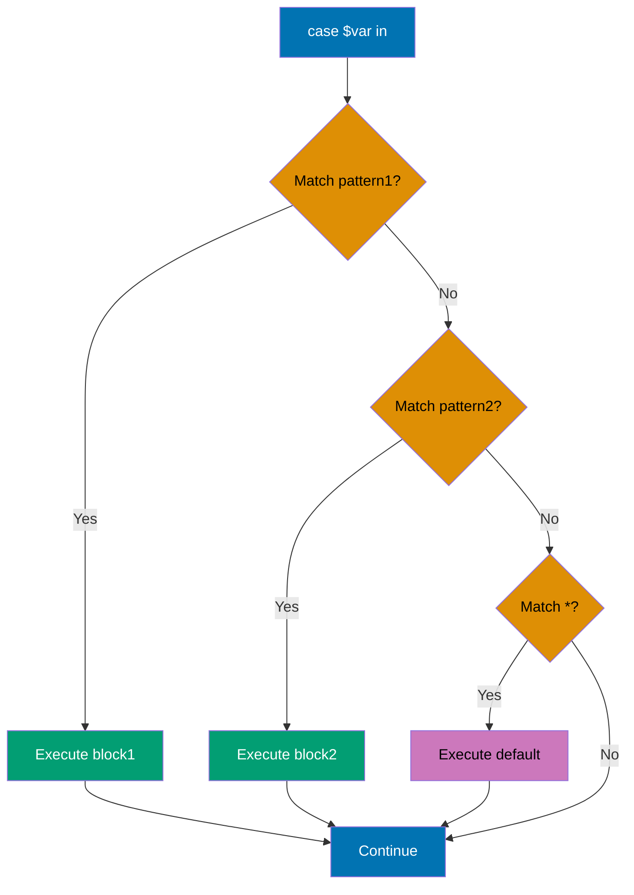
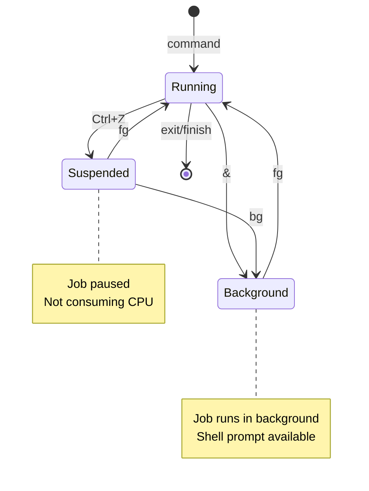

## Beginner Level (0-40% Coverage)

This level covers Linux shell fundamentals through 30 self-contained examples. Each example is copy-paste-runnable and demonstrates core command-line features needed for basic shell usage.

---

### Example 1: Echo and Basic Output

The `echo` command outputs text to stdout, supporting variable expansion, escape sequences, and redirection. It's the most basic way to produce output and debug shell scripts.

```bash
# Basic echo
echo "Hello, World!"           # => Writes to stdout (file descriptor 1)
                                # => Output: Hello, World!
                                # => Exit code: 0 (success)

# Echo without newline
echo -n "No newline"            # => -n flag suppresses trailing newline
                                # => Output: No newline (cursor stays on same line)
                                # => Prompt appears immediately after text

# Echo with escape sequences (requires -e flag)
echo -e "Line 1\nLine 2"        # => -e enables interpretation of backslash escapes
                                # => \n is converted to actual newline character
                                # => Output: Line 1
                                # =>         Line 2

# Echo variables
USER_NAME="Alice"               # => USER_NAME variable stores string "Alice"
                                # => Variable lives in current shell session
echo "Hello, $USER_NAME"        # => $USER_NAME expands to "Alice" before echo runs
                                # => Double quotes allow variable expansion
                                # => Output: Hello, Alice

# Echo with command substitution
echo "Current directory: $(pwd)" # => $(pwd) executes pwd command first
                                # => pwd returns absolute path string
                                # => Result substituted into echo command
                                # => Output: Current directory: /home/user
```

**Key Takeaway**: Use `echo` for simple output and debugging - it automatically expands variables in double quotes and supports escape sequences with `-e` flag.

**Why It Matters**: The `echo` command is fundamental for script debugging and user feedback in production systems. DevOps engineers use it extensively in deployment scripts to log progress and debug variable values during automation workflows.

---

### Example 2: Variables and Assignment

Shell variables store strings by default, with no type declarations. Variable names are case-sensitive and conventionally use UPPERCASE for environment variables and lowercase for local variables.

```bash
# Variable assignment (no spaces around =)
name="Bob"                      # => Variable 'name' created in current shell
                                # => Stores string "Bob" (shell variables are strings by default)
                                # => Spaces around = would cause syntax error
age=30                          # => Variable 'age' stores "30" as string, not number
                                # => Shell treats everything as strings unless arithmetic context
echo "$name is $age years old"  # => Variables expanded within double quotes
                                # => $name becomes "Bob", $age becomes "30"
                                # => Output: Bob is 30 years old

# Variable expansion in double quotes
greeting="Hello, $name"         # => $name expands to "Bob" during assignment
                                # => greeting stores "Hello, Bob" (expansion happens once)
                                # => Variable expansion occurs at assignment time
echo "$greeting"                # => No further expansion needed
                                # => Output: Hello, Bob

# Single quotes prevent expansion
literal='$name'                 # => Single quotes treat everything literally
                                # => literal stores the 5 characters: $ n a m e
                                # => No variable expansion occurs
echo "$literal"                 # => Output: $name (literal dollar sign and name)

# Command substitution
current_date=$(date +%Y-%m-%d)  # => $(date +%Y-%m-%d) executes date command
                                # => date +%Y-%m-%d formats as 2025-12-30
                                # => Command output captured and assigned to variable
                                # => current_date is "2025-12-30"
echo "Today: $current_date"     # => Variable expanded in string
                                # => Output: Today: 2025-12-30

# Arithmetic with $(( ))
x=10                            # => x stores string "10"
y=20                            # => y stores string "20"
sum=$((x + y))                  # => $(( )) forces arithmetic context
                                # => x and y interpreted as numbers: 10 + 20
                                # => Result 30 converted back to string
                                # => sum stores "30"
echo "Sum: $sum"                # => Output: Sum: 30
```

**Key Takeaway**: Use double quotes for variable expansion and single quotes for literal strings - assign variables without spaces around `=` and use `$(command)` for command substitution or `$((expression))` for arithmetic.

**Why It Matters**: This shell scripting concept is fundamental for production automation and system administration. Understanding this pattern enables you to write more robust and maintainable scripts for deployment, monitoring, and infrastructure management tasks.

---

### Example 3: Command Structure and Options

Shell commands follow the pattern `command [options] [arguments]` where options modify behavior and arguments specify targets. Options typically use `-` for short form and `--` for long form.



```bash
# Basic command
ls                              # => Output: Lists files in current directory

# Command with short option
ls -l                           # => Output: Long format listing (detailed info)

# Multiple short options (combined)
ls -la                          # => Output: Long format including hidden files (-l and -a)

# Command with long option
ls --all                        # => Output: Shows hidden files (same as -a)

# Command with option argument
ls -w 80                        # => Output: Limits output width to 80 characters

# Command with multiple arguments
ls /etc /var /tmp               # => Output: Lists contents of three directories

# Mixing options and arguments
ls -lh /var/log                 # => Output: Long format, human-readable sizes, /var/log contents
                                # => -l: long format, -h: human-readable (1K, 234M, 2G)

# Getting help
ls --help                       # => Output: Displays ls command help
man ls                          # => Output: Opens manual page for ls (press 'q' to quit)
```

**Key Takeaway**: Most commands follow the pattern `command [options] [arguments]` - use short options (`-a`) for quick typing, long options (`--all`) for script readability, and `man command` to learn about any command's options.

**Why It Matters**: This shell scripting concept is fundamental for production automation and system administration. Understanding this pattern enables you to write more robust and maintainable scripts for deployment, monitoring, and infrastructure management tasks.

---

### Example 4: Navigating Directories (pwd, cd, ls)

Directory navigation uses `pwd` to show current location, `cd` to change directories, and `ls` to list contents. Understanding absolute vs relative paths is crucial for effective navigation.

```bash
# Show current directory
pwd                             # => pwd = "print working directory"
                                # => Shell maintains current working directory in memory
                                # => Queries OS for current directory path
                                # => Returns absolute path from root (/)
                                # => Output: /home/user
                                # => Also available as $PWD environment variable

# List current directory contents
ls                              # => Lists files/directories in current working directory
                                # => Queries filesystem for directory entries
                                # => Shows only visible files (not starting with .)
                                # => Output: file1.txt  file2.txt  directory1
                                # => Space-separated list (default format)

# List with details
ls -l                           # => -l flag: long format with metadata
                                # => Each file shown on separate line
                                # => Format: permissions links owner group size date name
                                # => -rw-r--r-- 1 user group 1234 Dec 30 08:00 file1.txt
                                # =>   -rw-r--r--: file type + permissions
                                # =>   1: number of hard links
                                # =>   user: owner name, group: group name
                                # =>   1234: size in bytes
                                # =>   Dec 30 08:00: last modification time

# List hidden files (start with .)
ls -a                           # => -a flag: show "all" files including hidden
                                # => Hidden files: names starting with .
                                # => Output: .  ..  .bashrc  .profile  file1.txt
                                # =>   .: current directory (self-reference)
                                # =>   ..: parent directory
                                # =>   .bashrc, .profile: hidden config files

# Change to home directory
cd ~                            # => ~ expands to $HOME environment variable
                                # => $HOME typically /home/username
                                # => Shell changes working directory to /home/user
                                # => $PWD updated to /home/user
cd                              # => cd with no arguments defaults to $HOME
                                # => Equivalent to cd ~

# Change to absolute path
cd /var/log                     # => Absolute path: starts with /
                                # => Shell changes working directory to /var/log
                                # => $PWD updated to /var/log
                                # => $OLDPWD stores previous directory

# Change to relative path
cd ../..                        # => Relative path: doesn't start with /
                                # => ..: parent directory
                                # => ../.. : parent's parent
                                # => If current: /var/log, parent: /var, parent's parent: /
                                # => Shell resolves relative to current working directory
                                # => New working directory: /

# Change to subdirectory
cd documents/work               # => Relative path: no leading /
                                # => Shell looks for documents/ in current directory
                                # => Then work/ inside documents/
                                # => If current is /home/user:
                                # =>   New directory: /home/user/documents/work

# Return to previous directory
cd -                            # => Switches to previous directory
                                # => Output: /var/log (prints previous directory)

# List specific directory without changing to it
ls /etc                         # => Output: Lists /etc contents (current dir unchanged)
```

**Key Takeaway**: Use `pwd` to check your location, `cd` with absolute paths (`/path/to/dir`) for certainty or relative paths (`../dir`) for convenience, and `cd -` to toggle between two directories.

**Why It Matters**: This shell scripting concept is fundamental for production automation and system administration. Understanding this pattern enables you to write more robust and maintainable scripts for deployment, monitoring, and infrastructure management tasks.

---

### Example 5: Creating and Removing Directories (mkdir, rmdir, rm)

Directory creation uses `mkdir` with optional `-p` for parent creation, while removal uses `rmdir` for empty directories or `rm -r` for non-empty ones.

```bash
# Create single directory
mkdir projects                  # => Creates directory 'projects' in current location

# Create nested directories (requires -p)
mkdir -p work/code/python       # => Creates work/, work/code/, and work/code/python
                                # => -p creates parent directories if needed

# Create multiple directories at once
mkdir dir1 dir2 dir3            # => Creates three directories: dir1, dir2, dir3

# Create directory with specific permissions
mkdir -m 755 public_html        # => Creates directory with rwxr-xr-x permissions
                                # => 7=rwx (owner), 5=r-x (group), 5=r-x (others)

# Remove empty directory
rmdir dir1                      # => Removes dir1 (only if empty!)
                                # => Error if directory contains files

# Remove directory with contents (DANGEROUS - use carefully!)
rm -r dir2                      # => Recursively removes dir2 and all contents
                                # => -r: recursive (deletes files and subdirectories)

# Remove directory with confirmation
rm -ri dir3                     # => Interactive removal (asks before each deletion)
                                # => -i: interactive (prompts for confirmation)

# Force remove without prompts (VERY DANGEROUS!)
rm -rf temp_data                # => Force removes temp_data and contents
                                # => -f: force (no warnings, no confirmations)
                                # => NEVER use rm -rf / or rm -rf /* !!!

# Remove multiple directories
rm -r old_*                     # => Removes all directories starting with "old_"
```

**Key Takeaway**: Use `mkdir -p` to create nested directories safely, `rmdir` for empty directories, and `rm -r` for directories with contents - always double-check before using `rm -rf` as it's irreversible and dangerous.

**Why It Matters**: This shell scripting concept is fundamental for production automation and system administration. Understanding this pattern enables you to write more robust and maintainable scripts for deployment, monitoring, and infrastructure management tasks.

---

### Example 6: File Viewing (cat, less, head, tail)

File viewing commands let you examine file contents without editing: `cat` for entire files, `less` for paging, `head` for beginning, and `tail` for ending.



```bash
# View entire file
cat file.txt                    # => Output: Entire file contents (scrolls if long)

# View multiple files (concatenate)
cat file1.txt file2.txt         # => Output: file1 contents, then file2 contents

# Number lines
cat -n file.txt                 # => Output: Each line prefixed with line number
                                # => 1  First line
                                # => 2  Second line

# View with paging (large files)
less file.txt                   # => Opens file in pager
                                # => Space: next page, b: previous page, q: quit
                                # => /pattern: search forward, ?pattern: search backward

# View first 10 lines
head file.txt                   # => Output: First 10 lines of file

# View first N lines
head -n 5 file.txt              # => Output: First 5 lines
head -5 file.txt                # => Same as head -n 5 (shorthand)

# View last 10 lines
tail file.txt                   # => Output: Last 10 lines of file

# View last N lines
tail -n 20 file.txt             # => Output: Last 20 lines
tail -20 file.txt               # => Same as tail -n 20 (shorthand)

# Follow file updates (real-time monitoring)
tail -f /var/log/syslog         # => Output: Shows last lines and updates as file grows
                                # => Ctrl+C to exit
                                # => Perfect for monitoring log files

# Follow with line count
tail -f -n 50 app.log           # => Shows last 50 lines and follows updates
```

**Key Takeaway**: Use `cat` for small files, `less` for browsing large files interactively, `head` for beginnings, `tail` for endings, and `tail -f` for real-time log monitoring.

**Why It Matters**: This shell scripting concept is fundamental for production automation and system administration. Understanding this pattern enables you to write more robust and maintainable scripts for deployment, monitoring, and infrastructure management tasks.

---

### Example 7: File Operations (cp, mv, rm)

File manipulation commands copy files (`cp`), move/rename files (`mv`), and delete files (`rm`). These operations are fundamental to file management.

```bash
# Copy file
cp source.txt backup.txt        # => Creates backup.txt as copy of source.txt
                                # => source.txt remains unchanged

# Copy with directory structure
cp /path/to/file.txt .          # => Copies file.txt to current directory (. means here)

# Copy directory recursively
cp -r old_project new_project   # => Copies entire directory and contents
                                # => -r: recursive (required for directories)

# Copy preserving attributes
cp -a original copy             # => Preserves permissions, timestamps, ownership
                                # => -a: archive mode (same as -dR --preserve=all)

# Copy interactively (confirm overwrites)
cp -i file.txt existing.txt     # => Prompts before overwriting existing.txt
                                # => -i: interactive

# Move/rename file
mv old_name.txt new_name.txt    # => Renames old_name.txt to new_name.txt
                                # => old_name.txt no longer exists

# Move to directory
mv file.txt documents/          # => Moves file.txt into documents/ directory
                                # => File keeps same name in new location

# Move multiple files
mv *.txt documents/             # => Moves all .txt files to documents/
                                # => * is glob pattern (wildcard)

# Move with overwrite protection
mv -n file.txt backup/          # => Moves only if destination doesn't exist
                                # => -n: no clobber (don't overwrite)

# Remove file
rm file.txt                     # => Deletes file.txt (PERMANENT - no trash!)

# Remove with confirmation
rm -i *.log                     # => Asks confirmation before deleting each .log file
                                # => -i: interactive

# Remove multiple files
rm file1.txt file2.txt file3.txt # => Deletes three files

# Force remove (DANGEROUS - use with extreme caution!)
rm -f locked_file.txt           # => Removes file without asking, even if write-protected
                                # => -f: force
```

**Key Takeaway**: Use `cp` for copying, `mv` for moving/renaming, and `rm` for deletion - always use `-i` flag for interactive confirmation with destructive operations, and remember that `rm` is permanent (no undo).

**Why It Matters**: This shell scripting concept is fundamental for production automation and system administration. Understanding this pattern enables you to write more robust and maintainable scripts for deployment, monitoring, and infrastructure management tasks.

---

### Example 8: File Permissions (ls -l, chmod)

Linux file permissions control read, write, and execute access for owner, group, and others. Permissions are displayed in `ls -l` output and modified with `chmod`.



```bash
# View permissions
ls -l file.txt                  # => Lists file metadata including permissions
                                # => Output: -rw-r--r-- 1 user group 1234 Dec 30 file.txt
                                # => Permission string breakdown (10 characters):
                                # =>   Position 1: file type
                                # =>     -: regular file, d: directory, l: symlink
                                # =>   Positions 2-4: owner permissions (user)
                                # =>     rw-: read yes, write yes, execute no
                                # =>   Positions 5-7: group permissions
                                # =>     r--: read yes, write no, execute no
                                # =>   Positions 8-10: others permissions
                                # =>     r--: read yes, write no, execute no

# Permission meanings
# r (read) = 4: View file contents or list directory
# w (write) = 2: Modify file or create/delete files in directory
# x (execute) = 1: Run file as program or enter directory
                                # => Octal values: r=4, w=2, x=1
                                # => Combinations: rwx=7, rw-=6, r-x=5, r--=4

# Make file executable
chmod +x script.sh              # => + adds permission without removing existing
                                # => x: execute bit
                                # => No prefix (u/g/o): applies to all three classes
                                # => Owner, group, others all get execute bit set
                                # => Before: -rw-r--r--, After: -rwxr-xr-x

# Remove write permission from group and others
chmod go-w file.txt             # => g: group, o: others
                                # => - removes permission
                                # => w: write bit
                                # => Owner (u) permissions unchanged
                                # => Before: -rw-rw-rw-, After: -rw-r--r--

# Set specific permissions with octal
chmod 644 file.txt              # => Octal notation: three digits (owner, group, others)
                                # => 6 = 4+2 = rw- (read + write)
                                # => 4 = 4 = r-- (read only)
                                # => 4 = 4 = r-- (read only)
                                # => Result: -rw-r--r--
                                # => Common for data files (owner can modify, others read)

chmod 755 script.sh             # => 7 = 4+2+1 = rwx (all permissions)
                                # => 5 = 4+1 = r-x (read + execute, no write)
                                # => 5 = 4+1 = r-x (read + execute, no write)
                                # => Result: -rwxr-xr-x
                                # => Common for scripts (owner modifies, all execute)

chmod 700 private.txt           # => 7 = 4+2+1 = rwx (owner: full access)
                                # => 0 = 0 = --- (group: no access)
                                # => 0 = 0 = --- (others: no access)
                                # => Result: -rwx------
                                # => Private files (only owner access)

# Set permissions recursively
chmod -R 755 public_html/       # => Sets 755 on directory and all contents
                                # => -R: recursive

# Symbolic permissions
chmod u+x file.sh               # => u=user/owner, +x adds execute for owner only
chmod g+w,o-r file.txt          # => g+w: add write for group, o-r: remove read for others
chmod a=r file.txt              # => a=all (user, group, others), =r: set to read-only for all
```

**Key Takeaway**: Use `ls -l` to view permissions, `chmod` with octal notation (644, 755, 700) for absolute permission sets, or symbolic notation (u+x, go-w) for relative changes - remember that 644 is standard for files and 755 for directories/executables.

**Why It Matters**: This shell scripting concept is fundamental for production automation and system administration. Understanding this pattern enables you to write more robust and maintainable scripts for deployment, monitoring, and infrastructure management tasks.

---

### Example 9: Output Redirection (>, >>, <, 2>)

Redirection operators control where command input comes from and where output goes. `>` redirects stdout, `>>` appends, `<` redirects stdin, and `2>` redirects stderr.



```bash
# Redirect stdout to file (overwrite)
echo "Hello, World" > output.txt # => stdout (FD 1) redirected to output.txt
                                # => If output.txt exists, truncated to 0 bytes first
                                # => "Hello, World" written to file
                                # => File descriptor closed after command completes
                                # => output.txt contents: "Hello, World\n" (14 bytes)
                                # => Terminal displays nothing (stdout went to file)

# Redirect stdout to file (append)
echo "Second line" >> output.txt # => >> opens output.txt in append mode
                                # => File pointer positioned at end of file
                                # => "Second line\n" added after existing content
                                # => output.txt now contains:
                                # => "Hello, World\nSecond line\n" (27 bytes)
                                # => Original content preserved

# Redirect stderr to file
ls /nonexistent 2> error.log    # => ls attempts to access /nonexistent
                                # => Fails, writes error to stderr (FD 2)
                                # => 2> redirects only stderr to error.log
                                # => stdout (FD 1) still goes to terminal (nothing on stdout)
                                # => error.log receives: "ls: cannot access '/nonexistent': No such file or directory\n"
                                # => Terminal shows nothing (error went to file)

# Redirect both stdout and stderr
command &> all_output.txt       # => &> is bash shorthand for combined redirection
                                # => Equivalent to: >all_output.txt 2>&1
                                # => Both FD 1 (stdout) and FD 2 (stderr) write to same file
                                # => Success messages and errors mixed in all_output.txt

# Redirect stdout and stderr separately
command >output.log 2>error.log # => stdout (FD 1) redirected to output.log
                                # => stderr (FD 2) redirected to error.log
                                # => Normal output and errors stored separately
                                # => Useful for separating expected output from diagnostics

# Discard output (send to /dev/null)
command > /dev/null             # => stdout redirected to /dev/null (black hole device)
                                # => All stdout data discarded (silent execution)
                                # => stderr still visible on terminal
command 2> /dev/null            # => stderr redirected to /dev/null
                                # => Error messages suppressed
                                # => stdout still visible on terminal
command &> /dev/null            # => Both stdout and stderr discarded
                                # => Completely silent execution (no output visible)

# Redirect stdin from file
wc -l < input.txt               # => < redirects stdin (FD 0) from input.txt
                                # => wc reads from FD 0 instead of keyboard
                                # => File contents fed to wc as if typed
                                # => wc -l counts newlines in input
                                # => Output: 42 (just number, no filename shown)
                                # => Compare: wc -l input.txt shows "42 input.txt"

# Here document (multi-line input)
cat > config.txt << EOF         # => stdout redirected to config.txt
                                # => stdin redirected from here document
                                # => Shell reads lines until EOF delimiter
line 1                          # => These lines stored in temporary buffer
line 2                          # => Fed to cat's stdin
line 3
EOF                             # => EOF delimiter signals end of input
                                # => cat receives 3 lines on stdin, writes to config.txt
                                # => config.txt contains: "line 1\nline 2\nline 3\n"

# Combine redirection
sort < unsorted.txt > sorted.txt # => stdin redirected from unsorted.txt
                                # => sort reads file contents from FD 0
                                # => Sorts lines in memory
                                # => stdout redirected to sorted.txt
                                # => Sorted output written to file
                                # => unsorted.txt unchanged (read-only operation)
```

**Key Takeaway**: Use `>` to redirect output to files (overwrites), `>>` to append, `2>` for error messages, and `<` for input - remember that `> /dev/null` discards output, useful for silent execution.

**Why It Matters**: This shell scripting concept is fundamental for production automation and system administration. Understanding this pattern enables you to write more robust and maintainable scripts for deployment, monitoring, and infrastructure management tasks.

---

### Example 10: Pipes (|)

Pipes connect commands by sending stdout of one command to stdin of the next, enabling powerful command composition for data processing workflows.

```bash
# Basic pipe
ls -l | wc -l                   # => ls -l executes first, stdout goes to pipe
                                # => Pipe buffer holds directory listing lines
                                # => wc -l reads from pipe stdin, counts lines
                                # => wc -l processes all input then outputs count
                                # => Output: 42 (number of files/dirs including header)
                                # => Exit code: 0 if both commands succeed

# Chain multiple commands
cat file.txt | grep "error" | wc -l
                                # => cat reads file.txt, sends to stdout
                                # => First pipe carries all file lines to grep
                                # => grep filters, keeping only lines with "error"
                                # => Second pipe carries filtered lines to wc
                                # => wc -l counts lines in filtered output
                                # => Output: 5 (number of error lines in file)

# Sort and unique
cat names.txt | sort | uniq     # => cat sends names.txt content to pipe
                                # => sort reads lines, sorts alphabetically
                                # => sort outputs: Alice, Alice, Bob, Charlie, Charlie
                                # => uniq receives sorted input
                                # => uniq removes consecutive duplicates only
                                # => Output: Alice, Bob, Charlie (duplicates removed)

# Head and tail through pipe
ls -lt | head -10               # => ls -lt sorts by modification time (newest first)
                                # => Full listing sent through pipe
                                # => head -10 reads from pipe, takes first 10 lines
                                # => Remaining lines discarded (never processed)
                                # => Output: 10 most recently modified items

# Complex processing pipeline
cat access.log | grep "404" | awk '{print $7}' | sort | uniq -c | sort -nr
                                # => Stage 1: cat sends all log lines to pipe
                                # => Stage 2: grep filters, keeps only 404 status lines
                                # => Stage 3: awk extracts 7th field (URL path)
                                # => URLs flow through: /page1, /page2, /page1, /page3
                                # => Stage 4: sort orders alphabetically: /page1, /page1, /page2, /page3
                                # => Stage 5: uniq -c counts: "2 /page1", "1 /page2", "1 /page3"
                                # => Stage 6: sort -nr orders by count descending
                                # => Output: Most frequently 404'd URLs first

# Tee - write to file AND continue pipe
ls -l | tee listing.txt | wc -l # => ls -l output flows into tee
                                # => tee writes copy to listing.txt (file created/overwritten)
                                # => tee simultaneously passes same data to stdout
                                # => wc -l receives identical copy from tee
                                # => listing.txt contains full directory listing
                                # => Output: 42 (line count displayed to terminal)

# Multiple pipes for data transformation
echo "  HELLO WORLD  " | tr '[:upper:]' '[:lower:]' | sed 's/^  *//' | sed 's/  *$//'
                                # => echo outputs: "  HELLO WORLD  " (with spaces)
                                # => tr receives, converts to lowercase: "  hello world  "
                                # => First sed removes leading spaces: "hello world  "
                                # => Second sed removes trailing spaces: "hello world"
                                # => Output: hello world (cleaned string)

# Pipe with xargs (convert stdin to arguments)
find . -name "*.tmp" | xargs rm # => find outputs each .tmp file on separate line
                                # => Output: ./file1.tmp, ./dir/file2.tmp, ./file3.tmp
                                # => Pipe carries filenames to xargs
                                # => xargs reads stdin, builds argument list
                                # => xargs executes: rm ./file1.tmp ./dir/file2.tmp ./file3.tmp
                                # => More efficient than running rm for each file separately
```

**Key Takeaway**: Pipes enable command composition by connecting stdout to stdin - use them to build powerful data processing workflows from simple commands, and remember that pipe order matters (process left to right).

**Why It Matters**: Pipes chain commands together for powerful data transformations. Production scripts use pipes to filter logs, extract metrics, and transform data formats without intermediate files.

---

### Example 11: Searching Files (find)

The `find` command locates files and directories based on name, type, size, time, permissions, and other criteria, with optional execution of commands on results.

```bash
# Find by name
find . -name "*.txt"            # => Starts at . (current directory)
                                # => Recursively descends into all subdirectories
                                # => Tests each file/directory against pattern "*.txt"
                                # => -name does case-sensitive glob matching
                                # => Matches: file1.txt, ./subdir/file2.txt, ./a/b/c/data.txt
                                # => Doesn't match: FILE.TXT, doc.TXT, report.text
                                # => Output: One file per line with relative path

# Find case-insensitive
find . -iname "*.TXT"           # => -iname: case-insensitive name matching
                                # => Pattern "*.TXT" matches any case combination
                                # => Matches: file.txt, FILE.TXT, File.Txt, data.tXt
                                # => Useful for case-insensitive filesystems or mixed-case files

# Find by type
find /var/log -type f           # => Starts at /var/log directory
                                # => -type f: test if regular file
                                # => Regular file: normal file with data (not directory/link/device)
                                # => Matches: /var/log/syslog, /var/log/apache/access.log
                                # => Skips: directories, symlinks, device files
find /var/log -type d           # => -type d: test if directory
                                # => Matches: /var/log, /var/log/apache, /var/log/nginx
                                # => Skips: regular files and other types
find /tmp -type l               # => -type l: test if symbolic link
                                # => Matches only symlinks (files pointing to other files)
                                # => Skips: regular files and directories

# Find by size
find . -size +10M               # => -size tests file size
                                # => +10M: greater than 10 megabytes (10 * 1024 * 1024 bytes)
                                # => Matches files: 10485761 bytes and larger
                                # => M suffix: megabytes, k: kilobytes, G: gigabytes
find . -size -1k                # => -1k: less than 1 kilobyte (1024 bytes)
                                # => Matches files: 0 to 1023 bytes
                                # => Useful for finding empty or tiny files

# Find by modification time
find . -mtime -7                # => Files modified in last 7 days
                                # => -mtime -7: modified within 7 days
find . -mtime +30               # => Files modified more than 30 days ago
                                # => +30: older than 30 days

# Find by permissions
find . -perm 644                # => Files with exactly 644 permissions
find . -perm -644               # => Files with at least 644 permissions (may have more)

# Combine conditions with AND
find . -name "*.log" -size +1M  # => Finds .log files larger than 1MB
                                # => Both conditions must match (implicit AND)

# Combine with OR
find . -name "*.txt" -o -name "*.md"
                                # => Finds .txt OR .md files
                                # => -o: OR operator

# Execute command on results
find . -name "*.tmp" -delete    # => Deletes all .tmp files
                                # => -delete: built-in delete action

find . -type f -exec chmod 644 {} \;
                                # => Sets 644 permissions on all files
                                # => -exec: execute command
                                # => {}: replaced with found filename
                                # => \;: terminates -exec command

# Limit depth
find . -maxdepth 2 -name "*.txt" # => Searches only 2 levels deep
                                # => -maxdepth 2: current dir and one level down

# Find and list with details
find /var/log -type f -mtime -1 -exec ls -lh {} \;
                                # => Lists files modified in last 24 hours with details
                                # => Combines find with ls -lh
```

**Key Takeaway**: Use `find` with conditions like `-name` (files), `-type` (file/dir/link), `-size` (file size), and `-mtime` (modification time) - combine with `-exec` to perform actions on found files, and use `-maxdepth` to limit search depth.

**Why It Matters**: This shell scripting concept is fundamental for production automation and system administration. Understanding this pattern enables you to write more robust and maintainable scripts for deployment, monitoring, and infrastructure management tasks.

---

### Example 12: Searching Text (grep)

The `grep` command searches for patterns in text files using regular expressions, with options for case-insensitivity, line numbers, context, and recursive directory search.

```bash
# Basic search
grep "error" logfile.txt        # => Opens logfile.txt for reading
                                # => Reads file line by line into buffer
                                # => For each line: searches for substring "error"
                                # => Pattern match: case-sensitive substring search
                                # => Matches: "error", "errors", "error_code", "an error"
                                # => Doesn't match: "Error", "ERROR", "err"
                                # => Outputs complete lines containing pattern
                                # => Exit code: 0 if found, 1 if not found, 2 if error

# Case-insensitive search
grep -i "error" logfile.txt     # => -i flag: ignore case during matching
                                # => Pattern "error" matches any case variation
                                # => Matches: "error", "Error", "ERROR", "ErRoR"
                                # => Converts both pattern and text to lowercase for comparison
                                # => Original case preserved in output

# Show line numbers
grep -n "error" logfile.txt     # => -n flag: prepend line number to output
                                # => grep tracks line counter while reading file
                                # => Output format: line_number:matched_line
                                # => Example: 42:error occurred at startup
                                # => Line 42 contains the pattern

# Invert match (lines NOT containing pattern)
grep -v "debug" logfile.txt     # => -v flag: inverts match logic
                                # => Shows lines where pattern NOT found
                                # => Useful for filtering out unwanted content
                                # => Example: remove debug messages, keep all others

# Count matching lines
grep -c "warning" logfile.txt   # => -c flag: count mode (suppress normal output)
                                # => grep maintains counter of matching lines
                                # => Reads entire file, increments counter per match
                                # => Output: 15 (just the count number)
                                # => Doesn't show the actual matching lines

# Show only matching part
grep -o "error" logfile.txt     # => -o flag: extract only matched substring
                                # => Doesn't show rest of line
                                # => One match per line of output
                                # => Line: "fatal error in module" outputs: error
                                # => Useful with regex to extract specific patterns

# Multiple files
grep "error" *.log              # => Searches all .log files
                                # => Output: filename:matching line

# Recursive search
grep -r "TODO" /home/user/code  # => Searches all files recursively
                                # => -r: recursive

# Show context lines
grep -A 3 "error" logfile.txt   # => Shows match + 3 lines after
                                # => -A 3: after context
grep -B 2 "error" logfile.txt   # => Shows match + 2 lines before
                                # => -B 2: before context
grep -C 2 "error" logfile.txt   # => Shows match + 2 lines before and after
                                # => -C 2: context (both directions)

# Regular expressions
grep "^error" logfile.txt       # => Lines starting with "error"
                                # => ^: beginning of line
grep "error$" logfile.txt       # => Lines ending with "error"
                                # => $: end of line
grep "err.*msg" logfile.txt     # => Lines with "err" followed by "msg"
                                # => .*: any characters (zero or more)

# Extended regex (more operators)
grep -E "error|warning" logfile.txt # => Lines with "error" OR "warning"
                                # => -E: extended regex
                                # => |: OR operator
grep -E "[0-9]{3}" logfile.txt  # => Lines containing 3-digit numbers
                                # => {3}: exactly 3 occurrences

# List only filenames
grep -l "error" *.txt           # => Output: file1.txt file3.txt (files with matches)
                                # => -l: list filenames only

# Quiet mode (exit code only)
if grep -q "success" result.log; then
    echo "Success found"        # => Checks without output
fi                              # => -q: quiet (no output, only exit code)
```

**Key Takeaway**: Use `grep` for text pattern matching with `-i` for case-insensitive, `-r` for recursive search, `-n` for line numbers, and `-C` for context - leverage regular expressions for complex patterns and combine with pipes for powerful text filtering.

**Why It Matters**: Pattern matching filters and validates string content. Scripts use glob patterns to select files, validate input formats, and match configuration patterns.

---

### Example 13: Text Processing (cut, sort, uniq)

Text processing tools slice (`cut`), reorder (`sort`), and deduplicate (`uniq`) data, essential for log analysis and data transformation pipelines.

```bash
# Cut by delimiter (CSV/TSV processing)
echo "Alice,30,Engineer" | cut -d',' -f1
                                # => echo outputs: "Alice,30,Engineer"
                                # => Pipe sends to cut's stdin
                                # => -d',' sets comma as field delimiter
                                # => cut splits into fields: ["Alice", "30", "Engineer"]
                                # => -f1 selects first field
                                # => Output: Alice

echo "Alice,30,Engineer" | cut -d',' -f2,3
                                # => cut splits: ["Alice", "30", "Engineer"]
                                # => -f2,3 selects fields 2 and 3
                                # => Output joined with delimiter: "30,Engineer"
                                # => Original delimiter preserved in output

# Cut by character position
echo "Hello World" | cut -c1-5  # => cut receives string "Hello World"
                                # => -c1-5: extract characters at positions 1-5
                                # => Character 1='H', 2='e', 3='l', 4='l', 5='o'
                                # => Output: Hello

# Process file with cut
cut -d':' -f1,7 /etc/passwd     # => Each line format: user:pass:uid:gid:gecos:home:shell
                                # => -d':' splits on colon delimiter
                                # => Example line: "root:x:0:0:root:/root:/bin/bash"
                                # => Fields: ["root", "x", "0", "0", "root", "/root", "/bin/bash"]
                                # => -f1,7 selects field 1 (username) and 7 (shell)
                                # => Output: root:/bin/bash

# Sort lines alphabetically
cat names.txt | sort            # => cat sends: "Charlie\nAlice\nBob\n"
                                # => sort reads all lines into memory
                                # => Performs lexicographic comparison (byte-by-byte)
                                # => Alphabetical order: Alice < Bob < Charlie
                                # => Output: Alice\nBob\nCharlie

# Sort numerically
cat numbers.txt | sort -n       # => Without -n: "10" < "2" (string comparison)
                                # => -n forces numeric interpretation
                                # => Converts strings to numbers: 2, 10, 100
                                # => Numeric comparison: 2 < 10 < 100
                                # => Output: 2\n10\n100 (correct numeric order)

# Sort in reverse
cat numbers.txt | sort -nr      # => Numeric sort, largest first
                                # => -r: reverse order

# Sort by field
cat data.csv | sort -t',' -k2   # => Sorts CSV by 2nd column
                                # => -t',': delimiter is comma
                                # => -k2: key is field 2

# Unique lines (removes consecutive duplicates)
cat list.txt | sort | uniq      # => Removes duplicates (must sort first!)
                                # => sort ensures duplicates are consecutive
                                # => uniq removes consecutive duplicates

# Count occurrences
cat list.txt | sort | uniq -c   # => Output: count followed by line
                                # => -c: count occurrences
                                # => Output: 3 apple, 2 banana, 1 cherry

# Show only duplicates
cat list.txt | sort | uniq -d   # => Shows only lines that appear multiple times
                                # => -d: duplicates only

# Show only unique lines (no duplicates)
cat list.txt | sort | uniq -u   # => Shows only lines that appear once
                                # => -u: unique only

# Complex pipeline: Top 10 most common words
cat text.txt | tr ' ' '\n' | sort | uniq -c | sort -nr | head -10
                                # => Word frequency analysis
                                # => tr ' ' '\n': split words to lines
                                # => sort: alphabetically
                                # => uniq -c: count occurrences
                                # => sort -nr: numeric reverse (most common first)
                                # => head -10: top 10
```

**Key Takeaway**: Use `cut` to extract columns from delimited data, `sort` to order lines (with `-n` for numbers, `-k` for specific fields), and `uniq` to deduplicate (always sort first) - combine them in pipelines for powerful text analysis.

**Why It Matters**: This shell scripting concept is fundamental for production automation and system administration. Understanding this pattern enables you to write more robust and maintainable scripts for deployment, monitoring, and infrastructure management tasks.

---

### Example 14: Command Substitution and Subshells

Command substitution `$(command)` captures command output as a string, while subshells `(command)` run commands in isolated environments without affecting the parent shell.



```bash
# Command substitution - capture output
current_date=$(date +%Y-%m-%d) # => Shell creates subshell to run date command
                                # => date +%Y-%m-%d executes, outputs "2025-12-30" to stdout
                                # => Subshell exits, stdout captured
                                # => Trailing newline stripped from output
                                # => current_date variable assigned "2025-12-30"
echo "Today is $current_date"  # => Variable expands to "2025-12-30"
                                # => Output: Today is 2025-12-30

# Old syntax (backticks, deprecated)
files=`ls *.txt`                # => Backtick syntax `...` for command substitution
                                # => Equivalent to $(ls *.txt)
                                # => Harder to nest: `echo \`date\`` vs $(echo $(date))
echo "Files: $files"            # => Prefer $() for readability and nesting

# Nested substitution
backup_name="backup_$(date +%Y%m%d)_$(hostname).tar.gz"
                                # => First $(date +%Y%m%d) executes, returns "20251230"
                                # => Second $(hostname) executes, returns "server1"
                                # => String assembled: "backup_20251230_server1.tar.gz"
                                # => backup_name assigned complete string
echo "$backup_name"             # => Output: backup_20251230_server1.tar.gz

# Use in command arguments
echo "User count: $(wc -l < /etc/passwd)"
                                # => wc -l < /etc/passwd executes first
                                # => Counts lines in passwd file, outputs "42"
                                # => Substitution replaces $(wc...) with "42"
                                # => echo receives "User count: 42"
                                # => Output: User count: 42

# Arithmetic with substitution
total_size=$(du -sb /var/log | cut -f1)
                                # => du -sb /var/log calculates total bytes
                                # => Pipes to cut which extracts first field
                                # => Output: "1048576" (1MB in bytes)
                                # => total_size assigned "1048576"
echo "Log size: $total_size bytes"
                                # => Output: Log size: 1048576 bytes

# Subshell (isolated environment)
(cd /tmp && ls)                 # => Parentheses create subshell (child process)
                                # => Subshell inherits parent's environment
                                # => cd /tmp changes subshell's working directory
                                # => ls executes in /tmp
                                # => Subshell exits, directory change lost
pwd                             # => Parent shell's working directory unchanged
                                # => Output: /home/user (wherever we started)

# Subshell preserves parent variables
x=10                            # => x=10 in parent shell's memory
(x=20; echo "Inside: $x")       # => Subshell inherits x=10
                                # => Subshell modifies its copy: x=20
                                # => echo sees subshell's x=20
                                # => Output: Inside: 20
                                # => Subshell exits, its x=20 destroyed
echo "Outside: $x"              # => Parent shell's x still 10 (unchanged)
                                # => Output: Outside: 10

# Subshell for grouped commands
(echo "Starting backup"; tar -czf backup.tar.gz /data; echo "Backup done")
                                # => Groups related commands
                                # => Can redirect entire group

# Redirect subshell output
(echo "Line 1"; echo "Line 2") > output.txt
                                # => Both echoes go to output.txt

# Background subshell
(sleep 10; echo "Done") &       # => Runs in background
                                # => & runs subshell asynchronously
                                # => Parent shell continues immediately

# Conditional with substitution
if [ $(whoami) = "root" ]; then
    echo "Running as root"      # => Checks current user
fi

# Loop with substitution
for file in $(ls *.txt); do     # => Note: ls *.txt better than $(ls *.txt)
    echo "Processing $file"     # => Loop over command output
done
```

**Key Takeaway**: Use `$(command)` to capture command output in variables or expressions, and `(command)` for subshells to isolate environment changes - remember that subshells don't affect parent shell variables or directory.

**Why It Matters**: This shell scripting concept is fundamental for production automation and system administration. Understanding this pattern enables you to write more robust and maintainable scripts for deployment, monitoring, and infrastructure management tasks.

---

### Example 15: Environment Variables (export, env, PATH)

Environment variables store configuration and system information, passed to child processes. `export` makes variables available to subprocesses, and `PATH` determines command lookup.

```bash
# Set local variable (not in environment)
MY_VAR="hello"                  # => Creates variable in current shell's memory
                                # => Variable exists only in this shell process
                                # => Not in environment table (not inherited by children)
echo "$MY_VAR"                  # => Current shell accesses its own variable
                                # => Output: hello

# Local variables NOT passed to subshells
bash -c 'echo "Subshell: $MY_VAR"'
                                # => bash -c spawns child shell process
                                # => Child inherits environment variables only
                                # => MY_VAR is local (not in environment), not inherited
                                # => Child's $MY_VAR lookup returns empty
                                # => Output: Subshell: (empty string)

# Export variable to environment
export MY_VAR="hello"           # => Marks MY_VAR for export to child processes
                                # => Adds MY_VAR to environment table
                                # => Future child processes inherit this variable
bash -c 'echo "Subshell: $MY_VAR"'
                                # => Child shell spawned
                                # => Environment copied to child (includes MY_VAR)
                                # => Child's $MY_VAR resolves to "hello"
                                # => Output: Subshell: hello

# Export in one line
export DB_HOST="localhost"      # => Assignment + export in single statement
                                # => DB_HOST="localhost" creates variable
                                # => export marks for environment inheritance

# View all environment variables
env                             # => Queries current process environment table
                                # => Lists all variables marked for export
                                # => Format: NAME=value (one per line)
                                # => Output: HOME=/home/user
                                # =>         PATH=/usr/bin:/bin
                                # =>         USER=alice
                                # =>         ... (all exported variables)

# View specific variable
echo "$HOME"                    # => $HOME expands to value of HOME variable
                                # => HOME typically set by login process
                                # => Points to user's home directory
                                # => Output: /home/user
echo "$USER"                    # => USER contains current username
                                # => Output: alice
echo "$SHELL"                   # => SHELL contains path to user's login shell
                                # => Output: /bin/bash

# PATH - command search directories
echo "$PATH"                    # => Output: /usr/local/bin:/usr/bin:/bin
                                # => Colon-separated directory list
                                # => Shell searches left-to-right

# Add to PATH temporarily
export PATH="$HOME/bin:$PATH"   # => Prepends $HOME/bin to PATH
                                # => Now commands in ~/bin are found first

# Run command with modified environment
DB_HOST=localhost DB_PORT=5432 ./app
                                # => Sets variables only for this command
                                # => Variables not exported to shell

# Unset variable
unset MY_VAR                    # => Removes MY_VAR from environment
echo "$MY_VAR"                  # => Output: (empty)

# Common environment variables
echo "$PWD"                     # => Current directory
echo "$OLDPWD"                  # => Previous directory (from cd -)
echo "$HOSTNAME"                # => System hostname
echo "$LANG"                    # => Locale setting (en_US.UTF-8)

# Persistent environment (add to ~/.bashrc or ~/.profile)
# echo 'export MY_VAR="value"' >> ~/.bashrc
# source ~/.bashrc              # => Reloads configuration

# Check if variable is set
if [ -z "$MY_VAR" ]; then       # => -z tests if empty/unset
    echo "MY_VAR is not set"
else
    echo "MY_VAR is $MY_VAR"
fi
```

**Key Takeaway**: Use `export` to make variables available to child processes, modify `PATH` to add custom command directories, and set variables inline (`VAR=value command`) for one-time overrides - persist changes in `~/.bashrc` for permanent configuration.

**Why It Matters**: This shell scripting concept is fundamental for production automation and system administration. Understanding this pattern enables you to write more robust and maintainable scripts for deployment, monitoring, and infrastructure management tasks.

---

### Example 16: Conditional Execution (&&, ||, ;)

Logical operators control command execution flow: `&&` runs next command only if previous succeeds, `||` runs on failure, and `;` runs unconditionally.

```bash
# AND operator (&&) - run next if previous succeeds
mkdir testdir && cd testdir     # => mkdir testdir executes first
                                # => If testdir already exists: mkdir returns 1 (failure)
                                # =>   cd doesn't execute (short-circuit)
                                # => If testdir created: mkdir returns 0 (success)
                                # =>   && triggers cd execution
                                # =>   cd testdir changes into new directory

# Chain multiple commands with AND
cd /var/log && grep "error" syslog && echo "Errors found"
                                # => Stage 1: cd /var/log executes
                                # =>   If cd fails (returns 1): chain stops, grep and echo skip
                                # =>   If cd succeeds (returns 0): continue to stage 2
                                # => Stage 2: grep "error" syslog executes
                                # =>   If grep finds nothing (returns 1): chain stops, echo skips
                                # =>   If grep finds match (returns 0): continue to stage 3
                                # => Stage 3: echo executes
                                # => First non-zero exit breaks chain

# OR operator (||) - run next if previous fails
cd /nonexistent || echo "Failed to change directory"
                                # => cd /nonexistent attempts to change directory
                                # => /nonexistent doesn't exist
                                # => cd returns 2 (non-zero = failure)
                                # => || triggers on failure
                                # => echo executes
                                # => Output: Failed to change directory

# Default value pattern
[ -f config.txt ] || echo "Config not found"
                                # => [ -f config.txt ] tests if file exists
                                # => If file exists: test returns 0, || doesn't execute echo
                                # => If file missing: test returns 1, || executes echo
                                # => Pattern: "do nothing on success, warn on failure"

# Semicolon (;) - unconditional execution
cd /tmp; ls; pwd                # => cd /tmp executes (may succeed or fail)
                                # => ; separator ignores exit code
                                # => ls executes regardless of cd result
                                # => pwd executes regardless of ls result
                                # => All three commands run independently

# Combine AND and OR
command && echo "Success" || echo "Failed"
                                # => command executes first
                                # => If command returns 0 (success):
                                # =>   && triggers: echo "Success" runs, returns 0
                                # =>   || sees success: echo "Failed" skipped
                                # => If command returns non-zero (failure):
                                # =>   && short-circuits: echo "Success" skipped
                                # =>   || triggers: echo "Failed" runs

# Create directory with fallback
mkdir /var/myapp 2>/dev/null || mkdir ~/myapp
                                # => Tries /var/myapp first
                                # => Falls back to ~/myapp if first fails

# Backup with validation
tar -czf backup.tar.gz /data && echo "Backup complete" || echo "Backup failed"
                                # => Success message if tar succeeds
                                # => Error message if tar fails

# Multiple conditions
[ -f file.txt ] && [ -r file.txt ] && cat file.txt
                                # => cat only if file exists AND is readable
                                # => Both conditions must be true

# Short-circuit evaluation
false && echo "This won't print" # => false returns non-zero, echo skipped
true || echo "This won't print"  # => true returns zero, echo skipped

# Practical example: safe deployment
git pull && npm install && npm test && npm run deploy
                                # => Each step runs only if previous succeeds
                                # => Deployment aborted if any step fails
```

**Key Takeaway**: Use `&&` to chain commands that depend on success (fail-fast), `||` for fallback actions on failure, and `;` for independent commands - combine them for robust scripts that handle errors gracefully.

**Why It Matters**: This shell scripting concept is fundamental for production automation and system administration. Understanding this pattern enables you to write more robust and maintainable scripts for deployment, monitoring, and infrastructure management tasks.

---

### Example 17: Test Conditions ([[]], test, [)

Conditional testing evaluates expressions for file existence, string comparison, numeric comparison, and logical combinations, used primarily in `if` statements and conditional execution.

```bash
# File tests
if [ -f file.txt ]; then        # => [ calls test command with -f operator
                                # => -f checks: file exists AND is regular file (not directory/link)
                                # => Returns exit code 0 if true, 1 if false
                                # => if executes body when exit code is 0
    echo "File exists"
fi

if [ -d /var/log ]; then        # => -d checks: path exists AND is directory
                                # => Returns 0 if /var/log is a directory
                                # => Returns 1 if doesn't exist or is a file
    echo "Directory exists"
fi

if [ -r file.txt ]; then        # => -r checks: file exists AND current user has read permission
                                # => Tests effective permissions (considers user, group, other)
    echo "File is readable"
fi

if [ -w file.txt ]; then        # => -w checks: file exists AND current user has write permission
                                # => Returns 0 only if actual write access available
    echo "File is writable"
fi

if [ -x script.sh ]; then       # => -x checks: file exists AND has execute permission
                                # => For directories: checks if searchable
    echo "File is executable"
fi

# String tests
name="Alice"                    # => name variable stores "Alice"
if [ "$name" = "Alice" ]; then  # => [ is alias for test command
                                # => Quotes essential: prevents word splitting if variable empty
                                # => = compares strings character by character
                                # => Returns 0 if strings identical, 1 otherwise
    echo "Name is Alice"        # => Executes only if comparison returned 0
fi

if [ "$name" != "Bob" ]; then   # => != tests string inequality
                                # => "Alice" != "Bob" evaluates to true (exit 0)
    echo "Name is not Bob"
fi

if [ -z "$empty" ]; then        # => -z tests: string length is zero
                                # => $empty is unset/empty, expands to ""
                                # => [ -z "" ] returns 0 (true)
    echo "Variable is empty"
fi

if [ -n "$name" ]; then         # => -n tests: string length is non-zero
                                # => "$name" expands to "Alice" (5 characters)
                                # => [ -n "Alice" ] returns 0 (true)
    echo "Variable is not empty"
fi

# Numeric tests
age=25                          # => age stores "25" as string
if [ "$age" -eq 25 ]; then      # => -eq forces arithmetic comparison
                                # => Converts "25" string to number 25
                                # => Compares 25 == 25, returns 0 (true)
    echo "Age is 25"
fi

if [ "$age" -ne 30 ]; then      # => -ne: numeric not equal
                                # => 25 != 30 evaluates to true (exit 0)
    echo "Age is not 30"
fi

if [ "$age" -lt 30 ]; then      # => -lt: numeric less than
                                # => 25 < 30 is true (exit 0)
    echo "Age less than 30"
fi

if [ "$age" -le 25 ]; then      # => -le: less than or equal
                                # => 25 <= 25 is true (equal satisfies condition)
    echo "Age at most 25"
fi

if [ "$age" -gt 20 ]; then      # => -gt: numeric greater than
                                # => 25 > 20 is true (exit 0)
    echo "Age greater than 20"
fi

if [ "$age" -ge 25 ]; then      # => -ge: greater than or equal
                                # => 25 >= 25 is true (equal satisfies condition)
    echo "Age at least 25"
fi

# Logical operators
if [ -f file.txt ] && [ -r file.txt ]; then
    echo "File exists and is readable"
fi                              # => && for AND (both conditions true)

if [ "$age" -lt 18 ] || [ "$age" -gt 65 ]; then
    echo "Not working age"      # => || for OR (either condition true)
fi

if [ ! -f missing.txt ]; then   # => ! negates condition
    echo "File does not exist"
fi

# Modern [[ ]] syntax (bash-specific, more features)
if [[ "$name" == "Alice" ]]; then # => == works (= also works)
    echo "Name is Alice"        # => [[ ]] supports more operators
fi

if [[ "$name" =~ ^A.*e$ ]]; then # => =~ for regex matching
    echo "Name matches pattern" # => Only in [[ ]]
fi

if [[ -f file.txt && -r file.txt ]]; then
    echo "File exists and is readable"
fi                              # => && inside [[ ]] (not between [ ] [ ])

# Numeric comparison in [[ ]]
if [[ $age > 20 ]]; then        # => > works for numeric comparison
    echo "Age greater than 20"  # => No quotes needed for variables in [[ ]]
fi
```

**Key Takeaway**: Use `[ ]` or `test` for POSIX compatibility, `[[ ]]` for bash-specific features like regex and improved syntax - remember that `-eq` is for numbers, `=` is for strings, and always quote variables in `[ ]` to avoid errors with empty values.

**Why It Matters**: This shell scripting concept is fundamental for production automation and system administration. Understanding this pattern enables you to write more robust and maintainable scripts for deployment, monitoring, and infrastructure management tasks.

---

### Example 18: If Statements

The `if` statement executes code blocks conditionally based on test results, with optional `elif` (else-if) and `else` branches for multi-way decisions.



```bash
# Basic if
if [ -f config.txt ]; then
    echo "Config file exists"   # => Executes if config.txt exists
fi

# if-else
if [ "$USER" = "root" ]; then
    echo "Running as root"
else
    echo "Not running as root"  # => Executes if USER is not "root"
fi

# if-elif-else chain
age=25
if [ "$age" -lt 18 ]; then
    status="minor"
elif [ "$age" -lt 65 ]; then
    status="adult"              # => Executes for age 18-64
else
    status="senior"
fi
echo "Status: $status"          # => Output: Status: adult

# Multiple conditions
if [ -f file.txt ] && [ -r file.txt ]; then
    echo "File exists and is readable"
    cat file.txt
elif [ -f file.txt ]; then
    echo "File exists but is not readable"
else
    echo "File does not exist"
fi

# Nested if statements
if [ -d /var/log ]; then
    if [ -w /var/log ]; then
        echo "Can write to /var/log"
    else
        echo "Cannot write to /var/log"
    fi
else
    echo "/var/log doesn't exist"
fi

# Command as condition (test exit code)
if grep -q "error" logfile.txt; then
    echo "Errors found in log" # => Executes if grep finds match
fi                              # => grep -q: quiet mode (exit code only)

# Exit code testing
if [ $? -eq 0 ]; then           # => $? is exit code of last command
    echo "Previous command succeeded"
else
    echo "Previous command failed"
fi

# Negation
if [ ! -f important.txt ]; then # => ! negates condition
    echo "Warning: important.txt missing"
    touch important.txt         # => Create if missing
fi

# Practical example: script argument validation
if [ $# -eq 0 ]; then           # => $# is argument count
    echo "Usage: $0 <filename>" # => $0 is script name
    exit 1                      # => Exit with error code
fi

filename="$1"                   # => $1 is first argument
if [ ! -f "$filename" ]; then
    echo "Error: $filename not found"
    exit 1
fi

echo "Processing $filename..."
```

**Key Takeaway**: Use `if-elif-else` for multi-way decisions, test exit codes with `$?`, and validate script arguments with `$#` - remember that the condition is any command (exit 0 = true, non-zero = false).

**Why It Matters**: This shell scripting concept is fundamental for production automation and system administration. Understanding this pattern enables you to write more robust and maintainable scripts for deployment, monitoring, and infrastructure management tasks.

---

### Example 19: For Loops

The `for` loop iterates over lists, ranges, files, or command output, executing a block for each item with the loop variable holding the current value.

```bash
# Loop over list
for fruit in apple banana cherry; do
                                # => Iteration 1: fruit="apple"
    echo "Fruit: $fruit"        # => Output: Fruit: apple
                                # => Iteration 2: fruit="banana"
                                # => Output: Fruit: banana
                                # => Iteration 3: fruit="cherry"
                                # => Output: Fruit: cherry
done                            # => Loop completes after 3 iterations
                                # => fruit variable retains last value: "cherry"

# Loop over files (glob pattern)
for file in *.txt; do           # => Glob expands before loop starts
                                # => If directory has: report.txt, data.txt
                                # => Loop executes with file="report.txt", then file="data.txt"
    echo "Processing $file"     # => Iteration 1: Processing report.txt
                                # => Iteration 2: Processing data.txt
    wc -l "$file"               # => Counts lines in current file
                                # => Quotes protect against spaces in filenames
done

# Loop over command output
for user in $(cut -d: -f1 /etc/passwd); do
                                # => $(cut ...) executes first, produces word list
                                # => Output: root daemon bin sys ... (space-separated)
                                # => Each word becomes one iteration
    echo "User: $user"          # => First iteration: User: root
                                # => Second iteration: User: daemon
                                # => Continues for all usernames
done

# C-style for loop (numeric range)
for ((i=1; i<=5; i++)); do      # => Initialization: i=1
                                # => Condition check: i<=5 (true, enter loop)
                                # => Iteration 1: i=1, echo runs
    echo "Number: $i"           # => Output: Number: 1
                                # => Increment: i++ makes i=2
                                # => Check: 2<=5 (true), Iteration 2: i=2
                                # => Output: Number: 2
                                # => Repeats until i=6
                                # => Check: 6<=5 (false), loop exits
done

# Loop with break
for i in {1..10}; do            # => Brace expansion: 1 2 3 4 5 6 7 8 9 10
    if [ $i -eq 5 ]; then       # => Iteration 1: 1==5? false, continue
                                # => Iteration 2: 2==5? false, continue
                                # => Iteration 3: 3==5? false, continue
                                # => Iteration 4: 4==5? false, continue
                                # => Iteration 5: 5==5? true, execute break
        break                   # => Immediately exits for loop
                                # => Remaining iterations (6-10) never execute
    fi
    echo "i: $i"                # => Iteration 1-4 only: i: 1, i: 2, i: 3, i: 4
done                            # => Loop terminates early at i=5

# Loop with continue
for i in {1..5}; do             # => Values: 1 2 3 4 5
    if [ $i -eq 3 ]; then       # => Iteration 1: 1==3? false, skip continue
                                # => Iteration 2: 2==3? false, skip continue
                                # => Iteration 3: 3==3? true, execute continue
        continue                # => Skips remaining code, jumps to next iteration
                                # => echo below doesn't run for i=3
    fi
    echo "i: $i"                # => Iteration 1: i: 1
                                # => Iteration 2: i: 2
                                # => Iteration 3: skipped (continue executed)
                                # => Iteration 4: i: 4
                                # => Iteration 5: i: 5
done

# Nested loops
for outer in A B C; do
    for inner in 1 2; do
        echo "$outer$inner"     # => Output: A1, A2, B1, B2, C1, C2
    done
done

# Loop over array
files=(file1.txt file2.txt file3.txt)
for file in "${files[@]}"; do   # => "${files[@]}" expands to all array elements
    echo "File: $file"
done

# Loop with array index
for i in "${!files[@]}"; do     # => "${!files[@]}" expands to array indices
    echo "Index $i: ${files[$i]}"
done                            # => Output: Index 0: file1.txt, etc.

# Practical example: batch rename
for file in *.jpg; do
    mv "$file" "backup_$file"   # => Renames image.jpg to backup_image.jpg
done

# Practical example: process CSV
for line in $(cat data.csv); do
    name=$(echo "$line" | cut -d',' -f1)
    age=$(echo "$line" | cut -d',' -f2)
    echo "Name: $name, Age: $age"
done
```

**Key Takeaway**: Use `for item in list` for iterating over values, `for file in *.ext` for file globs, and `for ((i=0; i<n; i++))` for numeric ranges - remember to quote variables (`"$file"`) to handle filenames with spaces.

**Why It Matters**: This shell scripting concept is fundamental for production automation and system administration. Understanding this pattern enables you to write more robust and maintainable scripts for deployment, monitoring, and infrastructure management tasks.

---

### Example 20: While and Until Loops

The `while` loop repeats while a condition is true, and `until` repeats while false. Both support `break` for early exit and `continue` for skipping iterations.

```bash
# Basic while loop
count=1                         # => count initialized to 1
while [ $count -le 5 ]; do      # => Iteration 1: test [ 1 -le 5 ] returns 0 (true), enter loop
    echo "Count: $count"        # =>   Output: Count: 1
    count=$((count + 1))        # =>   count becomes 2
                                # => Iteration 2: test [ 2 -le 5 ] returns 0, continue
                                # =>   Output: Count: 2
                                # =>   count becomes 3
                                # => ...iterations 3, 4, 5 similar...
                                # => After iteration 5: count becomes 6
                                # => Test [ 6 -le 5 ] returns 1 (false)
                                # => Loop exits
done

# Until loop (opposite of while)
count=1                         # => count initialized to 1
until [ $count -gt 5 ]; do      # => Iteration 1: test [ 1 -gt 5 ] returns 1 (false)
                                # =>   until runs on false condition, enter loop
    echo "Count: $count"        # =>   Output: Count: 1
    count=$((count + 1))        # =>   count becomes 2
                                # => Iteration 2: test [ 2 -gt 5 ] returns 1 (false), continue
                                # => ...iterations continue while condition false...
                                # => After iteration 5: count becomes 6
                                # => Test [ 6 -gt 5 ] returns 0 (true)
                                # => until stops when condition true
done

# Infinite loop with break
while true; do                  # => true command always returns 0 (success)
                                # => Condition never false: infinite loop
    echo "Enter 'quit' to exit"
    read input                  # => Blocks waiting for user input
                                # => User types text, presses Enter
                                # => input variable receives user's text
    if [ "$input" = "quit" ]; then
                                # => Test if input exactly matches "quit"
        break                   # => break immediately exits while loop
                                # => No further iterations
    fi
    echo "You entered: $input"  # => Only executes if input != "quit"
                                # => Loop repeats, waits for next input
done

# Read file line by line
while IFS= read -r line; do     # => IFS= preserves whitespace, -r preserves backslashes
    echo "Line: $line"
done < input.txt                # => Redirect file to loop stdin

# Process command output line by line
ps aux | while read user pid cpu mem vsz rss tty stat start time command; do
    if [ "$cpu" != "CPU" ]; then # => Skip header line
        echo "Process $pid uses $cpu% CPU"
    fi
done

# While with counter and timeout
timeout=10
count=0
while [ $count -lt $timeout ]; do
    if ping -c 1 google.com > /dev/null 2>&1; then
        echo "Network is up"
        break
    fi
    echo "Waiting for network... ($count/$timeout)"
    sleep 1
    count=$((count + 1))
done

if [ $count -eq $timeout ]; then
    echo "Timeout: network not available"
fi

# Continue example
num=0
while [ $num -lt 10 ]; do
    num=$((num + 1))
    if [ $((num % 2)) -eq 0 ]; then
        continue                # => Skip even numbers
    fi
    echo "Odd: $num"            # => Output: Odd: 1, Odd: 3, Odd: 5, ..., Odd: 9
done

# Practical example: wait for file
while [ ! -f /tmp/ready.flag ]; do
    echo "Waiting for ready flag..."
    sleep 2
done
echo "Ready flag found, proceeding..."

# Practical example: monitor log
tail -f /var/log/syslog | while read line; do
    if echo "$line" | grep -q "error"; then
        echo "ERROR DETECTED: $line"
        # Could send alert here
    fi
done
```

**Key Takeaway**: Use `while` for loops with unknown iteration count, `until` for clarity when waiting for a condition to become true, and read files line-by-line with `while read` - remember that pipes create subshells, so variables modified inside piped `while` loops don't persist.

**Why It Matters**: For loops enable batch processing of files, servers, and deployment targets. Automation scripts iterate over server lists, backup directories, and configuration files to apply consistent operations.

---

### Example 21: Case Statements

The `case` statement performs pattern matching against a value, executing the first matching branch. It's cleaner than multiple `if-elif` chains for multi-way string matching.



```bash
# Basic case statement
fruit="apple"                   # => fruit variable set to "apple"
case "$fruit" in                # => case evaluates "$fruit" once
                                # => Compares against each pattern in order
    apple)                      # => Pattern 1: exact match "apple"
                                # => $fruit ("apple") == "apple"? YES
        echo "It's an apple"    # => Match found, execute this block
        ;;                      # => ;; exits case (no further patterns tested)
    banana)                     # => Pattern 2: never reached (already matched)
        echo "It's a banana"
        ;;
    *)                          # => Pattern 3: wildcard (matches anything)
        echo "Unknown fruit"    # => Never reached (earlier match found)
        ;;
esac                            # => esac ends case block (case spelled backward)

# Multiple patterns (OR)
animal="dog"                    # => animal variable set to "dog"
case "$animal" in               # => case evaluates "$animal" once
    cat|dog|hamster)            # => Pattern: cat OR dog OR hamster
                                # => Tests: $animal == "cat"? NO
                                # => Tests: $animal == "dog"? YES
                                # => | provides multiple alternatives in one pattern
        echo "Common pet"       # => Matched "dog", execute this block
        ;;                      # => Exit case (remaining patterns skipped)
    lion|tiger|bear)            # => Never tested (already matched above)
        echo "Wild animal"
        ;;
    *)                          # => Default pattern (never reached)
        echo "Unknown animal"
        ;;
esac

# Wildcards in patterns
filename="report.pdf"
case "$filename" in
    *.txt)
        echo "Text file"
        ;;
    *.pdf)
        echo "PDF file"         # => Matches this pattern
        ;;
    *.jpg|*.png)
        echo "Image file"
        ;;
    *)
        echo "Unknown file type"
        ;;
esac

# Command-line option parsing
action="$1"
case "$action" in
    start)
        echo "Starting service..."
        # Start commands here
        ;;
    stop)
        echo "Stopping service..."
        # Stop commands here
        ;;
    restart)
        echo "Restarting service..."
        # Restart commands here
        ;;
    status)
        echo "Checking status..."
        # Status commands here
        ;;
    *)
        echo "Usage: $0 {start|stop|restart|status}"
        exit 1
        ;;
esac

# Multiple commands per branch
mode="production"
case "$mode" in
    development)
        echo "Development mode"
        export DEBUG=true
        export LOG_LEVEL=debug
        ;;
    production)
        echo "Production mode"  # => Executes multiple commands
        export DEBUG=false
        export LOG_LEVEL=error
        ;;
esac

# Fall-through with ;&
# Note: ;& continues to next branch (uncommon)
value=1
case "$value" in
    1)
        echo "One"
        ;&                      # => Falls through to next pattern
    2)
        echo "Low number"       # => Also executes for value=1
        ;;
    *)
        echo "Other"
        ;;
esac                            # => Output: One, Low number

# Practical example: file processor
for file in *; do
    case "$file" in
        *.sh)
            chmod +x "$file"
            echo "Made $file executable"
            ;;
        *.txt)
            dos2unix "$file" 2>/dev/null
            echo "Converted $file to Unix format"
            ;;
        *.log)
            gzip "$file"
            echo "Compressed $file"
            ;;
    esac
done
```

**Key Takeaway**: Use `case` for pattern matching on strings, especially for command-line option parsing and file extension handling - it's more readable than multiple `if-elif` statements and supports wildcards and multiple patterns per branch.

**Why It Matters**: Pattern matching filters and validates string content. Scripts use glob patterns to select files, validate input formats, and match configuration patterns.

---

### Example 22: Functions

Functions encapsulate reusable code blocks, accept arguments via `$1, $2, ...`, return values via `return` (exit code) or `echo` (stdout), and use `local` for function-scoped variables.

```bash
# Basic function
greet() {                       # => Defines function named 'greet'
                                # => Function body stored, not executed yet
    echo "Hello, World!"        # => Command to execute when function called
}
greet                           # => Function call executes body
                                # => echo runs in function context
                                # => Output: Hello, World!
                                # => Function returns exit code 0 (echo's exit code)

# Function with arguments
greet_person() {                # => Function definition with no parameter list
                                # => Parameters accessed via $1, $2, etc. at runtime
    echo "Hello, $1!"           # => $1 references first argument passed to function
}
greet_person "Alice"            # => Function call with argument
                                # => "Alice" becomes $1 inside function
                                # => $1 expands to "Alice"
                                # => Output: Hello, Alice!
                                # => Exit code: 0 (from echo)

# Multiple arguments
add() {
    sum=$(($1 + $2))            # => $1 is first arg, $2 is second arg
                                # => Arithmetic context evaluates expression
}
result=$(add 10 20)             # => Calls add with arguments 10 and 20
                                # => Inside add: $1=10, $2=20
                                # => sum = 10 + 20 = 30
                                # => echo outputs "30" to stdout
                                # => $() captures stdout into result variable
                                # => result="30"
echo "Sum: $result"             # => Output: Sum: 30

# Local variables (function scope)
my_function() {
    local x=10                  # => 'local' creates function-scoped variable
                                # => x=10 exists only within this function
                                # => Shadows any outer x variable
    echo "Inside: x=$x"         # => References function's local x
                                # => Output: Inside: x=10
}                               # => Local x destroyed when function exits
x=5                             # => Global/outer scope variable x=5
my_function                     # => Function call
                                # => Creates local x=10 (shadows outer x)
                                # => Function sees x=10
                                # => Local x destroyed on return
echo "Outside: x=$x"            # => References outer scope x
                                # => Still x=5 (unchanged by function)
                                # => Output: Outside: x=5

# Return exit code
is_even() {
    if [ $(($1 % 2)) -eq 0 ]; then
        return 0                # => Success (true)
    else
        return 1                # => Failure (false)
    fi
}

if is_even 4; then
    echo "4 is even"            # => Output: 4 is even
fi

# Return value via echo
get_username() {
    echo "alice"                # => Output becomes return value
}
user=$(get_username)            # => Capture with command substitution
echo "User: $user"              # => Output: User: alice

# Argument count and array
print_args() {
    echo "Argument count: $#"   # => $# is argument count
    echo "All arguments: $@"    # => $@ expands to all arguments
    for arg in "$@"; do         # => "$@" preserves word boundaries
        echo "  - $arg"
    done
}
print_args one two three        # => Output: count 3, then lists arguments

# Default argument values
greet_with_default() {
    local name="${1:-Guest}"    # => ${1:-Guest} means use $1, or "Guest" if unset
    echo "Hello, $name!"
}
greet_with_default              # => Output: Hello, Guest!
greet_with_default "Bob"        # => Output: Hello, Bob!

# Practical example: backup function
backup_file() {
    local file="$1"
    if [ ! -f "$file" ]; then
        echo "Error: $file not found"
        return 1
    fi

    local backup_name="${file}.backup.$(date +%Y%m%d-%H%M%S)"
    cp "$file" "$backup_name"

    if [ $? -eq 0 ]; then
        echo "Backed up to: $backup_name"
        return 0
    else
        echo "Backup failed"
        return 1
    fi
}

backup_file "important.txt"     # => Creates backup with timestamp
```

**Key Takeaway**: Use functions to organize reusable code with `local` variables to avoid polluting global scope - return exit codes (0-255) for success/failure and use `echo` for string return values, accessing arguments via `$1, $2, ...` and `$@` for all arguments.

**Why It Matters**: Functions enable code reuse and modular script organization. Production scripts define common operations as functions, improving maintainability and reducing duplication across scripts.

---

### Example 23: Command Line Arguments (`$1`, `$2`, `$#`, `$@`)

Scripts receive arguments via positional parameters `$1, $2, ...`, with `$#` counting arguments, `$@` expanding to all arguments, and `$0` containing the script name.

```bash
#!/bin/bash
# Save as: script.sh

# Script name
echo "Script name: $0"          # => $0 is script path/name

# Individual arguments
echo "First argument: $1"       # => $1 is first argument
echo "Second argument: $2"      # => $2 is second argument
echo "Third argument: $3"       # => $3 is third argument

# Argument count
echo "Argument count: $#"       # => $# counts arguments (not including $0)

# All arguments as string
echo "All arguments: $*"        # => $* expands to all arguments as single string

# All arguments as array
echo "All arguments (array): $@" # => $@ expands to all arguments as separate words

# Loop over arguments
for arg in "$@"; do             # => "$@" preserves word boundaries
    echo "Argument: $arg"
done

# Shift arguments (move $2 to $1, $3 to $2, etc.)
echo "Before shift: $1 $2 $3"
shift                           # => Removes $1, shifts remaining left
echo "After shift: $1 $2"       # => Former $2 is now $1

# Shift multiple
shift 2                         # => Removes first two arguments

# Practical example: argument validation
if [ $# -eq 0 ]; then
    echo "Usage: $0 <filename> [options]"
    exit 1
fi

filename="$1"
if [ ! -f "$filename" ]; then
    echo "Error: $filename not found"
    exit 1
fi

echo "Processing $filename..."

# Practical example: option parsing
while [ $# -gt 0 ]; do
    case "$1" in
        -v|--verbose)
            VERBOSE=true
            ;;
        -o|--output)
            OUTPUT_FILE="$2"    # => Next argument is value for -o
            shift               # => Consume value argument
            ;;
        *)
            echo "Unknown option: $1"
            exit 1
            ;;
    esac
    shift                       # => Move to next argument
done

# Access last argument
echo "Last argument: ${!#}"     # => ${!#} expands to last argument
```

**Key Takeaway**: Use `$1, $2, ...` for individual arguments, `$#` to check argument count, `$@` to iterate over all arguments, and `shift` to process arguments sequentially - always validate argument count and values before use.

**Why It Matters**: This shell scripting concept is fundamental for production automation and system administration. Understanding this pattern enables you to write more robust and maintainable scripts for deployment, monitoring, and infrastructure management tasks.

---

### Example 24: Exit Codes and `$?`

Every command returns an exit code (0-255) where 0 indicates success and non-zero indicates failure. The special variable `$?` holds the exit code of the last command.

```bash
# Check exit code
ls /etc > /dev/null             # => ls command executes successfully
                                # => /etc directory exists and is accessible
                                # => ls returns exit code 0 to shell
                                # => $? variable immediately updated to 0
echo "Exit code: $?"            # => $? expands to "0"
                                # => Output: Exit code: 0 (success)
                                # => echo itself returns 0, overwriting $?

ls /nonexistent 2> /dev/null    # => ls attempts to access /nonexistent
                                # => Directory doesn't exist
                                # => ls encounters error, returns non-zero code
                                # => Specific code: 2 (indicating "not found" error)
                                # => $? updated to 2
echo "Exit code: $?"            # => $? expands to "2"
                                # => Output: Exit code: 2 (failure)

# Use in conditional
if grep -q "error" logfile.txt; then
                                # => grep searches logfile.txt for "error"
                                # => -q suppresses output (quiet mode)
                                # => If pattern found: grep returns 0
                                # => If pattern not found: grep returns 1
                                # => if tests exit code (0 = true, non-zero = false)
    echo "Found errors"         # => Executes if grep returned 0
else
    echo "No errors"            # => Executes if grep returned 1 or higher
fi

# Explicit exit in script
#!/bin/bash
if [ ! -f "$1" ]; then          # => Tests if first argument is NOT a regular file
                                # => If file doesn't exist: condition true (exit 0)
    echo "File not found"       # => Error message to stderr
    exit 1                      # => Terminates script immediately
                                # => Returns exit code 1 to parent process
                                # => No further lines execute
fi

echo "Processing file..."       # => Only executes if file exists (exit 1 not reached)
exit 0                          # => Explicit success exit
                                # => Returns 0 to parent process
                                # => Good practice for clarity

# Common exit codes
# 0 = success
# 1 = general error
# 2 = misuse of shell command
# 126 = command cannot execute
# 127 = command not found
# 130 = script terminated by Ctrl+C
# 255 = exit code out of range

# Test exit code value
command_result=$?
if [ $command_result -eq 0 ]; then
    echo "Success"
elif [ $command_result -eq 1 ]; then
    echo "General error"
else
    echo "Other error: $command_result"
fi

# Chain commands with exit code checking
if command1 && command2 && command3; then
    echo "All succeeded"
else
    echo "At least one failed"
fi

# Practical example: deployment script
#!/bin/bash
set -e                          # => Exit immediately if any command fails

git pull
if [ $? -ne 0 ]; then
    echo "Git pull failed"
    exit 1
fi

npm install
if [ $? -ne 0 ]; then
    echo "npm install failed"
    exit 1
fi

npm test
if [ $? -ne 0 ]; then
    echo "Tests failed"
    exit 1
fi

echo "Deployment successful"
exit 0
```

**Key Takeaway**: Check `$?` immediately after command execution to capture exit code, use `exit 0` for success and non-zero for errors in scripts, and leverage `set -e` to automatically exit on any command failure for robust scripts.

**Why It Matters**: This shell scripting concept is fundamental for production automation and system administration. Understanding this pattern enables you to write more robust and maintainable scripts for deployment, monitoring, and infrastructure management tasks.

---

### Example 25: Quoting and Escaping

Quoting controls word splitting, glob expansion, and variable expansion. Double quotes preserve variables and allow escape sequences, single quotes preserve everything literally, and backslash escapes individual characters.

```bash
# Word splitting without quotes
files=one two three             # => files="one two three" (single string with spaces)
echo $files                     # => Unquoted: shell performs word splitting on spaces
                                # => $files expands to: one two three (three separate words)
                                # => echo receives three arguments: "one", "two", "three"
                                # => Output: one two three
echo "$files"                   # => Quotes prevent word splitting
                                # => $files expands as single argument: "one two three"
                                # => echo receives one argument
                                # => Output: one two three (same visual, different mechanism)

# Glob expansion
echo *.txt                      # => Unquoted: shell expands glob pattern
                                # => *.txt matches: file1.txt, file2.txt in current directory
                                # => echo receives two arguments: "file1.txt", "file2.txt"
                                # => Output: file1.txt file2.txt
echo "*.txt"                    # => Quotes prevent glob expansion
                                # => *.txt treated as literal string
                                # => echo receives one argument: "*.txt"
                                # => Output: *.txt

# Variable expansion
name="Alice"                    # => name stores "Alice"
echo $name                      # => Unquoted: variable expands to "Alice"
                                # => Output: Alice
echo '$name'                    # => Single quotes: everything literal
                                # => No variable expansion occurs
                                # => echo receives literal string "$name"
                                # => Output: $name
echo "$name"                    # => Double quotes: variable expansion occurs
                                # => $name expands to "Alice"
                                # => Output: Alice

# Escape sequences in double quotes
echo "Line 1\nLine 2"           # => Without -e: \n treated as two literal characters
                                # => Backslash doesn't start escape sequence
                                # => Output: Line 1\nLine 2
echo -e "Line 1\nLine 2"        # => -e flag enables escape sequence interpretation
                                # => \n converted to newline character (ASCII 10)
                                # => Output: Line 1
                                # =>         Line 2

# Command substitution in quotes
echo "Today is $(date)"         # => Double quotes: command substitution occurs
                                # => $(date) executes date command
                                # => Output captured: "Mon Dec 30 10:30:00 UTC 2025"
                                # => Substituted into string
                                # => Output: Today is Mon Dec 30 10:30:00 UTC 2025
echo 'Today is $(date)'         # => Single quotes: command substitution prevented
                                # => $(date) treated as literal text
                                # => Output: Today is $(date)

# Backslash escaping
echo "Price: \$10"              # => Backslash escapes $ in double quotes
                                # => \$ becomes literal $ character (prevents variable expansion)
                                # => Output: Price: $10
echo "Quote: \"Hello\""         # => \" escapes double quote character
                                # => Allows quotes inside quoted string
                                # => Output: Quote: "Hello"

# Space in filenames
touch "my file.txt"             # => Creates file with space in name
ls my file.txt                  # => Error: looks for two files: "my" and "file.txt"
ls "my file.txt"                # => Correct: treats as single filename

# Variable with spaces
greeting="Hello World"
echo $greeting                  # => Output: Hello World (works but risky)
file=$greeting
echo $file                      # => Output: Hello World (two words, could cause issues)
echo "$file"                    # => Output: Hello World (safe, preserves spacing)

# Empty variables
empty=""
[ $empty = "" ]                 # => Error if empty is unset or empty!
[ "$empty" = "" ]               # => Correct: quotes prevent error

# Preserve newlines
text=$(cat multiline.txt)       # => Newlines converted to spaces
text="$(cat multiline.txt)"     # => Newlines preserved

# Array elements
files=(one two three)
echo ${files[@]}                # => Output: one two three (works)
echo "${files[@]}"              # => Output: one two three (preserves individual elements)

# Special characters
echo "Special: * ? [ ] { } ( ) $ \ \" ' < > | & ; # ~"
                                # => In double quotes, most are literal
                                # => Except: $ ` \ " (still interpreted)

# Raw string (everything literal)
echo 'Everything literal: $var $(cmd) \n * ? " even "quotes"'
                                # => Single quotes: everything is literal
                                # => Output: Everything literal: $var $(cmd) \n * ? " even "quotes"
```

**Key Takeaway**: Use double quotes `"..."` for variable expansion while protecting from word splitting and glob expansion, single quotes `'...'` for complete literal strings, and always quote variables (`"$var"`) to handle spaces and empty values safely.

**Why It Matters**: This shell scripting concept is fundamental for production automation and system administration. Understanding this pattern enables you to write more robust and maintainable scripts for deployment, monitoring, and infrastructure management tasks.

---

### Example 26: Here Documents and Here Strings

Here documents (`<<`) allow multi-line input to commands, while here strings (`<<<`) provide single-line string input. Both avoid temporary files for inline data.

```bash
# Basic here document
cat << EOF                      # => << signals here document start
                                # => EOF is delimiter (can be any word)
                                # => Shell reads stdin until line containing only "EOF"
This is line 1                  # => Line 1 accumulated in buffer
This is line 2                  # => Line 2 accumulated in buffer
This is line 3                  # => Line 3 accumulated in buffer
EOF                             # => Delimiter found, here document ends
                                # => Entire buffer fed to cat's stdin
                                # => cat outputs all three lines to stdout
# => Output: This is line 1\nThis is line 2\nThis is line 3

# Here document with variable expansion
name="Alice"                    # => name variable in shell
cat << EOF                      # => Unquoted delimiter allows expansion
Hello, $name!                   # => Shell expands $name to "Alice" before feeding to cat
Your current directory is: $(pwd)
                                # => $(pwd) executes, returns "/home/user"
                                # => Expanded line: "Your current directory is: /home/user"
EOF                             # => cat receives already-expanded text
                                # => cat sees: "Hello, Alice!\nYour current directory is: /home/user"
# => Output: Hello, Alice!
# =>         Your current directory is: /home/user

# Here document without expansion (quote delimiter)
cat << 'EOF'                    # => Quoted delimiter 'EOF' disables all expansion
                                # => Single or double quotes work: 'EOF' or "EOF"
Variables like $name are not expanded
                                # => $name treated as literal characters
                                # => No variable lookup occurs
Command substitution like $(pwd) is literal
                                # => $(pwd) not executed, stays as text
EOF                             # => cat receives literal text with $ and $()
# => Output: Variables like $name are not expanded
# =>         Command substitution like $(pwd) is literal

# Here document with indentation (use <<-)
if true; then
    cat <<- EOF
 This line is indented with tab
 Tabs are removed from beginning
 EOF
fi
# => Output: Lines without leading tabs
# => Note: Only tabs are removed, not spaces!

# Here document to file
cat > config.txt << EOF
server.host=localhost
server.port=8080
database.url=postgres://localhost/mydb
EOF
# => Creates config.txt with three lines

# Here document to variable
config=$(cat << EOF
line 1
line 2
line 3
EOF
)
echo "$config"                  # => Output: All three lines

# Here string (single line)
grep "pattern" <<< "This is a test pattern"
                                # => Passes string as stdin to grep
                                # => Equivalent to: echo "..." | grep "pattern"

# Here string with variable
text="Search this text"
grep "this" <<< "$text"         # => Output: Search this text

# Multi-line command with here document
mysql -u user -p password << SQL
USE database;
CREATE TABLE users (
    id INT PRIMARY KEY,
    name VARCHAR(100)
);
INSERT INTO users VALUES (1, 'Alice');
SQL
# => Executes SQL commands from here document

# SSH with here document
ssh user@server << 'ENDSSH'
cd /var/www
git pull
npm install
pm2 restart app
ENDSSH
# => Executes remote commands
# => Quoted delimiter prevents local expansion

# Python script from shell
python3 << END
import sys
print(f"Python version: {sys.version}")
for i in range(5):
    print(f"Number: {i}")
END
# => Runs Python code inline

# Here document in function
send_email() {
    mail -s "Subject" user@example.com << BODY
Dear User,

This is the email body.
It can span multiple lines.

Regards,
System
BODY
}
```

**Key Takeaway**: Use here documents `<< EOF` for multi-line input to commands, avoiding temporary files - quote the delimiter (`<< 'EOF'`) to disable variable expansion, and use here strings `<<< "text"` for single-line string input as a cleaner alternative to echo piping.

**Why It Matters**: Here documents embed multi-line content directly in scripts. Deployment scripts use heredocs to generate configuration files, SQL queries, and API payloads inline.

---

### Example 27: Brace Expansion

Brace expansion generates sequences or combinations of strings, useful for creating multiple files, iterating ranges, and generating systematic names.

```bash
# Basic brace expansion (list)
echo {apple,banana,cherry}      # => Brace expansion happens BEFORE echo runs
                                # => Shell expands {apple,banana,cherry} to three words
                                # => Expansion: apple banana cherry
                                # => echo receives three arguments
                                # => Output: apple banana cherry (space-separated)

# Use in commands
touch file{1,2,3}.txt           # => Expansion: file{1,2,3}.txt  file1.txt file2.txt file3.txt
                                # => Prefix "file" and suffix ".txt" added to each item
                                # => touch receives three arguments
                                # => Creates three separate files
                                # => Result: file1.txt, file2.txt, file3.txt in current directory

# Numeric range
echo {1..5}                     # => Range syntax: {start..end}
                                # => Generates sequence: 1, 2, 3, 4, 5
                                # => Expansion: 1 2 3 4 5
                                # => Output: 1 2 3 4 5
echo {10..15}                   # => Generates: 10, 11, 12, 13, 14, 15
                                # => Output: 10 11 12 13 14 15

# Descending range
echo {5..1}                     # => start > end: generates descending sequence
                                # => Expansion: 5, 4, 3, 2, 1
                                # => Output: 5 4 3 2 1

# Range with step (bash 4+)
echo {0..10..2}                 # => Three-part syntax: {start..end..increment}
                                # => Starts at 0, increments by 2, stops at 10
                                # => Generates: 0, 2, 4, 6, 8, 10
                                # => Output: 0 2 4 6 8 10

# Character range
echo {a..e}                     # => Character range: ASCII sequence
                                # => Generates: a, b, c, d, e
                                # => Output: a b c d e
echo {A..F}                     # => Uppercase range: A through F
                                # => Output: A B C D E F

# Nested braces
echo {A,B}{1,2}                 # => Two brace expansions combined
                                # => First expands: A, B
                                # => Second expands: 1, 2
                                # => Cartesian product: A combined with each of {1,2}, B combined with each of {1,2}
                                # => Result: A1, A2, B1, B2
                                # => Output: A1 A2 B1 B2

# Multiple levels
echo {a,b}{1,2}{x,y}            # => Output: a1x a1y a2x a2y b1x b1y b2x b2y

# Create directory structure
mkdir -p project/{src,test,docs}/{java,python}
                                # => Creates:
                                # => project/src/java
                                # => project/src/python
                                # => project/test/java
                                # => project/test/python
                                # => project/docs/java
                                # => project/docs/python

# Backup files with dates
for month in {01..12}; do
    echo "backup_2025-${month}.tar.gz"
done
# => Output: backup_2025-01.tar.gz, backup_2025-02.tar.gz, ...

# Zero-padded numbers
echo {01..05}                   # => Output: 01 02 03 04 05
echo {001..010}                 # => Output: 001 002 ... 010

# String prefix/suffix
echo log_{error,warning,info}.txt
                                # => Output: log_error.txt log_warning.txt log_info.txt

# Copy to multiple destinations
cp file.txt /backup/{daily,weekly,monthly}/
                                # => Copies to three directories

# Practical: create dated backups
date_range=$(date +%Y-%m-{01..31})
echo $date_range                # => Generates dates for current month

# Practical: batch rename
for file in img{1..5}.jpg; do
    mv "$file" "photo_${file}"
done
# => Renames img1.jpg to photo_img1.jpg, etc.
```

**Key Takeaway**: Use brace expansion for generating sequences (`{1..10}`), combinations (`{A,B}{1,2}`), and systematic filenames - it expands before command execution, making it efficient for creating multiple files or directories with one command.

**Why It Matters**: This shell scripting concept is fundamental for production automation and system administration. Understanding this pattern enables you to write more robust and maintainable scripts for deployment, monitoring, and infrastructure management tasks.

---

### Example 28: Globbing and Wildcards

Glob patterns use wildcards to match filenames: `*` matches any characters, `?` matches single character, and `[...]` matches character sets. Globbing occurs before command execution.

```bash
# Asterisk (*) - matches zero or more characters
ls *.txt                        # => Shell expands *.txt before ls runs
                                # => Scans current directory for matching names
                                # => * matches any sequence: "" (empty), "file", "document", etc.
                                # => .txt must match literally at end
                                # => Matches: file.txt (0 chars), data.txt, report.txt
                                # => Shell replaces *.txt with matched filenames
                                # => ls receives: file.txt data.txt report.txt

echo file*                      # => file* pattern: "file" literal + * wildcard
                                # => * matches: "1.txt", "2.txt", "_backup.txt", "" (empty)
                                # => Matches: file (0 extra chars), file1.txt, file_backup.txt
                                # => echo receives expanded list
                                # => Output: file file1.txt file2.txt file_backup.txt

# Question mark (?) - matches exactly one character
ls file?.txt                    # => Pattern: "file" + ? + ".txt"
                                # => ? must match exactly 1 character
                                # => Matches: file1.txt (1='1'), fileA.txt (?='A')
                                # => Does NOT match: file.txt (no char), file10.txt (2 chars)

ls ???.txt                      # => Three ?'s: each matches exactly one character
                                # => Total: 3 chars + ".txt"
                                # => Matches: abc.txt (a,b,c), 123.txt (1,2,3)
                                # => Does NOT match: ab.txt (only 2 chars), abcd.txt (4 chars)

# Character sets [...]
ls file[123].txt                # => [123] matches any single char from set {1,2,3}
                                # => Pattern: "file" + one_of{1,2,3} + ".txt"
                                # => Matches: file1.txt, file2.txt, file3.txt
                                # => Does NOT match: file4.txt (4 not in set)

ls file[a-z].txt                # => [a-z] is range: matches a,b,c,...,z (26 possibilities)
                                # => Pattern: "file" + one_lowercase_letter + ".txt"
                                # => Matches: filea.txt, fileb.txt, ..., filez.txt
                                # => Does NOT match: fileA.txt (uppercase), file1.txt (digit)

ls file[0-9].txt                # => [0-9] matches single digit: 0,1,2,3,4,5,6,7,8,9
                                # => Pattern: "file" + one_digit + ".txt"
                                # => Matches: file0.txt through file9.txt

# Negation [!...]
ls file[!0-9].txt               # => [!0-9] matches any char EXCEPT digits
                                # => ! inside [] means "not in this set"
                                # => Matches: filea.txt (?='a'), fileX.txt (?='X')
                                # => Does NOT match: file1.txt (1 is digit)

# Combine patterns
ls *.[ch]                       # => Matches .c and .h files
                                # => Matches: main.c, header.h

ls [Dd]ocument*.txt             # => Matches Document*.txt and document*.txt
                                # => Case variations with same pattern

# Extended globbing (enable with shopt -s extglob)
shopt -s extglob

ls !(*.txt)                     # => Matches everything EXCEPT .txt files
                                # => !(pattern): negation

ls ?(pattern)                   # => Matches zero or one occurrence
ls *(pattern)                   # => Matches zero or more occurrences
ls +(pattern)                   # => Matches one or more occurrences
ls @(pattern1|pattern2)         # => Matches exactly one of the patterns

# Recursive globbing (bash 4+)
shopt -s globstar
ls **/*.txt                     # => Lists all .txt files recursively
                                # => Searches current directory and all subdirectories

# Disable glob expansion (when you want literal *)
echo "Literal asterisk: \*"     # => Output: Literal asterisk: *
echo 'Literal asterisk: *'      # => Output: Literal asterisk: *

# No matches behavior
shopt -s nullglob               # => Pattern expands to nothing if no matches
echo *.nonexistent              # => Output: (nothing, empty)

shopt -u nullglob
shopt -s failglob               # => Pattern causes error if no matches
echo *.nonexistent              # => Error: no match

# Practical: backup all logs
cp /var/log/*.log /backup/

# Practical: delete old files
rm *_old_*.txt

# Practical: process specific file types
for file in *.{jpg,png,gif}; do
    convert "$file" "thumbnail_$file"
done
```

**Key Takeaway**: Use `*` for any-length wildcards, `?` for single-character matching, and `[...]` for character sets - globbing happens before command execution and matches filenames (not file contents), and remember to quote glob patterns when you want them literal.

**Why It Matters**: This shell scripting concept is fundamental for production automation and system administration. Understanding this pattern enables you to write more robust and maintainable scripts for deployment, monitoring, and infrastructure management tasks.

---

### Example 29: Process Substitution

Process substitution `<(command)` or `>(command)` treats command output as a file, allowing commands that require file arguments to read from or write to command pipelines.

```bash
# Compare outputs of two commands
diff <(ls /etc) <(ls /var)      # => Compares directory listings
                                # => <(ls /etc) acts as temporary file containing ls output
                                # => diff can read from both "files"

# Compare sorted lists
diff <(sort file1.txt) <(sort file2.txt)
                                # => Compares sorted versions without temp files

# Multiple input sources to command
paste <(cut -d: -f1 /etc/passwd) <(cut -d: -f7 /etc/passwd)
                                # => Combines username and shell columns
                                # => paste expects files, gets command outputs

# Process substitution as output
sort file.txt > >(gzip > sorted.txt.gz)
                                # => Sorts and compresses in one pipeline
                                # => >(command) acts as file for writing

# Tee to multiple processes
echo "data" | tee >(process1) >(process2) > /dev/null
                                # => Sends data to process1 and process2 simultaneously
                                # => Each >() receives copy of data

# Join with process substitution
join <(sort file1.txt) <(sort file2.txt)
                                # => join requires sorted files
                                # => Sorts on-the-fly without temp files

# Log analysis example
diff <(grep "ERROR" today.log | wc -l) \
     <(grep "ERROR" yesterday.log | wc -l)
                                # => Compares error counts between days

# Practical: compare database dumps
diff <(mysql -e "SELECT * FROM users") \
     <(mysql -e "SELECT * FROM users_backup")
                                # => Compares live and backup data

# Practical: merge and deduplicate
sort -m <(sort list1.txt) <(sort list2.txt) | uniq
                                # => Merges two pre-sorted lists efficiently

# With while loop
while read line; do
    echo "Processing: $line"
done < <(find . -name "*.txt")  # => Note: space between < and <(...)
                                # => Reads from find output
```

**Key Takeaway**: Use process substitution `<(command)` when commands require file arguments but you want to use command output - it creates temporary file descriptors, avoiding manual temp file management and enabling powerful one-liner data processing.

**Why It Matters**: Process substitution enables comparing command outputs and feeding to commands expecting files. Scripts use this for diffing configurations and processing multiple data streams.

---

### Example 30: Job Control (bg, fg, jobs, &)

Job control manages processes: `&` runs commands in background, `Ctrl+Z` suspends, `bg` resumes in background, `fg` brings to foreground, and `jobs` lists all jobs.



```bash
# Run in background (with &)
sleep 60 &                      # => & tells shell to run command in background
                                # => Shell forks new process for sleep
                                # => Process ID (PID) 12345 assigned by OS
                                # => Shell assigns job number [1]
                                # => Output: [1] 12345 (job_number PID)
                                # => Parent shell continues immediately
                                # => Prompt returns while sleep runs asynchronously

# List jobs
jobs                            # => Shell queries its job table
                                # => Shows all jobs started in current shell session
                                # => Output: [1]+ Running sleep 60 &
                                # =>   [1]: job number
                                # =>   +: most recent background job
                                # =>   Running: current state (not stopped/terminated)
                                # =>   sleep 60: command being executed

# Bring job to foreground
fg                              # => Selects most recent background job (marked with +)
                                # => Sends SIGCONT signal if job was stopped
                                # => Process reconnects to terminal's stdin/stdout
                                # => Shell waits for job to complete or suspend
                                # => Prompt doesn't return until job finishes

fg %1                           # => %1 specifies job number 1 explicitly
                                # => Job 1 moved to foreground
                                # => Shell blocks on this job

# Suspend foreground job (Ctrl+Z)
# Run: sleep 60
# Press: Ctrl+Z                 # => Terminal sends SIGTSTP (terminal stop) signal
                                # => sleep process receives signal, suspends execution
                                # => Process state changes to "Stopped" (T in ps)
                                # => Shell regains control
                                # => Output: [1]+ Stopped sleep 60
                                # => Process still in memory, not consuming CPU

# Resume in background
bg                              # => Selects most recent stopped job (+)
                                # => Sends SIGCONT signal to resume execution
                                # => Process continues running in background
                                # => Job state changes from "Stopped" to "Running"
                                # => Output: [1]+ sleep 60 &
                                # => Shell prompt available immediately

bg %1                           # => Explicitly resumes job 1 in background

# Multiple background jobs
sleep 30 &                      # => Job [1] created, PID 12345
                                # => Current job marker (+) on job 1
sleep 60 &                      # => Job [2] created, PID 12346
                                # => Job 1 marker changes from + to -
                                # => Job 2 becomes current (+)
sleep 90 &                      # => Job [3] created, PID 12347
                                # => Job 2 marker changes to -
                                # => Job 3 becomes current (+)

jobs                            # => Output: [1]  Running  sleep 30 &
                                # =>         [2]- Running  sleep 60 &
                                # =>         [3]+ Running  sleep 90 &
                                # => + = most recent (default for bg/fg)
                                # => - = second most recent (fg %- brings this)
                                # => (no mark) = older jobs

# Kill background job
kill %1                         # => Kills job 1
                                # => Can also use PID: kill 12345

# Kill all jobs
kill $(jobs -p)                 # => jobs -p lists PIDs
                                # => Kills all background jobs

# Wait for background job
sleep 30 &
wait                            # => Waits for all background jobs to complete
                                # => Shell blocks until sleep finishes

wait %1                         # => Waits for specific job

# Disown job (remove from job list)
sleep 60 &
disown                          # => Job continues but not in jobs list
                                # => Job survives shell exit

# Nohup - run immune to hangup signal
nohup long_process.sh &         # => Continues even if terminal closes
                                # => Output goes to nohup.out

# Practical: long-running compilation
make all > build.log 2>&1 &     # => Compile in background
                                # => Redirect output to log
                                # => Shell available for other work

# Practical: multiple parallel tasks
./task1.sh &
./task2.sh &
./task3.sh &
wait                            # => Wait for all tasks to complete
echo "All tasks finished"

# Check job status
jobs -l                         # => Lists with PIDs
                                # => [1] 12345 Running sleep 60 &

# Foreground with job spec
fg %?sleep                      # => Brings job matching "sleep" to foreground
                                # => %?pattern matches command substring
```

**Key Takeaway**: Use `&` to run commands in background for long-running tasks, `Ctrl+Z` and `bg` to move blocking commands to background, `fg` to interact with background jobs, and `jobs` to track all jobs - remember that background jobs continue after shell exits only with `nohup` or `disown`.

**Why It Matters**: This shell scripting concept is fundamental for production automation and system administration. Understanding this pattern enables you to write more robust and maintainable scripts for deployment, monitoring, and infrastructure management tasks.

---

## Next Steps

Continue to [Intermediate](/en/learn/software-engineering/linux-platform/shell/by-example/intermediate) examples for advanced text processing, scripting patterns, process management, and automation techniques (40-75% coverage).
