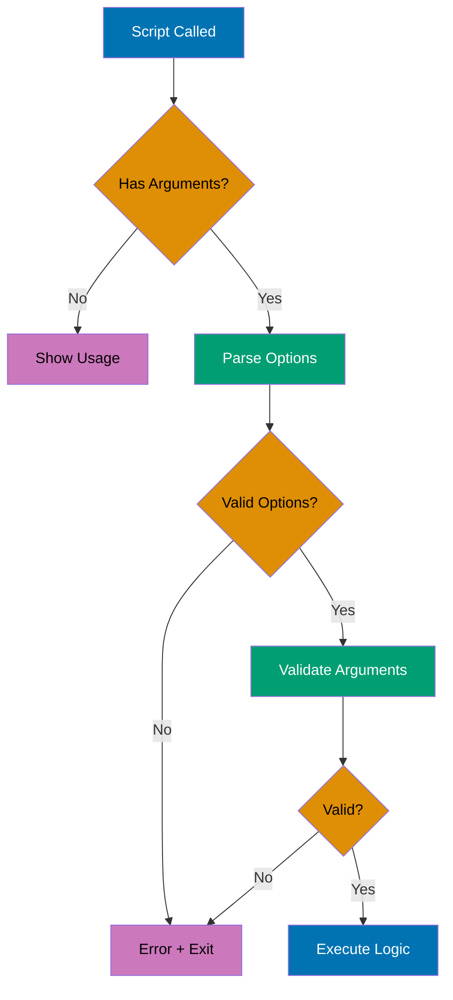
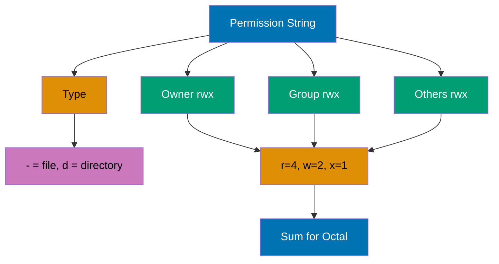
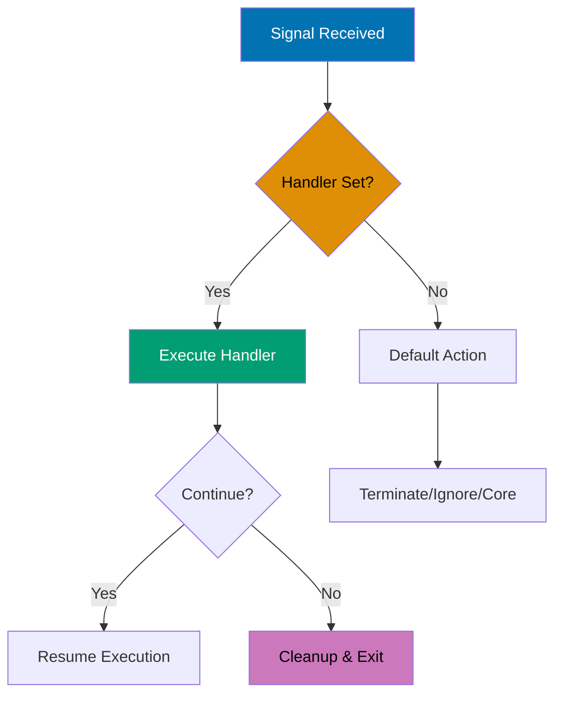

## Intermediate Level (40-75% Coverage)

This level covers intermediate shell concepts through 25 self-contained examples. Each example demonstrates production patterns used in automation, text processing, and system administration.

---

### Example 31: Text Processing (sed)

The `sed` (stream editor) command performs text transformations on files or streams, supporting substitution, deletion, insertion, and line-based operations.

```bash
# Basic substitution (first occurrence per line)
echo "hello world" | sed 's/world/universe/'
                                # => Output: hello universe
                                # => s/pattern/replacement/

# Global substitution (all occurrences)
echo "foo bar foo" | sed 's/foo/baz/g'
                                # => Output: baz bar baz
                                # => g flag: global (all matches per line)

# Substitute in file (preview)
sed 's/old/new/g' file.txt      # => Prints transformed output to stdout
                                # => Original file unchanged

# In-place editing
sed -i 's/old/new/g' file.txt   # => Modifies file.txt directly
                                # => -i: in-place (DANGEROUS - no undo!)

# In-place with backup
sed -i.bak 's/old/new/g' file.txt
                                # => Creates file.txt.bak before modifying
                                # => Safer than -i alone

# Delete lines matching pattern
sed '/^#/d' file.txt            # => Deletes lines starting with #
                                # => /pattern/d

# Delete line number
sed '3d' file.txt               # => Deletes line 3

# Delete range
sed '2,5d' file.txt             # => Deletes lines 2-5

# Print specific lines
sed -n '1,10p' file.txt         # => Prints lines 1-10 only
                                # => -n: suppress default output
                                # => p: print

# Multiple operations
sed -e 's/foo/bar/g' -e 's/baz/qux/g' file.txt
                                # => Applies both substitutions
                                # => -e: expression

# Practical: remove trailing whitespace
sed 's/[[:space:]]*$//' file.txt
                                # => Removes spaces/tabs at end of lines

# Practical: comment out lines
sed 's/^/# /' code.sh           # => Adds # at start of each line

# Practical: extract email addresses
sed -n 's/.*\([a-zA-Z0-9.]*@[a-zA-Z0-9.]*\).*/\1/p' contacts.txt
                                # => Extracts email patterns
```

**Key Takeaway**: Use `sed` for quick text transformations with `s/pattern/replacement/g` for global substitution, `/pattern/d` for deletion, and `-i.bak` for safe in-place editing - it's perfect for automated text processing in scripts.

**Why It Matters**: This shell scripting concept is fundamental for production automation and system administration. Understanding this pattern enables you to write more robust and maintainable scripts for deployment, monitoring, and infrastructure management tasks.

---

### Example 32: Text Processing (awk)

The `awk` command is a powerful text processing language for field-based data manipulation, pattern matching, and reporting - ideal for CSV, logs, and tabular data.

```bash
# Print specific field
echo "one two three" | awk '{print $2}'
                                # => Output: two
                                # => $2 is second field (space-separated)

# Print multiple fields
ps aux | awk '{print $1, $11}'  # => Prints user and command columns
                                # => $1: first field, $11: eleventh field

# Custom delimiter
awk -F':' '{print $1}' /etc/passwd
                                # => Prints usernames from /etc/passwd
                                # => -F':': field separator is colon

# Field count
echo "a b c d" | awk '{print NF}'
                                # => Output: 4
                                # => NF: number of fields

# Last field
echo "a b c d" | awk '{print $NF}'
                                # => Output: d
                                # => $NF: last field

# Pattern matching
awk '/error/ {print $0}' logfile.txt
                                # => Prints lines containing "error"
                                # => $0: entire line

# Conditional actions
awk '$3 > 100 {print $1, $3}' data.txt
                                # => Prints first and third fields if third > 100

# BEGIN and END blocks
awk 'BEGIN {sum=0} {sum+=$1} END {print sum}' numbers.txt
                                # => Sums first column
                                # => BEGIN: runs before processing
                                # => END: runs after processing

# Calculate average
awk '{sum+=$1; count++} END {print sum/count}' numbers.txt
                                # => Average of first column

# Multiple conditions
awk '$1 == "error" && $2 > 100 {print}' log.txt
                                # => Logical AND in condition

# Formatted output
awk '{printf "%-10s %5d\n", $1, $2}' data.txt
                                # => Left-align string, right-align number
                                # => printf for formatted output

# Practical: sum disk usage
du -b * | awk '{total+=$1} END {print total " bytes"}'
                                # => Total disk usage in bytes

# Practical: process CSV
awk -F',' '{print $2, $3}' data.csv
                                # => Extract columns 2 and 3 from CSV

# Practical: count occurrences
awk '{count[$1]++} END {for (word in count) print word, count[word]}' words.txt
                                # => Word frequency count
```

**Key Takeaway**: Use `awk` for field-based text processing with `$1, $2, ...` for columns, `-F` for custom delimiters, and `BEGIN/END` blocks for initialization/summary - it's more powerful than `cut` and ideal for log analysis and data extraction.

**Why It Matters**: This shell scripting concept is fundamental for production automation and system administration. Understanding this pattern enables you to write more robust and maintainable scripts for deployment, monitoring, and infrastructure management tasks.

---

### Example 33: Command Line Arguments and Parsing

Production scripts need robust argument parsing to handle options, flags, and validation. Use `getopts` for POSIX-compliant option parsing or manual parsing for flexibility.



```bash
#!/bin/bash

# Basic argument check
if [ $# -eq 0 ]; then
    echo "Usage: $0 <filename>"
    exit 1
fi

# Using getopts for option parsing
while getopts "vho:f:" opt; do
    case $opt in
        v)
            VERBOSE=true        # => -v flag (no argument)
            ;;
        h)
            echo "Usage: $0 [-v] [-o output] -f file"
            exit 0
            ;;
        o)
            OUTPUT="$OPTARG"    # => -o option (with argument)
            ;;
        f)
            FILE="$OPTARG"      # => -f option (required)
            ;;
        \?)
            echo "Invalid option: -$OPTARG"
            exit 1
            ;;
    esac
done

# Shift past parsed options
shift $((OPTIND-1))             # => Remaining arguments in $@

# Validate required arguments
if [ -z "$FILE" ]; then
    echo "Error: -f file is required"
    exit 1
fi

# Practical example: backup script with options
#!/bin/bash
set -e                          # => Exit on error

usage() {
    cat << EOF
Usage: $0 [OPTIONS] source destination

Options:
    -c          Compress backup
    -v          Verbose output
    -e <ext>    Exclude file extension
    -h          Show this help
EOF
    exit 1
}

COMPRESS=false
VERBOSE=false
EXCLUDE=""

while getopts "cve:h" opt; do
    case $opt in
        c) COMPRESS=true ;;
        v) VERBOSE=true ;;
        e) EXCLUDE="$OPTARG" ;;
        h) usage ;;
        ?) usage ;;
    esac
done

shift $((OPTIND-1))

if [ $# -ne 2 ]; then
    echo "Error: source and destination required"
    usage
fi

SOURCE="$1"
DEST="$2"

[ "$VERBOSE" = true ] && echo "Backing up $SOURCE to $DEST"

if [ "$COMPRESS" = true ]; then
    tar -czf "$DEST/backup.tar.gz" "$SOURCE"
else
    cp -r "$SOURCE" "$DEST"
fi

[ "$VERBOSE" = true ] && echo "Backup complete"
```

**Key Takeaway**: Use `getopts` for standard option parsing with flags and arguments, validate all inputs before processing, and provide clear usage messages - always check `$#` for argument count and exit with non-zero status on errors.

**Why It Matters**: This shell scripting concept is fundamental for production automation and system administration. Understanding this pattern enables you to write more robust and maintainable scripts for deployment, monitoring, and infrastructure management tasks.

---

### Example 34: Error Handling and Exit Codes

Robust scripts handle errors gracefully, validate inputs, log failures, and return meaningful exit codes. Use `set -e` for fail-fast behavior and trap for cleanup.

```bash
#!/bin/bash

# Strict mode (recommended for production)
set -e                          # => Exit immediately on error
set -u                          # => Exit on undefined variable
set -o pipefail                 # => Pipeline fails if any command fails

# Error handling function
error_exit() {
    echo "Error: $1" >&2        # => Print to stderr
    exit 1                      # => Exit with error code
}

# Validate file exists
[ -f "$config_file" ] || error_exit "Config file not found"

# Trap for cleanup on exit
cleanup() {
    echo "Cleaning up..."
    rm -f /tmp/tempfile_$$      # => $$ is script PID
}
trap cleanup EXIT               # => Run cleanup on script exit

# Trap specific signals
trap 'echo "Interrupted"; exit 130' INT
                                # => Handle Ctrl+C (SIGINT)

# Check command success
if ! grep -q "pattern" file.txt; then
    echo "Pattern not found"
    exit 1
fi

# Alternative: check exit code
grep -q "pattern" file.txt
if [ $? -ne 0 ]; then
    echo "Pattern not found"
    exit 1
fi

# Conditional execution with ||
command || error_exit "Command failed"

# Conditional execution with &&
command && echo "Success" || echo "Failed"

# Practical: database backup with error handling
#!/bin/bash
set -euo pipefail

BACKUP_DIR="/backup"
DB_NAME="production"
LOG_FILE="/var/log/backup.log"

log() {
    echo "[$(date '+%Y-%m-%d %H:%M:%S')] $1" | tee -a "$LOG_FILE"
}

error_exit() {
    log "ERROR: $1"
    exit 1
}

cleanup() {
    [ -f "$TEMP_FILE" ] && rm -f "$TEMP_FILE"
    log "Cleanup completed"
}

trap cleanup EXIT
trap 'error_exit "Script interrupted"' INT TERM

# Validate backup directory
[ -d "$BACKUP_DIR" ] || error_exit "Backup directory not found"

log "Starting backup of $DB_NAME"

# Create temporary file
TEMP_FILE=$(mktemp)             # => Create secure temp file

# Perform backup
if mysqldump "$DB_NAME" > "$TEMP_FILE"; then
    BACKUP_FILE="$BACKUP_DIR/${DB_NAME}_$(date +%Y%m%d_%H%M%S).sql"
    mv "$TEMP_FILE" "$BACKUP_FILE"
    log "Backup successful: $BACKUP_FILE"
else
    error_exit "Database backup failed"
fi

# Verify backup
if [ ! -s "$BACKUP_FILE" ]; then
    error_exit "Backup file is empty"
fi

log "Backup completed successfully"
exit 0
```

**Key Takeaway**: Use `set -euo pipefail` for strict error handling, trap for cleanup operations, and always validate inputs before processing - return exit code 0 for success and non-zero for errors, and log errors to stderr with `>&2`.

**Why It Matters**: Error handling prevents partial failures that leave systems in inconsistent states. Production scripts must handle errors gracefully to enable recovery and maintain system integrity.

---

### Example 35: Process Management (ps, kill, jobs)

Process management involves listing processes, monitoring resource usage, and controlling process lifecycle with signals for graceful shutdown or forceful termination.

```bash
# List all processes
ps aux                          # => Shows all processes with details
                                # => a: all users, u: user-oriented, x: include no-tty

# List processes for current user
ps -u $USER                     # => Shows only your processes

# Filter processes
ps aux | grep "python"          # => Find python processes
                                # => Add: | grep -v grep to exclude grep itself

# Process tree
ps auxf                         # => Forest view (tree structure)
                                # => f: ASCII art process tree

# Top - interactive process monitor
top                             # => Real-time process monitoring
                                # => Press q to quit, k to kill, M to sort by memory

# Find process by name
pgrep python                    # => Output: PIDs of python processes

pgrep -l python                 # => Output: PID and process name
                                # => -l: list format

# Kill process by PID
kill 1234                       # => Sends SIGTERM (graceful shutdown)
                                # => Process can catch and cleanup

# Force kill
kill -9 1234                    # => Sends SIGKILL (immediate termination)
                                # => -9: Cannot be caught or ignored
                                # => Use only when SIGTERM fails

# Kill by name
pkill python                    # => Kills all processes named python
                                # => Use carefully!

# Kill with pattern
pkill -f "python script.py"     # => Kills processes matching full command
                                # => -f: match full command line

# Check if process is running
if pgrep -x nginx > /dev/null; then
    echo "Nginx is running"
else
    echo "Nginx is not running"
fi                              # => -x: exact match

# Job control
command &                       # => Run in background
jobs                            # => List background jobs
fg %1                           # => Bring job 1 to foreground
bg %1                           # => Resume job 1 in background
kill %1                         # => Kill job 1

# Wait for process to finish
sleep 30 &
BGPID=$!                        # => $! is PID of last background job
wait $BGPID                     # => Wait for specific PID
echo "Background process completed"

# Practical: graceful service restart
#!/bin/bash

SERVICE_NAME="myapp"
PID_FILE="/var/run/myapp.pid"

# Get PID
if [ -f "$PID_FILE" ]; then
    PID=$(cat "$PID_FILE")

    # Check if process exists
    if kill -0 "$PID" 2>/dev/null; then
        echo "Stopping $SERVICE_NAME (PID: $PID)"
        kill "$PID"             # => Send SIGTERM

        # Wait up to 10 seconds
        for i in {1..10}; do
            if ! kill -0 "$PID" 2>/dev/null; then
                echo "Process stopped gracefully"
                break
            fi
            sleep 1
        done

        # Force kill if still running
        if kill -0 "$PID" 2>/dev/null; then
            echo "Forcing stop..."
            kill -9 "$PID"
        fi
    fi
fi

# Start new process
./myapp &
echo $! > "$PID_FILE"
echo "Service started"
```

**Key Takeaway**: Use `ps aux` to list processes, `pgrep/pkill` for name-based operations, and `kill` with SIGTERM (default) before SIGKILL (-9) - always verify process existence with `kill -0` before sending signals, and use PID files for reliable service management.

**Why It Matters**: This shell scripting concept is fundamental for production automation and system administration. Understanding this pattern enables you to write more robust and maintainable scripts for deployment, monitoring, and infrastructure management tasks.

---

### Example 36: File Permissions and Ownership (chmod, chown)

Linux file permissions control read, write, and execute access for owner, group, and others. Permissions are critical for security and proper system operation.



```bash
# View permissions
ls -l file.txt                  # => Output: -rw-r--r-- 1 user group 1234 Dec 30 file.txt
                                # => Permission breakdown:
                                # => -: file type (- = file, d = directory)
                                # => rw-: owner (read, write, no execute)
                                # => r--: group (read only)
                                # => r--: others (read only)

# Permission values
# r (read) = 4: View file contents or list directory
# w (write) = 2: Modify file or create/delete files in directory
# x (execute) = 1: Run file as program or enter directory

# Octal notation (most common)
chmod 644 file.txt              # => rw-r--r-- (owner: rw, group: r, others: r)
                                # => 6=4+2 (rw-), 4 (r--), 4 (r--)

chmod 755 script.sh             # => rwxr-xr-x (owner: rwx, group: r-x, others: r-x)
                                # => 7=4+2+1 (rwx), 5=4+1 (r-x), 5=4+1 (r-x)

chmod 700 private.sh            # => rwx------ (owner only)
                                # => 7=4+2+1 (rwx), 0 (---), 0 (---)

# Symbolic notation
chmod u+x script.sh             # => Add execute for user/owner
                                # => u=user, g=group, o=others, a=all

chmod go-w file.txt             # => Remove write for group and others
                                # => g=group, o=others

chmod a+r file.txt              # => Add read for all
                                # => a=all (user, group, others)

chmod u=rwx,g=rx,o=r file.txt   # => Set exact permissions
                                # => Equivalent to chmod 754

# Recursive permissions
chmod -R 755 /var/www/html      # => Sets 755 on directory and all contents
                                # => -R: recursive

# Make script executable
chmod +x deploy.sh              # => Adds execute for all users
                                # => Now can run: ./deploy.sh

# Change ownership
chown alice file.txt            # => Changes owner to alice
                                # => Requires root/sudo

chown alice:developers file.txt # => Changes owner to alice, group to developers

# Change group only
chgrp developers file.txt       # => Changes group to developers

# Recursive ownership
chown -R www-data:www-data /var/www
                                # => Changes owner and group recursively

# Practical: web server permissions
# Files: 644 (rw-r--r--)
find /var/www/html -type f -exec chmod 644 {} \;

# Directories: 755 (rwxr-xr-x)
find /var/www/html -type d -exec chmod 755 {} \;

# Uploads directory (writable by web server)
chmod 775 /var/www/html/uploads
chown www-data:www-data /var/www/html/uploads

# Practical: secure private key
chmod 600 ~/.ssh/id_rsa         # => Only owner can read/write
                                # => SSH requires this for security
```

**Key Takeaway**: Use octal notation (644, 755, 700) for absolute permission sets, symbolic notation (u+x, go-w) for relative changes - remember that 644 is standard for files, 755 for directories/executables, and 600 for private keys, and always verify permissions after changes.

**Why It Matters**: This shell scripting concept is fundamental for production automation and system administration. Understanding this pattern enables you to write more robust and maintainable scripts for deployment, monitoring, and infrastructure management tasks.

---

### Example 37: Archiving and Compression (tar, gzip, zip)

Archiving combines multiple files into one file, while compression reduces file size. The `tar` command creates archives, often combined with `gzip` or `bzip2` for compression.

```bash
# Create tar archive
tar -cf archive.tar files/      # => Creates archive.tar from files/ directory
                                # => -c: create, -f: filename

# Create compressed tar (gzip)
tar -czf archive.tar.gz files/  # => Creates compressed archive
                                # => -z: gzip compression
                                # => Extension: .tar.gz or .tgz

# Create compressed tar (bzip2)
tar -cjf archive.tar.bz2 files/ # => Better compression than gzip
                                # => -j: bzip2 compression
                                # => Extension: .tar.bz2

# Create compressed tar (xz)
tar -cJf archive.tar.xz files/  # => Best compression (slower)
                                # => -J: xz compression

# Extract tar archive
tar -xf archive.tar             # => Extracts to current directory
                                # => -x: extract

# Extract compressed tar
tar -xzf archive.tar.gz         # => Extracts gzip-compressed archive
tar -xjf archive.tar.bz2        # => Extracts bzip2-compressed archive

# Extract to specific directory
tar -xzf archive.tar.gz -C /tmp # => Extracts to /tmp
                                # => -C: change directory

# List archive contents
tar -tzf archive.tar.gz         # => Lists files without extracting
                                # => -t: list, -z: gzip

# Verbose output
tar -czfv backup.tar.gz data/   # => Shows files as they're archived
                                # => -v: verbose

# Exclude files
tar -czf backup.tar.gz --exclude='*.log' --exclude='.git' project/
                                # => Excludes matching files/directories

# Compress existing file (gzip)
gzip large_file.txt             # => Creates large_file.txt.gz
                                # => Original file is removed!

# Preserve original
gzip -k large_file.txt          # => Keeps original file
                                # => -k: keep

# Decompress gzip
gunzip file.txt.gz              # => Restores file.txt
gzip -d file.txt.gz             # => Same as gunzip

# Zip (compatible with Windows)
zip -r archive.zip files/       # => Creates zip archive
                                # => -r: recursive

# Unzip
unzip archive.zip               # => Extracts to current directory

# Unzip to directory
unzip archive.zip -d /tmp       # => Extracts to /tmp

# Practical: backup with date
backup_name="backup_$(date +%Y%m%d_%H%M%S).tar.gz"
tar -czf "$backup_name" /data
echo "Backup created: $backup_name"

# Practical: incremental backup
tar -czf backup_full.tar.gz --listed-incremental=snapshot.file /data
                                # => Creates snapshot for incremental backups

# Practical: split large archive
tar -czf - /data | split -b 100M - backup.tar.gz.part
                                # => Splits into 100MB chunks
                                # => Restore: cat backup.tar.gz.part* | tar -xzf -
```

**Key Takeaway**: Use `tar -czf` to create gzip-compressed archives, `tar -xzf` to extract, and `-v` for verbose output - remember that `tar` preserves permissions and directory structure, making it ideal for backups, and gzip removes original files unless `-k` is used.

**Why It Matters**: This shell scripting concept is fundamental for production automation and system administration. Understanding this pattern enables you to write more robust and maintainable scripts for deployment, monitoring, and infrastructure management tasks.

---

### Example 38: Network Operations (curl, wget, ssh)

Network commands download files, interact with APIs, and access remote systems. The `curl` and `wget` commands handle HTTP requests, while `ssh` provides secure remote access.

```bash
# Download file with wget
wget https://example.com/file.txt
                                # => Downloads to current directory
                                # => Shows progress, resumes on interruption

# Download with custom name
wget -O custom_name.txt https://example.com/file.txt
                                # => -O: output filename

# Download multiple files
wget -i urls.txt                # => Downloads all URLs from file
                                # => -i: input file

# Basic HTTP request with curl
curl https://api.example.com/data
                                # => Prints response to stdout

# Save to file
curl -o output.json https://api.example.com/data
                                # => -o: output file

# Follow redirects
curl -L https://github.com/file # => Follows HTTP redirects
                                # => -L: location

# Show headers
curl -I https://example.com     # => Shows HTTP headers only
                                # => -I: head request

# Send POST request
curl -X POST -d "name=Alice&age=30" https://api.example.com/users
                                # => -X: HTTP method, -d: data

# Send JSON data
curl -X POST \
  -H "Content-Type: application/json" \
  -d '{"name":"Alice","age":30}' \
  https://api.example.com/users
                                # => -H: header

# Authentication
curl -u username:password https://api.example.com/protected
                                # => -u: basic auth

# Download with progress bar
curl -# -O https://example.com/large_file.zip
                                # => -#: progress bar, -O: save with original name

# SSH - remote command execution
ssh user@server 'ls /var/log'   # => Executes command on remote server
                                # => Output returned to local terminal

# SSH with key
ssh -i ~/.ssh/id_rsa user@server
                                # => -i: identity file (private key)

# Copy file to remote (scp)
scp file.txt user@server:/path/to/destination
                                # => Copies file.txt to remote server

# Copy from remote
scp user@server:/path/to/file.txt local_dir/
                                # => Copies from remote to local

# Copy directory recursively
scp -r directory/ user@server:/path/
                                # => -r: recursive

# Rsync (better than scp for large transfers)
rsync -avz /local/path/ user@server:/remote/path/
                                # => -a: archive, -v: verbose, -z: compress
                                # => Faster than scp, resumes on interruption

# Practical: API health check
if curl -f -s -o /dev/null https://api.example.com/health; then
    echo "API is up"
else
    echo "API is down"
fi                              # => -f: fail on HTTP errors, -s: silent

# Practical: download and extract
curl -L https://releases.example.com/app.tar.gz | tar -xzf -
                                # => Downloads and extracts in one command

# Practical: remote backup
ssh user@server 'tar -czf - /data' > backup.tar.gz
                                # => Creates remote tar and streams to local file
```

**Key Takeaway**: Use `curl` for API interactions and flexible HTTP requests, `wget` for downloading files with resume support, and `ssh/scp/rsync` for secure remote access and file transfer - remember that `curl` writes to stdout by default while `wget` saves to files.

**Why It Matters**: This shell scripting concept is fundamental for production automation and system administration. Understanding this pattern enables you to write more robust and maintainable scripts for deployment, monitoring, and infrastructure management tasks.

---

### Example 39: Scheduling Tasks (cron, at)

Task scheduling automates recurring jobs with `cron` or one-time execution with `at`. Cron is essential for maintenance tasks, backups, and periodic monitoring.

```bash
# View current user's crontab
crontab -l                      # => Lists scheduled cron jobs
                                # => -l: list

# Edit crontab
crontab -e                      # => Opens editor to modify cron jobs
                                # => -e: edit

# Crontab format
# Minute Hour Day Month DayOfWeek Command
# 0-59   0-23 1-31 1-12  0-6      (0=Sunday)

# Examples of cron schedules:
# 0 2 * * *    /backup.sh       # => Daily at 2:00 AM
# 30 */6 * * * /check.sh        # => Every 6 hours at :30
# 0 0 * * 0    /weekly.sh       # => Weekly on Sunday at midnight
# 0 9 1 * *    /monthly.sh      # => Monthly on 1st at 9:00 AM
# */15 * * * * /monitor.sh      # => Every 15 minutes

# Practical crontab entries
crontab -e                      # => Add these lines:

# Backup database daily at 2 AM
0 2 * * * /usr/local/bin/backup_db.sh >> /var/log/backup.log 2>&1

# Clean temp files every Sunday at 3 AM
0 3 * * 0 find /tmp -type f -mtime +7 -delete

# Check disk space every hour
0 * * * * df -h | mail -s "Disk Report" admin@example.com

# Special cron strings
@reboot    /startup.sh          # => Run at system boot
@daily     /daily_task.sh       # => Run daily at midnight
@hourly    /hourly_task.sh      # => Run at start of every hour
@weekly    /weekly_task.sh      # => Run weekly (Sunday midnight)
@monthly   /monthly_task.sh     # => Run monthly (1st at midnight)

# One-time task with at
echo "/backup.sh" | at 14:30    # => Run /backup.sh at 2:30 PM today

# Schedule for specific date
echo "/backup.sh" | at 2:00 AM 2025-12-31
                                # => Run at specific date/time

# List scheduled at jobs
atq                             # => Lists pending at jobs

# Remove at job
atrm 1                          # => Removes job number 1

# Practical: maintenance script with logging
#!/bin/bash
# Add to crontab: 0 3 * * * /path/to/maintenance.sh

LOGFILE="/var/log/maintenance.log"

log() {
    echo "[$(date '+%Y-%m-%d %H:%M:%S')] $1" >> "$LOGFILE"
}

log "Starting maintenance"

# Clean old logs (older than 30 days)
find /var/log -name "*.log" -mtime +30 -delete
log "Cleaned old logs"

# Optimize database
mysqlcheck --optimize --all-databases
log "Optimized databases"

# Update package list
apt-get update -qq
log "Updated package list"

log "Maintenance completed"
```

**Key Takeaway**: Use cron for recurring tasks with `crontab -e` to edit schedules, and `at` for one-time execution - always redirect cron output to log files for debugging, and remember that cron runs with limited environment variables so use absolute paths.

**Why It Matters**: This shell scripting concept is fundamental for production automation and system administration. Understanding this pattern enables you to write more robust and maintainable scripts for deployment, monitoring, and infrastructure management tasks.

---

### Example 40: Script Best Practices

Production scripts require robust error handling, logging, argument validation, and clear documentation. Following best practices ensures reliability and maintainability.

```bash
#!/bin/bash
#
# Script: backup_database.sh
# Description: Automated database backup with compression and rotation
# Author: DevOps Team
# Date: 2025-12-30
# Usage: ./backup_database.sh [-v] [-d database] [-o output_dir]
#

# Strict error handling
set -euo pipefail               # => Exit on error, undefined vars, pipe failures

# Configuration
readonly SCRIPT_NAME=$(basename "$0")
readonly SCRIPT_DIR=$(dirname "$(readlink -f "$0")")
readonly LOG_FILE="/var/log/${SCRIPT_NAME%.sh}.log"
readonly BACKUP_DIR="${BACKUP_DIR:-/backup}"
readonly RETENTION_DAYS=7

# Global variables
VERBOSE=false
DATABASE=""
OUTPUT_DIR="$BACKUP_DIR"

# Logging function
log() {
    local level="$1"
    shift
    local message="$*"
    local timestamp=$(date '+%Y-%m-%d %H:%M:%S')

    echo "[$timestamp] [$level] $message" | tee -a "$LOG_FILE"

    if [ "$level" = "ERROR" ]; then
        echo "[$timestamp] [$level] $message" >&2
    fi
}

# Error handling
error_exit() {
    log "ERROR" "$1"
    exit 1
}

# Cleanup on exit
cleanup() {
    local exit_code=$?

    if [ $exit_code -ne 0 ]; then
        log "ERROR" "Script failed with exit code $exit_code"
    fi

    # Remove temp files
    [ -f "$TEMP_FILE" ] && rm -f "$TEMP_FILE"

    log "INFO" "Cleanup completed"
}
trap cleanup EXIT

# Handle interrupts
interrupted() {
    log "WARNING" "Script interrupted by user"
    exit 130
}
trap interrupted INT TERM

# Usage information
usage() {
    cat << EOF
Usage: $SCRIPT_NAME [OPTIONS]

Automated database backup with compression and rotation.

Options:
    -v              Verbose output
    -d DATABASE     Database name (required)
    -o DIR          Output directory (default: $BACKUP_DIR)
    -h              Show this help message

Examples:
    $SCRIPT_NAME -d production
    $SCRIPT_NAME -v -d mydb -o /mnt/backup

EOF
    exit 0
}

# Parse command line arguments
parse_args() {
    while getopts "vd:o:h" opt; do
        case $opt in
            v)
                VERBOSE=true
                ;;
            d)
                DATABASE="$OPTARG"
                ;;
            o)
                OUTPUT_DIR="$OPTARG"
                ;;
            h)
                usage
                ;;
            \?)
                error_exit "Invalid option: -$OPTARG"
                ;;
            :)
                error_exit "Option -$OPTARG requires an argument"
                ;;
        esac
    done

    shift $((OPTIND-1))
}

# Validate arguments
validate_args() {
    if [ -z "$DATABASE" ]; then
        error_exit "Database name is required (-d option)"
    fi

    if [ ! -d "$OUTPUT_DIR" ]; then
        error_exit "Output directory does not exist: $OUTPUT_DIR"
    fi

    if [ ! -w "$OUTPUT_DIR" ]; then
        error_exit "Output directory is not writable: $OUTPUT_DIR"
    fi
}

# Check prerequisites
check_prerequisites() {
    local required_commands=("mysqldump" "gzip")

    for cmd in "${required_commands[@]}"; do
        if ! command -v "$cmd" &> /dev/null; then
            error_exit "Required command not found: $cmd"
        fi
    done
}

# Rotate old backups
rotate_backups() {
    log "INFO" "Rotating backups older than $RETENTION_DAYS days"

    find "$OUTPUT_DIR" -name "${DATABASE}_*.sql.gz" -mtime +$RETENTION_DAYS -delete

    local deleted_count=$(find "$OUTPUT_DIR" -name "${DATABASE}_*.sql.gz" -mtime +$RETENTION_DAYS | wc -l)

    [ "$VERBOSE" = true ] && log "INFO" "Deleted $deleted_count old backup(s)"
}

# Main backup function
backup_database() {
    local backup_file="${OUTPUT_DIR}/${DATABASE}_$(date +%Y%m%d_%H%M%S).sql.gz"

    log "INFO" "Starting backup of database: $DATABASE"

    # Create backup with compression
    if mysqldump --single-transaction --quick "$DATABASE" | gzip > "$backup_file"; then
        local size=$(du -h "$backup_file" | cut -f1)
        log "INFO" "Backup successful: $backup_file (size: $size)"
    else
        error_exit "Backup failed for database: $DATABASE"
    fi

    # Verify backup integrity
    if [ ! -s "$backup_file" ]; then
        error_exit "Backup file is empty: $backup_file"
    fi

    # Test gzip integrity
    if ! gzip -t "$backup_file"; then
        error_exit "Backup file is corrupted: $backup_file"
    fi
}

# Main execution
main() {
    log "INFO" "Starting $SCRIPT_NAME"

    parse_args "$@"
    validate_args
    check_prerequisites

    backup_database
    rotate_backups

    log "INFO" "$SCRIPT_NAME completed successfully"
}

# Run main function
main "$@"
```

**Key Takeaway**: Use `set -euo pipefail` for strict error handling, create dedicated logging and error functions, validate all inputs, provide usage documentation, and implement cleanup with trap - always use readonly for constants, check prerequisites before execution, and return meaningful exit codes.

**Why It Matters**: Error handling prevents partial failures that leave systems in inconsistent states. Production scripts must handle errors gracefully to enable recovery and maintain system integrity.

---

### Example 41: Find Command Mastery

The `find` command searches for files based on name, type, size, time, permissions, and more. It's essential for locating files and performing bulk operations in scripts.

```bash
# Find by name
find /home -name "*.log"         # => Find all .log files in /home
                                 # => -name: case-sensitive match

# Case-insensitive name
find /home -iname "readme*"      # => Matches README, readme, Readme
                                 # => -iname: case-insensitive

# Find by type
find /var -type f                # => Find regular files only
                                 # => -type f: files, d: directories, l: symlinks

find /var -type d -name "log*"   # => Find directories starting with "log"

# Find by size
find . -size +100M               # => Files larger than 100MB
                                 # => +: greater than, -: less than

find . -size -1k                 # => Files smaller than 1KB
                                 # => k: KB, M: MB, G: GB

# Find by time
find . -mtime -7                 # => Modified in last 7 days
                                 # => -mtime: modification time in days

find . -mmin -60                 # => Modified in last 60 minutes
                                 # => -mmin: modification time in minutes

find . -atime +30                # => Accessed more than 30 days ago
                                 # => -atime: access time

# Find by permissions
find . -perm 755                 # => Exact permission match
find . -perm -u=x                # => User has execute permission
find . -perm /u=x                # => User OR group OR other has execute

# Find and execute
find . -name "*.tmp" -exec rm {} \;
                                 # => Delete all .tmp files
                                 # => {} is placeholder for found file
                                 # => \; terminates -exec

# Find with -exec (more efficient)
find . -name "*.log" -exec grep "error" {} +
                                 # => + passes multiple files to command
                                 # => More efficient than \;

# Combine conditions
find . -name "*.py" -size +10k   # => AND: both conditions must match

find . -name "*.py" -o -name "*.sh"
                                 # => OR: either condition matches
                                 # => -o: logical OR

# Negation
find . -not -name "*.bak"        # => Exclude .bak files
find . ! -name "*.bak"           # => Same as above

# Limit depth
find . -maxdepth 2 -name "*.conf"
                                 # => Only search 2 levels deep

# Practical: clean old files
find /tmp -type f -mtime +30 -delete
                                 # => Delete files older than 30 days

# Practical: find large files
find / -type f -size +500M 2>/dev/null | head -20
                                 # => List 20 largest files over 500MB

# Practical: fix permissions
find /var/www -type f -exec chmod 644 {} +
find /var/www -type d -exec chmod 755 {} +
                                 # => Set proper web permissions
```

**Key Takeaway**: Use `find` with `-name` for pattern matching, `-type` for file types, `-size` and `-mtime` for filtering, and `-exec` for actions - combine conditions with `-a` (and), `-o` (or), and `!` (not) for complex queries.

**Why It Matters**: The `find` command is essential for locating files, cleaning up storage, fixing permissions, and performing bulk operations across directory trees in production environments.

---

### Example 42: Regular Expressions in Shell

Regular expressions enable powerful pattern matching in shell scripts using `grep`, `sed`, and `[[ =~ ]]`. They're essential for text validation, extraction, and transformation.

```mermaid
%% Regex components
graph TD
    A[Regular Expression] --> B[Literals]
    A --> C[Metacharacters]
    A --> D[Quantifiers]
    A --> E[Anchors]

    B --> F[abc - exact match]
    C --> G[. - any char]
    C --> H[[] - char class]
    D --> I[* + ? - repetition]
    E --> J[^ $ - position]

    style A fill:#0173B2,color:#fff
    style B fill:#DE8F05,color:#000
    style C fill:#029E73,color:#fff
    style D fill:#CC78BC,color:#000
    style E fill:#CA9161,color:#000
```

```bash
# Basic grep with regex
grep "error" logfile.txt         # => Lines containing "error"
grep -E "error|warning" log.txt  # => Extended regex: error OR warning
                                 # => -E: extended regex (ERE)

# Anchors
grep "^Start" file.txt           # => Lines starting with "Start"
                                 # => ^: start of line
grep "end$" file.txt             # => Lines ending with "end"
                                 # => $: end of line
grep "^$" file.txt               # => Empty lines

# Character classes
grep "[0-9]" file.txt            # => Lines with any digit
grep "[a-zA-Z]" file.txt         # => Lines with any letter
grep "[^0-9]" file.txt           # => Lines with non-digits
                                 # => [^...]: negated class

# Quantifiers
grep -E "ab*c" file.txt          # => a, zero or more b, c (ac, abc, abbc)
grep -E "ab+c" file.txt          # => a, one or more b, c (abc, abbc)
grep -E "ab?c" file.txt          # => a, zero or one b, c (ac, abc)
grep -E "a{3}" file.txt          # => Exactly 3 a's
grep -E "a{2,4}" file.txt        # => 2 to 4 a's

# Special characters
grep "\." file.txt              # => Literal dot (escape special chars)
grep -E "\$[0-9]+" file.txt     # => Dollar sign followed by digits

# Word boundaries
grep -w "error" file.txt         # => Whole word "error" only
                                 # => Won't match "errors" or "error_code"

# Case insensitive
grep -i "error" file.txt         # => Matches ERROR, Error, error

# Bash regex matching
email="user@example.com"
if [[ "$email" =~ ^[a-zA-Z0-9._%+-]+@[a-zA-Z0-9.-]+\.[a-zA-Z]{2,}$ ]]; then
    echo "Valid email"
fi                               # => =~ for regex match in bash

# Extract matched portion
if [[ "$text" =~ ([0-9]+) ]]; then
    echo "Number found: ${BASH_REMATCH[1]}"
fi                               # => BASH_REMATCH contains captures

# Sed with regex
sed 's/[0-9]\+/NUMBER/g' file.txt
                                 # => Replace all digit sequences

# Practical: validate IP address
ip="192.168.1.1"
if [[ "$ip" =~ ^([0-9]{1,3}\.){3}[0-9]{1,3}$ ]]; then
    echo "Valid IP format"
fi

# Practical: extract version numbers
grep -oE "[0-9]+\.[0-9]+\.[0-9]+" file.txt
                                 # => -o: only matching portion
                                 # => Matches: 1.2.3, 10.20.30

# Practical: remove HTML tags
sed 's/<[^>]*>//g' page.html     # => Strips HTML tags
```

**Key Takeaway**: Use anchors (`^$`) for position, character classes (`[]`) for sets, quantifiers (`*+?{}`) for repetition, and `-E` for extended regex - remember that `[[ =~ ]]` enables regex in bash with `BASH_REMATCH` for captures.

**Why It Matters**: Regular expressions enable powerful pattern matching for log analysis, input validation, text extraction, and data transformation that would be tedious or impossible with simple string matching.

---

### Example 43: Array Manipulation

Bash arrays store multiple values in a single variable. They're essential for handling lists of files, arguments, and dynamic data in scripts.

```bash
# Declare indexed array
fruits=("apple" "banana" "cherry")
                                 # => Index 0, 1, 2

# Alternative declaration
declare -a numbers
numbers[0]=10
numbers[1]=20
numbers[2]=30

# Access elements
echo "${fruits[0]}"              # => Output: apple
echo "${fruits[1]}"              # => Output: banana

# Access all elements
echo "${fruits[@]}"              # => Output: apple banana cherry
                                 # => @ expands each element

echo "${fruits[*]}"              # => Output: apple banana cherry
                                 # => * joins as single string (with IFS)

# Array length
echo "${#fruits[@]}"             # => Output: 3
                                 # => # prefix for length

# Element length
echo "${#fruits[0]}"             # => Output: 5 (length of "apple")

# Append elements
fruits+=("date")                 # => Adds "date" to end
fruits+=("elderberry" "fig")     # => Adds multiple elements

# Slice array
echo "${fruits[@]:1:2}"          # => Output: banana cherry
                                 # => Start at index 1, get 2 elements

# All indices
echo "${!fruits[@]}"             # => Output: 0 1 2 3 4 5
                                 # => ! prefix for indices

# Iterate over array
for fruit in "${fruits[@]}"; do
    echo "Fruit: $fruit"
done

# Iterate with index
for i in "${!fruits[@]}"; do
    echo "Index $i: ${fruits[$i]}"
done

# Remove element
unset 'fruits[1]'                # => Removes index 1 (leaves gap)

# Copy array
copy=("${fruits[@]}")            # => Creates copy of array

# Join elements
IFS=','
echo "${fruits[*]}"              # => Output: apple,cherry,date,...
                                 # => Joins with IFS separator

# Split string to array
IFS=',' read -ra parts <<< "a,b,c"
echo "${parts[1]}"               # => Output: b

# Practical: process file list
files=($(find . -name "*.sh"))
echo "Found ${#files[@]} shell scripts"

for file in "${files[@]}"; do
    echo "Processing: $file"
    # Process each file
done

# Practical: command line args as array
args=("$@")                      # => Store all arguments
for arg in "${args[@]}"; do
    echo "Argument: $arg"
done

# Practical: filter array
filtered=()
for item in "${fruits[@]}"; do
    if [[ "$item" == a* ]]; then
        filtered+=("$item")
    fi
done
echo "Filtered: ${filtered[@]}"  # => Items starting with 'a'
```

**Key Takeaway**: Use `${array[@]}` to expand all elements, `${#array[@]}` for length, `${!array[@]}` for indices, and `+=()` to append - always quote `"${array[@]}"` to preserve elements with spaces.

**Why It Matters**: Arrays enable processing of file lists, command arguments, and dynamic data without creating temporary files or relying on error-prone string splitting.

---

### Example 44: Associative Arrays

Associative arrays (hash maps) store key-value pairs, enabling lookups by name rather than index. They're useful for configuration, counters, and data mapping.

```bash
# Declare associative array (bash 4+)
declare -A config                # => -A for associative array

# Assign values
config["host"]="localhost"
config["port"]=8080
config["debug"]="true"

# Alternative initialization
declare -A colors=(
    ["red"]="#FF0000"
    ["green"]="#00FF00"
    ["blue"]="#0000FF"
)

# Access values
echo "${config[host]}"           # => Output: localhost
echo "${config[port]}"           # => Output: 8080

# Check if key exists
if [[ -v config["host"] ]]; then
    echo "Host is set"
fi                               # => -v tests if variable is set

# Default value if key missing
host="${config[host]:-127.0.0.1}"
                                 # => Use 127.0.0.1 if key missing

# Get all keys
echo "${!config[@]}"             # => Output: host port debug
                                 # => ! prefix for keys

# Get all values
echo "${config[@]}"              # => Output: localhost 8080 true

# Count entries
echo "${#config[@]}"             # => Output: 3

# Iterate over keys
for key in "${!config[@]}"; do
    echo "$key = ${config[$key]}"
done

# Add/update entries
config["timeout"]=30             # => Adds new key
config["port"]=9000              # => Updates existing key

# Remove entry
unset 'config["debug"]'          # => Removes key

# Clear all
unset config
declare -A config                # => Re-declare empty

# Practical: count occurrences
declare -A count
while read -r word; do
    ((count["$word"]++))         # => Increment counter for word
done < words.txt

for word in "${!count[@]}"; do
    echo "$word: ${count[$word]}"
done

# Practical: configuration file parsing
declare -A settings
while IFS='=' read -r key value; do
    # Skip comments and empty lines
    [[ "$key" =~ ^#.*$ || -z "$key" ]] && continue
    settings["$key"]="$value"
done < config.ini

echo "Database: ${settings[database]}"

# Practical: error code mapping
declare -A errors=(
    [1]="File not found"
    [2]="Permission denied"
    [3]="Network error"
    [4]="Timeout"
)

exit_code=2
echo "Error: ${errors[$exit_code]:-Unknown error}"
```

**Key Takeaway**: Use `declare -A` for associative arrays, `${array[key]}` to access values, `${!array[@]}` for all keys, and `-v` to check existence - associative arrays require bash 4.0+.

**Why It Matters**: Associative arrays enable O(1) lookups by key, making them ideal for configuration management, counting, caching, and mapping values without complex if-else chains.

---

### Example 45: String Manipulation

Bash provides powerful string manipulation through parameter expansion, enabling substring extraction, replacement, and transformation without external commands.

```bash
string="Hello, World!"

# String length
echo "${#string}"                # => Output: 13
                                 # => # prefix for length

# Substring extraction
echo "${string:0:5}"             # => Output: Hello
                                 # => :start:length

echo "${string:7}"               # => Output: World!
                                 # => From index 7 to end

echo "${string: -6}"             # => Output: World!
                                 # => Last 6 characters (note space before -)

# Pattern removal (from start)
file="backup.tar.gz"
echo "${file#*.}"                # => Output: tar.gz
                                 # => # removes shortest match from start

echo "${file##*.}"               # => Output: gz
                                 # => ## removes longest match from start

# Pattern removal (from end)
echo "${file%.*}"                # => Output: backup.tar
                                 # => % removes shortest match from end

echo "${file%%.*}"               # => Output: backup
                                 # => %% removes longest match from end

# Replacement
text="foo bar foo baz"
echo "${text/foo/FOO}"           # => Output: FOO bar foo baz
                                 # => Replace first occurrence

echo "${text//foo/FOO}"          # => Output: FOO bar FOO baz
                                 # => Replace all occurrences

# Replace at start/end
echo "${text/#foo/START}"        # => Output: START bar foo baz
                                 # => # replaces at start only

echo "${text/%baz/END}"          # => Output: foo bar foo END
                                 # => % replaces at end only

# Case conversion (bash 4+)
name="John Doe"
echo "${name^^}"                 # => Output: JOHN DOE
                                 # => ^^ uppercase all

echo "${name,,}"                 # => Output: john doe
                                 # => ,, lowercase all

echo "${name^}"                  # => Output: John doe
                                 # => ^ uppercase first char

# Default values
echo "${undefined:-default}"     # => Output: default
                                 # => Use default if unset/null

echo "${undefined:=default}"     # => Output: default
                                 # => Set and use default if unset/null

echo "${undefined:?Error message}"
                                 # => Exits with error if unset/null

# Practical: extract filename
path="/home/user/documents/file.txt"
filename="${path##*/}"           # => file.txt
dirname="${path%/*}"             # => /home/user/documents
extension="${filename##*.}"      # => txt
basename="${filename%.*}"        # => file

# Practical: sanitize input
user_input="Hello   World"
clean="${user_input// /_}"       # => Hello___World
                                 # => Replace spaces with underscores

# Practical: URL parsing
url="https://example.com:8080/path"
protocol="${url%%://*}"          # => https
rest="${url#*://}"               # => example.com:8080/path
host="${rest%%/*}"               # => example.com:8080
path_part="${rest#*/}"           # => path
```

**Key Takeaway**: Use `${#var}` for length, `${var:start:len}` for substrings, `#/##` to remove from start, `%/%%` to remove from end, and `/` for replacement - these are faster than calling `sed` or `awk`.

**Why It Matters**: String manipulation with parameter expansion is significantly faster than spawning external processes, making scripts more efficient and portable across systems.

---

### Example 46: Arithmetic Operations

Bash supports arithmetic operations using `$(( ))`, `let`, and `(( ))` for calculations without external tools like `bc` or `expr`.

```bash
# Arithmetic expansion
result=$((5 + 3))
echo "$result"                   # => Output: 8

# All operations
a=10
b=3
echo $((a + b))                  # => Addition: 13
echo $((a - b))                  # => Subtraction: 7
echo $((a * b))                  # => Multiplication: 30
echo $((a / b))                  # => Integer division: 3
echo $((a % b))                  # => Modulo: 1
echo $((a ** b))                 # => Exponentiation: 1000

# Increment/decrement
((a++))                          # => Post-increment
echo "$a"                        # => Output: 11

((++a))                          # => Pre-increment
echo "$a"                        # => Output: 12

((a--))                          # => Post-decrement
((--a))                          # => Pre-decrement

# Compound assignment
((a += 5))                       # => a = a + 5
((a -= 3))                       # => a = a - 3
((a *= 2))                       # => a = a * 2
((a /= 4))                       # => a = a / 4

# Comparison in arithmetic context
if ((a > 5)); then
    echo "a is greater than 5"
fi

# Ternary operator
max=$(( a > b ? a : b ))
echo "Max: $max"                 # => Output: larger of a or b

# Bitwise operations
echo $((5 & 3))                  # => AND: 1
echo $((5 | 3))                  # => OR: 7
echo $((5 ^ 3))                  # => XOR: 6
echo $((~5))                     # => NOT: -6
echo $((5 << 2))                 # => Left shift: 20
echo $((20 >> 2))                # => Right shift: 5

# Hexadecimal and octal
echo $((0xFF))                   # => Hex: 255
echo $((0777))                   # => Octal: 511
echo $((2#1010))                 # => Binary: 10

# Floating point (requires bc)
result=$(echo "scale=2; 10 / 3" | bc)
echo "$result"                   # => Output: 3.33

# Practical: percentage calculation
total=250
part=73
percent=$((part * 100 / total))
echo "Percentage: $percent%"     # => Output: 29%

# Practical: countdown
for ((i=10; i>=0; i--)); do
    echo "$i..."
    sleep 1
done

# Practical: calculate disk usage
used=$(df / | awk 'NR==2 {print $3}')
total=$(df / | awk 'NR==2 {print $2}')
percent=$((used * 100 / total))
echo "Disk usage: $percent%"

# Practical: random number in range
min=1
max=100
random=$((RANDOM % (max - min + 1) + min))
echo "Random: $random"           # => Random number between 1-100
```

**Key Takeaway**: Use `$(( ))` for calculations, `(( ))` for conditions/increment, and `bc` for floating-point math - remember bash arithmetic is integer-only without `bc`.

**Why It Matters**: Arithmetic operations enable loop counters, calculations, threshold checks, and resource monitoring without spawning external processes, improving script performance.

---

### Example 47: Date and Time Handling

The `date` command formats, parses, and calculates dates and times. It's essential for logging, scheduling, and time-based file naming in scripts.

```bash
# Current date and time
date                             # => Thu Dec 30 14:30:00 UTC 2025

# Custom format
date +%Y-%m-%d                   # => 2025-12-30
date +%H:%M:%S                   # => 14:30:00
date "+%Y-%m-%d %H:%M:%S"        # => 2025-12-30 14:30:00

# Common format codes
# %Y - 4-digit year (2025)
# %m - Month 01-12
# %d - Day 01-31
# %H - Hour 00-23
# %M - Minute 00-59
# %S - Second 00-59
# %s - Unix timestamp (seconds since epoch)
# %F - Full date (%Y-%m-%d)
# %T - Time (%H:%M:%S)
# %a - Abbreviated weekday (Mon)
# %A - Full weekday (Monday)
# %b - Abbreviated month (Dec)
# %B - Full month (December)

# ISO 8601 format
date -Iseconds                   # => 2025-12-30T14:30:00+00:00

# Unix timestamp
date +%s                         # => 1767106200

# Convert timestamp to date
date -d @1767106200              # => Thu Dec 30 14:30:00 UTC 2025
                                 # => @ prefix for timestamp

# Date arithmetic
date -d "tomorrow"               # => Tomorrow's date
date -d "yesterday"              # => Yesterday's date
date -d "+7 days"                # => 7 days from now
date -d "-1 week"                # => 1 week ago
date -d "next Monday"            # => Next Monday
date -d "last Friday"            # => Last Friday
date -d "+2 hours"               # => 2 hours from now
date -d "2025-12-25 +5 days"     # => 2025-12-30

# Parse date string
date -d "2025-12-30" +%s         # => Unix timestamp for date

# Practical: timestamped filename
backup_file="backup_$(date +%Y%m%d_%H%M%S).tar.gz"
echo "$backup_file"              # => backup_20251230_143000.tar.gz

# Practical: log with timestamp
log_message() {
    echo "[$(date +%Y-%m-%d\ %H:%M:%S)] $1"
}
log_message "Script started"     # => [2025-12-30 14:30:00] Script started

# Practical: age of file in days
file_time=$(stat -c %Y "$file")
now=$(date +%s)
age_days=$(( (now - file_time) / 86400 ))
echo "File is $age_days days old"

# Practical: elapsed time
start_time=$(date +%s)
# ... do work ...
end_time=$(date +%s)
elapsed=$((end_time - start_time))
echo "Elapsed: ${elapsed}s"

# Practical: check if weekend
day=$(date +%u)                  # => 1-7 (Mon-Sun)
if ((day >= 6)); then
    echo "It's the weekend"
fi

# Practical: rotate logs by date
current_month=$(date +%Y-%m)
mv app.log "app_${current_month}.log"
```

**Key Takeaway**: Use `date +FORMAT` for formatting, `date -d` for parsing and arithmetic, and `%s` for Unix timestamps - combine with filename suffixes for timestamped backups and logs.

**Why It Matters**: Proper date handling enables accurate logging, timestamped backups, scheduled task coordination, and time-based file retention policies in production scripts.

---

### Example 48: Here Documents

Here documents (heredocs) embed multi-line text directly in scripts, useful for configuration files, SQL queries, multi-line output, and documentation.

```bash
# Basic heredoc
cat << EOF
This is a multi-line
text block that preserves
formatting and line breaks.
EOF

# With variable expansion
name="Alice"
cat << EOF
Hello, $name!
Today is $(date +%A).
Your home is $HOME.
EOF

# Literal (no expansion)
cat << 'EOF'
Variables like $HOME are NOT expanded.
Commands like $(date) are NOT executed.
This is literal text.
EOF                              # => Quoted delimiter prevents expansion

# Indent suppression
cat <<- EOF
 This text is indented with tabs.
 The - removes leading tabs.
 Spaces are NOT removed.
EOF                              # => - removes leading tabs only

# Write to file
cat << EOF > config.txt
server=localhost
port=8080
debug=true
EOF

# Append to file
cat << EOF >> logfile.txt
[$(date)] Script executed
EOF

# Here string (single line)
cat <<< "This is a here string"
                                 # => Single-line version

# Variable from heredoc
config=$(cat << EOF
{
  "name": "myapp",
  "version": "1.0.0"
}
EOF
)
echo "$config"

# Practical: SQL query
mysql -u user -p database << EOF
SELECT id, name, email
FROM users
WHERE active = 1
ORDER BY name;
EOF

# Practical: generate script
cat << 'EOF' > deploy.sh
#!/bin/bash
set -e
echo "Deploying..."
git pull origin main
npm install
npm run build
echo "Deployed successfully"
EOF
chmod +x deploy.sh

# Practical: SSH with commands
ssh user@server << 'EOF'
cd /var/www/html
git pull
sudo systemctl restart nginx
EOF

# Practical: email content
sendmail recipient@example.com << EOF
Subject: Daily Report
From: script@example.com

Daily server report for $(date +%F):
- Disk usage: $(df -h / | awk 'NR==2 {print $5}')
- Memory: $(free -m | awk 'NR==2 {print $3"/"$2" MB"}')
- Uptime: $(uptime -p)
EOF

# Practical: help text
usage() {
    cat << EOF
Usage: $(basename "$0") [OPTIONS] <command>

Options:
    -h, --help     Show this help message
    -v, --verbose  Enable verbose output
    -d, --debug    Enable debug mode

Commands:
    start          Start the service
    stop           Stop the service
    status         Show service status

Examples:
    $(basename "$0") start
    $(basename "$0") -v status
EOF
}
```

**Key Takeaway**: Use `<< EOF` for heredocs with variable expansion, `<< 'EOF'` for literal text, and `<<- EOF` to strip leading tabs - heredocs are cleaner than multiple `echo` statements for multi-line output.

**Why It Matters**: Here documents enable embedding configuration templates, SQL queries, and multi-line content directly in scripts, making them self-contained and easier to maintain than external template files.

---

### Example 49: Process Substitution

Process substitution treats command output as a file, enabling commands that require files to work with dynamic data. It uses `<(command)` for input and `>(command)` for output.

```bash
# Basic process substitution
diff <(ls dir1) <(ls dir2)       # => Compare directory listings
                                 # => <(...) provides output as file path

# Sort and compare
diff <(sort file1.txt) <(sort file2.txt)
                                 # => Compare sorted versions

# Join two sorted outputs
join <(sort users.txt) <(sort orders.txt)
                                 # => Join requires sorted input

# Read into while loop (preserves variables)
while read -r line; do
    ((count++))
    echo "Line: $line"
done < <(grep "pattern" file.txt)
echo "Total: $count"             # => count is accessible here
                                 # => Unlike: grep | while which runs in subshell

# Multiple input sources
paste <(cut -f1 file.txt) <(cut -f3 file.txt)
                                 # => Combine columns 1 and 3

# Output substitution
command > >(tee logfile.txt)     # => Tee stdout to file
                                 # => >(cmd) redirects output to command

# Log and display
tar -czf - /data 2>&1 > >(gzip > backup.tar.gz) | tee -a backup.log
                                 # => Complex redirection pattern

# Compare remote and local
diff <(ssh server 'cat /etc/config') /etc/config
                                 # => Compare local vs remote file

# Practical: check for differences
if diff -q <(sort expected.txt) <(sort actual.txt) > /dev/null; then
    echo "Files match"
else
    echo "Files differ"
fi

# Practical: merge sorted logs
sort -m <(sort log1.txt) <(sort log2.txt) <(sort log3.txt)
                                 # => Merge multiple sorted files

# Practical: parallel processing
paste <(
    grep "error" log.txt | wc -l
) <(
    grep "warning" log.txt | wc -l
) <(
    grep "info" log.txt | wc -l
)                                # => Count different log levels

# Practical: process both stdout and stderr
command 2> >(tee stderr.log >&2) > >(tee stdout.log)
                                 # => Capture and display both streams

# Note: Process substitution creates /dev/fd/N
echo <(echo test)                # => Output: /dev/fd/63
                                 # => Temporary file descriptor
```

**Key Takeaway**: Use `<(command)` to provide command output as input file, `>(command)` to redirect output through a command, and `< <(command)` for while loops to preserve variable scope.

**Why It Matters**: Process substitution enables comparing dynamic outputs, processing command output in loops without subshell variable scope issues, and building complex data pipelines without temporary files.

---

### Example 50: Subshells and Command Grouping

Subshells run commands in isolated environments, while command grouping executes commands together. Understanding these enables safer scripts and complex pipelines.

```bash
# Subshell with ( )
(cd /tmp && ls)                  # => Changes to /tmp, lists files
pwd                              # => Still in original directory
                                 # => Subshell doesn't affect parent

# Environment isolation
VAR="parent"
(
    VAR="child"
    echo "Inside: $VAR"          # => Output: child
)
echo "Outside: $VAR"             # => Output: parent

# Command grouping with { }
{ echo "one"; echo "two"; } > output.txt
                                 # => Both echoes go to same file
                                 # => Note: space after { and ; before }

# Key difference: grouping vs subshell
{ cd /tmp; ls; }                 # => Changes directory in current shell!
(cd /tmp; ls)                    # => Changes only in subshell

# Redirect grouped commands
{
    echo "Header"
    date
    echo "Footer"
} > report.txt                   # => All output to one file

# Subshell for variable isolation
total=0
while read -r num; do
    ((total += num))
done < numbers.txt
echo "Total: $total"             # => Works: not in subshell

# Problematic: pipe creates subshell
total=0
cat numbers.txt | while read -r num; do
    ((total += num))
done
echo "Total: $total"             # => Output: 0 (subshell lost variable!)

# Solution: process substitution
total=0
while read -r num; do
    ((total += num))
done < <(cat numbers.txt)
echo "Total: $total"             # => Works: no subshell

# Parallel execution
(command1) & (command2) & (command3) &
wait                             # => Run all in parallel, wait for all

# Background subshell
(
    sleep 10
    echo "Done in background"
) &
echo "Continuing immediately"

# Practical: safe directory operations
process_directory() {
    (
        cd "$1" || exit 1
        for file in *.txt; do
            process "$file"
        done
    )                            # => Won't affect caller's directory
}

# Practical: temporary environment
(
    export PATH="/custom/bin:$PATH"
    export DEBUG=true
    ./script.sh                  # => Runs with modified environment
)                                # => Original environment unchanged

# Practical: atomic file operations
{
    echo "BEGIN"
    process_data
    echo "END"
} | atomic_write output.txt      # => All-or-nothing write

# Practical: error handling scope
(
    set -e                       # => Exit on error only in subshell
    risky_command
    another_command
) || echo "Subshell failed"      # => Parent continues
```

**Key Takeaway**: Use `( )` for isolated environments that don't affect the parent, `{ }` for grouping commands with shared redirections, and remember that pipes create subshells that can't modify parent variables.

**Why It Matters**: Understanding subshells prevents subtle bugs where variables unexpectedly lose values in pipelines and enables safe temporary directory changes without affecting the rest of the script.

---

### Example 51: Temporary Files and Directories

Secure handling of temporary files prevents race conditions and ensures cleanup. Use `mktemp` for safe creation and traps for cleanup.

```bash
# Create temporary file
tmpfile=$(mktemp)                # => Creates /tmp/tmp.XXXXXXXXXX
echo "Temp file: $tmpfile"       # => Random name prevents collision

# Create with template
tmpfile=$(mktemp /tmp/myapp.XXXXXX)
                                 # => XXXXXX replaced with random chars

# Create with suffix
tmpfile=$(mktemp --suffix=.txt)  # => Adds .txt extension

# Create temporary directory
tmpdir=$(mktemp -d)              # => Creates temp directory
echo "Temp dir: $tmpdir"

# Cleanup on exit
cleanup() {
    rm -f "$tmpfile"
    rm -rf "$tmpdir"
    echo "Cleaned up temp files"
}
trap cleanup EXIT                # => Runs on script exit (normal or error)

# Safer pattern with trap
tmpfile=$(mktemp) || exit 1
trap 'rm -f "$tmpfile"' EXIT

# Write and read temp file
echo "data" > "$tmpfile"
cat "$tmpfile"

# Use temp file for processing
sort -u inputfile > "$tmpfile"
mv "$tmpfile" inputfile          # => Atomic replacement

# Temp file for locking (file-based mutex)
lockfile="/tmp/myapp.lock"
cleanup() {
    rm -f "$lockfile"
}
trap cleanup EXIT

if ! (set -C; echo $$ > "$lockfile") 2>/dev/null; then
    echo "Script already running (PID: $(cat "$lockfile"))"
    exit 1
fi                               # => set -C prevents clobbering

# Practical: safe in-place edit
process_file() {
    local file="$1"
    local tmp=$(mktemp)
    trap 'rm -f "$tmp"' RETURN   # => Cleanup on function return

    if process < "$file" > "$tmp"; then
        mv "$tmp" "$file"
    else
        rm -f "$tmp"
        return 1
    fi
}

# Practical: multiple temp files
declare -a tmpfiles=()
cleanup() {
    rm -f "${tmpfiles[@]}"
}
trap cleanup EXIT

tmpfiles+=("$(mktemp)")
tmpfiles+=("$(mktemp)")
# Use ${tmpfiles[0]}, ${tmpfiles[1]}...

# Practical: working directory
workdir=$(mktemp -d) || exit 1
trap 'rm -rf "$workdir"' EXIT

cd "$workdir"
# All temp operations here...
# Automatic cleanup on exit

# DANGEROUS - don't do this!
# rm -rf /tmp/$USER/*            # => Could expand incorrectly

# Safe alternative
tmpdir="/tmp/myapp_$$"           # => $$ is process ID
mkdir -p "$tmpdir"
trap 'rm -rf "$tmpdir"' EXIT
```

**Key Takeaway**: Always use `mktemp` for temporary files/directories, set up cleanup with `trap ... EXIT`, and never construct temp paths with unquoted variables - this prevents race conditions and ensures cleanup.

**Why It Matters**: Proper temporary file handling prevents security vulnerabilities (symlink attacks, race conditions), ensures cleanup on errors, and avoids filling up /tmp with orphaned files.

---

### Example 52: Lock Files and Mutex Patterns

Lock files prevent concurrent execution of scripts, essential for cron jobs, deployments, and any operation that shouldn't run in parallel.

```bash
# Basic lock file
LOCKFILE="/var/run/myapp.lock"

# Check if already running
if [ -f "$LOCKFILE" ]; then
    pid=$(cat "$LOCKFILE")
    if kill -0 "$pid" 2>/dev/null; then
        echo "Already running (PID: $pid)"
        exit 1
    else
        echo "Stale lock file, removing"
        rm -f "$LOCKFILE"
    fi
fi

# Create lock file
echo $$ > "$LOCKFILE"

# Cleanup on exit
cleanup() {
    rm -f "$LOCKFILE"
}
trap cleanup EXIT

# Main script logic here...

# Using flock (recommended)
LOCKFILE="/var/lock/myapp.lock"

(
    flock -n 9 || { echo "Already running"; exit 1; }
    # Main script logic here...
    echo "Running with lock"
    sleep 10
) 9>"$LOCKFILE"                  # => File descriptor 9 for lock

# Flock with timeout
(
    flock -w 30 9 || { echo "Timeout waiting for lock"; exit 1; }
    # Got lock after waiting up to 30 seconds
    echo "Running..."
) 9>"$LOCKFILE"

# Flock in function
acquire_lock() {
    local lockfile="$1"
    local fd=200

    eval "exec $fd>$lockfile"
    flock -n $fd || return 1
    return 0
}

release_lock() {
    local fd=200
    flock -u $fd
}

if acquire_lock "/tmp/myapp.lock"; then
    echo "Lock acquired"
    # Do work...
    release_lock
else
    echo "Could not acquire lock"
    exit 1
fi

# Shared vs exclusive locks
(
    flock -s 9                   # => Shared lock (multiple readers)
    cat datafile
) 9<datafile

(
    flock -x 9                   # => Exclusive lock (single writer)
    echo "new data" >> datafile
) 9>>datafile

# Practical: cron job with lock
#!/bin/bash
# Add to crontab: */5 * * * * /path/to/job.sh
LOCKFILE="/tmp/myjob.lock"

exec 200>"$LOCKFILE"
flock -n 200 || { echo "Previous run still active"; exit 0; }

# Cron job logic here...
process_data
send_report

# Practical: deployment lock
deploy() {
    local lockfile="/var/run/deploy.lock"

    (
        flock -n 9 || {
            echo "Deployment already in progress"
            exit 1
        }

        echo "Deploying at $(date)"
        git pull
        npm install
        npm run build
        systemctl restart app
        echo "Deployment complete"
    ) 9>"$lockfile"
}

# Practical: pid file with validation
create_pidfile() {
    local pidfile="$1"

    if [ -f "$pidfile" ]; then
        local oldpid=$(cat "$pidfile")
        if [ -d "/proc/$oldpid" ]; then
            echo "Process already running: $oldpid"
            return 1
        fi
        rm -f "$pidfile"
    fi

    echo $$ > "$pidfile"
    trap "rm -f '$pidfile'" EXIT
    return 0
}
```

**Key Takeaway**: Use `flock` for reliable file locking with `-n` for non-blocking and `-w` for timeout, always validate stale lock files by checking if the PID still exists, and clean up locks in EXIT trap.

**Why It Matters**: Lock files prevent race conditions in cron jobs, avoid duplicate deployments, and ensure data integrity when multiple processes might access the same resources.

---

### Example 53: Signal Handling Deep Dive

Signals allow processes to respond to external events like termination requests, hangups, and user interrupts. Proper handling enables graceful shutdown and cleanup.



```bash
# Common signals
# SIGTERM (15) - Termination request (default kill)
# SIGINT (2)   - Interrupt (Ctrl+C)
# SIGHUP (1)   - Hangup (terminal closed)
# SIGKILL (9)  - Force kill (cannot be caught!)
# SIGUSR1 (10) - User-defined
# SIGUSR2 (12) - User-defined

# Basic signal handler
trap 'echo "Caught SIGINT"' INT
trap 'echo "Caught SIGTERM"' TERM

# Cleanup handler
cleanup() {
    echo "Cleaning up..."
    rm -f "$TEMPFILE"
    kill $(jobs -p) 2>/dev/null  # => Kill background jobs
    echo "Cleanup complete"
}
trap cleanup EXIT                # => EXIT catches all exits

# Graceful shutdown
shutdown=false
handle_signal() {
    echo "Received shutdown signal"
    shutdown=true
}
trap handle_signal SIGTERM SIGINT

# Main loop with graceful shutdown
while [ "$shutdown" = false ]; do
    echo "Working..."
    sleep 1
    # Check shutdown flag each iteration
done
echo "Shutting down gracefully"

# Ignore signal
trap '' SIGINT                   # => Ctrl+C is ignored

# Reset to default
trap - SIGINT                    # => Restore default behavior

# Re-raise signal after cleanup
handle_term() {
    echo "Received SIGTERM"
    cleanup
    trap - SIGTERM               # => Reset handler
    kill -SIGTERM $$             # => Re-send to self (propagate)
}
trap handle_term SIGTERM

# Multiple signals
trap 'echo "Signal received"; cleanup; exit 130' INT TERM HUP

# Signal in child processes
parent_handler() {
    echo "Parent received signal"
    # Signal all children
    kill -TERM -- -$$            # => Negative PID signals process group
}
trap parent_handler SIGTERM

# Reload configuration (SIGHUP)
load_config() {
    echo "Reloading configuration..."
    source /etc/myapp/config
    echo "Configuration reloaded"
}
trap load_config SIGHUP

# Practical: service wrapper
#!/bin/bash
PIDFILE="/var/run/myservice.pid"
shutdown=false

cleanup() {
    rm -f "$PIDFILE"
    echo "[$(date)] Service stopped" >> /var/log/myservice.log
}

handle_shutdown() {
    echo "Shutdown requested"
    shutdown=true
}

trap cleanup EXIT
trap handle_shutdown SIGTERM SIGINT

echo $$ > "$PIDFILE"
echo "[$(date)] Service started" >> /var/log/myservice.log

while [ "$shutdown" = false ]; do
    # Service work here
    process_queue
    sleep 5
done

echo "[$(date)] Graceful shutdown complete"

# Practical: timeout with signal
timeout_handler() {
    echo "Operation timed out"
    exit 124
}
trap timeout_handler ALRM

# Set alarm for 30 seconds
( sleep 30; kill -ALRM $$ ) &
alarm_pid=$!

# Long operation
long_running_command

# Cancel alarm if completed
kill $alarm_pid 2>/dev/null
trap - ALRM
```

**Key Takeaway**: Use `trap 'handler' SIGNAL` to catch signals, always handle SIGTERM for graceful shutdown, use EXIT trap for guaranteed cleanup, and remember SIGKILL cannot be caught or ignored.

**Why It Matters**: Proper signal handling enables graceful shutdown that completes in-progress operations, cleans up resources, and prevents data corruption when services are stopped or restarted.

---

### Example 54: Debugging Shell Scripts

Debugging tools help identify errors, trace execution, and understand script behavior. Use `set` options, `trap DEBUG`, and strategic logging for effective debugging.

```bash
# Enable debugging modes
set -x                           # => Print each command before execution
set -v                           # => Print input lines as read

# Disable debugging
set +x                           # => Turn off command tracing

# Selective debugging
set -x
problematic_function
set +x                           # => Debug only specific section

# Combine with error handling
set -euxo pipefail               # => e: exit on error
                                 # => u: error on undefined
                                 # => x: trace commands
                                 # => o pipefail: catch pipe errors

# Debug output to file
exec 2> debug.log                # => Redirect stderr to file
set -x                           # => Debug output goes to file

# Debug only if enabled
DEBUG=${DEBUG:-false}
debug() {
    [ "$DEBUG" = true ] && echo "[DEBUG] $*" >&2
}

debug "Variable value: $var"     # => Only prints if DEBUG=true

# Trace with line numbers
PS4='+(${BASH_SOURCE}:${LINENO}): ${FUNCNAME[0]:+${FUNCNAME[0]}(): }'
set -x
# Now traces show file:line:function

# DEBUG trap (runs before each command)
trap 'echo ">>> $BASH_COMMAND"' DEBUG
# Shows each command before execution

# ERR trap (runs on errors)
trap 'echo "Error at line $LINENO: $BASH_COMMAND"' ERR

# Practical: verbose mode option
VERBOSE=false

while getopts "v" opt; do
    case $opt in
        v) VERBOSE=true ;;
    esac
done

log() {
    [ "$VERBOSE" = true ] && echo "$*"
}

log "Starting process..."

# Practical: function call trace
call_stack() {
    local i
    echo "Call stack:"
    for ((i=${#FUNCNAME[@]}-1; i>=0; i--)); do
        echo "  ${FUNCNAME[$i]}() at ${BASH_SOURCE[$i]}:${BASH_LINENO[$i]}"
    done
}

# Practical: assert function
assert() {
    local condition="$1"
    local message="${2:-Assertion failed}"

    if ! eval "$condition"; then
        echo "ASSERT FAILED: $message" >&2
        echo "Condition: $condition" >&2
        echo "Line: ${BASH_LINENO[0]}" >&2
        exit 1
    fi
}

assert '[ -f "config.txt" ]' "Config file missing"
assert '[ $count -gt 0 ]' "Count must be positive"

# Practical: execution timing
time_start() {
    _start_time=$(date +%s%N)
}

time_end() {
    local end_time=$(date +%s%N)
    local elapsed=$(( (end_time - _start_time) / 1000000 ))
    echo "Elapsed: ${elapsed}ms"
}

time_start
expensive_operation
time_end

# Using bash debugger (bashdb)
# bashdb script.sh               # => Interactive debugger
# Commands: n (next), s (step), c (continue), p (print), b (breakpoint)
```

**Key Takeaway**: Use `set -x` for command tracing, `PS4` for detailed trace output, DEBUG trap for command interception, and conditional logging with a VERBOSE flag - combine with ERR trap for error location.

**Why It Matters**: Effective debugging techniques save hours of troubleshooting by revealing exactly where and why scripts fail, especially in complex pipelines and functions.

---

### Example 55: Environment Variables

Environment variables configure applications and scripts without code changes. Understanding scope, export, and persistence is essential for portable scripts.

```bash
# View all environment variables
env                              # => Lists all exported variables
printenv                         # => Same as env

# View specific variable
echo "$PATH"                     # => Print PATH value
printenv HOME                    # => Print HOME value

# Set variable (current shell only)
MY_VAR="value"                   # => Local to current shell

# Export for child processes
export MY_VAR="value"            # => Available to child processes
export PATH="$HOME/bin:$PATH"    # => Prepend to PATH

# Set and export in one line
export DATABASE_URL="postgres://localhost/db"

# Unset variable
unset MY_VAR                     # => Remove variable

# Check if set
if [ -z "${MY_VAR+x}" ]; then
    echo "MY_VAR is not set"
fi                               # => +x expands to empty if unset

# Default value patterns
echo "${VAR:-default}"           # => Use default if unset or empty
echo "${VAR:=default}"           # => Set and use default if unset
echo "${VAR:?Error message}"     # => Exit with error if unset
echo "${VAR:+alternate}"         # => Use alternate if set

# Common environment variables
echo "User: $USER"               # => Current username
echo "Home: $HOME"               # => Home directory
echo "Shell: $SHELL"             # => Default shell
echo "Path: $PATH"               # => Executable search path
echo "PWD: $PWD"                 # => Current directory
echo "Term: $TERM"               # => Terminal type
echo "Editor: ${EDITOR:-vim}"    # => Preferred editor

# Scope demonstration
export OUTER="outer"
INNER="inner"

bash -c 'echo "OUTER=$OUTER INNER=$INNER"'
                                 # => OUTER=outer INNER=
                                 # => INNER not exported

# Modify for single command
MY_VAR="temp" command            # => MY_VAR is "temp" only for command

# Load from file
source .env                      # => or: . .env
                                 # => Executes file in current shell

# Parse .env file (safer)
if [ -f .env ]; then
    export $(grep -v '^#' .env | xargs)
fi

# Practical: environment-specific config
case "${ENVIRONMENT:-development}" in
    production)
        API_URL="https://api.example.com"
        DEBUG=false
        ;;
    staging)
        API_URL="https://staging-api.example.com"
        DEBUG=true
        ;;
    *)
        API_URL="http://localhost:3000"
        DEBUG=true
        ;;
esac
export API_URL DEBUG

# Practical: secure secret handling
# Don't: echo "Password: $DB_PASSWORD"
# Don't: export PASSWORD in scripts

# Do: Pass directly to commands
mysql --password="$DB_PASSWORD" ...

# Do: Use files for secrets
DB_PASSWORD=$(cat /run/secrets/db_password)

# Practical: path manipulation
add_to_path() {
    case ":$PATH:" in
        *":$1:"*) ;;             # => Already in PATH
        *) export PATH="$1:$PATH" ;;
    esac
}

add_to_path "$HOME/bin"
add_to_path "/opt/tools/bin"

# Practical: save and restore environment
save_env() {
    export -p > /tmp/saved_env
}

restore_env() {
    source /tmp/saved_env
}
```

**Key Takeaway**: Use `export` for variables needed by child processes, `${VAR:-default}` for defaults, and source `.env` files for configuration - remember unexported variables aren't inherited by subprocesses.

**Why It Matters**: Environment variables enable configuration without code changes, support different environments (dev/staging/prod), and separate secrets from source code for security.

---

## Next Steps

Continue to [Advanced](/en/learn/software-engineering/linux-platform/shell/by-example/advanced) examples for performance optimization, advanced scripting patterns, and production deployment techniques (75-95% coverage).
