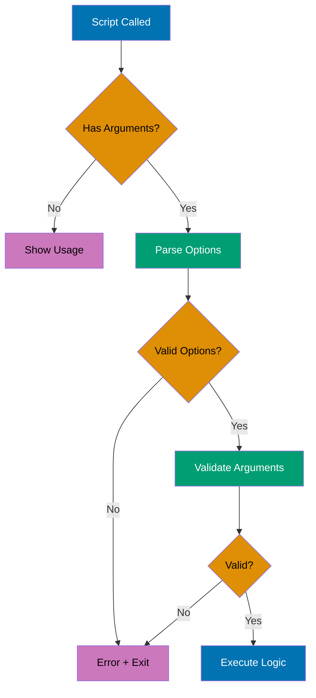
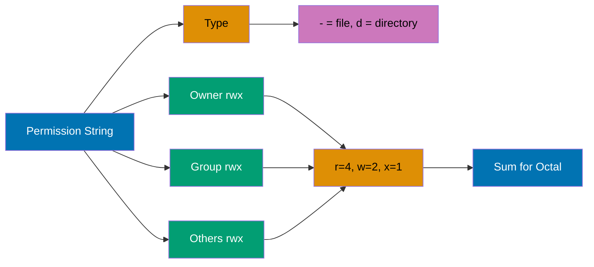

## Intermediate Level (40-75% Coverage)

This level covers intermediate shell concepts through 10 self-contained examples. Each example demonstrates production patterns used in automation, text processing, and system administration.

---

### Example 21: Text Processing (sed)

The `sed` (stream editor) command performs text transformations on files or streams, supporting substitution, deletion, insertion, and line-based operations.

```bash
# Basic substitution (first occurrence per line)
echo "hello world" | sed 's/world/universe/'
                                # => Output: hello universe
                                # => s/pattern/replacement/

# Global substitution (all occurrences)
echo "foo bar foo" | sed 's/foo/baz/g'
                                # => Output: baz bar baz
                                # => g flag: global (all matches per line)

# Substitute in file (preview)
sed 's/old/new/g' file.txt      # => Prints transformed output to stdout
                                # => Original file unchanged

# In-place editing
sed -i 's/old/new/g' file.txt   # => Modifies file.txt directly
                                # => -i: in-place (DANGEROUS - no undo!)

# In-place with backup
sed -i.bak 's/old/new/g' file.txt
                                # => Creates file.txt.bak before modifying
                                # => Safer than -i alone

# Delete lines matching pattern
sed '/^#/d' file.txt            # => Deletes lines starting with #
                                # => /pattern/d

# Delete line number
sed '3d' file.txt               # => Deletes line 3

# Delete range
sed '2,5d' file.txt             # => Deletes lines 2-5

# Print specific lines
sed -n '1,10p' file.txt         # => Prints lines 1-10 only
                                # => -n: suppress default output
                                # => p: print

# Multiple operations
sed -e 's/foo/bar/g' -e 's/baz/qux/g' file.txt
                                # => Applies both substitutions
                                # => -e: expression

# Practical: remove trailing whitespace
sed 's/[[:space:]]*$//' file.txt
                                # => Removes spaces/tabs at end of lines

# Practical: comment out lines
sed 's/^/# /' code.sh           # => Adds # at start of each line

# Practical: extract email addresses
sed -n 's/.*\([a-zA-Z0-9.]*@[a-zA-Z0-9.]*\).*/\1/p' contacts.txt
                                # => Extracts email patterns
```

**Key Takeaway**: Use `sed` for quick text transformations with `s/pattern/replacement/g` for global substitution, `/pattern/d` for deletion, and `-i.bak` for safe in-place editing - it's perfect for automated text processing in scripts.

---

### Example 22: Text Processing (awk)

The `awk` command is a powerful text processing language for field-based data manipulation, pattern matching, and reporting - ideal for CSV, logs, and tabular data.

```bash
# Print specific field
echo "one two three" | awk '{print $2}'
                                # => Output: two
                                # => $2 is second field (space-separated)

# Print multiple fields
ps aux | awk '{print $1, $11}'  # => Prints user and command columns
                                # => $1: first field, $11: eleventh field

# Custom delimiter
awk -F':' '{print $1}' /etc/passwd
                                # => Prints usernames from /etc/passwd
                                # => -F':': field separator is colon

# Field count
echo "a b c d" | awk '{print NF}'
                                # => Output: 4
                                # => NF: number of fields

# Last field
echo "a b c d" | awk '{print $NF}'
                                # => Output: d
                                # => $NF: last field

# Pattern matching
awk '/error/ {print $0}' logfile.txt
                                # => Prints lines containing "error"
                                # => $0: entire line

# Conditional actions
awk '$3 > 100 {print $1, $3}' data.txt
                                # => Prints first and third fields if third > 100

# BEGIN and END blocks
awk 'BEGIN {sum=0} {sum+=$1} END {print sum}' numbers.txt
                                # => Sums first column
                                # => BEGIN: runs before processing
                                # => END: runs after processing

# Calculate average
awk '{sum+=$1; count++} END {print sum/count}' numbers.txt
                                # => Average of first column

# Multiple conditions
awk '$1 == "error" && $2 > 100 {print}' log.txt
                                # => Logical AND in condition

# Formatted output
awk '{printf "%-10s %5d\n", $1, $2}' data.txt
                                # => Left-align string, right-align number
                                # => printf for formatted output

# Practical: sum disk usage
du -b * | awk '{total+=$1} END {print total " bytes"}'
                                # => Total disk usage in bytes

# Practical: process CSV
awk -F',' '{print $2, $3}' data.csv
                                # => Extract columns 2 and 3 from CSV

# Practical: count occurrences
awk '{count[$1]++} END {for (word in count) print word, count[word]}' words.txt
                                # => Word frequency count
```

**Key Takeaway**: Use `awk` for field-based text processing with `$1, $2, ...` for columns, `-F` for custom delimiters, and `BEGIN/END` blocks for initialization/summary - it's more powerful than `cut` and ideal for log analysis and data extraction.

---

### Example 23: Command Line Arguments and Parsing

Production scripts need robust argument parsing to handle options, flags, and validation. Use `getopts` for POSIX-compliant option parsing or manual parsing for flexibility.



```bash
#!/bin/bash

# Basic argument check
if [ $# -eq 0 ]; then
    echo "Usage: $0 <filename>"
    exit 1
fi

# Using getopts for option parsing
while getopts "vho:f:" opt; do
    case $opt in
        v)
            VERBOSE=true        # => -v flag (no argument)
            ;;
        h)
            echo "Usage: $0 [-v] [-o output] -f file"
            exit 0
            ;;
        o)
            OUTPUT="$OPTARG"    # => -o option (with argument)
            ;;
        f)
            FILE="$OPTARG"      # => -f option (required)
            ;;
        \?)
            echo "Invalid option: -$OPTARG"
            exit 1
            ;;
    esac
done

# Shift past parsed options
shift $((OPTIND-1))             # => Remaining arguments in $@

# Validate required arguments
if [ -z "$FILE" ]; then
    echo "Error: -f file is required"
    exit 1
fi

# Practical example: backup script with options
#!/bin/bash
set -e                          # => Exit on error

usage() {
    cat << EOF
Usage: $0 [OPTIONS] source destination

Options:
    -c          Compress backup
    -v          Verbose output
    -e <ext>    Exclude file extension
    -h          Show this help
EOF
    exit 1
}

COMPRESS=false
VERBOSE=false
EXCLUDE=""

while getopts "cve:h" opt; do
    case $opt in
        c) COMPRESS=true ;;
        v) VERBOSE=true ;;
        e) EXCLUDE="$OPTARG" ;;
        h) usage ;;
        ?) usage ;;
    esac
done

shift $((OPTIND-1))

if [ $# -ne 2 ]; then
    echo "Error: source and destination required"
    usage
fi

SOURCE="$1"
DEST="$2"

[ "$VERBOSE" = true ] && echo "Backing up $SOURCE to $DEST"

if [ "$COMPRESS" = true ]; then
    tar -czf "$DEST/backup.tar.gz" "$SOURCE"
else
    cp -r "$SOURCE" "$DEST"
fi

[ "$VERBOSE" = true ] && echo "Backup complete"
```

**Key Takeaway**: Use `getopts` for standard option parsing with flags and arguments, validate all inputs before processing, and provide clear usage messages - always check `$#` for argument count and exit with non-zero status on errors.

---

### Example 24: Error Handling and Exit Codes

Robust scripts handle errors gracefully, validate inputs, log failures, and return meaningful exit codes. Use `set -e` for fail-fast behavior and trap for cleanup.

```bash
#!/bin/bash

# Strict mode (recommended for production)
set -e                          # => Exit immediately on error
set -u                          # => Exit on undefined variable
set -o pipefail                 # => Pipeline fails if any command fails

# Error handling function
error_exit() {
    echo "Error: $1" >&2        # => Print to stderr
    exit 1                      # => Exit with error code
}

# Validate file exists
[ -f "$config_file" ] || error_exit "Config file not found"

# Trap for cleanup on exit
cleanup() {
    echo "Cleaning up..."
    rm -f /tmp/tempfile_$$      # => $$ is script PID
}
trap cleanup EXIT               # => Run cleanup on script exit

# Trap specific signals
trap 'echo "Interrupted"; exit 130' INT
                                # => Handle Ctrl+C (SIGINT)

# Check command success
if ! grep -q "pattern" file.txt; then
    echo "Pattern not found"
    exit 1
fi

# Alternative: check exit code
grep -q "pattern" file.txt
if [ $? -ne 0 ]; then
    echo "Pattern not found"
    exit 1
fi

# Conditional execution with ||
command || error_exit "Command failed"

# Conditional execution with &&
command && echo "Success" || echo "Failed"

# Practical: database backup with error handling
#!/bin/bash
set -euo pipefail

BACKUP_DIR="/backup"
DB_NAME="production"
LOG_FILE="/var/log/backup.log"

log() {
    echo "[$(date '+%Y-%m-%d %H:%M:%S')] $1" | tee -a "$LOG_FILE"
}

error_exit() {
    log "ERROR: $1"
    exit 1
}

cleanup() {
    [ -f "$TEMP_FILE" ] && rm -f "$TEMP_FILE"
    log "Cleanup completed"
}

trap cleanup EXIT
trap 'error_exit "Script interrupted"' INT TERM

# Validate backup directory
[ -d "$BACKUP_DIR" ] || error_exit "Backup directory not found"

log "Starting backup of $DB_NAME"

# Create temporary file
TEMP_FILE=$(mktemp)             # => Create secure temp file

# Perform backup
if mysqldump "$DB_NAME" > "$TEMP_FILE"; then
    BACKUP_FILE="$BACKUP_DIR/${DB_NAME}_$(date +%Y%m%d_%H%M%S).sql"
    mv "$TEMP_FILE" "$BACKUP_FILE"
    log "Backup successful: $BACKUP_FILE"
else
    error_exit "Database backup failed"
fi

# Verify backup
if [ ! -s "$BACKUP_FILE" ]; then
    error_exit "Backup file is empty"
fi

log "Backup completed successfully"
exit 0
```

**Key Takeaway**: Use `set -euo pipefail` for strict error handling, trap for cleanup operations, and always validate inputs before processing - return exit code 0 for success and non-zero for errors, and log errors to stderr with `>&2`.

---

### Example 25: Process Management (ps, kill, jobs)

Process management involves listing processes, monitoring resource usage, and controlling process lifecycle with signals for graceful shutdown or forceful termination.

```bash
# List all processes
ps aux                          # => Shows all processes with details
                                # => a: all users, u: user-oriented, x: include no-tty

# List processes for current user
ps -u $USER                     # => Shows only your processes

# Filter processes
ps aux | grep "python"          # => Find python processes
                                # => Add: | grep -v grep to exclude grep itself

# Process tree
ps auxf                         # => Forest view (tree structure)
                                # => f: ASCII art process tree

# Top - interactive process monitor
top                             # => Real-time process monitoring
                                # => Press q to quit, k to kill, M to sort by memory

# Find process by name
pgrep python                    # => Output: PIDs of python processes

pgrep -l python                 # => Output: PID and process name
                                # => -l: list format

# Kill process by PID
kill 1234                       # => Sends SIGTERM (graceful shutdown)
                                # => Process can catch and cleanup

# Force kill
kill -9 1234                    # => Sends SIGKILL (immediate termination)
                                # => -9: Cannot be caught or ignored
                                # => Use only when SIGTERM fails

# Kill by name
pkill python                    # => Kills all processes named python
                                # => Use carefully!

# Kill with pattern
pkill -f "python script.py"     # => Kills processes matching full command
                                # => -f: match full command line

# Check if process is running
if pgrep -x nginx > /dev/null; then
    echo "Nginx is running"
else
    echo "Nginx is not running"
fi                              # => -x: exact match

# Job control
command &                       # => Run in background
jobs                            # => List background jobs
fg %1                           # => Bring job 1 to foreground
bg %1                           # => Resume job 1 in background
kill %1                         # => Kill job 1

# Wait for process to finish
sleep 30 &
BGPID=$!                        # => $! is PID of last background job
wait $BGPID                     # => Wait for specific PID
echo "Background process completed"

# Practical: graceful service restart
#!/bin/bash

SERVICE_NAME="myapp"
PID_FILE="/var/run/myapp.pid"

# Get PID
if [ -f "$PID_FILE" ]; then
    PID=$(cat "$PID_FILE")

    # Check if process exists
    if kill -0 "$PID" 2>/dev/null; then
        echo "Stopping $SERVICE_NAME (PID: $PID)"
        kill "$PID"             # => Send SIGTERM

        # Wait up to 10 seconds
        for i in {1..10}; do
            if ! kill -0 "$PID" 2>/dev/null; then
                echo "Process stopped gracefully"
                break
            fi
            sleep 1
        done

        # Force kill if still running
        if kill -0 "$PID" 2>/dev/null; then
            echo "Forcing stop..."
            kill -9 "$PID"
        fi
    fi
fi

# Start new process
./myapp &
echo $! > "$PID_FILE"
echo "Service started"
```

**Key Takeaway**: Use `ps aux` to list processes, `pgrep/pkill` for name-based operations, and `kill` with SIGTERM (default) before SIGKILL (-9) - always verify process existence with `kill -0` before sending signals, and use PID files for reliable service management.

---

### Example 26: File Permissions and Ownership (chmod, chown)

Linux file permissions control read, write, and execute access for owner, group, and others. Permissions are critical for security and proper system operation.



```bash
# View permissions
ls -l file.txt                  # => Output: -rw-r--r-- 1 user group 1234 Dec 30 file.txt
                                # => Permission breakdown:
                                # => -: file type (- = file, d = directory)
                                # => rw-: owner (read, write, no execute)
                                # => r--: group (read only)
                                # => r--: others (read only)

# Permission values
# r (read) = 4: View file contents or list directory
# w (write) = 2: Modify file or create/delete files in directory
# x (execute) = 1: Run file as program or enter directory

# Octal notation (most common)
chmod 644 file.txt              # => rw-r--r-- (owner: rw, group: r, others: r)
                                # => 6=4+2 (rw-), 4 (r--), 4 (r--)

chmod 755 script.sh             # => rwxr-xr-x (owner: rwx, group: r-x, others: r-x)
                                # => 7=4+2+1 (rwx), 5=4+1 (r-x), 5=4+1 (r-x)

chmod 700 private.sh            # => rwx------ (owner only)
                                # => 7=4+2+1 (rwx), 0 (---), 0 (---)

# Symbolic notation
chmod u+x script.sh             # => Add execute for user/owner
                                # => u=user, g=group, o=others, a=all

chmod go-w file.txt             # => Remove write for group and others
                                # => g=group, o=others

chmod a+r file.txt              # => Add read for all
                                # => a=all (user, group, others)

chmod u=rwx,g=rx,o=r file.txt   # => Set exact permissions
                                # => Equivalent to chmod 754

# Recursive permissions
chmod -R 755 /var/www/html      # => Sets 755 on directory and all contents
                                # => -R: recursive

# Make script executable
chmod +x deploy.sh              # => Adds execute for all users
                                # => Now can run: ./deploy.sh

# Change ownership
chown alice file.txt            # => Changes owner to alice
                                # => Requires root/sudo

chown alice:developers file.txt # => Changes owner to alice, group to developers

# Change group only
chgrp developers file.txt       # => Changes group to developers

# Recursive ownership
chown -R www-data:www-data /var/www
                                # => Changes owner and group recursively

# Practical: web server permissions
# Files: 644 (rw-r--r--)
find /var/www/html -type f -exec chmod 644 {} \;

# Directories: 755 (rwxr-xr-x)
find /var/www/html -type d -exec chmod 755 {} \;

# Uploads directory (writable by web server)
chmod 775 /var/www/html/uploads
chown www-data:www-data /var/www/html/uploads

# Practical: secure private key
chmod 600 ~/.ssh/id_rsa         # => Only owner can read/write
                                # => SSH requires this for security
```

**Key Takeaway**: Use octal notation (644, 755, 700) for absolute permission sets, symbolic notation (u+x, go-w) for relative changes - remember that 644 is standard for files, 755 for directories/executables, and 600 for private keys, and always verify permissions after changes.

---

### Example 27: Archiving and Compression (tar, gzip, zip)

Archiving combines multiple files into one file, while compression reduces file size. The `tar` command creates archives, often combined with `gzip` or `bzip2` for compression.

```bash
# Create tar archive
tar -cf archive.tar files/      # => Creates archive.tar from files/ directory
                                # => -c: create, -f: filename

# Create compressed tar (gzip)
tar -czf archive.tar.gz files/  # => Creates compressed archive
                                # => -z: gzip compression
                                # => Extension: .tar.gz or .tgz

# Create compressed tar (bzip2)
tar -cjf archive.tar.bz2 files/ # => Better compression than gzip
                                # => -j: bzip2 compression
                                # => Extension: .tar.bz2

# Create compressed tar (xz)
tar -cJf archive.tar.xz files/  # => Best compression (slower)
                                # => -J: xz compression

# Extract tar archive
tar -xf archive.tar             # => Extracts to current directory
                                # => -x: extract

# Extract compressed tar
tar -xzf archive.tar.gz         # => Extracts gzip-compressed archive
tar -xjf archive.tar.bz2        # => Extracts bzip2-compressed archive

# Extract to specific directory
tar -xzf archive.tar.gz -C /tmp # => Extracts to /tmp
                                # => -C: change directory

# List archive contents
tar -tzf archive.tar.gz         # => Lists files without extracting
                                # => -t: list, -z: gzip

# Verbose output
tar -czfv backup.tar.gz data/   # => Shows files as they're archived
                                # => -v: verbose

# Exclude files
tar -czf backup.tar.gz --exclude='*.log' --exclude='.git' project/
                                # => Excludes matching files/directories

# Compress existing file (gzip)
gzip large_file.txt             # => Creates large_file.txt.gz
                                # => Original file is removed!

# Preserve original
gzip -k large_file.txt          # => Keeps original file
                                # => -k: keep

# Decompress gzip
gunzip file.txt.gz              # => Restores file.txt
gzip -d file.txt.gz             # => Same as gunzip

# Zip (compatible with Windows)
zip -r archive.zip files/       # => Creates zip archive
                                # => -r: recursive

# Unzip
unzip archive.zip               # => Extracts to current directory

# Unzip to directory
unzip archive.zip -d /tmp       # => Extracts to /tmp

# Practical: backup with date
backup_name="backup_$(date +%Y%m%d_%H%M%S).tar.gz"
tar -czf "$backup_name" /data
echo "Backup created: $backup_name"

# Practical: incremental backup
tar -czf backup_full.tar.gz --listed-incremental=snapshot.file /data
                                # => Creates snapshot for incremental backups

# Practical: split large archive
tar -czf - /data | split -b 100M - backup.tar.gz.part
                                # => Splits into 100MB chunks
                                # => Restore: cat backup.tar.gz.part* | tar -xzf -
```

**Key Takeaway**: Use `tar -czf` to create gzip-compressed archives, `tar -xzf` to extract, and `-v` for verbose output - remember that `tar` preserves permissions and directory structure, making it ideal for backups, and gzip removes original files unless `-k` is used.

---

### Example 28: Network Operations (curl, wget, ssh)

Network commands download files, interact with APIs, and access remote systems. The `curl` and `wget` commands handle HTTP requests, while `ssh` provides secure remote access.

```bash
# Download file with wget
wget https://example.com/file.txt
                                # => Downloads to current directory
                                # => Shows progress, resumes on interruption

# Download with custom name
wget -O custom_name.txt https://example.com/file.txt
                                # => -O: output filename

# Download multiple files
wget -i urls.txt                # => Downloads all URLs from file
                                # => -i: input file

# Basic HTTP request with curl
curl https://api.example.com/data
                                # => Prints response to stdout

# Save to file
curl -o output.json https://api.example.com/data
                                # => -o: output file

# Follow redirects
curl -L https://github.com/file # => Follows HTTP redirects
                                # => -L: location

# Show headers
curl -I https://example.com     # => Shows HTTP headers only
                                # => -I: head request

# Send POST request
curl -X POST -d "name=Alice&age=30" https://api.example.com/users
                                # => -X: HTTP method, -d: data

# Send JSON data
curl -X POST \
  -H "Content-Type: application/json" \
  -d '{"name":"Alice","age":30}' \
  https://api.example.com/users
                                # => -H: header

# Authentication
curl -u username:password https://api.example.com/protected
                                # => -u: basic auth

# Download with progress bar
curl -# -O https://example.com/large_file.zip
                                # => -#: progress bar, -O: save with original name

# SSH - remote command execution
ssh user@server 'ls /var/log'   # => Executes command on remote server
                                # => Output returned to local terminal

# SSH with key
ssh -i ~/.ssh/id_rsa user@server
                                # => -i: identity file (private key)

# Copy file to remote (scp)
scp file.txt user@server:/path/to/destination
                                # => Copies file.txt to remote server

# Copy from remote
scp user@server:/path/to/file.txt local_dir/
                                # => Copies from remote to local

# Copy directory recursively
scp -r directory/ user@server:/path/
                                # => -r: recursive

# Rsync (better than scp for large transfers)
rsync -avz /local/path/ user@server:/remote/path/
                                # => -a: archive, -v: verbose, -z: compress
                                # => Faster than scp, resumes on interruption

# Practical: API health check
if curl -f -s -o /dev/null https://api.example.com/health; then
    echo "API is up"
else
    echo "API is down"
fi                              # => -f: fail on HTTP errors, -s: silent

# Practical: download and extract
curl -L https://releases.example.com/app.tar.gz | tar -xzf -
                                # => Downloads and extracts in one command

# Practical: remote backup
ssh user@server 'tar -czf - /data' > backup.tar.gz
                                # => Creates remote tar and streams to local file
```

**Key Takeaway**: Use `curl` for API interactions and flexible HTTP requests, `wget` for downloading files with resume support, and `ssh/scp/rsync` for secure remote access and file transfer - remember that `curl` writes to stdout by default while `wget` saves to files.

---

### Example 29: Scheduling Tasks (cron, at)

Task scheduling automates recurring jobs with `cron` or one-time execution with `at`. Cron is essential for maintenance tasks, backups, and periodic monitoring.

```bash
# View current user's crontab
crontab -l                      # => Lists scheduled cron jobs
                                # => -l: list

# Edit crontab
crontab -e                      # => Opens editor to modify cron jobs
                                # => -e: edit

# Crontab format
# Minute Hour Day Month DayOfWeek Command
# 0-59   0-23 1-31 1-12  0-6      (0=Sunday)

# Examples of cron schedules:
# 0 2 * * *    /backup.sh       # => Daily at 2:00 AM
# 30 */6 * * * /check.sh        # => Every 6 hours at :30
# 0 0 * * 0    /weekly.sh       # => Weekly on Sunday at midnight
# 0 9 1 * *    /monthly.sh      # => Monthly on 1st at 9:00 AM
# */15 * * * * /monitor.sh      # => Every 15 minutes

# Practical crontab entries
crontab -e                      # => Add these lines:

# Backup database daily at 2 AM
0 2 * * * /usr/local/bin/backup_db.sh >> /var/log/backup.log 2>&1

# Clean temp files every Sunday at 3 AM
0 3 * * 0 find /tmp -type f -mtime +7 -delete

# Check disk space every hour
0 * * * * df -h | mail -s "Disk Report" admin@example.com

# Special cron strings
@reboot    /startup.sh          # => Run at system boot
@daily     /daily_task.sh       # => Run daily at midnight
@hourly    /hourly_task.sh      # => Run at start of every hour
@weekly    /weekly_task.sh      # => Run weekly (Sunday midnight)
@monthly   /monthly_task.sh     # => Run monthly (1st at midnight)

# One-time task with at
echo "/backup.sh" | at 14:30    # => Run /backup.sh at 2:30 PM today

# Schedule for specific date
echo "/backup.sh" | at 2:00 AM 2025-12-31
                                # => Run at specific date/time

# List scheduled at jobs
atq                             # => Lists pending at jobs

# Remove at job
atrm 1                          # => Removes job number 1

# Practical: maintenance script with logging
#!/bin/bash
# Add to crontab: 0 3 * * * /path/to/maintenance.sh

LOGFILE="/var/log/maintenance.log"

log() {
    echo "[$(date '+%Y-%m-%d %H:%M:%S')] $1" >> "$LOGFILE"
}

log "Starting maintenance"

# Clean old logs (older than 30 days)
find /var/log -name "*.log" -mtime +30 -delete
log "Cleaned old logs"

# Optimize database
mysqlcheck --optimize --all-databases
log "Optimized databases"

# Update package list
apt-get update -qq
log "Updated package list"

log "Maintenance completed"
```

**Key Takeaway**: Use cron for recurring tasks with `crontab -e` to edit schedules, and `at` for one-time execution - always redirect cron output to log files for debugging, and remember that cron runs with limited environment variables so use absolute paths.

---

### Example 30: Script Best Practices

Production scripts require robust error handling, logging, argument validation, and clear documentation. Following best practices ensures reliability and maintainability.

```bash
#!/bin/bash
#
# Script: backup_database.sh
# Description: Automated database backup with compression and rotation
# Author: DevOps Team
# Date: 2025-12-30
# Usage: ./backup_database.sh [-v] [-d database] [-o output_dir]
#

# Strict error handling
set -euo pipefail               # => Exit on error, undefined vars, pipe failures

# Configuration
readonly SCRIPT_NAME=$(basename "$0")
readonly SCRIPT_DIR=$(dirname "$(readlink -f "$0")")
readonly LOG_FILE="/var/log/${SCRIPT_NAME%.sh}.log"
readonly BACKUP_DIR="${BACKUP_DIR:-/backup}"
readonly RETENTION_DAYS=7

# Global variables
VERBOSE=false
DATABASE=""
OUTPUT_DIR="$BACKUP_DIR"

# Logging function
log() {
    local level="$1"
    shift
    local message="$*"
    local timestamp=$(date '+%Y-%m-%d %H:%M:%S')

    echo "[$timestamp] [$level] $message" | tee -a "$LOG_FILE"

    if [ "$level" = "ERROR" ]; then
        echo "[$timestamp] [$level] $message" >&2
    fi
}

# Error handling
error_exit() {
    log "ERROR" "$1"
    exit 1
}

# Cleanup on exit
cleanup() {
    local exit_code=$?

    if [ $exit_code -ne 0 ]; then
        log "ERROR" "Script failed with exit code $exit_code"
    fi

    # Remove temp files
    [ -f "$TEMP_FILE" ] && rm -f "$TEMP_FILE"

    log "INFO" "Cleanup completed"
}
trap cleanup EXIT

# Handle interrupts
interrupted() {
    log "WARNING" "Script interrupted by user"
    exit 130
}
trap interrupted INT TERM

# Usage information
usage() {
    cat << EOF
Usage: $SCRIPT_NAME [OPTIONS]

Automated database backup with compression and rotation.

Options:
    -v              Verbose output
    -d DATABASE     Database name (required)
    -o DIR          Output directory (default: $BACKUP_DIR)
    -h              Show this help message

Examples:
    $SCRIPT_NAME -d production
    $SCRIPT_NAME -v -d mydb -o /mnt/backup

EOF
    exit 0
}

# Parse command line arguments
parse_args() {
    while getopts "vd:o:h" opt; do
        case $opt in
            v)
                VERBOSE=true
                ;;
            d)
                DATABASE="$OPTARG"
                ;;
            o)
                OUTPUT_DIR="$OPTARG"
                ;;
            h)
                usage
                ;;
            \?)
                error_exit "Invalid option: -$OPTARG"
                ;;
            :)
                error_exit "Option -$OPTARG requires an argument"
                ;;
        esac
    done

    shift $((OPTIND-1))
}

# Validate arguments
validate_args() {
    if [ -z "$DATABASE" ]; then
        error_exit "Database name is required (-d option)"
    fi

    if [ ! -d "$OUTPUT_DIR" ]; then
        error_exit "Output directory does not exist: $OUTPUT_DIR"
    fi

    if [ ! -w "$OUTPUT_DIR" ]; then
        error_exit "Output directory is not writable: $OUTPUT_DIR"
    fi
}

# Check prerequisites
check_prerequisites() {
    local required_commands=("mysqldump" "gzip")

    for cmd in "${required_commands[@]}"; do
        if ! command -v "$cmd" &> /dev/null; then
            error_exit "Required command not found: $cmd"
        fi
    done
}

# Rotate old backups
rotate_backups() {
    log "INFO" "Rotating backups older than $RETENTION_DAYS days"

    find "$OUTPUT_DIR" -name "${DATABASE}_*.sql.gz" -mtime +$RETENTION_DAYS -delete

    local deleted_count=$(find "$OUTPUT_DIR" -name "${DATABASE}_*.sql.gz" -mtime +$RETENTION_DAYS | wc -l)

    [ "$VERBOSE" = true ] && log "INFO" "Deleted $deleted_count old backup(s)"
}

# Main backup function
backup_database() {
    local backup_file="${OUTPUT_DIR}/${DATABASE}_$(date +%Y%m%d_%H%M%S).sql.gz"

    log "INFO" "Starting backup of database: $DATABASE"

    # Create backup with compression
    if mysqldump --single-transaction --quick "$DATABASE" | gzip > "$backup_file"; then
        local size=$(du -h "$backup_file" | cut -f1)
        log "INFO" "Backup successful: $backup_file (size: $size)"
    else
        error_exit "Backup failed for database: $DATABASE"
    fi

    # Verify backup integrity
    if [ ! -s "$backup_file" ]; then
        error_exit "Backup file is empty: $backup_file"
    fi

    # Test gzip integrity
    if ! gzip -t "$backup_file"; then
        error_exit "Backup file is corrupted: $backup_file"
    fi
}

# Main execution
main() {
    log "INFO" "Starting $SCRIPT_NAME"

    parse_args "$@"
    validate_args
    check_prerequisites

    backup_database
    rotate_backups

    log "INFO" "$SCRIPT_NAME completed successfully"
}

# Run main function
main "$@"
```

**Key Takeaway**: Use `set -euo pipefail` for strict error handling, create dedicated logging and error functions, validate all inputs, provide usage documentation, and implement cleanup with trap - always use readonly for constants, check prerequisites before execution, and return meaningful exit codes.

---

## Next Steps

Continue to [Advanced](/en/learn/software-engineering/linux-platform/shell/tutorials/by-example/advanced) examples for performance optimization, advanced scripting patterns, and production deployment techniques (75-95% coverage).
