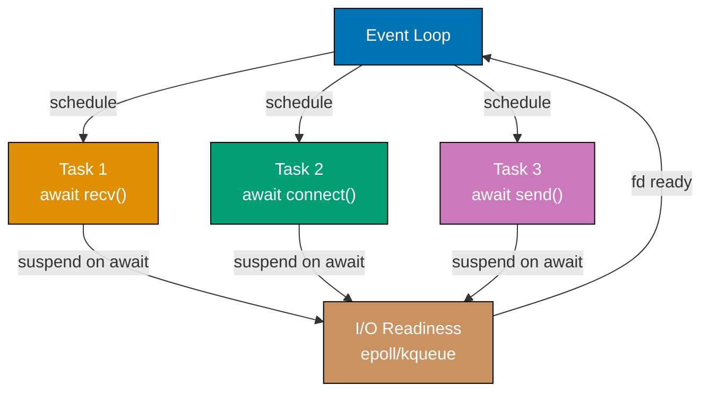
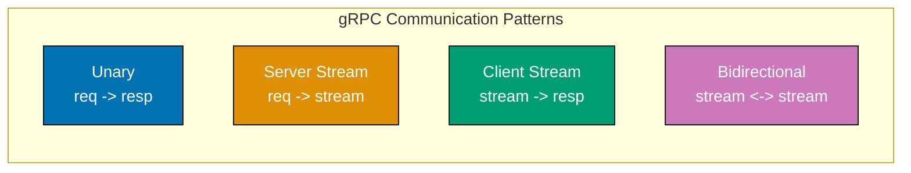
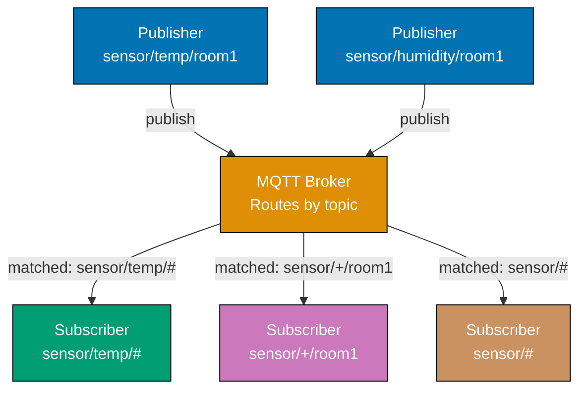
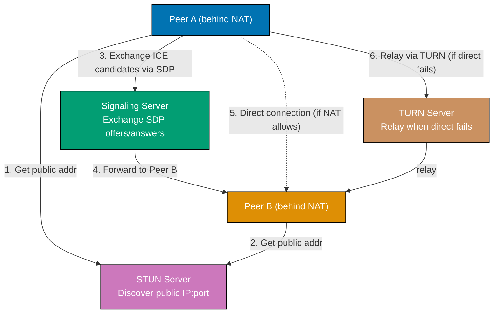
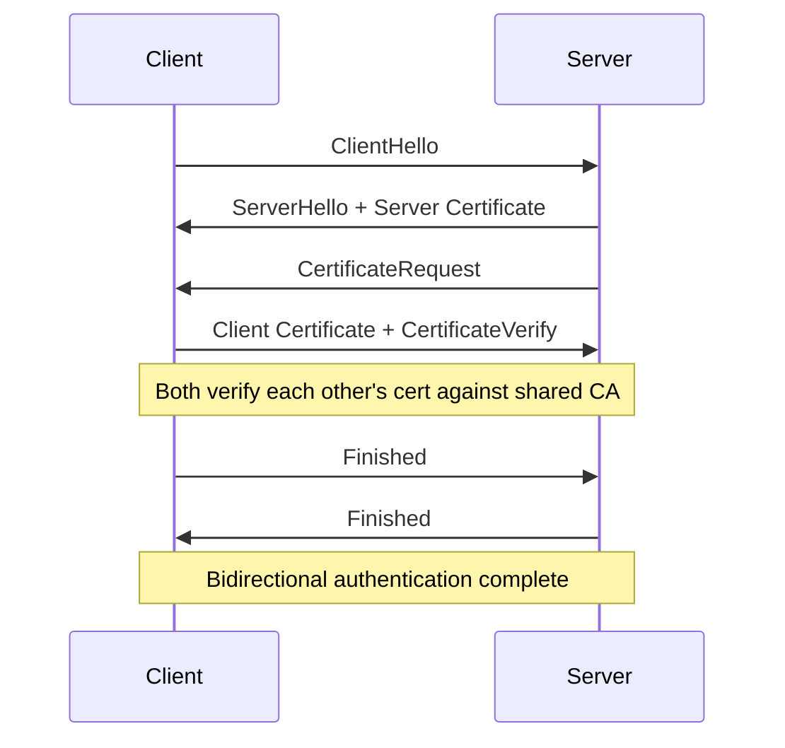
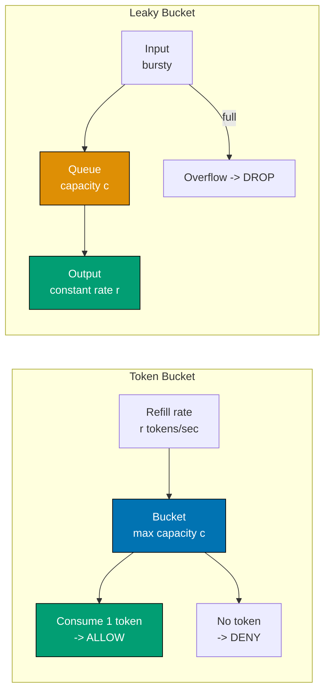

## Example 57: Raw Sockets — Python

Raw sockets bypass the transport layer, giving direct access to IP packets. They require root/administrator privileges and allow crafting arbitrary packets for diagnostics and security research.

```python
import socket
import struct
import os
import sys

def explain_raw_sockets():
    # => Raw sockets: SOCK_RAW bypasses TCP/UDP, receives/sends IP packets directly
    # => Requires: root on Linux, admin on Windows, CAP_NET_RAW capability

    print("Raw Socket Capabilities:\n")
    capabilities = {
        "IPPROTO_ICMP": "Receive and send ICMP packets (ping, traceroute)",
        "IPPROTO_TCP":  "Receive all TCP packets on the interface",
        "IPPROTO_UDP":  "Receive all UDP packets on the interface",
        "IPPROTO_RAW":  "Send packets with self-crafted IP header (IP_HDRINCL)",
        "AF_PACKET":    "Linux only: receive raw Ethernet frames (Layer 2)",
    }
    for proto, description in capabilities.items():
        print(f"  {proto:15s}: {description}")

def build_icmp_echo(identifier, sequence, payload=b"PingPayload"):
    # => Build ICMP Echo Request packet (type 8, code 0)
    icmp_type = 8     # => Echo Request
    icmp_code = 0
    checksum = 0      # => Will be computed

    # Pack header with zero checksum first
    header = struct.pack("BBHHH", icmp_type, icmp_code, checksum, identifier, sequence)
    # => B=1 byte, H=2 bytes: type(1)+code(1)+checksum(2)+id(2)+seq(2) = 8 bytes

    packet = header + payload

    # Compute checksum: one's complement of one's complement sum of 16-bit words
    def checksum_calc(data):
        if len(data) % 2:
            data += b"\x00"       # => Pad to even length
        s = 0
        for i in range(0, len(data), 2):
            s += (data[i] << 8) + data[i + 1]
        s = (s >> 16) + (s & 0xFFFF)  # => Fold carry
        s += s >> 16
        return ~s & 0xFFFF             # => One's complement

    cs = checksum_calc(packet)
    # => Repack with correct checksum
    header = struct.pack("BBHHH", icmp_type, icmp_code, cs, identifier, sequence)
    return header + payload

# Attempt to create raw socket (will fail without root — show the concept)
try:
    raw = socket.socket(socket.AF_INET, socket.SOCK_RAW, socket.IPPROTO_ICMP)
    # => AF_INET + SOCK_RAW + IPPROTO_ICMP: receive all ICMP packets
    print("\nRaw ICMP socket created successfully (running as root/admin)")

    pkt = build_icmp_echo(identifier=1234, sequence=1)
    raw.sendto(pkt, ("127.0.0.1", 0))
    # => Port ignored for raw sockets (no transport layer)
    raw.settimeout(1.0)
    try:
        data, addr = raw.recvfrom(65535)
        # => data includes full IP header (20 bytes) + ICMP packet
        ip_header = data[:20]
        icmp_data = data[20:]
        ttl = ip_header[8]         # => TTL field at byte offset 8 in IP header
        src_ip = socket.inet_ntoa(ip_header[12:16])
        # => Source IP at bytes 12-15
        print(f"Received ICMP from {src_ip}, TTL={ttl}, ICMP type={icmp_data[0]}")
        # => type=0: Echo Reply (response to our type=8 request)
    except socket.timeout:
        print("No ICMP reply received")
    raw.close()
except PermissionError:
    print("\nRaw socket requires root/admin privileges")
    print("Run with: sudo python3 example.py")
    # => Normal behavior — show the concept without requiring elevated privileges
    pkt = build_icmp_echo(identifier=1234, sequence=1)
    print(f"Built ICMP packet: {len(pkt)} bytes, type={pkt[0]}, checksum={struct.unpack('!H', pkt[2:4])[0]:#06x}")

explain_raw_sockets()
```

**Key Takeaway**: Raw sockets (`SOCK_RAW`) bypass TCP/UDP, providing direct IP packet access for custom protocol implementation, diagnostics, and security tools — at the cost of requiring elevated privileges.

**Why It Matters**: Network monitoring tools, intrusion detection systems, and security scanners use raw sockets. Understanding raw sockets explains how ping, traceroute, and packet analyzers work at the OS level. The privilege requirement reflects the security boundary — raw sockets can forge source IP addresses (IP spoofing), enabling DDoS amplification attacks if misused.

---

## Example 58: Packet Crafting with struct Module

The `struct` module packs and unpacks binary data matching C struct layouts. This is essential for parsing and crafting network protocol headers.

```python
import struct
import socket

def craft_ip_header(src_ip, dst_ip, protocol, payload_len):
    # => Craft an IPv4 header manually using struct.pack
    # => IP header format (RFC 791): 20 bytes minimum

    version_ihl = (4 << 4) | 5
    # => version=4 (IPv4) in upper nibble, IHL=5 (20 bytes/4=5 32-bit words) in lower
    tos = 0               # => Type of Service / DSCP: 0 = normal priority
    total_length = 20 + payload_len  # => IP header + payload
    identification = 0xABCD          # => Used for fragment reassembly identification
    flags_frag = 0x4000              # => DF bit set (0x4000 = Don't Fragment)
    ttl = 64                         # => Time To Live: max hops (decremented by each router)
    checksum = 0                     # => Calculated after header is assembled

    src_bytes = socket.inet_aton(src_ip)   # => "192.168.1.10" -> 4 bytes
    dst_bytes = socket.inet_aton(dst_ip)   # => "10.0.0.1" -> 4 bytes

    header = struct.pack(
        "!BBHHHBBH4s4s",    # => ! = network byte order (big-endian)
        version_ihl,         # => B: 1 byte — version + IHL
        tos,                 # => B: 1 byte — type of service
        total_length,        # => H: 2 bytes — total packet length
        identification,      # => H: 2 bytes — fragment ID
        flags_frag,          # => H: 2 bytes — flags + fragment offset
        ttl,                 # => B: 1 byte — TTL
        protocol,            # => B: 1 byte — protocol (6=TCP, 17=UDP, 1=ICMP)
        checksum,            # => H: 2 bytes — header checksum (0 initially)
        src_bytes,           # => 4s: 4 bytes — source IP
        dst_bytes,           # => 4s: 4 bytes — destination IP
    )
    return header

def parse_ip_header(data):
    # => Parse raw bytes into IP header fields
    fields = struct.unpack("!BBHHHBBH4s4s", data[:20])
    # => Unpack 20 bytes into 10 fields matching the pack format above

    version_ihl, tos, total_len, ident, flags_frag, ttl, proto, chksum, src, dst = fields
    return {
        "version":    version_ihl >> 4,         # => Upper nibble: IP version
        "ihl":        (version_ihl & 0xF) * 4,  # => Lower nibble * 4 = header length in bytes
        "tos":        tos,
        "total_len":  total_len,
        "ident":      ident,
        "df":         bool(flags_frag & 0x4000), # => DF flag at bit 14
        "mf":         bool(flags_frag & 0x2000), # => MF flag at bit 13
        "frag_off":   flags_frag & 0x1FFF,       # => Lower 13 bits = fragment offset
        "ttl":        ttl,
        "protocol":   proto,
        "src":        socket.inet_ntoa(src),      # => 4 bytes -> "x.x.x.x"
        "dst":        socket.inet_ntoa(dst),
    }

# Craft and immediately parse back
header = craft_ip_header("192.168.1.10", "10.0.0.1", protocol=17, payload_len=8)
# => protocol=17: UDP
print(f"Crafted IP header: {len(header)} bytes")
print(f"Raw hex: {header.hex()}")
# => Raw hex: 45000018abcd400040110000c0a8010a0a000001

parsed = parse_ip_header(header)
print("\nParsed IP header:")
for k, v in parsed.items():
    print(f"  {k:10s}: {v}")
# => version: 4, ihl: 20, total_len: 28, ttl: 64, protocol: 17
# => src: 192.168.1.10, dst: 10.0.0.1, df: True
```

**Key Takeaway**: `struct.pack`/`unpack` with network byte order (`!`) serializes Python values into binary protocol headers; format strings map directly to C struct field types.

**Why It Matters**: Protocol parsers, network simulators, VPN implementations, and packet forgers all use struct-based binary serialization. Understanding format strings (`B`=uint8, `H`=uint16, `I`=uint32, `4s`=4-byte string) is essential for reading RFCs and implementing protocols without external libraries.

---

## Example 59: Python asyncio for Async Networking

`asyncio` provides cooperative multitasking through coroutines and an event loop. Network I/O operations yield control while waiting, allowing the event loop to process other tasks concurrently.



```python
import asyncio
import time

async def fetch_with_delay(name, delay):
    # => async def: coroutine function — returns a coroutine object, not a result
    print(f"[{name}] Starting (will wait {delay}s)")
    await asyncio.sleep(delay)
    # => await: suspend this coroutine, yield control to event loop
    # => Event loop runs other tasks while this coroutine waits
    # => asyncio.sleep is non-blocking — unlike time.sleep which blocks all tasks
    print(f"[{name}] Done after {delay}s")
    return f"{name}-result"

async def main():
    # => async def main: entry point for asyncio programs
    start = time.time()

    # Sequential execution (wrong way for I/O concurrency)
    print("=== Sequential (slow) ===")
    r1 = await fetch_with_delay("task1", 0.1)  # => Waits 0.1s, THEN starts task2
    r2 = await fetch_with_delay("task2", 0.1)  # => Waits another 0.1s
    seq_time = time.time() - start
    print(f"Sequential: {seq_time:.2f}s total (0.1 + 0.1 = 0.2s expected)\n")
    # => Sequential: ~0.20s — tasks run one after another

    # Concurrent execution (correct way)
    print("=== Concurrent (fast) ===")
    start = time.time()
    results = await asyncio.gather(
        fetch_with_delay("task3", 0.1),
        fetch_with_delay("task4", 0.1),
        fetch_with_delay("task5", 0.1),
    )
    # => asyncio.gather: schedules all coroutines concurrently
    # => All three start simultaneously, all await asyncio.sleep(0.1) at same time
    # => Event loop handles all three; total time = max(0.1, 0.1, 0.1) = 0.1s
    conc_time = time.time() - start
    print(f"Concurrent: {conc_time:.2f}s total (~0.1s expected)")
    # => Output: Concurrent: ~0.10s — 3x speedup over sequential

    print(f"Results: {results}")
    # => Results: ['task3-result', 'task4-result', 'task5-result']

asyncio.run(main())
# => asyncio.run: creates event loop, runs main(), closes loop
# => Python 3.7+: preferred entry point for asyncio programs
```

**Key Takeaway**: `asyncio.gather()` runs multiple coroutines concurrently within a single thread; `await` suspends the current coroutine and yields to the event loop, enabling non-blocking I/O.

**Why It Matters**: A single-threaded asyncio server handles thousands of concurrent connections with lower memory than thread-per-connection models. FastAPI, aiohttp, and modern Python networking libraries all build on asyncio. Understanding the event loop model explains why blocking calls (`time.sleep`, synchronous DB calls) inside async code freeze the entire server.

---

## Example 60: Async TCP Server with asyncio

`asyncio.start_server()` creates a fully asynchronous TCP server using coroutines for each client. The event loop handles all connection and data events without threads.

```python
import asyncio

async def handle_client(reader, writer):
    # => Called by asyncio for each new connection
    # => reader: StreamReader — async interface for receiving data
    # => writer: StreamWriter — async interface for sending data

    addr = writer.get_extra_info("peername")
    # => peername: (host, port) of connected client
    print(f"[{addr}] Connected")

    try:
        while True:
            data = await reader.read(1024)
            # => await reader.read: suspends until data arrives
            # => Returns empty bytes b"" on EOF (client disconnected)
            if not data:
                break     # => Client disconnected gracefully

            message = data.decode("utf-8", errors="replace").strip()
            print(f"[{addr}] Received: {message}")

            response = f"Echo: {message}\n"
            writer.write(response.encode())
            # => writer.write: buffers data (does not block)
            await writer.drain()
            # => drain(): await until buffer is flushed to OS
            # => Without drain(): buffer grows unboundedly under backpressure
    except asyncio.CancelledError:
        pass       # => Server shutting down
    except ConnectionResetError:
        pass       # => Client disconnected abruptly
    finally:
        writer.close()
        await writer.wait_closed()
        # => wait_closed(): await until connection fully closed
        print(f"[{addr}] Disconnected")

async def run_server(host, port, duration=2.0):
    server = await asyncio.start_server(
        handle_client,   # => Coroutine called for each new connection
        host, port,
    )
    # => start_server: binds, listens, and registers accept callback with event loop

    addr = server.sockets[0].getsockname()
    print(f"Async server on {addr}")

    async with server:
        await asyncio.sleep(duration)  # => Serve for duration seconds
        # => Event loop handles all client connections while we await here

async def test_client(host, port):
    reader, writer = await asyncio.open_connection(host, port)
    # => open_connection: async TCP connect + returns (StreamReader, StreamWriter)
    writer.write(b"Hello async server\n")
    await writer.drain()

    response = await reader.read(256)
    print(f"Client received: {response.decode().strip()}")
    # => Output: Client received: Echo: Hello async server
    writer.close()
    await writer.wait_closed()

async def main():
    # => Run server and client concurrently
    server_task = asyncio.create_task(run_server("127.0.0.1", 9040))
    await asyncio.sleep(0.1)  # => Let server start
    await test_client("127.0.0.1", 9040)
    await server_task          # => Wait for server task to finish

asyncio.run(main())
```

**Key Takeaway**: `asyncio.start_server()` creates a non-blocking TCP server; each connection runs in its own coroutine, and `await reader.read()` / `await writer.drain()` yield to the event loop between I/O operations.

**Why It Matters**: Asyncio servers handle C10K (10,000 concurrent connections) efficiently in Python. Understanding `drain()` prevents memory exhaustion from unbounded write buffers. This pattern underpins FastAPI's async request handling, aiohttp's HTTP client, and asyncpg's PostgreSQL driver.

---

## Example 61: Async HTTP Client with asyncio

An async HTTP client makes multiple requests concurrently without threads, using the event loop for connection management and I/O.

```python
import asyncio
import ssl

async def async_http_get(host, path, port=80, use_tls=False):
    # => Async HTTP/1.0 GET request using low-level asyncio streams
    if use_tls:
        ssl_ctx = ssl.create_default_context()
        reader, writer = await asyncio.open_connection(host, port, ssl=ssl_ctx)
        # => open_connection with ssl=: performs TLS handshake asynchronously
    else:
        reader, writer = await asyncio.open_connection(host, port)

    # Build minimal HTTP/1.0 request (1.0 = server closes after response, simpler parsing)
    request = (
        f"GET {path} HTTP/1.0\r\n"
        f"Host: {host}\r\n"
        f"Accept: text/html\r\n"
        f"\r\n"
    ).encode()

    writer.write(request)
    await writer.drain()   # => Flush request to OS

    # Read full response
    response_bytes = await reader.read(8192)
    # => read(n): returns up to n bytes; HTTP/1.0 server closes after sending
    writer.close()
    await writer.wait_closed()

    # Split headers from body
    header_end = response_bytes.find(b"\r\n\r\n")
    if header_end == -1:
        return None
    headers_raw = response_bytes[:header_end].decode(errors="replace")
    body = response_bytes[header_end + 4:]

    status_line = headers_raw.split("\r\n")[0]
    # => "HTTP/1.0 200 OK"
    status_code = int(status_line.split()[1])
    # => Extract numeric status code

    return {"status": status_code, "body_len": len(body), "host": host}

async def fetch_multiple(targets):
    # => Fetch multiple URLs concurrently — total time ≈ slowest individual request
    tasks = [
        asyncio.create_task(async_http_get(host, path))
        for host, path in targets
    ]
    # => create_task: schedules coroutine immediately (vs gather which waits for all)

    results = []
    for task in asyncio.as_completed(tasks):
        # => as_completed: yield tasks as they finish (not necessarily in order)
        result = await task
        if result:
            print(f"  {result['host']}: status={result['status']} body={result['body_len']}B")
            results.append(result)
    return results

async def main():
    targets = [
        ("example.com", "/"),
        ("httpbin.org", "/get"),
    ]
    print("Fetching concurrently:")
    import time
    start = time.time()
    results = await fetch_multiple(targets)
    elapsed = time.time() - start
    print(f"  Fetched {len(results)} URLs in {elapsed:.2f}s")
    # => Both requests run concurrently: total ≈ max(t1, t2), not t1+t2

try:
    asyncio.run(main())
except Exception as e:
    print(f"Network error: {e}")
```

**Key Takeaway**: `asyncio.create_task()` schedules multiple HTTP requests concurrently; `as_completed()` processes results as they arrive rather than waiting for all to finish.

**Why It Matters**: Concurrent async HTTP requests power web crawlers, API aggregators, and microservice fan-out patterns. A blocking HTTP client making 10 sequential 200ms requests takes 2 seconds; async concurrent requests take 200ms. Production async HTTP libraries (aiohttp, httpx async) build on these primitives with connection pooling, redirect following, and retry logic.

---

## Example 62: gRPC Concepts — Protobuf and Streams

gRPC is a high-performance RPC framework using Protocol Buffers (protobuf) for serialization and HTTP/2 for transport. It supports four communication patterns: unary, server streaming, client streaming, and bidirectional streaming.



```python
# gRPC concepts — full implementation requires grpcio (external)
# This example demonstrates protobuf wire format and gRPC concepts using struct

import struct

def explain_grpc():
    print("gRPC Key Concepts:\n")

    concepts = {
        "Protocol Buffers (protobuf)": (
            "Binary serialization format — smaller and faster than JSON. "
            "Schema defined in .proto files: fields have type + field number. "
            "Field numbers (not names) used in binary format — enables schema evolution. "
            "Python: pip install grpcio-tools generates Python classes from .proto."
        ),
        "HTTP/2 Transport": (
            "gRPC uses HTTP/2 multiplexed streams — one TCP connection for all RPCs. "
            "Each RPC call uses one HTTP/2 stream (odd stream IDs for client-initiated). "
            "Flow control at both HTTP/2 stream and connection level. "
            "Trailers (end-of-stream headers) carry gRPC status code."
        ),
        "Service Definition (.proto)": (
            "service Greeter { rpc SayHello(HelloRequest) returns (HelloReply); } "
            "message HelloRequest { string name = 1; } "
            "Field number = 1: wire encoding uses field number, not field name. "
            "Backward compatible: add new fields with new numbers; old clients ignore."
        ),
        "Streaming patterns": (
            "Unary: single request, single response (like HTTP REST). "
            "Server streaming: client sends one request, server streams many responses. "
            "Client streaming: client streams many requests, server sends one response. "
            "Bidirectional: both sides stream independently (chat, real-time sync)."
        ),
        "gRPC-Web and gRPC-Gateway": (
            "gRPC-Web: allows browsers to call gRPC services (requires proxy translation). "
            "gRPC-Gateway: generates REST/JSON proxy from .proto annotations. "
            "Enables REST and gRPC from single service definition."
        ),
    }
    for concept, explanation in concepts.items():
        print(f"  {concept}:")
        print(f"    {explanation}\n")

# Simulate protobuf varint encoding (fundamental to protobuf wire format)
def encode_varint(value):
    # => Varint: variable-length integer encoding
    # => Small values (< 128) use 1 byte; larger values use more bytes
    # => MSB of each byte: 1 = more bytes follow, 0 = last byte
    result = bytearray()
    while value > 0x7F:
        result.append((value & 0x7F) | 0x80)  # => Set MSB, take 7 bits
        value >>= 7
    result.append(value)   # => Final byte (MSB=0)
    return bytes(result)

def encode_protobuf_string(field_number, value):
    # => Protobuf wire type 2: length-delimited (strings, bytes, embedded messages)
    encoded_value = value.encode("utf-8")
    field_tag = encode_varint((field_number << 3) | 2)
    # => Tag = (field_number << 3) | wire_type
    # => wire_type 2 = length-delimited
    length = encode_varint(len(encoded_value))
    return field_tag + length + encoded_value

# Encode a simple protobuf message: HelloRequest { string name = 1; }
name = "World"
proto_msg = encode_protobuf_string(field_number=1, value=name)
print(f"Protobuf encoded 'name=\"{name}\"': {proto_msg.hex()}")
# => 0a05576f726c64
# => 0a = field 1, wire type 2; 05 = length 5; 576f726c64 = "World"
print(f"  Tag byte: {proto_msg[0]:#04x} (field=1, wire_type=2)")
print(f"  Length:   {proto_msg[1]} bytes")
print(f"  Value:    {proto_msg[2:].decode()}")

explain_grpc()
```

**Key Takeaway**: gRPC uses protobuf binary encoding over HTTP/2, supporting four streaming patterns — the binary format and multiplexed transport make it significantly more efficient than REST+JSON for service-to-service communication.

**Why It Matters**: gRPC is the standard for microservice RPC in polyglot environments. Protobuf's field-number-based encoding enables schema evolution without breaking existing clients. Understanding protobuf wire format helps debug serialization issues and explains why gRPC payloads are 3-10x smaller than equivalent JSON, reducing network bandwidth and serialization CPU cost.

---

## Example 63: MQTT Protocol — Pub/Sub for IoT

MQTT is a lightweight publish-subscribe protocol for constrained devices. Clients publish messages to topics; subscribers receive messages matching their topic subscriptions. A central broker routes all messages.



```python
# MQTT concepts and packet structure
# Full implementation requires paho-mqtt (external); this shows wire format concepts

import struct

def explain_mqtt():
    print("MQTT Protocol Key Concepts:\n")

    concepts = {
        "Topics and wildcards": (
            "Topics: hierarchical strings like 'home/living_room/temperature'. "
            "+ wildcard: matches single level — 'home/+/temperature' matches any room. "
            "# wildcard: matches all remaining levels — 'home/#' matches everything under home. "
            "Subscribers filter by topic pattern; broker routes by exact + wildcard match."
        ),
        "QoS levels": (
            "QoS 0: At most once — fire and forget, no acknowledgment (fastest, lossy). "
            "QoS 1: At least once — acknowledged; duplicates possible on retry. "
            "QoS 2: Exactly once — four-step handshake; guaranteed single delivery (slowest). "
            "IoT sensors often use QoS 0; commands use QoS 1 or 2."
        ),
        "Retained messages": (
            "Retained=True: broker stores last message on topic. "
            "New subscriber immediately receives retained message — no need to wait for next publish. "
            "Useful for device status topics: last known state available on subscribe."
        ),
        "Last Will and Testament (LWT)": (
            "Client declares LWT message at connect time. "
            "If client disconnects unexpectedly (no DISCONNECT packet), broker publishes LWT. "
            "Enables 'device offline' notification in distributed IoT systems."
        ),
        "MQTT vs HTTP for IoT": (
            "MQTT: persistent TCP connection, tiny 2-byte fixed header, pub-sub. "
            "HTTP: new connection per request, verbose headers, request-response. "
            "MQTT wins for battery-constrained devices sending many small updates. "
            "HTTP wins for occasional large payload uploads (firmware, logs)."
        ),
    }
    for concept, explanation in concepts.items():
        print(f"  {concept}:")
        print(f"    {explanation}\n")

def build_mqtt_connect(client_id, keepalive=60):
    # => MQTT CONNECT packet — first packet sent after TCP connection
    protocol_name = b"\x00\x04MQTT"  # => Length-prefixed protocol name
    # => 0x0004 = length 4, then "MQTT" bytes
    protocol_level = 4               # => MQTT version 3.1.1 = level 4
    connect_flags = 0b00000010       # => Clean session bit set
    # => Bit 1: CleanSession=1 (no persistent state from previous sessions)

    keepalive_bytes = struct.pack(">H", keepalive)  # => 2 bytes, big-endian

    # Variable header: protocol name + level + flags + keepalive
    variable_header = protocol_name + bytes([protocol_level, connect_flags]) + keepalive_bytes

    # Payload: client ID (length-prefixed UTF-8 string)
    client_id_bytes = client_id.encode("utf-8")
    payload = struct.pack(">H", len(client_id_bytes)) + client_id_bytes
    # => All strings in MQTT: 2-byte length prefix + UTF-8 bytes

    # Fixed header: packet type + remaining length
    remaining_length = len(variable_header) + len(payload)
    fixed_header = bytes([0x10, remaining_length])
    # => 0x10 = packet type 1 (CONNECT) in upper nibble, flags in lower

    packet = fixed_header + variable_header + payload
    print(f"MQTT CONNECT packet: {len(packet)} bytes, client_id={client_id!r}")
    print(f"  Fixed header: {fixed_header.hex()}")
    print(f"  Protocol: MQTT 3.1.1, keepalive={keepalive}s")
    return packet

build_mqtt_connect("sensor-device-001")
explain_mqtt()
```

**Key Takeaway**: MQTT routes messages by topic patterns using a central broker; QoS levels balance delivery guarantees against overhead; LWT enables presence detection.

**Why It Matters**: MQTT powers IoT deployments with millions of devices — smart home, industrial sensors, vehicle telemetry. Its publish-subscribe model decouples producers from consumers, enabling flexible architectures. Understanding QoS levels prevents data loss (QoS 0 for fire-and-forget) or duplicate processing (QoS 1 requires idempotent handlers).

---

## Example 64: WebRTC Overview — ICE, STUN, TURN

WebRTC enables browser-to-browser real-time communication (audio, video, data) without a server intermediary. ICE (Interactive Connectivity Establishment) finds the best path between peers, using STUN to discover public addresses and TURN as a relay fallback.



```python
def explain_webrtc():
    print("WebRTC Architecture:\n")

    components = {
        "SDP (Session Description Protocol)": (
            "Text format describing media capabilities and network connectivity. "
            "Offer: initiating peer's capabilities (codecs, ICE candidates, DTLS fingerprint). "
            "Answer: responding peer's selected capabilities and its ICE candidates. "
            "Exchanged via signaling server — WebRTC doesn't define the signaling channel."
        ),
        "ICE (Interactive Connectivity Establishment)": (
            "Process to find the best network path between peers. "
            "Collects ICE candidates: host (local IP), srflx (STUN-reflexive), relay (TURN). "
            "Performs connectivity checks on all candidate pairs. "
            "Selects best working path — prefers direct over relay."
        ),
        "STUN (Session Traversal Utilities for NAT)": (
            "Simple protocol: client asks server 'what is my public IP:port?'. "
            "Server reflects client's address back. "
            "Enables NAT hole-punching: both peers learn their public address. "
            "STUN servers are lightweight; many public servers available."
        ),
        "TURN (Traversal Using Relays around NAT)": (
            "Relay server when direct connection fails (symmetric NAT, enterprise firewall). "
            "TURN server receives from one peer, forwards to other. "
            "Last resort: uses bandwidth and server resources. "
            "~15-20% of WebRTC connections require TURN relay."
        ),
        "DTLS + SRTP": (
            "DTLS (Datagram TLS): TLS over UDP — encrypts WebRTC data channels. "
            "SRTP (Secure RTP): encrypts media (audio/video) streams. "
            "WebRTC requires encryption — no plaintext media permitted by spec. "
            "DTLS fingerprint in SDP enables certificate verification without CA."
        ),
    }

    for component, explanation in components.items():
        print(f"  {component}:")
        print(f"    {explanation}\n")

    # Simulate SDP offer structure
    sdp_offer_example = """v=0
o=- 123456789 2 IN IP4 127.0.0.1
s=-
t=0 0
a=group:BUNDLE audio video data
m=audio 9 UDP/TLS/RTP/SAVPF 111
c=IN IP4 0.0.0.0
a=rtcp:9 IN IP4 0.0.0.0
a=ice-ufrag:abc123
a=ice-pwd:secretpassword123456789012
a=fingerprint:sha-256 AA:BB:CC:DD:EE:FF:...
a=setup:actpass
a=mid:audio
a=rtpmap:111 opus/48000/2
a=candidate:1 1 udp 2122260223 192.168.1.10 54321 typ host"""

    print("  Example SDP offer (simplified):")
    for line in sdp_offer_example.strip().split("\n"):
        print(f"    {line}")

explain_webrtc()
```

**Key Takeaway**: WebRTC uses ICE to discover connectivity paths, STUN to find public addresses through NAT, and TURN as relay fallback; all media is encrypted via DTLS/SRTP.

**Why It Matters**: WebRTC powers video conferencing, real-time collaboration, and peer-to-peer file transfer in browsers. Understanding ICE explains why WebRTC connections sometimes take several seconds to establish (ICE candidate gathering + connectivity checks) and why TURN server capacity directly affects call quality when symmetric NAT prevents direct connections.

---

## Example 65: VPN — Tunnel and Encryption Overview

A VPN (Virtual Private Network) creates an encrypted tunnel between endpoints, making remote traffic appear to originate from the VPN server's network. TUN/TAP virtual interfaces capture traffic for encapsulation.


```python
def explain_vpn_types():
    print("VPN Protocol Comparison:\n")

    vpn_types = {
        "OpenVPN": {
            "transport": "UDP (preferred) or TCP",
            "encryption": "OpenSSL — TLS for control channel, AES-GCM for data",
            "auth": "X.509 certificates + optional username/password",
            "port": "UDP 1194 (configurable, often 443 UDP/TCP for firewall bypass)",
            "features": "Mature, widely supported, configurable. Custom protocol.",
            "weakness": "OpenVPN traffic identifiable by DPI — fingerprinting possible",
        },
        "WireGuard": {
            "transport": "UDP only",
            "encryption": "ChaCha20-Poly1305 (data), Curve25519 (key exchange), BLAKE2s (hash)",
            "auth": "Public key pairs (like SSH keys) — no certificates, no CA",
            "port": "UDP 51820 (default, configurable)",
            "features": "Minimal codebase (~4000 lines vs OpenVPN's ~70000). Fast. Kernel integration.",
            "weakness": "UDP only — blocked by some networks. No TCP fallback.",
        },
        "IPSec/IKEv2": {
            "transport": "UDP 500/4500 (NAT traversal)",
            "encryption": "AES-GCM, ChaCha20-Poly1305 (IKEv2 negotiated)",
            "auth": "Certificates, PSK, EAP (username/password)",
            "port": "UDP 500 (IKE), UDP 4500 (NAT-T), IP protocol 50 (ESP)",
            "features": "Native OS support (iOS, Android, Windows, Linux). Standard protocol.",
            "weakness": "Complex implementation. UDP 500/4500 sometimes blocked.",
        },
    }

    for name, info in vpn_types.items():
        print(f"  {name}:")
        for key, value in info.items():
            print(f"    {key:12s}: {value}")
        print()

    # TUN/TAP interface concept
    print("TUN/TAP Virtual Interface:")
    print("  TUN (network TUNnel): Layer 3 — passes IP packets")
    print("    Application reads/writes IP packets via /dev/tun0")
    print("    VPN client: read IP packet from TUN, encrypt, send over UDP")
    print("    VPN client: receive UDP, decrypt, write IP packet to TUN")
    print()
    print("  TAP (network TAP): Layer 2 — passes Ethernet frames")
    print("    Application reads/writes Ethernet frames (includes MAC header)")
    print("    Used for bridging: remote host appears on local Ethernet segment")

explain_vpn_types()
```

**Key Takeaway**: VPNs encapsulate and encrypt network traffic inside a tunnel; TUN interfaces capture IP packets for encryption while the outer packet traverses the internet to the VPN endpoint.

**Why It Matters**: VPN selection affects performance, security, and reliability. WireGuard's minimal codebase reduces attack surface compared to OpenVPN. Split-tunneling (routing only some traffic through VPN) reduces latency for non-sensitive traffic. Misconfigured DNS leak through VPN exposes browsing history despite VPN encryption.

---

## Example 66: Firewall Rules — iptables Concepts

Firewalls filter packets based on source/destination IP, port, protocol, and connection state. Linux `iptables` organizes rules into chains (INPUT, OUTPUT, FORWARD) within tables (filter, nat, mangle).

```python
def explain_iptables():
    print("iptables Architecture:\n")

    tables = {
        "filter": {
            "purpose": "Packet filtering — allow or deny traffic",
            "chains": ["INPUT (packets destined for this host)",
                       "OUTPUT (packets originating from this host)",
                       "FORWARD (packets routed through this host)"],
        },
        "nat": {
            "purpose": "Network Address Translation — modify source/destination",
            "chains": ["PREROUTING (before routing — DNAT)",
                       "POSTROUTING (after routing — SNAT/MASQUERADE)",
                       "OUTPUT (locally generated packets)"],
        },
        "mangle": {
            "purpose": "Packet modification — TTL, TOS, mark for routing",
            "chains": ["PREROUTING, INPUT, FORWARD, OUTPUT, POSTROUTING"],
        },
    }

    for table, info in tables.items():
        print(f"  Table: {table}")
        print(f"    Purpose: {info['purpose']}")
        for chain in info["chains"]:
            print(f"    Chain: {chain}")
        print()

    # Common iptables rule examples
    rules = [
        # (rule, explanation)
        ("iptables -A INPUT -m state --state ESTABLISHED,RELATED -j ACCEPT",
         "Allow established connections — stateful inspection, permits return traffic"),

        ("iptables -A INPUT -p tcp --dport 80 -j ACCEPT",
         "Allow inbound TCP to port 80 (HTTP)"),

        ("iptables -A INPUT -p tcp --dport 22 -s 10.0.0.0/8 -j ACCEPT",
         "Allow SSH only from 10.x.x.x/8 private network"),

        ("iptables -A INPUT -j DROP",
         "Default deny all — place AFTER specific ACCEPT rules"),

        ("iptables -t nat -A POSTROUTING -o eth0 -j MASQUERADE",
         "NAT masquerade: rewrite source IP for outbound traffic (outbound NAT)"),

        ("iptables -t nat -A PREROUTING -p tcp --dport 80 -j DNAT --to-destination 10.0.0.5:8080",
         "Port forward: redirect inbound :80 to internal host:8080"),

        ("iptables -A INPUT -p tcp --dport 22 -m limit --limit 3/min -j ACCEPT",
         "Rate limit SSH: max 3 new connections per minute (brute-force mitigation)"),

        ("iptables -A INPUT -p icmp --icmp-type echo-request -j ACCEPT",
         "Allow ping (ICMP echo request) — do NOT block all ICMP"),
    ]

    print("Common iptables Rules:")
    for rule, explanation in rules:
        print(f"  $ {rule}")
        print(f"    => {explanation}\n")

    print("nftables (modern replacement for iptables):")
    print("  nftables consolidates iptables/ip6tables/arptables into one framework")
    print("  Better performance, atomic rule updates, cleaner syntax")
    print("  iptables remains standard; nftables adoption growing in new systems")

explain_iptables()
```

**Key Takeaway**: iptables organizes firewall rules into tables (filter, nat, mangle) and chains (INPUT, OUTPUT, FORWARD); rules are evaluated top-to-bottom with first-match semantics.

**Why It Matters**: Misconfigured firewall rules cause security breaches (too permissive) or service outages (too restrictive). Stateful connection tracking (`-m state`) prevents blocking return traffic. The "default deny" pattern — accept specific traffic then drop everything else — is the correct security baseline. Container platforms (Docker, Kubernetes) automatically manage iptables rules for port mapping and pod networking.

---

## Example 67: eBPF Basics for Networking

eBPF (extended Berkeley Packet Filter) allows running sandboxed programs in the Linux kernel. For networking, eBPF programs attach to network events — XDP (eXpress Data Path) processes packets at the NIC driver level before the kernel network stack.

```python
def explain_ebpf_networking():
    print("eBPF Networking Architecture:\n")

    concepts = {
        "What is eBPF": (
            "Extended BPF: run sandboxed bytecode programs in the Linux kernel. "
            "Programs are verified by the kernel verifier before loading — no crashes. "
            "JIT-compiled to native code — near-native performance. "
            "No kernel module needed; loaded/unloaded at runtime."
        ),
        "XDP (eXpress Data Path)": (
            "eBPF hook at NIC driver level — before sk_buff allocation. "
            "Actions: XDP_DROP (discard), XDP_PASS (continue), XDP_TX (reflect), XDP_REDIRECT. "
            "Drop malicious packets at ~100Gbps with minimal CPU — DDoS mitigation. "
            "Used in high-throughput DDoS defense and traffic filtering at line rate."
        ),
        "TC (Traffic Control)": (
            "eBPF at Traffic Control layer — after sk_buff, more packet info available. "
            "Can modify packet headers, redirect to other interfaces. "
            "Kubernetes CNI plugins (Cilium) use TC eBPF for pod-to-pod routing. "
            "Replaces complex iptables chains with efficient eBPF maps."
        ),
        "eBPF Maps": (
            "Shared data structures between eBPF programs and userspace. "
            "Types: hash maps, arrays, LRU maps, per-CPU maps, ring buffers. "
            "Userspace reads map via bpf() syscall — zero-copy for ring buffer. "
            "Used for: connection tracking, metrics, policy lookup tables."
        ),
        "Observability with eBPF": (
            "kprobes/uprobes: attach to kernel/userspace function entry/exit. "
            "tracepoints: stable kernel hooks at defined events (syscalls, scheduler). "
            "socket filters: capture packets matching BPF filter (basis of tcpdump). "
            "Tools: bpftool, bcc, bpftrace, Cilium Hubble, Pixie."
        ),
    }

    for concept, explanation in concepts.items():
        print(f"  {concept}:")
        print(f"    {explanation}\n")

    # Conceptual eBPF XDP program in pseudocode (C-like, compiled with clang + libbpf)
    xdp_example = """
  // XDP program to rate-limit traffic from specific IP
  // Compiled: clang -O2 -target bpf -c xdp_ratelimit.c
  // Loaded:   bpftool prog load xdp_ratelimit.o /sys/fs/bpf/ratelimit

  struct {
      __uint(type, BPF_MAP_TYPE_LRU_HASH);
      __type(key, __be32);        // source IP (4 bytes)
      __type(value, __u64);       // packet count
      __uint(max_entries, 65536);
  } pkt_count SEC(".maps");

  SEC("xdp")
  int xdp_prog(struct xdp_md *ctx) {
      struct iphdr *ip = parse_ip(ctx);
      if (!ip) return XDP_PASS;        // Not IP, pass to stack

      __u64 *count = bpf_map_lookup_elem(&pkt_count, &ip->saddr);
      if (count && *count > RATE_LIMIT) {
          return XDP_DROP;             // Rate limit exceeded: drop at NIC
      }
      // ... update counter
      return XDP_PASS;
  }
    """
    print("  Conceptual XDP rate-limiter (C pseudocode):")
    for line in xdp_example.strip().split("\n"):
        print(f"  {line}")

explain_ebpf_networking()
```

**Key Takeaway**: eBPF runs verified programs in the kernel for high-performance packet processing; XDP enables line-rate DDoS mitigation by dropping packets before the kernel network stack allocates resources.

**Why It Matters**: eBPF is transforming networking infrastructure. Cilium (Kubernetes CNI) uses eBPF to replace iptables with efficient policy enforcement. Observability tools built on eBPF provide deep visibility without kernel modification or performance overhead. Understanding eBPF explains how modern service meshes achieve near-zero-overhead telemetry.

---

## Example 68: DPDK and Kernel Bypass Overview

DPDK (Data Plane Development Kit) bypasses the Linux kernel network stack entirely, allowing applications to read packets directly from NIC hardware. This achieves packet processing rates impossible with the kernel stack.

```python
def explain_dpdk():
    print("DPDK and Kernel Bypass:\n")

    print("Why kernel bypass?")
    print("  Linux kernel path per packet:")
    print("  NIC -> driver interrupt -> kernel sk_buff alloc -> TCP/IP stack ->")
    print("  socket buffer -> syscall -> userspace copy")
    print("  => Each step: memory allocation, cache misses, context switches")
    print("  => Kernel path limits: ~10-15 Mpps (million packets per second) on modern CPU")
    print()

    dpdk_concepts = {
        "Poll Mode Drivers (PMD)": (
            "CPU core polls NIC memory directly — no interrupts. "
            "Interrupt overhead eliminated: interrupt -> kernel context switch -> handler. "
            "Busy-polling is CPU-intensive but deterministic latency. "
            "Practical for dedicated packet processing cores."
        ),
        "Hugepages": (
            "DPDK uses 2MB or 1GB hugepages instead of 4KB pages. "
            "Reduces TLB misses when processing large packet buffers. "
            "Memory pinned: not swapped out by kernel — deterministic access time. "
            "Allocated at boot: echo 1024 > /sys/kernel/mm/hugepages/hugepages-2048kB/nr_hugepages"
        ),
        "Memory pools (mempool)": (
            "Pre-allocated pool of mbuf (memory buffer) objects. "
            "Avoids malloc/free per packet — cache-friendly reuse. "
            "Lock-free ring buffer for producer/consumer separation. "
            "rte_mempool_alloc: O(1) constant time allocation."
        ),
        "Performance numbers": (
            "Kernel stack: ~10-15 Mpps per core. "
            "DPDK: 80-100 Mpps per core (10x improvement). "
            "XDP (eBPF): 20-50 Mpps per core — middle ground, no kernel bypass. "
            "Use case threshold: >10 Gbps line rate processing typically benefits from DPDK."
        ),
        "DPDK alternatives": (
            "AF_XDP: Linux kernel interface for zero-copy packet processing (userspace + eBPF). "
            "io_uring: kernel async I/O — reduces syscall overhead for socket operations. "
            "netmap: BSD kernel bypass framework, simpler than DPDK. "
            "DPDK most mature for carrier-grade and high-frequency trading use cases."
        ),
    }

    for concept, explanation in dpdk_concepts.items():
        print(f"  {concept}:")
        print(f"    {explanation}\n")

    print("DPDK Application Architecture:")
    arch = [
        ("NIC Hardware",           "DMA directly to hugepage memory — no kernel copy"),
        ("PMD (Poll Mode Driver)", "Userspace driver: poll descriptor ring, no interrupts"),
        ("rte_ring",               "Lock-free multi-producer/multi-consumer ring buffer"),
        ("Worker cores",           "Dedicated CPU cores: classify, filter, forward packets"),
        ("rte_table",              "Exact/LPM/ACL match: route lookup, ACL policy"),
        ("TX path",                "Write to TX ring -> NIC DMA to wire without kernel"),
    ]
    for component, description in arch:
        print(f"  {component:30s}: {description}")

explain_dpdk()
```

**Key Takeaway**: DPDK bypasses the kernel by polling NICs directly from userspace, eliminating interrupt overhead and memory copies — achieving 10x higher packet rates than the kernel network stack.

**Why It Matters**: Telecommunications, financial trading, and network security appliances use DPDK for performance requirements that the kernel cannot meet. Understanding kernel bypass explains trade-offs between programmability (Linux stack), performance (DPDK), and middle ground (XDP/AF_XDP) — choices that infrastructure engineers make when building high-throughput systems.

---

## Example 69: TCP BBR Congestion Control

TCP BBR (Bottleneck Bandwidth and Round-trip time) replaces loss-based congestion control with a model-based approach. Instead of reacting to packet loss, BBR continuously estimates available bandwidth and minimum RTT to maintain optimal sending rate.

```python
def explain_bbr():
    print("TCP BBR vs Traditional AIMD:\n")

    comparison = {
        "Traditional (AIMD / Reno / CUBIC)": {
            "signal": "Packet loss = congestion signal",
            "problem": "Loss-based control equates packet loss with congestion.",
            "issue": "On lossy links (Wi-Fi, satellite), random loss causes unnecessary slowdown.",
            "issue2": "CUBIC overshoots bandwidth then backs off — oscillating throughput.",
            "scenario": "Satellite link: 50ms RTT, 1% random loss -> CUBIC achieves ~30% of capacity",
        },
        "BBR (Bottleneck Bandwidth and RTT)": {
            "signal": "Bandwidth + RTT estimates (model-based)",
            "approach": "Continuously estimates BtlBw (bottleneck bandwidth) and RTprop (min RTT).",
            "mechanism": "Sends at estimated BtlBw; probes for more bandwidth periodically.",
            "advantage": "Maintains high throughput on lossy links (loss != congestion).",
            "scenario": "Same satellite link -> BBR achieves ~90% of capacity",
        },
    }

    for name, details in comparison.items():
        print(f"  {name}:")
        for key, value in details.items():
            print(f"    {key:10s}: {value}")
        print()

    # BBR state machine
    bbr_states = {
        "STARTUP": (
            "Exponential growth (like slow start) until bandwidth stops growing. "
            "Detects BtlBw by checking if delivery rate grew by 25% over 3 RTTs. "
            "Fills the pipe quickly — similar to slow start but more accurate."
        ),
        "DRAIN": (
            "After STARTUP: drains excess packets in queue built during startup. "
            "Sends below BtlBw until RTT returns to RTprop (queue drained). "
            "Avoids bufferbloat: excessive queuing that increases latency."
        ),
        "PROBE_BW": (
            "Steady state: cycles through gain ratios [1.25, 0.75, 1.0, 1.0, 1.0, 1.0, 1.0, 1.0]. "
            "1.25x: probe for more bandwidth. "
            "0.75x: drain any queue built during probe. "
            "1.0x: cruise at estimated BtlBw."
        ),
        "PROBE_RTT": (
            "Every 10 seconds: reduce cwnd to 4 packets to measure min RTT. "
            "Prevents RTprop estimate from inflating due to queuing delay. "
            "Lasts ~200ms then resumes PROBE_BW."
        ),
    }

    print("  BBR State Machine:")
    for state, description in bbr_states.items():
        print(f"    {state}:")
        print(f"      {description}\n")

    print("  Enabling BBR on Linux:")
    print("    echo bbr > /proc/sys/net/ipv4/tcp_congestion_control")
    print("    sysctl net.core.default_qdisc=fq  # Fair queuing required for BBR")
    print("    => Check current: sysctl net.ipv4.tcp_congestion_control")

explain_bbr()
```

**Key Takeaway**: BBR replaces loss-based congestion signals with bandwidth and RTT estimation, achieving significantly higher throughput on links with random packet loss (Wi-Fi, satellite, long-distance WAN).

**Why It Matters**: BBR is now the default congestion control in many Linux distributions and cloud providers. It dramatically improves throughput for long-distance or lossy connections. Applications that do large file transfers, video streaming, or bulk data replication over the internet benefit most from BBR's model-based approach.

---

## Example 70: QUIC Implementation Concepts

QUIC implements reliable, ordered delivery per stream on top of UDP. Each stream is independent — a lost packet only blocks its own stream, not others (unlike TCP where one loss blocks the entire connection).

```python
import os
import struct
import hashlib

def explain_quic_internals():
    print("QUIC Internal Design:\n")

    concepts = {
        "Connection IDs": (
            "QUIC connections identified by Connection ID, not 4-tuple. "
            "Client chooses initial Destination CID; server picks its own. "
            "Multiple CIDs per endpoint for migration privacy. "
            "NAT rebinding: new port same connection — no reconnect needed."
        ),
        "Packet number spaces": (
            "Initial, Handshake, Application data: each has own packet number sequence. "
            "Prevents cross-space decryption attacks. "
            "QUIC acknowledges specific packet numbers (not bytes like TCP). "
            "Allows distinguishing original transmission from retransmission."
        ),
        "Stream multiplexing": (
            "Each stream: independent receive buffer and flow control. "
            "Stream types: 0=bidi client-init, 1=bidi server-init, 2=uni client, 3=uni server. "
            "Stream ID encodes initiator and directionality in lower 2 bits. "
            "HTTP/3 maps each request to a unique bidirectional QUIC stream."
        ),
        "Loss recovery": (
            "ACK frames contain ranges of received packets. "
            "Retransmit: lost packets re-sent on same stream, new packet numbers. "
            "QUIC ACK delay: negotiated ACK delay avoids spurious retransmits. "
            "Fast retransmit: after 3 out-of-order ACKs (similar to TCP SACK)."
        ),
        "CRYPTO frames": (
            "TLS handshake messages carried in CRYPTO frames (not STREAM). "
            "TLS 1.3 built into QUIC — no separate TLS connection. "
            "0-RTT data: application can send before handshake completes (with limitations). "
            "0-RTT replay protection: server maintains anti-replay state."
        ),
    }

    for concept, explanation in concepts.items():
        print(f"  {concept}:")
        print(f"    {explanation}\n")

def build_quic_initial_header(dcid, scid, pkt_number, payload_len):
    # => QUIC Initial packet long header (simplified — RFC 9000)
    first_byte = 0xC3
    # => 0xC3 = 1100 0011
    # => Bit 7: 1 = long header form
    # => Bit 6: 1 = fixed bit (always 1, enables QUIC identification)
    # => Bits 4-5: 00 = Initial packet type
    # => Bits 0-1: 11 = packet number length - 1 = 3 (4-byte packet number)

    version = struct.pack(">I", 0x00000001)  # => QUIC version 1

    dcid_len = len(dcid)
    scid_len = len(scid)

    # Token (empty for initial client hello)
    token_len = 0

    # Payload length (variable-length integer — simplified to 2-byte form)
    total_len = len(payload_len if isinstance(payload_len, bytes) else b"")
    pkt_num_bytes = struct.pack(">I", pkt_number)  # => 4-byte packet number

    header = bytes([first_byte]) + version
    header += bytes([dcid_len]) + dcid          # => DCID length + bytes
    header += bytes([scid_len]) + scid          # => SCID length + bytes
    header += bytes([token_len])                # => Token length (0 = no token)
    # Length and packet number follow (omitted for brevity in this demo)

    return header

dcid = os.urandom(8)   # => Random 8-byte Destination Connection ID
scid = os.urandom(8)   # => Random 8-byte Source Connection ID

header = build_quic_initial_header(dcid, scid, pkt_number=0, payload_len=b"")
print(f"QUIC Initial packet header: {len(header)} bytes")
print(f"  First byte:  {header[0]:#04x} (long header, Initial type)")
print(f"  Version:     {header[1:5].hex()} (QUIC v1)")
print(f"  DCID length: {header[5]}")
print(f"  DCID:        {dcid.hex()}")
print(f"  SCID:        {scid.hex()}")

explain_quic_internals()
```

**Key Takeaway**: QUIC implements per-stream independent loss recovery over UDP, using connection IDs for migration, and builds TLS 1.3 into the transport to achieve 0-RTT or 1-RTT connection establishment.

**Why It Matters**: HTTP/3 adoption means QUIC is now a mainstream protocol. Understanding QUIC stream independence explains why HTTP/3 page loads remain fast even with packet loss. QUIC's connection migration enables mobile clients to switch networks (WiFi to cellular) without connection interruption — critical for long-lived uploads and downloads.

---

## Example 71: Network Observability — Metrics, Flow Data

Network observability combines metrics (counters/gauges), flow data (NetFlow/IPFIX), and traces to understand traffic patterns, detect anomalies, and troubleshoot performance.

```python
import time
import collections
import statistics
import random

class NetworkMetricsCollector:
    def __init__(self):
        self.counters = collections.defaultdict(int)
        # => counters: monotonically increasing values (bytes_in, packets_dropped)
        self.gauges = {}
        # => gauges: point-in-time values (active_connections, queue_depth)
        self.histograms = collections.defaultdict(list)
        # => histograms: distributions for percentile calculation (RTT, packet sizes)
        self.flows = []
        # => flows: NetFlow-style records (src, dst, protocol, bytes, packets)

    def record_packet(self, src_ip, dst_ip, protocol, size_bytes, rtt_ms=None):
        self.counters["packets_total"] += 1
        self.counters["bytes_total"] += size_bytes
        # => counters never decrease — rates calculated by comparing samples over time

        proto_name = {6: "tcp", 17: "udp", 1: "icmp"}.get(protocol, str(protocol))
        self.counters[f"packets_{proto_name}"] += 1

        self.histograms["packet_size_bytes"].append(size_bytes)
        # => Histogram enables p50/p95/p99 packet size analysis

        if rtt_ms is not None:
            self.histograms["rtt_ms"].append(rtt_ms)
            # => RTT samples: high p99 indicates congestion

        self.flows.append({
            "src": src_ip, "dst": dst_ip,
            "protocol": proto_name, "bytes": size_bytes,
            "timestamp": time.time(),
        })

    def update_gauge(self, name, value):
        self.gauges[name] = value

    def report(self):
        print("Network Metrics Report:")
        print("\nCounters:")
        for name, value in sorted(self.counters.items()):
            print(f"  {name:30s}: {value}")
        print("\nGauges:")
        for name, value in sorted(self.gauges.items()):
            print(f"  {name:30s}: {value}")
        print("\nHistograms (RTT):")
        for name in ["rtt_ms"]:
            samples = sorted(self.histograms[name])
            if samples:
                p50 = samples[len(samples) // 2]
                p95 = samples[int(len(samples) * 0.95)]
                print(f"  {name}: p50={p50:.1f}ms p95={p95:.1f}ms count={len(samples)}")
        print("\nTop 3 flows by bytes:")
        for flow in sorted(self.flows, key=lambda f: f["bytes"], reverse=True)[:3]:
            print(f"  {flow['src']:15s} -> {flow['dst']:15s} [{flow['protocol']:3s}] {flow['bytes']:6d}B")

random.seed(42)
collector = NetworkMetricsCollector()
for _ in range(50):
    collector.record_packet(
        src_ip=f"10.0.{random.randint(0,3)}.{random.randint(1,254)}",
        dst_ip=f"10.0.10.{random.randint(1,5)}",
        protocol=random.choice([6, 6, 17]),
        size_bytes=random.choice([64, 512, 1460, 9000]),
        rtt_ms=random.gauss(5, 1.5),
    )
collector.update_gauge("active_connections", 42)
collector.report()
```

**Key Takeaway**: Network observability combines counters (totals), gauges (current state), histograms (distributions), and flow records to provide multi-level visibility into network behavior.

**Why It Matters**: Without observability, network problems are diagnosed by guesswork. Counters reveal growth trends. RTT histograms catch latency spikes before they cause user complaints. Flow data identifies top-bandwidth consumers. Together these signals enable capacity planning, anomaly detection, and rapid incident response.

---

## Example 72: tcpdump and Wireshark Concepts

`tcpdump` and Wireshark capture packets using the pcap library. BPF (Berkeley Packet Filter) expressions efficiently filter which packets to capture at the kernel level before they reach userspace.

```python
import subprocess

def explain_packet_capture():
    bpf_filters = {
        "host 192.168.1.10":                  "All packets to/from 192.168.1.10",
        "tcp port 443":                        "HTTPS traffic only",
        "udp port 53":                         "DNS queries and responses",
        "icmp":                                "All ICMP (ping, traceroute, errors)",
        "not port 22":                         "Exclude SSH traffic (reduce noise)",
        "tcp[tcpflags] & tcp-syn != 0":        "TCP SYN packets only (new connections)",
        "greater 1400":                        "Packets near MTU (fragmentation check)",
        "net 10.0.0.0/8":                      "All traffic to/from 10.x.x.x network",
        "src host 10.0.0.1 and dst port 80":   "HTTP from specific host",
    }
    print("BPF Filter Expressions:")
    for expr, desc in bpf_filters.items():
        print(f"  {expr:45s}: {desc}")

    print("\ntcpdump Common Flags:")
    flags = {
        "-i eth0":         "Capture on interface (-i any = all)",
        "-n":              "No DNS resolution (show IPs)",
        "-w capture.pcap": "Write to pcap file for Wireshark",
        "-r capture.pcap": "Read from pcap file",
        "-c 100":          "Capture exactly 100 packets",
        "-A":              "Print payload as ASCII",
        "-X":              "Print payload as hex+ASCII",
        "-vv":             "Very verbose output",
    }
    for flag, desc in flags.items():
        print(f"  tcpdump {flag:20s}: {desc}")

    print("\nWireshark Display Filters (different syntax from BPF):")
    ws_filters = {
        "http.request.method == GET":  "HTTP GET requests",
        "tls.handshake.type == 1":     "TLS ClientHello",
        "tcp.analysis.retransmission": "TCP retransmissions (loss indicator)",
        "tcp.analysis.zero_window":    "Zero window (receiver buffer full)",
        "dns.flags.response == 0":     "DNS queries only",
    }
    for expr, desc in ws_filters.items():
        print(f"  {expr:38s}: {desc}")

explain_packet_capture()

try:
    result = subprocess.run(
        ["tcpdump", "--version"], capture_output=True, text=True, timeout=2
    )
    print(f"\ntcpdump available: {result.stdout.split(chr(10))[0]}")
except (FileNotFoundError, subprocess.TimeoutExpired):
    print("\ntcpdump not available on this system (normal on macOS without install)")
```

**Key Takeaway**: BPF filters select packets at the kernel level, minimizing capture overhead; `tcpdump` flags control verbosity and pcap file output for offline Wireshark analysis.

**Why It Matters**: Packet capture is the ground truth of network debugging. When logs show errors but the cause is unclear, tcpdump reveals the actual bytes exchanged — TCP retransmissions show packet loss, zero-window events show buffer saturation, TLS handshake failures show certificate problems. No other tool provides this level of detail.

---

## Example 73: Network Performance Testing — Throughput, Latency, Jitter

Network performance metrics quantify path quality. Throughput measures data rate, latency measures delay, and jitter measures latency variation — all matter for different application types.

```python
import socket, time, threading, statistics

def measure_loopback_throughput(port=9050, duration=0.5):
    result = {}

    def server():
        srv = socket.socket(socket.AF_INET, socket.SOCK_STREAM)
        srv.setsockopt(socket.SOL_SOCKET, socket.SO_REUSEADDR, 1)
        srv.bind(("127.0.0.1", port))
        srv.listen(1)
        srv.settimeout(3)
        conn, _ = srv.accept()
        # => accept() returns when client connects
        bytes_received = 0
        start = time.perf_counter()
        conn.settimeout(2.0)
        try:
            while True:
                data = conn.recv(65536)  # => Large recv buffer maximizes throughput measurement
                if not data:
                    break
                bytes_received += len(data)
        except socket.timeout:
            pass
        finally:
            elapsed = time.perf_counter() - start
            result["throughput_mbps"] = (bytes_received * 8) / (elapsed * 1_000_000)
            # => Convert bytes to megabits: bytes * 8 / 1_000_000 = Mbps
            result["bytes"] = bytes_received
            conn.close()
            srv.close()

    def client():
        c = socket.socket(socket.AF_INET, socket.SOCK_STREAM)
        c.connect(("127.0.0.1", port))
        chunk = b"X" * 65536  # => 64KB chunk per send
        deadline = time.perf_counter() + duration
        try:
            while time.perf_counter() < deadline:
                c.sendall(chunk)
                # => sendall saturates the TCP send buffer — measures max throughput
        except (BrokenPipeError, OSError):
            pass
        finally:
            c.close()

    srv_t = threading.Thread(target=server, daemon=True)
    srv_t.start()
    time.sleep(0.05)
    client()
    srv_t.join(timeout=3)
    return result

res = measure_loopback_throughput()
print(f"Loopback throughput: {res.get('throughput_mbps', 0):.0f} Mbps")
print(f"Bytes transferred:   {res.get('bytes', 0):,}")
# => Loopback typically 1,000-40,000 Mbps depending on hardware

# Latency distribution simulation (actual measurement requires running server)
print("\nLatency measurement concepts:")
simulated_rtts = [2.1, 2.3, 2.0, 2.5, 2.2, 8.1, 2.1, 2.3, 2.4, 2.2]
# => Simulates 9 normal RTTs + 1 spike (packet retransmission)
s = sorted(simulated_rtts)
print(f"  Samples: {simulated_rtts}")
print(f"  Min:    {min(s):.1f}ms")
print(f"  p50:    {s[len(s)//2]:.1f}ms")
print(f"  p95:    {s[int(len(s)*0.95)]:.1f}ms  (spike captured here)")
print(f"  Max:    {max(s):.1f}ms")
print(f"  Jitter: {statistics.stdev(s):.2f}ms  (std dev = latency variance)")
# => High jitter (>10% of mean) indicates congestion or variable routing
print("\nApplication latency requirements:")
print("  VoIP/Video:   jitter < 30ms, RTT < 150ms")
print("  Web browsing: RTT < 200ms acceptable")
print("  Database:     RTT < 1ms (local), < 5ms (same DC)")
print("  Bulk transfer: throughput matters most, not latency")
```

**Key Takeaway**: Throughput measures bytes/second, latency measures milliseconds of delay, jitter measures latency standard deviation — each captures a distinct dimension of network quality for different application types.

**Why It Matters**: A network with 1 Gbps throughput but 200ms jitter is unusable for video conferencing. A low-latency 100 Mbps connection is better for database queries than a high-throughput 1 Gbps link with 50ms latency. Measuring all three dimensions with percentiles (not just averages) reveals intermittent spikes that averages hide.

---

## Example 74: Zero Trust Networking Model

Zero Trust replaces perimeter-based security with continuous verification. Every request requires authentication and authorization regardless of network source.

```python
import time, hashlib, base64

class ZeroTrustPolicyEngine:
    # => Simulates a Zero Trust policy engine evaluating access requests
    def __init__(self):
        self.policies = []     # => List of policy rules (evaluated in order)
        self.audit_log = []    # => All access decisions logged

    def add_policy(self, service, method, require_role, require_device_trust=True):
        self.policies.append({
            "service": service,           # => e.g., "payments-api"
            "method": method,             # => e.g., "POST /charge"
            "require_role": require_role, # => e.g., "payments-writer"
            "require_device": require_device_trust,
        })

    def evaluate(self, request):
        # => Evaluate access request against all policies
        # => request: {service, method, identity, roles, device_trusted, source_ip}
        matched = [p for p in self.policies
                   if p["service"] == request["service"] and p["method"] == request["method"]]

        if not matched:
            self._log(request, "DENY", "no policy matches")
            return False, "no policy for this resource"

        policy = matched[0]

        # Check role
        if policy["require_role"] not in request.get("roles", []):
            self._log(request, "DENY", f"missing role: {policy['require_role']}")
            return False, f"missing required role: {policy['require_role']}"
            # => Even internal services: must present correct role claim

        # Check device trust
        if policy["require_device"] and not request.get("device_trusted", False):
            self._log(request, "DENY", "untrusted device")
            return False, "device posture check failed"
            # => Compromised/unmanaged device denied even with valid credentials

        # Check token expiry
        if time.time() > request.get("token_exp", 0):
            self._log(request, "DENY", "expired token")
            return False, "token expired"
            # => Short-lived tokens (15 min) limit blast radius of stolen credentials

        self._log(request, "ALLOW", "all checks passed")
        return True, "access granted"

    def _log(self, request, decision, reason):
        self.audit_log.append({
            "time": time.strftime("%H:%M:%S"),
            "identity": request.get("identity"),
            "service": request["service"],
            "method": request["method"],
            "decision": decision,
            "reason": reason,
            # => Every access decision logged — complete audit trail
        })

engine = ZeroTrustPolicyEngine()
engine.add_policy("payments-api", "POST /charge", require_role="payments-writer")
engine.add_policy("user-api", "GET /profile", require_role="user-reader", require_device_trust=False)

future_exp = int(time.time()) + 900  # => Token valid for 15 minutes

test_requests = [
    # (description, request dict)
    ("Authorized request", {
        "service": "payments-api", "method": "POST /charge",
        "identity": "service-checkout", "roles": ["payments-writer"],
        "device_trusted": True, "token_exp": future_exp,
    }),
    ("Wrong role", {
        "service": "payments-api", "method": "POST /charge",
        "identity": "service-analytics", "roles": ["reader"],
        "device_trusted": True, "token_exp": future_exp,
    }),
    ("Untrusted device", {
        "service": "payments-api", "method": "POST /charge",
        "identity": "service-checkout", "roles": ["payments-writer"],
        "device_trusted": False, "token_exp": future_exp,
    }),
    ("Expired token", {
        "service": "payments-api", "method": "POST /charge",
        "identity": "service-checkout", "roles": ["payments-writer"],
        "device_trusted": True, "token_exp": int(time.time()) - 1,
    }),
]

print("Zero Trust Policy Evaluation:")
for desc, req in test_requests:
    allowed, reason = engine.evaluate(req)
    status = "ALLOW" if allowed else "DENY "
    print(f"  {status}: {desc:25s} -> {reason}")

print("\nAudit Log:")
for entry in engine.audit_log:
    print(f"  [{entry['time']}] {entry['decision']:5s} {entry['identity']:20s} -> {entry['service']} {entry['method']}: {entry['reason']}")
```

**Key Takeaway**: Zero Trust evaluates every request against identity, role, device posture, and token freshness — no implicit trust is granted based on network location alone.

**Why It Matters**: Perimeter security fails when attackers gain initial access via phishing or supply chain compromise. Zero Trust limits lateral movement by requiring explicit authorization for every service-to-service call. Compromised credentials with short TTLs and revocable tokens limit the window of unauthorized access.

---

## Example 75: mTLS — Mutual TLS

Mutual TLS (mTLS) requires both client and server to present and verify X.509 certificates, providing bidirectional authentication without passwords.



```python
import ssl, socket, subprocess, tempfile, os, threading, time

def generate_test_certs(tmpdir):
    ca_key = os.path.join(tmpdir, "ca.key")
    ca_crt = os.path.join(tmpdir, "ca.crt")
    srv_key = os.path.join(tmpdir, "srv.key")
    srv_crt = os.path.join(tmpdir, "srv.crt")
    cli_key = os.path.join(tmpdir, "cli.key")
    cli_crt = os.path.join(tmpdir, "cli.crt")

    def run(cmd):
        subprocess.run(cmd, check=True, capture_output=True)

    run(["openssl", "genrsa", "-out", ca_key, "2048"])
    run(["openssl", "req", "-x509", "-new", "-key", ca_key, "-out", ca_crt,
         "-days", "1", "-subj", "/CN=TestCA", "-nodes"])
    # => Self-signed CA: signs both server and client certificates

    for key, crt, cn in [(srv_key, srv_crt, "localhost"), (cli_key, cli_crt, "client")]:
        csr = crt.replace(".crt", ".csr")
        run(["openssl", "genrsa", "-out", key, "2048"])
        run(["openssl", "req", "-new", "-key", key, "-out", csr, "-subj", f"/CN={cn}"])
        run(["openssl", "x509", "-req", "-in", csr, "-CA", ca_crt, "-CAkey", ca_key,
             "-CAcreateserial", "-out", crt, "-days", "1"])
        # => Each cert signed by the shared CA — both parties trust the same CA

    return ca_crt, srv_key, srv_crt, cli_key, cli_crt

try:
    tmpdir = tempfile.mkdtemp()
    ca_crt, srv_key, srv_crt, cli_key, cli_crt = generate_test_certs(tmpdir)

    def mtls_server(port):
        ctx = ssl.SSLContext(ssl.PROTOCOL_TLS_SERVER)
        ctx.load_cert_chain(srv_crt, srv_key)       # => Server presents its certificate
        ctx.load_verify_locations(ca_crt)            # => Verify client certs against CA
        ctx.verify_mode = ssl.CERT_REQUIRED          # => Reject clients without valid cert
        # => ssl.CERT_REQUIRED is the mTLS-enabling line — server mandates client cert

        raw = socket.socket(socket.AF_INET, socket.SOCK_STREAM)
        raw.setsockopt(socket.SOL_SOCKET, socket.SO_REUSEADDR, 1)
        raw.bind(("127.0.0.1", port))
        raw.listen(1)
        raw.settimeout(3)
        try:
            conn, _ = raw.accept()
            tls = ctx.wrap_socket(conn, server_side=True)
            peer = tls.getpeercert()
            cn = dict(x[0] for x in peer.get("subject", [])).get("commonName")
            print(f"mTLS server: client CN={cn}")  # => Verified: "client"
            tls.sendall(b"mTLS OK")
            tls.close()
        except ssl.SSLError as e:
            print(f"mTLS server error: {e}")
        finally:
            raw.close()

    def mtls_client(port):
        ctx = ssl.SSLContext(ssl.PROTOCOL_TLS_CLIENT)
        ctx.load_cert_chain(cli_crt, cli_key)  # => Client presents its certificate
        ctx.load_verify_locations(ca_crt)       # => Verify server cert against CA
        ctx.check_hostname = False              # => Disabled for localhost test only

        raw = socket.socket(socket.AF_INET, socket.SOCK_STREAM)
        raw.settimeout(3)
        raw.connect(("127.0.0.1", port))
        tls = ctx.wrap_socket(raw)
        # => TLS handshake: both sides verify each other's certs
        print(f"mTLS client: TLS={tls.version()}")
        data = tls.recv(256)
        print(f"mTLS client received: {data.decode()}")
        tls.close()

    port = 9060
    srv = threading.Thread(target=mtls_server, args=(port,), daemon=True)
    srv.start()
    time.sleep(0.2)
    mtls_client(port)
    srv.join(timeout=4)

except (subprocess.CalledProcessError, FileNotFoundError):
    print("openssl not available — key concept:")
    print("  Server: ssl.CERT_REQUIRED + load_verify_locations(ca) = require client cert")
    print("  Client: load_cert_chain(cert, key) = present client cert")
    print("  Result: both sides cryptographically verify each other's identity")
```

**Key Takeaway**: mTLS requires `ssl.CERT_REQUIRED` on the server and `load_cert_chain()` on the client — both sides present certificates signed by a shared CA for bidirectional authentication.

**Why It Matters**: mTLS is the standard for service-to-service authentication in microservices (Istio, Linkerd automate it). It prevents unauthorized services from calling internal APIs even with network access. Each service gets a unique certificate (SPIFFE/SVID), making service impersonation cryptographically infeasible.

---

## Example 76: SOCKS Proxy Protocol

SOCKS5 is a proxy protocol that routes TCP connections through a proxy server without the proxy needing to understand the application protocol.

```python
import socket, struct

def explain_socks5():
    print("SOCKS5 Handshake (RFC 1928):\n")

    steps = [
        ("Client Greeting",
         "Client sends: VER=5, NMETHODS=1, METHODS=[0x00 (no auth)]",
         bytes([5, 1, 0])),
        ("Server Method Selection",
         "Server responds: VER=5, METHOD=0x00 (no auth required)",
         bytes([5, 0])),
        ("Client Connection Request",
         "Client sends: VER=5, CMD=1(CONNECT), RSV=0, ATYP=3(domain), DST.ADDR, DST.PORT",
         None),
        ("Server Reply",
         "Server responds: VER=5, REP=0(success), RSV=0, BND.ADDR, BND.PORT",
         None),
    ]

    for step, description, data in steps:
        print(f"  {step}:")
        print(f"    {description}")
        if data:
            print(f"    Bytes: {data.hex()}")
        print()

def build_socks5_request(target_host, target_port):
    # => Build SOCKS5 CONNECT request for a domain name target
    host_bytes = target_host.encode("utf-8")
    request = struct.pack("BBB", 5, 1, 0)  # => VER=5, CMD=CONNECT, RSV=0
    request += bytes([3])                   # => ATYP=3: domain name
    request += struct.pack("B", len(host_bytes)) + host_bytes
    # => 1-byte length prefix + domain name bytes
    request += struct.pack(">H", target_port)
    # => Port: 2 bytes big-endian
    return request

req = build_socks5_request("example.com", 80)
print(f"SOCKS5 CONNECT request: {len(req)} bytes")
print(f"  VER={req[0]}, CMD={req[1]}(CONNECT), ATYP={req[3]}(domain)")
print(f"  Target: {req[5:5+req[4]].decode()}:{struct.unpack('>H', req[-2:])[0]}")
# => Target: example.com:80

print("\nSOCKS5 vs SOCKS4:")
print("  SOCKS4:  IPv4 only, no auth, no UDP associate")
print("  SOCKS4a: Added domain name support")
print("  SOCKS5:  IPv4+IPv6+domain, auth methods, UDP ASSOCIATE")

print("\nCommon SOCKS5 applications:")
print("  Tor:          localhost:9050 SOCKS5 proxy for anonymous routing")
print("  SSH -D 1080:  creates SOCKS5 proxy through SSH tunnel")
print("  Corporate:    outbound internet access through proxy")
print("  Testing:      simulate connections from different network locations")

explain_socks5()
```

**Key Takeaway**: SOCKS5 negotiates authentication method, then proxies TCP connections to arbitrary hosts — the proxy makes the actual connection while the client communicates through it.

**Why It Matters**: SOCKS proxies appear in enterprise outbound access control, Tor anonymization, SSH dynamic port forwarding, and security testing. Understanding SOCKS explains why some applications support proxy settings while others do not, and how SSH `-D` creates versatile on-demand proxy tunnels.

---

## Example 77: DNS Security — DNSSEC

DNSSEC adds cryptographic signatures to DNS responses, allowing resolvers to verify authenticity and detect tampering.

```python
import subprocess

def explain_dnssec():
    print("DNSSEC Architecture:\n")

    record_types = {
        "RRSIG": "Cryptographic signature over a DNS RRset (record set)",
        "DNSKEY": "Public key used to verify RRSIG signatures in a zone",
        "DS": "Delegation Signer — hash of child zone's DNSKEY in parent zone",
        "NSEC": "Authenticated denial of existence (lists next name in zone)",
        "NSEC3": "Hashed NSEC — prevents zone enumeration (walking)",
    }
    print("  DNSSEC Record Types:")
    for rtype, desc in record_types.items():
        print(f"    {rtype:8s}: {desc}")

    print("\n  Chain of Trust:")
    chain = [
        ("Root zone (.)",        "Has trust anchor (KSK) distributed in resolver software"),
        ("TLD zone (.com)",      "Root signs .com DNSKEY via DS record in root zone"),
        ("Domain (example.com)", ".com signs example.com DNSKEY via DS record in .com zone"),
        ("RRset (A record)",     "example.com signs its records with RRSIG using its DNSKEY"),
    ]
    for level, description in chain:
        print(f"    {level:30s}: {description}")

    print("\n  DNSSEC vs DoH/DoT:")
    print("    DoH/DoT:  Encrypts DNS transport — hides queries from eavesdroppers")
    print("    DNSSEC:   Authenticates DNS data — detects forged/tampered responses")
    print("    Both:     Complementary — use together for complete DNS security")

    print("\n  Limitations:")
    print("    DNSSEC signs existence but not confidentiality (queries still visible)")
    print("    NSEC enables zone walking — enumerate all names in a zone")
    print("    Key management complexity: rollover procedures, timing constraints")

# Check DNSSEC via dig
try:
    result = subprocess.run(
        ["dig", "+dnssec", "+short", "example.com", "A"],
        capture_output=True, text=True, timeout=5
    )
    if result.stdout.strip():
        print(f"\ndig +dnssec example.com A:\n  {result.stdout.strip()[:200]}")
    else:
        print("\ndig returned no output")
except FileNotFoundError:
    print("\ndig not available (install bind-utils or dnsutils)")
except subprocess.TimeoutExpired:
    print("\ndig timed out")

explain_dnssec()
```

**Key Takeaway**: DNSSEC chains cryptographic signatures from the root trust anchor through TLD and authoritative zones; resolvers verify the chain to detect forged DNS responses.

**Why It Matters**: DNS cache poisoning redirects users to attacker-controlled servers without visible indication. DNSSEC-signed domains prevent this class of attack. Financial institutions and government domains benefit most. DNSSEC does not encrypt queries — combine with DoH/DoT for both integrity and privacy.

---

## Example 78: Anycast Routing

Anycast assigns one IP address to multiple servers. Routers forward to the nearest instance based on BGP metrics, enabling geographic distribution and automatic failover.

```python
def explain_anycast():
    print("Anycast vs Other Addressing Modes:\n")

    modes = {
        "Unicast":   "1 sender -> 1 specific receiver (normal TCP/HTTP)",
        "Broadcast": "1 sender -> all receivers on subnet (ARP, DHCP)",
        "Multicast": "1 sender -> subscribed group (streaming, routing protocols)",
        "Anycast":   "1 sender -> nearest receiver (DNS, NTP, CDN)",
    }
    for mode, desc in modes.items():
        print(f"  {mode:12s}: {desc}")

    print("\nHow Anycast Works with BGP:")
    print("  1. Multiple data centers advertise the same IP prefix (e.g., 1.2.3.0/24)")
    print("  2. Each advertisement has a different AS_PATH length to any given router")
    print("  3. Router selects shortest AS_PATH -> forwards to nearest DC")
    print("  4. DC fails: BGP withdrawal -> traffic reroutes to next-nearest")

    # Simulate BGP route selection for anycast
    anycast_ip = "198.41.0.4"  # => a.root-servers.net (real anycast DNS)
    print(f"\nBGP routes for anycast {anycast_ip} from router in SE Asia:")
    routes = [
        ("Tokyo DC",   "AS4713 AS2914 AS1", 3, True),
        ("Sydney DC",  "AS4713 AS2914 AS2", 4, False),
        ("London DC",  "AS4713 AS2914 AS3 AS4", 6, False),
        ("Virginia DC","AS4713 AS2914 AS3 AS5 AS6", 8, False),
    ]
    print(f"  {'Location':15s} {'AS_PATH':30s} {'Hops':5s} {'Selected'}")
    for loc, path, hops, best in routes:
        mark = "<-- BEST" if best else ""
        print(f"  {loc:15s} {path:30s} {hops:5d} {mark}")
    # => Tokyo selected: fewest AS hops = nearest

    print("\nAnycast applications:")
    apps = [
        ("DNS root servers",  "13 root IPs, 1000+ instances via anycast globally"),
        ("Public DNS resolvers", "8.8.8.8, 1.1.1.1: anycast routes to nearest PoP"),
        ("NTP pools",         "pool.ntp.org: nearest NTP server per region"),
        ("CDN edge selection", "Anycast + GeoDNS together for minimum latency cache"),
        ("DDoS mitigation",   "Attack traffic distributed across all PoPs simultaneously"),
    ]
    for app, desc in apps:
        print(f"  {app:25s}: {desc}")

explain_anycast()
```

**Key Takeaway**: Anycast routes one IP to the nearest server via BGP path selection; routing infrastructure handles failover automatically when an anycast node withdraws its advertisement.

**Why It Matters**: Anycast makes DNS root servers, NTP, and CDN infrastructure resilient to regional failures and DDoS attacks. Understanding anycast explains why `traceroute 8.8.8.8` from Tokyo and from London shows completely different paths to the same IP address.

---

## Example 79: SR-IOV and Virtualized Networking

SR-IOV exposes hardware NIC virtual functions directly to VMs, bypassing the hypervisor for near-bare-metal network performance.

```python
def explain_sriov():
    print("SR-IOV Architecture:\n")

    print("Traditional VM Networking Path (high overhead):")
    print("  VM app -> guest kernel TCP/IP -> virtio driver -> hypervisor vSwitch ->")
    print("  host kernel -> physical NIC")
    print("  => Two kernel network stacks + VMM trap per packet")
    print("  => Performance: ~40-60% of bare metal\n")

    print("SR-IOV Direct Assignment Path (low overhead):")
    print("  VM app -> guest kernel TCP/IP -> VF driver -> NIC hardware DMA -> wire")
    print("  => Hypervisor bypassed in data path")
    print("  => Performance: >95% of bare metal\n")

    sriov_concepts = {
        "Physical Function (PF)": "Full NIC with management capabilities; owned by hypervisor",
        "Virtual Function (VF)": "Lightweight PCIe function with TX/RX queues; assigned to VM",
        "IOMMU": "Maps DMA between VF and VM memory without hypervisor mediation",
        "VF count": "Typically 8-64 VFs per physical port depending on NIC model",
        "Live migration": "NOT possible with SR-IOV VF assigned (hardware state non-migratable)",
    }
    for concept, desc in sriov_concepts.items():
        print(f"  {concept:30s}: {desc}")

    print("\nSR-IOV setup (Linux, requires root + capable NIC):")
    cmds = [
        ("cat /sys/class/net/eth0/device/sriov_totalvfs", "Check max VFs supported"),
        ("echo 4 > /sys/class/net/eth0/device/sriov_numvfs", "Create 4 VFs"),
        ("ip link show", "VFs appear as eth0v0, eth0v1, eth0v2, eth0v3"),
        ("ip link set eth0 vf 0 mac AA:BB:CC:DD:EE:FF", "Assign MAC to VF 0"),
    ]
    for cmd, desc in cmds:
        print(f"  $ {cmd}")
        print(f"    => {desc}")

    print("\nCloud equivalents:")
    print("  AWS: Elastic Network Adapter (ENA) — Enhanced Networking")
    print("  Azure: Accelerated Networking — FPGA SmartNIC offload")
    print("  GCP: gVNIC — virtio-based with SR-IOV-like performance")

explain_sriov()
```

**Key Takeaway**: SR-IOV presents hardware NIC virtual functions directly to VMs via IOMMU, bypassing the hypervisor data path and achieving near-bare-metal throughput — at the cost of live migration capability.

**Why It Matters**: Network-intensive workloads (NFV, high-frequency trading, video streaming at scale) require SR-IOV. Cloud providers implement equivalent bypass as default for modern instance types. Understanding SR-IOV explains why some VM instance types offer 100 Gbps network throughput while others cap at 10 Gbps.

---

## Example 80: IPv6 Migration Strategies

IPv6 migration requires transition mechanisms because IPv4 and IPv6 are not directly compatible. Dual-stack, tunneling, and translation handle the transition period.

```python
import ipaddress, socket

def explain_ipv6_migration():
    strategies = {
        "Dual Stack": (
            "Host runs both IPv4 and IPv6 simultaneously. "
            "Applications use whichever is available. "
            "Standard for new deployments — most modern OSes default to this. "
            "Requires managing two address spaces and routing tables."
        ),
        "6in4 Tunneling": (
            "IPv6 packets encapsulated inside IPv4 for transport over IPv4 backbone. "
            "Adds 20-byte IPv4 overhead; reduces effective MTU. "
            "Used for connecting IPv6 islands across IPv4 core infrastructure."
        ),
        "NAT64 + DNS64": (
            "IPv6-only clients reach IPv4 servers via translation. "
            "DNS64 synthesizes AAAA records for IPv4-only domains. "
            "Used in mobile networks and IPv6-only data centers."
        ),
        "Happy Eyeballs (RFC 8305)": (
            "Try IPv6 first; fall back to IPv4 if no response in ~250ms. "
            "Transparent to users — hides IPv6 failures. "
            "Implemented in browsers, curl, and modern HTTP clients."
        ),
    }
    print("IPv6 Migration Strategies:\n")
    for strategy, explanation in strategies.items():
        print(f"  {strategy}:")
        print(f"    {explanation}\n")

# IPv4-mapped IPv6 addresses (dual-stack representation)
ipv4 = ipaddress.IPv4Address("192.168.1.100")
ipv4_mapped = ipaddress.IPv6Address(f"::ffff:{ipv4}")
# => ::ffff:192.168.1.100: IPv4 address represented in IPv6 space
print(f"IPv4: {ipv4}")
print(f"IPv4-mapped IPv6: {ipv4_mapped}")
# => Linux dual-stack sockets may present IPv4 connections as IPv4-mapped IPv6

# IPv6 address categories
addresses = {
    "::1":                                   "loopback (= 127.0.0.1 in IPv4)",
    "fe80::1":                               "link-local (not routable)",
    "fc00::1":                               "unique local (= RFC1918 in IPv6)",
    "2001:db8::1":                           "documentation range (not real)",
    "2606:2800:220:1:248:1893:25c8:1946":    "global unicast (routable)",
}
print("\nIPv6 address categories:")
for addr_str, desc in addresses.items():
    addr = ipaddress.IPv6Address(addr_str)
    print(f"  {addr.compressed:45s}: {desc}")

# Check IPv6 availability
try:
    s = socket.socket(socket.AF_INET6, socket.SOCK_STREAM)
    s.close()
    print("\nIPv6 sockets: available on this system")
except OSError:
    print("\nIPv6 sockets: not available on this system")

explain_ipv6_migration()
```

**Key Takeaway**: IPv6 migration uses dual-stack (both protocols), tunneling (IPv6 over IPv4), or NAT64/DNS64 (translation); Happy Eyeballs RFC 8305 provides transparent client-side fallback.

**Why It Matters**: New cloud deployments increasingly use IPv6-primary addressing. Mobile networks use IPv6-only with NAT64. Applications that hardcode IPv4 assumptions break in these environments. IPv6 addresses appearing in logs have different formatting — monitoring tools must handle both formats.

---

## Example 81: Network Simulation — Python Socket Tricks

Simulating network conditions in Python reveals application resilience to latency, packet loss, and bandwidth constraints before deployment.

```python
import socket, threading, time, random

class ImpairedProxy:
    # => TCP proxy introducing artificial network conditions for testing
    def __init__(self, listen_port, backend_port, latency_ms=0, loss_pct=0):
        self.listen_port = listen_port
        self.backend_port = backend_port
        self.latency_ms = latency_ms   # => Added delay per forwarded chunk
        self.loss_pct = loss_pct        # => Percentage of chunks to drop [0-100]

    def _relay(self, src, dst):
        while True:
            try:
                data = src.recv(4096)
                if not data:
                    break
                if random.randint(1, 100) <= self.loss_pct:
                    continue  # => Simulate packet loss: silently discard
                if self.latency_ms:
                    time.sleep(self.latency_ms / 1000)
                    # => Simulate latency: sleep before forwarding
                dst.sendall(data)
            except OSError:
                break
        try: dst.close()
        except: pass

    def _handle(self, client):
        try:
            backend = socket.socket(socket.AF_INET, socket.SOCK_STREAM)
            backend.connect(("127.0.0.1", self.backend_port))
            t1 = threading.Thread(target=self._relay, args=(client, backend), daemon=True)
            t2 = threading.Thread(target=self._relay, args=(backend, client), daemon=True)
            t1.start(); t2.start()
            t1.join(); t2.join()
        except OSError as e:
            print(f"Proxy connect error: {e}")
        finally:
            client.close()

    def serve(self, duration=1.5):
        srv = socket.socket(socket.AF_INET, socket.SOCK_STREAM)
        srv.setsockopt(socket.SOL_SOCKET, socket.SO_REUSEADDR, 1)
        srv.bind(("127.0.0.1", self.listen_port))
        srv.listen(5)
        srv.settimeout(0.3)
        deadline = time.time() + duration
        while time.time() < deadline:
            try:
                conn, _ = srv.accept()
                threading.Thread(target=self._handle, args=(conn,), daemon=True).start()
            except socket.timeout:
                continue
        srv.close()

# Backend echo server
def echo_server(port, duration=3):
    srv = socket.socket(socket.AF_INET, socket.SOCK_STREAM)
    srv.setsockopt(socket.SOL_SOCKET, socket.SO_REUSEADDR, 1)
    srv.bind(("127.0.0.1", port))
    srv.listen(5)
    srv.settimeout(0.2)
    deadline = time.time() + duration
    while time.time() < deadline:
        try:
            conn, _ = srv.accept()
            data = conn.recv(1024)
            conn.sendall(b"ECHO:" + data)
            conn.close()
        except socket.timeout:
            continue
    srv.close()

backend_port, proxy_port = 9072, 9073

# Start backend and proxy
threading.Thread(target=echo_server, args=(backend_port,), daemon=True).start()
proxy = ImpairedProxy(proxy_port, backend_port, latency_ms=30, loss_pct=0)
threading.Thread(target=proxy.serve, daemon=True).start()
time.sleep(0.2)

# Test through impaired proxy
start = time.perf_counter()
c = socket.socket(socket.AF_INET, socket.SOCK_STREAM)
c.connect(("127.0.0.1", proxy_port))
c.sendall(b"test message")
resp = c.recv(256)
elapsed = (time.perf_counter() - start) * 1000
c.close()
print(f"Response: {resp.decode()}")
print(f"RTT with 30ms simulated latency: {elapsed:.0f}ms")
# => ~60ms (30ms each direction) + processing

print("\nProduction chaos testing alternatives:")
print("  tc netem (Linux): tc qdisc add dev eth0 root netem delay 100ms loss 5%")
print("  Toxiproxy: programmable network conditions proxy")
print("  Chaos engineering tools: random service termination for resilience testing")
```

**Key Takeaway**: Proxy-based network simulation adds latency and packet loss between test clients and servers, revealing application timeout handling bugs and resilience gaps before deployment.

**Why It Matters**: Applications that work on local networks fail in production under packet loss (mobile networks) or high latency (geographic distance). Testing with simulated adverse conditions reveals missing retry logic, incorrect timeout values, and cascading failures triggered by slow upstream responses.

---

## Example 82: Rate Limiting Algorithms — Token Bucket and Leaky Bucket

Token bucket allows bursts within capacity; leaky bucket smooths bursty traffic to constant output rate. Both prevent resource exhaustion from traffic spikes.



```python
import time, threading, random

class TokenBucket:
    def __init__(self, capacity, refill_rate):
        self.capacity = capacity         # => Burst size: max tokens in bucket
        self.tokens = float(capacity)    # => Start full
        self.refill_rate = refill_rate   # => Tokens added per second
        self.last_refill = time.monotonic()
        self._lock = threading.Lock()

    def consume(self, tokens=1):
        with self._lock:
            now = time.monotonic()
            elapsed = now - self.last_refill
            self.tokens = min(self.capacity, self.tokens + elapsed * self.refill_rate)
            # => Tokens earned since last call: elapsed * rate, capped at capacity
            self.last_refill = now

            if self.tokens >= tokens:
                self.tokens -= tokens    # => Deduct token(s) for this request
                return True              # => ALLOW
            return False                 # => DENY: bucket empty

class LeakyBucket:
    def __init__(self, capacity, leak_rate):
        self.capacity = capacity         # => Max queue depth (burst tolerance)
        self.water = 0.0                 # => Current fill level
        self.leak_rate = leak_rate       # => Requests processed per second
        self.last_leak = time.monotonic()
        self._lock = threading.Lock()

    def add(self, amount=1):
        with self._lock:
            now = time.monotonic()
            elapsed = now - self.last_leak
            self.water = max(0, self.water - elapsed * self.leak_rate)
            # => Drain: water that flowed out while we weren't checking
            self.last_leak = now

            if self.water + amount <= self.capacity:
                self.water += amount     # => Queue the request
                return True              # => ACCEPT
            return False                 # => REJECT: queue full

# Demonstration
print("Token Bucket (capacity=5, rate=2/sec):")
tb = TokenBucket(capacity=5, refill_rate=2)
for i in range(8):
    if i == 5:
        time.sleep(0.6)   # => Wait 0.6s -> refill ~1.2 tokens
    result = "ALLOW" if tb.consume() else "DROP "
    print(f"  Request {i+1}: {result}  (tokens_remaining={tb.tokens:.1f})")
# => Requests 1-5: ALLOW (consume all 5 tokens)
# => Request 6: DROP  (bucket empty)
# => After 0.6s: ~1.2 tokens refilled
# => Requests 7-8: ALLOW, DROP (1 token available)

print("\nLeaky Bucket (capacity=5, rate=10/sec):")
lb = LeakyBucket(capacity=5, leak_rate=10)
for i in range(8):
    result = "ACCEPT" if lb.add() else "DROP  "
    print(f"  Request {i+1}: {result}  (queue={lb.water:.1f})")
# => Queue fills: 1, 2, 3, 4, 5 -> at capacity -> DROP
```

**Key Takeaway**: Token bucket allows bursts (tokens accumulate up to capacity) suitable for APIs tolerating short spikes; leaky bucket enforces a constant processing rate, smoothing all bursts to uniform output.

**Why It Matters**: API gateways use token bucket to allow legitimate bursty clients while blocking sustained abuse. CDN origins use leaky bucket to prevent traffic spikes from overwhelming backend capacity. Rate limit response headers (`X-RateLimit-Remaining`, `Retry-After`) communicate bucket state to clients, enabling intelligent retry behavior.

---

## Example 83: Production Networking Checklist and Patterns

Production network readiness requires systematic verification across security, performance, observability, and resilience dimensions.

```python
def production_checklist():
    categories = {
        "Security": [
            ("TLS everywhere",           "All service-to-service: TLS 1.2+ (prefer TLS 1.3)"),
            ("Certificate automation",   "cert-manager or Let's Encrypt; alert 30 days before expiry"),
            ("mTLS internal services",   "Service mesh (Istio/Linkerd) for east-west authentication"),
            ("Default deny firewall",    "Allow specific ports; DROP everything else"),
            ("Port audit",               "nmap -sT from external; no unexpected open ports"),
            ("DNSSEC + DoH",             "Sign zones; use encrypted resolver"),
            ("Secrets management",       "No credentials in config files; use Vault/Secrets Manager"),
            ("Rate limiting at edge",    "Token bucket per client IP and per API key"),
        ],
        "Performance": [
            ("Connection pooling",       "Pool size = workers * 2-4; reuse connections to DB/APIs"),
            ("SO_REUSEADDR on servers",  "Prevents TIME_WAIT bind failure on restart"),
            ("TCP_NODELAY for RPC",      "Enable for Redis, DB, gRPC — disables Nagle batching"),
            ("BBR congestion control",   "echo bbr > /proc/sys/net/ipv4/tcp_congestion_control"),
            ("MTU optimization",         "Jumbo frames (9000) in DC; PMTUD enabled externally"),
            ("HTTP/2 or HTTP/3",         "Multiplexing; avoid per-request connection overhead"),
            ("Buffer size tuning",       "SO_RCVBUF/SO_SNDBUF = BDP (bandwidth * RTT)"),
        ],
        "Observability": [
            ("Latency histograms",       "p50/p95/p99 per endpoint; alert on p99 threshold"),
            ("Error rate tracking",      "HTTP 5xx rate; alert at >1% sustained error rate"),
            ("Connection tracking",      "Active connections, accept queue depth, TIME_WAIT count"),
            ("Retransmission rate",      "TCP retransmit > 0.1% warrants investigation"),
            ("Flow data",                "NetFlow/IPFIX or eBPF for traffic pattern analysis"),
            ("Distributed tracing",      "OpenTelemetry spans include network RTT"),
        ],
        "Resilience": [
            ("Health checks",            "TCP probe + HTTP /health for load balancer"),
            ("Circuit breakers",         "Open at >50% errors; half-open after cooldown period"),
            ("Timeout budgets",          "Connect: 1-5s; read: 30s; budget < caller's timeout"),
            ("Retry with backoff",       "Exponential + jitter; only retry idempotent operations"),
            ("Graceful shutdown",        "SIGTERM: drain connections, wait, exit (30s max)"),
            ("Chaos testing",            "tc netem: test under packet loss, delay, corruption"),
        ],
    }

    print("Production Networking Checklist\n")
    for category, items in categories.items():
        print(f"  {category}:")
        for item, desc in items:
            print(f"    [ ] {item:30s}: {desc}")
        print()

    print("Core Production Patterns:")
    patterns = {
        "Sidecar proxy":    "Envoy/nginx sidecar handles TLS, retries, circuit breaking, telemetry",
        "Service mesh":     "Istio/Linkerd: mTLS + load balancing + observability without app changes",
        "API gateway":      "Single entry: auth, rate limiting, routing, protocol translation",
        "Zero downtime":    "Rolling deploy + connection drain + health check before traffic shift",
        "Canary deploy":    "Route 5% traffic to new version; compare error rates before full rollout",
        "Blue/green":       "Two identical environments; instant cutover; instant rollback",
    }
    for pattern, desc in patterns.items():
        print(f"  {pattern:20s}: {desc}")

production_checklist()
```

**Key Takeaway**: Production networking requires systematic verification of security (TLS, certificates, firewalls), performance (pooling, TCP tuning), observability (metrics, tracing), and resilience (health checks, circuit breakers, chaos testing).

**Why It Matters**: Networking failures in production are often invisible until they cause outages. Expired certificates cause complete outages at the moment of expiry. Missing keepalives cause silent connection death. Absent rate limits enable cascade failures. This checklist encodes hard-won production incident lessons. Systematically verifying each dimension before deployment prevents the most common classes of network-related production failures.
