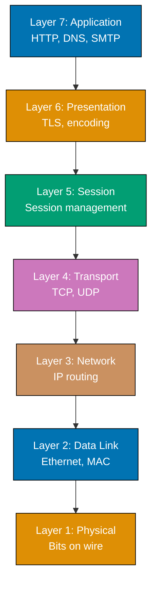
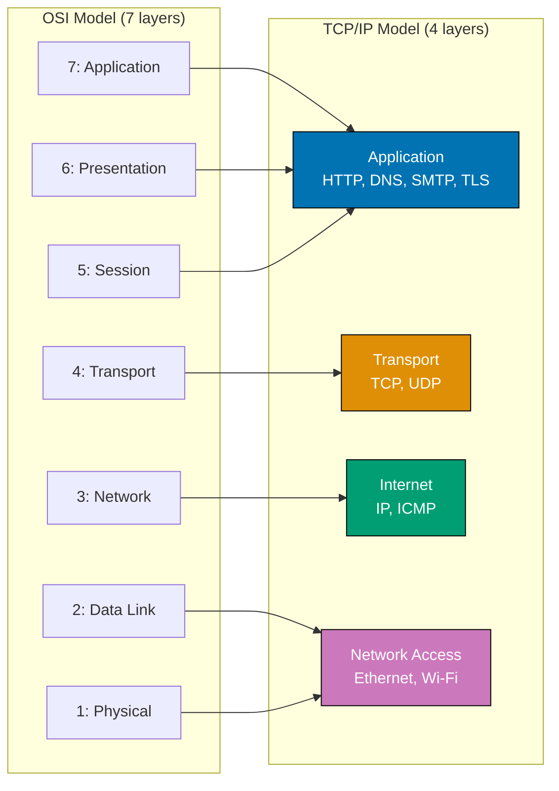
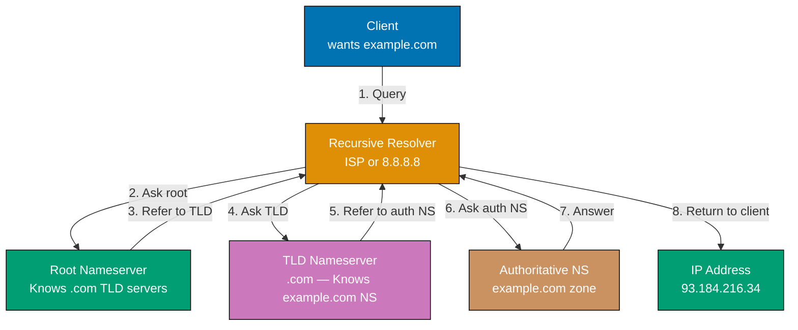
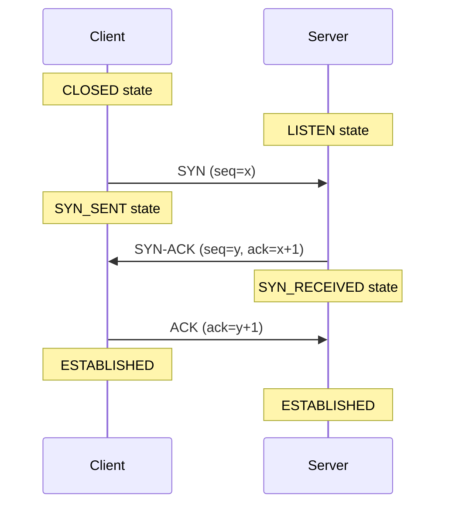

## Example 1: What Is a Network — Hosts, Packets, Links

A network connects devices (hosts) that communicate by breaking data into packets and sending them across links. Every piece of data you send — an HTTP request, a DNS query, a video stream — travels as a sequence of discrete packets through physical or wireless links.

```python
# Conceptual representation of a network message being packetized
# No socket needed — demonstrates the fundamental abstraction

message = "Hello, server!"
# => message: "Hello, server!" (14 bytes of data)

# Networks break data into fixed-size packets for transmission
MAX_PACKET_SIZE = 8  # => Simulates an 8-byte maximum transmission unit (MTU)
                     # => Real Ethernet MTU is 1500 bytes; IP can fragment larger data

# Simulate splitting a message into packets
packets = []                               # => packets: [] (empty list to hold fragments)
for i in range(0, len(message), MAX_PACKET_SIZE):
    # => i iterates: 0, 8 — two chunks for our 14-byte message
    packet = message[i:i + MAX_PACKET_SIZE]  # => First iteration: "Hello, s"
                                              # => Second iteration: "erver!"
    packets.append(packet)                    # => Adds each chunk to the list

print("Original message:", message)        # => Output: Original message: Hello, server!
print("Packet count:", len(packets))       # => Output: Packet count: 2
for idx, pkt in enumerate(packets):
    print(f"  Packet {idx}: {repr(pkt)}")  # => Output: Packet 0: 'Hello, s'
                                            # => Output: Packet 1: 'erver!'

# Reassemble at the destination
reassembled = "".join(packets)             # => reassembled: "Hello, server!"
print("Reassembled:", reassembled)         # => Output: Reassembled: Hello, server!
print("Intact:", message == reassembled)   # => Output: Intact: True
```

**Key Takeaway**: Networks transmit data by fragmenting it into packets that travel independently and are reassembled at the destination.

**Why It Matters**: Every networked application — web server, database client, streaming service — sends and receives packets. Understanding packetization explains why large transfers are split, why packet loss causes retransmissions, and why MTU tuning matters for performance-sensitive systems. Misconfigured MTU causes silent throughput degradation that is difficult to diagnose without this mental model.

---

## Example 2: OSI Model Layers

The OSI model defines seven layers of abstraction for network communication. Each layer adds its own header to data (encapsulation) as it travels down the stack, and strips headers as data travels up at the receiver.



```python
# Simulate the OSI encapsulation model in Python
# Each layer wraps the payload with its own header

def encapsulate(payload, layer_name, header):
    # => Simulates a layer adding its header to the payload
    # => Real encapsulation prepends binary headers; this uses strings for clarity
    return f"[{layer_name} header: {header}] {payload}"

# Starting payload: application data
data = "GET / HTTP/1.1"                # => data: "GET / HTTP/1.1" (Layer 7 application data)

# Each layer wraps the data as it travels down the stack
presentation = encapsulate(data, "TLS", "encrypt=AES256")
# => presentation: "[TLS header: encrypt=AES256] GET / HTTP/1.1"

transport = encapsulate(presentation, "TCP", "src_port=54321 dst_port=443 seq=1")
# => transport: "[TCP header: src_port=54321 dst_port=443 seq=1] [TLS header...]"

network = encapsulate(transport, "IP", "src=192.168.1.10 dst=93.184.216.34")
# => network: "[IP header: src=... dst=...] [TCP header...] ..."

datalink = encapsulate(network, "Ethernet", "src_mac=AA:BB:CC dst_mac=DD:EE:FF")
# => datalink: "[Ethernet header:...] [IP header...] ..."

print("Final frame sent on wire:")
print(datalink)
# => Output: [Ethernet header: src_mac=AA:BB:CC dst_mac=DD:EE:FF]
#            [IP header: src=192.168.1.10 dst=93.184.216.34]
#            [TCP header: src_port=54321 dst_port=443 seq=1]
#            [TLS header: encrypt=AES256] GET / HTTP/1.1

# Decapsulation at receiver (reverse order)
layers = [datalink]
print("\nDecapsulation at receiver:")
for i in range(4):
    # => Strips outermost header at each layer
    print(f"  Layer stripped: {layers[-1].split(']')[0]}]")
```

**Key Takeaway**: The OSI model layers add headers during encapsulation (sending) and strip them during decapsulation (receiving), giving each layer a clean abstraction boundary.

**Why It Matters**: When debugging network issues, layer-by-layer thinking narrows the problem space. A ping that works but HTTP fails means the issue is at Layer 7, not Layer 3. A TCP connection that establishes but TLS fails means the issue is at the presentation layer. Every network tool — Wireshark, tcpdump, traceroute — maps to specific OSI layers, making the model practically essential for diagnosis.

---

## Example 3: TCP/IP Model vs OSI Model

The TCP/IP model collapses the OSI seven layers into four practical layers used by the modern internet. Understanding both models helps you map protocol documentation to actual implementations.



```python
# Mapping between OSI and TCP/IP models

OSI_LAYERS = {             # => Seven-layer theoretical model
    7: "Application",      # => User-facing protocols: HTTP, SMTP, DNS, FTP
    6: "Presentation",     # => Data format, encryption (TLS often placed here)
    5: "Session",          # => Session establishment and management
    4: "Transport",        # => TCP/UDP — reliable or unreliable delivery
    3: "Network",          # => IP routing across networks
    2: "Data Link",        # => MAC addressing, frame delivery on local network
    1: "Physical",         # => Bits on wire, electrical signals
}

TCPIP_LAYERS = {           # => Four-layer practical model used by the internet
    4: ("Application", ["HTTP", "HTTPS", "DNS", "SMTP", "FTP", "SSH", "TLS"]),
    # => Combines OSI layers 5, 6, 7 — application protocols live here
    3: ("Transport", ["TCP", "UDP", "SCTP"]),
    # => Same as OSI Layer 4 — TCP and UDP
    2: ("Internet", ["IPv4", "IPv6", "ICMP", "BGP", "OSPF"]),
    # => Same as OSI Layer 3 — IP routing
    1: ("Network Access", ["Ethernet", "Wi-Fi", "PPP", "ARP"]),
    # => Combines OSI layers 1 and 2 — physical and data link
}

print("TCP/IP Layer -> Protocols:")
for layer_num in sorted(TCPIP_LAYERS.keys(), reverse=True):
    name, protocols = TCPIP_LAYERS[layer_num]
    print(f"  Layer {layer_num} ({name}): {', '.join(protocols)}")
# => Output:
# => Layer 4 (Application): HTTP, HTTPS, DNS, SMTP, FTP, SSH, TLS
# => Layer 3 (Transport): TCP, UDP, SCTP
# => Layer 2 (Internet): IPv4, IPv6, ICMP, BGP, OSPF
# => Layer 1 (Network Access): Ethernet, Wi-Fi, PPP, ARP
```

**Key Takeaway**: The TCP/IP model's four layers map directly to internet protocols in use today; the OSI model provides finer conceptual granularity useful for understanding and debugging.

**Why It Matters**: Protocol documentation and RFCs reference both models. Network engineers think in OSI layers when diagnosing, but implement using TCP/IP layers. Knowing both prevents confusion when reading protocol specs, tool documentation, and architecture diagrams.

---

## Example 4: IP Addresses — IPv4 and CIDR Notation

IPv4 addresses are 32-bit numbers written as four decimal octets (0-255). CIDR notation appends a prefix length (`/24`) indicating how many bits identify the network versus the host portion.

```python
import ipaddress  # => Standard library module for IP address manipulation
                  # => Available since Python 3.3 — no external deps needed

# Create an IPv4 address object
addr = ipaddress.IPv4Address("192.168.1.100")
# => addr: IPv4Address('192.168.1.100')
# => Internally stored as 32-bit integer: 3232235876

print("Address:", addr)                        # => Output: 192.168.1.100
print("Packed (bytes):", addr.packed)          # => Output: b'\xc0\xa8\x01d'
print("Integer:", int(addr))                   # => Output: 3232235876
print("Is private:", addr.is_private)          # => Output: True (192.168.x.x is RFC1918)
print("Is loopback:", addr.is_loopback)        # => Output: False

# CIDR notation: network + prefix length
network = ipaddress.IPv4Network("192.168.1.0/24")
# => network: IPv4Network('192.168.1.0/24')
# => /24 means first 24 bits are network part, last 8 bits are host part

print("\nNetwork:", network)                   # => Output: 192.168.1.0/24
print("Netmask:", network.netmask)             # => Output: 255.255.255.0
print("Network address:", network.network_address)  # => Output: 192.168.1.0
print("Broadcast:", network.broadcast_address)      # => Output: 192.168.1.255
print("Num hosts:", network.num_addresses - 2)      # => Output: 254
# => -2 because .0 (network) and .255 (broadcast) are reserved

# Check if an address belongs to a network
test_addr = ipaddress.IPv4Address("192.168.1.50")
# => test_addr: IPv4Address('192.168.1.50')
print("\n192.168.1.50 in 192.168.1.0/24:", test_addr in network)
# => Output: True

outside_addr = ipaddress.IPv4Address("10.0.0.1")
# => outside_addr: IPv4Address('10.0.0.1') (different private range)
print("10.0.0.1 in 192.168.1.0/24:", outside_addr in network)
# => Output: False
```

**Key Takeaway**: IPv4 addresses are 32-bit integers expressed as dotted-decimal notation; CIDR prefix length defines the network/host boundary.

**Why It Matters**: Every firewall rule, routing table entry, and access control list uses CIDR notation. Miscalculating network ranges causes security holes (too-broad rules) or connectivity failures (too-narrow rules). Cloud VPC configuration, Kubernetes pod CIDR, and security group rules all require confident CIDR arithmetic.

---

## Example 5: Subnet Masks and Subnetting

Subnetting divides a larger network into smaller sub-networks. The subnet mask determines which portion of an IP address identifies the network and which identifies the host.

```python
import ipaddress

# Subnetting: divide a /24 into four /26 subnets
parent_network = ipaddress.IPv4Network("10.0.0.0/24")
# => parent_network: 10.0.0.0/24 (256 addresses total)

# Split into 4 equal subnets (each becomes /26 = 64 addresses, 62 usable)
subnets = list(parent_network.subnets(prefixlen_diff=2))
# => prefixlen_diff=2 adds 2 bits to prefix: /24 + 2 = /26
# => subnets: list of 4 IPv4Network objects

print(f"Parent network: {parent_network}")
# => Output: Parent network: 10.0.0.0/24
print(f"Divided into {len(subnets)} subnets:\n")
# => Output: Divided into 4 subnets:

for i, subnet in enumerate(subnets):
    usable = subnet.num_addresses - 2  # => Subtract network and broadcast addresses
    print(f"  Subnet {i+1}: {subnet}")
    print(f"    Range: {subnet.network_address} - {subnet.broadcast_address}")
    print(f"    Usable hosts: {usable}")
    print()
# => Output:
# =>   Subnet 1: 10.0.0.0/26
# =>     Range: 10.0.0.0 - 10.0.0.63    (62 usable)
# =>   Subnet 2: 10.0.64.0/26
# =>     Range: 10.0.64.0 - 10.0.64.63  (62 usable -- wait, /26 gives .0-.63)

# Actually subnets of 10.0.0.0/24 with /26:
# Subnet 1: 10.0.0.0/26   => .0 to .63
# Subnet 2: 10.0.0.64/26  => .64 to .127
# Subnet 3: 10.0.0.128/26 => .128 to .191
# Subnet 4: 10.0.0.192/26 => .192 to .255

# Determine which subnet an IP belongs to
target = ipaddress.IPv4Address("10.0.0.150")
# => target: 10.0.0.150
for subnet in subnets:
    if target in subnet:
        # => 10.0.0.150 falls in 10.0.0.128/26 (.128 to .191)
        print(f"{target} belongs to subnet: {subnet}")
        # => Output: 10.0.0.150 belongs to subnet: 10.0.0.128/26
```

**Key Takeaway**: Subnetting divides a network by borrowing bits from the host portion, creating multiple smaller networks with isolated broadcast domains.

**Why It Matters**: Data center and cloud network design relies on subnetting to isolate environments (production vs staging), control broadcast traffic, and apply security policies per subnet. Misaligned subnets prevent hosts from communicating or accidentally route traffic across security boundaries.

---

## Example 6: IPv6 Addresses

IPv6 uses 128-bit addresses written as eight groups of four hexadecimal digits. It solves IPv4 exhaustion and simplifies address autoconfiguration.

```python
import ipaddress

# IPv6 address representation
addr6 = ipaddress.IPv6Address("2001:0db8:85a3:0000:0000:8a2e:0370:7334")
# => addr6: IPv6Address('2001:db8:85a3::8a2e:370:7334')
# => Python automatically compresses consecutive zero groups with ::

print("Full address:", addr6.exploded)
# => Output: 2001:0db8:85a3:0000:0000:8a2e:0370:7334
# => exploded shows all 8 groups without compression

print("Compressed:", addr6.compressed)
# => Output: 2001:db8:85a3::8a2e:370:7334
# => :: replaces the longest run of consecutive zero groups

# Special IPv6 addresses
loopback6 = ipaddress.IPv6Address("::1")
# => loopback6: IPv6Address('::1')
# => Equivalent to 127.0.0.1 in IPv4

link_local = ipaddress.IPv6Address("fe80::1")
# => link_local: starts with fe80::/10 — only valid on local network segment
# => Not routable beyond the local link (used for neighbor discovery)

print("\nLoopback:", loopback6, "| is_loopback:", loopback6.is_loopback)
# => Output: ::1 | is_loopback: True
print("Link-local:", link_local, "| is_link_local:", link_local.is_link_local)
# => Output: fe80::1 | is_link_local: True

# IPv6 network notation
net6 = ipaddress.IPv6Network("2001:db8::/32")
# => net6: IPv6Network('2001:db8::/32')
# => /32 prefix leaves 96 bits for host addressing (2^96 hosts)
print("\nIPv6 network:", net6)
# => Output: 2001:db8::/32
print("Prefix length:", net6.prefixlen)
# => Output: 32
print("Num addresses:", net6.num_addresses)
# => Output: 79228162514264337593543950336 (2^96 — vastly more than IPv4's 2^32)
```

**Key Takeaway**: IPv6 expands the address space from 32 bits to 128 bits and uses colon-separated hexadecimal groups with `::` compression for consecutive zero groups.

**Why It Matters**: IPv4 address exhaustion drove IPv6 adoption. Modern infrastructure increasingly operates dual-stack (both IPv4 and IPv6). Applications that assume IPv4-only break in IPv6-only environments, which appear in mobile networks and some cloud configurations.

---

## Example 7: MAC Addresses and ARP

MAC (Media Access Control) addresses are 48-bit hardware identifiers assigned to network interfaces. ARP (Address Resolution Protocol) maps IP addresses to MAC addresses on a local network segment.

```python
import struct  # => Standard library for binary data packing/unpacking

# Simulate a MAC address
mac_bytes = bytes([0xAA, 0xBB, 0xCC, 0xDD, 0xEE, 0xFF])
# => mac_bytes: b'\xaa\xbb\xcc\xdd\xee\xff' (6 bytes = 48 bits)

# Format MAC address as colon-separated hex string
mac_str = ":".join(f"{b:02x}" for b in mac_bytes)
# => mac_str: "aa:bb:cc:dd:ee:ff"
# => :02x format pads single-digit hex values with leading zero
print("MAC address:", mac_str)  # => Output: aa:bb:cc:dd:ee:ff

# The first byte's least-significant bit indicates unicast vs multicast
first_byte = mac_bytes[0]           # => first_byte: 0xAA = 10101010 in binary
is_multicast = bool(first_byte & 1) # => Bit 0 of first byte: 0 = unicast, 1 = multicast
                                     # => 0xAA & 0x01 = 0 => unicast
print("Is multicast:", is_multicast)  # => Output: Is multicast: False

# The second least-significant bit of first byte: 0=globally unique, 1=locally administered
is_local = bool(first_byte & 2)     # => 0xAA & 0x02 = 0x02 => locally administered
print("Is locally administered:", bool(first_byte & 2))  # => Output: True

# Simulate ARP table (IP -> MAC mapping)
arp_table = {
    "192.168.1.1":   "aa:bb:cc:11:22:33",  # => Gateway router's MAC
    "192.168.1.100": "aa:bb:cc:44:55:66",  # => Host A's MAC
    "192.168.1.101": "aa:bb:cc:77:88:99",  # => Host B's MAC
}
# => ARP table maintained by OS; entries expire (typically 20 min)

def arp_lookup(ip):
    # => Simulates ARP cache lookup; real ARP sends broadcast if not found
    mac = arp_table.get(ip)
    if mac:
        return f"ARP cache hit: {ip} -> {mac}"  # => Found in local cache
    return f"ARP broadcast needed for {ip}"      # => Must broadcast to find MAC

print(arp_lookup("192.168.1.1"))    # => Output: ARP cache hit: 192.168.1.1 -> aa:bb:cc:11:22:33
print(arp_lookup("192.168.1.200"))  # => Output: ARP broadcast needed for 192.168.1.200
```

**Key Takeaway**: MAC addresses identify network interfaces at Layer 2; ARP resolves IP addresses to MAC addresses so frames can be delivered on a local network segment.

**Why It Matters**: ARP cache poisoning is a common network attack — an attacker sends fake ARP replies to redirect traffic. Understanding ARP explains why switches learn MAC addresses, why VLAN isolation is important, and why some cloud environments prohibit ARP for security (using DHCP or static mappings instead).

---

## Example 8: DNS Resolution — Query Lifecycle

DNS translates human-readable domain names into IP addresses. A query travels from the client's resolver to root nameservers, TLD nameservers, and finally authoritative nameservers.



```python
import socket  # => Standard library for DNS and network operations

# Resolve a hostname to its IP addresses
hostname = "example.com"
# => hostname: "example.com" (human-readable domain name)

# getaddrinfo returns comprehensive address info (works for both IPv4 and IPv6)
results = socket.getaddrinfo(hostname, 80)
# => results: list of (family, type, proto, canonname, sockaddr) tuples
# => port 80 specified to get HTTP-relevant entries

print(f"DNS results for {hostname}:")
for family, stype, proto, canonname, sockaddr in results:
    ip = sockaddr[0]   # => IP address extracted from sockaddr tuple
    port = sockaddr[1] # => Port number (80 as requested)
    family_name = "IPv4" if family == socket.AF_INET else "IPv6"
    # => AF_INET = 2 (IPv4), AF_INET6 = 10 (IPv6)
    print(f"  {family_name}: {ip}:{port}")
# => Output: IPv4: 93.184.216.34:80 (actual result may differ)

# Simple hostname-to-IP (IPv4 only)
ip4 = socket.gethostbyname(hostname)
# => ip4: "93.184.216.34" — one IPv4 address
print(f"\ngethostbyname: {hostname} -> {ip4}")
# => Output: gethostbyname: example.com -> 93.184.216.34

# Reverse DNS: IP to hostname
try:
    reverse = socket.gethostbyaddr("8.8.8.8")
    # => reverse: ('dns.google', [], ['8.8.8.8'])
    print(f"Reverse DNS: 8.8.8.8 -> {reverse[0]}")
    # => Output: Reverse DNS: 8.8.8.8 -> dns.google
except socket.herror as e:
    print(f"No reverse DNS: {e}")  # => Some IPs have no PTR record
```

**Key Takeaway**: DNS resolution is hierarchical — clients query resolvers, which recursively ask root, TLD, and authoritative nameservers, then cache the result for the TTL duration.

**Why It Matters**: DNS is the internet's phone book. DNS misconfiguration breaks all services that depend on it. TTL values control cache duration — too short increases resolver load; too long slows propagation of IP changes. DNS failure is a common root cause of outages because it affects every hostname-based connection in the system.

---

## Example 9: DNS Record Types

DNS supports multiple record types beyond simple A records. Each type serves a specific purpose in routing, mail delivery, service discovery, and domain verification.

```python
import socket

# Demonstrate different DNS record types conceptually
# Python's socket module provides basic DNS lookups
# For full record-type queries, dnspython is needed (external); we use socket here

# A Record: hostname -> IPv4 address
try:
    a_record = socket.gethostbyname("example.com")
    # => a_record: "93.184.216.34" (IPv4)
    print(f"A record (example.com): {a_record}")
except socket.gaierror as e:
    print(f"A record lookup failed: {e}")

# AAAA Record: hostname -> IPv6 address
try:
    aaaa_results = socket.getaddrinfo("example.com", None, socket.AF_INET6)
    # => Filter to IPv6 only (AF_INET6)
    if aaaa_results:
        aaaa = aaaa_results[0][4][0]  # => Extract IPv6 address string
        print(f"AAAA record (example.com): {aaaa}")
    # => Output: AAAA record: 2606:2800:220:1:248:1893:25c8:1946 (example value)
except socket.gaierror as e:
    print(f"AAAA lookup failed or no IPv6: {e}")

# MX Record: mail exchange hostname for a domain
# socket module doesn't support MX directly; show structure conceptually
mx_records_example = [
    # => (priority, mail_server) — lower priority number = preferred server
    (10, "mail1.example.com"),  # => Primary mail server
    (20, "mail2.example.com"),  # => Backup mail server
]
print("\nMX records (conceptual):")
for priority, server in sorted(mx_records_example):
    print(f"  Priority {priority}: {server}")
# => Output:
# =>   Priority 10: mail1.example.com
# =>   Priority 20: mail2.example.com

# Show record types reference
dns_record_types = {
    "A":     "IPv4 address mapping (hostname -> 32-bit IP)",
    "AAAA":  "IPv6 address mapping (hostname -> 128-bit IP)",
    "CNAME": "Canonical name alias (alias -> real hostname)",
    "MX":    "Mail exchange server (domain -> mail server)",
    "TXT":   "Arbitrary text (SPF, DKIM, domain verification)",
    "NS":    "Authoritative nameservers for a zone",
    "PTR":   "Reverse DNS (IP -> hostname)",
    "SOA":   "Start of Authority (zone metadata, serial number)",
    "SRV":   "Service location (protocol, port, hostname)",
}
print("\nDNS Record Types:")
for rtype, description in dns_record_types.items():
    print(f"  {rtype:6s}: {description}")
```

**Key Takeaway**: DNS record types serve distinct roles — A/AAAA for addresses, CNAME for aliases, MX for mail, TXT for verification, and SRV for service discovery.

**Why It Matters**: Incorrect DNS records cause email delivery failures (wrong MX), broken HTTPS (wrong A/CNAME pointing to wrong server), and failed service discovery. CNAME chains add latency to resolution. TXT records hold SPF and DKIM data that determines whether email gets delivered or marked as spam.

---

## Example 10: UDP Basics — Python Socket

UDP (User Datagram Protocol) is connectionless. Packets are sent without establishing a connection first, with no delivery guarantee or ordering. This makes UDP fast and suitable for time-sensitive applications.

```python
import socket      # => Standard library for socket programming
import threading   # => Standard library for running server in background thread
import time        # => Standard library for timing

# UDP is connectionless — no handshake, just send and receive datagrams

def udp_server(port):
    # => Creates a UDP server socket that receives messages
    sock = socket.socket(socket.AF_INET, socket.SOCK_DGRAM)
    # => AF_INET: IPv4 address family
    # => SOCK_DGRAM: UDP socket type (datagram, not stream)
    sock.bind(("127.0.0.1", port))  # => Bind to localhost on specified port
    sock.settimeout(2.0)             # => 2-second timeout to avoid blocking forever

    try:
        data, addr = sock.recvfrom(1024)
        # => recvfrom returns (data_bytes, (sender_ip, sender_port))
        # => 1024 = max bytes to receive in one call
        print(f"Server received: {data.decode()} from {addr}")
        # => Output: Server received: Hello UDP! from ('127.0.0.1', <ephemeral_port>)
        sock.sendto(b"ACK", addr)
        # => Send acknowledgment back to sender (application-level, not UDP built-in)
    except socket.timeout:
        print("Server: no data received (timeout)")
    finally:
        sock.close()  # => Release the socket resource

def udp_client(port):
    # => Creates a UDP client socket that sends a message
    sock = socket.socket(socket.AF_INET, socket.SOCK_DGRAM)
    # => No connect() call needed — UDP is connectionless
    sock.settimeout(2.0)

    try:
        message = b"Hello UDP!"               # => Message as bytes
        sock.sendto(message, ("127.0.0.1", port))
        # => sendto(data, (host, port)) — sends datagram to destination
        # => No connection required; fire and forget (or wait for response)

        response, server_addr = sock.recvfrom(1024)
        # => Wait for response from server
        print(f"Client received: {response.decode()} from {server_addr}")
        # => Output: Client received: ACK from ('127.0.0.1', <server_port>)
    except socket.timeout:
        print("Client: no response received (timeout)")
    finally:
        sock.close()

# Run server in background thread, then client
port = 9001                                          # => Arbitrary port for this demo
server_thread = threading.Thread(target=udp_server, args=(port,), daemon=True)
server_thread.start()  # => Start server in background
time.sleep(0.1)        # => Brief pause to let server bind before client sends
udp_client(port)
server_thread.join(timeout=3)
```

**Key Takeaway**: UDP sockets use `SOCK_DGRAM` and `sendto()`/`recvfrom()` — no connection establishment, just datagrams with source and destination addresses.

**Why It Matters**: UDP powers DNS queries, video streaming, VoIP, and online gaming — applications where a dropped packet is preferable to waiting for retransmission. Understanding UDP helps you choose the right transport protocol for latency-sensitive applications and implement application-level reliability when needed.

---

## Example 11: TCP Basics — Python Socket

TCP (Transmission Control Protocol) provides reliable, ordered, connection-oriented communication. A connection must be established before data flows, and the protocol guarantees delivery and ordering.

```python
import socket
import threading
import time

def tcp_server(port):
    # => Creates a TCP server that listens for connections
    server_sock = socket.socket(socket.AF_INET, socket.SOCK_STREAM)
    # => SOCK_STREAM: TCP socket type (stream, not datagram)
    server_sock.setsockopt(socket.SOL_SOCKET, socket.SO_REUSEADDR, 1)
    # => SO_REUSEADDR: allows reuse of port immediately after server closes
    # => Without this, you get "Address already in use" for ~60 seconds

    server_sock.bind(("127.0.0.1", port))  # => Bind to address:port
    server_sock.listen(1)                   # => Queue up to 1 pending connection
    server_sock.settimeout(3.0)

    try:
        conn, addr = server_sock.accept()
        # => accept() blocks until a client connects
        # => Returns (connection_socket, client_address)
        # => conn is a NEW socket dedicated to this one client
        print(f"Server: connection from {addr}")
        # => Output: Server: connection from ('127.0.0.1', <client_port>)

        data = conn.recv(1024)
        # => recv(1024): receive up to 1024 bytes — blocks until data arrives
        print(f"Server: received '{data.decode()}'")
        # => Output: Server: received 'Hello TCP!'

        conn.sendall(b"World!")
        # => sendall ensures all bytes are sent (retries if partial send)
        conn.close()  # => Close this client's connection
    except socket.timeout:
        print("Server: timeout waiting for connection")
    finally:
        server_sock.close()

def tcp_client(port):
    client_sock = socket.socket(socket.AF_INET, socket.SOCK_STREAM)
    # => SOCK_STREAM creates a TCP socket
    client_sock.settimeout(3.0)

    try:
        client_sock.connect(("127.0.0.1", port))
        # => connect() performs TCP three-way handshake: SYN -> SYN-ACK -> ACK
        # => Blocks until handshake completes or timeout

        client_sock.sendall(b"Hello TCP!")
        # => sendall sends all bytes reliably (TCP handles retransmit if needed)

        response = client_sock.recv(1024)
        # => Receive server's response
        print(f"Client: received '{response.decode()}'")
        # => Output: Client: received 'World!'
    except (socket.timeout, ConnectionRefusedError) as e:
        print(f"Client error: {e}")
    finally:
        client_sock.close()

port = 9002
server_thread = threading.Thread(target=tcp_server, args=(port,), daemon=True)
server_thread.start()
time.sleep(0.1)
tcp_client(port)
server_thread.join(timeout=4)
```

**Key Takeaway**: TCP sockets use `SOCK_STREAM`, require `connect()` (client) and `accept()` (server), and guarantee reliable ordered delivery.

**Why It Matters**: HTTP, database protocols, SSH, and most application protocols run over TCP because reliability matters more than latency for those use cases. Understanding raw TCP sockets reveals what frameworks like Flask, Django, and Express abstract — helping you debug connection issues, tune buffer sizes, and understand why TCP connection overhead matters in high-throughput systems.

---

## Example 12: TCP Three-Way Handshake

TCP establishes a connection with a three-step handshake: SYN (client initiates), SYN-ACK (server acknowledges and synchronizes), ACK (client confirms). This synchronizes sequence numbers for reliable delivery.



```python
import socket
import threading
import time

# Observe TCP connection states conceptually via socket operations

def handshake_demo_server(port):
    srv = socket.socket(socket.AF_INET, socket.SOCK_STREAM)
    srv.setsockopt(socket.SOL_SOCKET, socket.SO_REUSEADDR, 1)
    srv.bind(("127.0.0.1", port))
    srv.listen(5)         # => listen() puts server in LISTEN state
                          # => OS now responds to SYN packets automatically
    srv.settimeout(3.0)
    print("Server: LISTEN state — waiting for SYN")
    # => SYN queue: holds half-open connections (received SYN, sent SYN-ACK, awaiting ACK)
    # => accept queue: holds fully established connections awaiting accept()

    try:
        conn, addr = srv.accept()
        # => accept() completes when 3-way handshake finishes
        # => OS handled SYN, SYN-ACK, ACK automatically at kernel level
        # => We only see the completed ESTABLISHED connection
        print(f"Server: ESTABLISHED — connection from {addr}")
        # => Output: Server: ESTABLISHED — connection from ('127.0.0.1', <port>)

        # TCP sequence numbers synchronized during handshake
        # Client chose random ISN (Initial Sequence Number) x
        # Server chose random ISN y
        # After handshake: client sends with seq starting at x+1
        #                  server sends with seq starting at y+1
        conn.sendall(b"CONNECTED")
        conn.close()
    except socket.timeout:
        pass
    finally:
        srv.close()

def handshake_demo_client(port):
    client = socket.socket(socket.AF_INET, socket.SOCK_STREAM)
    client.settimeout(3.0)

    print("Client: initiating TCP handshake (SYN)")
    # => connect() triggers: client sends SYN with random seq=x
    client.connect(("127.0.0.1", port))
    # => Server responds: SYN-ACK with seq=y, ack=x+1
    # => Client sends: ACK with ack=y+1
    # => connect() returns when ACK sent — connection is ESTABLISHED
    print("Client: ESTABLISHED — handshake complete")
    # => Output: Client: ESTABLISHED — handshake complete

    data = client.recv(64)
    print(f"Client received: {data.decode()}")
    # => Output: Client received: CONNECTED
    client.close()
    # => close() initiates four-way teardown (FIN-ACK sequence)

port = 9003
srv_thread = threading.Thread(target=handshake_demo_server, args=(port,), daemon=True)
srv_thread.start()
time.sleep(0.1)
handshake_demo_client(port)
srv_thread.join(timeout=4)
```

**Key Takeaway**: The TCP three-way handshake synchronizes sequence numbers between client and server before any data flows, enabling reliable ordered delivery.

**Why It Matters**: The handshake adds one round-trip time (RTT) of latency to every new TCP connection. HTTP/1.1 multiplies this cost by creating one connection per resource. HTTP/2 solves this with connection reuse. TLS adds further handshake RTTs. Understanding the handshake cost drives decisions about connection pooling, keep-alive settings, and protocol selection.

---

## Example 13: TCP Four-Way Teardown

TCP connection termination uses a four-step process: each side independently signals it has no more data to send (FIN), and the other side acknowledges. This allows half-close — one side can stop sending while still receiving.

```python
import socket
import threading
import time

# Demonstrate TCP teardown: FIN-ACK-FIN-ACK sequence

def teardown_server(port):
    srv = socket.socket(socket.AF_INET, socket.SOCK_STREAM)
    srv.setsockopt(socket.SOL_SOCKET, socket.SO_REUSEADDR, 1)
    srv.bind(("127.0.0.1", port))
    srv.listen(1)
    srv.settimeout(3.0)

    try:
        conn, addr = srv.accept()
        conn.settimeout(2.0)

        data = conn.recv(64)                # => Receive client's data
        print(f"Server: received '{data.decode()}'")

        conn.sendall(b"SERVER DATA")        # => Send response
        # => Server calls shutdown(SHUT_WR) to send FIN to client
        # => This signals "I have no more data to send" but can still receive
        conn.shutdown(socket.SHUT_WR)       # => Step 1: Server sends FIN
        print("Server: sent FIN (SHUT_WR)")
        # => Output: Server: sent FIN (SHUT_WR)

        # Server can still receive after sending FIN (half-close)
        try:
            remaining = conn.recv(64)       # => Wait for client's FIN
            if not remaining:
                print("Server: received client FIN (empty recv = connection closed)")
                # => Empty recv means client sent FIN and closed its send side
        except socket.timeout:
            pass

        conn.close()    # => Step 4: Final close — releases all resources
        print("Server: connection fully closed")
    except socket.timeout:
        pass
    finally:
        srv.close()

def teardown_client(port):
    client = socket.socket(socket.AF_INET, socket.SOCK_STREAM)
    client.settimeout(3.0)
    client.connect(("127.0.0.1", port))

    client.sendall(b"CLIENT DATA")
    # => Client sends data, then initiates teardown

    data = client.recv(64)
    print(f"Client: received '{data.decode()}'")

    # Client receives server's FIN (SHUT_WR above = empty recv here)
    remaining = client.recv(64)         # => Receive server's FIN
    if not remaining:
        print("Client: received server FIN")
        # => Output: Client: received server FIN

    # Client sends its own FIN
    client.shutdown(socket.SHUT_WR)     # => Step 3: Client sends FIN
    print("Client: sent FIN — entering TIME_WAIT")
    # => TIME_WAIT lasts 2*MSL (Maximum Segment Lifetime) = ~60-120 seconds
    # => Ensures delayed packets don't confuse future connections on same port

    client.close()

port = 9004
srv_thread = threading.Thread(target=teardown_server, args=(port,), daemon=True)
srv_thread.start()
time.sleep(0.1)
teardown_client(port)
srv_thread.join(timeout=4)
```

**Key Takeaway**: TCP teardown is a four-step process (FIN-ACK-FIN-ACK) allowing each side to independently close its send channel while potentially still receiving.

**Why It Matters**: TIME_WAIT state causes "Address already in use" errors when restarting servers quickly. `SO_REUSEADDR` mitigates this. Understanding teardown explains why closing database connections properly matters — unclosed connections exhaust the server's connection pool and leave ports in TIME_WAIT, eventually preventing new connections.

---

## Example 14: Port Numbers — Well-Known vs Ephemeral

Ports identify specific services on a host. Well-known ports (0-1023) are assigned to standard services. Registered ports (1024-49151) are for common applications. Ephemeral ports (49152-65535) are assigned temporarily by the OS to clients.

```python
import socket

# Well-known port assignments
WELL_KNOWN_PORTS = {
    20:  "FTP (data)",       # => File Transfer Protocol data channel
    21:  "FTP (control)",    # => File Transfer Protocol command channel
    22:  "SSH",              # => Secure Shell
    25:  "SMTP",             # => Simple Mail Transfer Protocol (outbound email)
    53:  "DNS",              # => Domain Name System queries
    80:  "HTTP",             # => HyperText Transfer Protocol (web)
    110: "POP3",             # => Post Office Protocol (email retrieval)
    143: "IMAP",             # => Internet Message Access Protocol
    443: "HTTPS",            # => HTTP over TLS (secure web)
    465: "SMTPS",            # => SMTP over TLS
    993: "IMAPS",            # => IMAP over TLS
    3306: "MySQL",           # => MySQL database (registered, not well-known)
    5432: "PostgreSQL",      # => PostgreSQL database
    6379: "Redis",           # => Redis cache
    27017: "MongoDB",        # => MongoDB database
}

print("Common port assignments:")
for port, service in sorted(WELL_KNOWN_PORTS.items()):
    category = "well-known" if port <= 1023 else "registered"
    # => Ports 0-1023 require root/admin privileges to bind on Unix
    print(f"  {port:5d} ({category:10s}): {service}")

# Get an ephemeral port from the OS
# Bind to port 0 — OS assigns an available ephemeral port
ephemeral_sock = socket.socket(socket.AF_INET, socket.SOCK_STREAM)
ephemeral_sock.bind(("127.0.0.1", 0))   # => Port 0 = let OS choose
ephemeral_port = ephemeral_sock.getsockname()[1]
# => getsockname() returns (host, port) tuple of bound address
# => ephemeral_port: some value in range 32768-60999 (Linux) or 49152-65535 (IANA)
print(f"\nOS-assigned ephemeral port: {ephemeral_port}")
# => Output: OS-assigned ephemeral port: 54321 (varies per OS and run)

# Look up service name for a port
try:
    service_name = socket.getservbyport(80, "tcp")
    # => getservbyport looks up /etc/services for port -> service name
    print(f"\nPort 80/tcp = {service_name}")  # => Output: http
except OSError:
    print("Service lookup not available")

ephemeral_sock.close()
```

**Key Takeaway**: Ports 0-1023 are well-known and require elevated privileges; ports 1024-49151 are registered for common services; ports 49152-65535 are ephemeral, assigned by the OS for outgoing connections.

**Why It Matters**: Security scanners enumerate open ports to discover running services. Firewall rules reference ports to permit or deny traffic. Running privileged services on non-standard ports does not meaningfully improve security but does aid in avoiding automated scans of well-known ports.

---

## Example 15: Socket Programming — TCP Server

A production-pattern TCP server listens on a port, accepts connections, handles each client, and cleans up resources. This example shows the minimal correct pattern.

```python
import socket
import threading

def handle_client(conn, addr):
    # => This function runs in its own thread for each connected client
    # => Isolation prevents one slow client from blocking others
    print(f"[{addr}] Connected")
    try:
        while True:
            data = conn.recv(1024)
            # => recv() blocks until data arrives or connection closes
            # => Returns empty bytes b"" when client disconnects
            if not data:
                break          # => Client disconnected — exit loop
            message = data.decode("utf-8", errors="replace")
            # => Decode bytes to string; replace invalid UTF-8 sequences
            print(f"[{addr}] Received: {message.strip()}")
            response = f"Echo: {message}".encode("utf-8")
            # => Encode response back to bytes for transmission
            conn.sendall(response)
            # => sendall guarantees all bytes sent (handles partial writes)
    except (ConnectionResetError, BrokenPipeError) as e:
        # => ConnectionResetError: client closed abruptly
        # => BrokenPipeError: client gone before we could send
        print(f"[{addr}] Connection error: {e}")
    finally:
        conn.close()     # => Always close connection in finally block
        print(f"[{addr}] Disconnected")

def run_tcp_server(host="127.0.0.1", port=9005, max_clients=5):
    server = socket.socket(socket.AF_INET, socket.SOCK_STREAM)
    server.setsockopt(socket.SOL_SOCKET, socket.SO_REUSEADDR, 1)
    # => SO_REUSEADDR lets us restart quickly without waiting for TIME_WAIT
    server.bind((host, port))
    server.listen(max_clients)
    # => listen(backlog): backlog = pending connection queue size
    print(f"TCP server listening on {host}:{port}")

    server.settimeout(2.0)  # => For demo: timeout so loop can exit
    try:
        while True:
            try:
                conn, addr = server.accept()
                # => accept() blocks until new client connects
                t = threading.Thread(target=handle_client, args=(conn, addr), daemon=True)
                t.start()
                # => Each client gets its own thread — simple but not scalable
                # => For high concurrency: use asyncio or thread pool instead
            except socket.timeout:
                break  # => Demo: exit after timeout
    finally:
        server.close()

# Run server briefly for demonstration
import time
srv = threading.Thread(target=run_tcp_server, daemon=True)
srv.start()
time.sleep(0.1)

# Quick test client
c = socket.socket(socket.AF_INET, socket.SOCK_STREAM)
c.connect(("127.0.0.1", 9005))
c.sendall(b"hello server\n")
resp = c.recv(256)
print(f"Client got: {resp.decode()}")  # => Output: Client got: Echo: hello server\n
c.close()
srv.join(timeout=3)
```

**Key Takeaway**: A correct TCP server creates a listening socket, accepts connections in a loop, and handles each client in a separate thread (or coroutine) to allow concurrent clients.

**Why It Matters**: Web servers, database servers, and microservices all implement this accept-loop pattern. Understanding it explains connection pool sizing, backlog tuning, and why `SO_REUSEADDR` is essential for server restarts. The threading model here is the simplest approach but does not scale past thousands of connections — that limitation motivates asyncio and event loops.

---

## Example 16: Socket Programming — TCP Client

A TCP client connects to a server, sends a request, reads the response, and closes the connection. Proper error handling and timeouts prevent clients from hanging indefinitely.

```python
import socket

def tcp_client(host, port, message, timeout=5.0):
    # => Creates a TCP client with proper timeout and error handling
    sock = socket.socket(socket.AF_INET, socket.SOCK_STREAM)
    # => SOCK_STREAM: TCP, reliable ordered stream
    sock.settimeout(timeout)
    # => settimeout sets timeout for ALL socket operations: connect, send, recv
    # => After timeout, operations raise socket.timeout exception

    try:
        sock.connect((host, port))
        # => Performs TCP three-way handshake
        # => Raises ConnectionRefusedError if server not listening
        # => Raises socket.timeout if server doesn't respond within timeout

        sock.sendall(message.encode("utf-8"))
        # => encode: string -> bytes (UTF-8 encoding)
        # => sendall: blocks until all bytes are sent to kernel buffer

        # Receive response in chunks (important for large responses)
        chunks = []                       # => Accumulate response chunks
        while True:
            chunk = sock.recv(4096)       # => Receive up to 4096 bytes at a time
            # => recv returns empty bytes when connection is closed by server
            if not chunk:
                break                     # => Server closed connection
            chunks.append(chunk)          # => Append chunk to list

        response = b"".join(chunks)       # => Join all chunks into complete response
        return response.decode("utf-8", errors="replace")
    except socket.timeout:
        return f"Error: connection to {host}:{port} timed out"
    except ConnectionRefusedError:
        return f"Error: connection refused to {host}:{port}"
    except OSError as e:
        return f"Error: {e}"
    finally:
        sock.close()  # => Always close socket — releases OS file descriptor

# Connect to a simple echo server (from Example 15)
# For demonstration, show the pattern — server may not be running
result = tcp_client("127.0.0.1", 9005, "Hello from client")
print(f"Response: {result}")
# => Output: Response: Echo: Hello from client (if server running)
# => Or:     Response: Error: connection refused to 127.0.0.1:9005

# Connecting to a real server (HTTP — just show TCP connect)
try:
    http_sock = socket.socket(socket.AF_INET, socket.SOCK_STREAM)
    http_sock.settimeout(5)
    http_sock.connect(("example.com", 80))
    # => Successfully connected via TCP to example.com:80
    http_sock.sendall(b"GET / HTTP/1.0\r\nHost: example.com\r\n\r\n")
    # => Minimal HTTP/1.0 request — server will close connection after response
    response_head = http_sock.recv(512)
    print(f"\nHTTP response head: {response_head[:80].decode(errors='replace')}")
    # => Output: HTTP response head: HTTP/1.0 200 OK\r\nContent-Type: text/html...
    http_sock.close()
except Exception as e:
    print(f"HTTP test: {e}")
```

**Key Takeaway**: TCP clients must handle timeouts, connection errors, and chunk-based reception — HTTP responses and database results rarely arrive in a single `recv()` call.

**Why It Matters**: Most production bugs in network clients come from incorrect timeout handling (hanging forever on network failure) or assuming single-chunk reception (truncating large responses). These patterns apply to every TCP client: HTTP clients, database drivers, message queue consumers, and gRPC stubs.

---

## Example 17: Socket Programming — UDP Server and Client

UDP server and client use `recvfrom` and `sendto` instead of `accept` and `connect`. A single socket can receive from and reply to multiple clients without establishing separate connections.

```python
import socket
import threading
import time

def udp_echo_server(host, port):
    # => UDP server: single socket handles all clients
    sock = socket.socket(socket.AF_INET, socket.SOCK_DGRAM)
    # => SOCK_DGRAM: UDP — datagram-based, connectionless
    sock.bind((host, port))     # => Bind to receive datagrams on this port
    sock.settimeout(2.0)        # => Timeout for demo purposes

    print(f"UDP server listening on {host}:{port}")
    received_count = 0          # => Track number of datagrams received

    try:
        while True:
            try:
                data, addr = sock.recvfrom(65535)
                # => recvfrom(bufsize): receives one complete UDP datagram
                # => UDP datagram is atomic: you receive the whole thing or nothing
                # => 65535 = max UDP payload size (limited by 16-bit length field)
                received_count += 1
                message = data.decode("utf-8")
                print(f"Server [{addr}]: {message}")
                # => Each datagram includes the sender's address — no connection needed

                reply = f"Echo ({received_count}): {message}".encode()
                sock.sendto(reply, addr)
                # => sendto(data, address): send datagram to specific address
                # => No connection state; server and client are symmetric
            except socket.timeout:
                break
    finally:
        sock.close()

def udp_client(host, port, messages):
    sock = socket.socket(socket.AF_INET, socket.SOCK_DGRAM)
    sock.settimeout(2.0)

    for msg in messages:
        sock.sendto(msg.encode(), (host, port))
        # => sendto can be called multiple times to different addresses
        # => No connect() needed — stateless operation
        try:
            reply, server_addr = sock.recvfrom(65535)
            print(f"Client reply from {server_addr}: {reply.decode()}")
        except socket.timeout:
            print(f"Client: no reply for '{msg}' (timeout)")
            # => UDP provides no guarantee — packet may be lost silently

    sock.close()

host, port = "127.0.0.1", 9006
srv = threading.Thread(target=udp_echo_server, args=(host, port), daemon=True)
srv.start()
time.sleep(0.1)

udp_client(host, port, ["ping", "hello", "test"])
# => Output:
# => Server [('127.0.0.1', <port>)]: ping
# => Client reply from ('127.0.0.1', 9006): Echo (1): ping
# => Server [('127.0.0.1', <port>)]: hello
# => Client reply from ('127.0.0.1', 9006): Echo (2): hello
srv.join(timeout=3)
```

**Key Takeaway**: UDP's `recvfrom`/`sendto` pair handles all clients through a single socket without connection state — each datagram is independent and carries source address information.

**Why It Matters**: DNS resolvers, NTP servers, SNMP monitoring, and DHCP all use UDP. Understanding UDP programming is essential for implementing or debugging these protocols. Game servers often use UDP for position updates, implementing their own reliability mechanisms on top to avoid TCP's head-of-line blocking.

---

## Example 18: HTTP/1.1 Request Structure

HTTP/1.1 requests are plain text with a method, request URI, version, headers, and optional body. Understanding the raw format helps when debugging proxies, custom clients, and protocol-level issues.

```python
import socket

def build_http_request(method, path, host, headers=None, body=None):
    # => Constructs a raw HTTP/1.1 request as bytes
    lines = []

    # Request line: METHOD SP Request-URI SP HTTP-Version CRLF
    lines.append(f"{method} {path} HTTP/1.1")
    # => Example: "GET / HTTP/1.1"
    # => Method: GET, POST, PUT, DELETE, PATCH, HEAD, OPTIONS
    # => Path: must start with "/" or be "*" for OPTIONS

    # Required Host header in HTTP/1.1 (allows virtual hosting)
    lines.append(f"Host: {host}")
    # => Host header enables one IP to serve multiple domains (virtual hosting)

    # Connection header
    lines.append("Connection: close")
    # => "close": server closes connection after response
    # => "keep-alive": reuse connection for multiple requests (HTTP/1.1 default)

    # Optional additional headers
    if headers:
        for name, value in headers.items():
            lines.append(f"{name}: {value}")
            # => Headers are case-insensitive per HTTP spec
            # => Standard format: "Header-Name: value"

    # Empty line separates headers from body (CRLFCRLF = end of headers)
    lines.append("")
    lines.append("")
    # => \r\n\r\n is the header terminator
    # => HTTP/1.1 uses CRLF (\r\n) line endings, NOT just \n

    request = "\r\n".join(lines)
    # => Join with CRLF as HTTP spec requires
    if body:
        request = request.rstrip("\r\n") + "\r\n\r\n" + body

    return request.encode("utf-8")

# Build a GET request
get_request = build_http_request(
    method="GET",
    path="/",
    host="example.com",
    headers={"Accept": "text/html", "User-Agent": "MyClient/1.0"},
)
print("HTTP GET request:")
print(get_request.decode())
# => Output:
# => GET / HTTP/1.1\r\n
# => Host: example.com\r\n
# => Connection: close\r\n
# => Accept: text/html\r\n
# => User-Agent: MyClient/1.0\r\n
# => \r\n

# Send it to a real server
try:
    sock = socket.socket(socket.AF_INET, socket.SOCK_STREAM)
    sock.settimeout(5)
    sock.connect(("example.com", 80))
    sock.sendall(get_request)
    response = sock.recv(2048)
    print("First 200 bytes of response:")
    print(response[:200].decode(errors="replace"))
    # => Output: HTTP/1.1 200 OK\r\nContent-Type: text/html...
    sock.close()
except Exception as e:
    print(f"Connection failed: {e}")
```

**Key Takeaway**: HTTP/1.1 requests are CRLF-delimited text with a mandatory `Host` header; the blank line (`\r\n\r\n`) separates headers from body.

**Why It Matters**: Understanding the raw HTTP request format is essential for implementing API clients, debugging proxy issues, crafting custom headers, and analyzing security vulnerabilities like HTTP request smuggling. Every HTTP library — requests, aiohttp, httpx — sends these bytes; knowing the wire format empowers you to diagnose issues when library abstractions fail.

---

## Example 19: HTTP/1.1 Response Structure

HTTP/1.1 responses include a status line, headers, and body. Parsing responses correctly requires handling chunked transfer encoding, content-length, and various header combinations.

```python
def parse_http_response(raw_response):
    # => Parses raw HTTP response bytes into structured components
    # => HTTP spec: CRLF separates lines; double CRLF ends headers

    # Split headers from body at the first double CRLF
    header_section, _, body = raw_response.partition(b"\r\n\r\n")
    # => partition splits at first occurrence of separator
    # => header_section: everything before \r\n\r\n
    # => body: everything after

    # Parse status line and headers
    header_lines = header_section.decode("utf-8", errors="replace").split("\r\n")
    # => header_lines[0] = "HTTP/1.1 200 OK" (status line)
    # => header_lines[1:] = individual header lines

    status_line = header_lines[0]
    # => status_line: "HTTP/1.1 200 OK"
    parts = status_line.split(" ", 2)
    # => parts: ["HTTP/1.1", "200", "OK"] — split on first two spaces
    http_version = parts[0]      # => "HTTP/1.1"
    status_code = int(parts[1])  # => 200 (integer)
    reason_phrase = parts[2] if len(parts) > 2 else ""  # => "OK"

    # Parse headers into dict
    headers = {}
    for line in header_lines[1:]:
        if ": " in line:
            name, _, value = line.partition(": ")
            # => "Content-Type: text/html" -> name="Content-Type", value="text/html"
            headers[name.lower()] = value
            # => Store keys lowercase for case-insensitive lookup

    return {
        "version": http_version,    # => "HTTP/1.1"
        "status": status_code,      # => 200
        "reason": reason_phrase,    # => "OK"
        "headers": headers,         # => {"content-type": "text/html", ...}
        "body": body,               # => Response body bytes
    }

# Simulate a typical HTTP response
sample_response = (
    b"HTTP/1.1 200 OK\r\n"
    b"Content-Type: text/html; charset=UTF-8\r\n"
    b"Content-Length: 13\r\n"
    b"Server: ExampleServer/1.0\r\n"
    b"Cache-Control: max-age=3600\r\n"
    b"\r\n"            # => End of headers
    b"Hello, World!"  # => Response body (13 bytes matching Content-Length)
)

parsed = parse_http_response(sample_response)
print(f"Version: {parsed['version']}")    # => Output: HTTP/1.1
print(f"Status:  {parsed['status']}")     # => Output: 200
print(f"Reason:  {parsed['reason']}")     # => Output: OK
print(f"Headers:")
for name, value in parsed["headers"].items():
    print(f"  {name}: {value}")
# => content-type: text/html; charset=UTF-8
# => content-length: 13
# => server: ExampleServer/1.0
# => cache-control: max-age=3600
print(f"Body: {parsed['body'].decode()}")  # => Output: Hello, World!
```

**Key Takeaway**: HTTP responses follow the format `status-line CRLF headers CRLF CRLF body`; correct parsing requires splitting at `\r\n\r\n` and handling the status line format.

**Why It Matters**: Knowing the HTTP response format enables you to parse API responses without a library, debug proxy behavior, implement HTTP clients for embedded systems, and understand why certain HTTP response parsing bugs (off-by-one in Content-Length, missing CRLF) cause truncated or malformed responses in production.

---

## Example 20: HTTP Methods

HTTP defines methods (verbs) that describe the intended action on a resource. GET, POST, PUT, DELETE, and PATCH are the most common; each has semantic meaning that REST APIs rely on.

```python
import http.client  # => Standard library HTTP client
import json         # => Standard library JSON parsing

# Demonstrate HTTP method semantics using httpbin.org or a mock

def show_http_methods():
    # => Conceptual guide to HTTP method semantics
    methods = {
        "GET": {
            "purpose": "Retrieve resource — no body sent",
            "idempotent": True,   # => Calling multiple times produces same result
            "safe": True,         # => Does not modify server state
            "example": "GET /users/123 — retrieve user 123",
        },
        "POST": {
            "purpose": "Create new resource or submit data",
            "idempotent": False,  # => Multiple calls create multiple resources
            "safe": False,        # => Modifies server state
            "example": "POST /users — create new user from request body",
        },
        "PUT": {
            "purpose": "Replace entire resource",
            "idempotent": True,   # => Calling multiple times leaves same state
            "safe": False,
            "example": "PUT /users/123 — replace user 123 completely",
        },
        "PATCH": {
            "purpose": "Partially update resource",
            "idempotent": False,  # => Depends on implementation
            "safe": False,
            "example": "PATCH /users/123 — update only changed fields",
        },
        "DELETE": {
            "purpose": "Remove resource",
            "idempotent": True,   # => Deleting already-deleted resource: still no-op
            "safe": False,
            "example": "DELETE /users/123 — remove user 123",
        },
        "HEAD": {
            "purpose": "Retrieve headers only — no body",
            "idempotent": True,
            "safe": True,
            "example": "HEAD /file.zip — check size/metadata without downloading",
        },
        "OPTIONS": {
            "purpose": "Query allowed methods and CORS headers",
            "idempotent": True,
            "safe": True,
            "example": "OPTIONS /users — discover allowed methods",
        },
    }

    print("HTTP Method Semantics:")
    for method, info in methods.items():
        print(f"\n  {method}:")
        print(f"    Purpose:     {info['purpose']}")
        print(f"    Idempotent:  {info['idempotent']}")
        print(f"    Safe:        {info['safe']}")
        print(f"    Example:     {info['example']}")

show_http_methods()

# Practical: make a GET and POST via http.client
try:
    conn = http.client.HTTPConnection("httpbin.org", timeout=5)
    conn.request("GET", "/get")
    response = conn.getresponse()
    # => response.status: 200, response.reason: "OK"
    body = json.loads(response.read())
    print(f"\nGET /get -> status: {response.status}, url: {body.get('url')}")
    # => Output: GET /get -> status: 200, url: http://httpbin.org/get
    conn.close()
except Exception as e:
    print(f"HTTP request: {e}")
```

**Key Takeaway**: HTTP methods convey semantic intent — GET retrieves, POST creates, PUT replaces, PATCH updates, DELETE removes; idempotency determines safe retry behavior.

**Why It Matters**: REST API design depends on correct method usage. Idempotent methods (GET, PUT, DELETE) can be safely retried on network failure; non-idempotent methods (POST) require deduplication logic to avoid double-processing. Caches only cache GET/HEAD responses. API gateways route based on methods. Choosing the wrong method creates correctness bugs and security issues.

---

## Example 21: HTTP Status Codes

HTTP status codes are three-digit integers grouped into five classes. Each class signals a different category of result. Correct status codes allow clients to make informed decisions about retrying, caching, or surfacing errors.

```python
# HTTP status code reference organized by class

STATUS_CODES = {
    # 1xx: Informational — request received, processing continues
    100: ("Continue", "Server received request headers; client should send body"),
    101: ("Switching Protocols", "Server is switching to protocol requested by client"),

    # 2xx: Success — request received, understood, and accepted
    200: ("OK", "Standard success response"),
    201: ("Created", "Resource created (POST/PUT) — Location header has URI"),
    204: ("No Content", "Success but no body — common for DELETE"),
    206: ("Partial Content", "Range request successful — used for resumable downloads"),

    # 3xx: Redirection — further action needed
    301: ("Moved Permanently", "Resource permanently at new URI — update bookmarks"),
    302: ("Found", "Temporary redirect — use same method at new URI"),
    304: ("Not Modified", "Cached version is current — use cache, no body sent"),
    307: ("Temporary Redirect", "Temporary redirect — MUST use same method"),
    308: ("Permanent Redirect", "Permanent redirect — MUST use same method"),

    # 4xx: Client Error — request contains bad syntax or cannot be fulfilled
    400: ("Bad Request", "Malformed request syntax or invalid parameters"),
    401: ("Unauthorized", "Authentication required (name misleading — means 'unauthenticated')"),
    403: ("Forbidden", "Authenticated but not authorized to access resource"),
    404: ("Not Found", "Resource does not exist"),
    405: ("Method Not Allowed", "HTTP method not supported for this endpoint"),
    409: ("Conflict", "Request conflicts with current state — duplicate create"),
    422: ("Unprocessable Entity", "Validation failed — body understood but semantically invalid"),
    429: ("Too Many Requests", "Rate limit exceeded — check Retry-After header"),

    # 5xx: Server Error — server failed to fulfill valid request
    500: ("Internal Server Error", "Unhandled exception or server bug"),
    502: ("Bad Gateway", "Upstream server returned invalid response"),
    503: ("Service Unavailable", "Server overloaded or down for maintenance"),
    504: ("Gateway Timeout", "Upstream server did not respond in time"),
}

def categorize_status(code):
    # => Determines status code class from first digit
    if 100 <= code < 200: return "Informational"
    if 200 <= code < 300: return "Success"
    if 300 <= code < 400: return "Redirection"
    if 400 <= code < 500: return "Client Error"
    if 500 <= code < 600: return "Server Error"
    return "Unknown"

print("HTTP Status Codes:\n")
current_class = None
for code, (phrase, description) in sorted(STATUS_CODES.items()):
    cls = categorize_status(code)
    if cls != current_class:
        current_class = cls  # => Print class header on first code of each class
        print(f"\n--- {code//100}xx {cls} ---")
    print(f"  {code} {phrase}")
    print(f"       {description}")
```

**Key Takeaway**: Status codes are grouped 1xx-5xx; 2xx signals success, 4xx signals client mistakes, 5xx signals server failures — the class determines retry logic.

**Why It Matters**: Incorrect status codes cause subtle bugs: returning 200 for errors prevents clients from retrying; returning 500 for validation failures prevents clients from correcting input; returning 401 instead of 403 confuses authentication state. Monitoring systems use status codes to alert on error rates. CDNs cache 200/301/404 but not 500.

---

## Example 22: HTTP Headers — Common Ones

HTTP headers carry metadata about requests and responses. Correct header usage enables caching, authentication, content negotiation, CORS, and security controls.

```python
# Reference: essential HTTP headers and their semantics

REQUEST_HEADERS = {
    "Host": "Required in HTTP/1.1; virtual hosting; e.g. 'example.com'",
    "User-Agent": "Client software identifier; 'Mozilla/5.0 (compatible; MyBot/1.0)'",
    "Accept": "MIME types client accepts; 'text/html,application/json;q=0.9'",
    "Accept-Encoding": "Compression algorithms; 'gzip, deflate, br'",
    "Accept-Language": "Preferred language; 'en-US,en;q=0.9,id;q=0.8'",
    "Authorization": "Credentials; 'Bearer <token>' or 'Basic <base64>'",
    "Content-Type": "MIME type of request body; 'application/json; charset=utf-8'",
    "Content-Length": "Size of request body in bytes; '42'",
    "Cookie": "Stored cookies; 'session=abc123; pref=dark-mode'",
    "Referer": "Page that linked to current request (intentional typo in spec)",
    "If-None-Match": "ETag for conditional GET; server returns 304 if unchanged",
    "If-Modified-Since": "Date for conditional GET; server returns 304 if unchanged",
    "X-Request-ID": "Unique request identifier for distributed tracing",
}

RESPONSE_HEADERS = {
    "Content-Type": "MIME type of response body; 'application/json; charset=utf-8'",
    "Content-Length": "Body size in bytes; required unless chunked transfer",
    "Content-Encoding": "Applied compression; 'gzip' — client must decompress",
    "Transfer-Encoding": "'chunked' means body sent in variable-size chunks",
    "Cache-Control": "Caching directives; 'max-age=3600, must-revalidate'",
    "ETag": "Resource version identifier for conditional requests; '\"abc123\"'",
    "Last-Modified": "Last modification time; 'Wed, 21 Oct 2015 07:28:00 GMT'",
    "Location": "Redirect target (3xx) or new resource URI (201)",
    "Set-Cookie": "Set cookie; 'session=xyz; HttpOnly; Secure; SameSite=Strict'",
    "WWW-Authenticate": "Auth scheme required; 'Bearer realm=\"api\"'",
    "Strict-Transport-Security": "HSTS; 'max-age=31536000; includeSubDomains'",
    "X-Content-Type-Options": "Prevent MIME sniffing; 'nosniff'",
    "X-Frame-Options": "Clickjacking protection; 'DENY' or 'SAMEORIGIN'",
    "Access-Control-Allow-Origin": "CORS allowed origins; '*' or 'https://app.example.com'",
    "Retry-After": "Seconds to wait before retry; used with 429 and 503",
}

print("Common Request Headers:")
for header, description in REQUEST_HEADERS.items():
    print(f"  {header:25s}: {description}")

print("\nCommon Response Headers:")
for header, description in RESPONSE_HEADERS.items():
    print(f"  {header:35s}: {description}")

# Parse headers from a realistic response
raw_headers = """Content-Type: application/json; charset=utf-8
Content-Length: 256
Cache-Control: no-cache, no-store, must-revalidate
X-Request-ID: 550e8400-e29b-41d4-a716-446655440000"""

parsed = {}
for line in raw_headers.strip().split("\n"):
    if ": " in line:
        name, _, value = line.partition(": ")
        parsed[name.lower()] = value.strip()
        # => case-insensitive storage via lowercase keys

print("\nParsed headers:")
for k, v in parsed.items():
    print(f"  {k}: {v}")
```

**Key Takeaway**: HTTP headers carry metadata controlling caching, authentication, content negotiation, CORS, and security; every header has semantic purpose beyond mere information.

**Why It Matters**: Incorrect headers cause a range of production issues: missing `Content-Type` causes parsers to guess wrong MIME type; missing `Cache-Control` causes CDNs to cache private data; missing security headers expose applications to clickjacking and XSS. Security audits examine headers as a first pass because they reveal misconfiguration quickly.

---

## Example 23: URL Parsing — Python urllib.parse

URLs are structured identifiers with scheme, authority, path, query, and fragment components. The `urllib.parse` module parses and constructs URLs correctly, handling encoding of special characters.

```python
from urllib.parse import (
    urlparse,      # => Parse URL into components
    urlencode,     # => Encode query parameters
    urljoin,       # => Resolve relative URLs against base
    quote,         # => Percent-encode a string
    unquote,       # => Decode percent-encoded string
    parse_qs,      # => Parse query string into dict
    urlunparse,    # => Reassemble components into URL
)

# Parse a complete URL into components
url = "https://api.example.com:8443/v2/users?page=1&limit=10&q=hello+world#section"
parsed = urlparse(url)
# => parsed: ParseResult(scheme='https', netloc='api.example.com:8443', ...)

print("URL Components:")
print(f"  scheme:   {parsed.scheme}")    # => https
print(f"  netloc:   {parsed.netloc}")    # => api.example.com:8443
print(f"  hostname: {parsed.hostname}")  # => api.example.com
print(f"  port:     {parsed.port}")      # => 8443
print(f"  path:     {parsed.path}")      # => /v2/users
print(f"  query:    {parsed.query}")     # => page=1&limit=10&q=hello+world
print(f"  fragment: {parsed.fragment}")  # => section

# Parse query string into dict
params = parse_qs(parsed.query)
# => parse_qs always returns lists (handles multi-value params)
# => params: {'page': ['1'], 'limit': ['10'], 'q': ['hello world']}
print(f"\nQuery params: {params}")
# => Note: 'hello+world' decoded to 'hello world' (+ = space in query strings)

# Build query string from dict
new_params = {"page": 2, "limit": 20, "sort": "created_at", "q": "café résumé"}
query_string = urlencode(new_params)
# => urlencode handles encoding of special chars including non-ASCII
# => query_string: "page=2&limit=20&sort=created_at&q=caf%C3%A9+r%C3%A9sum%C3%A9"
print(f"\nEncoded params: {query_string}")
# => URL-safe encoding: spaces -> +, é -> %C3%A9

# Percent-encoding for path segments
path_segment = "user name with spaces/and slashes"
encoded = quote(path_segment, safe="")
# => safe="" encodes everything including /
# => encoded: "user%20name%20with%20spaces%2Fand%20slashes"
print(f"\nPath encoding: {encoded}")
decoded = unquote(encoded)
# => decoded: "user name with spaces/and slashes"
print(f"Decoded: {decoded}")

# Resolve relative URLs (important for HTML link following)
base = "https://example.com/v1/users/123/"
relative = "../orders"
absolute = urljoin(base, relative)
# => urljoin correctly resolves: go up one directory from /v1/users/123/ -> /v1/users/
# => Then append orders -> https://example.com/v1/users/orders
print(f"\nurljoin: {absolute}")
# => Output: https://example.com/v1/users/orders
```

**Key Takeaway**: `urllib.parse` correctly handles URL encoding, component parsing, and relative URL resolution — operations that are subtly incorrect when done with string manipulation.

**Why It Matters**: URL injection vulnerabilities arise from incorrect URL construction. A `%2F` in a path component that gets decoded too early can bypass access controls. Incorrect percent-encoding of user input in query strings causes search failures and XSS vulnerabilities. Libraries like `urllib.parse` handle these edge cases correctly.

---

## Example 24: Making HTTP Requests — Python http.client

Python's `http.client` module provides a low-level HTTP/1.1 client that reveals exactly what goes over the wire. Higher-level libraries like `urllib.request` and `requests` build on top of this.

```python
import http.client  # => Standard library low-level HTTP/1.1 client
import json         # => Standard library JSON parsing

def http_get(host, path, port=80, use_ssl=False):
    # => Makes a raw HTTP GET request and returns parsed response
    if use_ssl:
        import ssl
        conn = http.client.HTTPSConnection(host, port, timeout=10)
        # => HTTPSConnection wraps HTTPConnection with TLS
    else:
        conn = http.client.HTTPConnection(host, port, timeout=10)
        # => Creates TCP connection to host:port (not connected yet)

    try:
        conn.request(
            "GET",      # => HTTP method
            path,       # => URL path
            headers={
                "Accept": "application/json",  # => Tell server we want JSON
                "User-Agent": "PythonHttpClient/1.0",
            }
        )
        # => request() sends: "GET {path} HTTP/1.1\r\nHost: {host}\r\n..."

        response = conn.getresponse()
        # => getresponse() reads status line and headers
        # => Does NOT read body yet (lazy reading for efficiency)

        status = response.status      # => 200, 404, 500, etc.
        reason = response.reason      # => "OK", "Not Found", etc.
        headers = dict(response.getheaders())
        # => getheaders() returns list of (name, value) tuples
        # => Converting to dict (note: loses duplicate headers)

        body_bytes = response.read()  # => Read complete response body
        # => response.read() must be called before making another request

        # Attempt JSON decode
        content_type = headers.get("Content-Type", "")
        if "json" in content_type:
            body = json.loads(body_bytes)
        else:
            body = body_bytes.decode("utf-8", errors="replace")

        return {"status": status, "reason": reason, "headers": headers, "body": body}
    finally:
        conn.close()  # => Always close — frees TCP connection

# Make a real HTTP request
try:
    result = http_get("httpbin.org", "/get")
    print(f"Status: {result['status']} {result['reason']}")
    # => Output: Status: 200 OK
    print(f"Content-Type: {result['headers'].get('Content-Type', 'none')}")
    # => Output: Content-Type: application/json
    if isinstance(result["body"], dict):
        print(f"Response URL: {result['body'].get('url', 'N/A')}")
        # => Output: Response URL: http://httpbin.org/get
except Exception as e:
    print(f"Request failed: {e}")
```

**Key Takeaway**: `http.client.HTTPConnection` provides a direct, low-level HTTP/1.1 client that explicitly shows the request-response cycle without magic abstractions.

**Why It Matters**: When debugging API issues, understanding what your HTTP client actually sends is critical. `http.client` is the foundation of `urllib.request` and indirectly `requests`. Knowing this layer helps debug proxy configurations, SSL verification failures, and keep-alive connection reuse issues that higher-level libraries hide.

---

## Example 25: HTTPS and TLS Basics

HTTPS wraps HTTP in TLS (Transport Layer Security), providing encryption, authentication, and integrity. Python's `ssl` module adds TLS to any socket.

```python
import ssl           # => Standard library TLS/SSL wrapper
import http.client   # => Standard library HTTP client
import socket

# Verify TLS certificate information for a domain
def inspect_tls_cert(hostname, port=443):
    # => Create default SSL context — verifies certificates by default
    context = ssl.create_default_context()
    # => create_default_context() sets:
    # =>   verify_mode = CERT_REQUIRED (reject invalid/expired certs)
    # =>   check_hostname = True (verify cert matches hostname)
    # =>   Uses system's trusted CA bundle

    with socket.create_connection((hostname, port), timeout=5) as raw_sock:
        # => raw_sock: plain TCP connection (not encrypted yet)
        with context.wrap_socket(raw_sock, server_hostname=hostname) as tls_sock:
            # => wrap_socket performs TLS handshake:
            # =>   1. Client sends ClientHello (supported ciphers, TLS version)
            # =>   2. Server sends ServerHello + certificate
            # =>   3. Client verifies certificate against CA bundle
            # =>   4. Key exchange establishes session keys
            # =>   5. Both sides send Finished — encrypted channel open

            cert = tls_sock.getpeercert()
            # => getpeercert() returns dict of certificate fields
            # => Available after successful TLS handshake

            print(f"TLS Certificate for {hostname}:")
            print(f"  Subject: {cert.get('subject', 'N/A')}")
            # => Subject: ((('commonName', 'example.com'),),)
            print(f"  Issuer:  {cert.get('issuer', 'N/A')}")
            # => Issuer: CA organization that signed this certificate
            print(f"  Valid from:  {cert.get('notBefore', 'N/A')}")
            # => notBefore: start of certificate validity period
            print(f"  Valid until: {cert.get('notAfter', 'N/A')}")
            # => notAfter: certificate expiry — expires = HTTPS breaks
            print(f"  TLS version: {tls_sock.version()}")
            # => TLSv1.2 or TLSv1.3 — TLS 1.3 is faster (1-RTT handshake)
            print(f"  Cipher:      {tls_sock.cipher()}")
            # => (cipher_name, protocol, key_bits) tuple

try:
    inspect_tls_cert("example.com")
except ssl.SSLError as e:
    print(f"TLS error: {e}")
    # => SSLCertVerificationError: certificate verify failed (expired, self-signed, etc.)
except Exception as e:
    print(f"Connection error: {e}")

# HTTPS request via http.client (automatic TLS)
try:
    conn = http.client.HTTPSConnection("example.com", timeout=5)
    # => HTTPSConnection handles TLS transparently
    conn.request("GET", "/")
    resp = conn.getresponse()
    print(f"\nHTTPS GET example.com: {resp.status} {resp.reason}")
    # => Output: HTTPS GET example.com: 200 OK
    conn.close()
except Exception as e:
    print(f"HTTPS failed: {e}")
```

**Key Takeaway**: TLS wraps a TCP socket with encryption and certificate verification; `ssl.create_default_context()` enables secure defaults — certificate verification and hostname checking.

**Why It Matters**: Disabling certificate verification (`ssl.CERT_NONE`) to "fix" TLS errors creates man-in-the-middle vulnerabilities. Understanding TLS basics helps you correctly configure certificates, debug "certificate verify failed" errors, understand why Let's Encrypt changed the industry, and choose between TLS 1.2 and 1.3 based on compatibility requirements.

---

## Example 26: Cookies and Sessions Overview

Cookies are small key-value pairs the server stores in the client's browser, identified by domain and path. Sessions use a random cookie value to reference server-side state.

```python
from http.cookiejar import CookieJar  # => Standard library cookie storage
import urllib.request                  # => Standard library HTTP client with cookie support
import http.cookiejar

# Simulate HTTP cookie handling
def demonstrate_cookies():
    # => Cookie structure: name=value; attributes
    cookie_examples = [
        # Session cookie (no Max-Age/Expires — deleted when browser closes)
        "session_id=abc123xyz; Path=/; HttpOnly",
        # => HttpOnly: JavaScript cannot access this cookie (XSS protection)

        # Persistent cookie (survives browser close)
        "user_pref=dark-mode; Path=/; Max-Age=2592000; SameSite=Lax",
        # => Max-Age=2592000 = 30 days in seconds
        # => SameSite=Lax: sent with same-site requests and top-level navigation

        # Secure, SameSite Strict cookie (highest security)
        "auth_token=tok_xxx; Path=/api; HttpOnly; Secure; SameSite=Strict",
        # => Secure: only sent over HTTPS connections
        # => SameSite=Strict: never sent on cross-site requests (CSRF protection)
    ]

    print("Cookie examples:\n")
    for cookie_str in cookie_examples:
        print(f"  Set-Cookie: {cookie_str}")
        parts = [p.strip() for p in cookie_str.split(";")]
        name, value = parts[0].split("=", 1)
        attributes = parts[1:]
        print(f"    Name:       {name}")
        print(f"    Value:      {value}")
        print(f"    Attributes: {attributes}")
        print()

    # Session vs Cookie: conceptual distinction
    session_model = {
        "session_cookie": "session_id=abc123 (random, unguessable token)",
        # => Client stores only the session ID, not the actual session data
        "server_storage": {"abc123": {"user_id": 42, "role": "admin", "cart": [...]}},
        # => Server stores actual data keyed by session ID
        # => If session ID stolen => attacker gets full session (use HttpOnly+Secure)
    }

    print("Session model:")
    print(f"  Client cookie: {session_model['session_cookie']}")
    print(f"  Server stores: {{'abc123': {{user_id: 42, role: 'admin', ...}}}}")
    print("  => Cookie carries only identifier; data stays server-side")

demonstrate_cookies()

# Using CookieJar for automatic cookie management in urllib
jar = http.cookiejar.CookieJar()
# => CookieJar stores and automatically sends cookies for subsequent requests
opener = urllib.request.build_opener(urllib.request.HTTPCookieProcessor(jar))
# => HTTPCookieProcessor intercepts Set-Cookie headers and stores them
# => Subsequent requests to same domain automatically include Cookie header

try:
    resp = opener.open("http://httpbin.org/cookies/set?test=value", timeout=5)
    print(f"\nCookies stored: {[(c.name, c.value) for c in jar]}")
    # => Output: [('test', 'value')]
except Exception as e:
    print(f"Cookie demo: {e}")
```

**Key Takeaway**: Cookies are key-value pairs stored client-side with security attributes (`HttpOnly`, `Secure`, `SameSite`) that control access and transmission; sessions store actual state server-side, referenced by a cookie token.

**Why It Matters**: Cookie misconfiguration is a leading source of web vulnerabilities. Missing `HttpOnly` exposes session tokens to XSS. Missing `Secure` sends tokens over HTTP. Missing `SameSite` enables CSRF. Understanding the session-cookie relationship is essential for secure authentication implementation.

---

## Example 27: Network Interfaces — Loopback and LAN

Network interfaces are the connection points between a host and a network. The loopback interface (`127.0.0.1`, `::1`) allows local communication without physical network hardware. LAN interfaces connect to local and external networks.

```python
import socket
import struct
import fcntl  # => Standard library for ioctl system calls (Linux/macOS only)

# Get local hostname and primary IP
hostname = socket.gethostname()
# => hostname: machine's configured hostname (e.g., "myserver.local")
print(f"Hostname: {hostname}")

# Get all IPs associated with this hostname
ips = socket.getaddrinfo(hostname, None)
# => Returns list of (family, type, proto, canonname, sockaddr) for all interfaces
unique_ips = set()
for family, *_, sockaddr in ips:
    ip = sockaddr[0]
    if ip not in unique_ips:
        unique_ips.add(ip)
        family_name = "IPv4" if family == socket.AF_INET else "IPv6"
        print(f"  {family_name}: {ip}")

# Loopback interface
loopback = "127.0.0.1"
# => Loopback: traffic stays within the OS — never hits physical network
# => Useful for local inter-process communication (database connections, IPC)
# => "localhost" resolves to 127.0.0.1 (IPv4) or ::1 (IPv6)

# Demonstrate loopback: connect to ourselves
srv = socket.socket(socket.AF_INET, socket.SOCK_STREAM)
srv.setsockopt(socket.SOL_SOCKET, socket.SO_REUSEADDR, 1)
srv.bind((loopback, 0))          # => Bind to loopback, let OS pick port
srv.listen(1)
local_port = srv.getsockname()[1]
# => getsockname() returns (ip, port) bound to this socket

import threading, time
def quick_accept():
    conn, _ = srv.accept()
    conn.sendall(b"loopback works")
    conn.close()
    srv.close()

t = threading.Thread(target=quick_accept, daemon=True)
t.start()
time.sleep(0.05)

client = socket.socket(socket.AF_INET, socket.SOCK_STREAM)
client.connect((loopback, local_port))
# => Connection to 127.0.0.1 never leaves the machine — kernel-internal
data = client.recv(64)
client.close()
print(f"\nLoopback test: {data.decode()}")
# => Output: Loopback test: loopback works

# Network interface information
print("\nInterface concepts:")
print("  lo/loopback: 127.0.0.1 — kernel-internal, no physical hardware")
print("  eth0/en0:    LAN IP (e.g. 192.168.1.x) — physical or virtual NIC")
print("  docker0:     172.17.0.1 — virtual bridge for container networking")
print("  tun0/wg0:    VPN tunnel interface — virtual, encrypted")
```

**Key Takeaway**: The loopback interface (`127.0.0.1`) provides intra-machine communication without network hardware; LAN interfaces connect to external networks with real IP addresses.

**Why It Matters**: Services bound to `127.0.0.1` are only accessible locally — a security boundary. Services bound to `0.0.0.0` accept connections on all interfaces including public ones. Misconfiguring bind address exposes internal services. Database servers should always bind to `127.0.0.1` unless remote access is explicitly required.

---

## Example 28: Ping and ICMP

ICMP (Internet Control Message Protocol) is used for network diagnostics. Ping sends ICMP Echo Request packets and measures round-trip time. ICMP operates at Layer 3 (Network) and does not use ports.

```python
import os
import subprocess
import struct
import socket

# Python ping using subprocess (most portable — uses OS ping binary)
def ping_host(host, count=3):
    # => Uses system ping — raw ICMP requires root/admin privileges
    # => subprocess.run is the safe way to call external programs
    import platform
    flag = "-n" if platform.system() == "Windows" else "-c"
    # => -n on Windows, -c on Unix for specifying packet count

    cmd = ["ping", flag, str(count), host]
    # => cmd: ["ping", "-c", "3", "8.8.8.8"]
    result = subprocess.run(
        cmd,
        capture_output=True,   # => Capture stdout and stderr
        text=True,             # => Decode bytes to string automatically
        timeout=10,            # => Kill process if takes longer than 10 seconds
    )
    return result.stdout, result.returncode
    # => returncode: 0 = host reachable, 1 = unreachable, 2 = other error

output, code = ping_host("127.0.0.1", count=3)
print(f"Ping 127.0.0.1 (exit code {code}):")
# => exit code 0 = host reachable
print(output[:300] if output else "No output")
# => Output: PING 127.0.0.1 (127.0.0.1): 56 data bytes
# =>         64 bytes from 127.0.0.1: icmp_seq=0 ttl=64 time=0.042 ms

# ICMP packet structure (conceptual — raw ICMP requires root)
def build_icmp_echo_request(identifier=1, seq=1, data=b"PingData"):
    # => ICMP Echo Request packet structure (RFC 792)
    icmp_type = 8      # => Type 8 = Echo Request (0 = Echo Reply)
    icmp_code = 0      # => Code 0 for echo request
    checksum = 0       # => Placeholder — will be calculated
    header = struct.pack("BBHHH", icmp_type, icmp_code, checksum, identifier, seq)
    # => B: unsigned char (1 byte), H: unsigned short (2 bytes)
    # => type(1) + code(1) + checksum(2) + id(2) + seq(2) = 8 bytes header

    # Calculate ICMP checksum (one's complement sum)
    packet = header + data
    print(f"ICMP Echo Request: type={icmp_type}, id={identifier}, seq={seq}")
    print(f"  Packet bytes: {len(packet)} total")
    # => ICMP packet: 8-byte header + data payload
    return packet

pkt = build_icmp_echo_request(identifier=42, seq=1)
print(f"  First 8 bytes (header): {pkt[:8].hex()}")
# => Output: 0800... (08 = type 8, 00 = code 0, then checksum, id, seq)
```

**Key Takeaway**: Ping uses ICMP Echo Request (type 8) and Echo Reply (type 0) to test host reachability and measure round-trip time without port numbers.

**Why It Matters**: Ping is the first diagnostic tool when a service is unreachable. No ping response means either the host is down, firewall blocks ICMP, or there is a routing problem. However, ICMP can be blocked at firewalls while TCP still works — no ping response does not definitively mean the host is down.

---

## Example 29: Traceroute Concept

Traceroute discovers the network path between two hosts by sending packets with increasing TTL (Time To Live) values. Each router that decrements TTL to zero sends an ICMP "Time Exceeded" message back, revealing the hop.

```python
import subprocess
import platform
import socket

def traceroute(host, max_hops=15):
    # => Traceroute works by exploiting TTL expiry:
    # => TTL=1: first router receives packet, decrements TTL to 0, sends ICMP back
    # => TTL=2: first router forwards, second router sends ICMP back
    # => TTL=3: ...and so on until destination reached

    # Use system traceroute/tracert
    if platform.system() == "Windows":
        cmd = ["tracert", "-h", str(max_hops), host]
        # => tracert on Windows, max hops flag is -h
    else:
        cmd = ["traceroute", "-m", str(max_hops), "-n", host]
        # => -m max_hops, -n means no reverse DNS lookup (faster)

    print(f"Traceroute to {host} (max {max_hops} hops):\n")
    try:
        result = subprocess.run(
            cmd,
            capture_output=True,
            text=True,
            timeout=30,    # => Traceroute can take a while for distant hosts
        )
        print(result.stdout[:1000] if result.stdout else "No output")
    except FileNotFoundError:
        print("traceroute not available on this system")
        # => Some minimal Docker images don't have traceroute installed
    except subprocess.TimeoutExpired:
        print("Traceroute timed out")

# Conceptual TTL explanation
def explain_ttl():
    print("TTL-based Path Discovery:")
    hops_example = [
        (1, "192.168.1.1",    "Home gateway/router"),
        (2, "10.0.0.1",       "ISP CPE router"),
        (3, "203.0.113.1",    "ISP backbone router"),
        (4, "198.51.100.5",   "Peering exchange"),
        (5, "93.184.216.34",  "Destination (example.com)"),
    ]
    # => Each row: TTL sent, router IP that responded, description
    for ttl, ip, description in hops_example:
        rtt_ms = ttl * 5 + 2  # => Simulated RTT increases with hop count
        print(f"  TTL={ttl}: {ip:18s} ({description}) RTT={rtt_ms}ms")
        # => Real RTT shows network latency per hop

    print("\nCommon patterns:")
    print("  * * * = router blocks ICMP (firewall — hop exists but silent)")
    print("  Same IP repeated = routing loop (serious misconfiguration)")
    print("  RTT decreases = asymmetric routing (path differs return vs forward)")

explain_ttl()
traceroute("8.8.8.8", max_hops=5)
```

**Key Takeaway**: Traceroute reveals the path packets take by exploiting ICMP TTL expiry — each hop is discovered by incrementing TTL from 1 to N until the destination responds.

**Why It Matters**: Traceroute diagnoses latency spikes (high RTT at specific hops), routing issues (unexpected paths), and connectivity problems (where packets stop). In cloud environments, VPC routing rules and security groups may appear as silent `* * *` hops. Understanding traceroute output is essential for network performance investigation.
