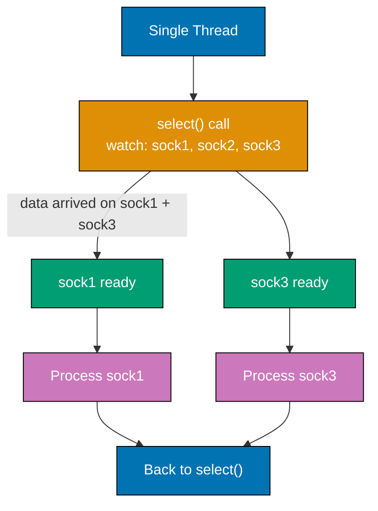
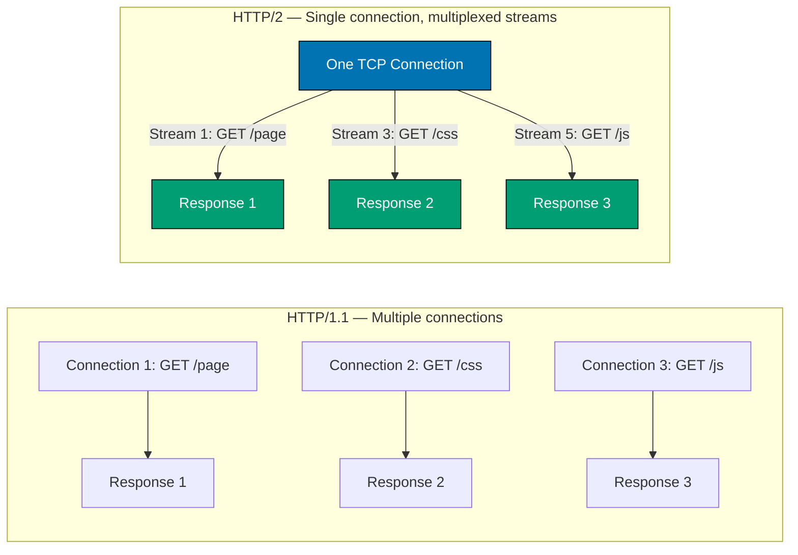
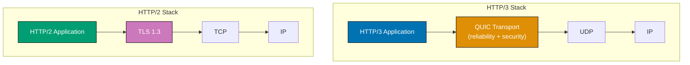
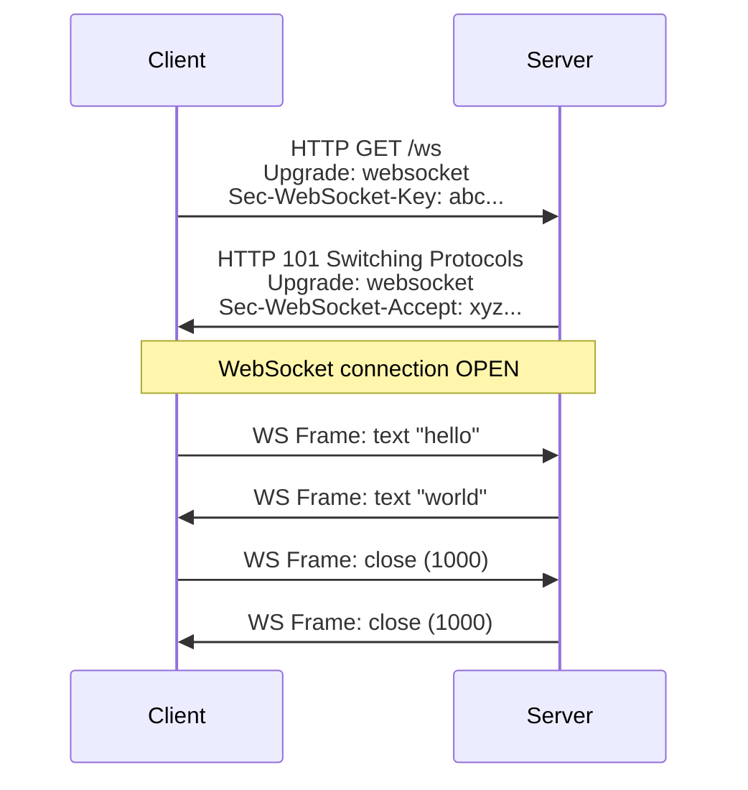
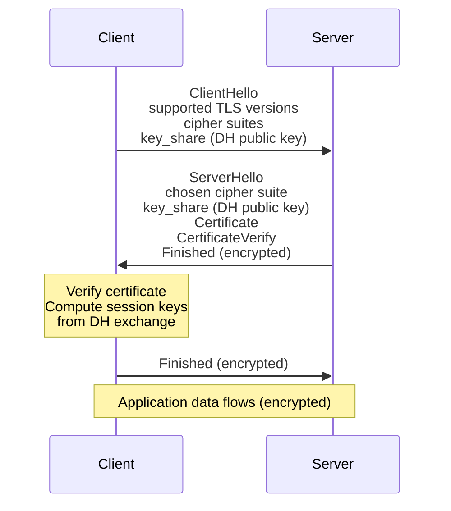
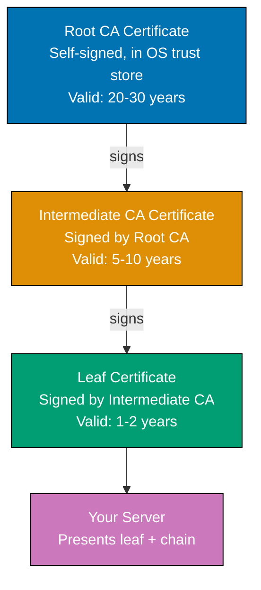
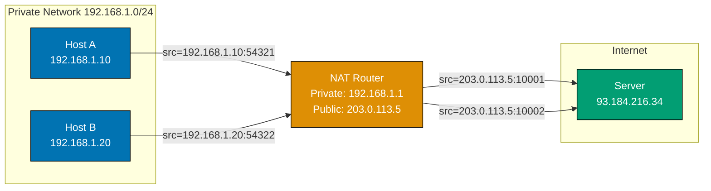
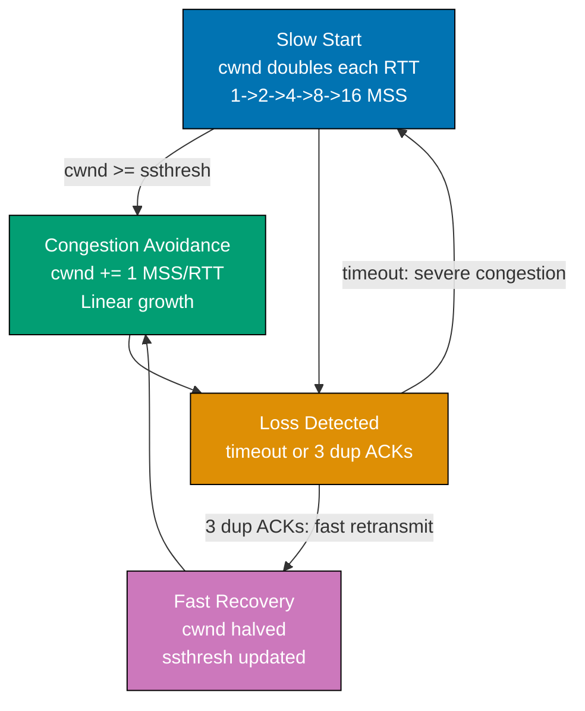

## Example 30: TCP Socket Options — SO_REUSEADDR and TCP_NODELAY

Socket options modify socket behavior at the OS level. `SO_REUSEADDR` enables fast server restarts; `TCP_NODELAY` disables Nagle's algorithm for low-latency applications.

```python
import socket

def demonstrate_socket_options():
    sock = socket.socket(socket.AF_INET, socket.SOCK_STREAM)

    # SO_REUSEADDR: allow binding to a port that is in TIME_WAIT state
    sock.setsockopt(socket.SOL_SOCKET, socket.SO_REUSEADDR, 1)
    # => SOL_SOCKET: options at socket layer (not protocol-specific)
    # => SO_REUSEADDR value 1: enable the option
    # => Without this, restarting a server within ~60s of the previous run
    # => fails with "Address already in use" because the port is in TIME_WAIT

    # SO_RCVBUF / SO_SNDBUF: kernel buffer sizes
    sock.setsockopt(socket.SOL_SOCKET, socket.SO_RCVBUF, 262144)
    # => SO_RCVBUF: receive buffer size in bytes (default ~87380 bytes on Linux)
    # => 262144 = 256 KB — larger buffers improve throughput on high-latency links
    # => TCP window size is limited by buffer size

    actual_rcvbuf = sock.getsockopt(socket.SOL_SOCKET, socket.SO_RCVBUF)
    # => getsockopt reads current option value
    # => OS may double the value: "Linux doubles buffer size for overhead"
    print(f"Receive buffer: {actual_rcvbuf} bytes")
    # => Output: Receive buffer: 524288 (Linux doubles to 512 KB)

    # TCP_NODELAY: disable Nagle's algorithm
    sock.setsockopt(socket.IPPROTO_TCP, socket.TCP_NODELAY, 1)
    # => IPPROTO_TCP: options at TCP protocol layer
    # => TCP_NODELAY = 1: send data immediately, don't wait to batch small packets
    # => Nagle's algorithm (default): batches small packets to reduce overhead
    # => Useful for interactive apps: SSH, games, trading systems, databases

    # SO_KEEPALIVE: enable TCP keepalive probes
    sock.setsockopt(socket.SOL_SOCKET, socket.SO_KEEPALIVE, 1)
    # => TCP keepalive: send periodic probes on idle connections
    # => Detects dead connections (e.g., client crashed without sending FIN)
    # => Without keepalive: server holds dead connections indefinitely

    print("Socket options set:")
    print(f"  SO_REUSEADDR: {sock.getsockopt(socket.SOL_SOCKET, socket.SO_REUSEADDR)}")
    # => Output: SO_REUSEADDR: 1
    print(f"  TCP_NODELAY:  {sock.getsockopt(socket.IPPROTO_TCP, socket.TCP_NODELAY)}")
    # => Output: TCP_NODELAY: 1
    print(f"  SO_KEEPALIVE: {sock.getsockopt(socket.SOL_SOCKET, socket.SO_KEEPALIVE)}")
    # => Output: SO_KEEPALIVE: 1

    sock.close()

demonstrate_socket_options()
```

**Key Takeaway**: Socket options like `SO_REUSEADDR` and `TCP_NODELAY` tune OS-level TCP behavior — essential for server reliability and low-latency applications.

**Why It Matters**: Production servers without `SO_REUSEADDR` fail to restart after crashes. Applications without `TCP_NODELAY` experience 40ms Nagle delays that make interactive protocols (database queries, Redis commands) feel sluggish. These settings are non-default because they trade off throughput efficiency for responsiveness.

---

## Example 31: Non-Blocking Sockets

Non-blocking sockets return immediately instead of waiting for data or connections. A non-blocking `accept()` raises `BlockingIOError` if no client is waiting, allowing the program to do other work between checks.

```python
import socket
import time
import errno

def non_blocking_server_demo():
    server = socket.socket(socket.AF_INET, socket.SOCK_STREAM)
    server.setsockopt(socket.SOL_SOCKET, socket.SO_REUSEADDR, 1)
    server.bind(("127.0.0.1", 9010))
    server.listen(5)
    server.setblocking(False)
    # => setblocking(False): all operations return immediately
    # => If operation would block: raises BlockingIOError (errno EAGAIN/EWOULDBLOCK)

    print("Non-blocking server started (will accept for 2 seconds)")
    connections = []    # => Track accepted connections
    start = time.time()

    while time.time() - start < 2.0:
        # => Poll for new connections without blocking
        try:
            conn, addr = server.accept()
            # => accept() returns immediately: either a connection or BlockingIOError
            conn.setblocking(False)        # => Make client socket non-blocking too
            connections.append((conn, addr))
            print(f"  Accepted connection from {addr}")
        except BlockingIOError:
            # => No connection waiting — this is normal, not an error
            # => errno.EAGAIN = "try again" — no data/connection ready yet
            pass

        # => While waiting for connections, do other work here
        # => In production: event loop handles this more efficiently
        for conn, addr in connections[:]:
            try:
                data = conn.recv(1024)        # => Non-blocking recv
                if data:
                    print(f"  Data from {addr}: {data.decode()}")
                    conn.sendall(b"OK")
                elif data == b"":             # => Empty = client disconnected
                    connections.remove((conn, addr))
                    conn.close()
            except BlockingIOError:
                pass     # => No data ready yet — check again next iteration
            except OSError:
                connections.remove((conn, addr))

        time.sleep(0.01)  # => Tiny sleep to avoid 100% CPU spin

    for conn, _ in connections:
        conn.close()
    server.close()
    print("Server stopped")

# Run briefly
import threading
t = threading.Thread(target=non_blocking_server_demo, daemon=True)
t.start()
time.sleep(0.1)

# Connect a quick client
c = socket.socket(socket.AF_INET, socket.SOCK_STREAM)
c.connect(("127.0.0.1", 9010))
c.sendall(b"hello")
resp = c.recv(64)
print(f"Client got: {resp.decode()}")  # => Output: Client got: OK
c.close()
t.join(timeout=3)
```

**Key Takeaway**: Non-blocking sockets allow a single thread to handle I/O without waiting — polling for readiness instead of blocking; this is the foundation of event-loop-based concurrency.

**Why It Matters**: Non-blocking I/O is how high-performance servers (nginx, Node.js, asyncio) handle thousands of concurrent connections with a single thread. Blocking sockets in multi-connection servers require one thread per connection, which does not scale past thousands of connections due to memory and context-switching overhead.

---

## Example 32: select() for I/O Multiplexing

`select()` monitors multiple file descriptors simultaneously and returns which ones are ready to read, write, or have errors. This enables a single thread to handle multiple sockets efficiently.



```python
import select
import socket
import threading
import time

def select_server(port):
    server = socket.socket(socket.AF_INET, socket.SOCK_STREAM)
    server.setsockopt(socket.SOL_SOCKET, socket.SO_REUSEADDR, 1)
    server.bind(("127.0.0.1", port))
    server.listen(5)
    server.setblocking(False)
    # => setblocking(False): required for select() server pattern

    inputs = [server]    # => Sockets to monitor for readability
    # => inputs: server socket + all connected client sockets
    outputs = []         # => Sockets with pending writes (unused here)
    message_log = []     # => Track received messages

    print(f"select() server on port {port}")
    start = time.time()

    while time.time() - start < 3.0 and inputs:
        readable, writable, exceptional = select.select(
            inputs,    # => Watch these for incoming data / new connections
            outputs,   # => Watch these for write-readiness (empty here)
            inputs,    # => Watch these for errors
            0.5,       # => Timeout: 0.5 seconds (return even if nothing ready)
        )
        # => select() returns three lists of ready sockets
        # => Blocks until at least one socket is ready OR timeout expires

        for sock in readable:
            if sock is server:
                # => Server socket readable = new connection waiting
                conn, addr = server.accept()
                conn.setblocking(False)
                inputs.append(conn)       # => Add to monitored set
                print(f"  New connection: {addr}")
            else:
                # => Client socket readable = data or disconnection
                data = sock.recv(1024)
                if data:
                    msg = data.decode(errors="replace").strip()
                    print(f"  Received: '{msg}'")
                    message_log.append(msg)
                    sock.sendall(f"Echo: {msg}".encode())
                else:
                    # => Empty read = client closed connection
                    inputs.remove(sock)
                    sock.close()

        for sock in exceptional:
            # => Socket in error state — remove and close
            inputs.remove(sock)
            sock.close()

    for sock in inputs:
        sock.close()
    return message_log

# Run server and send two simultaneous clients
received = []
def run_srv():
    received.extend(select_server(9011))

srv_thread = threading.Thread(target=run_srv, daemon=True)
srv_thread.start()
time.sleep(0.2)

def send_client(msg):
    c = socket.socket(socket.AF_INET, socket.SOCK_STREAM)
    c.connect(("127.0.0.1", 9011))
    c.sendall(msg.encode())
    resp = c.recv(128)
    c.close()
    print(f"  Client '{msg}' got: {resp.decode()}")

threads = [threading.Thread(target=send_client, args=(m,)) for m in ["hello", "world"]]
for t in threads: t.start()
for t in threads: t.join()
srv_thread.join(timeout=4)
```

**Key Takeaway**: `select()` enables one thread to monitor multiple sockets simultaneously, processing whichever become ready — the foundation of event-driven I/O.

**Why It Matters**: Web servers like nginx and databases like Redis use `select()` or its more scalable descendants (`epoll` on Linux, `kqueue` on macOS) to handle thousands of connections with minimal threads. Python's `asyncio` abstracts `epoll`/`kqueue`. Understanding `select()` demystifies how event loops work.

---

## Example 33: Threading Model — One Thread Per Connection

The one-thread-per-connection model is the simplest way to handle multiple clients concurrently. Each accepted connection gets its own thread, allowing parallel handling without non-blocking I/O complexity.

```python
import socket
import threading
import time

class ThreadedTCPServer:
    def __init__(self, host, port, handler):
        self.host = host
        self.port = port
        self.handler = handler            # => Callable: handler(conn, addr)
        self.active_threads = []          # => Track threads for cleanup
        self._lock = threading.Lock()     # => Protect shared list

    def serve(self, max_clients=10, duration=3.0):
        server = socket.socket(socket.AF_INET, socket.SOCK_STREAM)
        server.setsockopt(socket.SOL_SOCKET, socket.SO_REUSEADDR, 1)
        server.bind((self.host, self.port))
        server.listen(max_clients)
        server.settimeout(0.5)   # => Non-zero timeout lets loop check duration

        print(f"Threaded server on {self.host}:{self.port}")
        start = time.time()

        while time.time() - start < duration:
            try:
                conn, addr = server.accept()
                # => Each accepted connection spawns a new thread
                t = threading.Thread(
                    target=self._client_thread,
                    args=(conn, addr),
                    daemon=True,           # => Daemon: dies when main program exits
                )
                t.start()
                with self._lock:
                    self.active_threads.append(t)
                    # => Prune finished threads from list
                    self.active_threads = [x for x in self.active_threads if x.is_alive()]
                print(f"  Active threads: {len(self.active_threads)}")
                # => Thread count grows as clients connect, shrinks as they disconnect
            except socket.timeout:
                continue  # => No new connections — loop back to check duration

        server.close()
        # => Wait for active threads to finish handling their clients
        for t in self.active_threads:
            t.join(timeout=1.0)

    def _client_thread(self, conn, addr):
        # => Runs in its own thread — completely independent
        # => Thread safety: each thread has its own conn object
        try:
            self.handler(conn, addr)
        finally:
            conn.close()  # => Ensure connection closed even on exception

def echo_handler(conn, addr):
    # => Simple echo: receive message, send it back with thread ID
    tid = threading.get_ident()   # => Current thread ID
    data = conn.recv(1024)
    if data:
        response = f"Thread-{tid}: {data.decode()}".encode()
        conn.sendall(response)

srv = ThreadedTCPServer("127.0.0.1", 9012, echo_handler)
srv_thread = threading.Thread(target=srv.serve, daemon=True)
srv_thread.start()
time.sleep(0.2)

# Connect 3 concurrent clients
def connect_and_send(message):
    c = socket.socket(socket.AF_INET, socket.SOCK_STREAM)
    c.connect(("127.0.0.1", 9012))
    c.sendall(message.encode())
    resp = c.recv(256)
    print(f"  Response for '{message}': {resp.decode()}")
    c.close()

threads = [threading.Thread(target=connect_and_send, args=(f"msg{i}",)) for i in range(3)]
for t in threads: t.start()
for t in threads: t.join()
srv_thread.join(timeout=4)
```

**Key Takeaway**: One-thread-per-connection is simple and correct for low concurrency; each connection runs independently without non-blocking I/O complexity, but memory grows linearly with connection count.

**Why It Matters**: This model works well for hundreds of concurrent connections but struggles at thousands due to thread stack memory (~1-8MB per thread) and context-switching overhead. Understanding its trade-offs explains why high-traffic servers use thread pools or async I/O instead, and why connection limits exist in application servers.

---

## Example 34: Python Threading with Sockets

Python's GIL (Global Interpreter Lock) limits CPU-bound parallelism, but I/O operations release the GIL, making threading effective for socket-bound work.

```python
import socket
import threading
import queue
import time

class ThreadPoolServer:
    # => Worker thread pool: fixed number of threads handle all connections
    # => More efficient than one-thread-per-connection for high concurrency

    def __init__(self, host, port, num_workers=4):
        self.host = host
        self.port = port
        self.work_queue = queue.Queue(maxsize=100)
        # => Bounded queue: prevents memory exhaustion from connection bursts
        # => maxsize=100: if 100 connections pending, new ones are dropped (or blocked)
        self.workers = []
        for i in range(num_workers):
            t = threading.Thread(target=self._worker, args=(i,), daemon=True)
            t.start()
            self.workers.append(t)
            # => Each worker thread loops, pulling connections from queue

    def _worker(self, worker_id):
        # => Worker runs indefinitely, processing connections from queue
        while True:
            conn, addr = self.work_queue.get()
            # => queue.get() blocks until work is available
            # => GIL released during blocking I/O: other threads run concurrently
            if conn is None:
                break  # => Sentinel value: signal to shut down
            try:
                data = conn.recv(1024)
                if data:
                    resp = f"Worker-{worker_id}: {data.decode()}".encode()
                    conn.sendall(resp)
            except OSError:
                pass
            finally:
                conn.close()
                self.work_queue.task_done()
                # => task_done() signals queue.join() that item is processed

    def serve(self, duration=3.0):
        server = socket.socket(socket.AF_INET, socket.SOCK_STREAM)
        server.setsockopt(socket.SOL_SOCKET, socket.SO_REUSEADDR, 1)
        server.bind((self.host, self.port))
        server.listen(10)
        server.settimeout(0.5)
        start = time.time()

        while time.time() - start < duration:
            try:
                conn, addr = server.accept()
                self.work_queue.put((conn, addr))
                # => put() adds connection to queue for a worker to pick up
                # => Non-blocking with maxsize: raises queue.Full if overloaded
            except socket.timeout:
                continue
            except queue.Full:
                conn.close()  # => Overloaded: reject connection gracefully
                print("  Queue full — connection rejected")

        # Shutdown workers
        for _ in self.workers:
            self.work_queue.put((None, None))  # => Sentinel to stop workers
        server.close()

pool_server = ThreadPoolServer("127.0.0.1", 9013, num_workers=3)
srv_t = threading.Thread(target=pool_server.serve, daemon=True)
srv_t.start()
time.sleep(0.2)

# Send 6 requests to 3 workers
results = []
def client_req(msg):
    c = socket.socket(socket.AF_INET, socket.SOCK_STREAM)
    c.connect(("127.0.0.1", 9013))
    c.sendall(msg.encode())
    resp = c.recv(256)
    results.append(resp.decode())
    c.close()

threads = [threading.Thread(target=client_req, args=(f"req{i}",)) for i in range(6)]
for t in threads: t.start()
for t in threads: t.join()
for r in results:
    print(f"  {r}")
# => Output: Worker-0: req0, Worker-1: req1, Worker-2: req2, etc.
srv_t.join(timeout=4)
```

**Key Takeaway**: A thread pool bounds memory usage by reusing a fixed number of worker threads; the bounded work queue provides backpressure when connections arrive faster than workers process them.

**Why It Matters**: Production servers use thread pools (Gunicorn workers, Java thread pools, Tomcat executor) to handle concurrent requests without unbounded memory growth. Understanding queue-based work distribution explains connection timeout behavior, backpressure, and why saturating a server's thread pool causes requests to queue then time out.

---

## Example 35: HTTP/2 Concepts — Multiplexing and Frames

HTTP/2 multiplexes multiple requests over a single TCP connection using binary frames and streams. This eliminates HTTP/1.1's head-of-line blocking at the application layer.



```python
# HTTP/2 concepts demonstrated conceptually (requires h2 library for full impl)
# Python's http.client does not support HTTP/2 — we show the wire format concepts

def explain_http2_frames():
    # => HTTP/2 is binary, not text — all communication is frames
    frame_types = {
        "DATA (0x0)":        "Carries request/response body — can be split across frames",
        "HEADERS (0x1)":     "Carries compressed headers (HPACK compression)",
        "PRIORITY (0x2)":    "Client hints which streams are more important",
        "RST_STREAM (0x3)":  "Cancels a specific stream without closing connection",
        "SETTINGS (0x4)":    "Negotiates connection parameters (initial window size, etc.)",
        "PUSH_PROMISE (0x5)":"Server push: server tells client it will send resource",
        "PING (0x6)":        "Measures round-trip time, keepalive",
        "GOAWAY (0x7)":      "Graceful connection shutdown",
        "WINDOW_UPDATE (0x8)":"Flow control: increase stream or connection window",
        "CONTINUATION (0x9)":"Continues a HEADERS frame if too large for one frame",
    }

    print("HTTP/2 Frame Types:")
    for frame_type, description in frame_types.items():
        print(f"  {frame_type:22s}: {description}")

    # Simulated HTTP/2 frame header structure (9 bytes)
    import struct
    length = 100     # => Payload length: 24 bits (0-16384 default, up to 16MB with negotiation)
    ftype = 0x1      # => Frame type: HEADERS (0x1)
    flags = 0x4      # => END_HEADERS flag: this is the last HEADERS frame for this request
    stream_id = 3    # => Stream ID: always odd for client-initiated (1, 3, 5...)
                     # => Stream 0 = connection-level frame (SETTINGS, PING, etc.)

    # Pack frame header: 3-byte length + 1-byte type + 1-byte flags + 4-byte stream ID
    frame_header = struct.pack(">I", length)[1:]  # => 3 bytes: strip top byte of 4-byte int
    frame_header += struct.pack("BB", ftype, flags)
    frame_header += struct.pack(">I", stream_id & 0x7FFFFFFF)
    # => stream_id MSB must be 0 (reserved bit per spec)

    print(f"\nSimulated HEADERS frame header (9 bytes):")
    print(f"  Length:    {length}")       # => Payload will follow this 9-byte header
    print(f"  Type:      {ftype:#04x} (HEADERS)")
    print(f"  Flags:     {flags:#04x} (END_HEADERS)")
    print(f"  Stream ID: {stream_id}")    # => This request is on stream 3
    print(f"  Raw:       {frame_header.hex()}")

explain_http2_frames()
```

**Key Takeaway**: HTTP/2 multiplexes independent streams over one TCP connection using binary frames, eliminating HTTP/1.1's head-of-line blocking and reducing connection overhead.

**Why It Matters**: HTTP/2 improves web performance for asset-heavy pages by eliminating connection setup overhead per resource. Server push eliminates round trips for predictable dependencies. Understanding HTTP/2 streams explains why `RST_STREAM` errors in logs mean individual request cancellations, not connection failures.

---

## Example 36: HTTP/3 and QUIC Overview

HTTP/3 runs over QUIC instead of TCP. QUIC is a UDP-based transport protocol that provides reliability, ordering, and security built into the transport layer, eliminating TCP's head-of-line blocking even at the transport level.



```python
# HTTP/3 and QUIC conceptual explanation
# Full QUIC implementation requires aioquic (external) — this shows concepts

def explain_quic():
    print("QUIC Protocol Key Features:\n")

    quic_features = {
        "0-RTT / 1-RTT connection setup": (
            "First connection: 1-RTT (vs TCP+TLS: 2-3 RTTs). "
            "Reconnecting known server: 0-RTT (send data immediately). "
            "Achieved by building TLS 1.3 into QUIC at transport level."
        ),
        "Multiplexed streams without HoL blocking": (
            "HTTP/2 over TCP: if one TCP packet lost, ALL streams stall (TCP HoL). "
            "QUIC: each stream independently sequenced. "
            "Lost packet only blocks its own stream — others continue unaffected."
        ),
        "Connection migration": (
            "TCP connections are identified by 4-tuple (src_ip, src_port, dst_ip, dst_port). "
            "When IP changes (WiFi to cellular), TCP connections break. "
            "QUIC connections use 64-bit Connection IDs — survive IP changes. "
            "Mobile users stay connected through network transitions."
        ),
        "Built-in encryption": (
            "QUIC encrypts packet headers AND payload from the start. "
            "TCP+TLS: TCP headers visible (sequence numbers, flags). "
            "QUIC: middleboxes see only connection ID and minimal metadata. "
            "Enables protocol evolution: ossification prevented."
        ),
        "UDP-based transport": (
            "QUIC runs over UDP (no OS-level connection state per stream). "
            "Implementation in userspace: faster iteration than modifying TCP kernel code. "
            "Multiple versions possible without OS upgrades."
        ),
    }

    for feature, explanation in quic_features.items():
        print(f"  {feature}:")
        print(f"    {explanation}\n")

    # Comparison table
    comparison = [
        ("Protocol", "HTTP/1.1", "HTTP/2", "HTTP/3"),
        ("Transport", "TCP", "TCP", "QUIC (UDP)"),
        ("Multiplexing", "No (1 req/conn)", "Yes (streams)", "Yes (QUIC streams)"),
        ("HoL Blocking", "App+Transport", "Transport only", "None"),
        ("Connection Setup", "1-RTT + TLS", "1-RTT + TLS", "0/1-RTT"),
        ("Header Compression", "None", "HPACK", "QPACK"),
    ]

    print("Protocol Comparison:")
    for row in comparison:
        print(f"  {row[0]:20s}: {row[1]:20s} {row[2]:20s} {row[3]}")

explain_quic()
```

**Key Takeaway**: QUIC eliminates TCP's head-of-line blocking by implementing per-stream sequencing over UDP, and reduces connection latency with 0-RTT reconnects to known servers.

**Why It Matters**: HTTP/3 adoption is rapidly increasing. Mobile applications benefit most from connection migration. Understanding QUIC explains why traditional TCP-level performance optimizations do not apply, and why firewall rules blocking UDP port 443 prevent HTTP/3 from working.

---

## Example 37: WebSockets — Handshake and Frames

WebSockets provide full-duplex communication over a single TCP connection. The connection starts as an HTTP/1.1 upgrade request, then switches to the WebSocket framing protocol for bidirectional messaging.



```python
import socket
import base64
import hashlib
import struct
import threading
import time

# WebSocket handshake implementation (server side)
WS_MAGIC = "258EAFA5-E914-47DA-95CA-C5AB0DC85B11"
# => This GUID is defined in RFC 6455 — fixed value in the WebSocket spec
# => Used to prevent cross-protocol attacks

def compute_accept_key(client_key):
    # => WebSocket handshake key derivation
    combined = client_key + WS_MAGIC
    # => Concatenate client's key with magic GUID
    sha1_hash = hashlib.sha1(combined.encode()).digest()
    # => SHA-1 hash of the concatenated string
    return base64.b64encode(sha1_hash).decode()
    # => Base64-encode: return as accept key in 101 response

def parse_ws_frame(data):
    # => Parse a WebSocket frame according to RFC 6455
    if len(data) < 2:
        return None, 0

    byte1, byte2 = data[0], data[1]
    fin = (byte1 >> 7) & 1          # => FIN bit: 1 = last frame of message
    opcode = byte1 & 0x0F           # => Opcode: 1=text, 2=binary, 8=close, 9=ping, 10=pong
    masked = (byte2 >> 7) & 1       # => MASK bit: 1 = client->server frames are masked
    payload_len = byte2 & 0x7F      # => Payload length (first 7 bits)

    offset = 2
    if payload_len == 126:
        payload_len = struct.unpack(">H", data[offset:offset+2])[0]
        offset += 2  # => 16-bit extended length
    elif payload_len == 127:
        payload_len = struct.unpack(">Q", data[offset:offset+8])[0]
        offset += 8  # => 64-bit extended length

    mask_key = b""
    if masked:
        mask_key = data[offset:offset+4]    # => 4-byte XOR mask key
        offset += 4

    payload = bytearray(data[offset:offset+payload_len])
    if masked:
        for i in range(len(payload)):
            payload[i] ^= mask_key[i % 4]  # => Unmask: XOR each byte with mask key
            # => Masking prevents cache poisoning attacks on proxies

    return {"fin": fin, "opcode": opcode, "payload": bytes(payload)}, offset + payload_len

def build_ws_frame(payload, opcode=1):
    # => Build a server->client WebSocket frame (unmasked — server frames are not masked)
    payload_bytes = payload.encode() if isinstance(payload, str) else payload
    length = len(payload_bytes)
    header = bytes([0x80 | opcode])  # => FIN=1 + opcode
    # => 0x80 = 10000000 (FIN bit set), OR with opcode
    if length < 126:
        header += bytes([length])    # => Length fits in 7 bits
    elif length < 65536:
        header += bytes([126]) + struct.pack(">H", length)  # => 16-bit length
    else:
        header += bytes([127]) + struct.pack(">Q", length)  # => 64-bit length
    return header + payload_bytes

# Test the frame parsing
test_frame = build_ws_frame("Hello WebSocket!")
frame_info, consumed = parse_ws_frame(test_frame)
print(f"Built frame: {len(test_frame)} bytes")
print(f"Opcode: {frame_info['opcode']} (1=text)")  # => Output: Opcode: 1 (text)
print(f"Payload: {frame_info['payload'].decode()}")  # => Output: Payload: Hello WebSocket!
```

**Key Takeaway**: WebSockets start with an HTTP upgrade handshake (101 Switching Protocols), then use a binary framing protocol with opcodes for text, binary, ping, pong, and close operations.

**Why It Matters**: WebSockets power real-time features: chat, collaborative editing, live dashboards, notifications, and multiplayer games. Understanding the framing protocol explains WebSocket library behavior, masking requirements (security), and why some proxies break WebSocket connections by buffering data.

---

## Example 38: TLS Handshake Deep-Dive

The TLS 1.3 handshake establishes an encrypted channel in one round trip. It negotiates cipher suites, authenticates the server (and optionally the client), and derives session keys using Diffie-Hellman key exchange.



```python
import ssl
import socket

def tls_handshake_inspector(hostname, port=443):
    # => Performs TLS handshake and extracts negotiated parameters
    context = ssl.create_default_context()
    # => Default context: CERT_REQUIRED + check_hostname=True + strong ciphers

    # Enable verbose session info (TLS 1.3 key logging for analysis)
    # context.keylog_filename = "/tmp/tls_keys.log"  # Wireshark can use this

    with socket.create_connection((hostname, port), timeout=10) as tcp_sock:
        # => TCP connection established (3-way handshake done)
        with context.wrap_socket(tcp_sock, server_hostname=hostname) as tls_sock:
            # => wrap_socket triggers TLS handshake:
            # => 1. Client sends ClientHello (supported ciphers, TLS versions, DH key share)
            # => 2. Server sends ServerHello (chosen params, its DH share, certificate)
            # => 3. Client verifies certificate, computes shared secret
            # => 4. Both derive session keys from shared secret (HKDF)
            # => 5. Finished messages confirm both sides derived same keys

            version = tls_sock.version()
            # => "TLSv1.3" or "TLSv1.2" — TLS 1.0/1.1 deprecated
            cipher = tls_sock.cipher()
            # => (cipher_name, protocol, key_bits) tuple
            # => e.g. ("TLS_AES_256_GCM_SHA384", "TLSv1.3", 256)
            cert = tls_sock.getpeercert()

            print(f"TLS Handshake Results for {hostname}:{port}")
            print(f"  TLS Version:  {version}")
            # => TLS 1.3 preferred — 1-RTT handshake, forward secrecy always on
            print(f"  Cipher Suite: {cipher[0]}")
            # => TLS_AES_256_GCM_SHA384: AES-256-GCM for encryption, SHA-384 for MAC
            print(f"  Key Bits:     {cipher[2]}")
            # => 256-bit key — computationally infeasible to brute-force

            # Certificate details
            subject = dict(x[0] for x in cert.get("subject", []))
            print(f"  Cert Subject: {subject.get('commonName', 'N/A')}")
            print(f"  Cert Issuer:  {dict(x[0] for x in cert.get('issuer', []))}")
            print(f"  Cert Expiry:  {cert.get('notAfter', 'N/A')}")

            # SANs (Subject Alternative Names) — modern certs use these, not CN
            sans = cert.get("subjectAltName", [])
            if sans:
                print(f"  SANs:         {[v for t, v in sans if t == 'DNS'][:3]}")
                # => DNS SANs: hostnames this certificate is valid for

try:
    tls_handshake_inspector("example.com")
except Exception as e:
    print(f"TLS inspection failed: {e}")
```

**Key Takeaway**: TLS 1.3 performs its handshake in one round trip using ephemeral Diffie-Hellman key exchange, providing forward secrecy and strong authentication.

**Why It Matters**: TLS configuration errors — expired certificates, weak cipher suites, TLS 1.0/1.1 enabled — cause security vulnerabilities and compliance failures. Understanding the handshake process helps debug certificate validation errors, configure TLS termination correctly in load balancers, and understand why certificate pinning exists.

---

## Example 39: TLS Certificates — Chain of Trust

TLS certificates form a chain of trust from root Certificate Authorities (CA) through intermediate CAs to the leaf certificate. Browsers and OS trust stores contain root CAs; all other certificates derive trust from them.



```python
import ssl
import socket

def inspect_cert_chain(hostname, port=443):
    # => Retrieve and display the certificate chain for a host
    context = ssl.create_default_context()

    # To inspect full chain (not just verified cert), disable hostname check temporarily
    inspect_context = ssl.SSLContext(ssl.PROTOCOL_TLS_CLIENT)
    inspect_context.check_hostname = False
    inspect_context.verify_mode = ssl.CERT_NONE
    # => CERT_NONE: don't verify — only for inspection, never for production

    with socket.create_connection((hostname, port), timeout=10) as sock:
        with inspect_context.wrap_socket(sock, server_hostname=hostname) as tls_sock:
            # DER-encoded cert chain
            der_certs = tls_sock.getpeercert(binary_form=True)
            # => binary_form=True: returns DER-encoded certificate bytes
            # => This is only the leaf cert; full chain needs SSL_get_peer_cert_chain

            # Verified cert dict (from default context)
    with socket.create_connection((hostname, port), timeout=10) as sock2:
        with ssl.create_default_context().wrap_socket(sock2, server_hostname=hostname) as tls_sock2:
            cert = tls_sock2.getpeercert()

            print(f"Certificate Chain Analysis for {hostname}:")

            # Subject
            subject = {k: v for pair in cert.get("subject", []) for k, v in pair}
            print(f"\nLeaf Certificate:")
            print(f"  CommonName: {subject.get('commonName', 'N/A')}")
            print(f"  ValidFrom:  {cert.get('notBefore')}")
            print(f"  ValidUntil: {cert.get('notAfter')}")

            # Subject Alternative Names
            sans = [v for t, v in cert.get("subjectAltName", []) if t == "DNS"]
            print(f"  SANs:       {sans[:5]}")
            # => Modern certificates use SANs; commonName alone is deprecated

            # Issuer (signs this certificate)
            issuer = {k: v for pair in cert.get("issuer", []) for k, v in pair}
            print(f"\nIssuing CA (Intermediate):")
            print(f"  Org:  {issuer.get('organizationName', 'N/A')}")
            print(f"  CN:   {issuer.get('commonName', 'N/A')}")

            # OCSP and CRL distribution points (revocation checking)
            print(f"\nRevocation info:")
            print(f"  OCSP:  {cert.get('OCSP', ['N/A'])[0] if cert.get('OCSP') else 'N/A'}")
            print(f"  CRLs:  {cert.get('crlDistributionPoints', ['N/A'])[0] if cert.get('crlDistributionPoints') else 'N/A'}")

try:
    inspect_cert_chain("example.com")
except Exception as e:
    print(f"Chain inspection failed: {e}")
```

**Key Takeaway**: Certificate trust flows from root CAs through intermediates to leaf certificates; the chain must be complete and valid for TLS verification to succeed.

**Why It Matters**: "Certificate verify failed" errors occur when the chain is broken — missing intermediate, expired certificate, wrong hostname in SAN. Servers must send the full chain (leaf + intermediates) because clients may not have intermediates cached. Let's Encrypt automated certificate renewal eliminates the operational burden of manual certificate management.

---

## Example 40: Python ssl Module — Wrapping Sockets

The `ssl` module wraps any TCP socket with TLS. Configuring SSL contexts correctly determines security level, certificate requirements, and protocol version restrictions.

```python
import ssl
import socket
import threading
import time
import tempfile
import os

# Create a self-signed certificate for testing
# (In production: use proper CA-signed certificates)
def create_test_certs():
    # => Use OpenSSL to generate self-signed cert (subprocess)
    import subprocess
    tmpdir = tempfile.mkdtemp()
    keyfile = os.path.join(tmpdir, "server.key")
    certfile = os.path.join(tmpdir, "server.crt")

    try:
        subprocess.run([
            "openssl", "req", "-x509", "-newkey", "rsa:2048",
            "-keyout", keyfile, "-out", certfile,
            "-days", "1", "-nodes",
            "-subj", "/CN=localhost"
        ], check=True, capture_output=True)
        # => -x509: self-signed (no CA needed)
        # => -newkey rsa:2048: generate 2048-bit RSA key
        # => -nodes: no passphrase on private key
        # => -subj: certificate subject (CN=localhost for local testing)
        return keyfile, certfile
    except (subprocess.CalledProcessError, FileNotFoundError):
        return None, None  # => openssl not available

keyfile, certfile = create_test_certs()

if keyfile and certfile:
    def tls_server(port, keyfile, certfile):
        # => Server-side SSL context
        server_context = ssl.SSLContext(ssl.PROTOCOL_TLS_SERVER)
        # => PROTOCOL_TLS_SERVER: server-side TLS
        server_context.load_cert_chain(certfile, keyfile)
        # => Load certificate and private key from files
        server_context.minimum_version = ssl.TLSVersion.TLSv1_2
        # => Minimum TLS 1.2 — reject older, insecure versions

        raw_server = socket.socket(socket.AF_INET, socket.SOCK_STREAM)
        raw_server.setsockopt(socket.SOL_SOCKET, socket.SO_REUSEADDR, 1)
        raw_server.bind(("127.0.0.1", port))
        raw_server.listen(1)
        raw_server.settimeout(3)

        try:
            raw_conn, addr = raw_server.accept()
            # => wrap incoming TCP connection with TLS
            tls_conn = server_context.wrap_socket(raw_conn, server_side=True)
            # => server_side=True: present certificate, expect ClientHello
            data = tls_conn.recv(1024)
            print(f"TLS server received: {data.decode()}")
            tls_conn.sendall(b"Hello from TLS server")
            tls_conn.close()
        except ssl.SSLError as e:
            print(f"TLS server error: {e}")
        finally:
            raw_server.close()

    def tls_client(port, certfile):
        # => Client-side SSL context
        client_context = ssl.SSLContext(ssl.PROTOCOL_TLS_CLIENT)
        client_context.load_verify_locations(certfile)
        # => Trust this specific cert (for self-signed testing)
        client_context.check_hostname = False
        # => Disable hostname check for localhost testing (never disable in production)

        raw_sock = socket.socket(socket.AF_INET, socket.SOCK_STREAM)
        raw_sock.settimeout(3)
        raw_sock.connect(("127.0.0.1", port))
        tls_sock = client_context.wrap_socket(raw_sock)
        # => wrap_socket triggers TLS handshake with server
        print(f"TLS version: {tls_sock.version()}")  # => TLSv1.2 or TLSv1.3
        tls_sock.sendall(b"Hello from TLS client")
        resp = tls_sock.recv(1024)
        print(f"TLS client received: {resp.decode()}")
        tls_sock.close()

    port = 9020
    srv = threading.Thread(target=tls_server, args=(port, keyfile, certfile), daemon=True)
    srv.start()
    time.sleep(0.2)
    tls_client(port, certfile)
    srv.join(timeout=4)
else:
    print("openssl not available — showing context configuration only")
    # => Show context configuration reference
    ctx = ssl.create_default_context()
    print(f"Default context verify mode: {ctx.verify_mode}")  # => VerifyMode.CERT_REQUIRED
    print(f"Default minimum version:     {ctx.minimum_version}")  # => TLSVersion.TLSv1_2
```

**Key Takeaway**: `ssl.SSLContext` configures TLS parameters — minimum version, certificate loading, and verification mode — before wrapping sockets with `wrap_socket()`.

**Why It Matters**: Custom TLS configuration appears in mutual TLS (mTLS) setups, internal microservice communication, IoT device authentication, and custom certificate authorities. Incorrect context configuration — trusting all certificates (`CERT_NONE`) — is a serious security vulnerability that bypasses server authentication entirely.

---

## Example 41: DNS over HTTPS (DoH) Overview

DNS over HTTPS sends DNS queries inside HTTPS connections, providing privacy and authentication. Traditional DNS is unencrypted — anyone on the network path can see and modify queries.

```python
import urllib.request
import json
import ssl

def dns_over_https(hostname, record_type="A"):
    # => DoH sends DNS queries as HTTPS requests to a DoH resolver
    # => Cloudflare: https://cloudflare-dns.com/dns-query
    # => Google: https://dns.google/dns-query

    # Wire format (application/dns-message) or JSON (application/dns-json)
    # Using JSON format for readability
    url = f"https://dns.google/resolve?name={hostname}&type={record_type}"
    # => Query Google's DoH endpoint in JSON format
    # => name=hostname: domain to resolve
    # => type=A: record type (A=IPv4, AAAA=IPv6, MX=mail, TXT=text)

    req = urllib.request.Request(
        url,
        headers={
            "Accept": "application/dns-json",  # => Request JSON response format
            # => Alternative: application/dns-message for binary wire format
        }
    )

    try:
        with urllib.request.urlopen(req, timeout=10) as resp:
            data = json.loads(resp.read())
            # => Response JSON structure:
            # => { "Status": 0, "Answer": [{"name": "...", "type": 1, "data": "..."}] }

            status = data.get("Status", -1)
            # => Status 0 = NOERROR (success)
            # => Status 2 = SERVFAIL, Status 3 = NXDOMAIN (no such domain)

            if status == 0:
                answers = data.get("Answer", [])
                print(f"DoH query: {hostname} {record_type}")
                for record in answers:
                    rtype_map = {1: "A", 28: "AAAA", 5: "CNAME", 15: "MX", 16: "TXT"}
                    rtype_name = rtype_map.get(record["type"], str(record["type"]))
                    print(f"  {rtype_name:6s} TTL={record['TTL']:5d}: {record['data']}")
                    # => data: IP address for A records, hostname for CNAME, etc.
            else:
                print(f"DNS error status: {status}")

    except urllib.error.URLError as e:
        print(f"DoH request failed: {e}")
    except Exception as e:
        print(f"Error: {e}")

# Traditional DNS for comparison
import socket
def traditional_dns(hostname):
    try:
        results = socket.getaddrinfo(hostname, None)
        ips = list(set(r[4][0] for r in results))
        print(f"\nTraditional DNS: {hostname} -> {ips}")
        # => Uses OS resolver — may use plain UDP port 53 (unencrypted)
    except Exception as e:
        print(f"Traditional DNS failed: {e}")

dns_over_https("example.com", "A")
dns_over_https("example.com", "MX")
traditional_dns("example.com")
```

**Key Takeaway**: DNS over HTTPS encrypts DNS queries inside HTTPS, preventing surveillance and tampering by network intermediaries; it uses standard HTTPS ports (443) avoiding DNS blocking.

**Why It Matters**: Unencrypted DNS reveals browsing history to ISPs, Wi-Fi operators, and network attackers. DNS hijacking redirects users to malicious servers — a common attack in hostile networks. DoH and DoT (DNS over TLS) provide privacy and integrity for DNS queries, though they also make enterprise DNS monitoring harder.

---

## Example 42: NAT — Network Address Translation

NAT allows multiple devices on a private network to share one public IP address. The NAT device rewrites packet headers, mapping private addresses to the public IP and tracking connections in a translation table.



```python
# Simulate NAT translation table behavior

class NATTable:
    # => Models a simplified NAPT (Network Address Port Translation) table
    def __init__(self, public_ip):
        self.public_ip = public_ip          # => Single public IP shared by all private hosts
        self.translations = {}               # => private (ip, port) -> public port
        self.reverse = {}                    # => public_port -> private (ip, port)
        self._next_port = 10000             # => Next available ephemeral port on public side

    def translate_outbound(self, private_ip, private_port, dst_ip, dst_port):
        # => Rewrite source: private address -> public address:new_port
        key = (private_ip, private_port, dst_ip, dst_port)

        if key not in self.translations:
            pub_port = self._next_port       # => Assign new public port for this connection
            self._next_port += 1
            self.translations[key] = pub_port
            self.reverse[pub_port] = (private_ip, private_port)
            print(f"  NAT: {private_ip}:{private_port} -> {self.public_ip}:{pub_port}")

        pub_port = self.translations[key]
        return self.public_ip, pub_port
        # => Return rewritten source address for the packet

    def translate_inbound(self, public_port):
        # => Reverse lookup: rewrite destination back to private address
        if public_port in self.reverse:
            private_ip, private_port = self.reverse[public_port]
            print(f"  NAT reverse: {self.public_ip}:{public_port} -> {private_ip}:{private_port}")
            return private_ip, private_port
        return None, None
        # => No entry: packet dropped (no active connection — this is NAT's firewall behavior)

nat = NATTable("203.0.113.5")

# Two private hosts initiate connections
pub_ip1, pub_port1 = nat.translate_outbound("192.168.1.10", 54321, "93.184.216.34", 80)
# => NAT: 192.168.1.10:54321 -> 203.0.113.5:10000
pub_ip2, pub_port2 = nat.translate_outbound("192.168.1.20", 54322, "93.184.216.34", 80)
# => NAT: 192.168.1.20:54322 -> 203.0.113.5:10001

# Server responds to public IP; NAT routes back
priv_ip, priv_port = nat.translate_inbound(pub_port1)
print(f"  Deliver to: {priv_ip}:{priv_port}")
# => Deliver to: 192.168.1.10:54321

# Unsolicited inbound (no connection in table) — dropped
ip, port = nat.translate_inbound(9999)
print(f"  Unsolicited inbound lookup: {ip}, {port}")
# => None, None — NAT blocks it (no connection initiated from private side)
```

**Key Takeaway**: NAT rewrites packet source addresses, allowing many private hosts to share one public IP; it implicitly acts as a firewall by dropping unsolicited inbound packets.

**Why It Matters**: NAT is why IPv6 adoption is necessary — NAT breaks end-to-end connectivity required by peer-to-peer protocols, VoIP, and IoT. NAT traversal (STUN, TURN, hole-punching) exists specifically to work around NAT. Cloud infrastructure uses NAT gateways for private subnet outbound access; misconfigured NAT prevents outbound connectivity.

---

## Example 43: DHCP — Dynamic Host Configuration

DHCP automatically assigns IP addresses, subnet masks, gateways, and DNS servers to hosts joining a network. The DORA process (Discover, Offer, Request, Acknowledge) uses broadcast UDP.

```python
import socket
import struct
import os

# DHCP packet structure (simplified) — RFC 2131
# DHCP uses UDP: client port 68, server port 67
# Initial messages are broadcast (client has no IP yet)

def build_dhcp_discover(mac_address=None):
    # => DHCP Discover: broadcast packet sent by new host seeking configuration
    if mac_address is None:
        mac_address = bytes([0xAA, 0xBB, 0xCC, 0xDD, 0xEE, 0xFF])
    # => mac_address: client's hardware address (6 bytes for Ethernet)

    xid = os.urandom(4)  # => Transaction ID: random 4 bytes to match replies to requests

    # DHCP message format (RFC 2131 fixed fields)
    bootp_msg = struct.pack(
        "BBBBIH",
        1,      # op: 1=BOOTREQUEST (client->server), 2=BOOTREPLY
        1,      # htype: 1=Ethernet
        6,      # hlen: hardware address length (6 bytes for MAC)
        0,      # hops: 0 for direct requests, incremented by relay agents
        int.from_bytes(xid, "big"),  # xid: transaction ID
        0,      # secs: seconds since client started process
    )
    bootp_msg += struct.pack("H", 0x8000)  # flags: 0x8000 = BROADCAST flag
    # => BROADCAST flag: ask server to broadcast reply (client has no IP to receive unicast)

    bootp_msg += b"\x00" * 4  # ciaddr: client IP (0.0.0.0 — client doesn't know its IP yet)
    bootp_msg += b"\x00" * 4  # yiaddr: your IP (server fills this in OFFER)
    bootp_msg += b"\x00" * 4  # siaddr: server IP
    bootp_msg += b"\x00" * 4  # giaddr: relay agent IP

    bootp_msg += mac_address + b"\x00" * 10  # chaddr: 16-byte hardware address field
    bootp_msg += b"\x00" * 192               # sname + file: server name + boot file (unused)

    # DHCP magic cookie (identifies this as DHCP, not plain BOOTP)
    magic_cookie = bytes([99, 130, 83, 99])  # => 0x63825363 per RFC 2131
    bootp_msg += magic_cookie

    # DHCP Options (TLV: type-length-value format)
    options = bytearray()
    options += bytes([53, 1, 1])    # => Option 53: DHCP message type = 1 (DISCOVER)
    options += bytes([55, 4, 1, 3, 6, 15])
    # => Option 55: Parameter Request List
    # => Requesting: subnet mask(1), router(3), DNS(6), domain name(15)
    options += bytes([255])          # => Option 255: END (terminates options)

    return bootp_msg + bytes(options)

discover_pkt = build_dhcp_discover()
print(f"DHCP Discover packet: {len(discover_pkt)} bytes")
print(f"  Magic cookie: {discover_pkt[236:240].hex()}")  # => 63825363
print(f"  First option: type={discover_pkt[240]}, len={discover_pkt[241]}, val={discover_pkt[242]}")
# => type=53 (DHCP msg type), len=1, val=1 (DISCOVER)

print("\nDHCP DORA Process:")
dora_steps = [
    ("DISCOVER", "Client broadcasts: 'Anyone have an IP for me?'  src=0.0.0.0 dst=255.255.255.255"),
    ("OFFER",    "Server broadcasts: 'Here, take 192.168.1.50 for 24h' with options"),
    ("REQUEST",  "Client broadcasts: 'I accept 192.168.1.50 from that server'"),
    ("ACK",      "Server broadcasts: 'It's yours — here are DNS, gateway, etc.'"),
]
for step, desc in dora_steps:
    print(f"  {step:10s}: {desc}")
```

**Key Takeaway**: DHCP uses a four-step broadcast exchange (DORA) to automatically assign IP configuration to hosts without manual setup.

**Why It Matters**: DHCP starvation attacks flood the server with fake DISCOVER packets, exhausting the IP pool and preventing legitimate clients from connecting. DHCP snooping on managed switches mitigates rogue DHCP servers. Kubernetes uses DHCP-like mechanisms (IPAM) to assign pod IPs — the same DORA logic at a different scale.

---

## Example 44: BGP Basics — Autonomous Systems

BGP (Border Gateway Protocol) is the routing protocol that holds the internet together. It exchanges reachability information between Autonomous Systems (AS) — independently operated networks with their own routing policies.


```python
# BGP concepts simulation — BGP uses TCP port 179 for session establishment

def explain_bgp():
    print("BGP (Border Gateway Protocol) Key Concepts:\n")

    bgp_concepts = {
        "Autonomous System (AS)": (
            "A network or group of networks under a single administrative domain. "
            "Each AS has a unique AS Number (ASN): 1-65535 public, 64512-65535 private. "
            "Example: ISP uses ASN 65001 for their entire network."
        ),
        "BGP Peers (Neighbors)": (
            "BGP sessions established manually between routers via TCP port 179. "
            "eBGP (external): between different ASes. "
            "iBGP (internal): within same AS for synchronization. "
            "Unlike IGPs (OSPF/IS-IS), BGP neighbors must be configured explicitly."
        ),
        "BGP Routes (Prefixes)": (
            "BGP advertises IP prefixes (CIDR blocks) with path attributes. "
            "AS_PATH: list of ASes the route passed through (loop prevention). "
            "NEXT_HOP: IP address to forward packets toward destination. "
            "LOCAL_PREF: within AS, higher = preferred (default 100)."
        ),
        "Route Selection": (
            "BGP selects best route via decision process (simplified): "
            "1. Highest LOCAL_PREF -> 2. Shortest AS_PATH -> 3. Lowest MED -> "
            "4. eBGP over iBGP -> 5. Lowest router ID (tiebreaker). "
            "Policy: ISPs use route maps to influence selection."
        ),
        "BGP Security Issues": (
            "BGP hijacking: malicious AS advertises someone else's prefixes. "
            "Accidental misconfiguration causes same problem. "
            "RPKI (Resource Public Key Infrastructure) cryptographically validates prefix ownership. "
            "Route origin validation (ROV) checks RPKI before accepting routes."
        ),
    }

    for concept, explanation in bgp_concepts.items():
        print(f"  {concept}:")
        print(f"    {explanation}\n")

    # Simulated BGP routing table entry
    bgp_route = {
        "prefix": "203.0.113.0/24",       # => Network being advertised
        "nexthop": "10.0.0.1",             # => Forward packets to this IP
        "as_path": [65003, 65002, 65001],  # => Route passed through these ASes
        "local_pref": 100,                 # => Default preference value
        "med": 0,                          # => Multi-Exit Discriminator (lower = preferred)
        "origin": "IGP",                   # => i=IGP, e=EGP, ?=incomplete
    }

    print("  Sample BGP route entry:")
    for k, v in bgp_route.items():
        print(f"    {k:12s}: {v}")

explain_bgp()
```

**Key Takeaway**: BGP is a path-vector protocol that exchanges IP prefix reachability between Autonomous Systems using TCP sessions; route selection is policy-driven via attributes like LOCAL_PREF and AS_PATH length.

**Why It Matters**: BGP route leaks and hijacks cause large-scale internet outages affecting entire countries or content providers. Understanding BGP explains why internet routing is not purely optimal (policy overrides performance), why anycast works, and why RPKI adoption matters for routing security.

---

## Example 45: Load Balancing Strategies

Load balancers distribute traffic across multiple backend servers to improve availability and throughput. Different algorithms suit different workload characteristics.


```python
import random
import itertools

class LoadBalancer:
    def __init__(self, backends):
        # => backends: list of (server, weight) tuples
        self.backends = backends        # => [("server1", 3), ("server2", 2), ("server3", 1)]
        self._rr_iter = None           # => Round-robin iterator state

    def round_robin(self):
        # => Distributes requests sequentially: 1, 2, 3, 1, 2, 3...
        # => Ignores backend weights and current load
        servers = [s for s, _ in self.backends]
        if self._rr_iter is None:
            self._rr_iter = itertools.cycle(servers)
        return next(self._rr_iter)

    def weighted_round_robin(self):
        # => Creates weighted pool: server1 appears 3x, server2 2x, server3 1x
        # => Distributes proportional to weights — better for heterogeneous backends
        pool = []
        for server, weight in self.backends:
            pool.extend([server] * weight)  # => Repeat server 'weight' times
        # => pool: [s1, s1, s1, s2, s2, s3] for weights [3, 2, 1]
        return random.choice(pool)           # => Random pick from weighted pool

    def least_connections(self, connection_counts):
        # => Routes to backend with fewest active connections
        # => Best for workloads with variable request processing time
        server, _ = min(
            [(s, connection_counts.get(s, 0)) for s, _ in self.backends],
            key=lambda x: x[1]
        )
        return server

    def ip_hash(self, client_ip):
        # => Routes same client IP to same backend (session affinity)
        # => Required for stateful applications without distributed sessions
        ip_int = sum(int(b) for b in client_ip.split("."))
        # => Simple hash of IP address
        servers = [s for s, _ in self.backends]
        return servers[ip_int % len(servers)]
        # => Consistent mapping: same IP always routes to same server

backends = [("server1", 3), ("server2", 2), ("server3", 1)]
lb = LoadBalancer(backends)

print("Round Robin (10 requests):")
rr = [lb.round_robin() for _ in range(10)]
for s in set(rr):
    print(f"  {s}: {rr.count(s)} requests")

print("\nWeighted RR distribution (100 requests):")
wrr = [lb.weighted_round_robin() for _ in range(100)]
for s, w in backends:
    print(f"  {s} (weight={w}): {wrr.count(s)} requests (~{w/6*100:.0f}% expected)")

print("\nLeast Connections:")
conn_counts = {"server1": 50, "server2": 10, "server3": 25}
print(f"  Active: {conn_counts}")
print(f"  Chosen: {lb.least_connections(conn_counts)}")
# => server2 has fewest connections (10) -> chosen

print("\nIP Hash (session affinity):")
for ip in ["1.2.3.4", "5.6.7.8", "1.2.3.4"]:
    print(f"  {ip} -> {lb.ip_hash(ip)}")
# => Same IP always routes to same server
```

**Key Takeaway**: Load balancing algorithms — round robin, weighted round robin, least connections, IP hash — each optimize for different goals: simplicity, proportional distribution, active-load awareness, and session affinity.

**Why It Matters**: Wrong load balancing strategy causes uneven load distribution. Stateful applications without IP hash or sticky sessions break when users hit different backends with incompatible state. Least-connections matters for long-lived connections (WebSockets, streaming) where round-robin would overload a slow backend.

---

## Example 46: Reverse Proxy Concept

A reverse proxy sits in front of backend servers, accepting client connections and forwarding requests. It provides load balancing, TLS termination, caching, and header manipulation.

```python
import socket
import threading
import time

class SimpleReverseProxy:
    # => Minimal reverse proxy: accepts client connections, forwards to backend
    # => Production proxies (nginx, HAProxy) add caching, TLS, health checks

    def __init__(self, listen_host, listen_port, backend_host, backend_port):
        self.listen = (listen_host, listen_port)
        self.backend = (backend_host, backend_port)
        # => Single backend for simplicity; production proxies have backend pools

    def proxy_connection(self, client_conn, client_addr):
        # => Handles one client: connect to backend, relay data both ways
        try:
            backend_conn = socket.socket(socket.AF_INET, socket.SOCK_STREAM)
            backend_conn.settimeout(10)
            backend_conn.connect(self.backend)
            # => Open connection to backend on behalf of client
            # => Client doesn't know backend's address — only proxy's address

            # Modify request: add X-Forwarded-For header
            first_chunk = client_conn.recv(4096)
            # => Receive client's request
            if first_chunk:
                # => Insert proxy header before forwarding
                # => X-Forwarded-For: tells backend the real client IP
                # => Without this, backend sees only proxy's IP as client
                insert = f"X-Forwarded-For: {client_addr[0]}\r\n".encode()
                # => Insert after first header line (before second header)
                modified = first_chunk.replace(b"\r\n", b"\r\n" + insert, 1)
                backend_conn.sendall(modified)

            # Relay data in both directions concurrently
            stop_event = threading.Event()

            def relay(src, dst, direction):
                try:
                    while not stop_event.is_set():
                        data = src.recv(4096)
                        if not data:
                            break
                        dst.sendall(data)
                except OSError:
                    pass
                finally:
                    stop_event.set()  # => Signal other relay thread to stop

            t1 = threading.Thread(target=relay, args=(client_conn, backend_conn, "C->B"), daemon=True)
            t2 = threading.Thread(target=relay, args=(backend_conn, client_conn, "B->C"), daemon=True)
            t1.start(); t2.start()
            t1.join(timeout=10); t2.join(timeout=10)

        except (OSError, ConnectionRefusedError) as e:
            print(f"Proxy error for {client_addr}: {e}")
        finally:
            client_conn.close()
            try: backend_conn.close()
            except: pass

    def serve(self, duration=2.0):
        srv = socket.socket(socket.AF_INET, socket.SOCK_STREAM)
        srv.setsockopt(socket.SOL_SOCKET, socket.SO_REUSEADDR, 1)
        srv.bind(self.listen)
        srv.listen(10)
        srv.settimeout(0.5)
        start = time.time()
        print(f"Reverse proxy: {self.listen} -> {self.backend}")
        while time.time() - start < duration:
            try:
                conn, addr = srv.accept()
                threading.Thread(target=self.proxy_connection, args=(conn, addr), daemon=True).start()
            except socket.timeout:
                continue
        srv.close()

print("Reverse proxy features:")
features = {
    "TLS termination":      "Proxy handles HTTPS; backend uses plain HTTP internally",
    "Load balancing":       "Distribute requests across multiple backend instances",
    "Health checking":      "Remove unhealthy backends from rotation automatically",
    "Request routing":      "Route /api/* to API servers, /static/* to CDN or file servers",
    "Header manipulation":  "Add X-Forwarded-For, X-Real-IP, strip internal headers",
    "Caching":              "Cache static responses to reduce backend load",
    "Rate limiting":        "Enforce request rate limits before requests hit backend",
    "Authentication":       "Verify JWT/API keys at proxy; backend trusts proxy",
}
for feature, desc in features.items():
    print(f"  {feature:25s}: {desc}")
```

**Key Takeaway**: A reverse proxy intercepts client connections, adds headers (X-Forwarded-For), and forwards to backends — clients never communicate directly with backend servers.

**Why It Matters**: Reverse proxies enable TLS termination at one place, simplifying certificate management. They decouple client-facing IP addresses from backend servers, allowing backend migration without DNS changes. Understanding proxy header forwarding prevents security issues where backends incorrectly trust `X-Forwarded-For` headers inserted by clients.

---

## Example 47: CDN Fundamentals

A CDN (Content Delivery Network) distributes cached content across geographically distributed servers (edge nodes), serving clients from the nearest node to reduce latency.

```python
import hashlib
import time

# Simulate CDN edge node behavior

class CDNEdgeNode:
    # => Represents one CDN edge server in a geographic region
    def __init__(self, region, origin_url):
        self.region = region                  # => e.g., "us-east-1", "eu-west-1"
        self.origin_url = origin_url          # => Backend origin server
        self.cache = {}                        # => {url: (content, expires_at, etag)}
        self.stats = {"hits": 0, "misses": 0} # => Cache performance metrics

    def _is_cacheable(self, cache_control):
        # => Check Cache-Control header for caching eligibility
        if not cache_control:
            return False, 0
        directives = {d.strip().split("=")[0]: d.strip().split("=")[1] if "=" in d else True
                      for d in cache_control.split(",")}
        # => Parse: "public, max-age=3600" -> {"public": True, "max-age": "3600"}

        if directives.get("no-store") or directives.get("private"):
            return False, 0  # => Never cache: private data or explicit no-store

        max_age = int(directives.get("max-age", 0))
        return max_age > 0, max_age
        # => Return (should_cache, ttl_seconds)

    def fetch(self, url, cache_control="public, max-age=3600"):
        # => Simulate CDN cache lookup and origin fetch
        now = time.time()

        if url in self.cache:
            content, expires_at, etag = self.cache[url]
            if now < expires_at:
                self.stats["hits"] += 1
                return {
                    "content": content,
                    "x-cache": "HIT",          # => CDN served from cache
                    "x-edge": self.region,
                    "age": int(now - (expires_at - 3600)),  # => Seconds in cache
                }

        # Cache miss: fetch from origin
        self.stats["misses"] += 1
        # => In production: HTTP request to origin server
        content = f"Content for {url} from origin"  # => Simulated origin response
        etag = hashlib.md5(content.encode()).hexdigest()[:8]  # => Simulated ETag

        cacheable, max_age = self._is_cacheable(cache_control)
        if cacheable:
            self.cache[url] = (content, now + max_age, etag)
            # => Store in edge cache for max_age seconds

        return {
            "content": content,
            "x-cache": "MISS",            # => Fetched from origin
            "x-edge": self.region,
            "etag": etag,
        }

edge = CDNEdgeNode("us-east-1", "https://origin.example.com")

# First request: cache miss
r1 = edge.fetch("/image.jpg", "public, max-age=86400")
print(f"Request 1: X-Cache={r1['x-cache']}, region={r1['x-edge']}")
# => Output: Request 1: X-Cache=MISS, region=us-east-1

# Second request: cache hit
r2 = edge.fetch("/image.jpg")
print(f"Request 2: X-Cache={r2['x-cache']}")
# => Output: Request 2: X-Cache=HIT

print(f"Cache stats: {edge.stats}")
# => Output: Cache stats: {'hits': 1, 'misses': 1}
```

**Key Takeaway**: CDN edge nodes cache content close to users, serving cache HITs locally and only forwarding cache MISSes to the origin server.

**Why It Matters**: CDN reduces latency from 200ms (cross-continent) to 5-20ms (nearest edge), which directly impacts user experience and conversion rates. CDN misconfiguration — caching private responses (missing `Cache-Control: private`) — causes data leakage across users. Cache-busting via URL versioning (e.g., `app.v1.2.3.js`) is essential for deploying updated assets.

---

## Example 48: TCP Congestion Control — Slow Start and AIMD

TCP congestion control prevents senders from overwhelming the network. Slow start exponentially increases the sending rate until a loss occurs; AIMD (Additive Increase Multiplicative Decrease) then grows linearly and halves on loss.



```python
def simulate_congestion_control(initial_cwnd=1, ssthresh=16, max_rounds=20):
    # => Simulate TCP Reno congestion control over multiple RTTs
    # => cwnd: congestion window (segments that can be in flight)
    # => ssthresh: slow start threshold (when to switch from exponential to linear)
    # => MSS: Maximum Segment Size (typically 1460 bytes for Ethernet)

    cwnd = initial_cwnd   # => Start at 1 MSS — slow start begins
    ssthresh = ssthresh   # => Initial slow start threshold
    phase = "slow_start"  # => Current congestion control phase
    history = []

    for rtt in range(1, max_rounds + 1):
        history.append((rtt, cwnd, phase, ssthresh))

        if phase == "slow_start":
            if cwnd >= ssthresh:
                phase = "congestion_avoidance"
                # => Switch to linear growth when cwnd reaches ssthresh
            else:
                cwnd = min(cwnd * 2, ssthresh)
                # => Slow start: double cwnd each RTT (exponential growth)
                # => "Slow" refers to starting at 1 MSS, not the growth rate

        if phase == "congestion_avoidance":
            cwnd += 1  # => Additive Increase: +1 MSS per RTT
            # => Linear growth probes for available bandwidth carefully

            # Simulate packet loss at cwnd=18 (network bottleneck)
            if cwnd >= 18:
                ssthresh = max(cwnd // 2, 2)
                # => Multiplicative Decrease: halve cwnd (TCP Reno on 3 dup ACKs)
                cwnd = ssthresh           # => Fast recovery: set cwnd to ssthresh
                phase = "congestion_avoidance"
                # => TCP Reno: after 3 dup ACKs, cwnd = ssthresh (not 1)
                # => TCP Tahoe (older): cwnd = 1, restart slow start

    print(f"{'RTT':>4} {'cwnd':>6} {'ssthresh':>9} {'Phase'}")
    print("-" * 40)
    for rtt, cwnd_val, p, sst in history:
        print(f"{rtt:>4} {cwnd_val:>6} {sst:>9} {p}")

simulate_congestion_control()
```

**Key Takeaway**: TCP slow start doubles cwnd each RTT until reaching ssthresh, then switches to AIMD's +1 per RTT growth and halving on loss — balancing throughput with network fairness.

**Why It Matters**: TCP congestion control directly affects bulk data transfer performance. Long-distance transfers (high BDP = bandwidth-delay product) are limited by slow start. TCP BBR (used by default in newer kernels) replaces loss-based AIMD with model-based control, achieving significantly higher throughput on high-latency links.

---

## Example 49: TCP Flow Control — Window Size

Flow control prevents a fast sender from overwhelming a slow receiver. The receiver advertises its available buffer space (receive window) in ACK packets; the sender limits in-flight bytes to the window size.

```python
def simulate_flow_control():
    # => TCP flow control simulation: receiver advertises window size
    # => Sender limits outstanding data to min(cwnd, rwnd)

    BUFFER_SIZE = 65535   # => Receiver's socket buffer (bytes)
    # => Default SO_RCVBUF; application reads at its own pace

    sender_bytes_sent = 0      # => Total bytes sent by sender
    receiver_bytes_read = 0    # => Total bytes read by application
    receiver_buffer = 0        # => Bytes in receiver's buffer (unread by app)

    def receiver_window():
        # => Available receive buffer space = what sender can send
        available = BUFFER_SIZE - receiver_buffer
        return max(0, available)   # => Never negative

    print("TCP Flow Control Simulation:")
    print(f"{'Step':>4} {'Sent':>8} {'Buf':>8} {'RWnd':>8} {'Event'}")
    print("-" * 55)

    steps = [
        ("Sender sends 20000 bytes", 20000, 0),
        ("Sender sends 20000 more", 20000, 0),
        ("App reads 15000 bytes",    0, 15000),
        ("Sender sends 20000",       20000, 0),
        ("Buffer full — sender stops", 0, 0),
        ("App reads 30000 bytes",    0, 30000),
        ("Sender can send again",    15000, 0),
    ]

    for step, send, read in steps:
        receiver_buffer = max(0, receiver_buffer + send - read)
        sender_bytes_sent += send
        receiver_bytes_read += read
        rwnd = receiver_window()
        print(f"{len(steps):>4} {sender_bytes_sent:>8} {receiver_buffer:>8} {rwnd:>8} {step}")
        # => When rwnd=0: sender must stop until receiver sends window update

    print(f"\nFinal state:")
    print(f"  Bytes sent:    {sender_bytes_sent}")
    print(f"  Bytes read:    {receiver_bytes_read}")
    print(f"  Buffer used:   {receiver_buffer}")
    print(f"  Window open:   {receiver_window()}")

    # Window scale option (RFC 7323)
    print("\nTCP Window Scale option:")
    print("  Base window: 16-bit field = max 65535 bytes")
    print("  Window scale: negotiated in SYN/SYN-ACK (shift factor 0-14)")
    print("  Scaled window: 65535 * 2^14 = 1 GB maximum receive window")
    print("  Required for high-bandwidth, high-latency links (BDP > 64KB)")
    # => BDP = bandwidth * RTT: 100Mbps * 100ms = 1.25 MB > 64KB limit
    # => Without window scaling: throughput capped at ~5 Mbps on 100ms latency link

simulate_flow_control()
```

**Key Takeaway**: Flow control uses the receiver's advertised window (rwnd) to prevent buffer overflow; the sender limits in-flight bytes to `min(cwnd, rwnd)`.

**Why It Matters**: A zero receive window causes the sender to stall ("TCP window zero" in Wireshark). This manifests as throughput suddenly dropping to zero — the application is not reading fast enough. Tuning socket buffer sizes (`SO_RCVBUF`) and application read loops addresses this. High-latency wide-area transfers require window scaling for full bandwidth utilization.

---

## Example 50: Packet Fragmentation and MTU

The MTU (Maximum Transmission Unit) limits packet size. IP fragments packets that exceed the link's MTU. Path MTU Discovery (PMTUD) finds the smallest MTU along a path to avoid fragmentation.

```python
import struct
import socket

def explain_fragmentation():
    print("IP Fragmentation Concepts:\n")

    # Ethernet MTU = 1500 bytes (payload, not including 14-byte Ethernet header)
    # IP header = 20 bytes minimum (no options)
    # TCP header = 20 bytes minimum (no options)
    # Maximum TCP payload per packet = 1500 - 20 - 20 = 1460 bytes (MSS)

    MTU = 1500       # => Ethernet MTU (most common)
    IP_HDR = 20      # => Minimum IP header size
    TCP_HDR = 20     # => Minimum TCP header size
    MSS = MTU - IP_HDR - TCP_HDR  # => Maximum Segment Size
    # => MSS = 1460 bytes — negotiated in TCP SYN/SYN-ACK

    print(f"  Ethernet MTU: {MTU} bytes")
    print(f"  IP header:    {IP_HDR} bytes")
    print(f"  TCP header:   {TCP_HDR} bytes")
    print(f"  TCP MSS:      {MSS} bytes  (MTU - IP_HDR - TCP_HDR)")

    # IP fragmentation (when IP layer must fragment)
    large_payload = 3000  # => 3000-byte UDP payload
    fragment_size = MTU - IP_HDR  # => 1480 bytes per fragment (includes 8-byte UDP header in first)

    print(f"\n  Fragmenting {large_payload}-byte UDP datagram:")
    offset = 0
    frag_num = 0
    remaining = large_payload + 8  # => +8 for UDP header (in first fragment only)
    while remaining > 0:
        frag_data = min(fragment_size, remaining)
        # => Align to 8 bytes (IP fragment offset is in 8-byte units)
        frag_data = (frag_data // 8) * 8
        more_frags = remaining - frag_data > 0  # => MF flag: more fragments follow
        print(f"  Fragment {frag_num}: offset={offset:5d} length={frag_data:5d} MF={int(more_frags)}")
        # => IP header fields: Fragment Offset + MF flag enable reassembly
        offset += frag_data
        remaining -= frag_data
        frag_num += 1

    # Path MTU Discovery
    print("\n  Path MTU Discovery (PMTUD):")
    print("  1. Send packets with DF (Don't Fragment) bit set")
    print("  2. If router must fragment: drops packet, sends ICMP 'Fragmentation Needed'")
    print("     ICMP type=3 code=4, includes MTU of the link that can't handle the packet")
    print("  3. Sender reduces packet size to discovered MTU")
    print("  4. TCP uses MSS negotiation; UDP relies on PMTUD or application-level sizing")
    print("\n  PMTUD failure: firewalls blocking ICMP cause 'PMTUD black hole'")
    print("  Symptom: small packets work, large packets silently drop")
    print("  Fix: clamp MSS at firewall: iptables --clamp-mss-to-pmtu")

explain_fragmentation()
```

**Key Takeaway**: MTU limits packet size; IP fragments larger packets into smaller ones; Path MTU Discovery avoids fragmentation by probing the path with DF-bit-set packets and respecting ICMP "Fragmentation Needed" messages.

**Why It Matters**: MTU mismatches cause mysterious connectivity problems — large packets silently drop while small ones work. VPN tunnels add overhead headers, reducing effective MTU; misconfigured MTU in VPN setups causes slow file transfers but working web browsing (small packets succeed, large TCP downloads fail). PMTUD black holes affect applications connecting through ICMP-blocking firewalls.

---

## Example 51: ICMP Error Messages

ICMP carries control messages between network devices. Error messages report routing failures, fragmentation needs, and TTL expiry — providing diagnostic information back to senders.

```python
import struct

def explain_icmp_types():
    # => ICMP Type/Code reference (IPv4, RFC 792 and extensions)
    icmp_types = {
        (0, 0):  ("Echo Reply",           "Ping reply — destination is reachable"),
        (3, 0):  ("Dest Unreachable: Net Unreachable",  "No route to destination network"),
        (3, 1):  ("Dest Unreachable: Host Unreachable", "Host exists but unreachable"),
        (3, 2):  ("Dest Unreachable: Proto Unreachable","Protocol not supported at host"),
        (3, 3):  ("Dest Unreachable: Port Unreachable", "UDP port not listening"),
        (3, 4):  ("Dest Unreachable: Frag Needed",      "Packet too big, DF set — PMTUD"),
        (3, 13): ("Dest Unreachable: Administratively", "Firewall blocked this packet"),
        (8, 0):  ("Echo Request",         "Ping request — sent by sender"),
        (11, 0): ("Time Exceeded: TTL=0 in transit",    "Traceroute hop discovery"),
        (11, 1): ("Time Exceeded: Frag reassembly",     "Fragment timeout"),
        (12, 0): ("Parameter Problem",    "Malformed IP header"),
    }

    print("ICMP Type/Code Reference:")
    for (t, c), (name, desc) in sorted(icmp_types.items()):
        print(f"  Type {t:2d} Code {c:2d}: {name}")
        print(f"               {desc}")

    # Build an ICMP Echo Request packet header
    def icmp_checksum(data):
        # => One's complement checksum (RFC 792)
        if len(data) % 2 == 1:
            data += b"\x00"           # => Pad to even length
        s = 0
        for i in range(0, len(data), 2):
            w = (data[i] << 8) + data[i+1]
            s += w
        s = (s >> 16) + (s & 0xFFFF) # => Fold carry bits
        s += s >> 16
        return ~s & 0xFFFF            # => One's complement

    icmp_type = 8   # => Echo Request
    icmp_code = 0
    checksum = 0
    identifier = 1
    sequence = 1
    payload = b"ABCDEFGHIJKLMNOP"  # => 16-byte test payload

    header = struct.pack("BBHHH", icmp_type, icmp_code, checksum, identifier, sequence)
    packet = header + payload
    checksum = icmp_checksum(packet)
    # => Recalculate with correct checksum
    header = struct.pack("BBHHH", icmp_type, icmp_code, checksum, identifier, sequence)
    packet = header + payload

    print(f"\nICMP Echo Request packet ({len(packet)} bytes):")
    print(f"  Type:       {packet[0]} (Echo Request)")
    print(f"  Code:       {packet[1]}")
    print(f"  Checksum:   {struct.unpack('!H', packet[2:4])[0]:#06x}")
    print(f"  Identifier: {struct.unpack('!H', packet[4:6])[0]}")
    print(f"  Sequence:   {struct.unpack('!H', packet[6:8])[0]}")
    print(f"  Payload:    {packet[8:].decode()}")

explain_icmp_types()
```

**Key Takeaway**: ICMP error messages (type 3 for unreachable, type 11 for TTL expiry) carry diagnostic information from network devices back to senders; blocking ICMP breaks PMTUD and disables traceroute.

**Why It Matters**: Blanket ICMP blocking (a common but misguided security practice) breaks PMTUD (causing PMTUD black holes), disables ping (impairing monitoring), and prevents traceroute. Only rate-limiting ICMP and allowing specific types (type 3 code 4, type 11) provides security without breaking legitimate network functions.

---

## Example 52: Port Scanning Concepts — Python Socket

Port scanning probes a host's ports to discover running services. Understanding port scanning helps build intrusion detection and write more secure network applications.

```python
import socket
import concurrent.futures
import time

def scan_port(host, port, timeout=0.5):
    # => TCP connect scan: attempt full TCP handshake
    # => If port is open: connect() succeeds
    # => If port is closed: connect() raises ConnectionRefusedError
    # => If filtered (firewall): connect() raises socket.timeout
    sock = socket.socket(socket.AF_INET, socket.SOCK_STREAM)
    sock.settimeout(timeout)
    try:
        result = sock.connect_ex((host, port))
        # => connect_ex: returns error code instead of raising exception
        # => 0 = success (port open), non-zero = failure (closed or filtered)
        return port, result == 0
    except (socket.timeout, OSError):
        return port, False  # => Filtered or unreachable
    finally:
        sock.close()

def tcp_port_scan(host, ports, max_workers=50):
    # => Parallel port scanner using thread pool
    open_ports = []
    start = time.time()

    with concurrent.futures.ThreadPoolExecutor(max_workers=max_workers) as executor:
        # => Submit all port scans in parallel — much faster than sequential
        futures = {executor.submit(scan_port, host, port): port for port in ports}

        for future in concurrent.futures.as_completed(futures):
            port, is_open = future.result()
            if is_open:
                open_ports.append(port)
                try:
                    service = socket.getservbyport(port, "tcp")
                    # => Look up service name from /etc/services
                except OSError:
                    service = "unknown"
                print(f"  {port:5d}/tcp OPEN ({service})")

    elapsed = time.time() - start
    return sorted(open_ports), elapsed

# Scan localhost common ports
print("Scanning localhost common ports:")
common_ports = list(range(1, 1025))  # => Ports 1-1024 (well-known port range)
open_ports, elapsed = tcp_port_scan("127.0.0.1", common_ports[:100], max_workers=30)
# => Limit to first 100 for demo speed

print(f"\nOpen ports on 127.0.0.1 (first 100): {open_ports}")
print(f"Scan completed in {elapsed:.2f} seconds")

# UDP scan is harder — no connection refusal for closed ports
print("\nUDP scan challenge:")
print("  TCP closed: ConnectionRefusedError (immediate feedback)")
print("  UDP closed: ICMP Port Unreachable or nothing (ambiguous)")
print("  UDP open:   Application sends response or silence")
print("  => UDP scanning requires application-layer probing for accuracy")
```

**Key Takeaway**: TCP port scanning uses `connect_ex()` to attempt connections — open ports return 0, closed ports return `ConnectionRefusedError`, filtered ports time out.

**Why It Matters**: Security scanners (nmap, masscan) work on this principle. System administrators scan their own infrastructure to audit exposed services. Understanding port scanning motivates firewall rule design — only exposing necessary ports. Rate-limiting new TCP connections in firewall rules (connection rate limiting) mitigates scan attempts.

---

## Example 53: HTTP Caching — Cache-Control and ETag

HTTP caching reduces origin server load and improves response time. `Cache-Control` headers control caching behavior; `ETag` and `Last-Modified` enable conditional requests that return `304 Not Modified` when content is unchanged.

```python
import time
import hashlib

class HTTPCacheSimulator:
    def __init__(self):
        self.cache = {}   # => {url: {content, etag, expires, last_modified}}
        self.origin_calls = 0  # => Count origin server requests

    def origin_request(self, url):
        # => Simulates an origin server response
        self.origin_calls += 1
        content = f"Content of {url} version {self.origin_calls}"
        etag = f'"{hashlib.md5(content.encode()).hexdigest()[:8]}"'
        # => ETag: strong validator, changes when content changes
        return {
            "status": 200,
            "content": content,
            "etag": etag,
            "last_modified": time.strftime("%a, %d %b %Y %H:%M:%S GMT", time.gmtime()),
            "cache_control": "public, max-age=60",
            # => max-age=60: cached for 60 seconds before revalidation needed
        }

    def fetch(self, url, force_revalidate=False):
        now = time.time()
        cached = self.cache.get(url)

        if cached and not force_revalidate:
            if now < cached["expires"]:
                # => Cache HIT: content still fresh (within max-age)
                return {"status": 200, "content": cached["content"], "x-cache": "HIT",
                        "age": int(now - cached["cached_at"])}

        # Cache MISS or stale: make conditional request to origin
        conditional_headers = {}
        if cached:
            if cached.get("etag"):
                conditional_headers["If-None-Match"] = cached["etag"]
                # => If-None-Match: send cached ETag, server returns 304 if unchanged
            elif cached.get("last_modified"):
                conditional_headers["If-Modified-Since"] = cached["last_modified"]
                # => If-Modified-Since: alternative to ETag for time-based revalidation

        # Simulate origin response
        origin_resp = self.origin_request(url)

        if cached and origin_resp["etag"] == cached.get("etag"):
            # => 304 Not Modified: content unchanged, reuse cached body
            origin_resp["content"] = cached["content"]
            origin_resp["status"] = 304
            result = {"status": 304, "content": cached["content"], "x-cache": "REVALIDATED"}
        else:
            result = {"status": 200, "content": origin_resp["content"], "x-cache": "MISS"}

        # Update cache
        self.cache[url] = {
            "content": origin_resp["content"],
            "etag": origin_resp["etag"],
            "expires": now + 60,  # => Cache for 60 seconds (from max-age)
            "cached_at": now,
            "last_modified": origin_resp["last_modified"],
        }
        return result

cache = HTTPCacheSimulator()

print("HTTP Caching Simulation:")
for i in range(4):
    resp = cache.fetch("/api/data")
    print(f"  Request {i+1}: status={resp['status']} x-cache={resp['x-cache']} "
          f"content='{resp['content'][:30]}...'")
    if i == 0:
        time.sleep(0.01)  # => Small delay after first request
# => Request 1: MISS (first request, fetch from origin)
# => Request 2-4: HIT (within max-age, no origin call)
print(f"  Origin calls: {cache.origin_calls} (only 1 for {4} requests)")
```

**Key Takeaway**: `Cache-Control: max-age` sets freshness duration; `ETag` enables conditional requests (`If-None-Match`) so unchanged content returns `304 Not Modified` without resending the body.

**Why It Matters**: Effective HTTP caching reduces origin server load by 80-95% for static content. Incorrect `Cache-Control` causes stale data (too long) or unnecessary origin requests (too short or no-cache). Missing `ETag` causes full response retransmission even when content is unchanged. These headers directly affect infrastructure cost and application responsiveness.

---

## Example 54: HTTP Authentication — Basic and Bearer Tokens

HTTP authentication uses the `Authorization` header to carry credentials. Basic auth encodes username/password in base64; Bearer tokens carry opaque or structured (JWT) tokens.

```python
import base64
import json
import time
import hmac
import hashlib

# Basic Authentication
def encode_basic_auth(username, password):
    # => Basic auth: base64(username:password)
    # => RFC 7617: credentials MUST be sent over HTTPS (base64 is not encryption)
    credentials = f"{username}:{password}"
    encoded = base64.b64encode(credentials.encode("utf-8")).decode("utf-8")
    # => base64 encodes bytes to ASCII string (A-Z, a-z, 0-9, +, /, =)
    return f"Basic {encoded}"
    # => Authorization header value: "Basic dXNlcjpwYXNzd29yZA=="

def decode_basic_auth(header_value):
    # => Parse Authorization: Basic <credentials>
    if not header_value.startswith("Basic "):
        raise ValueError("Not Basic auth")
    encoded = header_value[6:]                        # => Strip "Basic " prefix
    decoded = base64.b64decode(encoded).decode("utf-8")
    username, _, password = decoded.partition(":")    # => Split on first colon
    return username, password

auth_header = encode_basic_auth("admin", "secret123")
print(f"Basic auth header: {auth_header}")
# => Output: Basic YWRtaW46c2VjcmV0MTIz

user, pwd = decode_basic_auth(auth_header)
print(f"Decoded: username={user}, password={pwd}")
# => Output: username=admin, password=secret123

# JWT-like Bearer Token (simplified — not using PyJWT to avoid external dep)
def create_simple_token(payload, secret):
    # => Simplified JWT structure: header.payload.signature (base64url encoded)
    header = {"alg": "HS256", "typ": "JWT"}

    def b64url(data):
        # => Base64url encoding (URL-safe, no padding)
        if isinstance(data, dict):
            data = json.dumps(data, separators=(",", ":")).encode()
        return base64.urlsafe_b64encode(data).rstrip(b"=").decode()

    header_b64 = b64url(header)       # => Encoded header
    payload_b64 = b64url(payload)     # => Encoded payload (claims)
    signing_input = f"{header_b64}.{payload_b64}"

    signature = hmac.new(
        secret.encode(), signing_input.encode(), hashlib.sha256
    ).digest()
    # => HMAC-SHA256: server verifies token hasn't been tampered with

    return f"{signing_input}.{b64url(signature)}"
    # => Token: base64url(header).base64url(payload).base64url(signature)

payload = {"sub": "user_42", "role": "admin", "exp": int(time.time()) + 3600}
# => sub: subject (user ID), exp: expiry (Unix timestamp)
token = create_simple_token(payload, "my-secret-key")
print(f"\nBearer token (simplified JWT): Bearer {token[:50]}...")
print(f"Authorization header: Bearer {token[:30]}...")

print("\nAuthentication comparison:")
print("  Basic:  Simple, widely supported, credentials in every request")
print("          MUST use HTTPS — base64 is trivially reversible")
print("  Bearer: Stateless, scalable, tokens contain claims (no DB lookup)")
print("          Token expiry and revocation require careful design")
print("  OAuth2: Delegation protocol — user grants third-party limited access")
print("          Uses Bearer tokens from authorization server")
```

**Key Takeaway**: Basic auth encodes credentials in base64 (not encryption — requires HTTPS); Bearer tokens are opaque or structured (JWT) credentials verified without database lookup.

**Why It Matters**: Basic auth over HTTP exposes credentials to network observers. Leaked Bearer tokens grant access until expiry or explicit revocation. JWT design errors — using `alg: none`, too-long expiry, missing validation — are common security vulnerabilities. API authentication design affects both security and scalability.

---

## Example 55: Multicast and Broadcast

Broadcast sends packets to all hosts on a subnet; multicast sends to a specific group of interested hosts. Both avoid repeated unicast transmissions for one-to-many communication.

```python
import socket
import struct
import threading
import time

# UDP Broadcast example
def broadcast_demo():
    # => Broadcast: send to 255.255.255.255 or subnet broadcast (e.g., 192.168.1.255)
    # => All hosts on subnet receive the packet (limited to LAN segment)

    # Receiver
    recv_sock = socket.socket(socket.AF_INET, socket.SOCK_DGRAM)
    recv_sock.setsockopt(socket.SOL_SOCKET, socket.SO_REUSEADDR, 1)
    recv_sock.bind(("", 9030))              # => Bind to all interfaces on port 9030
    recv_sock.settimeout(1.0)

    # Sender
    send_sock = socket.socket(socket.AF_INET, socket.SOCK_DGRAM)
    send_sock.setsockopt(socket.SOL_SOCKET, socket.SO_BROADCAST, 1)
    # => SO_BROADCAST: required to send to broadcast address (safety flag)

    def send_broadcast():
        time.sleep(0.1)
        send_sock.sendto(b"Hello broadcast", ("255.255.255.255", 9030))
        # => 255.255.255.255: limited broadcast (not routed beyond local network)
        print("Broadcast sent")
        send_sock.close()

    t = threading.Thread(target=send_broadcast, daemon=True)
    t.start()

    try:
        data, addr = recv_sock.recvfrom(1024)
        print(f"Broadcast received: {data.decode()} from {addr}")
        # => Output: Broadcast received: Hello broadcast from ('127.0.0.1', <port>)
    except socket.timeout:
        print("Broadcast not received (may not work on loopback)")
    finally:
        recv_sock.close()

broadcast_demo()

# Multicast concepts
print("\nMulticast Address Ranges:")
multicast_ranges = {
    "224.0.0.0/24":    "Link-local multicast (not routed): routing protocols, mDNS",
    "224.0.0.1":       "All hosts on subnet (like broadcast)",
    "224.0.0.2":       "All routers on subnet",
    "224.0.0.251":     "mDNS (Bonjour/Avahi service discovery)",
    "224.0.1.0/24":    "Internetwork control: NTP (224.0.1.1), etc.",
    "239.0.0.0/8":     "Organization-local (private multicast, not globally routed)",
    "232.0.0.0/8":     "Source-specific multicast (SSM)",
    "ff00::/8":        "IPv6 multicast (all addresses starting with ff)",
}
for addr_range, desc in multicast_ranges.items():
    print(f"  {addr_range:20s}: {desc}")

print("\nJoining multicast group (IGMP):")
print("  socket.setsockopt(socket.IPPROTO_IP, socket.IP_ADD_MEMBERSHIP,")
print("      struct.pack('4s4s', socket.inet_aton('224.0.1.1'), socket.inet_aton('0.0.0.0')))")
print("  => Host sends IGMP Join to inform router it wants 224.0.1.1 traffic")
print("  => Router replicates multicast packets to subscribing segments")
```

**Key Takeaway**: Broadcast delivers to all hosts on a subnet; multicast delivers only to subscribed hosts via IGMP group membership — multicast scales to many receivers without repeated unicast.

**Why It Matters**: mDNS (multicast DNS) uses 224.0.0.251 for local service discovery (printers, Bonjour). Network management protocols (OSPF, PIM-SM) use specific multicast addresses. Multicast is essential for IPTV and real-time financial data feeds where one source must reach thousands of receivers efficiently.

---

## Example 56: Network Namespaces Overview

Linux network namespaces provide isolated network stacks — each namespace has its own interfaces, routing table, iptables rules, and sockets. Containers use network namespaces for network isolation.

```python
import subprocess
import os

def explain_network_namespaces():
    print("Linux Network Namespaces:\n")

    concepts = {
        "What they provide": (
            "Each namespace: own network interfaces, routing table, iptables rules, sockets. "
            "Processes in different namespaces cannot see each other's network state. "
            "Foundation of container networking (Docker, Kubernetes pods)."
        ),
        "Default namespace": (
            "All processes start in root network namespace. "
            "Has physical interfaces (eth0, wlan0), loopback (lo), routing tables. "
            "Container runtimes create new namespaces for each container."
        ),
        "veth pairs": (
            "Virtual Ethernet pairs: two virtual interfaces connected like a pipe. "
            "One end in container namespace, other in host/bridge namespace. "
            "Traffic sent on one end emerges from other — bidirectional pipe."
        ),
        "Docker networking model": (
            "Each container: own namespace + veth pair + loopback. "
            "docker0 bridge: connects all container veth ends in host namespace. "
            "NAT: container traffic masqueraded to host IP for external access. "
            "Port mapping: iptables DNAT redirects host:port to container:port."
        ),
        "Kubernetes networking": (
            "Pod = group of containers sharing one network namespace. "
            "All containers in a pod: share loopback + same IP address. "
            "Container-to-container in pod: communicate via localhost. "
            "Pod-to-pod: direct IP routing (no NAT) via CNI plugin (Calico, Flannel)."
        ),
    }

    for concept, explanation in concepts.items():
        print(f"  {concept}:")
        print(f"    {explanation}\n")

    # Show current network namespace info (works on Linux)
    print("Current namespace network interfaces:")
    try:
        result = subprocess.run(
            ["ip", "link", "show"],
            capture_output=True, text=True, timeout=5
        )
        if result.returncode == 0:
            for line in result.stdout.split("\n")[:10]:
                if line.strip():
                    print(f"  {line}")
        else:
            print("  (ip command not available)")
    except (FileNotFoundError, subprocess.TimeoutExpired):
        print("  (Linux ip command not available on this platform)")

    # Create and delete a network namespace (requires root on Linux)
    print("\nNamespace management commands (requires root/CAP_NET_ADMIN):")
    commands = [
        ("ip netns add myns",                  "Create namespace 'myns'"),
        ("ip netns list",                       "List all namespaces"),
        ("ip netns exec myns ip link show",     "Run command inside namespace"),
        ("ip link add veth0 type veth peer veth1", "Create veth pair"),
        ("ip link set veth1 netns myns",        "Move veth1 into myns"),
        ("ip netns del myns",                   "Delete namespace"),
    ]
    for cmd, desc in commands:
        print(f"  {cmd}")
        print(f"    => {desc}")

explain_network_namespaces()
```

**Key Takeaway**: Linux network namespaces provide isolated network stacks enabling containers to have independent network identities while sharing the kernel; veth pairs connect namespaces together.

**Why It Matters**: Understanding network namespaces explains Docker and Kubernetes networking: why `kubectl exec` into a pod and running `ip addr` shows the pod's IP (namespace-local), why containers in the same pod share `localhost`, and how CNI plugins like Calico implement pod-to-pod routing without NAT. Debugging container connectivity issues requires namespace awareness.
