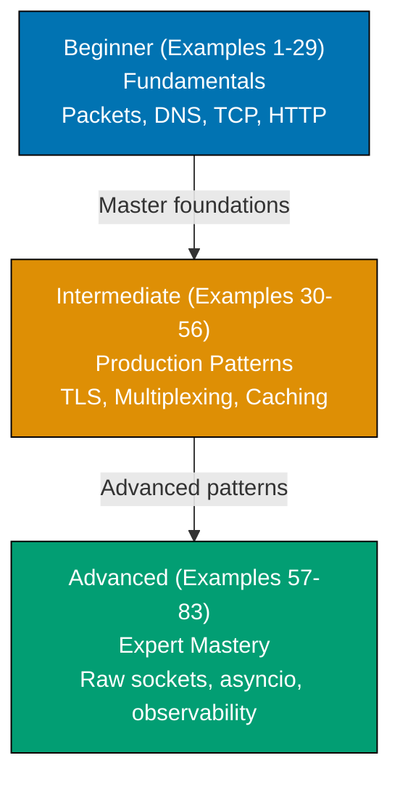

**Want to master computer networking through working code?** This by-example guide teaches essential networking concepts through 83 annotated, runnable Python examples organized by complexity level.

## What Is By-Example Learning?

By-example learning is an **example-first approach** where you learn through annotated, runnable code rather than narrative explanations. Each example is self-contained, immediately executable with `python3`, and heavily commented to show:

- **What each line does** — Inline comments explain purpose and mechanism
- **Expected outputs** — Using `# =>` notation to show results
- **Intermediate values** — Variable states and control flow made visible
- **Key takeaways** — 1-2 sentence summaries of core concepts

This approach suits **experienced developers** who understand at least one programming language and want to learn networking concepts through working code, not through lengthy prose.

## Learning Path

The networking by-example tutorial guides you through 83 examples organized into three progressive levels, from fundamental concepts to advanced patterns.

## Coverage Philosophy

This guide provides **comprehensive coverage of computer networking** through practical, annotated examples using Python's standard library. All examples run with `python3` — no external packages required.

### What Is Covered

- **Network fundamentals** — OSI model, TCP/IP, IP addressing, subnetting, MAC addresses
- **Transport layer** — TCP, UDP, sockets, handshakes, teardown, congestion control
- **Application layer** — HTTP/1.1, HTTP/2, HTTP/3 concepts, WebSockets, gRPC overview
- **DNS** — Resolution lifecycle, record types, DNS over HTTPS
- **Security** — TLS handshake, certificates, mTLS, DNSSEC, Zero Trust
- **Socket programming** — TCP/UDP servers and clients, non-blocking sockets, select(), asyncio
- **Network infrastructure** — NAT, DHCP, BGP basics, CDN, load balancing, reverse proxy
- **Observability** — tcpdump concepts, network metrics, flow data, rate limiting
- **Advanced topics** — Raw sockets, eBPF overview, DPDK overview, QUIC, SR-IOV

### What Is NOT Covered

- **Network administration** — Router configuration, OSPF, hardware setup
- **Cloud-specific networking** — AWS VPC, Azure VNet, GCP networking APIs
- **Network programming frameworks** — Twisted, Trio (standard library foundation applies to all)
- **Physical layer details** — Cable specifications, signaling, modulation
- **Full protocol implementations** — This guide demonstrates concepts, not production-grade stacks

## How to Use This Guide

1. **Sequential or selective** — Read examples in order for progressive learning, or jump to specific topics
2. **Run everything** — Copy each example into a file and run with `python3 example.py`. Experimentation solidifies understanding.
3. **Modify and explore** — Change values, add print statements, break things intentionally
4. **Use as reference** — Bookmark examples for quick lookups

**Best workflow**: Open your terminal in one window, this guide in another. Run each example as you read it.

## Structure of Each Example

Every example follows a consistent five-part format:

1. **Brief Explanation** (2-3 sentences): What the example demonstrates and why it matters
2. **Mermaid Diagram** (optional): Visual clarification when concept relationships benefit from visualization
3. **Heavily Annotated Code**: Every significant line includes a comment explaining what it does and what it produces (using `# =>` notation)
4. **Key Takeaway** (1-2 sentences): The core insight from this example
5. **Why It Matters** (50-100 words): Production relevance and real-world application

## Prerequisites

- Basic Python knowledge (variables, functions, loops, classes)
- Basic understanding that computers communicate over networks
- Python 3.8+ installed
- No external packages needed — all examples use the standard library

## Learning Strategies

### For Web Developers

You understand HTTP requests and responses. Networking by-example deepens that knowledge:

- Focus on Examples 18-26 (HTTP structure, methods, headers) to see what happens under the hood
- Then move to Examples 38-40 (TLS) to understand HTTPS security
- Examples 35-37 (HTTP/2, HTTP/3, WebSockets) show modern web protocol innovations

### For Backend Engineers

You build services that communicate over networks. This guide shows the protocols your services use:

- Start with Examples 10-17 (TCP/UDP sockets) to understand what your frameworks abstract
- Study Examples 30-34 (socket options, multiplexing, threading) to understand server architectures
- Focus on Examples 59-61 (asyncio) to understand async I/O patterns

### For System Administrators

You configure and troubleshoot networks. This guide shows the code behind the protocols:

- Examples 42-44 (NAT, DHCP, BGP) show protocols you configure daily
- Examples 72-73 (tcpdump, performance testing) demonstrate the tools you use
- Examples 66-68 (firewalls, eBPF, DPDK) explain advanced infrastructure concepts

### For Security Engineers

You protect networked systems. This guide shows the attack surface and defenses:

- Focus on Examples 38-41 (TLS, certificates, ssl module) to understand HTTPS mechanics
- Study Examples 52, 74-77 (port scanning, Zero Trust, mTLS, SOCKS, DNSSEC) for security patterns
- Examples 57-58 (raw sockets, packet crafting) show how packet-level inspection works

## Relationship to Other Networking Content

| Tutorial Type        | Coverage      | Best For                         |
| -------------------- | ------------- | -------------------------------- |
| **Introduction**     | Conceptual    | Learning from scratch            |
| **This: By Example** | Comprehensive | Rapid depth for experienced devs |

The Introduction provides narrative context. By-example provides working code. Use both for complete understanding.
