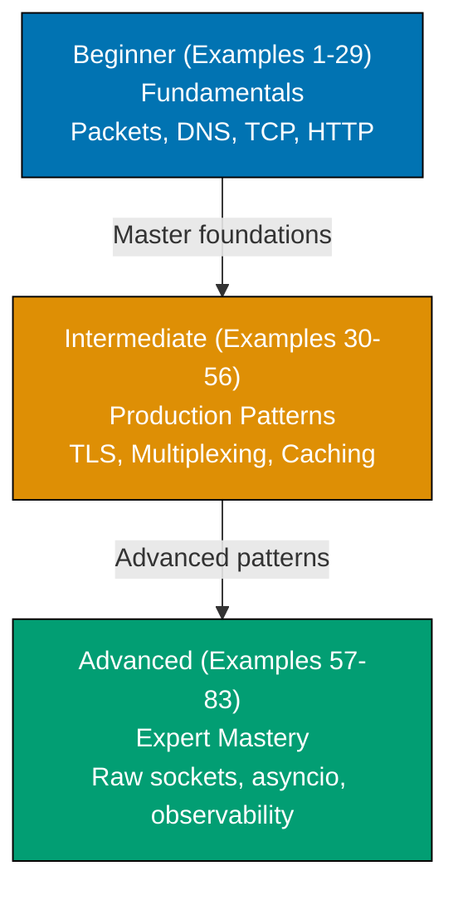

**Want to master computer networking through working code?** This by-example guide teaches essential networking concepts through 83 annotated, runnable Python examples organized by complexity level.

## What Is By-Example Learning?

By-example learning is an **example-first approach** where you learn through annotated, runnable code rather than narrative explanations. Each example is self-contained, immediately executable with `python3`, and heavily commented to show:

- **What each line does** — Inline comments explain purpose and mechanism
- **Expected outputs** — Using `# =>` notation to show results
- **Intermediate values** — Variable states and control flow made visible
- **Key takeaways** — 1-2 sentence summaries of core concepts

This approach suits **experienced developers** who understand at least one programming language and want to learn networking concepts through working code, not through lengthy prose.

## Learning Path

The networking by-example tutorial guides you through 83 examples organized into three progressive levels, from fundamental concepts to advanced patterns.

## Coverage Philosophy

This guide provides **comprehensive coverage of computer networking** through practical, annotated examples using Python's standard library. All examples run with `python3` — no external packages required.

### What Is Covered

- **Network fundamentals** — OSI model, TCP/IP, IP addressing, subnetting, MAC addresses
- **Transport layer** — TCP, UDP, sockets, handshakes, teardown, congestion control
- **Application layer** — HTTP/1.1, HTTP/2, HTTP/3 concepts, WebSockets, gRPC overview
- **DNS** — Resolution lifecycle, record types, DNS over HTTPS
- **Security** — TLS handshake, certificates, mTLS, DNSSEC, Zero Trust
- **Socket programming** — TCP/UDP servers and clients, non-blocking sockets, select(), asyncio
- **Network infrastructure** — NAT, DHCP, BGP basics, CDN, load balancing, reverse proxy
- **Observability** — tcpdump concepts, network metrics, flow data, rate limiting
- **Advanced topics** — Raw sockets, eBPF overview, DPDK overview, QUIC, SR-IOV

### What Is NOT Covered

- **Network administration** — Router configuration, OSPF, hardware setup
- **Cloud-specific networking** — AWS VPC, Azure VNet, GCP networking APIs
- **Network programming frameworks** — Twisted, Trio (standard library foundation applies to all)
- **Physical layer details** — Cable specifications, signaling, modulation
- **Full protocol implementations** — This guide demonstrates concepts, not production-grade stacks

## How to Use This Guide

1. **Sequential or selective** — Read examples in order for progressive learning, or jump to specific topics
2. **Run everything** — Copy each example into a file and run with `python3 example.py`. Experimentation solidifies understanding.
3. **Modify and explore** — Change values, add print statements, break things intentionally
4. **Use as reference** — Bookmark examples for quick lookups

**Best workflow**: Open your terminal in one window, this guide in another. Run each example as you read it.

## Structure of Each Example

Every example follows a consistent five-part format:

1. **Brief Explanation** (2-3 sentences): What the example demonstrates and why it matters
2. **Mermaid Diagram** (optional): Visual clarification when concept relationships benefit from visualization
3. **Heavily Annotated Code**: Every significant line includes a comment explaining what it does and what it produces (using `# =>` notation)
4. **Key Takeaway** (1-2 sentences): The core insight from this example
5. **Why It Matters** (50-100 words): Production relevance and real-world application

## Prerequisites

- Basic Python knowledge (variables, functions, loops, classes)
- Basic understanding that computers communicate over networks
- Python 3.8+ installed
- No external packages needed — all examples use the standard library

## Learning Strategies

### For Web Developers

You understand HTTP requests and responses. Networking by-example deepens that knowledge:

- Focus on Examples 18-26 (HTTP structure, methods, headers) to see what happens under the hood
- Then move to Examples 38-40 (TLS) to understand HTTPS security
- Examples 35-37 (HTTP/2, HTTP/3, WebSockets) show modern web protocol innovations

### For Backend Engineers

You build services that communicate over networks. This guide shows the protocols your services use:

- Start with Examples 10-17 (TCP/UDP sockets) to understand what your frameworks abstract
- Study Examples 30-34 (socket options, multiplexing, threading) to understand server architectures
- Focus on Examples 59-61 (asyncio) to understand async I/O patterns

### For System Administrators

You configure and troubleshoot networks. This guide shows the code behind the protocols:

- Examples 42-44 (NAT, DHCP, BGP) show protocols you configure daily
- Examples 72-73 (tcpdump, performance testing) demonstrate the tools you use
- Examples 66-68 (firewalls, eBPF, DPDK) explain advanced infrastructure concepts

### For Security Engineers

You protect networked systems. This guide shows the attack surface and defenses:

- Focus on Examples 38-41 (TLS, certificates, ssl module) to understand HTTPS mechanics
- Study Examples 52, 74-77 (port scanning, Zero Trust, mTLS, SOCKS, DNSSEC) for security patterns
- Examples 57-58 (raw sockets, packet crafting) show how packet-level inspection works

## Relationship to Other Networking Content

| Tutorial Type        | Coverage      | Best For                         |
| -------------------- | ------------- | -------------------------------- |
| **Introduction**     | Conceptual    | Learning from scratch            |
| **This: By Example** | Comprehensive | Rapid depth for experienced devs |

The Introduction provides narrative context. By-example provides working code. Use both for complete understanding.

## Examples by Level

### Beginner (Examples 1–29)

- [Example 1: What Is a Network — Hosts, Packets, Links](/en/learn/software-engineering/networking/by-example/beginner#example-1-what-is-a-network--hosts-packets-links)
- [Example 2: OSI Model Layers](/en/learn/software-engineering/networking/by-example/beginner#example-2-osi-model-layers)
- [Example 3: TCP/IP Model vs OSI Model](/en/learn/software-engineering/networking/by-example/beginner#example-3-tcpip-model-vs-osi-model)
- [Example 4: IP Addresses — IPv4 and CIDR Notation](/en/learn/software-engineering/networking/by-example/beginner#example-4-ip-addresses--ipv4-and-cidr-notation)
- [Example 5: Subnet Masks and Subnetting](/en/learn/software-engineering/networking/by-example/beginner#example-5-subnet-masks-and-subnetting)
- [Example 6: IPv6 Addresses](/en/learn/software-engineering/networking/by-example/beginner#example-6-ipv6-addresses)
- [Example 7: MAC Addresses and ARP](/en/learn/software-engineering/networking/by-example/beginner#example-7-mac-addresses-and-arp)
- [Example 8: DNS Resolution — Query Lifecycle](/en/learn/software-engineering/networking/by-example/beginner#example-8-dns-resolution--query-lifecycle)
- [Example 9: DNS Record Types](/en/learn/software-engineering/networking/by-example/beginner#example-9-dns-record-types)
- [Example 10: UDP Basics — Python Socket](/en/learn/software-engineering/networking/by-example/beginner#example-10-udp-basics--python-socket)
- [Example 11: TCP Basics — Python Socket](/en/learn/software-engineering/networking/by-example/beginner#example-11-tcp-basics--python-socket)
- [Example 12: TCP Three-Way Handshake](/en/learn/software-engineering/networking/by-example/beginner#example-12-tcp-three-way-handshake)
- [Example 13: TCP Four-Way Teardown](/en/learn/software-engineering/networking/by-example/beginner#example-13-tcp-four-way-teardown)
- [Example 14: Port Numbers — Well-Known vs Ephemeral](/en/learn/software-engineering/networking/by-example/beginner#example-14-port-numbers--well-known-vs-ephemeral)
- [Example 15: Socket Programming — TCP Server](/en/learn/software-engineering/networking/by-example/beginner#example-15-socket-programming--tcp-server)
- [Example 16: Socket Programming — TCP Client](/en/learn/software-engineering/networking/by-example/beginner#example-16-socket-programming--tcp-client)
- [Example 17: Socket Programming — UDP Server and Client](/en/learn/software-engineering/networking/by-example/beginner#example-17-socket-programming--udp-server-and-client)
- [Example 18: HTTP/1.1 Request Structure](/en/learn/software-engineering/networking/by-example/beginner#example-18-http11-request-structure)
- [Example 19: HTTP/1.1 Response Structure](/en/learn/software-engineering/networking/by-example/beginner#example-19-http11-response-structure)
- [Example 20: HTTP Methods](/en/learn/software-engineering/networking/by-example/beginner#example-20-http-methods)
- [Example 21: HTTP Status Codes](/en/learn/software-engineering/networking/by-example/beginner#example-21-http-status-codes)
- [Example 22: HTTP Headers — Common Ones](/en/learn/software-engineering/networking/by-example/beginner#example-22-http-headers--common-ones)
- [Example 23: URL Parsing — Python urllib.parse](/en/learn/software-engineering/networking/by-example/beginner#example-23-url-parsing--python-urllibparse)
- [Example 24: Making HTTP Requests — Python http.client](/en/learn/software-engineering/networking/by-example/beginner#example-24-making-http-requests--python-httpclient)
- [Example 25: HTTPS and TLS Basics](/en/learn/software-engineering/networking/by-example/beginner#example-25-https-and-tls-basics)
- [Example 26: Cookies and Sessions Overview](/en/learn/software-engineering/networking/by-example/beginner#example-26-cookies-and-sessions-overview)
- [Example 27: Network Interfaces — Loopback and LAN](/en/learn/software-engineering/networking/by-example/beginner#example-27-network-interfaces--loopback-and-lan)
- [Example 28: Ping and ICMP](/en/learn/software-engineering/networking/by-example/beginner#example-28-ping-and-icmp)
- [Example 29: Traceroute Concept](/en/learn/software-engineering/networking/by-example/beginner#example-29-traceroute-concept)

### Intermediate (Examples 30–56)

- [Example 30: TCP Socket Options — SO_REUSEADDR and TCP_NODELAY](/en/learn/software-engineering/networking/by-example/intermediate#example-30-tcp-socket-options--so_reuseaddr-and-tcp_nodelay)
- [Example 31: Non-Blocking Sockets](/en/learn/software-engineering/networking/by-example/intermediate#example-31-non-blocking-sockets)
- [Example 32: select() for I/O Multiplexing](/en/learn/software-engineering/networking/by-example/intermediate#example-32-select-for-io-multiplexing)
- [Example 33: Threading Model — One Thread Per Connection](/en/learn/software-engineering/networking/by-example/intermediate#example-33-threading-model--one-thread-per-connection)
- [Example 34: Python Threading with Sockets](/en/learn/software-engineering/networking/by-example/intermediate#example-34-python-threading-with-sockets)
- [Example 35: HTTP/2 Concepts — Multiplexing and Frames](/en/learn/software-engineering/networking/by-example/intermediate#example-35-http2-concepts--multiplexing-and-frames)
- [Example 36: HTTP/3 and QUIC Overview](/en/learn/software-engineering/networking/by-example/intermediate#example-36-http3-and-quic-overview)
- [Example 37: WebSockets — Handshake and Frames](/en/learn/software-engineering/networking/by-example/intermediate#example-37-websockets--handshake-and-frames)
- [Example 38: TLS Handshake Deep-Dive](/en/learn/software-engineering/networking/by-example/intermediate#example-38-tls-handshake-deep-dive)
- [Example 39: TLS Certificates — Chain of Trust](/en/learn/software-engineering/networking/by-example/intermediate#example-39-tls-certificates--chain-of-trust)
- [Example 40: Python ssl Module — Wrapping Sockets](/en/learn/software-engineering/networking/by-example/intermediate#example-40-python-ssl-module--wrapping-sockets)
- [Example 41: DNS over HTTPS (DoH) Overview](/en/learn/software-engineering/networking/by-example/intermediate#example-41-dns-over-https-doh-overview)
- [Example 42: NAT — Network Address Translation](/en/learn/software-engineering/networking/by-example/intermediate#example-42-nat--network-address-translation)
- [Example 43: DHCP — Dynamic Host Configuration](/en/learn/software-engineering/networking/by-example/intermediate#example-43-dhcp--dynamic-host-configuration)
- [Example 44: BGP Basics — Autonomous Systems](/en/learn/software-engineering/networking/by-example/intermediate#example-44-bgp-basics--autonomous-systems)
- [Example 45: Load Balancing Strategies](/en/learn/software-engineering/networking/by-example/intermediate#example-45-load-balancing-strategies)
- [Example 46: Reverse Proxy Concept](/en/learn/software-engineering/networking/by-example/intermediate#example-46-reverse-proxy-concept)
- [Example 47: CDN Fundamentals](/en/learn/software-engineering/networking/by-example/intermediate#example-47-cdn-fundamentals)
- [Example 48: TCP Congestion Control — Slow Start and AIMD](/en/learn/software-engineering/networking/by-example/intermediate#example-48-tcp-congestion-control--slow-start-and-aimd)
- [Example 49: TCP Flow Control — Window Size](/en/learn/software-engineering/networking/by-example/intermediate#example-49-tcp-flow-control--window-size)
- [Example 50: Packet Fragmentation and MTU](/en/learn/software-engineering/networking/by-example/intermediate#example-50-packet-fragmentation-and-mtu)
- [Example 51: ICMP Error Messages](/en/learn/software-engineering/networking/by-example/intermediate#example-51-icmp-error-messages)
- [Example 52: Port Scanning Concepts — Python Socket](/en/learn/software-engineering/networking/by-example/intermediate#example-52-port-scanning-concepts--python-socket)
- [Example 53: HTTP Caching — Cache-Control and ETag](/en/learn/software-engineering/networking/by-example/intermediate#example-53-http-caching--cache-control-and-etag)
- [Example 54: HTTP Authentication — Basic and Bearer Tokens](/en/learn/software-engineering/networking/by-example/intermediate#example-54-http-authentication--basic-and-bearer-tokens)
- [Example 55: Multicast and Broadcast](/en/learn/software-engineering/networking/by-example/intermediate#example-55-multicast-and-broadcast)
- [Example 56: Network Namespaces Overview](/en/learn/software-engineering/networking/by-example/intermediate#example-56-network-namespaces-overview)

### Advanced (Examples 57–83)

- [Example 57: Raw Sockets — Python](/en/learn/software-engineering/networking/by-example/advanced#example-57-raw-sockets--python)
- [Example 58: Packet Crafting with struct Module](/en/learn/software-engineering/networking/by-example/advanced#example-58-packet-crafting-with-struct-module)
- [Example 59: Python asyncio for Async Networking](/en/learn/software-engineering/networking/by-example/advanced#example-59-python-asyncio-for-async-networking)
- [Example 60: Async TCP Server with asyncio](/en/learn/software-engineering/networking/by-example/advanced#example-60-async-tcp-server-with-asyncio)
- [Example 61: Async HTTP Client with asyncio](/en/learn/software-engineering/networking/by-example/advanced#example-61-async-http-client-with-asyncio)
- [Example 62: gRPC Concepts — Protobuf and Streams](/en/learn/software-engineering/networking/by-example/advanced#example-62-grpc-concepts--protobuf-and-streams)
- [Example 63: MQTT Protocol — Pub/Sub for IoT](/en/learn/software-engineering/networking/by-example/advanced#example-63-mqtt-protocol--pubsub-for-iot)
- [Example 64: WebRTC Overview — ICE, STUN, TURN](/en/learn/software-engineering/networking/by-example/advanced#example-64-webrtc-overview--ice-stun-turn)
- [Example 65: VPN — Tunnel and Encryption Overview](/en/learn/software-engineering/networking/by-example/advanced#example-65-vpn--tunnel-and-encryption-overview)
- [Example 66: Firewall Rules — iptables Concepts](/en/learn/software-engineering/networking/by-example/advanced#example-66-firewall-rules--iptables-concepts)
- [Example 67: eBPF Basics for Networking](/en/learn/software-engineering/networking/by-example/advanced#example-67-ebpf-basics-for-networking)
- [Example 68: DPDK and Kernel Bypass Overview](/en/learn/software-engineering/networking/by-example/advanced#example-68-dpdk-and-kernel-bypass-overview)
- [Example 69: TCP BBR Congestion Control](/en/learn/software-engineering/networking/by-example/advanced#example-69-tcp-bbr-congestion-control)
- [Example 70: QUIC Implementation Concepts](/en/learn/software-engineering/networking/by-example/advanced#example-70-quic-implementation-concepts)
- [Example 71: Network Observability — Metrics, Flow Data](/en/learn/software-engineering/networking/by-example/advanced#example-71-network-observability--metrics-flow-data)
- [Example 72: tcpdump and Wireshark Concepts](/en/learn/software-engineering/networking/by-example/advanced#example-72-tcpdump-and-wireshark-concepts)
- [Example 73: Network Performance Testing — Throughput, Latency, Jitter](/en/learn/software-engineering/networking/by-example/advanced#example-73-network-performance-testing--throughput-latency-jitter)
- [Example 74: Zero Trust Networking Model](/en/learn/software-engineering/networking/by-example/advanced#example-74-zero-trust-networking-model)
- [Example 75: mTLS — Mutual TLS](/en/learn/software-engineering/networking/by-example/advanced#example-75-mtls--mutual-tls)
- [Example 76: SOCKS Proxy Protocol](/en/learn/software-engineering/networking/by-example/advanced#example-76-socks-proxy-protocol)
- [Example 77: DNS Security — DNSSEC](/en/learn/software-engineering/networking/by-example/advanced#example-77-dns-security--dnssec)
- [Example 78: Anycast Routing](/en/learn/software-engineering/networking/by-example/advanced#example-78-anycast-routing)
- [Example 79: SR-IOV and Virtualized Networking](/en/learn/software-engineering/networking/by-example/advanced#example-79-sr-iov-and-virtualized-networking)
- [Example 80: IPv6 Migration Strategies](/en/learn/software-engineering/networking/by-example/advanced#example-80-ipv6-migration-strategies)
- [Example 81: Network Simulation — Python Socket Tricks](/en/learn/software-engineering/networking/by-example/advanced#example-81-network-simulation--python-socket-tricks)
- [Example 82: Rate Limiting Algorithms — Token Bucket and Leaky Bucket](/en/learn/software-engineering/networking/by-example/advanced#example-82-rate-limiting-algorithms--token-bucket-and-leaky-bucket)
- [Example 83: Production Networking Checklist and Patterns](/en/learn/software-engineering/networking/by-example/advanced#example-83-production-networking-checklist-and-patterns)
