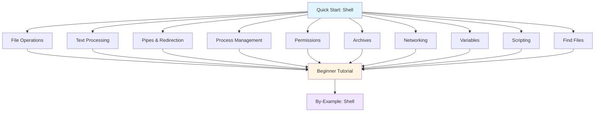

**Want to learn essential shell commands quickly?** This quick start touches 8-12 core shell concepts with one example each. By the end, you'll have practical touchpoints for the most important command-line operations.

This tutorial provides 5-30% coverage - rapid exposure to core concepts. For comprehensive mastery, continue to [Beginner Tutorial](/en/learn/software-engineering/platform-linux/shell/by-concept/beginner) (0-60% coverage) or explore [By-Example](/en/learn/software-engineering/platform-linux/shell/by-example) for heavily annotated code.

## Prerequisites

Before starting, you should have:

- Completed [Initial Setup](/en/learn/software-engineering/platform-linux/shell/initial-setup) - Terminal access and basic commands
- A Linux system, macOS, or Windows with WSL2
- Basic understanding of files and directories
- Willingness to type commands in terminal

## Learning Objectives

By the end of this tutorial, you will have touchpoints for:

1. **File Operations** - Navigate, create, copy, move, delete files and directories
2. **Text Processing** - Search, filter, and transform text with grep, sed, awk
3. **Pipes and Redirection** - Connect commands and control input/output
4. **Process Management** - Monitor, control, and background processes
5. **Permissions** - Understand and modify file permissions
6. **Archives** - Compress and extract tar/zip archives
7. **Networking** - Download files, check connections, SSH
8. **Variables and Environment** - Work with shell variables and configuration
9. **Scripting Basics** - Write simple shell scripts
10. **Find and Locate** - Search for files efficiently

## Learning Path



## Concept 1: File Operations - Navigate and Manipulate

Essential file and directory operations you'll use daily.

### Example: Complete File Management

```bash
mkdir myproject

cd myproject

echo "Hello, Shell!" > readme.txt

cat readme.txt

cp readme.txt backup.txt

mv backup.txt readme_backup.txt

ls -lh

rm readme_backup.txt

cd ..

rmdir myproject
```

**Key commands**: `mkdir`, `cd`, `echo >`, `cat`, `cp`, `mv`, `ls`, `rm`, `rmdir`

**When to explore deeper**: [Beginner Tutorial - File Operations](/en/learn/software-engineering/platform-linux/shell/by-concept/beginner#file-operations)

## Concept 2: Text Processing - grep for Searching

Search text files efficiently with `grep`.

### Example: Search Log Files

```bash
cat > app.log << EOF
2025-01-29 10:00:00 INFO Application started
2025-01-29 10:01:15 ERROR Connection failed
2025-01-29 10:02:30 INFO Request processed
2025-01-29 10:03:45 ERROR Database timeout
2025-01-29 10:04:00 INFO Application stopped
EOF

grep "ERROR" app.log

grep -i "error" app.log

grep -c "ERROR" app.log

grep -n "ERROR" app.log

grep -r "ERROR" /var/log/myapp/
```

**Key options**: `-i` (case-insensitive), `-c` (count), `-n` (line numbers), `-r` (recursive)

**When to explore deeper**: [Beginner Tutorial - Text Processing](/en/learn/software-engineering/platform-linux/shell/by-concept/beginner#text-processing)

## Concept 3: Pipes and Redirection - Connect Commands

Chain commands together and control input/output.

### Example: Process Command Output

```bash
ls -l > directory_listing.txt

echo "Additional line" >> directory_listing.txt

ls -l | grep "txt"

cat app.log | grep "ERROR" | wc -l

command_that_fails 2> errors.txt

command 2>&1 | tee output.txt

sort < unsorted.txt > sorted.txt
```

**Key operators**: `>` (redirect output), `>>` (append), `|` (pipe), `<` (input), `2>` (stderr), `2>&1` (combine streams)

**When to explore deeper**: [Beginner Tutorial - Pipes and Redirection](/en/learn/software-engineering/platform-linux/shell/by-concept/beginner#pipes-redirection)

## Concept 4: Process Management - Control Running Programs

Monitor and control processes.

### Example: Manage Background Jobs

```bash
ps aux | grep bash

pstree

sleep 60 &

jobs

fg %1


bg %1

kill 12345

kill -9 12345

top

htop  # If installed, more user-friendly than top
```

**Key commands**: `ps`, `jobs`, `fg`, `bg`, `kill`, `top`, `htop`

**When to explore deeper**: [Beginner Tutorial - Process Management](/en/learn/software-engineering/platform-linux/shell/by-concept/beginner#process-management)

## Concept 5: File Permissions - Control Access

Understand and modify file permissions.

### Example: Permission Management

```bash
echo "Test" > testfile.txt

ls -l testfile.txt


chmod +x testfile.txt

chmod 755 testfile.txt

chmod o-w testfile.txt

sudo chown newuser:newgroup testfile.txt

stat -c '%a %n' testfile.txt
```

**Key commands**: `chmod` (change mode), `chown` (change owner), `stat` (file status)

**When to explore deeper**: [Beginner Tutorial - Permissions](/en/learn/software-engineering/platform-linux/shell/by-concept/beginner#permissions)

## Concept 6: Archives - Compress and Extract

Work with compressed archives.

### Example: Tar Archive Operations

```bash
mkdir project
echo "File 1" > project/file1.txt
echo "File 2" > project/file2.txt

tar -czf project.tar.gz project/

tar -tzf project.tar.gz

tar -xzf project.tar.gz

tar -xzf project.tar.gz -C /tmp/

zip -r project.zip project/

unzip project.zip

unzip -l project.zip
```

**Key commands**: `tar` (tape archive), `zip`, `unzip`, `gzip`, `gunzip`

**When to explore deeper**: [Beginner Tutorial - Archives](/en/learn/software-engineering/platform-linux/shell/by-concept/beginner#archives)

## Concept 7: Networking - Download and Connect

Network operations from command line.

### Example: Download and Test Connections

```bash
wget https://example.com/file.txt

curl -O https://example.com/file.txt

curl -o myfile.txt https://example.com/file.txt

curl https://api.example.com/status
curl -s https://httpbin.org/get | jq .

ping -c 4 google.com

netstat -tuln | grep LISTEN
ss -tuln | grep LISTEN

ssh user@remote-server.com

scp localfile.txt user@remote:/path/to/destination/

scp user@remote:/path/to/file.txt ./local/
```

**Key commands**: `wget`, `curl`, `ping`, `ssh`, `scp`, `netstat`, `ss`

**When to explore deeper**: [Beginner Tutorial - Networking](/en/learn/software-engineering/platform-linux/shell/by-concept/beginner#networking)

## Concept 8: Variables and Environment - Configure Shell

Work with shell variables and environment configuration.

### Example: Variable Operations

```bash
NAME="Alice"

echo "Hello, $NAME"

mkdir project_$NAME
ls -d project_*

export DB_HOST="localhost"

echo $DB_HOST
echo $PATH
echo $HOME

env

PORT=8080 node server.js

cat ~/.bashrc  # Bash
cat ~/.zshrc   # Zsh

source ~/.bashrc
```

**Key concepts**: Variables (`VAR=value`), environment (`export`), `$VAR` expansion, `~/.bashrc` config

**When to explore deeper**: [Beginner Tutorial - Variables and Environment](/en/learn/software-engineering/platform-linux/shell/by-concept/beginner#variables-environment)

## Concept 9: Scripting Basics - Automate Tasks

Write simple shell scripts to automate repetitive tasks.

### Example: Basic Shell Script

Create `backup.sh`:

```bash
#!/bin/bash

BACKUP_DIR="$HOME/backups"
TIMESTAMP=$(date +%Y%m%d_%H%M%S)
SOURCE_DIR="$HOME/projects"

mkdir -p "$BACKUP_DIR"

ARCHIVE_NAME="backup_$TIMESTAMP.tar.gz"
tar -czf "$BACKUP_DIR/$ARCHIVE_NAME" "$SOURCE_DIR"

echo "Backup completed: $ARCHIVE_NAME"
```

Make executable and run:

```bash
chmod +x backup.sh

./backup.sh
```

**Key elements**: Shebang (`#!/bin/bash`), variables, commands, functions

**When to explore deeper**: [Beginner Tutorial - Shell Scripting](/en/learn/software-engineering/platform-linux/shell/by-concept/beginner#shell-scripting)

## Concept 10: Find and Locate - Search Files Efficiently

Find files by name, type, or content.

### Example: Locate Files

```bash
find . -name "*.txt"

find /var/log -type f -name "*.log"

find . -type d -name "project*"

find . -type f -mtime -7

find / -type f -size +100M

find . -name "*.tmp" -exec rm {} \;

find . -type f -perm 755

updatedb  # Update locate database (sudo)
locate myfile.txt
```

**Key commands**: `find` (search filesystem), `locate` (search index), `updatedb` (update locate database)

**When to explore deeper**: [Beginner Tutorial - Finding Files](/en/learn/software-engineering/platform-linux/shell/by-concept/beginner#finding-files)

## Concept 11: Text Transformation - sed and awk

Transform and manipulate text with sed and awk.

### Example: Text Processing

```bash
echo "Hello World" | sed 's/World/Shell/'

sed 's/old/new/g' input.txt > output.txt

sed -i 's/old/new/g' file.txt

echo "Alice 25 Developer" | awk '{print $1, $3}'

awk -F',' '{print $2}' data.csv

cat numbers.txt | awk '{sum += $1} END {print sum}'

awk '/ERROR/ {print $1, $2}' app.log
```

**Key commands**: `sed` (stream editor), `awk` (pattern processing), field separators, pattern matching

**When to explore deeper**: [Beginner Tutorial - Advanced Text Processing](/en/learn/software-engineering/platform-linux/shell/by-concept/beginner#advanced-text-processing)

## Concept 12: Command Combinations - Real-World Workflows

Combine multiple concepts to solve practical problems.

### Example: Log Analysis Workflow

```bash
grep "ERROR" /var/log/app/*.log \
  | grep "$(date +%Y-%m-%d)" \
  | sort \
  | uniq -c \
  | sort -rn

find /var/log -type f -size +100M \
  | xargs ls -lh \
  | awk '{print $5, $9}' \
  | sort -h

watch -n 5 "netstat -tuln | grep ESTABLISHED | wc -l"

tar --exclude='node_modules' \
    --exclude='*.log' \
    -czf backup.tar.gz project/

find . -name "*.js" -exec grep -l "function.*render" {} \;
```

**Key concept**: Command chaining with pipes, redirects, and command substitution solves complex problems

**When to explore deeper**: [Beginner Tutorial](/en/learn/software-engineering/platform-linux/shell/by-concept/beginner) for comprehensive workflows

## Summary

**What you've touched**:

- File operations (create, copy, move, delete)
- Text processing (grep, sed, awk)
- Pipes and redirection (chain commands, control I/O)
- Process management (monitor, control, background)
- Permissions (read, write, execute, chmod)
- Archives (tar, zip, compress, extract)
- Networking (wget, curl, ssh, scp)
- Variables and environment (shell config, exports)
- Scripting basics (automate tasks, write scripts)
- Finding files (find, locate, search criteria)
- Text transformation (sed, awk, field processing)
- Command combinations (real-world workflows)

**Commands learned**:

```bash
mkdir cd touch cat cp mv rm ls

grep sed awk sort uniq wc

> >> | < 2> 2>&1

ps jobs fg bg kill top htop

chmod chown stat

tar zip unzip gzip

wget curl ping ssh scp netstat

env export source which man

find locate updatedb
```

## Next Steps

**Want comprehensive shell mastery?**

- [Beginner Tutorial](/en/learn/software-engineering/platform-linux/shell/by-concept/beginner) (0-60% coverage) - Deep dive into shell fundamentals with extensive practice

**Prefer code-first learning?**

- [By-Example Tutorial](/en/learn/software-engineering/platform-linux/shell/by-example) - Learn through heavily annotated shell examples

**Need specific solutions?**

- Browse by-example sections for specific patterns

**Want to understand shell philosophy?**

- [Overview](/en/learn/software-engineering/platform-linux/shell/overview) - Why command-line interfaces matter

## Quick Reference Card

### Most Used Commands

```bash
cd dir      # Change directory
pwd         # Print working directory
ls -la      # List files with details

cat file    # View file
less file   # View file with pagination
cp src dst  # Copy file
mv src dst  # Move/rename file
rm file     # Remove file

grep pattern file       # Search text
head -n 10 file        # First 10 lines
tail -f file           # Follow file changes
sort file              # Sort lines
uniq file              # Remove duplicates

ps aux                 # List processes
kill PID               # Stop process
df -h                  # Disk usage
free -h                # Memory usage
top                    # Monitor processes

curl url               # Make HTTP request
ssh user@host          # Remote login
scp file user@host:~   # Copy file remotely

chmod 755 file         # rwxr-xr-x permissions
chown user:group file  # Change owner
```

### Useful Patterns

```bash
find . -name "*.txt" | wc -l

find . -name "*.tmp" -delete

tar -czf backup_$(date +%Y%m%d).tar.gz project/

tail -f /var/log/app.log | grep ERROR

sed -i 's/old/new/g' *.txt

wget url/file.tar.gz && tar -xzf file.tar.gz

du -sh */ | sort -h
```

This quick start provides touchpoints for essential shell operations. For production work, explore the beginner tutorial for comprehensive coverage and by-example content for heavily annotated code patterns.
