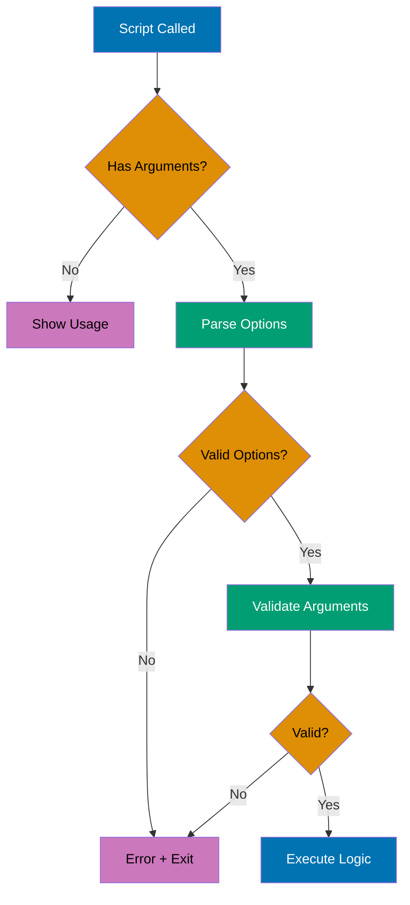
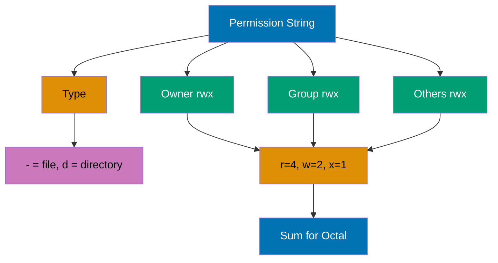
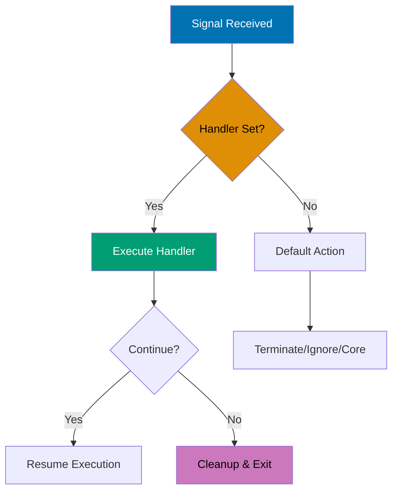

## Intermediate Level (40-75% Coverage)

This level covers intermediate shell concepts through 25 self-contained examples. Each example demonstrates production patterns used in automation, text processing, and system administration.

---

### Example 31: Text Processing (sed)

The `sed` (stream editor) command performs text transformations on files or streams, supporting substitution, deletion, insertion, and line-based operations.

```bash
# Basic substitution (first occurrence per line)
echo "hello world" | sed 's/world/universe/'
                                # => s/world/universe/: substitute pattern
                                # => Replaces first "world" with "universe"

# Global substitution (all occurrences)
echo "foo bar foo" | sed 's/foo/baz/g'
                                # => g flag: global replacement
                                # => Replaces ALL "foo" with "baz"

# Substitute in file (preview)
sed 's/old/new/g' file.txt      # => Prints modified output to stdout
                                # => Original file unchanged (safe preview)

# In-place editing
sed -i 's/old/new/g' file.txt   # => -i: modifies file directly
                                # => No backup created

# In-place with backup
sed -i.bak 's/old/new/g' file.txt
                                # => Creates file.txt.bak backup
                                # => Then modifies file.txt

# Delete lines matching pattern
sed '/^#/d' file.txt            # => /^#/d: delete lines starting with #
                                # => Removes comment lines

# Delete line number
sed '3d' file.txt               # => 3d: delete line 3

# Delete range
sed '2,5d' file.txt             # => 2,5d: delete lines 2-5

# Print specific lines
sed -n '1,10p' file.txt         # => -n: suppress default output
                                # => 1,10p: print lines 1-10 only

# Multiple operations
sed -e 's/foo/bar/g' -e 's/baz/qux/g' file.txt
                                # => -e: chain multiple commands
                                # => Applied sequentially per line

# Practical: remove trailing whitespace
sed 's/[[:space:]]*$//' file.txt
                                # => [[:space:]]*$: match trailing whitespace
                                # => Replaces with empty string

# Practical: comment out lines
sed 's/^/# /' code.sh           # => s/^/# /: prepend "# " to each line
                                # => Converts code to comments

# Practical: extract email addresses
sed -n 's/.*\([a-zA-Z0-9.]*@[a-zA-Z0-9.]*\).*/\1/p' contacts.txt
                                # => \(...\): capture group for email
                                # => \1: output captured email only
```

**Key Takeaway**: Use `sed` for quick text transformations with `s/pattern/replacement/g` for global substitution, `/pattern/d` for deletion, and `-i.bak` for safe in-place editing - it's perfect for automated text processing in scripts.

**Why It Matters**: This shell scripting concept is fundamental for production automation and system administration. Understanding this pattern enables you to write more robust and maintainable scripts for deployment, monitoring, and infrastructure management tasks.

---

### Example 32: Text Processing (awk)

The `awk` command is a powerful text processing language for field-based data manipulation, pattern matching, and reporting - ideal for CSV, logs, and tabular data.

```bash
# Print specific field
echo "one two three" | awk '{print $2}'
                                # => awk splits input by whitespace (default)
                                # => $1="one", $2="two", $3="three"
                                # => {print $2}: action block prints second field
                                # => Output: two

# Print multiple fields
ps aux | awk '{print $1, $11}'  # => ps aux: process listing with columns
                                # => awk receives each line as input
                                # => $1: first field (username)
                                # => $11: eleventh field (command name)
                                # => Comma adds space between fields
                                # => Prints username and command for each process

# Custom delimiter
awk -F':' '{print $1}' /etc/passwd
                                # => -F':': colon field separator
                                # => $1: first field (username)

# Field count
echo "a b c d" | awk '{print NF}'
                                # => NF: Number of Fields variable
                                # => Outputs: 4

# Last field
echo "a b c d" | awk '{print $NF}'
                                # => $NF: references last field dynamically
                                # => Outputs: d

# Pattern matching
awk '/error/ {print $0}' logfile.txt
                                # => /error/: match pattern
                                # => Prints lines containing "error"

# Conditional actions
awk '$3 > 100 {print $1, $3}' data.txt
                                # => $3 > 100: condition on third field
                                # => Prints first and third fields if true

# BEGIN and END blocks
awk 'BEGIN {sum=0} {sum+=$1} END {print sum}' numbers.txt
                                # => BEGIN: initialize before input
                                # => {sum+=$1}: accumulate per line
                                # => END: print final sum

# Calculate average
awk '{sum+=$1; count++} END {print sum/count}' numbers.txt
                                # => Accumulate sum and count
                                # => END: calculate average

# Multiple conditions
awk '$1 == "error" && $2 > 100 {print}' log.txt
                                # => &&: logical AND operator
                                # => Both conditions must be true

# Formatted output
awk '{printf "%-10s %5d\n", $1, $2}' data.txt
                                # => printf: formatted output
                                # => %-10s: left-align string, width 10

# Practical: sum disk usage
du -b * | awk '{total+=$1} END {print total " bytes"}'
                                # => Accumulate disk usage sizes
                                # => END: print total bytes

# Practical: process CSV
awk -F',' '{print $2, $3}' data.csv
                                # => -F',': comma delimiter for CSV
                                # => Extract columns 2 and 3

# Practical: count occurrences
awk '{count[$1]++} END {for (word in count) print word, count[word]}' words.txt
                                # => count[$1]++: associative array
                                # => END: iterate and print frequencies
```

**Key Takeaway**: Use `awk` for field-based text processing with `$1, $2, ...` for columns, `-F` for custom delimiters, and `BEGIN/END` blocks for initialization/summary - it's more powerful than `cut` and ideal for log analysis and data extraction.

**Why It Matters**: This shell scripting concept is fundamental for production automation and system administration. Understanding this pattern enables you to write more robust and maintainable scripts for deployment, monitoring, and infrastructure management tasks.

---

### Example 33: Command Line Arguments and Parsing

Production scripts need robust argument parsing to handle options, flags, and validation. Use `getopts` for POSIX-compliant option parsing or manual parsing for flexibility.



```bash
#!/bin/bash

# Basic argument check
if [ $# -eq 0 ]; then           # => $#: number of arguments passed to script
                                # => -eq 0: numeric equality (zero arguments)
    echo "Usage: $0 <filename>" # => $0: script name
                                # => Prints usage message to stdout
    exit 1                      # => Exit code 1 (error)
                                # => Stops script execution
fi

# Using getopts for option parsing
while getopts "vho:f:" opt; do  # => getopts: POSIX-compliant option parser
                                # => Built-in shell command for parsing options
                                # => "vho:f:": option string
                                # => v,h: flags (no argument)
                                # => o:,f:: options requiring argument (colon suffix)
                                # => Colon means option expects value
                                # => opt: variable receiving matched option
                                # => Loop processes each option in turn
    case $opt in                # => case statement matches option value
                                # => $opt contains single option letter
        v)
            VERBOSE=true        # => -v flag detected
                                # => Sets boolean variable
                                # => No argument required
                                # => Simple flag pattern
            ;;
        h)
            echo "Usage: $0 [-v] [-o output] -f file"
                                # => -h flag: shows help
                                # => Square brackets: optional arguments
                                # => No brackets: required arguments
            exit 0              # => Exit code 0 (success)
                                # => Help is not an error
                                # => Script stops after showing help
            ;;
        o)
            OUTPUT="$OPTARG"    # => -o option detected
                                # => $OPTARG: argument provided to option
                                # => Set by getopts automatically
                                # => Example: -o myfile → OUTPUT="myfile"
            ;;
        f)
            FILE="$OPTARG"      # => -f option detected
                                # => Required for script logic
                                # => Example: -f input.txt → FILE="input.txt"
                                # => Stored for later validation
            ;;
        \?)
            echo "Invalid option: -$OPTARG"
                                # => \?: unrecognized option
                                # => Triggered by option not in string
                                # => $OPTARG: the invalid option provided
                                # => Example: -z → OPTARG="z"
            exit 1              # => Exit with error
                                # => Prevents script from running with bad options
                                # => Early termination on invalid input
            ;;
    esac
done

# Shift past parsed options
shift $((OPTIND-1))             # => OPTIND: index of next argument to process
                                # => $((OPTIND-1)): arithmetic expansion
                                # => shift N: removes first N arguments from $@
                                # => Remaining non-option arguments now in $1, $2, ...

# Validate required arguments
if [ -z "$FILE" ]; then         # => -z: string is empty (zero length)
                                # => Checks if FILE was set by -f option
    echo "Error: -f file is required"
                                # => Error message to stdout
    exit 1                      # => Exit with error code
fi

# Practical example: backup script with options
#!/bin/bash
set -e                          # => Exit immediately on any error
                                # => Prevents partial execution

usage() {                       # => Function definition
    cat << EOF                  # => Here-document (multi-line string)
Usage: $0 [OPTIONS] source destination
                                # => $0: script name placeholder
Options:
    -c          Compress backup # => Flag option (no argument)
    -v          Verbose output  # => Flag option
    -e <ext>    Exclude file extension
                                # => Option with argument
    -h          Show this help  # => Help flag
EOF
    exit 1                      # => Exit after showing usage
}

COMPRESS=false                  # => Initialize variables with defaults
                                # => Safe defaults before parsing
VERBOSE=false                   # => Boolean flags default to false
                                # => Prevents undefined variable errors
EXCLUDE=""                      # => String option default to empty
                                # => Empty string = not set

while getopts "cve:h" opt; do   # => Parse options
                                # => Loop processes each option
                                # => c,v,h: flags (no argument)
                                # => e:: option with required argument
                                # => Colon after 'e' indicates argument needed
    case $opt in
        c) COMPRESS=true ;;     # => Set flag to true
                                # => Compact syntax: single line
        v) VERBOSE=true ;;      # => Set flag to true
                                # => Parallel pattern to 'c'
        e) EXCLUDE="$OPTARG" ;; # => Store argument value
                                # => $OPTARG set by getopts
                                # => Example: -e .log → EXCLUDE=".log"
        h) usage ;;             # => Call usage function (exits)
                                # => Function terminates script
        ?) usage ;;             # => Invalid option: show usage and exit
                                # => Catch-all for unrecognized options
    esac
done

shift $((OPTIND-1))             # => Remove parsed options from $@
                                # => Remaining: positional arguments

if [ $# -ne 2 ]; then           # => $#: count of remaining arguments
                                # => -ne 2: not equal to 2
                                # => Expects exactly source and destination
    echo "Error: source and destination required"
    usage                       # => Show usage and exit
fi

SOURCE="$1"                     # => First positional argument
                                # => After shift, $1 is first non-option arg
DEST="$2"                       # => Second positional argument
                                # => $2 is second non-option arg

[ "$VERBOSE" = true ] && echo "Backing up $SOURCE to $DEST"
                                # => [ ... ]: test condition
                                # => Checks if VERBOSE flag is true
                                # => &&: logical AND (execute if true)
                                # => Right side only runs if left side succeeds
                                # => Conditional one-liner
                                # => Compact alternative to if statement

if [ "$COMPRESS" = true ]; then # => Check compression flag
                                # => Determines backup method
    tar -czf "$DEST/backup.tar.gz" "$SOURCE"
                                # => tar: create compressed archive
                                # => -c: create, -z: gzip, -f: filename
                                # => Creates .tar.gz compressed file
else
    cp -r "$SOURCE" "$DEST"     # => Copy recursively (no compression)
                                # => -r: recursive (directories)
                                # => Faster but larger
fi

[ "$VERBOSE" = true ] && echo "Backup complete"
                                # => Conditional verbose output
                                # => Only prints if -v flag was used
```

**Key Takeaway**: Use `getopts` for standard option parsing with flags and arguments, validate all inputs before processing, and provide clear usage messages - always check `$#` for argument count and exit with non-zero status on errors.

**Why It Matters**: This shell scripting concept is fundamental for production automation and system administration. Understanding this pattern enables you to write more robust and maintainable scripts for deployment, monitoring, and infrastructure management tasks.

---

### Example 34: Error Handling and Exit Codes

Robust scripts handle errors gracefully, validate inputs, log failures, and return meaningful exit codes. Use `set -e` for fail-fast behavior and trap for cleanup.

```bash
#!/bin/bash

# Strict mode (recommended for production)
set -e                          # => Exit immediately on any error
                                # => Prevents partial execution
                                # => Command returning non-zero exits script
set -u                          # => Exit on undefined variable reference
                                # => Catches typos like $VARIABL instead of $VARIABLE
                                # => Prevents silent bugs from empty variables
set -o pipefail                 # => Pipeline fails if ANY command fails
                                # => Default: only last command determines exit code
                                # => Example: cat missing.txt | grep foo
                                # => Without pipefail: succeeds if grep succeeds
                                # => With pipefail: fails because cat failed

# Error handling function
error_exit() {
    echo "Error: $1" >&2        # => $1: first function argument (error message)
                                # => >&2: redirect stdout to stderr (file descriptor 2)
                                # => Errors should go to stderr, not stdout
    exit 1                      # => Exit code 1 (error)
                                # => Stops script execution
}

# Validate file exists
[ -f "$config_file" ] || error_exit "Config file not found"
                                # => [ -f "$config_file" ]: test if file exists
                                # => ||: logical OR (if test fails, execute right side)
                                # => Short-circuit evaluation
                                # => Compact error handling pattern

# Trap for cleanup on exit
cleanup() {                     # => Function runs on script exit
    echo "Cleaning up..."
    rm -f /tmp/tempfile_$$      # => $$: current script's process ID
                                # => Creates unique temp file per script run
                                # => rm -f: force remove (no error if missing)
}
trap cleanup EXIT               # => trap: registers signal handler
                                # => cleanup: function to call
                                # => EXIT: pseudo-signal (script exit, any reason)
                                # => Ensures cleanup runs even on errors

# Trap specific signals
trap 'echo "Interrupted"; exit 130' INT
                                # => INT: SIGINT signal (Ctrl+C)
                                # => Single-quoted string: command to execute
                                # => exit 130: convention (128 + signal number 2)
                                # => Graceful handling of user interruption

# Check command success
if ! grep -q "pattern" file.txt; then
                                # => !: logical NOT
                                # => grep -q: quiet (no output, exit code only)
                                # => if !: execute block if command FAILS
    echo "Pattern not found"
    exit 1
fi

# Alternative: check exit code
grep -q "pattern" file.txt      # => Execute command
if [ $? -ne 0 ]; then           # => $?: exit code of last command
                                # => -ne 0: not equal to zero (failure)
                                # => 0 = success, non-zero = failure
    echo "Pattern not found"
    exit 1
fi

# Conditional execution with ||
command || error_exit "Command failed"
                                # => ||: executes right side if left fails
                                # => Compact error handling
                                # => If command succeeds (exit 0), error_exit skipped
                                # => If command fails, error_exit called

# Conditional execution with &&
command && echo "Success" || echo "Failed"
                                # => &&: executes if left succeeds
                                # => ||: executes if left fails
                                # => Chain: success message OR failure message
                                # => One-liner conditional output

# Practical: database backup with error handling
#!/bin/bash
set -euo pipefail               # => Strict mode (all three options)

BACKUP_DIR="/backup"            # => Configuration constants
DB_NAME="production"            # => Database name
LOG_FILE="/var/log/backup.log"  # => Log file path

log() {                         # => Logging function
    echo "[$(date '+%Y-%m-%d %H:%M:%S')] $1" | tee -a "$LOG_FILE"
                                # => $(date ...): command substitution (timestamp)
                                # => $1: log message argument
                                # => tee -a: write to stdout AND append to file
                                # => Both console and file logging
}

error_exit() {                  # => Error handling with logging
    log "ERROR: $1"             # => Log error message
    exit 1                      # => Exit with error code
}

cleanup() {                     # => Cleanup function
    [ -f "$TEMP_FILE" ] && rm -f "$TEMP_FILE"
                                # => [ -f "$TEMP_FILE" ]: test if temp file exists
                                # => &&: if exists, remove it
                                # => Conditional cleanup (no error if TEMP_FILE unset)
    log "Cleanup completed"     # => Log cleanup action
}

trap cleanup EXIT               # => Register cleanup on exit
trap 'error_exit "Script interrupted"' INT TERM
                                # => INT: Ctrl+C, TERM: kill command
                                # => Both call error_exit (logged interruption)

# Validate backup directory
[ -d "$BACKUP_DIR" ] || error_exit "Backup directory not found"
                                # => -d: test if directory exists
                                # => Fail fast if environment not ready

log "Starting backup of $DB_NAME"
                                # => Log operation start

# Create temporary file
TEMP_FILE=$(mktemp)             # => mktemp: creates secure temp file
                                # => Returns path like /tmp/tmp.XXXXXXXXXX
                                # => $(...): command substitution
                                # => Assigns path to TEMP_FILE variable

# Perform backup
if mysqldump "$DB_NAME" > "$TEMP_FILE"; then
                                # => mysqldump: MySQL backup utility
                                # => >: redirect output to temp file
                                # => if: check exit code
    BACKUP_FILE="$BACKUP_DIR/${DB_NAME}_$(date +%Y%m%d_%H%M%S).sql"
                                # => ${VAR}: variable expansion
                                # => $(date ...): timestamp for unique filename
                                # => Format: production_20251231_235959.sql
    mv "$TEMP_FILE" "$BACKUP_FILE"
                                # => Move temp file to final location
    log "Backup successful: $BACKUP_FILE"
                                # => Log success with filename
else
    error_exit "Database backup failed"
                                # => mysqldump failed: log and exit
fi

# Verify backup
if [ ! -s "$BACKUP_FILE" ]; then
                                # => !: logical NOT
                                # => -s: file exists and is NOT empty
                                # => !-s: file missing or empty
    error_exit "Backup file is empty"
                                # => Safety check: backup created but empty
fi

log "Backup completed successfully"
exit 0                          # => Exit code 0 (success)
                                # => Explicit success exit
```

**Key Takeaway**: Use `set -euo pipefail` for strict error handling, trap for cleanup operations, and always validate inputs before processing - return exit code 0 for success and non-zero for errors, and log errors to stderr with `>&2`.

**Why It Matters**: Error handling prevents partial failures that leave systems in inconsistent states. Production scripts must handle errors gracefully to enable recovery and maintain system integrity.

---

### Example 35: Process Management (ps, kill, jobs)

Process management involves listing processes, monitoring resource usage, and controlling process lifecycle with signals for graceful shutdown or forceful termination.

```bash
# List all processes
ps aux                          # => ps: process status command
                                # => a: show processes from ALL users
                                # => u: user-oriented format (user, CPU%, MEM%, etc.)
                                # => x: include processes without controlling terminal
                                # => Output: PID, USER, %CPU, %MEM, COMMAND, etc.

# List processes for current user
ps -u $USER                     # => -u: filter by username
                                # => $USER: environment variable (current user)
                                # => Shows only processes owned by you

# Filter processes
ps aux | grep "python"          # => ps aux: list all processes
                                # => |: pipe output to grep
                                # => grep "python": filter lines containing "python"
                                # => Note: grep process itself appears in results
                                # => Add: | grep -v grep to exclude grep itself

# Process tree
ps auxf                         # => f: forest view (ASCII tree)
                                # => Shows parent-child relationships
                                # => Indentation indicates process hierarchy
                                # => Useful for understanding process spawning

# Top - interactive process monitor
top                             # => Real-time process monitoring
                                # => Updates every 3 seconds by default
                                # => Shows CPU, memory usage, load average
                                # => Press q to quit
                                # => Press k to kill (prompts for PID)
                                # => Press M to sort by memory usage

# Find process by name
pgrep python                    # => pgrep: process grep
                                # => Searches process names for "python"
                                # => Output: PIDs only (one per line)
                                # => Example output: 1234\n5678

pgrep -l python                 # => -l: list format (long)
                                # => Output: PID and process name
                                # => Example: 1234 python3

# Kill process by PID
kill 1234                       # => Sends SIGTERM (signal 15) to PID 1234
                                # => SIGTERM: termination signal (graceful)
                                # => Process can catch signal and cleanup
                                # => Process can ignore signal
                                # => Gives process chance to save state

# Force kill
kill -9 1234                    # => -9: sends SIGKILL (signal 9)
                                # => SIGKILL: immediate termination
                                # => Cannot be caught, blocked, or ignored
                                # => Process killed immediately by kernel
                                # => Use only when SIGTERM fails
                                # => No cleanup possible

# Kill by name
pkill python                    # => pkill: kill processes by name
                                # => Sends SIGTERM to ALL processes named "python"
                                # => DANGEROUS: kills all matching processes
                                # => Use carefully in multi-user systems

# Kill with pattern
pkill -f "python script.py"     # => -f: match full command line
                                # => Searches entire command, not just process name
                                # => Example: matches "python script.py arg1 arg2"
                                # => More precise than pkill python

# Check if process is running
if pgrep -x nginx > /dev/null; then
                                # => pgrep -x: exact match (process name exactly "nginx")
                                # => > /dev/null: discard output (only need exit code)
                                # => if: checks exit code (0 = found, 1 = not found)
    echo "Nginx is running"     # => Executed if pgrep found process
else
    echo "Nginx is not running" # => Executed if pgrep found nothing
fi

# Job control
command &                       # => &: run command in background
                                # => Shell returns immediately
                                # => Process runs independently
jobs                            # => List background jobs for current shell
                                # => Shows job number, status, command
fg %1                           # => fg: foreground
                                # => %1: job number 1
                                # => Brings job to foreground (interactive)
bg %1                           # => bg: background
                                # => %1: job number 1
                                # => Resumes stopped job in background
kill %1                         # => kill: terminate job
                                # => %1: job number (not PID)

# Wait for process to finish
sleep 30 &                      # => Run sleep in background
                                # => sleep 30: wait 30 seconds
BGPID=$!                        # => $!: PID of last background job
                                # => Captures sleep's PID
wait $BGPID                     # => wait: blocks until PID exits
                                # => Script pauses here for 30 seconds
echo "Background process completed"
                                # => Executes after sleep finishes

# Practical: graceful service restart
#!/bin/bash

SERVICE_NAME="myapp"            # => Service name for logging
PID_FILE="/var/run/myapp.pid"   # => PID file location

# Get PID
if [ -f "$PID_FILE" ]; then     # => -f: test if file exists
                                # => PID file exists means service may be running
    PID=$(cat "$PID_FILE")      # => cat: read file contents
                                # => $(...): command substitution
                                # => PID now contains process ID

    # Check if process exists
    if kill -0 "$PID" 2>/dev/null; then
                                # => kill -0: signal 0 (null signal)
                                # => Doesn't kill, just checks if process exists
                                # => 2>/dev/null: discard error output
                                # => Exit code 0 if process exists
        echo "Stopping $SERVICE_NAME (PID: $PID)"
        kill "$PID"             # => Send SIGTERM (default signal)
                                # => Requests graceful shutdown

        # Wait up to 10 seconds
        for i in {1..10}; do    # => Brace expansion: {1..10} → 1 2 3 ... 10
                                # => Loop 10 times (10 second timeout)
            if ! kill -0 "$PID" 2>/dev/null; then
                                # => !: logical NOT
                                # => kill -0: check if process still exists
                                # => If process gone, condition true
                echo "Process stopped gracefully"
                break           # => Exit loop early (process stopped)
            fi
            sleep 1             # => Wait 1 second before next check
        done

        # Force kill if still running
        if kill -0 "$PID" 2>/dev/null; then
                                # => After 10 second timeout
                                # => Check if process STILL exists
            echo "Forcing stop..."
            kill -9 "$PID"      # => Send SIGKILL (force termination)
                                # => Cannot be ignored
        fi
    fi
fi

# Start new process
./myapp &                       # => Run myapp in background
                                # => &: background execution
echo $! > "$PID_FILE"           # => $!: PID of last background job
                                # => Write PID to file for next restart
echo "Service started"
```

**Key Takeaway**: Use `ps aux` to list processes, `pgrep/pkill` for name-based operations, and `kill` with SIGTERM (default) before SIGKILL (-9) - always verify process existence with `kill -0` before sending signals, and use PID files for reliable service management.

**Why It Matters**: This shell scripting concept is fundamental for production automation and system administration. Understanding this pattern enables you to write more robust and maintainable scripts for deployment, monitoring, and infrastructure management tasks.

---

### Example 36: File Permissions and Ownership (chmod, chown)

Linux file permissions control read, write, and execute access for owner, group, and others. Permissions are critical for security and proper system operation.



```bash
# View permissions
ls -l file.txt                  # => ls: list command
                                # => -l: long format (detailed)
                                # => Output: -rw-r--r-- 1 user group 1234 Dec 30 file.txt
                                # => Permission breakdown:
                                # => -: file type (- = regular file, d = directory, l = symlink)
                                # => rw-: owner permissions (read, write, no execute)
                                # => r--: group permissions (read only)
                                # => r--: others permissions (read only)
                                # => 1: hard link count
                                # => user: owner name
                                # => group: group name
                                # => 1234: file size in bytes

# Permission values
# r (read) = 4: View file contents or list directory contents
# w (write) = 2: Modify file or create/delete files in directory
# x (execute) = 1: Run file as program or enter directory (cd)

# Octal notation (most common)
chmod 644 file.txt              # => chmod: change mode (permissions)
                                # => 644: octal notation
                                # => First digit (6): owner permissions = 4+2 = rw-
                                # => Second digit (4): group permissions = 4 = r--
                                # => Third digit (4): others permissions = 4 = r--
                                # => Result: -rw-r--r--
                                # => Standard permission for text files

chmod 755 script.sh             # => 755: common for executables
                                # => First digit (7): owner = 4+2+1 = rwx
                                # => Second digit (5): group = 4+1 = r-x
                                # => Third digit (5): others = 4+1 = r-x
                                # => Result: -rwxr-xr-x
                                # => Owner: full access, others: read and execute
                                # => Standard permission for scripts

chmod 700 private.sh            # => 700: private executable
                                # => First digit (7): owner = 4+2+1 = rwx
                                # => Second digit (0): group = 0 = ---
                                # => Third digit (0): others = 0 = ---
                                # => Result: -rwx------
                                # => Only owner has any access
                                # => Maximum privacy for sensitive scripts

# Symbolic notation
chmod u+x script.sh             # => u+x: symbolic notation
                                # => u: user (owner)
                                # => +: add permission
                                # => x: execute permission
                                # => Adds execute for owner only
                                # => Other permissions unchanged
                                # => Relative change (not absolute)

chmod go-w file.txt             # => go-w: remove write for group and others

chmod a+r file.txt              # => a+r: add read for all users

chmod u=rwx,g=rx,o=r file.txt   # => Set owner=rwx, group=rx, others=r
                                # => Equivalent to chmod 754

# Recursive permissions
chmod -R 755 /var/www/html      # => -R: apply to directory tree recursively

# Make script executable
chmod +x deploy.sh              # => +x: add execute for all users

# Change ownership
chown alice file.txt            # => Change owner to "alice"
                                # => Requires root/sudo privileges

chown alice:developers file.txt # => Set owner=alice, group=developers

# Change group only
chgrp developers file.txt       # => Change group to "developers"

# Recursive ownership
chown -R www-data:www-data /var/www
                                # => -R: recursive ownership change

# Practical: web server permissions
# Files: 644 (rw-r--r--)
find /var/www/html -type f -exec chmod 644 {} \;
                                # => -type f: regular files only
                                # => -exec chmod 644 {}: apply 644 to each

# Directories: 755 (rwxr-xr-x)
find /var/www/html -type d -exec chmod 755 {} \;
                                # => -type d: directories only
                                # => Directories need execute for cd

# Uploads directory (writable by web server)
chmod 775 /var/www/html/uploads
                                # => 775: rwxrwxr-x (group writable)
chown www-data:www-data /var/www/html/uploads
                                # => Web server needs ownership to write

# Practical: secure private key
chmod 600 ~/.ssh/id_rsa         # => 600: rw------- (owner only)
                                # => SSH requires restricted permissions
```

**Key Takeaway**: Use octal notation (644, 755, 700) for absolute permission sets, symbolic notation (u+x, go-w) for relative changes - remember that 644 is standard for files, 755 for directories/executables, and 600 for private keys, and always verify permissions after changes.

**Why It Matters**: This shell scripting concept is fundamental for production automation and system administration. Understanding this pattern enables you to write more robust and maintainable scripts for deployment, monitoring, and infrastructure management tasks.

---

### Example 37: Archiving and Compression (tar, gzip, zip)

Archiving combines multiple files into one file, while compression reduces file size. The `tar` command creates archives, often combined with `gzip` or `bzip2` for compression.

```bash
# Create tar archive
tar -cf archive.tar files/      # => -c: create mode
                                # => -f: output filename

# Create compressed tar (gzip)
tar -czf archive.tar.gz files/  # => -z: compress with gzip
                                # => Extension: .tar.gz or .tgz

# Create compressed tar (bzip2)
tar -cjf archive.tar.bz2 files/ # => -j: compress with bzip2 (better ratio)

# Create compressed tar (xz)
tar -cJf archive.tar.xz files/  # => -J: compress with xz (best ratio)

# Extract tar archive
tar -xf archive.tar             # => -x: extract mode

# Extract compressed tar
tar -xzf archive.tar.gz         # => -z: decompress with gzip
tar -xjf archive.tar.bz2        # => -j: decompress with bzip2

# Extract to specific directory
tar -xzf archive.tar.gz -C /tmp # => -C /tmp: extract to /tmp/

# List archive contents
tar -tzf archive.tar.gz         # => -t: list contents without extracting

# Verbose output
tar -czfv backup.tar.gz data/   # => -v: verbose (show files as processed)

# Exclude files
tar -czf backup.tar.gz --exclude='*.log' --exclude='.git' project/
                                # => --exclude: skip matched patterns

# Compress existing file (gzip)
gzip large_file.txt             # => Creates .gz, removes original

# Preserve original
gzip -k large_file.txt          # => -k: keep original file
                                # => Creates large_file.txt.gz
                                # => Original large_file.txt remains
                                # => Non-destructive

# Decompress gzip
gunzip file.txt.gz              # => gunzip: decompression utility
                                # => Restores file.txt
                                # => Removes file.txt.gz
gzip -d file.txt.gz             # => -d: decompress mode
                                # => Same as gunzip

# Zip (compatible with Windows)
zip -r archive.zip files/       # => zip: ZIP archive utility
                                # => -r: recursive (include subdirectories)
                                # => Creates Windows-compatible archive
                                # => Preserves original files

# Unzip
unzip archive.zip               # => unzip: extract ZIP archives
                                # => Extracts to current directory
                                # => Shows file names while extracting

# Unzip to directory
unzip archive.zip -d /tmp       # => -d /tmp: destination directory
                                # => Extracts to /tmp/
                                # => Creates directory if needed

# Practical: backup with date
backup_name="backup_$(date +%Y%m%d_%H%M%S).tar.gz"
                                # => $(date ...): command substitution
                                # => +%Y%m%d_%H%M%S: timestamp format
                                # => Example: backup_20251231_235959.tar.gz
tar -czf "$backup_name" /data   # => Creates timestamped backup
                                # => Unique filename prevents overwrites
echo "Backup created: $backup_name"

# Practical: incremental backup
tar -czf backup_full.tar.gz --listed-incremental=snapshot.file /data
                                # => --listed-incremental: incremental backup mode
                                # => snapshot.file: tracks changes since last backup
                                # => First run: full backup, creates snapshot
                                # => Subsequent runs: only changed files

# Practical: split large archive
tar -czf - /data | split -b 100M - backup.tar.gz.part
                                # => tar -czf -: output to stdout (-)
                                # => |: pipe to split
                                # => split -b 100M: split into 100MB chunks
                                # => -: read from stdin
                                # => backup.tar.gz.part: output prefix
                                # => Creates: backup.tar.gz.partaa, partab, etc.
                                # => Restore: cat backup.tar.gz.part* | tar -xzf -
```

**Key Takeaway**: Use `tar -czf` to create gzip-compressed archives, `tar -xzf` to extract, and `-v` for verbose output - remember that `tar` preserves permissions and directory structure, making it ideal for backups, and gzip removes original files unless `-k` is used.

**Why It Matters**: This shell scripting concept is fundamental for production automation and system administration. Understanding this pattern enables you to write more robust and maintainable scripts for deployment, monitoring, and infrastructure management tasks.

---

### Example 38: Network Operations (curl, wget, ssh)

Network commands download files, interact with APIs, and access remote systems. The `curl` and `wget` commands handle HTTP requests, while `ssh` provides secure remote access.

```bash
# Download file with wget
wget https://example.com/file.txt
                                # => wget: web get utility
                                # => Downloads file to current directory
                                # => Saves with original filename (file.txt)
                                # => Shows progress bar
                                # => Auto-resumes on interruption

# Download with custom name
wget -O custom_name.txt https://example.com/file.txt
                                # => -O: output filename (capital O)
                                # => Saves as custom_name.txt
                                # => Overwrites if exists

# Download multiple files
wget -i urls.txt                # => -i: input file containing URLs
                                # => urls.txt: one URL per line
                                # => Downloads all files sequentially

# Basic HTTP request with curl
curl https://api.example.com/data
                                # => curl: transfer data with URLs
                                # => Makes HTTP GET request
                                # => Prints response to stdout
                                # => No file saved by default

# Save to file
curl -o output.json https://api.example.com/data
                                # => -o: output filename (lowercase o)
                                # => Saves response to output.json
                                # => Useful for API responses

# Follow redirects
curl -L https://github.com/file # => -L: follow Location headers (redirects)
                                # => Many URLs redirect (http → https)
                                # => Without -L: stops at redirect
                                # => With -L: follows to final destination

# Show headers
curl -I https://example.com     # => -I: HEAD request (headers only)
                                # => Shows: Content-Type, Content-Length, etc.
                                # => No response body
                                # => Useful for checking status codes

# Send POST request
curl -X POST -d "name=Alice&age=30" https://api.example.com/users
                                # => -X POST: HTTP method (POST)
                                # => -d: data payload (request body)
                                # => URL-encoded format: key1=value1&key2=value2
                                # => Content-Type: application/x-www-form-urlencoded (default)

# Send JSON data
curl -X POST \
  -H "Content-Type: application/json" \
  -d '{"name":"Alice","age":30}' \
  https://api.example.com/users
                                # => \: line continuation (multi-line command)
                                # => -H: custom header
                                # => Content-Type: application/json (JSON payload)
                                # => -d: JSON data (single-quoted to preserve format)

# Authentication
curl -u username:password https://api.example.com/protected
                                # => -u: HTTP Basic Authentication
                                # => username:password format
                                # => Encodes credentials in Authorization header
                                # => INSECURE over HTTP (use HTTPS!)

# Download with progress bar
curl -# -O https://example.com/large_file.zip
                                # => -#: progress bar (instead of stats)
                                # => -O: save with original filename (capital O)
                                # => Shows percentage complete

# SSH - remote command execution
ssh user@server 'ls /var/log'   # => ssh: secure shell
                                # => user@server: username and hostname
                                # => 'ls /var/log': command to execute remotely
                                # => Output returned to local terminal
                                # => Connection closes after command

# SSH with key
ssh -i ~/.ssh/id_rsa user@server
                                # => -i: identity file (private key)
                                # => Key-based auth (no password)

# Copy file to remote (scp)
scp file.txt user@server:/path/to/destination
                                # => scp: secure copy over SSH

# Copy from remote
scp user@server:/path/to/file.txt local_dir/
                                # => Download file from remote

# Copy directory recursively
scp -r directory/ user@server:/path/
                                # => -r: recursive copy

# Rsync (better than scp for large transfers)
rsync -avz /local/path/ user@server:/remote/path/
                                # => -a: archive mode
                                # => -v: verbose
                                # => -z: compress during transfer
                                # => Only transfers changed files

# Practical: API health check
if curl -f -s -o /dev/null https://api.example.com/health; then
                                # => -f: fail on HTTP errors
                                # => -s: silent mode
                                # => -o /dev/null: discard output
    echo "API is up"
else
    echo "API is down"
fi

# Practical: download and extract
curl -L https://releases.example.com/app.tar.gz | tar -xzf -
                                # => Download and extract in one command

# Practical: remote backup
ssh user@server 'tar -czf - /data' > backup.tar.gz
                                # => Stream remote archive to local file
```

**Key Takeaway**: Use `curl` for API interactions and flexible HTTP requests, `wget` for downloading files with resume support, and `ssh/scp/rsync` for secure remote access and file transfer - remember that `curl` writes to stdout by default while `wget` saves to files.

**Why It Matters**: This shell scripting concept is fundamental for production automation and system administration. Understanding this pattern enables you to write more robust and maintainable scripts for deployment, monitoring, and infrastructure management tasks.

---

### Example 39: Scheduling Tasks (cron, at)

Task scheduling automates recurring jobs with `cron` or one-time execution with `at`. Cron is essential for maintenance tasks, backups, and periodic monitoring.

```bash
# View current user's crontab
crontab -l                      # => -l: list scheduled jobs

# Edit crontab
crontab -e                      # => -e: edit mode (syntax-checked on save)

# Crontab format
# Minute Hour Day Month DayOfWeek Command
# 0-59   0-23 1-31 1-12  0-6      (0=Sunday)
                                # => Five time fields + command
                                # => */n: every n units
                                # => n,m,o: comma-separated values

# Examples of cron schedules:
# 0 2 * * *    /backup.sh       # => Daily at 2:00 AM
# 30 */6 * * * /check.sh        # => Every 6 hours at :30
# 0 0 * * 0    /weekly.sh       # => Weekly on Sunday at midnight
# 0 9 1 * *    /monthly.sh      # => Monthly on 1st at 9:00 AM
# */15 * * * * /monitor.sh      # => Every 15 minutes

# Practical crontab entries
crontab -e                      # => Open editor to add:

# Backup database daily at 2 AM
0 2 * * * /usr/local/bin/backup_db.sh >> /var/log/backup.log 2>&1
                                # => >>: append output
                                # => 2>&1: redirect stderr to stdout

# Clean temp files every Sunday at 3 AM
0 3 * * 0 find /tmp -type f -mtime +7 -delete
                                # => 0 3 * * 0: Sunday 3:00 AM
                                # => -mtime +7: modified more than 7 days ago

# Check disk space every hour
0 * * * * df -h | mail -s "Disk Report" admin@example.com
                                # => 0 *: top of every hour

# Special cron strings
@reboot    /startup.sh          # => At system startup
@daily     /daily_task.sh       # => Equivalent to 0 0 * * *
@hourly    /hourly_task.sh      # => Equivalent to 0 * * * *
@weekly    /weekly_task.sh      # => Equivalent to 0 0 * * 0
@monthly   /monthly_task.sh     # => Equivalent to 0 0 1 * *

# One-time task with at
echo "/backup.sh" | at 14:30    # => Runs once at 2:30 PM

# Schedule for specific date
echo "/backup.sh" | at 2:00 AM 2025-12-31
                                # => Runs once at specific date/time

# List scheduled at jobs
atq                             # => Lists pending one-time jobs

# Remove at job
atrm 1                          # => Cancels job number 1

# Practical: maintenance script with logging
#!/bin/bash
# Add to crontab: 0 3 * * * /path/to/maintenance.sh

LOGFILE="/var/log/maintenance.log"

log() {
    echo "[$(date '+%Y-%m-%d %H:%M:%S')] $1" >> "$LOGFILE"
                                # => Timestamped log entry
}

log "Starting maintenance"

# Clean old logs (older than 30 days)
find /var/log -name "*.log" -mtime +30 -delete
log "Cleaned old logs"

# Optimize database
mysqlcheck --optimize --all-databases
log "Optimized databases"

# Update package list
apt-get update -qq              # => -qq: quiet mode
log "Updated package list"

log "Maintenance completed"
```

**Key Takeaway**: Use cron for recurring tasks with `crontab -e` to edit schedules, and `at` for one-time execution - always redirect cron output to log files for debugging, and remember that cron runs with limited environment variables so use absolute paths.

**Why It Matters**: This shell scripting concept is fundamental for production automation and system administration. Understanding this pattern enables you to write more robust and maintainable scripts for deployment, monitoring, and infrastructure management tasks.

---

### Example 40: Script Best Practices

Production scripts require robust error handling, logging, argument validation, and clear documentation. Following best practices ensures reliability and maintainability.

```bash
#!/bin/bash
#
# Script: backup_database.sh
# Description: Automated database backup with compression and rotation
# Author: DevOps Team
# Date: 2025-12-30
# Usage: ./backup_database.sh [-v] [-d database] [-o output_dir]
#
                                # => Shebang: specifies bash interpreter
                                # => #!/bin/bash must be first line
                                # => Header comments: documentation
                                # => Script metadata block (standard format)
                                # => Best practice: always document purpose and usage
                                # => Makes script self-documenting

# Strict error handling
set -euo pipefail               # => set -e: exit on error
                                # => set -u: exit on undefined variable
                                # => set -o pipefail: pipeline fails if any command fails
                                # => Strict mode: fail fast

# Configuration
readonly SCRIPT_NAME=$(basename "$0")
                                # => readonly: constant (cannot be modified)
                                # => basename: extracts filename from path
                                # => $0: script path
                                # => Example: /path/to/script.sh → script.sh
readonly SCRIPT_DIR=$(dirname "$(readlink -f "$0")")
                                # => readlink -f: resolves symlinks to real path
                                # => dirname: extracts directory from path
                                # => Script's directory path
readonly LOG_FILE="/var/log/${SCRIPT_NAME%.sh}.log"
                                # => ${SCRIPT_NAME%.sh}: removes .sh extension
                                # => Parameter expansion: pattern removal
                                # => Example: backup_database.sh → backup_database.log
readonly BACKUP_DIR="${BACKUP_DIR:-/backup}"
                                # => ${VAR:-default}: use VAR or default if unset
                                # => Allows environment override
                                # => Default: /backup
readonly RETENTION_DAYS=7       # => Constant: backup retention period

# Global variables
VERBOSE=false                   # => Boolean flag: default off
                                # => Changed by -v option
DATABASE=""                     # => Required argument: set by getopts
                                # => Must be provided by user
OUTPUT_DIR="$BACKUP_DIR"        # => Initialize from constant
                                # => Can be overridden by -o option

# Logging function
log() {                         # => Centralized logging function
    local level="$1"            # => local: function-scoped variable
                                # => $1: first argument (log level)
    shift                       # => shift: removes $1, shifts arguments left
                                # => $2 becomes $1, $3 becomes $2, etc.
    local message="$*"          # => $*: all remaining arguments as single string
                                # => Captures full log message
    local timestamp=$(date '+%Y-%m-%d %H:%M:%S')
                                # => $(date ...): current timestamp
                                # => Format: YYYY-MM-DD HH:MM:SS

    echo "[$timestamp] [$level] $message" | tee -a "$LOG_FILE"
                                # => Formatted log entry
                                # => tee -a: write to stdout AND append to file
                                # => Both console and file logging

    if [ "$level" = "ERROR" ]; then
                                # => String equality check
        echo "[$timestamp] [$level] $message" >&2
                                # => >&2: redirect to stderr
                                # => Errors go to stderr
    fi
}

# Error handling
error_exit() {                  # => Centralized error exit function
    log "ERROR" "$1"            # => Log error with ERROR level
                                # => $1: error message
    exit 1                      # => Exit code 1 (failure)
}

# Cleanup on exit
cleanup() {                     # => Cleanup function (runs on exit)
    local exit_code=$?          # => $?: exit code of last command
                                # => Captures script's exit status

    if [ $exit_code -ne 0 ]; then
                                # => -ne: not equal (numeric)
                                # => Non-zero: error occurred
        log "ERROR" "Script failed with exit code $exit_code"
    fi

    # Remove temp files
    [ -f "$TEMP_FILE" ] && rm -f "$TEMP_FILE"
                                # => [ -f "$TEMP_FILE" ]: check if temp file exists
                                # => &&: execute if true
                                # => Conditional cleanup

    log "INFO" "Cleanup completed"
}
trap cleanup EXIT               # => trap: register signal handler
                                # => cleanup: function to call
                                # => EXIT: on script exit (any reason)

# Handle interrupts
interrupted() {                 # => Interrupt handler function
    log "WARNING" "Script interrupted by user"
    exit 130                    # => 130: convention for SIGINT (128 + 2)
}
trap interrupted INT TERM       # => INT: Ctrl+C, TERM: kill command
                                # => Both call interrupted function

# Usage information
usage() {                       # => Help function
                                # => Called by -h option
    cat << EOF                  # => Here-document: multi-line string
                                # => << EOF: start heredoc, terminated by EOF
Usage: $SCRIPT_NAME [OPTIONS]   # => $SCRIPT_NAME: script filename
                                # => Variables expanded in heredoc

Automated database backup with compression and rotation.

Options:
    -v              Verbose output
    -d DATABASE     Database name (required)
    -o DIR          Output directory (default: $BACKUP_DIR)
    -h              Show this help message

Examples:
    $SCRIPT_NAME -d production
    $SCRIPT_NAME -v -d mydb -o /mnt/backup

EOF
                                # => EOF terminates heredoc (must be alone on line)
    exit 0                      # => Exit with success (help is not error)
                                # => Help is successful operation
}

# Parse command line arguments
parse_args() {                  # => Argument parsing function
                                # => Processes script options
    while getopts "vd:o:h" opt; do
                                # => getopts: POSIX option parser
                                # => "vd:o:h": option string
                                # => v,h: flags (no argument)
                                # => d:,o:: require argument (colon after letter)
        case $opt in            # => case: match option
                                # => $opt contains current option letter
            v)
                VERBOSE=true    # => -v flag: enable verbose
                                # => Sets global VERBOSE variable
                ;;
            d)
                DATABASE="$OPTARG"
                                # => -d option: database name
                                # => $OPTARG: argument value (set by getopts)
                ;;
            o)
                OUTPUT_DIR="$OPTARG"
                                # => -o option: output directory
                                # => Overrides default BACKUP_DIR
                ;;
            h)
                usage           # => -h: show help and exit
                                # => Calls usage() function
                ;;
            \?)
                error_exit "Invalid option: -$OPTARG"
                                # => \?: invalid option (not in option string)
                                # => $OPTARG contains invalid option letter
                ;;
            :)
                error_exit "Option -$OPTARG requires an argument"
                                # => :: missing required argument
                                # => Triggered when d: or o: has no value
                ;;
        esac
    done

    shift $((OPTIND-1))         # => Remove parsed options from arguments
                                # => $OPTIND: next argument index (set by getopts)
                                # => Leaves only non-option arguments
}

# Validate arguments
validate_args() {               # => Argument validation function
    if [ -z "$DATABASE" ]; then # => -z: string is empty
                                # => DATABASE required
        error_exit "Database name is required (-d option)"
    fi

    if [ ! -d "$OUTPUT_DIR" ]; then
                                # => !: logical NOT
                                # => -d: directory exists
                                # => Check directory exists
        error_exit "Output directory does not exist: $OUTPUT_DIR"
    fi

    if [ ! -w "$OUTPUT_DIR" ]; then
                                # => -w: writable
                                # => Check write permissions
        error_exit "Output directory is not writable: $OUTPUT_DIR"
    fi
}

# Check prerequisites
check_prerequisites() {         # => Dependency check function
    local required_commands=("mysqldump" "gzip")
                                # => Array of required commands
                                # => ( ): array syntax

    for cmd in "${required_commands[@]}"; do
                                # => ${array[@]}: all array elements
                                # => Iterate over commands
        if ! command -v "$cmd" &> /dev/null; then
                                # => command -v: check if command exists
                                # => &> /dev/null: discard output
                                # => !: fail if command not found
            error_exit "Required command not found: $cmd"
        fi
    done
}

# Rotate old backups
rotate_backups() {              # => Backup rotation function
    log "INFO" "Rotating backups older than $RETENTION_DAYS days"

    find "$OUTPUT_DIR" -name "${DATABASE}_*.sql.gz" -mtime +$RETENTION_DAYS -delete
                                # => find: search files
                                # => -name: filename pattern
                                # => ${DATABASE}_*: database-specific backups
                                # => -mtime +N: modified more than N days ago
                                # => -delete: remove matching files

    local deleted_count=$(find "$OUTPUT_DIR" -name "${DATABASE}_*.sql.gz" -mtime +$RETENTION_DAYS | wc -l)
                                # => wc -l: count lines
                                # => Count deleted backups

    [ "$VERBOSE" = true ] && log "INFO" "Deleted $deleted_count old backup(s)"
                                # => Conditional verbose logging
}

# Main backup function
backup_database() {             # => Core backup logic
    local backup_file="${OUTPUT_DIR}/${DATABASE}_$(date +%Y%m%d_%H%M%S).sql.gz"
                                # => Construct timestamped filename
                                # => Example: production_20251231_235959.sql.gz

    log "INFO" "Starting backup of database: $DATABASE"

    # Create backup with compression
    if mysqldump --single-transaction --quick "$DATABASE" | gzip > "$backup_file"; then
                                # => mysqldump: MySQL backup utility
                                # => --single-transaction: consistent snapshot
                                # => --quick: stream rows (low memory)
                                # => |: pipe to gzip
                                # => gzip: compress output
                                # => >: redirect to file
        local size=$(du -h "$backup_file" | cut -f1)
                                # => du -h: disk usage, human-readable
                                # => cut -f1: extract first field (size)
        log "INFO" "Backup successful: $backup_file (size: $size)"
    else
        error_exit "Backup failed for database: $DATABASE"
    fi

    # Verify backup integrity
    if [ ! -s "$backup_file" ]; then
                                # => -s: file exists and NOT empty
                                # => !-s: file missing or empty
        error_exit "Backup file is empty: $backup_file"
    fi

    # Test gzip integrity
    if ! gzip -t "$backup_file"; then
                                # => gzip -t: test integrity
                                # => Verifies file is valid gzip
        error_exit "Backup file is corrupted: $backup_file"
    fi
}

# Main execution
main() {                        # => Main entry point function
                                # => Orchestrates script execution flow
    log "INFO" "Starting $SCRIPT_NAME"

    parse_args "$@"             # => "$@": all script arguments
                                # => Parse and set global variables
    validate_args               # => Validate after parsing
                                # => Ensures required inputs provided
    check_prerequisites         # => Check dependencies
                                # => Verify mysqldump and gzip available

    backup_database             # => Execute backup
                                # => Core business logic
    rotate_backups              # => Clean old backups
                                # => Maintains retention policy

    log "INFO" "$SCRIPT_NAME completed successfully"
}

# Run main function
main "$@"                       # => Execute main with all script arguments
                                # => "$@": preserves argument quoting
                                # => Entry point of script execution
```

**Key Takeaway**: Use `set -euo pipefail` for strict error handling, create dedicated logging and error functions, validate all inputs, provide usage documentation, and implement cleanup with trap - always use readonly for constants, check prerequisites before execution, and return meaningful exit codes.

**Why It Matters**: Error handling prevents partial failures that leave systems in inconsistent states. Production scripts must handle errors gracefully to enable recovery and maintain system integrity.

---

### Example 41: Find Command Mastery

The `find` command searches for files based on name, type, size, time, permissions, and more. It's essential for locating files and performing bulk operations in scripts.

```bash
# Find by name
find /home -name "*.log"         # => -name: match filename pattern
                                 # => Recursive search from /home

# Case-insensitive name
find /home -iname "readme*"      # => -iname: case-insensitive match

# Find by type
find /var -type f                # => -type f: regular files only

find /var -type d -name "log*"   # => -type d: directories only

# Find by size
find . -size +100M               # => +100M: greater than 100MB

find . -size -1k                 # => -1k: less than 1KB

# Find by time
find . -mtime -7                 # => -mtime -7: modified within last 7 days

find . -mmin -60                 # => -mmin -60: modified within last 60 minutes

find . -atime +30                # => -atime +30: accessed more than 30 days ago

# Find by permissions
find . -perm 755                 # => -perm 755: exact permission match
find . -perm -u=x                # => -u=x: user has execute
find . -perm /u=x                # => /: any specified bits set

# Find and execute
find . -name "*.tmp" -exec rm {} \;
                                 # => -exec rm {}: execute command per file
                                 # => \;: terminates -exec

# Find with -exec (more efficient)
find . -name "*.log" -exec grep "error" {} +
                                 # => +: passes multiple files to single command

# Combine conditions
find . -name "*.py" -size +10k   # => Implicit AND: both conditions required

find . -name "*.py" -o -name "*.sh"
                                 # => -o: logical OR

# Negation
find . -not -name "*.bak"        # => -not: exclude pattern
find . ! -name "*.bak"           # => !: alternative negation

# Limit depth
find . -maxdepth 2 -name "*.conf"
                                 # => -maxdepth 2: search 2 levels deep only

# Practical: clean old files
find /tmp -type f -mtime +30 -delete
                                 # => -delete: remove matching files

# Practical: find large files
find / -type f -size +500M 2>/dev/null | head -20
                                 # => 2>/dev/null: suppress permission errors

# Practical: fix permissions
find /var/www -type f -exec chmod 644 {} +
                                 # => Set files to 644
find /var/www -type d -exec chmod 755 {} +
                                 # => Set directories to 755
```

**Key Takeaway**: Use `find` with `-name` for pattern matching, `-type` for file types, `-size` and `-mtime` for filtering, and `-exec` for actions - combine conditions with `-a` (and), `-o` (or), and `!` (not) for complex queries.

**Why It Matters**: The `find` command is essential for locating files, cleaning up storage, fixing permissions, and performing bulk operations across directory trees in production environments.

---

### Example 42: Regular Expressions in Shell

Regular expressions enable powerful pattern matching in shell scripts using `grep`, `sed`, and `[[ =~ ]]`. They're essential for text validation, extraction, and transformation.

```mermaid
%% Regex components
graph TD
    A[Regular Expression] --> B[Literals]
    A --> C[Metacharacters]
    A --> D[Quantifiers]
    A --> E[Anchors]

    B --> F[abc - exact match]
    C --> G[. - any char]
    C --> H[[] - char class]
    D --> I[* + ? - repetition]
    E --> J[^ $ - position]

    style A fill:#0173B2,color:#fff
    style B fill:#DE8F05,color:#000
    style C fill:#029E73,color:#fff
    style D fill:#CC78BC,color:#000
    style E fill:#CA9161,color:#000
```

```bash
# Basic grep with regex
grep "error" logfile.txt         # => grep: search for patterns
                                 # => "error": literal string pattern
                                 # => Prints lines containing "error"
grep -E "error|warning" log.txt  # => -E: extended regex (ERE mode)
                                 # => |: alternation (OR operator)
                                 # => Matches lines with "error" OR "warning"

# Anchors
grep "^Start" file.txt           # => ^: start of line anchor
                                 # => Matches "Start" ONLY at line beginning
                                 # => "Start of line" matches, " Start" doesn't
grep "end$" file.txt             # => $: end of line anchor
                                 # => Matches "end" ONLY at line end
                                 # => "The end" matches, "end." doesn't
grep "^$" file.txt               # => ^$: empty line pattern
                                 # => ^: start, immediately followed by $: end
                                 # => Matches lines with no content

# Character classes
grep "[0-9]" file.txt            # => [0-9]: character class (any digit)
                                 # => Range notation: 0 through 9
                                 # => Matches lines containing any single digit
grep "[a-zA-Z]" file.txt         # => [a-zA-Z]: multiple ranges
                                 # => a-z: lowercase, A-Z: uppercase
                                 # => Matches any alphabetic character
grep "[^0-9]" file.txt           # => [^...]: negated character class
                                 # => ^: negation (inside brackets)
                                 # => Matches any NON-digit character

# Quantifiers
grep -E "ab*c" file.txt          # => *: zero or more quantifier
                                 # => b*: zero or more b's
                                 # => Matches: ac, abc, abbc, abbbc
grep -E "ab+c" file.txt          # => +: one or more quantifier
                                 # => b+: one or more b's
                                 # => Matches: abc, abbc (NOT ac)
grep -E "ab?c" file.txt          # => ?: zero or one quantifier
                                 # => b?: optional b
                                 # => Matches: ac, abc (NOT abbc)
grep -E "a{3}" file.txt          # => {n}: exactly n repetitions
                                 # => a{3}: exactly 3 a's
                                 # => Matches: aaa
grep -E "a{2,4}" file.txt        # => {m,n}: m to n repetitions
                                 # => a{2,4}: 2, 3, or 4 a's
                                 # => Matches: aa, aaa, aaaa

# Special characters
grep "\." file.txt              # => \.: escaped dot (literal period)
                                 # => Without \: . matches any character
                                 # => With \: . matches only period
grep -E "\$[0-9]+" file.txt     # => \$: escaped dollar (literal $)
                                 # => [0-9]+: one or more digits
                                 # => Matches: $10, $999

# Word boundaries
grep -w "error" file.txt         # => -w: whole word match
                                 # => Word boundaries enforced
                                 # => Matches: "error" (standalone)
                                 # => Doesn't match: "errors", "error_code"

# Case insensitive
grep -i "error" file.txt         # => -i: ignore case
                                 # => Matches: error, ERROR, Error, ErRoR

# Bash regex matching
email="user@example.com"         # => Test email string
if [[ "$email" =~ ^[a-zA-Z0-9._%+-]+@[a-zA-Z0-9.-]+\.[a-zA-Z]{2,}$ ]]; then
                                 # => [[ ... =~ ... ]]: bash regex match
                                 # => ^: start anchor
                                 # => Pattern matches email format
    echo "Valid email"
fi

# Extract matched portion
if [[ "$text" =~ ([0-9]+) ]]; then
                                 # => (...): capture group
    echo "Number found: ${BASH_REMATCH[1]}"
                                 # => BASH_REMATCH[1]: first captured group
fi

# Sed with regex
sed 's/[0-9]\+/NUMBER/g' file.txt
                                 # => Replace digit sequences with "NUMBER"

# Practical: validate IP address
ip="192.168.1.1"
if [[ "$ip" =~ ^([0-9]{1,3}\.){3}[0-9]{1,3}$ ]]; then
                                 # => ([0-9]{1,3}\.){3}: three octets with dots
                                 # => Format check only (doesn't validate ranges)
    echo "Valid IP format"
fi

# Practical: extract version numbers
grep -oE "[0-9]+\.[0-9]+\.[0-9]+" file.txt
                                 # => -o: print only matched portion
                                 # => -E: extended regex
                                 # => Pattern: X.Y.Z (semantic versioning)

# Practical: remove HTML tags
sed 's/<[^>]*>//g' page.html     # => <[^>]*>: matches any HTML tag
                                 # => Replaces with empty string
```

**Key Takeaway**: Use anchors (`^$`) for position, character classes (`[]`) for sets, quantifiers (`*+?{}`) for repetition, and `-E` for extended regex - remember that `[[ =~ ]]` enables regex in bash with `BASH_REMATCH` for captures.

**Why It Matters**: Regular expressions enable powerful pattern matching for log analysis, input validation, text extraction, and data transformation that would be tedious or impossible with simple string matching.

---

### Example 43: Array Manipulation

Bash arrays store multiple values in a single variable. They're essential for handling lists of files, arguments, and dynamic data in scripts.

```bash
# Declare indexed array
fruits=("apple" "banana" "cherry")
                                 # => (...): array literal syntax
                                 # => Zero-based indexing

# Alternative declaration
declare -a numbers               # => declare -a: explicit array
numbers[0]=10
numbers[1]=20
numbers[2]=30

# Access elements
echo "${fruits[0]}"              # => ${array[index]}: element access
                                 # => Output: apple
echo "${fruits[1]}"              # => Output: banana

# Access all elements
echo "${fruits[@]}"              # => @: all elements as separate words
                                 # => Output: apple banana cherry
echo "${fruits[*]}"              # => *: all elements as single string

# Array length
echo "${#fruits[@]}"             # => Count of elements (Output: 3)

# Element length
echo "${#fruits[0]}"             # => String length of element (Output: 5)

# Append elements
fruits+=("date")                 # => Append to end
fruits+=("elderberry" "fig")     # => Append multiple

# Slice array
echo "${fruits[@]:1:2}"          # => ${array[@]:offset:length}
                                 # => Output: banana cherry

# All indices
echo "${!fruits[@]}"             # => List of indices (Output: 0 1 2 3 4 5)

# Iterate over array
for fruit in "${fruits[@]}"; do  # => Quoted expansion preserves spaces
    echo "Fruit: $fruit"
done

# Iterate with index
for i in "${!fruits[@]}"; do     # => Iterate over indices
    echo "Index $i: ${fruits[$i]}"
done

# Remove element
unset 'fruits[1]'                # => Delete element (leaves gap)

# Copy array
copy=("${fruits[@]}")            # => Creates independent copy

# Join elements
IFS=','                          # => IFS: Internal Field Separator
                                 # => Set to comma
echo "${fruits[*]}"              # => *: joins with IFS
                                 # => Elements separated by comma
                                 # => Output: apple,cherry,date,elderberry,fig

# Split string to array
IFS=',' read -ra parts <<< "a,b,c"
                                 # => IFS=',': delimiter for splitting
                                 # => read -ra: read into array
                                 # => -r: raw (no backslash escaping)
                                 # => -a parts: store in array 'parts'
                                 # => <<<: here-string (feed string to stdin)
echo "${parts[1]}"               # => Access second element
                                 # => Output: b

# Practical: process file list
files=($(find . -name "*.sh"))   # => $(...): command substitution
                                 # => find output becomes array elements
                                 # => Each filename is separate element
echo "Found ${#files[@]} shell scripts"
                                 # => ${#files[@]}: count files

for file in "${files[@]}"; do    # => Iterate over found files
    echo "Processing: $file"     # => Process each file
    # Process each file
done

# Practical: command line args as array
args=("$@")                      # => "$@": all script arguments
                                 # => Store in array for later processing
for arg in "${args[@]}"; do      # => Iterate over arguments
    echo "Argument: $arg"
done

# Practical: filter array
filtered=()                      # => Initialize empty array
for item in "${fruits[@]}"; do   # => Iterate over source array
    if [[ "$item" == a* ]]; then # => Pattern match: starts with 'a'
                                 # => ==: pattern matching (not regex)
        filtered+=("$item")      # => Append matching items to filtered array
    fi
done
echo "Filtered: ${filtered[@]}"  # => Print filtered results
                                 # => Items starting with 'a': apple
```

**Key Takeaway**: Use `${array[@]}` to expand all elements, `${#array[@]}` for length, `${!array[@]}` for indices, and `+=()` to append - always quote `"${array[@]}"` to preserve elements with spaces.

**Why It Matters**: Arrays enable processing of file lists, command arguments, and dynamic data without creating temporary files or relying on error-prone string splitting.

---

### Example 44: Associative Arrays

Associative arrays (hash maps) store key-value pairs, enabling lookups by name rather than index. They're useful for configuration, counters, and data mapping.

```bash
# Declare associative array (bash 4+)
declare -A config                # => declare: variable declaration command
                                 # => -A: associative array type (hash map)
                                 # => Requires bash 4.0 or later
                                 # => Creates empty associative array

# Assign values
config["host"]="localhost"       # => ["key"]="value": assignment syntax
                                 # => String keys (not numeric indices)
config["port"]=8080              # => Numeric value (stored as string)
config["debug"]="true"           # => Boolean as string

# Alternative initialization
declare -A colors=(              # => Inline initialization
    ["red"]="#FF0000"            # => Key: "red", Value: "#FF0000"
    ["green"]="#00FF00"          # => Multiple key-value pairs
    ["blue"]="#0000FF"           # => Comma/newline separated
)

# Access values
echo "${config[host]}"           # => ${array[key]}: access by key
                                 # => Retrieves value for "host"
                                 # => Output: localhost
echo "${config[port]}"           # => Access port value
                                 # => Output: 8080

# Check if key exists
if [[ -v config["host"] ]]; then # => -v: test if variable/key is set
                                 # => config["host"]: specific key
                                 # => Returns true if key exists
    echo "Host is set"           # => Executed if key present
fi

# Default value if key missing
host="${config[host]:-127.0.0.1}"
                                 # => ${var:-default}: parameter expansion
                                 # => Returns config[host] if set
                                 # => Returns 127.0.0.1 if unset or empty
                                 # => Doesn't modify array

# Get all keys
echo "${!config[@]}"             # => !: indirection operator
                                 # => ${!array[@]}: all keys
                                 # => Order is unspecified (hash map)
                                 # => Output: host port debug

# Get all values
echo "${config[@]}"              # => ${array[@]}: all values
                                 # => No key information
                                 # => Output: localhost 8080 true

# Count entries
echo "${#config[@]}"             # => #: length operator
                                 # => ${#array[@]}: count of key-value pairs
                                 # => Output: 3

# Iterate over keys
for key in "${!config[@]}"; do   # => Loop over all keys
                                 # => ${!config[@]}: key list
    echo "$key = ${config[$key]}"
                                 # => Print key and corresponding value
done

# Add/update entries
config["timeout"]=30             # => New key: adds entry
                                 # => config["timeout"] didn't exist before
config["port"]=9000              # => Existing key: updates value
                                 # => Overwrites previous value (8080 → 9000)

# Remove entry
unset 'config["debug"]'          # => unset: remove variable/entry
                                 # => 'config["debug"]': quoted to prevent expansion
                                 # => Removes key-value pair completely

# Clear all
unset config                     # => Remove entire array
declare -A config                # => Re-declare as empty associative array
                                 # => Fresh start

# Practical: count occurrences
declare -A count                 # => Word frequency counter
while read -r word; do           # => Read words from file
                                 # => -r: raw (preserve backslashes)
    ((count["$word"]++))         # => ((...)):  arithmetic context
                                 # => Increment counter for word
                                 # => Auto-initializes to 0 if missing
done < words.txt                 # => < words.txt: redirect file to stdin

for word in "${!count[@]}"; do   # => Iterate over unique words
    echo "$word: ${count[$word]}"
                                 # => Print word and frequency
done

# Practical: configuration file parsing
declare -A settings              # => Config storage
while IFS='=' read -r key value; do
                                 # => IFS='=': split on equals sign
                                 # => read -r: read key and value
    # Skip comments and empty lines
    [[ "$key" =~ ^#.*$ || -z "$key" ]] && continue
                                 # => ^#.*$: lines starting with #
                                 # => -z "$key": empty key
                                 # => continue: skip iteration
    settings["$key"]="$value"    # => Store configuration
done < config.ini                # => Read from config file

echo "Database: ${settings[database]}"
                                 # => Access parsed config

# Practical: error code mapping
declare -A errors=(              # => Error code → message mapping
    [1]="File not found"         # => Exit code 1
    [2]="Permission denied"      # => Exit code 2
    [3]="Network error"          # => Exit code 3
    [4]="Timeout"                # => Exit code 4
)

exit_code=2                      # => Example error code
echo "Error: ${errors[$exit_code]:-Unknown error}"
                                 # => ${errors[$exit_code]:-Unknown error}
                                 # => Lookup error message
                                 # => Default to "Unknown error" if code not mapped
```

**Key Takeaway**: Use `declare -A` for associative arrays, `${array[key]}` to access values, `${!array[@]}` for all keys, and `-v` to check existence - associative arrays require bash 4.0+.

**Why It Matters**: Associative arrays enable O(1) lookups by key, making them ideal for configuration management, counting, caching, and mapping values without complex if-else chains.

---

### Example 45: String Manipulation

Bash provides powerful string manipulation through parameter expansion, enabling substring extraction, replacement, and transformation without external commands.

```bash
string="Hello, World!"

# String length
echo "${#string}"                # => ${#var}: length (Output: 13)

# Substring extraction
echo "${string:0:5}"             # => ${var:offset:length}
                                 # => Output: Hello

echo "${string:7}"               # => Extract from offset to end
                                 # => Output: World!

echo "${string: -6}"             # => Negative offset from end
                                 # => Output: World!

# Pattern removal (from start)
file="backup.tar.gz"
echo "${file#*.}"                # => ${var#pattern}: remove shortest from start
                                 # => Output: tar.gz

echo "${file##*.}"               # => ${var##pattern}: remove longest from start
                                 # => Output: gz

# Pattern removal (from end)
echo "${file%.*}"                # => ${var%pattern}: remove shortest from end
                                 # => Output: backup.tar

echo "${file%%.*}"               # => ${var%%pattern}: remove longest from end
                                 # => Output: backup

# Replacement
text="foo bar foo baz"
echo "${text/foo/FOO}"           # => ${var/pattern/replacement}: replace first
                                 # => Output: FOO bar foo baz

echo "${text//foo/FOO}"          # => ${var//pattern/replacement}: replace all
                                 # => Output: FOO bar FOO baz

# Replace at start/end
echo "${text/#foo/START}"        # => ${var/#pattern/replacement}: replace at start
                                 # => Output: START bar foo baz

echo "${text/%baz/END}"          # => ${var/%pattern/replacement}: replace at end
                                 # => Output: foo bar foo END

# Case conversion (bash 4+)
name="John Doe"
echo "${name^^}"                 # => ${var^^}: uppercase all
                                 # => Output: JOHN DOE

echo "${name,,}"                 # => ${var,,}: lowercase all
                                 # => Output: john doe

echo "${name^}"                  # => ${var^}: uppercase first char
                                 # => Output: John doe

# Default values
echo "${undefined:-default}"     # => ${var:-default}: use default if unset
                                 # => Output: default

echo "${undefined:=default}"     # => ${var:=default}: set and use default
                                 # => Output: default

echo "${undefined:?Error message}"
                                 # => ${var:?message}: error if unset

# Practical: extract filename
path="/home/user/documents/file.txt"
filename="${path##*/}"           # => Extract filename (Output: file.txt)
dirname="${path%/*}"             # => Extract directory
extension="${filename##*.}"      # => Get extension (Output: txt)
basename="${filename%.*}"        # => Get basename (Output: file)

# Practical: sanitize input
user_input="Hello   World"
clean="${user_input// /_}"       # => Replace spaces with underscores
                                 # => Output: Hello___World

# Practical: URL parsing
url="https://example.com:8080/path"
protocol="${url%%://*}"          # => Extract protocol
                                 # => Output: https
rest="${url#*://}"               # => Remove up to :// (protocol)
                                 # => Output: example.com:8080/path
host="${rest%%/*}"               # => Remove from first / onwards
                                 # => Output: example.com:8080
path_part="${rest#*/}"           # => Remove up to first /
                                 # => Output: path
```

**Key Takeaway**: Use `${#var}` for length, `${var:start:len}` for substrings, `#/##` to remove from start, `%/%%` to remove from end, and `/` for replacement - these are faster than calling `sed` or `awk`.

**Why It Matters**: String manipulation with parameter expansion is significantly faster than spawning external processes, making scripts more efficient and portable across systems.

---

### Example 46: Arithmetic Operations

Bash supports arithmetic operations using `$(( ))`, `let`, and `(( ))` for calculations without external tools like `bc` or `expr`.

```bash
# Arithmetic expansion
result=$((5 + 3))                # => $(( )): arithmetic expansion syntax
                                 # => Evaluates expression inside
                                 # => 5 + 3 = 8
                                 # => Assigns to result variable
echo "$result"                   # => Output: 8

# All operations
a=10                             # => Assign integer to variable
b=3                              # => Variables used in arithmetic context
echo $((a + b))                  # => +: addition operator
                                 # => 10 + 3 = 13
                                 # => Output: 13
echo $((a - b))                  # => -: subtraction operator
                                 # => 10 - 3 = 7
                                 # => Output: 7
echo $((a * b))                  # => *: multiplication operator
                                 # => 10 * 3 = 30
                                 # => Output: 30
echo $((a / b))                  # => /: integer division (truncates)
                                 # => 10 / 3 = 3 (not 3.333...)
                                 # => Output: 3
echo $((a % b))                  # => %: modulo (remainder)
                                 # => 10 % 3 = 1
                                 # => Output: 1
echo $((a ** b))                 # => **: exponentiation
                                 # => 10^3 = 1000
                                 # => Output: 1000

# Increment/decrement
((a++))                          # => (( )): arithmetic command (no output)
                                 # => a++: post-increment (use current, then add 1)
                                 # => a was 10, now 11
echo "$a"                        # => Output: 11

((++a))                          # => ++a: pre-increment (add 1, then use)
                                 # => a was 11, now 12
echo "$a"                        # => Output: 12

((a--))                          # => a--: post-decrement
                                 # => a was 12, now 11
((--a))                          # => --a: pre-decrement
                                 # => a was 11, now 10

# Compound assignment
((a += 5))                       # => +=: add and assign
                                 # => Equivalent to: a = a + 5
                                 # => a = 10 + 5 = 15
((a -= 3))                       # => -=: subtract and assign
                                 # => a = 15 - 3 = 12
((a *= 2))                       # => *=: multiply and assign
                                 # => a = 12 * 2 = 24
((a /= 4))                       # => /=: divide and assign
                                 # => a = 24 / 4 = 6

# Comparison in arithmetic context
if ((a > 5)); then               # => (( )): arithmetic comparison
                                 # => >: greater than
                                 # => Returns exit code: 0 if true, 1 if false
                                 # => if uses exit code
    echo "a is greater than 5"   # => Executed if condition true
fi

# Ternary operator
max=$(( a > b ? a : b ))         # => condition ? value_if_true : value_if_false
                                 # => a > b: comparison
                                 # => ?: ternary operator
                                 # => Returns larger value
echo "Max: $max"                 # => Output: larger of a or b

# Bitwise operations
echo $((5 & 3))                  # => &: bitwise AND
                                 # => 5 = 0101, 3 = 0011
                                 # => 0101 & 0011 = 0001 = 1
                                 # => Output: 1
echo $((5 | 3))                  # => |: bitwise OR
                                 # => 0101 | 0011 = 0111 = 7
                                 # => Output: 7
echo $((5 ^ 3))                  # => ^: bitwise XOR
                                 # => 0101 ^ 0011 = 0110 = 6
                                 # => Output: 6
echo $((~5))                     # => ~: bitwise NOT (complement)
                                 # => ~0101 = ...11111010 = -6 (two's complement)
                                 # => Output: -6
echo $((5 << 2))                 # => <<: left shift
                                 # => 0101 << 2 = 010100 = 20
                                 # => Multiply by 2^2
                                 # => Output: 20
echo $((20 >> 2))                # => >>: right shift
                                 # => 10100 >> 2 = 101 = 5
                                 # => Divide by 2^2
                                 # => Output: 5

# Hexadecimal and octal
echo $((0xFF))                   # => 0x prefix: hexadecimal
                                 # => FF (hex) = 255 (decimal)
                                 # => Output: 255
echo $((0777))                   # => 0 prefix: octal
                                 # => 777 (octal) = 511 (decimal)
                                 # => Output: 511
echo $((2#1010))                 # => base#number: arbitrary base
                                 # => 2#1010: binary 1010 = 10 (decimal)
                                 # => Output: 10

# Floating point (requires bc)
result=$(echo "scale=2; 10 / 3" | bc)
                                 # => bc: arbitrary precision calculator
                                 # => scale=2: 2 decimal places
                                 # => echo: pipes expression to bc
                                 # => Bash arithmetic is integer-only
echo "$result"                   # => Output: 3.33

# Practical: percentage calculation
total=250                        # => Total value
part=73                          # => Partial value
percent=$((part * 100 / total))  # => (73 * 100) / 250
                                 # => 7300 / 250 = 29
                                 # => Multiply first to avoid truncation
echo "Percentage: $percent%"     # => Output: 29%

# Practical: countdown
for ((i=10; i>=0; i--)); do      # => C-style for loop in (( ))
                                 # => i=10: initialization
                                 # => i>=0: condition
                                 # => i--: decrement
    echo "$i..."                 # => Print countdown
    sleep 1                      # => Wait 1 second
done

# Practical: calculate disk usage
used=$(df / | awk 'NR==2 {print $3}')
                                 # => df /: disk free for root
                                 # => awk NR==2: second line (data row)
                                 # => $3: used blocks column
total=$(df / | awk 'NR==2 {print $2}')
                                 # => $2: total blocks column
percent=$((used * 100 / total))  # => Calculate percentage
echo "Disk usage: $percent%"

# Practical: random number in range
min=1                            # => Minimum value (inclusive)
max=100                          # => Maximum value (inclusive)
random=$((RANDOM % (max - min + 1) + min))
                                 # => RANDOM: bash variable (0-32767)
                                 # => %: modulo for range
                                 # => (max - min + 1): range size (100)
                                 # => + min: shift to min value
                                 # => Result: 1-100
echo "Random: $random"           # => Output: random number between 1-100
```

**Key Takeaway**: Use `$(( ))` for calculations, `(( ))` for conditions/increment, and `bc` for floating-point math - remember bash arithmetic is integer-only without `bc`.

**Why It Matters**: Arithmetic operations enable loop counters, calculations, threshold checks, and resource monitoring without spawning external processes, improving script performance.

---

### Example 47: Date and Time Handling

The `date` command formats, parses, and calculates dates and times. It's essential for logging, scheduling, and time-based file naming in scripts.

```bash
# Current date and time
date                             # => Output: Thu Dec 30 14:30:00 UTC 2025

# Custom format
date +%Y-%m-%d                   # => Output: 2025-12-30
date +%H:%M:%S                   # => Output: 14:30:00
date "+%Y-%m-%d %H:%M:%S"        # => Output: 2025-12-30 14:30:00

# Common format codes
# %Y - 4-digit year (2025)
# %m - Month 01-12
# %d - Day 01-31
# %H - Hour 00-23
# %M - Minute 00-59
# %S - Second 00-59
# %s - Unix timestamp
# %F - Full date (%Y-%m-%d)
# %T - Time (%H:%M:%S)
# %a - Abbreviated weekday (Mon)
# %A - Full weekday (Monday)
# %b - Abbreviated month (Dec)
# %B - Full month (December)

# ISO 8601 format
date -Iseconds                   # => Output: 2025-12-30T14:30:00+00:00

# Unix timestamp
date +%s                         # => Seconds since Unix epoch (1767106200)

# Convert timestamp to date
date -d @1767106200              # => -d @: convert Unix timestamp

# Date arithmetic
date -d "tomorrow"               # => Tomorrow's date
date -d "yesterday"              # => Yesterday's date
date -d "+7 days"                # => 7 days from now
date -d "-1 week"                # => 1 week ago
date -d "next Monday"            # => Date of next Monday
date -d "last Friday"            # => Date of last Friday
date -d "+2 hours"               # => 2 hours from now
date -d "2025-12-25 +5 days"     # => 2025-12-30

# Parse date string
date -d "2025-12-30" +%s         # => Parse to Unix timestamp

# Practical: timestamped filename
backup_file="backup_$(date +%Y%m%d_%H%M%S).tar.gz"
                                 # => Sortable, unique filename
echo "$backup_file"              # => backup_20251230_143000.tar.gz

# Practical: log with timestamp
log_message() {
    echo "[$(date +%Y-%m-%d\ %H:%M:%S)] $1"
                                 # => Timestamped log entry
}
log_message "Script started"

# Practical: age of file in days
file_time=$(stat -c %Y "$file")  # => File modification timestamp
now=$(date +%s)
age_days=$(( (now - file_time) / 86400 ))
                                 # => Divide by 86400 (seconds per day)
echo "File is $age_days days old"

# Practical: elapsed time
start_time=$(date +%s)
# ... do work ...
end_time=$(date +%s)
elapsed=$((end_time - start_time))
echo "Elapsed: ${elapsed}s"

# Practical: check if weekend
day=$(date +%u)                  # => Day of week (1=Mon, 7=Sun)
if ((day >= 6)); then            # => 6=Saturday, 7=Sunday
    echo "It's the weekend"
fi

# Practical: rotate logs by date
current_month=$(date +%Y-%m)     # => Year-month: 2025-12
mv app.log "app_${current_month}.log"
```

**Key Takeaway**: Use `date +FORMAT` for formatting, `date -d` for parsing and arithmetic, and `%s` for Unix timestamps - combine with filename suffixes for timestamped backups and logs.

**Why It Matters**: Proper date handling enables accurate logging, timestamped backups, scheduled task coordination, and time-based file retention policies in production scripts.

---

### Example 48: Here Documents

Here documents (heredocs) embed multi-line text directly in scripts, useful for configuration files, SQL queries, multi-line output, and documentation.

```bash
# Basic heredoc
cat << EOF                       # => << EOF: start heredoc, EOF is delimiter
                                 # => cat: reads and outputs heredoc content
                                 # => Heredoc continues until EOF marker
This is a multi-line             # => Line 1: plain text preserved
                                 # => Exact formatting maintained
text block that preserves        # => Line 2: formatting maintained
                                 # => Spaces and indentation kept
formatting and line breaks.      # => Line 3: line breaks preserved
                                 # => No escape sequences needed
EOF                              # => EOF: ends heredoc (must be alone on line)
                                 # => Marker must be leftmost, no spaces before

# With variable expansion
name="Alice"                     # => Variable assignment
                                 # => Sets name for expansion demo
cat << EOF                       # => Unquoted delimiter enables expansion
                                 # => Variables and commands will be processed
Hello, $name!                    # => $name: variable expanded to "Alice"
                                 # => Output shows actual value
Today is $(date +%A).            # => $(date +%A): command substitution executes
                                 # => %A: weekday name format
                                 # => Output: Today is Thursday.
                                 # => Command runs at heredoc processing time
Your home is $HOME.              # => $HOME: environment variable expanded
                                 # => Shows actual home directory path
EOF

# Literal (no expansion)
cat << 'EOF'                     # => 'EOF': quoted delimiter prevents expansion
                                 # => Single or double quotes work
                                 # => Everything treated as literal text
Variables like $HOME are NOT expanded.  # => $HOME displayed literally
                                 # => Dollar sign preserved in output
Commands like $(date) are NOT executed.  # => $(date) displayed literally
                                 # => Parentheses preserved in output
This is literal text.            # => All content treated as literal strings
                                 # => Useful for generating scripts
EOF

# Indent suppression
cat <<- EOF                      # => <<- : hyphen removes leading tabs
                                 # => Allows indenting heredoc in script
 This text is indented with tabs.  # => Leading tab removed from output
                                 # => Makes code more readable
 The - removes leading tabs.     # => Leading tab removed from output
                                 # => Only tabs, not spaces
 Spaces are NOT removed.         # => Spaces preserved (only tabs removed)
                                 # => Space indentation unaffected
EOF

# Write to file
cat << EOF > config.txt          # => > config.txt: redirect heredoc to file
                                 # => Creates or overwrites file
server=localhost                 # => Configuration line 1
                                 # => Key=value format
port=8080                        # => Configuration line 2
                                 # => Numeric value
debug=true                       # => Configuration line 3
                                 # => Boolean value
EOF                              # => Creates/overwrites config.txt
                                 # => File contains 3 lines

# Append to file
cat << EOF >> logfile.txt        # => >>: append heredoc to existing file
                                 # => Preserves existing content
[$(date)] Script executed        # => Timestamp with message
                                 # => $(date): command substitution for timestamp
EOF                              # => Adds to end of logfile.txt
                                 # => Creates file if doesn't exist

# Here string (single line)
cat <<< "This is a here string"  # => <<<: here-string operator
                                 # => Single-line heredoc shortcut
                                 # => Bash-specific feature
                                 # => Output: This is a here string
                                 # => Newline automatically added

# Variable from heredoc
config=$(cat << EOF              # => $(cat << EOF): capture heredoc in variable
                                 # => Command substitution captures output
{                                # => JSON object start
                                 # => Multiline JSON stored in variable
  "name": "myapp",               # => JSON field: name
                                 # => Quotes preserved
  "version": "1.0.0"             # => JSON field: version
                                 # => Formatting maintained
}                                # => JSON object end
                                 # => Entire structure captured
EOF                              # => Heredoc delimiter
                                 # => Ends multiline input
)                                # => Close command substitution
                                 # => Stores result in config variable
echo "$config"                   # => Output: entire JSON as string
                                 # => Quotes preserve newlines

# Practical: SQL query
mysql -u user -p database << EOF  # => mysql: execute SQL from heredoc
                                 # => Heredoc as stdin to mysql
SELECT id, name, email           # => SQL SELECT statement
                                 # => Query fields
FROM users                       # => SQL FROM clause
                                 # => Table name
WHERE active = 1                 # => SQL filter condition
                                 # => Boolean filter
ORDER BY name;                   # => SQL sort order
                                 # => Alphabetical sorting
EOF                              # => Multiline SQL without escaping
                                 # => Cleaner than string concatenation

# Practical: generate script
cat << 'EOF' > deploy.sh         # => 'EOF': literal mode (no variable expansion)
                                 # => Prevents $variables from expanding
#!/bin/bash                      # => Shebang line preserved literally
                                 # => Script header
set -e                           # => Exit on error (literal text)
                                 # => Error handling
echo "Deploying..."              # => Echo command (literal text)
                                 # => Status message
git pull origin main             # => Git command (literal text)
                                 # => Update code
npm install                      # => NPM command (literal text)
                                 # => Install dependencies
npm run build                    # => Build command (literal text)
                                 # => Compile application
echo "Deployed successfully"     # => Success message (literal text)
                                 # => Completion message
EOF                              # => Creates executable script file
                                 # => File ready to run
chmod +x deploy.sh               # => Make generated script executable
                                 # => Add execute permission

# Practical: SSH with commands
ssh user@server << 'EOF'         # => SSH with heredoc as remote commands
                                 # => All commands sent to remote
cd /var/www/html                 # => Remote: change directory
                                 # => Navigate to web root
git pull                         # => Remote: pull latest code
                                 # => Update from repository
sudo systemctl restart nginx     # => Remote: restart web server
                                 # => Apply changes
EOF                              # => All commands execute on remote server
                                 # => Single SSH connection

# Practical: email content
sendmail recipient@example.com << EOF  # => sendmail: send email from heredoc
Subject: Daily Report            # => Email header: subject line
From: script@example.com         # => Email header: sender address
                                 # => Blank line separates headers from body
Daily server report for $(date +%F):  # => Body with date expansion
- Disk usage: $(df -h / | awk 'NR==2 {print $5}')
                                 # => Command substitution: disk usage
- Memory: $(free -m | awk 'NR==2 {print $3"/"$2" MB"}')
                                 # => Command substitution: memory stats
- Uptime: $(uptime -p)           # => Command substitution: system uptime
EOF

# Practical: help text
usage() {                        # => Function definition for help output
    cat << EOF                   # => Heredoc with variable expansion
Usage: $(basename "$0") [OPTIONS] <command>
                                 # => $(basename "$0"): script name
                                 # => [OPTIONS]: optional arguments
Options:                         # => Section header
    -h, --help     Show this help message
                                 # => Option documentation
    -v, --verbose  Enable verbose output
                                 # => Option documentation
    -d, --debug    Enable debug mode
                                 # => Option documentation

Commands:                        # => Section header
    start          Start the service
                                 # => Command documentation
    stop           Stop the service
                                 # => Command documentation
    status         Show service status
                                 # => Command documentation

Examples:                        # => Section header
    $(basename "$0") start       # => Usage example with script name
    $(basename "$0") -v status   # => Usage example with option
EOF
}                                # => End function definition
```

**Key Takeaway**: Use `<< EOF` for heredocs with variable expansion, `<< 'EOF'` for literal text, and `<<- EOF` to strip leading tabs - heredocs are cleaner than multiple `echo` statements for multi-line output.

**Why It Matters**: Here documents enable embedding configuration templates, SQL queries, and multi-line content directly in scripts, making them self-contained and easier to maintain than external template files.

---

### Example 49: Process Substitution

Process substitution treats command output as a file, enabling commands that require files to work with dynamic data. It uses `<(command)` for input and `>(command)` for output.

```bash
# Basic process substitution
diff <(ls dir1) <(ls dir2)       # => diff: compare two inputs
                                 # => <(ls dir1): process substitution creates /dev/fd/N
                                 # => Treats command output as file for diff
                                 # => Shows differences between two directory listings

# Sort and compare
diff <(sort file1.txt) <(sort file2.txt)
                                 # => <(sort file1.txt): sort first file
                                 # => <(sort file2.txt): sort second file
                                 # => Compare sorted outputs without temp files

# Join two sorted outputs
join <(sort users.txt) <(sort orders.txt)
                                 # => join: merge lines with common fields
                                 # => Both inputs must be sorted for join
                                 # => Process substitution sorts on-the-fly

# Read into while loop (preserves variables)
while read -r line; do           # => while loop in current shell
    ((count++))                  # => Increment counter
    echo "Line: $line"           # => Process each line
done < <(grep "pattern" file.txt)  # => < <(...): redirect from process substitution
                                 # => Avoids subshell, count persists
echo "Total: $count"             # => count is accessible here
                                 # => Unlike: grep | while (pipe creates subshell)

# Multiple input sources
paste <(cut -f1 file.txt) <(cut -f3 file.txt)
                                 # => paste: merge lines from multiple files
                                 # => <(cut -f1): extract column 1
                                 # => <(cut -f3): extract column 3
                                 # => Combines selected columns without temp files

# Output substitution
command > >(tee logfile.txt)     # => >(...): output process substitution
                                 # => Redirects stdout to command input
                                 # => tee: writes to file and continues pipeline
                                 # => Both displays and logs output

# Log and display
tar -czf - /data 2>&1 > >(gzip > backup.tar.gz) | tee -a backup.log
                                 # => tar -czf -: compress to stdout
                                 # => 2>&1: merge stderr with stdout
                                 # => >(gzip > backup.tar.gz): compress output
                                 # => | tee -a: also append to log file

# Compare remote and local
diff <(ssh server 'cat /etc/config') /etc/config
                                 # => <(ssh server 'cat ...'): fetch remote file
                                 # => Treats remote cat output as file
                                 # => /etc/config: local file for comparison
                                 # => No temp files needed for comparison

# Practical: check for differences
if diff -q <(sort expected.txt) <(sort actual.txt) > /dev/null; then
                                 # => diff -q: quiet mode (exit code only)
                                 # => Compare sorted versions
                                 # => > /dev/null: discard output
    echo "Files match"           # => Exit code 0: no differences
else
    echo "Files differ"          # => Exit code 1: files differ
fi

# Practical: merge sorted logs
sort -m <(sort log1.txt) <(sort log2.txt) <(sort log3.txt)
                                 # => sort -m: merge already-sorted files
                                 # => Three process substitutions
                                 # => Each file sorted independently
                                 # => Efficiently merges three sorted streams

# Practical: parallel processing
paste <(                         # => First process substitution
    grep "error" log.txt | wc -l  # => Count error lines
) <(                             # => Second process substitution
    grep "warning" log.txt | wc -l  # => Count warning lines
) <(                             # => Third process substitution
    grep "info" log.txt | wc -l  # => Count info lines
)                                # => paste combines counts into one line

# Practical: process both stdout and stderr
command 2> >(tee stderr.log >&2) > >(tee stdout.log)
                                 # => 2>: redirect stderr
                                 # => >(tee stderr.log >&2): log stderr, keep on stderr
                                 # => >: redirect stdout
                                 # => >(tee stdout.log): log stdout
                                 # => Both streams logged and displayed separately

# Note: Process substitution creates /dev/fd/N
echo <(echo test)                # => <(echo test): creates /dev/fd/N path
                                 # => echo: displays the path (not contents)
                                 # => Output: /dev/fd/63
                                 # => Temporary file descriptor, auto-managed
```

**Key Takeaway**: Use `<(command)` to provide command output as input file, `>(command)` to redirect output through a command, and `< <(command)` for while loops to preserve variable scope.

**Why It Matters**: Process substitution enables comparing dynamic outputs, processing command output in loops without subshell variable scope issues, and building complex data pipelines without temporary files.

---

### Example 50: Subshells and Command Grouping

Subshells run commands in isolated environments, while command grouping executes commands together. Understanding these enables safer scripts and complex pipelines.

```bash
# Subshell with ( )
(cd /tmp && ls)                  # => ( ): subshell creates isolated environment
                                 # => Subshell is child process with separate state
                                 # => cd /tmp: changes directory in subshell only
                                 # => && ls: lists files if cd succeeds
                                 # => Entire command runs in isolated scope
                                 # => Parentheses () create process fork
pwd                              # => pwd: runs in parent shell
                                 # => Still in original directory (subshell isolated)
                                 # => Subshell changes don't affect parent
                                 # => Parent directory unchanged

# Environment isolation
VAR="parent"                     # => Set variable in parent shell
                                 # => Variable defined in current scope
(                                # => Start subshell
                                 # => Creates new process context
    VAR="child"                  # => Modify variable in subshell
                                 # => Change isolated to child process
    echo "Inside: $VAR"          # => Output: child (subshell value)
                                 # => Displays modified value
)                                # => End subshell, changes discarded
                                 # => Child process exits, state lost
echo "Outside: $VAR"             # => Output: parent (original value preserved)
                                 # => Parent state unaffected by subshell

# Command grouping with { }
{ echo "one"; echo "two"; } > output.txt
                                 # => { }: group commands (not subshell)
                                 # => Groups multiple commands for single redirection
                                 # => Both echoes redirected to same file
                                 # => Note: space after {, semicolon before }
                                 # => Syntax requires spaces and semicolons
                                 # => Runs in current shell context
                                 # => No child process created (unlike subshell)

# Key difference: grouping vs subshell
{ cd /tmp; ls; }                 # => { }: runs in current shell
                                 # => cd /tmp: changes PARENT directory (persists!)
(cd /tmp; ls)                    # => ( ): runs in subshell
                                 # => cd /tmp: changes only subshell directory

# Redirect grouped commands
{                                # => Start command group
    echo "Header"                # => First command output
    date                         # => Second command output
    echo "Footer"                # => Third command output
} > report.txt                   # => Single redirection for all commands
                                 # => All output written to report.txt

# Subshell for variable isolation
total=0                          # => Initialize in parent shell
                                 # => Variable accessible in current scope
                                 # => Counter starts at zero
while read -r num; do            # => Loop in current shell
                                 # => read -r: read line without backslash escaping
                                 # => Processes file line by line
    ((total += num))             # => Modify total in current shell
                                 # => Arithmetic expansion updates variable
                                 # => Accumulates sum
done < numbers.txt               # => < : redirect from file (no subshell)
                                 # => File redirection doesn't create subshell
                                 # => Loop runs in parent shell context
                                 # => No process fork for file redirection
echo "Total: $total"             # => Works: total modified in current shell
                                 # => Variable changes persist after loop
                                 # => Final sum is available

# Problematic: pipe creates subshell
total=0                          # => Initialize in parent shell
cat numbers.txt | while read -r num; do
                                 # => | : pipe creates subshell for while loop
    ((total += num))             # => Modifies total in SUBSHELL only
done                             # => Subshell exits, changes lost
echo "Total: $total"             # => Output: 0 (subshell changes don't persist!)

# Solution: process substitution
total=0                          # => Initialize in parent shell
                                 # => Variable in current scope
while read -r num; do            # => Loop in current shell (not subshell)
                                 # => No pipe, so no subshell created
    ((total += num))             # => Modifies total in current shell
                                 # => Changes persist in parent scope
done < <(cat numbers.txt)        # => < <(...): redirect from process substitution
                                 # => <(...): creates named pipe (FIFO)
                                 # => First <: redirect from named pipe
                                 # => Avoids subshell, preserves variable scope
                                 # => Solves pipe subshell problem
echo "Total: $total"             # => Works: total correctly modified
                                 # => Variable changes visible in parent

# Parallel execution
(command1) & (command2) & (command3) &
                                 # => ( ): each command in separate subshell
                                 # => Isolated environments prevent interference
                                 # => &: run each in background
                                 # => Three commands execute concurrently
wait                             # => Wait for all background jobs to complete
                                 # => Blocks until all three finish
                                 # => Ensures parallel work completes before continuing

# Background subshell
(                                # => Start subshell
    sleep 10                     # => Sleep for 10 seconds
    echo "Done in background"    # => Print after sleep
) &                              # => &: run subshell in background
echo "Continuing immediately"    # => Executes immediately (doesn't wait)

# Practical: safe directory operations
process_directory() {            # => Function definition
                                 # => Takes directory path as argument
    (                            # => Subshell isolates directory change
                                 # => Prevents affecting caller's directory
        cd "$1" || exit 1        # => Change to arg directory, exit subshell on error
                                 # => ||: exit only subshell, not entire script
                                 # => Error code 1 propagates to caller
        for file in *.txt; do    # => Loop over txt files in new directory
                                 # => *.txt: glob expansion in target directory
            process "$file"      # => Process each file
                                 # => Relative paths work (in correct directory)
        done
    )                            # => Subshell ends, directory change discarded
                                 # => Caller's directory unchanged
                                 # => Safe pattern for directory operations
}

# Practical: temporary environment
(                                # => Subshell for environment isolation
    export PATH="/custom/bin:$PATH"  # => Prepend custom path (subshell only)
    export DEBUG=true            # => Set debug flag (subshell only)
    ./script.sh                  # => Script sees modified environment
)                                # => Subshell exits
                                 # => Parent's PATH and DEBUG unchanged

# Practical: atomic file operations
{                                # => Group all output together
    echo "BEGIN"                 # => Start marker
    process_data                 # => Main data processing
    echo "END"                   # => End marker
} | atomic_write output.txt      # => Pipe grouped output atomically
                                 # => All-or-nothing write operation

# Practical: error handling scope
(                                # => Subshell for isolated error handling
    set -e                       # => Exit on error (subshell only)
    risky_command                # => If this fails, subshell exits
    another_command              # => Only runs if risky_command succeeds
) || echo "Subshell failed"      # => ||: runs if subshell exits with error
                                 # => Parent shell continues regardless
```

**Key Takeaway**: Use `( )` for isolated environments that don't affect the parent, `{ }` for grouping commands with shared redirections, and remember that pipes create subshells that can't modify parent variables.

**Why It Matters**: Understanding subshells prevents subtle bugs where variables unexpectedly lose values in pipelines and enables safe temporary directory changes without affecting the rest of the script.

---

### Example 51: Temporary Files and Directories

Secure handling of temporary files prevents race conditions and ensures cleanup. Use `mktemp` for safe creation and traps for cleanup.

```bash
# Create temporary file
tmpfile=$(mktemp)                # => mktemp: creates secure temporary file
                                 # => XXXXXXXXXX: replaced with random chars
                                 # => Output: /tmp/tmp.AbCd1234Ef
                                 # => File created with 0600 permissions (owner-only)
echo "Temp file: $tmpfile"       # => Random suffix prevents collisions
                                 # => Prints full path to created file

# Create with template
tmpfile=$(mktemp /tmp/myapp.XXXXXX)
                                 # => Custom template: /tmp/myapp.XXXXXX
                                 # => XXXXXX: minimum 6 X's for randomness
                                 # => Output: /tmp/myapp.A1b2C3

# Create with suffix
tmpfile=$(mktemp --suffix=.txt)  # => --suffix: append extension
                                 # => Output: /tmp/tmp.AbCd1234Ef.txt
                                 # => Useful for tools that check file extensions

# Create temporary directory
tmpdir=$(mktemp -d)              # => -d: create directory instead of file
                                 # => Output: /tmp/tmp.XyZ987AbC
echo "Temp dir: $tmpdir"         # => Directory, not file

# Cleanup on exit
cleanup() {                      # => Cleanup function definition
                                 # => Function will be called by trap
    rm -f "$tmpfile"             # => Remove temp file (if exists)
                                 # => -f: force, no error if file doesn't exist
    rm -rf "$tmpdir"             # => Remove temp directory recursively
                                 # => -r: recursive, -f: force
    echo "Cleaned up temp files"
                                 # => Confirmation message
}
trap cleanup EXIT                # => trap: register cleanup for EXIT signal
                                 # => Runs on normal exit, error, or signal
                                 # => Ensures cleanup happens automatically

# Safer pattern with trap
tmpfile=$(mktemp) || exit 1      # => Create temp file, exit if fails
trap 'rm -f "$tmpfile"' EXIT     # => Single-quote prevents early expansion
                                 # => $tmpfile expanded when trap executes
                                 # => Guarantees cleanup even on errors

# Write and read temp file
echo "data" > "$tmpfile"         # => Write to temporary file
cat "$tmpfile"                   # => Read from temporary file
                                 # => Output: data

# Use temp file for processing
sort -u inputfile > "$tmpfile"   # => sort -u: sort and remove duplicates
                                 # => Write to temp file (safe, won't corrupt input)
mv "$tmpfile" inputfile          # => mv: atomic replacement on same filesystem
                                 # => Original preserved until move completes

# Temp file for locking (file-based mutex)
lockfile="/tmp/myapp.lock"       # => Lock file path
cleanup() {                      # => Cleanup function
    rm -f "$lockfile"            # => Remove lock file
}
trap cleanup EXIT                # => Register cleanup

if ! (set -C; echo $$ > "$lockfile") 2>/dev/null; then
                                 # => set -C: noclobber (fail if file exists)
                                 # => $$: current process ID
                                 # => Atomic check-and-create operation
    echo "Script already running (PID: $(cat "$lockfile"))"
    exit 1                       # => Exit if lock exists
fi

# Practical: safe in-place edit
process_file() {                 # => Function for safe file modification
    local file="$1"              # => Input file argument
    local tmp=$(mktemp)          # => Create temp file
    trap 'rm -f "$tmp"' RETURN   # => RETURN: cleanup when function returns
                                 # => Ensures cleanup even on early return
    if process < "$file" > "$tmp"; then
                                 # => Process file to temp
                                 # => Check exit code
        mv "$tmp" "$file"        # => Success: atomic replacement
    else
        rm -f "$tmp"             # => Failure: remove temp, keep original
        return 1                 # => Propagate error
    fi
}

# Practical: multiple temp files
declare -a tmpfiles=()           # => Declare array for temp files
cleanup() {                      # => Cleanup function
    rm -f "${tmpfiles[@]}"       # => ${tmpfiles[@]}: expand all array elements
}                                # => Removes all temp files
trap cleanup EXIT                # => Register cleanup

tmpfiles+=("$(mktemp)")          # => Create first temp file, add to array
tmpfiles+=("$(mktemp)")          # => Create second temp file, add to array
# Use ${tmpfiles[0]}, ${tmpfiles[1]}...  # => Access by index

# Practical: working directory
workdir=$(mktemp -d) || exit 1   # => Create temp directory, exit on failure
                                 # => || exit 1: stop script if mktemp fails
trap 'rm -rf "$workdir"' EXIT    # => Register recursive cleanup
                                 # => rm -rf: removes directory and contents
                                 # => Single quotes prevent early expansion
cd "$workdir"                    # => Change to temp directory
                                 # => All subsequent commands run in temp dir
# All temp operations here...    # => Work in isolated directory
                                 # => Safe workspace, no conflicts with other files
# Automatic cleanup on exit      # => trap ensures removal
                                 # => Directory deleted when script exits

# DANGEROUS - don't do this!
# rm -rf /tmp/$USER/*            # => DANGER: if $USER is empty, deletes /tmp/*!
                                 # => Never use unquoted variables in rm -rf

# Safe alternative
tmpdir="/tmp/myapp_$$"           # => $$: current process ID (unique)
                                 # => Creates unique directory per process
mkdir -p "$tmpdir"               # => mkdir -p: create if doesn't exist
trap 'rm -rf "$tmpdir"' EXIT     # => Safe: specific directory, not glob
```

**Key Takeaway**: Always use `mktemp` for temporary files/directories, set up cleanup with `trap ... EXIT`, and never construct temp paths with unquoted variables - this prevents race conditions and ensures cleanup.

**Why It Matters**: Proper temporary file handling prevents security vulnerabilities (symlink attacks, race conditions), ensures cleanup on errors, and avoids filling up /tmp with orphaned files.

---

### Example 52: Lock Files and Mutex Patterns

Lock files prevent concurrent execution of scripts, essential for cron jobs, deployments, and any operation that shouldn't run in parallel.

```bash
# Basic lock file
LOCKFILE="/var/run/myapp.lock"   # => Lock file path in /var/run

# Check if already running
if [ -f "$LOCKFILE" ]; then      # => -f: check if lock file exists
    pid=$(cat "$LOCKFILE")       # => Read PID from lock file
    if kill -0 "$pid" 2>/dev/null; then
                                 # => kill -0: check if process exists (doesn't kill)
                                 # => 2>/dev/null: suppress error if PID doesn't exist
        echo "Already running (PID: $pid)"
        exit 1                   # => Exit: another instance running
    else
        echo "Stale lock file, removing"
        rm -f "$LOCKFILE"        # => Process died, remove stale lock
    fi
fi

# Create lock file
echo $$ > "$LOCKFILE"            # => $$: write current PID to lock file

# Cleanup on exit
cleanup() {                      # => Cleanup function
    rm -f "$LOCKFILE"            # => Remove our lock file
}
trap cleanup EXIT                # => Register cleanup

# Main script logic here...      # => Protected by lock file

# Using flock (recommended)
LOCKFILE="/var/lock/myapp.lock"  # => Lock file path

(                                # => Subshell for automatic lock release
    flock -n 9 || { echo "Already running"; exit 1; }
                                 # => flock -n 9: non-blocking lock on FD 9
                                 # => ||: if lock fails, print and exit
    # Main script logic here...  # => Protected section
    echo "Running with lock"     # => Lock acquired successfully
    sleep 10                     # => Do work
) 9>"$LOCKFILE"                  # => 9>: open file descriptor 9 for writing
                                 # => Lock released when subshell exits

# Flock with timeout
(                                # => Subshell
    flock -w 30 9 || { echo "Timeout waiting for lock"; exit 1; }
                                 # => -w 30: wait up to 30 seconds
                                 # => Blocks until lock available or timeout
    # Got lock after waiting up to 30 seconds
    echo "Running..."            # => Lock acquired within timeout
) 9>"$LOCKFILE"                  # => FD 9 on lock file

# Flock in function
acquire_lock() {                 # => Function to acquire lock
    local lockfile="$1"          # => Lock file path argument
    local fd=200                 # => File descriptor 200 (high number)

    eval "exec $fd>$lockfile"    # => eval: execute dynamic command
                                 # => exec: open FD 200 on lockfile
    flock -n $fd || return 1     # => Try non-blocking lock, return 1 if fails
    return 0                     # => Success
}

release_lock() {                 # => Function to release lock
    local fd=200                 # => Same FD as acquire
    flock -u $fd                 # => -u: unlock file descriptor
}

if acquire_lock "/tmp/myapp.lock"; then
    echo "Lock acquired"         # => Lock obtained
    # Do work...                 # => Protected section
    release_lock                 # => Manually release
else
    echo "Could not acquire lock"  # => Lock held by another process
    exit 1
fi

# Shared vs exclusive locks
(                                # => Subshell for reading
    flock -s 9                   # => -s: shared lock (read lock)
                                 # => Multiple readers can hold shared lock
    cat datafile                 # => Read file contents
) 9<datafile                     # => 9<: open FD 9 for reading

(                                # => Subshell for writing
    flock -x 9                   # => -x: exclusive lock (write lock)
                                 # => Only one writer, blocks readers
    echo "new data" >> datafile  # => Write to file
) 9>>datafile                    # => 9>>: open FD 9 for appending

# Practical: cron job with lock
#!/bin/bash                      # => Shebang for cron execution
# Add to crontab: */5 * * * * /path/to/job.sh  # => Run every 5 minutes
LOCKFILE="/tmp/myjob.lock"       # => Lock file path

exec 200>"$LOCKFILE"             # => exec: open FD 200, persists in script
flock -n 200 || { echo "Previous run still active"; exit 0; }
                                 # => flock -n: non-blocking lock
                                 # => exit 0: silent exit if previous run active
# Cron job logic here...         # => Protected section
process_data                     # => Data processing
send_report                      # => Send report
                                 # => Lock auto-released when script exits

# Practical: deployment lock
deploy() {                       # => Deployment function
    local lockfile="/var/run/deploy.lock"  # => Lock file

    (                            # => Subshell for atomic lock/unlock
        flock -n 9 || {          # => Try non-blocking lock
            echo "Deployment already in progress"
            exit 1               # => Fail fast if deployment running
        }

        echo "Deploying at $(date)"  # => Log start time
        git pull                 # => Update code
        npm install              # => Install dependencies
        npm run build            # => Build application
        systemctl restart app    # => Restart service
        echo "Deployment complete"  # => Log completion
    ) 9>"$lockfile"              # => Lock held for entire deployment
                                 # => Prevents concurrent deploys
}

# Practical: pid file with validation
create_pidfile() {               # => Function to create PID file with validation
    local pidfile="$1"           # => PID file path argument

    if [ -f "$pidfile" ]; then   # => Check if PID file exists
        local oldpid=$(cat "$pidfile")  # => Read old PID
        if [ -d "/proc/$oldpid" ]; then  # => /proc/$PID exists if process running
            echo "Process already running: $oldpid"
            return 1             # => Process exists, fail
        fi
        rm -f "$pidfile"         # => Stale PID file, remove it
    fi

    echo $$ > "$pidfile"         # => Write current PID
    trap "rm -f '$pidfile'" EXIT  # => Register cleanup on exit
    return 0                     # => Success
}
```

**Key Takeaway**: Use `flock` for reliable file locking with `-n` for non-blocking and `-w` for timeout, always validate stale lock files by checking if the PID still exists, and clean up locks in EXIT trap.

**Why It Matters**: Lock files prevent race conditions in cron jobs, avoid duplicate deployments, and ensure data integrity when multiple processes might access the same resources.

---

### Example 53: Signal Handling Deep Dive

Signals allow processes to respond to external events like termination requests, hangups, and user interrupts. Proper handling enables graceful shutdown and cleanup.



```bash
# Common signals
# SIGTERM (15) - Termination request (default kill)  # => Graceful shutdown signal
                                 # => kill command default (kill PID)
# SIGINT (2)   - Interrupt (Ctrl+C)  # => User keyboard interrupt
                                 # => Standard terminal interruption
# SIGHUP (1)   - Hangup (terminal closed)  # => Terminal disconnection
                                 # => Often used for config reload
# SIGKILL (9)  - Force kill (cannot be caught!)  # => Immediate termination
                                 # => No cleanup possible (kernel terminates)
# SIGUSR1 (10) - User-defined  # => Application-specific signal 1
                                 # => Custom application behavior
# SIGUSR2 (12) - User-defined  # => Application-specific signal 2
                                 # => Another custom signal slot

# Basic signal handler
trap 'echo "Caught SIGINT"' INT  # => trap 'command' SIGNAL: register handler
                                 # => INT: SIGINT signal name
trap 'echo "Caught SIGTERM"' TERM  # => TERM: SIGTERM signal name

# Cleanup handler
cleanup() {                      # => Cleanup function definition
                                 # => Always runs on script exit
    echo "Cleaning up..."        # => Log cleanup start
                                 # => Status message to user
    rm -f "$TEMPFILE"            # => Remove temporary files
                                 # => -f: no error if file doesn't exist
    kill $(jobs -p) 2>/dev/null  # => jobs -p: list background job PIDs
                                 # => $(...): command substitution
                                 # => kill: terminate background jobs
                                 # => 2>/dev/null: suppress error messages
    echo "Cleanup complete"      # => Log cleanup completion
                                 # => Final status message
}
trap cleanup EXIT                # => EXIT: pseudo-signal for script exit
                                 # => Catches normal exit, errors, signals
                                 # => Guaranteed execution on any exit path

# Graceful shutdown
shutdown=false                   # => Flag for shutdown state
                                 # => Boolean variable (false = continue)
handle_signal() {                # => Signal handler function
                                 # => Handles SIGTERM and SIGINT
    echo "Received shutdown signal"
                                 # => Log signal reception
    shutdown=true                # => Set flag (doesn't exit immediately)
                                 # => Allows current work to complete
}
trap handle_signal SIGTERM SIGINT  # => Register handler for multiple signals
                                 # => Both signals trigger same handler

# Main loop with graceful shutdown
while [ "$shutdown" = false ]; do  # => Loop until shutdown flag set
                                 # => Checks flag on each iteration
    echo "Working..."            # => Do work
                                 # => Simulates actual processing
    sleep 1                      # => Brief pause
                                 # => Allows signal handling between iterations
    # Check shutdown flag each iteration  # => Allows graceful completion
                                 # => Loop exits cleanly when flag=true
done
echo "Shutting down gracefully"  # => Exit after loop completes
                                 # => Confirmation of clean shutdown

# Ignore signal
trap '' SIGINT                   # => '': empty command ignores signal
                                 # => Ctrl+C has no effect
                                 # => Useful for critical sections

# Reset to default
trap - SIGINT                    # => -: reset to default behavior
                                 # => SIGINT will terminate script again

# Re-raise signal after cleanup
handle_term() {                  # => SIGTERM handler
    echo "Received SIGTERM"      # => Log signal receipt
    cleanup                      # => Perform cleanup
    trap - SIGTERM               # => Reset to default handler
    kill -SIGTERM $$             # => $$: current PID
                                 # => Re-send signal to self
                                 # => Propagates signal to parent process
}
trap handle_term SIGTERM         # => Register handler

# Multiple signals
trap 'echo "Signal received"; cleanup; exit 130' INT TERM HUP
                                 # => Single handler for multiple signals
                                 # => INT TERM HUP: space-separated signal list
                                 # => exit 130: standard exit code for SIGINT

# Signal in child processes
parent_handler() {               # => Parent signal handler
    echo "Parent received signal"
    # Signal all children        # => Send signal to all child processes
    kill -TERM -- -$$            # => -$$: negative PID = process group ID
                                 # => --: separator for negative PID
                                 # => Signals entire process group
}
trap parent_handler SIGTERM      # => Register parent handler

# Reload configuration (SIGHUP)
load_config() {                  # => Configuration reload function
    echo "Reloading configuration..."
    source /etc/myapp/config     # => source: re-read config file
                                 # => Updates variables in current shell
    echo "Configuration reloaded"
}
trap load_config SIGHUP          # => SIGHUP: traditionally reload signal
                                 # => kill -HUP $PID to trigger reload

# Practical: service wrapper
#!/bin/bash                      # => Service daemon script
                                 # => Run as background service
PIDFILE="/var/run/myservice.pid"  # => PID file for service
                                 # => Allows stopping service later
shutdown=false                   # => Shutdown flag
                                 # => Controls main loop

cleanup() {                      # => Cleanup on exit
                                 # => Runs automatically via trap
    rm -f "$PIDFILE"             # => Remove PID file
                                 # => Indicates service not running
    echo "[$(date)] Service stopped" >> /var/log/myservice.log
                                 # => Log stop time
                                 # => Append to log file
}

handle_shutdown() {              # => Graceful shutdown handler
                                 # => Called by SIGTERM or SIGINT
    echo "Shutdown requested"    # => Log request
                                 # => User feedback
    shutdown=true                # => Set flag (doesn't exit immediately)
                                 # => Allows current task to finish
}

trap cleanup EXIT                # => Register cleanup
                                 # => Ensures PID file removed
trap handle_shutdown SIGTERM SIGINT  # => Register shutdown handler
                                 # => Handle both common termination signals

echo $$ > "$PIDFILE"             # => Write service PID
                                 # => $$: current process ID
echo "[$(date)] Service started" >> /var/log/myservice.log
                                 # => Log start time
                                 # => $(date): timestamp

while [ "$shutdown" = false ]; do  # => Main service loop
                                 # => Continues until signal received
    # Service work here          # => Process tasks
                                 # => Placeholder for actual work
    process_queue                # => Handle queue items
                                 # => Core service logic
    sleep 5                      # => Brief pause between iterations
                                 # => Prevents busy-waiting
done

echo "[$(date)] Graceful shutdown complete"  # => Log graceful exit
                                 # => Confirms clean termination

# Practical: timeout with signal
timeout_handler() {              # => Timeout handler
    echo "Operation timed out"   # => Log timeout
    exit 124                     # => Exit code 124: standard for timeout
}
trap timeout_handler ALRM        # => ALRM: alarm signal

# Set alarm for 30 seconds
( sleep 30; kill -ALRM $$ ) &   # => Background subshell: sleep then send ALRM
                                 # => $$: parent script PID (not subshell PID!)
alarm_pid=$!                     # => $!: PID of background alarm process

# Long operation
long_running_command             # => Operation to time-limit

# Cancel alarm if completed
kill $alarm_pid 2>/dev/null      # => Kill alarm process if still running
                                 # => 2>/dev/null: suppress error if already dead
trap - ALRM                      # => Reset ALRM handler
```

**Key Takeaway**: Use `trap 'handler' SIGNAL` to catch signals, always handle SIGTERM for graceful shutdown, use EXIT trap for guaranteed cleanup, and remember SIGKILL cannot be caught or ignored.

**Why It Matters**: Proper signal handling enables graceful shutdown that completes in-progress operations, cleans up resources, and prevents data corruption when services are stopped or restarted.

---

### Example 54: Debugging Shell Scripts

Debugging tools help identify errors, trace execution, and understand script behavior. Use `set` options, `trap DEBUG`, and strategic logging for effective debugging.

```bash
# Enable debugging modes
set -x                           # => -x: xtrace mode
                                 # => Prints each command before execution
                                 # => Shows expansions and substitutions
set -v                           # => -v: verbose mode
                                 # => Prints lines as read from script
                                 # => Shows raw input before expansion

# Disable debugging
set +x                           # => +x: disable xtrace
                                 # => Toggle debugging off

# Selective debugging
set -x                           # => Enable tracing
                                 # => All commands after this line will be traced
problematic_function             # => Trace only this function
                                 # => Function call will show expansion details
set +x                           # => Disable tracing
                                 # => Debug specific section, not entire script

# Combine with error handling
set -euxo pipefail               # => -e: exit immediately on error
                                 # => -u: error on undefined variables
                                 # => -x: trace command execution
                                 # => -o pipefail: pipe fails if any command fails
                                 # => Strict mode for debugging

# Debug output to file
exec 2> debug.log                # => exec: redirect stderr for entire script
                                 # => 2>: file descriptor 2 (stderr)
set -x                           # => Trace output goes to stderr → debug.log
                                 # => Keeps stdout clean for normal output

# Debug only if enabled
DEBUG=${DEBUG:-false}            # => ${VAR:-default}: use false if DEBUG unset
debug() {                        # => Custom debug function
    [ "$DEBUG" = true ] && echo "[DEBUG] $*" >&2
                                 # => [ ]: test if DEBUG is true
                                 # => &&: execute if test succeeds
                                 # => >&2: write to stderr
}

debug "Variable value: $var"     # => Only outputs if DEBUG=true
                                 # => Usage: DEBUG=true ./script.sh

# Trace with line numbers
PS4='+(${BASH_SOURCE}:${LINENO}): ${FUNCNAME[0]:+${FUNCNAME[0]}(): }'
                                 # => PS4: prompt for trace output
                                 # => ${BASH_SOURCE}: script filename
                                 # => ${LINENO}: line number
                                 # => ${FUNCNAME[0]:+...}: function name if in function
set -x                           # => Enable tracing
# Now traces show file:line:function  # => Output: +(script.sh:42): main(): command

# DEBUG trap (runs before each command)
trap 'echo ">>> $BASH_COMMAND"' DEBUG
                                 # => DEBUG: pseudo-signal, fires before each command
                                 # => $BASH_COMMAND: command about to execute
# Shows each command before execution  # => Like set -x but customizable

# ERR trap (runs on errors)
trap 'echo "Error at line $LINENO: $BASH_COMMAND"' ERR
                                 # => ERR: fires when command returns non-zero
                                 # => $LINENO: line number of error
                                 # => Helps locate errors quickly

# Practical: verbose mode option
VERBOSE=false                    # => Default: quiet mode

while getopts "v" opt; do        # => getopts: parse command-line options
    case $opt in                 # => Match option letter
        v) VERBOSE=true ;;       # => -v flag sets verbose
    esac
done

log() {                          # => Conditional logging function
    [ "$VERBOSE" = true ] && echo "$*"
                                 # => Only echo if VERBOSE is true
}

log "Starting process..."        # => Only prints if -v flag used

# Practical: function call trace
call_stack() {                   # => Print function call stack
    local i                      # => Loop counter
    echo "Call stack:"           # => Header
    for ((i=${#FUNCNAME[@]}-1; i>=0; i--)); do
                                 # => ${#FUNCNAME[@]}: array length
                                 # => Loop from deepest to shallowest
        echo "  ${FUNCNAME[$i]}() at ${BASH_SOURCE[$i]}:${BASH_LINENO[$i]}"
                                 # => FUNCNAME: function name array
                                 # => BASH_SOURCE: source file array
                                 # => BASH_LINENO: line number array
    done
}

# Practical: assert function
assert() {                       # => Assert function for preconditions
    local condition="$1"         # => Condition to test
    local message="${2:-Assertion failed}"
                                 # => ${2:-default}: custom or default message

    if ! eval "$condition"; then  # => eval: execute condition string
                                 # => !: negate result
        echo "ASSERT FAILED: $message" >&2  # => Print to stderr
        echo "Condition: $condition" >&2  # => Show failed condition
        echo "Line: ${BASH_LINENO[0]}" >&2  # => Show caller line number
        exit 1                   # => Terminate script
    fi
}

assert '[ -f "config.txt" ]' "Config file missing"
                                 # => Verify file exists
assert '[ $count -gt 0 ]' "Count must be positive"
                                 # => Verify count is positive

# Practical: execution timing
time_start() {                   # => Start timing function
    _start_time=$(date +%s%N)    # => %s%N: seconds + nanoseconds
                                 # => Global variable for timing
}

time_end() {                     # => End timing function
    local end_time=$(date +%s%N)  # => Current time in nanoseconds
    local elapsed=$(( (end_time - _start_time) / 1000000 ))
                                 # => Calculate difference
                                 # => / 1000000: convert nanoseconds to milliseconds
    echo "Elapsed: ${elapsed}ms"  # => Output: Elapsed: 1234ms
}

time_start                       # => Start timer
expensive_operation              # => Operation to measure
time_end                         # => Stop timer and print duration

# Using bash debugger (bashdb)
# bashdb script.sh               # => Interactive debugger for bash scripts
# Commands: n (next), s (step), c (continue), p (print), b (breakpoint)
                                 # => Similar to gdb for C/C++
```

**Key Takeaway**: Use `set -x` for command tracing, `PS4` for detailed trace output, DEBUG trap for command interception, and conditional logging with a VERBOSE flag - combine with ERR trap for error location.

**Why It Matters**: Effective debugging techniques save hours of troubleshooting by revealing exactly where and why scripts fail, especially in complex pipelines and functions.

---

### Example 55: Environment Variables

Environment variables configure applications and scripts without code changes. Understanding scope, export, and persistence is essential for portable scripts.

```bash
# View all environment variables
env                              # => env: list all exported variables
                                 # => Shows NAME=value pairs
printenv                         # => printenv: identical to env
                                 # => Both display environment

# View specific variable
echo "$PATH"                     # => echo: print variable value
                                 # => $PATH: executable search path
printenv HOME                    # => printenv VAR: print specific variable
                                 # => HOME: user home directory

# Set variable (current shell only)
MY_VAR="value"                   # => Assignment: shell variable (not exported)
                                 # => Not inherited by child processes

# Export for child processes
export MY_VAR="value"            # => export: mark variable for inheritance
                                 # => Child processes see this variable
export PATH="$HOME/bin:$PATH"    # => Prepend directory to PATH
                                 # => $HOME/bin added to search path

# Set and export in one line
export DATABASE_URL="postgres://localhost/db"
                                 # => Assign and export in single command

# Unset variable
unset MY_VAR                     # => unset: remove variable completely
                                 # => Variable no longer defined

# Check if set
if [ -z "${MY_VAR+x}" ]; then    # => ${VAR+x}: expands to 'x' if set, empty if unset
                                 # => -z: true if string is empty
                                 # => Tests if variable is defined
    echo "MY_VAR is not set"
fi

# Default value patterns
echo "${VAR:-default}"           # => ${VAR:-default}: use default if VAR unset/empty
                                 # => VAR unchanged, just uses default for this expansion
echo "${VAR:=default}"           # => ${VAR:=default}: set VAR to default if unset
                                 # => VAR is assigned the default value
echo "${VAR:?Error message}"     # => ${VAR:?msg}: error and exit if VAR unset
                                 # => Useful for required variables
echo "${VAR:+alternate}"         # => ${VAR:+alt}: use alternate if VAR is set
                                 # => Opposite of :-

# Common environment variables
echo "User: $USER"               # => $USER: current logged-in username
echo "Home: $HOME"               # => $HOME: user's home directory path
echo "Shell: $SHELL"             # => $SHELL: user's default login shell
echo "Path: $PATH"               # => $PATH: colon-separated executable search path
echo "PWD: $PWD"                 # => $PWD: present working directory
echo "Term: $TERM"               # => $TERM: terminal type (xterm, screen, etc.)
echo "Editor: ${EDITOR:-vim}"    # => $EDITOR: preferred text editor (default: vim)

# Scope demonstration
export OUTER="outer"             # => export: mark for inheritance
INNER="inner"                    # => No export: local to current shell

bash -c 'echo "OUTER=$OUTER INNER=$INNER"'
                                 # => bash -c: spawn child shell with command
                                 # => OUTER inherited (exported)
                                 # => INNER not inherited (not exported)
                                 # => Output: OUTER=outer INNER=

# Modify for single command
MY_VAR="temp" command            # => VAR=value command: set for one command only
                                 # => MY_VAR=temp only in command's environment
                                 # => Original MY_VAR unchanged after

# Load from file
source .env                      # => source: execute file in current shell
                                 # => . .env: shorthand for source
                                 # => Variables set in .env persist

# Parse .env file (safer)
if [ -f .env ]; then             # => Check if .env exists
    export $(grep -v '^#' .env | xargs)
                                 # => grep -v '^#': exclude comments
                                 # => xargs: convert lines to arguments
                                 # => export: mark all for inheritance
fi

# Practical: environment-specific config
case "${ENVIRONMENT:-development}" in
                                 # => ${ENVIRONMENT:-development}: default to development
    production)                  # => Production configuration
        API_URL="https://api.example.com"
                                 # => Production API endpoint (HTTPS required)
        DEBUG=false
                                 # => Disable debugging in production
        ;;
    staging)                     # => Staging configuration
        API_URL="https://staging-api.example.com"
                                 # => Staging API endpoint for testing
        DEBUG=true
                                 # => Enable debugging in staging
        ;;
    *)                           # => Default: development configuration
        API_URL="http://localhost:3000"
                                 # => Local development server
        DEBUG=true
                                 # => Enable debugging in development
        ;;
esac
export API_URL DEBUG             # => Export both variables for child processes

# Practical: secure secret handling
# Don't: echo "Password: $DB_PASSWORD"  # => NEVER log passwords
# Don't: export PASSWORD in scripts  # => Avoid exporting sensitive data

# Do: Pass directly to commands
mysql --password="$DB_PASSWORD" ...
                                 # => Pass secret as command argument
                                 # => Not visible in environment

# Do: Use files for secrets
DB_PASSWORD=$(cat /run/secrets/db_password)
                                 # => Read from secure file
                                 # => /run/secrets: Docker secrets location

# Practical: path manipulation
add_to_path() {                  # => Function to safely add to PATH
    case ":$PATH:" in            # => :$PATH:: wrap with colons for matching
        *":$1:"*) ;;             # => *":$1:"*: check if directory already in PATH
                                 # => ;;: do nothing if found
        *) export PATH="$1:$PATH" ;;
                                 # => Prepend directory if not found
                                 # => Prevents duplicates
    esac
}

add_to_path "$HOME/bin"          # => Add ~/bin to PATH if not present
add_to_path "/opt/tools/bin"     # => Add /opt/tools/bin to PATH if not present

# Practical: save and restore environment
save_env() {                     # => Function to save environment state
    export -p > /tmp/saved_env   # => export -p: print all exported variables
                                 # => Format: export VAR=value
                                 # => Save to file for later restore
}

restore_env() {                  # => Function to restore environment
    source /tmp/saved_env        # => source: execute saved export commands
                                 # => Restores all saved variables
}
```

**Key Takeaway**: Use `export` for variables needed by child processes, `${VAR:-default}` for defaults, and source `.env` files for configuration - remember unexported variables aren't inherited by subprocesses.

**Why It Matters**: Environment variables enable configuration without code changes, support different environments (dev/staging/prod), and separate secrets from source code for security.

---

## Next Steps

Continue to [Advanced](/en/learn/software-engineering/platform-linux/tools/shell/by-example/advanced) examples for performance optimization, advanced scripting patterns, and production deployment techniques (75-95% coverage).
