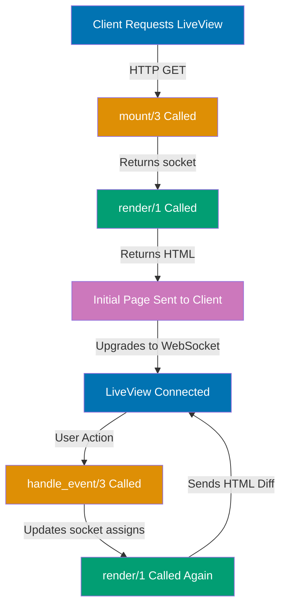

**Start your Phoenix LiveView journey through working examples.** These 30 beginner examples teach LiveView core concepts, template rendering, and event handling through heavily annotated, self-contained code.

Each example follows the five-part structure: brief explanation, optional diagram, annotated code, and key takeaway. Examples build progressively, introducing one concept at a time. All code is runnable in a Phoenix LiveView application.

## Core Concepts (Examples 1-10)

### Example 1: Hello World LiveView

Your first LiveView - a minimal working example showing the essential structure of a Phoenix LiveView module.

**Code**:

```elixir
defmodule MyAppWeb.HelloLive do
  use MyAppWeb, :live_view
  # => Imports LiveView macros and behaviors
  # => Sets up module as a LiveView process

  def mount(_params, _session, socket) do
    # => mount/3 is called when LiveView first loads
    # => _params: URL parameters (ignored here)
    # => _session: HTTP session data (ignored here)
    # => socket: The LiveView connection struct
    {:ok, socket}
    # => Returns {:ok, socket} tuple
    # => Signals successful mount, ready to render
  end

  def render(assigns) do
    # => render/1 generates the HTML template
    # => assigns: Map containing all socket assigns
    ~H"""
    <div>
      <h1>Hello LiveView!</h1>
    </div>
    """
    # => ~H sigil defines HEEx template
    # => Returns rendered HTML structure
  end
end
```

**Key Takeaway**: Every LiveView needs `mount/3` to initialize state and `render/1` to generate HTML. These two callbacks are the foundation of all LiveView interactions.

**Why It Matters**: This minimal structure is the starting point for every real-time feature you'll build. Understanding mount and render unlocks all LiveView capabilities - they're the entry and output of the LiveView lifecycle. Every interactive element, dynamic update, and real-time feature builds on this foundation. Master this pattern and you understand how LiveView connects server state to browser display.

### Example 2: Mount Lifecycle with Initial State

Mount is where LiveView state begins. This example shows how to initialize socket assigns during mount.

**Code**:

```elixir
defmodule MyAppWeb.CounterLive do
  use MyAppWeb, :live_view

  def mount(_params, _session, socket) do
    # => Initialize socket assigns with assign/3
    socket = assign(socket, :count, 0)
    # => Creates socket.assigns.count = 0
    # => assign/3 takes: socket, key, value
    socket = assign(socket, :message, "Ready to count")
    # => Creates socket.assigns.message = "Ready to count"
    {:ok, socket}
    # => Returns socket with initialized assigns
  end

  def render(assigns) do
    ~H"""
    <div>
      <p><%= @count %></p>
      <!-- => @count accesses assigns.count (0) -->
      <p><%= @message %></p>
      <!-- => @message accesses assigns.message -->
    </div>
    """
    # => <%= %> syntax interpolates Elixir expressions
  end
end
```

**Key Takeaway**: Use `assign/3` in mount to initialize state. Assigns are accessed in templates with `@key` syntax.

**Why It Matters**: Socket assigns are LiveView's state mechanism - they're how you store data that changes over time. Every real-time update, every user interaction, every dynamic value lives in assigns. Learning to initialize assigns in mount establishes the pattern you'll use throughout LiveView development. Think of assigns as the single source of truth for your UI state - when assigns change, the UI automatically updates.

### Example 3: Rendering with HEEx Sigil

HEEx (HTML+EEx) is LiveView's template language. This example demonstrates the ~H sigil syntax for defining templates.

**Code**:

```elixir
defmodule MyAppWeb.TemplateLive do
  use MyAppWeb, :live_view

  def mount(_params, _session, socket) do
    socket = assign(socket, :title, "LiveView Template")
    # => assigns.title = "LiveView Template"
    socket = assign(socket, :items, ["Alpha", "Beta", "Gamma"])
    # => assigns.items = list of strings
    {:ok, socket}
  end

  def render(assigns) do
    ~H"""
    <div>
      <h1><%= @title %></h1>
      <!-- => Outputs "LiveView Template" -->
      <ul>
        <%= for item <- @items do %>
          <!-- => Loops over ["Alpha", "Beta", "Gamma"] -->
          <li><%= item %></li>
          <!-- => Renders <li>Alpha</li>, <li>Beta</li>, <li>Gamma</li> -->
        <% end %>
      </ul>
    </div>
    """
    # => ~H""" opens HEEx template block
    # => Triple quotes allow multi-line templates
  end
end
```

**Key Takeaway**: The `~H` sigil defines HEEx templates. Use `<%= %>` for output, `<% %>` for control flow without output.

**Why It Matters**: HEEx templates are how you transform Elixir data into HTML that users see. The sigil syntax makes templates feel like regular HTML while giving you full Elixir power for loops, conditionals, and interpolation. Mastering HEEx syntax means you can express any UI pattern using familiar HTML structure combined with Elixir's expressiveness. This is the bridge between your server state and user interface.

### Example 4: Handle Event Basics

Events turn static LiveViews into interactive applications. This example shows the basic event handling pattern.

**Code**:

```elixir
defmodule MyAppWeb.ClickLive do
  use MyAppWeb, :live_view

  def mount(_params, _session, socket) do
    socket = assign(socket, :clicks, 0)
    # => Initial state: clicks = 0
    {:ok, socket}
  end

  def handle_event("increment", _params, socket) do
    # => handle_event/3 responds to user interactions
    # => "increment": event name from phx-click attribute
    # => _params: event metadata (unused here)
    # => socket: current socket state
    clicks = socket.assigns.clicks + 1
    # => Get current clicks, add 1
    socket = assign(socket, :clicks, clicks)
    # => Update assigns.clicks with new value
    {:noreply, socket}
    # => Returns {:noreply, socket} tuple
    # => Triggers re-render with updated state
  end

  def render(assigns) do
    ~H"""
    <div>
      <p>Clicks: <%= @clicks %></p>
      <!-- => Displays current click count -->
      <button phx-click="increment">Click me</button>
      <!-- => phx-click="increment" triggers handle_event("increment", ...) -->
    </div>
    """
  end
end
```

**Key Takeaway**: `phx-click` attribute in template triggers `handle_event/3` callback. Return `{:noreply, socket}` with updated assigns to re-render UI.

**Why It Matters**: Events are the foundation of interactivity in LiveView. The pattern of user action → handle_event → update assigns → automatic re-render is how every interactive feature works, from simple buttons to complex forms. Understanding this event loop means you can build any interactive pattern. The server handles logic, updates state, and LiveView automatically syncs the browser - no JavaScript required for most interactions.

### Example 5: Update Assigns with update/3

The `update/3` function provides a concise way to modify assigns using the current value.

**Code**:

```elixir
defmodule MyAppWeb.UpdateLive do
  use MyAppWeb, :live_view

  def mount(_params, _session, socket) do
    socket = assign(socket, :score, 100)
    # => Initial score: 100
    {:ok, socket}
  end

  def handle_event("add_points", %{"value" => value}, socket) do
    # => Receives event with "value" parameter
    # => Pattern matches to extract value from params map
    points = String.to_integer(value)
    # => Convert string parameter to integer
    socket = update(socket, :score, fn current_score -> current_score + points end)
    # => update/3 takes: socket, key, update_function
    # => update_function receives current value (100)
    # => Returns new value (100 + points)
    # => More concise than: assign(socket, :score, socket.assigns.score + points)
    {:noreply, socket}
    # => Re-render with updated score
  end

  def render(assigns) do
    ~H"""
    <div>
      <p>Score: <%= @score %></p>
      <button phx-click="add_points" phx-value-value="10">+10</button>
      <!-- => phx-value-value="10" sends %{"value" => "10"} to handle_event -->
      <button phx-click="add_points" phx-value-value="50">+50</button>
      <!-- => Same event, different parameter value -->
    </div>
    """
  end
end
```

**Key Takeaway**: Use `update/3` when new value depends on current value. The function receives current value and returns new value.

**Why It Matters**: The update/3 pattern prevents a common bug - reading and writing assigns separately can lead to race conditions in concurrent environments. Update atomically reads and writes in one operation, making state changes safer. This functional approach - transforming current state into new state - is core to reliable state management. Use update whenever your new value depends on the old value.

### Example 6: LiveView Lifecycle Flow

Understanding the LiveView lifecycle helps you know when each callback runs. This example traces the complete mount-render-event-render cycle.

**Lifecycle Diagram**:



**Code**:

```elixir
defmodule MyAppWeb.LifecycleLive do
  use MyAppWeb, :live_view
  require Logger
  # => Import Logger for tracing lifecycle events

  def mount(_params, _session, socket) do
    Logger.info("🔵 MOUNT called - initializing LiveView")
    # => Logs when mount runs (twice: static + connected)
    socket = assign(socket, :lifecycle_step, "Mounted")
    # => Set initial state
    {:ok, socket}
    # => First mount: static render for initial HTML
    # => Second mount: connected render over WebSocket
  end

  def handle_event("trigger_event", _params, socket) do
    Logger.info("🟢 HANDLE_EVENT called - processing user interaction")
    # => Logs when event handler runs
    socket = assign(socket, :lifecycle_step, "Event handled, re-rendering")
    # => Update state to trigger re-render
    {:noreply, socket}
    # => Returning socket triggers render/1 again
  end

  def render(assigns) do
    Logger.info("🟣 RENDER called - generating HTML")
    # => Logs every render (initial + every state change)
    ~H"""
    <div>
      <p>Lifecycle Step: <%= @lifecycle_step %></p>
      <button phx-click="trigger_event">Trigger Event</button>
    </div>
    """
    # => Check browser console and server logs to see lifecycle flow
  end
end
```

**Key Takeaway**: Lifecycle flows: mount (2x: static + connected) → render (initial) → event → render (update) → event → render... Mount happens twice, render happens on every state change.

**Why It Matters**: Understanding the lifecycle prevents common mistakes like assuming mount runs only once or wondering why render is called multiple times. The mount-render-event-render pattern is fundamental - knowing when each callback runs helps you optimize performance, manage side effects, and debug state issues. Every LiveView feature builds on this cycle.

### Example 7: Initial vs Dynamic State

Distinguishing between initial state (set in mount) and dynamic state (updated by events) clarifies state management.

**Code**:

```elixir
defmodule MyAppWeb.StateLive do
  use MyAppWeb, :live_view

  def mount(_params, _session, socket) do
    # => INITIAL STATE - set once during mount
    socket = assign(socket, :user_name, "Guest")
    # => Static value: user_name = "Guest"
    socket = assign(socket, :page_loaded_at, DateTime.utc_now())
    # => Timestamp when LiveView mounted
    # => DYNAMIC STATE - will change via events
    socket = assign(socket, :interaction_count, 0)
    # => interaction_count starts at 0, increments with events
    {:ok, socket}
  end

  def handle_event("interact", _params, socket) do
    # => Updates DYNAMIC STATE only
    socket = update(socket, :interaction_count, &(&1 + 1))
    # => Increments interaction_count
    # => user_name and page_loaded_at remain unchanged
    {:noreply, socket}
  end

  def render(assigns) do
    ~H"""
    <div>
      <p>User: <%= @user_name %></p>
      <!-- => Shows initial value, never changes -->
      <p>Page loaded: <%= @page_loaded_at %></p>
      <!-- => Shows mount timestamp, never changes -->
      <p>Interactions: <%= @interaction_count %></p>
      <!-- => Updates with each button click -->
      <button phx-click="interact">Interact</button>
    </div>
    """
  end
end
```

**Key Takeaway**: Initial state (set in mount) represents values that don't change. Dynamic state (updated in handle_event) represents interactive data.

**Why It Matters**: Separating initial and dynamic state helps you reason about what changes and why. Initial state is your baseline - configuration, user info, timestamps. Dynamic state is your interaction layer - counters, form inputs, UI toggles. Knowing which is which prevents bugs like trying to update initial state or resetting dynamic state unnecessarily. This mental model scales from simple counters to complex multi-user applications.

### Example 8: Debugging LiveView State

Debugging LiveView involves inspecting socket state and understanding what triggers renders. This example shows debugging techniques.

**Code**:

```elixir
defmodule MyAppWeb.DebugLive do
  use MyAppWeb, :live_view
  require Logger

  def mount(_params, _session, socket) do
    socket = assign(socket, :debug_value, "initial")
    # => Set initial state
    Logger.debug("Mount assigns: #{inspect(socket.assigns)}")
    # => Log all assigns to see initial state
    # => Output: Mount assigns: %{debug_value: "initial", ...}
    {:ok, socket}
  end

  def handle_event("change_value", %{"new_value" => new_value}, socket) do
    Logger.debug("BEFORE event - assigns: #{inspect(socket.assigns)}")
    # => Log state BEFORE change
    socket = assign(socket, :debug_value, new_value)
    # => Update state
    Logger.debug("AFTER event - assigns: #{inspect(socket.assigns)}")
    # => Log state AFTER change
    Logger.debug("Changed debug_value from '#{socket.assigns.debug_value}' to '#{new_value}'")
    # => Log specific change
    {:noreply, socket}
  end

  def render(assigns) do
    # => Use IO.inspect to debug assigns in render
    IO.inspect(assigns, label: "RENDER assigns")
    # => Prints to server console with label
    ~H"""
    <div>
      <p>Debug Value: <%= @debug_value %></p>
      <button phx-click="change_value" phx-value-new_value="changed">Change</button>
      <!-- => Sends new_value parameter to event handler -->
    </div>
    """
  end
end
```

**Key Takeaway**: Use `Logger.debug` in callbacks and `IO.inspect` in render to trace state changes. Check server logs, not browser console, for LiveView state debugging.

**Why It Matters**: LiveView runs on the server, so debugging happens in server logs, not browser DevTools. Learning to trace state through Logger.debug and IO.inspect helps you understand why renders happen, what changes between events, and where state gets out of sync. This debugging pattern - log before, log after, inspect in render - reveals the entire state lifecycle and helps diagnose issues faster than guessing.

### Example 9: Multiple Assigns in One Operation

Assigning multiple values efficiently uses pattern matching or multiple assign calls. This example shows both approaches.

**Code**:

```elixir
defmodule MyAppWeb.MultiAssignLive do
  use MyAppWeb, :live_view

  def mount(_params, _session, socket) do
    # => APPROACH 1: Pipe multiple assign calls
    socket =
      socket
      |> assign(:name, "Alice")
      # => assigns.name = "Alice"
      |> assign(:age, 30)
      # => assigns.age = 30
      |> assign(:city, "Jakarta")
      # => assigns.city = "Jakarta"
    # => Pipe operator chains assign operations
    # => More readable for sequential assignments
    {:ok, socket}
  end

  def handle_event("update_all", _params, socket) do
    # => APPROACH 2: Assign with keyword list
    socket = assign(socket, name: "Bob", age: 25, city: "Surabaya")
    # => assign/2 takes keyword list for multiple values
    # => Equivalent to three separate assign calls
    # => More concise for updating multiple assigns at once
    {:noreply, socket}
  end

  def render(assigns) do
    ~H"""
    <div>
      <p>Name: <%= @name %>, Age: <%= @age %>, City: <%= @city %></p>
      <!-- => Shows all three assigns -->
      <button phx-click="update_all">Update All</button>
    </div>
    """
  end
end
```

**Key Takeaway**: Use piped `assign/3` calls for clarity or `assign/2` with keyword list for conciseness when setting multiple assigns.

**Why It Matters**: Efficient state updates keep code readable and maintainable. Piped assigns make the data flow explicit - you see each value set one by one. Keyword list assigns are concise when updating many values together. Both are valid patterns; choose based on context. As LiveViews grow complex, managing multiple assigns cleanly prevents bugs and makes state changes easier to understand.

### Example 10: Connected vs Disconnected Mount

LiveView mounts twice - once for static HTML, once for WebSocket connection. Use `connected?/1` to distinguish between them.

**Code**:

```elixir
defmodule MyAppWeb.ConnectedLive do
  use MyAppWeb, :live_view

  def mount(_params, _session, socket) do
    if connected?(socket) do
      # => connected?/1 returns true during WebSocket mount
      Logger.info("✅ Connected mount - WebSocket established")
      # => Runs ONLY on second mount (connected)
      # => Use for: subscribing to PubSub, starting timers
      socket = assign(socket, :connection_status, "Connected via WebSocket")
      # => Status shows connected state
      {:ok, socket}
    else
      # => connected?/1 returns false during static render
      Logger.info("⚠️  Static mount - pre-WebSocket")
      # => Runs ONLY on first mount (static HTML)
      # => Use for: setting initial state without side effects
      socket = assign(socket, :connection_status, "Static render")
      # => Status shows static state
      {:ok, socket}
    end
    # => Mount runs TWICE total:
    # => 1. Static render (connected? = false) - fast initial HTML
    # => 2. Connected render (connected? = true) - WebSocket upgrade
  end

  def render(assigns) do
    ~H"""
    <div>
      <p>Status: <%= @connection_status %></p>
      <!-- => Initially shows "Static render" -->
      <!-- => Updates to "Connected via WebSocket" after mount #2 -->
    </div>
    """
  end
end
```

**Key Takeaway**: Use `connected?(socket)` to run code only during WebSocket mount. Static mount is for initial HTML; connected mount is for interactive setup.

**Why It Matters**: Understanding connected vs disconnected mount prevents bugs like subscribing to PubSub twice or starting timers during static render. Static mount should be fast and side-effect free - it's just generating initial HTML. Connected mount is where you set up real-time features like subscriptions and intervals. This pattern optimizes performance and ensures interactive features work correctly.

## Templates and Rendering (Examples 11-20)

### Example 11: HEEx Template Syntax Deep Dive

HEEx provides powerful template syntax for dynamic HTML generation. This example demonstrates core syntax patterns.

**Code**:

```elixir
defmodule MyAppWeb.HEExLive do
  use MyAppWeb, :live_view

  def mount(_params, _session, socket) do
    socket =
      socket
      |> assign(:user, "Alice")
      |> assign(:score, 42)
      |> assign(:tags, ["elixir", "phoenix", "liveview"])
    {:ok, socket}
  end

  def render(assigns) do
    ~H"""
    <div>
      <!-- OUTPUT WITH <%= %> - evaluates expression and outputs result -->
      <p>User: <%= @user %></p>
      <!-- => Outputs: User: Alice -->

      <!-- EXPRESSION WITHOUT OUTPUT <% %> - evaluates but doesn't output -->
      <% computed_score = @score * 2 %>
      <!-- => Computes but doesn't render anything -->

      <!-- USE COMPUTED VALUE -->
      <p>Double Score: <%= computed_score %></p>
      <!-- => Outputs: Double Score: 84 -->

      <!-- CONDITIONAL RENDERING -->
      <%= if @score > 40 do %>
        <span class="high-score">Excellent!</span>
        <!-- => Renders because 42 > 40 -->
      <% else %>
        <span class="low-score">Keep trying</span>
        <!-- => Doesn't render -->
      <% end %>

      <!-- LOOP COMPREHENSION -->
      <ul>
        <%= for tag <- @tags do %>
          <!-- => Loops through ["elixir", "phoenix", "liveview"] -->
          <li><%= String.upcase(tag) %></li>
          <!-- => Renders: <li>ELIXIR</li>, <li>PHOENIX</li>, <li>LIVEVIEW</li> -->
        <% end %>
      </ul>

      <!-- INLINE FUNCTION CALLS -->
      <p>Length: <%= length(@tags) %></p>
      <!-- => Outputs: Length: 3 -->
    </div>
    """
  end
end
```

**Key Takeaway**: Use `<%= %>` for output, `<% %>` for expressions without output. HEEx supports all Elixir expressions - conditionals, loops, function calls.

**Why It Matters**: HEEx syntax is the foundation of dynamic rendering in LiveView. Understanding when to use <%= %> vs <% %> prevents common mistakes like invisible output or rendering unwanted values. The ability to use full Elixir expressions means you can transform data, compute values, and make decisions directly in templates - no need to precompute everything in callbacks. This flexibility makes templates concise and powerful.

### Example 12: Dynamic Content Rendering

Dynamic content changes based on assigns. This example shows patterns for rendering computed values and transformations.

**Code**:

```elixir
defmodule MyAppWeb.DynamicLive do
  use MyAppWeb, :live_view

  def mount(_params, _session, socket) do
    socket =
      socket
      |> assign(:temperature_celsius, 25)
      |> assign(:items, ["apple", "banana", "cherry"])
      |> assign(:show_details, false)
    {:ok, socket}
  end

  def handle_event("toggle_details", _params, socket) do
    socket = update(socket, :show_details, &(!&1))
    # => Toggles true <-> false
    {:noreply, socket}
  end

  def render(assigns) do
    ~H"""
    <div>
      <!-- COMPUTED VALUE IN TEMPLATE -->
      <p>Temperature: <%= @temperature_celsius %>°C / <%= celsius_to_fahrenheit(@temperature_celsius) %>°F</p>
      <!-- => Calls helper function to convert -->
      <!-- => Outputs: Temperature: 25°C / 77°F -->

      <!-- CONDITIONAL BLOCK RENDERING -->
      <%= if @show_details do %>
        <div class="details">
          <p>Details are visible</p>
          <ul>
            <%= for item <- @items do %>
              <li><%= item %> (<%= String.length(item) %> chars)</li>
              <!-- => Shows item with computed character count -->
            <% end %>
          </ul>
        </div>
      <% end %>

      <button phx-click="toggle_details">Toggle Details</button>
    </div>
    """
  end

  # Helper function for temperature conversion
  defp celsius_to_fahrenheit(celsius) do
    # => Private helper for template computation
    (celsius * 9 / 5) + 32
    # => Returns fahrenheit value
  end
end
```

**Key Takeaway**: Call helper functions directly in templates for computed values. Keep complex logic in private functions, not in template expressions.

**Why It Matters**: Dynamic rendering is how LiveView transforms data into user-facing content. Helper functions keep templates readable by moving complex computations out of template expressions. This separation - data in assigns, presentation logic in helpers - makes templates maintainable. As complexity grows, well-organized helpers prevent template bloat and make rendering logic testable.

### Example 13: Conditional Rendering with if/unless

Conditionals control what renders based on state. This example demonstrates if and unless patterns.

**Code**:

```elixir
defmodule MyAppWeb.ConditionalLive do
  use MyAppWeb, :live_view

  def mount(_params, _session, socket) do
    socket =
      socket
      |> assign(:user_logged_in, false)
      |> assign(:items_count, 0)
      |> assign(:loading, false)
    {:ok, socket}
  end

  def handle_event("login", _params, socket) do
    socket = assign(socket, :user_logged_in, true)
    {:noreply, socket}
  end

  def handle_event("add_item", _params, socket) do
    socket = update(socket, :items_count, &(&1 + 1))
    {:noreply, socket}
  end

  def render(assigns) do
    ~H"""
    <div>
      <!-- IF CONDITION - renders when true -->
      <%= if @user_logged_in do %>
        <p>Welcome back!</p>
        <button phx-click="add_item">Add Item</button>
      <% end %>

      <!-- IF-ELSE - renders one branch -->
      <%= if @items_count > 0 do %>
        <p>You have <%= @items_count %> items</p>
      <% else %>
        <p>No items yet</p>
      <% end %>

      <!-- UNLESS - inverse of if, renders when false -->
      <%= unless @user_logged_in do %>
        <button phx-click="login">Login</button>
        <!-- => Renders when user_logged_in is false -->
      <% end %>

      <!-- UNLESS - more readable than if !condition -->
      <%= unless @loading do %>
        <p>Content loaded</p>
      <% end %>
    </div>
    """
  end
end
```

**Key Takeaway**: Use `if` for positive conditions, `unless` for negative conditions. `unless` is more readable than `if !condition`.

**Why It Matters**: Conditional rendering is fundamental to dynamic UIs - showing login buttons, displaying empty states, toggling sections. Using if vs unless appropriately makes intent clear. The pattern of render-based-on-state is how LiveView builds reactive interfaces without JavaScript. Master conditionals and you can build any dynamic UI pattern.

### Example 14: Looping with for Comprehension

Loops transform collections into lists of elements. This example shows for comprehension patterns in templates.

**Code**:

```elixir
defmodule MyAppWeb.LoopLive do
  use MyAppWeb, :live_view

  def mount(_params, _session, socket) do
    socket =
      socket
      |> assign(:users, [
        %{id: 1, name: "Alice", role: "admin"},
        %{id: 2, name: "Bob", role: "user"},
        %{id: 3, name: "Carol", role: "user"}
      ])
      |> assign(:numbers, 1..5)
    {:ok, socket}
  end

  def render(assigns) do
    ~H"""
    <div>
      <!-- BASIC LOOP - iterate over list -->
      <ul>
        <%= for user <- @users do %>
          <!-- => Loops through each user map -->
          <li><%= user.name %> (<%= user.role %>)</li>
          <!-- => Accesses map fields with .field syntax -->
        <% end %>
      </ul>

      <!-- LOOP WITH INDEX - use Enum.with_index -->
      <ol>
        <%= for {user, index} <- Enum.with_index(@users, 1) do %>
          <!-- => Enum.with_index adds index, starting at 1 -->
          <!-- => Destructures to {user, index} -->
          <li><%= index %>. <%= user.name %></li>
          <!-- => Outputs: 1. Alice, 2. Bob, 3. Carol -->
        <% end %>
      </ol>

      <!-- LOOP WITH FILTER - use pattern matching -->
      <ul class="admins">
        <%= for %{role: "admin"} = user <- @users do %>
          <!-- => Pattern matches only users with role: "admin" -->
          <!-- => Only Alice matches -->
          <li>Admin: <%= user.name %></li>
        <% end %>
      </ul>

      <!-- LOOP OVER RANGE -->
      <ul>
        <%= for n <- @numbers do %>
          <li>Square of <%= n %> is <%= n * n %></li>
          <!-- => Computes on each iteration -->
        <% end %>
      </ul>
    </div>
    """
  end
end
```

**Key Takeaway**: Use `for` comprehension to render lists. Combine with pattern matching to filter, with Enum.with_index for indices.

**Why It Matters**: Loops transform data collections into UI elements - rendering lists, tables, cards. The for comprehension in templates directly maps Elixir collections to HTML structures. Pattern matching in loops enables filtering without separate operations. Understanding loop patterns means you can render any collection elegantly, from simple lists to complex nested structures.

### Example 15: Function Components Basics

Function components extract reusable template patterns. This example demonstrates basic function component usage.

**Code**:

```elixir
defmodule MyAppWeb.ComponentLive do
  use MyAppWeb, :live_view

  def mount(_params, _session, socket) do
    socket =
      socket
      |> assign(:user_name, "Alice")
      |> assign(:notifications, 5)
    {:ok, socket}
  end

  def render(assigns) do
    ~H"""
    <div>
      <!-- CALLING FUNCTION COMPONENT -->
      <.header text="Welcome to LiveView" />
      <!-- => Calls header/1 function component below -->
      <!-- => Passes text attribute as assigns.text -->

      <!-- COMPONENT WITH MULTIPLE ATTRIBUTES -->
      <.user_badge name={@user_name} count={@notifications} />
      <!-- => Passes multiple attributes -->
      <!-- => name={@user_name} binds assigns.name -->
      <!-- => count={@notifications} binds assigns.count -->
    </div>
    """
  end

  # Function component - renders header
  defp header(assigns) do
    # => Function component takes assigns map
    # => Private function (defp) - only used in this module
    ~H"""
    <header class="page-header">
      <h1><%= @text %></h1>
      <!-- => Accesses assigns.text passed from caller -->
    </header>
    """
    # => Returns rendered HTML
  end

  # Function component - renders user badge
  defp user_badge(assigns) do
    ~H"""
    <div class="user-badge">
      <span class="name"><%= @name %></span>
      <!-- => Accesses assigns.name -->
      <%= if @count > 0 do %>
        <span class="badge"><%= @count %></span>
        <!-- => Accesses assigns.count -->
      <% end %>
    </div>
    """
  end
end
```

**Key Takeaway**: Function components are private functions returning `~H` templates. Call with `<.component_name attr={value} />` syntax.

**Why It Matters**: Function components reduce template duplication and make complex UIs manageable. Extract repeated patterns into components and reuse across the template. This is LiveView's simplest abstraction - just functions returning templates. Understanding function components unlocks component-based architecture without heavyweight abstractions. As templates grow, components keep them organized and maintainable.

### Example 16: Slots Basics

Slots pass content blocks to components. This example demonstrates basic slot usage for flexible component APIs.

**Code**:

```elixir
defmodule MyAppWeb.SlotLive do
  use MyAppWeb, :live_view

  def mount(_params, _session, socket) do
    socket = assign(socket, :show_card, true)
    {:ok, socket}
  end

  def render(assigns) do
    ~H"""
    <div>
      <!-- COMPONENT WITH SLOT CONTENT -->
      <.card>
        <!-- => Content between opening and closing tags -->
        <p>This is the card body content</p>
        <button>Click me</button>
        <!-- => Entire block passed as inner_block slot -->
      </.card>

      <!-- COMPONENT WITH NAMED SLOTS -->
      <.modal title="Confirmation">
        <!-- => title attribute passed as assigns.title -->
        <:body>
          <!-- => Named slot :body -->
          <p>Are you sure you want to proceed?</p>
        </:body>
        <:footer>
          <!-- => Named slot :footer -->
          <button>Cancel</button>
          <button>Confirm</button>
        </:footer>
      </.modal>
    </div>
    """
  end

  # Component with default slot (inner_block)
  defp card(assigns) do
    ~H"""
    <div class="card">
      <%= render_slot(@inner_block) %>
      <!-- => render_slot/1 renders the slot content -->
      <!-- => @inner_block contains content from caller -->
    </div>
    """
  end

  # Component with named slots
  attr :title, :string, required: true
  # => attr/3 declares component attribute
  # => :title is required string
  slot :body, required: true
  # => slot/2 declares named slot
  slot :footer, required: true

  defp modal(assigns) do
    ~H"""
    <div class="modal">
      <h2><%= @title %></h2>
      <!-- => Renders title attribute -->
      <div class="modal-body">
        <%= render_slot(@body) %>
        <!-- => Renders :body slot content -->
      </div>
      <div class="modal-footer">
        <%= render_slot(@footer) %>
        <!-- => Renders :footer slot content -->
      </div>
    </div>
    """
  end
end
```

**Key Takeaway**: Use `render_slot(@inner_block)` for default slot, named slots with `<:slot_name>` syntax. Slots enable flexible component APIs.

**Why It Matters**: Slots make components flexible by letting callers provide custom content. Instead of rigid components that only accept data, slots accept entire content blocks. This enables building reusable containers like cards, modals, and layouts that wrap arbitrary content. Understanding slots unlocks component composition patterns essential for complex UIs.

### Example 17: LiveComponent Basics

LiveComponents are stateful components with their own lifecycle. This example introduces LiveComponent structure.

**Code**:

```elixir
# LIVECOMPONENT DEFINITION
defmodule MyAppWeb.CounterComponent do
  use Phoenix.LiveComponent
  # => use LiveComponent instead of LiveView

  # LIVECOMPONENT LIFECYCLE
  def update(assigns, socket) do
    # => update/2 is like mount for components
    # => Called when component mounts OR when assigns change
    # => assigns: map of attributes passed to component
    socket =
      socket
      |> assign(assigns)
      # => Merge passed assigns into socket
      |> assign_new(:count, fn -> 0 end)
      # => assign_new sets value only if not already present
      # => Prevents resetting count on re-render
    {:ok, socket}
  end

  # EVENT HANDLING IN LIVECOMPONENT
  def handle_event("increment", _params, socket) do
    # => handle_event works same as LiveView
    socket = update(socket, :count, &(&1 + 1))
    {:noreply, socket}
    # => Re-renders ONLY this component, not parent LiveView
  end

  def render(assigns) do
    ~H"""
    <div class="counter-component">
      <p>Component Count: <%= @count %></p>
      <button phx-click="increment" phx-target={@myself}>
        <!-- => phx-target={@myself} routes event to THIS component -->
        <!-- => Without phx-target, event goes to parent LiveView -->
        Increment Component
      </button>
    </div>
    """
  end
end

# USING LIVECOMPONENT IN LIVEVIEW
defmodule MyAppWeb.ComponentHostLive do
  use MyAppWeb, :live_view

  def mount(_params, _session, socket) do
    {:ok, socket}
  end

  def render(assigns) do
    ~H"""
    <div>
      <h1>LiveComponent Example</h1>
      <.live_component module={MyAppWeb.CounterComponent} id="counter-1" />
      <!-- => module: component module -->
      <!-- => id: unique identifier (required) -->
      <.live_component module={MyAppWeb.CounterComponent} id="counter-2" initial_count={10} />
      <!-- => Each instance has independent state -->
      <!-- => Can pass additional assigns like initial_count -->
    </div>
    """
  end
end
```

**Key Takeaway**: LiveComponents have independent state and lifecycle. Use `phx-target={@myself}` to route events to component. Each instance has isolated state.

**Why It Matters**: LiveComponents enable stateful, reusable UI elements with independent lifecycles. Unlike function components (pure templates), LiveComponents maintain their own state and handle their own events. This is essential for complex interactive widgets - imagine a datepicker or autocomplete that manages internal state without polluting parent LiveView. Understanding LiveComponents unlocks building sophisticated, reusable UI elements.

### Example 18: Component Attributes

Components accept attributes for configuration. This example demonstrates attribute declaration and validation.

**Code**:

```elixir
defmodule MyAppWeb.AttributeLive do
  use MyAppWeb, :live_view

  def mount(_params, _session, socket) do
    {:ok, socket}
  end

  def render(assigns) do
    ~H"""
    <div>
      <!-- COMPONENT WITH REQUIRED ATTRIBUTE -->
      <.button text="Click Me" type="primary" />
      <!-- => text and type passed as attributes -->

      <!-- COMPONENT WITH OPTIONAL ATTRIBUTE -->
      <.button text="Submit" type="success" disabled={true} />
      <!-- => disabled is optional attribute -->

      <!-- COMPONENT WITH DEFAULT VALUE -->
      <.alert message="Warning!" />
      <!-- => severity not provided, uses default -->

      <.alert message="Error occurred" severity="error" />
      <!-- => severity provided, overrides default -->
    </div>
    """
  end

  # ATTRIBUTE DECLARATIONS
  attr :text, :string, required: true
  # => attr/3 declares attribute
  # => :text is attribute name
  # => :string is type
  # => required: true makes it mandatory
  attr :type, :string, default: "default"
  # => default: "default" provides fallback value
  attr :disabled, :boolean, default: false
  # => :boolean type for true/false values

  defp button(assigns) do
    # => assigns contains validated attributes
    ~H"""
    <button class={["btn", "btn-#{@type}"]} disabled={@disabled}>
      <%= @text %>
    </button>
    """
  end

  attr :message, :string, required: true
  attr :severity, :string, default: "info", values: ["info", "warning", "error"]
  # => values: [...] restricts to allowed values
  # => Raises error if invalid value passed

  defp alert(assigns) do
    ~H"""
    <div class={["alert", "alert-#{@severity}"]}>
      <%= @message %>
    </div>
    """
  end
end
```

**Key Takeaway**: Use `attr/3` to declare component attributes with types, defaults, and validation. Provides type safety and documentation.

**Why It Matters**: Attribute declarations make components self-documenting and catch errors early. Type validation prevents passing wrong data types. Default values make components flexible. This is LiveView's component contract system - explicit declarations that make component APIs clear and prevent misuse. Well-declared attributes make components easier to use and maintain.

### Example 19: CSS Classes and Dynamic Styling

Dynamic classes and styles respond to state. This example shows patterns for conditional styling.

**Code**:

```elixir
defmodule MyAppWeb.StylingLive do
  use MyAppWeb, :live_view

  def mount(_params, _session, socket) do
    socket =
      socket
      |> assign(:active, false)
      |> assign(:theme, "light")
      |> assign(:progress, 65)
    {:ok, socket}
  end

  def handle_event("toggle_active", _params, socket) do
    socket = update(socket, :active, &(!&1))
    {:noreply, socket}
  end

  def handle_event("change_theme", %{"theme" => theme}, socket) do
    socket = assign(socket, :theme, theme)
    {:noreply, socket}
  end

  def render(assigns) do
    ~H"""
    <div>
      <!-- CONDITIONAL CLASS WITH LIST -->
      <button class={["btn", @active && "active"]} phx-click="toggle_active">
        <!-- => class attribute accepts list -->
        <!-- => "btn" always present -->
        <!-- => "active" only when @active is true -->
        <!-- => nil/false values filtered out automatically -->
        Toggle
      </button>

      <!-- MULTIPLE CONDITIONAL CLASSES -->
      <div class={[
        "panel",
        @theme == "dark" && "panel-dark",
        @theme == "light" && "panel-light",
        @active && "panel-active"
      ]}>
        <!-- => Multiple conditions evaluated -->
        <!-- => Example: ["panel", false, "panel-light", false] -->
        <!-- => Becomes: "panel panel-light" -->
        Content
      </div>

      <!-- DYNAMIC INLINE STYLES -->
      <div style={"width: #{@progress}%"} class="progress-bar">
        <!-- => String interpolation for inline styles -->
        <!-- => Renders: style="width: 65%" -->
        <%= @progress %>%
      </div>

      <!-- COMPUTED CLASS NAME -->
      <span class={status_class(@progress)}>
        <!-- => Calls helper function -->
        Status
      </span>

      <button phx-click="change_theme" phx-value-theme="dark">Dark</button>
      <button phx-click="change_theme" phx-value-theme="light">Light</button>
    </div>
    """
  end

  # Helper for computed class
  defp status_class(progress) do
    cond do
      progress >= 80 -> "status-excellent"
      progress >= 50 -> "status-good"
      true -> "status-poor"
    end
  end
end
```

**Key Takeaway**: Use list syntax for conditional classes `class={["base", condition && "extra"]}`. Nil and false values automatically filtered.

**Why It Matters**: Dynamic styling makes UIs responsive to state changes. The list syntax for classes is concise and readable - no need for manual string concatenation. Understanding conditional styling patterns means you can build interactive UIs that visually reflect state - active buttons, progress indicators, theme toggles. This is how LiveView makes styling reactive without JavaScript.

### Example 20: SVG and Icons in Templates

SVGs can be inlined or extracted as components. This example demonstrates SVG handling patterns.

**Code**:

```elixir
defmodule MyAppWeb.IconLive do
  use MyAppWeb, :live_view

  def mount(_params, _session, socket) do
    socket = assign(socket, :show_success, false)
    {:ok, socket}
  end

  def handle_event("show_success", _params, socket) do
    socket = assign(socket, :show_success, true)
    {:noreply, socket}
  end

  def render(assigns) do
    ~H"""
    <div>
      <!-- INLINE SVG -->
      <svg width="24" height="24" viewBox="0 0 24 24" fill="none">
        <!-- => SVG works directly in HEEx templates -->
        <path d="M12 2L2 7l10 5 10-5-10-5z" fill="currentColor"/>
        <!-- => Uses currentColor for dynamic coloring via CSS -->
      </svg>

      <!-- SVG WITH DYNAMIC ATTRIBUTES -->
      <svg width="48" height="48" viewBox="0 0 48 48" fill="none">
        <circle cx="24" cy="24" r="20" stroke="currentColor" stroke-width="4" fill={@show_success && "#4ade80" || "none"}>
          <!-- => Conditional fill color based on state -->
          <!-- => Green when show_success is true -->
        </circle>
      </svg>

      <!-- SVG ICON AS COMPONENT -->
      <.icon name="check" size="24" color="#10b981" />
      <!-- => Reusable icon component -->

      <button phx-click="show_success">Show Success</button>
    </div>
    """
  end

  # Icon component for reusable SVGs
  attr :name, :string, required: true
  attr :size, :string, default: "24"
  attr :color, :string, default: "currentColor"

  defp icon(assigns) do
    ~H"""
    <svg width={@size} height={@size} viewBox="0 0 24 24" fill="none">
      <%= if @name == "check" do %>
        <!-- => Conditional SVG path based on icon name -->
        <path d="M20 6L9 17l-5-5" stroke={@color} stroke-width="2"/>
      <% end %>
      <%= if @name == "close" do %>
        <path d="M18 6L6 18M6 6l12 12" stroke={@color} stroke-width="2"/>
      <% end %>
    </svg>
    """
  end
end
```

**Key Takeaway**: SVGs work directly in HEEx templates. Extract as function components for reusability. Use `currentColor` for CSS-based coloring.

**Why It Matters**: Icons and SVGs are essential for modern UIs. Understanding how to inline SVGs and make them dynamic means you can build icon systems without external dependencies. Component-based icons enable consistent styling and easy updates. The currentColor trick lets icons inherit text color from CSS, making themes and color schemes simpler.

## Events and Interactivity (Examples 21-30)

### Example 21: Click Events with phx-click

Click events are the foundation of user interaction. This example demonstrates basic click handling patterns.

**Code**:

```elixir
defmodule MyAppWeb.ClickLive do
  use MyAppWeb, :live_view

  def mount(_params, _session, socket) do
    socket =
      socket
      |> assign(:counter, 0)
      |> assign(:last_action, "none")
    {:ok, socket}
  end

  def handle_event("increment", _params, socket) do
    # => "increment" matches phx-click="increment"
    socket =
      socket
      |> update(:counter, &(&1 + 1))
      |> assign(:last_action, "incremented")
    {:noreply, socket}
  end

  def handle_event("decrement", _params, socket) do
    socket =
      socket
      |> update(:counter, &(&1 - 1))
      |> assign(:last_action, "decremented")
    {:noreply, socket}
  end

  def handle_event("reset", _params, socket) do
    socket =
      socket
      |> assign(:counter, 0)
      |> assign(:last_action, "reset")
    {:noreply, socket}
  end

  def render(assigns) do
    ~H"""
    <div>
      <p>Counter: <%= @counter %></p>
      <p>Last Action: <%= @last_action %></p>

      <!-- BASIC CLICK EVENT -->
      <button phx-click="increment">
        <!-- => phx-click binds to handle_event("increment", ...) -->
        +1
      </button>

      <button phx-click="decrement">-1</button>

      <!-- CLICK EVENT ON NON-BUTTON ELEMENT -->
      <div phx-click="reset" class="reset-box">
        <!-- => phx-click works on any element -->
        Click to Reset
      </div>
    </div>
    """
  end
end
```

**Key Takeaway**: `phx-click="event_name"` binds clicks to `handle_event/3`. Works on any HTML element, not just buttons.

**Why It Matters**: Click events are how users trigger actions - incrementing counters, submitting forms, toggling panels. The phx-click binding is declarative - you specify what happens in HTML and handle logic in Elixir. No JavaScript event listeners needed. Understanding click events unlocks all interactive features in LiveView.

### Example 22: Form Events - phx-change and phx-submit

Forms are central to web interactions. This example demonstrates live form events for instant validation and submission.

**Code**:

```elixir
defmodule MyAppWeb.FormLive do
  use MyAppWeb, :live_view

  def mount(_params, _session, socket) do
    socket =
      socket
      |> assign(:username, "")
      |> assign(:email, "")
      |> assign(:validation_message, "")
    {:ok, socket}
  end

  def handle_event("validate", %{"username" => username, "email" => email}, socket) do
    # => phx-change sends form data on every input change
    # => Destructures form params
    validation_message =
      cond do
        String.length(username) < 3 ->
          "Username too short"
        !String.contains?(email, "@") ->
          "Invalid email"
        true ->
          "Form looks good!"
      end

    socket =
      socket
      |> assign(:username, username)
      |> assign(:email, email)
      |> assign(:validation_message, validation_message)
    {:noreply, socket}
    # => Updates on EVERY keystroke
  end

  def handle_event("submit", %{"username" => username, "email" => email}, socket) do
    # => phx-submit sends form data on form submission
    IO.puts("Form submitted: #{username}, #{email}")
    # => Process submission (save to DB, etc.)
    socket = assign(socket, :validation_message, "Form submitted!")
    {:noreply, socket}
  end

  def render(assigns) do
    ~H"""
    <div>
      <form phx-change="validate" phx-submit="submit">
        <!-- => phx-change="validate" triggers on input change -->
        <!-- => phx-submit="submit" triggers on form submit -->

        <input type="text" name="username" value={@username} placeholder="Username" />
        <!-- => name="username" becomes key in params map -->
        <!-- => value={@username} sets input value from assigns -->

        <input type="email" name="email" value={@email} placeholder="Email" />

        <button type="submit">Submit</button>
      </form>

      <p class="validation"><%= @validation_message %></p>
      <!-- => Shows real-time validation feedback -->
    </div>
    """
  end
end
```

**Key Takeaway**: `phx-change` triggers on input changes (live validation), `phx-submit` triggers on form submission. Form data sent as params map with input names as keys.

**Why It Matters**: Live form validation provides instant feedback without page reloads. The phx-change pattern enables validating as users type, catching errors early. phx-submit handles final submission. This is the foundation of modern form UX - real-time feedback, smooth interactions, no full page refreshes. Understanding form events means you can build sophisticated forms with instant validation.

### Example 23: Keyboard Events

Keyboard events enable shortcuts and enhanced interactions. This example demonstrates key event handling.

**Code**:

```elixir
defmodule MyAppWeb.KeyboardLive do
  use MyAppWeb, :live_view

  def mount(_params, _session, socket) do
    socket =
      socket
      |> assign(:message, "")
      |> assign(:last_key, "")
      |> assign(:search_query, "")
    {:ok, socket}
  end

  def handle_event("keydown", %{"key" => key}, socket) do
    # => phx-keydown sends key info on key press
    # => %{"key" => key} contains pressed key
    socket = assign(socket, :last_key, key)
    {:noreply, socket}
  end

  def handle_event("keyup", %{"key" => "Enter"}, socket) do
    # => Pattern match specific key
    # => Only handles Enter key on keyup
    socket = assign(socket, :message, "Enter pressed!")
    {:noreply, socket}
  end

  def handle_event("keyup", %{"key" => "Escape"}, socket) do
    # => Another pattern match for Escape
    socket = assign(socket, :search_query, "")
    {:noreply, socket}
  end

  def handle_event("keyup", _params, socket) do
    # => Catch-all for other keys
    {:noreply, socket}
  end

  def handle_event("search_keyup", %{"key" => "Enter", "value" => query}, socket) do
    # => Destructures key AND input value
    # => Triggers search on Enter
    IO.puts("Searching for: #{query}")
    {:noreply, socket}
  end

  def handle_event("search_keyup", _params, socket) do
    {:noreply, socket}
  end

  def render(assigns) do
    ~H"""
    <div>
      <!-- WINDOW-LEVEL KEYDOWN -->
      <div phx-window-keydown="keydown">
        <!-- => phx-window-keydown captures keys anywhere on page -->
        <p>Last key pressed: <%= @last_key %></p>
      </div>

      <!-- INPUT-LEVEL KEYUP -->
      <input
        type="text"
        placeholder="Press Enter or Escape"
        phx-keyup="keyup"
      />
      <!-- => phx-keyup captures key release on this input -->

      <!-- SEARCH INPUT WITH ENTER TO SUBMIT -->
      <input
        type="text"
        placeholder="Search (press Enter)"
        value={@search_query}
        phx-keyup="search_keyup"
      />

      <p><%= @message %></p>
    </div>
    """
  end
end
```

**Key Takeaway**: Use `phx-keydown` and `phx-keyup` for keyboard events. `phx-window-*` captures events globally. Pattern match `%{"key" => "Enter"}` for specific keys.

**Why It Matters**: Keyboard events enable power user features - keyboard shortcuts, quick navigation, accessibility. Window-level events capture global shortcuts. Input-level events handle field-specific keys like Enter to submit. Pattern matching specific keys makes handlers clean and focused. Understanding keyboard events means you can build keyboard-driven UIs that feel professional and accessible.

### Example 24: Focus Events

Focus events track input focus state. This example demonstrates focus and blur event handling.

**Code**:

```elixir
defmodule MyAppWeb.FocusLive do
  use MyAppWeb, :live_view

  def mount(_params, _session, socket) do
    socket =
      socket
      |> assign(:field1_focused, false)
      |> assign(:field2_focused, false)
      |> assign(:focus_message, "Click an input to focus")
    {:ok, socket}
  end

  def handle_event("focus_field1", _params, socket) do
    # => phx-focus sends event when element gains focus
    socket =
      socket
      |> assign(:field1_focused, true)
      |> assign(:focus_message, "Field 1 is focused")
    {:noreply, socket}
  end

  def handle_event("blur_field1", _params, socket) do
    # => phx-blur sends event when element loses focus
    socket =
      socket
      |> assign(:field1_focused, false)
      |> assign(:focus_message, "Field 1 lost focus")
    {:noreply, socket}
  end

  def handle_event("focus_field2", _params, socket) do
    socket =
      socket
      |> assign(:field2_focused, true)
      |> assign(:focus_message, "Field 2 is focused")
    {:noreply, socket}
  end

  def handle_event("blur_field2", _params, socket) do
    socket =
      socket
      |> assign(:field2_focused, false)
      |> assign(:focus_message, "Field 2 lost focus")
    {:noreply, socket}
  end

  def render(assigns) do
    ~H"""
    <div>
      <p><%= @focus_message %></p>

      <!-- FOCUS AND BLUR EVENTS -->
      <input
        type="text"
        placeholder="Field 1"
        class={[@field1_focused && "focused"]}
        phx-focus="focus_field1"
        phx-blur="blur_field1"
      />
      <!-- => phx-focus triggers when input gains focus -->
      <!-- => phx-blur triggers when input loses focus -->

      <input
        type="text"
        placeholder="Field 2"
        class={[@field2_focused && "focused"]}
        phx-focus="focus_field2"
        phx-blur="blur_field2"
      />

      <!-- FOCUS INDICATOR -->
      <div class="focus-indicators">
        <span class={["indicator", @field1_focused && "active"]}>Field 1</span>
        <span class={["indicator", @field2_focused && "active"]}>Field 2</span>
      </div>
    </div>
    """
  end
end
```

**Key Takeaway**: `phx-focus` triggers when element gains focus, `phx-blur` when it loses focus. Useful for input highlighting and validation timing.

**Why It Matters**: Focus events enable sophisticated input interactions - highlighting active fields, showing tooltips, triggering validation on blur. Focus state is crucial for accessibility and UX. Understanding focus events means you can build forms that guide users, provide contextual help, and validate at the right moments.

### Example 25: Window Events

Window events capture global browser events. This example demonstrates scroll and resize handling.

**Code**:

```elixir
defmodule MyAppWeb.WindowLive do
  use MyAppWeb, :live_view

  def mount(_params, _session, socket) do
    socket =
      socket
      |> assign(:scroll_position, 0)
      |> assign(:window_width, 0)
      |> assign(:at_top, true)
    {:ok, socket}
  end

  def handle_event("scroll", %{"scrollY" => scroll_y}, socket) when is_number(scroll_y) do
    # => phx-window-scroll sends scroll position
    # => scrollY is pixels scrolled from top
    at_top = scroll_y < 50
    # => Determine if near top of page
    socket =
      socket
      |> assign(:scroll_position, scroll_y)
      |> assign(:at_top, at_top)
    {:noreply, socket}
  end

  def handle_event("scroll", _params, socket) do
    # => Catch-all for invalid scroll data
    {:noreply, socket}
  end

  def handle_event("resize", %{"width" => width}, socket) when is_number(width) do
    # => phx-window-resize sends window dimensions
    socket = assign(socket, :window_width, width)
    {:noreply, socket}
  end

  def handle_event("resize", _params, socket) do
    {:noreply, socket}
  end

  def render(assigns) do
    ~H"""
    <div
      phx-window-scroll="scroll"
      phx-window-resize="resize"
    >
      <!-- => phx-window-scroll captures window scroll events -->
      <!-- => phx-window-resize captures window resize events -->

      <header class={["site-header", !@at_top && "scrolled"]}>
        <!-- => Conditional class when scrolled past top -->
        <p>Scroll Position: <%= @scroll_position %>px</p>
        <p>Window Width: <%= @window_width %>px</p>
      </header>

      <div style="height: 2000px; padding: 20px;">
        <!-- => Tall div to enable scrolling -->
        <p>Scroll down to see scroll position update</p>
        <p>Resize window to see width update</p>
      </div>
    </div>
    """
  end
end
```

**Key Takeaway**: `phx-window-scroll` and `phx-window-resize` capture global window events. Sends scroll position and dimensions in params.

**Why It Matters**: Window events enable responsive behaviors - sticky headers, infinite scroll, responsive layouts. Tracking scroll position lets you hide/show UI elements based on scroll depth. Window dimensions enable device-specific rendering. Understanding window events means you can build UIs that respond to user's viewport and scrolling behavior.

### Example 26: Event Values and Targets

Events can carry custom data and target specific elements. This example demonstrates phx-value-\* attributes and event targeting.

**Code**:

```elixir
defmodule MyAppWeb.EventDataLive do
  use MyAppWeb, :live_view

  def mount(_params, _session, socket) do
    socket =
      socket
      |> assign(:selected_item, nil)
      |> assign(:selected_color, nil)
      |> assign(:last_target, "")
    {:ok, socket}
  end

  def handle_event("select_item", %{"item-id" => item_id, "item-name" => item_name}, socket) do
    # => phx-value-item-id becomes "item-id" key
    # => phx-value-item-name becomes "item-name" key
    # => Values are always strings
    socket = assign(socket, :selected_item, "#{item_name} (ID: #{item_id})")
    {:noreply, socket}
  end

  def handle_event("select_color", %{"color" => color}, socket) do
    # => Single phx-value-* attribute
    socket = assign(socket, :selected_color, color)
    {:noreply, socket}
  end

  def handle_event("click_with_target", params, socket) do
    # => params contains event metadata
    target_id = params["target_id"] || "unknown"
    # => Extract target info if available
    socket = assign(socket, :last_target, target_id)
    {:noreply, socket}
  end

  def render(assigns) do
    ~H"""
    <div>
      <!-- MULTIPLE phx-value-* ATTRIBUTES -->
      <button phx-click="select_item" phx-value-item-id="101" phx-value-item-name="Apple">
        <!-- => phx-value-item-id sends item-id: "101" -->
        <!-- => phx-value-item-name sends item-name: "Apple" -->
        Select Apple
      </button>

      <button phx-click="select_item" phx-value-item-id="102" phx-value-item-name="Banana">
        Select Banana
      </button>

      <!-- SINGLE phx-value-* FOR SIMPLE DATA -->
      <div class="color-picker">
        <%= for color <- ["red", "green", "blue"] do %>
          <button phx-click="select_color" phx-value-color={color} style={"background: #{color}"}>
            <%= color %>
          </button>
        <% end %>
      </div>

      <!-- EVENT WITH METADATA -->
      <div id="target-div" phx-click="click_with_target">
        <!-- => Clicking sends element metadata -->
        Click me
      </div>

      <p>Selected Item: <%= @selected_item || "none" %></p>
      <p>Selected Color: <%= @selected_color || "none" %></p>
      <p>Last Target: <%= @last_target %></p>
    </div>
    """
  end
end
```

**Key Takeaway**: Use `phx-value-*` to send custom data with events. Attribute name becomes param key (kebab-case), value sent as string. Multiple phx-value-\* attributes combine in params map.

**Why It Matters**: Event values let you pass contextual data without hidden inputs or global state. The phx-value-\* pattern makes data flow explicit - you see what's sent right in the template. This is essential for building dynamic lists, color pickers, and interactive widgets where each element needs to send unique data.

### Example 27: Debouncing Events

Debouncing delays event handling until user stops activity. This example demonstrates debounce for search inputs.

**Code**:

```elixir
defmodule MyAppWeb.DebounceLive do
  use MyAppWeb, :live_view

  def mount(_params, _session, socket) do
    socket =
      socket
      |> assign(:search_query, "")
      |> assign(:search_count, 0)
      |> assign(:instant_count, 0)
    {:ok, socket}
  end

  def handle_event("search_debounced", %{"value" => query}, socket) do
    # => Only called after 500ms of no typing
    IO.puts("Debounced search: #{query}")
    socket =
      socket
      |> assign(:search_query, query)
      |> update(:search_count, &(&1 + 1))
    {:noreply, socket}
  end

  def handle_event("search_instant", %{"value" => query}, socket) do
    # => Called on EVERY keystroke immediately
    IO.puts("Instant search: #{query}")
    socket =
      socket
      |> assign(:search_query, query)
      |> update(:instant_count, &(&1 + 1))
    {:noreply, socket}
  end

  def render(assigns) do
    ~H"""
    <div>
      <!-- DEBOUNCED INPUT - waits 500ms after typing stops -->
      <input
        type="text"
        placeholder="Search (debounced)"
        phx-debounce="500"
        phx-keyup="search_debounced"
      />
      <!-- => phx-debounce="500" delays event 500 milliseconds -->
      <!-- => Event only sent if user stops typing for 500ms -->
      <p>Debounced searches: <%= @search_count %></p>

      <!-- INSTANT INPUT - no debounce -->
      <input
        type="text"
        placeholder="Search (instant)"
        phx-keyup="search_instant"
      />
      <!-- => No phx-debounce, event fires immediately -->
      <p>Instant searches: <%= @instant_count %></p>

      <p>Current query: <%= @search_query %></p>
      <p class="info">Type in both inputs and compare event counts</p>
    </div>
    """
  end
end
```

**Key Takeaway**: Use `phx-debounce="milliseconds"` to delay event handling until user pauses. Reduces server load for high-frequency events like typing.

**Why It Matters**: Debouncing prevents overwhelming the server with rapid events. Search inputs can fire dozens of events per second without debounce - each triggering server processing. Debouncing waits until the user stops typing, then sends one event. This is essential for performant real-time search, autocomplete, and validation. Understanding debounce means you can build responsive UIs without wasting server resources.

### Example 28: Throttling Events

Throttling limits event rate by enforcing minimum time between events. This example demonstrates throttle for scroll tracking.

**Code**:

```elixir
defmodule MyAppWeb.ThrottleLive do
  use MyAppWeb, :live_view

  def mount(_params, _session, socket) do
    socket =
      socket
      |> assign(:throttled_scroll, 0)
      |> assign(:throttled_count, 0)
      |> assign(:instant_scroll, 0)
      |> assign(:instant_count, 0)
    {:ok, socket}
  end

  def handle_event("scroll_throttled", %{"scrollY" => scroll_y}, socket) when is_number(scroll_y) do
    # => Only called at most once per second (1000ms)
    socket =
      socket
      |> assign(:throttled_scroll, scroll_y)
      |> update(:throttled_count, &(&1 + 1))
    {:noreply, socket}
  end

  def handle_event("scroll_throttled", _params, socket) do
    {:noreply, socket}
  end

  def handle_event("scroll_instant", %{"scrollY" => scroll_y}, socket) when is_number(scroll_y) do
    # => Called on EVERY scroll event (can be hundreds per scroll)
    socket =
      socket
      |> assign(:instant_scroll, scroll_y)
      |> update(:instant_count, &(&1 + 1))
    {:noreply, socket}
  end

  def handle_event("scroll_instant", _params, socket) do
    {:noreply, socket}
  end

  def render(assigns) do
    ~H"""
    <div>
      <!-- THROTTLED SCROLL - max 1 event per second -->
      <div
        class="scroll-area throttled"
        style="height: 200px; overflow-y: scroll; border: 2px solid blue;"
        phx-throttle="1000"
        phx-window-scroll="scroll_throttled"
      >
        <!-- => phx-throttle="1000" limits to 1 event per 1000ms -->
        <!-- => Even if user scrolls continuously, max 1 event/second -->
        <div style="height: 1000px; padding: 20px;">
          <p>Throttled Scroll Position: <%= @throttled_scroll %>px</p>
          <p>Throttled Event Count: <%= @throttled_count %></p>
          <p>Scroll this area to see throttled events</p>
        </div>
      </div>

      <!-- INSTANT SCROLL - no throttle -->
      <div
        class="scroll-area instant"
        style="height: 200px; overflow-y: scroll; border: 2px solid red; margin-top: 20px;"
        phx-window-scroll="scroll_instant"
      >
        <!-- => No phx-throttle, all scroll events sent immediately -->
        <div style="height: 1000px; padding: 20px;">
          <p>Instant Scroll Position: <%= @instant_scroll %>px</p>
          <p>Instant Event Count: <%= @instant_count %></p>
          <p>Scroll this area to see instant events</p>
        </div>
      </div>

      <p class="info">Compare event counts between throttled and instant scrolling</p>
    </div>
    """
  end
end
```

**Key Takeaway**: Use `phx-throttle="milliseconds"` to limit event rate. Ensures minimum time between events. Use for high-frequency events like scroll and mousemove.

**Why It Matters**: Throttling prevents event floods that can overwhelm servers. Scroll events can fire hundreds of times during one scroll - without throttling, each sends a message to the server. Throttling enforces maximum event rate, dramatically reducing server load while maintaining responsiveness. Understanding throttle vs debounce - throttle limits rate, debounce waits for pause - helps you choose the right pattern for different interactions.

### Example 29: Event Parameters with phx-value-\*

Event parameters pass contextual data efficiently. This example demonstrates patterns for multi-button interfaces and dynamic data.

**Code**:

```elixir
defmodule MyAppWeb.EventParamsLive do
  use MyAppWeb, :live_view

  def mount(_params, _session, socket) do
    socket =
      socket
      |> assign(:products, [
        %{id: 1, name: "Laptop", price: 1200},
        %{id: 2, name: "Mouse", price: 25},
        %{id: 3, name: "Keyboard", price: 75}
      ])
      |> assign(:cart, [])
      |> assign(:last_action, "")
    {:ok, socket}
  end

  def handle_event("add_to_cart", %{"product-id" => product_id_str}, socket) do
    # => Receives product-id as string from phx-value-product-id
    product_id = String.to_integer(product_id_str)
    # => Convert string to integer for lookup
    product = Enum.find(socket.assigns.products, &(&1.id == product_id))
    # => Find product by ID

    socket =
      socket
      |> update(:cart, fn cart -> [product | cart] end)
      # => Add product to cart
      |> assign(:last_action, "Added #{product.name} to cart")
    {:noreply, socket}
  end

  def handle_event("remove_from_cart", %{"index" => index_str}, socket) do
    index = String.to_integer(index_str)
    cart = List.delete_at(socket.assigns.cart, index)
    # => Remove item at index
    socket =
      socket
      |> assign(:cart, cart)
      |> assign(:last_action, "Removed item from cart")
    {:noreply, socket}
  end

  def render(assigns) do
    ~H"""
    <div>
      <!-- PRODUCTS WITH phx-value-* -->
      <div class="products">
        <h2>Products</h2>
        <%= for product <- @products do %>
          <div class="product">
            <span><%= product.name %> - $<%= product.price %></span>
            <button phx-click="add_to_cart" phx-value-product-id={product.id}>
              <!-- => phx-value-product-id sends product.id as string -->
              <!-- => Dynamic value from loop variable -->
              Add to Cart
            </button>
          </div>
        <% end %>
      </div>

      <!-- CART WITH INDEX-BASED REMOVAL -->
      <div class="cart">
        <h2>Cart (<%= length(@cart) %> items)</h2>
        <%= for {item, index} <- Enum.with_index(@cart) do %>
          <div class="cart-item">
            <span><%= item.name %> - $<%= item.price %></span>
            <button phx-click="remove_from_cart" phx-value-index={index}>
              <!-- => Sends item index for removal -->
              Remove
            </button>
          </div>
        <% end %>
      </div>

      <p class="status"><%= @last_action %></p>
    </div>
    """
  end
end
```

**Key Takeaway**: Use `phx-value-*` with dynamic data from loops. Values automatically converted to strings - convert back to integers/atoms in event handler when needed.

**Why It Matters**: Event parameters enable building dynamic interfaces where each element needs unique behavior - product lists, todos, settings panels. The phx-value-\* pattern makes data flow explicit and type-safe (always strings). Understanding this pattern means you can build any list-based or grid-based interface where items have actions.

### Example 30: Preventing Default Behavior

Some events have default browser behavior that you need to prevent. This example demonstrates phx-click with form submission prevention.

**Code**:

```elixir
defmodule MyAppWeb.PreventDefaultLive do
  use MyAppWeb, :live_view

  def mount(_params, _session, socket) do
    socket =
      socket
      |> assign(:link_clicks, 0)
      |> assign(:form_submits, 0)
      |> assign(:last_action, "")
    {:ok, socket}
  end

  def handle_event("handle_link", _params, socket) do
    # => Handles link click without navigation
    socket =
      socket
      |> update(:link_clicks, &(&1 + 1))
      |> assign(:last_action, "Link clicked (navigation prevented)")
    {:noreply, socket}
  end

  def handle_event("handle_form", _params, socket) do
    # => Handles form submission without page reload
    socket =
      socket
      |> update(:form_submits, &(&1 + 1))
      |> assign(:last_action, "Form submitted (reload prevented)")
    {:noreply, socket}
  end

  def render(assigns) do
    ~H"""
    <div>
      <!-- PREVENT LINK NAVIGATION -->
      <a href="https://example.com" phx-click="handle_link">
        <!-- => Without preventing default, clicking would navigate away -->
        <!-- => LiveView automatically prevents default on phx-click for links -->
        Click me (navigation prevented)
      </a>
      <p>Link clicks: <%= @link_clicks %></p>

      <!-- PREVENT FORM SUBMISSION DEFAULT -->
      <form phx-submit="handle_form">
        <!-- => phx-submit automatically prevents default form submission -->
        <!-- => Without this, form would POST and reload page -->
        <input type="text" name="data" placeholder="Enter text" />
        <button type="submit">Submit</button>
      </form>
      <p>Form submits: <%= @form_submits %></p>

      <!-- BUTTON THAT DOESN'T SUBMIT FORM -->
      <form>
        <button type="button" phx-click="handle_link">
          <!-- => type="button" prevents form submission -->
          <!-- => phx-click handles the action -->
          Button (not submit type)
        </button>
      </form>

      <p class="status"><%= @last_action %></p>

      <div class="info">
        <p>Notice how:</p>
        <ul>
          <li>Link clicks don't navigate away</li>
          <li>Form submissions don't reload page</li>
          <li>All interactions stay in LiveView</li>
        </ul>
      </div>
    </div>
    """
  end
end
```

**Key Takeaway**: LiveView automatically prevents default behavior for `phx-click` on links and `phx-submit` on forms. Use `type="button"` for non-submitting buttons inside forms.

**Why It Matters**: Preventing default behavior keeps interactions within LiveView instead of triggering browser navigation or page reloads. Understanding that phx-click and phx-submit handle preventDefault automatically means you don't need JavaScript for basic interactive patterns. This is fundamental to LiveView's model - server handles interactions while browser stays on the same page.

---

## Next Steps

You've completed the beginner examples! You now understand:

- **Core Concepts** - Mount lifecycle, assigns, socket state, rendering, events
- **Templates** - HEEx syntax, dynamic content, conditionals, loops, components
- **Events** - Click, form, keyboard, focus, window events with parameters

**Continue learning**:

- [Intermediate Examples (31-60)](/en/learn/software-engineering/platform-web/elixir-phoenix-liveview/by-example/intermediate) - Forms, validation, state management, PubSub
- [Advanced Examples (61-85)](/en/learn/software-engineering/platform-web/elixir-phoenix-liveview/by-example/advanced) - LiveComponents, JavaScript interop, testing, production patterns

Each example builds on patterns you've learned here. The intermediate section introduces forms with changesets, temporary assigns, streams, and real-time features with PubSub.
