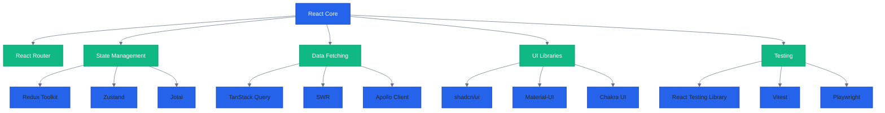

**Want to understand React + TypeScript?** This overview explains what React is, why it exists, and when you should use it.

**Coverage note**: This overview provides context and big-picture understanding. For hands-on learning, continue to [Initial Setup](/en/learn/software-engineering/platform-web/fe-react/initial-setup).

## What is React?

**React** is a JavaScript library for building user interfaces through composable components. Created by Facebook (now Meta) in 2013, React pioneered the component-based approach that now dominates modern frontend development.

**Core characteristics**:

- **Component-Based** - UI built from reusable, isolated components
- **Declarative** - Describe what UI should look like, React handles updates
- **Virtual DOM** - Efficient updates through diffing algorithm
- **Unidirectional Data Flow** - Data flows down, events flow up
- **Library, Not Framework** - Focused on UI rendering, compose with other tools

**TypeScript integration** adds static typing, better tooling, and improved developer experience to React's dynamic JavaScript foundation.

## Why React?

### Component Reusability

Build UI from small, testable pieces that compose into complex interfaces:

```typescript
// Reusable Button component
function Button({ onClick, children }: ButtonProps) {
  return <button onClick={onClick}>{children}</button>;
}

// Compose into larger components
function LoginForm() {
  return (
    <form>
      <Button onClick={handleLogin}>Log In</Button>
      <Button onClick={handleCancel}>Cancel</Button>
    </form>
  );
}
```

### Large Ecosystem

Mature ecosystem with solutions for every need:

- **Routing** - React Router, TanStack Router
- **State Management** - Redux, Zustand, Jotai, Context API
- **Data Fetching** - TanStack Query, SWR, Apollo Client
- **Forms** - React Hook Form, Formik
- **Testing** - React Testing Library, Vitest, Playwright
- **UI Libraries** - Material-UI, shadcn/ui, Chakra UI, Ant Design

### TypeScript Support

First-class TypeScript support provides:

- **Type Safety** - Catch errors at compile time, not runtime
- **IntelliSense** - Autocomplete for props, hooks, and components
- **Refactoring** - Rename, extract, and move code confidently
- **Documentation** - Types serve as inline documentation

### Industry Adoption

React powers major applications:

- **Facebook/Meta** - Instagram, WhatsApp Web, Facebook
- **Streaming** - Netflix, Disney+
- **Productivity** - Notion, Asana, Trello
- **E-commerce** - Shopify, Airbnb

Large talent pool, extensive resources, and proven scalability.

## React Ecosystem



**Color Legend**: Blue (core library), Green (ecosystem categories and tools)

## Key Concepts

### Components

Functions that return JSX (JavaScript XML):

```typescript
// Functional component with TypeScript
interface GreetingProps {
  name: string;
  age?: number;
}

function Greeting({ name, age }: GreetingProps) {
  return (
    <div>
      <h2>Hello, {name}!</h2>
      {age && <p>Age: {age}</p>}
    </div>
  );
}
```

### Props

Data passed from parent to child components:

```typescript
// Parent passes props
<Greeting name="Alice" age={30} />

// Child receives typed props
function Greeting({ name, age }: GreetingProps) {
  // Use props
}
```

### State

Component-local data that triggers re-renders when changed:

```typescript
import { useState } from 'react';

function Counter() {
  const [count, setCount] = useState<number>(0);

  return (
    <div>
      <p>Count: {count}</p>
      <button onClick={() => setCount(count + 1)}>Increment</button>
    </div>
  );
}
```

### Hooks

Functions that enable state and lifecycle features in functional components:

- **useState** - Local component state
- **useEffect** - Side effects and lifecycle
- **useContext** - Consume context values
- **useReducer** - Complex state logic
- **useMemo** - Memoize expensive computations
- **useCallback** - Memoize callback functions
- **useRef** - Persist values across renders

### JSX

JavaScript syntax extension that looks like HTML:

```typescript
const element = (
  <div className="container">
    <h1>Welcome</h1>
    <p>This is JSX</p>
  </div>
);

// Compiles to JavaScript:
const element = React.createElement(
  'div',
  { className: 'container' },
  React.createElement('h1', null, 'Welcome'),
  React.createElement('p', null, 'This is JSX')
);
```

## React vs Alternatives

### React vs Vue

**React**:

- More flexible (library vs framework)
- Larger ecosystem
- JSX (JavaScript-centric)
- Requires more decisions (routing, state management)

**Vue**:

- More opinionated (official router, state management)
- Template-based syntax (HTML-centric)
- Easier learning curve for beginners
- Smaller bundle size

### React vs Angular

**React**:

- Library, not framework
- Functional programming emphasis
- Faster to learn
- More flexibility in architecture

**Angular**:

- Full framework with batteries included
- TypeScript-first from the start
- Dependency injection system
- RxJS for reactive programming
- Steeper learning curve

### React vs Svelte

**React**:

- Virtual DOM diffing
- Larger runtime
- Mature ecosystem
- More job opportunities

**Svelte**:

- Compile-time framework (no virtual DOM)
- Smaller bundle sizes
- Less boilerplate
- Smaller ecosystem

## Use Cases

### When to Use React

**Single Page Applications (SPAs)**:

- Interactive web applications
- Client-side routing
- Rich user interactions

**Dashboards and Admin Panels**:

- Data visualization
- Real-time updates
- Complex state management

**E-commerce Platforms**:

- Product catalogs
- Shopping carts
- Checkout flows

**Social Media Platforms**:

- News feeds
- Real-time notifications
- Infinite scroll

**Cross-Platform Development**:

- React Native for mobile apps
- Electron for desktop apps

### When NOT to Use React

**Static Content Sites**:

- Use Next.js (React framework) with SSG instead
- Or use Hugo, Astro for pure static sites

**SEO-Critical Sites Without SSR**:

- React alone requires JavaScript for rendering
- Use Next.js, Remix for server-side rendering

**Tiny Projects**:

- Overhead of build tools and ecosystem
- Consider vanilla JavaScript or Alpine.js

**Performance-Critical Embedded Interfaces**:

- Virtual DOM overhead
- Consider Svelte or SolidJS

## Architecture Philosophy

### Functional Programming

React embraces functional programming principles:

- **Pure Components** - Same props produce same output
- **Immutability** - Don't mutate state directly
- **Composition** - Build complex UIs from simple components
- **Higher-Order Components** - Functions that transform components
- **Hooks** - Functional approach to lifecycle and state

### Composition Over Inheritance

Build UIs through component composition, not class inheritance:

```typescript
// Composition - preferred
function Card({ children }: { children: React.ReactNode }) {
  return <div className="card">{children}</div>;
}

function UserCard({ user }: { user: User }) {
  return (
    <Card>
      <h2>{user.name}</h2>
      <p>{user.email}</p>
    </Card>
  );
}

// Inheritance - avoid
class Card extends React.Component { }
class UserCard extends Card { } // Not idiomatic React
```

### Unidirectional Data Flow

Data flows down through props, events flow up through callbacks:

```typescript
function Parent() {
  const [value, setValue] = useState('');

  return <Child value={value} onChange={setValue} />;
}

function Child({ value, onChange }: ChildProps) {
  return <input value={value} onChange={(e) => onChange(e.target.value)} />;
}
```

## Getting Started

Ready to build with React?

**Prerequisites**:

- **JavaScript** - ES6+ syntax (arrow functions, destructuring, modules)
- **TypeScript** - Basic type annotations and interfaces
- **HTML/CSS** - Web fundamentals
- **Node.js** - For development tools (npm, build tools)

**Learning path**:

1. **[Initial Setup](/en/learn/software-engineering/platform-web/fe-react/initial-setup)** - Install Node.js, create first React app with Vite
2. **[Quick Start](/en/learn/software-engineering/platform-web/fe-react/quick-start)** - Build first component, understand JSX, props, and state
3. **[By Example](/en/learn/software-engineering/platform-web/fe-react/by-example)** - Learn through practical, annotated code examples

**Recommended approach**: Start with Initial Setup to configure your development environment, then work through Quick Start to understand fundamentals. The By Example section provides deep, hands-on learning for mastering React + TypeScript.

## Next Steps

**Begin your React journey**:

- **[Initial Setup](/en/learn/software-engineering/platform-web/fe-react/initial-setup)** - Set up development environment (0-5% coverage)
- **[Quick Start](/en/learn/software-engineering/platform-web/fe-react/quick-start)** - Build first React component (5-30% coverage)
- **[By Example](/en/learn/software-engineering/platform-web/fe-react/by-example)** - Master React through annotated examples (30-95% coverage)

**External resources**:

- **[React Official Docs](https://react.dev)** - Official React documentation (excellent quality)
- **[TypeScript Handbook](https://www.typescriptlang.org/docs/handbook/intro.html)** - TypeScript fundamentals
- **[React TypeScript Cheatsheet](https://react-typescript-cheatsheet.netlify.app)** - React + TypeScript patterns
