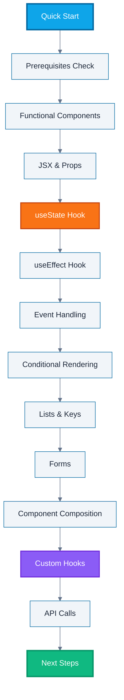

**Ready to learn React quickly?** This quick start tutorial provides a fast-paced tour through React's core concepts with TypeScript. By the end, you'll understand the fundamentals and be ready to build real applications.

This tutorial provides 5-30% coverage - touching all essential concepts without deep dives. For 0-5% coverage (installation only), see [Initial Setup](/en/learn/software-engineering/web-platform/fe-react/initial-setup). For deep dives, continue to [Beginner Tutorial](/en/learn/software-engineering/web-platform/fe-react/by-concept/beginner) (0-60% coverage).

## Prerequisites

Before starting this tutorial, you need:

- React development environment set up (see [Initial Setup](/en/learn/software-engineering/web-platform/fe-react/initial-setup))
- Node.js 18+ and npm 9+
- TypeScript 5+ configured
- Basic TypeScript knowledge (see [TypeScript Quick Start](/en/learn/software-engineering/programming-languages/typescript/quick-start))
- Understanding of HTML, CSS, and JavaScript fundamentals
- Text editor with TypeScript support (VS Code recommended)

## Learning Objectives

By the end of this tutorial, you will understand:

1. **Functional Components** - Building UI with TypeScript functions
2. **JSX Syntax** - Writing declarative UI markup
3. **Props** - Passing data between components
4. **State Management** - Managing component data with useState
5. **Side Effects** - Handling effects with useEffect
6. **Event Handling** - Responding to user interactions
7. **Conditional Rendering** - Displaying content based on conditions
8. **Lists and Keys** - Rendering collections efficiently
9. **Forms** - Managing controlled components
10. **Component Composition** - Building complex UIs from simple parts
11. **Custom Hooks** - Extracting reusable logic
12. **API Integration** - Fetching and displaying remote data

## Learning Path



## Project Setup

Create a new React + TypeScript project using Vite:

```bash
npm create vite@latest zakat-calculator -- --template react-ts
cd zakat-calculator
npm install
npm run dev
```

This creates a React application with TypeScript configured. We'll build a Zakat calculator to demonstrate React concepts.

## Functional Components with TypeScript

Components are the building blocks of React applications. With TypeScript, we define component props with interfaces.

### Basic Component

Create `src/components/Header.tsx`:

```tsx
interface HeaderProps {
  title: string;
  subtitle?: string;
}

function Header({ title, subtitle }: HeaderProps) {
  return (
    <header className="header">
      <h1>{title}</h1>
      {subtitle && <p className="subtitle">{subtitle}</p>}
    </header>
  );
}

export default Header;
```

**What you learned**:

- Components are TypeScript functions that return JSX
- Props are defined using interfaces for type safety
- Optional props use the `?` syntax
- Components can be exported for reuse

## JSX and Props

JSX lets you write HTML-like syntax in JavaScript. Props pass data from parent to child components.

### Props Flow

Update `src/App.tsx`:

```tsx
import Header from "./components/Header";

function App() {
  return (
    <div className="app">
      <Header title="Zakat Calculator" subtitle="Calculate your Islamic charitable obligations" />
    </div>
  );
}

export default App;
```

Create `src/components/InfoCard.tsx`:

```tsx
interface InfoCardProps {
  label: string;
  value: string | number;
  unit?: string;
  highlight?: boolean;
}

function InfoCard({ label, value, unit, highlight = false }: InfoCardProps) {
  const cardClass = highlight ? "info-card highlight" : "info-card";

  return (
    <div className={cardClass}>
      <div className="label">{label}</div>
      <div className="value">
        {value} {unit && <span className="unit">{unit}</span>}
      </div>
    </div>
  );
}

export default InfoCard;
```

**What you learned**:

- JSX expressions use curly braces `{}`
- Props can have default values
- String interpolation and conditional classes
- Components compose naturally

## State with useState

State lets components remember information between renders. The `useState` hook manages component state.

### Managing State

Create `src/components/ZakatCalculator.tsx`:

```tsx
import { useState } from "react";

interface CalculatorState {
  wealth: number;
  nisab: number;
}

function ZakatCalculator() {
  const [wealth, setWealth] = useState<number>(0);
  const [nisab, setNisab] = useState<number>(85 * 150); // 85 grams gold × approx price

  const isZakatDue = wealth >= nisab;
  const zakatAmount = isZakatDue ? wealth * 0.025 : 0;

  return (
    <div className="calculator">
      <h2>Calculate Your Zakat</h2>

      <div className="input-group">
        <label>Total Wealth (IDR)</label>
        <input type="number" value={wealth} onChange={(e) => setWealth(Number(e.target.value))} />
      </div>

      <div className="results">
        <p>Nisab Threshold: IDR {nisab.toLocaleString()}</p>
        <p>Zakat Due: {isZakatDue ? "Yes" : "No"}</p>
        {isZakatDue && <p className="amount">Amount: IDR {zakatAmount.toLocaleString()}</p>}
      </div>
    </div>
  );
}

export default ZakatCalculator;
```

**What you learned**:

- `useState` returns state value and setter function
- Type annotations for type-safe state
- State updates trigger re-renders
- Derived values compute from state
- State changes through setter functions only

## Side Effects with useEffect

Effects handle operations outside React's render flow: API calls, subscriptions, DOM manipulation.

### Data Fetching Effect

Create `src/hooks/useGoldPrice.ts`:

```tsx
import { useState, useEffect } from "react";

interface GoldPriceData {
  pricePerGram: number;
  currency: string;
  lastUpdated: string;
}

function useGoldPrice() {
  const [price, setPrice] = useState<number | null>(null);
  const [loading, setLoading] = useState(true);
  const [error, setError] = useState<string | null>(null);

  useEffect(() => {
    async function fetchGoldPrice() {
      try {
        const response = await fetch("https://api.goldprice.org/v1/latest");
        const data: GoldPriceData = await response.json();
        setPrice(data.pricePerGram);
        setLoading(false);
      } catch (err) {
        setError("Failed to fetch gold price");
        setLoading(false);
      }
    }

    fetchGoldPrice();
  }, []); // Empty dependency array = run once on mount

  return { price, loading, error };
}

export default useGoldPrice;
```

Update calculator to use gold price:

```tsx
import { useState } from "react";
import useGoldPrice from "../hooks/useGoldPrice";

function ZakatCalculator() {
  const [wealth, setWealth] = useState<number>(0);
  const { price: goldPrice, loading, error } = useGoldPrice();

  if (loading) return <div>Loading gold price...</div>;
  if (error) return <div>Error: {error}</div>;

  const nisab = goldPrice ? goldPrice * 85 : 12750000; // Fallback value
  const isZakatDue = wealth >= nisab;
  const zakatAmount = isZakatDue ? wealth * 0.025 : 0;

  return (
    <div className="calculator">
      <h2>Calculate Your Zakat</h2>
      <p className="info">Current nisab: IDR {nisab.toLocaleString()}</p>

      <div className="input-group">
        <label>Total Wealth (IDR)</label>
        <input type="number" value={wealth} onChange={(e) => setWealth(Number(e.target.value))} />
      </div>

      <div className="results">
        <p>Zakat Due: {isZakatDue ? "Yes" : "No"}</p>
        {isZakatDue && <p className="amount">Amount: IDR {zakatAmount.toLocaleString()}</p>}
      </div>
    </div>
  );
}

export default ZakatCalculator;
```

**What you learned**:

- `useEffect` runs after render
- Dependency array controls when effect runs
- Empty array `[]` means run once on mount
- Effects can be async (using inner async function)
- Custom hooks encapsulate reusable logic

## Event Handling

React handles events with camelCase event handlers. TypeScript provides type-safe event objects.

### Form Events

Create `src/components/WealthForm.tsx`:

```tsx
import { useState, FormEvent, ChangeEvent } from "react";

interface WealthItem {
  id: string;
  category: string;
  amount: number;
}

interface WealthFormProps {
  onAddWealth: (item: WealthItem) => void;
}

function WealthForm({ onAddWealth }: WealthFormProps) {
  const [category, setCategory] = useState("");
  const [amount, setAmount] = useState("");

  const handleSubmit = (e: FormEvent<HTMLFormElement>) => {
    e.preventDefault();

    if (!category || !amount) return;

    const newItem: WealthItem = {
      id: Date.now().toString(),
      category,
      amount: Number(amount),
    };

    onAddWealth(newItem);
    setCategory("");
    setAmount("");
  };

  const handleCategoryChange = (e: ChangeEvent<HTMLInputElement>) => {
    setCategory(e.target.value);
  };

  const handleAmountChange = (e: ChangeEvent<HTMLInputElement>) => {
    setAmount(e.target.value);
  };

  return (
    <form onSubmit={handleSubmit} className="wealth-form">
      <h3>Add Wealth Item</h3>

      <div className="form-group">
        <label>Category</label>
        <input
          type="text"
          value={category}
          onChange={handleCategoryChange}
          placeholder="e.g., Savings, Gold, Investment"
        />
      </div>

      <div className="form-group">
        <label>Amount (IDR)</label>
        <input type="number" value={amount} onChange={handleAmountChange} placeholder="0" />
      </div>

      <button type="submit">Add Item</button>
    </form>
  );
}

export default WealthForm;
```

**What you learned**:

- Event handlers use camelCase (`onClick`, `onChange`, `onSubmit`)
- TypeScript provides typed event objects
- `e.preventDefault()` prevents default behavior
- Events pass up through callback props
- Form validation before submission

## Conditional Rendering

React renders components conditionally using JavaScript operators.

### Multiple Conditions

Create `src/components/ZakatStatus.tsx`:

```tsx
interface ZakatStatusProps {
  wealth: number;
  nisab: number;
}

function ZakatStatus({ wealth, nisab }: ZakatStatusProps) {
  if (wealth === 0) {
    return (
      <div className="status neutral">
        <p>Enter your wealth to calculate zakat.</p>
      </div>
    );
  }

  if (wealth < nisab) {
    return (
      <div className="status info">
        <p>Your wealth is below nisab threshold.</p>
        <p>Zakat is not obligatory, but sadaqah is encouraged.</p>
      </div>
    );
  }

  const zakatAmount = wealth * 0.025;
  const remainingWealth = wealth - zakatAmount;

  return (
    <div className="status success">
      <h3>Zakat Calculation</h3>
      <p>Your wealth exceeds nisab. Zakat is due.</p>

      <div className="breakdown">
        <div className="row">
          <span>Total Wealth:</span>
          <span>IDR {wealth.toLocaleString()}</span>
        </div>
        <div className="row highlight">
          <span>Zakat Due (2.5%):</span>
          <span>IDR {zakatAmount.toLocaleString()}</span>
        </div>
        <div className="row">
          <span>Remaining Wealth:</span>
          <span>IDR {remainingWealth.toLocaleString()}</span>
        </div>
      </div>
    </div>
  );
}

export default ZakatStatus;
```

**What you learned**:

- Early returns for different conditions
- Ternary operator for inline conditionals
- Logical AND (`&&`) for conditional rendering
- Multiple return statements based on state
- Conditional CSS classes

## Lists and Keys

React renders arrays of elements. Keys help React identify changed items.

### Rendering Lists

Create `src/components/WealthList.tsx`:

```tsx
interface WealthItem {
  id: string;
  category: string;
  amount: number;
}

interface WealthListProps {
  items: WealthItem[];
  onRemove: (id: string) => void;
}

function WealthList({ items, onRemove }: WealthListProps) {
  if (items.length === 0) {
    return <p className="empty-state">No wealth items added yet.</p>;
  }

  const totalWealth = items.reduce((sum, item) => sum + item.amount, 0);

  return (
    <div className="wealth-list">
      <h3>Your Wealth Items</h3>

      <ul>
        {items.map((item) => (
          <li key={item.id} className="wealth-item">
            <div className="item-info">
              <span className="category">{item.category}</span>
              <span className="amount">IDR {item.amount.toLocaleString()}</span>
            </div>
            <button onClick={() => onRemove(item.id)} className="remove-btn" aria-label={`Remove ${item.category}`}>
              ×
            </button>
          </li>
        ))}
      </ul>

      <div className="total">
        <span>Total Wealth:</span>
        <span className="total-amount">IDR {totalWealth.toLocaleString()}</span>
      </div>
    </div>
  );
}

export default WealthList;
```

**What you learned**:

- Use `.map()` to transform arrays into elements
- Keys must be unique and stable
- Use item IDs as keys (not array indexes)
- Keys help React optimize re-renders
- Aggregate calculations with `.reduce()`

## Forms and Controlled Components

Controlled components sync form inputs with React state.

### Multi-Input Form

Create `src/components/DonationForm.tsx`:

```tsx
import { useState, FormEvent, ChangeEvent } from "react";

interface DonationData {
  amount: number;
  name: string;
  email: string;
  type: "zakat" | "sadaqah" | "infaq";
  anonymous: boolean;
}

interface DonationFormProps {
  onSubmit: (data: DonationData) => void;
}

function DonationForm({ onSubmit }: DonationFormProps) {
  const [formData, setFormData] = useState<DonationData>({
    amount: 0,
    name: "",
    email: "",
    type: "zakat",
    anonymous: false,
  });

  const [errors, setErrors] = useState<Record<string, string>>({});

  const handleChange = (e: ChangeEvent<HTMLInputElement | HTMLSelectElement>) => {
    const { name, value, type } = e.target;

    setFormData((prev) => ({
      ...prev,
      [name]: type === "checkbox" ? (e.target as HTMLInputElement).checked : type === "number" ? Number(value) : value,
    }));
  };

  const validate = (): boolean => {
    const newErrors: Record<string, string> = {};

    if (formData.amount <= 0) {
      newErrors.amount = "Amount must be greater than 0";
    }

    if (!formData.anonymous && !formData.name.trim()) {
      newErrors.name = "Name is required for non-anonymous donations";
    }

    if (!formData.anonymous && !formData.email.includes("@")) {
      newErrors.email = "Valid email is required";
    }

    setErrors(newErrors);
    return Object.keys(newErrors).length === 0;
  };

  const handleSubmit = (e: FormEvent<HTMLFormElement>) => {
    e.preventDefault();

    if (validate()) {
      onSubmit(formData);
      // Reset form
      setFormData({
        amount: 0,
        name: "",
        email: "",
        type: "zakat",
        anonymous: false,
      });
      setErrors({});
    }
  };

  return (
    <form onSubmit={handleSubmit} className="donation-form">
      <h2>Make a Donation</h2>

      <div className="form-group">
        <label htmlFor="amount">Amount (IDR) *</label>
        <input
          id="amount"
          name="amount"
          type="number"
          value={formData.amount}
          onChange={handleChange}
          className={errors.amount ? "error" : ""}
        />
        {errors.amount && <span className="error-msg">{errors.amount}</span>}
      </div>

      <div className="form-group">
        <label htmlFor="type">Donation Type *</label>
        <select id="type" name="type" value={formData.type} onChange={handleChange}>
          <option value="zakat">Zakat (Obligatory)</option>
          <option value="sadaqah">Sadaqah (Voluntary)</option>
          <option value="infaq">Infaq (General Charity)</option>
        </select>
      </div>

      <div className="form-group checkbox">
        <label>
          <input name="anonymous" type="checkbox" checked={formData.anonymous} onChange={handleChange} />
          Make this donation anonymous
        </label>
      </div>

      {!formData.anonymous && (
        <>
          <div className="form-group">
            <label htmlFor="name">Your Name *</label>
            <input
              id="name"
              name="name"
              type="text"
              value={formData.name}
              onChange={handleChange}
              className={errors.name ? "error" : ""}
            />
            {errors.name && <span className="error-msg">{errors.name}</span>}
          </div>

          <div className="form-group">
            <label htmlFor="email">Email *</label>
            <input
              id="email"
              name="email"
              type="email"
              value={formData.email}
              onChange={handleChange}
              className={errors.email ? "error" : ""}
            />
            {errors.email && <span className="error-msg">{errors.email}</span>}
          </div>
        </>
      )}

      <button type="submit" className="submit-btn">
        Submit Donation
      </button>
    </form>
  );
}

export default DonationForm;
```

**What you learned**:

- Controlled components keep form state in React
- Single `handleChange` for multiple inputs
- Form validation before submission
- Conditional form fields
- Error message display
- Complex state updates with spread operator

## Component Composition

Build complex UIs by composing simple components.

### Parent-Child Communication

Update `src/App.tsx` with full composition:

```tsx
import { useState } from "react";
import Header from "./components/Header";
import WealthForm from "./components/WealthForm";
import WealthList from "./components/WealthList";
import ZakatStatus from "./components/ZakatStatus";
import DonationForm from "./components/DonationForm";

interface WealthItem {
  id: string;
  category: string;
  amount: number;
}

interface DonationData {
  amount: number;
  name: string;
  email: string;
  type: "zakat" | "sadaqah" | "infaq";
  anonymous: boolean;
}

function App() {
  const [wealthItems, setWealthItems] = useState<WealthItem[]>([]);
  const [donations, setDonations] = useState<DonationData[]>([]);

  const nisab = 85 * 150000; // 85 grams × gold price approximation
  const totalWealth = wealthItems.reduce((sum, item) => sum + item.amount, 0);

  const handleAddWealth = (item: WealthItem) => {
    setWealthItems((prev) => [...prev, item]);
  };

  const handleRemoveWealth = (id: string) => {
    setWealthItems((prev) => prev.filter((item) => item.id !== id));
  };

  const handleDonationSubmit = (data: DonationData) => {
    setDonations((prev) => [...prev, data]);
    alert(`Thank you for your ${data.type} donation of IDR ${data.amount.toLocaleString()}!`);
  };

  return (
    <div className="app">
      <Header title="Zakat & Donation Platform" subtitle="Calculate and fulfill your Islamic obligations" />

      <main className="main-content">
        <section className="calculator-section">
          <WealthForm onAddWealth={handleAddWealth} />
          <WealthList items={wealthItems} onRemove={handleRemoveWealth} />
          <ZakatStatus wealth={totalWealth} nisab={nisab} />
        </section>

        <section className="donation-section">
          <DonationForm onSubmit={handleDonationSubmit} />

          {donations.length > 0 && (
            <div className="donation-summary">
              <h3>Your Donations</h3>
              <p>Total donated: IDR {donations.reduce((sum, d) => sum + d.amount, 0).toLocaleString()}</p>
              <p>Number of donations: {donations.length}</p>
            </div>
          )}
        </section>
      </main>
    </div>
  );
}

export default App;
```

**What you learned**:

- Parent components manage shared state
- Props flow down (parent to child)
- Events flow up (child to parent via callbacks)
- Multiple independent sections in one app
- State lifting for shared data
- Component hierarchy and data flow

## Custom Hooks

Custom hooks extract reusable stateful logic.

### Building a Custom Hook

Create `src/hooks/useLocalStorage.ts`:

```tsx
import { useState, useEffect } from "react";

function useLocalStorage<T>(key: string, initialValue: T) {
  // State to store value
  const [storedValue, setStoredValue] = useState<T>(() => {
    try {
      const item = window.localStorage.getItem(key);
      return item ? JSON.parse(item) : initialValue;
    } catch (error) {
      console.error("Error reading localStorage:", error);
      return initialValue;
    }
  });

  // Update localStorage when state changes
  useEffect(() => {
    try {
      window.localStorage.setItem(key, JSON.stringify(storedValue));
    } catch (error) {
      console.error("Error writing localStorage:", error);
    }
  }, [key, storedValue]);

  return [storedValue, setStoredValue] as const;
}

export default useLocalStorage;
```

Use the custom hook in `App.tsx`:

```tsx
import useLocalStorage from "./hooks/useLocalStorage";

function App() {
  const [wealthItems, setWealthItems] = useLocalStorage<WealthItem[]>("wealthItems", []);
  const [donations, setDonations] = useLocalStorage<DonationData[]>("donations", []);

  // Rest of component stays the same
  // Now state persists across page refreshes!

  // ...
}
```

**What you learned**:

- Custom hooks start with `use` prefix
- Extract reusable logic into custom hooks
- Hooks can use other hooks
- Generic types for reusable hooks
- `as const` for tuple return types
- Lazy initialization with function

## API Calls and Data Fetching

Fetch data from APIs using `fetch` and `useEffect`.

### Complete Data Fetching Pattern

Create `src/hooks/useFetchDonations.ts`:

```tsx
import { useState, useEffect } from "react";

interface Donation {
  id: string;
  amount: number;
  type: string;
  date: string;
  anonymous: boolean;
}

interface FetchState {
  data: Donation[];
  loading: boolean;
  error: string | null;
}

function useFetchDonations(refreshInterval?: number) {
  const [state, setState] = useState<FetchState>({
    data: [],
    loading: true,
    error: null,
  });

  useEffect(() => {
    let isMounted = true;

    async function fetchDonations() {
      try {
        setState((prev) => ({ ...prev, loading: true }));

        const response = await fetch("/api/donations");

        if (!response.ok) {
          throw new Error(`HTTP error! status: ${response.status}`);
        }

        const data: Donation[] = await response.json();

        if (isMounted) {
          setState({
            data,
            loading: false,
            error: null,
          });
        }
      } catch (err) {
        if (isMounted) {
          setState({
            data: [],
            loading: false,
            error: err instanceof Error ? err.message : "Unknown error",
          });
        }
      }
    }

    fetchDonations();

    // Set up polling if refresh interval provided
    let intervalId: number | undefined;
    if (refreshInterval) {
      intervalId = window.setInterval(fetchDonations, refreshInterval);
    }

    // Cleanup function
    return () => {
      isMounted = false;
      if (intervalId) {
        clearInterval(intervalId);
      }
    };
  }, [refreshInterval]);

  return state;
}

export default useFetchDonations;
```

Create a component using the hook:

```tsx
import useFetchDonations from "../hooks/useFetchDonations";

function DonationLeaderboard() {
  const { data: donations, loading, error } = useFetchDonations(60000); // Refresh every 60s

  if (loading) {
    return (
      <div className="leaderboard">
        <h2>Recent Donations</h2>
        <div className="loading">Loading donations...</div>
      </div>
    );
  }

  if (error) {
    return (
      <div className="leaderboard">
        <h2>Recent Donations</h2>
        <div className="error">Error: {error}</div>
        <button onClick={() => window.location.reload()}>Retry</button>
      </div>
    );
  }

  const totalAmount = donations.reduce((sum, d) => sum + d.amount, 0);

  return (
    <div className="leaderboard">
      <h2>Recent Donations</h2>

      <div className="stats">
        <div className="stat">
          <span className="label">Total Donations:</span>
          <span className="value">{donations.length}</span>
        </div>
        <div className="stat">
          <span className="label">Total Amount:</span>
          <span className="value">IDR {totalAmount.toLocaleString()}</span>
        </div>
      </div>

      <ul className="donation-list">
        {donations.map((donation) => (
          <li key={donation.id} className="donation-item">
            <span className="type">{donation.type}</span>
            <span className="amount">IDR {donation.amount.toLocaleString()}</span>
            <span className="date">{new Date(donation.date).toLocaleDateString()}</span>
          </li>
        ))}
      </ul>
    </div>
  );
}

export default DonationLeaderboard;
```

**What you learned**:

- Async data fetching with `fetch` API
- Loading, error, and success states
- Cleanup to prevent memory leaks (`isMounted` flag)
- Polling with `setInterval`
- Effect cleanup with return function
- Proper error handling
- TypeScript types for API responses

## Routing with React Router

Add navigation between pages.

### Install React Router

```bash
npm install react-router-dom
```

### Setup Routes

Update `src/main.tsx`:

```tsx
import React from "react";
import ReactDOM from "react-dom/client";
import { BrowserRouter, Routes, Route, Link } from "react-router-dom";
import App from "./App";
import About from "./pages/About";
import NotFound from "./pages/NotFound";
import "./index.css";

ReactDOM.createRoot(document.getElementById("root")!).render(
  <React.StrictMode>
    <BrowserRouter>
      <nav className="main-nav">
        <Link to="/">Home</Link>
        <Link to="/about">About</Link>
      </nav>

      <Routes>
        <Route path="/" element={<App />} />
        <Route path="/about" element={<About />} />
        <Route path="*" element={<NotFound />} />
      </Routes>
    </BrowserRouter>
  </React.StrictMode>,
);
```

Create `src/pages/About.tsx`:

```tsx
import { useNavigate } from "react-router-dom";

function About() {
  const navigate = useNavigate();

  return (
    <div className="about-page">
      <h1>About Zakat Platform</h1>
      <p>
        This platform helps Muslims calculate and fulfill their zakat obligations. Zakat is one of the Five Pillars of
        Islam and represents 2.5% of qualifying wealth.
      </p>

      <h2>What is Nisab?</h2>
      <p>
        Nisab is the minimum amount of wealth a Muslim must possess before being obligated to pay zakat. It's equivalent
        to 85 grams of gold or 595 grams of silver.
      </p>

      <button onClick={() => navigate("/")}>Return to Calculator</button>
    </div>
  );
}

export default About;
```

Create `src/pages/NotFound.tsx`:

```tsx
import { Link } from "react-router-dom";

function NotFound() {
  return (
    <div className="not-found">
      <h1>404 - Page Not Found</h1>
      <p>The page you're looking for doesn't exist.</p>
      <Link to="/">Go Home</Link>
    </div>
  );
}

export default NotFound;
```

**What you learned**:

- `BrowserRouter` wraps the entire app
- `Routes` and `Route` define URL patterns
- `Link` for client-side navigation
- `useNavigate` for programmatic navigation
- Catch-all route with `path="*"`
- Route parameters and nested routes (in docs)

## What You've Accomplished

Through this quick start tutorial, you've built a Zakat calculator application covering:

### Core Concepts Mastered

- **Component Architecture** - Functional components with TypeScript
- **Props & Composition** - Data flow and component hierarchy
- **State Management** - `useState` for local state
- **Side Effects** - `useEffect` for data fetching and lifecycle
- **Event Handling** - User interactions and form submissions
- **Conditional Rendering** - Dynamic UI based on state
- **Lists** - Rendering collections with keys
- **Forms** - Controlled components and validation
- **Custom Hooks** - Reusable logic extraction
- **API Integration** - Fetching and managing remote data
- **Routing** - Multi-page navigation

### Technical Skills

- TypeScript interfaces for props and state
- Async/await with error handling
- LocalStorage integration
- Form validation patterns
- Component composition strategies
- Custom hook patterns
- API polling
- Effect cleanup

### Application Features Built

- Wealth tracking system
- Zakat calculation engine
- Multi-step donation form
- Real-time data updates
- Persistent storage
- Multi-page routing
- Error handling
- Loading states

## Next Steps

You've covered 5-30% of React. Continue your learning journey:

### Immediate Next Steps

- **By-Concept Beginner Tutorial** - Dive deeper into fundamentals (0-60% coverage)
  - [React Beginner Tutorial](/en/learn/software-engineering/web-platform/fe-react/by-concept/beginner)
- **Styling** - Learn CSS-in-JS, Tailwind, or CSS Modules
- **Testing** - Write tests with React Testing Library
- **Performance** - Optimization with `useMemo`, `useCallback`, `React.memo`

### Advanced Topics

- **State Management** - Context API, Zustand, Redux Toolkit
- **Data Fetching** - React Query, SWR
- **Forms** - React Hook Form, Formik
- **Build Tools** - Understanding Vite configuration
- **Server Components** - Next.js and RSC patterns
- **TypeScript** - Advanced patterns with generics and utility types

### Practice Projects

- Sadaqah tracking dashboard
- Mosque donation portal
- Islamic calendar app
- Halal restaurant finder
- Prayer time tracker

### Learning Resources

- [React Official Documentation](https://react.dev)
- [TypeScript Handbook](https://www.typescriptlang.org/docs/)
- [React TypeScript Cheatsheet](https://react-typescript-cheatsheet.netlify.app/)

**Ready for deeper learning?** Continue to the [Beginner Tutorial](/en/learn/software-engineering/web-platform/fe-react/by-concept/beginner) for comprehensive React mastery.
