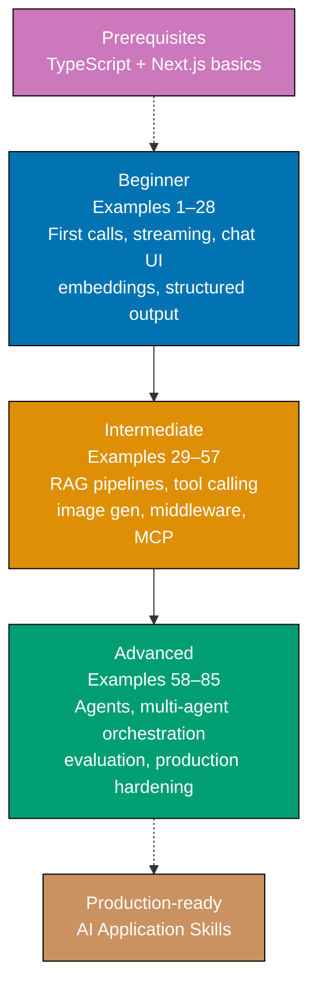

**Want to build AI-powered apps through code?** This by-example tutorial provides 85 heavily annotated examples covering the full spectrum of modern AI application development—from your first API call to production-ready multi-agent systems, RAG pipelines, and observability.

**Primary library**: Vercel AI SDK `ai@6.0.168` with supplementary coverage of OpenAI SDK `openai@6.34.0`, LangChain.js `langchain@1.3.3`, LlamaIndex.TS `llamaindex@0.12.1`, Mastra `mastra@1.x`, and the Model Context Protocol.

## What Is By-Example Learning?

By-example learning is a **code-first approach** where you learn concepts through annotated, working examples rather than narrative explanations. Each example shows:

1. **Brief explanation** — What the concept is and when to use it
2. **Mermaid diagram** (when appropriate) — Visual representation of complex flows
3. **Heavily annotated code** — Working TypeScript code with 1–2.25 comment lines per code line
4. **Key Takeaway** — 1–2 sentence distillation of the pattern
5. **Why It Matters** — 50–100 words connecting the pattern to production relevance

This approach works best when you already understand TypeScript and basic web development. You learn AI SDK patterns by studying real code rather than theoretical descriptions.

## What Is the Vercel AI SDK?

The Vercel AI SDK (`ai@6.0.168`) is a **TypeScript-first framework** for integrating large language models into web applications. Key characteristics:

- **Provider-agnostic**: Swap between OpenAI, Anthropic, Google, and others by changing one line
- **Streaming-first**: All generation functions support streaming out of the box
- **React hooks**: `useChat`, `useCompletion`, `useObject` for zero-boilerplate UI
- **Structured output**: Type-safe LLM responses via Zod schemas with `generateObject`
- **Tool calling**: First-class tool definitions with `tool()`, multi-step loops, human approval gates
- **Agent primitives**: `ToolLoopAgent`, `prepareStep`, `stopWhen` for production-grade agents
- **RAG utilities**: `embed()`, `embedMany()`, `cosineSimilarity()`, `rerank()` built in
- **Middleware**: `wrapLanguageModel()` for logging, caching, and tracing

**Critical v6 breaking change**: `StreamingTextResponse` was removed. Use `result.toDataStreamResponse()` in all route handlers.

## Learning Path



## Coverage by Difficulty

- **Beginner (Examples 1–28)**: First API calls, streaming, chat UI, multi-turn conversations, provider swapping, error handling, embeddings, cosine similarity, semantic search, structured output, and a complete end-to-end minimal chatbot
- **Intermediate (Examples 29–57)**: Batch embeddings, pgvector/Pinecone/Qdrant/Weaviate storage, full RAG pipelines, document chunking, PDF ingestion, hybrid search, reranking, tool definitions, multi-step tool use, human-in-the-loop gates, LangChain LCEL, image generation, audio, middleware, MCP integration
- **Advanced (Examples 58–85)**: ToolLoopAgent, prepareStep for dynamic routing and context management, OpenAI Agents SDK, Mastra agents and workflows, LangGraph, multi-agent orchestration (planner/worker, fan-out/fan-in, competitive evaluation), MCP servers, production RAG, caching, RSC streaming, edge deployment, rate limiting, DevTools, LangSmith, Braintrust, LLM-as-judge, RAGAS evaluation, and a full-stack deployment checklist

## Annotation Density: 1–2.25 Comments Per Code Line

All examples maintain **1–2.25 comment lines per code line** using `// =>` notation to show values, states, and effects:

```typescript
const result = await generateText({
  // => initiates AI generation call
  model: openai("gpt-4o"), // => selects GPT-4o as the LLM
  prompt: "What is 2 + 2?", // => user message string
}); // => result contains text, usage, finishReason
console.log(result.text); // => "2 + 2 equals 4."
console.log(result.usage.totalTokens); // => e.g. 42 (prompt + completion tokens)
```

## Prerequisites

Before starting, ensure you understand:

- TypeScript fundamentals (types, interfaces, async/await, generics)
- Next.js App Router basics (route handlers, Server Components, Client Components)
- npm package management
- Basic HTTP concepts (requests, responses, streaming)

No prior AI development experience required. The examples build from first principles.

## Installation Reference

```bash
# Vercel AI SDK with provider adapters (primary library)
npm install ai @ai-sdk/openai @ai-sdk/anthropic

# Direct OpenAI SDK (covered in examples 4-5, 46-47)
npm install openai

# OpenAI Agents SDK (examples 63-65)
npm install @openai/agents

# LangChain.js (examples 48-49, 68, 80)
npm install langchain @langchain/core @langchain/community @langchain/openai

# LlamaIndex.TS (example 37)
npm install llamaindex

# Mastra (examples 66-67)
npm install mastra

# MCP SDK (examples 72-73)
npm install @modelcontextprotocol/sdk

# Vector database clients (examples 31-33)
npm install @pinecone-database/pinecone
npm install @qdrant/js-client-rest
npm install weaviate-client
```

## Examples by Level

### Beginner (Examples 1–28)

- [Example 1: First API Call with generateText](/en/learn/software-engineering/platform-web/tools/ai-powered-apps/by-example/beginner#example-1-first-api-call-with-generatetext)
- [Example 2: Streaming Text with streamText and for-await](/en/learn/software-engineering/platform-web/tools/ai-powered-apps/by-example/beginner#example-2-streaming-text-with-streamtext-and-for-await)
- [Example 3: Streaming to HTTP Response with toDataStreamResponse](/en/learn/software-engineering/platform-web/tools/ai-powered-apps/by-example/beginner#example-3-streaming-to-http-response-with-todatastreamresponse)
- [Example 4: Direct OpenAI SDK — Basic Chat Completion](/en/learn/software-engineering/platform-web/tools/ai-powered-apps/by-example/beginner#example-4-direct-openai-sdk--basic-chat-completion)
- [Example 5: Direct OpenAI SDK — Streaming with for-await on SSE](/en/learn/software-engineering/platform-web/tools/ai-powered-apps/by-example/beginner#example-5-direct-openai-sdk--streaming-with-for-await-on-sse)
- [Example 6: Chat UI with useChat Hook in Next.js App Router](/en/learn/software-engineering/platform-web/tools/ai-powered-apps/by-example/beginner#example-6-chat-ui-with-usechat-hook-in-nextjs-app-router)
- [Example 7: System Prompts and Message Roles](/en/learn/software-engineering/platform-web/tools/ai-powered-apps/by-example/beginner#example-7-system-prompts-and-message-roles)
- [Example 8: Multi-Turn Conversation — Managing Messages Array](/en/learn/software-engineering/platform-web/tools/ai-powered-apps/by-example/beginner#example-8-multi-turn-conversation--managing-messages-array)
- [Example 9: Switching Models — Provider Swap Pattern](/en/learn/software-engineering/platform-web/tools/ai-powered-apps/by-example/beginner#example-9-switching-models--provider-swap-pattern)
- [Example 10: Temperature, maxTokens, and Model Settings](/en/learn/software-engineering/platform-web/tools/ai-powered-apps/by-example/beginner#example-10-temperature-maxtokens-and-model-settings)
- [Example 11: Text Completion with useCompletion Hook](/en/learn/software-engineering/platform-web/tools/ai-powered-apps/by-example/beginner#example-11-text-completion-with-usecompletion-hook)
- [Example 12: Environment Variable and API Key Management](/en/learn/software-engineering/platform-web/tools/ai-powered-apps/by-example/beginner#example-12-environment-variable-and-api-key-management)
- [Example 13: Building a Simple Q&A Endpoint](/en/learn/software-engineering/platform-web/tools/ai-powered-apps/by-example/beginner#example-13-building-a-simple-qa-endpoint)
- [Example 14: Error Handling and Rate Limits with try/catch](/en/learn/software-engineering/platform-web/tools/ai-powered-apps/by-example/beginner#example-14-error-handling-and-rate-limits-with-trycatch)
- [Example 15: Counting Tokens and Tracking Usage](/en/learn/software-engineering/platform-web/tools/ai-powered-apps/by-example/beginner#example-15-counting-tokens-and-tracking-usage)
- [Example 16: Prompt Templates with TypeScript Template Literals](/en/learn/software-engineering/platform-web/tools/ai-powered-apps/by-example/beginner#example-16-prompt-templates-with-typescript-template-literals)
- [Example 17: Streaming to the Browser via Route Handler SSE](/en/learn/software-engineering/platform-web/tools/ai-powered-apps/by-example/beginner#example-17-streaming-to-the-browser-via-route-handler-sse)
- [Example 18: Streaming with ReadableStream in Node.js](/en/learn/software-engineering/platform-web/tools/ai-powered-apps/by-example/beginner#example-18-streaming-with-readablestream-in-nodejs)
- [Example 19: Abort Signal and Request Cancellation](/en/learn/software-engineering/platform-web/tools/ai-powered-apps/by-example/beginner#example-19-abort-signal-and-request-cancellation)
- [Example 20: Image Input to a Vision Model](/en/learn/software-engineering/platform-web/tools/ai-powered-apps/by-example/beginner#example-20-image-input-to-a-vision-model)
- [Example 21: Generating a Single Embedding Vector with embed()](/en/learn/software-engineering/platform-web/tools/ai-powered-apps/by-example/beginner#example-21-generating-a-single-embedding-vector-with-embed)
- [Example 22: Cosine Similarity with cosineSimilarity()](/en/learn/software-engineering/platform-web/tools/ai-powered-apps/by-example/beginner#example-22-cosine-similarity-with-cosinesimilarity)
- [Example 23: Simple Semantic Search — Embed and Sort by Similarity](/en/learn/software-engineering/platform-web/tools/ai-powered-apps/by-example/beginner#example-23-simple-semantic-search--embed-and-sort-by-similarity)
- [Example 24: Structured Output with generateObject and Zod](/en/learn/software-engineering/platform-web/tools/ai-powered-apps/by-example/beginner#example-24-structured-output-with-generateobject-and-zod)
- [Example 25: Simple Classification with z.enum](/en/learn/software-engineering/platform-web/tools/ai-powered-apps/by-example/beginner#example-25-simple-classification-with-zenum)
- [Example 26: Streaming Structured Output with streamObject](/en/learn/software-engineering/platform-web/tools/ai-powered-apps/by-example/beginner#example-26-streaming-structured-output-with-streamobject)
- [Example 27: Reading Streaming Partial Objects with useObject](/en/learn/software-engineering/platform-web/tools/ai-powered-apps/by-example/beginner#example-27-reading-streaming-partial-objects-with-useobject)
- [Example 28: Building a Minimal Chatbot — End-to-End](/en/learn/software-engineering/platform-web/tools/ai-powered-apps/by-example/beginner#example-28-building-a-minimal-chatbot--end-to-end)

### Intermediate (Examples 29–57)

- [Example 29: Batch Embedding Documents with embedMany()](/en/learn/software-engineering/platform-web/tools/ai-powered-apps/by-example/intermediate#example-29-batch-embedding-documents-with-embedmany)
- [Example 30: Storing Embeddings in pgvector with Drizzle ORM](/en/learn/software-engineering/platform-web/tools/ai-powered-apps/by-example/intermediate#example-30-storing-embeddings-in-pgvector-with-drizzle-orm)
- [Example 31: Storing Embeddings in Pinecone](/en/learn/software-engineering/platform-web/tools/ai-powered-apps/by-example/intermediate#example-31-storing-embeddings-in-pinecone)
- [Example 32: Storing Embeddings in Qdrant](/en/learn/software-engineering/platform-web/tools/ai-powered-apps/by-example/intermediate#example-32-storing-embeddings-in-qdrant)
- [Example 33: HNSW Index Setup and Cosine-Distance Query](/en/learn/software-engineering/platform-web/tools/ai-powered-apps/by-example/intermediate#example-33-hnsw-index-setup-and-cosine-distance-query)
- [Example 34: Basic RAG Pipeline — Embed, Retrieve, Inject](/en/learn/software-engineering/platform-web/tools/ai-powered-apps/by-example/intermediate#example-34-basic-rag-pipeline--embed-retrieve-inject)
- [Example 35: RAG Chatbot with addResource and getInformation Tools](/en/learn/software-engineering/platform-web/tools/ai-powered-apps/by-example/intermediate#example-35-rag-chatbot-with-addresource-and-getinformation-tools)
- [Example 36: Document Chunking Strategies](/en/learn/software-engineering/platform-web/tools/ai-powered-apps/by-example/intermediate#example-36-document-chunking-strategies)
- [Example 37: Ingesting PDFs for RAG with LlamaIndex LiteParse](/en/learn/software-engineering/platform-web/tools/ai-powered-apps/by-example/intermediate#example-37-ingesting-pdfs-for-rag-with-llamaindex-liteparse)
- [Example 38: Hybrid Search — Keyword and Semantic with Weaviate](/en/learn/software-engineering/platform-web/tools/ai-powered-apps/by-example/intermediate#example-38-hybrid-search--keyword-and-semantic-with-weaviate)
- [Example 39: Reranking Retrieved Documents with rerank()](/en/learn/software-engineering/platform-web/tools/ai-powered-apps/by-example/intermediate#example-39-reranking-retrieved-documents-with-rerank)
- [Example 40: Single Tool Definition with tool()](/en/learn/software-engineering/platform-web/tools/ai-powered-apps/by-example/intermediate#example-40-single-tool-definition-with-tool)
- [Example 41: Multiple Tools in streamText — Search and Calculate](/en/learn/software-engineering/platform-web/tools/ai-powered-apps/by-example/intermediate#example-41-multiple-tools-in-streamtext--search-and-calculate)
- [Example 42: Multi-Step Tool Use with stopWhen: stepCountIs](/en/learn/software-engineering/platform-web/tools/ai-powered-apps/by-example/intermediate#example-42-multi-step-tool-use-with-stopwhen-stepcountis)
- [Example 43: Forcing a Specific Tool with toolChoice](/en/learn/software-engineering/platform-web/tools/ai-powered-apps/by-example/intermediate#example-43-forcing-a-specific-tool-with-toolchoice)
- [Example 44: Human-in-the-Loop with needsApproval](/en/learn/software-engineering/platform-web/tools/ai-powered-apps/by-example/intermediate#example-44-human-in-the-loop-with-needsapproval)
- [Example 45: Streaming Tool Call Inputs in Real Time](/en/learn/software-engineering/platform-web/tools/ai-powered-apps/by-example/intermediate#example-45-streaming-tool-call-inputs-in-real-time)
- [Example 46: Tool Calling with OpenAI SDK Directly](/en/learn/software-engineering/platform-web/tools/ai-powered-apps/by-example/intermediate#example-46-tool-calling-with-openai-sdk-directly)
- [Example 47: OpenAI Structured Outputs with json_schema Response Format](/en/learn/software-engineering/platform-web/tools/ai-powered-apps/by-example/intermediate#example-47-openai-structured-outputs-with-json_schema-response-format)
- [Example 48: LangChain.js — LCEL Chain with pipe()](/en/learn/software-engineering/platform-web/tools/ai-powered-apps/by-example/intermediate#example-48-langchainjs--lcel-chain-with-pipe)
- [Example 49: LangChain.js — RAG Chain with createRetrievalChain](/en/learn/software-engineering/platform-web/tools/ai-powered-apps/by-example/intermediate#example-49-langchainjs--rag-chain-with-createretrievalchain)
- [Example 50: Image Generation with generateImage()](/en/learn/software-engineering/platform-web/tools/ai-powered-apps/by-example/intermediate#example-50-image-generation-with-generateimage)
- [Example 51: Image Editing and Inpainting via Reference Images](/en/learn/software-engineering/platform-web/tools/ai-powered-apps/by-example/intermediate#example-51-image-editing-and-inpainting-via-reference-images)
- [Example 52: Audio Transcription with Whisper](/en/learn/software-engineering/platform-web/tools/ai-powered-apps/by-example/intermediate#example-52-audio-transcription-with-whisper)
- [Example 53: Speech Synthesis with AI SDK](/en/learn/software-engineering/platform-web/tools/ai-powered-apps/by-example/intermediate#example-53-speech-synthesis-with-ai-sdk)
- [Example 54: Multimodal Chat — Images and Text in the Same Conversation](/en/learn/software-engineering/platform-web/tools/ai-powered-apps/by-example/intermediate#example-54-multimodal-chat--images-and-text-in-the-same-conversation)
- [Example 55: Middleware Pattern with wrapLanguageModel()](/en/learn/software-engineering/platform-web/tools/ai-powered-apps/by-example/intermediate#example-55-middleware-pattern-with-wraplanguagemodel)
- [Example 56: Provider Fallback — Try Claude, Fall Back to GPT-4o](/en/learn/software-engineering/platform-web/tools/ai-powered-apps/by-example/intermediate#example-56-provider-fallback--try-claude-fall-back-to-gpt-4o)
- [Example 57: MCP Client — Connecting AI SDK to an MCP Server](/en/learn/software-engineering/platform-web/tools/ai-powered-apps/by-example/intermediate#example-57-mcp-client--connecting-ai-sdk-to-an-mcp-server)

### Advanced (Examples 58–85)

- [Example 58: ToolLoopAgent — Define Once, Use Across App Contexts](/en/learn/software-engineering/platform-web/tools/ai-powered-apps/by-example/advanced#example-58-toolloopagent--define-once-use-across-app-contexts)
- [Example 59: prepareStep — Dynamic Model Switching Per Step](/en/learn/software-engineering/platform-web/tools/ai-powered-apps/by-example/advanced#example-59-preparestep--dynamic-model-switching-per-step)
- [Example 60: prepareStep — Context Window Management](/en/learn/software-engineering/platform-web/tools/ai-powered-apps/by-example/advanced#example-60-preparestep--context-window-management)
- [Example 61: Forced Tool-Call Termination Pattern](/en/learn/software-engineering/platform-web/tools/ai-powered-apps/by-example/advanced#example-61-forced-tool-call-termination-pattern)
- [Example 62: Custom Manual Agent Loop with generateText](/en/learn/software-engineering/platform-web/tools/ai-powered-apps/by-example/advanced#example-62-custom-manual-agent-loop-with-generatetext)
- [Example 63: OpenAI Agents SDK — Defining an Agent with Handoffs](/en/learn/software-engineering/platform-web/tools/ai-powered-apps/by-example/advanced#example-63-openai-agents-sdk--defining-an-agent-with-handoffs)
- [Example 64: OpenAI Agents SDK — Guardrails and Safety Checks](/en/learn/software-engineering/platform-web/tools/ai-powered-apps/by-example/advanced#example-64-openai-agents-sdk--guardrails-and-safety-checks)
- [Example 65: OpenAI Agents SDK — Session Management and Conversation State](/en/learn/software-engineering/platform-web/tools/ai-powered-apps/by-example/advanced#example-65-openai-agents-sdk--session-management-and-conversation-state)
- [Example 66: Mastra Agents — Agent with Persistent Memory](/en/learn/software-engineering/platform-web/tools/ai-powered-apps/by-example/advanced#example-66-mastra-agents--agent-with-persistent-memory)
- [Example 67: Mastra Workflows — Deterministic Multi-Step Pipeline](/en/learn/software-engineering/platform-web/tools/ai-powered-apps/by-example/advanced#example-67-mastra-workflows--deterministic-multi-step-pipeline)
- [Example 68: LangChain LangGraph — Stateful Agent with Cycles](/en/learn/software-engineering/platform-web/tools/ai-powered-apps/by-example/advanced#example-68-langchain-langgraph--stateful-agent-with-cycles)
- [Example 69: Multi-Agent Orchestration — Planner and Specialist Workers](/en/learn/software-engineering/platform-web/tools/ai-powered-apps/by-example/advanced#example-69-multi-agent-orchestration--planner-and-specialist-workers)
- [Example 70: Multi-Agent — Parallel Task Execution with Fan-Out/Fan-In](/en/learn/software-engineering/platform-web/tools/ai-powered-apps/by-example/advanced#example-70-multi-agent--parallel-task-execution-with-fan-outfan-in)
- [Example 71: Multi-Agent — Competitive Evaluation (Best-of-N)](/en/learn/software-engineering/platform-web/tools/ai-powered-apps/by-example/advanced#example-71-multi-agent--competitive-evaluation-best-of-n)
- [Example 72: Building an MCP Server in TypeScript](/en/learn/software-engineering/platform-web/tools/ai-powered-apps/by-example/advanced#example-72-building-an-mcp-server-in-typescript)
- [Example 73: MCP OAuth Integration for Authenticated External Services](/en/learn/software-engineering/platform-web/tools/ai-powered-apps/by-example/advanced#example-73-mcp-oauth-integration-for-authenticated-external-services)
- [Example 74: Production RAG — Chunking, Metadata Filtering, and Reranking](/en/learn/software-engineering/platform-web/tools/ai-powered-apps/by-example/advanced#example-74-production-rag--chunking-metadata-filtering-and-reranking)
- [Example 75: Caching — Prompt Caching and Response Caching](/en/learn/software-engineering/platform-web/tools/ai-powered-apps/by-example/advanced#example-75-caching--prompt-caching-and-response-caching)
- [Example 76: Streaming to React Server Components](/en/learn/software-engineering/platform-web/tools/ai-powered-apps/by-example/advanced#example-76-streaming-to-react-server-components)
- [Example 77: Edge-Optimized AI Endpoint](/en/learn/software-engineering/platform-web/tools/ai-powered-apps/by-example/advanced#example-77-edge-optimized-ai-endpoint)
- [Example 78: Rate Limiting and Cost Control in Production](/en/learn/software-engineering/platform-web/tools/ai-powered-apps/by-example/advanced#example-78-rate-limiting-and-cost-control-in-production)
- [Example 79: AI SDK DevTools — Inspecting Agent Flows Locally](/en/learn/software-engineering/platform-web/tools/ai-powered-apps/by-example/advanced#example-79-ai-sdk-devtools--inspecting-agent-flows-locally)
- [Example 80: LangSmith Tracing — Instrumenting LangChain.js Agents](/en/learn/software-engineering/platform-web/tools/ai-powered-apps/by-example/advanced#example-80-langsmith-tracing--instrumenting-langchainjs-agents)
- [Example 81: Braintrust Evaluation — Scoring LLM Output with TypeScript CI/CD](/en/learn/software-engineering/platform-web/tools/ai-powered-apps/by-example/advanced#example-81-braintrust-evaluation--scoring-llm-output-with-typescript-cicd)
- [Example 82: LLM-as-Judge Evaluation Pattern](/en/learn/software-engineering/platform-web/tools/ai-powered-apps/by-example/advanced#example-82-llm-as-judge-evaluation-pattern)
- [Example 83: Input Sanitization and Prompt Injection Defense](/en/learn/software-engineering/platform-web/tools/ai-powered-apps/by-example/advanced#example-83-input-sanitization-and-prompt-injection-defense)
- [Example 84: Implementing RAG Evaluation with RAGAS](/en/learn/software-engineering/platform-web/tools/ai-powered-apps/by-example/advanced#example-84-implementing-rag-evaluation-with-ragas)
- [Example 85: Full-Stack AI App Deployment Checklist](/en/learn/software-engineering/platform-web/tools/ai-powered-apps/by-example/advanced#example-85-full-stack-ai-app-deployment-checklist)
