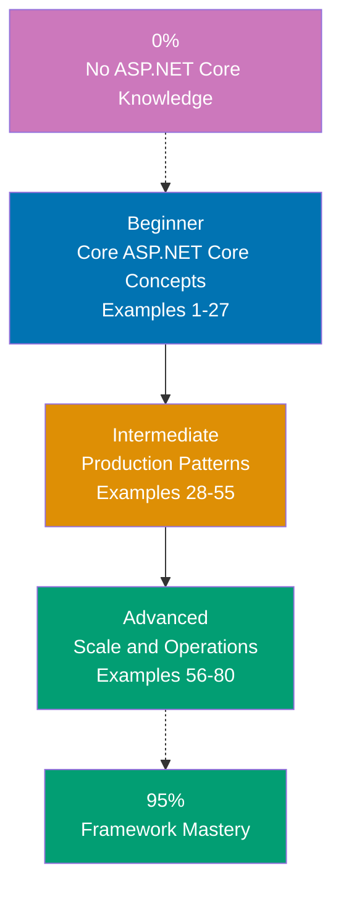

## Want to Master ASP.NET Core Through Working Code?

This guide teaches you ASP.NET Core 8 through **80 production-ready code examples** rather than lengthy explanations. If you are an experienced developer switching to .NET, or want to deepen your framework mastery, you will build intuition through actual working patterns.

## What Is By-Example Learning?

By-example learning is a **code-first approach** where you learn concepts through annotated, working examples rather than narrative explanations. Each example shows:

1. **What the code does** - Brief explanation of the ASP.NET Core concept
2. **How it works** - A focused, heavily commented code example
3. **Why it matters** - A pattern summary highlighting the key takeaway

This approach works best when you already understand programming fundamentals. You learn ASP.NET Core's idioms, patterns, and best practices by studying real code rather than theoretical descriptions.

## What Is ASP.NET Core?

ASP.NET Core is a **cross-platform, high-performance web framework for .NET** that prioritizes developer productivity and application reliability. Key distinctions:

- **Not legacy ASP.NET**: ASP.NET Core is a complete rewrite - lightweight, modular, and cross-platform
- **Minimal APIs first**: .NET 6+ introduced a concise, function-based API model without ceremony
- **Unified pipeline**: A single middleware pipeline handles HTTP, WebSockets, and gRPC
- **Dependency injection built-in**: First-class DI container is central to the framework design
- **Cloud-native**: Designed for containers, microservices, and cloud deployment from day one
- **High performance**: Consistently ranks at the top of TechEmpower benchmarks

## Learning Path



## Coverage Philosophy: 95% Through 80 Examples

The **95% coverage** means you will understand ASP.NET Core deeply enough to build production systems with confidence. It does not mean you will know every edge case or advanced feature - those come with experience.

The 80 examples are organized progressively:

- **Beginner (Examples 1-27)**: Foundation concepts (minimal APIs, routing, path and query params, JSON, model binding, validation, middleware, error handling, logging, configuration, DI basics)
- **Intermediate (Examples 28-55)**: Production patterns (controllers, filters, JWT and cookie auth, authorization policies, EF Core, file upload, CORS, WebSockets, SignalR, testing, health checks, background services, caching, rate limiting)
- **Advanced (Examples 56-80)**: Scale and operations (custom middleware, output caching, response compression, gRPC, OpenTelemetry, metrics, Kestrel, Docker, API versioning, OpenAPI, global error handling, custom DI)

Together, these examples cover **95% of what you will use** in production ASP.NET Core applications.

## What Is Covered

### Core Web Framework Concepts

- **Minimal APIs**: Route handlers, endpoint filters, route groups, typed results
- **Routing**: Pattern matching, constraints, HTTP verb mapping, route parameters
- **Request/Response**: Model binding, validation, content negotiation, status codes
- **Middleware Pipeline**: Built-in middleware, custom middleware, pipeline ordering

### Security

- **Authentication**: JWT bearer tokens, cookie authentication, API keys
- **Authorization**: Policy-based, role-based, resource-based authorization
- **Data Protection**: Token generation, cookie encryption, HTTPS enforcement

### Data Access

- **EF Core Basics**: DbContext, migrations, CRUD operations, LINQ queries
- **Advanced EF Core**: Relationships, transactions, raw SQL, connection resiliency
- **Caching**: In-memory cache, distributed cache (Redis), response caching

### Real-Time and Communication

- **WebSockets**: Raw WebSocket handling
- **SignalR**: Hubs, typed clients, groups, connection management
- **gRPC**: Service definition, server streaming, client streaming

### Testing and Quality

- **Integration Testing**: WebApplicationFactory, HTTP client testing
- **Unit Testing**: Service isolation, mocking dependencies
- **Health Checks**: Built-in checks, custom health indicators, readiness/liveness probes

### Production and Operations

- **Deployment**: Docker containerization, environment configuration, Kestrel tuning
- **Observability**: OpenTelemetry tracing, metrics, structured logging with Serilog
- **Performance**: Output caching, response compression, rate limiting
- **API Design**: Versioning, OpenAPI/Swagger, problem details

## What Is NOT Covered

We exclude topics that belong in specialized tutorials:

- **Detailed C# syntax**: Master C# first through language tutorials
- **Blazor**: Server-side and WASM rendering (separate tutorial path)
- **Razor Pages / MVC Views**: HTML templating with cshtml (API-focused guide)
- **Advanced DevOps**: Kubernetes, Helm charts, complex CI/CD pipelines
- **Database internals**: Deep SQL Server or PostgreSQL optimization
- **Framework internals**: How Kestrel processes connections, thread pool details

For these topics, see dedicated tutorials and framework documentation.

## How to Use This Guide

### 1. Choose Your Starting Point

- **New to ASP.NET Core?** Start with Beginner (Example 1)
- **Framework experience** (Spring, Django, Rails)? Start with Intermediate (Example 28)
- **Building a specific feature?** Search for relevant example topics

### 2. Read the Example

Each example has five parts:

- **Brief explanation** (2-3 sentences): What concept, why it exists, when to use it
- **Optional diagram**: Mermaid diagram for complex flow or architecture
- **Code** (with heavy comments): Working C# code showing the pattern
- **Key Takeaway** (1-2 sentences): Distilled essence of the pattern
- **Why It Matters** (50-100 words): Production relevance and real-world impact

### 3. Run the Code

Create a test project and run each example:

```bash
dotnet new web -n MyApp
cd MyApp
# Paste example code into Program.cs
dotnet run
```

### 4. Modify and Experiment

Change variable names, add features, break things on purpose. Experiment builds intuition faster than reading.

### 5. Reference as Needed

Use this guide as a reference when building features. Search for relevant examples and adapt patterns to your code.

## Relationship to Other Tutorial Types

| Tutorial Type               | Approach                       | Coverage          | Best For                       |
| --------------------------- | ------------------------------ | ----------------- | ------------------------------ |
| **By Example** (this guide) | Code-first, 80 examples        | 90% breadth       | Learning framework idioms      |
| **Quick Start**             | Project-based, hands-on        | 5-30% touchpoints | Getting something working fast |
| **By Concept**              | Narrative, explanation-first   | 0-95% progressive | Understanding concepts deeply  |
| **Cookbook**                | Recipe-based, problem-solution | Problem-specific  | Solving specific problems      |

## Prerequisites

### Required

- **C# fundamentals**: Basic syntax, classes, interfaces, async/await, LINQ
- **Web development**: HTTP basics, REST principles, JSON
- **Programming experience**: You have built applications before in another language

### Recommended

- **.NET toolchain**: dotnet CLI, understanding of projects and solutions
- **Relational databases**: SQL basics, schema design
- **Git**: Version control for managing code

### Not Required

- **ASP.NET Core experience**: This guide assumes you are new to the framework
- **C# expertise**: We assume intermediate C# knowledge
- **Azure/cloud experience**: Not necessary, though helpful

## Learning Strategies

### For Java Spring Developers Switching to ASP.NET Core

You know Spring but are new to .NET. Focus on mental model mapping:

- **Map annotations to attributes**: Spring's `@GetMapping` becomes `[HttpGet]`; `@RestController` maps to minimal API handlers or `[ApiController]` classes
- **DI is built-in**: ASP.NET Core's DI works similarly to Spring but without annotation scanning; see Examples 17-18
- **Middleware vs filters**: ASP.NET Core middleware is similar to Spring's servlet filters; see Examples 10-14
- **EF Core vs JPA/Hibernate**: Code-first migrations and LINQ vs schema-first and JPQL; see Examples 28-35
- **Recommended path**: Examples 1-10 (Core minimal APIs) → Examples 28-38 (EF Core) → Examples 39-45 (Auth)

### For Python Django/FastAPI Developers Switching to ASP.NET Core

Phoenix's typed approach differs significantly from Python's dynamic typing:

- **Strong typing everywhere**: C#'s type system catches errors at compile time that Python finds at runtime; embrace record types and generics
- **async/await patterns**: C# async is syntactically similar to Python but semantically different (no GIL); see Examples 15-16
- **DI container**: Similar to FastAPI's `Depends()` system but more explicit; see Examples 17-18
- **EF Core vs Django ORM**: Different migration and query patterns; EF Core is code-first by default
- **Recommended path**: Examples 1-12 (HTTP basics) → Examples 17-20 (DI and configuration) → Examples 28-38 (EF Core)

### For Node.js/Express Developers Switching to ASP.NET Core

The middleware model is familiar, but C# types change everything:

- **Middleware pipeline is similar**: ASP.NET Core middleware chains like Express middleware; ordering matters the same way
- **Typed route handlers**: Route parameters require explicit types vs JavaScript's dynamic params object
- **Dependency injection**: More structured than Node.js patterns; no module-level singletons
- **Recommended path**: Examples 1-15 (Minimal APIs and middleware) → Examples 39-45 (JWT auth) → Examples 56-65 (Advanced patterns)

### For Complete Framework Beginners

You know C# but are new to web development:

- **Learn HTTP first**: Understand request-response, status codes, and headers before diving into the framework
- **Follow sequential order**: Read Examples 1-80 in order; each builds on previous concepts
- **Run every example**: Create a test project and verify each example works as shown
- **Build small projects**: After Beginner, build a simple CRUD API to consolidate learning
- **Recommended path**: Examples 1-27 (Beginner) → Build a CRUD API → Examples 28-55 (Intermediate) → Add auth and database → Examples 56-80 (Advanced)

## Structure of Each Example

All examples follow a consistent 5-part format:

````
### Example N: Descriptive Title

2-3 sentence explanation of the concept.

[Optional Mermaid diagram]

```csharp
// Heavily annotated code example
// showing the ASP.NET Core pattern in action
````

**Key Takeaway**: 1-2 sentence summary.

**Why It Matters**: 50-100 words on production relevance.

```

**Code annotations**:

- `// =>` shows expected output or result values
- Inline comments explain what each line does and why
- Variable names are self-documenting

**Mermaid diagrams** appear when visualizing flow or architecture improves understanding. The color-blind friendly palette used throughout:

- Blue #0173B2 - Primary elements
- Orange #DE8F05 - Decisions, warnings
- Teal #029E73 - Success, validation
- Purple #CC78BC - Special states
- Brown #CA9161 - Neutral elements

## Ready to Start?

Choose your learning path:

- **[Beginner](/en/learn/software-engineering/platform-web/tools/csharp-aspnetcore/by-example/beginner)** - Start here if new to ASP.NET Core. Build foundation understanding through 27 core examples.
- **[Intermediate](/en/learn/software-engineering/platform-web/tools/csharp-aspnetcore/by-example/intermediate)** - Jump here if you know the basics. Master production patterns through 28 examples.
- **[Advanced](/en/learn/software-engineering/platform-web/tools/csharp-aspnetcore/by-example/advanced)** - Expert mastery through 25 advanced examples covering scale, performance, and operations.

Or jump to specific topics by searching for relevant example keywords (routing, authentication, EF Core, testing, deployment, gRPC, SignalR, etc.).
```

## Examples by Level

### Beginner (Examples 1–27)

- [Example 1: Hello World Minimal API](/en/learn/software-engineering/platform-web/tools/csharp-aspnetcore/by-example/beginner#example-1-hello-world-minimal-api)
- [Example 2: Multiple HTTP Verb Handlers](/en/learn/software-engineering/platform-web/tools/csharp-aspnetcore/by-example/beginner#example-2-multiple-http-verb-handlers)
- [Example 3: Path Parameters](/en/learn/software-engineering/platform-web/tools/csharp-aspnetcore/by-example/beginner#example-3-path-parameters)
- [Example 4: Query String Parameters](/en/learn/software-engineering/platform-web/tools/csharp-aspnetcore/by-example/beginner#example-4-query-string-parameters)
- [Example 5: JSON Request Body Deserialization](/en/learn/software-engineering/platform-web/tools/csharp-aspnetcore/by-example/beginner#example-5-json-request-body-deserialization)
- [Example 6: JSON Response Serialization](/en/learn/software-engineering/platform-web/tools/csharp-aspnetcore/by-example/beginner#example-6-json-response-serialization)
- [Example 7: Typed Results and Status Codes](/en/learn/software-engineering/platform-web/tools/csharp-aspnetcore/by-example/beginner#example-7-typed-results-and-status-codes)
- [Example 8: Route Constraints and Patterns](/en/learn/software-engineering/platform-web/tools/csharp-aspnetcore/by-example/beginner#example-8-route-constraints-and-patterns)
- [Example 9: Model Binding from Multiple Sources](/en/learn/software-engineering/platform-web/tools/csharp-aspnetcore/by-example/beginner#example-9-model-binding-from-multiple-sources)
- [Example 10: Header and Cookie Binding](/en/learn/software-engineering/platform-web/tools/csharp-aspnetcore/by-example/beginner#example-10-header-and-cookie-binding)
- [Example 11: Built-in Middleware](/en/learn/software-engineering/platform-web/tools/csharp-aspnetcore/by-example/beginner#example-11-built-in-middleware)
- [Example 12: Custom Middleware with RequestDelegate](/en/learn/software-engineering/platform-web/tools/csharp-aspnetcore/by-example/beginner#example-12-custom-middleware-with-requestdelegate)
- [Example 13: Static Files Configuration](/en/learn/software-engineering/platform-web/tools/csharp-aspnetcore/by-example/beginner#example-13-static-files-configuration)
- [Example 14: Exception Handling Middleware](/en/learn/software-engineering/platform-web/tools/csharp-aspnetcore/by-example/beginner#example-14-exception-handling-middleware)
- [Example 15: Built-in Logging with ILogger](/en/learn/software-engineering/platform-web/tools/csharp-aspnetcore/by-example/beginner#example-15-built-in-logging-with-ilogger)
- [Example 16: Problem Details for API Error Responses](/en/learn/software-engineering/platform-web/tools/csharp-aspnetcore/by-example/beginner#example-16-problem-details-for-api-error-responses)
- [Example 17: Configuration System](/en/learn/software-engineering/platform-web/tools/csharp-aspnetcore/by-example/beginner#example-17-configuration-system)
- [Example 18: Strongly Typed Options Pattern](/en/learn/software-engineering/platform-web/tools/csharp-aspnetcore/by-example/beginner#example-18-strongly-typed-options-pattern)
- [Example 19: Environment-Based Configuration](/en/learn/software-engineering/platform-web/tools/csharp-aspnetcore/by-example/beginner#example-19-environment-based-configuration)
- [Example 20: Service Registration and Injection](/en/learn/software-engineering/platform-web/tools/csharp-aspnetcore/by-example/beginner#example-20-service-registration-and-injection)
- [Example 21: Service Lifetimes in Practice](/en/learn/software-engineering/platform-web/tools/csharp-aspnetcore/by-example/beginner#example-21-service-lifetimes-in-practice)
- [Example 22: Registering Framework Services](/en/learn/software-engineering/platform-web/tools/csharp-aspnetcore/by-example/beginner#example-22-registering-framework-services)
- [Example 23: Content Negotiation](/en/learn/software-engineering/platform-web/tools/csharp-aspnetcore/by-example/beginner#example-23-content-negotiation)
- [Example 24: Streaming Responses](/en/learn/software-engineering/platform-web/tools/csharp-aspnetcore/by-example/beginner#example-24-streaming-responses)
- [Example 25: File Responses](/en/learn/software-engineering/platform-web/tools/csharp-aspnetcore/by-example/beginner#example-25-file-responses)
- [Example 26: Data Annotation Validation](/en/learn/software-engineering/platform-web/tools/csharp-aspnetcore/by-example/beginner#example-26-data-annotation-validation)
- [Example 27: FluentValidation Integration](/en/learn/software-engineering/platform-web/tools/csharp-aspnetcore/by-example/beginner#example-27-fluentvalidation-integration)

### Intermediate (Examples 28–55)

- [Example 28: API Controller Basics](/en/learn/software-engineering/platform-web/tools/csharp-aspnetcore/by-example/intermediate#example-28-api-controller-basics)
- [Example 29: Action Filters](/en/learn/software-engineering/platform-web/tools/csharp-aspnetcore/by-example/intermediate#example-29-action-filters)
- [Example 30: Result Filters and Exception Filters](/en/learn/software-engineering/platform-web/tools/csharp-aspnetcore/by-example/intermediate#example-30-result-filters-and-exception-filters)
- [Example 31: JWT Bearer Authentication](/en/learn/software-engineering/platform-web/tools/csharp-aspnetcore/by-example/intermediate#example-31-jwt-bearer-authentication)
- [Example 32: Cookie Authentication](/en/learn/software-engineering/platform-web/tools/csharp-aspnetcore/by-example/intermediate#example-32-cookie-authentication)
- [Example 33: Policy-Based Authorization](/en/learn/software-engineering/platform-web/tools/csharp-aspnetcore/by-example/intermediate#example-33-policy-based-authorization)
- [Example 34: EF Core DbContext Setup](/en/learn/software-engineering/platform-web/tools/csharp-aspnetcore/by-example/intermediate#example-34-ef-core-dbcontext-setup)
- [Example 35: EF Core CRUD Operations](/en/learn/software-engineering/platform-web/tools/csharp-aspnetcore/by-example/intermediate#example-35-ef-core-crud-operations)
- [Example 36: EF Core Queries and Relationships](/en/learn/software-engineering/platform-web/tools/csharp-aspnetcore/by-example/intermediate#example-36-ef-core-queries-and-relationships)
- [Example 37: File Upload Handling](/en/learn/software-engineering/platform-web/tools/csharp-aspnetcore/by-example/intermediate#example-37-file-upload-handling)
- [Example 38: CORS Configuration](/en/learn/software-engineering/platform-web/tools/csharp-aspnetcore/by-example/intermediate#example-38-cors-configuration)
- [Example 39: WebSocket Handling](/en/learn/software-engineering/platform-web/tools/csharp-aspnetcore/by-example/intermediate#example-39-websocket-handling)
- [Example 40: SignalR Hubs](/en/learn/software-engineering/platform-web/tools/csharp-aspnetcore/by-example/intermediate#example-40-signalr-hubs)
- [Example 41: Integration Testing with WebApplicationFactory](/en/learn/software-engineering/platform-web/tools/csharp-aspnetcore/by-example/intermediate#example-41-integration-testing-with-webapplicationfactory)
- [Example 42: Testing Authentication in Integration Tests](/en/learn/software-engineering/platform-web/tools/csharp-aspnetcore/by-example/intermediate#example-42-testing-authentication-in-integration-tests)
- [Example 43: Health Check Endpoints](/en/learn/software-engineering/platform-web/tools/csharp-aspnetcore/by-example/intermediate#example-43-health-check-endpoints)
- [Example 44: Background Services with IHostedService](/en/learn/software-engineering/platform-web/tools/csharp-aspnetcore/by-example/intermediate#example-44-background-services-with-ihostedservice)
- [Example 45: In-Memory Caching](/en/learn/software-engineering/platform-web/tools/csharp-aspnetcore/by-example/intermediate#example-45-in-memory-caching)
- [Example 46: Distributed Cache with Redis](/en/learn/software-engineering/platform-web/tools/csharp-aspnetcore/by-example/intermediate#example-46-distributed-cache-with-redis)
- [Example 47: Built-in Rate Limiting](/en/learn/software-engineering/platform-web/tools/csharp-aspnetcore/by-example/intermediate#example-47-built-in-rate-limiting)
- [Example 48: Per-Client Rate Limiting](/en/learn/software-engineering/platform-web/tools/csharp-aspnetcore/by-example/intermediate#example-48-per-client-rate-limiting)
- [Example 49: Model Binders and Value Providers](/en/learn/software-engineering/platform-web/tools/csharp-aspnetcore/by-example/intermediate#example-49-model-binders-and-value-providers)
- [Example 50: Output Formatters](/en/learn/software-engineering/platform-web/tools/csharp-aspnetcore/by-example/intermediate#example-50-output-formatters)
- [Example 51: Refresh Token Pattern](/en/learn/software-engineering/platform-web/tools/csharp-aspnetcore/by-example/intermediate#example-51-refresh-token-pattern)
- [Example 52: API Key Authentication](/en/learn/software-engineering/platform-web/tools/csharp-aspnetcore/by-example/intermediate#example-52-api-key-authentication)
- [Example 53: Testing with Test Containers](/en/learn/software-engineering/platform-web/tools/csharp-aspnetcore/by-example/intermediate#example-53-testing-with-test-containers)
- [Example 54: Minimal API Groups for Organization](/en/learn/software-engineering/platform-web/tools/csharp-aspnetcore/by-example/intermediate#example-54-minimal-api-groups-for-organization)
- [Example 55: OpenAPI Documentation with Swagger](/en/learn/software-engineering/platform-web/tools/csharp-aspnetcore/by-example/intermediate#example-55-openapi-documentation-with-swagger)

### Advanced (Examples 56–80)

- [Example 56: Custom Middleware Class](/en/learn/software-engineering/platform-web/tools/csharp-aspnetcore/by-example/advanced#example-56-custom-middleware-class)
- [Example 57: Exception Handling Middleware Pattern](/en/learn/software-engineering/platform-web/tools/csharp-aspnetcore/by-example/advanced#example-57-exception-handling-middleware-pattern)
- [Example 58: Output Caching](/en/learn/software-engineering/platform-web/tools/csharp-aspnetcore/by-example/advanced#example-58-output-caching)
- [Example 59: Response Compression](/en/learn/software-engineering/platform-web/tools/csharp-aspnetcore/by-example/advanced#example-59-response-compression)
- [Example 60: gRPC Service Definition](/en/learn/software-engineering/platform-web/tools/csharp-aspnetcore/by-example/advanced#example-60-grpc-service-definition)
- [Example 61: OpenTelemetry Tracing](/en/learn/software-engineering/platform-web/tools/csharp-aspnetcore/by-example/advanced#example-61-opentelemetry-tracing)
- [Example 62: Custom Metrics with System.Diagnostics.Metrics](/en/learn/software-engineering/platform-web/tools/csharp-aspnetcore/by-example/advanced#example-62-custom-metrics-with-systemdiagnosticsmetrics)
- [Example 63: Kestrel Server Configuration](/en/learn/software-engineering/platform-web/tools/csharp-aspnetcore/by-example/advanced#example-63-kestrel-server-configuration)
- [Example 64: Docker Containerization](/en/learn/software-engineering/platform-web/tools/csharp-aspnetcore/by-example/advanced#example-64-docker-containerization)
- [Example 65: API Versioning](/en/learn/software-engineering/platform-web/tools/csharp-aspnetcore/by-example/advanced#example-65-api-versioning)
- [Example 66: Global Error Handling with IProblemDetailsService](/en/learn/software-engineering/platform-web/tools/csharp-aspnetcore/by-example/advanced#example-66-global-error-handling-with-iproblemdetailsservice)
- [Example 67: Factory Pattern and Keyed Services](/en/learn/software-engineering/platform-web/tools/csharp-aspnetcore/by-example/advanced#example-67-factory-pattern-and-keyed-services)
- [Example 68: IDisposable Services and Resource Management](/en/learn/software-engineering/platform-web/tools/csharp-aspnetcore/by-example/advanced#example-68-idisposable-services-and-resource-management)
- [Example 69: Graceful Shutdown](/en/learn/software-engineering/platform-web/tools/csharp-aspnetcore/by-example/advanced#example-69-graceful-shutdown)
- [Example 70: Minimal API Endpoint Filters](/en/learn/software-engineering/platform-web/tools/csharp-aspnetcore/by-example/advanced#example-70-minimal-api-endpoint-filters)
- [Example 71: Minimal API Source Generation with Slim Builder](/en/learn/software-engineering/platform-web/tools/csharp-aspnetcore/by-example/advanced#example-71-minimal-api-source-generation-with-slim-builder)
- [Example 72: Hybrid Cache (Multi-Level Caching)](/en/learn/software-engineering/platform-web/tools/csharp-aspnetcore/by-example/advanced#example-72-hybrid-cache-multi-level-caching)
- [Example 73: Request Pipeline Diagnostics](/en/learn/software-engineering/platform-web/tools/csharp-aspnetcore/by-example/advanced#example-73-request-pipeline-diagnostics)
- [Example 74: Connection Resiliency with Polly](/en/learn/software-engineering/platform-web/tools/csharp-aspnetcore/by-example/advanced#example-74-connection-resiliency-with-polly)
- [Example 75: Structured Logging with Serilog](/en/learn/software-engineering/platform-web/tools/csharp-aspnetcore/by-example/advanced#example-75-structured-logging-with-serilog)
- [Example 76: Advanced Authorization with Resource-Based Authorization](/en/learn/software-engineering/platform-web/tools/csharp-aspnetcore/by-example/advanced#example-76-advanced-authorization-with-resource-based-authorization)
- [Example 77: Request Decompression](/en/learn/software-engineering/platform-web/tools/csharp-aspnetcore/by-example/advanced#example-77-request-decompression)
- [Example 78: Minimal API Route Handlers as Classes](/en/learn/software-engineering/platform-web/tools/csharp-aspnetcore/by-example/advanced#example-78-minimal-api-route-handlers-as-classes)
- [Example 79: SignalR with Typed Hubs](/en/learn/software-engineering/platform-web/tools/csharp-aspnetcore/by-example/advanced#example-79-signalr-with-typed-hubs)
- [Example 80: Application Startup Validation](/en/learn/software-engineering/platform-web/tools/csharp-aspnetcore/by-example/advanced#example-80-application-startup-validation)
