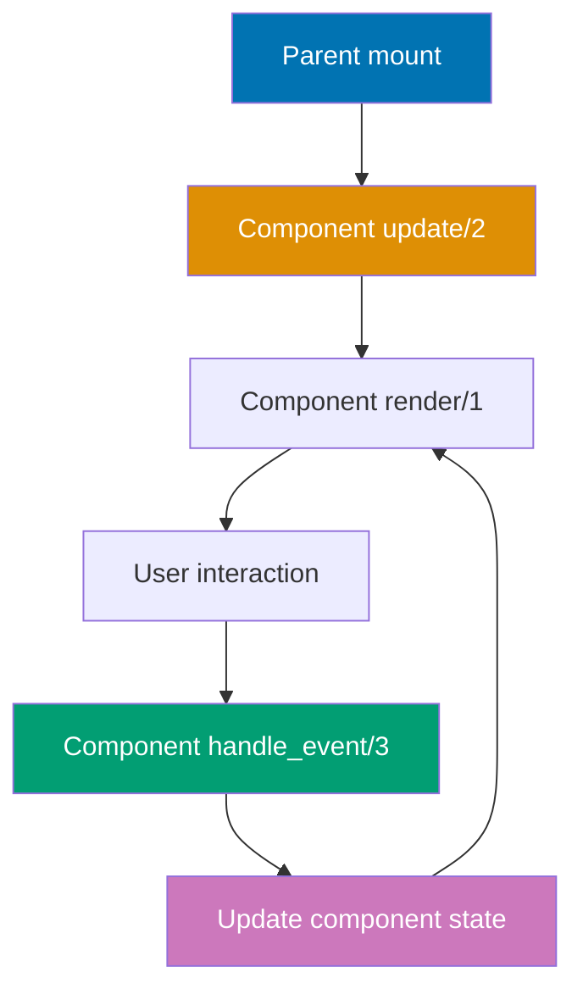
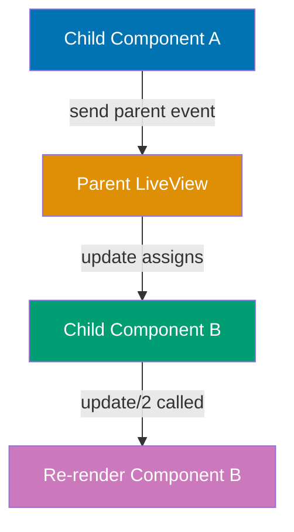
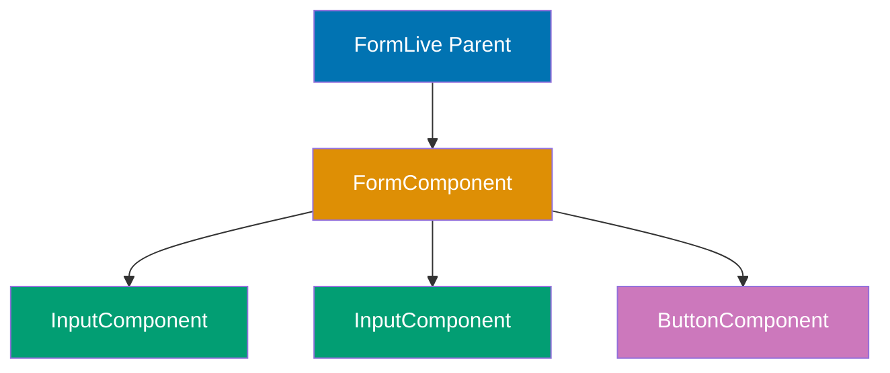

## Group 9: LiveComponents Advanced

### Example 61: Stateful LiveComponent with Own State

LiveComponents can maintain their own state independent of parent LiveView, enabling reusable interactive widgets.



**Component module**:

```elixir
defmodule MyAppWeb.CounterComponent do               # => Defines stateful LiveComponent
                                                      # => Maintains own counter state
  use MyAppWeb, :live_component                       # => Imports LiveComponent behavior
                                                      # => Adds component lifecycle callbacks

  # Update callback - initializes component state
  def update(assigns, socket) do                      # => Called on first render and parent updates
                                                      # => assigns: %{id: "counter-1", label: "Clicks"}
    socket = socket                                   # => Start with current socket
             |> assign(assigns)                       # => Merge parent assigns into component
                                                      # => socket.assigns.id = "counter-1"
                                                      # => socket.assigns.label = "Clicks"
             |> assign_new(:count, fn -> 0 end)       # => Initialize count to 0 if not set
                                                      # => assign_new only sets if key missing
                                                      # => socket.assigns.count = 0

    {:ok, socket}                                     # => Component ready to render
                                                      # => State is %{id: ..., label: ..., count: 0}
  end

  # Component event handler - updates component state only
  def handle_event("increment", _params, socket) do   # => Handles phx-click="increment" within component
                                                      # => Event scoped to this component instance
    socket = update(socket, :count, &(&1 + 1))        # => Increments count assign
                                                      # => E.g., count: 0 -> 1
    {:noreply, socket}                                # => Re-renders component only
                                                      # => Parent LiveView NOT re-rendered
  end

  # Component template
  def render(assigns) do                              # => Renders component UI
    ~H"""
    <div class="counter">
      <p><%= @label %>: <%= @count %></p>
      <button phx-click="increment" phx-target={@myself}>
        <%!-- phx-target={@myself} scopes event to this component --%>
        <%!-- Without @myself, event goes to parent LiveView --%>
        Increment
      </button>
    </div>
    """
    # => Renders button with component-scoped event
    # => @myself is component reference for event targeting
  end
end
```

**Parent LiveView usage**:

```elixir
defmodule MyAppWeb.DashboardLive do                   # => Parent LiveView
  use MyAppWeb, :live_view

  def render(assigns) do
    ~H"""
    <div>
      <h2>Multiple Independent Counters</h2>
      <.live_component module={MyAppWeb.CounterComponent} id="counter-1" label="Counter A" />
      <%!-- Renders first component instance --%>
      <%!-- id="counter-1" required for stateful components --%>
      <%!-- Component maintains own count state --%>

      <.live_component module={MyAppWeb.CounterComponent} id="counter-2" label="Counter B" />
      <%!-- Second independent instance --%>
      <%!-- Separate state from counter-1 --%>
      <%!-- Each component has own count value --%>
    </div>
    """
    # => Renders two counters with independent states
    # => Incrementing Counter A doesn't affect Counter B
  end
end
```

**Key Takeaway**: Stateful LiveComponents maintain independent state using update/2 and handle_event/3. Use `phx-target={@myself}` to scope events to component. Multiple instances have separate state.

### Example 62: LiveComponent Lifecycle - update/2 Flow

Understanding update/2 lifecycle prevents bugs when parent assigns change.

```elixir
defmodule MyAppWeb.UserCardComponent do               # => Component displaying user info
  use MyAppWeb, :live_component

  # Update called EVERY time parent re-renders
  def update(assigns, socket) do                      # => Called on mount AND parent updates
                                                      # => Must handle both scenarios
    # Scenario 1: First mount - assigns has %{id, user_id}
    # Scenario 2: Parent update - assigns has changed values

    socket = socket                                   # => Start with current socket
             |> assign(assigns)                       # => Merge new assigns from parent
                                                      # => Overwrites existing values

    socket = maybe_load_user(socket)                  # => Conditionally load user data
                                                      # => Only fetch if user_id changed

    {:ok, socket}                                     # => Component updated
  end

  defp maybe_load_user(socket) do                     # => Private function: load user if needed
    user_id = socket.assigns.user_id                  # => Get user_id from assigns
    current_user = Map.get(socket.assigns, :user)     # => Get current user (may be nil)

    # Check if user already loaded for this user_id
    if current_user && current_user.id == user_id do  # => User already loaded and matches
      socket                                          # => No reload needed
                                                      # => Prevents redundant database queries
    else                                              # => User not loaded or user_id changed
      user = Accounts.get_user!(user_id)              # => Fetch user from database
                                                      # => E.g., %User{id: 123, name: "Alice"}
      assign(socket, :user, user)                     # => Store user in component state
                                                      # => socket.assigns.user = %User{...}
    end
  end

  def render(assigns) do
    ~H"""
    <div class="user-card">
      <h3><%= @user.name %></h3>
      <p><%= @user.email %></p>
    </div>
    """
    # => Renders user info from component state
  end
end
```

**Key Takeaway**: update/2 runs on mount AND parent updates. Avoid redundant work by checking if assigns actually changed. Use pattern matching or conditionals to handle different scenarios.

### Example 63: Component-to-Component Communication via Parent

Components communicate by sending messages to parent LiveView, which updates child assigns.



**Selector component**:

```elixir
defmodule MyAppWeb.ColorSelectorComponent do          # => Component for color selection
  use MyAppWeb, :live_component

  def handle_event("select_color", %{"color" => color}, socket) do
                                                      # => User clicks color button
                                                      # => color: "red"
    send(self(), {:color_selected, color})            # => Sends message to parent LiveView
                                                      # => self() is parent process PID
                                                      # => Parent receives {:color_selected, "red"}
    {:noreply, socket}                                # => Component event handled
  end

  def render(assigns) do
    ~H"""
    <div class="color-selector">
      <button phx-click="select_color" phx-value-color="red" phx-target={@myself}>Red</button>
      <button phx-click="select_color" phx-value-color="blue" phx-target={@myself}>Blue</button>
      <%!-- phx-value-color passes parameter to event handler --%>
      <%!-- phx-target={@myself} routes event to component --%>
    </div>
    """
  end
end
```

**Display component**:

```elixir
defmodule MyAppWeb.ColorDisplayComponent do           # => Component displaying selected color
  use MyAppWeb, :live_component

  def update(assigns, socket) do                      # => Receives color from parent
    socket = assign(socket, assigns)                  # => Merge parent assigns
                                                      # => socket.assigns.color = "red"
    {:ok, socket}
  end

  def render(assigns) do
    ~H"""
    <div class="color-display" style={"background-color: #{@color};"}>
      <p>Selected: <%= @color %></p>
    </div>
    """
    # => Renders with background color from parent assign
  end
end
```

**Parent LiveView**:

```elixir
defmodule MyAppWeb.ColorPickerLive do                 # => Parent coordinating components
  use MyAppWeb, :live_view

  def mount(_params, _session, socket) do
    socket = assign(socket, :selected_color, "gray")  # => Initial color state
    {:ok, socket}
  end

  # Handle message from ColorSelectorComponent
  def handle_info({:color_selected, color}, socket) do  # => Receives component message
                                                        # => color: "red"
    socket = assign(socket, :selected_color, color)   # => Updates parent state
                                                      # => socket.assigns.selected_color = "red"
    {:noreply, socket}                                # => Re-renders parent and children
                                                      # => ColorDisplayComponent.update/2 called with new color
  end

  def render(assigns) do
    ~H"""
    <div>
      <.live_component module={MyAppWeb.ColorSelectorComponent} id="selector" />
      <.live_component module={MyAppWeb.ColorDisplayComponent} id="display" color={@selected_color} />
      <%!-- Pass selected_color to display component --%>
      <%!-- When parent re-renders, display gets new color --%>
    </div>
    """
  end
end
```

**Key Takeaway**: Components communicate via parent using `send(self(), message)`. Parent handles message with handle_info/2, updates state, and passes new assigns to other components. Parent orchestrates component interactions.

### Example 64: send_update for External Component Updates

Update component state from parent or other processes without parent re-render using send_update/3.

```elixir
defmodule MyAppWeb.NotificationComponent do           # => Component displaying notifications
  use MyAppWeb, :live_component

  def update(assigns, socket) do
    socket = socket
             |> assign(assigns)
             |> assign_new(:message, fn -> nil end)   # => Initialize message to nil if missing
    {:ok, socket}
  end

  def render(assigns) do
    ~H"""
    <div :if={@message} class="notification">
      <%= @message %>
    </div>
    """
    # => Shows notification if message present
    # => :if={@message} conditionally renders div
  end
end
```

**Parent LiveView**:

```elixir
defmodule MyAppWeb.DashboardLive do                   # => Parent with notification component
  use MyAppWeb, :live_view

  def mount(_params, _session, socket) do
    {:ok, socket}                                     # => No notification state in parent
                                                      # => Component manages own message
  end

  # Event triggers notification update
  def handle_event("save", _params, socket) do        # => User clicks save button
    # Perform save operation
    Accounts.save_user_settings()                     # => Save to database

    # Update component directly without re-rendering parent
    send_update(MyAppWeb.NotificationComponent,       # => Sends update to component
      id: "notification",                             # => Target component by ID
      message: "Settings saved successfully!"         # => New message assign
    )
    # => Component.update/2 called with new message
    # => Only component re-renders, parent unchanged

    {:noreply, socket}                                # => Parent state unchanged
                                                      # => No parent re-render
  end

  def render(assigns) do
    ~H"""
    <div>
      <.live_component module={MyAppWeb.NotificationComponent} id="notification" />
      <button phx-click="save">Save Settings</button>
    </div>
    """
  end
end
```

**External process update**:

```elixir
# From background job or GenServer
def notify_user(live_view_pid, message) do            # => External process notifying user
                                                      # => live_view_pid: PID of parent LiveView
  send_update(live_view_pid, MyAppWeb.NotificationComponent,
                                                      # => Send update to component in specific LiveView
    id: "notification",                               # => Component ID
    message: message                                  # => Notification message
  )
  # => Component updates even from external process
  # => No parent involvement required
end
```

**Key Takeaway**: send_update/3 updates component state directly without parent re-render. Useful for notifications, progress indicators, or external process updates. Component must have stable ID.

### Example 65: LiveComponent Events with Payload

Pass data to component events using phx-value-\* attributes for dynamic interactions.

```elixir
defmodule MyAppWeb.TodoItemComponent do               # => Component for single todo item
  use MyAppWeb, :live_component

  def update(assigns, socket) do
    socket = assign(socket, assigns)                  # => assigns: %{id, todo: %Todo{}}
    {:ok, socket}
  end

  def handle_event("toggle", _params, socket) do      # => Toggle todo completion
    todo = socket.assigns.todo                        # => Get todo from component state
    updated_todo = Todos.toggle(todo)                 # => Toggle completed field
                                                      # => E.g., completed: false -> true

    send(self(), {:todo_updated, updated_todo})       # => Notify parent of change
                                                      # => Parent refreshes todo list
    {:noreply, socket}
  end

  def handle_event("delete", _params, socket) do      # => Delete todo item
    todo = socket.assigns.todo
    send(self(), {:todo_deleted, todo.id})            # => Notify parent to remove todo
                                                      # => Parent filters list
    {:noreply, socket}
  end

  def render(assigns) do
    ~H"""
    <div class="todo-item">
      <input
        type="checkbox"
        checked={@todo.completed}
        phx-click="toggle"
        phx-target={@myself}
      />
      <%!-- Checkbox triggers component toggle event --%>
      <%!-- No phx-value-* needed, todo in component state --%>

      <span class={if @todo.completed, do: "completed"}>
        <%= @todo.title %>
      </span>

      <button phx-click="delete" phx-target={@myself}>Delete</button>
      <%!-- Delete button uses component state --%>
    </div>
    """
  end
end
```

**Component with external data**:

```elixir
defmodule MyAppWeb.ProductCardComponent do            # => Component with phx-value examples
  use MyAppWeb, :live_component

  def handle_event("add_to_cart", %{"product-id" => product_id, "quantity" => qty}, socket) do
                                                      # => Event params from phx-value-* attributes
                                                      # => product_id: "123" (string from HTML)
                                                      # => qty: "2" (string)
    product_id = String.to_integer(product_id)        # => Convert to integer
                                                      # => product_id = 123
    quantity = String.to_integer(qty)                 # => quantity = 2

    send(self(), {:add_to_cart, product_id, quantity})  # => Notify parent
    {:noreply, socket}
  end

  def render(assigns) do
    ~H"""
    <div class="product-card">
      <h3><%= @product.name %></h3>
      <p>$<%= @product.price %></p>

      <button
        phx-click="add_to_cart"
        phx-value-product-id={@product.id}
        phx-value-quantity="1"
        phx-target={@myself}
      >
        <%!-- phx-value-* passes data to event handler --%>
        <%!-- attribute names converted to snake_case in params --%>
        <%!-- phx-value-product-id becomes "product-id" key --%>
        Add to Cart
      </button>
    </div>
    """
  end
end
```

**Key Takeaway**: Use phx-value-\* to pass data to component events. Attributes become params map keys (kebab-case). Values are strings, convert as needed. Enables dynamic event handling.

### Example 66: Slots and Named Slots

Slots enable flexible component composition by passing content from parent into component template.

```elixir
defmodule MyAppWeb.CardComponent do                   # => Reusable card component with slots
  use MyAppWeb, :live_component

  def render(assigns) do
    ~H"""
    <div class="card">
      <div class="card-header">
        <%= render_slot(@header) %>
        <%!-- Renders content passed to header slot --%>
        <%!-- Parent provides header content --%>
      </div>

      <div class="card-body">
        <%= render_slot(@inner_block) %>
        <%!-- @inner_block is default slot for content between tags --%>
        <%!-- E.g., content between <.live_component>...</.live_component> --%>
      </div>

      <div :if={@footer != []} class="card-footer">
        <%!-- Conditionally render footer if slot provided --%>
        <%!-- @footer is list of slot entries, [] if not used --%>
        <%= render_slot(@footer) %>
      </div>
    </div>
    """
  end
end
```

**Parent usage**:

```elixir
defmodule MyAppWeb.ProfileLive do
  use MyAppWeb, :live_view

  def render(assigns) do
    ~H"""
    <.live_component module={MyAppWeb.CardComponent} id="user-card">
      <:header>
        <%!-- Named slot :header --%>
        <%!-- Content rendered in card-header div --%>
        <h2>User Profile</h2>
        <button>Edit</button>
      </:header>

      <%!-- Default slot content (inner_block) --%>
      <p>Name: <%= @user.name %></p>
      <p>Email: <%= @user.email %></p>

      <:footer>
        <%!-- Named slot :footer --%>
        <%!-- Content rendered in card-footer div --%>
        <small>Last updated: <%= @user.updated_at %></small>
      </:footer>
    </.live_component>
    """
  end
end
```

**Key Takeaway**: Named slots (`:header`, `:footer`) provide injection points for parent content. `@inner_block` is default slot. Check slot presence with `@slot_name != []`. Enables flexible component composition.

### Example 67: Render Slots with Slot Attributes

Slots can receive attributes from component for data-driven rendering.

```elixir
defmodule MyAppWeb.TableComponent do                  # => Generic table component
  use MyAppWeb, :live_component

  def update(assigns, socket) do
    socket = assign(socket, assigns)                  # => assigns: %{id, rows: [%{id, ...}]}
    {:ok, socket}
  end

  def render(assigns) do
    ~H"""
    <table>
      <thead>
        <tr>
          <%= render_slot(@header) %>
          <%!-- Parent provides header columns --%>
        </tr>
      </thead>
      <tbody>
        <%= for row <- @rows do %>
          <tr>
            <%= render_slot(@col, row) %>
            <%!-- Render :col slot for each row --%>
            <%!-- Pass row data as slot argument --%>
            <%!-- Parent receives row and renders cells --%>
          </tr>
        <% end %>
      </tbody>
    </table>
    """
  end
end
```

**Parent usage with slot arguments**:

```elixir
defmodule MyAppWeb.UsersLive do
  use MyAppWeb, :live_view

  def mount(_params, _session, socket) do
    users = [
      %{id: 1, name: "Alice", email: "alice@example.com"},
      %{id: 2, name: "Bob", email: "bob@example.com"}
    ]
    socket = assign(socket, :users, users)
    {:ok, socket}
  end

  def render(assigns) do
    ~H"""
    <.live_component module={MyAppWeb.TableComponent} id="users-table" rows={@users}>
      <:header>
        <%!-- Static header slot --%>
        <th>ID</th>
        <th>Name</th>
        <th>Email</th>
      </:header>

      <:col :let={user}>
        <%!-- :let={user} receives row argument from render_slot(@col, row) --%>
        <%!-- user is the row data passed from component --%>
        <td><%= user.id %></td>
        <td><%= user.name %></td>
        <td><%= user.email %></td>
        <%!-- Parent controls cell rendering using row data --%>
      </:col>
    </.live_component>
    """
  end
end
```

**Key Takeaway**: Slots can receive arguments using `render_slot(@slot_name, argument)`. Parent accesses argument with `:let={variable}`. Enables data-driven content rendering from component state.

### Example 68: Dynamic Components

Render different component modules dynamically based on runtime data.

```elixir
defmodule MyAppWeb.TextWidgetComponent do             # => Text display widget
  use MyAppWeb, :live_component

  def render(assigns) do
    ~H"""
    <div class="text-widget">
      <p><%= @content %></p>
    </div>
    """
  end
end

defmodule MyAppWeb.ImageWidgetComponent do            # => Image display widget
  use MyAppWeb, :live_component

  def render(assigns) do
    ~H"""
    <div class="image-widget">
      
    </div>
    """
  end
end

defmodule MyAppWeb.DashboardLive do                   # => Dashboard with dynamic widgets
  use MyAppWeb, :live_view

  def mount(_params, _session, socket) do
    widgets = [
      %{id: "widget-1", type: :text, content: "Welcome!"},
      %{id: "widget-2", type: :image, url: "/logo.png", alt: "Logo"},
      %{id: "widget-3", type: :text, content: "Latest updates"}
    ]
    socket = assign(socket, :widgets, widgets)        # => List of widget configs
    {:ok, socket}
  end

  defp widget_component(:text), do: MyAppWeb.TextWidgetComponent
                                                      # => Maps :text to TextWidgetComponent
  defp widget_component(:image), do: MyAppWeb.ImageWidgetComponent
                                                      # => Maps :image to ImageWidgetComponent

  def render(assigns) do
    ~H"""
    <div class="dashboard">
      <%= for widget <- @widgets do %>
        <.live_component
          module={widget_component(widget.type)}
          <%!-- Dynamically determine component module --%>
          <%!-- widget.type = :text -> TextWidgetComponent --%>
          <%!-- widget.type = :image -> ImageWidgetComponent --%>
          id={widget.id}
          {Map.drop(widget, [:id, :type])}
          <%!-- Spread remaining widget attributes as assigns --%>
          <%!-- E.g., %{content: "Welcome!"} for text widget --%>
        />
      <% end %>
    </div>
    """
  end
end
```

**Key Takeaway**: Use variables or functions returning component modules for dynamic rendering. Spread operator `{map}` passes map keys as assigns. Enables plugin-style architectures.

### Example 69: Component Composition Patterns

Compose complex UIs by nesting components and coordinating state.



**Input component** (presentational):

```elixir
defmodule MyAppWeb.InputComponent do                  # => Reusable form input
  use MyAppWeb, :live_component

  def render(assigns) do
    ~H"""
    <div class="form-field">
      <label for={@id}><%= @label %></label>
      <input
        type={@type}
        id={@id}
        name={@name}
        value={@value}
        phx-blur="validate_field"
        phx-value-field={@name}
        phx-target={@target}
        <%!-- @target points to parent form component --%>
      />
      <span :if={@error} class="error"><%= @error %></span>
    </div>
    """
  end
end
```

**Form component** (stateful container):

```elixir
defmodule MyAppWeb.UserFormComponent do               # => Manages form state and validation
  use MyAppWeb, :live_component

  def update(assigns, socket) do
    changeset = Accounts.change_user(assigns.user)    # => Initialize changeset
    socket = socket
             |> assign(assigns)
             |> assign(:changeset, changeset)
    {:ok, socket}
  end

  def handle_event("validate_field", %{"field" => field}, socket) do
                                                      # => Field blur validation
    # Re-validate changeset
    changeset = Accounts.change_user(socket.assigns.user)
    socket = assign(socket, :changeset, changeset)
    {:noreply, socket}
  end

  def handle_event("save", %{"user" => user_params}, socket) do
    case Accounts.create_user(user_params) do
      {:ok, user} ->
        send(self(), {:user_created, user})           # => Notify parent on success
        {:noreply, socket}

      {:error, changeset} ->
        {:noreply, assign(socket, :changeset, changeset)}
    end
  end

  def render(assigns) do
    ~H"""
    <form phx-submit="save" phx-target={@myself}>
      <.live_component
        module={MyAppWeb.InputComponent}
        id="name-input"
        label="Name"
        type="text"
        name="user[name]"
        value={input_value(@changeset, :name)}
        error={error_message(@changeset, :name)}
        target={@myself}
        <%!-- Pass @myself so input events come to form component --%>
      />

      <.live_component
        module={MyAppWeb.InputComponent}
        id="email-input"
        label="Email"
        type="email"
        name="user[email]"
        value={input_value(@changeset, :email)}
        error={error_message(@changeset, :email)}
        target={@myself}
      />

      <button type="submit">Create User</button>
    </form>
    """
  end

  defp input_value(changeset, field), do: Ecto.Changeset.get_field(changeset, field)
  defp error_message(changeset, field) do
    case Keyword.get(changeset.errors, field) do
      {msg, _opts} -> msg
      nil -> nil
    end
  end
end
```

**Key Takeaway**: Compose components by nesting. Stateful components manage state and coordinate children. Presentational components receive data via assigns. Use `phx-target={@myself}` to route events to container.

### Example 70: Component Testing

Test LiveComponents in isolation or within parent LiveView context.

```elixir
defmodule MyAppWeb.CounterComponentTest do            # => Component test module
  use MyAppWeb.ConnCase, async: true                  # => Use ConnCase for LiveView testing
  import Phoenix.LiveViewTest                         # => Import test helpers

  # Test component in isolation
  test "increments counter on button click", %{conn: conn} do
    {:ok, view, _html} = live_isolated(conn, MyAppWeb.CounterComponent,
                                                      # => Renders component without parent
      session: %{"id" => "counter-test", "label" => "Test Counter"}
                                                      # => Provides required assigns via session
    )

    # Initial render
    assert render(view) =~ "Test Counter: 0"          # => Checks initial count display
                                                      # => HTML contains "Test Counter: 0"

    # Click increment button
    view                                              # => LiveView test process
    |> element("button", "Increment")                 # => Finds button with text "Increment"
    |> render_click()                                 # => Simulates click event
                                                      # => Triggers handle_event("increment", ...)

    # Verify updated state
    assert render(view) =~ "Test Counter: 1"          # => Count incremented
                                                      # => Component re-rendered with new state
  end

  # Test component within parent LiveView
  test "components maintain independent state", %{conn: conn} do
    {:ok, view, _html} = live(conn, "/dashboard")    # => Renders parent LiveView
                                                      # => Parent contains multiple CounterComponents

    # Find specific component
    counter1 = view                                   # => LiveView test process
               |> element("#counter-1 button", "Increment")
                                                      # => Finds button in counter-1 component
    counter2 = view
               |> element("#counter-2 button", "Increment")
                                                      # => Finds button in counter-2 component

    # Increment counter-1 twice
    render_click(counter1)                            # => Click counter-1
    render_click(counter1)                            # => Click again

    # Increment counter-2 once
    render_click(counter2)                            # => Click counter-2

    # Verify independent states
    html = render(view)                               # => Get current HTML
    assert html =~ "Counter A: 2"                     # => counter-1 has count 2
    assert html =~ "Counter B: 1"                     # => counter-2 has count 1
                                                      # => Components maintained separate state
  end
end
```

**Key Takeaway**: Use `live_isolated/3` to test components without parent. Use `live/2` to test components in parent context. Use `element/3` with CSS selectors to target specific components.

## Group 10: JavaScript Interop

### Example 71: JS Commands - push and navigate

Execute client-side navigation and server pushes using Phoenix.LiveView.JS.

```elixir
defmodule MyAppWeb.NavLive do                         # => LiveView with JS commands
  use MyAppWeb, :live_view
  alias Phoenix.LiveView.JS                           # => Import JS module

  def render(assigns) do
    ~H"""
    <div>
      <button phx-click={JS.navigate("/users")}>
        <%!-- JS.navigate performs client-side navigation --%>
        <%!-- Changes URL without full page reload --%>
        <%!-- LiveView handles route transition --%>
        Go to Users
      </button>

      <button phx-click={JS.patch("/users?filter=active")}>
        <%!-- JS.patch updates URL params without re-mounting --%>
        <%!-- Triggers handle_params/3 in current LiveView --%>
        <%!-- No full LiveView re-mount --%>
        Show Active Users
      </button>

      <button
        phx-click={
          JS.push("delete_user")                      # => Server event name
          |> JS.hide(to: "#user-#{@user.id}")         # => Hide element immediately
          <%!-- to: CSS selector for target element --%>
          <%!-- Optimistic UI update before server response --%>
        }
      >
        <%!-- Chained JS commands execute in order --%>
        <%!-- push triggers server event --%>
        <%!-- hide provides immediate feedback --%>
        Delete User
      </button>

      <button
        phx-click={
          JS.toggle(to: "#details")                   # => Toggles element visibility
          <%!-- No server round-trip --%>
          <%!-- Pure client-side interaction --%>
        }
      >
        Toggle Details
      </button>
    </div>

    <div id="details" style="display: none;">
      <p>User details here...</p>
    </div>
    """
  end

  def handle_event("delete_user", _params, socket) do # => Server handles deletion
    # Delete user logic
    {:noreply, socket}
  end
end
```

**Available JS commands**:

```elixir
JS.navigate("/path")              # => Full LiveView navigation
JS.patch("/path")                 # => Update URL params, call handle_params/3
JS.push("event_name")             # => Trigger server event
JS.hide(to: "#selector")          # => Hide elements
JS.show(to: "#selector")          # => Show elements
JS.toggle(to: "#selector")        # => Toggle visibility
JS.add_class("active", to: "#el") # => Add CSS class
JS.remove_class("active")         # => Remove CSS class
JS.dispatch("click", to: "#btn")  # => Dispatch DOM event
```

**Key Takeaway**: JS commands enable client-side interactions without custom JavaScript. Chain commands with pipe operator for complex behaviors. Use for navigation, DOM manipulation, optimistic updates.

### Example 72: Client Hooks Basics

Hooks integrate custom JavaScript with LiveView lifecycle for client-side enhancements.

**JavaScript hook definition**:

```javascript
// app.js
let Hooks = {};

Hooks.LocalTime = {
  // => Hook name: LocalTime
  mounted() {
    // => Called when element added to DOM
    this.el; // => this.el is the DOM element
    this.handleEvent("update-time", ({ timestamp }) => {
      // => Server-triggered event
      const date = new Date(timestamp); // => Parse timestamp
      this.el.textContent = date.toLocaleString(); // => Update element content
    }); // => Register event handler

    setInterval(() => {
      // => Update every second
      this.pushEvent("get-current-time", {}); // => Request time from server
    }, 1000);
  },

  destroyed() {
    // => Called when element removed
    clearInterval(this.interval); // => Cleanup interval
  },
};

let liveSocket = new LiveSocket("/live", Socket, {
  params: { _csrf_token: csrfToken },
  hooks: Hooks, // => Register hooks
});
```

**LiveView with hook**:

```elixir
defmodule MyAppWeb.ClockLive do                       # => LiveView using hook
  use MyAppWeb, :live_view

  def mount(_params, _session, socket) do
    {:ok, socket}
  end

  def handle_event("get-current-time", _params, socket) do
                                                      # => Client requested current time
    {:reply, %{timestamp: DateTime.utc_now()}, socket}
                                                      # => Reply with current timestamp
                                                      # => Client handleEvent receives data
  end

  def render(assigns) do
    ~H"""
    <div>
      <p id="local-time" phx-hook="LocalTime">
        <%!-- phx-hook="LocalTime" attaches JavaScript hook --%>
        <%!-- Hook's mounted() called when rendered --%>
        Loading time...
      </p>
    </div>
    """
  end
end
```

**Key Takeaway**: Hooks bridge LiveView and client JavaScript. Use `phx-hook` attribute to attach hooks. Hooks have lifecycle callbacks: `mounted`, `updated`, `destroyed`. Use for client-side libraries, animations, local storage.

### Example 73: Hook Lifecycle - mounted, updated, destroyed

Understand hook lifecycle to manage client-side state and cleanup resources.

```javascript
// app.js
Hooks.Chart = {
  chart: null, // => Store chart instance

  mounted() {
    // => Element first rendered
    this.chart = initializeChart(this.el, this.el.dataset);
    // => Create chart with data attributes
    // => this.el.dataset contains phx-value-* data
    console.log("Chart mounted"); // => Log lifecycle event
  },

  updated() {
    // => Element re-rendered by server
    const newData = JSON.parse(this.el.dataset.data); // => Get updated data
    this.chart.updateData(newData); // => Update chart without re-creating
    console.log("Chart updated with new data");
  },

  destroyed() {
    // => Element removed from DOM
    if (this.chart) {
      this.chart.destroy(); // => Cleanup chart resources
      this.chart = null;
    }
    console.log("Chart destroyed");
  },
};
```

**LiveView usage**:

```elixir
defmodule MyAppWeb.AnalyticsLive do                   # => LiveView with chart
  use MyAppWeb, :live_view

  def mount(_params, _session, socket) do
    socket = assign(socket, :chart_data, initial_data())
    {:ok, socket}
  end

  def handle_event("refresh", _params, socket) do     # => Refresh chart data
    socket = assign(socket, :chart_data, fetch_data())
                                                      # => New data assigned
                                                      # => Triggers re-render
                                                      # => Hook.updated() called
    {:noreply, socket}
  end

  def render(assigns) do
    ~H"""
    <div>
      <div
        id="sales-chart"
        phx-hook="Chart"
        phx-value-data={Jason.encode!(@chart_data)}
        <%!-- phx-value-data becomes data-data HTML attribute --%>
        <%!-- Hook accesses via this.el.dataset.data --%>
      >
      </div>
      <button phx-click="refresh">Refresh Data</button>
    </div>
    """
  end

  defp initial_data, do: %{labels: ["Jan", "Feb"], values: [100, 150]}
  defp fetch_data, do: %{labels: ["Jan", "Feb", "Mar"], values: [100, 150, 200]}
end
```

**Key Takeaway**: Hook lifecycle mirrors element lifecycle. `mounted`: initialize. `updated`: refresh with new data. `destroyed`: cleanup. Access assigns via `this.el.dataset` from phx-value-\* attributes.

### Example 74: pushEvent from Client

Send events from client JavaScript to server LiveView using pushEvent.

```javascript
// app.js
Hooks.GeolocationTracker = {
  mounted() {
    // Get user's location
    navigator.geolocation.getCurrentPosition(
      (position) => {
        // => Success callback
        this.pushEvent("location-updated", {
          // => Send to server
          lat: position.coords.latitude, // => Latitude
          lng: position.coords.longitude, // => Longitude
        }); // => Server receives as params map
      },
      (error) => {
        // => Error callback
        this.pushEvent("location-error", {
          // => Send error to server
          message: error.message,
        });
      },
    );
  },
};
```

**LiveView handling client events**:

```elixir
defmodule MyAppWeb.MapLive do                         # => LiveView receiving client events
  use MyAppWeb, :live_view

  def mount(_params, _session, socket) do
    socket = assign(socket, :location, nil)
    {:ok, socket}
  end

  def handle_event("location-updated", %{"lat" => lat, "lng" => lng}, socket) do
                                                      # => Receives location from client
                                                      # => lat, lng are floats
    socket = assign(socket, :location, %{lat: lat, lng: lng})
                                                      # => Store location in state
    {:noreply, socket}                                # => Re-render with location
  end

  def handle_event("location-error", %{"message" => msg}, socket) do
                                                      # => Receives error from client
    socket = put_flash(socket, :error, "Location error: #{msg}")
                                                      # => Show error to user
    {:noreply, socket}
  end

  def render(assigns) do
    ~H"""
    <div>
      <div id="geo-tracker" phx-hook="GeolocationTracker"></div>
      <div :if={@location}>
        <p>Latitude: <%= @location.lat %></p>
        <p>Longitude: <%= @location.lng %></p>
      </div>
    </div>
    """
  end
end
```

**Key Takeaway**: Use `this.pushEvent(event_name, payload)` to send client data to server. Server handles with `handle_event/3`. Useful for browser APIs, third-party library events, client-side measurements.

### Example 75: handleEvent on Client

Server pushes events to client using `push_event/3` and hook's `handleEvent`.

**LiveView pushing events to client**:

```elixir
defmodule MyAppWeb.NotificationLive do                # => LiveView pushing to client
  use MyAppWeb, :live_view

  def mount(_params, _session, socket) do
    if connected?(socket) do
      Phoenix.PubSub.subscribe(MyApp.PubSub, "notifications")
                                                      # => Subscribe to notifications
    end
    {:ok, socket}
  end

  def handle_info({:new_notification, notification}, socket) do
                                                      # => Received notification from PubSub
    socket = push_event(socket, "show-toast", %{      # => Push to client hook
      title: notification.title,                      # => Notification title
      message: notification.message,                  # => Message text
      type: notification.type                         # => Type: "info", "success", "error"
    })
    {:noreply, socket}                                # => Event pushed to client
                                                      # => Hook's handleEvent receives data
  end

  def render(assigns) do
    ~H"""
    <div id="notification-container" phx-hook="ToastNotifier">
      <%!-- Hook will display toasts via handleEvent --%>
    </div>
    """
  end
end
```

**Client hook handling server events**:

```javascript
// app.js
Hooks.ToastNotifier = {
  mounted() {
    this.toastContainer = this.el; // => Store container element

    this.handleEvent("show-toast", ({ title, message, type }) => {
      // => Server pushed event
      // => Destructure payload
      const toast = document.createElement("div"); // => Create toast element
      toast.className = `toast toast-${type}`; // => Apply type-specific class
      toast.innerHTML = `
        <h4>${title}</h4>
        <p>${message}</p>
      `;

      this.toastContainer.appendChild(toast); // => Add to DOM

      setTimeout(() => {
        // => Auto-remove after 5s
        toast.remove();
      }, 5000);
    });
  },
};
```

**Key Takeaway**: Use `push_event(socket, event_name, payload)` to send events to client. Hook's `handleEvent` receives events. Useful for animations, third-party integrations, client-side notifications.

## Group 11: Testing

### Example 76: LiveView Testing Basics - render and render_click

Test LiveView interactions using Phoenix.LiveViewTest helpers.

```elixir
defmodule MyAppWeb.CounterLiveTest do                 # => Test module for CounterLive
  use MyAppWeb.ConnCase, async: true                  # => Use ConnCase for LiveView tests
  import Phoenix.LiveViewTest                         # => Import test helpers

  test "displays initial counter value", %{conn: conn} do
    {:ok, view, html} = live(conn, "/counter")        # => Renders LiveView at route
                                                      # => view: LiveView test process
                                                      # => html: initial rendered HTML

    assert html =~ "Count: 0"                         # => Checks initial render
                                                      # => HTML contains "Count: 0"
  end

  test "increments counter on button click", %{conn: conn} do
    {:ok, view, _html} = live(conn, "/counter")

    # Click increment button
    html = view                                       # => LiveView test process
           |> element("button", "Increment")          # => Finds button with text
           |> render_click()                          # => Simulates click event
                                                      # => Returns updated HTML

    assert html =~ "Count: 1"                         # => Counter incremented
                                                      # => handle_event executed
                                                      # => LiveView re-rendered
  end

  test "multiple clicks increment correctly", %{conn: conn} do
    {:ok, view, _html} = live(conn, "/counter")

    view
    |> element("button", "Increment")
    |> render_click()                                 # => First click, count: 1

    view
    |> element("button", "Increment")
    |> render_click()                                 # => Second click, count: 2

    html = render(view)                               # => Get final HTML
    assert html =~ "Count: 2"                         # => Both clicks registered
  end

  test "decrement button decreases counter", %{conn: conn} do
    {:ok, view, _html} = live(conn, "/counter")

    # Set counter to 5 first
    Enum.each(1..5, fn _ ->
      view |> element("button", "Increment") |> render_click()
    end)

    # Click decrement
    html = view
           |> element("button", "Decrement")
           |> render_click()

    assert html =~ "Count: 4"                         # => Decremented from 5 to 4
  end
end
```

**Key Takeaway**: Use `live/2` to mount LiveView in tests. `element/2` finds DOM elements. `render_click/1` simulates click events. `render/1` gets current HTML. Test user interactions like real browser.

### Example 77: Testing Forms with render_submit

Test form submissions and validation in LiveView forms.

```elixir
defmodule MyAppWeb.UserFormLiveTest do                # => Test form interactions
  use MyAppWeb.ConnCase, async: true
  import Phoenix.LiveViewTest

  test "displays form with empty fields", %{conn: conn} do
    {:ok, _view, html} = live(conn, "/users/new")

    assert html =~ "New User"                         # => Page title
    assert html =~ "name=\"user[name]\""              # => Name input present
    assert html =~ "name=\"user[email]\""             # => Email input present
  end

  test "validates form on blur", %{conn: conn} do
    {:ok, view, _html} = live(conn, "/users/new")

    # Blur email field with invalid value
    html = view
           |> form("#user-form", user: %{email: "invalid"})
                                                      # => Finds form by selector
                                                      # => Sets form params
           |> render_change()                         # => Simulates blur/change event
                                                      # => Triggers phx-change validation

    assert html =~ "must have the @ sign"             # => Validation error displayed
                                                      # => Changeset errors rendered
  end

  test "submits valid form successfully", %{conn: conn} do
    {:ok, view, _html} = live(conn, "/users/new")

    # Submit form with valid data
    view
    |> form("#user-form", user: %{name: "Alice", email: "alice@example.com"})
    |> render_submit()                                # => Simulates form submission
                                                      # => Triggers phx-submit event

    assert_redirect(view, "/users")                   # => Redirected on success
                                                      # => User created successfully
  end

  test "displays errors on invalid submission", %{conn: conn} do
    {:ok, view, _html} = live(conn, "/users/new")

    html = view
           |> form("#user-form", user: %{name: "", email: ""})
           |> render_submit()                         # => Submit with empty fields

    assert html =~ "can&#39;t be blank"               # => Error message present
                                                      # => HTML-escaped apostrophe
    refute_redirected(view)                           # => Still on form page
                                                      # => No redirect on error
  end
end
```

**Key Takeaway**: Use `form/2` to find forms, `render_change/1` for validation, `render_submit/1` for submission. Use `assert_redirect/2` to verify redirects. Test both success and error paths.

### Example 78: Testing File Uploads

Test LiveView file upload functionality using test helpers.

```elixir
defmodule MyAppWeb.UploadLiveTest do                  # => Test file uploads
  use MyAppWeb.ConnCase, async: true
  import Phoenix.LiveViewTest

  test "displays upload form", %{conn: conn} do
    {:ok, _view, html} = live(conn, "/upload")

    assert html =~ "Upload File"                      # => Upload section present
    assert html =~ "phx-drop-target"                  # => Drop zone configured
  end

  test "validates file type", %{conn: conn} do
    {:ok, view, _html} = live(conn, "/upload")

    # Create invalid file upload
    invalid_file = %{
      last_modified: 1_594_171_879_000,
      name: "document.pdf",                           # => PDF not allowed
      content: File.read!("test/fixtures/document.pdf"),
      type: "application/pdf"
    }

    html = file_input(view, "#upload-form", :avatar, [invalid_file])
                                                      # => Simulate file selection
                                                      # => :avatar is upload name
                                                      # => Returns HTML after validation

    assert html =~ "Invalid file type"                # => Validation error shown
                                                      # => Only images allowed
  end

  test "uploads valid image file", %{conn: conn} do
    {:ok, view, _html} = live(conn, "/upload")

    # Create valid image upload
    image = %{
      last_modified: 1_594_171_879_000,
      name: "avatar.png",
      content: File.read!("test/fixtures/avatar.png"),
      type: "image/png"                               # => Valid image type
    }

    # Select file
    view
    |> file_input("#upload-form", :avatar, [image])   # => Add file to upload
    |> render_upload(image, 100)                      # => Simulate upload completion
                                                      # => 100% progress
                                                      # => Triggers handle_progress

    html = render(view)
    assert html =~ "avatar.png"                       # => File uploaded
                                                      # => Displayed in preview
  end

  test "handles upload errors", %{conn: conn} do
    {:ok, view, _html} = live(conn, "/upload")

    # Create file exceeding size limit
    large_file = %{
      last_modified: 1_594_171_879_000,
      name: "large.png",
      content: :crypto.strong_rand_bytes(6_000_000),  # => 6MB file
      type: "image/png"
    }

    html = file_input(view, "#upload-form", :avatar, [large_file])

    assert html =~ "too large"                        # => Size error displayed
                                                      # => Upload rejected
  end
end
```

**Key Takeaway**: Use `file_input/4` to simulate file selection, `render_upload/3` for upload progress. Test validation (type, size) and success paths. Mock files with content from fixtures.

### Example 79: Testing LiveComponents

Test components in isolation or within parent LiveView.

```elixir
defmodule MyAppWeb.TodoItemComponentTest do           # => Test TodoItemComponent
  use MyAppWeb.ConnCase, async: true
  import Phoenix.LiveViewTest

  # Test component in parent context
  test "toggles todo completion", %{conn: conn} do
    todo = insert_todo(%{title: "Buy milk", completed: false})
                                                      # => Create test todo
    {:ok, view, _html} = live(conn, "/todos")         # => Mount parent LiveView

    # Find component and toggle
    view
    |> element("#todo-#{todo.id} input[type='checkbox']")
                                                      # => Find checkbox in component
    |> render_click()                                 # => Click checkbox
                                                      # => Component handle_event("toggle")

    # Verify updated state
    assert view
           |> element("#todo-#{todo.id}")
           |> render() =~ "completed"                 # => Component shows completed class
  end

  # Test component event handling
  test "deletes todo on button click", %{conn: conn} do
    todo = insert_todo(%{title: "Task", completed: false})
    {:ok, view, _html} = live(conn, "/todos")

    # Click delete button
    view
    |> element("#todo-#{todo.id} button", "Delete")
    |> render_click()                                 # => Component sends :todo_deleted to parent

    # Verify todo removed from list
    refute view
           |> render() =~ "Task"                      # => Todo no longer in HTML
  end

  # Test component updates from parent
  test "updates when parent assigns change", %{conn: conn} do
    {:ok, view, _html} = live(conn, "/todos")

    # Trigger parent event that updates todo
    view
    |> element("button", "Mark All Complete")
    |> render_click()                                 # => Parent updates all todos

    # Verify all components updated
    html = render(view)
    assert html =~ "completed"                        # => All components show completed
                                                      # => Component.update/2 called for each
  end

  defp insert_todo(attrs) do
    %Todo{}
    |> Todo.changeset(attrs)
    |> Repo.insert!()
  end
end
```

**Key Takeaway**: Test components via parent LiveView using element selectors. Verify component events trigger parent state changes. Test component updates when parent assigns change.

### Example 80: Testing with Async/Await Patterns

Test asynchronous LiveView operations like PubSub and background processes.

```elixir
defmodule MyAppWeb.ChatLiveTest do                    # => Test real-time chat
  use MyAppWeb.ConnCase, async: true
  import Phoenix.LiveViewTest

  test "receives messages from other users", %{conn: conn} do
    {:ok, view, _html} = live(conn, "/chat/room-1")   # => Mount chat LiveView
                                                      # => Subscribes to room-1 PubSub

    # Simulate message from another user
    Phoenix.PubSub.broadcast(
      MyApp.PubSub,
      "chat:room-1",
      {:new_message, %{user: "Bob", text: "Hello!"}}
    )
    # => Broadcasts message to topic
    # => LiveView's handle_info receives message

    # Wait for LiveView to process message
    html = render(view)                               # => Get updated HTML
                                                      # => Message rendered in view

    assert html =~ "Bob"                              # => User name displayed
    assert html =~ "Hello!"                           # => Message text shown
  end

  test "sends messages to room", %{conn: conn} do
    {:ok, view, _html} = live(conn, "/chat/room-1")

    # Submit message form
    view
    |> form("#message-form", message: %{text: "Test message"})
    |> render_submit()                                # => Sends message
                                                      # => LiveView broadcasts to PubSub

    # Verify message appears in view
    html = render(view)
    assert html =~ "Test message"                     # => Own message displayed
  end

  test "handles background process updates", %{conn: conn} do
    {:ok, view, _html} = live(conn, "/status")        # => LiveView monitoring process

    # Simulate process sending update
    send(view.pid, {:status_update, "Processing..."})
                                                      # => Send message to LiveView process
                                                      # => handle_info receives message

    # Verify status updated
    assert render(view) =~ "Processing..."            # => Status displayed

    # Simulate completion
    send(view.pid, {:status_update, "Complete"})

    assert render(view) =~ "Complete"                 # => Final status shown
  end

  test "async operation completes before redirect", %{conn: conn} do
    {:ok, view, _html} = live(conn, "/async-task")

    # Start async task
    view
    |> element("button", "Start Task")
    |> render_click()                                 # => Triggers async operation

    # Wait for completion message
    assert_receive {:task_complete, result}, 5000     # => Wait up to 5s for message
                                                      # => Test process receives message

    # Verify LiveView shows result
    html = render(view)
    assert html =~ result                             # => Result displayed
  end
end
```

**Key Takeaway**: Use `Phoenix.PubSub.broadcast` to simulate real-time messages. Use `send/2` to send messages to LiveView process. Use `assert_receive/2` to wait for async operations. Test real-time features like regular interactions.

## Group 12: Production Patterns

### Example 81: handle_params for URL Changes

Use handle_params/3 to respond to URL parameter changes without full re-mount.

```elixir
defmodule MyAppWeb.ProductsLive do                    # => LiveView handling URL params
  use MyAppWeb, :live_view

  # Initial mount - called once per connection
  def mount(_params, _session, socket) do             # => Runs on first load
    {:ok, socket}                                     # => Minimal initialization
                                                      # => handle_params runs immediately after
  end

  # Handles URL params on mount and URL changes
  def handle_params(params, _uri, socket) do          # => Called after mount AND on URL changes
                                                      # => params: %{"category" => "electronics", "sort" => "price"}
    socket = socket
             |> assign(:category, params["category"] || "all")
                                                      # => Extract category from URL
                                                      # => Default to "all"
             |> assign(:sort, params["sort"] || "name")
                                                      # => Extract sort from URL
                                                      # => Default to "name"
             |> load_products()                       # => Fetch products with filters

    {:noreply, socket}                                # => Re-render with new data
                                                      # => No re-mount, preserves socket state
  end

  defp load_products(socket) do                       # => Fetches filtered products
    category = socket.assigns.category
    sort = socket.assigns.sort

    products = Products.list_products(                # => Query with filters
      category: category,
      sort_by: sort
    )
    # => E.g., [%Product{name: "Laptop", ...}, ...]

    assign(socket, :products, products)               # => Store in socket
  end

  def handle_event("filter", %{"category" => category}, socket) do
                                                      # => User selects category filter
    socket = push_patch(socket, to: "/products?category=#{category}&sort=#{socket.assigns.sort}")
                                                      # => Updates URL with new params
                                                      # => Triggers handle_params/3
                                                      # => No page reload
    {:noreply, socket}
  end

  def render(assigns) do
    ~H"""
    <div>
      <nav>
        <button phx-click="filter" phx-value-category="electronics">Electronics</button>
        <button phx-click="filter" phx-value-category="books">Books</button>
        <%!-- Clicking updates URL via push_patch --%>
      </nav>

      <div class="products">
        <%= for product <- @products do %>
          <div><%= product.name %></div>
        <% end %>
      </div>
    </div>
    """
  end
end
```

**Key Takeaway**: handle_params/3 runs after mount and on URL changes (push_patch, browser back/forward). Use for filters, pagination, search queries. Keeps LiveView mounted while updating data based on URL.

### Example 82: LiveView Telemetry for Monitoring

Integrate telemetry events for monitoring LiveView performance and errors.

```elixir
defmodule MyApp.Telemetry do                          # => Telemetry setup module
  use Supervisor
  import Telemetry.Metrics

  def start_link(arg) do
    Supervisor.start_link(__MODULE__, arg, name: __MODULE__)
  end

  def init(_arg) do
    children = [
      {:telemetry_poller, measurements: periodic_measurements(), period: 10_000}
    ]

    Supervisor.init(children, strategy: :one_for_one)
  end

  # Attach telemetry handlers
  def attach_handlers do                              # => Called in application.ex
    :telemetry.attach_many(
      "liveview-telemetry",
      [
        [:phoenix, :live_view, :mount, :start],       # => LiveView mount start
        [:phoenix, :live_view, :mount, :stop],        # => LiveView mount complete
        [:phoenix, :live_view, :handle_event, :start],# => Event handling start
        [:phoenix, :live_view, :handle_event, :stop], # => Event handling complete
        [:phoenix, :live_view, :handle_params, :start]# => Params handling
      ],
      &handle_event/4,                                # => Handler function
      nil
    )
  end

  defp handle_event([:phoenix, :live_view, :mount, :stop], measurements, metadata, _config) do
                                                      # => Mount completed
                                                      # => measurements: %{duration: 1500000} (nanoseconds)
                                                      # => metadata: %{socket: socket, params: params}
    Logger.info("LiveView mounted",
      view: metadata.socket.view,                     # => Which LiveView
      duration_ms: measurements.duration / 1_000_000  # => Convert ns to ms
    )
    # => Log mount performance
  end

  defp handle_event([:phoenix, :live_view, :handle_event, :stop], measurements, metadata, _config) do
                                                      # => Event handled
    Logger.info("LiveView event handled",
      view: metadata.socket.view,
      event: metadata.event,                          # => Event name
      duration_ms: measurements.duration / 1_000_000
    )

    # Send to metrics system
    if measurements.duration > 500_000_000 do         # => Slow event (>500ms)
      Logger.warn("Slow LiveView event",
        view: metadata.socket.view,
        event: metadata.event,
        duration_ms: measurements.duration / 1_000_000
      )
    end
  end

  defp handle_event(_event, _measurements, _metadata, _config), do: :ok

  defp periodic_measurements do
    []
  end

  def metrics do
    [
      # LiveView metrics
      summary("phoenix.live_view.mount.stop.duration",
        unit: {:native, :millisecond},
        tags: [:view]
      ),
      summary("phoenix.live_view.handle_event.stop.duration",
        unit: {:native, :millisecond},
        tags: [:view, :event]
      ),
      counter("phoenix.live_view.mount.stop.count",
        tags: [:view]
      )
    ]
  end
end
```

**Application setup**:

```elixir
defmodule MyApp.Application do
  use Application

  def start(_type, _args) do
    MyApp.Telemetry.attach_handlers()                 # => Attach telemetry handlers

    children = [
      MyApp.Repo,
      MyAppWeb.Endpoint,
      MyApp.Telemetry                                 # => Start telemetry supervisor
    ]

    Supervisor.start_link(children, strategy: :one_for_one)
  end
end
```

**Key Takeaway**: Telemetry provides insights into LiveView performance. Attach handlers for mount, event, params handling. Monitor slow operations, track usage patterns. Integrate with metrics dashboards.

### Example 83: Rate Limiting and Security

Protect LiveView endpoints from abuse using rate limiting and security best practices.

```elixir
defmodule MyAppWeb.RateLimiter do                     # => Rate limiting with Hammer
  use Hammer.Plug, [
    rate_limit: {"live_view_events", 60_000, 100}     # => 100 events per 60s per user
  ]

  def call(conn, opts) do
    # Extract user identifier
    user_id = get_user_id(conn)                       # => From session or token
    bucket_key = "live_view:#{user_id}"               # => Unique key per user

    case Hammer.check_rate(bucket_key, 60_000, 100) do
                                                      # => Check if under limit
                                                      # => 100 actions per 60 seconds
      {:allow, _count} ->                             # => Under limit, allow request
        conn                                          # => Continue processing

      {:deny, _limit} ->                              # => Over limit, deny request
        conn
        |> put_status(:too_many_requests)
        |> Phoenix.Controller.json(%{error: "Rate limit exceeded"})
        |> halt()                                     # => Stop request processing
    end
  end

  defp get_user_id(conn) do
    case conn.assigns[:current_user] do
      %{id: id} -> id
      nil -> Phoenix.Controller.get_connect_info(conn, :peer_data).address
                                                      # => Fallback to IP address
    end
  end
end
```

**LiveView security pattern**:

```elixir
defmodule MyAppWeb.SecureLive do                      # => Secure LiveView implementation
  use MyAppWeb, :live_view

  # Authorization on mount
  def mount(_params, session, socket) do              # => Check authorization
    socket = assign_current_user(socket, session)     # => Load user from session

    if authorized?(socket) do                         # => Check permissions
      {:ok, socket}
    else
      {:ok, redirect(socket, to: "/unauthorized")}   # => Redirect unauthorized users
    end
  end

  # Rate limit expensive events
  def handle_event("expensive_operation", params, socket) do
    user_id = socket.assigns.current_user.id
    bucket = "expensive_op:#{user_id}"

    case Hammer.check_rate(bucket, 60_000, 5) do      # => 5 operations per minute
      {:allow, _} ->
        perform_operation(params)                     # => Execute operation
        {:noreply, socket}

      {:deny, _} ->
        socket = put_flash(socket, :error, "Too many requests. Please wait.")
        {:noreply, socket}
    end
  end

  # CSRF protection for state-changing events
  def handle_event("delete_item", %{"id" => id}, socket) do
    if socket.assigns.current_user do                 # => Verify authenticated user
      MyApp.Items.delete(id, socket.assigns.current_user)
      {:noreply, socket}
    else
      {:noreply, put_flash(socket, :error, "Unauthorized")}
    end
  end

  defp assign_current_user(socket, session) do
    case session["user_token"] do
      nil -> assign(socket, :current_user, nil)
      token ->
        user = Accounts.get_user_by_session_token(token)
        assign(socket, :current_user, user)
    end
  end

  defp authorized?(socket) do
    socket.assigns.current_user != nil
  end

  defp perform_operation(_params), do: :ok
end
```

**Key Takeaway**: Use rate limiting (Hammer) to prevent abuse. Authorize users in mount/3. Validate permissions for state-changing events. Rate limit expensive operations separately. Use session tokens for authentication.

### Example 84: Optimizing Rendering with Temporary Assigns

Reduce memory usage for large datasets using temporary assigns that are cleared after rendering.

```elixir
defmodule MyAppWeb.LogsLive do                        # => LiveView displaying large logs
  use MyAppWeb, :live_view

  def mount(_params, _session, socket) do
    socket = socket
             |> assign(:page, 1)
             |> assign(:logs, [])
             |> load_logs()

    # Mark :logs as temporary
    socket = assign(socket, :logs, socket.assigns.logs)
             |> assign(:logs_loaded, true)

    {:ok, socket, temporary_assigns: [logs: []]}      # => Clear :logs after each render
                                                      # => Reduces memory for large lists
                                                      # => :logs reset to [] after render
  end

  def handle_event("load_more", _params, socket) do   # => Load next page
    socket = socket
             |> update(:page, &(&1 + 1))              # => Increment page
             |> load_logs()                           # => Fetch next page of logs

    {:noreply, socket}                                # => Re-render with new logs
                                                      # => Previous logs cleared from memory
  end

  defp load_logs(socket) do                           # => Fetches logs for current page
    page = socket.assigns.page
    logs = Logs.list_logs(page: page, per_page: 50)  # => Get 50 logs
                                                      # => E.g., [%Log{message: "..."}, ...]

    assign(socket, :logs, logs)                       # => Assign new logs
                                                      # => Old logs already cleared
  end

  def render(assigns) do
    ~H"""
    <div id="logs-container" phx-update="append">
      <%!-- phx-update="append" adds new items without replacing existing DOM --%>
      <%!-- Preserves scroll position --%>

      <%= for log <- @logs do %>
        <div id={"log-#{log.id}"} class="log-entry">
          <%!-- Each log needs unique id for append update --%>
          <span class="timestamp"><%= log.timestamp %></span>
          <span class="message"><%= log.message %></span>
        </div>
      <% end %>
    </div>

    <button phx-click="load_more">Load More</button>
    """
    # => First render: shows logs 1-50
    # => Click "Load More": appends logs 51-100
    # => Old logs persist in DOM, cleared from memory
  end
end
```

**Streams for even better performance**:

```elixir
defmodule MyAppWeb.OptimizedLogsLive do               # => Using streams for large lists
  use MyAppWeb, :live_view

  def mount(_params, _session, socket) do
    socket = stream(socket, :logs, Logs.list_logs(page: 1, per_page: 50))
                                                      # => Initialize stream
                                                      # => Stores logs in ETS table
                                                      # => Minimal memory in socket
    {:ok, socket}
  end

  def handle_event("load_more", _params, socket) do
    new_logs = Logs.list_logs(page: 2, per_page: 50)
    socket = stream_insert(socket, :logs, new_logs)   # => Append to stream
                                                      # => Memory efficient
    {:noreply, socket}
  end

  def render(assigns) do
    ~H"""
    <div id="logs" phx-update="stream">
      <%!-- phx-update="stream" for stream rendering --%>

      <div :for={log <- @streams.logs} id={log.dom_id}>
        <%!-- @streams.logs iterates stream --%>
        <%!-- log.dom_id automatically generated --%>
        <%= log.message %>
      </div>
    </div>
    """
  end
end
```

**Key Takeaway**: Use `temporary_assigns` to clear large data after rendering. Use `phx-update="append"` to preserve DOM while clearing memory. Use `stream/3` for best performance with large lists. Reduces LiveView process memory.

### Example 85: Session and Token Management

Manage user sessions securely in LiveView applications.

```elixir
defmodule MyAppWeb.UserSessionController do           # => Handles login/logout
  use MyAppWeb, :controller

  def create(conn, %{"user" => %{"email" => email, "password" => password}}) do
                                                      # => User login attempt
    case Accounts.authenticate_user(email, password) do
      {:ok, user} ->
        token = Accounts.generate_session_token(user) # => Create session token
                                                      # => Cryptographically signed
        conn
        |> put_session(:user_token, token)            # => Store in session
        |> put_flash(:info, "Logged in successfully")
        |> redirect(to: "/dashboard")

      {:error, :invalid_credentials} ->
        conn
        |> put_flash(:error, "Invalid email or password")
        |> redirect(to: "/login")
    end
  end

  def delete(conn, _params) do                        # => Logout
    token = get_session(conn, :user_token)
    Accounts.delete_session_token(token)              # => Invalidate token in database

    conn
    |> clear_session()                                # => Clear session cookie
    |> put_flash(:info, "Logged out successfully")
    |> redirect(to: "/")
  end
end
```

**LiveView authentication**:

```elixir
defmodule MyAppWeb.DashboardLive do                   # => Protected LiveView
  use MyAppWeb, :live_view

  # Fetch current user on mount
  on_mount {MyAppWeb.UserAuth, :ensure_authenticated} # => Hook verifies authentication
                                                      # => Runs before mount/3
                                                      # => Redirects if not authenticated

  def mount(_params, session, socket) do
    # User already assigned by on_mount hook
    user = socket.assigns.current_user                # => Loaded from session token

    socket = assign(socket, :user_data, load_user_data(user))
    {:ok, socket}
  end

  defp load_user_data(user), do: Accounts.get_user_dashboard_data(user)
end
```

**Authentication hook**:

```elixir
defmodule MyAppWeb.UserAuth do                        # => LiveView authentication hook
  import Phoenix.LiveView

  def on_mount(:ensure_authenticated, _params, session, socket) do
                                                      # => Hook runs before mount
    case session["user_token"] do
      nil ->                                          # => No token, not logged in
        socket = socket
                 |> put_flash(:error, "You must log in")
                 |> redirect(to: "/login")
        {:halt, socket}                               # => Stop mount, redirect

      token ->
        user = Accounts.get_user_by_session_token(token)
                                                      # => Load user from token
        if user do
          socket = assign(socket, :current_user, user)
          {:cont, socket}                             # => Continue to mount/3
        else
          socket = socket
                   |> put_flash(:error, "Invalid session")
                   |> redirect(to: "/login")
          {:halt, socket}
        end
    end
  end
end
```

**Token schema and functions**:

```elixir
defmodule MyApp.Accounts.UserToken do                 # => Token schema
  use Ecto.Schema
  import Ecto.Query

  schema "users_tokens" do
    field :token, :binary                             # => Cryptographic token
    field :context, :string                           # => "session", "reset_password"
    belongs_to :user, MyApp.Accounts.User

    timestamps(updated_at: false)
  end

  def build_session_token(user) do
    token = :crypto.strong_rand_bytes(32)             # => Generate random token
    {token, %UserToken{
      token: token,
      context: "session",
      user_id: user.id
    }}
  end

  def verify_session_token_query(token) do
    query = from t in UserToken,
      where: t.token == ^token and t.context == "session",
      join: u in assoc(t, :user),
      select: u
    query                                             # => Returns query to fetch user
  end
end
```

**Key Takeaway**: Store session tokens in database for revocation. Use on_mount hooks for LiveView authentication. Generate cryptographic tokens with `:crypto.strong_rand_bytes`. Clear tokens on logout. Verify tokens before accessing protected LiveViews.
