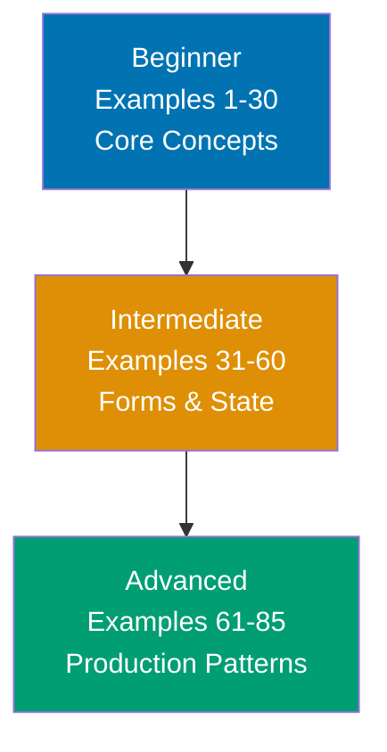

**Want to master Phoenix LiveView through working examples?** This by-example guide teaches 95% of Phoenix LiveView through 85 annotated code examples organized by complexity level.

## What Is By-Example Learning?

By-example learning is an **example-first approach** where you learn through annotated, runnable code rather than narrative explanations. Each example is self-contained, immediately executable in your Phoenix application, and heavily commented to show:

- **What each line does** - Inline comments explain the purpose and mechanism
- **Expected outputs** - Using `# =>` notation to show socket states and DOM updates
- **State transitions** - Socket assigns and component lifecycle made visible
- **Key takeaways** - 1-2 sentence summaries of core patterns

This approach is **ideal for developers with Elixir and Phoenix experience** who want to quickly understand LiveView's real-time capabilities, state management patterns, and interactive features through working code.

Unlike narrative tutorials that build understanding through explanation and storytelling, by-example learning lets you **see the code first, run it second, and understand it through direct interaction**. You learn by doing, not by reading about doing.

## Learning Path


```mermaid
%% Color Palette: Blue #0173B2, Orange #DE8F05, Teal #029E73, Purple #CC78BC, Brown #CA9161
graph TD
    A["Beginner<br/>Examples 1-30<br/>Core Concepts"] --> B["Intermediate<br/>Examples 31-60<br/>Forms & State"]
    B --> C["Advanced<br/>Examples 61-85<br/>Production Patterns"]

    style A fill:#0173B2,color:#fff
    style B fill:#DE8F05,color:#fff
    style C fill:#029E73,color:#fff
```

Progress from LiveView fundamentals through forms and state management to advanced patterns like PubSub, file uploads, and JavaScript interop. Each level builds on the previous, increasing in sophistication and introducing more real-time web development patterns.

## Coverage Philosophy

This by-example guide provides **95% coverage of Phoenix LiveView** through practical, annotated examples. The 95% figure represents the depth and breadth of concepts covered, not a time estimate—focus is on **outcomes and understanding**, not duration.

### What's Covered

- **Core LiveView** - Mount lifecycle, socket state, assigns, rendering with HEEx
- **Templates and rendering** - HEEx syntax, dynamic content, conditionals, loops, function components
- **Events and interactivity** - Click events, form events, key events, debouncing, throttling
- **Forms and validation** - Changesets, live validation, error display, file uploads
- **State management** - Temporary assigns, streams, pagination, live navigation
- **Real-time features** - PubSub subscriptions, broadcast updates, multi-user sync
- **LiveComponents** - Stateful components, lifecycle, component communication, slots
- **JavaScript interop** - JS commands, client hooks, pushEvent/handleEvent
- **Testing** - LiveView testing patterns, form testing, component testing
- **Production patterns** - Handle_params, telemetry, rate limiting, session management

### What's NOT Covered

This guide focuses on **Phoenix LiveView specifically**, not the broader Phoenix ecosystem. For additional topics:

- **Phoenix fundamentals** - Routing, controllers, Ecto covered in Phoenix tutorials
- **Elixir language** - Pattern matching, processes, OTP covered in Elixir tutorials
- **Deep framework internals** - LiveView source code, protocol implementation details
- **Deployment specifics** - Production deployment covered in Phoenix deployment guides

The 95% coverage goal maintains humility—no tutorial can cover everything. This guide teaches the **core LiveView patterns that unlock the remaining 5%** through your own exploration and project work.

## How to Use This Guide

1. **Sequential or selective** - Read examples in order for progressive learning, or jump to specific topics when building real-time features
2. **Run everything** - Implement examples in your Phoenix application to see real-time updates yourself
3. **Modify and explore** - Change event handlers, add assigns, break things intentionally. Learn through experimentation.
4. **Use as reference** - Bookmark examples for quick lookups when implementing interactive features
5. **Complement with narrative tutorials** - By-example learning is code-first; pair with comprehensive tutorials for deeper explanations

**Best workflow**: Open your Phoenix application in one window, this guide in another. Implement each example as you read it. When you encounter something unfamiliar, run the example, modify it, see what changes.

## Relationship to Other Tutorials

Understanding where by-example fits in the tutorial ecosystem helps you choose the right learning path:

| Tutorial Type    | Coverage                | Approach                       | Target Audience             | When to Use                                     |
| ---------------- | ----------------------- | ------------------------------ | --------------------------- | ----------------------------------------------- |
| **By Example**   | 95% through 85 examples | Code-first, annotated examples | Elixir + Phoenix developers | Quick LiveView mastery, reference, feature impl |
| **Quick Start**  | 5-30% touchpoints       | Hands-on project               | Phoenix developers          | First LiveView taste, decide if worth learning  |
| **Beginner**     | 0-60% comprehensive     | Narrative, explanatory         | New to LiveView             | Deep understanding, real-time concepts          |
| **Intermediate** | 60-85%                  | Practical applications         | Past LiveView basics        | Production patterns, complex interactions       |
| **Advanced**     | 85-95%                  | Complex systems                | Experienced LiveView devs   | Performance optimization, scaling               |
| **Cookbook**     | Problem-specific        | Recipe-based                   | All levels                  | Solve specific real-time problems               |

**By Example vs. Quick Start**: By Example provides 95% coverage through examples vs. Quick Start's 5-30% through a single project. By Example is code-first reference; Quick Start is hands-on introduction.

**By Example vs. Beginner Tutorial**: By Example is code-first for experienced Elixir/Phoenix developers; Beginner Tutorial is narrative-first for developers new to real-time web. By Example shows patterns; Beginner Tutorial explains concepts.

**By Example vs. Cookbook**: By Example is learning-oriented (understand patterns); Cookbook is problem-solving oriented (fix specific issues). By Example teaches LiveView; Cookbook provides solutions.

## Prerequisites

**Required**:

- **Elixir proficiency** - Comfortable with pattern matching, processes, modules
- **Phoenix fundamentals** - Understand routing, controllers, Ecto, templates
- **Ability to run Phoenix applications** - Can start a Phoenix server and navigate to LiveViews

**Recommended (helpful but not required)**:

- Familiarity with reactive web frameworks (React, Vue, Svelte)
- Understanding of WebSocket communication
- Experience with server-side rendering concepts

**No prior LiveView experience required** - This guide assumes you're new to LiveView but experienced with Elixir and Phoenix. You should be comfortable reading Elixir code, understanding Phoenix applications, and learning through hands-on experimentation.

## Structure of Each Example

Every example follows this consistent format:

````markdown
### Example N: Concept Name

Brief explanation of the concept in 2-3 sentences. Explains **what** the LiveView pattern is and **why** it matters for real-time web applications.

[OPTIONAL: Mermaid diagram when state transitions or component relationships need visualization]

**Code**:

```elixir
defmodule MyAppWeb.ExampleLive do
  use MyAppWeb, :live_view

  # Mount callback - initializes socket state
  def mount(_params, _session, socket) do
    # Initial assigns set here
    socket = assign(socket, :count, 0) # => count is 0
    {:ok, socket} # => LiveView mounted, ready to render
  end

  # Event handler - updates state from user interaction
  def handle_event("increment", _params, socket) do
    # Update count assign
    socket = update(socket, :count, &(&1 + 1)) # => count incremented by 1
    {:noreply, socket} # => Re-render with new state
  end

  # Template rendering
  def render(assigns) do
    ~H"""
    <div>
      <p>Count: <%= @count %></p>
      <button phx-click="increment">Increment</button>
    </div>
    """
  end
end
```

**Key Takeaway**: 1-2 sentence summary highlighting the most important insight or pattern from this example.
````

The **brief explanation** provides context. The **code** is heavily annotated with inline comments and `# =>` output notation showing socket state changes. The **key takeaway** distills the pattern to its essence.

Mermaid diagrams appear when **visual representation clarifies state transitions** - showing lifecycle flows, component hierarchies, or event propagation. Not every example needs a diagram; they're used strategically to enhance understanding.

## Learning Strategies

### For React/Vue Developers

You're used to component state and reactive updates. LiveView will feel familiar yet fundamentally different:

- **Server-side state**: State lives on server, not client browser
- **Automatic diffing**: LiveView handles DOM updates, no virtual DOM needed
- **Event binding**: Use `phx-*` attributes instead of `onClick` handlers
- **No JavaScript required**: Most interactions work without custom client code

Focus on Examples 1-10 (mount and lifecycle), Examples 11-20 (templates and rendering), and Examples 21-30 (events) to build LiveView intuition.

### For HTMX Users

You understand HTML-over-the-wire. LiveView extends this with persistent connections:

- **WebSocket instead of polling**: Persistent connection for instant updates
- **Stateful interactions**: Server maintains state between interactions
- **Real-time updates**: PubSub enables multi-user synchronization
- **Component composition**: Reusable LiveComponents for complex UIs

Focus on Examples 31-40 (forms), Examples 51-55 (PubSub), and Examples 61-70 (LiveComponents) to leverage your HTML-first mindset.

### For Traditional Server-Side Developers

You're used to request/response cycles. LiveView maintains connection state:

- **Persistent connections**: WebSocket keeps connection alive between interactions
- **No full page reloads**: Only changed parts of DOM update
- **Socket state**: Think session state but with automatic synchronization
- **Event-driven updates**: User actions trigger server functions that update UI

Focus on Examples 1-15 (core concepts), Examples 41-50 (state management), and Examples 71-75 (JavaScript interop) to understand the LiveView model.

### For Elixir Backend Developers

You know Elixir and Phoenix. LiveView adds real-time interactivity:

- **Processes for connections**: Each LiveView is a GenServer process
- **Assigns as state**: Socket assigns are like GenServer state
- **Pattern match events**: Handle_event uses pattern matching like handle_call
- **PubSub for broadcast**: Phoenix.PubSub enables real-time multi-user features

Focus on Examples 51-55 (PubSub), Examples 61-70 (LiveComponents), and Examples 81-85 (production patterns) to see LiveView's OTP foundations.

## Code-First Philosophy

This tutorial prioritizes working code over theoretical discussion:

- **No lengthy prose**: Patterns are demonstrated, not explained at length
- **Runnable examples**: Every example runs in a Phoenix LiveView application
- **Learn by doing**: Understanding comes from implementing and modifying code
- **Pattern recognition**: See the same patterns in different contexts across 85 examples

If you prefer narrative explanations, complement this guide with comprehensive LiveView tutorials. By-example learning works best when you learn through experimentation.

## Ready to Start?

Jump into the beginner examples to start learning Phoenix LiveView through code:

- [Beginner Examples (1-30)](/en/learn/software-engineering/platform-web/tools/elixir-phoenix-liveview/by-example/beginner) - Core concepts, templates, events, interactivity
- [Intermediate Examples (31-60)](/en/learn/software-engineering/platform-web/tools/elixir-phoenix-liveview/by-example/intermediate) - Forms, state management, PubSub, file uploads
- [Advanced Examples (61-85)](/en/learn/software-engineering/platform-web/tools/elixir-phoenix-liveview/by-example/advanced) - LiveComponents, JavaScript interop, testing, production patterns

Each example is self-contained and runnable. Start with Example 1, or jump to topics that interest you most.

## Examples by Level

### Beginner (Examples 1–30)

- [Example 1: Hello World LiveView](/en/learn/software-engineering/platform-web/tools/elixir-phoenix-liveview/by-example/beginner#example-1-hello-world-liveview)
- [Example 2: Mount Lifecycle with Initial State](/en/learn/software-engineering/platform-web/tools/elixir-phoenix-liveview/by-example/beginner#example-2-mount-lifecycle-with-initial-state)
- [Example 3: Rendering with HEEx Sigil](/en/learn/software-engineering/platform-web/tools/elixir-phoenix-liveview/by-example/beginner#example-3-rendering-with-heex-sigil)
- [Example 4: Handle Event Basics](/en/learn/software-engineering/platform-web/tools/elixir-phoenix-liveview/by-example/beginner#example-4-handle-event-basics)
- [Example 5: Update Assigns with update/3](/en/learn/software-engineering/platform-web/tools/elixir-phoenix-liveview/by-example/beginner#example-5-update-assigns-with-update3)
- [Example 6: LiveView Lifecycle Flow](/en/learn/software-engineering/platform-web/tools/elixir-phoenix-liveview/by-example/beginner#example-6-liveview-lifecycle-flow)
- [Example 7: Initial vs Dynamic State](/en/learn/software-engineering/platform-web/tools/elixir-phoenix-liveview/by-example/beginner#example-7-initial-vs-dynamic-state)
- [Example 8: Debugging LiveView State](/en/learn/software-engineering/platform-web/tools/elixir-phoenix-liveview/by-example/beginner#example-8-debugging-liveview-state)
- [Example 9: Multiple Assigns in One Operation](/en/learn/software-engineering/platform-web/tools/elixir-phoenix-liveview/by-example/beginner#example-9-multiple-assigns-in-one-operation)
- [Example 10: Connected vs Disconnected Mount](/en/learn/software-engineering/platform-web/tools/elixir-phoenix-liveview/by-example/beginner#example-10-connected-vs-disconnected-mount)
- [Example 11: HEEx Template Syntax Deep Dive](/en/learn/software-engineering/platform-web/tools/elixir-phoenix-liveview/by-example/beginner#example-11-heex-template-syntax-deep-dive)
- [Example 12: Dynamic Content Rendering](/en/learn/software-engineering/platform-web/tools/elixir-phoenix-liveview/by-example/beginner#example-12-dynamic-content-rendering)
- [Example 13: Conditional Rendering with if/unless](/en/learn/software-engineering/platform-web/tools/elixir-phoenix-liveview/by-example/beginner#example-13-conditional-rendering-with-ifunless)
- [Example 14: Looping with for Comprehension](/en/learn/software-engineering/platform-web/tools/elixir-phoenix-liveview/by-example/beginner#example-14-looping-with-for-comprehension)
- [Example 15: Function Components Basics](/en/learn/software-engineering/platform-web/tools/elixir-phoenix-liveview/by-example/beginner#example-15-function-components-basics)
- [Example 16: Slots Basics](/en/learn/software-engineering/platform-web/tools/elixir-phoenix-liveview/by-example/beginner#example-16-slots-basics)
- [Example 17: LiveComponent Basics](/en/learn/software-engineering/platform-web/tools/elixir-phoenix-liveview/by-example/beginner#example-17-livecomponent-basics)
- [Example 18: Component Attributes](/en/learn/software-engineering/platform-web/tools/elixir-phoenix-liveview/by-example/beginner#example-18-component-attributes)
- [Example 19: CSS Classes and Dynamic Styling](/en/learn/software-engineering/platform-web/tools/elixir-phoenix-liveview/by-example/beginner#example-19-css-classes-and-dynamic-styling)
- [Example 20: SVG and Icons in Templates](/en/learn/software-engineering/platform-web/tools/elixir-phoenix-liveview/by-example/beginner#example-20-svg-and-icons-in-templates)
- [Example 21: Click Events with phx-click](/en/learn/software-engineering/platform-web/tools/elixir-phoenix-liveview/by-example/beginner#example-21-click-events-with-phx-click)
- [Example 22: Form Events - phx-change and phx-submit](/en/learn/software-engineering/platform-web/tools/elixir-phoenix-liveview/by-example/beginner#example-22-form-events---phx-change-and-phx-submit)
- [Example 23: Keyboard Events](/en/learn/software-engineering/platform-web/tools/elixir-phoenix-liveview/by-example/beginner#example-23-keyboard-events)
- [Example 24: Focus Events](/en/learn/software-engineering/platform-web/tools/elixir-phoenix-liveview/by-example/beginner#example-24-focus-events)
- [Example 25: Window Events](/en/learn/software-engineering/platform-web/tools/elixir-phoenix-liveview/by-example/beginner#example-25-window-events)
- [Example 26: Event Values and Targets](/en/learn/software-engineering/platform-web/tools/elixir-phoenix-liveview/by-example/beginner#example-26-event-values-and-targets)
- [Example 27: Debouncing Events](/en/learn/software-engineering/platform-web/tools/elixir-phoenix-liveview/by-example/beginner#example-27-debouncing-events)
- [Example 28: Throttling Events](/en/learn/software-engineering/platform-web/tools/elixir-phoenix-liveview/by-example/beginner#example-28-throttling-events)
- [Example 29: Event Parameters with phx-value-\*](/en/learn/software-engineering/platform-web/tools/elixir-phoenix-liveview/by-example/beginner#example-29-event-parameters-with-phx-value-)
- [Example 30: Preventing Default Behavior](/en/learn/software-engineering/platform-web/tools/elixir-phoenix-liveview/by-example/beginner#example-30-preventing-default-behavior)

### Intermediate (Examples 31–60)

- [Example 31: Form Basics with Changesets](/en/learn/software-engineering/platform-web/tools/elixir-phoenix-liveview/by-example/intermediate#example-31-form-basics-with-changesets)
- [Example 32: Form Validation - Live Error Display](/en/learn/software-engineering/platform-web/tools/elixir-phoenix-liveview/by-example/intermediate#example-32-form-validation---live-error-display)
- [Example 33: Multi-field Forms](/en/learn/software-engineering/platform-web/tools/elixir-phoenix-liveview/by-example/intermediate#example-33-multi-field-forms)
- [Example 34: Nested Forms - Embedded Schemas](/en/learn/software-engineering/platform-web/tools/elixir-phoenix-liveview/by-example/intermediate#example-34-nested-forms---embedded-schemas)
- [Example 35: Form Recovery - phx-auto-recover](/en/learn/software-engineering/platform-web/tools/elixir-phoenix-liveview/by-example/intermediate#example-35-form-recovery---phx-auto-recover)
- [Example 36: Submit Without Page Reload](/en/learn/software-engineering/platform-web/tools/elixir-phoenix-liveview/by-example/intermediate#example-36-submit-without-page-reload)
- [Example 37: Form Input Types - Text, Checkbox, Select](/en/learn/software-engineering/platform-web/tools/elixir-phoenix-liveview/by-example/intermediate#example-37-form-input-types---text-checkbox-select)
- [Example 38: Custom Form Components](/en/learn/software-engineering/platform-web/tools/elixir-phoenix-liveview/by-example/intermediate#example-38-custom-form-components)
- [Example 39: File Upload Basics](/en/learn/software-engineering/platform-web/tools/elixir-phoenix-liveview/by-example/intermediate#example-39-file-upload-basics)
- [Example 40: Form Progress Tracking](/en/learn/software-engineering/platform-web/tools/elixir-phoenix-liveview/by-example/intermediate#example-40-form-progress-tracking)
- [Example 41: Temporary Assigns](/en/learn/software-engineering/platform-web/tools/elixir-phoenix-liveview/by-example/intermediate#example-41-temporary-assigns)
- [Example 42: assign_new for Lazy Evaluation](/en/learn/software-engineering/platform-web/tools/elixir-phoenix-liveview/by-example/intermediate#example-42-assign_new-for-lazy-evaluation)
- [Example 43: Update Patterns - update/3](/en/learn/software-engineering/platform-web/tools/elixir-phoenix-liveview/by-example/intermediate#example-43-update-patterns---update3)
- [Example 44: Stream Collections](/en/learn/software-engineering/platform-web/tools/elixir-phoenix-liveview/by-example/intermediate#example-44-stream-collections)
- [Example 45: Reset Stream on Disconnect](/en/learn/software-engineering/platform-web/tools/elixir-phoenix-liveview/by-example/intermediate#example-45-reset-stream-on-disconnect)
- [Example 46: Pagination with Streams](/en/learn/software-engineering/platform-web/tools/elixir-phoenix-liveview/by-example/intermediate#example-46-pagination-with-streams)
- [Example 47: Infinite Scroll](/en/learn/software-engineering/platform-web/tools/elixir-phoenix-liveview/by-example/intermediate#example-47-infinite-scroll)
- [Example 48: Live Navigation - patch vs navigate](/en/learn/software-engineering/platform-web/tools/elixir-phoenix-liveview/by-example/intermediate#example-48-live-navigation---patch-vs-navigate)
- [Example 49: Query Parameters](/en/learn/software-engineering/platform-web/tools/elixir-phoenix-liveview/by-example/intermediate#example-49-query-parameters)
- [Example 50: Flash Messages](/en/learn/software-engineering/platform-web/tools/elixir-phoenix-liveview/by-example/intermediate#example-50-flash-messages)
- [Example 51: Phoenix.PubSub Basics](/en/learn/software-engineering/platform-web/tools/elixir-phoenix-liveview/by-example/intermediate#example-51-phoenixpubsub-basics)
- [Example 52: Subscribe to Multiple Topics](/en/learn/software-engineering/platform-web/tools/elixir-phoenix-liveview/by-example/intermediate#example-52-subscribe-to-multiple-topics)
- [Example 53: Broadcast Updates](/en/learn/software-engineering/platform-web/tools/elixir-phoenix-liveview/by-example/intermediate#example-53-broadcast-updates)
- [Example 54: handle_info for PubSub Messages](/en/learn/software-engineering/platform-web/tools/elixir-phoenix-liveview/by-example/intermediate#example-54-handle_info-for-pubsub-messages)
- [Example 55: Multi-user Synchronization](/en/learn/software-engineering/platform-web/tools/elixir-phoenix-liveview/by-example/intermediate#example-55-multi-user-synchronization)
- [Example 56: Upload Configuration](/en/learn/software-engineering/platform-web/tools/elixir-phoenix-liveview/by-example/intermediate#example-56-upload-configuration)
- [Example 57: Progress Tracking](/en/learn/software-engineering/platform-web/tools/elixir-phoenix-liveview/by-example/intermediate#example-57-progress-tracking)
- [Example 58: File Validation](/en/learn/software-engineering/platform-web/tools/elixir-phoenix-liveview/by-example/intermediate#example-58-file-validation)
- [Example 59: Consume Uploaded Entries](/en/learn/software-engineering/platform-web/tools/elixir-phoenix-liveview/by-example/intermediate#example-59-consume-uploaded-entries)
- [Example 60: Multiple Upload Configurations](/en/learn/software-engineering/platform-web/tools/elixir-phoenix-liveview/by-example/intermediate#example-60-multiple-upload-configurations)

### Advanced (Examples 61–85)

- [Example 61: Stateful LiveComponent with Own State](/en/learn/software-engineering/platform-web/tools/elixir-phoenix-liveview/by-example/advanced#example-61-stateful-livecomponent-with-own-state)
- [Example 62: LiveComponent Lifecycle - update/2 Flow](/en/learn/software-engineering/platform-web/tools/elixir-phoenix-liveview/by-example/advanced#example-62-livecomponent-lifecycle---update2-flow)
- [Example 63: Component-to-Component Communication via Parent](/en/learn/software-engineering/platform-web/tools/elixir-phoenix-liveview/by-example/advanced#example-63-component-to-component-communication-via-parent)
- [Example 64: send_update for External Component Updates](/en/learn/software-engineering/platform-web/tools/elixir-phoenix-liveview/by-example/advanced#example-64-send_update-for-external-component-updates)
- [Example 65: LiveComponent Events with Payload](/en/learn/software-engineering/platform-web/tools/elixir-phoenix-liveview/by-example/advanced#example-65-livecomponent-events-with-payload)
- [Example 66: Slots and Named Slots](/en/learn/software-engineering/platform-web/tools/elixir-phoenix-liveview/by-example/advanced#example-66-slots-and-named-slots)
- [Example 67: Render Slots with Slot Attributes](/en/learn/software-engineering/platform-web/tools/elixir-phoenix-liveview/by-example/advanced#example-67-render-slots-with-slot-attributes)
- [Example 68: Dynamic Components](/en/learn/software-engineering/platform-web/tools/elixir-phoenix-liveview/by-example/advanced#example-68-dynamic-components)
- [Example 69: Component Composition Patterns](/en/learn/software-engineering/platform-web/tools/elixir-phoenix-liveview/by-example/advanced#example-69-component-composition-patterns)
- [Example 70: Component Testing](/en/learn/software-engineering/platform-web/tools/elixir-phoenix-liveview/by-example/advanced#example-70-component-testing)
- [Example 71: JS Commands - push and navigate](/en/learn/software-engineering/platform-web/tools/elixir-phoenix-liveview/by-example/advanced#example-71-js-commands---push-and-navigate)
- [Example 72: Client Hooks Basics](/en/learn/software-engineering/platform-web/tools/elixir-phoenix-liveview/by-example/advanced#example-72-client-hooks-basics)
- [Example 73: Hook Lifecycle - mounted, updated, destroyed](/en/learn/software-engineering/platform-web/tools/elixir-phoenix-liveview/by-example/advanced#example-73-hook-lifecycle---mounted-updated-destroyed)
- [Example 74: pushEvent from Client](/en/learn/software-engineering/platform-web/tools/elixir-phoenix-liveview/by-example/advanced#example-74-pushevent-from-client)
- [Example 75: handleEvent on Client](/en/learn/software-engineering/platform-web/tools/elixir-phoenix-liveview/by-example/advanced#example-75-handleevent-on-client)
- [Example 76: LiveView Testing Basics - render and render_click](/en/learn/software-engineering/platform-web/tools/elixir-phoenix-liveview/by-example/advanced#example-76-liveview-testing-basics---render-and-render_click)
- [Example 77: Testing Forms with render_submit](/en/learn/software-engineering/platform-web/tools/elixir-phoenix-liveview/by-example/advanced#example-77-testing-forms-with-render_submit)
- [Example 78: Testing File Uploads](/en/learn/software-engineering/platform-web/tools/elixir-phoenix-liveview/by-example/advanced#example-78-testing-file-uploads)
- [Example 79: Testing LiveComponents](/en/learn/software-engineering/platform-web/tools/elixir-phoenix-liveview/by-example/advanced#example-79-testing-livecomponents)
- [Example 80: Testing with Async/Await Patterns](/en/learn/software-engineering/platform-web/tools/elixir-phoenix-liveview/by-example/advanced#example-80-testing-with-asyncawait-patterns)
- [Example 81: handle_params for URL Changes](/en/learn/software-engineering/platform-web/tools/elixir-phoenix-liveview/by-example/advanced#example-81-handle_params-for-url-changes)
- [Example 82: LiveView Telemetry for Monitoring](/en/learn/software-engineering/platform-web/tools/elixir-phoenix-liveview/by-example/advanced#example-82-liveview-telemetry-for-monitoring)
- [Example 83: Rate Limiting and Security](/en/learn/software-engineering/platform-web/tools/elixir-phoenix-liveview/by-example/advanced#example-83-rate-limiting-and-security)
- [Example 84: Optimizing Rendering with Temporary Assigns](/en/learn/software-engineering/platform-web/tools/elixir-phoenix-liveview/by-example/advanced#example-84-optimizing-rendering-with-temporary-assigns)
- [Example 85: Session and Token Management](/en/learn/software-engineering/platform-web/tools/elixir-phoenix-liveview/by-example/advanced#example-85-session-and-token-management)
